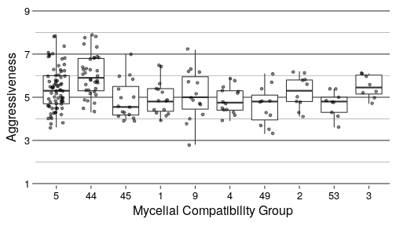
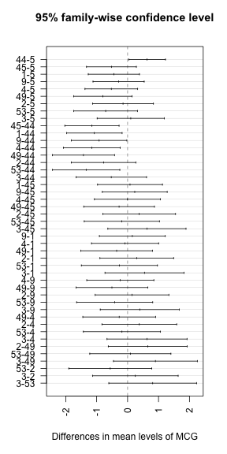
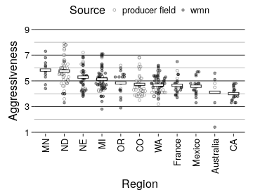
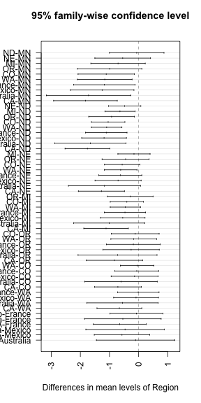
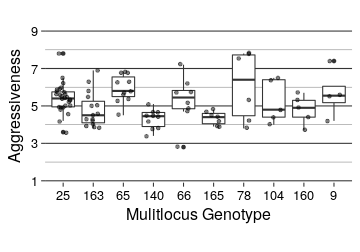
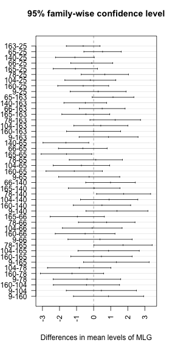

```r
library("tidyverse")
dir.create(file.path(PROJHOME, "results", "tables"))
```

# Purpose

This document is to assess virulence associated with the 10 most common MCGs. We
can get this from the cleaned data set that we saved in the
`data-comparison.Rmd` file. Note, we will be labelling the plot with 
"Aggressiveness" as that is the preferred term.


```r
datcols <- cols(
  .default = col_integer(),
  Severity = col_double(),
  Region = col_character(),
  Source = col_character(),
  Host = col_character()
)
dat <- read_csv(file.path(PROJHOME, "data", "clean_data.csv"), col_types = datcols) %>%
  select(Severity, MCG, Region, Source, Year)
dat
```

```
## # A tibble: 366 x 5
##    Severity   MCG Region Source  Year
##       <dbl> <int>  <chr>  <chr> <int>
##  1      3.9     4     NE    unk  2003
##  2      5.4    45     NE    unk  2003
##  3      6.3     5     NY    unk  2003
##  4      4.4     4     MN    wmn  2003
##  5      4.7     4     MN    wmn  2003
##  6      6.1     3     MI    wmn  2003
##  7      5.5     5     MI    wmn  2003
##  8      5.0     3     MI    wmn  2003
##  9      5.2     3     MI    wmn  2003
## 10      5.3     5     MI    wmn  2003
## # ... with 356 more rows
```

Now, I can filter out the top 10 MCGs:


```r
top_mcg <- dat %>% 
  group_by(MCG) %>%
  summarize(N = n()) %>%
  arrange(desc(N)) %>%
  slice(1:10) %>% 
  inner_join(dat, by = "MCG") %>%
  select(MCG, Severity) %>%
  mutate(MCG = forcats::fct_inorder(as.character(MCG)))
top_mcg
```

```
## # A tibble: 207 x 2
##       MCG Severity
##    <fctr>    <dbl>
##  1      5      6.3
##  2      5      5.5
##  3      5      5.3
##  4      5      6.0
##  5      5      5.2
##  6      5      5.8
##  7      5      6.2
##  8      5      5.3
##  9      5      4.3
## 10      5      4.5
## # ... with 197 more rows
```

# Assessing virulence by MCG


```r
set.seed(2017-06-29)
ggplot(top_mcg, aes(x = MCG, y = Severity)) +
  geom_boxplot() +
  geom_point(position = position_jitter(width = 0.25), alpha = 0.5) +
  scale_y_continuous(limits = c(1, 9), breaks = c(1, 3, 5, 7, 9), expand = c(0, 0.1)) +
  # scale_x_discrete(position = "top") +
  theme_bw(base_size = 16, base_family = "Helvetica") +
  theme(aspect.ratio = 1/2) +
  theme(axis.text = element_text(color = "black")) +
  # theme(axis.ticks.x = element_blank()) +
  theme(panel.grid.major = element_line(colour = "grey20")) +
  theme(panel.grid.minor = element_line(colour = "grey50")) +
  theme(panel.grid.major.x = element_blank()) +
  theme(panel.border = element_blank()) +
  labs(list(
    # title = "Aggressiveness for the top 10 MCGs",
    y = "Aggressiveness",
    x = "Mycelial Compatibility Group"
    ))
```




```r
top_mcg %>% 
  group_by(MCG) %>%
  summarize(N = n(), 
            `Min Aggressiveness` = min(Severity),
            `Max Aggressiveness` = max(Severity),
            `Average Aggressiveness` = mean(Severity)
            ) %>%
  knitr::kable(digits = 2)
```


|MCG |  N| Min Aggressiveness| Max Aggressiveness| Average Aggressiveness|
|:---|--:|------------------:|------------------:|----------------------:|
|5   | 73|                3.6|                7.8|                   5.40|
|44  | 36|                4.3|                7.9|                   6.03|
|45  | 16|                3.9|                7.0|                   4.88|
|1   | 15|                3.9|                6.5|                   4.95|
|9   | 15|                2.8|                7.2|                   5.11|
|4   | 14|                3.9|                5.9|                   4.87|
|49  | 11|                3.3|                6.1|                   4.60|
|2   | 10|                4.1|                6.2|                   5.25|
|53  |  9|                3.6|                5.4|                   4.69|
|3   |  8|                4.7|                6.1|                   5.50|


## ANOVA

The default ANOVA in R sets contrasts as `contrast.treatment`, which compares
everything to the first factor, considered the treatment. Since we are
interested in whether or not there IS a difference between samples, this will
be sufficient.

After the ANOVA, we performed a Tukey's Honest Significant Difference test to
see exactly what groups these fell into.


```r
ANOVA <- aov(Severity ~ MCG, data = top_mcg)
ANOVA
```

```
## Call:
##    aov(formula = Severity ~ MCG, data = top_mcg)
## 
## Terms:
##                       MCG Residuals
## Sum of Squares   36.67876 163.83080
## Deg. of Freedom         9       197
## 
## Residual standard error: 0.9119366
## Estimated effects may be unbalanced
```

```r
summary(ANOVA)
```

```
##              Df Sum Sq Mean Sq F value   Pr(>F)    
## MCG           9  36.68   4.075   4.901 6.19e-06 ***
## Residuals   197 163.83   0.832                     
## ---
## Signif. codes:  0 '***' 0.001 '**' 0.01 '*' 0.05 '.' 0.1 ' ' 1
```

```r
plot(TukeyHSD(ANOVA, conf.level = 0.95), las = 2)
```



```r
grps <- agricolae::HSD.test(ANOVA, "MCG", alpha = 0.05)$groups

grps %>% 
  tibble::rownames_to_column("MCG") %>%
  dplyr::rename(Group = groups) %>%
  dplyr::rename(`Mean Aggressiveness` = Severity) %>%
  readr::write_csv(path = "results/tables/MCG-aggressiveness.csv", col_names = TRUE) %>%
  huxtable::as_huxtable(add_colnames = TRUE) %>%
  huxtable::set_number_format(row = huxtable::everywhere, col = 1, 0) %>% 
  huxtable::set_col_width(c(0.05, 0.3, 0.08)) %>%
  huxtable::set_align(row = huxtable::everywhere, col = 2, "right") %>%
  huxtable::print_md(max_width = 31)
```

```
## ------------------------------
##  MCG               Mean Group 
##          Aggressiveness       
## ---- ------------------ ------
##  44                6.03 a     
##                               
##  3                 5.50 ab    
##                               
##  5                 5.40 b     
##                               
##  2                 5.25 b     
##                               
##  9                 5.11 b     
##                               
##  1                 4.95 b     
##                               
##  45                4.88 b     
##                               
##  4                 4.87 b     
##                               
##  53                4.69 b     
##                               
##  49                4.60 b     
## ------------------------------
```

There appears to be a significant effect at p = 6.189e-06.

# Assessing Virulence by Region

Since this was done in Otto-Hanson *et al.*, it would be a good idea for us to 
assess this as well.


```r
set.seed(2017-06-29)
region_dat <- dat %>%
  group_by(Region) %>%
  filter(n() > 5) %>%
  mutate(mean_sev = mean(Severity)) %>%
  mutate(Source = ifelse(Source == "wmn", "wmn", "producer field")) %>%
  arrange(desc(mean_sev)) %>%
  ungroup() %>%
  mutate(Region = forcats::fct_inorder(Region)) %>%
  select(Region, Severity, Source)

plot.mean <- function(x) {
  m <- mean(x, na.rm = TRUE)
  c(y = m, ymin = m, ymax = m)
}

set.seed(2017-09-06)
ggplot(region_dat, aes(x = Region, y = Severity)) +
  ggforce::geom_sina(aes(fill = Source), 
                     pch = 21, 
                     binwidth = 0.1, 
                     alpha = 0.4) +
  # geom_point(aes(fill = Source), 
  #            pch = 21, 
  #            position = position_jitter(width = 0.25), 
  #            alpha = 0.35) +
  # geom_boxplot(alpha = 0.5) +
  stat_summary(fun.data = plot.mean, geom = "errorbar", colour = "black", width = 0.6, size = 2, alpha = 0.5) +
  stat_summary(fun.data = plot.mean, geom = "errorbar", colour = "white", width = 0.5, size = 1, alpha = 1) +
  scale_y_continuous(limits = c(1, 9), breaks = c(1, 3, 5, 7, 9), expand = c(0, 0.1)) +
  scale_fill_manual(values = rev(c("black", "white"))) +
  theme_bw(base_size = 16, base_family = "Helvetica") +
  theme(aspect.ratio = 1/2) +
  theme(axis.text = element_text(color = "black")) +
  theme(axis.text.x = element_text(angle = 90, hjust = 1, vjust = 0.5)) +
  theme(panel.grid.major = element_line(colour = "grey20")) +
  theme(panel.grid.minor = element_line(colour = "grey50")) +
  theme(panel.grid.major.x = element_blank()) +
  theme(panel.border = element_blank()) +
  theme(legend.position = "top") +
  theme(plot.margin = unit(c(0, 0, 0, 0), "lines")) +
  labs(list(
    y = "Aggressiveness",
    x = "Region"
    ))
```



```r
if (!interactive()){
  ggsave(file.path("results", "figures", "publication", "aggressiveness.pdf"),
         width = 88, units = "mm")
}
```

```
## Saving 88 x 95.2 mm image
```


```r
region_dat %>%
  group_by(Region) %>%
  summarize(N = n(), 
            `Min Aggressiveness` = min(Severity),
            `Max Aggressiveness` = max(Severity),
            `Average Aggressiveness` = mean(Severity),
            `Median Aggressiveness` = median(Severity)
            ) %>%
  knitr::kable(digits = 2)
```


|Region    |  N| Min Aggressiveness| Max Aggressiveness| Average Aggressiveness| Median Aggressiveness|
|:---------|--:|------------------:|------------------:|----------------------:|---------------------:|
|MN        | 11|                4.4|                7.3|                   5.84|                  5.80|
|ND        | 60|                3.3|                7.9|                   5.77|                  5.80|
|NE        | 47|                3.8|                7.2|                   5.29|                  5.30|
|MI        | 62|                2.8|                7.1|                   5.13|                  5.05|
|OR        | 17|                2.9|                6.2|                   4.84|                  5.30|
|CO        | 42|                3.5|                6.8|                   4.72|                  4.50|
|WA        | 59|                3.2|                6.2|                   4.67|                  4.60|
|France    | 22|                3.7|                6.5|                   4.66|                  4.50|
|Mexico    | 18|                3.3|                5.7|                   4.58|                  4.60|
|Australia |  6|                1.4|                5.6|                   4.12|                  4.65|
|CA        | 18|                3.3|                4.8|                   4.01|                  3.90|

```r
ANOVA <- aov(Severity ~ Region, data = region_dat)
ANOVA
```

```
## Call:
##    aov(formula = Severity ~ Region, data = region_dat)
## 
## Terms:
##                    Region Residuals
## Sum of Squares   86.07026 271.68215
## Deg. of Freedom        10       351
## 
## Residual standard error: 0.8797859
## Estimated effects may be unbalanced
```

```r
summary(ANOVA)
```

```
##              Df Sum Sq Mean Sq F value Pr(>F)    
## Region       10  86.07   8.607   11.12 <2e-16 ***
## Residuals   351 271.68   0.774                   
## ---
## Signif. codes:  0 '***' 0.001 '**' 0.01 '*' 0.05 '.' 0.1 ' ' 1
```

```r
plot(TukeyHSD(ANOVA, conf.level = 0.95), las = 2)
```



```r
grps <- agricolae::HSD.test(ANOVA, "Region", alpha = 0.05)$groups %>% 
  tibble::rownames_to_column("Region") %>%
  dplyr::rename(Group = groups) %>%
  dplyr::rename(`Mean Aggressiveness` = Severity) %>%
  readr::write_csv(path = "results/tables/Region-aggressiveness.csv", col_names = TRUE) %>%
  huxtable::as_huxtable(add_colnames = TRUE) %>%
  huxtable::set_number_format(row = huxtable::everywhere, col = 1, 0) %>% 
  huxtable::set_col_width(c(0.13, 0.25, 0.08)) %>%
  huxtable::set_align(row = huxtable::everywhere, col = 2, "right") %>%
  huxtable::print_md(max_width = 40)
```

```
## -------------------------------------
##  Region    Mean Aggressiveness Group 
## ---------- ------------------- ------
##  MN                       5.84 a     
##                                      
##  ND                       5.77 a     
##                                      
##  NE                       5.29 ab    
##                                      
##  MI                       5.13 abc   
##                                      
##  OR                       4.84 abcd  
##                                      
##  CO                       4.72 bcd   
##                                      
##  WA                       4.67 cd    
##                                      
##  France                   4.66 cd    
##                                      
##  Mexico                   4.58 cd    
##                                      
##  Australia                4.12 cd    
##                                      
##  CA                       4.01 d     
## -------------------------------------
```


## Testing for differences by assessor

The straw test, until the end of 2007, was performed by Lindsey Otto-Hanson. 
After that, these were performed by Serena McCoy. The Steadman lab was careful
to train their members consistently in these practices, so the results from this
test should be equivalent, but we want to ensure that there are no hidden biases
between the two. To do this, we will test for differences within region.


```r
set.seed(2017-06-29)
assessor_dat <- dat %>%
  group_by(Region, Year) %>%
  filter(n() > 5) %>%
  mutate(mean_sev = mean(Severity)) %>%
  mutate(Source = ifelse(Source == "wmn", "wmn", "producer field")) %>%
  arrange(desc(mean_sev)) %>%
  ungroup() %>%
  mutate(Region = forcats::fct_inorder(Region)) %>%
  mutate(Assessor = factor(ifelse(Year <= 2007, "Otto-Hanson", "McCoy"))) %>% 
  select(Region, Assessor, Severity, Source)
res <- aov(Severity ~ Region + Assessor, data = assessor_dat)
res
```

```
## Call:
##    aov(formula = Severity ~ Region + Assessor, data = assessor_dat)
## 
## Terms:
##                    Region  Assessor Residuals
## Sum of Squares   90.54166   0.29254 259.36272
## Deg. of Freedom        10         1       339
## 
## Residual standard error: 0.8746895
## Estimated effects may be unbalanced
```

```r
summary(res)
```

```
##              Df Sum Sq Mean Sq F value Pr(>F)    
## Region       10  90.54   9.054  11.834 <2e-16 ***
## Assessor      1   0.29   0.293   0.382  0.537    
## Residuals   339 259.36   0.765                   
## ---
## Signif. codes:  0 '***' 0.001 '**' 0.01 '*' 0.05 '.' 0.1 ' ' 1
```

# Assessing virulence by multilocus genotype


```r
library("poppr")
```

```
## Loading required package: adegenet
```

```
## Loading required package: ade4
```

```
## 
##    /// adegenet 2.1.0 is loaded ////////////
## 
##    > overview: '?adegenet'
##    > tutorials/doc/questions: 'adegenetWeb()' 
##    > bug reports/feature requests: adegenetIssues()
```

```
## This is poppr version 2.5.0. To get started, type package?poppr
## OMP parallel support: available
```

```r
load(file.path("data", "sclerotinia_16_loci.rda"))
strat <- strata(dat11) %>% 
  add_column(MLG = mll(dat11)) %>%
  add_column(Severity = other(dat11)$meta$Severity)
top_mlg <- strat %>% 
  group_by(MLG) %>%
  summarize(N = n()) %>%
  arrange(desc(N)) %>%
  slice(1:10) %>% 
  inner_join(strat, by = "MLG") %>%
  select(MLG, Severity) %>%
  mutate(MLG = forcats::fct_inorder(as.character(MLG)))
set.seed(2017-06-29)
ggplot(top_mlg, aes(x = MLG, y = Severity)) +
  geom_boxplot() +
  geom_point(position = position_jitter(width = 0.25), alpha = 0.5) +
  scale_y_continuous(limits = c(1, 9), breaks = c(1, 3, 5, 7, 9), expand = c(0, 0.1)) +
  # scale_x_discrete(position = "top") +
  theme_bw(base_size = 16, base_family = "Helvetica") +
  theme(aspect.ratio = 1/2) +
  theme(axis.text = element_text(color = "black")) +
  # theme(axis.ticks.x = element_blank()) +
  theme(panel.grid.major = element_line(colour = "grey20")) +
  theme(panel.grid.minor = element_line(colour = "grey50")) +
  theme(panel.grid.major.x = element_blank()) +
  theme(panel.border = element_blank()) +
  labs(list(
    # title = "Aggressiveness for the top 10 MCGs",
    y = "Aggressiveness",
    x = "Mulitlocus Genotype"
    ))
```




```r
top_mlg %>%
  group_by(MLG) %>%
  summarize(N = n(), 
            `Min Aggressiveness` = min(Severity),
            `Max Aggressiveness` = max(Severity),
            `Average Aggressiveness` = mean(Severity)
            ) %>%
  knitr::kable(digits = 2)
```


|MLG |  N| Min Aggressiveness| Max Aggressiveness| Average Aggressiveness|
|:---|--:|------------------:|------------------:|----------------------:|
|25  | 27|                3.6|                7.8|                   5.41|
|163 | 15|                3.8|                6.9|                   4.80|
|65  | 11|                4.5|                6.8|                   5.94|
|140 | 10|                3.4|                5.1|                   4.31|
|66  |  8|                2.8|                7.2|                   5.30|
|165 |  7|                3.9|                4.8|                   4.34|
|78  |  6|                3.8|                7.8|                   6.07|
|104 |  5|                4.0|                6.5|                   5.22|
|160 |  5|                3.7|                5.7|                   4.80|
|9   |  4|                4.2|                7.4|                   5.67|

```r
ANOVA <- aov(Severity ~ MLG, data = top_mlg)
ANOVA
```

```
## Call:
##    aov(formula = Severity ~ MLG, data = top_mlg)
## 
## Terms:
##                      MLG Residuals
## Sum of Squares  28.91056  78.52710
## Deg. of Freedom        9        88
## 
## Residual standard error: 0.9446446
## Estimated effects may be unbalanced
```

```r
summary(ANOVA)
```

```
##             Df Sum Sq Mean Sq F value   Pr(>F)    
## MLG          9  28.91   3.212     3.6 0.000744 ***
## Residuals   88  78.53   0.892                     
## ---
## Signif. codes:  0 '***' 0.001 '**' 0.01 '*' 0.05 '.' 0.1 ' ' 1
```

```r
plot(TukeyHSD(ANOVA, conf.level = 0.95), las = 2)
```



```r
grps <- agricolae::HSD.test(ANOVA, "MLG", alpha = 0.05)$groups %>% 
  tibble::rownames_to_column("MLG") %>%
  dplyr::rename(Group = groups) %>%
  dplyr::rename(`Mean Aggressiveness` = Severity) %>%
  readr::write_csv(path = "results/tables/MLG-aggressiveness.csv", col_names = TRUE) %>%
  huxtable::as_huxtable(add_colnames = TRUE) %>%
  huxtable::set_number_format(row = huxtable::everywhere, col = 1, 0) %>% 
  huxtable::set_col_width(c(0.13, 0.25, 0.08)) %>%
  huxtable::set_align(row = huxtable::everywhere, col = 2, "right") %>%
  huxtable::print_md(max_width = 40)
```

```
## ----------------------------------
##  MLG    Mean Aggressiveness Group 
## ------- ------------------- ------
##  78                    6.07 a     
##                                   
##  65                    5.94 a     
##                                   
##  9                     5.67 ab    
##                                   
##  25                    5.41 ab    
##                                   
##  66                    5.30 ab    
##                                   
##  104                   5.22 ab    
##                                   
##  160                   4.80 ab    
##                                   
##  163                   4.80 ab    
##                                   
##  165                   4.34 b     
##                                   
##  140                   4.31 b     
## ----------------------------------
```

<details>
<summary>Session Information</summary>


```
## Session info --------------------------------------------------------------------------------------
```

```
##  setting  value                       
##  version  R version 3.4.2 (2017-09-28)
##  system   x86_64, linux-gnu           
##  ui       X11                         
##  language (EN)                        
##  collate  en_US.UTF-8                 
##  tz       UTC                         
##  date     2017-11-07
```

```
## Packages ------------------------------------------------------------------------------------------
```

```
##  package     * version date       source         
##  ade4        * 1.7-8   2017-08-09 cran (@1.7-8)  
##  adegenet    * 2.1.0   2017-10-12 cran (@2.1.0)  
##  agricolae     1.2-8   2017-09-12 cran (@1.2-8)  
##  AlgDesign     1.1-7.3 2014-10-15 cran (@1.1-7.3)
##  ape           4.1     2017-02-14 cran (@4.1)    
##  assertr       2.0.2.2 2017-06-06 cran (@2.0.2.2)
##  assertthat    0.2.0   2017-04-11 CRAN (R 3.4.2) 
##  base        * 3.4.2   2017-10-27 local          
##  bindr         0.1     2016-11-13 CRAN (R 3.4.2) 
##  bindrcpp    * 0.2     2017-06-17 CRAN (R 3.4.2) 
##  boot          1.3-20  2017-07-30 cran (@1.3-20) 
##  broom         0.4.2   2017-02-13 CRAN (R 3.4.2) 
##  cellranger    1.1.0   2016-07-27 CRAN (R 3.4.2) 
##  cluster       2.0.6   2017-03-16 CRAN (R 3.4.2) 
##  coda          0.19-1  2016-12-08 cran (@0.19-1) 
##  colorspace    1.3-2   2016-12-14 CRAN (R 3.4.2) 
##  combinat      0.0-8   2012-10-29 cran (@0.0-8)  
##  compiler      3.4.2   2017-10-27 local          
##  datasets    * 3.4.2   2017-10-27 local          
##  deldir        0.1-14  2017-04-22 cran (@0.1-14) 
##  devtools      1.13.3  2017-08-02 CRAN (R 3.4.2) 
##  digest        0.6.12  2017-01-27 CRAN (R 3.4.2) 
##  dplyr       * 0.7.4   2017-09-28 CRAN (R 3.4.2) 
##  evaluate      0.10.1  2017-06-24 CRAN (R 3.4.2) 
##  expm          0.999-2 2017-03-29 cran (@0.999-2)
##  ezknitr       0.6     2016-09-16 cran (@0.6)    
##  fastmatch     1.1-0   2017-01-28 cran (@1.1-0)  
##  forcats       0.2.0   2017-01-23 CRAN (R 3.4.2) 
##  foreign       0.8-69  2017-06-21 CRAN (R 3.4.2) 
##  gdata         2.18.0  2017-06-06 cran (@2.18.0) 
##  ggforce       0.1.1   2016-11-28 cran (@0.1.1)  
##  ggplot2     * 2.2.1   2016-12-30 CRAN (R 3.4.2) 
##  glue          1.1.1   2017-06-21 CRAN (R 3.4.2) 
##  gmodels       2.16.2  2015-07-22 cran (@2.16.2) 
##  graphics    * 3.4.2   2017-10-27 local          
##  grDevices   * 3.4.2   2017-10-27 local          
##  grid          3.4.2   2017-10-27 local          
##  gtable        0.2.0   2016-02-26 CRAN (R 3.4.2) 
##  gtools        3.5.0   2015-05-29 cran (@3.5.0)  
##  haven         1.1.0   2017-07-09 CRAN (R 3.4.2) 
##  highr         0.6     2016-05-09 CRAN (R 3.4.2) 
##  hms           0.3     2016-11-22 CRAN (R 3.4.2) 
##  htmltools     0.3.6   2017-04-28 CRAN (R 3.4.2) 
##  httpuv        1.3.5   2017-07-04 CRAN (R 3.4.2) 
##  httr          1.3.1   2017-08-20 CRAN (R 3.4.2) 
##  huxtable      1.1.0   2017-10-20 cran (@1.1.0)  
##  igraph        1.1.2   2017-07-21 CRAN (R 3.4.2) 
##  jsonlite      1.5     2017-06-01 CRAN (R 3.4.2) 
##  klaR          0.6-12  2014-08-06 cran (@0.6-12) 
##  knitr       * 1.17    2017-08-10 CRAN (R 3.4.2) 
##  lattice       0.20-35 2017-03-25 CRAN (R 3.4.2) 
##  lazyeval      0.2.0   2016-06-12 CRAN (R 3.4.2) 
##  LearnBayes    2.15    2014-05-29 cran (@2.15)   
##  lubridate     1.6.0   2016-09-13 CRAN (R 3.4.2) 
##  magrittr      1.5     2014-11-22 CRAN (R 3.4.2) 
##  MASS          7.3-47  2017-04-21 CRAN (R 3.4.2) 
##  Matrix        1.2-11  2017-08-16 CRAN (R 3.4.2) 
##  memoise       1.1.0   2017-04-21 CRAN (R 3.4.2) 
##  methods     * 3.4.2   2017-10-27 local          
##  mgcv          1.8-22  2017-09-19 CRAN (R 3.4.2) 
##  mime          0.5     2016-07-07 CRAN (R 3.4.2) 
##  mnormt        1.5-5   2016-10-15 CRAN (R 3.4.2) 
##  modelr        0.1.1   2017-07-24 CRAN (R 3.4.2) 
##  munsell       0.4.3   2016-02-13 CRAN (R 3.4.2) 
##  nlme          3.1-131 2017-02-06 CRAN (R 3.4.2) 
##  parallel      3.4.2   2017-10-27 local          
##  pegas         0.10    2017-05-03 cran (@0.10)   
##  permute       0.9-4   2016-09-09 cran (@0.9-4)  
##  phangorn      2.2.0   2017-04-03 cran (@2.2.0)  
##  pkgconfig     2.0.1   2017-03-21 CRAN (R 3.4.2) 
##  plyr          1.8.4   2016-06-08 CRAN (R 3.4.2) 
##  poppr       * 2.5.0   2017-09-11 cran (@2.5.0)  
##  psych         1.7.8   2017-09-09 CRAN (R 3.4.2) 
##  purrr       * 0.2.4   2017-10-18 CRAN (R 3.4.2) 
##  quadprog      1.5-5   2013-04-17 cran (@1.5-5)  
##  R.methodsS3   1.7.1   2016-02-16 cran (@1.7.1)  
##  R.oo          1.21.0  2016-11-01 cran (@1.21.0) 
##  R.utils       2.5.0   2016-11-07 cran (@2.5.0)  
##  R6            2.2.2   2017-06-17 CRAN (R 3.4.2) 
##  Rcpp          0.12.13 2017-09-28 CRAN (R 3.4.2) 
##  readr       * 1.1.1   2017-05-16 CRAN (R 3.4.2) 
##  readxl        1.0.0   2017-04-18 CRAN (R 3.4.2) 
##  reshape2      1.4.2   2016-10-22 CRAN (R 3.4.2) 
##  rlang         0.1.2   2017-08-09 CRAN (R 3.4.2) 
##  rvest         0.3.2   2016-06-17 CRAN (R 3.4.2) 
##  scales        0.5.0   2017-08-24 CRAN (R 3.4.2) 
##  seqinr        3.4-5   2017-08-01 cran (@3.4-5)  
##  shiny         1.0.5   2017-08-23 CRAN (R 3.4.2) 
##  sp            1.2-5   2017-06-29 CRAN (R 3.4.2) 
##  spdep         0.6-15  2017-09-01 cran (@0.6-15) 
##  splines       3.4.2   2017-10-27 local          
##  stats       * 3.4.2   2017-10-27 local          
##  stringi       1.1.5   2017-04-07 CRAN (R 3.4.2) 
##  stringr       1.2.0   2017-02-18 CRAN (R 3.4.2) 
##  tibble      * 1.3.4   2017-08-22 CRAN (R 3.4.2) 
##  tidyr       * 0.7.2   2017-10-16 CRAN (R 3.4.2) 
##  tidyverse   * 1.1.1   2017-01-27 CRAN (R 3.4.2) 
##  tools         3.4.2   2017-10-27 local          
##  tweenr        0.1.5   2016-10-10 cran (@0.1.5)  
##  udunits2      0.13    2016-11-17 cran (@0.13)   
##  units         0.4-6   2017-08-27 cran (@0.4-6)  
##  utils       * 3.4.2   2017-10-27 local          
##  vegan         2.4-4   2017-08-24 cran (@2.4-4)  
##  withr         2.0.0   2017-07-28 CRAN (R 3.4.2) 
##  xml2          1.1.1   2017-01-24 CRAN (R 3.4.2) 
##  xtable        1.8-2   2016-02-05 CRAN (R 3.4.2)
```

</details>
