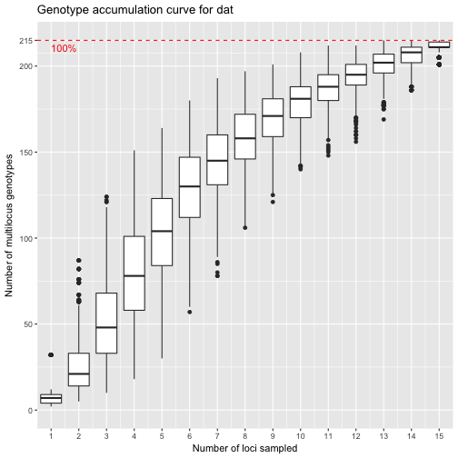
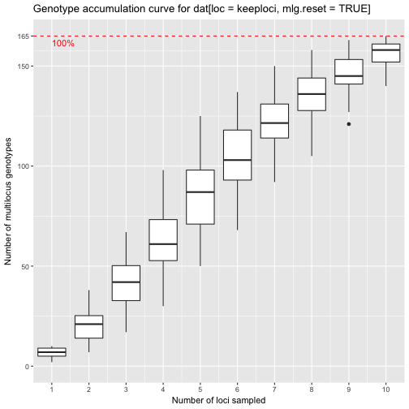
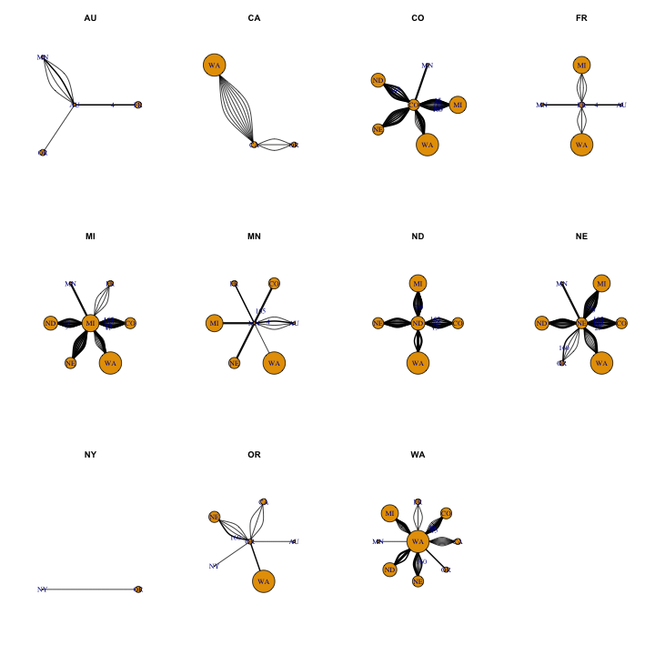

In this document, I will create a graph that shows the distribution of MLGs
across populations


```r
library('tidyverse')
```

```
## Loading tidyverse: ggplot2
## Loading tidyverse: tibble
## Loading tidyverse: tidyr
## Loading tidyverse: readr
## Loading tidyverse: purrr
## Loading tidyverse: dplyr
```

```
## Conflicts with tidy packages ----------------------------------------------
```

```
## filter(): dplyr, stats
## lag():    dplyr, stats
```

```r
library('assertr')
library('poppr')
```

```
## Loading required package: adegenet
```

```
## Loading required package: ade4
```

```
## 
##    /// adegenet 2.1.0 is loaded ////////////
## 
##    > overview: '?adegenet'
##    > tutorials/doc/questions: 'adegenetWeb()' 
##    > bug reports/feature requests: adegenetIssues()
```

```
## This is poppr version 2.3.0.99.89. To get started, type package?poppr
## OMP parallel support: available
## 
## This version of poppr is under development.
## If you find any bugs, please report them at https://github.com/grunwaldlab/poppr/issues
```

```r
library('igraph')
```

```
## 
## Attaching package: 'igraph'
```

```
## The following object is masked from 'package:poppr':
## 
##     %>%
```

```
## The following objects are masked from 'package:dplyr':
## 
##     %>%, as_data_frame, groups, union
```

```
## The following objects are masked from 'package:purrr':
## 
##     %>%, compose, simplify
```

```
## The following objects are masked from 'package:tidyr':
## 
##     %>%, crossing
```

```
## The following object is masked from 'package:tibble':
## 
##     as_data_frame
```

```
## The following objects are masked from 'package:stats':
## 
##     decompose, spectrum
```

```
## The following object is masked from 'package:base':
## 
##     union
```

```r
library("ggraph")
library('magrittr')
```

```
## 
## Attaching package: 'magrittr'
```

```
## The following object is masked from 'package:igraph':
## 
##     %>%
```

```
## The following object is masked from 'package:purrr':
## 
##     set_names
```

```
## The following object is masked from 'package:tidyr':
## 
##     extract
```

## Loading data and assertions


```r
dat <- read.genalex("../Analysis4 ForManu/A2_Copy4 EUR_AUS_forManu.csv", ploidy = 1)
splitStrata(dat) <- ~Isolate/Severity/MCG/Region/Source/Year/Host
dat
```

```
## 
## This is a genclone object
## -------------------------
## Genotype information:
## 
##    165 original multilocus genotypes 
##    366 haploid individuals
##     11 codominant loci
## 
## Population information:
## 
##      7 strata - Isolate, Severity, MCG, Region, Source, Year, Host
##    366 populations defined - 
## 152_3.9_4_NE_unk_2003_GH, 274_5.4_45_NE_unk_2003_GH, 443_6.3_5_NY_unk_2003_GH, ..., 967_5.8_34_FR_flds_2012_unk, 968_4.2_34_FR_flds_2012_unk, 970_5.2_35_FR_flds_2012_unk
```

```r
repeat_lengths <-
  c(
  `5-2` = 2.000000,
  `5-3` = 0.500000,
  `6-2` = 6.000000,
  `7-2` = 2.000000,
  `8-3` = 2.000000,
  `9-2` = 2.000000,
  `12-2` = 2.000000,
  `17-3` = 3.000000,
  `20-3` = 2.000000,
  `36-4` = 0.500000,
  `50-4` = 0.500000,
  `55-4` = 4.000000,
  `92-4` = 2.000000,
  `106-4` = 4.000000,
  `110-4` = 4.000000,
  `114-4` = 4.000000
  )
repeat_lengths <- ifelse(repeat_lengths < 1, 4, repeat_lengths)
```


```r
ex <- readxl::read_excel("../Analysis4 ForManu/A1_Copy of binned-genotypes_SE.xlsx", sheet = "GenAlex", skip = 1) %>%
  select(-1) %>%                # removing first column, which is empty
  gather(locus, allele, -1) %>% # gather all loci into tidy columns
  mutate(locus = trimws(locus)) %>% # remove (F) designator
  mutate(allele = as.integer(allele)) %>% # force alleles to integers
  spread(locus, allele) %>%
  slice(-n())
ex <- ex[!names(ex) %in% locNames(dat)]

# Function to select an adjacent allele. It will select the
# next allele if the next allele is not missing and it's distance
# is one away and the previous allele for the same conditions.
# If none of the conditions are met, it will retain the allele.
cromulent_allele <- Vectorize(function(lower, allele, higher){
  if (!is.na(higher) && abs(allele - higher) == 1){
    out <- higher
  } else if (!is.na(lower) && abs(allele - lower) == 1){
    out <- lower
  } else {
    out <- allele
  }
  out
})
ex
```

```
## # A tibble: 366 × 6
##    iso_st_mcg_org_loc_yr_hst_cult_rep `106-4(H)` `36-4(F)` `5-3(F)`
##                                 <chr>      <int>     <int>    <int>
## 1               152_3.9_4_NE__2003_GH        580       415      328
## 2              274_5.4_45_NE__2003_GH        588       415      328
## 3               443_6.3_5_NY__2003_GH        567       415      308
## 4          444_4.4_4_MN_wmn_2003_G122        580       415      328
## 5         445_4.7_4_MN_wmn_2003_Beryl        580       415      328
## 6         446_6.1_3_MI_wmn_2003_Beryl        567       415      339
## 7         447_5.5_5_MI_wmn_2003_Beryl        567       415      308
## 8           448_5_3_MI_wmn_2003_Beryl        568       414      339
## 9         449_5.2_3_MI_wmn_2003_Bunsi        568       415      339
## 10        450_5.3_5_MI_wmn_2003_Bunsi        568       415      308
## # ... with 356 more rows, and 2 more variables: `50-4(F)` <int>,
## #   `92-4(F)` <int>
```

```r
exsummary <- ex %>% 
  gather(locus, allele, -1) %>% # tidy the data
  group_by(locus, allele) %>%   
  summarize(n = n()) %>%        # summarize by count 
  ungroup() %>%
  group_by(locus) %>%           # group the loci, add the lower and upper alleles,
  mutate(lower = lag(allele), higher = lead(allele)) %>% # and then create new_alleles
  mutate(new_allele = ifelse(n < 3, cromulent_allele(lower, allele, higher), allele)) %>%
  select(locus, new_allele, allele)
exsummary
```

```
## Source: local data frame [71 x 3]
## Groups: locus [5]
## 
##       locus new_allele allele
##       <chr>      <int>  <int>
## 1  106-4(H)        502    501
## 2  106-4(H)        502    502
## 3  106-4(H)        502    503
## 4  106-4(H)        511    511
## 5  106-4(H)        532    532
## 6  106-4(H)        533    533
## 7  106-4(H)        541    540
## 8  106-4(H)        541    541
## 9  106-4(H)        541    542
## 10 106-4(H)        546    546
## # ... with 61 more rows
```

```r
corrected_loci <- ex %>% gather(locus, allele, -1) %>%
  left_join(exsummary, by = c("locus", "allele")) %>%
  mutate(allele = new_allele) %>%
  select(-new_allele) %>%
  spread(locus, allele)
datdf <- genind2df(dat, usepop = FALSE) %>% bind_cols(corrected_loci[-1])
dat  <- df2genind(datdf, ind.names = indNames(dat), strata = strata(dat), ploidy = 1) %>% as.genclone()
```

The incoming strata includes both Severity and Isolate. Since these are not
necessary for delimiting the strata, we will place them in the "other" slot
after converting Severity to numeric. Placing this information in the "other"
slot ensures that these data will travel with the object.


```r
dat_strata <- strata(dat) %>%
  mutate_all(as.character) %>%
  mutate(Severity = as.numeric(Severity))
strata(dat)     <- select(dat_strata, -Severity, -Isolate)
indNames(dat)   <- dat_strata$Isolate
other(dat)$meta <- select(dat_strata, Severity, Isolate)
```


```r
setPop(dat) <- ~Region
dat
```

```
## 
## This is a genclone object
## -------------------------
## Genotype information:
## 
##    215 original multilocus genotypes 
##    366 haploid individuals
##     16 codominant loci
## 
## Population information:
## 
##      5 strata - MCG, Region, Source, Year, Host
##     14 populations defined - NE, NY, MN, ..., FR, MX, ND
```

```r
keeploci <- !locNames(dat) %in% colnames(corrected_loci)
genotype_curve(dat, sample = 1000, quiet = TRUE)
```



```r
locus_table(dat)
```

```
## 
## allele = Number of observed alleles
```

```
## 
## 1-D = Simpson index
```

```
## 
## Hexp = Nei's 1978 gene diversity
```

```
## ------------------------------------------
```

```
##           summary
## locus      allele    1-D   Hexp Evenness
##   5-2(F)    4.000  0.451  0.452    0.616
##   6-2(F)    3.000  0.643  0.645    0.949
##   7-2(F)    7.000  0.727  0.729    0.764
##   8-3(H)    7.000  0.740  0.742    0.789
##   9-2(F)    9.000  0.347  0.348    0.406
##   12-2(H)   5.000  0.579  0.580    0.779
##   17-3(H)   7.000  0.551  0.553    0.526
##   20-3(F)   2.000  0.053  0.053    0.420
##   55-4(F)  10.000  0.721  0.723    0.656
##   110-4(H)  5.000  0.754  0.756    0.915
##   114-4(H) 10.000  0.828  0.831    0.801
##   106-4(H) 32.000  0.917  0.919    0.602
##   36-4(F)   4.000  0.254  0.255    0.501
##   5-3(F)   12.000  0.839  0.841    0.791
##   50-4(F)   3.000  0.256  0.257    0.629
##   92-4(F)   9.000  0.797  0.799    0.808
##   mean      8.062  0.591  0.593    0.685
```

```r
# rl <- fix_replen(dat, repeat_lengths)
# mlg.filter(dat, distance = bruvo.dist, replen = rl) <- .Machine$double.eps
dat
```

```
## 
## This is a genclone object
## -------------------------
## Genotype information:
## 
##    215 original multilocus genotypes 
##    366 haploid individuals
##     16 codominant loci
## 
## Population information:
## 
##      5 strata - MCG, Region, Source, Year, Host
##     14 populations defined - NE, NY, MN, ..., FR, MX, ND
```

```r
genotype_curve(dat[loc = keeploci, mlg.reset = TRUE], quiet = TRUE)
```



```r
# dat <- dat[loc = keeploci, mlg.reset = TRUE]
dat
```

```
## 
## This is a genclone object
## -------------------------
## Genotype information:
## 
##    215 original multilocus genotypes 
##    366 haploid individuals
##     16 codominant loci
## 
## Population information:
## 
##      5 strata - MCG, Region, Source, Year, Host
##     14 populations defined - NE, NY, MN, ..., FR, MX, ND
```

## Crossing populations


We can use `mlg.crosspop()` to tabulte which MLGs cross populations.

I realized that it's possible to use an MLG table with matrix multiplication to
get an adjency matrix. Here I'm making a function to create a list of graphs. 

The vertices, representing populations, will have the following attributes:

 - Size: equal to the number of MLGs within the population
 - Weight: fraction of private MLGs
 
The edges, representing multilocus genotypes are a bit trickier to handle since
multiple edges can represent a single MLG passing through populations. They have
the following attributes:

 - Label: the MLG this edge belongs to. Note that multiple edges can share the
          same label.
 - Width: the number of populations this MLG passes through
 - Weight: 1 - (probability of a second encounter by chance); 1 - psex

The reason why I'm weighting these nodes as 1 - psex is for subsequent community
analysis. The more likely you are to encounter a genotype by chance, the less
influence that genotype should have on the connectivity. 


```r
rerange <- function(x){
  minx <- min(x, na.rm = TRUE)
  maxx <- max(x, na.rm = TRUE)
  if (minx < 0)
    x <- x + abs(minx)
    maxx <- maxx + abs(minx)
  if (maxx > 1)
    x <- x/maxx
  return(x)
}
make_graph_list <- function(dat){ # dat is a genclone/snpclone object
  # w       <- pgen(dat, by_pop = FALSE) %>% rowSums() %>% exp() %>% setNames(paste0("MLG.", mll(dat)))
  # w       <- w[unique(names(w))]
  w       <- psex(dat, by_pop = FALSE, method = "multiple") %>% split(mll(dat))
  names(w)<- paste0("MLG.", names(w))
  datmlg  <- mlg.table(dat, plot = FALSE) > 0 # presence/absence of MLG
  crosses <- mlg.crosspop(dat, quiet = TRUE, df = TRUE) %>% tbl_df()
  adjmat  <- datmlg %*% t(datmlg) 
  cols    <- sort(colnames(adjmat))
  adjmat  <- adjmat[cols, cols]
  # Creating Graph
  g           <- graph_from_adjacency_matrix(adjmat, mode = "undirected", diag = FALSE)
  V(g)$size   <- diag(adjmat)
  g           <- delete_vertices(g, degree(g) == 0)
  shared_mlg  <- (crosses %>% group_by(Population) %>% summarize(n = n()))$n
  V(g)$weight <- 1 - shared_mlg/V(g)$size # fraction of private MLGs
  el          <- as_adj_edge_list(g)
  el          <- el[lengths(el) > 0]
  popgraphs <- setNames(vector(mode = "list", length = length(el) + 1), c(names(el), "total"))
  for (v in names(el)){
    idx  <- el[[v]]
    mlgs <- crosses %>%           # How to get all MLGs from a single population:
      filter(Population == v) %>%         # Grab only the population e and then
      select(MLG) %>%                     # remove everything but the MLGs to do an
      inner_join(crosses, by = "MLG") %>% # inner join of the original list and then
      filter(Population != v) %>%         # remove the query population to give
      arrange(Population)                 # the neigboring populations in order.
    MLGS <- as.character(mlgs$MLG)
    E(g)[idx]$label  <- substr(MLGS, 5, nchar(MLGS))
    E(g)[idx]$width  <- as.integer(table(MLGS)[MLGS]) # size == n populations visited
    E(g)[idx]$weight <- 1 - map_dbl(w[MLGS], 2)       # weight == 1 - psex 2nd encounter
    popgraphs[[v]]   <- subgraph.edges(g, eids = idx)
  }
  popgraphs[["total"]] <- g
  popgraphs
}

plot_mlg_graph <- function(g, glayout = NULL, label = TRUE){
  if (is.null(glayout)){
    glayout <- layout_nicely(g)
  } else {
    glayout <- glayout[V(g)$name, ]
  }
  shared_mlg  <- (1 - V(g)$weight) * V(g)$size
  g           <- add_vertices(g, length(V(g)), size = V(g)$size - shared_mlg, color = "grey90")
  g2          <- g
  V(g2)$label <- ifelse(!is.na(V(g2)$name), sprintf("%s [(%d/%d)]", V(g2)$name, shared_mlg, V(g2)$size), NA)
  glay        <- create_layout(g2, "manual", node.positions = as.data.frame(rbind(glayout, glayout)))
  x_nudge     <- ifelse(abs(glay$x) == 1, -glay$x/10, glay$x/10)
  breaks      <- quantile(1 - E(g)$weight)
  breaks      <- setNames(breaks, format(breaks, digits = 2))
  outg <- ggraph(glay) +
    geom_edge_fan(aes(alpha = 1 - weight, width = width + 1)) +
    geom_node_circle(aes(r = drop(scale(size, center = FALSE))/10, fill = size))
  outg <- if (label) outg + geom_node_label(aes(label = label), repel = TRUE, parse = TRUE, label.size = 0.75, nudge_x = x_nudge) else outg
  outg + 
    viridis::scale_fill_viridis(option = "C") +
    scale_edge_alpha_continuous(range = c(1, 0.25), breaks = rev(breaks)) +
    scale_edge_width_continuous(range = c(0.25, 1.25), breaks = c(2:5)) +
    coord_fixed() +
    theme_void() +
    theme(text = element_text(size = 14)) +
    labs(list(
      title = "Shared haplotypes across regions",
      fill = "Number of\nGenotypes",
      edge_alpha = "Probability of\nsecond encounter",
      edge_width = "Populations\nPer haplotype",
      caption = "Outer circle: Number of haplotypes in the region\nInner Circle: Number of private haplotypes in the region"
    ))
}

plot_mlg_subgraph <- function(graphlist){
  for (i in names(graphlist)){
    pg   <- graphlist[[i]]
    labs <- ifelse(E(pg)$width > 1, E(pg)$label, NA)
    labs <- ifelse(duplicated(labs), NA, labs)
    plot(pg, 
         main = i, 
         layout = layout_as_star(pg, center = i), 
         edge.width = E(pg)$width,
         edge.color = grey(rerange(1 - E(pg)$weight)), 
         edge.label = labs)
  }
}


good_layout <- read.table(
text = 
"   x                            y
AU  0.8090169943749470071737  5.877852522924730260812e-01
CA -1.0000000000000000000000  1.224646799147350002426e-16
CO -0.3090169943749480063744 -9.510565162951539752711e-01
FR -0.3090169943749470071737  9.510565162951539752711e-01
MI  0.0000000000000000000000  0.000000000000000000000e+00
MN  1.0000000000000000000000  0.000000000000000000000e+00
ND  0.3090169943749470071737 -9.510565162951539752711e-01
NE -0.8090169943749470071737 -5.877852522924730260812e-01
NY  0.8090169943749470071737 -5.877852522924730260812e-01
OR  0.3090169943749470071737  9.510565162951539752711e-01
WA -0.8090169943749470071737  5.877852522924730260812e-01"
) %>% as.matrix()

alt_layout <- read.table(
text = 
"   x                            y
AU  0.8090169943749470071737  5.877852522924730260812e-01
OR -1.0000000000000000000000  1.224646799147350002426e-16
CO -0.3090169943749480063744 -9.510565162951539752711e-01
WA -0.3090169943749470071737  9.510565162951539752711e-01
MI  0.0000000000000000000000  0.000000000000000000000e+00
MN  1.0000000000000000000000  0.000000000000000000000e+00
ND  0.3090169943749470071737 -9.510565162951539752711e-01
NE -0.8090169943749470071737 -5.877852522924730260812e-01
NY  0.8090169943749470071737 -5.877852522924730260812e-01
FR  0.3090169943749470071737  9.510565162951539752711e-01
CA -0.8090169943749470071737  5.877852522924730260812e-01"
) %>% as.matrix()
alt_layout <- alt_layout[rownames(good_layout), ]
```


## Graphs

With the fuctions above, we can create and plot the graphs.


```r
# Creating the graphs
graph16loc <- make_graph_list(dat)
graph11loc <- make_graph_list(dat[loc = keeploci, mlg.reset = TRUE])
```

### Individual population subgraphs

Each subgraph shows all of the connections for a single population.


```r
# Plotting the subgraphs
par(mfrow = c(3, 4))
plot_mlg_subgraph(graph16loc[-length(graph16loc)])

par(mfrow = c(3, 4))
```


```r
plot_mlg_subgraph(graph11loc[-length(graph11loc)])
```



### Cross-regional graphs


#### With 16 loci

First, I'm going to show the results of a community analysis. I'm using the 
igraph function `cluster_optimal()` to cluster the nodes.


```r
par(mfrow = c(1, 1))
(g16o <- cluster_optimal(graph16loc$total))
```

```
## IGRAPH clustering optimal, groups: 3, mod: 0.2
## + groups:
##   $`1`
##   [1] "AU" "FR" "MN"
##   
##   $`2`
##   [1] "CA" "OR" "WA"
##   
##   $`3`
##   [1] "CO" "MI" "ND" "NE"
## 
```

```r
plot_mlg_graph(graph16loc$total, alt_layout) + labs(list(subtitle = "(16 loci)"))
```

```
## Warning: Removed 10 rows containing missing values (geom_label_repel).
```


What we see is that We are given three clusters showing a clustering of the
plains states, the west coast, and Australia, France, and Minnesota. The last
cluster is likely driven by the single genotype shared between these three
regions that has a low probability of a second encounter.


#### With 11 loci


```r
(g11o <- cluster_optimal(graph11loc$total))
```

```
## IGRAPH clustering optimal, groups: 3, mod: 0.17
## + groups:
##   $`1`
##   [1] "AU" "FR" "MN"
##   
##   $`2`
##   [1] "CA" "NY" "OR" "WA"
##   
##   $`3`
##   [1] "CO" "MI" "ND" "NE"
## 
```

```r
plot_mlg_graph(graph11loc$total, alt_layout) + labs(list(subtitle = "(11 loci)"))
```

```
## Warning: Removed 11 rows containing missing values (geom_label_repel).
```


## Session Information


```r
options(width = 100)
devtools::session_info()
```

```
## Session info ---------------------------------------------------------------------------------------
```

```
##  setting  value                       
##  version  R version 3.3.3 (2017-03-06)
##  system   x86_64, darwin13.4.0        
##  ui       X11                         
##  language (EN)                        
##  collate  en_US.UTF-8                 
##  tz       America/Chicago             
##  date     2017-04-06
```

```
## Packages -------------------------------------------------------------------------------------------
```

```
##  package     * version     date       source                                  
##  ade4        * 1.7-6       2017-03-23 cran (@1.7-6)                           
##  adegenet    * 2.1.0       2017-04-05 Github (thibautjombart/adegenet@bb0ffc0)
##  ape           4.1         2017-02-14 CRAN (R 3.3.2)                          
##  assertr     * 2.0.0       2017-03-17 CRAN (R 3.3.2)                          
##  assertthat    0.1         2013-12-06 CRAN (R 3.2.0)                          
##  boot          1.3-18      2016-02-23 CRAN (R 3.2.3)                          
##  broom         0.4.2       2017-02-13 CRAN (R 3.3.2)                          
##  cluster       2.0.5       2016-10-08 CRAN (R 3.3.0)                          
##  coda          0.19-1      2016-12-08 cran (@0.19-1)                          
##  colorspace    1.3-2       2016-12-14 CRAN (R 3.3.2)                          
##  DBI           0.5-1       2016-09-10 CRAN (R 3.3.0)                          
##  deldir        0.1-12      2016-03-06 CRAN (R 3.2.4)                          
##  devtools      1.12.0      2016-06-24 CRAN (R 3.3.0)                          
##  digest        0.6.12      2017-01-27 CRAN (R 3.3.2)                          
##  dplyr       * 0.5.0       2016-06-24 CRAN (R 3.3.0)                          
##  evaluate      0.10        2016-10-11 cran (@0.10)                            
##  expm          0.999-1     2017-02-02 CRAN (R 3.3.2)                          
##  ezknitr       0.6         2016-09-16 CRAN (R 3.3.0)                          
##  fastmatch     1.1-0       2017-01-28 CRAN (R 3.3.2)                          
##  forcats       0.2.0       2017-01-23 CRAN (R 3.3.2)                          
##  foreign       0.8-67      2016-09-13 CRAN (R 3.3.0)                          
##  gdata         2.17.0      2015-07-04 CRAN (R 3.2.0)                          
##  ggforce       0.1.1       2016-11-28 CRAN (R 3.3.2)                          
##  ggplot2     * 2.2.1       2016-12-30 CRAN (R 3.3.2)                          
##  ggraph      * 1.0.0       2017-02-24 CRAN (R 3.3.2)                          
##  ggrepel       0.6.6       2017-04-03 Github (slowkow/ggrepel@007318f)        
##  gmodels       2.16.2      2015-07-22 CRAN (R 3.2.0)                          
##  gridExtra     2.2.1       2016-02-29 CRAN (R 3.2.4)                          
##  gtable        0.2.0       2016-02-26 CRAN (R 3.2.3)                          
##  gtools        3.5.0       2015-05-29 CRAN (R 3.2.0)                          
##  haven         1.0.0       2016-09-23 CRAN (R 3.3.0)                          
##  highr         0.6         2016-05-09 CRAN (R 3.3.0)                          
##  hms           0.3         2016-11-22 CRAN (R 3.3.2)                          
##  htmltools     0.3.5       2016-03-21 CRAN (R 3.2.4)                          
##  httpuv        1.3.3       2015-08-04 CRAN (R 3.2.0)                          
##  httr          1.2.1       2016-07-03 cran (@1.2.1)                           
##  igraph      * 1.0.1       2015-06-26 CRAN (R 3.2.0)                          
##  jsonlite      1.3         2017-02-28 CRAN (R 3.3.2)                          
##  knitr       * 1.15.16     2017-03-29 Github (yihui/knitr@9f6a1c2)            
##  labeling      0.3         2014-08-23 CRAN (R 3.2.0)                          
##  lattice       0.20-34     2016-09-06 CRAN (R 3.3.0)                          
##  lazyeval      0.2.0.9000  2016-07-01 Github (hadley/lazyeval@c155c3d)        
##  LearnBayes    2.15        2014-05-29 CRAN (R 3.2.0)                          
##  lubridate     1.6.0       2016-09-13 CRAN (R 3.3.0)                          
##  magrittr    * 1.5         2014-11-22 CRAN (R 3.2.0)                          
##  MASS          7.3-45      2015-11-10 CRAN (R 3.2.2)                          
##  Matrix        1.2-8       2017-01-20 CRAN (R 3.3.2)                          
##  memoise       1.0.0       2016-01-29 CRAN (R 3.2.3)                          
##  mgcv          1.8-17      2017-02-08 CRAN (R 3.3.2)                          
##  mime          0.5         2016-07-07 cran (@0.5)                             
##  mnormt        1.5-5       2016-10-15 cran (@1.5-5)                           
##  modelr        0.1.0       2016-08-31 CRAN (R 3.3.0)                          
##  munsell       0.4.3       2016-02-13 CRAN (R 3.2.3)                          
##  nlme          3.1-131     2017-02-06 CRAN (R 3.3.2)                          
##  pegas         0.9         2016-04-16 CRAN (R 3.2.5)                          
##  permute       0.9-4       2016-09-09 cran (@0.9-4)                           
##  phangorn      2.2.0       2017-04-03 cran (@2.2.0)                           
##  plyr          1.8.4       2016-06-08 CRAN (R 3.3.0)                          
##  poppr       * 2.3.0.99-89 2017-04-06 local                                   
##  psych         1.6.12      2017-01-08 CRAN (R 3.3.2)                          
##  purrr       * 0.2.2       2016-06-18 CRAN (R 3.3.0)                          
##  quadprog      1.5-5       2013-04-17 CRAN (R 3.2.0)                          
##  R.methodsS3   1.7.1       2016-02-16 CRAN (R 3.2.3)                          
##  R.oo          1.21.0      2016-11-01 CRAN (R 3.3.0)                          
##  R.utils       2.5.0       2016-11-07 CRAN (R 3.3.0)                          
##  R6            2.2.0       2016-10-05 cran (@2.2.0)                           
##  Rcpp          0.12.10     2017-03-19 cran (@0.12.10)                         
##  readr       * 1.0.0       2016-08-03 CRAN (R 3.3.0)                          
##  readxl        0.1.1       2016-03-28 CRAN (R 3.3.0)                          
##  reshape2      1.4.2       2016-10-22 cran (@1.4.2)                           
##  rvest         0.3.2       2016-06-17 CRAN (R 3.3.0)                          
##  scales        0.4.1       2016-11-09 CRAN (R 3.3.2)                          
##  seqinr        3.3-3       2016-10-13 cran (@3.3-3)                           
##  shiny         1.0.1       2017-04-01 cran (@1.0.1)                           
##  sp            1.2-4       2016-12-22 cran (@1.2-4)                           
##  spdep         0.6-11      2017-02-23 cran (@0.6-11)                          
##  stringi       1.1.2       2016-10-01 CRAN (R 3.3.0)                          
##  stringr       1.2.0       2017-02-18 cran (@1.2.0)                           
##  tibble      * 1.3.0       2017-04-01 cran (@1.3.0)                           
##  tidyr       * 0.6.1       2017-01-10 CRAN (R 3.3.2)                          
##  tidyverse   * 1.1.1       2017-01-27 CRAN (R 3.3.2)                          
##  tweenr        0.1.5       2016-10-10 CRAN (R 3.3.0)                          
##  udunits2      0.13        2016-11-17 CRAN (R 3.3.2)                          
##  units         0.4-3       2017-03-25 cran (@0.4-3)                           
##  vegan         2.4-2       2017-01-17 CRAN (R 3.3.2)                          
##  viridis       0.4.0       2017-03-27 cran (@0.4.0)                           
##  viridisLite   0.2.0       2017-03-24 cran (@0.2.0)                           
##  withr         1.0.2       2016-06-20 cran (@1.0.2)                           
##  xml2          1.1.1       2017-01-24 CRAN (R 3.3.2)                          
##  xtable        1.8-2       2016-02-05 CRAN (R 3.2.3)
```

