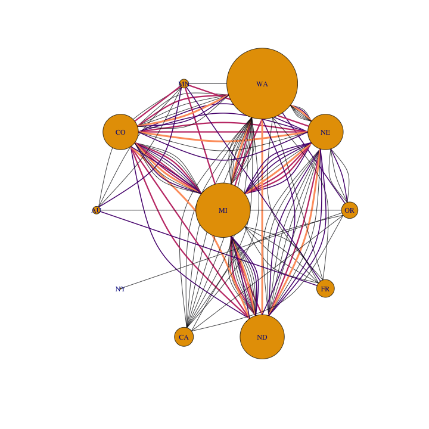
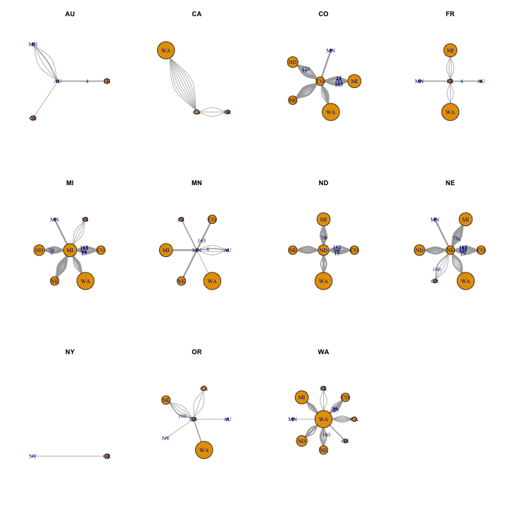
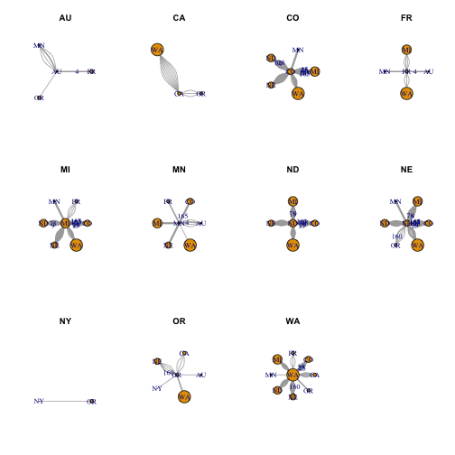
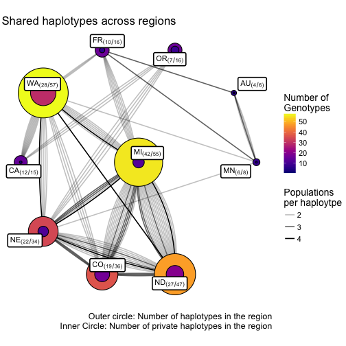

In this document, I will create a graph that shows the distribution of MLGs
across populations


```r
library('tidyverse')
```

```
## Loading tidyverse: ggplot2
## Loading tidyverse: tibble
## Loading tidyverse: tidyr
## Loading tidyverse: readr
## Loading tidyverse: purrr
## Loading tidyverse: dplyr
```

```
## Conflicts with tidy packages ----------------------------------------------
```

```
## filter(): dplyr, stats
## lag():    dplyr, stats
```

```r
library('assertr')
library('poppr')
```

```
## Loading required package: adegenet
```

```
## Loading required package: ade4
```

```
## 
##    /// adegenet 2.1.0 is loaded ////////////
## 
##    > overview: '?adegenet'
##    > tutorials/doc/questions: 'adegenetWeb()' 
##    > bug reports/feature requests: adegenetIssues()
```

```
## This is poppr version 2.3.0.99.42. To get started, type package?poppr
## OMP parallel support: available
## 
## This version of poppr is under development.
## If you find any bugs, please report them at https://github.com/grunwaldlab/poppr/issues
```

```r
library('igraph')
```

```
## 
## Attaching package: 'igraph'
```

```
## The following object is masked from 'package:poppr':
## 
##     %>%
```

```
## The following objects are masked from 'package:dplyr':
## 
##     %>%, as_data_frame, groups, union
```

```
## The following objects are masked from 'package:purrr':
## 
##     %>%, compose, simplify
```

```
## The following objects are masked from 'package:tidyr':
## 
##     %>%, crossing
```

```
## The following object is masked from 'package:tibble':
## 
##     as_data_frame
```

```
## The following objects are masked from 'package:stats':
## 
##     decompose, spectrum
```

```
## The following object is masked from 'package:base':
## 
##     union
```

```r
library("ggraph")
```

## Loading data and assertions


```r
dat <- read.genalex("../Analysis4 ForManu/A2_Copy4 EUR_AUS_forManu.csv", ploidy = 1)
splitStrata(dat) <- ~Isolate/Severity/MCG/Region/Source/Year/Host
dat
```

```
## 
## This is a genclone object
## -------------------------
## Genotype information:
## 
##    165 original multilocus genotypes 
##    366 haploid individuals
##     11 codominant loci
## 
## Population information:
## 
##      7 strata - Isolate, Severity, MCG, Region, Source, Year, Host
##    366 populations defined - 
## 152_3.9_4_NE_unk_2003_GH, 274_5.4_45_NE_unk_2003_GH, 443_6.3_5_NY_unk_2003_GH, ..., 967_5.8_34_FR_flds_2012_unk, 968_4.2_34_FR_flds_2012_unk, 970_5.2_35_FR_flds_2012_unk
```

The incoming strata includes both Severity and Isolate. Since these are not
necessary for delimiting the strata, we will place them in the "other" slot
after converting Severity to numeric. Placing this information in the "other"
slot ensures that these data will travel with the object.


```r
dat_strata <- strata(dat) %>%
  mutate_all(as.character) %>%
  mutate(Severity = as.numeric(Severity))
strata(dat)     <- select(dat_strata, -Severity, -Isolate)
indNames(dat)   <- dat_strata$Isolate
other(dat)$meta <- select(dat_strata, Severity, Isolate)
```


```r
setPop(dat) <- ~Region
dat
```

```
## 
## This is a genclone object
## -------------------------
## Genotype information:
## 
##    165 original multilocus genotypes 
##    366 haploid individuals
##     11 codominant loci
## 
## Population information:
## 
##      5 strata - MCG, Region, Source, Year, Host
##     14 populations defined - NE, NY, MN, ..., FR, MX, ND
```

## Crossing populations


We can use `mlg.crosspop()` to tabulte which MLGs cross populations.


```r
make_from_to <- function(poplist){
  x <- combn(poplist, 2)
  tibble::data_frame(from = x[1, ], to = x[2, ])
}
crosses <- mlg.crosspop(dat, df = TRUE, quiet = TRUE)

pg <- 
  crosses %>%
  group_by(MLG) %>% 
  summarize(Population = list(make_from_to(Population)), Size = length(Count))
  
pop_graph <- pg %>%  unnest() %>%
  group_by(from, to) %>%
  mutate(weight = length(Size)) %>%
  ungroup() %>%
  select(from, to, weight, everything())

unchoose <- function(x) ceiling(sqrt(x * 2))


  
gcross           <- graph_from_data_frame(pop_graph, directed = FALSE)
E(gcross)$name   <- as.character(pop_graph$MLG)
E(gcross)$weight <- unchoose(table(E(gcross)$name)[E(gcross)$name])
colors <- viridis::magma(max(E(gcross)$weight) - 1, end = 0.8)
set.seed(500)
gcross %>%
  plot(., vertex.size = table(pop(clonecorrect(dat, ~Region)))[names(V(gcross))],
       edge.width = E(.)$weight - 1,
       layout = layout_as_star(., center = "MI"),
       # layout = layout_in_circle(.),
       edge.color = colors[E(.)$weight - 1])
```




```r
psize <- table(pop(clonecorrect(dat, ~Region)))
pops <- crosses %>%
  mutate_if(is.factor, as.character) %>%
  group_by(Population) %>%
  summarize(MLG = list(as.character(MLG))) %>%
  group_by(Population) %>%
  mutate(size = psize[unlist(Population)]) %>%
  mutate(n_private = size - lengths(MLG)) %>%
  mutate(interactions = list(pg$Population[pg$MLG %in% unlist(MLG)] %>% 
                               setNames(unlist(MLG)) %>% 
                               bind_rows(.id = "MLG") %>% 
                               distinct() %>%
                               filter(Population == from | Population == to))) %>%
  mutate(graph = map(interactions, ~select(.x, from, to, MLG) %>% 
                       rename(name = MLG) %>% 
                       graph_from_data_frame(directed = FALSE)))
pops
```

```
## Source: local data frame [11 x 6]
## Groups: Population [11]
## 
##    Population        MLG  size n_private      interactions        graph
##         <chr>     <list> <int>     <int>            <list>       <list>
## 1          AU  <chr [5]>     6         1  <tibble [6 × 3]> <S3: igraph>
## 2          CA <chr [12]>    15         3 <tibble [12 × 3]> <S3: igraph>
## 3          CO <chr [18]>    28        10 <tibble [31 × 3]> <S3: igraph>
## 4          FR  <chr [8]>    14         6  <tibble [9 × 3]> <S3: igraph>
## 5          MI <chr [32]>    43        11 <tibble [45 × 3]> <S3: igraph>
## 6          MN  <chr [6]>     7         1  <tibble [9 × 3]> <S3: igraph>
## 7          ND <chr [21]>    35        14 <tibble [32 × 3]> <S3: igraph>
## 8          NE <chr [25]>    28         3 <tibble [38 × 3]> <S3: igraph>
## 9          NY  <chr [1]>     1         0  <tibble [1 × 3]> <S3: igraph>
## 10         OR  <chr [9]>    13         4 <tibble [10 × 3]> <S3: igraph>
## 11         WA <chr [32]>    56        24 <tibble [39 × 3]> <S3: igraph>
```

```r
possible_edges <- expand.grid(from = pops$Population, to = pops$Population)
possible_edges$Population <- possible_edges$from
from_edges <- right_join(possible_edges, select(pops, Population, size)) %>% 
  tbl_df %>% 
  rename(from_size = size) %>%
  select(-Population)
```

```
## Joining, by = "Population"
```

```
## Warning in right_join_impl(x, y, by$x, by$y, suffix$x, suffix$y): joining
## factor and character vector, coercing into character vector
```

```r
to_edges <- right_join(mutate(possible_edges, Population = to), select(pops, Population, size)) %>% 
  tbl_df %>% 
  rename(to_size = size) %>%
  select(-Population)
```

```
## Joining, by = "Population"
```

```
## Warning in right_join_impl(x, y, by$x, by$y, suffix$x, suffix$y): joining
## factor and character vector, coercing into character vector
```

```r
possible_edges <- inner_join(from_edges, to_edges)
```

```
## Joining, by = c("from", "to")
```

```r
par(mfrow = c(3, 4))

apply(pops, 1, function(i){
    plot(i$graph, 
         layout = layout_as_star(i$graph, center = i$Population), 
         main = i$Population, 
         vertex.size = psize[names(V(i$graph))])
  })
```

```
## NULL
```

```r
par(mfrow = c(1, 1))
```



```r
gnew <- igraph::union(pops$graph[[1]], pops$graph[-1])

glayout <- layout_as_star(gnew, center = "MI")

glayout_df <- glayout %>% 
  data.frame %>% 
  setNames(c("x", "y")) %>% 
  as.list %>% 
  c(Population = list(names(V(gnew)))) %>% 
  dplyr::as_data_frame() %>%
  inner_join(pops)
```

```
## Joining, by = "Population"
```

```r
V(gnew)$size <- glayout_df$size
V(gnew)$weight <- (1 - glayout_df$n_private/glayout_df$size)
V(gnew)$color <- viridis::viridis(100)[round(V(gnew)$weight * 100)]
gnew <- add_vertices(gnew, length(V(gnew)), size = glayout_df$n_private, color = "grey90")
glayout2 <- rbind(glayout, glayout)
plot(gnew, layout = glayout2)
```



```r
caps <- as_data_frame(gnew, what = "edges") %>% select(from, to) %>% 
  inner_join(possible_edges) %>% tbl_df
```

```
## Joining, by = c("from", "to")
```

```
## Warning in inner_join_impl(x, y, by$x, by$y, suffix$x, suffix$y): joining
## character vector and factor, coercing into character vector
```

```
## Warning in inner_join_impl(x, y, by$x, by$y, suffix$x, suffix$y): joining
## character vector and factor, coercing into character vector
```

```r
caps %>% mutate(from_size = scale(from_size, center = FALSE)/10) %>%
  mutate(to_size = scale(to_size, center = FALSE)/10) -> spac

glay <- create_layout(gnew, "manual", node.positions = as.data.frame(glayout2) %>% setNames(c("x", "y")))
ggraph(glay) +
  geom_edge_fan() +
  # geom_edge_fan2(aes(start_cap = circle(rep(spac$from_size, 2)/2, "mm"),
  #                   end_cap = circle(rep(spac$to_size, 2)/2, "mm"))) +
  geom_node_circle(aes(r = scale(size, center = FALSE)/10, fill = size, alpha = 1 - weight)) +
  geom_node_label(aes(label = name), repel = TRUE) +
  viridis::scale_fill_viridis(option = "C") +
  coord_fixed() +
  theme_void() +
  labs(list(
    title = "Shared haplotypes across regions",
    fill = "Number of\nGenotypes",
    alpha = "Fraction of private genotpes",
    caption = "Outer circle: Number of genotypes in the region\nInner Circle: Number of private genotypes in the region"
  ))
```

```
## Warning: Removed 11 rows containing missing values (geom_label_repel).
```



