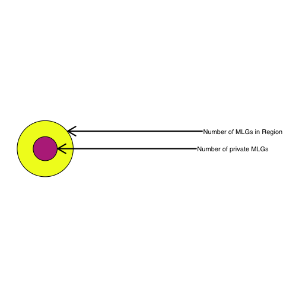
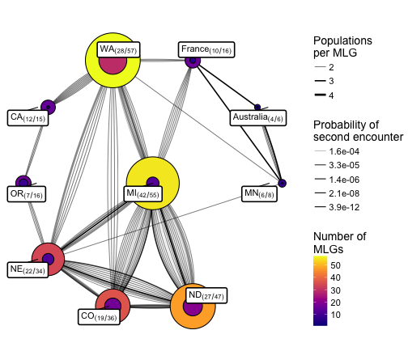
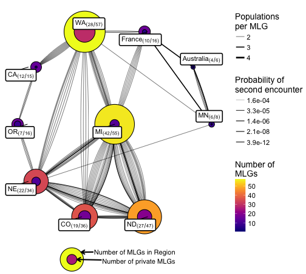
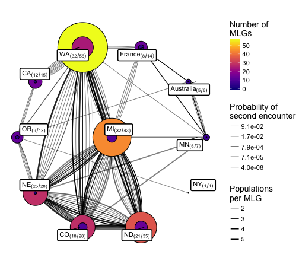
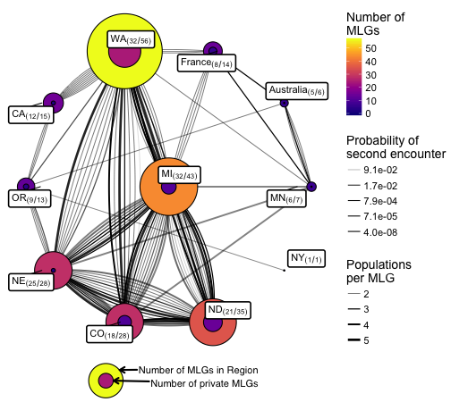

In this document, I will create a graph that shows the distribution of MLGs
across populations


```r
library('tidyverse')
library('poppr')
library('igraph')
library("ggraph")
```

## Loading data and setting strata

I'm loading the data and splitting it into the 11 locus and 16 locus versions


```r
load("data/sclerotinia_16_loci.rda")
```

Now we can inspect the genotype accumulation curves. Notice that the 16 loci
version plateaus, but we know that these extra loci are inconsistent, so we 
might not want to trust them. 


```r
locus_table(dat)
```

```
## 
## allele = Number of observed alleles
```

```
## 
## 1-D = Simpson index
```

```
## 
## Hexp = Nei's 1978 gene diversity
```

```
## ------------------------------------------
```

```
##           summary
## locus      allele    1-D   Hexp Evenness
##   5-2(F)    4.000  0.451  0.452    0.616
##   5-3(F)   12.000  0.839  0.841    0.790
##   6-2(F)    3.000  0.643  0.645    0.949
##   7-2(F)    7.000  0.727  0.729    0.764
##   8-3(H)    7.000  0.740  0.742    0.789
##   9-2(F)    9.000  0.347  0.348    0.406
##   12-2(H)   5.000  0.579  0.580    0.779
##   17-3(H)   7.000  0.551  0.553    0.526
##   20-3(F)   2.000  0.053  0.053    0.420
##   36-4(F)   4.000  0.255  0.256    0.502
##   50-4(F)   3.000  0.257  0.257    0.629
##   55-4(F)  10.000  0.721  0.723    0.656
##   92-4(F)   9.000  0.796  0.799    0.807
##   106-4(H) 32.000  0.918  0.920    0.605
##   110-4(H)  5.000  0.754  0.756    0.915
##   114-4(H) 10.000  0.828  0.831    0.801
##   mean      8.062  0.591  0.593    0.685
```

```r
set.seed(2017-06-28)
genotype_curve(dat, sample = 1000, quiet = TRUE)
```


```r
genotype_curve(dat11, quiet = TRUE)
```


Creating contracted genotypes for use later


```r
mlg.filter(dat, distance = bruvo.dist, replen = other(dat)$REPLEN) <- .Machine$double.eps
dat
```

```
## 
## This is a genclone object
## -------------------------
## Genotype information:
## 
##    187 contracted multilocus genotypes
##        (0) [t], (bruvo.dist) [d], (farthest) [a] 
##    366 haploid individuals
##     16 codominant loci
## 
## Population information:
## 
##      5 strata - MCG, Region, Source, Year, Host
##     14 populations defined - NE, NY, MN, ..., France, Mexico, ND
```

```r
mlg.filter(dat11, distance = bruvo.dist, replen = other(dat11)$REPLEN) <- .Machine$double.eps
dat11
```

```
## 
## This is a genclone object
## -------------------------
## Genotype information:
## 
##    165 contracted multilocus genotypes
##        (0) [t], (bruvo.dist) [d], (farthest) [a] 
##    366 haploid individuals
##     11 codominant loci
## 
## Population information:
## 
##      5 strata - MCG, Region, Source, Year, Host
##     14 populations defined - NE, NY, MN, ..., France, Mexico, ND
```

```r
mll(dat) <- "original"
mll(dat11) <- "original"
```

## Crossing populations


We can use `mlg.crosspop()` to tabulte which MLGs cross populations.

I realized that it's possible to use an MLG table with matrix multiplication to
get an adjency matrix. Here I'm making a function to create a list of graphs. 

The vertices, representing populations, will have the following attributes:

 - Size: equal to the number of MLGs within the population
 - Weight: fraction of private MLGs
 
The edges, representing multilocus genotypes are a bit trickier to handle since
multiple edges can represent a single MLG passing through populations. They have
the following attributes:

 - Label: the MLG this edge belongs to. Note that multiple edges can share the
          same label.
 - Width: the number of populations this MLG passes through
 - Weight: 1 - (probability of a second encounter by chance); 1 - psex

The reason why I'm weighting these nodes as 1 - psex is for subsequent community
analysis. The more likely you are to encounter a genotype by chance, the less
influence that genotype should have on the connectivity. 


```r
rerange <- function(x){
  minx <- min(x, na.rm = TRUE)
  maxx <- max(x, na.rm = TRUE)
  if (minx < 0)
    x <- x + abs(minx)
    maxx <- maxx + abs(minx)
  if (maxx > 1)
    x <- x/maxx
  return(x)
}
make_graph_list <- function(dat){ # dat is a genclone/snpclone object
  # w       <- pgen(dat, by_pop = FALSE) %>% rowSums() %>% exp() %>% setNames(paste0("MLG.", mll(dat)))
  # w       <- w[unique(names(w))]
  w       <- psex(dat, by_pop = FALSE, method = "multiple") %>% split(mll(dat))
  names(w)<- paste0("MLG.", names(w))
  datmlg  <- mlg.table(dat, plot = FALSE) > 0 # presence/absence of MLG
  crosses <- mlg.crosspop(dat, quiet = TRUE, df = TRUE) %>% tbl_df()
  adjmat  <- datmlg %*% t(datmlg) 
  cols    <- sort(colnames(adjmat))
  adjmat  <- adjmat[cols, cols]
  # Creating Graph
  g           <- graph_from_adjacency_matrix(adjmat, mode = "undirected", diag = FALSE)
  V(g)$size   <- diag(adjmat)
  g           <- delete_vertices(g, degree(g) == 0)
  shared_mlg  <- (crosses %>% group_by(Population) %>% summarize(n = n()))$n
  V(g)$weight <- shared_mlg/V(g)$size # fraction of shared MLGs
  el          <- as_adj_edge_list(g)
  el          <- el[lengths(el) > 0]
  popgraphs <- setNames(vector(mode = "list", length = length(el) + 1), c(names(el), "total"))
  for (v in names(el)){
    idx  <- el[[v]]
    mlgs <- crosses %>%           # How to get all MLGs from a single population:
      filter(Population == v) %>%         # Grab only the population e and then
      select(MLG) %>%                     # remove everything but the MLGs to do an
      inner_join(crosses, by = "MLG") %>% # inner join of the original list and then
      filter(Population != v) %>%         # remove the query population to give
      arrange(Population)                 # the neigboring populations in order.
    MLGS <- as.character(mlgs$MLG)
    E(g)[idx]$label  <- substr(MLGS, 5, nchar(MLGS))
    E(g)[idx]$width  <- as.integer(table(MLGS)[MLGS]) # size == n populations visited
    E(g)[idx]$weight <- 1 - map_dbl(w[MLGS], 2)       # weight == 1 - psex 2nd encounter
    popgraphs[[v]]   <- subgraph.edges(g, eids = idx)
  }
  popgraphs[["total"]] <- g
  popgraphs
}

plot_mlg_graph <- function(g, glayout = NULL, label = TRUE, seed = 2017-06-28){
  set.seed(seed)
  if (is.null(glayout)){
    glayout <- layout_nicely(g)
    colnames(glayout) <- c("x", "y")
  } else {
    glayout <- glayout[V(g)$name, ]
  }
  shared_mlg  <- V(g)$weight * V(g)$size
  g           <- add_vertices(g, length(V(g)), size = V(g)$size - shared_mlg, color = "grey90")
  g2          <- g
  V(g2)$label <- ifelse(!is.na(V(g2)$name), sprintf("%s [(%d/%d)]", V(g2)$name, shared_mlg, V(g2)$size), NA)
  glay        <- create_layout(g2, "manual", node.positions = as.data.frame(rbind(glayout, glayout)))
  x_nudge     <- ifelse(abs(glay$x) == 1, -glay$x/10, glay$x/10)
  breaks      <- quantile(1 - E(g)$weight)
  breaks      <- setNames(breaks, format(breaks, digits = 2))
  outg <- ggraph(glay) +
    geom_edge_fan(aes(alpha = 1 - weight, width = width + 1)) +
    geom_node_circle(aes(r = drop(scale(size, center = FALSE))/10, fill = size))
  outg <- if (label) outg + geom_node_label(aes(label = label), repel = TRUE, parse = TRUE, label.size = 0.75, nudge_x = x_nudge) else outg
  outg + 
    viridis::scale_fill_viridis(option = "C") +
    scale_edge_alpha_continuous(range = c(1, 0.25), breaks = rev(breaks)) +
    scale_edge_width_continuous(range = c(0.25, 1.25), breaks = c(2:5)) +
    coord_fixed() +
    theme_void() +
    theme(text = element_text(size = 14)) +
    labs(list(
     # title = "Shared MLGs across regions",
      fill = "Number of\nMLGs",
      edge_alpha = "Probability of\nsecond encounter",
      edge_width = "Populations\nper MLG"#,
      #caption = "Outer circle: Number of MLGs in the region\nInner Circle: Number of private MLGs in the region"
    ))
}

plot_mlg_subgraph <- function(graphlist){
  for (i in names(graphlist)){
    pg   <- graphlist[[i]]
    labs <- ifelse(E(pg)$width > 1, E(pg)$label, NA)
    labs <- ifelse(duplicated(labs), NA, labs)
    plot(pg, 
         main = i, 
         layout = layout_as_star(pg, center = i), 
         edge.width = E(pg)$width,
         edge.color = grey(rerange(1 - E(pg)$weight)), 
         edge.label = labs)
  }
}


good_layout <- read.table(
text = 
"   x                            y
Australia  0.8090169943749470071737  5.877852522924730260812e-01
CA -1.0000000000000000000000  1.224646799147350002426e-16
CO -0.3090169943749480063744 -9.510565162951539752711e-01
France -0.3090169943749470071737  9.510565162951539752711e-01
MI  0.0000000000000000000000  0.000000000000000000000e+00
MN  1.0000000000000000000000  0.000000000000000000000e+00
ND  0.3090169943749470071737 -9.510565162951539752711e-01
NE -0.8090169943749470071737 -5.877852522924730260812e-01
NY  0.8090169943749470071737 -5.877852522924730260812e-01
OR  0.3090169943749470071737  9.510565162951539752711e-01
WA -0.8090169943749470071737  5.877852522924730260812e-01"
) %>% as.matrix()

alt_layout <- read.table(
text = 
"   x                            y
Australia  0.8090169943749470071737  5.877852522924730260812e-01
OR -1.0000000000000000000000  1.224646799147350002426e-16
CO -0.3090169943749480063744 -9.510565162951539752711e-01
WA -0.3090169943749470071737  9.510565162951539752711e-01
MI  0.0000000000000000000000  0.000000000000000000000e+00
MN  1.0000000000000000000000  0.000000000000000000000e+00
ND  0.3090169943749470071737 -9.510565162951539752711e-01
NE -0.8090169943749470071737 -5.877852522924730260812e-01
NY  0.8090169943749470071737 -5.877852522924730260812e-01
France  0.3090169943749470071737  9.510565162951539752711e-01
CA -0.8090169943749470071737  5.877852522924730260812e-01"
) %>% as.matrix()
alt_layout <- alt_layout[rownames(good_layout), ]
```


## Graphs

With the fuctions above, we can create and plot the graphs.


```r
# Creating the graphs
graph16loc <- make_graph_list(dat)
graph11loc <- make_graph_list(dat[loc = keeploci, mlg.reset = TRUE])
```

## Graph legend


```r
g <- graph_from_adjacency_matrix(matrix(0, 2, 2))
V(g)$size <- c(56, 56 - 32)
V(g)$label <- c("Number of MLGs in Region", "Number of private MLGs")
lay <- as.data.frame(matrix(0, 2, 2, dimnames = list(NULL, c("x", "y"))))
glegend <- create_layout(g, "manual", node.positions = as.data.frame(lay)) %>% ggraph() + 
  geom_node_circle(aes(r = size, fill = size)) + 
  coord_fixed() + 
  viridis::scale_fill_viridis(option = "C", begin = 1 - 32/56, end = 1, guide = "none") + 
  ggrepel::geom_text_repel(aes(label = label), 
                           x = c(20, 0) + 25, 
                           y = c(35, 0), 
                           nudge_x = 350, 
                           segment.size = 1, 
                           arrow = arrow(length = unit(0.15, "native")), 
                           family = "Helvetica") + 
  theme_void() +
  # theme(plot.background = element_rect(color = "black", fill = "grey98")) +
  xlim(c(-60, 480))
  
glegend
```




### Individual population subgraphs

Each subgraph shows all of the connections for a single population.


```r
# Plotting the subgraphs
par(mfrow = c(3, 4))
plot_mlg_subgraph(graph16loc[-length(graph16loc)])

par(mfrow = c(3, 4))
```


```r
plot_mlg_subgraph(graph11loc[-length(graph11loc)])
```


### Cross-regional graphs

I'm plotting two graphs here because it's useful to see if both of them are
congruent in their community predictions.

#### With 16 loci

First, I'm going to show the results of a community analysis. I'm using the 
igraph function `cluster_optimal()` to cluster the nodes.


```r
par(mfrow = c(1, 1))
(g16o <- cluster_optimal(graph16loc$total))
```

```
## IGRAPH clustering optimal, groups: 3, mod: 0.2
## + groups:
##   $`1`
##   [1] "Australia" "France"    "MN"       
##   
##   $`2`
##   [1] "CA" "OR" "WA"
##   
##   $`3`
##   [1] "CO" "MI" "ND" "NE"
## 
```

```r
gg16 <- plot_mlg_graph(graph16loc$total, alt_layout) #+ labs(list(subtitle = "(16 loci)"))
gg16
```

```
## Warning: Removed 10 rows containing missing values (geom_label_repel).
```



```r
ggsave(filename = "results/figures/publication/FigureS1Z.pdf", width = 88, height = (6.25/7)*88, units = "mm", scale = 2)
```

```
## Warning: Removed 10 rows containing missing values (geom_label_repel).
```


```r
suppressWarnings(
  gg16cp <- cowplot::ggdraw(xlim = c(0, 1), ylim = c(0, 1)) +
  cowplot::draw_plot(gg16, x = 0, y = 0.05) +
  cowplot::draw_plot(glegend, x = -0.125, y = 0, height = 0.1)
  )
gg16cp
```



```r
cowplot::ggsave(plot = gg16cp, 
                file = file.path(PROJHOME, "results", "figures", "publication", "mlg-16.pdf"),
                width = 88,
                height = (6.25/7)*88,
                units = "mm",
                scale = 2)
```


What we see is that We are given three clusters showing a clustering of the
plains states, the west coast, and Australia, France, and Minnesota. The last
cluster is likely driven by the single genotype shared between these three
regions that has a low probability of a second encounter.


#### With 11 loci


```r
(g11o <- cluster_optimal(graph11loc$total))
```

```
## IGRAPH clustering optimal, groups: 3, mod: 0.17
## + groups:
##   $`1`
##   [1] "Australia" "France"    "MN"       
##   
##   $`2`
##   [1] "CA" "NY" "OR" "WA"
##   
##   $`3`
##   [1] "CO" "MI" "ND" "NE"
## 
```

```r
gg11 <- plot_mlg_graph(graph11loc$total, alt_layout)
gg11
```

```
## Warning: Removed 11 rows containing missing values (geom_label_repel).
```



```r
ggsave(filename = "results/figures/publication/Figure3Z.pdf", width = 88, height = (6.25/7)*88, units = "mm", scale = 2)
```

```
## Warning: Removed 11 rows containing missing values (geom_label_repel).
```


```r
suppressWarnings(
  gg11cp <- cowplot::ggdraw(xlim = c(0, 1), ylim = c(0, 1)) +
  cowplot::draw_plot(gg11, x = 0, y = 0.05) +
  cowplot::draw_plot(glegend, x = -0.125, y = 0, height = 0.1)
  )
gg11cp
```



```r
cowplot::ggsave(plot = gg11cp, 
                file = file.path(PROJHOME, "results", "figures", "publication", "mlg-11.pdf"),
                width = 88,
                height = (6.25/7)*88,
                units = "mm",
                scale = 2)
```


```r
save(graph16loc, graph11loc, alt_layout, file = "data/mlg-crosspop-graph.rda")
```

### Region Cohesion

Here I am using DAPC to assess how cohesive these artificial regions are.


```r
g11o <- igraph::cluster_optimal(graph11loc$total)
comm <- igraph::communities(g11o)
names(comm) <- c("International", "Costal", "Midwest")
comm
```

```
## $International
## [1] "Australia" "France"    "MN"       
## 
## $Costal
## [1] "CA" "NY" "OR" "WA"
## 
## $Midwest
## [1] "CO" "MI" "ND" "NE"
```

```r
strata(dat11) <- strata(dat11) %>%
  mutate(MLGRegion = case_when(
    .$Region %in% comm$International ~ "International",
    .$Region %in% comm$Costal ~ "Costal",
    .$Region %in% comm$Midwest ~ "Midwest",
    TRUE ~ as.character(.$Region)
  ))

setPop(dat11) <- ~MLGRegion
```


```r
set.seed(2017-07-12)
reg <- xvalDapc(tab(dat11), pop(dat11), n.rep = 100)
```

```
## Warning in xvalDapc(tab(dat11), pop(dat11), n.rep = 100): 1 group has only
## 1 member so it cannot be represented in both training and validation sets.
```


```r
reg$DAPC
```

```
## 	#################################################
## 	# Discriminant Analysis of Principal Components #
## 	#################################################
## class: dapc
## $call: dapc.data.frame(x = as.data.frame(x), grp = ..1, n.pca = ..2, 
##     n.da = ..3)
## 
## $n.pca: 40 first PCs of PCA used
## $n.da: 5 discriminant functions saved
## $var (proportion of conserved variance): 0.985
## 
## $eig (eigenvalues): 681.7 62.45 58.11 13.78 8.412  vector    length content                   
## 1 $eig      5      eigenvalues               
## 2 $grp      366    prior group assignment    
## 3 $prior    6      prior group probabilities 
## 4 $assign   366    posterior group assignment
## 5 $pca.cent 69     centring vector of PCA    
## 6 $pca.norm 69     scaling vector of PCA     
## 7 $pca.eig  58     eigenvalues of PCA        
## 
##   data.frame    nrow ncol
## 1 $tab          366  40  
## 2 $means        6    40  
## 3 $loadings     40   5   
## 4 $ind.coord    366  5   
## 5 $grp.coord    6    5   
## 6 $posterior    366  6   
## 7 $pca.loadings 69   40  
## 8 $var.contr    69   5   
##   content                                          
## 1 retained PCs of PCA                              
## 2 group means                                      
## 3 loadings of variables                            
## 4 coordinates of individuals (principal components)
## 5 coordinates of groups                            
## 6 posterior membership probabilities               
## 7 PCA loadings of original variables               
## 8 contribution of original variables
```

```r
scatter(reg$DAPC, col = viridis::viridis(6), bg = "grey90")
```


```r
ggcompoplot::ggcompoplot(reg$DAPC, dat11, pal = viridis::viridis(6), cols = 2)
```


```r
reg$DAPC$posterior %>%
  as_tibble() %>%
  bind_cols(data.frame(Population = reg$DAPC$grp)) %>%
  group_by(Population) %>%
  summarize_all(mean) %>%
  gather(assignment, probability, -Population) %>%
  ggplot(aes(x = assignment, y = probability)) +
  geom_segment(aes(xend = assignment, yend = 0)) +
  geom_point(pch = 21, fill = "grey") +
  facet_wrap(~Population) +
  scale_y_continuous(limits = c(0, 1), 
                     minor_breaks = c(seq(0, 1, by = 0.125)), 
                     breaks = c(0, 0.5, 1)) +
  theme_bw(base_size = 16, base_family = "Helvetica") +
  theme(legend.position = "top") +
  theme(aspect.ratio = 1/2) +
  theme(axis.text = element_text(color = "black")) +
  theme(axis.ticks.y = element_blank()) +
  theme(axis.text.x = element_text(angle = 90, vjust = 0.5, hjust = 1)) +
  theme(panel.grid.major.x = element_line(linetype = 0, color = "grey50")) +
  theme(panel.grid.major = element_line(colour = "grey20")) +
  theme(panel.grid.minor = element_line(linetype = 3, colour = "grey50")) +
  theme(strip.background = element_rect(color = NA, fill = "grey90")) +
  theme(strip.text = element_text(face = "bold", hjust = 0.05)) +
  theme(panel.border = element_blank()) +
  xlab("Population Assignment") +
  ylab("Mean Probability")
```


<details>
<summary>Session Information</summary>


```
## Session info --------------------------------------------------------------------------------------
```

```
##  setting  value                       
##  version  R version 3.4.1 (2017-06-30)
##  system   x86_64, darwin15.6.0        
##  ui       X11                         
##  language (EN)                        
##  collate  en_US.UTF-8                 
##  tz       America/Chicago             
##  date     2017-08-17
```

```
## Packages ------------------------------------------------------------------------------------------
```

```
##  package     * version    date       source                              
##  ade4        * 1.7-6      2017-03-23 CRAN (R 3.4.0)                      
##  adegenet    * 2.1.0      2017-07-17 local                               
##  ape           4.1        2017-02-14 CRAN (R 3.4.0)                      
##  assertr       2.0.2.2    2017-06-06 CRAN (R 3.4.0)                      
##  assertthat    0.2.0      2017-04-11 CRAN (R 3.4.0)                      
##  base        * 3.4.1      2017-07-07 local                               
##  bindr         0.1        2016-11-13 CRAN (R 3.4.0)                      
##  bindrcpp    * 0.2        2017-06-17 CRAN (R 3.4.0)                      
##  boot          1.3-20     2017-07-30 CRAN (R 3.4.1)                      
##  broom         0.4.2      2017-02-13 CRAN (R 3.4.0)                      
##  cellranger    1.1.0      2016-07-27 CRAN (R 3.4.0)                      
##  cluster       2.0.6      2017-03-16 CRAN (R 3.4.0)                      
##  coda          0.19-1     2016-12-08 CRAN (R 3.4.0)                      
##  colorspace    1.3-2      2016-12-14 CRAN (R 3.4.0)                      
##  compiler      3.4.1      2017-07-07 local                               
##  cowplot       0.8.0      2017-07-30 CRAN (R 3.4.1)                      
##  datasets    * 3.4.1      2017-07-07 local                               
##  deldir        0.1-14     2017-04-22 CRAN (R 3.4.0)                      
##  devtools      1.13.3     2017-08-02 CRAN (R 3.4.1)                      
##  digest        0.6.12     2017-01-27 CRAN (R 3.4.0)                      
##  dplyr       * 0.7.2      2017-07-20 CRAN (R 3.4.1)                      
##  evaluate      0.10.1     2017-06-24 CRAN (R 3.4.1)                      
##  expm          0.999-2    2017-03-29 CRAN (R 3.4.0)                      
##  ezknitr       0.6        2016-09-16 CRAN (R 3.4.0)                      
##  fastmatch     1.1-0      2017-01-28 CRAN (R 3.4.0)                      
##  forcats       0.2.0      2017-01-23 CRAN (R 3.4.0)                      
##  foreign       0.8-69     2017-06-21 CRAN (R 3.4.0)                      
##  gdata         2.18.0     2017-06-06 CRAN (R 3.4.0)                      
##  ggcompoplot   0.1.0      2017-06-30 Github (zkamvar/ggcompoplot@bcf007d)
##  ggforce       0.1.1      2016-11-28 CRAN (R 3.4.0)                      
##  ggplot2     * 2.2.1      2016-12-30 CRAN (R 3.4.0)                      
##  ggraph      * 1.0.0      2017-02-24 CRAN (R 3.4.0)                      
##  ggrepel       0.6.12     2017-08-02 Github (slowkow/ggrepel@fd15d0a)    
##  glue          1.1.1      2017-06-21 CRAN (R 3.4.0)                      
##  gmodels       2.16.2     2015-07-22 CRAN (R 3.4.0)                      
##  graphics    * 3.4.1      2017-07-07 local                               
##  grDevices   * 3.4.1      2017-07-07 local                               
##  grid          3.4.1      2017-07-07 local                               
##  gridExtra     2.2.1      2016-02-29 CRAN (R 3.4.0)                      
##  gtable        0.2.0      2016-02-26 CRAN (R 3.4.0)                      
##  gtools        3.5.0      2015-05-29 CRAN (R 3.4.0)                      
##  haven         1.1.0      2017-07-09 CRAN (R 3.4.1)                      
##  highr         0.6        2016-05-09 CRAN (R 3.4.0)                      
##  hms           0.3        2016-11-22 CRAN (R 3.4.0)                      
##  htmltools     0.3.6      2017-04-28 CRAN (R 3.4.0)                      
##  httpuv        1.3.5      2017-07-04 CRAN (R 3.4.1)                      
##  httr          1.2.1      2016-07-03 CRAN (R 3.4.0)                      
##  igraph      * 1.1.2      2017-07-21 cran (@1.1.2)                       
##  jsonlite      1.5        2017-06-01 CRAN (R 3.4.0)                      
##  KernSmooth    2.23-15    2015-06-29 CRAN (R 3.4.0)                      
##  knitr       * 1.16       2017-05-18 CRAN (R 3.4.0)                      
##  labeling      0.3        2014-08-23 CRAN (R 3.4.0)                      
##  lattice       0.20-35    2017-03-25 CRAN (R 3.4.0)                      
##  lazyeval      0.2.0      2016-06-12 CRAN (R 3.4.0)                      
##  LearnBayes    2.15       2014-05-29 CRAN (R 3.4.0)                      
##  lubridate     1.6.0      2016-09-13 CRAN (R 3.4.0)                      
##  magrittr      1.5        2014-11-22 CRAN (R 3.4.0)                      
##  MASS          7.3-47     2017-04-21 CRAN (R 3.4.0)                      
##  Matrix        1.2-10     2017-04-28 CRAN (R 3.4.0)                      
##  memoise       1.1.0      2017-04-21 CRAN (R 3.4.0)                      
##  methods     * 3.4.1      2017-07-07 local                               
##  mgcv          1.8-18     2017-07-28 CRAN (R 3.4.1)                      
##  mime          0.5        2016-07-07 CRAN (R 3.4.0)                      
##  mnormt        1.5-5      2016-10-15 CRAN (R 3.4.0)                      
##  modelr        0.1.1      2017-07-24 CRAN (R 3.4.1)                      
##  munsell       0.4.3      2016-02-13 CRAN (R 3.4.0)                      
##  nlme          3.1-131    2017-02-06 CRAN (R 3.4.0)                      
##  parallel      3.4.1      2017-07-07 local                               
##  pegas         0.10       2017-05-03 CRAN (R 3.4.0)                      
##  permute       0.9-4      2016-09-09 CRAN (R 3.4.0)                      
##  phangorn      2.2.0      2017-04-03 CRAN (R 3.4.0)                      
##  pkgconfig     2.0.1      2017-03-21 CRAN (R 3.4.0)                      
##  plyr          1.8.4      2016-06-08 CRAN (R 3.4.0)                      
##  poppr       * 2.4.1.99-2 2017-08-13 local                               
##  psych         1.7.5      2017-05-03 CRAN (R 3.4.0)                      
##  purrr       * 0.2.3      2017-08-02 CRAN (R 3.4.1)                      
##  quadprog      1.5-5      2013-04-17 CRAN (R 3.4.0)                      
##  R.methodsS3   1.7.1      2016-02-16 CRAN (R 3.4.0)                      
##  R.oo          1.21.0     2016-11-01 CRAN (R 3.4.0)                      
##  R.utils       2.5.0      2016-11-07 CRAN (R 3.4.0)                      
##  R6            2.2.2      2017-06-17 cran (@2.2.2)                       
##  Rcpp          0.12.12    2017-07-15 cran (@0.12.12)                     
##  readr       * 1.1.1      2017-05-16 CRAN (R 3.4.0)                      
##  readxl        1.0.0      2017-04-18 CRAN (R 3.4.0)                      
##  reshape2      1.4.2      2016-10-22 CRAN (R 3.4.0)                      
##  rlang         0.1.1      2017-05-18 CRAN (R 3.4.0)                      
##  rvest         0.3.2      2016-06-17 CRAN (R 3.4.0)                      
##  scales        0.4.1.9002 2017-08-02 Github (hadley/scales@842ad87)      
##  seqinr        3.4-5      2017-08-01 CRAN (R 3.4.1)                      
##  shiny         1.0.3      2017-04-26 CRAN (R 3.4.0)                      
##  sp            1.2-5      2017-06-29 CRAN (R 3.4.1)                      
##  spdep         0.6-13     2017-04-25 CRAN (R 3.4.0)                      
##  splines       3.4.1      2017-07-07 local                               
##  stats       * 3.4.1      2017-07-07 local                               
##  stringi       1.1.5      2017-04-07 CRAN (R 3.4.0)                      
##  stringr       1.2.0      2017-02-18 CRAN (R 3.4.0)                      
##  tibble      * 1.3.3      2017-05-28 CRAN (R 3.4.0)                      
##  tidyr       * 0.6.3      2017-05-15 CRAN (R 3.4.0)                      
##  tidyverse   * 1.1.1      2017-01-27 CRAN (R 3.4.0)                      
##  tools         3.4.1      2017-07-07 local                               
##  tweenr        0.1.5      2016-10-10 CRAN (R 3.4.0)                      
##  udunits2      0.13       2016-11-17 CRAN (R 3.4.0)                      
##  units         0.4-5      2017-06-15 CRAN (R 3.4.0)                      
##  utils       * 3.4.1      2017-07-07 local                               
##  vegan         2.4-3      2017-04-07 CRAN (R 3.4.0)                      
##  viridis       0.4.0      2017-03-27 CRAN (R 3.4.0)                      
##  viridisLite   0.2.0      2017-03-24 CRAN (R 3.4.0)                      
##  withr         2.0.0      2017-07-28 CRAN (R 3.4.1)                      
##  xml2          1.1.1      2017-01-24 CRAN (R 3.4.0)                      
##  xtable        1.8-2      2016-02-05 CRAN (R 3.4.0)
```

</details>

