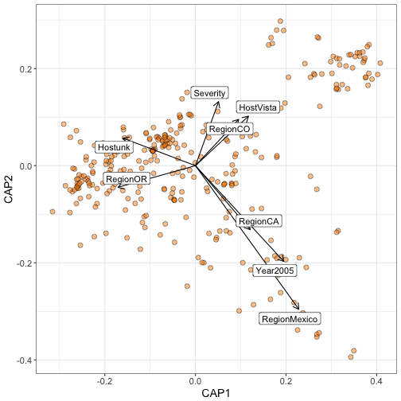
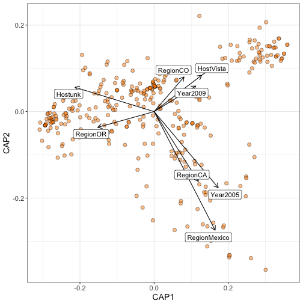

This document serves to re-assess Sajeewa's dbRDA analysis with the repeat
lengths that have been modified to avoid inconsistent allele calls. 

Modification in this case means that a tiny amount has been added or subtracted
to the repeat length to ensure that the alleles are all unique after division.

Below is my attempt at reproduction of Sajeewa's analysis.

## Packages and Data


```r
library('tidyverse')
```

```
## Loading tidyverse: ggplot2
## Loading tidyverse: tibble
## Loading tidyverse: tidyr
## Loading tidyverse: readr
## Loading tidyverse: purrr
## Loading tidyverse: dplyr
```

```
## Conflicts with tidy packages ----------------------------------------------
```

```
## filter(): dplyr, stats
## lag():    dplyr, stats
```

```r
library('poppr')
```

```
## Loading required package: adegenet
```

```
## Loading required package: ade4
```

```
## 
##    /// adegenet 2.1.0 is loaded ////////////
## 
##    > overview: '?adegenet'
##    > tutorials/doc/questions: 'adegenetWeb()' 
##    > bug reports/feature requests: adegenetIssues()
```

```
## This is poppr version 2.4.1. To get started, type package?poppr
## OMP parallel support: available
```

```r
library('vegan')
```

```
## Loading required package: permute
```

```
## Loading required package: lattice
```

```
## This is vegan 2.4-3
```

```
## 
## Attaching package: 'vegan'
```

```
## The following object is masked from 'package:ade4':
## 
##     cca
```

```r
library('ggrepel')
```


So, here Sajeewa clone-corrected the data according to the combination of
Host, Source (aka Field), Region (aka State/Country), and Year. 


```r
load("data/sclerotinia_16_loci.rda")
setPop(dat)   <- ~Host/Source/Region/Year
setPop(dat11) <- ~Host/Source/Region/Year
dat11cc <- clonecorrect(dat11, ~Host/Source/Region/Year, keep = 1:4)
dat16cc <- clonecorrect(dat, ~Host/Source/Region/Year, keep = 1:4)
dat11cc
```

```
## 
## This is a genclone object
## -------------------------
## Genotype information:
## 
##    165 original multilocus genotypes 
##    318 haploid individuals
##     11 codominant loci
## 
## Population information:
## 
##      5 strata - MCG, Region, Source, Year, Host
##    128 populations defined - 
## GH_unk_NE_2003, GH_unk_NY_2003, G122_wmn_MN_2003, ..., unk_pmc_ND_2010, unk_wlc_ND_2010, unk_flds_France_2012
```

```r
dat16cc
```

```
## 
## This is a genclone object
## -------------------------
## Genotype information:
## 
##    215 original multilocus genotypes 
##    342 haploid individuals
##     16 codominant loci
## 
## Population information:
## 
##      5 strata - MCG, Region, Source, Year, Host
##    128 populations defined - 
## GH_unk_NE_2003, GH_unk_NY_2003, G122_wmn_MN_2003, ..., unk_pmc_ND_2010, unk_wlc_ND_2010, unk_flds_France_2012
```

```r
# Asserting that nothing messed up with the metadata.
stopifnot(identical(indNames(dat11cc), other(dat11cc)$meta$Isolate))
stopifnot(identical(indNames(dat16cc), other(dat16cc)$meta$Isolate))

# function to gather Environmental variables, but averaging Severity
# (aka Straw Test, Virulence). This function is necessary because the
# data tends to randomly shuffle when being processed vai dplyr functions
# for better or for worse. ¯\_(ツ)_/¯
# 
# @param DAT the full data set
# @param CC The clone-corrected data set
# 
# @return A data frame containing Severity, Host, Source, Year, Region, and MLG
makeENV <- function(DAT, CC){
  # Creating the data frame with severity
  META   <- select(other(DAT)$meta, -Isolate)
  STRATA <- select(strata(DAT), -MCG)
  MLL    <- data.frame(MLG = mll(DAT))
  sev    <- bind_cols(META, STRATA, MLL) %>%
    group_by(Host, Source, Year, Region, MLG) %>% 
    summarize(Severity = mean(Severity)) %>% # Get mean severity per MLG
    ungroup()
  # Ensuring the data is in the correct order
  META   <- select(other(CC)$meta, -Isolate)
  STRATA <- select(strata(CC), -MCG)
  MLL    <- data.frame(MLG = mll(CC))
  bind_cols(META, STRATA, MLL) %>% 
    left_join(sev)
}

# Get environmental variables for 11 loci
ENV11 <- makeENV(dat11, dat11cc)
```

```
## Joining, by = c("Severity", "Region", "Source", "Year", "Host", "MLG")
```

```r
ENV11
```

```
## # A tibble: 318 × 6
##    Severity Region Source   Year   Host   MLG
##       <dbl> <fctr> <fctr> <fctr> <fctr> <int>
## 1       3.9     NE    unk   2003     GH   165
## 2       5.4     NE    unk   2003     GH   164
## 3       6.3     NY    unk   2003     GH    42
## 4       4.4     MN    wmn   2003   G122   165
## 5       4.7     MN    wmn   2003  Beryl   165
## 6       6.1     MI    wmn   2003  Beryl    30
## 7       5.5     MI    wmn   2003  Beryl    25
## 8       5.0     MI    wmn   2003  Beryl    40
## 9       5.2     MI    wmn   2003  Bunsi    27
## 10      5.3     MI    wmn   2003  Bunsi    20
## # ... with 308 more rows
```

```r
stopifnot(identical(ENV11$MLG, mll(dat11cc)))
ENV11 <- select(ENV11, -MLG)

# Get environmental variables for 16 loci
ENV16 <- makeENV(dat, dat16cc)
```

```
## Joining, by = c("Severity", "Region", "Source", "Year", "Host", "MLG")
```

```r
ENV16
```

```
## # A tibble: 342 × 6
##    Severity Region Source   Year   Host   MLG
##       <dbl> <fctr> <fctr> <fctr> <fctr> <int>
## 1       3.9     NE    unk   2003     GH   215
## 2       5.4     NE    unk   2003     GH   214
## 3       6.3     NY    unk   2003     GH    62
## 4       4.4     MN    wmn   2003   G122   211
## 5       4.7     MN    wmn   2003  Beryl   215
## 6       6.1     MI    wmn   2003  Beryl    17
## 7       5.5     MI    wmn   2003  Beryl    41
## 8       5.0     MI    wmn   2003  Beryl    49
## 9       5.2     MI    wmn   2003  Bunsi    15
## 10      5.3     MI    wmn   2003  Bunsi    28
## # ... with 332 more rows
```

```r
stopifnot(identical(ENV16$MLG, mll(dat16cc)))
ENV16 <- select(ENV16, -MLG)
```


## Functions to tie everything together

The analysis has a couple of steps

1. Model choice. Since we don't want to overparamaterize the model, we will use 
*vegan*'s built in model choice function `ordistep()` to to forward-backward 
selection of the appropriate model to fit our data. Yes, some (particularly 
Bayesians) believe that model choice is evil and the proper analysis will find 
the true pattern in the underlying data, but hey, I'm just trying to make sure 
that I'm not making overconfident judgements.

2. Plot the results of the model choice using ggplot2, overlaying the top 8 
explanitory vectors


```r
# model choice for dbrda/capscale
# 
# @param bdist a distance matrix (here, we use Bruvo's distances, which is why
#        it's called 'bdist').
# @param ENV a data frame of environmental variables with the same number of
#        observatios as bdist
# @param CHOOSER the name of the function to perform the forwards-backwards selection
# @param ... arguments to be passed on to CHOOSER
# 
# @return a capscale object
choose_dbrda <- function(bdist, ENV, CHOOSER = "ordistep", ...){
  # Step 1: create null model
  mod0  <- capscale(bdist ~ 1, data = ENV, add = TRUE)
  # Step 2: create full model (all variables in ENV)
  mod1  <- capscale(bdist ~ ., data = ENV, add = TRUE)
  # Step 3: Run forward-backwards selection (this can take a while)
  CHOOSER   <- match.fun(CHOOSER)
  the_model <- CHOOSER(mod0, scope = formula(mod1), ...)
  # Return the best model with the anova results
  return(the_model)
}

# This was ganked from https://github.com/gavinsimpson/ggvegan/blob/59d233977a5b2d15d4de150b782fb1794aa1de8b/R/utils.R
# 
# @title Scale Vectors to Data
# @description Scale vector arrows to \code{fill} proportion of the data.
# @param arrows a two-column matrix-like object containing coordinates for the arrows/vectors on x and y axes.
# @param data a two-column matrix-like object containing coordinates of the data on the x and y axes.
# @param at numeric vector of length 2; location of the origin of the arrows.
# @param fill numeric; what proportion of the range of the data to fill
# @return a numeric multiplier that will scale the arrows
# @author Gavin L. Simpson
arrowMul <- function(arrows, data, at = c(0, 0), fill = 0.75) {
    u <- c(range(data[,1], range(data[,2])))
    u <- u - rep(at, each = 2)
    r <- c(range(arrows[, 1], na.rm = TRUE), range(arrows[, 2], na.rm = TRUE))
    rev <- sign(diff(u))[-2]
    if (rev[1] < 0)
        u[1:2] <- u[2:1]
    if (rev[2] < 0)
        u[3:4] <- u[4:3]
    u <- u/r
    u <- u[is.finite(u) & u > 0]
    fill * min(u)
}
# Plotting the dbRDA results
# 
# @param db a capscale object
# @return a ggplot2 object from the scores 
plot_dbrda <- function(db){
  dbsum     <- scores(db, display = c("cn", "bp", "sites"), scaling = "sites")
  Centroids <- as.data.frame(dbsum$centroids)
  Centroids <- rownames_to_column(Centroids, var = "cent_type")
  Centroids <- mutate_(Centroids, .dots = list(Length = ~sqrt(CAP1^2 * CAP2^2)))
  # Centroids
  SampleCentroids <- rownames_to_column(data.frame(dbsum$sites), var = "isolate_names")
  
  mul     <- arrowMul(dbsum$biplot[, 1:2], dbsum$sites)
  Arrows  <- data.frame(dbsum$biplot * mul)
  Arrows  <- rownames_to_column(Arrows, var = "class")
  Arrows  <- mutate_(Arrows, .dots = list(Length = ~sqrt(CAP1^2 * CAP2^2)))
  Arrows  <- arrange(Arrows, Length)
  Arrows  <- top_n(Arrows, 8)
  ggplot(Centroids, aes(x = CAP1, y = CAP2))+
   geom_point(data = SampleCentroids, alpha = 1/2, fill = "dark orange", color = "black", size = 2.5, pch = 21)+
   coord_cartesian() +
   geom_segment(aes(x = 0, xend = CAP1, 
                    y = 0, yend = CAP2),
                arrow = arrow(length = unit(0.3, "cm")), 
                data = Arrows
                ) + 
   geom_label_repel(aes(x = CAP1, y = CAP2, label = class), data = Arrows)
}
```


# Calculations

Here come the calculations. Note, since I am verifying that we get the same
results from the 16 loci as we do for the 11 loci, we have to do this twice. 

1. calculate Bruvo's genetic distance.
2. model choice


```r
# 11 loci
dat11cc.bruvo <- dat11cc %>% bruvo.dist(replen = other(.)$REPLEN)
cap11cc       <- choose_dbrda(dat11cc.bruvo, ENV = ENV11, CHOOSER = "ordistep")
```

```
## 
## Start: bdist ~ 1 
## 
##            Df    AIC      F Pr(>F)   
## + Severity  1 1787.5 1.3622  0.005 **
## + Year      7 1790.8 1.4330  0.005 **
## + Region   13 1793.2 1.4902  0.005 **
## + Source   24 1808.2 1.0700  0.005 **
## + Host     26 1810.2 1.0581  0.005 **
## ---
## Signif. codes:  0 '***' 0.001 '**' 0.01 '*' 0.05 '.' 0.1 ' ' 1
## 
## Step: bdist ~ Severity 
## 
##            Df    AIC      F Pr(>F)   
## - Severity  1 1786.9 1.3622  0.005 **
## ---
## Signif. codes:  0 '***' 0.001 '**' 0.01 '*' 0.05 '.' 0.1 ' ' 1
## 
##          Df    AIC      F Pr(>F)   
## + Year    7 1791.4 1.4253  0.005 **
## + Region 13 1794.0 1.4790  0.005 **
## + Source 24 1808.9 1.0624  0.005 **
## + Host   26 1810.7 1.0603  0.005 **
## ---
## Signif. codes:  0 '***' 0.001 '**' 0.01 '*' 0.05 '.' 0.1 ' ' 1
## 
## Step: bdist ~ Severity + Year 
## 
##            Df    AIC      F Pr(>F)   
## - Year      7 1787.5 1.4253  0.005 **
## - Severity  1 1790.8 1.3112  0.005 **
## ---
## Signif. codes:  0 '***' 0.001 '**' 0.01 '*' 0.05 '.' 0.1 ' ' 1
## 
##          Df    AIC      F Pr(>F)   
## + Region 13 1798.6 1.3854  0.005 **
## + Source 23 1811.6 1.0521  0.005 **
## + Host   26 1813.9 1.0578  0.005 **
## ---
## Signif. codes:  0 '***' 0.001 '**' 0.01 '*' 0.05 '.' 0.1 ' ' 1
## 
## Step: bdist ~ Severity + Year + Region 
## 
##            Df    AIC      F Pr(>F)   
## - Severity  1 1798.0 1.2191  0.040 * 
## - Region   13 1791.4 1.3854  0.005 **
## - Year      7 1794.0 1.2581  0.005 **
## ---
## Signif. codes:  0 '***' 0.001 '**' 0.01 '*' 0.05 '.' 0.1 ' ' 1
## 
##          Df    AIC      F Pr(>F)   
## + Host   26 1819.3 1.0739  0.005 **
## + Source 23 1818.3 1.0261  0.045 * 
## ---
## Signif. codes:  0 '***' 0.001 '**' 0.01 '*' 0.05 '.' 0.1 ' ' 1
## 
## Step: bdist ~ Severity + Year + Region + Host 
## 
##            Df    AIC      F Pr(>F)   
## - Severity  1 1818.7 1.1541  0.060 . 
## - Host     26 1798.6 1.0739  0.005 **
## - Region   13 1813.9 1.3888  0.005 **
## - Year      7 1816.2 1.3362  0.005 **
## ---
## Signif. codes:  0 '***' 0.001 '**' 0.01 '*' 0.05 '.' 0.1 ' ' 1
## 
##          Df    AIC      F Pr(>F)
## + Source 21 1835.5 1.0018   0.52
```

```r
# 16 loci
dat16cc.bruvo <- dat16cc %>% bruvo.dist(replen = other(.)$REPLEN)
cap16cc       <- choose_dbrda(dat16cc.bruvo, ENV = ENV16, CHOOSER = "ordistep")
```

```
## 
## Start: bdist ~ 1 
## 
##            Df    AIC      F Pr(>F)   
## + Year      7 1928.0 1.4098  0.005 **
## + Region   13 1930.8 1.4593  0.005 **
## + Source   24 1944.1 1.1237  0.005 **
## + Host     26 1946.7 1.0853  0.005 **
## + Severity  1 1924.7 1.3085  0.015 * 
## ---
## Signif. codes:  0 '***' 0.001 '**' 0.01 '*' 0.05 '.' 0.1 ' ' 1
## 
## Step: bdist ~ Year 
## 
##        Df  AIC      F Pr(>F)   
## - Year  7 1924 1.4098  0.005 **
## ---
## Signif. codes:  0 '***' 0.001 '**' 0.01 '*' 0.05 '.' 0.1 ' ' 1
## 
##            Df    AIC      F Pr(>F)   
## + Severity  1 1928.8 1.2208  0.005 **
## + Region   13 1935.3 1.3893  0.005 **
## + Source   23 1947.1 1.1100  0.005 **
## + Host     26 1950.1 1.0827  0.005 **
## ---
## Signif. codes:  0 '***' 0.001 '**' 0.01 '*' 0.05 '.' 0.1 ' ' 1
## 
## Step: bdist ~ Year + Severity 
## 
##            Df    AIC      F Pr(>F)   
## - Severity  1 1928.0 1.2208  0.030 * 
## - Year      7 1924.7 1.3967  0.005 **
## ---
## Signif. codes:  0 '***' 0.001 '**' 0.01 '*' 0.05 '.' 0.1 ' ' 1
## 
##          Df    AIC      F Pr(>F)   
## + Region 13 1936.1 1.3858  0.005 **
## + Source 23 1947.9 1.1034  0.005 **
## + Host   26 1950.8 1.0813  0.005 **
## ---
## Signif. codes:  0 '***' 0.001 '**' 0.01 '*' 0.05 '.' 0.1 ' ' 1
## 
## Step: bdist ~ Year + Severity + Region 
## 
##            Df    AIC      F Pr(>F)   
## - Severity  1 1935.3 1.1830  0.040 * 
## - Region   13 1928.8 1.3858  0.005 **
## - Year      7 1931.5 1.2855  0.005 **
## ---
## Signif. codes:  0 '***' 0.001 '**' 0.01 '*' 0.05 '.' 0.1 ' ' 1
## 
##          Df    AIC      F Pr(>F)   
## + Host   26 1956.7 1.0878  0.005 **
## + Source 23 1955.3 1.0524  0.010 **
## ---
## Signif. codes:  0 '***' 0.001 '**' 0.01 '*' 0.05 '.' 0.1 ' ' 1
## 
## Step: bdist ~ Year + Severity + Region + Host 
## 
##            Df    AIC      F Pr(>F)   
## - Severity  1 1955.9 1.0817  0.125   
## - Host     26 1936.1 1.0878  0.005 **
## - Region   13 1950.8 1.3745  0.005 **
## - Year      7 1953.6 1.3645  0.005 **
## ---
## Signif. codes:  0 '***' 0.001 '**' 0.01 '*' 0.05 '.' 0.1 ' ' 1
## 
## Step: bdist ~ Year + Region + Host 
## 
##            Df    AIC      F Pr(>F)
## + Severity  1 1956.7 1.0817  0.115
## + Source   21 1972.3 1.0140  0.360
## 
##          Df    AIC      F Pr(>F)   
## - Host   26 1935.3 1.0918  0.005 **
## - Region 13 1950.1 1.3829  0.005 **
## - Year    7 1952.8 1.3693  0.005 **
## ---
## Signif. codes:  0 '***' 0.001 '**' 0.01 '*' 0.05 '.' 0.1 ' ' 1
## 
##            Df    AIC      F Pr(>F)  
## + Severity  1 1956.7 1.0817  0.085 .
## + Source   21 1972.3 1.0140  0.380  
## ---
## Signif. codes:  0 '***' 0.001 '**' 0.01 '*' 0.05 '.' 0.1 ' ' 1
```

# Plot the results

```r
plot_dbrda(cap11cc) + theme_bw() + theme(text = element_text(size = 14))
```

```
## Selecting by Length
```



```r
plot_dbrda(cap16cc) + theme_bw() + theme(text = element_text(size = 14))
```

```
## Selecting by Length
```



