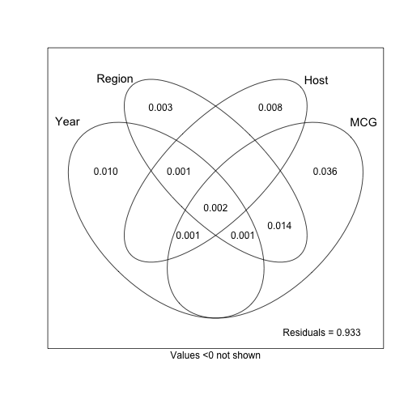
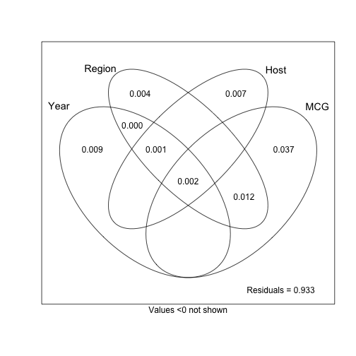

This document serves to re-assess Sajeewa's dbRDA analysis with the repeat
lengths that have been modified to avoid inconsistent allele calls. 

Modification in this case means that a tiny amount has been added or subtracted
to the repeat length to ensure that the alleles are all unique after division.

Below is my attempt at reproduction of Sajeewa's analysis.

## Packages and Data


```r
library('tidyverse')
```

```
## Loading tidyverse: ggplot2
## Loading tidyverse: tibble
## Loading tidyverse: tidyr
## Loading tidyverse: readr
## Loading tidyverse: purrr
## Loading tidyverse: dplyr
```

```
## Conflicts with tidy packages ----------------------------------------------
```

```
## filter(): dplyr, stats
## lag():    dplyr, stats
```

```r
library('poppr')
```

```
## Loading required package: adegenet
```

```
## Loading required package: ade4
```

```
## 
##    /// adegenet 2.1.0 is loaded ////////////
## 
##    > overview: '?adegenet'
##    > tutorials/doc/questions: 'adegenetWeb()' 
##    > bug reports/feature requests: adegenetIssues()
```

```
## This is poppr version 2.4.1. To get started, type package?poppr
## OMP parallel support: available
```

```r
library('vegan')
```

```
## Loading required package: permute
```

```
## Loading required package: lattice
```

```
## This is vegan 2.4-2
```

```
## 
## Attaching package: 'vegan'
```

```
## The following object is masked from 'package:ade4':
## 
##     cca
```


```r
load("data/sclerotinia_16_loci.rda")
keeploci <- !locNames(dat) %in% colnames(corrected_loci)
setPop(dat) <- ~Host/Source/Region/Year
dat11 <- dat[loc = keeploci, mlg.reset = TRUE]
dat11cc <- clonecorrect(dat11, ~Host/Source/Region/Year, keep = 1:4)
dat16cc   <- clonecorrect(dat, ~Host/Source/Region/Year, keep = 1:4)
dat11cc
```

```
## 
## This is a genclone object
## -------------------------
## Genotype information:
## 
##    165 original multilocus genotypes 
##    318 haploid individuals
##     11 codominant loci
## 
## Population information:
## 
##      5 strata - MCG, Region, Source, Year, Host
##    128 populations defined - 
## GH_unk_NE_2003, GH_unk_NY_2003, G122_wmn_MN_2003, ..., unk_pmc_ND_2010, unk_wlc_ND_2010, unk_flds_France_2012
```

```r
dat16cc
```

```
## 
## This is a genclone object
## -------------------------
## Genotype information:
## 
##    215 original multilocus genotypes 
##    342 haploid individuals
##     16 codominant loci
## 
## Population information:
## 
##      5 strata - MCG, Region, Source, Year, Host
##    128 populations defined - 
## GH_unk_NE_2003, GH_unk_NY_2003, G122_wmn_MN_2003, ..., unk_pmc_ND_2010, unk_wlc_ND_2010, unk_flds_France_2012
```

```r
# environmental variables for dbRDA
stopifnot(identical(indNames(dat11cc), other(dat11cc)$meta$Isolate))
ENV11 <- bind_cols(select(other(dat11cc)$meta, Severity), 
                   select(strata(dat11cc), -MCG))
ENV11
```

```
## # A tibble: 318 × 5
##    Severity Region Source   Year   Host
##       <dbl> <fctr> <fctr> <fctr> <fctr>
## 1       3.9     NE    unk   2003     GH
## 2       5.4     NE    unk   2003     GH
## 3       6.3     NY    unk   2003     GH
## 4       4.4     MN    wmn   2003   G122
## 5       4.7     MN    wmn   2003  Beryl
## 6       6.1     MI    wmn   2003  Beryl
## 7       5.5     MI    wmn   2003  Beryl
## 8       5.0     MI    wmn   2003  Beryl
## 9       5.2     MI    wmn   2003  Bunsi
## 10      5.3     MI    wmn   2003  Bunsi
## # ... with 308 more rows
```

```r
stopifnot(identical(indNames(dat16cc), other(dat16cc)$meta$Isolate))
ENV16 <- bind_cols(select(other(dat16cc)$meta, Severity), 
                   select(strata(dat16cc), -MCG))
ENV16
```

```
## # A tibble: 342 × 5
##    Severity Region Source   Year   Host
##       <dbl> <fctr> <fctr> <fctr> <fctr>
## 1       3.9     NE    unk   2003     GH
## 2       5.4     NE    unk   2003     GH
## 3       6.3     NY    unk   2003     GH
## 4       4.4     MN    wmn   2003   G122
## 5       4.7     MN    wmn   2003  Beryl
## 6       6.1     MI    wmn   2003  Beryl
## 7       5.5     MI    wmn   2003  Beryl
## 8       5.0     MI    wmn   2003  Beryl
## 9       5.2     MI    wmn   2003  Bunsi
## 10      5.3     MI    wmn   2003  Bunsi
## # ... with 332 more rows
```

## Calculate Bruvo's distance


```r
bruvo11cc <- bruvo.dist(dat11cc, replen = other(dat)$REPLEN)
bruvo16cc <- bruvo.dist(dat16cc, replen = other(dat)$REPLEN)
```


```r
commtab <- mlg.table(dat11cc, plot = FALSE)
cap11cc <- capscale(bruvo11cc ~ Region + Host + Year + Severity, 
                    data = ENV11, 
                    comm = , 
                    add = TRUE)
```


```r
capsum <- summary(cap11cc)
summary(summary(cap11cc))
```

```
##             Length Class             Mode     
## species     1896   -none-            numeric  
## sites       1908   -none-            numeric  
## constraints 1908   -none-            numeric  
## biplot       282   -none-            numeric  
## centroids    294   -none-            numeric  
## call           4   -none-            call     
## tot.chi        1   -none-            numeric  
## constr.chi     1   -none-            numeric  
## unconst.chi    1   -none-            numeric  
## cont           1   summary.eigenvals list     
## concont        1   summary.eigenvals list     
## scaling        1   -none-            numeric  
## digits         1   -none-            numeric  
## inertia        1   -none-            character
## method         1   -none-            character
```

```r
##########Extracting 10 most important centroids for factor constrains 
###############It doesn't matter how you start the ggplot aesthetics. Can be DecendCentro CAP1 and CAP2 or site_centroids
############### CAP1 and CAP2. Same graph is resulted

Centroids <- data.frame(capsum$centroids) #no need to convert to a dataframe
LenCent <- sqrt((Centroids[,1]^2)*(Centroids[,2]^2))   ###  This calculates the arrow length (ie. strength of the eigenvector)
NewCentro <- cbind(Centroids, LenCent)
DecendCentro <- head(NewCentro[order(NewCentro[,7], decreasing = T),], n=23)   ###  this finds the n strongest eigenvectors by ordering them
#above "head" is correct 

DecendCentro$cent_type <- rownames(head(DecendCentro, n=23))
DecendCentro <- head(DecendCentro, n = 10)
DecendCentro #constraint factor cetroids
```

```
##                    CAP1       CAP2       CAP3        CAP4        CAP5
## RegionMexico  1.7568225  2.9077793 -2.2014482 -0.72954306  0.34254863
## HostBL        2.2435774 -2.0346669 -1.1668713 -1.39595487  0.05561283
## HostVista     1.5876983 -1.7657525 -0.9754937 -0.50025166 -0.37326463
## HostPO7104    1.3700045  1.7198961  1.5229257  0.96220846  1.06234196
## HostPO7683   -2.0927428 -0.7876342 -0.2129480 -0.80665840  0.44813247
## RegionCA      0.8456832  1.1772811  2.1807474 -0.50641958 -0.55190313
## HostB07104   -1.9927561  0.4579972 -0.3473698 -1.68452154  1.07193458
## RegionMN      0.6326911 -1.2790534 -0.1452030 -0.08927733 -1.55615056
## Host37       -0.5208380  1.5041575  0.7716332 -1.86772581  1.82254789
## HostWeihing   1.5778502 -0.4865792  0.3653847 -0.32639590 -1.26188012
##                     CAP6   LenCent    cent_type
## RegionMexico -0.08969353 5.1084520 RegionMexico
## HostBL       -0.59405950 4.5649326       HostBL
## HostVista    -0.35602106 2.8034822    HostVista
## HostPO7104   -0.27298668 2.3562655   HostPO7104
## HostPO7683    2.83627619 1.6483158   HostPO7683
## RegionCA      1.23034277 0.9956069     RegionCA
## HostB07104   -0.32561990 0.9126768   HostB07104
## RegionMN      0.70383403 0.8092457     RegionMN
## Host37        0.69418578 0.7834224       Host37
## HostWeihing  -2.83983013 0.7677491  HostWeihing
```

```r
## Testing plot in ggplot

ggplot(data= DecendCentro, mapping = aes(x = CAP1, y = CAP2))+
  geom_text(aes(label = cent_type))+ # label tells geom_text which text you want to plot
  ylim(-3.5,3.5)+ #NB note that this is a convenience wrapper and may cut data out of your plot
  xlim(-3,3.5) #important if you are calculating stats in the plot - these will be excluded
```



```r
# sites/isolates
site_centroids <- data.frame(capsum$sites)
site_centroids$isolate_names <- rownames(site_centroids) # you can also put label = rownames() etc in the ggplot code. But sometimes you may want it in a column for later

##plotting both main centroids and isolates together
# I am plotting isolates firest and then envt centroids, alpha = transparancy
ggplot(DecendCentro, aes(x = CAP1, y = CAP2))+
  geom_point(data = site_centroids, colour = "orange", size =3.5, alpha =0.7)+
  geom_text(aes(label = cent_type))+
  ylim(-4,3.5)+
  xlim(-3.5,3.5)
```

```
## Warning: Removed 2 rows containing missing values (geom_point).
```



```r
#######strongest arrows: THESE ARE BIPLOT scores#############

arrws <- data.frame(capsum$biplot)
lenarrw <- sqrt(arrws[,1]^2*arrws[,2]^2)   ###  This calculates the arrow length (ie. strength of the eigenvector)
arrws <- cbind(arrws, lenarrw)
arrws <- head(arrws[order(arrws[,7], decreasing = T),], n=10)   ###  this finds the n strongest eigenvectors by ordering them
arrws
```

```
##                     CAP1       CAP2        CAP3        CAP4        CAP5
## RegionMexico  0.40574016  0.6715550 -0.50842697 -0.16848881  0.07911200
## Year2005      0.34641695  0.4474926 -0.02323603  0.25933778  0.05863497
## RegionCA      0.21502014  0.2993309  0.55446839 -0.12876028 -0.14032475
## HostVista     0.20829393 -0.2316533 -0.12797735 -0.06562921 -0.04896948
## RegionCO      0.16964747 -0.2166251 -0.09379121  0.06682042  0.11363009
## Hostunk      -0.28460826 -0.1288368 -0.14610380 -0.14493989  0.21266245
## RegionOR     -0.30406952  0.1011992  0.02100427 -0.27072362  0.03374797
## Severity      0.09077622 -0.2997102 -0.16622844 -0.17460239  0.11907111
## RegionMN      0.11208037 -0.2265826 -0.02572252 -0.01581536 -0.27566995
## RegionWA     -0.21865232  0.1156311  0.22914626  0.23453333  0.18669368
##                     CAP6    lenarrw
## RegionMexico -0.02071482 0.27247682
## Year2005     -0.18781863 0.15501902
## RegionCA      0.31282219 0.06436218
## HostVista    -0.04670725 0.04825197
## RegionCO      0.10047921 0.03674990
## Hostunk       0.04414344 0.03666801
## RegionOR      0.15390310 0.03077159
## Severity     -0.23300174 0.02720656
## RegionMN      0.12468324 0.02539546
## RegionWA      0.07463641 0.02528301
```

```r
arrws$class <- (rownames(arrws)) #turning rownames into a variable
mult <- attributes(capsum)$const/2.5 # 97% sure this is the scaling for the arrows, pls let me know if I'm wrong
arrws$class
```

```
##  [1] "RegionMexico" "Year2005"     "RegionCA"     "HostVista"   
##  [5] "RegionCO"     "Hostunk"      "RegionOR"     "Severity"    
##  [9] "RegionMN"     "RegionWA"
```

```r
#arrws$class <- c("MX", "ND", "CA", "mtc", "NE", "MCG ")  # change this if you want to change how names are displayed
#arrws$class <- c("MX", "mtc", "NE", "ND", "MCG", "CA")
##locations abbreviations; see the original for full names

#####plotting centroids, isolates and biplot arrows together#########
##@@@@@@@@@@@@@@@@@@@@@@@@@@@@@@@@@@@@@@@@@@@@@@@@@@@@@@@@@@@########

arrws$class <- c("Mexico", "2005", "CA", "Vista", "CO", "Host: unknown", "OR", "Severity", "MN", "WA")
mult <- attributes(capsum)$const/3 

(Cap_plot <- ggplot(DecendCentro, aes(x = CAP1, y = CAP2))+
   geom_text(aes(label = cent_type), colour = "blue")+
   geom_point(data = site_centroids, alpha=1/2, colour = "dark orange", size = 2.5, )+
   #coord_cartesian(x = c(-3.5, 3.5), y = c(-4.5, 2.5))+# For bruvo
   coord_cartesian(x = c(-3.5, 3.5), y = c(-2.5, 5))+
   geom_segment(data = arrws,
                aes(x = 0, xend = mult * CAP1, y = 0, yend = mult * CAP2),
                arrow = arrow(length = unit(0.3, "cm")), colour = "dark grey") + #grid is required for arrow to work.
   geom_text(data = arrws, color = "black",
             aes(x= (mult + mult/10) * CAP1, y = (mult + mult/10) * CAP2, label = arrws$class), #otherwise you could use hjust and vjust. I prefer this option
             size = 5, hjust = 0.5)+ theme_bw())
```


