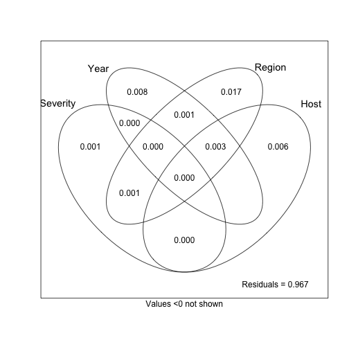

This document serves to re-assess Sajeewa's dbRDA analysis with the repeat
lengths that have been modified to avoid inconsistent allele calls. 

Modification in this case means that a tiny amount has been added or subtracted
to the repeat length to ensure that the alleles are all unique after division.

Below is my attempt at reproduction of Sajeewa's analysis.

## Packages and Data


```r
library('tidyverse')
library('poppr')
library('vegan')
library('ggrepel')
```


So, here Sajeewa clone-corrected the data according to the combination of
Host, Source (aka Field), Region (aka State/Country), and Year. 


```r
load(file.path(PROJHOME, "data", "sclerotinia_16_loci.rda"))
setPop(dat)   <- ~Host/Source/Region/Year
setPop(dat11) <- ~Host/Source/Region/Year
dat11cc <- clonecorrect(dat11, ~Host/Source/Region/Year, keep = 1:4)
dat16cc <- clonecorrect(dat, ~Host/Source/Region/Year, keep = 1:4)
dat11cc
```

```
## 
## This is a genclone object
## -------------------------
## Genotype information:
## 
##    165 original multilocus genotypes 
##    318 haploid individuals
##     11 codominant loci
## 
## Population information:
## 
##      5 strata - MCG, Region, Source, Year, Host
##    128 populations defined - 
## GH_unk_NE_2003, GH_unk_NY_2003, G122_wmn_MN_2003, ..., unk_pmc_ND_2010, unk_wlc_ND_2010, unk_flds_France_2012
```

```r
dat16cc
```

```
## 
## This is a genclone object
## -------------------------
## Genotype information:
## 
##    215 original multilocus genotypes 
##    342 haploid individuals
##     16 codominant loci
## 
## Population information:
## 
##      5 strata - MCG, Region, Source, Year, Host
##    128 populations defined - 
## GH_unk_NE_2003, GH_unk_NY_2003, G122_wmn_MN_2003, ..., unk_pmc_ND_2010, unk_wlc_ND_2010, unk_flds_France_2012
```

```r
# Asserting that nothing messed up with the metadata.
stopifnot(identical(indNames(dat11cc), other(dat11cc)$meta$Isolate))
stopifnot(identical(indNames(dat16cc), other(dat16cc)$meta$Isolate))

# function to gather Environmental variables, but averaging Severity
# (aka Straw Test, Virulence). This function is necessary because the
# data tends to randomly shuffle when being processed vai dplyr functions
# for better or for worse. ¯\_(ツ)_/¯
# 
# @param DAT the full data set
# @param CC The clone-corrected data set
# @param wmn should the "Source" column be converted to a binary wmn
#   factor? When this is true, everything that is not wmn will be converted
#   to "other"
# 
# @return A data frame containing Severity, Host, Source, Year, Region, and MLG
makeENV <- function(DAT, CC, wmn = FALSE){
  # Creating the data frame with severity
  META   <- select(other(DAT)$meta, -Isolate)
  STRATA <- strata(DAT)
  STRATA <- if (wmn) mutate(STRATA, Source = ifelse(Source == "wmn", "wmn", "other")) else STRATA
  MLL    <- data.frame(MLG = mll(DAT))
  sev    <- bind_cols(META, STRATA, MLL) %>%
    group_by(Host, Source, Year, Region, MLG) %>% 
    summarize(Severity = mean(Severity)) %>% # Get mean severity per MLG
    ungroup()
  # Ensuring the data is in the correct order
  META   <- select(other(CC)$meta, -Isolate)
  STRATA <- strata(CC)
  MLL    <- data.frame(MLG = mll(CC))
  bind_cols(META, STRATA, MLL) %>% 
    left_join(sev)
}

# Get environmental variables for 11 loci
ENV11 <- makeENV(dat11, dat11cc)
```

```
## Joining, by = c("Severity", "Region", "Source", "Year", "Host", "MLG")
```

```r
ENV11
```

```
## # A tibble: 318 x 7
##    Severity    MCG Region Source   Year   Host   MLG
##       <dbl> <fctr> <fctr> <fctr> <fctr> <fctr> <int>
##  1      3.9      4     NE    unk   2003     GH   165
##  2      5.4     45     NE    unk   2003     GH   164
##  3      6.3      5     NY    unk   2003     GH    42
##  4      4.4      4     MN    wmn   2003   G122   165
##  5      4.7      4     MN    wmn   2003  Beryl   165
##  6      6.1      3     MI    wmn   2003  Beryl    30
##  7      5.5      5     MI    wmn   2003  Beryl    25
##  8      5.0      3     MI    wmn   2003  Beryl    40
##  9      5.2      3     MI    wmn   2003  Bunsi    27
## 10      5.3      5     MI    wmn   2003  Bunsi    20
## # ... with 308 more rows
```

```r
stopifnot(identical(ENV11$MLG, mll(dat11cc)))
ENV11 <- select(ENV11, -MLG)

# Get environmental variables for 16 loci
ENV16 <- makeENV(dat, dat16cc)
```

```
## Joining, by = c("Severity", "Region", "Source", "Year", "Host", "MLG")
```

```r
ENV16
```

```
## # A tibble: 342 x 7
##    Severity    MCG Region Source   Year   Host   MLG
##       <dbl> <fctr> <fctr> <fctr> <fctr> <fctr> <int>
##  1      3.9      4     NE    unk   2003     GH   215
##  2      5.4     45     NE    unk   2003     GH   214
##  3      6.3      5     NY    unk   2003     GH    62
##  4      4.4      4     MN    wmn   2003   G122   211
##  5      4.7      4     MN    wmn   2003  Beryl   215
##  6      6.1      3     MI    wmn   2003  Beryl    17
##  7      5.5      5     MI    wmn   2003  Beryl    41
##  8      5.0      3     MI    wmn   2003  Beryl    49
##  9      5.2      3     MI    wmn   2003  Bunsi    15
## 10      5.3      5     MI    wmn   2003  Bunsi    28
## # ... with 332 more rows
```

```r
stopifnot(identical(ENV16$MLG, mll(dat16cc)))
ENV16 <- select(ENV16, -MLG)
```


## Functions to tie everything together

The analysis has a couple of steps

1. Model choice. Since we don't want to overparamaterize the model, we will use 
*vegan*'s built in model choice function `ordistep()` to to forward-backward 
selection of the appropriate model to fit our data. Yes, some (particularly 
Bayesians) believe that model choice is evil and the proper analysis will find 
the true pattern in the underlying data, but hey, I'm just trying to make sure 
that I'm not making overconfident judgements.

2. Plot the results of the model choice using ggplot2, overlaying the top 8 
explanitory vectors


```r
# model choice for dbrda/capscale
# 
# @param bdist a distance matrix (here, we use Bruvo's distances, which is why
#        it's called 'bdist').
# @param ENV a data frame of environmental variables with the same number of
#        observatios as bdist
# @param CHOOSER the name of the function to perform the forwards-backwards selection
# @param ... arguments to be passed on to CHOOSER
# 
# @return a capscale object
choose_dbrda <- function(bdist, ENV, CHOOSER = "ordistep", ...){
  # Step 1: create null model
  mod0  <- capscale(bdist ~ 1, data = ENV, add = TRUE)
  # Step 2: create full model (all variables in ENV)
  mod1  <- capscale(bdist ~ ., data = ENV, add = TRUE)
  # Step 3: Run forward-backwards selection (this can take a while)
  CHOOSER   <- match.fun(CHOOSER)
  the_model <- CHOOSER(mod0, scope = formula(mod1), ...)
  # Return the best model with the anova results
  return(the_model)
}

# This was ganked from https://github.com/gavinsimpson/ggvegan/blob/59d233977a5b2d15d4de150b782fb1794aa1de8b/R/utils.R
# 
# @title Scale Vectors to Data
# @description Scale vector arrows to \code{fill} proportion of the data.
# @param arrows a two-column matrix-like object containing coordinates for the arrows/vectors on x and y axes.
# @param data a two-column matrix-like object containing coordinates of the data on the x and y axes.
# @param at numeric vector of length 2; location of the origin of the arrows.
# @param fill numeric; what proportion of the range of the data to fill
# @return a numeric multiplier that will scale the arrows
# @author Gavin L. Simpson
arrowMul <- function(arrows, data, at = c(0, 0), fill = 0.75) {
    u <- c(range(data[,1], range(data[,2])))
    u <- u - rep(at, each = 2)
    r <- c(range(arrows[, 1], na.rm = TRUE), range(arrows[, 2], na.rm = TRUE))
    rev <- sign(diff(u))[-2]
    if (rev[1] < 0)
        u[1:2] <- u[2:1]
    if (rev[2] < 0)
        u[3:4] <- u[4:3]
    u <- u/r
    u <- u[is.finite(u) & u > 0]
    fill * min(u)
}
# Plotting the dbRDA results
# 
# @param db a capscale object
# @param arrows the number of arrows to plot
# @param seed a random seed to control plotting of labels
# @param lab a switch indicating if percent variance should be displayed on the
#   axes (default: TRUE)
# @param segal for the arrow labels, the segment alpha channel. Default to 1,
#   but can be set to 0, indicating that the labels should disappear.
# @return a ggplot2 object from the scores 
plot_dbrda <- function(db, arrows = 10, seed = 2017-06-28, lab = TRUE, segal = 1){
  set.seed(seed)
  dbsum     <- scores(db, display = c("cn", "bp", "sites"), scaling = "sites")
  Centroids <- as.data.frame(dbsum$centroids)
  Centroids <- rownames_to_column(Centroids, var = "cent_type")
  Centroids <- mutate_(Centroids, .dots = list(Length = ~sqrt(CAP1^2 * CAP2^2)))
  # Centroids
  SampleCentroids <- rownames_to_column(data.frame(dbsum$sites), var = "isolate_names")
  if (lab){
    labs    <- vegan:::summary.cca(db, axes = 0)[["cont"]][["importance"]]["Proportion Explained", 1:2]
    xl      <- paste0("Eig. 1 (", round(labs[[1]]*100, 2), "% variance explained)")
    yl      <- paste0("Eig. 2 (", round(labs[[2]]*100, 2), "% variance explained)")
  } else {
    xl      <- "Eig 1"
    yl      <- "Eig 2"
  }
  terms   <- paste0("(", paste(attr(db$terms, "term.labels"), collapse = "|"), ")")
  mul     <- arrowMul(dbsum$biplot[, 1:2], dbsum$sites)
  Arrows  <- data.frame(dbsum$biplot * mul)
  Arrows  <- rownames_to_column(Arrows, var = "class")
  # Making the classes presentable
  Arrows$class <- gsub(terms, "\\1: ", Arrows$class)
  Arrows$class <- gsub(": $", "", Arrows$class)
  Arrows$class <- gsub("unk", "unknown", Arrows$class)
  Arrows  <- mutate_(Arrows, .dots = list(Length = ~sqrt(CAP1^2 * CAP2^2)))
  Arrows  <- arrange(Arrows, Length)
  Arrows  <- top_n(Arrows, arrows)
  ggplot(Centroids, aes(x = CAP1, y = CAP2))+
    geom_point(data = SampleCentroids, 
               # alpha = 1/2, 
               # fill = "white",
               # fill = "dark orange", 
               color = "grey45", 
               size = 3, 
               pch = 21)+
    coord_cartesian() +
    geom_segment(aes(x = 0, xend = CAP1, 
                     y = 0, yend = CAP2),
                 arrow = arrow(length = unit(0.3, "cm")), 
                 data = Arrows
                 ) + 
    geom_label_repel(aes(x = CAP1, y = CAP2, label = class), 
                     point.padding = unit(0.5, "lines"),
                     segment.color = "grey25",
                     segment.alpha = segal,
                     data = Arrows) +
    xlab(xl) +
    ylab(yl)
}
```


# Calculations

Here come the calculations. Note, since I am verifying that we get the same
results from the 16 loci as we do for the 11 loci, we have to do this twice. 

1. calculate Bruvo's genetic distance.
2. model choice


```r
# 11 loci
dat11cc.bruvo <- dat11cc %>% bruvo.dist(replen = other(.)$REPLEN)
cap11cc       <- choose_dbrda(dat11cc.bruvo, ENV = ENV11, CHOOSER = "ordistep")
```

```
## 
## Start: bdist ~ 1 
## 
##            Df    AIC      F Pr(>F)   
## + Year      7 1790.8 1.4330  0.005 **
## + Region   13 1793.2 1.4902  0.005 **
## + Source   24 1808.2 1.0700  0.005 **
## + Host     26 1810.2 1.0581  0.005 **
## + MCG      85 1841.3 1.1958  0.005 **
## + Severity  1 1787.5 1.3622  0.015 * 
## ---
## Signif. codes:  0 '***' 0.001 '**' 0.01 '*' 0.05 '.' 0.1 ' ' 1
## 
## Step: bdist ~ Year 
## 
##        Df    AIC     F Pr(>F)   
## - Year  7 1786.9 1.433  0.005 **
## ---
## Signif. codes:  0 '***' 0.001 '**' 0.01 '*' 0.05 '.' 0.1 ' ' 1
## 
##            Df    AIC      F Pr(>F)   
## + Region   13 1798.0 1.3931  0.005 **
## + Source   23 1810.9 1.0586  0.005 **
## + Host     26 1813.4 1.0554  0.005 **
## + MCG      85 1843.2 1.1835  0.005 **
## + Severity  1 1791.4 1.3112  0.010 **
## ---
## Signif. codes:  0 '***' 0.001 '**' 0.01 '*' 0.05 '.' 0.1 ' ' 1
## 
## Step: bdist ~ Year + Region 
## 
##          Df    AIC      F Pr(>F)   
## - Region 13 1790.8 1.3931  0.005 **
## - Year    7 1793.2 1.2596  0.005 **
## ---
## Signif. codes:  0 '***' 0.001 '**' 0.01 '*' 0.05 '.' 0.1 ' ' 1
## 
##            Df    AIC      F Pr(>F)   
## + Host     26 1818.7 1.0761  0.005 **
## + MCG      84 1849.0 1.1270  0.005 **
## + Severity  1 1798.6 1.2191  0.025 * 
## + Source   23 1817.5 1.0333  0.065 . 
## ---
## Signif. codes:  0 '***' 0.001 '**' 0.01 '*' 0.05 '.' 0.1 ' ' 1
## 
## Step: bdist ~ Year + Region + Host 
## 
##          Df    AIC      F Pr(>F)   
## - Host   26 1798.0 1.0761  0.005 **
## - Region 13 1813.4 1.4048  0.005 **
## - Year    7 1815.5 1.3419  0.005 **
## ---
## Signif. codes:  0 '***' 0.001 '**' 0.01 '*' 0.05 '.' 0.1 ' ' 1
## 
##            Df    AIC      F Pr(>F)   
## + MCG      84 1856.8 1.1228  0.005 **
## + Severity  1 1819.3 1.1541  0.035 * 
## + Source   21 1834.9 1.0051  0.510   
## ---
## Signif. codes:  0 '***' 0.001 '**' 0.01 '*' 0.05 '.' 0.1 ' ' 1
## 
## Step: bdist ~ Year + Region + Host + MCG 
## 
##          Df    AIC      F Pr(>F)   
## - Region 12 1853.8 1.0622  0.020 * 
## - MCG    84 1818.7 1.1228  0.005 **
## - Host   26 1849.0 1.0718  0.005 **
## - Year    7 1857.8 1.2893  0.005 **
## ---
## Signif. codes:  0 '***' 0.001 '**' 0.01 '*' 0.05 '.' 0.1 ' ' 1
## 
##            Df    AIC      F Pr(>F)
## + Severity  1 1857.1 1.0071   0.47
## + Source   21 1860.6 1.0097   0.51
```

```r
# 16 loci
dat16cc.bruvo <- dat16cc %>% bruvo.dist(replen = other(.)$REPLEN)
cap16cc       <- choose_dbrda(dat16cc.bruvo, ENV = ENV16, CHOOSER = "ordistep")
```

```
## 
## Start: bdist ~ 1 
## 
##            Df    AIC      F Pr(>F)   
## + Severity  1 1924.7 1.3085  0.005 **
## + Year      7 1928.0 1.4098  0.005 **
## + Region   13 1930.8 1.4593  0.005 **
## + Source   24 1944.1 1.1237  0.005 **
## + Host     26 1946.7 1.0853  0.005 **
## + MCG      85 1978.7 1.2079  0.005 **
## ---
## Signif. codes:  0 '***' 0.001 '**' 0.01 '*' 0.05 '.' 0.1 ' ' 1
## 
## Step: bdist ~ Severity 
## 
##            Df  AIC      F Pr(>F)  
## - Severity  1 1924 1.3085  0.015 *
## ---
## Signif. codes:  0 '***' 0.001 '**' 0.01 '*' 0.05 '.' 0.1 ' ' 1
## 
##          Df    AIC      F Pr(>F)   
## + Year    7 1928.8 1.3967  0.005 **
## + Region 13 1931.5 1.4482  0.005 **
## + Source 24 1944.9 1.1148  0.005 **
## + Host   26 1947.3 1.0829  0.005 **
## + MCG    85 1979.4 1.2031  0.005 **
## ---
## Signif. codes:  0 '***' 0.001 '**' 0.01 '*' 0.05 '.' 0.1 ' ' 1
## 
## Step: bdist ~ Severity + Year 
## 
##            Df    AIC      F Pr(>F)   
## - Severity  1 1928.0 1.2208  0.015 * 
## - Year      7 1924.7 1.3967  0.005 **
## ---
## Signif. codes:  0 '***' 0.001 '**' 0.01 '*' 0.05 '.' 0.1 ' ' 1
## 
##          Df    AIC      F Pr(>F)   
## + Region 13 1936.1 1.3858  0.005 **
## + Source 23 1947.9 1.1034  0.005 **
## + Host   26 1950.8 1.0813  0.005 **
## + MCG    85 1981.3 1.1965  0.005 **
## ---
## Signif. codes:  0 '***' 0.001 '**' 0.01 '*' 0.05 '.' 0.1 ' ' 1
## 
## Step: bdist ~ Severity + Year + Region 
## 
##            Df    AIC      F Pr(>F)   
## - Severity  1 1935.3 1.1830  0.030 * 
## - Region   13 1928.8 1.3858  0.005 **
## - Year      7 1931.5 1.2855  0.005 **
## ---
## Signif. codes:  0 '***' 0.001 '**' 0.01 '*' 0.05 '.' 0.1 ' ' 1
## 
##          Df    AIC      F Pr(>F)   
## + Source 23 1955.3 1.0524  0.005 **
## + Host   26 1956.7 1.0878  0.005 **
## + MCG    84 1987.0 1.1470  0.005 **
## ---
## Signif. codes:  0 '***' 0.001 '**' 0.01 '*' 0.05 '.' 0.1 ' ' 1
## 
## Step: bdist ~ Severity + Year + Region + Source 
## 
##            Df    AIC      F Pr(>F)   
## - Severity  1 1954.5 1.0222  0.290   
## - Source   23 1936.1 1.0524  0.005 **
## - Region   13 1947.9 1.2781  0.005 **
## - Year      6 1951.9 1.2686  0.005 **
## ---
## Signif. codes:  0 '***' 0.001 '**' 0.01 '*' 0.05 '.' 0.1 ' ' 1
## 
## Step: bdist ~ Year + Region + Source 
## 
##            Df    AIC      F Pr(>F)   
## + MCG      84 1995.9 1.1410  0.005 **
## + Host     24 1972.3 1.0516  0.025 * 
## + Severity  1 1955.3 1.0222  0.310   
## ---
## Signif. codes:  0 '***' 0.001 '**' 0.01 '*' 0.05 '.' 0.1 ' ' 1
## 
## Step: bdist ~ Year + Region + Source + MCG 
## 
##          Df    AIC      F Pr(>F)   
## - Region 12 1991.9 1.0750  0.010 **
## - MCG    84 1954.5 1.1410  0.005 **
## - Source 23 1986.5 1.0500  0.005 **
## - Year    6 1995.0 1.1811  0.005 **
## ---
## Signif. codes:  0 '***' 0.001 '**' 0.01 '*' 0.05 '.' 0.1 ' ' 1
## 
##            Df    AIC      F Pr(>F)
## + Host     24 2001.6 1.0410   0.28
## + Severity  1 1996.4 0.9414   0.78
```

# ANOVA

The results of our modeling and the marginal effects for each parameter on the
model itself. 


```r
cap11cc
```

```
## Call: capscale(formula = bdist ~ Year + Region + Host + MCG, data
## = ENV, add = TRUE)
## 
##                Inertia Proportion Rank
## Total         274.7969     1.0000     
## Constrained   123.6330     0.4499  130
## Unconstrained 151.1639     0.5501  187
## Inertia is Lingoes adjusted squared Bruvo distance 
## Some constraints were aliased because they were collinear (redundant)
## 
## Eigenvalues for constrained axes:
##   CAP1   CAP2   CAP3   CAP4   CAP5   CAP6   CAP7   CAP8   CAP9  CAP10 
##  9.161  4.847  3.684  3.336  2.761  2.681  2.103  1.860  1.824  1.579 
##  CAP11  CAP12  CAP13  CAP14  CAP15  CAP16  CAP17  CAP18  CAP19  CAP20 
##  1.451  1.292  1.257  1.198  1.156  1.097  1.071  1.005  0.972  0.939 
##  CAP21  CAP22  CAP23  CAP24  CAP25  CAP26  CAP27  CAP28  CAP29  CAP30 
##  0.913  0.894  0.881  0.856  0.826  0.817  0.803  0.796  0.794  0.792 
##  CAP31  CAP32  CAP33  CAP34  CAP35  CAP36  CAP37  CAP38  CAP39  CAP40 
##  0.779  0.776  0.767  0.766  0.762  0.761  0.760  0.759  0.759  0.759 
##  CAP41  CAP42  CAP43  CAP44  CAP45  CAP46  CAP47  CAP48  CAP49  CAP50 
##  0.759  0.759  0.759  0.759  0.759  0.759  0.759  0.759  0.759  0.759 
##  CAP51  CAP52  CAP53  CAP54  CAP55  CAP56  CAP57  CAP58  CAP59  CAP60 
##  0.759  0.759  0.759  0.759  0.758  0.758  0.757  0.757  0.756  0.756 
##  CAP61  CAP62  CAP63  CAP64  CAP65  CAP66  CAP67  CAP68  CAP69  CAP70 
##  0.756  0.755  0.755  0.754  0.754  0.753  0.753  0.752  0.751  0.750 
##  CAP71  CAP72  CAP73  CAP74  CAP75  CAP76  CAP77  CAP78  CAP79  CAP80 
##  0.749  0.747  0.747  0.746  0.745  0.743  0.742  0.741  0.739  0.739 
##  CAP81  CAP82  CAP83  CAP84  CAP85  CAP86  CAP87  CAP88  CAP89  CAP90 
##  0.738  0.736  0.734  0.734  0.732  0.731  0.728  0.726  0.725  0.724 
##  CAP91  CAP92  CAP93  CAP94  CAP95  CAP96  CAP97  CAP98  CAP99 CAP100 
##  0.720  0.719  0.718  0.714  0.710  0.710  0.706  0.705  0.700  0.695 
## CAP101 CAP102 CAP103 CAP104 CAP105 CAP106 CAP107 CAP108 CAP109 CAP110 
##  0.694  0.692  0.688  0.682  0.677  0.673  0.670  0.669  0.661  0.658 
## CAP111 CAP112 CAP113 CAP114 CAP115 CAP116 CAP117 CAP118 CAP119 CAP120 
##  0.657  0.654  0.651  0.642  0.636  0.623  0.618  0.614  0.591  0.584 
## CAP121 CAP122 CAP123 CAP124 CAP125 CAP126 CAP127 CAP128 CAP129 CAP130 
##  0.579  0.555  0.546  0.522  0.512  0.487  0.462  0.408  0.372  0.317 
## 
## Eigenvalues for unconstrained axes:
##  MDS1  MDS2  MDS3  MDS4  MDS5  MDS6  MDS7  MDS8 
## 4.183 2.453 2.109 1.805 1.736 1.529 1.519 1.431 
## (Showed only 8 of all 187 unconstrained eigenvalues)
## 
## Constant added to distances: 0.7593611
```

```r
cap11cc$anova
```

```
##          Df    AIC      F Pr(>F)   
## + Year    7 1790.8 1.4330  0.005 **
## + Region 13 1798.0 1.3931  0.005 **
## + Host   26 1818.7 1.0761  0.005 **
## + MCG    84 1856.8 1.1228  0.005 **
## ---
## Signif. codes:  0 '***' 0.001 '**' 0.01 '*' 0.05 '.' 0.1 ' ' 1
```

```r
vegan::RsquareAdj(cap11cc)
```

```
## $r.squared
## [1] 0.4499068
## 
## $adj.r.squared
## [1] 0.06748906
```

```r
cap16cc
```

```
## Call: capscale(formula = bdist ~ Year + Region + Source + MCG,
## data = ENV, add = TRUE)
## 
##                Inertia Proportion Rank
## Total         276.6746     1.0000     
## Constrained   114.2379     0.4129  127
## Unconstrained 162.4367     0.5871  214
## Inertia is Lingoes adjusted squared Bruvo distance 
## Some constraints were aliased because they were collinear (redundant)
## 
## Eigenvalues for constrained axes:
##   CAP1   CAP2   CAP3   CAP4   CAP5   CAP6   CAP7   CAP8   CAP9  CAP10 
##  8.689  3.796  3.030  2.937  2.494  2.287  1.836  1.606  1.525  1.414 
##  CAP11  CAP12  CAP13  CAP14  CAP15  CAP16  CAP17  CAP18  CAP19  CAP20 
##  1.348  1.258  1.242  1.176  1.129  1.074  1.020  1.003  0.968  0.944 
##  CAP21  CAP22  CAP23  CAP24  CAP25  CAP26  CAP27  CAP28  CAP29  CAP30 
##  0.935  0.886  0.865  0.852  0.846  0.829  0.815  0.797  0.788  0.774 
##  CAP31  CAP32  CAP33  CAP34  CAP35  CAP36  CAP37  CAP38  CAP39  CAP40 
##  0.770  0.763  0.752  0.748  0.745  0.734  0.731  0.727  0.726  0.723 
##  CAP41  CAP42  CAP43  CAP44  CAP45  CAP46  CAP47  CAP48  CAP49  CAP50 
##  0.719  0.718  0.717  0.717  0.717  0.717  0.717  0.717  0.717  0.717 
##  CAP51  CAP52  CAP53  CAP54  CAP55  CAP56  CAP57  CAP58  CAP59  CAP60 
##  0.717  0.717  0.716  0.716  0.715  0.714  0.714  0.714  0.714  0.712 
##  CAP61  CAP62  CAP63  CAP64  CAP65  CAP66  CAP67  CAP68  CAP69  CAP70 
##  0.712  0.711  0.711  0.710  0.710  0.709  0.707  0.707  0.705  0.705 
##  CAP71  CAP72  CAP73  CAP74  CAP75  CAP76  CAP77  CAP78  CAP79  CAP80 
##  0.704  0.703  0.703  0.702  0.701  0.698  0.697  0.697  0.696  0.695 
##  CAP81  CAP82  CAP83  CAP84  CAP85  CAP86  CAP87  CAP88  CAP89  CAP90 
##  0.693  0.693  0.690  0.689  0.686  0.686  0.684  0.683  0.682  0.678 
##  CAP91  CAP92  CAP93  CAP94  CAP95  CAP96  CAP97  CAP98  CAP99 CAP100 
##  0.677  0.675  0.674  0.672  0.672  0.669  0.666  0.662  0.661  0.658 
## CAP101 CAP102 CAP103 CAP104 CAP105 CAP106 CAP107 CAP108 CAP109 CAP110 
##  0.657  0.654  0.651  0.648  0.645  0.643  0.638  0.635  0.630  0.628 
## CAP111 CAP112 CAP113 CAP114 CAP115 CAP116 CAP117 CAP118 CAP119 CAP120 
##  0.619  0.615  0.610  0.603  0.601  0.597  0.586  0.582  0.564  0.560 
## CAP121 CAP122 CAP123 CAP124 CAP125 CAP126 CAP127 
##  0.547  0.540  0.513  0.501  0.489  0.422  0.316 
## 
## Eigenvalues for unconstrained axes:
##  MDS1  MDS2  MDS3  MDS4  MDS5  MDS6  MDS7  MDS8 
## 3.818 2.169 1.807 1.727 1.617 1.439 1.354 1.285 
## (Showed only 8 of all 214 unconstrained eigenvalues)
## 
## Constant added to distances: 0.7174933
```

```r
cap16cc$anova
```

```
##            Df    AIC      F Pr(>F)   
## + Severity  1 1924.7 1.3085  0.005 **
## + Year      7 1928.8 1.3967  0.005 **
## + Region   13 1936.1 1.3858  0.005 **
## + Source   23 1955.3 1.0524  0.005 **
## - Severity  1 1954.5 1.0222  0.290   
## + MCG      84 1995.9 1.1410  0.005 **
## ---
## Signif. codes:  0 '***' 0.001 '**' 0.01 '*' 0.05 '.' 0.1 ' ' 1
```

```r
vegan::RsquareAdj(cap16cc)
```

```
## $r.squared
## [1] 0.4128962
## 
## $adj.r.squared
## [1] 0.06447479
```


We can test the effects of how much of the model explains the variance


```r
anova(cap11cc)
```

```
## Permutation test for capscale under reduced model
## Permutation: free
## Number of permutations: 999
## 
## Model: capscale(formula = bdist ~ Year + Region + Host + MCG, data = ENV, add = TRUE)
##           Df SumOfSqs      F Pr(>F)    
## Model    130   123.63 1.1765  0.001 ***
## Residual 187   151.16                  
## ---
## Signif. codes:  0 '***' 0.001 '**' 0.01 '*' 0.05 '.' 0.1 ' ' 1
```

```r
anova(cap16cc)
```

```
## Permutation test for capscale under reduced model
## Permutation: free
## Number of permutations: 999
## 
## Model: capscale(formula = bdist ~ Year + Region + Source + MCG, data = ENV, add = TRUE)
##           Df SumOfSqs     F Pr(>F)    
## Model    127   114.24 1.185  0.001 ***
## Residual 214   162.44                 
## ---
## Signif. codes:  0 '***' 0.001 '**' 0.01 '*' 0.05 '.' 0.1 ' ' 1
```

We can also see the marginal effects with `by = "margin"`


```r
set.seed(2017-08-17)
(cap11anova <- anova(cap11cc, by = "margin"))
```

```
## Permutation test for capscale under reduced model
## Marginal effects of terms
## Permutation: free
## Number of permutations: 999
## 
## Model: capscale(formula = bdist ~ Year + Region + Host + MCG, data = ENV, add = TRUE)
##           Df SumOfSqs      F Pr(>F)    
## Year       7    7.296 1.2893  0.001 ***
## Region    12   10.304 1.0622  0.007 ** 
## Host      26   22.526 1.0718  0.001 ***
## MCG       84   76.243 1.1228  0.001 ***
## Residual 187  151.164                  
## ---
## Signif. codes:  0 '***' 0.001 '**' 0.01 '*' 0.05 '.' 0.1 ' ' 1
```

```r
set.seed(2017-08-17)
(cap16anova <- anova(cap16cc, by = "margin"))
```

```
## Permutation test for capscale under reduced model
## Marginal effects of terms
## Permutation: free
## Number of permutations: 999
## 
## Model: capscale(formula = bdist ~ Year + Region + Source + MCG, data = ENV, add = TRUE)
##           Df SumOfSqs      F Pr(>F)    
## Year       6    5.379 1.1811  0.001 ***
## Region    12    9.792 1.0750  0.001 ***
## Source    23   18.331 1.0500  0.002 ** 
## MCG       84   72.750 1.1410  0.001 ***
## Residual 214  162.437                  
## ---
## Signif. codes:  0 '***' 0.001 '**' 0.01 '*' 0.05 '.' 0.1 ' ' 1
```


# Plot the results


```r
set.seed(999)
plot_dbrda(cap11cc, arrows = 5) + 
  theme_classic(base_size = 16, base_family = "Helvetica") + 
  theme(axis.text = element_text(color = "black")) +
  theme(aspect.ratio = 1)
```

```
## Selecting by Length
```


```r
plot_dbrda(cap16cc, arrows = 10) +
  theme_classic(base_size = 16, base_family = "Helvetica") + 
  theme(axis.text = element_text(color = "black")) +
  theme(aspect.ratio = 1)
```

```
## Selecting by Length
```


This is all well and good, but what exactly does it actually mean to have only 
3.33% variance explained (for 11 loci, that is) on the first axis? I was a bit stumped as well. 
Luckily, Gavin Simpson has some answers: http://stackoverflow.com/a/22537820/2752888

Basically, we have a situation where we have all of the variables
explaining 45% of the variance and the rest goes unexplained.


11 loci:


| Inertia| Proportion|
|-------:|----------:|
| 274.797|       1.00|
| 123.633|       0.45|
| 151.164|       0.55|


16 loci:


| Inertia| Proportion|
|-------:|----------:|
| 276.675|      1.000|
| 114.238|      0.413|
| 162.437|      0.587|


## Variance partitioning

First, we want to examine how the entire data fits with the model. We will use
the alleles as the representative of the entire data. 


```r
dat11raw <- genind2df(dat11cc, usepop = FALSE) %>% mutate_all(funs(as.integer(.)))
dat16raw <- genind2df(dat16cc, usepop = FALSE) %>% mutate_all(funs(as.integer(.)))
vp11     <- varpart(dat11cc.bruvo, ~Year + Region + Host + MCG, data = ENV11, comm = dat11raw, add = TRUE)
```

```
## Warning: collinearity detected in X1: mm = 131, m = 130
```

```
## Warning: collinearity detected in cbind(X1,X2): mm = 142, m = 141
```

```r
plot(vp11, Xnames = c("Full Model", "No Model"))
```


```r
try(vp16     <- varpart(dat16cc.bruvo, ~Year + Region + Host, data = ENV16, comm = dat16raw, add = TRUE))
```


```r
vp11 <- varpart(dat11cc.bruvo, ~Year, ~Region, ~Host, ~MCG, data = ENV11, add = TRUE)
```

```
## Warning: collinearity detected in cbind(X2,X4): mm = 98, m = 97
```

```
## Warning: collinearity detected in cbind(X1,X2,X4): mm = 105, m = 104
```

```
## Warning: collinearity detected in cbind(X2,X3,X4): mm = 124, m = 123
```

```
## Warning: collinearity detected in cbind(X1,X2,X3,X4): mm = 131, m = 130
```

```r
vp16 <- varpart(dat16cc.bruvo, ~Year, ~Region, ~Host, ~MCG, data = ENV16, add = TRUE)
```

```
## Warning: collinearity detected in cbind(X2,X4): mm = 98, m = 97
```

```
## Warning: collinearity detected in cbind(X1,X2,X4): mm = 105, m = 104
```

```
## Warning: collinearity detected in cbind(X2,X3,X4): mm = 124, m = 123
```

```
## Warning: collinearity detected in cbind(X1,X2,X3,X4): mm = 131, m = 130
```

```r
plot(vp11, digits = 2, Xnames = c("Year", "Region", "Host", "MCG"))
```


```r
plot(vp16, digits = 2, Xnames = c("Year", "Region", "Host", "MCG"))
```


Out of both of the models, MCG explains the most variance, but we have an 
interesting warning pop up indicating that there is multicollinearity within our
variables. It appears that all of these are multicollinear with MCG. Since dbRDA
assumes that all the variables are independent, it would be prudent to re-run 
the analysis without the MCG variables as well

## Removing Source of Multicollinearity


```r
# 11 loci
ENV112   <- select(ENV11, -MCG)
cap11cc2 <- choose_dbrda(dat11cc.bruvo, ENV = ENV112, CHOOSER = "ordistep")
```

```
## 
## Start: bdist ~ 1 
## 
##            Df    AIC      F Pr(>F)   
## + Year      7 1790.8 1.4330  0.005 **
## + Region   13 1793.2 1.4902  0.005 **
## + Source   24 1808.2 1.0700  0.005 **
## + Host     26 1810.2 1.0581  0.005 **
## + Severity  1 1787.5 1.3622  0.010 **
## ---
## Signif. codes:  0 '***' 0.001 '**' 0.01 '*' 0.05 '.' 0.1 ' ' 1
## 
## Step: bdist ~ Year 
## 
##        Df    AIC     F Pr(>F)   
## - Year  7 1786.9 1.433  0.005 **
## ---
## Signif. codes:  0 '***' 0.001 '**' 0.01 '*' 0.05 '.' 0.1 ' ' 1
## 
##            Df    AIC      F Pr(>F)   
## + Region   13 1798.0 1.3931  0.005 **
## + Source   23 1810.9 1.0586  0.005 **
## + Host     26 1813.4 1.0554  0.005 **
## + Severity  1 1791.4 1.3112  0.010 **
## ---
## Signif. codes:  0 '***' 0.001 '**' 0.01 '*' 0.05 '.' 0.1 ' ' 1
## 
## Step: bdist ~ Year + Region 
## 
##          Df    AIC      F Pr(>F)   
## - Region 13 1790.8 1.3931  0.005 **
## - Year    7 1793.2 1.2596  0.005 **
## ---
## Signif. codes:  0 '***' 0.001 '**' 0.01 '*' 0.05 '.' 0.1 ' ' 1
## 
##            Df    AIC      F Pr(>F)   
## + Host     26 1818.7 1.0761  0.005 **
## + Source   23 1817.5 1.0333  0.020 * 
## + Severity  1 1798.6 1.2191  0.025 * 
## ---
## Signif. codes:  0 '***' 0.001 '**' 0.01 '*' 0.05 '.' 0.1 ' ' 1
## 
## Step: bdist ~ Year + Region + Host 
## 
##          Df    AIC      F Pr(>F)   
## - Host   26 1798.0 1.0761  0.005 **
## - Region 13 1813.4 1.4048  0.005 **
## - Year    7 1815.5 1.3419  0.005 **
## ---
## Signif. codes:  0 '***' 0.001 '**' 0.01 '*' 0.05 '.' 0.1 ' ' 1
## 
##            Df    AIC      F Pr(>F)  
## + Severity  1 1819.3 1.1541  0.030 *
## + Source   21 1834.9 1.0051  0.435  
## ---
## Signif. codes:  0 '***' 0.001 '**' 0.01 '*' 0.05 '.' 0.1 ' ' 1
## 
## Step: bdist ~ Year + Region + Host + Severity 
## 
##            Df    AIC      F Pr(>F)   
## - Severity  1 1818.7 1.1541  0.055 . 
## - Host     26 1798.6 1.0739  0.005 **
## - Region   13 1813.9 1.3888  0.005 **
## - Year      7 1816.2 1.3362  0.005 **
## ---
## Signif. codes:  0 '***' 0.001 '**' 0.01 '*' 0.05 '.' 0.1 ' ' 1
## 
##          Df    AIC      F Pr(>F)
## + Source 21 1835.5 1.0018   0.51
```


```r
cap11cc2
```

```
## Call: capscale(formula = bdist ~ Year + Region + Host + Severity,
## data = ENV, add = TRUE)
## 
##               Inertia Proportion Rank
## Total         274.797      1.000     
## Constrained    48.358      0.176   47
## Unconstrained 226.439      0.824  270
## Inertia is Lingoes adjusted squared Bruvo distance 
## 
## Eigenvalues for constrained axes:
##  CAP1  CAP2  CAP3  CAP4  CAP5  CAP6  CAP7  CAP8  CAP9 CAP10 CAP11 CAP12 
## 5.304 3.249 2.473 2.199 1.712 1.422 1.308 1.066 1.036 1.013 0.895 0.879 
## CAP13 CAP14 CAP15 CAP16 CAP17 CAP18 CAP19 CAP20 CAP21 CAP22 CAP23 CAP24 
## 0.863 0.833 0.807 0.793 0.787 0.780 0.771 0.769 0.764 0.761 0.759 0.759 
## CAP25 CAP26 CAP27 CAP28 CAP29 CAP30 CAP31 CAP32 CAP33 CAP34 CAP35 CAP36 
## 0.757 0.756 0.755 0.754 0.751 0.750 0.749 0.743 0.742 0.734 0.729 0.728 
## CAP37 CAP38 CAP39 CAP40 CAP41 CAP42 CAP43 CAP44 CAP45 CAP46 CAP47 
## 0.720 0.713 0.711 0.709 0.703 0.682 0.668 0.662 0.645 0.634 0.563 
## 
## Eigenvalues for unconstrained axes:
##  MDS1  MDS2  MDS3  MDS4  MDS5  MDS6  MDS7  MDS8 
## 8.202 4.462 3.542 3.175 2.832 2.324 2.142 2.097 
## (Showed only 8 of all 270 unconstrained eigenvalues)
## 
## Constant added to distances: 0.7593611
```

```r
cap11cc2$anova
```

```
##            Df    AIC      F Pr(>F)   
## + Year      7 1790.8 1.4330  0.005 **
## + Region   13 1798.0 1.3931  0.005 **
## + Host     26 1818.7 1.0761  0.005 **
## + Severity  1 1819.3 1.1541  0.030 * 
## ---
## Signif. codes:  0 '***' 0.001 '**' 0.01 '*' 0.05 '.' 0.1 ' ' 1
```

```r
vegan::RsquareAdj(cap11cc2)
```

```
## $r.squared
## [1] 0.1759766
## 
## $adj.r.squared
## [1] 0.03253551
```


```r
set.seed(2017-08-17)
anova(cap11cc2)
```

```
## Permutation test for capscale under reduced model
## Permutation: free
## Number of permutations: 999
## 
## Model: capscale(formula = bdist ~ Year + Region + Host + Severity, data = ENV, add = TRUE)
##           Df SumOfSqs      F Pr(>F)    
## Model     47   48.358 1.2268  0.001 ***
## Residual 270  226.439                  
## ---
## Signif. codes:  0 '***' 0.001 '**' 0.01 '*' 0.05 '.' 0.1 ' ' 1
```

We can also see the marginal effects with `by = "margin"`


```r
set.seed(2017-08-17)
(cap11anova2 <- anova(cap11cc2, by = "margin"))
```

```
## Permutation test for capscale under reduced model
## Marginal effects of terms
## Permutation: free
## Number of permutations: 999
## 
## Model: capscale(formula = bdist ~ Year + Region + Host + Severity, data = ENV, add = TRUE)
##           Df SumOfSqs      F Pr(>F)    
## Year       7    7.844 1.3362  0.001 ***
## Region    13   15.141 1.3888  0.001 ***
## Host      26   23.418 1.0739  0.001 ***
## Severity   1    0.968 1.1541  0.039 *  
## Residual 270  226.439                  
## ---
## Signif. codes:  0 '***' 0.001 '**' 0.01 '*' 0.05 '.' 0.1 ' ' 1
```


```r
set.seed(999)
plot_dbrda(cap11cc2, arrows = 5, segal = 0) + 
  theme_classic(base_size = 16, base_family = "Helvetica") + 
  theme(axis.text = element_text(color = "black")) +
  theme(aspect.ratio = 1)
```

```
## Selecting by Length
```


```r
if (!interactive()) {
  FILE <- file.path(PROJHOME, "results", "figures", "publication", "Figure7Z.pdf")
  ggsave(filename = FILE, width = 88, height = 88, units = "mm", scale = 1.25)
}
```

What we can see here is that the amount of explained variance went down a bit to
1.92, and our model now only explains 16% of the variance. 


| Inertia| Proportion|
|-------:|----------:|
| 274.797|      1.000|
|  48.358|      0.176|
| 226.439|      0.824|


```r
vp11     <- varpart(dat11cc.bruvo, ~Severity + Year + Region + Host, data = ENV11, comm = dat11raw, add = TRUE)
plot(vp11, Xnames = c("Full Model", "No Model"))
```


```r
vp11 <- varpart(dat11cc.bruvo, ~Severity, ~Year, ~Region, ~Host, data = ENV11, add = TRUE)

plot(vp11, digits = 2, Xnames = c("Severity", "Year", "Region", "Host"))
```



## Saving Data

These data are important for reporting in the manuscript and expensive to 
generate, so I will save them here


```r
caplist1 <- list(
  anova = cap11anova,
  R2    = RsquareAdj(cap11cc),
  components = cap11sum[-1]
)
caplist2 <- list(
  anova = cap11anova2,
  R2    = RsquareAdj(cap11cc2),
  components = cap11sum2[-1]
)
saveRDS(caplist1, file.path(PROJHOME, "data", "caplist1.rds")) 
saveRDS(caplist2, file.path(PROJHOME, "data", "caplist2.rds")) 
```


# Conclusions

This analysis showed us two things: Severity is not an important predictor for 
genetic diversity, but Region, Host, Year, and MCG are all predictors of genetic
diversit. Explanations for this result could be due to a few reasons: MCG, a
phenotypic variable associated with pre-zygotic barriers has SOME genetic 
component to it; the MCGs that explained the most variation were also the MCGs
that were strongly associated with one genotype (i.e. MCG 5 has 19 isolates of
MLG 25).


<details>
<summary>Session Information</summary>


```
## Session info --------------------------------------------------------------------------------------
```

```
##  setting  value                       
##  version  R version 3.4.2 (2017-09-28)
##  system   x86_64, linux-gnu           
##  ui       X11                         
##  language (EN)                        
##  collate  en_US.UTF-8                 
##  tz       UTC                         
##  date     2017-11-15
```

```
## Packages ------------------------------------------------------------------------------------------
```

```
##  package     * version date       source                               
##  ade4        * 1.7-8   2017-08-09 cran (@1.7-8)                        
##  adegenet    * 2.1.0   2017-10-12 cran (@2.1.0)                        
##  ape           5.0     2017-10-30 cran (@5.0)                          
##  assertr       2.0.2.2 2017-06-06 cran (@2.0.2.2)                      
##  assertthat    0.2.0   2017-04-11 CRAN (R 3.4.2)                       
##  base        * 3.4.2   2017-11-01 local                                
##  bindr         0.1     2016-11-13 CRAN (R 3.4.2)                       
##  bindrcpp    * 0.2     2017-06-17 CRAN (R 3.4.2)                       
##  boot          1.3-20  2017-07-30 cran (@1.3-20)                       
##  broom         0.4.2   2017-02-13 CRAN (R 3.4.2)                       
##  cellranger    1.1.0   2016-07-27 CRAN (R 3.4.2)                       
##  cluster       2.0.6   2017-03-16 CRAN (R 3.4.2)                       
##  coda          0.19-1  2016-12-08 cran (@0.19-1)                       
##  codetools     0.2-15  2016-10-05 CRAN (R 3.4.2)                       
##  colorspace    1.3-2   2016-12-14 CRAN (R 3.4.2)                       
##  compiler      3.4.2   2017-11-01 local                                
##  cowplot     * 0.8.0   2017-07-30 cran (@0.8.0)                        
##  datasets    * 3.4.2   2017-11-01 local                                
##  deldir        0.1-14  2017-04-22 cran (@0.1-14)                       
##  devtools      1.13.3  2017-08-02 CRAN (R 3.4.2)                       
##  digest        0.6.12  2017-01-27 CRAN (R 3.4.2)                       
##  dplyr       * 0.7.4   2017-09-28 CRAN (R 3.4.2)                       
##  evaluate      0.10.1  2017-06-24 CRAN (R 3.4.2)                       
##  expm          0.999-2 2017-03-29 cran (@0.999-2)                      
##  ezknitr       0.6     2016-09-16 cran (@0.6)                          
##  fastmatch     1.1-0   2017-01-28 cran (@1.1-0)                        
##  forcats       0.2.0   2017-01-23 CRAN (R 3.4.2)                       
##  foreign       0.8-69  2017-06-21 CRAN (R 3.4.2)                       
##  gdata         2.18.0  2017-06-06 cran (@2.18.0)                       
##  ggcompoplot * 0.1.0   2017-11-14 Github (zkamvar/ggcompoplot@bcf007d) 
##  ggforce       0.1.1   2016-11-28 cran (@0.1.1)                        
##  ggplot2     * 2.2.1   2016-12-30 CRAN (R 3.4.2)                       
##  ggraph      * 1.0.0   2017-02-24 cran (@1.0.0)                        
##  ggrepel     * 0.7.0   2017-09-29 cran (@0.7.0)                        
##  ggtree      * 1.9.4   2017-11-14 Github (GuangchuangYu/ggtree@07063f9)
##  glue          1.2.0   2017-10-29 CRAN (R 3.4.2)                       
##  gmodels       2.16.2  2015-07-22 cran (@2.16.2)                       
##  graphics    * 3.4.2   2017-11-01 local                                
##  grDevices   * 3.4.2   2017-11-01 local                                
##  grid          3.4.2   2017-11-01 local                                
##  gridExtra     2.3     2017-09-09 CRAN (R 3.4.2)                       
##  gtable        0.2.0   2016-02-26 CRAN (R 3.4.2)                       
##  gtools        3.5.0   2015-05-29 cran (@3.5.0)                        
##  haven         1.1.0   2017-07-09 CRAN (R 3.4.2)                       
##  highr         0.6     2016-05-09 CRAN (R 3.4.2)                       
##  hms           0.3     2016-11-22 CRAN (R 3.4.2)                       
##  htmltools     0.3.6   2017-04-28 CRAN (R 3.4.2)                       
##  htmlwidgets   0.9     2017-07-10 CRAN (R 3.4.2)                       
##  httpuv        1.3.5   2017-07-04 CRAN (R 3.4.2)                       
##  httr          1.3.1   2017-08-20 CRAN (R 3.4.2)                       
##  igraph      * 1.1.2   2017-07-21 CRAN (R 3.4.2)                       
##  jsonlite      1.5     2017-06-01 CRAN (R 3.4.2)                       
##  knitr       * 1.17    2017-08-10 CRAN (R 3.4.2)                       
##  labeling      0.3     2014-08-23 CRAN (R 3.4.2)                       
##  lattice     * 0.20-35 2017-03-25 CRAN (R 3.4.2)                       
##  lazyeval      0.2.1   2017-10-29 CRAN (R 3.4.2)                       
##  LearnBayes    2.15    2014-05-29 cran (@2.15)                         
##  lubridate     1.7.0   2017-10-29 CRAN (R 3.4.2)                       
##  magrittr      1.5     2014-11-22 CRAN (R 3.4.2)                       
##  MASS          7.3-47  2017-04-21 CRAN (R 3.4.2)                       
##  Matrix        1.2-11  2017-08-16 CRAN (R 3.4.2)                       
##  memoise       1.1.0   2017-04-21 CRAN (R 3.4.2)                       
##  methods     * 3.4.2   2017-11-01 local                                
##  mgcv          1.8-22  2017-09-19 CRAN (R 3.4.2)                       
##  mime          0.5     2016-07-07 CRAN (R 3.4.2)                       
##  mnormt        1.5-5   2016-10-15 CRAN (R 3.4.2)                       
##  modelr        0.1.1   2017-07-24 CRAN (R 3.4.2)                       
##  munsell       0.4.3   2016-02-13 CRAN (R 3.4.2)                       
##  nlme          3.1-131 2017-02-06 CRAN (R 3.4.2)                       
##  parallel      3.4.2   2017-11-01 local                                
##  pegas         0.10    2017-05-03 cran (@0.10)                         
##  permute     * 0.9-4   2016-09-09 cran (@0.9-4)                        
##  phangorn      2.2.0   2017-04-03 cran (@2.2.0)                        
##  pkgconfig     2.0.1   2017-03-21 CRAN (R 3.4.2)                       
##  plyr          1.8.4   2016-06-08 CRAN (R 3.4.2)                       
##  poppr       * 2.5.0   2017-09-11 cran (@2.5.0)                        
##  psych         1.7.8   2017-09-09 CRAN (R 3.4.2)                       
##  purrr       * 0.2.4   2017-10-18 CRAN (R 3.4.2)                       
##  quadprog      1.5-5   2013-04-17 cran (@1.5-5)                        
##  R.methodsS3   1.7.1   2016-02-16 cran (@1.7.1)                        
##  R.oo          1.21.0  2016-11-01 cran (@1.21.0)                       
##  R.utils       2.5.0   2016-11-07 cran (@2.5.0)                        
##  R6            2.2.2   2017-06-17 CRAN (R 3.4.2)                       
##  Rcpp          0.12.13 2017-09-28 CRAN (R 3.4.2)                       
##  readr       * 1.1.1   2017-05-16 CRAN (R 3.4.2)                       
##  readxl        1.0.0   2017-04-18 CRAN (R 3.4.2)                       
##  reshape2      1.4.2   2016-10-22 CRAN (R 3.4.2)                       
##  rlang         0.1.2   2017-08-09 CRAN (R 3.4.2)                       
##  rvcheck       0.0.9   2017-07-10 cran (@0.0.9)                        
##  rvest         0.3.2   2016-06-17 CRAN (R 3.4.2)                       
##  scales        0.5.0   2017-08-24 CRAN (R 3.4.2)                       
##  seqinr        3.4-5   2017-08-01 cran (@3.4-5)                        
##  shiny         1.0.5   2017-08-23 CRAN (R 3.4.2)                       
##  sp            1.2-5   2017-06-29 CRAN (R 3.4.2)                       
##  spdep         0.6-15  2017-09-01 cran (@0.6-15)                       
##  splines       3.4.2   2017-11-01 local                                
##  stats       * 3.4.2   2017-11-01 local                                
##  stringi       1.1.5   2017-04-07 CRAN (R 3.4.2)                       
##  stringr       1.2.0   2017-02-18 CRAN (R 3.4.2)                       
##  tibble      * 1.3.4   2017-08-22 CRAN (R 3.4.2)                       
##  tidyr       * 0.7.2   2017-10-16 CRAN (R 3.4.2)                       
##  tidyverse   * 1.1.1   2017-01-27 CRAN (R 3.4.2)                       
##  tools         3.4.2   2017-11-01 local                                
##  treeio      * 1.1.2   2017-11-14 Github (GuangchuangYu/treeio@b6ae142)
##  tweenr        0.1.5   2016-10-10 cran (@0.1.5)                        
##  udunits2      0.13    2016-11-17 cran (@0.13)                         
##  units         0.4-6   2017-08-27 cran (@0.4-6)                        
##  utils       * 3.4.2   2017-11-01 local                                
##  vegan       * 2.4-4   2017-08-24 cran (@2.4-4)                        
##  viridis     * 0.4.0   2017-03-27 CRAN (R 3.4.2)                       
##  viridisLite * 0.2.0   2017-03-24 CRAN (R 3.4.2)                       
##  visNetwork  * 2.0.1   2017-07-30 cran (@2.0.1)                        
##  withr         2.0.0   2017-07-28 CRAN (R 3.4.2)                       
##  xml2          1.1.1   2017-01-24 CRAN (R 3.4.2)                       
##  xtable        1.8-2   2016-02-05 CRAN (R 3.4.2)
```

</details>
