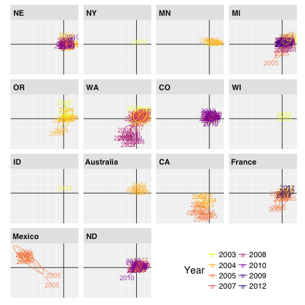
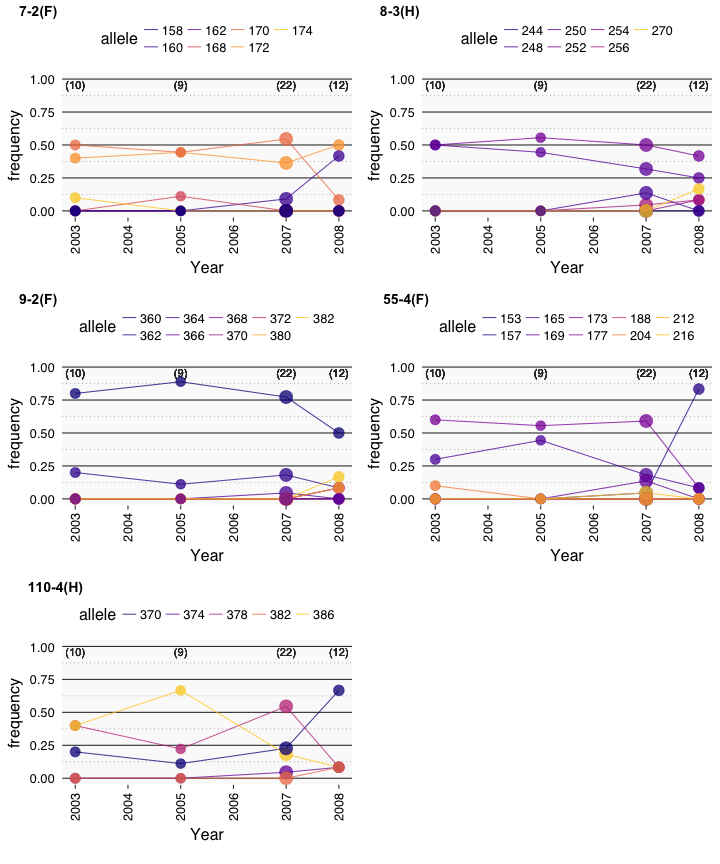
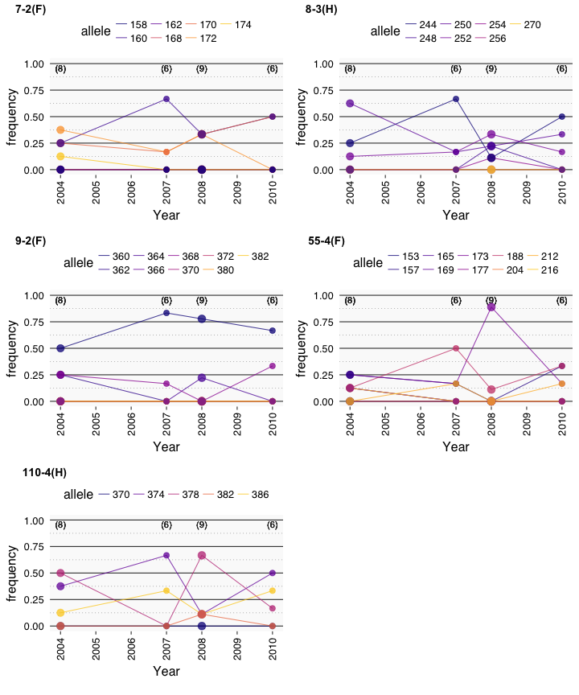
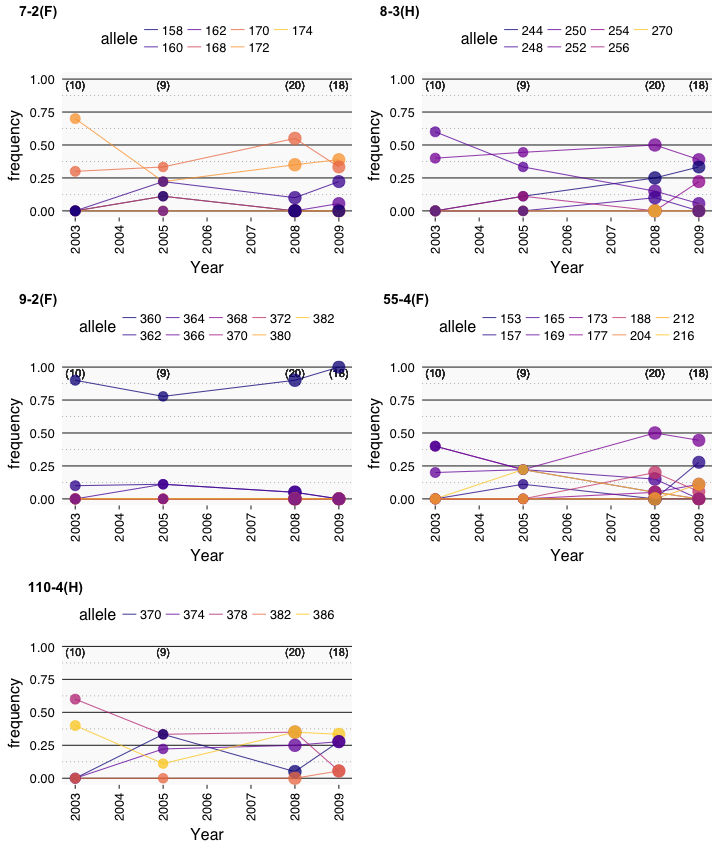

# Purpose

Because we have collections of isolates from the same WMN across different years,
we can investigate how populations change over the years. I'm attempting to be
careful with this analysis because, much like the white mold screening nursery
analysis, there are small sample sizes, which could bias the results.

# Data


```r
library("poppr")
```

```
## Loading required package: adegenet
```

```
## Loading required package: ade4
```

```
## 
##    /// adegenet 2.1.0 is loaded ////////////
## 
##    > overview: '?adegenet'
##    > tutorials/doc/questions: 'adegenetWeb()' 
##    > bug reports/feature requests: adegenetIssues()
```

```
## This is poppr version 2.5.0. To get started, type package?poppr
## OMP parallel support: available
```

```r
library("tidyverse")
```

```
## ── Attaching packages ────────────────────────────────── tidyverse 1.2.1 ──
```

```
## ✔ ggplot2 2.2.1     ✔ purrr   0.2.4
## ✔ tibble  1.3.4     ✔ dplyr   0.7.4
## ✔ tidyr   0.7.2     ✔ stringr 1.2.0
## ✔ readr   1.1.1     ✔ forcats 0.2.0
```

```
## ── Conflicts ───────────────────────────────────── tidyverse_conflicts() ──
## ✖ dplyr::filter() masks stats::filter()
## ✖ dplyr::lag()    masks stats::lag()
```

```r
library("cowplot")
```

```
## 
## Attaching package: 'cowplot'
```

```
## The following object is masked from 'package:ggplot2':
## 
##     ggsave
```

```r
make_amova_table <- function(am, amt, samples = "Region"){
  tot <- nrow(am$results)
  res <- data.frame(list(am$results[-tot, c("Df", "Sum Sq")], 
                         Percent = am$componentsofcovariance[-tot, 2],
                         Pval    = rev(amt$pvalue), 
                         Sigma   = am$componentsofcovariance[-tot, 1],
                         Phi     = rev(am$statphi$Phi[-tot])))
  res <- as.matrix(res)
  colnames(res) <- c("d.f.", "Sum of Squares", "Percent variation", "P", 
                     "Sigma", "Phi statistic")
  names(dimnames(res)) <- c("levels", "statistic")
  rownames(res) <- gsub("samples", samples, rownames(res))
  return(res)
}

make_amova_printable <- function(amtab, amtabcc){
  am_array <- array(dim      = c(dim(amtab), 2),
                    dimnames = c(dimnames(amtab), 
                                 list(c("full", "clone-corrected"))))
  am_array[, , 1] <- amtab
  am_array[, , 2] <- amtabcc
  tabfun <- function(x){
    x <- paste0(paste0(signif(x, 3), collapse = " ("), ")")
    return(x)
  }
  res <- apply(am_array, c(1, 2), tabfun)
  return(res)
}
```


```r
load("data/sclerotinia_16_loci.rda")
dat11cc <- dat11 %>%
  clonecorrect(~Region/Source/Host/Year) %>% 
  setPop(~Region/Year)

addStrata(dat11cc) <- strata(dat11cc) %>% 
  mutate(SourceType = forcats::fct_inorder(ifelse(Source == "wmn", "wmn", "other"))) %>%
  select(SourceType)
wmncc   <- dat11cc %>% 
  setPop(~Source) %>% 
  popsub("wmn") %>% 
  setPop(~Region/Year)
table(strata(dat11cc) %>% select(Region, Year))
```

```
##            Year
## Region      2003 2004 2005 2007 2008 2010 2009 2012
##   NE           2    8    5    6    9    6    1    0
##   NY           1    0    0    0    0    0    0    0
##   MN           2    7    0    0    0    0    0    0
##   MI          10    1    9    0   20    0   18    0
##   OR           8    9    0    0    0    0    0    0
##   WA          10    5    9   22   12    0    0    0
##   CO           1    0    0   14    0   19    0    0
##   WI           2    0    0    0    0    0    0    0
##   ID           1    0    0    0    0    0    0    0
##   Australia    0    6    0    0    0    0    0    0
##   CA           0    9    9    0    0    0    0    0
##   France       0    8    9    0    0    0    0    4
##   Mexico       0    0   15    0    0    0    0    0
##   ND           0    0    7   19    0   15    0    0
```

```r
table(strata(wmncc) %>% select(Region, Year))
```

```
##            Year
## Region      2003 2004 2005 2007 2008 2010 2009 2012
##   NE           0    8    5    0    9    2    0    0
##   NY           0    0    0    0    0    0    0    0
##   MN           2    7    0    0    0    0    0    0
##   MI           9    1    9    0   11    0   10    0
##   OR           6    9    0    0    0    0    0    0
##   WA           9    5    9    0   12    0    0    0
##   CO           1    0    0    0    0    0    0    0
##   WI           0    0    0    0    0    0    0    0
##   ID           0    0    0    0    0    0    0    0
##   Australia    0    4    0    0    0    0    0    0
##   CA           0    9    9    0    0    0    0    0
##   France       0    8    9    0    0    0    0    0
##   Mexico       0    0   15    0    0    0    0    0
##   ND           0    0    7    0    0    0    0    0
```

# Analysis of Molecular Variance

First, we should see what AMOVA tells us about population structure


```r
bdwmn <- bruvo.dist(wmncc, replen = other(wmncc)$REPLEN)
(wmn.amova <- poppr.amova(wmncc, ~Region/Year, dist = bdwmn))
```

```
## 
##  No missing values detected.
```

```
## $call
## ade4::amova(samples = xtab, distances = xdist, structures = xstruct)
## 
## $results
##                                Df    Sum Sq   Mean Sq
## Between Region                 10  8.216560 0.8216560
## Between samples Within Region  14  7.098156 0.5070111
## Within samples                160 26.346381 0.1646649
## Total                         184 41.661097 0.2264190
## 
## $componentsofcovariance
##                                                Sigma          %
## Variations  Between Region                0.01852328   8.022547
## Variations  Between samples Within Region 0.04770210  20.660075
## Variations  Within samples                0.16466488  71.317378
## Total variations                          0.23089026 100.000000
## 
## $statphi
##                           Phi
## Phi-samples-total  0.28682622
## Phi-samples-Region 0.22462108
## Phi-Region-total   0.08022547
```

```r
set.seed(2017-11-10)
(wmn.amova.test <- randtest(wmn.amova, nrepet = 999))
```

```
## class: krandtest lightkrandtest 
## Monte-Carlo tests
## Call: randtest.amova(xtest = wmn.amova, nrepet = 999)
## 
## Number of tests:   3 
## 
## Adjustment method for multiple comparisons:   none 
## Permutation number:   999 
##                         Test        Obs    Std.Obs   Alter Pvalue
## 1  Variations within samples 0.16466488 -27.192434    less  0.001
## 2 Variations between samples 0.04770210  12.976263 greater  0.001
## 3  Variations between Region 0.01852328   1.660739 greater  0.059
```

```r
make_amova_table(wmn.amova, wmn.amova.test, samples = "Year")
```

```
##                             statistic
## levels                       d.f. Sum of Squares Percent variation     P
##   Between Region               10       8.216560          8.022547 0.059
##   Between Year Within Region   14       7.098156         20.660075 0.001
##   Within Year                 160      26.346381         71.317378 0.001
##                             statistic
## levels                            Sigma Phi statistic
##   Between Region             0.01852328    0.08022547
##   Between Year Within Region 0.04770210    0.22462108
##   Within Year                0.16466488    0.28682622
```

```r
bdfull <- bruvo.dist(dat11cc, replen = other(dat11cc)$REPLEN)
(full.amova.2 <- poppr.amova(dat11cc, ~Region/Year, dist = bdfull))
```

```
## 
##  No missing values detected.
```

```
## $call
## ade4::amova(samples = xtab, distances = xdist, structures = xstruct)
## 
## $results
##                                Df   Sum Sq   Mean Sq
## Between Region                 13 10.19459 0.7841991
## Between samples Within Region  23 10.37047 0.4508901
## Within samples                281 49.03248 0.1744928
## Total                         317 69.59754 0.2195506
## 
## $componentsofcovariance
##                                                Sigma          %
## Variations  Between Region                0.01517709   6.819613
## Variations  Between samples Within Region 0.03288065  14.774461
## Variations  Within samples                0.17449282  78.405925
## Total variations                          0.22255056 100.000000
## 
## $statphi
##                           Phi
## Phi-samples-total  0.21594075
## Phi-samples-Region 0.15855763
## Phi-Region-total   0.06819613
```

```r
set.seed(2017-11-10)
(full.amova.2.test <- randtest(full.amova.2, nrepet = 999)) 
```

```
## class: krandtest lightkrandtest 
## Monte-Carlo tests
## Call: randtest.amova(xtest = full.amova.2, nrepet = 999)
## 
## Number of tests:   3 
## 
## Adjustment method for multiple comparisons:   none 
## Permutation number:   999 
##                         Test        Obs    Std.Obs   Alter Pvalue
## 1  Variations within samples 0.17449282 -26.807779    less  0.001
## 2 Variations between samples 0.03288065  13.398835 greater  0.001
## 3  Variations between Region 0.01517709   2.433687 greater  0.010
```

```r
(full.amova.3 <- poppr.amova(dat11cc, ~Region/SourceType/Year, dist = bdfull))
```

```
## 
##  No missing values detected.
```

```
## $call
## ade4::amova(samples = xtab, distances = xdist, structures = xstruct)
## 
## $results
##                                    Df    Sum Sq   Mean Sq
## Between Region                     13 10.194588 0.7841991
## Between SourceType Within Region    8  2.736249 0.3420311
## Between samples Within SourceType  22  9.367917 0.4258144
## Within samples                    274 47.298789 0.1726233
## Total                             317 69.597543 0.2195506
## 
## $componentsofcovariance
##                                                     Sigma          %
## Variations  Between Region                     0.01880585   8.449826
## Variations  Between SourceType Within Region  -0.00509255  -2.288179
## Variations  Between samples Within SourceType  0.03622242  16.275420
## Variations  Within samples                     0.17262332  77.562933
## Total variations                               0.22255904 100.000000
## 
## $statphi
##                                Phi
## Phi-samples-total       0.22437067
## Phi-samples-SourceType  0.17344103
## Phi-SourceType-Region  -0.02499372
## Phi-Region-total        0.08449826
```

```r
set.seed(2017-11-10)
(full.amova.3.test <- randtest(full.amova.3, nrepet = 999))
```

```
## class: krandtest lightkrandtest 
## Monte-Carlo tests
## Call: randtest.amova(xtest = full.amova.3, nrepet = 999)
## 
## Number of tests:   4 
## 
## Adjustment method for multiple comparisons:   none 
## Permutation number:   999 
##                            Test         Obs      Std.Obs   Alter Pvalue
## 1     Variations within samples  0.17262332 -25.41478779    less  0.001
## 2    Variations between samples  0.03622242  11.58330027 greater  0.001
## 3 Variations between SourceType -0.00509255  -0.07491136 greater  0.497
## 4     Variations between Region  0.01880585   1.66246920 greater  0.031
```

```r
make_amova_table(full.amova.2, full.amova.2.test, samples = "Year")
```

```
##                             statistic
## levels                       d.f. Sum of Squares Percent variation     P
##   Between Region               13       10.19459          6.819613 0.010
##   Between Year Within Region   23       10.37047         14.774461 0.001
##   Within Year                 281       49.03248         78.405925 0.001
##                             statistic
## levels                            Sigma Phi statistic
##   Between Region             0.01517709    0.06819613
##   Between Year Within Region 0.03288065    0.15855763
##   Within Year                0.17449282    0.21594075
```

```r
make_amova_table(full.amova.3, full.amova.3.test, samples = "Year")
```

```
##                                   statistic
## levels                             d.f. Sum of Squares Percent variation
##   Between Region                     13      10.194588          8.449826
##   Between SourceType Within Region    8       2.736249         -2.288179
##   Between Year Within SourceType     22       9.367917         16.275420
##   Within Year                       274      47.298789         77.562933
##                                   statistic
## levels                                 P       Sigma Phi statistic
##   Between Region                   0.031  0.01880585    0.08449826
##   Between SourceType Within Region 0.497 -0.00509255   -0.02499372
##   Between Year Within SourceType   0.001  0.03622242    0.17344103
##   Within Year                      0.001  0.17262332    0.22437067
```


```r
make_amova_table(full.amova.3, full.amova.3.test, samples = "Year") %>%  
  as_tibble() %>%
  add_column(Hierarchy = c("Between Region", "Between Source within Region", "Between Year within Source", "Within Year"), .before = 1) %>%
  readr::write_csv(path = file.path(PROJHOME, "results", "tables", "AMOVA-year.csv"), col_names = TRUE) %>%
  rename(ps = `Phi statistic`) %>%
  mutate_if(is.numeric, format, digits = 3) %>%
  # mutate(ps = signif(ps, digits = 3)) %>%
  mutate(ps = gsub("0\\.00(\\d{1})(\\d{2})", "\\1.\\2e^-3^", ps)) %>%
  # mutate(ps = case_when(P > 0.05 ~ ps, TRUE ~ paste0("**", ps, "**"))) %>%
  rename(`$\\Phi$ statistic` = ps) %>%
  rename(`$\\sigma^2$` = Sigma) %>%
  rename(`% variation` = `Percent variation`) %>%
  rename(S.S. = `Sum of Squares`) %>%
  rename(`*P*` = P) %>%
  select(c(1:3, 6, 4, 7, 5)) %>%
  huxtable::as_huxtable(add_colnames = TRUE) %>% 
  huxtable::set_col_width(c(0.7, 0.1, 0.12, 0.27, 0.31, 0.42, 0.15)) %>% 
  huxtable::set_align(huxtable::everywhere, 2:7, "right") %>% 
  huxtable::set_number_format(huxtable::everywhere, 2, 0) %>%
  huxtable::set_number_format(huxtable::everywhere, c(4, 6), 3) %>%
  huxtable::set_number_format(huxtable::everywhere, 7, 4) %>%
  huxtable::print_md(max_width = 93)
```

```
---------------------------------------------------------------------------------------
 Hierarchy                    d.f. S.S. $\sigma^2$ % variation $\Phi$ statistic    *P* 
----------------------------- ---- ---- ---------- ----------- ---------------- -------
 Between Region                 13 10.1      0.019        8.45            0.084 0.0310 
                                      9                                                
                                                                                       
 Between Source within Region    8 2.74     -0.005       -2.29           -0.025 0.4970 
                                                                                       
 Between Year within Source     22 9.37      0.036       16.28            0.173 0.0010 
                                                                                       
 Within Year                   274 47.3      0.173       77.56            0.224 0.0010 
                                      0                                                
---------------------------------------------------------------------------------------
```

# DAPC

Now that we have a result for the AMOVA showing a signficant difference in years, we can use DAPC to see where this difference is.


```r
setPop(dat11cc) <- ~Region/Year
set.seed(2017-08-18)
regyear.dapc <- xvalDapc(tab(dat11cc), pop(dat11cc), n.pca = 4:20, n.rep = 1000)$DAPC
```

```
## Warning in xvalDapc.matrix(tab(dat11cc), pop(dat11cc), n.pca = 4:20, n.rep
## = 1000): 5 groups have only 1 member: these groups cannot be represented in
## both training and validation sets.
```


```r
regyear.dapc
```

```
## 	#################################################
## 	# Discriminant Analysis of Principal Components #
## 	#################################################
## class: dapc
## $call: dapc.data.frame(x = as.data.frame(x), grp = ..1, n.pca = ..2, 
##     n.da = ..3)
## 
## $n.pca: 15 first PCs of PCA used
## $n.da: 15 discriminant functions saved
## $var (proportion of conserved variance): 0.803
## 
## $eig (eigenvalues): 35.01 12.7 8.425 7.253 5.519 ...
## 
##   vector    length content                   
## 1 $eig      15     eigenvalues               
## 2 $grp      318    prior group assignment    
## 3 $prior    37     prior group probabilities 
## 4 $assign   318    posterior group assignment
## 5 $pca.cent 69     centring vector of PCA    
## 6 $pca.norm 69     scaling vector of PCA     
## 7 $pca.eig  58     eigenvalues of PCA        
## 
##   data.frame    nrow ncol
## 1 $tab          318  15  
## 2 $means        37   15  
## 3 $loadings     15   15  
## 4 $ind.coord    318  15  
## 5 $grp.coord    37   15  
## 6 $posterior    318  37  
## 7 $pca.loadings 69   15  
## 8 $var.contr    69   15  
##   content                                          
## 1 retained PCs of PCA                              
## 2 group means                                      
## 3 loadings of variables                            
## 4 coordinates of individuals (principal components)
## 5 coordinates of groups                            
## 6 posterior membership probabilities               
## 7 PCA loadings of original variables               
## 8 contribution of original variables
```


```r
# A ggplot2 version of scatter.dapc
#
# @param DAPC an object of class "dapc" derived from [adegenet::dapc]
# @param STRATA a data frame defining the population strata (see [adegenet::strata])
# @param color the variable in `STRATA` defining the color palette for the plot
# @param filter a "quosure" containing a filtering method to be passed to [dplyr::filter]
#
# @return
# @export
#
# @examples
# library("adegenet")
# data(microbov)
# strata(microbov) <- as.data.frame(other(microbov))
# setPop(microbov) <- ~spe/breed
# mscat <- ggscatter(dapc(microbov, n.pca = 20, n.da = 40), strata(microbov),
#                    color = "breed",
#                    filter = quo(breed %in% c("Borgou", "Zebu", "Montbeliard", "Salers")))
# mscat + facet_wrap(~coun)
# mscat + facet_wrap(~spe)
# mscat + facet_wrap(~breed)
ggscatter <- function(DAPC, STRATA, color = "Year", filter = NULL){
  RYD <- bind_cols(Population = DAPC$grp, STRATA, as.data.frame(DAPC$ind.coord)) %>%
    as_tibble()
  RYD_pop <- RYD %>% 
    group_by(Population) %>% 
    summarize_if(is.numeric, mean, na.rm = TRUE) %>%
    rename_all(function(x) gsub("LD", "mean", x))
  RYD <- full_join(RYD, RYD_pop, by = "Population")
  yminor <- pretty(RYD$LD2)
  xminor <- pretty(RYD$LD1)
  RYD <- if (!is.null(filter)) filter(RYD, !!filter) else RYD
  RYD_PLOT <- ggplot(RYD, aes_string(x = "LD1", y = "LD2", color = color)) + 
    geom_text(aes_string(label = color), alpha = 0.75) +
    geom_segment(aes(x = mean1, y = mean2, xend = LD1, yend = LD2), alpha = 0.5) +
    stat_ellipse(type = "norm", level = 0.66, alpha = 0.75) + 
    theme_bw(base_size = 16, base_family = "Helvetica") +  
    theme(aspect.ratio = 0.8) +
    theme(legend.position = "bottom") +
    theme(axis.text = element_blank()) + 
    theme(axis.title = element_blank()) + 
    theme(axis.ticks = element_blank()) + 
    viridis::scale_color_viridis(discrete = TRUE, option = "C", direction = -1) +
    viridis::scale_fill_viridis(discrete = TRUE,  option = "C", direction = -1) +
    scale_y_continuous(breaks = 0, minor_breaks = yminor) + 
    scale_x_continuous(breaks = 0, minor_breaks = xminor) + 
    theme(panel.background = element_rect(fill = "grey95")) +
    theme(panel.grid.major = element_line(color = "grey20")) +
    theme(panel.grid.minor = element_line(color = "white")) 
  RYD_PLOT
}

quart <- quantile(regyear.dapc$var.contr, 0.95)
par(mfrow = c(2, 1))
ax1 <- loadingplot(regyear.dapc$var.contr, axis = 1, threshold = quart)$var.names %>%
  strsplit("\\.") %>% 
  map_chr(1) %>%
  unique()
ax2 <- loadingplot(regyear.dapc$var.contr, axis = 2, threshold = quart)$var.names %>%
  strsplit("\\.") %>% 
  map_chr(1) %>%
  unique()
```


```r
par(mfrow = c(1, 1))

yearscale <- viridis::viridis(nlevels(strata(dat11cc)$Year), option = "C", end = 0.9)
names(yearscale) <- sort(levels(strata(dat11cc)$Year))
gg_region_year <- ggscatter(regyear.dapc, strata(dat11cc)) +
  facet_wrap(~Region) +
  theme(legend.position = c(0.75, 0.1)) +
  guides(color = guide_legend(nrow = 4)) +
  scale_color_manual(values =  yearscale, breaks = names(yearscale)) +
  theme(legend.direction = "horizontal") +
  theme(strip.background = element_rect(color = NA, fill = "grey90")) +
  theme(strip.text = element_text(face = "bold", hjust = 0.05)) +
  theme(panel.border = element_blank())
gg_region_year
```



```r
if (!interactive()) {
  ggsave(filename = file.path(PROJHOME, "results/figures/publication/dapc_region_year.pdf"),
         plot = gg_region_year,
         width = 7,
         height = 7)
}
```


The loading plot shows us the variables that are important for the first axis of
separation.

There's an important thing going on in Washington where it appears that the
2008 population is separated from the main population.


```r
gg_region_year_micanewa <- ggscatter(regyear.dapc, strata(dat11cc), filter = quo(Region %in% c("WA", "CA", "NE", "MI"))) +
  facet_wrap(~Region, nrow = 2) +
  theme(legend.position = "right") +
  theme(legend.justification = "bottom") +
  scale_color_manual(values = yearscale, breaks = names(yearscale)) +
  theme(legend.box.margin = unit(c(0, 0, 0, 0), "lines")) +
  theme(legend.margin = unit(c(0, 0, 0, 0), "lines")) +
  theme(strip.background = element_rect(color = NA, fill = "grey90")) +
  theme(strip.text = element_text(face = "bold", hjust = 0.05)) +
  theme(panel.border = element_blank()) +
  theme(legend.key = element_rect(fill = "grey95"))
# 2017-11-18
# PeerJ has asked for me to label this figure with A-D for silly reasons
gg_region_year_mincanewa_lab <- gg_region_year_micanewa %+%
  mutate(gg_region_year_micanewa$data, 
         Region = case_when(
           Region == "NE" ~ "A (NE)",
           Region == "MI" ~ "B (MI)",
           Region == "WA" ~ "C (WA)",
           Region == "CA" ~ "D (CA)"
         ))
gg_region_year_mincanewa_lab
```


```r
if (!interactive()) {
    ggsave(filename = file.path(PROJHOME, "results/figures/publication/dapc_region_year_micanewa.pdf"),
       plot = gg_region_year_mincanewa_lab,
       width = 88,
       height = 0.8*88,
       units = "mm",
       scale = 1.25
       )
}
```

If we look at the tables above, we can see that there are only 12 samples from 
2008, all of whicha are in white mold screening nurseries. We also notice that
the coördinates for these isolates in the first two discriminant components are
overlapping with CA isolates. I suspect that there may be duplicate genotypes:


```r
mlg.crosspop(dat11cc, ~Region/Year, quiet = TRUE, df = TRUE) %>%
  inner_join(filter(., Population == "WA_2008") %>% select(MLG), by = "MLG") %>%
  spread(Population, Count, fill = 0) %>%
  knitr::kable()
```


|MLG     | CA_2005| France_2005| WA_2008|
|:-------|-------:|-----------:|-------:|
|MLG.113 |       1|           0|       1|
|MLG.119 |       1|           0|       1|
|MLG.120 |       1|           0|       1|
|MLG.61  |       1|           0|       1|
|MLG.69  |       1|           0|       1|
|MLG.72  |       1|           0|       1|
|MLG.79  |       1|           0|       1|
|MLG.81  |       1|           0|       1|
|MLG.82  |       1|           0|       1|
|MLG.85  |       0|           1|       1|
|MLG.86  |       0|           1|       1|
|MLG.87  |       0|           1|       1|

Well! It appears that ALL of the isolates in WA in 2008 have buddies in 2005 in
CA and France. We can take a look at how the allele frequencies are responding.


```r
dat11ccloc <- dat11cc[loc = c(ax1, ax2)]
loc <- map(seploc(dat11ccloc), . %>% 
             tab() %>% 
             as.data.frame() %>% 
             bind_cols(strata(dat11cc)) %>% 
             select(-MCG) %>%
             group_by(Region, Year) %>% 
             mutate(N = n()) %>%
             filter(N > 5) %>%
             summarize_if(is.numeric, mean, na.rm = TRUE) %>%
             ungroup() %>%
             mutate(Year = as.integer(as.character(Year))) %>%
             gather(allele, frequency, -Region, -Year, -N) %>%
             mutate(allele = as.integer(gsub("^.+?\\.([[:alnum:]]+)$", "\\1", allele)))
             # ,
             # .id = "Locus"
           )

ggloc <- function(dat, REG, years = 2003:2008){
  map(dat, . %>% 
    filter(Region == REG) %>% {
      ggplot(., aes(x = Year, y = frequency, color = allele, group = allele)) +
        geom_text(aes(label = paste0("(", N, ")")), y = 0.99, color = "grey20", vjust = 1) +
        geom_line(alpha = 0.75) +
        geom_point(aes(size = N), show.legend = FALSE, alpha = 0.75) +
        scale_x_continuous(breaks = years) +
        scale_y_continuous(limits = c(0, 1)) +
        theme_bw(base_size = 16, base_family = "Helvetica") +
        theme(legend.position = "top") +
        theme(aspect.ratio = 1/2) +
        theme(axis.text = element_text(color = "black")) +
        theme(axis.ticks.y = element_blank()) +
        theme(axis.text.x = element_text(angle = 90, vjust = 0.5, hjust = 1)) +
        # theme(axis.text.x.top = element_text(angle = 90, vjust = 0.5, hjust = 0)) +
        theme(panel.grid.minor.x = element_line(linetype = 0, color = "grey50")) +
        theme(panel.grid.major.x = element_line(linetype = 0, color = "grey50")) +
        theme(panel.grid.major = element_line(colour = "grey20")) +
        theme(panel.grid.minor = element_line(linetype = 3, colour = "grey50")) +
        # theme(panel.spacing.y = unit(0, "line")) +
        theme(panel.background = element_rect(color = NA, fill = "grey98")) +
        theme(strip.text = element_text(face = "bold", hjust = 0.05)) +
        theme(panel.border = element_blank()) +
        scale_size(range = c(3, 6), limits = c(6, 25)) +
        viridis::scale_color_viridis(option = "C", end = 0.9, 
                                     guide = "legend",
                                     breaks = sort(unique(.$allele)))
  })
}
ggl <- suppressMessages(ggloc(loc, "WA"))

cowplot::plot_grid(plotlist = ggl, labels = names(ggl), ncol = 2)
```



We can see that the allele frequencies seem to have a drastic change in the 
allele frequencies from 2007 to 2008. What happens if we look at a stable region
like NE?


```r
gglNE <- suppressMessages(ggloc(loc, "NE", 2003:2012))
cowplot::plot_grid(plotlist = gglNE, labels = names(gglNE), ncol = 2)
```



```r
gglMI <- suppressMessages(ggloc(loc, "MI", 2003:2012))
cowplot::plot_grid(plotlist = gglMI, labels = names(gglMI), ncol = 2)
```



It appears that MI is fairly stable, NE has some weird things going on with 2007
and 2008... I'm wondering if this may be a labeling issue.


<details>
<summary>Session Information</summary>


```
## Session info --------------------------------------------------------------------------------------
```

```
##  setting  value                       
##  version  R version 3.4.2 (2017-09-28)
##  system   x86_64, linux-gnu           
##  ui       X11                         
##  language (EN)                        
##  collate  en_US.UTF-8                 
##  tz       UTC                         
##  date     2018-04-12
```

```
## Packages ------------------------------------------------------------------------------------------
```

```
##  package     * version date       source                              
##  ade4        * 1.7-8   2017-08-09 cran (@1.7-8)                       
##  adegenet    * 2.1.0   2017-10-12 cran (@2.1.0)                       
##  ape           5.0     2017-10-30 cran (@5.0)                         
##  assertr       2.0.2.2 2017-06-06 cran (@2.0.2.2)                     
##  assertthat    0.2.0   2017-04-11 CRAN (R 3.4.2)                      
##  base        * 3.4.2   2018-03-01 local                               
##  bindr         0.1     2016-11-13 CRAN (R 3.4.2)                      
##  bindrcpp    * 0.2     2017-06-17 CRAN (R 3.4.2)                      
##  boot          1.3-20  2017-07-30 cran (@1.3-20)                      
##  broom         0.4.3   2017-11-20 CRAN (R 3.4.2)                      
##  cellranger    1.1.0   2016-07-27 CRAN (R 3.4.2)                      
##  cli           1.0.0   2017-11-05 CRAN (R 3.4.2)                      
##  cluster       2.0.6   2017-03-16 CRAN (R 3.4.2)                      
##  coda          0.19-1  2016-12-08 cran (@0.19-1)                      
##  codetools     0.2-15  2016-10-05 CRAN (R 3.4.2)                      
##  colorspace    1.3-2   2016-12-14 CRAN (R 3.4.2)                      
##  compiler      3.4.2   2018-03-01 local                               
##  cowplot     * 0.9.1   2017-11-16 cran (@0.9.1)                       
##  crayon        1.3.4   2017-09-16 CRAN (R 3.4.2)                      
##  datasets    * 3.4.2   2018-03-01 local                               
##  deldir        0.1-14  2017-04-22 cran (@0.1-14)                      
##  devtools      1.13.4  2017-11-09 CRAN (R 3.4.2)                      
##  digest        0.6.12  2017-01-27 CRAN (R 3.4.2)                      
##  dplyr       * 0.7.4   2017-09-28 CRAN (R 3.4.2)                      
##  evaluate      0.10.1  2017-06-24 CRAN (R 3.4.2)                      
##  expm          0.999-2 2017-03-29 cran (@0.999-2)                     
##  ezknitr       0.6     2016-09-16 cran (@0.6)                         
##  fastmatch     1.1-0   2017-01-28 cran (@1.1-0)                       
##  forcats     * 0.2.0   2017-01-23 CRAN (R 3.4.2)                      
##  foreign       0.8-69  2017-06-21 CRAN (R 3.4.2)                      
##  gdata         2.18.0  2017-06-06 cran (@2.18.0)                      
##  ggcompoplot * 0.1.0   2018-04-09 Github (zkamvar/ggcompoplot@bcf007d)
##  ggforce       0.1.1   2016-11-28 cran (@0.1.1)                       
##  ggplot2     * 2.2.1   2016-12-30 CRAN (R 3.4.2)                      
##  ggraph      * 1.0.0   2017-02-24 cran (@1.0.0)                       
##  ggrepel       0.7.0   2017-09-29 cran (@0.7.0)                       
##  glue          1.2.0   2017-10-29 CRAN (R 3.4.2)                      
##  gmodels       2.16.2  2015-07-22 cran (@2.16.2)                      
##  graphics    * 3.4.2   2018-03-01 local                               
##  grDevices   * 3.4.2   2018-03-01 local                               
##  grid          3.4.2   2018-03-01 local                               
##  gridExtra     2.3     2017-09-09 CRAN (R 3.4.2)                      
##  gtable        0.2.0   2016-02-26 CRAN (R 3.4.2)                      
##  gtools        3.5.0   2015-05-29 cran (@3.5.0)                       
##  haven         1.1.0   2017-07-09 CRAN (R 3.4.2)                      
##  highr         0.6     2016-05-09 CRAN (R 3.4.2)                      
##  hms           0.4.0   2017-11-23 CRAN (R 3.4.2)                      
##  htmltools     0.3.6   2017-04-28 CRAN (R 3.4.2)                      
##  htmlwidgets   0.9     2017-07-10 CRAN (R 3.4.2)                      
##  httpuv        1.3.5   2017-07-04 CRAN (R 3.4.2)                      
##  httr          1.3.1   2017-08-20 CRAN (R 3.4.2)                      
##  huxtable      1.1.0   2017-10-20 cran (@1.1.0)                       
##  igraph      * 1.1.2   2017-07-21 CRAN (R 3.4.2)                      
##  jsonlite      1.5     2017-06-01 CRAN (R 3.4.2)                      
##  KernSmooth    2.23-15 2015-06-29 cran (@2.23-15)                     
##  knitr       * 1.17    2017-08-10 CRAN (R 3.4.2)                      
##  labeling      0.3     2014-08-23 CRAN (R 3.4.2)                      
##  lattice       0.20-35 2017-03-25 CRAN (R 3.4.2)                      
##  lazyeval      0.2.1   2017-10-29 CRAN (R 3.4.2)                      
##  LearnBayes    2.15    2014-05-29 cran (@2.15)                        
##  lubridate     1.7.1   2017-11-03 CRAN (R 3.4.2)                      
##  magrittr      1.5     2014-11-22 CRAN (R 3.4.2)                      
##  MASS          7.3-47  2017-04-21 CRAN (R 3.4.2)                      
##  Matrix        1.2-12  2017-11-16 CRAN (R 3.4.2)                      
##  memoise       1.1.0   2017-04-21 CRAN (R 3.4.2)                      
##  methods     * 3.4.2   2018-03-01 local                               
##  mgcv          1.8-22  2017-09-19 CRAN (R 3.4.2)                      
##  mime          0.5     2016-07-07 CRAN (R 3.4.2)                      
##  mnormt        1.5-5   2016-10-15 CRAN (R 3.4.2)                      
##  modelr        0.1.1   2017-07-24 CRAN (R 3.4.2)                      
##  munsell       0.4.3   2016-02-13 CRAN (R 3.4.2)                      
##  nlme          3.1-131 2017-02-06 CRAN (R 3.4.2)                      
##  parallel      3.4.2   2018-03-01 local                               
##  pegas         0.10    2017-05-03 cran (@0.10)                        
##  permute       0.9-4   2016-09-09 cran (@0.9-4)                       
##  phangorn      2.3.1   2017-11-01 cran (@2.3.1)                       
##  pkgconfig     2.0.1   2017-03-21 CRAN (R 3.4.2)                      
##  plyr          1.8.4   2016-06-08 CRAN (R 3.4.2)                      
##  poppr       * 2.5.0   2017-09-11 cran (@2.5.0)                       
##  psych         1.7.8   2017-09-09 CRAN (R 3.4.2)                      
##  purrr       * 0.2.4   2017-10-18 CRAN (R 3.4.2)                      
##  quadprog      1.5-5   2013-04-17 cran (@1.5-5)                       
##  R.methodsS3   1.7.1   2016-02-16 cran (@1.7.1)                       
##  R.oo          1.21.0  2016-11-01 cran (@1.21.0)                      
##  R.utils       2.6.0   2017-11-05 cran (@2.6.0)                       
##  R6            2.2.2   2017-06-17 CRAN (R 3.4.2)                      
##  Rcpp          0.12.14 2017-11-23 CRAN (R 3.4.2)                      
##  readr       * 1.1.1   2017-05-16 CRAN (R 3.4.2)                      
##  readxl        1.0.0   2017-04-18 CRAN (R 3.4.2)                      
##  reshape2      1.4.2   2016-10-22 CRAN (R 3.4.2)                      
##  rlang         0.1.4   2017-11-05 CRAN (R 3.4.2)                      
##  rstudioapi    0.7     2017-09-07 CRAN (R 3.4.2)                      
##  rvest         0.3.2   2016-06-17 CRAN (R 3.4.2)                      
##  scales        0.5.0   2017-08-24 CRAN (R 3.4.2)                      
##  seqinr        3.4-5   2017-08-01 cran (@3.4-5)                       
##  shiny         1.0.5   2017-08-23 CRAN (R 3.4.2)                      
##  sp            1.2-5   2017-06-29 CRAN (R 3.4.2)                      
##  spData        0.2.6.7 2017-11-28 cran (@0.2.6.7)                     
##  spdep         0.7-4   2017-11-22 cran (@0.7-4)                       
##  splines       3.4.2   2018-03-01 local                               
##  stats       * 3.4.2   2018-03-01 local                               
##  stringi       1.1.6   2017-11-17 CRAN (R 3.4.2)                      
##  stringr     * 1.2.0   2017-02-18 CRAN (R 3.4.2)                      
##  tibble      * 1.3.4   2017-08-22 CRAN (R 3.4.2)                      
##  tidyr       * 0.7.2   2017-10-16 CRAN (R 3.4.2)                      
##  tidyselect    0.2.3   2017-11-06 CRAN (R 3.4.2)                      
##  tidyverse   * 1.2.1   2017-11-14 CRAN (R 3.4.2)                      
##  tools         3.4.2   2018-03-01 local                               
##  tweenr        0.1.5   2016-10-10 cran (@0.1.5)                       
##  udunits2      0.13    2016-11-17 cran (@0.13)                        
##  units         0.4-6   2017-08-27 cran (@0.4-6)                       
##  utils       * 3.4.2   2018-03-01 local                               
##  vegan         2.4-4   2017-08-24 cran (@2.4-4)                       
##  viridis     * 0.4.0   2017-03-27 CRAN (R 3.4.2)                      
##  viridisLite * 0.2.0   2017-03-24 CRAN (R 3.4.2)                      
##  visNetwork  * 2.0.1   2017-07-30 cran (@2.0.1)                       
##  withr         2.1.0   2017-11-01 CRAN (R 3.4.2)                      
##  xml2          1.1.1   2017-01-24 CRAN (R 3.4.2)                      
##  xtable        1.8-2   2016-02-05 CRAN (R 3.4.2)
```

</details>
