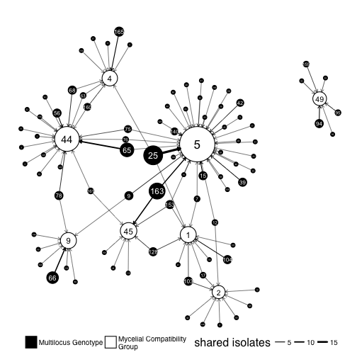
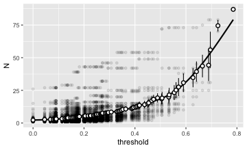
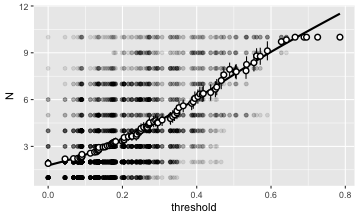

# Introduction 

The purpose of this document is to assess the distribution of the MLGs and MCGs
within the data. Specifically, we want to know if there are any MLGs that 
consistently coordinate with a single MCG, or if there are anything close.

## Packages and Data


```r
library('igraph')
library('ggraph')
library('tidyverse')
library('poppr')
library('viridis')
library('visNetwork')
```


```r
load(file.path(PROJHOME, "data", "sclerotinia_16_loci.rda"))
load(file.path(PROJHOME, "data", "mlg-crosspop-graph.rda"))
dat11
```

```
## 
## This is a genclone object
## -------------------------
## Genotype information:
## 
##    165 original multilocus genotypes 
##    366 haploid individuals
##     11 codominant loci
## 
## Population information:
## 
##      5 strata - MCG, Region, Source, Year, Host
##     14 populations defined - NE, NY, MN, ..., France, Mexico, ND
```

```r
g11o <- igraph::cluster_optimal(graph11loc$total)
comm <- igraph::communities(g11o)
names(comm) <- c("International", "Costal", "Midwest")
comm
```

```
## $International
## [1] "Australia" "France"    "MN"       
## 
## $Costal
## [1] "CA" "NY" "OR" "WA"
## 
## $Midwest
## [1] "CO" "MI" "ND" "NE"
```

```r
strata(dat11) <- strata(dat11) %>%
  mutate(MLGRegion = case_when(
    .$Region %in% comm$International ~ "International",
    .$Region %in% comm$Costal ~ "Costal",
    .$Region %in% comm$Midwest ~ "Midwest",
    TRUE ~ as.character(.$Region)
  ))

setPop(dat11) <- ~MLGRegion
pal <- unlist(map2(LETTERS[2:4], comm, function(a, b) setNames(viridis::viridis(length(b), option = a), b)))
pal <- c(pal, setNames(rep("#F6F6F6FF", 3), c("Mexico", "ID", "WI")))

strat <- bind_cols(strata(dat11), 
                   other(dat11)$meta, 
                   data_frame(MLG = mll(dat11, "original")))
```


# MLG table

First, it would be nice to visualize the MLGs across populations


```r
mtab <- mlg.table(dat11, color = TRUE)
```


```r
mplot <- last_plot()
mplot + scale_fill_viridis(discrete = TRUE, direction = -1, option = "C") +
  aes(color = I("black")) 
```


Now we can take a look at the concordance of MLGs to MCGs. We can do this by 
creating a contigency table. Of course, since we have 87 and well over 100 MLGs,
this means that the contingency table is going to be big, so to summarize it
further, I'm creating two tables, one based on MLGs that will count the number
of MCGs within each MLG and vice-versa. Of course we lose information like, if
an MCG contains several MLGs, how can we tell what the abundance is? A handy 
measure is Evenness, which scales from 0 to 1, indicating how skewed the 
observations are. 


```r
mll.custom(dat11) <- strata(dat11)$MCG
mcgmlg <- as.data.frame(table(mll(dat11, "original"), mll(dat11, "custom"))) %>%
  setNames(c("MLG", "MCG", "Freq")) %>%
  mutate(MLG = as.character(MLG)) %>%
  mutate(MCG = as.character(MCG)) %>%
  as_tibble() %>%
  filter(Freq > 0)
mcgs <- mcgmlg %>%
  arrange(MCG) %>%
  group_by(MCG) %>%
  mutate(MLGs = sum(Freq > 0), 
         Samples = sum(Freq), 
         Evenness = diversity_stats(Freq)["E.5"], 
         data = list(data_frame(MLG = MLG, Freq = Freq) %>% arrange(desc(Freq)))) %>%
  arrange(desc(MLGs)) %>%
  ungroup() %>%
  distinct(MCG, MLGs, Samples, Evenness, data)
mlgs <- mcgmlg %>%
  arrange(MLG) %>%
  group_by(MLG) %>%
  mutate(MCGs     = sum(Freq > 0), 
         Samples  = sum(Freq), 
         Evenness = diversity_stats(Freq)["E.5"], 
         data     = list(data_frame(MCG = MCG, Freq = Freq) %>% arrange(desc(Freq)))) %>%
  arrange(desc(Samples), desc(MCGs)) %>%
  ungroup() %>%
  distinct(MLG, MCGs, Samples, Evenness, data)
mcgs
```

```
## # A tibble: 87 x 5
##      MCG  MLGs Samples  Evenness              data
##    <chr> <int>   <int>     <dbl>            <list>
##  1     5    37      73 0.4811239 <tibble [37 x 2]>
##  2    44    19      36 0.6249418 <tibble [19 x 2]>
##  3     1    10      15 0.8217819 <tibble [10 x 2]>
##  4     2     9      10 0.9517005  <tibble [9 x 2]>
##  5     4     9      14 0.7242515  <tibble [9 x 2]>
##  6    53     9       9 1.0000000  <tibble [9 x 2]>
##  7     3     8       8 1.0000000  <tibble [8 x 2]>
##  8     9     8      15 0.5493741  <tibble [8 x 2]>
##  9    45     7      16 0.6304310  <tibble [7 x 2]>
## 10    16     6       7 0.9371824  <tibble [6 x 2]>
## # ... with 77 more rows
```

```r
mlgs
```

```
## # A tibble: 165 x 5
##      MLG  MCGs Samples  Evenness             data
##    <chr> <int>   <int>     <dbl>           <list>
##  1    25     5      27 0.5490333 <tibble [5 x 2]>
##  2   163     2      15 0.9955736 <tibble [2 x 2]>
##  3    65     2      11 0.5560301 <tibble [2 x 2]>
##  4   140     3      10 0.9063854 <tibble [3 x 2]>
##  5    66     1       8       NaN <tibble [1 x 2]>
##  6   165     3       7 0.6693363 <tibble [3 x 2]>
##  7    78     4       6 0.8116548 <tibble [4 x 2]>
##  8   160     4       5 0.9218931 <tibble [4 x 2]>
##  9   104     2       5 0.7246677 <tibble [2 x 2]>
## 10   109     3       4 0.9115303 <tibble [3 x 2]>
## # ... with 155 more rows
```

These tables are a good start, but we want to have a publication-ready table.


```r
fct2int <- function(x) as.integer(as.character(x))

psex_from_graph <- function(g, MLG){
  weights <- setNames(E(g)$weight, E(g)$label)
  weights <- split(weights, names(weights))
  if (length(MLG) > 1){
    weights <- weights[MLG]
    res <- 1 - vapply(weights, unique, numeric(1))
  } else {
    res <- 1 - unique(weights[[MLG]])
  }
  res
}

# Paste region and count vectors
pasteRC <- function(R, C){
  ord <- rev(order(C))
  RC <- paste(R[ord], C[ord], sep = " (")
  RC <- paste(RC, collapse = "), ")
  paste0(RC, ")")
}

mlg_table <- mcgmlg %>%
  filter(MLG %in% mlgs$MLG[1:5]) %>%
  mutate(MLG = as.integer(MLG)) %>%
  select(-Freq) %>%
  inner_join(strat) %>%
  group_by(MLG, MCG, Region) %>%
  summarize(N = n()) %>%
  ungroup() %>%
  group_by(MLG, MCG) %>%
  summarize(Region = pasteRC(Region, N), N = sum(N)) %>%
  ungroup() %>%
  mutate(mlmatch = match(MLG, mlgs$MLG[1:5])) %>%
  arrange(mlmatch, desc(N), MCG) %>%
  group_by(MLG) %>%
  mutate(Psex = psex_from_graph(graph11loc$total, as.character(unique(MLG)))) %>%
  ungroup() %>%
  select(MLG, Psex, MCG, Region) %>%
  mutate(Psex = ifelse(duplicated(MLG), "", format(Psex, scientific = FALSE, digits = 2))) %>%
  mutate(MLG = ifelse(duplicated(MLG), "", as.character(MLG)))
```

```
## Joining, by = c("MLG", "MCG")
```

```
## Warning: Column `MCG` joining character vector and factor, coercing into
## character vector
```

```r
mcg_table <- mcgmlg %>%
  filter(MCG %in% mcgs$MCG[1:5]) %>%
  mutate(MLG = as.integer(MLG)) %>%
  select(-Freq) %>%
  inner_join(strat) %>%
  group_by(MLG, MCG, Region) %>%
  summarize(N = n()) %>%
  ungroup() %>%
  group_by(MLG, MCG) %>%
  summarize(Region = pasteRC(Region, N), N = sum(N)) %>%
  ungroup() %>%
  mutate(mlmatch = match(MCG, mcgs$MCG[1:5])) %>%
  arrange(mlmatch, desc(N), MLG) %>%
  select(MCG, MLG, Region) %>%
  mutate(MCG = ifelse(duplicated(MCG), "", as.character(MCG))) %>%
  mutate(MLG = as.character(MLG))
```

```
## Joining, by = c("MLG", "MCG")
```

```
## Warning: Column `MCG` joining character vector and factor, coercing into
## character vector
```

```r
kable(mlg_table, caption = "Top 5 MLGs with associated MCGs and Regions (number of samples in parenthesis)")
```


|MLG |Psex     |MCG |Region                  |
|:---|:--------|:---|:-----------------------|
|25  |0.016824 |5   |ND (15), CO (2), MI (2) |
|    |         |13  |ND (3)                  |
|    |         |60  |ND (2), WA (1)          |
|    |         |1   |NE (1)                  |
|    |         |4   |MI (1)                  |
|163 |0.049932 |45  |CO (5), ND (2), NE (1)  |
|    |         |5   |MI (7)                  |
|65  |0.000071 |44  |NE (10)                 |
|    |         |5   |MI (1)                  |
|140 |0.000155 |8   |CO (5)                  |
|    |         |5   |MI (3)                  |
|    |         |20  |MI (2)                  |
|66  |0.000016 |9   |NE (4), CO (2), MI (2)  |

```r
if (!dir.exists(file.path(PROJHOME, "results/tables"))) dir.create(file.path(PROJHOME, "results/tables"))
readr::write_csv(mlg_table, path = file.path(PROJHOME, "results/tables/mlg_table.csv"))

kable(mcg_table, caption = "Top 5 MCGs with associated MLGs and Regions (number of samples in parenthesis)")
```


|MCG |MLG |Region                         |
|:---|:---|:------------------------------|
|5   |25  |ND (15), CO (2), MI (2)        |
|    |163 |MI (7)                         |
|    |15  |ND (1), CO (1), WA (1), MI (1) |
|    |39  |WA (2), ND (1), CO (1)         |
|    |9   |ND (2), MI (1)                 |
|    |42  |OR (2), NY (1)                 |
|    |140 |MI (3)                         |
|    |7   |ND (1)                         |
|    |12  |MI (1)                         |
|    |16  |MI (1)                         |
|    |20  |MI (1)                         |
|    |21  |ND (1)                         |
|    |22  |CO (1)                         |
|    |23  |OR (1)                         |
|    |24  |OR (1)                         |
|    |26  |ND (1)                         |
|    |29  |MI (1)                         |
|    |35  |MI (1)                         |
|    |36  |WA (1)                         |
|    |37  |WI (1)                         |
|    |43  |WI (1)                         |
|    |45  |WA (1)                         |
|    |46  |OR (1)                         |
|    |65  |MI (1)                         |
|    |72  |WA (1)                         |
|    |75  |MI (1)                         |
|    |76  |MI (1)                         |
|    |83  |OR (1)                         |
|    |88  |MI (1)                         |
|    |90  |ND (1)                         |
|    |106 |CO (1)                         |
|    |109 |MI (1)                         |
|    |127 |WA (1)                         |
|    |130 |ND (1)                         |
|    |138 |MI (1)                         |
|    |146 |MI (1)                         |
|    |153 |MI (1)                         |
|44  |65  |NE (10)                        |
|    |56  |NE (3), CO (1)                 |
|    |68  |MN (3)                         |
|    |78  |ND (3)                         |
|    |75  |ND (2)                         |
|    |2   |MN (1)                         |
|    |3   |MN (1)                         |
|    |4   |MN (1)                         |
|    |52  |CO (1)                         |
|    |63  |NE (1)                         |
|    |70  |CO (1)                         |
|    |71  |CO (1)                         |
|    |76  |ND (1)                         |
|    |123 |MN (1)                         |
|    |141 |MN (1)                         |
|    |145 |MI (1)                         |
|    |156 |NE (1)                         |
|    |160 |NE (1)                         |
|    |161 |MI (1)                         |
|1   |104 |NE (4)                         |
|    |103 |NE (2)                         |
|    |128 |NE (2)                         |
|    |7   |NE (1)                         |
|    |17  |NE (1)                         |
|    |25  |NE (1)                         |
|    |47  |NE (1)                         |
|    |107 |France (1)                     |
|    |134 |NE (1)                         |
|    |153 |NE (1)                         |
|2   |103 |WA (2)                         |
|    |8   |WA (1)                         |
|    |12  |WA (1)                         |
|    |17  |OR (1)                         |
|    |18  |WA (1)                         |
|    |38  |WA (1)                         |
|    |69  |WA (1)                         |
|    |120 |WA (1)                         |
|    |125 |WA (1)                         |
|4   |165 |MN (2), CO (1), MI (1), NE (1) |
|    |160 |OR (2)                         |
|    |5   |OR (1)                         |
|    |25  |MI (1)                         |
|    |57  |CO (1)                         |
|    |63  |WA (1)                         |
|    |68  |MN (1)                         |
|    |77  |WA (1)                         |
|    |154 |ND (1)                         |

```r
if (!dir.exists(file.path(PROJHOME, "results/tables"))) dir.create(file.path(PROJHOME, "results/tables"))
readr::write_csv(mcg_table, path = file.path(PROJHOME, "results/tables/mcg_table.csv"))
```


It might be better to visualize these data as barplots. Here we are mapping the
type (MCG/Count) to color and the opacity (alpha) to Evenness.


```r
mcg_graph <- mcgs %>% 
  filter(Samples > 1) %>%
  gather(type, count, MLGs, Samples, -Evenness) %>%
  arrange(desc(type), desc(count)) %>%
  rename(Type = type) %>%
  mutate(MCG = forcats::fct_inorder(MCG, ordered = TRUE)) %>%
  ggplot(aes(x = MCG, y = count, group = Type, fill = Type, alpha = Evenness)) +
  geom_col(aes(width = ifelse(Type == "MLGs", 0.5, 0.85)), color = "black", position = "identity") +
  # annotate(geom = "text", x = 18, y =35, 
  #          label = sprintf("Mean Evenness: %.3f", mean(mcgs$Evenness, na.rm = TRUE))) +
  scale_fill_manual(values = c("black", "white")) +
  scale_y_continuous(expand = c(0, 2)) +
  theme_minimal(base_size = 16, base_family = "Helvetica") +
  # coord_flip() +
  theme(axis.text.x = element_text(angle = 90, vjust = 0.5, hjust = 1)) +
  theme(panel.grid.major.x = element_blank()) +
  theme(panel.grid.major.y = element_line(color = "grey50")) +
  theme(panel.grid.minor.y = element_line(color = "grey70")) +
  theme(legend.box.just = "top") +
  theme(legend.box.margin = unit(c(0, 6.55, 0, 0), "lines")) +
  theme(legend.box.background = element_rect(fill = "white", color = "black")) +
  theme(legend.box = "horizontal") +
  theme(aspect.ratio = 1/2) +
  labs(list(
    alpha = "MLG\nEvenness"
  ))
```

```
## Warning: Ignoring unknown aesthetics: width
```

```r
even <- mcgs %>% 
  filter(MCG %in% c(53, 9)) %>% 
  mutate(MCG = ifelse(MCG == 53, "Evenness = 1.00", "Evenness = 0.55")) %>%
  unnest() %>% 
  ggplot(aes(x = forcats::fct_inorder(MLG), y = Freq, alpha = Evenness)) + 
  geom_col(color = "grey30", width = 0.75) + 
  theme_void() +
  theme(strip.text = element_text(family = "Helvetica", color = "grey30", face = "bold")) +
  theme(aspect.ratio = 0.66) +
  theme(panel.spacing = unit(0, "line")) +
  theme(legend.position = "none") +
  # theme(plot.background = element_rect(fill = NA, colour = "black")) +
  facet_wrap(~MCG, ncol = 1, scale = "free")

vp1 <- grid::viewport(width = 0.25, height = 0.4, x = 1, y = 0.975, just = c("right", "top"))
mcg_graph <- mcg_graph + theme(legend.position = c(.763, .75))


print(mcg_graph)
print(even, vp = vp1)
```


```r
if (!interactive()){
  pdf(file.path(PROJHOME, "results/figures/publication/Figure1Z.pdf"), width = 10, height = 5)
  print(mcg_graph)
  print(even, vp = vp1)
  dev.off()
}
```

```
## quartz_off_screen 
##                 2
```


```r
mlgs %>% 
  gather(type, count, MCGs, Samples, -Evenness) %>%
  arrange(desc(type), count) %>%
  mutate(MLG = forcats::fct_inorder(MLG, ordered = TRUE)) %>%
  ggplot(aes(x = MLG, y = count, group = type, fill = type)) +
  geom_col(aes(width = ifelse(type == "MCGs", 0.5, 0.85), alpha = Evenness), color = "black", position = "identity") +
  annotate(geom = "text", x = 20, y = 21, label = sprintf("Mean Evenness: %.3f", mean(mlgs$Evenness, na.rm = TRUE))) +
  # scale_fill_viridis(end = 0.75, discrete = TRUE, direction = -1) +
  scale_fill_manual(values = c("black", "white")) +
  scale_y_continuous(expand = c(0, 2)) +
  theme_minimal() +
  theme(panel.grid.major.x = element_blank()) +
  coord_flip()
```

```
## Warning: Ignoring unknown aesthetics: width
```


```r
  # theme(axis.text.x = element_text(angle = 90, vjust = 0.5, hjust = 1)) +
  ggtitle("How Evenly are MCGs spread across Multilocus Genotypes (MLGs)?")
```

```
## $title
## [1] "How Evenly are MCGs spread across Multilocus Genotypes (MLGs)?"
## 
## $subtitle
## NULL
## 
## attr(,"class")
## [1] "labels"
```


# Making a Graph

I believe that making a graph to visualize this might help me understand what the h\*ck is going on. 


```r
make_mcgmlg_graph <- function(x){
  gdf <- mutate(x, MLG = paste0('MLG.', MLG))
  MLGS <- gdf %>% 
    group_by(MLG) %>%
    summarize(size = sum(Freq)) %>%
    rename(vertex = MLG)
  MCGS <- gdf %>% 
    group_by(MCG) %>%
    summarize(size = sum(Freq)) %>%
    rename(vertex = MCG)
  VAT <- bind_rows(MLGS, MCGS)
  g <- gdf %>% 
    select(MCG, MLG, Freq) %>%
    rename(weight = Freq) %>%
    graph_from_data_frame(vertices = VAT)
  V(g)$type <- ifelse(grepl("MLG", V(g)$name), "Multilocus Genotype", "Mycelial Compatibility Group")
  g
}

add_communities <- function(g, clusters){
  comm <- communities(clusters)
  commlist <- setNames(rep(names(comm), lengths(comm)), unlist(comm, use.names = FALSE))
  V(g)$community <- commlist[V(g)$name]
  g
}
g <- make_mcgmlg_graph(mcgmlg)
g <- add_communities(g, cluster_walktrap(g))
osize <- V(g)$size
```

Because I have more control over the size and feel of the graph, I'm going to use
ggraph. Of course, since this IS a complicated data set, It's not going to be
very pretty to look at, but I'm going to save it as supplementary materials
because it's valuable to at least look this ugliness in the face and say, "Yeah,
I guess it's not so simple after all."


```r
V(g)$size <- sqrt(osize)/10
set.seed(2017-05-03)
lay2 <- create_layout(g, layout = "igraph", algorithm = "nicely")

the_communities <- data_frame(vertex = lay2$name, community = lay2$community) %>%
  mutate(comm = case_when(
    .$community == 7 ~ "A",
    .$community == 5 ~ "B",
    .$community == 1 ~ "C",
    TRUE ~ as.character(.$community)
  )) %>%
  group_by(community) %>%
  mutate(comm = ifelse(n() > 10, paste("Community", comm), "Other Communities (n < 10)")) %>%
  mutate(comm = comm) # It just so happens that the communities are in order by size.
lay2$community <- the_communities$comm
mcg_mlg_graph <- ggraph(lay2) +
  geom_node_circle(aes(r = size, lty = type, fill = community)) +
  geom_edge_link(aes(start_cap = circle(node1.size, unit = "native"), 
                     end_cap = circle(node2.size, unit = "native"), 
                     width = weight),
                 arrow = arrow(length = unit(0.01, "native"))) +
  geom_node_text(aes(label = gsub("MLG.", "", name), 
                     color = community, 
                     size = size/10), 
                 show.legend = FALSE) +
  coord_fixed() +
  scale_linetype_manual(values = c(1, 3)) +
  scale_edge_width(range = c(0.25, 1.5)) +
  scale_color_manual(values = c("black", "black", "white", "white")) +
  scale_fill_viridis(direction = -1, discrete = TRUE) +
  theme_graph(base_size = 16, base_family = "Helvetica") +
  theme(legend.position = "bottom", legend.direction = "vertical") +
  theme(legend.box.spacing = unit(-1, "lines")) +
  theme(plot.margin = unit(c(0, 0, 0, 0), "lines"))
  # ggtitle("Relation of Multilocus Genotypes and MCGs") 
  
mcg_mlg_graph
```


```r
if (!interactive()){
  ggsave(plot = mcg_mlg_graph, filename = file.path(PROJHOME, "results/figures/publication/FigureS2.pdf"), 
       width = 88*3, height = 88*3.5, units = "mm")
}

cat("Community Structure:\n")
```

```
## Community Structure:
```

```r
cluster_walktrap(g)
```

```
## IGRAPH clustering walktrap, groups: 51, mod: 0.71
## + groups:
##   $`1`
##    [1] "MLG.124" "MLG.136" "MLG.144" "MLG.156" "MLG.55"  "MLG.58" 
##    [7] "MLG.66"  "66"      "67"      "68"      "9"      
##   
##   $`2`
##   [1] "MLG.31" "MLG.4"  "MLG.41" "10"     "39"     "83"    
##   
##   $`3`
##   [1] "MLG.113" "MLG.85"  "32"      "40"      "80"     
##   
##   + ... omitted several groups/vertices
```


Of interest is accounting for the communities that have a single MLG within the
community. This gives us a lower bound at how many MLGs are reproductively
isolated. We detect these by filtering for communities that only have one MLG.
But, because we do have communities with one MLG that are peripheral to larger
communities, we can also check the degree of the MCG and MLG nodes to ensure 
that they correspond one-to-one. 


```r
singles <- the_communities %>% 
  mutate(MLG = grepl("MLG", vertex)) %>% 
  group_by(community) %>% 
  summarize(n = sum(MLG)) %>% 
  filter(n == 1) %>%
  inner_join(the_communities, by = "community") %>% 
  mutate(type = case_when(grepl("MLG", vertex) ~ "MLG", TRUE ~ "MCG")) %>% 
  group_by(community, type) %>% 
  summarize(vertex = paste(as.character(vertex), collapse = ", ")) %>%
  spread(type, vertex) %>%
  mutate(MCG_degree = map_dbl(strsplit(MCG, ", "), . %>% degree(g, .) %>% sum())) %>%
  mutate(MLG_degree = degree(g, MLG)) %>%
  filter(MLG_degree - MCG_degree == 0)
# assessing that this truely contains the singletons
nrow(inner_join(singles, the_communities, by = c("MLG" = "vertex")))
```

```
## Warning: Column `MLG`/`vertex` joining character vector and factor,
## coercing into character vector
```

```
## [1] 15
```

```r
singles
```

```
## # A tibble: 15 x 5
## # Groups:   community [15]
##    community    MCG     MLG MCG_degree MLG_degree
##       <fctr>  <chr>   <chr>      <dbl>      <dbl>
##  1        35 26, 82  MLG.61          2          2
##  2        36 36, 37 MLG.114          2          2
##  3        39 14, 29   MLG.1          2          2
##  4        40     87 MLG.135          1          1
##  5        41     85 MLG.116          1          1
##  6        42     76  MLG.50          1          1
##  7        43     63  MLG.49          1          1
##  8        44     57 MLG.143          1          1
##  9        45     74  MLG.32          1          1
## 10        46     62  MLG.34          1          1
## 11        47     55 MLG.142          1          1
## 12        48     47  MLG.98          1          1
## 13        49     12  MLG.14          1          1
## 14        50     54 MLG.118          1          1
## 15        51     73 MLG.137          1          1
```

```r
knitr::kable(singles)
```


|community |MCG    |MLG     | MCG_degree| MLG_degree|
|:---------|:------|:-------|----------:|----------:|
|35        |26, 82 |MLG.61  |          2|          2|
|36        |36, 37 |MLG.114 |          2|          2|
|39        |14, 29 |MLG.1   |          2|          2|
|40        |87     |MLG.135 |          1|          1|
|41        |85     |MLG.116 |          1|          1|
|42        |76     |MLG.50  |          1|          1|
|43        |63     |MLG.49  |          1|          1|
|44        |57     |MLG.143 |          1|          1|
|45        |74     |MLG.32  |          1|          1|
|46        |62     |MLG.34  |          1|          1|
|47        |55     |MLG.142 |          1|          1|
|48        |47     |MLG.98  |          1|          1|
|49        |12     |MLG.14  |          1|          1|
|50        |54     |MLG.118 |          1|          1|
|51        |73     |MLG.137 |          1|          1|

This result indicates that there are 15 MLGs that are unable to
pair with any other MLGs due to mycelial incompatibility. This represents 
9.09% 
of the total MLGs.


```r
mll(dat11) <- "original"
mlg.table(dat11, ~Region, color = TRUE, mlgsub = as.integer(gsub("MLG.", "", singles$MLG)))
```


```
##           MLG.61 MLG.114 MLG.1 MLG.135 MLG.116 MLG.50 MLG.49 MLG.143
## OR             0       0     1       0       0      0      0       0
## WA             1       0     0       0       0      1      1       1
## Australia      0       0     0       0       1      0      0       0
## CA             1       0     1       0       0      0      0       0
## France         0       2     0       0       0      0      0       0
## Mexico         0       0     0       0       0      0      0       0
## ND             0       0     0       1       0      0      0       0
##           MLG.32 MLG.34 MLG.142 MLG.98 MLG.14 MLG.118 MLG.137
## OR             0      0       0      0      1       0       0
## WA             1      1       1      0      0       1       2
## Australia      0      0       0      0      0       0       0
## CA             0      0       0      0      0       0       0
## France         0      0       0      0      0       0       0
## Mexico         0      0       0      2      0       0       0
## ND             0      0       0      0      0       0       0
```

```r
p <- last_plot()
p + 
  scale_fill_brewer(palette = "Set1") +
  ggtitle("Incompatible Multilocus Genotypes") +
  labs(list(caption = "These MLGs cannot pair with any other MLG due to\nmycelial incompatibility"))
```


The opposite question is, how connected is this huge hairy mess? The community
analysis gave us an idea of where different centers lie, but it doesn't really
do much for us in actually giving us an idea of what the possabilities for 
connection are. One way we can look at this is by using the `ego()` function to
assess the neighborhood of vertices for a given node order, which is to say the
number of edges away from the node you must travel to visit all your neighbors. 
Order 0 would give us the node itself, and order 1 would give us the degree plus 
one. If we set this degree to a large number, we will find all the possible 
connections. 

Here I'm getting a simple measure by counting all the vertices, I'm subtracting
two here because I want to remove the genotype and the MCG associated.


```r
# getting the sizes for all genotypes.
sizes <- ego_size(g, 200, nodes = which(grepl("Genotype", V(g)$type)), mode = "all") - 2
table(sizes)
```

```
## sizes
##   0   1   3  13 186 
##  12   7   5  11 130
```

Here we can see there are 12 genotypes that are only associated with themselves
and their respective MCGs. This corresponds with the results we found above. Up
next are the genotypes that are associated with another partner, which could
represent either two MCGs to one genotype (there are three of these), or two 
genotypes to one MCG. By logical deduction, we can see that there are 5 of these
left. The rest of the entries are not so easy to parse, but it's clear that 
there are 130 genotypes that all have the ability to reach each other through
mutual mycelial compatibility groups. 

To focus on strictly the MLGs, we can see a more clear picture. Here, we are
taking the results of `ego()` and counting how many MLGs are in the vertex list.
From there, we can tabulate the results and divide the number of entries by the
category, giving us the number of communities in each category.


```r
ncommunities <- ego(g, 200, nodes = which(grepl("Genotype", V(g)$type)), mode = "all") %>%
  map_int(. %>% names %>% grepl("MLG", .) %>% sum) %>%
  table() %>%
  {./as.integer(names(.))}
ncommunities
```

```
## .
##   1   2   3  11 130 
##  15   3   1   1   1
```

```r
map_dbl(as.integer(names(ncommunities)), choose, 2)
```

```
## [1]    0    1    3   55 8385
```

From here, we can see that we have 15 MLGs that only interact with themselves,
3 pairs of MLGs, 1 triplet, 1 hendeclet, and 1 community with 130 members, of
which there are 8385 possible combinations. 

Of course, the 8385 possible combinations doesn't give us an idea of what the
number of immediately possible combinations exist. We can examine that by 
setting the mode to 2. 


```r
in_reach <- ego(g, 2, nodes = which(grepl("Genotype", V(g)$type)), mode = "all") %>%
  map_df(function(.x) as_tibble(list(MLG = list(names(.x[grepl("MLG", names(.x))])), 
                                     MCG = list(names(.x[!grepl("MLG", names(.x))])), 
                                     WHO = names(.x[1])
                                     )
                                )) %>% 
  mutate(N = lengths(MLG))

in_reach_summary <- in_reach %>% 
  group_by(N) %>%
  summarize(E = diversity_stats(as.integer(table(unlist(MCG))))["E.5"], 
            MCG = n_distinct(unlist(MCG)), 
            MLG = n())
knitr::kable(in_reach_summary)
```


|  N|         E| MCG| MLG|
|--:|---------:|---:|---:|
|  1| 1.0000000|  18|  15|
|  2| 0.9353124|  10|   9|
|  3| 0.9093024|  13|  16|
|  4| 0.8848082|  10|  10|
|  5| 1.0000000|   4|   2|
|  6| 0.8361178|   7|  15|
|  7|       NaN|   1|   2|
|  8| 0.7819388|   7|  12|
|  9| 0.7286386|  10|  14|
| 10| 0.9428738|   7|   4|
| 11| 1.0000000|   7|   3|
| 12| 0.9303060|   5|   3|
| 13| 1.0000000|   6|   3|
| 15| 1.0000000|   2|   1|
| 17| 1.0000000|   2|   2|
| 18| 1.0000000|   3|   1|
| 19| 0.6319993|   4|   8|
| 20| 0.8213964|   5|   3|
| 25| 0.8213191|   5|   4|
| 37| 0.3950058|  10|  21|
| 38| 0.9115303|   3|   2|
| 39| 1.0000000|   2|   1|
| 40| 0.9308473|   4|   3|
| 42| 0.9115303|   3|   2|
| 44| 0.8116548|   4|   3|
| 45| 1.0000000|   2|   1|
| 48| 1.0000000|   3|   1|
| 53| 1.0000000|   2|   2|
| 54| 1.0000000|   5|   1|
| 58| 1.0000000|   3|   1|

```r
ggplot(in_reach_summary, aes(x = N - 1, y = MLG, fill = E)) +
  geom_segment(aes(yend = 0, xend = N-1)) +
  geom_point(aes(size = MCG), pch = 21) +
  # ggrepel::geom_label_repel(aes(label = MCG)) +
  viridis::scale_fill_viridis(option = "D") +
  theme_bw(base_size = 16, base_family = "Helvetica") +
  theme(aspect.ratio = 1/1.75) +
  theme(axis.text = element_text(color = "black")) +
  scale_y_continuous(expand = c(0, 0.1), limits = c(0, 25)) +
  scale_x_continuous(expand = c(0, 0.1), breaks = c((0:6)*10), limits = c(-2, 60)) +
  theme(panel.grid.major = element_line(colour = "grey20")) +
  theme(panel.grid.minor = element_line(colour = "grey50", linetype = 3)) +
  theme(panel.grid.major.x = element_blank()) +
  theme(panel.grid.minor.x = element_blank()) +
  theme(panel.border = element_blank()) +
  labs(list(fill = expression(E[5]), 
            size = "MCG"
            # caption = "size and fill represent\nthe number and distribution\nof MCG"
            )) +
  xlab("Maximum Heterothallic Pairings") +
  ylab("Multilocus Genotypes")
```


The maximum here is 58, which 
represents MLG.75. 

## Interactive Visualizations

The *visNetwork* package wraps a java library that has very good network
visualization routines. I can conver this graph to that.


```r
make_rgb <- function(x, alpha = 1){
  out <- col2rgb(x, alpha = TRUE)
  out[4, ] <- floor(out[4, ]*alpha)
  out      <- apply(out, 2, paste, collapse = ", ")
  paste0("rgba(", out, ")")
}
vg <- g %>%
  set_vertex_attr("size", value = osize) %>%
  set_vertex_attr("value", value = osize) %>%
  set_vertex_attr("color", value = viridis(4)[as.integer(factor(the_communities$comm))]) %>%
  set_vertex_attr("shape", value = ifelse(V(.)$type == "Multilocus Genotype", "triangle", "circle")) %>%
  set_edge_attr("width", value = E(.)$weight) %>%
  toVisNetworkData()
vg$nodes <- vg$nodes %>% 
  group_by(id) %>%
  mutate(color = list(list(background = make_rgb(color, 0.8), 
                      border = make_rgb(rep("black", n()), 0.8),
                      highlight = list(background = make_rgb(color),
                                       border = make_rgb(rep("black", n()))
                                       )
                      )))
vgn <- visNetwork(nodes = vg$nodes, edges = vg$edges,# height = "500px", 
                  main = "Relation of Multilocus Genotypes and MCGs")
set.seed(2017-05-03)

vgn %>%
  visIgraphLayout("layout_nicely") %>%
  visOptions(highlightNearest = list(enabled = TRUE, hover = TRUE), 
             nodesIdSelection = TRUE)
```


## Subgraph

So that's a big hairy graph. What happens when we look at a subgraph of the
top 5 MCGs?


```r
top5 <- filter(mcgmlg, as.character(MCG) %in% mcgs$MCG[1:5])
top5g <- make_mcgmlg_graph(top5)
tosize <- V(top5g)$size
V(top5g)$size <- sqrt(tosize)/10
set.seed(2017-05-08)
top5lay <- create_layout(top5g, layout = "igraph", algorithm = "nicely")
top5lay$community <- inner_join(data_frame(vertex = top5lay$name), the_communities)$comm
```

```
## Joining, by = "vertex"
```

```
## Warning: Column `vertex` joining factors with different levels, coercing to
## character vector
```

```r
t5g <- mcg_mlg_graph %+% top5lay + ggtitle("Top 5 Mycelial Compatibility Groups and associated MLGs")
t5g
```



```r
if (!interactive())
  ggsave(t5g, file = file.path("results", "figures", "publication", "FigureS2B.pdf"), width = 88, height = 88, scale = 3, units = "mm")
```

Vey nice!

There are a whole buttload of MLGs for those 5 MCGs. What are the severity 
ratings for those? Again, we take take a look at these AND simultaneously query
the top 5 MLGs for this. 


```r
count_group <- . %>% 
  mutate(nobs = n()) %>%  # count the number of samples/MCG
  ungroup() %>%
  arrange(desc(nobs)) # arrange by number of samples and reorder factors 
Severity <- filter(strat, MCG %in% mcgs$MCG[1:5]) %>%
  group_by(MCG) %>% 
  count_group %>%
  mutate(MCG = forcats::fct_inorder(factor(MCG), ordered = TRUE)) %>%
  mutate(MLG = ifelse(MLG %in% mlgs$MLG[1:5], paste("MLG", MLG), "Other")) 
  
severity_plot <- ggplot(Severity, aes(x = MCG, y = Severity)) +
  geom_point(aes(fill = MLG), 
             position = position_jitter(width = 0.2),
             alpha = 0.75,
             pch = 21) +
  scale_fill_viridis(discrete = TRUE, direction = -1) +
  theme_bw() +
  theme(legend.position = "bottom") +
  theme(aspect.ratio = 0.6) +
  facet_wrap(~Region, nrow = 2) +
  ylim(c(3.5, 8)) +
  labs(list(
    title = "Severity by MCG and Region",
    fill = "Multilocus Genotype",
    subtitle = "Five most abundant multilocus genotypes shown"
  ))
severity_plot
```


```r
if (!interactive())
  ggsave(severity_plot, filename = "results/figures/publication/FigureS3.pdf", width = 183, unit = "mm")
```

```
## Saving 183 x 102 mm image
```


# MCG accumulation permutations

On 2017-07-27, Sydney came up with the idea to assess MCG accumulation with 
increasing genetic distance similar to the genotype accumulation curve. First,
let's see what the curve would look like if we had one MLG/MCG.

First, we need to set up everything to calculate this quantity


```r
bd         <- bruvo.dist(dat11, replen = other(dat11)$REPLEN)
thresholds <- filter_stats(dat11, distance = bd, plot = TRUE)
```


```r
thresh     <- c(0, unique(thresholds$farthest$THRESHOLDS) + .Machine$double.eps)
collapsed  <- map(thresh, . %>% mlg.filter(dat11, threshold = ., distance = bd))


# This function will count the number of original MLGs within each collapsed MLG
# Note that "original" here can be any MLG source.
compare_mlg <- function(collapsed, thresh, original){
  as_tibble(list(MLG = collapsed, y = original, threshold = thresh)) %>%
    group_by(MLG, threshold) %>%
    summarize(N = n_distinct(y)) %>%
    ungroup() %>%
    mutate(NMLG = n())
}

# A custom function for stat summary that returns a single point when there is
# only a single observation
my_meanse <- function (x, mult = 1) {
  x <- stats::na.omit(x)
  se <- mult * sqrt(stats::var(x)/length(x))
  mean <- mean(x)
  if (length(x) == 1) return(data.frame(y = mean, ymin = mean, ymax = mean))
  data.frame(y = mean, ymin = mean - se, ymax = mean + se)
}
```

Now, as a demontration, we can see what the curve would look like if all MCGs
were randmly distributed (e.g. not clumpy) among the MLGs


```r
map2_df(collapsed, thresh, compare_mlg, original = sample(87, 366, replace = TRUE)) %>%
  ggplot(aes(x = threshold, y = N)) +
  geom_point(alpha = 0.1) +
  stat_smooth(se = FALSE, color = "black") +
  stat_summary(pch = 21, fun.data = my_meanse, fill = "white")
```

```
## `geom_smooth()` using method = 'gam'
```




Now we can see what it looks like when there is a 1:1 relationship of MCGs to
MLGs:


```r
map2_df(collapsed, thresh, compare_mlg, original = mll(dat11, "original")) %>%
  ggplot(aes(x = threshold, y = N)) +
  geom_point(alpha = 0.1) +
  stat_smooth(se = FALSE, color = "black") +
  stat_summary(pch = 21, fun.data = my_meanse, fill = "white")
```

```
## `geom_smooth()` using method = 'gam'
```


Yet another comparison would be if each sample were a unique MCG:


```r
map2_df(collapsed, thresh, compare_mlg, original = seq(366)) %>%
  ggplot(aes(x = threshold, y = N)) +
  geom_point(alpha = 0.1) +
  stat_smooth(se = FALSE, color = "black") +
  stat_summary(pch = 21, fun.data = my_meanse, fill = "white")
```

```
## `geom_smooth()` using method = 'gam'
```


And it's worth examining what happens if there are only 10 MCGs:


```r
map2_df(collapsed, thresh, compare_mlg, original = sample(10, 366, replace = TRUE)) %>%
  ggplot(aes(x = threshold, y = N)) +
  geom_point(alpha = 0.1) +
  stat_smooth(se = FALSE, color = "black") +
  stat_summary(pch = 21, fun.data = my_meanse, fill = "white")
```

```
## `geom_smooth()` using method = 'gam'
```




And, of course, we should see what our observed data looks like:


```r
observed <- map2_df(collapsed, thresh, compare_mlg, original = mll(dat11, "custom")) %>%
  mutate(sample_number = "observed") %>%
  mutate(source = "observed")

# Revisiting random dist
map2_df(collapsed, thresh, compare_mlg, original = sample(87, 366, replace = TRUE)) %>%
  ggplot(aes(x = threshold, y = N)) +
  geom_point(alpha = 0.1) +
  stat_smooth(se = FALSE, color = "black") +
  scale_y_continuous(breaks = c(25, 50, 75)) +
  stat_summary(pch = 21, fun.data = my_meanse, fill = "white")
```

```
## `geom_smooth()` using method = 'gam'
```


```r
observed %>%
  ggplot(aes(x = threshold, y = N)) +
  geom_point(alpha = 0.1) +
  stat_smooth(se = FALSE, color = "black") +
  scale_y_continuous(breaks = c(25, 50, 75)) +
  stat_summary(pch = 21, fun.data = my_meanse, fill = "white")
```

```
## `geom_smooth()` using method = 'gam'
```


```r
set.seed(5000)
random   <- map_df(1:20, function(x) map2_df(collapsed, thresh, compare_mlg, original = sample(mll(dat11, "custom"))), .id = "sample_number") %>%
  mutate(sample_number = sprintf("%3d", as.integer(sample_number))) %>%
  mutate(source = "random")
```


```r
ggplot(random, aes(x = threshold, y = N, group = sample_number, color = source, fill = source)) +
  # geom_point(alpha = 0.01, color = "grey50") +
  stat_summary(alpha = 0.125, fun.data = my_meanse) +
  # geom_point(alpha = 0.5, pch = 21, data = observed, fill = "white") +
  stat_smooth(se = FALSE, data = observed) +
  stat_summary(pch = 21, fun.data = my_meanse, data = observed) +
  scale_color_manual(values = c("black", "grey50")) +
  scale_fill_manual(values = c("white", "grey50")) +
  theme_bw(base_size = 16, base_family = "Helvetica") +
  theme(aspect.ratio = 1/2) +
  theme(axis.text = element_text(color = "black")) +
  theme(panel.grid.major = element_line(colour = "grey20")) +
  theme(panel.grid.minor = element_line(colour = "grey50", linetype = 3)) +
  theme(panel.grid.major.x = element_blank()) +
  theme(panel.grid.minor.x = element_blank()) +
  theme(panel.border = element_blank()) +
  theme(legend.position = "top") +
  ylab("Number of MCG/MLG") +
  xlab("Bruvo's Distance")
```

```
## `geom_smooth()` using method = 'gam'
```


# Assessing MCG/MLG community structure/cohesiveness

The communities defined above are defined by the connections between different
MCGs. There is still the question of how cohesive these communities are. I 
believe one way to investigate this is to add the communities assignments back
to the data and assess how well they split up on a dendrogram created with 
genetic distance.


```r
strat_mcg <- left_join(strat, the_communities, by = c("MCG" = "vertex"))
```

```
## Warning in left_join_impl(x, y, by$x, by$y, suffix$x, suffix$y): joining
## factors with different levels, coercing to character vector
```

```r
datdist   <- bruvo.dist(dat11, replen = other(dat)$REPLEN)
datree    <- phangorn::upgma(datdist)
```

Now we can visualize that trees.


```r
ape::plot.phylo(ape::ladderize(datree), type = "fan", no.margin = FALSE, tip.col = viridis(4, direction = -1)[as.integer(factor(strat_mcg$comm))])
legend(-0.015, 0.11, legend = levels(factor(strat_mcg$comm)), fill = viridis(4, direction = -1), bty = "n")
title("MCG-based assignment")
```


```r
ape::plot.phylo(ape::ladderize(datree), type = "fan", no.margin = FALSE, tip.col = plasma(366)[rank(strat$Severity, ties.method = "first")])
legend(-0.015, 0.125, legend = quantile(strat$Severity), fill = plasma(5), bty = "n")
title("Severity")
```


From what I can see, it appears that there's not much of a tight correlation of 
genetic structure and MCG. There is the clear cluster of MLG 66 in Community C,
but there are other isolates in distant parts of the tree. I'm wondering what
happens if we average the distances between groups.


```r
datmat <- as.matrix(datdist)
distmcg <- strat_mcg %>% 
  group_by(comm) %>%
  summarize(dist = list(datmat[Isolate, Isolate]), N = n())

isolist <- strat_mcg %>% 
  group_by(comm) %>% 
  filter(!duplicated(MLG)) %>%
  summarize(Isolates = list(Isolate)) %>% 
  inner_join(expand(., comm, comm)) %>%
  rowwise() %>%
  mutate(COMMS = paste(sort(c(comm, comm1)), collapse = " ")) %>% 
  ungroup() %>% 
  filter(!duplicated(COMMS))
```

```
## Joining, by = "comm"
```

```r
isolist <- isolist %>%
  filter(comm == comm1) %>% 
  select(-comm, -COMMS) %>% 
  rename(Isolates2 = Isolates) %>% 
  inner_join(isolist)
```

```
## Joining, by = "comm1"
```

```r
distmcg <- isolist  %>% 
  group_by(comm, comm1, COMMS) %>% 
  summarize(dist = list(datmat[Isolates[[1]], Isolates2[[1]]]), 
            N = length(Isolates[[1]])) %>% 
  rowwise() %>% 
  mutate(dist = case_when(isSymmetric(dist) ~ list(dist[lower.tri(dist)]), 
                          TRUE ~ list(as.numeric(dist)))) 

distmcg %>%
  rowwise() %>%
  mutate(mean   = mean(dist),#mean(ifelse(dist == 0, NA, dist), na.rm = TRUE),
         median = median(dist)) %>%#median(ifelse(dist == 0, NA, dist), na.rm = TRUE)) %>%
  ungroup() %>%
  select(COMMS, mean, median, N) %>%
  rename(Comparison = COMMS) %>%
  knitr::kable()
```


|Comparison                                            |      mean|    median|   N|
|:-----------------------------------------------------|---------:|---------:|---:|
|Community A Community A                               | 0.3938339| 0.4204102|  59|
|Community A Community B                               | 0.4570305| 0.4770508|  59|
|Community A Community C                               | 0.4640803| 0.4857511|  59|
|Community A Other Communities (n < 10)                | 0.4359960| 0.4487083|  59|
|Community B Community B                               | 0.3998535| 0.4279119|  29|
|Community B Community C                               | 0.4211572| 0.4655540|  29|
|Community B Other Communities (n < 10)                | 0.4662095| 0.4872159|  29|
|Community C Community C                               | 0.4430856| 0.5492276|   9|
|Community C Other Communities (n < 10)                | 0.4870535| 0.5195091|   9|
|Other Communities (n < 10) Other Communities (n < 10) | 0.4536293| 0.4687472| 103|

```r
distplot <- distmcg %>% 
  mutate(mean = mean(dist)) %>%
  mutate(COMMS = ifelse(comm == comm1, paste0(comm, "\n"), paste0(comm, "/\n", comm1))) %>%
  mutate(comm = gsub(" \\(", "\n(", comm)) %>%
  mutate(comm1 = gsub(" \\(", "\n(", comm1)) %>%
  mutate(comparison = ifelse(comm == comm1, "Within", "Among")) %>%
  ungroup() %>%
  unnest()

distplot %>%
  group_by(comparison) %>%
  summarize(mean = mean(dist), median = median(dist))
```

```
## # A tibble: 2 x 3
##   comparison      mean    median
##        <chr>     <dbl>     <dbl>
## 1      Among 0.4507717 0.4708141
## 2     Within 0.4368156 0.4545455
```

```r
if (require("ggjoy")){
  ggplot(distplot, aes(x = dist, y = COMMS, group = COMMS, height = ..density..)) + 
    geom_joy(aes(lty = comparison, fill = mean)) + 
    theme_joy() + 
    theme(axis.text.y = element_text(hjust = 0)) + 
    viridis::scale_fill_viridis(option = "A", limits = quantile(distplot$dist, c(0.25, 0.75)))
}
```

```
## Loading required package: ggjoy
```

```
## Picking joint bandwidth of 0.039
```


```r
ggplot(distplot, aes(x = dist, group = COMMS)) +
  geom_density(aes(fill = mean, lty = comparison)) +
  ggtitle("Bruvo's distance by MCG community") +
  xlab("Bruvo's distance") +
  facet_grid(comm1~comm) +
  theme_minimal(base_size = 16, base_family = "Helvetica") +
  theme(aspect.ratio = 1) +
  theme(panel.grid.major.y = element_blank()) +
  theme(panel.background = element_rect(fill = "grey95")) +
  theme(axis.text.x = element_text(angle = 90, vjust = 0.5, hjust = 1)) +
  viridis::scale_fill_viridis(option = "A", limits = quantile(distplot$dist, c(0.25, 0.75))) 
```


```r
commamova <- dat11 %>% 
  addStrata(data.frame(Community = strat_mcg$comm)) %>%
  clonecorrect(~Community) %>%
  poppr.amova(~Community, dist = as.dist(datmat[indNames(.), indNames(.)]), 
              method = "pegas", nperm = 1000)
```

```
## 
##  No missing values detected.
```

```
## Warning in is.euclid(xdist): Zero distance(s)
```

```r
commamova
```

```
## 
## 	Analysis of Molecular Variance
## 
## Call: pegas::amova(formula = hier, data = hierdf, nperm = nperm, is.squared = FALSE)
## 
##                 SSD       MSD  df
## Community  2.408421 0.8028068   3
## Error     41.926571 0.2139111 196
## Total     44.334991 0.2227889 199
## 
## Variance components:
##            sigma2 P.value
## Community 0.01414       0
## Error     0.21391        
## 
## Variance coefficients:
##        a 
## 41.64667
```

This is quite distant. For reference, a distance of 0.32 is
on average 7 steps. 


<details>
<summary>Session Information</summary>


```
## Session info --------------------------------------------------------------------------------------
```

```
##  setting  value                       
##  version  R version 3.4.1 (2017-06-30)
##  system   x86_64, darwin15.6.0        
##  ui       X11                         
##  language (EN)                        
##  collate  en_US.UTF-8                 
##  tz       America/Chicago             
##  date     2017-08-01
```

```
## Packages ------------------------------------------------------------------------------------------
```

```
##  package      * version    date       source                            
##  ade4         * 1.7-6      2017-03-23 CRAN (R 3.4.0)                    
##  adegenet     * 2.1.0      2017-07-17 local                             
##  ape            4.1        2017-02-14 CRAN (R 3.4.0)                    
##  assertr        2.0.2.2    2017-06-06 CRAN (R 3.4.0)                    
##  assertthat     0.2.0      2017-04-11 CRAN (R 3.4.0)                    
##  base         * 3.4.1      2017-07-07 local                             
##  bindr          0.1        2016-11-13 CRAN (R 3.4.0)                    
##  bindrcpp     * 0.2        2017-06-17 CRAN (R 3.4.0)                    
##  boot           1.3-19     2017-04-21 CRAN (R 3.4.0)                    
##  broom          0.4.2      2017-02-13 CRAN (R 3.4.0)                    
##  cellranger     1.1.0      2016-07-27 CRAN (R 3.4.0)                    
##  cluster        2.0.6      2017-03-16 CRAN (R 3.4.0)                    
##  coda           0.19-1     2016-12-08 CRAN (R 3.4.0)                    
##  colorspace     1.3-2      2016-12-14 CRAN (R 3.4.0)                    
##  compiler       3.4.1      2017-07-07 local                             
##  datasets     * 3.4.1      2017-07-07 local                             
##  deldir         0.1-14     2017-04-22 CRAN (R 3.4.0)                    
##  devtools       1.13.2     2017-06-02 CRAN (R 3.4.0)                    
##  digest         0.6.12     2017-01-27 CRAN (R 3.4.0)                    
##  dplyr        * 0.7.1      2017-06-22 CRAN (R 3.4.0)                    
##  evaluate       0.10       2016-10-11 CRAN (R 3.4.0)                    
##  expm           0.999-2    2017-03-29 CRAN (R 3.4.0)                    
##  ezknitr        0.6        2016-09-16 CRAN (R 3.4.0)                    
##  fastmatch      1.1-0      2017-01-28 CRAN (R 3.4.0)                    
##  forcats        0.2.0      2017-01-23 CRAN (R 3.4.0)                    
##  foreign        0.8-69     2017-06-21 CRAN (R 3.4.0)                    
##  gdata          2.18.0     2017-06-06 CRAN (R 3.4.0)                    
##  ggforce        0.1.1      2016-11-28 CRAN (R 3.4.0)                    
##  ggjoy        * 0.2.0      2017-07-24 CRAN (R 3.4.1)                    
##  ggplot2      * 2.2.1      2016-12-30 CRAN (R 3.4.0)                    
##  ggraph       * 1.0.0      2017-02-24 CRAN (R 3.4.0)                    
##  ggrepel        0.6.11     2017-07-11 Github (slowkow/ggrepel@8fbd0a0)  
##  glue           1.1.1      2017-06-21 CRAN (R 3.4.0)                    
##  gmodels        2.16.2     2015-07-22 CRAN (R 3.4.0)                    
##  graphics     * 3.4.1      2017-07-07 local                             
##  grDevices    * 3.4.1      2017-07-07 local                             
##  grid           3.4.1      2017-07-07 local                             
##  gridExtra      2.2.1      2016-02-29 CRAN (R 3.4.0)                    
##  gtable         0.2.0      2016-02-26 CRAN (R 3.4.0)                    
##  gtools         3.5.0      2015-05-29 CRAN (R 3.4.0)                    
##  haven          1.0.0      2016-09-23 CRAN (R 3.4.0)                    
##  highr          0.6        2016-05-09 CRAN (R 3.4.0)                    
##  hms            0.3        2016-11-22 CRAN (R 3.4.0)                    
##  htmltools      0.3.6      2017-04-28 CRAN (R 3.4.0)                    
##  htmlwidgets    0.8        2016-11-09 CRAN (R 3.4.0)                    
##  httpuv         1.3.3      2015-08-04 CRAN (R 3.4.0)                    
##  httr           1.2.1      2016-07-03 CRAN (R 3.4.0)                    
##  igraph       * 1.0.1      2015-06-26 CRAN (R 3.4.0)                    
##  jsonlite       1.5        2017-06-01 CRAN (R 3.4.0)                    
##  knitr        * 1.16       2017-05-18 CRAN (R 3.4.0)                    
##  labeling       0.3        2014-08-23 CRAN (R 3.4.0)                    
##  lattice        0.20-35    2017-03-25 CRAN (R 3.4.0)                    
##  lazyeval       0.2.0      2016-06-12 CRAN (R 3.4.0)                    
##  LearnBayes     2.15       2014-05-29 CRAN (R 3.4.0)                    
##  lubridate      1.6.0      2016-09-13 CRAN (R 3.4.0)                    
##  magrittr       1.5        2014-11-22 CRAN (R 3.4.0)                    
##  MASS           7.3-47     2017-04-21 CRAN (R 3.4.0)                    
##  Matrix         1.2-10     2017-04-28 CRAN (R 3.4.0)                    
##  memoise        1.1.0      2017-04-21 CRAN (R 3.4.0)                    
##  methods      * 3.4.1      2017-07-07 local                             
##  mgcv           1.8-17     2017-02-08 CRAN (R 3.4.0)                    
##  mime           0.5        2016-07-07 CRAN (R 3.4.0)                    
##  mnormt         1.5-5      2016-10-15 CRAN (R 3.4.0)                    
##  modelr         0.1.0      2016-08-31 CRAN (R 3.4.0)                    
##  munsell        0.4.3      2016-02-13 CRAN (R 3.4.0)                    
##  nlme           3.1-131    2017-02-06 CRAN (R 3.4.0)                    
##  parallel       3.4.1      2017-07-07 local                             
##  pegas          0.10       2017-05-03 CRAN (R 3.4.0)                    
##  permute        0.9-4      2016-09-09 CRAN (R 3.4.0)                    
##  phangorn       2.2.0      2017-04-03 CRAN (R 3.4.0)                    
##  pkgconfig      2.0.1      2017-03-21 CRAN (R 3.4.0)                    
##  plyr           1.8.4      2016-06-08 CRAN (R 3.4.0)                    
##  poppr        * 2.4.1.99-2 2017-07-16 Github (grunwaldlab/poppr@cd4cba2)
##  psych          1.7.5      2017-05-03 CRAN (R 3.4.0)                    
##  purrr        * 0.2.2.2    2017-05-11 cran (@0.2.2.2)                   
##  quadprog       1.5-5      2013-04-17 CRAN (R 3.4.0)                    
##  R.methodsS3    1.7.1      2016-02-16 CRAN (R 3.4.0)                    
##  R.oo           1.21.0     2016-11-01 CRAN (R 3.4.0)                    
##  R.utils        2.5.0      2016-11-07 CRAN (R 3.4.0)                    
##  R6             2.2.2      2017-06-17 cran (@2.2.2)                     
##  RColorBrewer   1.1-2      2014-12-07 CRAN (R 3.4.0)                    
##  Rcpp           0.12.11    2017-05-22 cran (@0.12.11)                   
##  readr        * 1.1.1      2017-05-16 CRAN (R 3.4.0)                    
##  readxl         1.0.0      2017-04-18 CRAN (R 3.4.0)                    
##  reshape2       1.4.2      2016-10-22 CRAN (R 3.4.0)                    
##  rlang          0.1.1      2017-05-18 CRAN (R 3.4.0)                    
##  rvest          0.3.2      2016-06-17 CRAN (R 3.4.0)                    
##  scales         0.4.1.9002 2017-07-06 Github (hadley/scales@6db7b6f)    
##  seqinr         3.3-6      2017-04-06 CRAN (R 3.4.0)                    
##  shiny          1.0.3      2017-04-26 CRAN (R 3.4.0)                    
##  sp             1.2-4      2016-12-22 CRAN (R 3.4.0)                    
##  spdep          0.6-13     2017-04-25 CRAN (R 3.4.0)                    
##  splines        3.4.1      2017-07-07 local                             
##  stats        * 3.4.1      2017-07-07 local                             
##  stringi        1.1.5      2017-04-07 CRAN (R 3.4.0)                    
##  stringr        1.2.0      2017-02-18 CRAN (R 3.4.0)                    
##  tibble       * 1.3.3      2017-05-28 CRAN (R 3.4.0)                    
##  tidyr        * 0.6.3      2017-05-15 CRAN (R 3.4.0)                    
##  tidyverse    * 1.1.1      2017-01-27 CRAN (R 3.4.0)                    
##  tools          3.4.1      2017-07-07 local                             
##  tweenr         0.1.5      2016-10-10 CRAN (R 3.4.0)                    
##  udunits2       0.13       2016-11-17 CRAN (R 3.4.0)                    
##  units          0.4-5      2017-06-15 CRAN (R 3.4.0)                    
##  utils        * 3.4.1      2017-07-07 local                             
##  vegan          2.4-3      2017-04-07 CRAN (R 3.4.0)                    
##  viridis      * 0.4.0      2017-03-27 CRAN (R 3.4.0)                    
##  viridisLite  * 0.2.0      2017-03-24 CRAN (R 3.4.0)                    
##  visNetwork   * 2.0.0      2017-06-26 cran (@2.0.0)                     
##  withr          1.0.2      2016-06-20 CRAN (R 3.4.0)                    
##  xml2           1.1.1      2017-01-24 CRAN (R 3.4.0)                    
##  xtable         1.8-2      2016-02-05 CRAN (R 3.4.0)
```

</details>
