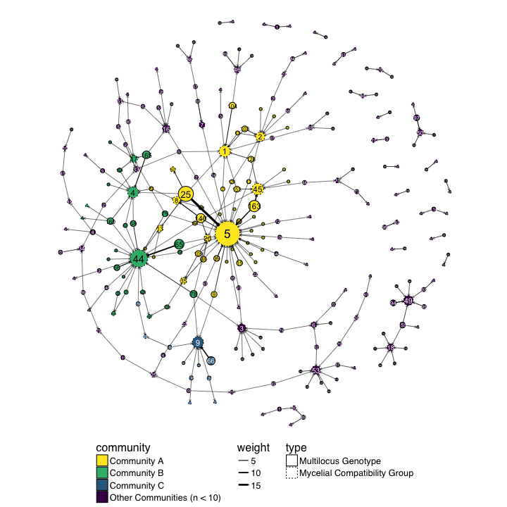

# Introduction 

The purpose of this document is to assess the distribution of the MLGs and MCGs
within the data. Specifically, we want to know if there are any MLGs that 
consistently coordinate with a single MCG, or if there are anything close.

## Packages and Data


```r
library('igraph')
```

```
## 
## Attaching package: 'igraph'
```

```
## The following objects are masked from 'package:stats':
## 
##     decompose, spectrum
```

```
## The following object is masked from 'package:base':
## 
##     union
```

```r
library('ggraph')
```

```
## Loading required package: ggplot2
```

```r
library('tidyverse')
```

```
## Loading tidyverse: tibble
## Loading tidyverse: tidyr
## Loading tidyverse: readr
## Loading tidyverse: purrr
## Loading tidyverse: dplyr
```

```
## Conflicts with tidy packages ----------------------------------------------
```

```
## as_data_frame(): dplyr, tibble, igraph
## compose():       purrr, igraph
## crossing():      tidyr, igraph
## filter():        dplyr, stats
## groups():        dplyr, igraph
## lag():           dplyr, stats
## simplify():      purrr, igraph
```

```r
library('poppr')
```

```
## Loading required package: adegenet
```

```
## Loading required package: ade4
```

```
## 
##    /// adegenet 2.1.0 is loaded ////////////
## 
##    > overview: '?adegenet'
##    > tutorials/doc/questions: 'adegenetWeb()' 
##    > bug reports/feature requests: adegenetIssues()
```

```
## This is poppr version 2.4.1. To get started, type package?poppr
## OMP parallel support: available
```

```
## 
## Attaching package: 'poppr'
```

```
## The following object is masked from 'package:igraph':
## 
##     %>%
```

```r
library('viridis')
```

```
## Loading required package: viridisLite
```


```r
load(file.path(PROJHOME, "data", "sclerotinia_16_loci.rda"))
load(file.path(PROJHOME, "data", "mlg-crosspop-graph.rda"))
dat11
```

```
## 
## This is a genclone object
## -------------------------
## Genotype information:
## 
##    165 original multilocus genotypes 
##    366 haploid individuals
##     11 codominant loci
## 
## Population information:
## 
##      5 strata - MCG, Region, Source, Year, Host
##     14 populations defined - NE, NY, MN, ..., France, Mexico, ND
```

```r
g11o <- igraph::cluster_optimal(graph11loc$total)
comm <- igraph::communities(g11o)
names(comm) <- c("International", "Costal", "Midwest")
comm
```

```
## $International
## [1] "Australia" "France"    "MN"       
## 
## $Costal
## [1] "CA" "NY" "OR" "WA"
## 
## $Midwest
## [1] "CO" "MI" "ND" "NE"
```

```r
strata(dat11) <- strata(dat11) %>%
  mutate(MLGRegion = case_when(
    .$Region %in% comm$International ~ "International",
    .$Region %in% comm$Costal ~ "Costal",
    .$Region %in% comm$Midwest ~ "Midwest",
    TRUE ~ as.character(.$Region)
  ))

setPop(dat11) <- ~MLGRegion
pal <- unlist(map2(LETTERS[2:4], comm, function(a, b) setNames(viridis::viridis(length(b), option = a), b)))
pal <- c(pal, setNames(rep("#F6F6F6FF", 3), c("Mexico", "ID", "WI")))
```


## MLG table

First, it would be nice to visualize the MLGs across populations


```r
mtab <- mlg.table(dat11, color = TRUE)
```


```r
mplot <- last_plot()
mplot + scale_fill_viridis(discrete = TRUE, direction = -1, option = "C") +
  aes(color = I("black")) 
```


Now we can take a look at the concordance of MLGs to MCGs. We can do this by 
creating a contigency table. Of course, since we have 87 and well over 100 MLGs,
this means that the contingency table is going to be big, so to summarize it
further, I'm creating two tables, one based on MLGs that will count the number
of MCGs within each MLG and vice-versa. Of course we lose information like, if
an MCG contains several MLGs, how can we tell what the abundance is? A handy 
measure is Evenness, which scales from 0 to 1, indicating how skewed the 
observations are. 


```r
mll.custom(dat11) <- strata(dat11)$MCG
mcgmlg <- as.data.frame(table(mll(dat11, "original"), mll(dat11, "custom"))) %>%
  setNames(c("MLG", "MCG", "Freq")) %>%
  mutate(MLG = as.character(MLG)) %>%
  mutate(MCG = as.character(MCG)) %>%
  as_data_frame() %>%
  filter(Freq > 0)
mcgs <- mcgmlg %>%
  arrange(MCG) %>%
  group_by(MCG) %>%
  mutate(MLGs = sum(Freq > 0), 
         Samples = sum(Freq), 
         Evenness = diversity_stats(Freq)["E.5"], 
         data = list(data_frame(MLG = MLG, Freq = Freq) %>% arrange(desc(Freq)))) %>%
  arrange(desc(MLGs)) %>%
  ungroup() %>%
  distinct(MCG, MLGs, Samples, Evenness, data)
mlgs <- mcgmlg %>%
  arrange(MLG) %>%
  group_by(MLG) %>%
  mutate(MCGs     = sum(Freq > 0), 
         Samples  = sum(Freq), 
         Evenness = diversity_stats(Freq)["E.5"], 
         data     = list(data_frame(MCG = MCG, Freq = Freq) %>% arrange(desc(Freq)))) %>%
  arrange(desc(Samples), desc(MCGs)) %>%
  ungroup() %>%
  distinct(MLG, MCGs, Samples, Evenness, data)
mcgs
```

```
## # A tibble: 87 × 5
##      MCG  MLGs Samples  Evenness              data
##    <chr> <int>   <int>     <dbl>            <list>
## 1      5    37      73 0.4811239 <tibble [37 × 2]>
## 2     44    19      36 0.6249418 <tibble [19 × 2]>
## 3      1    10      15 0.8217819 <tibble [10 × 2]>
## 4      2     9      10 0.9517005  <tibble [9 × 2]>
## 5      4     9      14 0.7242515  <tibble [9 × 2]>
## 6     53     9       9 1.0000000  <tibble [9 × 2]>
## 7      3     8       8 1.0000000  <tibble [8 × 2]>
## 8      9     8      15 0.5493741  <tibble [8 × 2]>
## 9     45     7      16 0.6304310  <tibble [7 × 2]>
## 10    16     6       7 0.9371824  <tibble [6 × 2]>
## # ... with 77 more rows
```

```r
mlgs
```

```
## # A tibble: 165 × 5
##      MLG  MCGs Samples  Evenness             data
##    <chr> <int>   <int>     <dbl>           <list>
## 1     25     5      27 0.5490333 <tibble [5 × 2]>
## 2    163     2      15 0.9955736 <tibble [2 × 2]>
## 3     65     2      11 0.5560301 <tibble [2 × 2]>
## 4    140     3      10 0.9063854 <tibble [3 × 2]>
## 5     66     1       8       NaN <tibble [1 × 2]>
## 6    165     3       7 0.6693363 <tibble [3 × 2]>
## 7     78     4       6 0.8116548 <tibble [4 × 2]>
## 8    160     4       5 0.9218931 <tibble [4 × 2]>
## 9    104     2       5 0.7246677 <tibble [2 × 2]>
## 10   109     3       4 0.9115303 <tibble [3 × 2]>
## # ... with 155 more rows
```

These tables are a good start, but we want to have a publication-ready table:


```r
fct2int <- function(x) as.integer(as.character(x))

psex_from_graph <- function(g, MLG){
  weights <- setNames(E(g)$weight, E(g)$label)
  weights <- split(weights, names(weights))[MLG]
  1 -vapply(weights, unique, numeric(1))
}

mlg_table <- mlgs %>%
  slice(1:5L) %>%
  mutate(MLG = as.character(MLG)) %>%
  mutate(Psex = psex_from_graph(graph11loc$total, MLG)) %>%
  unnest() %>%
  group_by(MLG, Samples, Psex) %>%
  summarize(MCG = paste(MCG, collapse = ", ")) %>%
  rename(N = Samples) %>%
  arrange(desc(N))

kable(mlg_table, caption = "Top 5 MLGs", format.args = list(digits = 3))
```


|MLG |  N|     Psex|MCG             |
|:---|--:|--------:|:---------------|
|25  | 27| 1.68e-02|5, 13, 60, 4, 1 |
|163 | 15| 4.99e-02|45, 5           |
|65  | 11| 7.07e-05|44, 5           |
|140 | 10| 1.55e-04|8, 5, 20        |
|66  |  8| 1.57e-05|9               |

```r
mcg_table <- mcgs %>%
  slice(1:5L) %>%
  mutate(MCG = as.character(MCG)) %>%
  unnest() %>%
  group_by(MCG, Samples, Evenness) %>%
  summarize(MLG = list(strwrap(paste(MLG, collapse = ", "), 28))) %>%
  rename(N = Samples) %>%
  arrange(desc(N)) %>% 
  unnest() %>%
  ungroup() %>%
  mutate(Evenness = ifelse(!duplicated(MCG), format(Evenness, digits = 3), "")) %>%
  mutate(N = ifelse(!duplicated(MCG), N, "")) %>%
  mutate(MCG = ifelse(!duplicated(MCG), MCG, ""))
kable(mcg_table, caption = "Top 5 MCGs")
```


|MCG |N  |Evenness |MLG                         |
|:---|:--|:--------|:---------------------------|
|5   |73 |0.481    |25, 163, 15, 39, 9, 42,     |
|    |   |         |140, 7, 12, 16, 20, 21, 22, |
|    |   |         |23, 24, 26, 29, 35, 36, 37, |
|    |   |         |43, 45, 46, 65, 72, 75, 76, |
|    |   |         |83, 88, 90, 106, 109, 127,  |
|    |   |         |130, 138, 146, 153          |
|44  |36 |0.625    |65, 56, 68, 78, 75, 2, 3,   |
|    |   |         |4, 52, 63, 70, 71, 76, 123, |
|    |   |         |141, 145, 156, 160, 161     |
|1   |15 |0.822    |104, 103, 128, 7, 17, 25,   |
|    |   |         |47, 107, 134, 153           |
|4   |14 |0.724    |165, 160, 5, 25, 57, 63,    |
|    |   |         |68, 77, 154                 |
|2   |10 |0.952    |103, 8, 12, 17, 18, 38, 69, |
|    |   |         |120, 125                    |


It might be better to visualize these data as barplots. Here we are mapping the
type (MCG/Count) to color and the opacity (alpha) to Evenness.


```r
mcgs %>% 
  gather(type, count, MLGs, Samples, -Evenness) %>%
  arrange(desc(type), desc(count)) %>%
  mutate(MCG = forcats::fct_inorder(MCG, ordered = TRUE)) %>%
  ggplot(aes(x = MCG, y = count, group = type, fill = type, alpha = Evenness)) +
  geom_col(aes(width = ifelse(type == "MLGs", 0.5, 0.85)), color = "black", position = "identity") +
  annotate(geom = "text", x = 13, y = 51, label = sprintf("Mean Evenness: %.3f", mean(mcgs$Evenness, na.rm = TRUE))) +
  scale_fill_viridis(end = 0.75, discrete = TRUE, direction = -1) +
  scale_y_continuous(expand = c(0, 2)) +
  theme_minimal() +
  theme(panel.grid.major.x = element_blank()) +
  theme(axis.text.x = element_text(angle = 90, vjust = 0.5, hjust = 1)) +
  ggtitle("How Evenly are Multilocus Genotypes (MLGs) spread across MCGs?")
```

```
## Warning: Ignoring unknown aesthetics: width
```


```r
mlgs %>% 
  gather(type, count, MCGs, Samples, -Evenness) %>%
  arrange(desc(type), desc(count)) %>%
  mutate(MLG = forcats::fct_inorder(MLG, ordered = TRUE)) %>%
  ggplot(aes(x = MLG, y = count, group = type, fill = type)) +
  geom_col(aes(width = ifelse(type == "MCGs", 0.5, 0.85), alpha = Evenness), color = "black", position = "identity") +
  annotate(geom = "text", x = 20, y = 21, label = sprintf("Mean Evenness: %.3f", mean(mlgs$Evenness, na.rm = TRUE))) +
  scale_fill_viridis(end = 0.75, discrete = TRUE, direction = -1) +
  scale_y_continuous(expand = c(0, 2)) +
  theme_minimal() +
  theme(panel.grid.major.x = element_blank()) +
  theme(axis.text.x = element_text(angle = 90, vjust = 0.5, hjust = 1)) +
  ggtitle("How Evenly are MCGs spread across Multilocus Genotypes (MLGs)?")
```

```
## Warning: Ignoring unknown aesthetics: width
```


## making a graph

I believe that making a graph to visualize this might help me understand what the h\*ck is going on. 


```r
make_mcgmlg_graph <- function(x){
  gdf <- mutate(x, MLG = paste0('MLG.', MLG))
  MLGS <- gdf %>% 
    group_by(MLG) %>%
    summarize(size = sum(Freq)) %>%
    rename(vertex = MLG)
  MCGS <- gdf %>% 
    group_by(MCG) %>%
    summarize(size = sum(Freq)) %>%
    rename(vertex = MCG)
  VAT <- bind_rows(MLGS, MCGS)
  g <- gdf %>% 
    select(MCG, MLG, Freq) %>%
    rename(weight = Freq) %>%
    graph_from_data_frame(vertices = VAT)
  V(g)$type <- ifelse(grepl("MLG", V(g)$name), "Multilocus Genotype", "Mycelial Compatibility Group")
  g
}

add_communities <- function(g, clusters){
  comm <- communities(clusters)
  commlist <- setNames(rep(names(comm), lengths(comm)), unlist(comm, use.names = FALSE))
  V(g)$community <- commlist[V(g)$name]
  g
}
g <- make_mcgmlg_graph(mcgmlg)
g <- add_communities(g, cluster_walktrap(g))
osize <- V(g)$size
```

Because I have more control over the size and feel of the graph, I'm going to use
ggraph. Of course, since this IS a complicated data set, It's not going to be
very pretty to look at, but I'm going to save it as supplementary materials
because it's valuable to at least look this ugliness in the face and say, "Yeah,
I guess it's not so simple after all."


```r
V(g)$size <- sqrt(osize)/10
set.seed(2017-05-03)
lay2 <- create_layout(g, layout = "igraph", algorithm = "nicely")

the_communities <- data_frame(vertex = lay2$name, community = lay2$community) %>%
  mutate(comm = case_when(
    .$community == 7 ~ "A",
    .$community == 5 ~ "B",
    .$community == 1 ~ "C",
    TRUE ~ as.character(.$community)
  )) %>%
  group_by(community) %>%
  mutate(comm = ifelse(n() > 10, paste("Community", comm), "Other Communities (n < 10)")) %>%
  mutate(comm = comm) # It just so happens that the communities are in order by size.
lay2$community <- the_communities$comm
mcg_mlg_graph <- ggraph(lay2) +
  geom_node_circle(aes(r = size, lty = type, fill = community)) +
  geom_edge_link(aes(start_cap = circle(node1.size, unit = "native"), 
                     end_cap = circle(node2.size, unit = "native"), 
                     width = weight),
                 arrow = arrow(length = unit(0.01, "native"))) +
  geom_node_text(aes(label = gsub("MLG.", "", name), 
                     color = community, 
                     size = size/10), 
                 show.legend = FALSE) +
  coord_fixed() +
  scale_linetype_manual(values = c(1, 3)) +
  scale_edge_width(range = c(0.25, 1.5)) +
  scale_color_manual(values = c("black", "black", "white", "white")) +
  scale_fill_viridis(direction = -1, discrete = TRUE) +
  theme_graph(base_size = 16, base_family = "Helvetica") +
  theme(legend.position = "bottom", legend.direction = "vertical") +
  ggtitle("Relation of Multilocus Genotypes and MCGs") 
  
mcg_mlg_graph
```



```r
ggsave(file.path(PROJHOME, "results/figures/publication/FigureS2.svg"), 
       width = 88*3, height = 88*3, units = "mm")
```

## Subgraph

So that's a big hairy graph. What happens when we look at a subgraph of the
top 5 MCGs?


```r
top5 <- filter(mcgmlg, as.character(MCG) %in% mcgs$MCG[1:5])
top5g <- make_mcgmlg_graph(top5)
tosize <- V(top5g)$size
V(top5g)$size <- sqrt(tosize)/10
set.seed(2017-05-08)
top5lay <- create_layout(top5g, layout = "igraph", algorithm = "nicely")
top5lay$community <- inner_join(data_frame(vertex = top5lay$name), the_communities)$comm
```

```
## Joining, by = "vertex"
```

```
## Warning in inner_join_impl(x, y, by$x, by$y, suffix$x, suffix$y): joining
## factors with different levels, coercing to character vector
```

```r
t5g <- mcg_mlg_graph %+% top5lay + ggtitle("Top 5 Mycelial Compatibility Groups and associated MLGs")
t5g
```


```r
ggsave(t5g, file = file.path("results", "figures", "publication", "FigureS2B.svg"), width = 88, height = 88, scale = 3, units = "mm")
```

Vey nice!

There are a whole buttload of MLGs for those 5 MCGs. What are the severity 
ratings for those? Again, we take take a look at these AND simultaneously query
the top 5 MLGs for this. 


```r
strat <- bind_cols(strata(dat11), 
                   other(dat11)$meta, 
                   data_frame(MLG = mll(dat11, "original")))
count_group <- . %>% 
  mutate(nobs = n()) %>%  # count the number of samples/MCG
  ungroup() %>%
  arrange(desc(nobs)) # arrange by number of samples and reorder factors 
Severity <- filter(strat, MCG %in% mcgs$MCG[1:5]) %>%
  group_by(MCG) %>% 
  count_group %>%
  mutate(MCG = forcats::fct_inorder(factor(MCG), ordered = TRUE)) %>%
  mutate(MLG = ifelse(MLG %in% mlgs$MLG[1:5], paste("MLG", MLG), "Other")) 
  
severity_plot <- ggplot(Severity, aes(x = MCG, y = Severity)) +
  geom_point(aes(fill = MLG), 
             position = position_jitter(width = 0.2),
             alpha = 0.75,
             pch = 21) +
  scale_fill_viridis(discrete = TRUE, direction = -1) +
  theme_bw() +
  theme(legend.position = "bottom") +
  theme(aspect.ratio = 0.6) +
  facet_wrap(~Region, nrow = 2) +
  ylim(c(3.5, 8)) +
  labs(list(
    title = "Severity by MCG and Region",
    fill = "Multilocus Genotype",
    subtitle = "Five most abundant multilocus genotypes shown"
  ))
severity_plot
```


```r
ggsave(severity_plot, filename = "results/figures/publication/FigureS3.svg", width = 183, unit = "mm")
```

```
## Saving 183 x 102 mm image
```


## Assessing MCG/MLG community structure/cohesiveness

The communities defined above are defined by the connections between different
MCGs. There is still the question of how cohesive these communities are. I 
believe one way to investigate this is to add the communities assignments back
to the data and assess how well they split up on a dendrogram created with 
genetic distance.

Note in this case we are assigning MLGs to the communities indicated. This means
that even though they share a connection with an MCG in a different community,
they belong to the MCG community they were initially assigned to. We will also
assign communities based on what MCG they belong to. 


```r
the_communities
```

```
## Source: local data frame [252 x 3]
## Groups: community [51]
## 
##     vertex community                       comm
##     <fctr>    <fctr>                      <chr>
## 1    MLG.1        39 Other Communities (n < 10)
## 2   MLG.10        32 Other Communities (n < 10)
## 3  MLG.100         8 Other Communities (n < 10)
## 4  MLG.101        11 Other Communities (n < 10)
## 5  MLG.102        10 Other Communities (n < 10)
## 6  MLG.103         7                Community A
## 7  MLG.104         7                Community A
## 8  MLG.105        33 Other Communities (n < 10)
## 9  MLG.106        22 Other Communities (n < 10)
## 10 MLG.107        17 Other Communities (n < 10)
## # ... with 242 more rows
```

```r
strat_mlg <- strat %>% 
  mutate(MLG = paste0("MLG.", MLG)) %>%
  left_join(the_communities, by = c("MLG" = "vertex"))
```

```
## Warning in left_join_impl(x, y, by$x, by$y, suffix$x, suffix$y): joining
## factor and character vector, coercing into character vector
```

```r
strat_mcg <- strat %>% 
  left_join(the_communities, by = c("MCG" = "vertex"))
```

```
## Warning in left_join_impl(x, y, by$x, by$y, suffix$x, suffix$y): joining
## factors with different levels, coercing to character vector
```

```r
datdist <- bruvo.dist(dat11, replen = other(dat)$REPLEN)
datree <- phangorn::upgma(datdist)
```

Now we can visualize that tree.


```r
ape::plot.phylo(ape::ladderize(datree), type = "fan", no.margin = FALSE, tip.col = viridis(4, direction = -1)[as.integer(factor(strat_mlg$comm))])
legend(-0.015, 0.11, legend = levels(factor(strat_mlg$comm)), fill = viridis(4, direction = -1), bty = "n")
title("MLG-based assignment")
```


```r
ape::plot.phylo(ape::ladderize(datree), type = "fan", no.margin = FALSE, tip.col = viridis(4, direction = -1)[as.integer(factor(strat_mcg$comm))])
legend(-0.015, 0.11, legend = levels(factor(strat_mcg$comm)), fill = viridis(4, direction = -1), bty = "n")
title("MCG-based assignment")
```


From what I can see, it appears that there's not much of a tight correlation of 
genetic structure and MCG.


<details>
<summary>Session Information</summary>


```
## Session info ---------------------------------------------------------------------------------------
```

```
##  setting  value                       
##  version  R version 3.4.0 (2017-04-21)
##  system   x86_64, darwin15.6.0        
##  ui       X11                         
##  language (EN)                        
##  collate  en_US.UTF-8                 
##  tz       America/Chicago             
##  date     2017-05-05
```

```
## Packages -------------------------------------------------------------------------------------------
```

```
##  package     * version date       source                                  
##  ade4        * 1.7-6   2017-03-23 CRAN (R 3.4.0)                          
##  adegenet    * 2.1.0   2017-05-05 Github (thibautjombart/adegenet@2143246)
##  ape           4.1     2017-02-14 CRAN (R 3.4.0)                          
##  assertr       2.0.2   2017-03-23 CRAN (R 3.4.0)                          
##  assertthat    0.2.0   2017-04-11 CRAN (R 3.4.0)                          
##  boot          1.3-19  2017-04-21 CRAN (R 3.4.0)                          
##  broom         0.4.2   2017-02-13 CRAN (R 3.4.0)                          
##  cellranger    1.1.0   2016-07-27 CRAN (R 3.4.0)                          
##  cluster       2.0.6   2017-03-16 CRAN (R 3.4.0)                          
##  coda          0.19-1  2016-12-08 CRAN (R 3.4.0)                          
##  colorspace    1.3-2   2016-12-14 CRAN (R 3.4.0)                          
##  DBI           0.6-1   2017-04-01 CRAN (R 3.4.0)                          
##  deldir        0.1-14  2017-04-22 CRAN (R 3.4.0)                          
##  devtools      1.12.0  2016-12-05 CRAN (R 3.4.0)                          
##  digest        0.6.12  2017-01-27 CRAN (R 3.4.0)                          
##  dplyr       * 0.5.0   2016-06-24 cran (@0.5.0)                           
##  evaluate      0.10    2016-10-11 CRAN (R 3.4.0)                          
##  expm          0.999-2 2017-03-29 CRAN (R 3.4.0)                          
##  ezknitr       0.6     2016-09-16 CRAN (R 3.4.0)                          
##  fastmatch     1.1-0   2017-01-28 CRAN (R 3.4.0)                          
##  forcats       0.2.0   2017-01-23 CRAN (R 3.4.0)                          
##  foreign       0.8-68  2017-04-24 CRAN (R 3.4.0)                          
##  gdata         2.17.0  2015-07-04 CRAN (R 3.4.0)                          
##  gdtools     * 0.1.4   2017-03-17 CRAN (R 3.4.0)                          
##  ggforce       0.1.1   2016-11-28 CRAN (R 3.4.0)                          
##  ggplot2     * 2.2.1   2016-12-30 CRAN (R 3.4.0)                          
##  ggraph      * 1.0.0   2017-05-04 Github (zkamvar/ggraph@0d099f3)         
##  ggrepel       0.6.6   2017-04-28 Github (slowkow/ggrepel@007318f)        
##  gmodels       2.16.2  2015-07-22 CRAN (R 3.4.0)                          
##  gridExtra     2.2.1   2016-02-29 CRAN (R 3.4.0)                          
##  gtable        0.2.0   2016-02-26 CRAN (R 3.4.0)                          
##  gtools        3.5.0   2015-05-29 CRAN (R 3.4.0)                          
##  haven         1.0.0   2016-09-23 CRAN (R 3.4.0)                          
##  highr         0.6     2016-05-09 CRAN (R 3.4.0)                          
##  hms           0.3     2016-11-22 CRAN (R 3.4.0)                          
##  htmltools     0.3.6   2017-04-28 CRAN (R 3.4.0)                          
##  httpuv        1.3.3   2015-08-04 CRAN (R 3.4.0)                          
##  httr          1.2.1   2016-07-03 CRAN (R 3.4.0)                          
##  igraph      * 1.0.1   2015-06-26 CRAN (R 3.4.0)                          
##  jsonlite      1.4     2017-04-08 CRAN (R 3.4.0)                          
##  knitr       * 1.15.1  2016-11-22 CRAN (R 3.4.0)                          
##  labeling      0.3     2014-08-23 CRAN (R 3.4.0)                          
##  lattice       0.20-35 2017-03-25 CRAN (R 3.4.0)                          
##  lazyeval      0.2.0   2016-06-12 CRAN (R 3.4.0)                          
##  LearnBayes    2.15    2014-05-29 CRAN (R 3.4.0)                          
##  lubridate     1.6.0   2016-09-13 CRAN (R 3.4.0)                          
##  magrittr      1.5     2014-11-22 CRAN (R 3.4.0)                          
##  MASS          7.3-47  2017-04-21 CRAN (R 3.4.0)                          
##  Matrix        1.2-10  2017-04-28 CRAN (R 3.4.0)                          
##  memoise       1.1.0   2017-04-21 CRAN (R 3.4.0)                          
##  mgcv          1.8-17  2017-02-08 CRAN (R 3.4.0)                          
##  mime          0.5     2016-07-07 CRAN (R 3.4.0)                          
##  mnormt        1.5-5   2016-10-15 CRAN (R 3.4.0)                          
##  modelr        0.1.0   2016-08-31 CRAN (R 3.4.0)                          
##  munsell       0.4.3   2016-02-13 CRAN (R 3.4.0)                          
##  nlme          3.1-131 2017-02-06 CRAN (R 3.4.0)                          
##  pegas         0.10    2017-05-03 CRAN (R 3.4.0)                          
##  permute       0.9-4   2016-09-09 CRAN (R 3.4.0)                          
##  phangorn      2.2.0   2017-04-03 CRAN (R 3.4.0)                          
##  plyr          1.8.4   2016-06-08 CRAN (R 3.4.0)                          
##  poppr       * 2.4.1   2017-04-14 CRAN (R 3.4.0)                          
##  psych         1.7.5   2017-05-03 CRAN (R 3.4.0)                          
##  purrr       * 0.2.2   2016-06-18 CRAN (R 3.4.0)                          
##  quadprog      1.5-5   2013-04-17 CRAN (R 3.4.0)                          
##  R.methodsS3   1.7.1   2016-02-16 CRAN (R 3.4.0)                          
##  R.oo          1.21.0  2016-11-01 CRAN (R 3.4.0)                          
##  R.utils       2.5.0   2016-11-07 CRAN (R 3.4.0)                          
##  R6            2.2.0   2016-10-05 CRAN (R 3.4.0)                          
##  Rcpp          0.12.10 2017-03-19 CRAN (R 3.4.0)                          
##  readr       * 1.1.0   2017-03-22 CRAN (R 3.4.0)                          
##  readxl        1.0.0   2017-04-18 CRAN (R 3.4.0)                          
##  reshape2      1.4.2   2016-10-22 CRAN (R 3.4.0)                          
##  rvest         0.3.2   2016-06-17 CRAN (R 3.4.0)                          
##  scales        0.4.1   2016-11-09 CRAN (R 3.4.0)                          
##  seqinr        3.3-6   2017-04-06 CRAN (R 3.4.0)                          
##  shiny         1.0.3   2017-04-26 CRAN (R 3.4.0)                          
##  sp            1.2-4   2016-12-22 CRAN (R 3.4.0)                          
##  spdep         0.6-13  2017-04-25 CRAN (R 3.4.0)                          
##  stringi       1.1.5   2017-04-07 CRAN (R 3.4.0)                          
##  stringr       1.2.0   2017-02-18 CRAN (R 3.4.0)                          
##  svglite       1.2.0   2016-11-04 CRAN (R 3.4.0)                          
##  tibble      * 1.3.0   2017-04-01 CRAN (R 3.4.0)                          
##  tidyr       * 0.6.1   2017-01-10 CRAN (R 3.4.0)                          
##  tidyverse   * 1.1.1   2017-01-27 CRAN (R 3.4.0)                          
##  tweenr        0.1.5   2016-10-10 CRAN (R 3.4.0)                          
##  udunits2      0.13    2016-11-17 CRAN (R 3.3.2)                          
##  units         0.4-4   2017-04-20 CRAN (R 3.4.0)                          
##  vegan         2.4-3   2017-04-07 CRAN (R 3.4.0)                          
##  viridis     * 0.4.0   2017-03-27 CRAN (R 3.4.0)                          
##  viridisLite * 0.2.0   2017-03-24 CRAN (R 3.4.0)                          
##  withr         1.0.2   2016-06-20 CRAN (R 3.4.0)                          
##  xml2          1.1.1   2017-01-24 CRAN (R 3.4.0)                          
##  xtable        1.8-2   2016-02-05 CRAN (R 3.4.0)
```

</details>
