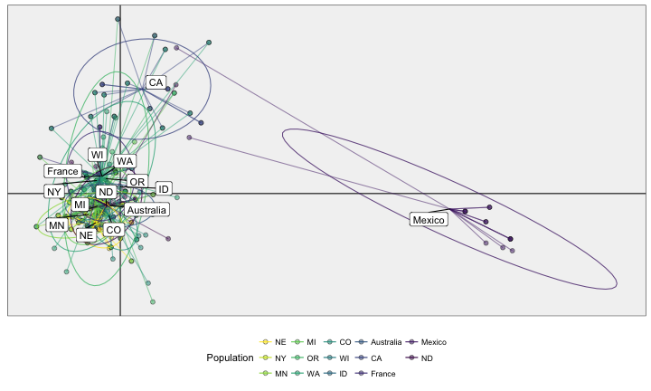
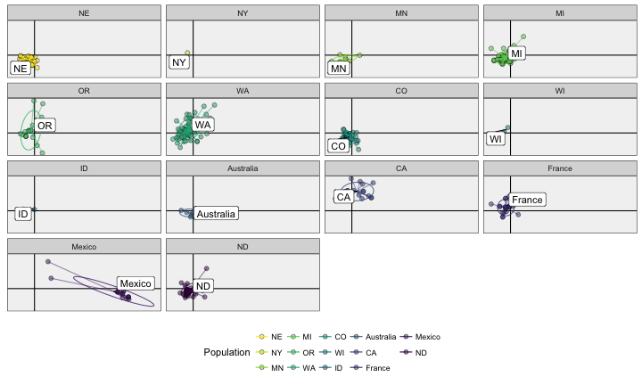
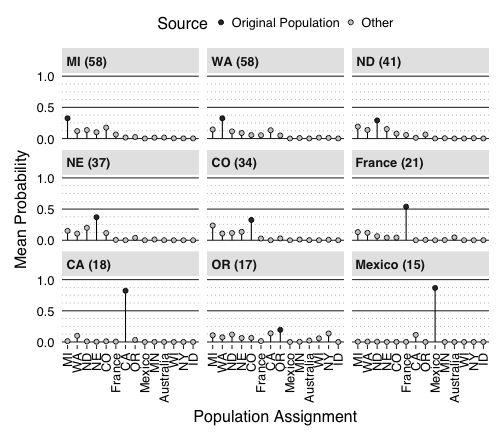
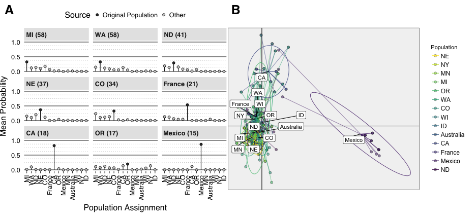
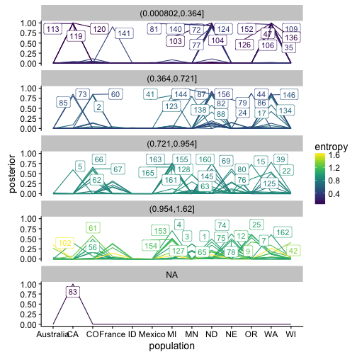
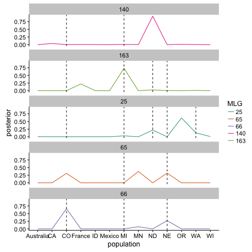

## Packages and Data


```r
library('tidyverse')
library('poppr')
library('ggcompoplot')
```


```r
load(file.path(PROJHOME, "data", "sclerotinia_16_loci.rda"))
setPop(dat11) <- ~Host/Source/Region/Year
dat11cc <- clonecorrect(dat11, ~Host/Source/Region/Year, keep = 1:4)
dat11cc
```

```
## 
## This is a genclone object
## -------------------------
## Genotype information:
## 
##    165 original multilocus genotypes 
##    318 haploid individuals
##     11 codominant loci
## 
## Population information:
## 
##      5 strata - MCG, Region, Source, Year, Host
##    128 populations defined - 
## GH_unk_NE_2003, GH_unk_NY_2003, G122_wmn_MN_2003, ..., unk_pmc_ND_2010, unk_wlc_ND_2010, unk_flds_France_2012
```

```r
# Asserting that nothing messed up with the metadata.
stopifnot(identical(indNames(dat11cc), other(dat11cc)$meta$Isolate))
dat11.bruvo   <- bruvo.dist(dat11, replen = other(dat11)$REPLEN)
dat11cc.bruvo <- bruvo.dist(dat11cc, replen = other(dat11)$REPLEN)
```

# Genotypic Diversity


```r
ptab <- dat11cc %>% setPop(~Region) %>% poppr(sample = 999, total = FALSE)
```

```
Warning: values for NY, WI, ID could not be plotted.
```


```r
ptab %>%
  arrange(desc(N), desc(MLG)) %>%
  mutate(Ia = case_when(
    !is.finite(.$p.Ia) ~ "-",
    .$p.Ia == 0.001 ~ paste0(round(.$Ia, 2), "*"),
    .$p.Ia <= 0.01 ~  paste0(round(.$Ia, 2), "-"),
    .$p.Ia <= 0.05 ~  paste0(round(.$Ia, 2), "~"),
    TRUE ~ as.character(round(.$Ia, 2))
  )) %>%
  mutate(rbarD = case_when(
    !is.finite(.$p.rD) ~ "-",
    .$p.rD == 0.001 ~ paste0(round(.$rbarD, 2), "*"),
    .$p.rD <= 0.01 ~  paste0(round(.$rbarD, 2), "-"),
    .$p.rD <= 0.05 ~  paste0(round(.$rbarD, 2), "~"),
    TRUE ~ as.character(round(.$rbarD, 2))
  )) %>%
  mutate_if(is.numeric, round, digits = 2) %>%
  mutate(N = paste(N, MLG, sep = " (") %>% paste0(")") %>% formatC()) %>%
  mutate(eMLG = paste(eMLG, SE, sep = " (") %>%  paste0(")") %>% formatC()) %>%
  rename(`*h*` = Hexp) %>%
  rename(`$E_5$` = E.5) %>%
  rename(`$I_A$` = Ia) %>%
  rename(`$\\lambda$` = lambda) %>%
  rename(`$\\bar{r}_d$` = rbarD) %>%
  select(-File, -MLG, -SE, -p.rD, -p.Ia) %>% 
  huxtable::as_huxtable(add_colnames = TRUE) %>%
  huxtable::set_number_format(huxtable::everywhere, 4:5, 1) %>%
  huxtable::set_align(huxtable::everywhere, -1, "right") %>%
  huxtable::set_col_width(c(1.1, 0.9, 1.3, 0.5, 0.5, 1.2, 0.7, 0.6, 0.6, 0.8)) %>%
  huxtable::print_md(max_width = 80)
```

```
----------------------------------------------------------------------------
Pop             N        eMLG    H    G  $\lambda$  $E_5$   *h* $I_A$ $\bar{ 
                                                                       r}_d$ 
--------- ------- ----------- ---- ---- ---------- ------ ----- ----- ------
WA        58 (56) 9.95 (0.23)  4.0 54.3       0.98   0.98  0.60 0.65*  0.07* 

MI        58 (43)  9.3 (0.79)  3.6 29.0       0.97   0.78  0.54 1.25*  0.14* 

ND        41 (35) 9.44 (0.73)  3.5 25.9       0.96   0.82  0.54    1*   0.1* 

NE        37 (28) 8.93 (0.94)  3.2 17.8       0.94   0.75  0.55 2.22*  0.25* 

CO        34 (28) 9.46 (0.67)  3.3 24.1       0.96   0.92  0.56 2.33*  0.27* 

France    21 (14)  8.5 (0.85)  2.6 12.6       0.92   0.95  0.48 0.94*  0.11* 

CA        18 (15) 9.12 (0.72)  2.7 13.5       0.93   0.94  0.51 0.28~  0.03~ 

OR        17 (13) 8.52 (0.85)  2.5 10.7       0.91   0.89  0.47 0.92*   0.1* 

Mexico     15 (9)  7.1 (0.85)  2.1  7.3       0.86   0.89  0.28 2.57*  0.37* 

MN          9 (7)       7 (0)  1.9  6.2       0.84   0.93  0.47 1.34*  0.19* 

Australia   6 (6)       6 (0)  1.8  6.0       0.83   1.00  0.48  0.7~  0.12~ 

WI          2 (2)       2 (0)  0.7  2.0       0.50   1.00  0.27     -      - 

NY          1 (1)       1 (0)  0.0  1.0       0.00    NaN   NaN     -      - 

ID          1 (1)       1 (0)  0.0  1.0       0.00    NaN   NaN     -      - 

----------------------------------------------------------------------------
```

```r
ptab %>% 
  arrange(desc(N), desc(MLG)) %>% 
  write_csv(file.path(PROJHOME, "results/tables/genotype_diversity_table_region.csv"), col_names = TRUE)

mtab <- mlg.table(dat11, ~Region, background = TRUE)
```


# AMOVA

First, we can conduct an AMOVA analysis across all populations, with respect to
year.


```r
(res   <- poppr.amova(dat11cc, ~Region/Host/Year, dist = dat11cc.bruvo))
```

```
## 
##  No missing values detected.
```

```
## $call
## ade4::amova(samples = xtab, distances = xdist, structures = xstruct)
## 
## $results
##                              Df   Sum Sq   Mean Sq
## Between Region               13 10.19459 0.7841991
## Between Host Within Region   61 14.01673 0.2297824
## Between samples Within Host  36 10.13126 0.2814238
## Within samples              207 35.25497 0.1703139
## Total                       317 69.59754 0.2195506
## 
## $componentsofcovariance
##                                                Sigma          %
## Variations  Between Region               0.024231812  10.879560
## Variations  Between Host Within Region  -0.008652608  -3.884834
## Variations  Between samples Within Host  0.036834798  16.538027
## Variations  Within samples               0.170313877  76.467247
## Total variations                         0.222727878 100.000000
## 
## $statphi
##                           Phi
## Phi-samples-total  0.23532753
## Phi-samples-Host   0.17781817
## Phi-Host-Region   -0.04359083
## Phi-Region-total   0.10879560
```

```r
set.seed(999)
(res.p <- randtest(res, nrepet = 999))
```

```
## class: krandtest lightkrandtest 
## Monte-Carlo tests
## Call: randtest.amova(xtest = res, nrepet = 999)
## 
## Number of tests:   4 
## 
## Adjustment method for multiple comparisons:   none 
## Permutation number:   999 
##                         Test          Obs     Std.Obs   Alter Pvalue
## 1  Variations within samples  0.170313877 -16.0843846    less  0.001
## 2 Variations between samples  0.036834798   7.0114136 greater  0.001
## 3    Variations between Host -0.008652608  -0.8984575 greater  0.818
## 4  Variations between Region  0.024231812   7.0499262 greater  0.001
```

## DAPC of Region

This can tell us how well our regions separate


```r
set.seed(2017-07-05)
region.xval <- xvalDapc(tab(dat11cc), strata(dat11cc)$Region, n.pca = 15:25, 
                        n.rep = 100, parallel = "multicore", ncpus = 4)
```

```
## Warning in xvalDapc(tab(dat11cc), strata(dat11cc)$Region, n.pca = 15:25, :
## 2 groups have only 1 member: these groups cannot be represented in both
## training and validation sets.
```


```r
region.dapc <- region.xval$DAPC
```


```r
scatter(region.dapc, 
        scree.pca = TRUE,
        bg = "grey95",
        col = "black",
        # col = rev(funky(nlevels(strata(dat11cc)$Region))), 
        pch = seq(nlevels(strata(dat11cc)$Region)),
        legend = "true",
        posi.leg = "topleft",
        posi.pca = "topright"
        )
```


```r
ggcompoplot(region.dapc, setPop(dat11cc, ~Region), pal = rev(funky(nlevels(strata(dat11cc)$Region))), cols = 2)
```


```r
LDS <- bind_cols(Population = region.dapc$grp, as.data.frame(region.dapc$ind.coord)) %>%
  as_tibble()
LDS_pop <- LDS %>% 
  group_by(Population) %>% 
  summarize_all(mean) %>%
  rename_all(function(x) gsub("LD", "mean", x))
LDS <- full_join(LDS, LDS_pop)
```

```
## Joining, by = "Population"
```

```r
LDS_PLOT <- ggplot(LDS, aes(x = LD1, y = LD2, color = Population)) + 
  geom_point(aes(fill = Population), alpha = 0.5, pch = 21, color = "black") +
  geom_segment(aes(x = mean1, y = mean2, xend = LD1, yend = LD2), alpha = 0.5) +
  stat_ellipse(type = "norm", level = 0.66, alpha = 0.75) + 
  ggrepel::geom_label_repel(aes(x = mean1, y = mean2, label = Population), 
                            data = LDS_pop, show.legend = FALSE, color = "black") +
  theme_bw() +  
  theme(aspect.ratio = 1/1.618) +
  theme(legend.position = "bottom") +
  theme(axis.text = element_blank()) + 
  theme(axis.title = element_blank()) + 
  theme(axis.ticks = element_blank()) + 
  viridis::scale_color_viridis(discrete = TRUE, direction = -1) +
  viridis::scale_fill_viridis(discrete = TRUE, direction = -1) +
  scale_y_continuous(breaks = 0) + 
  scale_x_continuous(breaks = 0) + 
  theme(panel.background = element_rect(fill = "grey95")) +
  theme(panel.grid.major = element_line(color = "black"))
LDS_PLOT
```

```
## Too few points to calculate an ellipse
```

```
## Too few points to calculate an ellipse
## Too few points to calculate an ellipse
```



```r
LDS_PLOT + facet_wrap(~Population)
```

```
## Too few points to calculate an ellipse
## Too few points to calculate an ellipse
## Too few points to calculate an ellipse
```

```
## geom_path: Each group consists of only one observation. Do you need to
## adjust the group aesthetic?
## geom_path: Each group consists of only one observation. Do you need to
## adjust the group aesthetic?
## geom_path: Each group consists of only one observation. Do you need to
## adjust the group aesthetic?
```




Another way to visualize this is to look at the probability of assignment by
source pouplation.


```r
region_summary <- region.dapc$posterior %>% 
  as.data.frame() %>% 
  as_tibble() %>% 
  add_column(Individual = indNames(dat11cc)) %>% 
  add_column(`Original Population` = as.character(strata(dat11cc)$Region)) %>% 
  group_by(`Original Population`) %>%
  mutate(n = n()) %>%
  gather(Population, Posterior, -Individual, -`Original Population`, -n) %>% 
  group_by(Population, `Original Population`, n) %>% 
  summarize(`Mean Assignment` = mean(Posterior)) %>% 
  arrange(`Mean Assignment`) %>% 
  mutate(Source = case_when(
    Population == `Original Population` ~ "Original Population",
    TRUE ~ "Other"
    )) %>%
  ungroup() %>%
  arrange(desc(n)) %>%
  mutate(`Original Population` = forcats::fct_inorder(`Original Population`)) %>%
  mutate(Population = factor(Population, levels(`Original Population`))) %>%
  mutate(`Original Population` = paste0(`Original Population`, " (", n, ")")) %>%
  mutate(`Original Population` = forcats::fct_inorder(`Original Population`))
REGION_PLOT <- region_summary %>%
  filter(n >= 10) %>%
  ggplot(aes(x = Population, y = `Mean Assignment`)) +
  geom_segment(aes(xend = Population, yend = 0)) +
  geom_point(aes(fill = Source), pch = 21) + 
  facet_wrap(~`Original Population`, ncol = 3, strip.position = "top") +
  scale_fill_grey() +
  # scale_x_discrete(position = "top") +
  scale_y_continuous(limits = c(0, 1), minor_breaks = c(seq(0, 1, by = 0.125)), breaks = c(0, 0.5, 1)) +
  theme_bw(base_size = 16, base_family = "Helvetica") +
  theme(legend.position = "top") +
  theme(aspect.ratio = 1/2) +
  theme(axis.text = element_text(color = "black")) +
  theme(axis.ticks.y = element_blank()) +
  theme(axis.text.x = element_text(angle = 90, vjust = 0.5, hjust = 1)) +
  # theme(axis.text.x.top = element_text(angle = 90, vjust = 0.5, hjust = 0)) +
  theme(panel.grid.major.x = element_line(linetype = 0, color = "grey50")) +
  theme(panel.grid.major = element_line(colour = "grey20")) +
  theme(panel.grid.minor = element_line(linetype = 3, colour = "grey50")) +
  # theme(panel.spacing.y = unit(0, "line")) +
  theme(strip.background = element_rect(color = NA, fill = "grey90")) +
  theme(strip.text = element_text(face = "bold", hjust = 0.05)) +
  theme(panel.border = element_blank()) +
  xlab("Population Assignment") +
  ylab("Mean Probability")
REGION_PLOT
```




```r
cowplot::plot_grid(REGION_PLOT, LDS_PLOT, 
                   nrow = 1, 
                   rel_widths = c(1, 0.85),
                   label_size = 16,
                   labels = "auto")
```

```
## Too few points to calculate an ellipse
## Too few points to calculate an ellipse
## Too few points to calculate an ellipse
```



```r
ggsave(filename = "results/figures/publication/DAPC.pdf")
```

```
## Saving 13 x 6 in image
```


## DAPC predictions

Since we saw MLGs crossing populations, we want to find out what happens when
we remove these MLGs, run DAPC on the regions, and then predict where they came
from.


```r
minds <- mlg.crosspop(dat11, ~Region, indexreturn = TRUE)
dat11.nocross <- dat11[!mll(dat11) %in% minds]
dat11.nocross
```

```
## 
## This is a genclone object
## -------------------------
## Genotype information:
## 
##     89 original multilocus genotypes 
##    114 haploid individuals
##     11 codominant loci
## 
## Population information:
## 
##      5 strata - MCG, Region, Source, Year, Host
##     54 populations defined - 
## GH_unk_NE_2003, Beryl_wmn_MI_2003, Bunsi_wmn_MI_2003, ..., unk_pmc_ND_2010, unk_wlc_ND_2010, unk_flds_France_2012
```

```r
dat11.nc.dapc <- dapc(dat11.nocross, strata(dat11.nocross)$Region, n.pca = 11, n.da = 14)
```

```
## Warning in lda.default(x, grouping, ...): group NY is empty
```

```r
scatter(dat11.nc.dapc)
```


```r
dat11.cross <- clonecorrect(dat11[mll(dat11) %in% minds], NA)
pred <- predict.dapc(dat11.nc.dapc, dat11.cross)
ggcompoplot(pred, setPop(dat11.cross, ~Region), cols = 2, pal = funky)
```


```r
posterior <- as.data.frame(pred$posterior) %>% 
  rownames_to_column("Sample") %>%
  bind_cols(data_frame(MLG = mll(dat11.cross))) %>%
  gather(key = "population", value = "posterior", -Sample, -MLG) %>%
  group_by(Sample) %>%
  mutate(entropy = vegan::diversity(posterior)) %>%
  mutate(label = ifelse(posterior == max(posterior), MLG, NA)) %>%
  ungroup() %>%
  mutate(bins = cut(entropy, quantile(entropy)))
ggplot(posterior, aes(x = population, y = posterior, color = entropy, group = Sample)) +
  geom_line() +
  ggrepel::geom_label_repel(aes(label = label)) +
  viridis::scale_color_viridis() +
  facet_wrap(~bins, ncol = 1)
```

```
## Warning: Removed 912 rows containing missing values (geom_label_repel).
```




```r
top5 <- table(mll(dat11)) %>% 
  sort(decreasing = TRUE) %>% 
  head(5) %>%
  names() %>%
  as.integer()
top5
```

```
## [1]  25 163  65 140  66
```

```r
center_point <- function(n){
  fromto <- c(-1, 1)
  if (n < 4){
    fromto <- fromto/8
  } else if (n < 10){
    fromto <- fromto/4
  } else {
    fromto <- fromto/2
  }
  seq(from = fromto[1], to = fromto[2], length.out = n)
}
origins <- mlg.crosspop(dat11, ~Region, mlgsub = top5, quiet = TRUE, df = TRUE) %>%
  mutate(MLG = gsub("MLG.", "", MLG)) %>%
  mutate(population = match(as.character(Population), posterior$population %>% unique %>% sort)) %>%
  # group_by(Population) %>%
  # mutate(population = population + center_point(n())) %>%
  I()
posterior %>%
  filter(MLG %in% top5) %>%
  ggplot(aes(x = population, y = posterior, color = factor(MLG), group = MLG)) +
  geom_line() +
  geom_vline(aes(xintercept = population), data = origins, lty = 2) +
  scale_color_brewer(palette = "Dark2") +
  facet_wrap(~MLG, ncol = 1) +
  labs(list(
    lty = "Populations discovered in",
    color = "MLG"
  ))
```



```r
scatter(dat11.nc.dapc)
```


<details>
<summary>Session Information</summary>


```
## Session info --------------------------------------------------------------------------------------
```

```
##  setting  value                       
##  version  R version 3.4.0 (2017-04-21)
##  system   x86_64, darwin15.6.0        
##  ui       X11                         
##  language (EN)                        
##  collate  en_US.UTF-8                 
##  tz       America/Chicago             
##  date     2017-07-06
```

```
## Packages ------------------------------------------------------------------------------------------
```

```
##  package      * version    date       source                                  
##  ade4         * 1.7-6      2017-03-23 CRAN (R 3.4.0)                          
##  adegenet     * 2.1.0      2017-06-30 Github (thibautjombart/adegenet@43b4360)
##  ape            4.1        2017-02-14 CRAN (R 3.4.0)                          
##  assertr        2.0.2.2    2017-06-06 CRAN (R 3.4.0)                          
##  assertthat     0.2.0      2017-04-11 CRAN (R 3.4.0)                          
##  base         * 3.4.0      2017-04-21 local                                   
##  bindr          0.1        2016-11-13 CRAN (R 3.4.0)                          
##  bindrcpp     * 0.2        2017-06-17 CRAN (R 3.4.0)                          
##  boot           1.3-19     2017-04-21 CRAN (R 3.4.0)                          
##  broom          0.4.2      2017-02-13 CRAN (R 3.4.0)                          
##  cellranger     1.1.0      2016-07-27 CRAN (R 3.4.0)                          
##  cluster        2.0.6      2017-03-16 CRAN (R 3.4.0)                          
##  coda           0.19-1     2016-12-08 CRAN (R 3.4.0)                          
##  colorspace     1.3-2      2016-12-14 CRAN (R 3.4.0)                          
##  compiler       3.4.0      2017-04-21 local                                   
##  cowplot        0.7.0      2016-10-28 CRAN (R 3.4.0)                          
##  datasets     * 3.4.0      2017-04-21 local                                   
##  DBI            0.7        2017-06-18 CRAN (R 3.4.0)                          
##  deldir         0.1-14     2017-04-22 CRAN (R 3.4.0)                          
##  devtools       1.13.2     2017-06-02 CRAN (R 3.4.0)                          
##  digest         0.6.12     2017-01-27 CRAN (R 3.4.0)                          
##  dplyr        * 0.7.1      2017-06-22 CRAN (R 3.4.0)                          
##  evaluate       0.10       2016-10-11 CRAN (R 3.4.0)                          
##  expm           0.999-2    2017-03-29 CRAN (R 3.4.0)                          
##  ezknitr        0.6        2016-09-16 CRAN (R 3.4.0)                          
##  fastmatch      1.1-0      2017-01-28 CRAN (R 3.4.0)                          
##  forcats        0.2.0      2017-01-23 CRAN (R 3.4.0)                          
##  foreign        0.8-69     2017-06-21 CRAN (R 3.4.0)                          
##  gdata          2.18.0     2017-06-06 CRAN (R 3.4.0)                          
##  ggcompoplot  * 0.1.0      2017-06-30 Github (zkamvar/ggcompoplot@bcf007d)    
##  ggplot2      * 2.2.1      2016-12-30 CRAN (R 3.4.0)                          
##  ggrepel        0.6.10     2017-06-23 Github (slowkow/ggrepel@102ca39)        
##  glue           1.1.1      2017-06-21 CRAN (R 3.4.0)                          
##  gmodels        2.16.2     2015-07-22 CRAN (R 3.4.0)                          
##  graphics     * 3.4.0      2017-04-21 local                                   
##  grDevices    * 3.4.0      2017-04-21 local                                   
##  grid           3.4.0      2017-04-21 local                                   
##  gridExtra      2.2.1      2016-02-29 CRAN (R 3.4.0)                          
##  gtable         0.2.0      2016-02-26 CRAN (R 3.4.0)                          
##  gtools         3.5.0      2015-05-29 CRAN (R 3.4.0)                          
##  haven          1.0.0      2016-09-23 CRAN (R 3.4.0)                          
##  highr          0.6        2016-05-09 CRAN (R 3.4.0)                          
##  hms            0.3        2016-11-22 CRAN (R 3.4.0)                          
##  htmltools      0.3.6      2017-04-28 CRAN (R 3.4.0)                          
##  httpuv         1.3.3      2015-08-04 CRAN (R 3.4.0)                          
##  httr           1.2.1      2016-07-03 CRAN (R 3.4.0)                          
##  huxtable       0.3.0      2017-05-18 CRAN (R 3.4.0)                          
##  igraph         1.0.1      2015-06-26 CRAN (R 3.4.0)                          
##  jsonlite       1.5        2017-06-01 CRAN (R 3.4.0)                          
##  knitr        * 1.16       2017-05-18 CRAN (R 3.4.0)                          
##  labeling       0.3        2014-08-23 CRAN (R 3.4.0)                          
##  lattice        0.20-35    2017-03-25 CRAN (R 3.4.0)                          
##  lazyeval       0.2.0      2016-06-12 CRAN (R 3.4.0)                          
##  LearnBayes     2.15       2014-05-29 CRAN (R 3.4.0)                          
##  lubridate      1.6.0      2016-09-13 CRAN (R 3.4.0)                          
##  magrittr       1.5        2014-11-22 CRAN (R 3.4.0)                          
##  MASS           7.3-47     2017-04-21 CRAN (R 3.4.0)                          
##  Matrix         1.2-10     2017-04-28 CRAN (R 3.4.0)                          
##  memoise        1.1.0      2017-04-21 CRAN (R 3.4.0)                          
##  methods      * 3.4.0      2017-04-21 local                                   
##  mgcv           1.8-17     2017-02-08 CRAN (R 3.4.0)                          
##  mime           0.5        2016-07-07 CRAN (R 3.4.0)                          
##  mnormt         1.5-5      2016-10-15 CRAN (R 3.4.0)                          
##  modelr         0.1.0      2016-08-31 CRAN (R 3.4.0)                          
##  munsell        0.4.3      2016-02-13 CRAN (R 3.4.0)                          
##  nlme           3.1-131    2017-02-06 CRAN (R 3.4.0)                          
##  parallel       3.4.0      2017-04-21 local                                   
##  pegas          0.10       2017-05-03 CRAN (R 3.4.0)                          
##  permute        0.9-4      2016-09-09 CRAN (R 3.4.0)                          
##  phangorn       2.2.0      2017-04-03 CRAN (R 3.4.0)                          
##  pkgconfig      2.0.1      2017-03-21 CRAN (R 3.4.0)                          
##  plyr           1.8.4      2016-06-08 CRAN (R 3.4.0)                          
##  poppr        * 2.4.1      2017-04-14 CRAN (R 3.4.0)                          
##  psych          1.7.5      2017-05-03 CRAN (R 3.4.0)                          
##  purrr        * 0.2.2.2    2017-05-11 cran (@0.2.2.2)                         
##  quadprog       1.5-5      2013-04-17 CRAN (R 3.4.0)                          
##  R.methodsS3    1.7.1      2016-02-16 CRAN (R 3.4.0)                          
##  R.oo           1.21.0     2016-11-01 CRAN (R 3.4.0)                          
##  R.utils        2.5.0      2016-11-07 CRAN (R 3.4.0)                          
##  R6             2.2.2      2017-06-17 cran (@2.2.2)                           
##  RColorBrewer   1.1-2      2014-12-07 CRAN (R 3.4.0)                          
##  Rcpp           0.12.11    2017-05-22 cran (@0.12.11)                         
##  readr        * 1.1.1      2017-05-16 CRAN (R 3.4.0)                          
##  readxl         1.0.0      2017-04-18 CRAN (R 3.4.0)                          
##  reshape2       1.4.2      2016-10-22 CRAN (R 3.4.0)                          
##  rlang          0.1.1      2017-05-18 CRAN (R 3.4.0)                          
##  rvest          0.3.2      2016-06-17 CRAN (R 3.4.0)                          
##  scales         0.4.1.9002 2017-07-06 Github (hadley/scales@6db7b6f)          
##  seqinr         3.3-6      2017-04-06 CRAN (R 3.4.0)                          
##  shiny          1.0.3      2017-04-26 CRAN (R 3.4.0)                          
##  sp             1.2-4      2016-12-22 CRAN (R 3.4.0)                          
##  spdep          0.6-13     2017-04-25 CRAN (R 3.4.0)                          
##  splines        3.4.0      2017-04-21 local                                   
##  stats        * 3.4.0      2017-04-21 local                                   
##  stringi        1.1.5      2017-04-07 CRAN (R 3.4.0)                          
##  stringr        1.2.0      2017-02-18 CRAN (R 3.4.0)                          
##  tibble       * 1.3.3      2017-05-28 CRAN (R 3.4.0)                          
##  tidyr        * 0.6.3      2017-05-15 CRAN (R 3.4.0)                          
##  tidyverse    * 1.1.1      2017-01-27 CRAN (R 3.4.0)                          
##  tools          3.4.0      2017-04-21 local                                   
##  utils        * 3.4.0      2017-04-21 local                                   
##  vegan          2.4-3      2017-04-07 CRAN (R 3.4.0)                          
##  viridis        0.4.0      2017-03-27 CRAN (R 3.4.0)                          
##  viridisLite    0.2.0      2017-03-24 CRAN (R 3.4.0)                          
##  withr          1.0.2      2016-06-20 CRAN (R 3.4.0)                          
##  xml2           1.1.1      2017-01-24 CRAN (R 3.4.0)                          
##  xtable         1.8-2      2016-02-05 CRAN (R 3.4.0)
```

</details>
