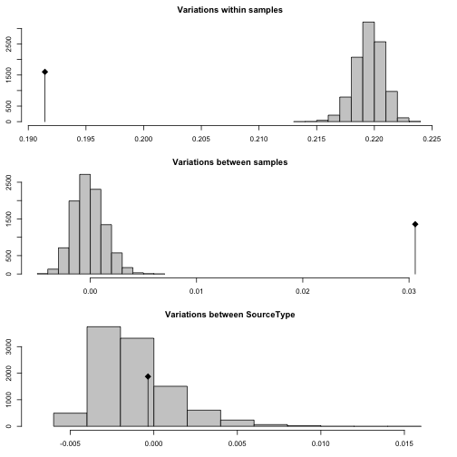

```r
library("tidyverse")
library("poppr")
(load("data/sclerotinia_16_loci.rda"))
```

```
## [1] "dat"            "dat11"          "datdf"          "keeploci"      
## [5] "corrected_loci"
```

# Purpose

The white mold nursery populations are unique because they are not fungicide
treated and have the same cultivars planted in them year after year.

The question becomes, are white mold nurseries differentiated from each other or
are they more or less homogeneous? We could use AMOVA to test for these with
location and binary source (wmn or non-wmn) as the hierarchy.


# Data Setup

First, we want to clone-correct our data down to the field level so that we
don't accidentally include non-independent samples.


```r
dat11
```

```
## 
## This is a genclone object
## -------------------------
## Genotype information:
## 
##    165 original multilocus genotypes 
##    366 haploid individuals
##     11 codominant loci
## 
## Population information:
## 
##      5 strata - MCG, Region, Source, Year, Host
##     14 populations defined - NE, NY, MN, ..., France, Mexico, ND
```

```r
dat11cc <- clonecorrect(dat11, ~Region/Source/Host/Year)
dat11cc
```

```
## 
## This is a genclone object
## -------------------------
## Genotype information:
## 
##    165 original multilocus genotypes 
##    318 haploid individuals
##     11 codominant loci
## 
## Population information:
## 
##      5 strata - MCG, Region, Source, Year, Host
##     14 populations defined - NE, NY, MN, ..., France, Mexico, ND
```

```r
make_amova_table <- function(am, amt, samples = "Region"){
  tot <- nrow(am$results)
  res <- data.frame(list(am$results[-tot, c("Df", "Sum Sq")], 
                         Percent = am$componentsofcovariance[-tot, 2],
                         Pval    = rev(amt$pvalue), 
                         Phi     = am$statphi$Phi[-tot]))
  res <- as.matrix(res)
  colnames(res) <- c("d.f.", "Sum of Squares", "Percent variation", "P", 
                     "Phi statistic")
  names(dimnames(res)) <- c("levels", "statistic")
  rownames(res) <- gsub("samples", samples, rownames(res))
  return(res)
}

make_amova_printable <- function(amtab, amtabcc){
  am_array <- array(dim      = c(dim(amtab), 2),
                    dimnames = c(dimnames(amtab), 
                                 list(c("full", "clone-corrected"))))
  am_array[, , 1] <- amtab
  am_array[, , 2] <- amtabcc
  tabfun <- function(x){
    x <- paste0(paste0(signif(x, 3), collapse = " ("), ")")
    return(x)
  }
  res <- apply(am_array, c(1, 2), tabfun)
  return(res)
}
```

Now that we've done that, we should make a new variable in the strata that 
separates the white mold nurseries from the others. We'll call this stratum 
"Source Type".


```r
addStrata(dat11cc) <- strata(dat11cc) %>% 
  mutate(SourceType = forcats::fct_inorder(ifelse(Source == "wmn", "wmn", "other"))) %>%
  select(SourceType)
setPop(dat11cc) <- ~SourceType
dat11cc
```

```
## 
## This is a genclone object
## -------------------------
## Genotype information:
## 
##    165 original multilocus genotypes 
##    318 haploid individuals
##     11 codominant loci
## 
## Population information:
## 
##      6 strata - MCG, Region, Source, Year, Host, SourceType
##      2 populations defined - other, wmn
```

I can perform AMOVA on the newly defined variable using Bruvo's distance.


```r
other(dat11cc)$REPLEN
```

```
##   5-2(F)   5-3(F)   6-2(F)   7-2(F)   8-3(H)   9-2(F)  12-2(H)  17-3(H) 
##  2.00000  4.00000  5.99999  2.00000  2.00000  2.00000  2.00000  3.00000 
##  20-3(F)  36-4(F)  50-4(F)  55-4(F)  92-4(F) 106-4(H) 110-4(H) 114-4(H) 
##  2.00000  4.00000  4.00000  4.00000  2.00000  4.00000  3.99999  4.00000
```

```r
bd <- bruvo.dist(dat11cc, replen = other(dat11cc)$REPLEN)
(ssc_amova <- poppr.amova(dat11cc, ~SourceType, dist = bd, quiet = TRUE))
```

```
## $call
## ade4::amova(samples = xtab, distances = xdist, structures = xstruct)
## 
## $results
##                  Df     Sum Sq   Mean Sq
## Between samples   1  0.8969901 0.8969901
## Within samples  316 68.7005529 0.2174068
## Total           317 69.5975430 0.2195506
## 
## $componentsofcovariance
##                                   Sigma          %
## Variations  Between samples 0.004391536   1.979968
## Variations  Within samples  0.217406813  98.020032
## Total variations            0.221798349 100.000000
## 
## $statphi
##                          Phi
## Phi-samples-total 0.01979968
```

```r
ssc_amova_test <- randtest(ssc_amova, nrepet = 999)
plot(ssc_amova_test)
```


```r
ssc_amova_test
```

```
## Monte-Carlo test
## Call: as.randtest(sim = res, obs = sigma[1])
## 
## Observation: 0.004391536 
## 
## Based on 999 replicates
## Simulated p-value: 0.001 
## Alternative hypothesis: greater 
## 
##       Std.Obs   Expectation      Variance 
##  8.309756e+00 -2.754234e-05  2.828049e-07
```


This result is telling us that there is some subdivision between white mold
nurseries and non-white mold nurseries. Of course, from previous analyses, we
know that Mexico is differentiated from other populations, so what happens if we
account for Region? Here, we are placing region lower in the heirarchy because
we specifically want to test the effect of region on the differentiation between
white mold nurseries within different regions.


```r
ssc_amova_region <- poppr.amova(dat11cc, ~SourceType/Region, dist = bd, quiet = TRUE)
ssc_amova_region_test <- randtest(ssc_amova_region, nrepet = 999)
plot(ssc_amova_region_test)
```



```r
(ssc_amova_table <- make_amova_table(ssc_amova_region, ssc_amova_region_test))
```

```
##                                   statistic
## levels                             d.f. Sum of Squares Percent variation
##   Between SourceType                  1      0.8969901        -0.1583345
##   Between Region Within SourceType   20     12.0338468        13.7964379
##   Within Region                     296     56.6667061        86.3618966
##                                   statistic
## levels                                 P Phi statistic
##   Between SourceType               0.300   0.136381034
##   Between Region Within SourceType 0.001   0.137746279
##   Within Region                    0.001  -0.001583345
```

Okay! This shows that when we account for Region after accounting for Source
Type, we find that the differentiation is coming mainly from the Regions. What
happens when we remove Mexico?


```r
datnomex <- setPop(dat11cc, ~Region) %>% popsub(blacklist = "Mexico")
bdnm     <- bruvo.dist(datnomex, replen = other(datnomex)$REPLEN)
ssc_amova_nm <- poppr.amova(datnomex, ~SourceType/Region, dist = bdnm, quiet = TRUE)
ssc_amova_nm_test <- randtest(ssc_amova_nm, nrepet = 999)
plot(ssc_amova_nm_test)
```


```r
(ssc_amova_nm_table <- make_amova_table(ssc_amova_nm, ssc_amova_nm_test))
```

```
##                                   statistic
## levels                             d.f. Sum of Squares Percent variation
##   Between SourceType                  1      0.7527864          0.115560
##   Between Region Within SourceType   19      8.9146924          9.534715
##   Within Region                     282     55.0854125         90.349725
##                                   statistic
## levels                                 P Phi statistic
##   Between SourceType               0.265    0.09650275
##   Between Region Within SourceType 0.001    0.09545746
##   Within Region                    0.001    0.00115560
```


```r
make_amova_printable(ssc_amova_table, ssc_amova_nm_table) %>%  
  as_tibble() %>%
  add_column(Hierarchy = c("Between Source", "Between Region within Source", "Within Region"), .before = 1) %>%
  rename(ps = `Phi statistic`) %>%
  mutate(ps = gsub("0\\.00(\\d{1})(\\d{2})", "\\1.\\2e^-3^", ps)) %>%
  rename(`$\\Phi statistic$` = ps) %>%
  rename(`% variation` = `Percent variation`) %>%
  rename(S.S. = `Sum of Squares`) %>%
  select(-P) %>%
  huxtable::as_huxtable(add_colnames = TRUE) %>% 
  huxtable::set_col_width(c(1.3, 0.7, 0.9, 1, 1.3)) %>% 
  huxtable::set_align(huxtable::everywhere, 2:5, "center") %>% 
  huxtable::print_md(max_width = 95)
```

```
--------------------------------------------------------------------------------------------
Hierarchy                  d.f.          S.S.          % variation       $\Phi statistic$    
---------------------- ------------ --------------- ----------------- ----------------------
Between Source            1 (1)      0.897 (0.753)   -0.158 (0.116)       0.136 (0.0965)     

Between Region within    20 (19)       12 (8.91)       13.8 (9.53)        0.138 (0.0955)     
Source                                                                                       

Within Region           296 (282)     56.7 (55.1)      86.4 (90.3)    -1.58e^-3^ (1.16e^-3^) 

--------------------------------------------------------------------------------------------
```


When we remove the Mexican isolates (which only contained white mold nurseries
and shared no genotypes), we see that indeed, the degree of differentiation
went down. 

## Visualizing the partitions

We can visualize the partitions if we create distributions showing the genetic
distance.


```r
wmn_inds <- (setPop(dat11cc, ~SourceType) %>% pop()) == "wmn"

# Function to set the upper triangle to NA to avoid over-representation.
set_upper_tri_NA <- function(d){d[upper.tri(d)] <- NA; diag(d) <- NA; d}

# dist data converted to matrix fed into here. Removes NAs from previous function
tidy_dist <- . %>%
  as.data.frame() %>% 
  rownames_to_column("from") %>% 
  gather(to, distance, -from) %>% 
  filter(!is.na(distance))
wmn_distance   <- as.matrix(bd)[wmn_inds, wmn_inds] %>% set_upper_tri_NA() %>% tidy_dist
nwmn_distance  <- as.matrix(bd)[!wmn_inds, !wmn_inds] %>% set_upper_tri_NA() %>% tidy_dist
inter_distance <- as.matrix(bd)[wmn_inds, !wmn_inds] %>% tidy_dist

dists <- bind_rows(`White Mold Nurseries` = wmn_distance, 
                   `Between` = inter_distance,
                   `Other Sources` = nwmn_distance, 
                   .id = "Comparison") %>%
  mutate(Comparison = forcats::fct_inorder(Comparison)) %>%
  as_tibble()
dists
```

```
## # A tibble: 50,403 x 4
##              Comparison  from    to   distance
##                  <fctr> <chr> <chr>      <dbl>
##  1 White Mold Nurseries   445   444 0.00000000
##  2 White Mold Nurseries   446   444 0.30681818
##  3 White Mold Nurseries   447   444 0.26136364
##  4 White Mold Nurseries   448   444 0.37500000
##  5 White Mold Nurseries   449   444 0.31818182
##  6 White Mold Nurseries   450   444 0.22727273
##  7 White Mold Nurseries   451   444 0.09090909
##  8 White Mold Nurseries   452   444 0.18181818
##  9 White Mold Nurseries   453   444 0.00000000
## 10 White Mold Nurseries   454   444 0.09090909
## # ... with 50,393 more rows
```

```r
ggplot(dists, aes(y = distance, x = Comparison, fill = Comparison)) +
  geom_violin() +
  geom_boxplot(width = 0.25) +
  scale_fill_manual(values =  c(`Other Sources` = "grey35", `White Mold Nurseries` = "grey95", Between = "grey65")) +
  scale_color_manual(values = c(`Other Sources` = "grey35", `White Mold Nurseries` = "grey95", Between = "grey65")) +
  theme_bw(base_size = 16, base_family = "Helvetica") +
  theme(aspect.ratio = 1/2) +
  theme(legend.position = "none") +
  theme(axis.title.x = element_blank()) +
  theme(axis.text = element_text(color = "black")) +
  theme(panel.grid.major = element_line(colour = "grey20")) +
  theme(panel.grid.minor = element_line(colour = "grey50")) +
  theme(panel.grid.major.x = element_blank()) +
  theme(panel.border = element_blank()) +
  ylab("Bruvo's Distance")
```


```r
summary_dists <- dists %>% 
  group_by(Comparison) %>% 
  summarize(`Average Distance` = mean(distance),
            `Standard Deviation` = sd(distance)) 
knitr::kable(summary_dists, digits = 3)
```


|Comparison           | Average Distance| Standard Deviation|
|:--------------------|----------------:|------------------:|
|White Mold Nurseries |            0.453|              0.139|
|Between              |            0.440|              0.148|
|Other Sources        |            0.410|              0.165|

On first look, it appears that there's not much difference. Looking at the
table, we can see that the average distance within White Mold Nurseries is 
0.453, whereas the average distance within Other
Sources is 0.41. This is well within the standard
deviation for both distributions, but we also recognize that a single step of
Bruvo's distance for 11 loci in a haploid organism is 0.045.


## WMN DAPC

DAPC is a nice way of visualizing these. First, I'm simply going to compare 
between white mold nurseries and others:


```r
filter <- strata(dat11cc) %>%
  group_by(Region) %>%
  mutate(filter = length(unique(SourceType)) > 1) %>%
  pull(filter)
wmn_compare <- dat11cc[filter]
set.seed(2017-07-12)
wmndapc <- xvalDapc(tab(wmn_compare), pop(wmn_compare), n.rep = 200, n.pca = 1:10)
```


```r
wmndapc
```

```
## $`Cross-Validation Results`
##      n.pca   success
## 1        1 0.6153846
## 2        1 0.5137363
## 3        1 0.3626374
## 4        1 0.6593407
## 5        1 0.5824176
## 6        1 0.5439560
## 7        1 0.5384615
## 8        1 0.4752747
## 9        1 0.5439560
## 10       1 0.6208791
## 11       1 0.5082418
## 12       1 0.5412088
## 13       1 0.5109890
## 14       1 0.4010989
## 15       1 0.6538462
## 16       1 0.5439560
## 17       1 0.5796703
## 18       1 0.4697802
## 19       1 0.4752747
## 20       1 0.5082418
## 21       1 0.5137363
## 22       1 0.4752747
## 23       1 0.6950549
## 24       1 0.5494505
## 25       1 0.4725275
## 26       1 0.4725275
## 27       1 0.5412088
## 28       1 0.5439560
## 29       1 0.5494505
## 30       1 0.5494505
## 31       1 0.4697802
## 32       1 0.5521978
## 33       1 0.5796703
## 34       1 0.5027473
## 35       1 0.5027473
## 36       1 0.3956044
## 37       1 0.5824176
## 38       1 0.5796703
## 39       1 0.5494505
## 40       1 0.4725275
## 41       1 0.5384615
## 42       1 0.5439560
## 43       1 0.4725275
## 44       1 0.3241758
## 45       1 0.6181319
## 46       1 0.5082418
## 47       1 0.5467033
## 48       1 0.3626374
## 49       1 0.5467033
## 50       1 0.5439560
## 51       1 0.4697802
## 52       1 0.4752747
## 53       1 0.4752747
## 54       1 0.6236264
## 55       1 0.4752747
## 56       1 0.4038462
## 57       1 0.4340659
## 58       1 0.5824176
## 59       1 0.3983516
## 60       1 0.7719780
## 61       1 0.5851648
## 62       1 0.5054945
## 63       1 0.5054945
## 64       1 0.5824176
## 65       1 0.5439560
## 66       1 0.6181319
## 67       1 0.3296703
## 68       1 0.5027473
## 69       1 0.4725275
## 70       1 0.4395604
## 71       1 0.5521978
## 72       1 0.4725275
## 73       1 0.4340659
## 74       1 0.5467033
## 75       1 0.6538462
## 76       1 0.4313187
## 77       1 0.6181319
## 78       1 0.4340659
## 79       1 0.5109890
## 80       1 0.5824176
## 81       1 0.5412088
## 82       1 0.5796703
## 83       1 0.6565934
## 84       1 0.4313187
## 85       1 0.3956044
## 86       1 0.5082418
## 87       1 0.4725275
## 88       1 0.5082418
## 89       1 0.5851648
## 90       1 0.4340659
## 91       1 0.5109890
## 92       1 0.3269231
## 93       1 0.5824176
## 94       1 0.4697802
## 95       1 0.4752747
## 96       1 0.5824176
## 97       1 0.5137363
## 98       1 0.6208791
## 99       1 0.6565934
## 100      1 0.5796703
## 101      1 0.5082418
## 102      1 0.3653846
## 103      1 0.4697802
## 104      1 0.6565934
## 105      1 0.5467033
## 106      1 0.4725275
## 107      1 0.5164835
## 108      1 0.4752747
## 109      1 0.4423077
## 110      1 0.4752747
## 111      1 0.5054945
## 112      1 0.6538462
## 113      1 0.4780220
## 114      1 0.6565934
## 115      1 0.4752747
## 116      1 0.5467033
## 117      1 0.6208791
## 118      1 0.6593407
## 119      1 0.4010989
## 120      1 0.6923077
## 121      1 0.5412088
## 122      1 0.5412088
## 123      1 0.6923077
## 124      1 0.5467033
## 125      1 0.5824176
## 126      1 0.6565934
## 127      1 0.5109890
## 128      1 0.5824176
## 129      1 0.5439560
## 130      1 0.5192308
## 131      1 0.6181319
## 132      1 0.4697802
## 133      1 0.6208791
## 134      1 0.4340659
## 135      1 0.3983516
## 136      1 0.4340659
## 137      1 0.5824176
## 138      1 0.6565934
## 139      1 0.5906593
## 140      1 0.6236264
## 141      1 0.5467033
## 142      1 0.4368132
## 143      1 0.6263736
## 144      1 0.5082418
## 145      1 0.4725275
## 146      1 0.4340659
## 147      1 0.3983516
## 148      1 0.5027473
## 149      1 0.5109890
## 150      1 0.5439560
## 151      1 0.6208791
## 152      1 0.4725275
## 153      1 0.6565934
## 154      1 0.3983516
## 155      1 0.5851648
## 156      1 0.5467033
## 157      1 0.5467033
## 158      1 0.5467033
## 159      1 0.4010989
## 160      1 0.4670330
## 161      1 0.5824176
## 162      1 0.4725275
## 163      1 0.5054945
## 164      1 0.5054945
## 165      1 0.6208791
## 166      1 0.6648352
## 167      1 0.6181319
## 168      1 0.5824176
## 169      1 0.6208791
## 170      1 0.5439560
## 171      1 0.4642857
## 172      1 0.3983516
## 173      1 0.5851648
## 174      1 0.5054945
## 175      1 0.5796703
## 176      1 0.4313187
## 177      1 0.6208791
## 178      1 0.3571429
## 179      1 0.5824176
## 180      1 0.6181319
## 181      1 0.5412088
## 182      1 0.5879121
## 183      1 0.5796703
## 184      1 0.5439560
## 185      1 0.4313187
## 186      1 0.5439560
## 187      1 0.6208791
## 188      1 0.4725275
## 189      1 0.5439560
## 190      1 0.3296703
## 191      1 0.5109890
## 192      1 0.5082418
## 193      1 0.6950549
## 194      1 0.5824176
## 195      1 0.4368132
## 196      1 0.4697802
## 197      1 0.5109890
## 198      1 0.5439560
## 199      1 0.5824176
## 200      1 0.4313187
## 201      2 0.6236264
## 202      2 0.5824176
## 203      2 0.6263736
## 204      2 0.7060440
## 205      2 0.6978022
## 206      2 0.5906593
## 207      2 0.5934066
## 208      2 0.5824176
## 209      2 0.7005495
## 210      2 0.6318681
## 211      2 0.5521978
## 212      2 0.6675824
## 213      2 0.4835165
## 214      2 0.5192308
## 215      2 0.4478022
## 216      2 0.4780220
## 217      2 0.4697802
## 218      2 0.5521978
## 219      2 0.6318681
## 220      2 0.5247253
## 221      2 0.5521978
## 222      2 0.6978022
## 223      2 0.5851648
## 224      2 0.5219780
## 225      2 0.5879121
## 226      2 0.5137363
## 227      2 0.4340659
## 228      2 0.6236264
## 229      2 0.5109890
## 230      2 0.5192308
## 231      2 0.5164835
## 232      2 0.5604396
## 233      2 0.5164835
## 234      2 0.5851648
## 235      2 0.5549451
## 236      2 0.5576923
## 237      2 0.7005495
## 238      2 0.6620879
## 239      2 0.5521978
## 240      2 0.5576923
## 241      2 0.4835165
## 242      2 0.5137363
## 243      2 0.4752747
## 244      2 0.7362637
## 245      2 0.6950549
## 246      2 0.5164835
## 247      2 0.5906593
## 248      2 0.4093407
## 249      2 0.5521978
## 250      2 0.5961538
## 251      2 0.6263736
## 252      2 0.6675824
## 253      2 0.7032967
## 254      2 0.7005495
## 255      2 0.5521978
## 256      2 0.4423077
## 257      2 0.6593407
## 258      2 0.6648352
## 259      2 0.5934066
## 260      2 0.7390110
## 261      2 0.7087912
## 262      2 0.4450549
## 263      2 0.5576923
## 264      2 0.5467033
## 265      2 0.4752747
## 266      2 0.7032967
## 267      2 0.4835165
## 268      2 0.4780220
## 269      2 0.4368132
## 270      2 0.6620879
## 271      2 0.5906593
## 272      2 0.7390110
## 273      2 0.5549451
## 274      2 0.6236264
## 275      2 0.5247253
## 276      2 0.5192308
## 277      2 0.3708791
## 278      2 0.7005495
## 279      2 0.3736264
## 280      2 0.6318681
## 281      2 0.7747253
## 282      2 0.5494505
## 283      2 0.5906593
## 284      2 0.5549451
## 285      2 0.4423077
## 286      2 0.5521978
## 287      2 0.5521978
## 288      2 0.7005495
## 289      2 0.6263736
## 290      2 0.5604396
## 291      2 0.5109890
## 292      2 0.7390110
## 293      2 0.6648352
## 294      2 0.7005495
## 295      2 0.4890110
## 296      2 0.6263736
## 297      2 0.7719780
## 298      2 0.5494505
## 299      2 0.5521978
## 300      2 0.5219780
## 301      2 0.6263736
## 302      2 0.5521978
## 303      2 0.5164835
## 304      2 0.7060440
## 305      2 0.6648352
## 306      2 0.5137363
## 307      2 0.5549451
## 308      2 0.6318681
## 309      2 0.5247253
## 310      2 0.6208791
## 311      2 0.5549451
## 312      2 0.6675824
## 313      2 0.6950549
## 314      2 0.5851648
## 315      2 0.6318681
## 316      2 0.4725275
## 317      2 0.5164835
## 318      2 0.5549451
## 319      2 0.6291209
## 320      2 0.5137363
## 321      2 0.5521978
## 322      2 0.4780220
## 323      2 0.5934066
## 324      2 0.6236264
## 325      2 0.7417582
## 326      2 0.5879121
## 327      2 0.7032967
## 328      2 0.5164835
## 329      2 0.5494505
## 330      2 0.5934066
## 331      2 0.5164835
## 332      2 0.5934066
## 333      2 0.5879121
## 334      2 0.5851648
## 335      2 0.6318681
## 336      2 0.4725275
## 337      2 0.5467033
## 338      2 0.6263736
## 339      2 0.5934066
## 340      2 0.4065934
## 341      2 0.6565934
## 342      2 0.5879121
## 343      2 0.5549451
## 344      2 0.6620879
## 345      2 0.6648352
## 346      2 0.5439560
## 347      2 0.6291209
## 348      2 0.4752747
## 349      2 0.4780220
## 350      2 0.6593407
## 351      2 0.6291209
## 352      2 0.5521978
## 353      2 0.5521978
## 354      2 0.6291209
## 355      2 0.6593407
## 356      2 0.6648352
## 357      2 0.5934066
## 358      2 0.5521978
## 359      2 0.5906593
## 360      2 0.6620879
## 361      2 0.3681319
## 362      2 0.4752747
## 363      2 0.5164835
## 364      2 0.5219780
## 365      2 0.7087912
## 366      2 0.5467033
## 367      2 0.5082418
## 368      2 0.5906593
## 369      2 0.5521978
## 370      2 0.5192308
## 371      2 0.6593407
## 372      2 0.6620879
## 373      2 0.5906593
## 374      2 0.5851648
## 375      2 0.5879121
## 376      2 0.5137363
## 377      2 0.6675824
## 378      2 0.8516484
## 379      2 0.5549451
## 380      2 0.4423077
## 381      2 0.6236264
## 382      2 0.6675824
## 383      2 0.6208791
## 384      2 0.5549451
## 385      2 0.4423077
## 386      2 0.5219780
## 387      2 0.5164835
## 388      2 0.5906593
## 389      2 0.4807692
## 390      2 0.6703297
## 391      2 0.7005495
## 392      2 0.6648352
## 393      2 0.4752747
## 394      2 0.5906593
## 395      2 0.5467033
## 396      2 0.5494505
## 397      2 0.5906593
## 398      2 0.5879121
## 399      2 0.5549451
## 400      2 0.7362637
## 401      3 0.6675824
## 402      3 0.7774725
## 403      3 0.5164835
## 404      3 0.5961538
## 405      3 0.6620879
## 406      3 0.5851648
## 407      3 0.5137363
## 408      3 0.7087912
## 409      3 0.7005495
## 410      3 0.5934066
## 411      3 0.5521978
## 412      3 0.5467033
## 413      3 0.5879121
## 414      3 0.5879121
## 415      3 0.6648352
## 416      3 0.6263736
## 417      3 0.5961538
## 418      3 0.8104396
## 419      3 0.4862637
## 420      3 0.7005495
## 421      3 0.7747253
## 422      3 0.8131868
## 423      3 0.6703297
## 424      3 0.5934066
## 425      3 0.6648352
## 426      3 0.7005495
## 427      3 0.5961538
## 428      3 0.6648352
## 429      3 0.4807692
## 430      3 0.6950549
## 431      3 0.4835165
## 432      3 0.5549451
## 433      3 0.5961538
## 434      3 0.6263736
## 435      3 0.6016484
## 436      3 0.7747253
## 437      3 0.6346154
## 438      3 0.5192308
## 439      3 0.6648352
## 440      3 0.5934066
## 441      3 0.7005495
## 442      3 0.7005495
## 443      3 0.6291209
## 444      3 0.4807692
## 445      3 0.5549451
## 446      3 0.6208791
## 447      3 0.7115385
## 448      3 0.6648352
## 449      3 0.7747253
## 450      3 0.6675824
## 451      3 0.6318681
## 452      3 0.7032967
## 453      3 0.6593407
## 454      3 0.5989011
## 455      3 0.5934066
## 456      3 0.5521978
## 457      3 0.6263736
## 458      3 0.7005495
## 459      3 0.5521978
## 460      3 0.5109890
## 461      3 0.5906593
## 462      3 0.6208791
## 463      3 0.6291209
## 464      3 0.5576923
## 465      3 0.7032967
## 466      3 0.7390110
## 467      3 0.4395604
## 468      3 0.5934066
## 469      3 0.5549451
## 470      3 0.6263736
## 471      3 0.5137363
## 472      3 0.6620879
## 473      3 0.5934066
## 474      3 0.5164835
## 475      3 0.6291209
## 476      3 0.6593407
## 477      3 0.5494505
## 478      3 0.4423077
## 479      3 0.7774725
## 480      3 0.4752747
## 481      3 0.5934066
## 482      3 0.7774725
## 483      3 0.6675824
## 484      3 0.6620879
## 485      3 0.7417582
## 486      3 0.6620879
## 487      3 0.5576923
## 488      3 0.5137363
## 489      3 0.6236264
## 490      3 0.7417582
## 491      3 0.5549451
## 492      3 0.6675824
## 493      3 0.6593407
## 494      3 0.4725275
## 495      3 0.7417582
## 496      3 0.8543956
## 497      3 0.5192308
## 498      3 0.6318681
## 499      3 0.5906593
## 500      3 0.5906593
## 501      3 0.6291209
## 502      3 0.6620879
## 503      3 0.5521978
## 504      3 0.7005495
## 505      3 0.6675824
## 506      3 0.6593407
## 507      3 0.5219780
## 508      3 0.6291209
## 509      3 0.5961538
## 510      3 0.7005495
## 511      3 0.6730769
## 512      3 0.5906593
## 513      3 0.7417582
## 514      3 0.5494505
## 515      3 0.6978022
## 516      3 0.5549451
## 517      3 0.6620879
## 518      3 0.5961538
## 519      3 0.4395604
## 520      3 0.7774725
## 521      3 0.6263736
## 522      3 0.6648352
## 523      3 0.5879121
## 524      3 0.5576923
## 525      3 0.6648352
## 526      3 0.6978022
## 527      3 0.6648352
## 528      3 0.7032967
## 529      3 0.6263736
## 530      3 0.7032967
## 531      3 0.7829670
## 532      3 0.5879121
## 533      3 0.6923077
## 534      3 0.5851648
## 535      3 0.6263736
## 536      3 0.6675824
## 537      3 0.4340659
## 538      3 0.6648352
## 539      3 0.6208791
## 540      3 0.7005495
## 541      3 0.6675824
## 542      3 0.5604396
## 543      3 0.4862637
## 544      3 0.7747253
## 545      3 0.5906593
## 546      3 0.6620879
## 547      3 0.7747253
## 548      3 0.5549451
## 549      3 0.5494505
## 550      3 0.5494505
## 551      3 0.6263736
## 552      3 0.6648352
## 553      3 0.5879121
## 554      3 0.6291209
## 555      3 0.7005495
## 556      3 0.6620879
## 557      3 0.5521978
## 558      3 0.7747253
## 559      3 0.6620879
## 560      3 0.6703297
## 561      3 0.7362637
## 562      3 0.5467033
## 563      3 0.4835165
## 564      3 0.6675824
## 565      3 0.5879121
## 566      3 0.5906593
## 567      3 0.5906593
## 568      3 0.7390110
## 569      3 0.5906593
## 570      3 0.5851648
## 571      3 0.7747253
## 572      3 0.7335165
## 573      3 0.6318681
## 574      3 0.7747253
## 575      3 0.7417582
## 576      3 0.6263736
## 577      3 0.5934066
## 578      3 0.5494505
## 579      3 0.5879121
## 580      3 0.6648352
## 581      3 0.4038462
## 582      3 0.5549451
## 583      3 0.7747253
## 584      3 0.4752747
## 585      3 0.8104396
## 586      3 0.7005495
## 587      3 0.6620879
## 588      3 0.6950549
## 589      3 0.4725275
## 590      3 0.5851648
## 591      3 0.6236264
## 592      3 0.6648352
## 593      3 0.7747253
## 594      3 0.5851648
## 595      3 0.6675824
## 596      3 0.5137363
## 597      3 0.5521978
## 598      3 0.6978022
## 599      3 0.6291209
## 600      3 0.5879121
## 601      4 0.6703297
## 602      4 0.6263736
## 603      4 0.5082418
## 604      4 0.4450549
## 605      4 0.5851648
## 606      4 0.7032967
## 607      4 0.7719780
## 608      4 0.6703297
## 609      4 0.5906593
## 610      4 0.5906593
## 611      4 0.8131868
## 612      4 0.5494505
## 613      4 0.5824176
## 614      4 0.8131868
## 615      4 0.5192308
## 616      4 0.6263736
## 617      4 0.5879121
## 618      4 0.7417582
## 619      4 0.6648352
## 620      4 0.5824176
## 621      4 0.7390110
## 622      4 0.7390110
## 623      4 0.7362637
## 624      4 0.6291209
## 625      4 0.7362637
## 626      4 0.5989011
## 627      4 0.5906593
## 628      4 0.5906593
## 629      4 0.4423077
## 630      4 0.5549451
## 631      4 0.4423077
## 632      4 0.6236264
## 633      4 0.7005495
## 634      4 0.7005495
## 635      4 0.5549451
## 636      4 0.5467033
## 637      4 0.5521978
## 638      4 0.6648352
## 639      4 0.6703297
## 640      4 0.6346154
## 641      4 0.5824176
## 642      4 0.6263736
## 643      4 0.5521978
## 644      4 0.5879121
## 645      4 0.5879121
## 646      4 0.7032967
## 647      4 0.6620879
## 648      4 0.6675824
## 649      4 0.7417582
## 650      4 0.4835165
## 651      4 0.6648352
## 652      4 0.4065934
## 653      4 0.6291209
## 654      4 0.6978022
## 655      4 0.5576923
## 656      4 0.5164835
## 657      4 0.5521978
## 658      4 0.5906593
## 659      4 0.5164835
## 660      4 0.5164835
## 661      4 0.5549451
## 662      4 0.7362637
## 663      4 0.7005495
## 664      4 0.5934066
## 665      4 0.7802198
## 666      4 0.5494505
## 667      4 0.6593407
## 668      4 0.5906593
## 669      4 0.7032967
## 670      4 0.5164835
## 671      4 0.6978022
## 672      4 0.5137363
## 673      4 0.7362637
## 674      4 0.7032967
## 675      4 0.4725275
## 676      4 0.6730769
## 677      4 0.6263736
## 678      4 0.6263736
## 679      4 0.6565934
## 680      4 0.6593407
## 681      4 0.6291209
## 682      4 0.5851648
## 683      4 0.8104396
## 684      4 0.6620879
## 685      4 0.4395604
## 686      4 0.6620879
## 687      4 0.6263736
## 688      4 0.4423077
## 689      4 0.7472527
## 690      4 0.6291209
## 691      4 0.6648352
## 692      4 0.5879121
## 693      4 0.7747253
## 694      4 0.6236264
## 695      4 0.6291209
## 696      4 0.6318681
## 697      4 0.4450549
## 698      4 0.7005495
## 699      4 0.5137363
## 700      4 0.5164835
## 701      4 0.5851648
## 702      4 0.4395604
## 703      4 0.6263736
## 704      4 0.5192308
## 705      4 0.4478022
## 706      4 0.5604396
## 707      4 0.5879121
## 708      4 0.5851648
## 709      4 0.5137363
## 710      4 0.5521978
## 711      4 0.5549451
## 712      4 0.6950549
## 713      4 0.6648352
## 714      4 0.7060440
## 715      4 0.7005495
## 716      4 0.6263736
## 717      4 0.4752747
## 718      4 0.5192308
## 719      4 0.5164835
## 720      4 0.4065934
## 721      4 0.6675824
## 722      4 0.7060440
## 723      4 0.7005495
## 724      4 0.6648352
## 725      4 0.7060440
## 726      4 0.7005495
## 727      4 0.6236264
## 728      4 0.5137363
## 729      4 0.5851648
## 730      4 0.7005495
## 731      4 0.6648352
## 732      4 0.5879121
## 733      4 0.5192308
## 734      4 0.5934066
## 735      4 0.6236264
## 736      4 0.8076923
## 737      4 0.4395604
## 738      4 0.5961538
## 739      4 0.7005495
## 740      4 0.6291209
## 741      4 0.5192308
## 742      4 0.7087912
## 743      4 0.6648352
## 744      4 0.7060440
## 745      4 0.6593407
## 746      4 0.5934066
## 747      4 0.6675824
## 748      4 0.7005495
## 749      4 0.6675824
## 750      4 0.5192308
## 751      4 0.5219780
## 752      4 0.4120879
## 753      4 0.5879121
## 754      4 0.4725275
## 755      4 0.6648352
## 756      4 0.6675824
## 757      4 0.5192308
## 758      4 0.5494505
## 759      4 0.6291209
## 760      4 0.7032967
## 761      4 0.7005495
## 762      4 0.5934066
## 763      4 0.7774725
## 764      4 0.5494505
## 765      4 0.4752747
## 766      4 0.7417582
## 767      4 0.5989011
## 768      4 0.5164835
## 769      4 0.7774725
## 770      4 0.5219780
## 771      4 0.7719780
## 772      4 0.5906593
## 773      4 0.7417582
## 774      4 0.6978022
## 775      4 0.6978022
## 776      4 0.6593407
## 777      4 0.6263736
## 778      4 0.7335165
## 779      4 0.4807692
## 780      4 0.6291209
## 781      4 0.7719780
## 782      4 0.6236264
## 783      4 0.6620879
## 784      4 0.7087912
## 785      4 0.7032967
## 786      4 0.5164835
## 787      4 0.4752747
## 788      4 0.6675824
## 789      4 0.5494505
## 790      4 0.5109890
## 791      4 0.5192308
## 792      4 0.5934066
## 793      4 0.7747253
## 794      4 0.5137363
## 795      4 0.6291209
## 796      4 0.5521978
## 797      4 0.5137363
## 798      4 0.6978022
## 799      4 0.7417582
## 800      4 0.5961538
## 801      5 0.7005495
## 802      5 0.5989011
## 803      5 0.4835165
## 804      5 0.6978022
## 805      5 0.6620879
## 806      5 0.4478022
## 807      5 0.7774725
## 808      5 0.4010989
## 809      5 0.5137363
## 810      5 0.6236264
## 811      5 0.6648352
## 812      5 0.6620879
## 813      5 0.6236264
## 814      5 0.5934066
## 815      5 0.6648352
## 816      5 0.7335165
## 817      5 0.5137363
## 818      5 0.4752747
## 819      5 0.5906593
## 820      5 0.5137363
## 821      5 0.6291209
## 822      5 0.6648352
## 823      5 0.4780220
## 824      5 0.6675824
## 825      5 0.5576923
## 826      5 0.6620879
## 827      5 0.4395604
## 828      5 0.5961538
## 829      5 0.6593407
## 830      5 0.6236264
## 831      5 0.7417582
## 832      5 0.4780220
## 833      5 0.7362637
## 834      5 0.7719780
## 835      5 0.7362637
## 836      5 0.6620879
## 837      5 0.6291209
## 838      5 0.6263736
## 839      5 0.6648352
## 840      5 0.6675824
## 841      5 0.7032967
## 842      5 0.6648352
## 843      5 0.6346154
## 844      5 0.6318681
## 845      5 0.7390110
## 846      5 0.6620879
## 847      5 0.5521978
## 848      5 0.6620879
## 849      5 0.5879121
## 850      5 0.5549451
## 851      5 0.7719780
## 852      5 0.7774725
## 853      5 0.5549451
## 854      5 0.7005495
## 855      5 0.5879121
## 856      5 0.5137363
## 857      5 0.7417582
## 858      5 0.5906593
## 859      5 0.4835165
## 860      5 0.5164835
## 861      5 0.6318681
## 862      5 0.6291209
## 863      5 0.5906593
## 864      5 0.7005495
## 865      5 0.5576923
## 866      5 0.5164835
## 867      5 0.6978022
## 868      5 0.6675824
## 869      5 0.6675824
## 870      5 0.6593407
## 871      5 0.5521978
## 872      5 0.5604396
## 873      5 0.5137363
## 874      5 0.6263736
## 875      5 0.7005495
## 876      5 0.5521978
## 877      5 0.6565934
## 878      5 0.6291209
## 879      5 0.6675824
## 880      5 0.6263736
## 881      5 0.5164835
## 882      5 0.5549451
## 883      5 0.5906593
## 884      5 0.7362637
## 885      5 0.4752747
## 886      5 0.5851648
## 887      5 0.5137363
## 888      5 0.7005495
## 889      5 0.6291209
## 890      5 0.5219780
## 891      5 0.6208791
## 892      5 0.5109890
## 893      5 0.6236264
## 894      5 0.7335165
## 895      5 0.6263736
## 896      5 0.5934066
## 897      5 0.6675824
## 898      5 0.7005495
## 899      5 0.7032967
## 900      5 0.6620879
## 901      5 0.6703297
## 902      5 0.6675824
## 903      5 0.6648352
## 904      5 0.5851648
## 905      5 0.7417582
## 906      5 0.4697802
## 907      5 0.5906593
## 908      5 0.5549451
## 909      5 0.4450549
## 910      5 0.6263736
## 911      5 0.6730769
## 912      5 0.7719780
## 913      5 0.5851648
## 914      5 0.7390110
## 915      5 0.6978022
## 916      5 0.5164835
## 917      5 0.6291209
## 918      5 0.5137363
## 919      5 0.7417582
## 920      5 0.4423077
## 921      5 0.6291209
## 922      5 0.6291209
## 923      5 0.6263736
## 924      5 0.8516484
## 925      5 0.7774725
## 926      5 0.5137363
## 927      5 0.5494505
## 928      5 0.5549451
## 929      5 0.5906593
## 930      5 0.7747253
## 931      5 0.7060440
## 932      5 0.7362637
## 933      5 0.5906593
## 934      5 0.7390110
## 935      5 0.5082418
## 936      5 0.6620879
## 937      5 0.5906593
## 938      5 0.6291209
## 939      5 0.6620879
## 940      5 0.5576923
## 941      5 0.5549451
## 942      5 0.4835165
## 943      5 0.5164835
## 944      5 0.5879121
## 945      5 0.6648352
## 946      5 0.5137363
## 947      5 0.7005495
## 948      5 0.5906593
## 949      5 0.5906593
## 950      5 0.8131868
## 951      5 0.6291209
## 952      5 0.6236264
## 953      5 0.5879121
## 954      5 0.6648352
## 955      5 0.4423077
## 956      5 0.5549451
## 957      5 0.6291209
## 958      5 0.6318681
## 959      5 0.4780220
## 960      5 0.6620879
## 961      5 0.7719780
## 962      5 0.7774725
## 963      5 0.5906593
## 964      5 0.5164835
## 965      5 0.5934066
## 966      5 0.6263736
## 967      5 0.4835165
## 968      5 0.5549451
## 969      5 0.7774725
## 970      5 0.7390110
## 971      5 0.5164835
## 972      5 0.5521978
## 973      5 0.5467033
## 974      5 0.6648352
## 975      5 0.5494505
## 976      5 0.4752747
## 977      5 0.6291209
## 978      5 0.6675824
## 979      5 0.6950549
## 980      5 0.4807692
## 981      5 0.6291209
## 982      5 0.6236264
## 983      5 0.5192308
## 984      5 0.8214286
## 985      5 0.5851648
## 986      5 0.4780220
## 987      5 0.5219780
## 988      5 0.6318681
## 989      5 0.4752747
## 990      5 0.5164835
## 991      5 0.5494505
## 992      5 0.6291209
## 993      5 0.5054945
## 994      5 0.6648352
## 995      5 0.3681319
## 996      5 0.6703297
## 997      5 0.6950549
## 998      5 0.6620879
## 999      5 0.5521978
## 1000     5 0.6291209
## 1001     6 0.6263736
## 1002     6 0.6620879
## 1003     6 0.7032967
## 1004     6 0.5961538
## 1005     6 0.5934066
## 1006     6 0.5879121
## 1007     6 0.4395604
## 1008     6 0.5879121
## 1009     6 0.6346154
## 1010     6 0.7362637
## 1011     6 0.7005495
## 1012     6 0.6675824
## 1013     6 0.5906593
## 1014     6 0.6675824
## 1015     6 0.5549451
## 1016     6 0.6263736
## 1017     6 0.5934066
## 1018     6 0.5521978
## 1019     6 0.6648352
## 1020     6 0.6648352
## 1021     6 0.5906593
## 1022     6 0.5879121
## 1023     6 0.5576923
## 1024     6 0.7032967
## 1025     6 0.6263736
## 1026     6 0.7774725
## 1027     6 0.5906593
## 1028     6 0.5467033
## 1029     6 0.6291209
## 1030     6 0.5549451
## 1031     6 0.7829670
## 1032     6 0.5521978
## 1033     6 0.5879121
## 1034     6 0.5109890
## 1035     6 0.7032967
## 1036     6 0.5549451
## 1037     6 0.5906593
## 1038     6 0.6648352
## 1039     6 0.5521978
## 1040     6 0.4862637
## 1041     6 0.4835165
## 1042     6 0.5934066
## 1043     6 0.4835165
## 1044     6 0.5137363
## 1045     6 0.5934066
## 1046     6 0.7005495
## 1047     6 0.5906593
## 1048     6 0.5549451
## 1049     6 0.4780220
## 1050     6 0.6648352
## 1051     6 0.5521978
## 1052     6 0.7390110
## 1053     6 0.5879121
## 1054     6 0.5961538
## 1055     6 0.5906593
## 1056     6 0.7005495
## 1057     6 0.5906593
## 1058     6 0.6016484
## 1059     6 0.5906593
## 1060     6 0.8186813
## 1061     6 0.4478022
## 1062     6 0.6620879
## 1063     6 0.5164835
## 1064     6 0.5494505
## 1065     6 0.5247253
## 1066     6 0.5879121
## 1067     6 0.6648352
## 1068     6 0.6620879
## 1069     6 0.6318681
## 1070     6 0.6208791
## 1071     6 0.7445055
## 1072     6 0.6978022
## 1073     6 0.6620879
## 1074     6 0.6318681
## 1075     6 0.5851648
## 1076     6 0.5549451
## 1077     6 0.6648352
## 1078     6 0.5934066
## 1079     6 0.7032967
## 1080     6 0.7060440
## 1081     6 0.6263736
## 1082     6 0.6291209
## 1083     6 0.4752747
## 1084     6 0.6181319
## 1085     6 0.6263736
## 1086     6 0.6648352
## 1087     6 0.6675824
## 1088     6 0.5164835
## 1089     6 0.5906593
## 1090     6 0.6648352
## 1091     6 0.5824176
## 1092     6 0.7719780
## 1093     6 0.6291209
## 1094     6 0.6236264
## 1095     6 0.7417582
## 1096     6 0.5192308
## 1097     6 0.7005495
## 1098     6 0.5851648
## 1099     6 0.4450549
## 1100     6 0.5521978
## 1101     6 0.6291209
## 1102     6 0.6291209
## 1103     6 0.5934066
## 1104     6 0.6291209
## 1105     6 0.6703297
## 1106     6 0.4752747
## 1107     6 0.5549451
## 1108     6 0.5549451
## 1109     6 0.5192308
## 1110     6 0.5467033
## 1111     6 0.6648352
## 1112     6 0.5934066
## 1113     6 0.4780220
## 1114     6 0.6648352
## 1115     6 0.6346154
## 1116     6 0.6236264
## 1117     6 0.6978022
## 1118     6 0.6291209
## 1119     6 0.5879121
## 1120     6 0.5467033
## 1121     6 0.7417582
## 1122     6 0.6263736
## 1123     6 0.5879121
## 1124     6 0.5549451
## 1125     6 0.6675824
## 1126     6 0.7005495
## 1127     6 0.6620879
## 1128     6 0.6318681
## 1129     6 0.6703297
## 1130     6 0.6978022
## 1131     6 0.5934066
## 1132     6 0.5989011
## 1133     6 0.5164835
## 1134     6 0.7390110
## 1135     6 0.7390110
## 1136     6 0.6291209
## 1137     6 0.5906593
## 1138     6 0.6703297
## 1139     6 0.5906593
## 1140     6 0.6318681
## 1141     6 0.5576923
## 1142     6 0.6730769
## 1143     6 0.6263736
## 1144     6 0.6675824
## 1145     6 0.7417582
## 1146     6 0.5906593
## 1147     6 0.7335165
## 1148     6 0.6978022
## 1149     6 0.5906593
## 1150     6 0.5879121
## 1151     6 0.7774725
## 1152     6 0.5576923
## 1153     6 0.4807692
## 1154     6 0.5934066
## 1155     6 0.7005495
## 1156     6 0.5961538
## 1157     6 0.4010989
## 1158     6 0.6675824
## 1159     6 0.7307692
## 1160     6 0.7005495
## 1161     6 0.7390110
## 1162     6 0.7032967
## 1163     6 0.5879121
## 1164     6 0.5879121
## 1165     6 0.6648352
## 1166     6 0.5879121
## 1167     6 0.6675824
## 1168     6 0.5906593
## 1169     6 0.6675824
## 1170     6 0.4807692
## 1171     6 0.4862637
## 1172     6 0.5906593
## 1173     6 0.6620879
## 1174     6 0.6318681
## 1175     6 0.5576923
## 1176     6 0.6675824
## 1177     6 0.7719780
## 1178     6 0.5906593
## 1179     6 0.5851648
## 1180     6 0.6263736
## 1181     6 0.7719780
## 1182     6 0.6620879
## 1183     6 0.5164835
## 1184     6 0.6703297
## 1185     6 0.5521978
## 1186     6 0.5851648
## 1187     6 0.7032967
## 1188     6 0.6208791
## 1189     6 0.7417582
## 1190     6 0.5549451
## 1191     6 0.6263736
## 1192     6 0.6648352
## 1193     6 0.6593407
## 1194     6 0.6648352
## 1195     6 0.6373626
## 1196     6 0.4807692
## 1197     6 0.5192308
## 1198     6 0.7005495
## 1199     6 0.8131868
## 1200     6 0.5164835
## 1201     7 0.5109890
## 1202     7 0.7032967
## 1203     7 0.6620879
## 1204     7 0.5934066
## 1205     7 0.3708791
## 1206     7 0.5521978
## 1207     7 0.6263736
## 1208     7 0.7417582
## 1209     7 0.7032967
## 1210     7 0.7747253
## 1211     7 0.6263736
## 1212     7 0.5851648
## 1213     7 0.6263736
## 1214     7 0.5521978
## 1215     7 0.7060440
## 1216     7 0.7362637
## 1217     7 0.4807692
## 1218     7 0.7335165
## 1219     7 0.4780220
## 1220     7 0.4807692
## 1221     7 0.6263736
## 1222     7 0.6153846
## 1223     7 0.5549451
## 1224     7 0.4780220
## 1225     7 0.5961538
## 1226     7 0.7747253
## 1227     7 0.5879121
## 1228     7 0.5906593
## 1229     7 0.5879121
## 1230     7 0.5164835
## 1231     7 0.5164835
## 1232     7 0.5906593
## 1233     7 0.5576923
## 1234     7 0.5109890
## 1235     7 0.5906593
## 1236     7 0.6263736
## 1237     7 0.6318681
## 1238     7 0.5521978
## 1239     7 0.5576923
## 1240     7 0.5851648
## 1241     7 0.5906593
## 1242     7 0.5934066
## 1243     7 0.5961538
## 1244     7 0.6291209
## 1245     7 0.7032967
## 1246     7 0.6291209
## 1247     7 0.6263736
## 1248     7 0.5137363
## 1249     7 0.4093407
## 1250     7 0.5906593
## 1251     7 0.7417582
## 1252     7 0.5576923
## 1253     7 0.7417582
## 1254     7 0.6318681
## 1255     7 0.4423077
## 1256     7 0.5137363
## 1257     7 0.6950549
## 1258     7 0.5906593
## 1259     7 0.6620879
## 1260     7 0.4807692
## 1261     7 0.6648352
## 1262     7 0.5851648
## 1263     7 0.7032967
## 1264     7 0.7005495
## 1265     7 0.4423077
## 1266     7 0.5604396
## 1267     7 0.5467033
## 1268     7 0.6675824
## 1269     7 0.5521978
## 1270     7 0.5549451
## 1271     7 0.7005495
## 1272     7 0.5164835
## 1273     7 0.5549451
## 1274     7 0.4038462
## 1275     7 0.5137363
## 1276     7 0.6236264
## 1277     7 0.6703297
## 1278     7 0.4395604
## 1279     7 0.5521978
## 1280     7 0.6648352
## 1281     7 0.5192308
## 1282     7 0.8159341
## 1283     7 0.5934066
## 1284     7 0.5521978
## 1285     7 0.5906593
## 1286     7 0.6620879
## 1287     7 0.5549451
## 1288     7 0.4862637
## 1289     7 0.7032967
## 1290     7 0.6291209
## 1291     7 0.6291209
## 1292     7 0.6318681
## 1293     7 0.6263736
## 1294     7 0.4368132
## 1295     7 0.5989011
## 1296     7 0.3763736
## 1297     7 0.5164835
## 1298     7 0.5521978
## 1299     7 0.5549451
## 1300     7 0.7005495
## 1301     7 0.5164835
## 1302     7 0.7005495
## 1303     7 0.5247253
## 1304     7 0.7692308
## 1305     7 0.5796703
## 1306     7 0.6291209
## 1307     7 0.6730769
## 1308     7 0.4807692
## 1309     7 0.6236264
## 1310     7 0.7747253
## 1311     7 0.6236264
## 1312     7 0.7335165
## 1313     7 0.5521978
## 1314     7 0.6620879
## 1315     7 0.6675824
## 1316     7 0.6703297
## 1317     7 0.6208791
## 1318     7 0.6620879
## 1319     7 0.4478022
## 1320     7 0.6978022
## 1321     7 0.4010989
## 1322     7 0.7747253
## 1323     7 0.5961538
## 1324     7 0.5879121
## 1325     7 0.6730769
## 1326     7 0.7390110
## 1327     7 0.6291209
## 1328     7 0.6291209
## 1329     7 0.5137363
## 1330     7 0.4395604
## 1331     7 0.5906593
## 1332     7 0.6620879
## 1333     7 0.6675824
## 1334     7 0.4093407
## 1335     7 0.5137363
## 1336     7 0.5824176
## 1337     7 0.5137363
## 1338     7 0.6318681
## 1339     7 0.5934066
## 1340     7 0.6263736
## 1341     7 0.7005495
## 1342     7 0.6208791
## 1343     7 0.6263736
## 1344     7 0.5549451
## 1345     7 0.5549451
## 1346     7 0.5851648
## 1347     7 0.6236264
## 1348     7 0.6318681
## 1349     7 0.6291209
## 1350     7 0.5879121
## 1351     7 0.6675824
## 1352     7 0.4807692
## 1353     7 0.5137363
## 1354     7 0.5576923
## 1355     7 0.5906593
## 1356     7 0.5164835
## 1357     7 0.4835165
## 1358     7 0.5494505
## 1359     7 0.5934066
## 1360     7 0.7060440
## 1361     7 0.7747253
## 1362     7 0.7032967
## 1363     7 0.5164835
## 1364     7 0.6291209
## 1365     7 0.5192308
## 1366     7 0.5164835
## 1367     7 0.5494505
## 1368     7 0.7060440
## 1369     7 0.6620879
## 1370     7 0.6236264
## 1371     7 0.6648352
## 1372     7 0.5934066
## 1373     7 0.3653846
## 1374     7 0.5164835
## 1375     7 0.7032967
## 1376     7 0.5521978
## 1377     7 0.5549451
## 1378     7 0.6291209
## 1379     7 0.4423077
## 1380     7 0.4752747
## 1381     7 0.5137363
## 1382     7 0.6236264
## 1383     7 0.6675824
## 1384     7 0.7060440
## 1385     7 0.5494505
## 1386     7 0.6208791
## 1387     7 0.6593407
## 1388     7 0.6593407
## 1389     7 0.6648352
## 1390     7 0.8186813
## 1391     7 0.5467033
## 1392     7 0.5906593
## 1393     7 0.7390110
## 1394     7 0.5494505
## 1395     7 0.5494505
## 1396     7 0.4725275
## 1397     7 0.4807692
## 1398     7 0.5906593
## 1399     7 0.7362637
## 1400     7 0.5109890
## 1401     8 0.6291209
## 1402     8 0.6236264
## 1403     8 0.6208791
## 1404     8 0.5549451
## 1405     8 0.7362637
## 1406     8 0.5521978
## 1407     8 0.6620879
## 1408     8 0.5109890
## 1409     8 0.4807692
## 1410     8 0.5934066
## 1411     8 0.4065934
## 1412     8 0.6263736
## 1413     8 0.5906593
## 1414     8 0.6318681
## 1415     8 0.6208791
## 1416     8 0.7445055
## 1417     8 0.4807692
## 1418     8 0.5906593
## 1419     8 0.6648352
## 1420     8 0.4395604
## 1421     8 0.5164835
## 1422     8 0.6236264
## 1423     8 0.5934066
## 1424     8 0.6593407
## 1425     8 0.5164835
## 1426     8 0.6236264
## 1427     8 0.5219780
## 1428     8 0.4093407
## 1429     8 0.6263736
## 1430     8 0.5439560
## 1431     8 0.7390110
## 1432     8 0.7390110
## 1433     8 0.6318681
## 1434     8 0.6620879
## 1435     8 0.5549451
## 1436     8 0.5467033
## 1437     8 0.6978022
## 1438     8 0.5961538
## 1439     8 0.6236264
## 1440     8 0.7390110
## 1441     8 0.6263736
## 1442     8 0.6208791
## 1443     8 0.4835165
## 1444     8 0.6263736
## 1445     8 0.6291209
## 1446     8 0.4395604
## 1447     8 0.4780220
## 1448     8 0.5906593
## 1449     8 0.6263736
## 1450     8 0.5521978
## 1451     8 0.7335165
## 1452     8 0.6620879
## 1453     8 0.5549451
## 1454     8 0.5521978
## 1455     8 0.5521978
## 1456     8 0.5934066
## 1457     8 0.4368132
## 1458     8 0.6950549
## 1459     8 0.6291209
## 1460     8 0.5879121
## 1461     8 0.4450549
## 1462     8 0.5192308
## 1463     8 0.4807692
## 1464     8 0.7087912
## 1465     8 0.4725275
## 1466     8 0.5521978
## 1467     8 0.6263736
## 1468     8 0.4038462
## 1469     8 0.5906593
## 1470     8 0.6291209
## 1471     8 0.5467033
## 1472     8 0.5192308
## 1473     8 0.5521978
## 1474     8 0.6291209
## 1475     8 0.2912088
## 1476     8 0.7032967
## 1477     8 0.5879121
## 1478     8 0.6675824
## 1479     8 0.5494505
## 1480     8 0.6620879
## 1481     8 0.6620879
## 1482     8 0.5137363
## 1483     8 0.5851648
## 1484     8 0.4862637
## 1485     8 0.4368132
## 1486     8 0.5879121
## 1487     8 0.6263736
## 1488     8 0.5164835
## 1489     8 0.5164835
## 1490     8 0.6318681
## 1491     8 0.7390110
## 1492     8 0.5906593
## 1493     8 0.7060440
## 1494     8 0.5164835
## 1495     8 0.4752747
## 1496     8 0.5164835
## 1497     8 0.6236264
## 1498     8 0.6263736
## 1499     8 0.5879121
## 1500     8 0.4780220
## 1501     8 0.7747253
## 1502     8 0.4395604
## 1503     8 0.6236264
## 1504     8 0.4890110
## 1505     8 0.6620879
## 1506     8 0.5137363
## 1507     8 0.4038462
## 1508     8 0.4423077
## 1509     8 0.6318681
## 1510     8 0.5879121
## 1511     8 0.5851648
## 1512     8 0.6318681
## 1513     8 0.6648352
## 1514     8 0.5906593
## 1515     8 0.5576923
## 1516     8 0.5879121
## 1517     8 0.5521978
## 1518     8 0.5906593
## 1519     8 0.4038462
## 1520     8 0.5219780
## 1521     8 0.5906593
## 1522     8 0.5906593
## 1523     8 0.6950549
## 1524     8 0.7032967
## 1525     8 0.8131868
## 1526     8 0.6978022
## 1527     8 0.6565934
## 1528     8 0.7362637
## 1529     8 0.8186813
## 1530     8 0.5576923
## 1531     8 0.6593407
## 1532     8 0.4450549
## 1533     8 0.6318681
## 1534     8 0.5549451
## 1535     8 0.5576923
## 1536     8 0.7390110
## 1537     8 0.5879121
## 1538     8 0.5494505
## 1539     8 0.6236264
## 1540     8 0.4010989
## 1541     8 0.6291209
## 1542     8 0.5851648
## 1543     8 0.4395604
## 1544     8 0.5906593
## 1545     8 0.5906593
## 1546     8 0.6208791
## 1547     8 0.7774725
## 1548     8 0.5521978
## 1549     8 0.6648352
## 1550     8 0.7087912
## 1551     8 0.6978022
## 1552     8 0.5109890
## 1553     8 0.6291209
## 1554     8 0.5137363
## 1555     8 0.6675824
## 1556     8 0.5192308
## 1557     8 0.5906593
## 1558     8 0.7417582
## 1559     8 0.7362637
## 1560     8 0.6291209
## 1561     8 0.4038462
## 1562     8 0.5934066
## 1563     8 0.5192308
## 1564     8 0.5961538
## 1565     8 0.7005495
## 1566     8 0.4780220
## 1567     8 0.6318681
## 1568     8 0.6648352
## 1569     8 0.5109890
## 1570     8 0.5879121
## 1571     8 0.6648352
## 1572     8 0.5879121
## 1573     8 0.6208791
## 1574     8 0.5494505
## 1575     8 0.5521978
## 1576     8 0.5851648
## 1577     8 0.7060440
## 1578     8 0.5274725
## 1579     8 0.6263736
## 1580     8 0.5192308
## 1581     8 0.5906593
## 1582     8 0.6620879
## 1583     8 0.6318681
## 1584     8 0.6263736
## 1585     8 0.5851648
## 1586     8 0.5192308
## 1587     8 0.6291209
## 1588     8 0.4780220
## 1589     8 0.6208791
## 1590     8 0.5549451
## 1591     8 0.5906593
## 1592     8 0.7060440
## 1593     8 0.5906593
## 1594     8 0.6236264
## 1595     8 0.5549451
## 1596     8 0.4423077
## 1597     8 0.6648352
## 1598     8 0.5549451
## 1599     8 0.5549451
## 1600     8 0.4807692
## 1601     9 0.6593407
## 1602     9 0.5137363
## 1603     9 0.6263736
## 1604     9 0.6620879
## 1605     9 0.5906593
## 1606     9 0.6318681
## 1607     9 0.6236264
## 1608     9 0.4038462
## 1609     9 0.4807692
## 1610     9 0.5137363
## 1611     9 0.5934066
## 1612     9 0.6648352
## 1613     9 0.7032967
## 1614     9 0.4423077
## 1615     9 0.6620879
## 1616     9 0.6291209
## 1617     9 0.5879121
## 1618     9 0.5934066
## 1619     9 0.4752747
## 1620     9 0.5521978
## 1621     9 0.6648352
## 1622     9 0.4807692
## 1623     9 0.5576923
## 1624     9 0.6346154
## 1625     9 0.5439560
## 1626     9 0.6291209
## 1627     9 0.3379121
## 1628     9 0.5576923
## 1629     9 0.5576923
## 1630     9 0.6675824
## 1631     9 0.5192308
## 1632     9 0.4423077
## 1633     9 0.5109890
## 1634     9 0.6263736
## 1635     9 0.5989011
## 1636     9 0.6593407
## 1637     9 0.7719780
## 1638     9 0.5549451
## 1639     9 0.6620879
## 1640     9 0.6620879
## 1641     9 0.5934066
## 1642     9 0.4862637
## 1643     9 0.6236264
## 1644     9 0.5934066
## 1645     9 0.7362637
## 1646     9 0.6263736
## 1647     9 0.5247253
## 1648     9 0.6291209
## 1649     9 0.5494505
## 1650     9 0.6648352
## 1651     9 0.5906593
## 1652     9 0.5494505
## 1653     9 0.5109890
## 1654     9 0.4505495
## 1655     9 0.5192308
## 1656     9 0.6016484
## 1657     9 0.5164835
## 1658     9 0.5521978
## 1659     9 0.5906593
## 1660     9 0.5521978
## 1661     9 0.5521978
## 1662     9 0.4862637
## 1663     9 0.7005495
## 1664     9 0.6675824
## 1665     9 0.6978022
## 1666     9 0.6291209
## 1667     9 0.7719780
## 1668     9 0.7005495
## 1669     9 0.5879121
## 1670     9 0.5521978
## 1671     9 0.5879121
## 1672     9 0.6263736
## 1673     9 0.4780220
## 1674     9 0.5576923
## 1675     9 0.5879121
## 1676     9 0.7747253
## 1677     9 0.4450549
## 1678     9 0.8131868
## 1679     9 0.5164835
## 1680     9 0.5906593
## 1681     9 0.7829670
## 1682     9 0.5906593
## 1683     9 0.7060440
## 1684     9 0.7390110
## 1685     9 0.5137363
## 1686     9 0.5521978
## 1687     9 0.6978022
## 1688     9 0.5494505
## 1689     9 0.6620879
## 1690     9 0.5164835
## 1691     9 0.5961538
## 1692     9 0.7362637
## 1693     9 0.5192308
## 1694     9 0.6236264
## 1695     9 0.6593407
## 1696     9 0.4807692
## 1697     9 0.5164835
## 1698     9 0.6263736
## 1699     9 0.5494505
## 1700     9 0.6703297
## 1701     9 0.5247253
## 1702     9 0.4807692
## 1703     9 0.7417582
## 1704     9 0.7390110
## 1705     9 0.6236264
## 1706     9 0.7032967
## 1707     9 0.5934066
## 1708     9 0.5137363
## 1709     9 0.4780220
## 1710     9 0.6291209
## 1711     9 0.6263736
## 1712     9 0.5576923
## 1713     9 0.6703297
## 1714     9 0.5164835
## 1715     9 0.4423077
## 1716     9 0.4395604
## 1717     9 0.6373626
## 1718     9 0.6620879
## 1719     9 0.5906593
## 1720     9 0.6263736
## 1721     9 0.6648352
## 1722     9 0.6675824
## 1723     9 0.5906593
## 1724     9 0.5906593
## 1725     9 0.7362637
## 1726     9 0.5467033
## 1727     9 0.6620879
## 1728     9 0.5521978
## 1729     9 0.7390110
## 1730     9 0.4780220
## 1731     9 0.4423077
## 1732     9 0.5549451
## 1733     9 0.6291209
## 1734     9 0.6620879
## 1735     9 0.4065934
## 1736     9 0.5906593
## 1737     9 0.6675824
## 1738     9 0.5521978
## 1739     9 0.6291209
## 1740     9 0.5576923
## 1741     9 0.5906593
## 1742     9 0.7417582
## 1743     9 0.5934066
## 1744     9 0.6318681
## 1745     9 0.3681319
## 1746     9 0.6318681
## 1747     9 0.5906593
## 1748     9 0.5934066
## 1749     9 0.6263736
## 1750     9 0.5824176
## 1751     9 0.5906593
## 1752     9 0.6291209
## 1753     9 0.6291209
## 1754     9 0.7390110
## 1755     9 0.6703297
## 1756     9 0.5906593
## 1757     9 0.4423077
## 1758     9 0.4423077
## 1759     9 0.6291209
## 1760     9 0.8159341
## 1761     9 0.5576923
## 1762     9 0.4450549
## 1763     9 0.7335165
## 1764     9 0.6648352
## 1765     9 0.5521978
## 1766     9 0.4780220
## 1767     9 0.4038462
## 1768     9 0.5906593
## 1769     9 0.6703297
## 1770     9 0.6593407
## 1771     9 0.4340659
## 1772     9 0.4478022
## 1773     9 0.5082418
## 1774     9 0.6648352
## 1775     9 0.5961538
## 1776     9 0.5879121
## 1777     9 0.5879121
## 1778     9 0.7005495
## 1779     9 0.5961538
## 1780     9 0.5934066
## 1781     9 0.7362637
## 1782     9 0.5137363
## 1783     9 0.4010989
## 1784     9 0.5934066
## 1785     9 0.4835165
## 1786     9 0.5604396
## 1787     9 0.6648352
## 1788     9 0.5439560
## 1789     9 0.4423077
## 1790     9 0.6648352
## 1791     9 0.4862637
## 1792     9 0.6593407
## 1793     9 0.5109890
## 1794     9 0.5851648
## 1795     9 0.4752747
## 1796     9 0.5934066
## 1797     9 0.5137363
## 1798     9 0.6263736
## 1799     9 0.5494505
## 1800     9 0.5521978
## 1801    10 0.6236264
## 1802    10 0.6263736
## 1803    10 0.4780220
## 1804    10 0.6236264
## 1805    10 0.5961538
## 1806    10 0.5934066
## 1807    10 0.6236264
## 1808    10 0.7335165
## 1809    10 0.5879121
## 1810    10 0.5494505
## 1811    10 0.6236264
## 1812    10 0.6978022
## 1813    10 0.6236264
## 1814    10 0.4752747
## 1815    10 0.4780220
## 1816    10 0.5494505
## 1817    10 0.5192308
## 1818    10 0.6620879
## 1819    10 0.5906593
## 1820    10 0.6675824
## 1821    10 0.5137363
## 1822    10 0.5549451
## 1823    10 0.7060440
## 1824    10 0.7005495
## 1825    10 0.6648352
## 1826    10 0.4395604
## 1827    10 0.6291209
## 1828    10 0.7060440
## 1829    10 0.5521978
## 1830    10 0.6978022
## 1831    10 0.5961538
## 1832    10 0.4835165
## 1833    10 0.6978022
## 1834    10 0.5164835
## 1835    10 0.3269231
## 1836    10 0.4780220
## 1837    10 0.5549451
## 1838    10 0.5906593
## 1839    10 0.6263736
## 1840    10 0.6236264
## 1841    10 0.5549451
## 1842    10 0.4835165
## 1843    10 0.5164835
## 1844    10 0.6318681
## 1845    10 0.5906593
## 1846    10 0.4780220
## 1847    10 0.6263736
## 1848    10 0.7362637
## 1849    10 0.4807692
## 1850    10 0.5961538
## 1851    10 0.5521978
## 1852    10 0.5851648
## 1853    10 0.5576923
## 1854    10 0.5137363
## 1855    10 0.5934066
## 1856    10 0.5521978
## 1857    10 0.7390110
## 1858    10 0.6620879
## 1859    10 0.5219780
## 1860    10 0.6620879
## 1861    10 0.4010989
## 1862    10 0.4835165
## 1863    10 0.4368132
## 1864    10 0.5219780
## 1865    10 0.6236264
## 1866    10 0.6291209
## 1867    10 0.5824176
## 1868    10 0.6291209
## 1869    10 0.5549451
## 1870    10 0.4780220
## 1871    10 0.5494505
## 1872    10 0.5549451
## 1873    10 0.7060440
## 1874    10 0.6648352
## 1875    10 0.4807692
## 1876    10 0.4780220
## 1877    10 0.5549451
## 1878    10 0.6648352
## 1879    10 0.7032967
## 1880    10 0.4038462
## 1881    10 0.7005495
## 1882    10 0.4423077
## 1883    10 0.7005495
## 1884    10 0.5604396
## 1885    10 0.5631868
## 1886    10 0.5879121
## 1887    10 0.6236264
## 1888    10 0.5851648
## 1889    10 0.5934066
## 1890    10 0.6263736
## 1891    10 0.5906593
## 1892    10 0.6263736
## 1893    10 0.7005495
## 1894    10 0.5137363
## 1895    10 0.6620879
## 1896    10 0.5549451
## 1897    10 0.6236264
## 1898    10 0.7032967
## 1899    10 0.4478022
## 1900    10 0.5192308
## 1901    10 0.5521978
## 1902    10 0.4752747
## 1903    10 0.6648352
## 1904    10 0.6620879
## 1905    10 0.7032967
## 1906    10 0.7335165
## 1907    10 0.5467033
## 1908    10 0.5219780
## 1909    10 0.6620879
## 1910    10 0.6236264
## 1911    10 0.6593407
## 1912    10 0.5549451
## 1913    10 0.7032967
## 1914    10 0.6648352
## 1915    10 0.6593407
## 1916    10 0.7005495
## 1917    10 0.6236264
## 1918    10 0.5906593
## 1919    10 0.5934066
## 1920    10 0.5604396
## 1921    10 0.4807692
## 1922    10 0.5961538
## 1923    10 0.6291209
## 1924    10 0.7719780
## 1925    10 0.4807692
## 1926    10 0.6263736
## 1927    10 0.6978022
## 1928    10 0.6620879
## 1929    10 0.4807692
## 1930    10 0.5906593
## 1931    10 0.4010989
## 1932    10 0.7362637
## 1933    10 0.6648352
## 1934    10 0.6620879
## 1935    10 0.4835165
## 1936    10 0.4780220
## 1937    10 0.5164835
## 1938    10 0.5164835
## 1939    10 0.5906593
## 1940    10 0.5879121
## 1941    10 0.5851648
## 1942    10 0.5576923
## 1943    10 0.5521978
## 1944    10 0.5549451
## 1945    10 0.4780220
## 1946    10 0.6978022
## 1947    10 0.5879121
## 1948    10 0.4780220
## 1949    10 0.5961538
## 1950    10 0.4450549
## 1951    10 0.7005495
## 1952    10 0.6236264
## 1953    10 0.6318681
## 1954    10 0.4780220
## 1955    10 0.5824176
## 1956    10 0.5576923
## 1957    10 0.4835165
## 1958    10 0.5164835
## 1959    10 0.6236264
## 1960    10 0.5521978
## 1961    10 0.4423077
## 1962    10 0.5467033
## 1963    10 0.5879121
## 1964    10 0.6291209
## 1965    10 0.7005495
## 1966    10 0.3763736
## 1967    10 0.5137363
## 1968    10 0.5467033
## 1969    10 0.5494505
## 1970    10 0.5989011
## 1971    10 0.4725275
## 1972    10 0.7417582
## 1973    10 0.6648352
## 1974    10 0.7802198
## 1975    10 0.4752747
## 1976    10 0.7032967
## 1977    10 0.7719780
## 1978    10 0.4780220
## 1979    10 0.7362637
## 1980    10 0.5164835
## 1981    10 0.6291209
## 1982    10 0.5137363
## 1983    10 0.6593407
## 1984    10 0.6263736
## 1985    10 0.5906593
## 1986    10 0.5549451
## 1987    10 0.6291209
## 1988    10 0.5879121
## 1989    10 0.7060440
## 1990    10 0.5521978
## 1991    10 0.6263736
## 1992    10 0.5192308
## 1993    10 0.6291209
## 1994    10 0.4423077
## 1995    10 0.5521978
## 1996    10 0.5934066
## 1997    10 0.5934066
## 1998    10 0.6263736
## 1999    10 0.6263736
## 2000    10 0.7417582
## 
## $`Median and Confidence Interval for Random Chance`
##      2.5%       50%     97.5% 
## 0.4396921 0.4986719 0.5576517 
## 
## $`Mean Successful Assignment by Number of PCs of PCA`
##         1         2         3         4         5         6         7 
## 0.5268956 0.5819368 0.6295330 0.6167857 0.6150000 0.6190797 0.5964423 
##         8         9        10 
## 0.5885302 0.5889973 0.5873489 
## 
## $`Number of PCs Achieving Highest Mean Success`
## [1] "3"
## 
## $`Root Mean Squared Error by Number of PCs of PCA`
##         1         2         3         4         5         6         7 
## 0.4801694 0.4265625 0.3803970 0.3942854 0.3955535 0.3887626 0.4136075 
##         8         9        10 
## 0.4210063 0.4208074 0.4216107 
## 
## $`Number of PCs Achieving Lowest MSE`
## [1] "3"
## 
## $DAPC
## 	#################################################
## 	# Discriminant Analysis of Principal Components #
## 	#################################################
## class: dapc
## $call: dapc.data.frame(x = as.data.frame(x), grp = ..1, n.pca = ..2, 
##     n.da = ..3)
## 
## $n.pca: 3 first PCs of PCA used
## $n.da: 1 discriminant functions saved
## $var (proportion of conserved variance): 0.423
## 
## $eig (eigenvalues): 15.52  vector    length content                   
## 1 $eig      1      eigenvalues               
## 2 $grp      272    prior group assignment    
## 3 $prior    2      prior group probabilities 
## 4 $assign   272    posterior group assignment
## 5 $pca.cent 69     centring vector of PCA    
## 6 $pca.norm 69     scaling vector of PCA     
## 7 $pca.eig  58     eigenvalues of PCA        
## 
##   data.frame    nrow ncol
## 1 $tab          272  3   
## 2 $means        2    3   
## 3 $loadings     3    1   
## 4 $ind.coord    272  1   
## 5 $grp.coord    2    1   
## 6 $posterior    272  2   
## 7 $pca.loadings 69   3   
## 8 $var.contr    69   1   
##   content                                          
## 1 retained PCs of PCA                              
## 2 group means                                      
## 3 loadings of variables                            
## 4 coordinates of individuals (principal components)
## 5 coordinates of groups                            
## 6 posterior membership probabilities               
## 7 PCA loadings of original variables               
## 8 contribution of original variables
```

```r
scatter(wmndapc$DAPC)
```


```r
(wmntab <- table(wmndapc$DAPC$assign, wmndapc$DAPC$grp))
```

```
##        
##         other wmn
##   other    73  40
##   wmn      56 103
```

```r
chisq.test(wmntab, simulate.p.value = TRUE)
```

```
## 
## 	Pearson's Chi-squared test with simulated p-value (based on 2000
## 	replicates)
## 
## data:  wmntab
## X-squared = 22.87, df = NA, p-value = 0.0004998
```

Okay, this shows that there's quite a bit of overlap between these two. What
happens if I look at the DAPC when it includes the pouplation groupings. Mainly,
I want to know if the white mold nurseries can be compared while considering the
pouplations


```r
set.seed(2017-07-12)
wmndapc <- xvalDapc(tab(wmn_compare), strata(wmn_compare, ~SourceType/Region)[[2]], 
                    n.pca = 5:20, n.rep = 100)$DAPC
```

```
## Warning in xvalDapc(tab(wmn_compare), strata(wmn_compare, ~SourceType/
## Region)[[2]], : 1 group has only 1 member so it cannot be represented in
## both training and validation sets.
```


```r
scatter(wmndapc)
```


```r
LDS <- bind_cols(Population = wmndapc$grp, as.data.frame(wmndapc$ind.coord)) %>%
  as_tibble()
LDS_pop <- LDS %>% 
  group_by(Population) %>% 
  summarize_all(mean) %>%
  rename_all(function(x) gsub("LD", "mean", x))
LDS <- full_join(LDS, LDS_pop) %>%
  separate(Population, c("SourceType", "Pop"), remove = FALSE) 
```

```
## Joining, by = "Population"
```

```r
LDS_PLOT <- ggplot(LDS, aes(x = LD1, y = LD2, color = SourceType)) + 
  geom_point(aes(fill = SourceType), alpha = 0.5, pch = 21, color = "black") +
  geom_segment(aes(x = mean1, y = mean2, xend = LD1, yend = LD2), alpha = 0.5) +
  stat_ellipse(type = "norm", level = 0.66, alpha = 0.75) + 
  # ggrepel::geom_label_repel(aes(x = mean1, y = mean2, label = Population), 
  #                           data = LDS_pop, show.legend = FALSE, color = "black") +
  theme_bw() +  
  theme(aspect.ratio = 1/1.618) +
  theme(legend.position = "bottom") +
  theme(axis.text = element_blank()) + 
  theme(axis.title = element_blank()) + 
  theme(axis.ticks = element_blank()) + 
  viridis::scale_color_viridis(discrete = TRUE, direction = -1) +
  viridis::scale_fill_viridis(discrete = TRUE, direction = -1) +
  scale_y_continuous(breaks = 0) + 
  scale_x_continuous(breaks = 0) + 
  theme(panel.background = element_rect(fill = "grey95")) +
  theme(panel.grid.major = element_line(color = "black"))

LDS_PLOT + facet_wrap(~Pop, ncol = 3)
```

```
## Too few points to calculate an ellipse
```

```
## Too few points to calculate an ellipse
## Too few points to calculate an ellipse
```

```
## Warning: Removed 1 rows containing missing values (geom_path).
```


# Host differentiation

There are three main hosts shared within the white mold nurseries: 

| Cultivar | Susceptibility |
| ----- | ---- |
| Beryl | Susceptible |
| Bunsi | ? |
| G122  | Some Resistance |

These hosts are grown in the nurseries at different times and it is of interest
if cultivar can have an effect on population structure. Given the results of
Aldrich-Wolfe 2015, I would suspect that cultivar has no effect, but it's
important to verify this. We are going to use AMOVA and DAPC for this.


```r
bebug <- dat11cc %>% 
  setPop(~Source) %>% 
  popsub("wmn") %>% 
  setPop(~Host) %>% 
  popsub(c("Beryl", "Bunsi", "G122"))
bebugd <- bruvo.dist(bebug, replen = other(bebug)$REPLEN)
(ssc_host_amova <- poppr.amova(bebug, ~Host, dist = bebugd, quiet = TRUE))
```

```
## $call
## ade4::amova(samples = xtab, distances = xdist, structures = xstruct)
## 
## $results
##                  Df     Sum Sq   Mean Sq
## Between samples   2  0.2965933 0.1482967
## Within samples  154 35.1688676 0.2283693
## Total           156 35.4654609 0.2273427
## 
## $componentsofcovariance
##                                   Sigma           %
## Variations  Between samples -0.00153422  -0.6763594
## Variations  Within samples   0.22836927 100.6763594
## Total variations             0.22683505 100.0000000
## 
## $statphi
##                            Phi
## Phi-samples-total -0.006763594
```

```r
(ssc_host_amova <- poppr.amova(bebug, ~Host/Region, dist = bebugd, quiet = TRUE))
```

```
## $call
## ade4::amova(samples = xtab, distances = xdist, structures = xstruct)
## 
## $results
##                              Df     Sum Sq   Mean Sq
## Between Host                  2  0.2965933 0.1482967
## Between samples Within Host  27 11.2172536 0.4154538
## Within samples              127 23.9516140 0.1885954
## Total                       156 35.4654609 0.2273427
## 
## $componentsofcovariance
##                                               Sigma          %
## Variations  Between Host                -0.00648971  -2.861074
## Variations  Between samples Within Host  0.04472212  19.716331
## Variations  Within samples               0.18859539  83.144743
## Total variations                         0.22682779 100.000000
## 
## $statphi
##                           Phi
## Phi-samples-total  0.16855257
## Phi-samples-Host   0.19167923
## Phi-Host-total    -0.02861074
```

The AMOVA makes it clear that there's no differentiation between hosts. Let's
see what DAPC shows us.


```r
setPop(bebug) <- ~Host
bebug_dapc <- dapc(bebug, n.pca = 20, n.da = 2)
scatter(bebug_dapc, #clabel = 0,
        legend = TRUE,
        scree.pca = TRUE, 
        scree.da = FALSE,
        col = viridis::plasma(3, end = 0.85),
        bg.inset = "grey90",
        bg = "grey90")
```


```r
ggcompoplot::ggcompoplot(bebug_dapc, setPop(bebug, ~Region), cols = 5, pal = viridis::plasma(3, end = 0.85)) +
  theme(legend.position = "top")
```


```r
setPop(bebug) <- ~Host/Region
bebug_dapc <- dapc(bebug, n.pca = 20, n.da = 20)
bebug_dapc
```

```
## 	#################################################
## 	# Discriminant Analysis of Principal Components #
## 	#################################################
## class: dapc
## $call: dapc.genind(x = bebug, n.pca = 20, n.da = 20)
## 
## $n.pca: 20 first PCs of PCA used
## $n.da: 20 discriminant functions saved
## $var (proportion of conserved variance): 0.887
## 
## $eig (eigenvalues): 31.72 7.385 5.33 4.425 4.026 ...
## 
##   vector    length content                   
## 1 $eig      20     eigenvalues               
## 2 $grp      157    prior group assignment    
## 3 $prior    30     prior group probabilities 
## 4 $assign   157    posterior group assignment
## 5 $pca.cent 66     centring vector of PCA    
## 6 $pca.norm 66     scaling vector of PCA     
## 7 $pca.eig  54     eigenvalues of PCA        
## 
##   data.frame    nrow ncol
## 1 $tab          157  20  
## 2 $means        30   20  
## 3 $loadings     20   20  
## 4 $ind.coord    157  20  
## 5 $grp.coord    30   20  
## 6 $posterior    157  30  
## 7 $pca.loadings 66   20  
## 8 $var.contr    66   20  
##   content                                          
## 1 retained PCs of PCA                              
## 2 group means                                      
## 3 loadings of variables                            
## 4 coordinates of individuals (principal components)
## 5 coordinates of groups                            
## 6 posterior membership probabilities               
## 7 PCA loadings of original variables               
## 8 contribution of original variables
```


```r
LDS <- bind_cols(Population = bebug_dapc$grp, as.data.frame(bebug_dapc$ind.coord)) %>%
  as_tibble()
LDS_pop <- LDS %>% 
  group_by(Population) %>% 
  summarize_all(mean) %>%
  rename_all(function(x) gsub("LD", "mean", x))
LDS <- full_join(LDS, LDS_pop, by = "Population") %>% separate(Population, c("Cultivar", "Population"))
LDS_PLOT <- ggplot(LDS, aes(x = LD1, y = LD2, color = Cultivar)) + 
  geom_point(aes(fill = Cultivar), alpha = 0.5, pch = 21, color = "black") +
  geom_segment(aes(x = mean1, y = mean2, xend = LD1, yend = LD2), alpha = 0.5) +
  stat_ellipse(type = "norm", level = 0.66, alpha = 0.75) + 
  theme_bw(base_size = 16, base_family = "Helvetica") +  
  theme(aspect.ratio = 1/1.618) +
  theme(legend.position = "bottom") +
  theme(axis.text = element_blank()) + 
  theme(axis.title = element_blank()) + 
  theme(axis.ticks = element_blank()) + 
  viridis::scale_color_viridis(option = "B", discrete = TRUE, direction = -1, end = 0.85) +
  viridis::scale_fill_viridis(option = "B", discrete = TRUE, direction = -1, end = 0.85) +
  scale_y_continuous(breaks = 0) + 
  scale_x_continuous(breaks = 0) + 
  theme(panel.background = element_rect(fill = "grey95")) +
  theme(panel.grid.major = element_line(color = "black")) +
  facet_wrap(~Population, nrow = 2)
LDS_PLOT
```

```
## Too few points to calculate an ellipse
## Too few points to calculate an ellipse
## Too few points to calculate an ellipse
## Too few points to calculate an ellipse
## Too few points to calculate an ellipse
## Too few points to calculate an ellipse
## Too few points to calculate an ellipse
## Too few points to calculate an ellipse
## Too few points to calculate an ellipse
```

```
## Warning: Removed 3 rows containing missing values (geom_path).
```

```
## geom_path: Each group consists of only one observation. Do you need to
## adjust the group aesthetic?
```


<details>
<summary>Session Information</summary>


```
## Session info --------------------------------------------------------------------------------------
```

```
##  setting  value                       
##  version  R version 3.4.1 (2017-06-30)
##  system   x86_64, darwin15.6.0        
##  ui       X11                         
##  language (EN)                        
##  collate  en_US.UTF-8                 
##  tz       America/Chicago             
##  date     2017-07-12
```

```
## Packages ------------------------------------------------------------------------------------------
```

```
##  package     * version    date       source                                  
##  ade4        * 1.7-6      2017-03-23 CRAN (R 3.4.0)                          
##  adegenet    * 2.1.0      2017-06-30 Github (thibautjombart/adegenet@43b4360)
##  ape           4.1        2017-02-14 CRAN (R 3.4.0)                          
##  assertr       2.0.2.2    2017-06-06 CRAN (R 3.4.0)                          
##  assertthat    0.2.0      2017-04-11 CRAN (R 3.4.0)                          
##  base        * 3.4.1      2017-07-07 local                                   
##  bindr         0.1        2016-11-13 CRAN (R 3.4.0)                          
##  bindrcpp    * 0.2        2017-06-17 CRAN (R 3.4.0)                          
##  boot          1.3-19     2017-04-21 CRAN (R 3.4.0)                          
##  broom         0.4.2      2017-02-13 CRAN (R 3.4.0)                          
##  cellranger    1.1.0      2016-07-27 CRAN (R 3.4.0)                          
##  cluster       2.0.6      2017-03-16 CRAN (R 3.4.0)                          
##  coda          0.19-1     2016-12-08 CRAN (R 3.4.0)                          
##  codetools     0.2-15     2016-10-05 CRAN (R 3.4.0)                          
##  colorspace    1.3-2      2016-12-14 CRAN (R 3.4.0)                          
##  compiler      3.4.1      2017-07-07 local                                   
##  datasets    * 3.4.1      2017-07-07 local                                   
##  DBI           0.7        2017-06-18 CRAN (R 3.4.0)                          
##  deldir        0.1-14     2017-04-22 CRAN (R 3.4.0)                          
##  devtools      1.13.2     2017-06-02 CRAN (R 3.4.0)                          
##  digest        0.6.12     2017-01-27 CRAN (R 3.4.0)                          
##  dplyr       * 0.7.1      2017-06-22 CRAN (R 3.4.0)                          
##  evaluate      0.10       2016-10-11 CRAN (R 3.4.0)                          
##  expm          0.999-2    2017-03-29 CRAN (R 3.4.0)                          
##  ezknitr       0.6        2016-09-16 CRAN (R 3.4.0)                          
##  fastmatch     1.1-0      2017-01-28 CRAN (R 3.4.0)                          
##  forcats       0.2.0      2017-01-23 CRAN (R 3.4.0)                          
##  foreign       0.8-69     2017-06-21 CRAN (R 3.4.0)                          
##  gdata         2.18.0     2017-06-06 CRAN (R 3.4.0)                          
##  gdtools     * 0.1.4      2017-03-17 CRAN (R 3.4.0)                          
##  ggcompoplot * 0.1.0      2017-06-30 Github (zkamvar/ggcompoplot@bcf007d)    
##  ggforce       0.1.1      2016-11-28 CRAN (R 3.4.0)                          
##  ggplot2     * 2.2.1      2016-12-30 CRAN (R 3.4.0)                          
##  ggraph      * 1.0.0      2017-02-24 CRAN (R 3.4.0)                          
##  ggrepel     * 0.6.11     2017-07-11 Github (slowkow/ggrepel@8fbd0a0)        
##  glue          1.1.1      2017-06-21 CRAN (R 3.4.0)                          
##  gmodels       2.16.2     2015-07-22 CRAN (R 3.4.0)                          
##  graphics    * 3.4.1      2017-07-07 local                                   
##  grDevices   * 3.4.1      2017-07-07 local                                   
##  grid          3.4.1      2017-07-07 local                                   
##  gridExtra     2.2.1      2016-02-29 CRAN (R 3.4.0)                          
##  gtable        0.2.0      2016-02-26 CRAN (R 3.4.0)                          
##  gtools        3.5.0      2015-05-29 CRAN (R 3.4.0)                          
##  haven         1.0.0      2016-09-23 CRAN (R 3.4.0)                          
##  highr         0.6        2016-05-09 CRAN (R 3.4.0)                          
##  hms           0.3        2016-11-22 CRAN (R 3.4.0)                          
##  htmltools     0.3.6      2017-04-28 CRAN (R 3.4.0)                          
##  httpuv        1.3.3      2015-08-04 CRAN (R 3.4.0)                          
##  httr          1.2.1      2016-07-03 CRAN (R 3.4.0)                          
##  huxtable      0.3.0      2017-05-18 CRAN (R 3.4.0)                          
##  igraph      * 1.0.1      2015-06-26 CRAN (R 3.4.0)                          
##  jsonlite      1.5        2017-06-01 CRAN (R 3.4.0)                          
##  KernSmooth    2.23-15    2015-06-29 CRAN (R 3.4.0)                          
##  knitr       * 1.16       2017-05-18 CRAN (R 3.4.0)                          
##  labeling      0.3        2014-08-23 CRAN (R 3.4.0)                          
##  lattice     * 0.20-35    2017-03-25 CRAN (R 3.4.0)                          
##  lazyeval      0.2.0      2016-06-12 CRAN (R 3.4.0)                          
##  LearnBayes    2.15       2014-05-29 CRAN (R 3.4.0)                          
##  lubridate     1.6.0      2016-09-13 CRAN (R 3.4.0)                          
##  magrittr      1.5        2014-11-22 CRAN (R 3.4.0)                          
##  MASS          7.3-47     2017-04-21 CRAN (R 3.4.0)                          
##  Matrix        1.2-10     2017-04-28 CRAN (R 3.4.0)                          
##  memoise       1.1.0      2017-04-21 CRAN (R 3.4.0)                          
##  methods     * 3.4.1      2017-07-07 local                                   
##  mgcv          1.8-17     2017-02-08 CRAN (R 3.4.0)                          
##  mime          0.5        2016-07-07 CRAN (R 3.4.0)                          
##  mnormt        1.5-5      2016-10-15 CRAN (R 3.4.0)                          
##  modelr        0.1.0      2016-08-31 CRAN (R 3.4.0)                          
##  munsell       0.4.3      2016-02-13 CRAN (R 3.4.0)                          
##  nlme          3.1-131    2017-02-06 CRAN (R 3.4.0)                          
##  parallel      3.4.1      2017-07-07 local                                   
##  pegas         0.10       2017-05-03 CRAN (R 3.4.0)                          
##  permute     * 0.9-4      2016-09-09 CRAN (R 3.4.0)                          
##  phangorn      2.2.0      2017-04-03 CRAN (R 3.4.0)                          
##  pkgconfig     2.0.1      2017-03-21 CRAN (R 3.4.0)                          
##  plyr          1.8.4      2016-06-08 CRAN (R 3.4.0)                          
##  poppr       * 2.4.1      2017-04-14 CRAN (R 3.4.0)                          
##  psych         1.7.5      2017-05-03 CRAN (R 3.4.0)                          
##  purrr       * 0.2.2.2    2017-05-11 cran (@0.2.2.2)                         
##  quadprog      1.5-5      2013-04-17 CRAN (R 3.4.0)                          
##  R.methodsS3   1.7.1      2016-02-16 CRAN (R 3.4.0)                          
##  R.oo          1.21.0     2016-11-01 CRAN (R 3.4.0)                          
##  R.utils       2.5.0      2016-11-07 CRAN (R 3.4.0)                          
##  R6            2.2.2      2017-06-17 cran (@2.2.2)                           
##  Rcpp          0.12.11    2017-05-22 cran (@0.12.11)                         
##  readr       * 1.1.1      2017-05-16 CRAN (R 3.4.0)                          
##  readxl        1.0.0      2017-04-18 CRAN (R 3.4.0)                          
##  reshape2      1.4.2      2016-10-22 CRAN (R 3.4.0)                          
##  rlang         0.1.1      2017-05-18 CRAN (R 3.4.0)                          
##  rvest         0.3.2      2016-06-17 CRAN (R 3.4.0)                          
##  scales        0.4.1.9002 2017-07-06 Github (hadley/scales@6db7b6f)          
##  seqinr        3.3-6      2017-04-06 CRAN (R 3.4.0)                          
##  shiny         1.0.3      2017-04-26 CRAN (R 3.4.0)                          
##  sp            1.2-4      2016-12-22 CRAN (R 3.4.0)                          
##  spdep         0.6-13     2017-04-25 CRAN (R 3.4.0)                          
##  splines       3.4.1      2017-07-07 local                                   
##  stats       * 3.4.1      2017-07-07 local                                   
##  stringi       1.1.5      2017-04-07 CRAN (R 3.4.0)                          
##  stringr       1.2.0      2017-02-18 CRAN (R 3.4.0)                          
##  tibble      * 1.3.3      2017-05-28 CRAN (R 3.4.0)                          
##  tidyr       * 0.6.3      2017-05-15 CRAN (R 3.4.0)                          
##  tidyverse   * 1.1.1      2017-01-27 CRAN (R 3.4.0)                          
##  tools         3.4.1      2017-07-07 local                                   
##  tweenr        0.1.5      2016-10-10 CRAN (R 3.4.0)                          
##  udunits2      0.13       2016-11-17 CRAN (R 3.4.0)                          
##  units         0.4-5      2017-06-15 CRAN (R 3.4.0)                          
##  utils       * 3.4.1      2017-07-07 local                                   
##  vegan       * 2.4-3      2017-04-07 CRAN (R 3.4.0)                          
##  viridis     * 0.4.0      2017-03-27 CRAN (R 3.4.0)                          
##  viridisLite * 0.2.0      2017-03-24 CRAN (R 3.4.0)                          
##  withr         1.0.2      2016-06-20 CRAN (R 3.4.0)                          
##  xml2          1.1.1      2017-01-24 CRAN (R 3.4.0)                          
##  xtable        1.8-2      2016-02-05 CRAN (R 3.4.0)
```

</details>
