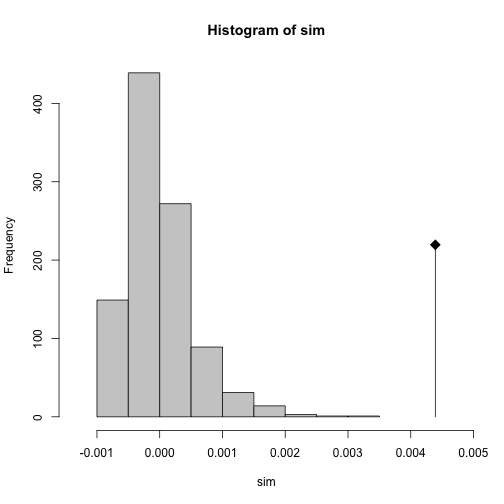
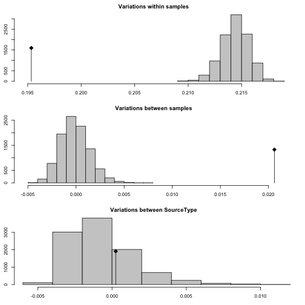

```r
library("tidyverse")
library("poppr")
(load("data/sclerotinia_16_loci.rda"))
```

```
## [1] "dat"            "dat11"          "datdf"          "keeploci"      
## [5] "corrected_loci"
```

# Purpose

The white mold nursery populations are unique because they are not fungicide
treated and have the same cultivars planted in them year after year.

The question becomes, are white mold nurseries differentiated from each other or
are they more or less homogeneous? We could use AMOVA to test for these with
location and binary source (wmn or non-wmn) as the hierarchy.


# Data Setup

First, we want to clone-correct our data down to the field level so that we
don't accidentally include non-independent samples.


```r
dat11
```

```
## 
## This is a genclone object
## -------------------------
## Genotype information:
## 
##    165 original multilocus genotypes 
##    366 haploid individuals
##     11 codominant loci
## 
## Population information:
## 
##      5 strata - MCG, Region, Source, Year, Host
##     14 populations defined - NE, NY, MN, ..., France, Mexico, ND
```

```r
dat11cc <- clonecorrect(dat11, ~Region/Source/Host/Year)
dat11cc
```

```
## 
## This is a genclone object
## -------------------------
## Genotype information:
## 
##    165 original multilocus genotypes 
##    318 haploid individuals
##     11 codominant loci
## 
## Population information:
## 
##      5 strata - MCG, Region, Source, Year, Host
##     14 populations defined - NE, NY, MN, ..., France, Mexico, ND
```

```r
make_amova_table <- function(am, amt, samples = "Region"){
  tot <- nrow(am$results)
  res <- data.frame(list(am$results[-tot, c("Df", "Sum Sq")], 
                         Percent = am$componentsofcovariance[-tot, 2],
                         Pval    = rev(amt$pvalue), 
                         Phi     = am$statphi$Phi[-tot]))
  res <- as.matrix(res)
  colnames(res) <- c("d.f.", "Sum of Squares", "Percent variation", "P", 
                     "Phi statistic")
  names(dimnames(res)) <- c("levels", "statistic")
  rownames(res) <- gsub("samples", samples, rownames(res))
  return(res)
}

make_amova_printable <- function(amtab, amtabcc){
  am_array <- array(dim      = c(dim(amtab), 2),
                    dimnames = c(dimnames(amtab), 
                                 list(c("full", "clone-corrected"))))
  am_array[, , 1] <- amtab
  am_array[, , 2] <- amtabcc
  tabfun <- function(x){
    x <- paste0(paste0(signif(x, 3), collapse = " ("), ")")
    return(x)
  }
  res <- apply(am_array, c(1, 2), tabfun)
  return(res)
}
```

Now that we've done that, we should make a new variable in the strata that 
separates the white mold nurseries from the others. We'll call this stratum 
"Source Type".


```r
addStrata(dat11cc) <- strata(dat11cc) %>% 
  mutate(SourceType = forcats::fct_inorder(ifelse(Source == "wmn", "wmn", "other"))) %>%
  select(SourceType)
setPop(dat11cc) <- ~SourceType
dat11cc
```

```
## 
## This is a genclone object
## -------------------------
## Genotype information:
## 
##    165 original multilocus genotypes 
##    318 haploid individuals
##     11 codominant loci
## 
## Population information:
## 
##      6 strata - MCG, Region, Source, Year, Host, SourceType
##      2 populations defined - other, wmn
```

I can perform AMOVA on the newly defined variable using Bruvo's distance.


```r
other(dat11cc)$REPLEN
```

```
##   5-2(F)   5-3(F)   6-2(F)   7-2(F)   8-3(H)   9-2(F)  12-2(H)  17-3(H) 
##  2.00000  4.00000  5.99999  2.00000  2.00000  2.00000  2.00000  3.00000 
##  20-3(F)  36-4(F)  50-4(F)  55-4(F)  92-4(F) 106-4(H) 110-4(H) 114-4(H) 
##  2.00000  4.00000  4.00000  4.00000  2.00000  4.00000  3.99999  4.00000
```

```r
bd <- bruvo.dist(dat11cc, replen = other(dat11cc)$REPLEN)
(ssc_amova <- poppr.amova(dat11cc, ~SourceType, dist = bd, quiet = TRUE))
```

```
## $call
## ade4::amova(samples = xtab, distances = xdist, structures = xstruct)
## 
## $results
##                  Df     Sum Sq   Mean Sq
## Between samples   1  0.8969901 0.8969901
## Within samples  316 68.7005529 0.2174068
## Total           317 69.5975430 0.2195506
## 
## $componentsofcovariance
##                                   Sigma          %
## Variations  Between samples 0.004391536   1.979968
## Variations  Within samples  0.217406813  98.020032
## Total variations            0.221798349 100.000000
## 
## $statphi
##                          Phi
## Phi-samples-total 0.01979968
```

```r
ssc_amova_test <- randtest(ssc_amova, nrepet = 999)
plot(ssc_amova_test)
```



```r
ssc_amova_test
```

```
## Monte-Carlo test
## Call: as.randtest(sim = res, obs = sigma[1])
## 
## Observation: 0.004391536 
## 
## Based on 999 replicates
## Simulated p-value: 0.001 
## Alternative hypothesis: greater 
## 
##      Std.Obs  Expectation     Variance 
## 8.048104e+00 1.496098e-06 2.975431e-07
```


This result is telling us that there is some subdivision between white mold
nurseries and non-white mold nurseries. Of course, from previous analyses, we
know that Mexico is differentiated from other populations, so what happens if we
account for Region? Here, we are placing region lower in the heirarchy because
we specifically want to test the effect of region on the differentiation between
white mold nurseries within different regions.


```r
ssc_amova_region <- poppr.amova(dat11cc, ~SourceType/Region, dist = bd, quiet = TRUE)
ssc_amova_region_test <- randtest(ssc_amova_region, nrepet = 999)
plot(ssc_amova_region_test)
```


```r
(ssc_amova_table <- make_amova_table(ssc_amova_region, ssc_amova_region_test))
```

```
##                                   statistic
## levels                             d.f. Sum of Squares Percent variation
##   Between SourceType                  1      0.8969901        -0.1583345
##   Between Region Within SourceType   20     12.0338468        13.7964379
##   Within Region                     296     56.6667061        86.3618966
##                                   statistic
## levels                                 P Phi statistic
##   Between SourceType               0.300   0.136381034
##   Between Region Within SourceType 0.001   0.137746279
##   Within Region                    0.001  -0.001583345
```

Okay! This shows that when we account for Region after accounting for Source
Type, we find that the differentiation is coming mainly from the Regions. What
happens when we remove Mexico?


```r
datnomex <- setPop(dat11cc, ~Region) %>% popsub(blacklist = "Mexico")
bdnm     <- bruvo.dist(datnomex, replen = other(datnomex)$REPLEN)
ssc_amova_nm <- poppr.amova(datnomex, ~SourceType/Region, dist = bdnm, quiet = TRUE)
ssc_amova_nm_test <- randtest(ssc_amova_nm, nrepet = 999)
plot(ssc_amova_nm_test)
```



```r
(ssc_amova_nm_table <- make_amova_table(ssc_amova_nm, ssc_amova_nm_test))
```

```
##                                   statistic
## levels                             d.f. Sum of Squares Percent variation
##   Between SourceType                  1      0.7527864          0.115560
##   Between Region Within SourceType   19      8.9146924          9.534715
##   Within Region                     282     55.0854125         90.349725
##                                   statistic
## levels                                 P Phi statistic
##   Between SourceType               0.265    0.09650275
##   Between Region Within SourceType 0.001    0.09545746
##   Within Region                    0.001    0.00115560
```


```r
make_amova_printable(ssc_amova_table, ssc_amova_nm_table) %>%  
  as_tibble() %>%
  add_column(Hierarchy = c("Between Source", "Between Region within Source", "Within Region"), .before = 1) %>%
  rename(ps = `Phi statistic`) %>%
  mutate(ps = gsub("0\\.00(\\d{1})(\\d{2})", "\\1.\\2e^-3^", ps)) %>%
  rename(`$\\Phi statistic$` = ps) %>%
  rename(`% variation` = `Percent variation`) %>%
  rename(S.S. = `Sum of Squares`) %>%
  select(-P) %>%
  huxtable::as_huxtable(add_colnames = TRUE) %>% 
  huxtable::set_col_width(c(1.3, 0.7, 0.9, 1, 1.3)) %>% 
  huxtable::set_align(huxtable::everywhere, 2:5, "center") %>% 
  huxtable::print_md(max_width = 95)
```

```
--------------------------------------------------------------------------------------------
Hierarchy                  d.f.          S.S.          % variation       $\Phi statistic$    
---------------------- ------------ --------------- ----------------- ----------------------
Between Source            1 (1)      0.897 (0.753)   -0.158 (0.116)       0.136 (0.0965)     

Between Region within    20 (19)       12 (8.91)       13.8 (9.53)        0.138 (0.0955)     
Source                                                                                       

Within Region           296 (282)     56.7 (55.1)      86.4 (90.3)    -1.58e^-3^ (1.16e^-3^) 

--------------------------------------------------------------------------------------------
```


When we remove the Mexican isolates (which only contained white mold nurseries
and shared no genotypes), we see that indeed, the degree of differentiation
went down. 

## Visualizing the partitions

We can visualize the partitions if we create distributions showing the genetic
distance.


```r
wmn_inds <- (setPop(dat11cc, ~SourceType) %>% pop()) == "wmn"

# Function to set the upper triangle to NA to avoid over-representation.
set_upper_tri_NA <- function(d){d[upper.tri(d)] <- NA; diag(d) <- NA; d}

# dist data converted to matrix fed into here. Removes NAs from previous function
tidy_dist <- . %>%
  as.data.frame() %>% 
  rownames_to_column("from") %>% 
  gather(to, distance, -from) %>% 
  filter(!is.na(distance))
wmn_distance   <- as.matrix(bd)[wmn_inds, wmn_inds] %>% set_upper_tri_NA() %>% tidy_dist
nwmn_distance  <- as.matrix(bd)[!wmn_inds, !wmn_inds] %>% set_upper_tri_NA() %>% tidy_dist
inter_distance <- as.matrix(bd)[wmn_inds, !wmn_inds] %>% tidy_dist

dists <- bind_rows(`White Mold Nurseries` = wmn_distance, 
                   `Between` = inter_distance,
                   `Other Sources` = nwmn_distance, 
                   .id = "Comparison") %>%
  mutate(Comparison = forcats::fct_inorder(Comparison))
dists
```

```
##                 Comparison from  to   distance
## 1     White Mold Nurseries  445 444 0.00000000
## 2     White Mold Nurseries  446 444 0.30681818
## 3     White Mold Nurseries  447 444 0.26136364
## 4     White Mold Nurseries  448 444 0.37500000
## 5     White Mold Nurseries  449 444 0.31818182
## 6     White Mold Nurseries  450 444 0.22727273
## 7     White Mold Nurseries  451 444 0.09090909
## 8     White Mold Nurseries  452 444 0.18181818
## 9     White Mold Nurseries  453 444 0.00000000
## 10    White Mold Nurseries  454 444 0.09090909
## 11    White Mold Nurseries  457 444 0.46590909
## 12    White Mold Nurseries  458 444 0.17045455
## 13    White Mold Nurseries  459 444 0.34659091
## 14    White Mold Nurseries  460 444 0.45987216
## 15    White Mold Nurseries  461 444 0.07954545
## 16    White Mold Nurseries  462 444 0.32386364
## 17    White Mold Nurseries  463 444 0.23863636
## 18    White Mold Nurseries  464 444 0.26136364
## 19    White Mold Nurseries  465 444 0.28409091
## 20    White Mold Nurseries  467 444 0.17045455
## 21    White Mold Nurseries  469 444 0.29545455
## 22    White Mold Nurseries  472 444 0.07954545
## 23    White Mold Nurseries  473 444 0.20454545
## 24    White Mold Nurseries  474 444 0.27272727
## 25    White Mold Nurseries  476 444 0.15909091
## 26    White Mold Nurseries  477 444 0.30681818
## 27    White Mold Nurseries  496 444 0.30681818
## 28    White Mold Nurseries  499 444 0.13636364
## 29    White Mold Nurseries  500 444 0.31534091
## 30    White Mold Nurseries  501 444 0.36931818
## 31    White Mold Nurseries  555 444 0.44140625
## 32    White Mold Nurseries  557 444 0.44140625
## 33    White Mold Nurseries  558 444 0.31534091
## 34    White Mold Nurseries  559 444 0.36931818
## 35    White Mold Nurseries  560 444 0.36931818
## 36    White Mold Nurseries  561 444 0.13636364
## 37    White Mold Nurseries  562 444 0.44140625
## 38    White Mold Nurseries  564 444 0.44140625
## 39    White Mold Nurseries  565 444 0.52201705
## 40    White Mold Nurseries  566 444 0.54474432
## 41    White Mold Nurseries  568 444 0.52658913
## 42    White Mold Nurseries  569 444 0.52095170
## 43    White Mold Nurseries  570 444 0.30646307
## 44    White Mold Nurseries  571 444 0.52201705
## 45    White Mold Nurseries  572 444 0.07954545
## 46    White Mold Nurseries  573 444 0.37500000
## 47    White Mold Nurseries  574 444 0.54474432
## 48    White Mold Nurseries  576 444 0.30681818
## 49    White Mold Nurseries  577 444 0.52658913
## 50    White Mold Nurseries  578 444 0.52095170
## 51    White Mold Nurseries  584 444 0.30677379
## 52    White Mold Nurseries  585 444 0.43181818
## 53    White Mold Nurseries  586 444 0.52836470
## 54    White Mold Nurseries  587 444 0.30646307
## 55    White Mold Nurseries  588 444 0.07954545
## 56    White Mold Nurseries  589 444 0.37500000
## 57    White Mold Nurseries  590 444 0.50279652
## 58    White Mold Nurseries  591 444 0.30681818
## 59    White Mold Nurseries  592 444 0.30677379
## 60    White Mold Nurseries  593 444 0.43181818
## 61    White Mold Nurseries  594 444 0.45454545
## 62    White Mold Nurseries  595 444 0.35506925
## 63    White Mold Nurseries  596 444 0.50816761
## 64    White Mold Nurseries  597 444 0.52836470
## 65    White Mold Nurseries  598 444 0.50279652
## 66    White Mold Nurseries  599 444 0.45454545
## 67    White Mold Nurseries  600 444 0.35506925
## 68    White Mold Nurseries  601 444 0.50816761
## 69    White Mold Nurseries  602 444 0.22123580
## 70    White Mold Nurseries  603 444 0.33522727
## 71    White Mold Nurseries  605 444 0.18181818
## 72    White Mold Nurseries  606 444 0.33522727
## 73    White Mold Nurseries  607 444 0.27237216
## 74    White Mold Nurseries  608 444 0.36328125
## 75    White Mold Nurseries  609 444 0.17613636
## 76    White Mold Nurseries  610 444 0.31534091
## 77    White Mold Nurseries  611 444 0.22159091
## 78    White Mold Nurseries  615 444 0.42471591
## 79    White Mold Nurseries  618 444 0.46444425
## 80    White Mold Nurseries  621 444 0.54403409
## 81    White Mold Nurseries  626 444 0.45880682
## 82    White Mold Nurseries  629 444 0.50994318
## 83    White Mold Nurseries  616 444 0.48859197
## 84    White Mold Nurseries  619 444 0.46444425
## 85    White Mold Nurseries  622 444 0.50426136
## 86    White Mold Nurseries  625 444 0.54403409
## 87    White Mold Nurseries  628 444 0.45880682
## 88    White Mold Nurseries  631 444 0.50994318
## 89    White Mold Nurseries  617 444 0.45880682
## 90    White Mold Nurseries  620 444 0.50994318
## 91    White Mold Nurseries  623 444 0.45880682
## 92    White Mold Nurseries  624 444 0.44313743
## 93    White Mold Nurseries  639 444 0.51029830
## 94    White Mold Nurseries  642 444 0.51589134
## 95    White Mold Nurseries  643 444 0.53511186
## 96    White Mold Nurseries  640 444 0.51029830
## 97    White Mold Nurseries  644 444 0.50958807
## 98    White Mold Nurseries  645 444 0.38068182
## 99    White Mold Nurseries  648 444 0.37500000
## 100   White Mold Nurseries  651 444 0.28409091
## 101   White Mold Nurseries  646 444 0.26136364
## 102   White Mold Nurseries  649 444 0.11363636
## 103   White Mold Nurseries  652 444 0.33522727
## 104   White Mold Nurseries  647 444 0.36363636
## 105   White Mold Nurseries  650 444 0.25000000
## 106   White Mold Nurseries  653 444 0.40340909
## 107   White Mold Nurseries  654 444 0.28409091
## 108   White Mold Nurseries  657 444 0.46519886
## 109   White Mold Nurseries  659 444 0.37997159
## 110   White Mold Nurseries  655 444 0.48792614
## 111   White Mold Nurseries  656 444 0.42045455
## 112   White Mold Nurseries  658 444 0.48792614
## 113   White Mold Nurseries  660 444 0.06818182
## 114   White Mold Nurseries  661 444 0.53582209
## 115   White Mold Nurseries  665 444 0.26136364
## 116   White Mold Nurseries  667 444 0.40198864
## 117   White Mold Nurseries  662 444 0.35227273
## 118   White Mold Nurseries  664 444 0.13494318
## 119   White Mold Nurseries  669 444 0.32954545
## 120   White Mold Nurseries  663 444 0.33522727
## 121   White Mold Nurseries  666 444 0.55664062
## 122   White Mold Nurseries  668 444 0.40585050
## 123   White Mold Nurseries  673 444 0.44318182
## 124   White Mold Nurseries  674 444 0.49289773
## 125   White Mold Nurseries  675 444 0.50545987
## 126   White Mold Nurseries  676 444 0.35227273
## 127   White Mold Nurseries  677 444 0.52268288
## 128   White Mold Nurseries  678 444 0.46444425
## 129   White Mold Nurseries  679 444 0.35222834
## 130   White Mold Nurseries  680 444 0.48859197
## 131   White Mold Nurseries  681 444 0.46715199
## 132   White Mold Nurseries  682 444 0.53267045
## 133   White Mold Nurseries  683 444 0.26562500
## 134   White Mold Nurseries  684 444 0.52121804
## 135   White Mold Nurseries  685 444 0.35085227
## 136   White Mold Nurseries  686 444 0.50426136
## 137   White Mold Nurseries  687 444 0.46022727
## 138   White Mold Nurseries  688 444 0.36328125
## 139   White Mold Nurseries  689 444 0.50426136
## 140   White Mold Nurseries  690 444 0.46022727
## 141   White Mold Nurseries  786 444 0.44318182
## 142   White Mold Nurseries  787 444 0.49289773
## 143   White Mold Nurseries  797 444 0.52121804
## 144   White Mold Nurseries  788 444 0.50545987
## 145   White Mold Nurseries  789 444 0.35227273
## 146   White Mold Nurseries  790 444 0.52268288
## 147   White Mold Nurseries  791 444 0.46444425
## 148   White Mold Nurseries  792 444 0.35222834
## 149   White Mold Nurseries  793 444 0.48859197
## 150   White Mold Nurseries  794 444 0.46715199
## 151   White Mold Nurseries  795 444 0.53267045
## 152   White Mold Nurseries  796 444 0.26562500
## 153   White Mold Nurseries  798 444 0.35085227
## 154   White Mold Nurseries  799 444 0.50426136
## 155   White Mold Nurseries  800 444 0.46022727
## 156   White Mold Nurseries  801 444 0.36328125
## 157   White Mold Nurseries  803 444 0.46022727
## 158   White Mold Nurseries  804 444 0.28409091
## 159   White Mold Nurseries  806 444 0.04545455
## 160   White Mold Nurseries  807 444 0.06818182
## 161   White Mold Nurseries  808 444 0.26136364
## 162   White Mold Nurseries  809 444 0.26136364
## 163   White Mold Nurseries  810 444 0.32954545
## 164   White Mold Nurseries  827 444 0.35085227
## 165   White Mold Nurseries  828 444 0.32954545
## 166   White Mold Nurseries  829 444 0.30681818
## 167   White Mold Nurseries  830 444 0.35085227
## 168   White Mold Nurseries  831 444 0.42009943
## 169   White Mold Nurseries  832 444 0.19318182
## 170   White Mold Nurseries  833 444 0.14772727
## 171   White Mold Nurseries  835 444 0.15767045
## 172   White Mold Nurseries  836 444 0.26136364
## 173   White Mold Nurseries  839 444 0.11363636
## 174   White Mold Nurseries  848 444 0.06818182
## 175   White Mold Nurseries  849 444 0.36931818
## 176   White Mold Nurseries  840 444 0.00000000
## 177   White Mold Nurseries  845 444 0.40909091
## 178   White Mold Nurseries  846 444 0.36931818
## 179   White Mold Nurseries  847 444 0.52654474
## 180   White Mold Nurseries  841 444 0.52654474
## 181   White Mold Nurseries  842 444 0.36931818
## 182   White Mold Nurseries  844 444 0.48117898
## 183   White Mold Nurseries  868 444 0.50958807
## 184   White Mold Nurseries  869 444 0.23863636
## 185   White Mold Nurseries  446 445 0.30681818
## 186   White Mold Nurseries  447 445 0.26136364
## 187   White Mold Nurseries  448 445 0.37500000
## 188   White Mold Nurseries  449 445 0.31818182
## 189   White Mold Nurseries  450 445 0.22727273
## 190   White Mold Nurseries  451 445 0.09090909
## 191   White Mold Nurseries  452 445 0.18181818
## 192   White Mold Nurseries  453 445 0.00000000
## 193   White Mold Nurseries  454 445 0.09090909
## 194   White Mold Nurseries  457 445 0.46590909
## 195   White Mold Nurseries  458 445 0.17045455
## 196   White Mold Nurseries  459 445 0.34659091
## 197   White Mold Nurseries  460 445 0.45987216
## 198   White Mold Nurseries  461 445 0.07954545
## 199   White Mold Nurseries  462 445 0.32386364
## 200   White Mold Nurseries  463 445 0.23863636
## 201   White Mold Nurseries  464 445 0.26136364
## 202   White Mold Nurseries  465 445 0.28409091
## 203   White Mold Nurseries  467 445 0.17045455
## 204   White Mold Nurseries  469 445 0.29545455
## 205   White Mold Nurseries  472 445 0.07954545
## 206   White Mold Nurseries  473 445 0.20454545
## 207   White Mold Nurseries  474 445 0.27272727
## 208   White Mold Nurseries  476 445 0.15909091
## 209   White Mold Nurseries  477 445 0.30681818
## 210   White Mold Nurseries  496 445 0.30681818
## 211   White Mold Nurseries  499 445 0.13636364
## 212   White Mold Nurseries  500 445 0.31534091
## 213   White Mold Nurseries  501 445 0.36931818
## 214   White Mold Nurseries  555 445 0.44140625
## 215   White Mold Nurseries  557 445 0.44140625
## 216   White Mold Nurseries  558 445 0.31534091
## 217   White Mold Nurseries  559 445 0.36931818
## 218   White Mold Nurseries  560 445 0.36931818
## 219   White Mold Nurseries  561 445 0.13636364
## 220   White Mold Nurseries  562 445 0.44140625
## 221   White Mold Nurseries  564 445 0.44140625
## 222   White Mold Nurseries  565 445 0.52201705
## 223   White Mold Nurseries  566 445 0.54474432
## 224   White Mold Nurseries  568 445 0.52658913
## 225   White Mold Nurseries  569 445 0.52095170
## 226   White Mold Nurseries  570 445 0.30646307
## 227   White Mold Nurseries  571 445 0.52201705
## 228   White Mold Nurseries  572 445 0.07954545
## 229   White Mold Nurseries  573 445 0.37500000
## 230   White Mold Nurseries  574 445 0.54474432
## 231   White Mold Nurseries  576 445 0.30681818
## 232   White Mold Nurseries  577 445 0.52658913
## 233   White Mold Nurseries  578 445 0.52095170
## 234   White Mold Nurseries  584 445 0.30677379
## 235   White Mold Nurseries  585 445 0.43181818
## 236   White Mold Nurseries  586 445 0.52836470
## 237   White Mold Nurseries  587 445 0.30646307
## 238   White Mold Nurseries  588 445 0.07954545
## 239   White Mold Nurseries  589 445 0.37500000
## 240   White Mold Nurseries  590 445 0.50279652
## 241   White Mold Nurseries  591 445 0.30681818
## 242   White Mold Nurseries  592 445 0.30677379
## 243   White Mold Nurseries  593 445 0.43181818
## 244   White Mold Nurseries  594 445 0.45454545
## 245   White Mold Nurseries  595 445 0.35506925
## 246   White Mold Nurseries  596 445 0.50816761
## 247   White Mold Nurseries  597 445 0.52836470
## 248   White Mold Nurseries  598 445 0.50279652
## 249   White Mold Nurseries  599 445 0.45454545
## 250   White Mold Nurseries  600 445 0.35506925
## 251   White Mold Nurseries  601 445 0.50816761
## 252   White Mold Nurseries  602 445 0.22123580
## 253   White Mold Nurseries  603 445 0.33522727
## 254   White Mold Nurseries  605 445 0.18181818
## 255   White Mold Nurseries  606 445 0.33522727
## 256   White Mold Nurseries  607 445 0.27237216
## 257   White Mold Nurseries  608 445 0.36328125
## 258   White Mold Nurseries  609 445 0.17613636
## 259   White Mold Nurseries  610 445 0.31534091
## 260   White Mold Nurseries  611 445 0.22159091
## 261   White Mold Nurseries  615 445 0.42471591
## 262   White Mold Nurseries  618 445 0.46444425
## 263   White Mold Nurseries  621 445 0.54403409
## 264   White Mold Nurseries  626 445 0.45880682
## 265   White Mold Nurseries  629 445 0.50994318
## 266   White Mold Nurseries  616 445 0.48859197
## 267   White Mold Nurseries  619 445 0.46444425
## 268   White Mold Nurseries  622 445 0.50426136
## 269   White Mold Nurseries  625 445 0.54403409
## 270   White Mold Nurseries  628 445 0.45880682
## 271   White Mold Nurseries  631 445 0.50994318
## 272   White Mold Nurseries  617 445 0.45880682
## 273   White Mold Nurseries  620 445 0.50994318
## 274   White Mold Nurseries  623 445 0.45880682
## 275   White Mold Nurseries  624 445 0.44313743
## 276   White Mold Nurseries  639 445 0.51029830
## 277   White Mold Nurseries  642 445 0.51589134
## 278   White Mold Nurseries  643 445 0.53511186
## 279   White Mold Nurseries  640 445 0.51029830
## 280   White Mold Nurseries  644 445 0.50958807
## 281   White Mold Nurseries  645 445 0.38068182
## 282   White Mold Nurseries  648 445 0.37500000
## 283   White Mold Nurseries  651 445 0.28409091
## 284   White Mold Nurseries  646 445 0.26136364
## 285   White Mold Nurseries  649 445 0.11363636
## 286   White Mold Nurseries  652 445 0.33522727
## 287   White Mold Nurseries  647 445 0.36363636
## 288   White Mold Nurseries  650 445 0.25000000
## 289   White Mold Nurseries  653 445 0.40340909
## 290   White Mold Nurseries  654 445 0.28409091
## 291   White Mold Nurseries  657 445 0.46519886
## 292   White Mold Nurseries  659 445 0.37997159
## 293   White Mold Nurseries  655 445 0.48792614
## 294   White Mold Nurseries  656 445 0.42045455
## 295   White Mold Nurseries  658 445 0.48792614
## 296   White Mold Nurseries  660 445 0.06818182
## 297   White Mold Nurseries  661 445 0.53582209
## 298   White Mold Nurseries  665 445 0.26136364
## 299   White Mold Nurseries  667 445 0.40198864
## 300   White Mold Nurseries  662 445 0.35227273
## 301   White Mold Nurseries  664 445 0.13494318
## 302   White Mold Nurseries  669 445 0.32954545
## 303   White Mold Nurseries  663 445 0.33522727
## 304   White Mold Nurseries  666 445 0.55664062
## 305   White Mold Nurseries  668 445 0.40585050
## 306   White Mold Nurseries  673 445 0.44318182
## 307   White Mold Nurseries  674 445 0.49289773
## 308   White Mold Nurseries  675 445 0.50545987
## 309   White Mold Nurseries  676 445 0.35227273
## 310   White Mold Nurseries  677 445 0.52268288
## 311   White Mold Nurseries  678 445 0.46444425
## 312   White Mold Nurseries  679 445 0.35222834
## 313   White Mold Nurseries  680 445 0.48859197
## 314   White Mold Nurseries  681 445 0.46715199
## 315   White Mold Nurseries  682 445 0.53267045
## 316   White Mold Nurseries  683 445 0.26562500
## 317   White Mold Nurseries  684 445 0.52121804
## 318   White Mold Nurseries  685 445 0.35085227
## 319   White Mold Nurseries  686 445 0.50426136
## 320   White Mold Nurseries  687 445 0.46022727
## 321   White Mold Nurseries  688 445 0.36328125
## 322   White Mold Nurseries  689 445 0.50426136
## 323   White Mold Nurseries  690 445 0.46022727
## 324   White Mold Nurseries  786 445 0.44318182
## 325   White Mold Nurseries  787 445 0.49289773
## 326   White Mold Nurseries  797 445 0.52121804
## 327   White Mold Nurseries  788 445 0.50545987
## 328   White Mold Nurseries  789 445 0.35227273
## 329   White Mold Nurseries  790 445 0.52268288
## 330   White Mold Nurseries  791 445 0.46444425
## 331   White Mold Nurseries  792 445 0.35222834
## 332   White Mold Nurseries  793 445 0.48859197
## 333   White Mold Nurseries  794 445 0.46715199
## 334   White Mold Nurseries  795 445 0.53267045
## 335   White Mold Nurseries  796 445 0.26562500
## 336   White Mold Nurseries  798 445 0.35085227
## 337   White Mold Nurseries  799 445 0.50426136
## 338   White Mold Nurseries  800 445 0.46022727
## 339   White Mold Nurseries  801 445 0.36328125
## 340   White Mold Nurseries  803 445 0.46022727
## 341   White Mold Nurseries  804 445 0.28409091
## 342   White Mold Nurseries  806 445 0.04545455
## 343   White Mold Nurseries  807 445 0.06818182
## 344   White Mold Nurseries  808 445 0.26136364
## 345   White Mold Nurseries  809 445 0.26136364
## 346   White Mold Nurseries  810 445 0.32954545
## 347   White Mold Nurseries  827 445 0.35085227
## 348   White Mold Nurseries  828 445 0.32954545
## 349   White Mold Nurseries  829 445 0.30681818
## 350   White Mold Nurseries  830 445 0.35085227
## 351   White Mold Nurseries  831 445 0.42009943
## 352   White Mold Nurseries  832 445 0.19318182
## 353   White Mold Nurseries  833 445 0.14772727
## 354   White Mold Nurseries  835 445 0.15767045
## 355   White Mold Nurseries  836 445 0.26136364
## 356   White Mold Nurseries  839 445 0.11363636
## 357   White Mold Nurseries  848 445 0.06818182
## 358   White Mold Nurseries  849 445 0.36931818
## 359   White Mold Nurseries  840 445 0.00000000
## 360   White Mold Nurseries  845 445 0.40909091
## 361   White Mold Nurseries  846 445 0.36931818
## 362   White Mold Nurseries  847 445 0.52654474
## 363   White Mold Nurseries  841 445 0.52654474
## 364   White Mold Nurseries  842 445 0.36931818
## 365   White Mold Nurseries  844 445 0.48117898
## 366   White Mold Nurseries  868 445 0.50958807
## 367   White Mold Nurseries  869 445 0.23863636
## 368   White Mold Nurseries  447 446 0.32954545
## 369   White Mold Nurseries  448 446 0.09090909
## 370   White Mold Nurseries  449 446 0.11363636
## 371   White Mold Nurseries  450 446 0.29545455
## 372   White Mold Nurseries  451 446 0.32954545
## 373   White Mold Nurseries  452 446 0.25000000
## 374   White Mold Nurseries  453 446 0.30681818
## 375   White Mold Nurseries  454 446 0.32954545
## 376   White Mold Nurseries  457 446 0.28409091
## 377   White Mold Nurseries  458 446 0.32954545
## 378   White Mold Nurseries  459 446 0.26136364
## 379   White Mold Nurseries  460 446 0.52832031
## 380   White Mold Nurseries  461 446 0.38636364
## 381   White Mold Nurseries  462 446 0.46022727
## 382   White Mold Nurseries  463 446 0.32954545
## 383   White Mold Nurseries  464 446 0.42045455
## 384   White Mold Nurseries  465 446 0.30681818
## 385   White Mold Nurseries  467 446 0.38636364
## 386   White Mold Nurseries  469 446 0.35227273
## 387   White Mold Nurseries  472 446 0.38636364
## 388   White Mold Nurseries  473 446 0.29545455
## 389   White Mold Nurseries  474 446 0.12500000
## 390   White Mold Nurseries  476 446 0.25000000
## 391   White Mold Nurseries  477 446 0.15909091
## 392   White Mold Nurseries  496 446 0.15909091
## 393   White Mold Nurseries  499 446 0.29545455
## 394   White Mold Nurseries  500 446 0.40909091
## 395   White Mold Nurseries  501 446 0.35227273
## 396   White Mold Nurseries  555 446 0.54545455
## 397   White Mold Nurseries  557 446 0.53409091
## 398   White Mold Nurseries  558 446 0.40909091
## 399   White Mold Nurseries  559 446 0.35227273
## 400   White Mold Nurseries  560 446 0.25000000
## 401   White Mold Nurseries  561 446 0.37500000
## 402   White Mold Nurseries  562 446 0.54545455
## 403   White Mold Nurseries  564 446 0.53409091
## 404   White Mold Nurseries  565 446 0.60227273
## 405   White Mold Nurseries  566 446 0.45454545
## 406   White Mold Nurseries  568 446 0.62640936
## 407   White Mold Nurseries  569 446 0.62500000
## 408   White Mold Nurseries  570 446 0.34943182
## 409   White Mold Nurseries  571 446 0.60227273
## 410   White Mold Nurseries  572 446 0.38636364
## 411   White Mold Nurseries  573 446 0.30681818
## 412   White Mold Nurseries  574 446 0.45454545
## 413   White Mold Nurseries  576 446 0.52272727
## 414   White Mold Nurseries  577 446 0.62640936
## 415   White Mold Nurseries  578 446 0.62500000
## 416   White Mold Nurseries  584 446 0.35226718
## 417   White Mold Nurseries  585 446 0.46519886
## 418   White Mold Nurseries  586 446 0.57385809
## 419   White Mold Nurseries  587 446 0.34943182
## 420   White Mold Nurseries  588 446 0.38636364
## 421   White Mold Nurseries  589 446 0.30681818
## 422   White Mold Nurseries  590 446 0.50283536
## 423   White Mold Nurseries  591 446 0.52272727
## 424   White Mold Nurseries  592 446 0.35226718
## 425   White Mold Nurseries  593 446 0.46519886
## 426   White Mold Nurseries  594 446 0.45951705
## 427   White Mold Nurseries  595 446 0.37215354
## 428   White Mold Nurseries  596 446 0.41477273
## 429   White Mold Nurseries  597 446 0.57385809
## 430   White Mold Nurseries  598 446 0.50283536
## 431   White Mold Nurseries  599 446 0.45951705
## 432   White Mold Nurseries  600 446 0.37215354
## 433   White Mold Nurseries  601 446 0.41477273
## 434   White Mold Nurseries  602 446 0.35511364
## 435   White Mold Nurseries  603 446 0.27272727
## 436   White Mold Nurseries  605 446 0.12500000
## 437   White Mold Nurseries  606 446 0.27272727
## 438   White Mold Nurseries  607 446 0.13352273
## 439   White Mold Nurseries  608 446 0.30965909
## 440   White Mold Nurseries  609 446 0.41477273
## 441   White Mold Nurseries  610 446 0.40909091
## 442   White Mold Nurseries  611 446 0.28977273
## 443   White Mold Nurseries  615 446 0.48721591
## 444   White Mold Nurseries  618 446 0.56675581
## 445   White Mold Nurseries  621 446 0.56605114
## 446   White Mold Nurseries  626 446 0.56605114
## 447   White Mold Nurseries  629 446 0.48721591
## 448   White Mold Nurseries  616 446 0.48863081
## 449   White Mold Nurseries  619 446 0.56675581
## 450   White Mold Nurseries  622 446 0.61150568
## 451   White Mold Nurseries  625 446 0.56605114
## 452   White Mold Nurseries  628 446 0.56605114
## 453   White Mold Nurseries  631 446 0.48721591
## 454   White Mold Nurseries  617 446 0.52130682
## 455   White Mold Nurseries  620 446 0.48721591
## 456   White Mold Nurseries  623 446 0.56605114
## 457   White Mold Nurseries  624 446 0.46022172
## 458   White Mold Nurseries  639 446 0.61434659
## 459   White Mold Nurseries  642 446 0.61574485
## 460   White Mold Nurseries  643 446 0.63493208
## 461   White Mold Nurseries  640 446 0.61434659
## 462   White Mold Nurseries  644 446 0.61363636
## 463   White Mold Nurseries  645 446 0.29545455
## 464   White Mold Nurseries  648 446 0.25000000
## 465   White Mold Nurseries  651 446 0.37500000
## 466   White Mold Nurseries  646 446 0.32954545
## 467   White Mold Nurseries  649 446 0.22727273
## 468   White Mold Nurseries  652 446 0.31818182
## 469   White Mold Nurseries  647 446 0.15909091
## 470   White Mold Nurseries  650 446 0.35795455
## 471   White Mold Nurseries  653 446 0.31818182
## 472   White Mold Nurseries  654 446 0.37500000
## 473   White Mold Nurseries  657 446 0.37500000
## 474   White Mold Nurseries  659 446 0.19886364
## 475   White Mold Nurseries  655 446 0.39772727
## 476   White Mold Nurseries  656 446 0.35795455
## 477   White Mold Nurseries  658 446 0.39772727
## 478   White Mold Nurseries  660 446 0.23863636
## 479   White Mold Nurseries  661 446 0.63564231
## 480   White Mold Nurseries  665 446 0.32954545
## 481   White Mold Nurseries  667 446 0.47017045
## 482   White Mold Nurseries  662 446 0.04545455
## 483   White Mold Nurseries  664 446 0.37357955
## 484   White Mold Nurseries  669 446 0.42045455
## 485   White Mold Nurseries  663 446 0.33522727
## 486   White Mold Nurseries  666 446 0.62497781
## 487   White Mold Nurseries  668 446 0.50567072
## 488   White Mold Nurseries  673 446 0.51633523
## 489   White Mold Nurseries  674 446 0.58380682
## 490   White Mold Nurseries  675 446 0.65318714
## 491   White Mold Nurseries  676 446 0.35724432
## 492   White Mold Nurseries  677 446 0.52272172
## 493   White Mold Nurseries  678 446 0.44743763
## 494   White Mold Nurseries  679 446 0.36931263
## 495   White Mold Nurseries  680 446 0.56174538
## 496   White Mold Nurseries  681 446 0.61487926
## 497   White Mold Nurseries  682 446 0.55539773
## 498   White Mold Nurseries  683 446 0.36221591
## 499   White Mold Nurseries  684 446 0.49280895
## 500   White Mold Nurseries  685 446 0.46448864
## 501   White Mold Nurseries  686 446 0.32812500
## 502   White Mold Nurseries  687 446 0.28409091
## 503   White Mold Nurseries  688 446 0.46875000
## 504   White Mold Nurseries  689 446 0.32812500
## 505   White Mold Nurseries  690 446 0.28409091
## 506   White Mold Nurseries  786 446 0.51633523
## 507   White Mold Nurseries  787 446 0.58380682
## 508   White Mold Nurseries  797 446 0.49280895
## 509   White Mold Nurseries  788 446 0.65318714
## 510   White Mold Nurseries  789 446 0.35724432
## 511   White Mold Nurseries  790 446 0.52272172
## 512   White Mold Nurseries  791 446 0.44743763
## 513   White Mold Nurseries  792 446 0.36931263
## 514   White Mold Nurseries  793 446 0.56174538
## 515   White Mold Nurseries  794 446 0.61487926
## 516   White Mold Nurseries  795 446 0.55539773
## 517   White Mold Nurseries  796 446 0.36221591
## 518   White Mold Nurseries  798 446 0.46448864
## 519   White Mold Nurseries  799 446 0.32812500
## 520   White Mold Nurseries  800 446 0.28409091
## 521   White Mold Nurseries  801 446 0.46875000
## 522   White Mold Nurseries  803 446 0.28409091
## 523   White Mold Nurseries  804 446 0.35227273
## 524   White Mold Nurseries  806 446 0.35227273
## 525   White Mold Nurseries  807 446 0.23863636
## 526   White Mold Nurseries  808 446 0.32954545
## 527   White Mold Nurseries  809 446 0.32954545
## 528   White Mold Nurseries  810 446 0.39772727
## 529   White Mold Nurseries  827 446 0.41903409
## 530   White Mold Nurseries  828 446 0.39772727
## 531   White Mold Nurseries  829 446 0.55681818
## 532   White Mold Nurseries  830 446 0.54971591
## 533   White Mold Nurseries  831 446 0.52414773
## 534   White Mold Nurseries  832 446 0.50000000
## 535   White Mold Nurseries  833 446 0.45454545
## 536   White Mold Nurseries  835 446 0.32812500
## 537   White Mold Nurseries  836 446 0.32954545
## 538   White Mold Nurseries  839 446 0.28409091
## 539   White Mold Nurseries  848 446 0.23863636
## 540   White Mold Nurseries  849 446 0.38068182
## 541   White Mold Nurseries  840 446 0.30681818
## 542   White Mold Nurseries  845 446 0.42045455
## 543   White Mold Nurseries  846 446 0.38068182
## 544   White Mold Nurseries  847 446 0.62639826
## 545   White Mold Nurseries  841 446 0.62639826
## 546   White Mold Nurseries  842 446 0.38068182
## 547   White Mold Nurseries  844 446 0.58096591
## 548   White Mold Nurseries  868 446 0.61363636
## 549   White Mold Nurseries  869 446 0.42045455
## 550   White Mold Nurseries  448 447 0.32954545
## 551   White Mold Nurseries  449 447 0.21590909
## 552   White Mold Nurseries  450 447 0.12500000
## 553   White Mold Nurseries  451 447 0.35227273
## 554   White Mold Nurseries  452 447 0.07954545
## 555   White Mold Nurseries  453 447 0.26136364
## 556   White Mold Nurseries  454 447 0.35227273
## 557   White Mold Nurseries  457 447 0.22727273
## 558   White Mold Nurseries  458 447 0.09090909
## 559   White Mold Nurseries  459 447 0.39772727
## 560   White Mold Nurseries  460 447 0.42009943
## 561   White Mold Nurseries  461 447 0.18181818
## 562   White Mold Nurseries  462 447 0.28409091
## 563   White Mold Nurseries  463 447 0.09090909
## 564   White Mold Nurseries  464 447 0.09090909
## 565   White Mold Nurseries  465 447 0.20454545
## 566   White Mold Nurseries  467 447 0.09090909
## 567   White Mold Nurseries  469 447 0.15909091
## 568   White Mold Nurseries  472 447 0.18181818
## 569   White Mold Nurseries  473 447 0.12500000
## 570   White Mold Nurseries  474 447 0.35227273
## 571   White Mold Nurseries  476 447 0.17045455
## 572   White Mold Nurseries  477 447 0.26136364
## 573   White Mold Nurseries  496 447 0.26136364
## 574   White Mold Nurseries  499 447 0.12500000
## 575   White Mold Nurseries  500 447 0.34943182
## 576   White Mold Nurseries  501 447 0.52840909
## 577   White Mold Nurseries  555 447 0.58309659
## 578   White Mold Nurseries  557 447 0.60582386
## 579   White Mold Nurseries  558 447 0.34943182
## 580   White Mold Nurseries  559 447 0.52840909
## 581   White Mold Nurseries  560 447 0.52840909
## 582   White Mold Nurseries  561 447 0.37500000
## 583   White Mold Nurseries  562 447 0.58309659
## 584   White Mold Nurseries  564 447 0.60582386
## 585   White Mold Nurseries  565 447 0.46448864
## 586   White Mold Nurseries  566 447 0.41903409
## 587   White Mold Nurseries  568 447 0.50918857
## 588   White Mold Nurseries  569 447 0.50355114
## 589   White Mold Nurseries  570 447 0.09019886
## 590   White Mold Nurseries  571 447 0.46448864
## 591   White Mold Nurseries  572 447 0.18181818
## 592   White Mold Nurseries  573 447 0.11363636
## 593   White Mold Nurseries  574 447 0.41903409
## 594   White Mold Nurseries  576 447 0.22727273
## 595   White Mold Nurseries  577 447 0.50918857
## 596   White Mold Nurseries  578 447 0.50355114
## 597   White Mold Nurseries  584 447 0.09088690
## 598   White Mold Nurseries  585 447 0.37784091
## 599   White Mold Nurseries  586 447 0.53975053
## 600   White Mold Nurseries  587 447 0.09019886
## 601   White Mold Nurseries  588 447 0.18181818
## 602   White Mold Nurseries  589 447 0.11363636
## 603   White Mold Nurseries  590 447 0.46872781
## 604   White Mold Nurseries  591 447 0.22727273
## 605   White Mold Nurseries  592 447 0.09088690
## 606   White Mold Nurseries  593 447 0.37784091
## 607   White Mold Nurseries  594 447 0.40056818
## 608   White Mold Nurseries  595 447 0.48009144
## 609   White Mold Nurseries  596 447 0.49076705
## 610   White Mold Nurseries  597 447 0.53975053
## 611   White Mold Nurseries  598 447 0.46872781
## 612   White Mold Nurseries  599 447 0.40056818
## 613   White Mold Nurseries  600 447 0.48009144
## 614   White Mold Nurseries  601 447 0.49076705
## 615   White Mold Nurseries  602 447 0.29474432
## 616   White Mold Nurseries  603 447 0.32386364
## 617   White Mold Nurseries  605 447 0.35227273
## 618   White Mold Nurseries  606 447 0.32386364
## 619   White Mold Nurseries  607 447 0.39701705
## 620   White Mold Nurseries  608 447 0.46519886
## 621   White Mold Nurseries  609 447 0.38636364
## 622   White Mold Nurseries  610 447 0.34943182
## 623   White Mold Nurseries  611 447 0.15909091
## 624   White Mold Nurseries  615 447 0.50994318
## 625   White Mold Nurseries  618 447 0.55537553
## 626   White Mold Nurseries  621 447 0.63778409
## 627   White Mold Nurseries  626 447 0.55255682
## 628   White Mold Nurseries  629 447 0.59517045
## 629   White Mold Nurseries  616 447 0.57384144
## 630   White Mold Nurseries  619 447 0.55537553
## 631   White Mold Nurseries  622 447 0.55823864
## 632   White Mold Nurseries  625 447 0.63778409
## 633   White Mold Nurseries  628 447 0.55255682
## 634   White Mold Nurseries  631 447 0.59517045
## 635   White Mold Nurseries  617 447 0.54403409
## 636   White Mold Nurseries  620 447 0.59517045
## 637   White Mold Nurseries  623 447 0.55255682
## 638   White Mold Nurseries  624 447 0.52838690
## 639   White Mold Nurseries  639 447 0.65198864
## 640   White Mold Nurseries  642 447 0.65758168
## 641   White Mold Nurseries  643 447 0.67680220
## 642   White Mold Nurseries  640 447 0.65198864
## 643   White Mold Nurseries  644 447 0.65127841
## 644   White Mold Nurseries  645 447 0.53409091
## 645   White Mold Nurseries  648 447 0.52272727
## 646   White Mold Nurseries  651 447 0.04545455
## 647   White Mold Nurseries  646 447 0.00000000
## 648   White Mold Nurseries  649 447 0.28409091
## 649   White Mold Nurseries  652 447 0.47727273
## 650   White Mold Nurseries  647 447 0.26136364
## 651   White Mold Nurseries  650 447 0.23863636
## 652   White Mold Nurseries  653 447 0.55681818
## 653   White Mold Nurseries  654 447 0.04545455
## 654   White Mold Nurseries  657 447 0.49857955
## 655   White Mold Nurseries  659 447 0.41335227
## 656   White Mold Nurseries  655 447 0.52130682
## 657   White Mold Nurseries  656 447 0.40909091
## 658   White Mold Nurseries  658 447 0.52130682
## 659   White Mold Nurseries  660 447 0.32954545
## 660   White Mold Nurseries  661 447 0.67751243
## 661   White Mold Nurseries  665 447 0.09090909
## 662   White Mold Nurseries  667 447 0.55539773
## 663   White Mold Nurseries  662 447 0.28409091
## 664   White Mold Nurseries  664 447 0.39630682
## 665   White Mold Nurseries  669 447 0.09090909
## 666   White Mold Nurseries  663 447 0.54545455
## 667   White Mold Nurseries  666 447 0.71582031
## 668   White Mold Nurseries  668 447 0.50776811
## 669   White Mold Nurseries  673 447 0.49147727
## 670   White Mold Nurseries  674 447 0.49289773
## 671   White Mold Nurseries  675 447 0.53963956
## 672   White Mold Nurseries  676 447 0.48011364
## 673   White Mold Nurseries  677 447 0.45452326
## 674   White Mold Nurseries  678 447 0.65764826
## 675   White Mold Nurseries  679 447 0.47725053
## 676   White Mold Nurseries  680 447 0.62779652
## 677   White Mold Nurseries  681 447 0.66042259
## 678   White Mold Nurseries  682 447 0.60085227
## 679   White Mold Nurseries  683 447 0.32812500
## 680   White Mold Nurseries  684 447 0.50985440
## 681   White Mold Nurseries  685 447 0.36221591
## 682   White Mold Nurseries  686 447 0.46448864
## 683   White Mold Nurseries  687 447 0.42045455
## 684   White Mold Nurseries  688 447 0.52201705
## 685   White Mold Nurseries  689 447 0.46448864
## 686   White Mold Nurseries  690 447 0.42045455
## 687   White Mold Nurseries  786 447 0.49147727
## 688   White Mold Nurseries  787 447 0.49289773
## 689   White Mold Nurseries  797 447 0.50985440
## 690   White Mold Nurseries  788 447 0.53963956
## 691   White Mold Nurseries  789 447 0.48011364
## 692   White Mold Nurseries  790 447 0.45452326
## 693   White Mold Nurseries  791 447 0.65764826
## 694   White Mold Nurseries  792 447 0.47725053
## 695   White Mold Nurseries  793 447 0.62779652
## 696   White Mold Nurseries  794 447 0.66042259
## 697   White Mold Nurseries  795 447 0.60085227
## 698   White Mold Nurseries  796 447 0.32812500
## 699   White Mold Nurseries  798 447 0.36221591
## 700   White Mold Nurseries  799 447 0.46448864
## 701   White Mold Nurseries  800 447 0.42045455
## 702   White Mold Nurseries  801 447 0.52201705
## 703   White Mold Nurseries  803 447 0.42045455
## 704   White Mold Nurseries  804 447 0.04545455
## 705   White Mold Nurseries  806 447 0.30681818
## 706   White Mold Nurseries  807 447 0.32954545
## 707   White Mold Nurseries  808 447 0.00000000
## 708   White Mold Nurseries  809 447 0.00000000
## 709   White Mold Nurseries  810 447 0.09090909
## 710   White Mold Nurseries  827 447 0.08948864
## 711   White Mold Nurseries  828 447 0.09090909
## 712   White Mold Nurseries  829 447 0.25000000
## 713   White Mold Nurseries  830 447 0.40767045
## 714   White Mold Nurseries  831 447 0.56178977
## 715   White Mold Nurseries  832 447 0.29545455
## 716   White Mold Nurseries  833 447 0.25000000
## 717   White Mold Nurseries  835 447 0.41903409
## 718   White Mold Nurseries  836 447 0.00000000
## 719   White Mold Nurseries  839 447 0.37500000
## 720   White Mold Nurseries  848 447 0.32954545
## 721   White Mold Nurseries  849 447 0.49431818
## 722   White Mold Nurseries  840 447 0.26136364
## 723   White Mold Nurseries  845 447 0.50568182
## 724   White Mold Nurseries  846 447 0.49431818
## 725   White Mold Nurseries  847 447 0.66823509
## 726   White Mold Nurseries  841 447 0.66823509
## 727   White Mold Nurseries  842 447 0.49431818
## 728   White Mold Nurseries  844 447 0.62286932
## 729   White Mold Nurseries  868 447 0.65127841
## 730   White Mold Nurseries  869 447 0.18181818
## 731   White Mold Nurseries  449 448 0.11363636
## 732   White Mold Nurseries  450 448 0.29545455
## 733   White Mold Nurseries  451 448 0.39772727
## 734   White Mold Nurseries  452 448 0.25000000
## 735   White Mold Nurseries  453 448 0.37500000
## 736   White Mold Nurseries  454 448 0.39772727
## 737   White Mold Nurseries  457 448 0.19318182
## 738   White Mold Nurseries  458 448 0.39772727
## 739   White Mold Nurseries  459 448 0.32954545
## 740   White Mold Nurseries  460 448 0.50559304
## 741   White Mold Nurseries  461 448 0.45454545
## 742   White Mold Nurseries  462 448 0.43750000
## 743   White Mold Nurseries  463 448 0.32954545
## 744   White Mold Nurseries  464 448 0.42045455
## 745   White Mold Nurseries  465 448 0.37500000
## 746   White Mold Nurseries  467 448 0.36363636
## 747   White Mold Nurseries  469 448 0.35227273
## 748   White Mold Nurseries  472 448 0.45454545
## 749   White Mold Nurseries  473 448 0.20454545
## 750   White Mold Nurseries  474 448 0.21590909
## 751   White Mold Nurseries  476 448 0.25000000
## 752   White Mold Nurseries  477 448 0.06818182
## 753   White Mold Nurseries  496 448 0.06818182
## 754   White Mold Nurseries  499 448 0.27272727
## 755   White Mold Nurseries  500 448 0.37500000
## 756   White Mold Nurseries  501 448 0.40909091
## 757   White Mold Nurseries  555 448 0.56250000
## 758   White Mold Nurseries  557 448 0.55113636
## 759   White Mold Nurseries  558 448 0.37500000
## 760   White Mold Nurseries  559 448 0.40909091
## 761   White Mold Nurseries  560 448 0.30681818
## 762   White Mold Nurseries  561 448 0.42045455
## 763   White Mold Nurseries  562 448 0.56250000
## 764   White Mold Nurseries  564 448 0.55113636
## 765   White Mold Nurseries  565 448 0.57954545
## 766   White Mold Nurseries  566 448 0.43181818
## 767   White Mold Nurseries  568 448 0.64345481
## 768   White Mold Nurseries  569 448 0.64204545
## 769   White Mold Nurseries  570 448 0.34943182
## 770   White Mold Nurseries  571 448 0.57954545
## 771   White Mold Nurseries  572 448 0.45454545
## 772   White Mold Nurseries  573 448 0.30681818
## 773   White Mold Nurseries  574 448 0.43181818
## 774   White Mold Nurseries  576 448 0.50000000
## 775   White Mold Nurseries  577 448 0.64345481
## 776   White Mold Nurseries  578 448 0.64204545
## 777   White Mold Nurseries  584 448 0.35226718
## 778   White Mold Nurseries  585 448 0.52201705
## 779   White Mold Nurseries  586 448 0.63067627
## 780   White Mold Nurseries  587 448 0.34943182
## 781   White Mold Nurseries  588 448 0.45454545
## 782   White Mold Nurseries  589 448 0.30681818
## 783   White Mold Nurseries  590 448 0.57101718
## 784   White Mold Nurseries  591 448 0.50000000
## 785   White Mold Nurseries  592 448 0.35226718
## 786   White Mold Nurseries  593 448 0.52201705
## 787   White Mold Nurseries  594 448 0.50497159
## 788   White Mold Nurseries  595 448 0.44033536
## 789   White Mold Nurseries  596 448 0.45454545
## 790   White Mold Nurseries  597 448 0.63067627
## 791   White Mold Nurseries  598 448 0.57101718
## 792   White Mold Nurseries  599 448 0.50497159
## 793   White Mold Nurseries  600 448 0.44033536
## 794   White Mold Nurseries  601 448 0.45454545
## 795   White Mold Nurseries  602 448 0.37215909
## 796   White Mold Nurseries  603 448 0.25000000
## 797   White Mold Nurseries  605 448 0.19318182
## 798   White Mold Nurseries  606 448 0.25000000
## 799   White Mold Nurseries  607 448 0.20170455
## 800   White Mold Nurseries  608 448 0.35511364
## 801   White Mold Nurseries  609 448 0.43181818
## 802   White Mold Nurseries  610 448 0.37500000
## 803   White Mold Nurseries  611 448 0.32954545
## 804   White Mold Nurseries  615 448 0.52130682
## 805   White Mold Nurseries  618 448 0.60084672
## 806   White Mold Nurseries  621 448 0.60014205
## 807   White Mold Nurseries  626 448 0.60014205
## 808   White Mold Nurseries  629 448 0.52130682
## 809   White Mold Nurseries  616 448 0.55681263
## 810   White Mold Nurseries  619 448 0.60084672
## 811   White Mold Nurseries  622 448 0.64559659
## 812   White Mold Nurseries  625 448 0.60014205
## 813   White Mold Nurseries  628 448 0.60014205
## 814   White Mold Nurseries  631 448 0.52130682
## 815   White Mold Nurseries  617 448 0.55539773
## 816   White Mold Nurseries  620 448 0.52130682
## 817   White Mold Nurseries  623 448 0.60014205
## 818   White Mold Nurseries  624 448 0.52840354
## 819   White Mold Nurseries  639 448 0.63139205
## 820   White Mold Nurseries  642 448 0.63279031
## 821   White Mold Nurseries  643 448 0.65197754
## 822   White Mold Nurseries  640 448 0.63139205
## 823   White Mold Nurseries  644 448 0.63068182
## 824   White Mold Nurseries  645 448 0.36363636
## 825   White Mold Nurseries  648 448 0.31818182
## 826   White Mold Nurseries  651 448 0.28409091
## 827   White Mold Nurseries  646 448 0.32954545
## 828   White Mold Nurseries  649 448 0.29545455
## 829   White Mold Nurseries  652 448 0.31818182
## 830   White Mold Nurseries  647 448 0.15909091
## 831   White Mold Nurseries  650 448 0.35795455
## 832   White Mold Nurseries  653 448 0.38636364
## 833   White Mold Nurseries  654 448 0.28409091
## 834   White Mold Nurseries  657 448 0.35227273
## 835   White Mold Nurseries  659 448 0.28977273
## 836   White Mold Nurseries  655 448 0.37500000
## 837   White Mold Nurseries  656 448 0.33522727
## 838   White Mold Nurseries  658 448 0.37500000
## 839   White Mold Nurseries  660 448 0.30681818
## 840   White Mold Nurseries  661 448 0.65268777
## 841   White Mold Nurseries  665 448 0.42045455
## 842   White Mold Nurseries  667 448 0.53835227
## 843   White Mold Nurseries  662 448 0.04545455
## 844   White Mold Nurseries  664 448 0.44176136
## 845   White Mold Nurseries  669 448 0.32954545
## 846   White Mold Nurseries  663 448 0.40340909
## 847   White Mold Nurseries  666 448 0.65906871
## 848   White Mold Nurseries  668 448 0.48294345
## 849   White Mold Nurseries  673 448 0.49360795
## 850   White Mold Nurseries  674 448 0.56107955
## 851   White Mold Nurseries  675 448 0.67600320
## 852   White Mold Nurseries  676 448 0.42542614
## 853   White Mold Nurseries  677 448 0.55681263
## 854   White Mold Nurseries  678 448 0.51561945
## 855   White Mold Nurseries  679 448 0.43749445
## 856   White Mold Nurseries  680 448 0.62992720
## 857   White Mold Nurseries  681 448 0.63769531
## 858   White Mold Nurseries  682 448 0.60085227
## 859   White Mold Nurseries  683 448 0.43039773
## 860   White Mold Nurseries  684 448 0.47008168
## 861   White Mold Nurseries  685 448 0.53267045
## 862   White Mold Nurseries  686 448 0.39630682
## 863   White Mold Nurseries  687 448 0.35227273
## 864   White Mold Nurseries  688 448 0.53693182
## 865   White Mold Nurseries  689 448 0.39630682
## 866   White Mold Nurseries  690 448 0.35227273
## 867   White Mold Nurseries  786 448 0.49360795
## 868   White Mold Nurseries  787 448 0.56107955
## 869   White Mold Nurseries  797 448 0.47008168
## 870   White Mold Nurseries  788 448 0.67600320
## 871   White Mold Nurseries  789 448 0.42542614
## 872   White Mold Nurseries  790 448 0.55681263
## 873   White Mold Nurseries  791 448 0.51561945
## 874   White Mold Nurseries  792 448 0.43749445
## 875   White Mold Nurseries  793 448 0.62992720
## 876   White Mold Nurseries  794 448 0.63769531
## 877   White Mold Nurseries  795 448 0.60085227
## 878   White Mold Nurseries  796 448 0.43039773
## 879   White Mold Nurseries  798 448 0.53267045
## 880   White Mold Nurseries  799 448 0.39630682
## 881   White Mold Nurseries  800 448 0.35227273
## 882   White Mold Nurseries  801 448 0.53693182
## 883   White Mold Nurseries  803 448 0.35227273
## 884   White Mold Nurseries  804 448 0.37500000
## 885   White Mold Nurseries  806 448 0.42045455
## 886   White Mold Nurseries  807 448 0.30681818
## 887   White Mold Nurseries  808 448 0.32954545
## 888   White Mold Nurseries  809 448 0.32954545
## 889   White Mold Nurseries  810 448 0.42045455
## 890   White Mold Nurseries  827 448 0.41903409
## 891   White Mold Nurseries  828 448 0.42045455
## 892   White Mold Nurseries  829 448 0.55681818
## 893   White Mold Nurseries  830 448 0.59517045
## 894   White Mold Nurseries  831 448 0.54119318
## 895   White Mold Nurseries  832 448 0.56818182
## 896   White Mold Nurseries  833 448 0.52272727
## 897   White Mold Nurseries  835 448 0.39630682
## 898   White Mold Nurseries  836 448 0.32954545
## 899   White Mold Nurseries  839 448 0.35227273
## 900   White Mold Nurseries  848 448 0.30681818
## 901   White Mold Nurseries  849 448 0.42613636
## 902   White Mold Nurseries  840 448 0.37500000
## 903   White Mold Nurseries  845 448 0.43750000
## 904   White Mold Nurseries  846 448 0.42613636
## 905   White Mold Nurseries  847 448 0.64344371
## 906   White Mold Nurseries  841 448 0.64344371
## 907   White Mold Nurseries  842 448 0.42613636
## 908   White Mold Nurseries  844 448 0.59801136
## 909   White Mold Nurseries  868 448 0.63068182
## 910   White Mold Nurseries  869 448 0.42045455
## 911   White Mold Nurseries  450 449 0.18181818
## 912   White Mold Nurseries  451 449 0.34090909
## 913   White Mold Nurseries  452 449 0.13636364
## 914   White Mold Nurseries  453 449 0.31818182
## 915   White Mold Nurseries  454 449 0.34090909
## 916   White Mold Nurseries  457 449 0.17045455
## 917   White Mold Nurseries  458 449 0.30681818
## 918   White Mold Nurseries  459 449 0.34090909
## 919   White Mold Nurseries  460 449 0.51695668
## 920   White Mold Nurseries  461 449 0.39772727
## 921   White Mold Nurseries  462 449 0.44886364
## 922   White Mold Nurseries  463 449 0.30681818
## 923   White Mold Nurseries  464 449 0.30681818
## 924   White Mold Nurseries  465 449 0.28409091
## 925   White Mold Nurseries  467 449 0.30681818
## 926   White Mold Nurseries  469 449 0.37500000
## 927   White Mold Nurseries  472 449 0.39772727
## 928   White Mold Nurseries  473 449 0.18181818
## 929   White Mold Nurseries  474 449 0.13636364
## 930   White Mold Nurseries  476 449 0.22727273
## 931   White Mold Nurseries  477 449 0.18181818
## 932   White Mold Nurseries  496 449 0.18181818
## 933   White Mold Nurseries  499 449 0.18181818
## 934   White Mold Nurseries  500 449 0.29545455
## 935   White Mold Nurseries  501 449 0.46590909
## 936   White Mold Nurseries  555 449 0.54190341
## 937   White Mold Nurseries  557 449 0.53053977
## 938   White Mold Nurseries  558 449 0.29545455
## 939   White Mold Nurseries  559 449 0.46590909
## 940   White Mold Nurseries  560 449 0.36363636
## 941   White Mold Nurseries  561 449 0.36363636
## 942   White Mold Nurseries  562 449 0.54190341
## 943   White Mold Nurseries  564 449 0.53053977
## 944   White Mold Nurseries  565 449 0.56107955
## 945   White Mold Nurseries  566 449 0.41335227
## 946   White Mold Nurseries  568 449 0.62285822
## 947   White Mold Nurseries  569 449 0.62144886
## 948   White Mold Nurseries  570 449 0.30610795
## 949   White Mold Nurseries  571 449 0.56107955
## 950   White Mold Nurseries  572 449 0.39772727
## 951   White Mold Nurseries  573 449 0.19318182
## 952   White Mold Nurseries  574 449 0.41335227
## 953   White Mold Nurseries  576 449 0.40909091
## 954   White Mold Nurseries  577 449 0.62285822
## 955   White Mold Nurseries  578 449 0.62144886
## 956   White Mold Nurseries  584 449 0.30679599
## 957   White Mold Nurseries  585 449 0.50852273
## 958   White Mold Nurseries  586 449 0.61929599
## 959   White Mold Nurseries  587 449 0.30610795
## 960   White Mold Nurseries  588 449 0.39772727
## 961   White Mold Nurseries  589 449 0.19318182
## 962   White Mold Nurseries  590 449 0.54827326
## 963   White Mold Nurseries  591 449 0.40909091
## 964   White Mold Nurseries  592 449 0.30679599
## 965   White Mold Nurseries  593 449 0.50852273
## 966   White Mold Nurseries  594 449 0.48011364
## 967   White Mold Nurseries  595 449 0.41759144
## 968   White Mold Nurseries  596 449 0.41122159
## 969   White Mold Nurseries  597 449 0.61929599
## 970   White Mold Nurseries  598 449 0.54827326
## 971   White Mold Nurseries  599 449 0.48011364
## 972   White Mold Nurseries  600 449 0.41759144
## 973   White Mold Nurseries  601 449 0.41122159
## 974   White Mold Nurseries  602 449 0.35156250
## 975   White Mold Nurseries  603 449 0.15909091
## 976   White Mold Nurseries  605 449 0.13636364
## 977   White Mold Nurseries  606 449 0.15909091
## 978   White Mold Nurseries  607 449 0.18110795
## 979   White Mold Nurseries  608 449 0.33451705
## 980   White Mold Nurseries  609 449 0.37500000
## 981   White Mold Nurseries  610 449 0.29545455
## 982   White Mold Nurseries  611 449 0.21590909
## 983   White Mold Nurseries  615 449 0.53267045
## 984   White Mold Nurseries  618 449 0.57810281
## 985   White Mold Nurseries  621 449 0.57528409
## 986   White Mold Nurseries  626 449 0.57528409
## 987   White Mold Nurseries  629 449 0.53267045
## 988   White Mold Nurseries  616 449 0.53406871
## 989   White Mold Nurseries  619 449 0.57810281
## 990   White Mold Nurseries  622 449 0.62073864
## 991   White Mold Nurseries  625 449 0.57528409
## 992   White Mold Nurseries  628 449 0.57528409
## 993   White Mold Nurseries  631 449 0.53267045
## 994   White Mold Nurseries  617 449 0.56676136
## 995   White Mold Nurseries  620 449 0.53267045
## 996   White Mold Nurseries  623 449 0.57528409
## 997   White Mold Nurseries  624 449 0.50565962
## 998   White Mold Nurseries  639 449 0.61079545
## 999   White Mold Nurseries  642 449 0.61219371
## 1000  White Mold Nurseries  643 449 0.63138095
## 1001  White Mold Nurseries  640 449 0.61079545
## 1002  White Mold Nurseries  644 449 0.61008523
## 1003  White Mold Nurseries  645 449 0.37500000
## 1004  White Mold Nurseries  648 449 0.36363636
## 1005  White Mold Nurseries  651 449 0.26136364
## 1006  White Mold Nurseries  646 449 0.21590909
## 1007  White Mold Nurseries  649 449 0.20454545
## 1008  White Mold Nurseries  652 449 0.39772727
## 1009  White Mold Nurseries  647 449 0.04545455
## 1010  White Mold Nurseries  650 449 0.24431818
## 1011  White Mold Nurseries  653 449 0.39772727
## 1012  White Mold Nurseries  654 449 0.26136364
## 1013  White Mold Nurseries  657 449 0.33380682
## 1014  White Mold Nurseries  659 449 0.24857955
## 1015  White Mold Nurseries  655 449 0.35653409
## 1016  White Mold Nurseries  656 449 0.24431818
## 1017  White Mold Nurseries  658 449 0.35653409
## 1018  White Mold Nurseries  660 449 0.25000000
## 1019  White Mold Nurseries  661 449 0.63209118
## 1020  White Mold Nurseries  665 449 0.30681818
## 1021  White Mold Nurseries  667 449 0.54971591
## 1022  White Mold Nurseries  662 449 0.06818182
## 1023  White Mold Nurseries  664 449 0.38494318
## 1024  White Mold Nurseries  669 449 0.30681818
## 1025  White Mold Nurseries  663 449 0.41477273
## 1026  White Mold Nurseries  666 449 0.63627486
## 1027  White Mold Nurseries  668 449 0.46234686
## 1028  White Mold Nurseries  673 449 0.46875000
## 1029  White Mold Nurseries  674 449 0.47017045
## 1030  White Mold Nurseries  675 449 0.61918501
## 1031  White Mold Nurseries  676 449 0.40056818
## 1032  White Mold Nurseries  677 449 0.53406871
## 1033  White Mold Nurseries  678 449 0.49287553
## 1034  White Mold Nurseries  679 449 0.41475053
## 1035  White Mold Nurseries  680 449 0.60506925
## 1036  White Mold Nurseries  681 449 0.58087713
## 1037  White Mold Nurseries  682 449 0.56107955
## 1038  White Mold Nurseries  683 449 0.44176136
## 1039  White Mold Nurseries  684 449 0.37917259
## 1040  White Mold Nurseries  685 449 0.44176136
## 1041  White Mold Nurseries  686 449 0.40767045
## 1042  White Mold Nurseries  687 449 0.36363636
## 1043  White Mold Nurseries  688 449 0.51633523
## 1044  White Mold Nurseries  689 449 0.40767045
## 1045  White Mold Nurseries  690 449 0.36363636
## 1046  White Mold Nurseries  786 449 0.46875000
## 1047  White Mold Nurseries  787 449 0.47017045
## 1048  White Mold Nurseries  797 449 0.37917259
## 1049  White Mold Nurseries  788 449 0.61918501
## 1050  White Mold Nurseries  789 449 0.40056818
## 1051  White Mold Nurseries  790 449 0.53406871
## 1052  White Mold Nurseries  791 449 0.49287553
## 1053  White Mold Nurseries  792 449 0.41475053
## 1054  White Mold Nurseries  793 449 0.60506925
## 1055  White Mold Nurseries  794 449 0.58087713
## 1056  White Mold Nurseries  795 449 0.56107955
## 1057  White Mold Nurseries  796 449 0.44176136
## 1058  White Mold Nurseries  798 449 0.44176136
## 1059  White Mold Nurseries  799 449 0.40767045
## 1060  White Mold Nurseries  800 449 0.36363636
## 1061  White Mold Nurseries  801 449 0.51633523
## 1062  White Mold Nurseries  803 449 0.36363636
## 1063  White Mold Nurseries  804 449 0.26136364
## 1064  White Mold Nurseries  806 449 0.36363636
## 1065  White Mold Nurseries  807 449 0.25000000
## 1066  White Mold Nurseries  808 449 0.21590909
## 1067  White Mold Nurseries  809 449 0.21590909
## 1068  White Mold Nurseries  810 449 0.30681818
## 1069  White Mold Nurseries  827 449 0.30539773
## 1070  White Mold Nurseries  828 449 0.30681818
## 1071  White Mold Nurseries  829 449 0.46590909
## 1072  White Mold Nurseries  830 449 0.55539773
## 1073  White Mold Nurseries  831 449 0.52059659
## 1074  White Mold Nurseries  832 449 0.51136364
## 1075  White Mold Nurseries  833 449 0.46590909
## 1076  White Mold Nurseries  835 449 0.33948864
## 1077  White Mold Nurseries  836 449 0.21590909
## 1078  White Mold Nurseries  839 449 0.29545455
## 1079  White Mold Nurseries  848 449 0.25000000
## 1080  White Mold Nurseries  849 449 0.47159091
## 1081  White Mold Nurseries  840 449 0.31818182
## 1082  White Mold Nurseries  845 449 0.48295455
## 1083  White Mold Nurseries  846 449 0.47159091
## 1084  White Mold Nurseries  847 449 0.62284712
## 1085  White Mold Nurseries  841 449 0.62284712
## 1086  White Mold Nurseries  842 449 0.47159091
## 1087  White Mold Nurseries  844 449 0.57741477
## 1088  White Mold Nurseries  868 449 0.61008523
## 1089  White Mold Nurseries  869 449 0.39772727
## 1090  White Mold Nurseries  451 450 0.31818182
## 1091  White Mold Nurseries  452 450 0.04545455
## 1092  White Mold Nurseries  453 450 0.22727273
## 1093  White Mold Nurseries  454 450 0.31818182
## 1094  White Mold Nurseries  457 450 0.26136364
## 1095  White Mold Nurseries  458 450 0.21590909
## 1096  White Mold Nurseries  459 450 0.52272727
## 1097  White Mold Nurseries  460 450 0.54509943
## 1098  White Mold Nurseries  461 450 0.30681818
## 1099  White Mold Nurseries  462 450 0.40909091
## 1100  White Mold Nurseries  463 450 0.21590909
## 1101  White Mold Nurseries  464 450 0.21590909
## 1102  White Mold Nurseries  465 450 0.32954545
## 1103  White Mold Nurseries  467 450 0.21590909
## 1104  White Mold Nurseries  469 450 0.28409091
## 1105  White Mold Nurseries  472 450 0.30681818
## 1106  White Mold Nurseries  473 450 0.09090909
## 1107  White Mold Nurseries  474 450 0.31818182
## 1108  White Mold Nurseries  476 450 0.13636364
## 1109  White Mold Nurseries  477 450 0.22727273
## 1110  White Mold Nurseries  496 450 0.22727273
## 1111  White Mold Nurseries  499 450 0.09090909
## 1112  White Mold Nurseries  500 450 0.31534091
## 1113  White Mold Nurseries  501 450 0.49431818
## 1114  White Mold Nurseries  555 450 0.54900568
## 1115  White Mold Nurseries  557 450 0.48082386
## 1116  White Mold Nurseries  558 450 0.31534091
## 1117  White Mold Nurseries  559 450 0.49431818
## 1118  White Mold Nurseries  560 450 0.49431818
## 1119  White Mold Nurseries  561 450 0.34090909
## 1120  White Mold Nurseries  562 450 0.54900568
## 1121  White Mold Nurseries  564 450 0.48082386
## 1122  White Mold Nurseries  565 450 0.53835227
## 1123  White Mold Nurseries  566 450 0.49289773
## 1124  White Mold Nurseries  568 450 0.63418857
## 1125  White Mold Nurseries  569 450 0.62855114
## 1126  White Mold Nurseries  570 450 0.21519886
## 1127  White Mold Nurseries  571 450 0.53835227
## 1128  White Mold Nurseries  572 450 0.30681818
## 1129  White Mold Nurseries  573 450 0.14772727
## 1130  White Mold Nurseries  574 450 0.49289773
## 1131  White Mold Nurseries  576 450 0.26136364
## 1132  White Mold Nurseries  577 450 0.63418857
## 1133  White Mold Nurseries  578 450 0.62855114
## 1134  White Mold Nurseries  584 450 0.21588690
## 1135  White Mold Nurseries  585 450 0.50284091
## 1136  White Mold Nurseries  586 450 0.66475053
## 1137  White Mold Nurseries  587 450 0.21519886
## 1138  White Mold Nurseries  588 450 0.30681818
## 1139  White Mold Nurseries  589 450 0.14772727
## 1140  White Mold Nurseries  590 450 0.50281871
## 1141  White Mold Nurseries  591 450 0.26136364
## 1142  White Mold Nurseries  592 450 0.21588690
## 1143  White Mold Nurseries  593 450 0.50284091
## 1144  White Mold Nurseries  594 450 0.52556818
## 1145  White Mold Nurseries  595 450 0.44600053
## 1146  White Mold Nurseries  596 450 0.45667614
## 1147  White Mold Nurseries  597 450 0.66475053
## 1148  White Mold Nurseries  598 450 0.50281871
## 1149  White Mold Nurseries  599 450 0.52556818
## 1150  White Mold Nurseries  600 450 0.44600053
## 1151  White Mold Nurseries  601 450 0.45667614
## 1152  White Mold Nurseries  602 450 0.26065341
## 1153  White Mold Nurseries  603 450 0.28977273
## 1154  White Mold Nurseries  605 450 0.31818182
## 1155  White Mold Nurseries  606 450 0.28977273
## 1156  White Mold Nurseries  607 450 0.36292614
## 1157  White Mold Nurseries  608 450 0.43110795
## 1158  White Mold Nurseries  609 450 0.35227273
## 1159  White Mold Nurseries  610 450 0.31534091
## 1160  White Mold Nurseries  611 450 0.12500000
## 1161  White Mold Nurseries  615 450 0.42897727
## 1162  White Mold Nurseries  618 450 0.47440962
## 1163  White Mold Nurseries  621 450 0.55681818
## 1164  White Mold Nurseries  626 450 0.47159091
## 1165  White Mold Nurseries  629 450 0.51420455
## 1166  White Mold Nurseries  616 450 0.57952326
## 1167  White Mold Nurseries  619 450 0.47440962
## 1168  White Mold Nurseries  622 450 0.51704545
## 1169  White Mold Nurseries  625 450 0.55681818
## 1170  White Mold Nurseries  628 450 0.47159091
## 1171  White Mold Nurseries  631 450 0.51420455
## 1172  White Mold Nurseries  617 450 0.46306818
## 1173  White Mold Nurseries  620 450 0.51420455
## 1174  White Mold Nurseries  623 450 0.47159091
## 1175  White Mold Nurseries  624 450 0.53406871
## 1176  White Mold Nurseries  639 450 0.61789773
## 1177  White Mold Nurseries  642 450 0.62349077
## 1178  White Mold Nurseries  643 450 0.64271129
## 1179  White Mold Nurseries  640 450 0.61789773
## 1180  White Mold Nurseries  644 450 0.61718750
## 1181  White Mold Nurseries  645 450 0.55681818
## 1182  White Mold Nurseries  648 450 0.54545455
## 1183  White Mold Nurseries  651 450 0.17045455
## 1184  White Mold Nurseries  646 450 0.12500000
## 1185  White Mold Nurseries  649 450 0.25000000
## 1186  White Mold Nurseries  652 450 0.44318182
## 1187  White Mold Nurseries  647 450 0.13636364
## 1188  White Mold Nurseries  650 450 0.20454545
## 1189  White Mold Nurseries  653 450 0.57954545
## 1190  White Mold Nurseries  654 450 0.17045455
## 1191  White Mold Nurseries  657 450 0.41335227
## 1192  White Mold Nurseries  659 450 0.37926136
## 1193  White Mold Nurseries  655 450 0.43607955
## 1194  White Mold Nurseries  656 450 0.32386364
## 1195  White Mold Nurseries  658 450 0.43607955
## 1196  White Mold Nurseries  660 450 0.29545455
## 1197  White Mold Nurseries  661 450 0.64342152
## 1198  White Mold Nurseries  665 450 0.21590909
## 1199  White Mold Nurseries  667 450 0.57812500
## 1200  White Mold Nurseries  662 450 0.25000000
## 1201  White Mold Nurseries  664 450 0.36221591
## 1202  White Mold Nurseries  669 450 0.21590909
## 1203  White Mold Nurseries  663 450 0.42045455
## 1204  White Mold Nurseries  666 450 0.61354759
## 1205  White Mold Nurseries  668 450 0.47367720
## 1206  White Mold Nurseries  673 450 0.51420455
## 1207  White Mold Nurseries  674 450 0.51562500
## 1208  White Mold Nurseries  675 450 0.61914062
## 1209  White Mold Nurseries  676 450 0.44602273
## 1210  White Mold Nurseries  677 450 0.57952326
## 1211  White Mold Nurseries  678 450 0.57668235
## 1212  White Mold Nurseries  679 450 0.44315962
## 1213  White Mold Nurseries  680 450 0.60502486
## 1214  White Mold Nurseries  681 450 0.57803622
## 1215  White Mold Nurseries  682 450 0.53267045
## 1216  White Mold Nurseries  683 450 0.35085227
## 1217  White Mold Nurseries  684 450 0.43022017
## 1218  White Mold Nurseries  685 450 0.48721591
## 1219  White Mold Nurseries  686 450 0.58948864
## 1220  White Mold Nurseries  687 450 0.54545455
## 1221  White Mold Nurseries  688 450 0.54474432
## 1222  White Mold Nurseries  689 450 0.58948864
## 1223  White Mold Nurseries  690 450 0.54545455
## 1224  White Mold Nurseries  786 450 0.51420455
## 1225  White Mold Nurseries  787 450 0.51562500
## 1226  White Mold Nurseries  797 450 0.43022017
## 1227  White Mold Nurseries  788 450 0.61914062
## 1228  White Mold Nurseries  789 450 0.44602273
## 1229  White Mold Nurseries  790 450 0.57952326
## 1230  White Mold Nurseries  791 450 0.57668235
## 1231  White Mold Nurseries  792 450 0.44315962
## 1232  White Mold Nurseries  793 450 0.60502486
## 1233  White Mold Nurseries  794 450 0.57803622
## 1234  White Mold Nurseries  795 450 0.53267045
## 1235  White Mold Nurseries  796 450 0.35085227
## 1236  White Mold Nurseries  798 450 0.48721591
## 1237  White Mold Nurseries  799 450 0.58948864
## 1238  White Mold Nurseries  800 450 0.54545455
## 1239  White Mold Nurseries  801 450 0.54474432
## 1240  White Mold Nurseries  803 450 0.54545455
## 1241  White Mold Nurseries  804 450 0.17045455
## 1242  White Mold Nurseries  806 450 0.27272727
## 1243  White Mold Nurseries  807 450 0.29545455
## 1244  White Mold Nurseries  808 450 0.12500000
## 1245  White Mold Nurseries  809 450 0.12500000
## 1246  White Mold Nurseries  810 450 0.21590909
## 1247  White Mold Nurseries  827 450 0.21448864
## 1248  White Mold Nurseries  828 450 0.21590909
## 1249  White Mold Nurseries  829 450 0.37500000
## 1250  White Mold Nurseries  830 450 0.53267045
## 1251  White Mold Nurseries  831 450 0.52769886
## 1252  White Mold Nurseries  832 450 0.35227273
## 1253  White Mold Nurseries  833 450 0.30681818
## 1254  White Mold Nurseries  835 450 0.38494318
## 1255  White Mold Nurseries  836 450 0.12500000
## 1256  White Mold Nurseries  839 450 0.34090909
## 1257  White Mold Nurseries  848 450 0.29545455
## 1258  White Mold Nurseries  849 450 0.51704545
## 1259  White Mold Nurseries  840 450 0.22727273
## 1260  White Mold Nurseries  845 450 0.52840909
## 1261  White Mold Nurseries  846 450 0.51704545
## 1262  White Mold Nurseries  847 450 0.63414418
## 1263  White Mold Nurseries  841 450 0.63414418
## 1264  White Mold Nurseries  842 450 0.51704545
## 1265  White Mold Nurseries  844 450 0.58877841
## 1266  White Mold Nurseries  868 450 0.61718750
## 1267  White Mold Nurseries  869 450 0.30681818
## 1268  White Mold Nurseries  452 451 0.27272727
## 1269  White Mold Nurseries  453 451 0.09090909
## 1270  White Mold Nurseries  454 451 0.00000000
## 1271  White Mold Nurseries  457 451 0.48863636
## 1272  White Mold Nurseries  458 451 0.26136364
## 1273  White Mold Nurseries  459 451 0.27840909
## 1274  White Mold Nurseries  460 451 0.41459517
## 1275  White Mold Nurseries  461 451 0.17045455
## 1276  White Mold Nurseries  462 451 0.32386364
## 1277  White Mold Nurseries  463 451 0.32954545
## 1278  White Mold Nurseries  464 451 0.26136364
## 1279  White Mold Nurseries  465 451 0.28409091
## 1280  White Mold Nurseries  467 451 0.26136364
## 1281  White Mold Nurseries  469 451 0.36363636
## 1282  White Mold Nurseries  472 451 0.17045455
## 1283  White Mold Nurseries  473 451 0.29545455
## 1284  White Mold Nurseries  474 451 0.20454545
## 1285  White Mold Nurseries  476 451 0.25000000
## 1286  White Mold Nurseries  477 451 0.39772727
## 1287  White Mold Nurseries  496 451 0.39772727
## 1288  White Mold Nurseries  499 451 0.22727273
## 1289  White Mold Nurseries  500 451 0.35795455
## 1290  White Mold Nurseries  501 451 0.34090909
## 1291  White Mold Nurseries  555 451 0.44282670
## 1292  White Mold Nurseries  557 451 0.44282670
## 1293  White Mold Nurseries  558 451 0.35795455
## 1294  White Mold Nurseries  559 451 0.34090909
## 1295  White Mold Nurseries  560 451 0.31818182
## 1296  White Mold Nurseries  561 451 0.13636364
## 1297  White Mold Nurseries  562 451 0.44282670
## 1298  White Mold Nurseries  564 451 0.44282670
## 1299  White Mold Nurseries  565 451 0.47088068
## 1300  White Mold Nurseries  566 451 0.49360795
## 1301  White Mold Nurseries  568 451 0.52519087
## 1302  White Mold Nurseries  569 451 0.52237216
## 1303  White Mold Nurseries  570 451 0.39737216
## 1304  White Mold Nurseries  571 451 0.47088068
## 1305  White Mold Nurseries  572 451 0.17045455
## 1306  White Mold Nurseries  573 451 0.39772727
## 1307  White Mold Nurseries  574 451 0.49360795
## 1308  White Mold Nurseries  576 451 0.35227273
## 1309  White Mold Nurseries  577 451 0.52519087
## 1310  White Mold Nurseries  578 451 0.52237216
## 1311  White Mold Nurseries  584 451 0.39768288
## 1312  White Mold Nurseries  585 451 0.38068182
## 1313  White Mold Nurseries  586 451 0.49995561
## 1314  White Mold Nurseries  587 451 0.39737216
## 1315  White Mold Nurseries  588 451 0.17045455
## 1316  White Mold Nurseries  589 451 0.39772727
## 1317  White Mold Nurseries  590 451 0.49427379
## 1318  White Mold Nurseries  591 451 0.35227273
## 1319  White Mold Nurseries  592 451 0.39768288
## 1320  White Mold Nurseries  593 451 0.38068182
## 1321  White Mold Nurseries  594 451 0.40340909
## 1322  White Mold Nurseries  595 451 0.34654652
## 1323  White Mold Nurseries  596 451 0.49964489
## 1324  White Mold Nurseries  597 451 0.49995561
## 1325  White Mold Nurseries  598 451 0.49427379
## 1326  White Mold Nurseries  599 451 0.40340909
## 1327  White Mold Nurseries  600 451 0.34654652
## 1328  White Mold Nurseries  601 451 0.49964489
## 1329  White Mold Nurseries  602 451 0.31214489
## 1330  White Mold Nurseries  603 451 0.28409091
## 1331  White Mold Nurseries  605 451 0.20454545
## 1332  White Mold Nurseries  606 451 0.28409091
## 1333  White Mold Nurseries  607 451 0.29509943
## 1334  White Mold Nurseries  608 451 0.29509943
## 1335  White Mold Nurseries  609 451 0.17613636
## 1336  White Mold Nurseries  610 451 0.35795455
## 1337  White Mold Nurseries  611 451 0.31250000
## 1338  White Mold Nurseries  615 451 0.49289773
## 1339  White Mold Nurseries  618 451 0.53262607
## 1340  White Mold Nurseries  621 451 0.56107955
## 1341  White Mold Nurseries  626 451 0.52698864
## 1342  White Mold Nurseries  629 451 0.52698864
## 1343  White Mold Nurseries  616 451 0.46018288
## 1344  White Mold Nurseries  619 451 0.53262607
## 1345  White Mold Nurseries  622 451 0.57244318
## 1346  White Mold Nurseries  625 451 0.56107955
## 1347  White Mold Nurseries  628 451 0.52698864
## 1348  White Mold Nurseries  631 451 0.52698864
## 1349  White Mold Nurseries  617 451 0.52698864
## 1350  White Mold Nurseries  620 451 0.52698864
## 1351  White Mold Nurseries  623 451 0.52698864
## 1352  White Mold Nurseries  624 451 0.39200107
## 1353  White Mold Nurseries  639 451 0.51242898
## 1354  White Mold Nurseries  642 451 0.51522550
## 1355  White Mold Nurseries  643 451 0.53371360
## 1356  White Mold Nurseries  640 451 0.51242898
## 1357  White Mold Nurseries  644 451 0.51100852
## 1358  White Mold Nurseries  645 451 0.31250000
## 1359  White Mold Nurseries  648 451 0.30681818
## 1360  White Mold Nurseries  651 451 0.37500000
## 1361  White Mold Nurseries  646 451 0.35227273
## 1362  White Mold Nurseries  649 451 0.20454545
## 1363  White Mold Nurseries  652 451 0.33522727
## 1364  White Mold Nurseries  647 451 0.38636364
## 1365  White Mold Nurseries  650 451 0.25000000
## 1366  White Mold Nurseries  653 451 0.35795455
## 1367  White Mold Nurseries  654 451 0.37500000
## 1368  White Mold Nurseries  657 451 0.41406250
## 1369  White Mold Nurseries  659 451 0.32883523
## 1370  White Mold Nurseries  655 451 0.45951705
## 1371  White Mold Nurseries  656 451 0.36931818
## 1372  White Mold Nurseries  658 451 0.45951705
## 1373  White Mold Nurseries  660 451 0.15909091
## 1374  White Mold Nurseries  661 451 0.53513406
## 1375  White Mold Nurseries  665 451 0.26136364
## 1376  White Mold Nurseries  667 451 0.35511364
## 1377  White Mold Nurseries  662 451 0.37500000
## 1378  White Mold Nurseries  664 451 0.08806818
## 1379  White Mold Nurseries  669 451 0.32954545
## 1380  White Mold Nurseries  663 451 0.28977273
## 1381  White Mold Nurseries  666 451 0.50550426
## 1382  White Mold Nurseries  668 451 0.45132724
## 1383  White Mold Nurseries  673 451 0.48295455
## 1384  White Mold Nurseries  674 451 0.48579545
## 1385  White Mold Nurseries  675 451 0.45432351
## 1386  White Mold Nurseries  676 451 0.39204545
## 1387  White Mold Nurseries  677 451 0.56245561
## 1388  White Mold Nurseries  678 451 0.50421697
## 1389  White Mold Nurseries  679 451 0.39200107
## 1390  White Mold Nurseries  680 451 0.52836470
## 1391  White Mold Nurseries  681 451 0.46004972
## 1392  White Mold Nurseries  682 451 0.52556818
## 1393  White Mold Nurseries  683 451 0.30965909
## 1394  White Mold Nurseries  684 451 0.49707031
## 1395  White Mold Nurseries  685 451 0.39488636
## 1396  White Mold Nurseries  686 451 0.48011364
## 1397  White Mold Nurseries  687 451 0.39204545
## 1398  White Mold Nurseries  688 451 0.27237216
## 1399  White Mold Nurseries  689 451 0.48011364
## 1400  White Mold Nurseries  690 451 0.39204545
## 1401  White Mold Nurseries  786 451 0.48295455
## 1402  White Mold Nurseries  787 451 0.48579545
## 1403  White Mold Nurseries  797 451 0.49707031
## 1404  White Mold Nurseries  788 451 0.45432351
## 1405  White Mold Nurseries  789 451 0.39204545
## 1406  White Mold Nurseries  790 451 0.56245561
## 1407  White Mold Nurseries  791 451 0.50421697
## 1408  White Mold Nurseries  792 451 0.39200107
## 1409  White Mold Nurseries  793 451 0.52836470
## 1410  White Mold Nurseries  794 451 0.46004972
## 1411  White Mold Nurseries  795 451 0.52556818
## 1412  White Mold Nurseries  796 451 0.30965909
## 1413  White Mold Nurseries  798 451 0.39488636
## 1414  White Mold Nurseries  799 451 0.48011364
## 1415  White Mold Nurseries  800 451 0.39204545
## 1416  White Mold Nurseries  801 451 0.27237216
## 1417  White Mold Nurseries  803 451 0.39204545
## 1418  White Mold Nurseries  804 451 0.37500000
## 1419  White Mold Nurseries  806 451 0.04545455
## 1420  White Mold Nurseries  807 451 0.15909091
## 1421  White Mold Nurseries  808 451 0.35227273
## 1422  White Mold Nurseries  809 451 0.35227273
## 1423  White Mold Nurseries  810 451 0.32954545
## 1424  White Mold Nurseries  827 451 0.39488636
## 1425  White Mold Nurseries  828 451 0.32954545
## 1426  White Mold Nurseries  829 451 0.30681818
## 1427  White Mold Nurseries  830 451 0.39488636
## 1428  White Mold Nurseries  831 451 0.46839489
## 1429  White Mold Nurseries  832 451 0.19318182
## 1430  White Mold Nurseries  833 451 0.23863636
## 1431  White Mold Nurseries  835 451 0.20170455
## 1432  White Mold Nurseries  836 451 0.35227273
## 1433  White Mold Nurseries  839 451 0.11363636
## 1434  White Mold Nurseries  848 451 0.15909091
## 1435  White Mold Nurseries  849 451 0.31818182
## 1436  White Mold Nurseries  840 451 0.09090909
## 1437  White Mold Nurseries  845 451 0.35795455
## 1438  White Mold Nurseries  846 451 0.31818182
## 1439  White Mold Nurseries  847 451 0.52516868
## 1440  White Mold Nurseries  841 451 0.52516868
## 1441  White Mold Nurseries  842 451 0.31818182
## 1442  White Mold Nurseries  844 451 0.43430398
## 1443  White Mold Nurseries  868 451 0.51100852
## 1444  White Mold Nurseries  869 451 0.23863636
## 1445  White Mold Nurseries  453 452 0.18181818
## 1446  White Mold Nurseries  454 452 0.27272727
## 1447  White Mold Nurseries  457 452 0.30681818
## 1448  White Mold Nurseries  458 452 0.17045455
## 1449  White Mold Nurseries  459 452 0.47727273
## 1450  White Mold Nurseries  460 452 0.49964489
## 1451  White Mold Nurseries  461 452 0.26136364
## 1452  White Mold Nurseries  462 452 0.36363636
## 1453  White Mold Nurseries  463 452 0.17045455
## 1454  White Mold Nurseries  464 452 0.17045455
## 1455  White Mold Nurseries  465 452 0.28409091
## 1456  White Mold Nurseries  467 452 0.17045455
## 1457  White Mold Nurseries  469 452 0.23863636
## 1458  White Mold Nurseries  472 452 0.26136364
## 1459  White Mold Nurseries  473 452 0.04545455
## 1460  White Mold Nurseries  474 452 0.27272727
## 1461  White Mold Nurseries  476 452 0.09090909
## 1462  White Mold Nurseries  477 452 0.18181818
## 1463  White Mold Nurseries  496 452 0.18181818
## 1464  White Mold Nurseries  499 452 0.04545455
## 1465  White Mold Nurseries  500 452 0.26988636
## 1466  White Mold Nurseries  501 452 0.44886364
## 1467  White Mold Nurseries  555 452 0.50355114
## 1468  White Mold Nurseries  557 452 0.52627841
## 1469  White Mold Nurseries  558 452 0.26988636
## 1470  White Mold Nurseries  559 452 0.44886364
## 1471  White Mold Nurseries  560 452 0.44886364
## 1472  White Mold Nurseries  561 452 0.29545455
## 1473  White Mold Nurseries  562 452 0.50355114
## 1474  White Mold Nurseries  564 452 0.52627841
## 1475  White Mold Nurseries  565 452 0.54403409
## 1476  White Mold Nurseries  566 452 0.49857955
## 1477  White Mold Nurseries  568 452 0.58873402
## 1478  White Mold Nurseries  569 452 0.58309659
## 1479  White Mold Nurseries  570 452 0.16974432
## 1480  White Mold Nurseries  571 452 0.54403409
## 1481  White Mold Nurseries  572 452 0.26136364
## 1482  White Mold Nurseries  573 452 0.19318182
## 1483  White Mold Nurseries  574 452 0.49857955
## 1484  White Mold Nurseries  576 452 0.30681818
## 1485  White Mold Nurseries  577 452 0.58873402
## 1486  White Mold Nurseries  578 452 0.58309659
## 1487  White Mold Nurseries  584 452 0.17043235
## 1488  White Mold Nurseries  585 452 0.45738636
## 1489  White Mold Nurseries  586 452 0.61929599
## 1490  White Mold Nurseries  587 452 0.16974432
## 1491  White Mold Nurseries  588 452 0.26136364
## 1492  White Mold Nurseries  589 452 0.19318182
## 1493  White Mold Nurseries  590 452 0.54827326
## 1494  White Mold Nurseries  591 452 0.30681818
## 1495  White Mold Nurseries  592 452 0.17043235
## 1496  White Mold Nurseries  593 452 0.45738636
## 1497  White Mold Nurseries  594 452 0.48011364
## 1498  White Mold Nurseries  595 452 0.40054599
## 1499  White Mold Nurseries  596 452 0.41122159
## 1500  White Mold Nurseries  597 452 0.61929599
## 1501  White Mold Nurseries  598 452 0.54827326
## 1502  White Mold Nurseries  599 452 0.48011364
## 1503  White Mold Nurseries  600 452 0.40054599
## 1504  White Mold Nurseries  601 452 0.41122159
## 1505  White Mold Nurseries  602 452 0.21519886
## 1506  White Mold Nurseries  603 452 0.24431818
## 1507  White Mold Nurseries  605 452 0.27272727
## 1508  White Mold Nurseries  606 452 0.24431818
## 1509  White Mold Nurseries  607 452 0.31747159
## 1510  White Mold Nurseries  608 452 0.38565341
## 1511  White Mold Nurseries  609 452 0.30681818
## 1512  White Mold Nurseries  610 452 0.26988636
## 1513  White Mold Nurseries  611 452 0.07954545
## 1514  White Mold Nurseries  615 452 0.43039773
## 1515  White Mold Nurseries  618 452 0.47583008
## 1516  White Mold Nurseries  621 452 0.55823864
## 1517  White Mold Nurseries  626 452 0.47301136
## 1518  White Mold Nurseries  629 452 0.51562500
## 1519  White Mold Nurseries  616 452 0.53406871
## 1520  White Mold Nurseries  619 452 0.47583008
## 1521  White Mold Nurseries  622 452 0.51846591
## 1522  White Mold Nurseries  625 452 0.55823864
## 1523  White Mold Nurseries  628 452 0.47301136
## 1524  White Mold Nurseries  631 452 0.51562500
## 1525  White Mold Nurseries  617 452 0.46448864
## 1526  White Mold Nurseries  620 452 0.51562500
## 1527  White Mold Nurseries  623 452 0.47301136
## 1528  White Mold Nurseries  624 452 0.48861417
## 1529  White Mold Nurseries  639 452 0.57244318
## 1530  White Mold Nurseries  642 452 0.57803622
## 1531  White Mold Nurseries  643 452 0.59725675
## 1532  White Mold Nurseries  640 452 0.57244318
## 1533  White Mold Nurseries  644 452 0.57173295
## 1534  White Mold Nurseries  645 452 0.51136364
## 1535  White Mold Nurseries  648 452 0.50000000
## 1536  White Mold Nurseries  651 452 0.12500000
## 1537  White Mold Nurseries  646 452 0.07954545
## 1538  White Mold Nurseries  649 452 0.20454545
## 1539  White Mold Nurseries  652 452 0.39772727
## 1540  White Mold Nurseries  647 452 0.18181818
## 1541  White Mold Nurseries  650 452 0.15909091
## 1542  White Mold Nurseries  653 452 0.53409091
## 1543  White Mold Nurseries  654 452 0.12500000
## 1544  White Mold Nurseries  657 452 0.41903409
## 1545  White Mold Nurseries  659 452 0.33380682
## 1546  White Mold Nurseries  655 452 0.44176136
## 1547  White Mold Nurseries  656 452 0.32954545
## 1548  White Mold Nurseries  658 452 0.44176136
## 1549  White Mold Nurseries  660 452 0.25000000
## 1550  White Mold Nurseries  661 452 0.59796697
## 1551  White Mold Nurseries  665 452 0.17045455
## 1552  White Mold Nurseries  667 452 0.53267045
## 1553  White Mold Nurseries  662 452 0.20454545
## 1554  White Mold Nurseries  664 452 0.31676136
## 1555  White Mold Nurseries  669 452 0.17045455
## 1556  White Mold Nurseries  663 452 0.46590909
## 1557  White Mold Nurseries  666 452 0.63627486
## 1558  White Mold Nurseries  668 452 0.42822266
## 1559  White Mold Nurseries  673 452 0.46875000
## 1560  White Mold Nurseries  674 452 0.47017045
## 1561  White Mold Nurseries  675 452 0.61918501
## 1562  White Mold Nurseries  676 452 0.40056818
## 1563  White Mold Nurseries  677 452 0.53406871
## 1564  White Mold Nurseries  678 452 0.57810281
## 1565  White Mold Nurseries  679 452 0.39770508
## 1566  White Mold Nurseries  680 452 0.60506925
## 1567  White Mold Nurseries  681 452 0.58087713
## 1568  White Mold Nurseries  682 452 0.57812500
## 1569  White Mold Nurseries  683 452 0.30539773
## 1570  White Mold Nurseries  684 452 0.43030895
## 1571  White Mold Nurseries  685 452 0.44176136
## 1572  White Mold Nurseries  686 452 0.54403409
## 1573  White Mold Nurseries  687 452 0.50000000
## 1574  White Mold Nurseries  688 452 0.49928977
## 1575  White Mold Nurseries  689 452 0.54403409
## 1576  White Mold Nurseries  690 452 0.50000000
## 1577  White Mold Nurseries  786 452 0.46875000
## 1578  White Mold Nurseries  787 452 0.47017045
## 1579  White Mold Nurseries  797 452 0.43030895
## 1580  White Mold Nurseries  788 452 0.61918501
## 1581  White Mold Nurseries  789 452 0.40056818
## 1582  White Mold Nurseries  790 452 0.53406871
## 1583  White Mold Nurseries  791 452 0.57810281
## 1584  White Mold Nurseries  792 452 0.39770508
## 1585  White Mold Nurseries  793 452 0.60506925
## 1586  White Mold Nurseries  794 452 0.58087713
## 1587  White Mold Nurseries  795 452 0.57812500
## 1588  White Mold Nurseries  796 452 0.30539773
## 1589  White Mold Nurseries  798 452 0.44176136
## 1590  White Mold Nurseries  799 452 0.54403409
## 1591  White Mold Nurseries  800 452 0.50000000
## 1592  White Mold Nurseries  801 452 0.49928977
## 1593  White Mold Nurseries  803 452 0.50000000
## 1594  White Mold Nurseries  804 452 0.12500000
## 1595  White Mold Nurseries  806 452 0.22727273
## 1596  White Mold Nurseries  807 452 0.25000000
## 1597  White Mold Nurseries  808 452 0.07954545
## 1598  White Mold Nurseries  809 452 0.07954545
## 1599  White Mold Nurseries  810 452 0.17045455
## 1600  White Mold Nurseries  827 452 0.16903409
## 1601  White Mold Nurseries  828 452 0.17045455
## 1602  White Mold Nurseries  829 452 0.32954545
## 1603  White Mold Nurseries  830 452 0.48721591
## 1604  White Mold Nurseries  831 452 0.48224432
## 1605  White Mold Nurseries  832 452 0.37500000
## 1606  White Mold Nurseries  833 452 0.32954545
## 1607  White Mold Nurseries  835 452 0.33948864
## 1608  White Mold Nurseries  836 452 0.07954545
## 1609  White Mold Nurseries  839 452 0.29545455
## 1610  White Mold Nurseries  848 452 0.25000000
## 1611  White Mold Nurseries  849 452 0.47159091
## 1612  White Mold Nurseries  840 452 0.18181818
## 1613  White Mold Nurseries  845 452 0.48295455
## 1614  White Mold Nurseries  846 452 0.47159091
## 1615  White Mold Nurseries  847 452 0.58868963
## 1616  White Mold Nurseries  841 452 0.58868963
## 1617  White Mold Nurseries  842 452 0.47159091
## 1618  White Mold Nurseries  844 452 0.54332386
## 1619  White Mold Nurseries  868 452 0.57173295
## 1620  White Mold Nurseries  869 452 0.26136364
## 1621  White Mold Nurseries  454 453 0.09090909
## 1622  White Mold Nurseries  457 453 0.46590909
## 1623  White Mold Nurseries  458 453 0.17045455
## 1624  White Mold Nurseries  459 453 0.34659091
## 1625  White Mold Nurseries  460 453 0.45987216
## 1626  White Mold Nurseries  461 453 0.07954545
## 1627  White Mold Nurseries  462 453 0.32386364
## 1628  White Mold Nurseries  463 453 0.23863636
## 1629  White Mold Nurseries  464 453 0.26136364
## 1630  White Mold Nurseries  465 453 0.28409091
## 1631  White Mold Nurseries  467 453 0.17045455
## 1632  White Mold Nurseries  469 453 0.29545455
## 1633  White Mold Nurseries  472 453 0.07954545
## 1634  White Mold Nurseries  473 453 0.20454545
## 1635  White Mold Nurseries  474 453 0.27272727
## 1636  White Mold Nurseries  476 453 0.15909091
## 1637  White Mold Nurseries  477 453 0.30681818
## 1638  White Mold Nurseries  496 453 0.30681818
## 1639  White Mold Nurseries  499 453 0.13636364
## 1640  White Mold Nurseries  500 453 0.31534091
## 1641  White Mold Nurseries  501 453 0.36931818
## 1642  White Mold Nurseries  555 453 0.44140625
## 1643  White Mold Nurseries  557 453 0.44140625
## 1644  White Mold Nurseries  558 453 0.31534091
## 1645  White Mold Nurseries  559 453 0.36931818
## 1646  White Mold Nurseries  560 453 0.36931818
## 1647  White Mold Nurseries  561 453 0.13636364
## 1648  White Mold Nurseries  562 453 0.44140625
## 1649  White Mold Nurseries  564 453 0.44140625
## 1650  White Mold Nurseries  565 453 0.52201705
## 1651  White Mold Nurseries  566 453 0.54474432
## 1652  White Mold Nurseries  568 453 0.52658913
## 1653  White Mold Nurseries  569 453 0.52095170
## 1654  White Mold Nurseries  570 453 0.30646307
## 1655  White Mold Nurseries  571 453 0.52201705
## 1656  White Mold Nurseries  572 453 0.07954545
## 1657  White Mold Nurseries  573 453 0.37500000
## 1658  White Mold Nurseries  574 453 0.54474432
## 1659  White Mold Nurseries  576 453 0.30681818
## 1660  White Mold Nurseries  577 453 0.52658913
## 1661  White Mold Nurseries  578 453 0.52095170
## 1662  White Mold Nurseries  584 453 0.30677379
## 1663  White Mold Nurseries  585 453 0.43181818
## 1664  White Mold Nurseries  586 453 0.52836470
## 1665  White Mold Nurseries  587 453 0.30646307
## 1666  White Mold Nurseries  588 453 0.07954545
## 1667  White Mold Nurseries  589 453 0.37500000
## 1668  White Mold Nurseries  590 453 0.50279652
## 1669  White Mold Nurseries  591 453 0.30681818
## 1670  White Mold Nurseries  592 453 0.30677379
## 1671  White Mold Nurseries  593 453 0.43181818
## 1672  White Mold Nurseries  594 453 0.45454545
## 1673  White Mold Nurseries  595 453 0.35506925
## 1674  White Mold Nurseries  596 453 0.50816761
## 1675  White Mold Nurseries  597 453 0.52836470
## 1676  White Mold Nurseries  598 453 0.50279652
## 1677  White Mold Nurseries  599 453 0.45454545
## 1678  White Mold Nurseries  600 453 0.35506925
## 1679  White Mold Nurseries  601 453 0.50816761
## 1680  White Mold Nurseries  602 453 0.22123580
## 1681  White Mold Nurseries  603 453 0.33522727
## 1682  White Mold Nurseries  605 453 0.18181818
## 1683  White Mold Nurseries  606 453 0.33522727
## 1684  White Mold Nurseries  607 453 0.27237216
## 1685  White Mold Nurseries  608 453 0.36328125
## 1686  White Mold Nurseries  609 453 0.17613636
## 1687  White Mold Nurseries  610 453 0.31534091
## 1688  White Mold Nurseries  611 453 0.22159091
## 1689  White Mold Nurseries  615 453 0.42471591
## 1690  White Mold Nurseries  618 453 0.46444425
## 1691  White Mold Nurseries  621 453 0.54403409
## 1692  White Mold Nurseries  626 453 0.45880682
## 1693  White Mold Nurseries  629 453 0.50994318
## 1694  White Mold Nurseries  616 453 0.48859197
## 1695  White Mold Nurseries  619 453 0.46444425
## 1696  White Mold Nurseries  622 453 0.50426136
## 1697  White Mold Nurseries  625 453 0.54403409
## 1698  White Mold Nurseries  628 453 0.45880682
## 1699  White Mold Nurseries  631 453 0.50994318
## 1700  White Mold Nurseries  617 453 0.45880682
## 1701  White Mold Nurseries  620 453 0.50994318
## 1702  White Mold Nurseries  623 453 0.45880682
## 1703  White Mold Nurseries  624 453 0.44313743
## 1704  White Mold Nurseries  639 453 0.51029830
## 1705  White Mold Nurseries  642 453 0.51589134
## 1706  White Mold Nurseries  643 453 0.53511186
## 1707  White Mold Nurseries  640 453 0.51029830
## 1708  White Mold Nurseries  644 453 0.50958807
## 1709  White Mold Nurseries  645 453 0.38068182
## 1710  White Mold Nurseries  648 453 0.37500000
## 1711  White Mold Nurseries  651 453 0.28409091
## 1712  White Mold Nurseries  646 453 0.26136364
## 1713  White Mold Nurseries  649 453 0.11363636
## 1714  White Mold Nurseries  652 453 0.33522727
## 1715  White Mold Nurseries  647 453 0.36363636
## 1716  White Mold Nurseries  650 453 0.25000000
## 1717  White Mold Nurseries  653 453 0.40340909
## 1718  White Mold Nurseries  654 453 0.28409091
## 1719  White Mold Nurseries  657 453 0.46519886
## 1720  White Mold Nurseries  659 453 0.37997159
## 1721  White Mold Nurseries  655 453 0.48792614
## 1722  White Mold Nurseries  656 453 0.42045455
## 1723  White Mold Nurseries  658 453 0.48792614
## 1724  White Mold Nurseries  660 453 0.06818182
## 1725  White Mold Nurseries  661 453 0.53582209
## 1726  White Mold Nurseries  665 453 0.26136364
## 1727  White Mold Nurseries  667 453 0.40198864
## 1728  White Mold Nurseries  662 453 0.35227273
## 1729  White Mold Nurseries  664 453 0.13494318
## 1730  White Mold Nurseries  669 453 0.32954545
## 1731  White Mold Nurseries  663 453 0.33522727
## 1732  White Mold Nurseries  666 453 0.55664062
## 1733  White Mold Nurseries  668 453 0.40585050
## 1734  White Mold Nurseries  673 453 0.44318182
## 1735  White Mold Nurseries  674 453 0.49289773
## 1736  White Mold Nurseries  675 453 0.50545987
## 1737  White Mold Nurseries  676 453 0.35227273
## 1738  White Mold Nurseries  677 453 0.52268288
## 1739  White Mold Nurseries  678 453 0.46444425
## 1740  White Mold Nurseries  679 453 0.35222834
## 1741  White Mold Nurseries  680 453 0.48859197
## 1742  White Mold Nurseries  681 453 0.46715199
## 1743  White Mold Nurseries  682 453 0.53267045
## 1744  White Mold Nurseries  683 453 0.26562500
## 1745  White Mold Nurseries  684 453 0.52121804
## 1746  White Mold Nurseries  685 453 0.35085227
## 1747  White Mold Nurseries  686 453 0.50426136
## 1748  White Mold Nurseries  687 453 0.46022727
## 1749  White Mold Nurseries  688 453 0.36328125
## 1750  White Mold Nurseries  689 453 0.50426136
## 1751  White Mold Nurseries  690 453 0.46022727
## 1752  White Mold Nurseries  786 453 0.44318182
## 1753  White Mold Nurseries  787 453 0.49289773
## 1754  White Mold Nurseries  797 453 0.52121804
## 1755  White Mold Nurseries  788 453 0.50545987
## 1756  White Mold Nurseries  789 453 0.35227273
## 1757  White Mold Nurseries  790 453 0.52268288
## 1758  White Mold Nurseries  791 453 0.46444425
## 1759  White Mold Nurseries  792 453 0.35222834
## 1760  White Mold Nurseries  793 453 0.48859197
## 1761  White Mold Nurseries  794 453 0.46715199
## 1762  White Mold Nurseries  795 453 0.53267045
## 1763  White Mold Nurseries  796 453 0.26562500
## 1764  White Mold Nurseries  798 453 0.35085227
## 1765  White Mold Nurseries  799 453 0.50426136
## 1766  White Mold Nurseries  800 453 0.46022727
## 1767  White Mold Nurseries  801 453 0.36328125
## 1768  White Mold Nurseries  803 453 0.46022727
## 1769  White Mold Nurseries  804 453 0.28409091
## 1770  White Mold Nurseries  806 453 0.04545455
## 1771  White Mold Nurseries  807 453 0.06818182
## 1772  White Mold Nurseries  808 453 0.26136364
## 1773  White Mold Nurseries  809 453 0.26136364
## 1774  White Mold Nurseries  810 453 0.32954545
## 1775  White Mold Nurseries  827 453 0.35085227
## 1776  White Mold Nurseries  828 453 0.32954545
## 1777  White Mold Nurseries  829 453 0.30681818
## 1778  White Mold Nurseries  830 453 0.35085227
## 1779  White Mold Nurseries  831 453 0.42009943
## 1780  White Mold Nurseries  832 453 0.19318182
## 1781  White Mold Nurseries  833 453 0.14772727
## 1782  White Mold Nurseries  835 453 0.15767045
## 1783  White Mold Nurseries  836 453 0.26136364
## 1784  White Mold Nurseries  839 453 0.11363636
## 1785  White Mold Nurseries  848 453 0.06818182
## 1786  White Mold Nurseries  849 453 0.36931818
## 1787  White Mold Nurseries  840 453 0.00000000
## 1788  White Mold Nurseries  845 453 0.40909091
## 1789  White Mold Nurseries  846 453 0.36931818
## 1790  White Mold Nurseries  847 453 0.52654474
## 1791  White Mold Nurseries  841 453 0.52654474
## 1792  White Mold Nurseries  842 453 0.36931818
## 1793  White Mold Nurseries  844 453 0.48117898
## 1794  White Mold Nurseries  868 453 0.50958807
## 1795  White Mold Nurseries  869 453 0.23863636
## 1796  White Mold Nurseries  457 454 0.48863636
## 1797  White Mold Nurseries  458 454 0.26136364
## 1798  White Mold Nurseries  459 454 0.27840909
## 1799  White Mold Nurseries  460 454 0.41459517
## 1800  White Mold Nurseries  461 454 0.17045455
## 1801  White Mold Nurseries  462 454 0.32386364
## 1802  White Mold Nurseries  463 454 0.32954545
## 1803  White Mold Nurseries  464 454 0.26136364
## 1804  White Mold Nurseries  465 454 0.28409091
## 1805  White Mold Nurseries  467 454 0.26136364
## 1806  White Mold Nurseries  469 454 0.36363636
## 1807  White Mold Nurseries  472 454 0.17045455
## 1808  White Mold Nurseries  473 454 0.29545455
## 1809  White Mold Nurseries  474 454 0.20454545
## 1810  White Mold Nurseries  476 454 0.25000000
## 1811  White Mold Nurseries  477 454 0.39772727
## 1812  White Mold Nurseries  496 454 0.39772727
## 1813  White Mold Nurseries  499 454 0.22727273
## 1814  White Mold Nurseries  500 454 0.35795455
## 1815  White Mold Nurseries  501 454 0.34090909
## 1816  White Mold Nurseries  555 454 0.44282670
## 1817  White Mold Nurseries  557 454 0.44282670
## 1818  White Mold Nurseries  558 454 0.35795455
## 1819  White Mold Nurseries  559 454 0.34090909
## 1820  White Mold Nurseries  560 454 0.31818182
## 1821  White Mold Nurseries  561 454 0.13636364
## 1822  White Mold Nurseries  562 454 0.44282670
## 1823  White Mold Nurseries  564 454 0.44282670
## 1824  White Mold Nurseries  565 454 0.47088068
## 1825  White Mold Nurseries  566 454 0.49360795
## 1826  White Mold Nurseries  568 454 0.52519087
## 1827  White Mold Nurseries  569 454 0.52237216
## 1828  White Mold Nurseries  570 454 0.39737216
## 1829  White Mold Nurseries  571 454 0.47088068
## 1830  White Mold Nurseries  572 454 0.17045455
## 1831  White Mold Nurseries  573 454 0.39772727
## 1832  White Mold Nurseries  574 454 0.49360795
## 1833  White Mold Nurseries  576 454 0.35227273
## 1834  White Mold Nurseries  577 454 0.52519087
## 1835  White Mold Nurseries  578 454 0.52237216
## 1836  White Mold Nurseries  584 454 0.39768288
## 1837  White Mold Nurseries  585 454 0.38068182
## 1838  White Mold Nurseries  586 454 0.49995561
## 1839  White Mold Nurseries  587 454 0.39737216
## 1840  White Mold Nurseries  588 454 0.17045455
## 1841  White Mold Nurseries  589 454 0.39772727
## 1842  White Mold Nurseries  590 454 0.49427379
## 1843  White Mold Nurseries  591 454 0.35227273
## 1844  White Mold Nurseries  592 454 0.39768288
## 1845  White Mold Nurseries  593 454 0.38068182
## 1846  White Mold Nurseries  594 454 0.40340909
## 1847  White Mold Nurseries  595 454 0.34654652
## 1848  White Mold Nurseries  596 454 0.49964489
## 1849  White Mold Nurseries  597 454 0.49995561
## 1850  White Mold Nurseries  598 454 0.49427379
## 1851  White Mold Nurseries  599 454 0.40340909
## 1852  White Mold Nurseries  600 454 0.34654652
## 1853  White Mold Nurseries  601 454 0.49964489
## 1854  White Mold Nurseries  602 454 0.31214489
## 1855  White Mold Nurseries  603 454 0.28409091
## 1856  White Mold Nurseries  605 454 0.20454545
## 1857  White Mold Nurseries  606 454 0.28409091
## 1858  White Mold Nurseries  607 454 0.29509943
## 1859  White Mold Nurseries  608 454 0.29509943
## 1860  White Mold Nurseries  609 454 0.17613636
## 1861  White Mold Nurseries  610 454 0.35795455
## 1862  White Mold Nurseries  611 454 0.31250000
## 1863  White Mold Nurseries  615 454 0.49289773
## 1864  White Mold Nurseries  618 454 0.53262607
## 1865  White Mold Nurseries  621 454 0.56107955
## 1866  White Mold Nurseries  626 454 0.52698864
## 1867  White Mold Nurseries  629 454 0.52698864
## 1868  White Mold Nurseries  616 454 0.46018288
## 1869  White Mold Nurseries  619 454 0.53262607
## 1870  White Mold Nurseries  622 454 0.57244318
## 1871  White Mold Nurseries  625 454 0.56107955
## 1872  White Mold Nurseries  628 454 0.52698864
## 1873  White Mold Nurseries  631 454 0.52698864
## 1874  White Mold Nurseries  617 454 0.52698864
## 1875  White Mold Nurseries  620 454 0.52698864
## 1876  White Mold Nurseries  623 454 0.52698864
## 1877  White Mold Nurseries  624 454 0.39200107
## 1878  White Mold Nurseries  639 454 0.51242898
## 1879  White Mold Nurseries  642 454 0.51522550
## 1880  White Mold Nurseries  643 454 0.53371360
## 1881  White Mold Nurseries  640 454 0.51242898
## 1882  White Mold Nurseries  644 454 0.51100852
## 1883  White Mold Nurseries  645 454 0.31250000
## 1884  White Mold Nurseries  648 454 0.30681818
## 1885  White Mold Nurseries  651 454 0.37500000
## 1886  White Mold Nurseries  646 454 0.35227273
## 1887  White Mold Nurseries  649 454 0.20454545
## 1888  White Mold Nurseries  652 454 0.33522727
## 1889  White Mold Nurseries  647 454 0.38636364
## 1890  White Mold Nurseries  650 454 0.25000000
## 1891  White Mold Nurseries  653 454 0.35795455
## 1892  White Mold Nurseries  654 454 0.37500000
## 1893  White Mold Nurseries  657 454 0.41406250
## 1894  White Mold Nurseries  659 454 0.32883523
## 1895  White Mold Nurseries  655 454 0.45951705
## 1896  White Mold Nurseries  656 454 0.36931818
## 1897  White Mold Nurseries  658 454 0.45951705
## 1898  White Mold Nurseries  660 454 0.15909091
## 1899  White Mold Nurseries  661 454 0.53513406
## 1900  White Mold Nurseries  665 454 0.26136364
## 1901  White Mold Nurseries  667 454 0.35511364
## 1902  White Mold Nurseries  662 454 0.37500000
## 1903  White Mold Nurseries  664 454 0.08806818
## 1904  White Mold Nurseries  669 454 0.32954545
## 1905  White Mold Nurseries  663 454 0.28977273
## 1906  White Mold Nurseries  666 454 0.50550426
## 1907  White Mold Nurseries  668 454 0.45132724
## 1908  White Mold Nurseries  673 454 0.48295455
## 1909  White Mold Nurseries  674 454 0.48579545
## 1910  White Mold Nurseries  675 454 0.45432351
## 1911  White Mold Nurseries  676 454 0.39204545
## 1912  White Mold Nurseries  677 454 0.56245561
## 1913  White Mold Nurseries  678 454 0.50421697
## 1914  White Mold Nurseries  679 454 0.39200107
## 1915  White Mold Nurseries  680 454 0.52836470
## 1916  White Mold Nurseries  681 454 0.46004972
## 1917  White Mold Nurseries  682 454 0.52556818
## 1918  White Mold Nurseries  683 454 0.30965909
## 1919  White Mold Nurseries  684 454 0.49707031
## 1920  White Mold Nurseries  685 454 0.39488636
## 1921  White Mold Nurseries  686 454 0.48011364
## 1922  White Mold Nurseries  687 454 0.39204545
## 1923  White Mold Nurseries  688 454 0.27237216
## 1924  White Mold Nurseries  689 454 0.48011364
## 1925  White Mold Nurseries  690 454 0.39204545
## 1926  White Mold Nurseries  786 454 0.48295455
## 1927  White Mold Nurseries  787 454 0.48579545
## 1928  White Mold Nurseries  797 454 0.49707031
## 1929  White Mold Nurseries  788 454 0.45432351
## 1930  White Mold Nurseries  789 454 0.39204545
## 1931  White Mold Nurseries  790 454 0.56245561
## 1932  White Mold Nurseries  791 454 0.50421697
## 1933  White Mold Nurseries  792 454 0.39200107
## 1934  White Mold Nurseries  793 454 0.52836470
## 1935  White Mold Nurseries  794 454 0.46004972
## 1936  White Mold Nurseries  795 454 0.52556818
## 1937  White Mold Nurseries  796 454 0.30965909
## 1938  White Mold Nurseries  798 454 0.39488636
## 1939  White Mold Nurseries  799 454 0.48011364
## 1940  White Mold Nurseries  800 454 0.39204545
## 1941  White Mold Nurseries  801 454 0.27237216
## 1942  White Mold Nurseries  803 454 0.39204545
## 1943  White Mold Nurseries  804 454 0.37500000
## 1944  White Mold Nurseries  806 454 0.04545455
## 1945  White Mold Nurseries  807 454 0.15909091
## 1946  White Mold Nurseries  808 454 0.35227273
## 1947  White Mold Nurseries  809 454 0.35227273
## 1948  White Mold Nurseries  810 454 0.32954545
## 1949  White Mold Nurseries  827 454 0.39488636
## 1950  White Mold Nurseries  828 454 0.32954545
## 1951  White Mold Nurseries  829 454 0.30681818
## 1952  White Mold Nurseries  830 454 0.39488636
## 1953  White Mold Nurseries  831 454 0.46839489
## 1954  White Mold Nurseries  832 454 0.19318182
## 1955  White Mold Nurseries  833 454 0.23863636
## 1956  White Mold Nurseries  835 454 0.20170455
## 1957  White Mold Nurseries  836 454 0.35227273
## 1958  White Mold Nurseries  839 454 0.11363636
## 1959  White Mold Nurseries  848 454 0.15909091
## 1960  White Mold Nurseries  849 454 0.31818182
## 1961  White Mold Nurseries  840 454 0.09090909
## 1962  White Mold Nurseries  845 454 0.35795455
## 1963  White Mold Nurseries  846 454 0.31818182
## 1964  White Mold Nurseries  847 454 0.52516868
## 1965  White Mold Nurseries  841 454 0.52516868
## 1966  White Mold Nurseries  842 454 0.31818182
## 1967  White Mold Nurseries  844 454 0.43430398
## 1968  White Mold Nurseries  868 454 0.51100852
## 1969  White Mold Nurseries  869 454 0.23863636
## 1970  White Mold Nurseries  458 457 0.29545455
## 1971  White Mold Nurseries  459 457 0.32954545
## 1972  White Mold Nurseries  460 457 0.50559304
## 1973  White Mold Nurseries  461 457 0.38636364
## 1974  White Mold Nurseries  462 457 0.43750000
## 1975  White Mold Nurseries  463 457 0.22727273
## 1976  White Mold Nurseries  464 457 0.31818182
## 1977  White Mold Nurseries  465 457 0.27272727
## 1978  White Mold Nurseries  467 457 0.29545455
## 1979  White Mold Nurseries  469 457 0.38636364
## 1980  White Mold Nurseries  472 457 0.38636364
## 1981  White Mold Nurseries  473 457 0.26136364
## 1982  White Mold Nurseries  474 457 0.30681818
## 1983  White Mold Nurseries  476 457 0.30681818
## 1984  White Mold Nurseries  477 457 0.26136364
## 1985  White Mold Nurseries  496 457 0.26136364
## 1986  White Mold Nurseries  499 457 0.32954545
## 1987  White Mold Nurseries  500 457 0.43181818
## 1988  White Mold Nurseries  501 457 0.60227273
## 1989  White Mold Nurseries  555 457 0.68963068
## 1990  White Mold Nurseries  557 457 0.58735795
## 1991  White Mold Nurseries  558 457 0.43181818
## 1992  White Mold Nurseries  559 457 0.60227273
## 1993  White Mold Nurseries  560 457 0.50000000
## 1994  White Mold Nurseries  561 457 0.51136364
## 1995  White Mold Nurseries  562 457 0.68963068
## 1996  White Mold Nurseries  564 457 0.58735795
## 1997  White Mold Nurseries  565 457 0.49857955
## 1998  White Mold Nurseries  566 457 0.35085227
## 1999  White Mold Nurseries  568 457 0.61149458
## 2000  White Mold Nurseries  569 457 0.61008523
## 2001  White Mold Nurseries  570 457 0.31747159
## 2002  White Mold Nurseries  571 457 0.49857955
## 2003  White Mold Nurseries  572 457 0.38636364
## 2004  White Mold Nurseries  573 457 0.11363636
## 2005  White Mold Nurseries  574 457 0.35085227
## 2006  White Mold Nurseries  576 457 0.30681818
## 2007  White Mold Nurseries  577 457 0.61149458
## 2008  White Mold Nurseries  578 457 0.61008523
## 2009  White Mold Nurseries  584 457 0.31815962
## 2010  White Mold Nurseries  585 457 0.48579545
## 2011  White Mold Nurseries  586 457 0.59656871
## 2012  White Mold Nurseries  587 457 0.31747159
## 2013  White Mold Nurseries  588 457 0.38636364
## 2014  White Mold Nurseries  589 457 0.11363636
## 2015  White Mold Nurseries  590 457 0.44600053
## 2016  White Mold Nurseries  591 457 0.30681818
## 2017  White Mold Nurseries  592 457 0.31815962
## 2018  White Mold Nurseries  593 457 0.48579545
## 2019  White Mold Nurseries  594 457 0.46875000
## 2020  White Mold Nurseries  595 457 0.56531871
## 2021  White Mold Nurseries  596 457 0.58167614
## 2022  White Mold Nurseries  597 457 0.59656871
## 2023  White Mold Nurseries  598 457 0.44600053
## 2024  White Mold Nurseries  599 457 0.46875000
## 2025  White Mold Nurseries  600 457 0.56531871
## 2026  White Mold Nurseries  601 457 0.58167614
## 2027  White Mold Nurseries  602 457 0.49928977
## 2028  White Mold Nurseries  603 457 0.30681818
## 2029  White Mold Nurseries  605 457 0.28409091
## 2030  White Mold Nurseries  606 457 0.30681818
## 2031  White Mold Nurseries  607 457 0.32883523
## 2032  White Mold Nurseries  608 457 0.48224432
## 2033  White Mold Nurseries  609 457 0.52272727
## 2034  White Mold Nurseries  610 457 0.43181818
## 2035  White Mold Nurseries  611 457 0.38636364
## 2036  White Mold Nurseries  615 457 0.63352273
## 2037  White Mold Nurseries  618 457 0.67895508
## 2038  White Mold Nurseries  621 457 0.67613636
## 2039  White Mold Nurseries  626 457 0.67613636
## 2040  White Mold Nurseries  629 457 0.63352273
## 2041  White Mold Nurseries  616 457 0.64202326
## 2042  White Mold Nurseries  619 457 0.67895508
## 2043  White Mold Nurseries  622 457 0.68181818
## 2044  White Mold Nurseries  625 457 0.67613636
## 2045  White Mold Nurseries  628 457 0.67613636
## 2046  White Mold Nurseries  631 457 0.63352273
## 2047  White Mold Nurseries  617 457 0.66761364
## 2048  White Mold Nurseries  620 457 0.63352273
## 2049  White Mold Nurseries  623 457 0.67613636
## 2050  White Mold Nurseries  624 457 0.61361417
## 2051  White Mold Nurseries  639 457 0.75852273
## 2052  White Mold Nurseries  642 457 0.75992099
## 2053  White Mold Nurseries  643 457 0.77910822
## 2054  White Mold Nurseries  640 457 0.75852273
## 2055  White Mold Nurseries  644 457 0.75781250
## 2056  White Mold Nurseries  645 457 0.46590909
## 2057  White Mold Nurseries  648 457 0.45454545
## 2058  White Mold Nurseries  651 457 0.18181818
## 2059  White Mold Nurseries  646 457 0.22727273
## 2060  White Mold Nurseries  649 457 0.35227273
## 2061  White Mold Nurseries  652 457 0.47727273
## 2062  White Mold Nurseries  647 457 0.12500000
## 2063  White Mold Nurseries  650 457 0.41477273
## 2064  White Mold Nurseries  653 457 0.48863636
## 2065  White Mold Nurseries  654 457 0.18181818
## 2066  White Mold Nurseries  657 457 0.43039773
## 2067  White Mold Nurseries  659 457 0.41903409
## 2068  White Mold Nurseries  655 457 0.45312500
## 2069  White Mold Nurseries  656 457 0.34090909
## 2070  White Mold Nurseries  658 457 0.45312500
## 2071  White Mold Nurseries  660 457 0.39772727
## 2072  White Mold Nurseries  661 457 0.77981845
## 2073  White Mold Nurseries  665 457 0.31818182
## 2074  White Mold Nurseries  667 457 0.64062500
## 2075  White Mold Nurseries  662 457 0.23863636
## 2076  White Mold Nurseries  664 457 0.53267045
## 2077  White Mold Nurseries  669 457 0.22727273
## 2078  White Mold Nurseries  663 457 0.47159091
## 2079  White Mold Nurseries  666 457 0.71582031
## 2080  White Mold Nurseries  668 457 0.61007413
## 2081  White Mold Nurseries  673 457 0.55965909
## 2082  White Mold Nurseries  674 457 0.56107955
## 2083  White Mold Nurseries  675 457 0.56232244
## 2084  White Mold Nurseries  676 457 0.54829545
## 2085  White Mold Nurseries  677 457 0.52270508
## 2086  White Mold Nurseries  678 457 0.59372781
## 2087  White Mold Nurseries  679 457 0.56247781
## 2088  White Mold Nurseries  680 457 0.65047940
## 2089  White Mold Nurseries  681 457 0.68030895
## 2090  White Mold Nurseries  682 457 0.56107955
## 2091  White Mold Nurseries  683 457 0.53267045
## 2092  White Mold Nurseries  684 457 0.48135653
## 2093  White Mold Nurseries  685 457 0.43039773
## 2094  White Mold Nurseries  686 457 0.39630682
## 2095  White Mold Nurseries  687 457 0.35227273
## 2096  White Mold Nurseries  688 457 0.60724432
## 2097  White Mold Nurseries  689 457 0.39630682
## 2098  White Mold Nurseries  690 457 0.35227273
## 2099  White Mold Nurseries  786 457 0.55965909
## 2100  White Mold Nurseries  787 457 0.56107955
## 2101  White Mold Nurseries  797 457 0.48135653
## 2102  White Mold Nurseries  788 457 0.56232244
## 2103  White Mold Nurseries  789 457 0.54829545
## 2104  White Mold Nurseries  790 457 0.52270508
## 2105  White Mold Nurseries  791 457 0.59372781
## 2106  White Mold Nurseries  792 457 0.56247781
## 2107  White Mold Nurseries  793 457 0.65047940
## 2108  White Mold Nurseries  794 457 0.68030895
## 2109  White Mold Nurseries  795 457 0.56107955
## 2110  White Mold Nurseries  796 457 0.53267045
## 2111  White Mold Nurseries  798 457 0.43039773
## 2112  White Mold Nurseries  799 457 0.39630682
## 2113  White Mold Nurseries  800 457 0.35227273
## 2114  White Mold Nurseries  801 457 0.60724432
## 2115  White Mold Nurseries  803 457 0.35227273
## 2116  White Mold Nurseries  804 457 0.27272727
## 2117  White Mold Nurseries  806 457 0.51136364
## 2118  White Mold Nurseries  807 457 0.39772727
## 2119  White Mold Nurseries  808 457 0.22727273
## 2120  White Mold Nurseries  809 457 0.22727273
## 2121  White Mold Nurseries  810 457 0.31818182
## 2122  White Mold Nurseries  827 457 0.31676136
## 2123  White Mold Nurseries  828 457 0.31818182
## 2124  White Mold Nurseries  829 457 0.45454545
## 2125  White Mold Nurseries  830 457 0.54403409
## 2126  White Mold Nurseries  831 457 0.66832386
## 2127  White Mold Nurseries  832 457 0.43181818
## 2128  White Mold Nurseries  833 457 0.38636364
## 2129  White Mold Nurseries  835 457 0.48721591
## 2130  White Mold Nurseries  836 457 0.22727273
## 2131  White Mold Nurseries  839 457 0.44318182
## 2132  White Mold Nurseries  848 457 0.39772727
## 2133  White Mold Nurseries  849 457 0.56250000
## 2134  White Mold Nurseries  840 457 0.46590909
## 2135  White Mold Nurseries  845 457 0.57386364
## 2136  White Mold Nurseries  846 457 0.56250000
## 2137  White Mold Nurseries  847 457 0.77057440
## 2138  White Mold Nurseries  841 457 0.77057440
## 2139  White Mold Nurseries  842 457 0.56250000
## 2140  White Mold Nurseries  844 457 0.72514205
## 2141  White Mold Nurseries  868 457 0.75781250
## 2142  White Mold Nurseries  869 457 0.31818182
## 2143  White Mold Nurseries  459 458 0.30681818
## 2144  White Mold Nurseries  460 458 0.42009943
## 2145  White Mold Nurseries  461 458 0.09090909
## 2146  White Mold Nurseries  462 458 0.28409091
## 2147  White Mold Nurseries  463 458 0.06818182
## 2148  White Mold Nurseries  464 458 0.18181818
## 2149  White Mold Nurseries  465 458 0.11363636
## 2150  White Mold Nurseries  467 458 0.09090909
## 2151  White Mold Nurseries  469 458 0.25000000
## 2152  White Mold Nurseries  472 458 0.09090909
## 2153  White Mold Nurseries  473 458 0.19318182
## 2154  White Mold Nurseries  474 458 0.35227273
## 2155  White Mold Nurseries  476 458 0.14772727
## 2156  White Mold Nurseries  477 458 0.32954545
## 2157  White Mold Nurseries  496 458 0.32954545
## 2158  White Mold Nurseries  499 458 0.12500000
## 2159  White Mold Nurseries  500 458 0.37215909
## 2160  White Mold Nurseries  501 458 0.46022727
## 2161  White Mold Nurseries  555 458 0.54332386
## 2162  White Mold Nurseries  557 458 0.56605114
## 2163  White Mold Nurseries  558 458 0.37215909
## 2164  White Mold Nurseries  559 458 0.46022727
## 2165  White Mold Nurseries  560 458 0.46022727
## 2166  White Mold Nurseries  561 458 0.30681818
## 2167  White Mold Nurseries  562 458 0.54332386
## 2168  White Mold Nurseries  564 458 0.56605114
## 2169  White Mold Nurseries  565 458 0.46448864
## 2170  White Mold Nurseries  566 458 0.41903409
## 2171  White Mold Nurseries  568 458 0.46941584
## 2172  White Mold Nurseries  569 458 0.46377841
## 2173  White Mold Nurseries  570 458 0.18110795
## 2174  White Mold Nurseries  571 458 0.46448864
## 2175  White Mold Nurseries  572 458 0.09090909
## 2176  White Mold Nurseries  573 458 0.20454545
## 2177  White Mold Nurseries  574 458 0.41903409
## 2178  White Mold Nurseries  576 458 0.22727273
## 2179  White Mold Nurseries  577 458 0.46941584
## 2180  White Mold Nurseries  578 458 0.46377841
## 2181  White Mold Nurseries  584 458 0.18179599
## 2182  White Mold Nurseries  585 458 0.30965909
## 2183  White Mold Nurseries  586 458 0.47156871
## 2184  White Mold Nurseries  587 458 0.18110795
## 2185  White Mold Nurseries  588 458 0.09090909
## 2186  White Mold Nurseries  589 458 0.20454545
## 2187  White Mold Nurseries  590 458 0.37781871
## 2188  White Mold Nurseries  591 458 0.22727273
## 2189  White Mold Nurseries  592 458 0.18179599
## 2190  White Mold Nurseries  593 458 0.30965909
## 2191  White Mold Nurseries  594 458 0.33238636
## 2192  White Mold Nurseries  595 458 0.38918235
## 2193  White Mold Nurseries  596 458 0.54190341
## 2194  White Mold Nurseries  597 458 0.47156871
## 2195  White Mold Nurseries  598 458 0.37781871
## 2196  White Mold Nurseries  599 458 0.33238636
## 2197  White Mold Nurseries  600 458 0.38918235
## 2198  White Mold Nurseries  601 458 0.54190341
## 2199  White Mold Nurseries  602 458 0.25497159
## 2200  White Mold Nurseries  603 458 0.32386364
## 2201  White Mold Nurseries  605 458 0.26136364
## 2202  White Mold Nurseries  606 458 0.32386364
## 2203  White Mold Nurseries  607 458 0.30610795
## 2204  White Mold Nurseries  608 458 0.39701705
## 2205  White Mold Nurseries  609 458 0.34659091
## 2206  White Mold Nurseries  610 458 0.37215909
## 2207  White Mold Nurseries  611 458 0.21022727
## 2208  White Mold Nurseries  615 458 0.45312500
## 2209  White Mold Nurseries  618 458 0.49855735
## 2210  White Mold Nurseries  621 458 0.58096591
## 2211  White Mold Nurseries  626 458 0.49573864
## 2212  White Mold Nurseries  629 458 0.53835227
## 2213  White Mold Nurseries  616 458 0.48293235
## 2214  White Mold Nurseries  619 458 0.49855735
## 2215  White Mold Nurseries  622 458 0.50142045
## 2216  White Mold Nurseries  625 458 0.58096591
## 2217  White Mold Nurseries  628 458 0.49573864
## 2218  White Mold Nurseries  631 458 0.53835227
## 2219  White Mold Nurseries  617 458 0.48721591
## 2220  White Mold Nurseries  620 458 0.53835227
## 2221  White Mold Nurseries  623 458 0.49573864
## 2222  White Mold Nurseries  624 458 0.43747781
## 2223  White Mold Nurseries  639 458 0.61221591
## 2224  White Mold Nurseries  642 458 0.61780895
## 2225  White Mold Nurseries  643 458 0.63702947
## 2226  White Mold Nurseries  640 458 0.61221591
## 2227  White Mold Nurseries  644 458 0.61150568
## 2228  White Mold Nurseries  645 458 0.44318182
## 2229  White Mold Nurseries  648 458 0.43181818
## 2230  White Mold Nurseries  651 458 0.11363636
## 2231  White Mold Nurseries  646 458 0.09090909
## 2232  White Mold Nurseries  649 458 0.19318182
## 2233  White Mold Nurseries  652 458 0.45454545
## 2234  White Mold Nurseries  647 458 0.35227273
## 2235  White Mold Nurseries  650 458 0.32954545
## 2236  White Mold Nurseries  653 458 0.46590909
## 2237  White Mold Nurseries  654 458 0.11363636
## 2238  White Mold Nurseries  657 458 0.49857955
## 2239  White Mold Nurseries  659 458 0.41335227
## 2240  White Mold Nurseries  655 458 0.52130682
## 2241  White Mold Nurseries  656 458 0.40909091
## 2242  White Mold Nurseries  658 458 0.52130682
## 2243  White Mold Nurseries  660 458 0.23863636
## 2244  White Mold Nurseries  661 458 0.63773970
## 2245  White Mold Nurseries  665 458 0.09090909
## 2246  White Mold Nurseries  667 458 0.46448864
## 2247  White Mold Nurseries  662 458 0.37500000
## 2248  White Mold Nurseries  664 458 0.30539773
## 2249  White Mold Nurseries  669 458 0.15909091
## 2250  White Mold Nurseries  663 458 0.45454545
## 2251  White Mold Nurseries  666 458 0.65900213
## 2252  White Mold Nurseries  668 458 0.50776811
## 2253  White Mold Nurseries  673 458 0.49147727
## 2254  White Mold Nurseries  674 458 0.49289773
## 2255  White Mold Nurseries  675 458 0.49409624
## 2256  White Mold Nurseries  676 458 0.38920455
## 2257  White Mold Nurseries  677 458 0.39770508
## 2258  White Mold Nurseries  678 458 0.56673917
## 2259  White Mold Nurseries  679 458 0.38634144
## 2260  White Mold Nurseries  680 458 0.53688743
## 2261  White Mold Nurseries  681 458 0.61487926
## 2262  White Mold Nurseries  682 458 0.53267045
## 2263  White Mold Nurseries  683 458 0.23721591
## 2264  White Mold Nurseries  684 458 0.50985440
## 2265  White Mold Nurseries  685 458 0.27130682
## 2266  White Mold Nurseries  686 458 0.37357955
## 2267  White Mold Nurseries  687 458 0.32954545
## 2268  White Mold Nurseries  688 458 0.43110795
## 2269  White Mold Nurseries  689 458 0.37357955
## 2270  White Mold Nurseries  690 458 0.32954545
## 2271  White Mold Nurseries  786 458 0.49147727
## 2272  White Mold Nurseries  787 458 0.49289773
## 2273  White Mold Nurseries  797 458 0.50985440
## 2274  White Mold Nurseries  788 458 0.49409624
## 2275  White Mold Nurseries  789 458 0.38920455
## 2276  White Mold Nurseries  790 458 0.39770508
## 2277  White Mold Nurseries  791 458 0.56673917
## 2278  White Mold Nurseries  792 458 0.38634144
## 2279  White Mold Nurseries  793 458 0.53688743
## 2280  White Mold Nurseries  794 458 0.61487926
## 2281  White Mold Nurseries  795 458 0.53267045
## 2282  White Mold Nurseries  796 458 0.23721591
## 2283  White Mold Nurseries  798 458 0.27130682
## 2284  White Mold Nurseries  799 458 0.37357955
## 2285  White Mold Nurseries  800 458 0.32954545
## 2286  White Mold Nurseries  801 458 0.43110795
## 2287  White Mold Nurseries  803 458 0.32954545
## 2288  White Mold Nurseries  804 458 0.11363636
## 2289  White Mold Nurseries  806 458 0.21590909
## 2290  White Mold Nurseries  807 458 0.23863636
## 2291  White Mold Nurseries  808 458 0.09090909
## 2292  White Mold Nurseries  809 458 0.09090909
## 2293  White Mold Nurseries  810 458 0.15909091
## 2294  White Mold Nurseries  827 458 0.18039773
## 2295  White Mold Nurseries  828 458 0.15909091
## 2296  White Mold Nurseries  829 458 0.22727273
## 2297  White Mold Nurseries  830 458 0.33948864
## 2298  White Mold Nurseries  831 458 0.52201705
## 2299  White Mold Nurseries  832 458 0.20454545
## 2300  White Mold Nurseries  833 458 0.15909091
## 2301  White Mold Nurseries  835 458 0.32812500
## 2302  White Mold Nurseries  836 458 0.09090909
## 2303  White Mold Nurseries  839 458 0.28409091
## 2304  White Mold Nurseries  848 458 0.23863636
## 2305  White Mold Nurseries  849 458 0.42613636
## 2306  White Mold Nurseries  840 458 0.17045455
## 2307  White Mold Nurseries  845 458 0.46590909
## 2308  White Mold Nurseries  846 458 0.42613636
## 2309  White Mold Nurseries  847 458 0.62846236
## 2310  White Mold Nurseries  841 458 0.62846236
## 2311  White Mold Nurseries  842 458 0.42613636
## 2312  White Mold Nurseries  844 458 0.58309659
## 2313  White Mold Nurseries  868 458 0.61150568
## 2314  White Mold Nurseries  869 458 0.15909091
## 2315  White Mold Nurseries  460 459 0.26695668
## 2316  White Mold Nurseries  461 459 0.26704545
## 2317  White Mold Nurseries  462 459 0.19886364
## 2318  White Mold Nurseries  463 459 0.37500000
## 2319  White Mold Nurseries  464 459 0.30681818
## 2320  White Mold Nurseries  465 459 0.19318182
## 2321  White Mold Nurseries  467 459 0.35795455
## 2322  White Mold Nurseries  469 459 0.34090909
## 2323  White Mold Nurseries  472 459 0.26704545
## 2324  White Mold Nurseries  473 459 0.50000000
## 2325  White Mold Nurseries  474 459 0.25568182
## 2326  White Mold Nurseries  476 459 0.45454545
## 2327  White Mold Nurseries  477 459 0.39772727
## 2328  White Mold Nurseries  496 459 0.39772727
## 2329  White Mold Nurseries  499 459 0.43181818
## 2330  White Mold Nurseries  500 459 0.50000000
## 2331  White Mold Nurseries  501 459 0.40909091
## 2332  White Mold Nurseries  555 459 0.55255682
## 2333  White Mold Nurseries  557 459 0.51846591
## 2334  White Mold Nurseries  558 459 0.50000000
## 2335  White Mold Nurseries  559 459 0.40909091
## 2336  White Mold Nurseries  560 459 0.28409091
## 2337  White Mold Nurseries  561 459 0.32386364
## 2338  White Mold Nurseries  562 459 0.55255682
## 2339  White Mold Nurseries  564 459 0.51846591
## 2340  White Mold Nurseries  565 459 0.40340909
## 2341  White Mold Nurseries  566 459 0.32386364
## 2342  White Mold Nurseries  568 459 0.47442072
## 2343  White Mold Nurseries  569 459 0.47301136
## 2344  White Mold Nurseries  570 459 0.40340909
## 2345  White Mold Nurseries  571 459 0.40340909
## 2346  White Mold Nurseries  572 459 0.26704545
## 2347  White Mold Nurseries  573 459 0.37500000
## 2348  White Mold Nurseries  574 459 0.32386364
## 2349  White Mold Nurseries  576 459 0.38636364
## 2350  White Mold Nurseries  577 459 0.47442072
## 2351  White Mold Nurseries  578 459 0.47301136
## 2352  White Mold Nurseries  584 459 0.40908813
## 2353  White Mold Nurseries  585 459 0.36328125
## 2354  White Mold Nurseries  586 459 0.42613359
## 2355  White Mold Nurseries  587 459 0.40340909
## 2356  White Mold Nurseries  588 459 0.26704545
## 2357  White Mold Nurseries  589 459 0.37500000
## 2358  White Mold Nurseries  590 459 0.42045177
## 2359  White Mold Nurseries  591 459 0.38636364
## 2360  White Mold Nurseries  592 459 0.40908813
## 2361  White Mold Nurseries  593 459 0.36328125
## 2362  White Mold Nurseries  594 459 0.33487216
## 2363  White Mold Nurseries  595 459 0.44886086
## 2364  White Mold Nurseries  596 459 0.57954545
## 2365  White Mold Nurseries  597 459 0.42613359
## 2366  White Mold Nurseries  598 459 0.42045177
## 2367  White Mold Nurseries  599 459 0.33487216
## 2368  White Mold Nurseries  600 459 0.44886086
## 2369  White Mold Nurseries  601 459 0.57954545
## 2370  White Mold Nurseries  602 459 0.47727273
## 2371  White Mold Nurseries  603 459 0.31818182
## 2372  White Mold Nurseries  605 459 0.25568182
## 2373  White Mold Nurseries  606 459 0.31818182
## 2374  White Mold Nurseries  607 459 0.25568182
## 2375  White Mold Nurseries  608 459 0.34090909
## 2376  White Mold Nurseries  609 459 0.36363636
## 2377  White Mold Nurseries  610 459 0.50000000
## 2378  White Mold Nurseries  611 459 0.51704545
## 2379  White Mold Nurseries  615 459 0.54403409
## 2380  White Mold Nurseries  618 459 0.66903132
## 2381  White Mold Nurseries  621 459 0.66867898
## 2382  White Mold Nurseries  626 459 0.66867898
## 2383  White Mold Nurseries  629 459 0.54403409
## 2384  White Mold Nurseries  616 459 0.50567904
## 2385  White Mold Nurseries  619 459 0.66903132
## 2386  White Mold Nurseries  622 459 0.67436080
## 2387  White Mold Nurseries  625 459 0.66867898
## 2388  White Mold Nurseries  628 459 0.66867898
## 2389  White Mold Nurseries  631 459 0.54403409
## 2390  White Mold Nurseries  617 459 0.57812500
## 2391  White Mold Nurseries  620 459 0.54403409
## 2392  White Mold Nurseries  623 459 0.66867898
## 2393  White Mold Nurseries  624 459 0.45454268
## 2394  White Mold Nurseries  639 459 0.62215909
## 2395  White Mold Nurseries  642 459 0.62355735
## 2396  White Mold Nurseries  643 459 0.64203436
## 2397  White Mold Nurseries  640 459 0.62215909
## 2398  White Mold Nurseries  644 459 0.62073864
## 2399  White Mold Nurseries  645 459 0.13636364
## 2400  White Mold Nurseries  648 459 0.18181818
## 2401  White Mold Nurseries  651 459 0.42045455
## 2402  White Mold Nurseries  646 459 0.39772727
## 2403  White Mold Nurseries  649 459 0.27272727
## 2404  White Mold Nurseries  652 459 0.28409091
## 2405  White Mold Nurseries  647 459 0.38636364
## 2406  White Mold Nurseries  650 459 0.40340909
## 2407  White Mold Nurseries  653 459 0.18181818
## 2408  White Mold Nurseries  654 459 0.42045455
## 2409  White Mold Nurseries  657 459 0.40340909
## 2410  White Mold Nurseries  659 459 0.31818182
## 2411  White Mold Nurseries  655 459 0.44886364
## 2412  White Mold Nurseries  656 459 0.40340909
## 2413  White Mold Nurseries  658 459 0.44886364
## 2414  White Mold Nurseries  660 459 0.27840909
## 2415  White Mold Nurseries  661 459 0.64345481
## 2416  White Mold Nurseries  665 459 0.30681818
## 2417  White Mold Nurseries  667 459 0.35511364
## 2418  White Mold Nurseries  662 459 0.30681818
## 2419  White Mold Nurseries  664 459 0.36647727
## 2420  White Mold Nurseries  669 459 0.37500000
## 2421  White Mold Nurseries  663 459 0.25568182
## 2422  White Mold Nurseries  666 459 0.59089799
## 2423  White Mold Nurseries  668 459 0.55964799
## 2424  White Mold Nurseries  673 459 0.51669034
## 2425  White Mold Nurseries  674 459 0.54829545
## 2426  White Mold Nurseries  675 459 0.46568714
## 2427  White Mold Nurseries  676 459 0.48259943
## 2428  White Mold Nurseries  677 459 0.48863359
## 2429  White Mold Nurseries  678 459 0.50425859
## 2430  White Mold Nurseries  679 459 0.49431541
## 2431  White Mold Nurseries  680 459 0.56210050
## 2432  White Mold Nurseries  681 459 0.63050426
## 2433  White Mold Nurseries  682 459 0.57954545
## 2434  White Mold Nurseries  683 459 0.33806818
## 2435  White Mold Nurseries  684 459 0.58229759
## 2436  White Mold Nurseries  685 459 0.30397727
## 2437  White Mold Nurseries  686 459 0.20170455
## 2438  White Mold Nurseries  687 459 0.11363636
## 2439  White Mold Nurseries  688 459 0.35227273
## 2440  White Mold Nurseries  689 459 0.20170455
## 2441  White Mold Nurseries  690 459 0.11363636
## 2442  White Mold Nurseries  786 459 0.51669034
## 2443  White Mold Nurseries  787 459 0.54829545
## 2444  White Mold Nurseries  797 459 0.58229759
## 2445  White Mold Nurseries  788 459 0.46568714
## 2446  White Mold Nurseries  789 459 0.48259943
## 2447  White Mold Nurseries  790 459 0.48863359
## 2448  White Mold Nurseries  791 459 0.50425859
## 2449  White Mold Nurseries  792 459 0.49431541
## 2450  White Mold Nurseries  793 459 0.56210050
## 2451  White Mold Nurseries  794 459 0.63050426
## 2452  White Mold Nurseries  795 459 0.57954545
## 2453  White Mold Nurseries  796 459 0.33806818
## 2454  White Mold Nurseries  798 459 0.30397727
## 2455  White Mold Nurseries  799 459 0.20170455
## 2456  White Mold Nurseries  800 459 0.11363636
## 2457  White Mold Nurseries  801 459 0.35227273
## 2458  White Mold Nurseries  803 459 0.11363636
## 2459  White Mold Nurseries  804 459 0.42045455
## 2460  White Mold Nurseries  806 459 0.30113636
## 2461  White Mold Nurseries  807 459 0.27840909
## 2462  White Mold Nurseries  808 459 0.39772727
## 2463  White Mold Nurseries  809 459 0.39772727
## 2464  White Mold Nurseries  810 459 0.37500000
## 2465  White Mold Nurseries  827 459 0.44034091
## 2466  White Mold Nurseries  828 459 0.37500000
## 2467  White Mold Nurseries  829 459 0.35227273
## 2468  White Mold Nurseries  830 459 0.38068182
## 2469  White Mold Nurseries  831 459 0.57812500
## 2470  White Mold Nurseries  832 459 0.28977273
## 2471  White Mold Nurseries  833 459 0.33522727
## 2472  White Mold Nurseries  835 459 0.32102273
## 2473  White Mold Nurseries  836 459 0.39772727
## 2474  White Mold Nurseries  839 459 0.23295455
## 2475  White Mold Nurseries  848 459 0.27840909
## 2476  White Mold Nurseries  849 459 0.31250000
## 2477  White Mold Nurseries  840 459 0.34659091
## 2478  White Mold Nurseries  845 459 0.35227273
## 2479  White Mold Nurseries  846 459 0.31250000
## 2480  White Mold Nurseries  847 459 0.63350053
## 2481  White Mold Nurseries  841 459 0.63350053
## 2482  White Mold Nurseries  842 459 0.31250000
## 2483  White Mold Nurseries  844 459 0.58806818
## 2484  White Mold Nurseries  868 459 0.62073864
## 2485  White Mold Nurseries  869 459 0.28409091
## 2486  White Mold Nurseries  461 460 0.38032670
## 2487  White Mold Nurseries  462 460 0.13600852
## 2488  White Mold Nurseries  463 460 0.48828125
## 2489  White Mold Nurseries  464 460 0.32919034
## 2490  White Mold Nurseries  465 460 0.39169034
## 2491  White Mold Nurseries  467 460 0.38032670
## 2492  White Mold Nurseries  469 460 0.36328125
## 2493  White Mold Nurseries  472 460 0.38032670
## 2494  White Mold Nurseries  473 460 0.52237216
## 2495  White Mold Nurseries  474 460 0.52263849
## 2496  White Mold Nurseries  476 460 0.56782670
## 2497  White Mold Nurseries  477 460 0.50532670
## 2498  White Mold Nurseries  496 460 0.50532670
## 2499  White Mold Nurseries  499 460 0.45419034
## 2500  White Mold Nurseries  500 460 0.47726163
## 2501  White Mold Nurseries  501 460 0.48861417
## 2502  White Mold Nurseries  555 460 0.55397727
## 2503  White Mold Nurseries  557 460 0.58806818
## 2504  White Mold Nurseries  558 460 0.47726163
## 2505  White Mold Nurseries  559 460 0.48861417
## 2506  White Mold Nurseries  560 460 0.48293235
## 2507  White Mold Nurseries  561 460 0.44850852
## 2508  White Mold Nurseries  562 460 0.55397727
## 2509  White Mold Nurseries  564 460 0.58806818
## 2510  White Mold Nurseries  565 460 0.39202326
## 2511  White Mold Nurseries  566 460 0.43179599
## 2512  White Mold Nurseries  568 460 0.46875000
## 2513  White Mold Nurseries  569 460 0.47443182
## 2514  White Mold Nurseries  570 460 0.42578125
## 2515  White Mold Nurseries  571 460 0.39202326
## 2516  White Mold Nurseries  572 460 0.38032670
## 2517  White Mold Nurseries  573 460 0.46582031
## 2518  White Mold Nurseries  574 460 0.43179599
## 2519  White Mold Nurseries  576 460 0.39701705
## 2520  White Mold Nurseries  577 460 0.46875000
## 2521  White Mold Nurseries  578 460 0.47443182
## 2522  White Mold Nurseries  584 460 0.43146029
## 2523  White Mold Nurseries  585 460 0.38598633
## 2524  White Mold Nurseries  586 460 0.36361139
## 2525  White Mold Nurseries  587 460 0.42578125
## 2526  White Mold Nurseries  588 460 0.38032670
## 2527  White Mold Nurseries  589 460 0.46582031
## 2528  White Mold Nurseries  590 460 0.44883867
## 2529  White Mold Nurseries  591 460 0.39701705
## 2530  White Mold Nurseries  592 460 0.43146029
## 2531  White Mold Nurseries  593 460 0.38598633
## 2532  White Mold Nurseries  594 460 0.34053178
## 2533  White Mold Nurseries  595 460 0.52838412
## 2534  White Mold Nurseries  596 460 0.55679599
## 2535  White Mold Nurseries  597 460 0.36361139
## 2536  White Mold Nurseries  598 460 0.44883867
## 2537  White Mold Nurseries  599 460 0.34053178
## 2538  White Mold Nurseries  600 460 0.52838412
## 2539  White Mold Nurseries  601 460 0.55679599
## 2540  White Mold Nurseries  602 460 0.53941761
## 2541  White Mold Nurseries  603 460 0.42611417
## 2542  White Mold Nurseries  605 460 0.52263849
## 2543  White Mold Nurseries  606 460 0.42611417
## 2544  White Mold Nurseries  607 460 0.52263849
## 2545  White Mold Nurseries  608 460 0.41468395
## 2546  White Mold Nurseries  609 460 0.45987216
## 2547  White Mold Nurseries  610 460 0.47726163
## 2548  White Mold Nurseries  611 460 0.57919034
## 2549  White Mold Nurseries  615 460 0.58913352
## 2550  White Mold Nurseries  618 460 0.71413075
## 2551  White Mold Nurseries  621 460 0.71411133
## 2552  White Mold Nurseries  626 460 0.71377841
## 2553  White Mold Nurseries  629 460 0.58946644
## 2554  White Mold Nurseries  616 460 0.53406594
## 2555  White Mold Nurseries  619 460 0.71413075
## 2556  White Mold Nurseries  622 460 0.71946023
## 2557  White Mold Nurseries  625 460 0.71411133
## 2558  White Mold Nurseries  628 460 0.71377841
## 2559  White Mold Nurseries  631 460 0.58946644
## 2560  White Mold Nurseries  617 460 0.62322443
## 2561  White Mold Nurseries  620 460 0.58946644
## 2562  White Mold Nurseries  623 460 0.71377841
## 2563  White Mold Nurseries  624 460 0.53406594
## 2564  White Mold Nurseries  639 460 0.62357955
## 2565  White Mold Nurseries  642 460 0.60653409
## 2566  White Mold Nurseries  643 460 0.63636364
## 2567  White Mold Nurseries  640 460 0.62357955
## 2568  White Mold Nurseries  644 460 0.62215909
## 2569  White Mold Nurseries  645 460 0.40332031
## 2570  White Mold Nurseries  648 460 0.44877486
## 2571  White Mold Nurseries  651 460 0.44282670
## 2572  White Mold Nurseries  646 460 0.42009943
## 2573  White Mold Nurseries  649 460 0.47123580
## 2574  White Mold Nurseries  652 460 0.48259943
## 2575  White Mold Nurseries  647 460 0.56241122
## 2576  White Mold Nurseries  650 460 0.34055398
## 2577  White Mold Nurseries  653 460 0.44877486
## 2578  White Mold Nurseries  654 460 0.44282670
## 2579  White Mold Nurseries  657 460 0.51134144
## 2580  White Mold Nurseries  659 460 0.51702326
## 2581  White Mold Nurseries  655 460 0.55679599
## 2582  White Mold Nurseries  656 460 0.51134144
## 2583  White Mold Nurseries  658 460 0.55679599
## 2584  White Mold Nurseries  660 460 0.47691761
## 2585  White Mold Nurseries  661 460 0.63778409
## 2586  White Mold Nurseries  665 460 0.42009943
## 2587  White Mold Nurseries  667 460 0.40607244
## 2588  White Mold Nurseries  662 460 0.48286577
## 2589  White Mold Nurseries  664 460 0.50266335
## 2590  White Mold Nurseries  669 460 0.39737216
## 2591  White Mold Nurseries  663 460 0.35218395
## 2592  White Mold Nurseries  666 460 0.58519398
## 2593  White Mold Nurseries  668 460 0.51420455
## 2594  White Mold Nurseries  673 460 0.45416815
## 2595  White Mold Nurseries  674 460 0.48577326
## 2596  White Mold Nurseries  675 460 0.44870827
## 2597  White Mold Nurseries  676 460 0.51098633
## 2598  White Mold Nurseries  677 460 0.48292958
## 2599  White Mold Nurseries  678 460 0.70310003
## 2600  White Mold Nurseries  679 460 0.57383867
## 2601  White Mold Nurseries  680 460 0.59048739
## 2602  White Mold Nurseries  681 460 0.61352539
## 2603  White Mold Nurseries  682 460 0.70452326
## 2604  White Mold Nurseries  683 460 0.45134943
## 2605  White Mold Nurseries  684 460 0.58789062
## 2606  White Mold Nurseries  685 460 0.50248580
## 2607  White Mold Nurseries  686 460 0.46866122
## 2608  White Mold Nurseries  687 460 0.38059304
## 2609  White Mold Nurseries  688 460 0.40323153
## 2610  White Mold Nurseries  689 460 0.46866122
## 2611  White Mold Nurseries  690 460 0.38059304
## 2612  White Mold Nurseries  786 460 0.45416815
## 2613  White Mold Nurseries  787 460 0.48577326
## 2614  White Mold Nurseries  797 460 0.58789062
## 2615  White Mold Nurseries  788 460 0.44870827
## 2616  White Mold Nurseries  789 460 0.51098633
## 2617  White Mold Nurseries  790 460 0.48292958
## 2618  White Mold Nurseries  791 460 0.70310003
## 2619  White Mold Nurseries  792 460 0.57383867
## 2620  White Mold Nurseries  793 460 0.59048739
## 2621  White Mold Nurseries  794 460 0.61352539
## 2622  White Mold Nurseries  795 460 0.70452326
## 2623  White Mold Nurseries  796 460 0.45134943
## 2624  White Mold Nurseries  798 460 0.50248580
## 2625  White Mold Nurseries  799 460 0.46866122
## 2626  White Mold Nurseries  800 460 0.38059304
## 2627  White Mold Nurseries  801 460 0.40323153
## 2628  White Mold Nurseries  803 460 0.38059304
## 2629  White Mold Nurseries  804 460 0.46555398
## 2630  White Mold Nurseries  806 460 0.41441761
## 2631  White Mold Nurseries  807 460 0.47691761
## 2632  White Mold Nurseries  808 460 0.42009943
## 2633  White Mold Nurseries  809 460 0.42009943
## 2634  White Mold Nurseries  810 460 0.42009943
## 2635  White Mold Nurseries  827 460 0.46271307
## 2636  White Mold Nurseries  828 460 0.42009943
## 2637  White Mold Nurseries  829 460 0.39737216
## 2638  White Mold Nurseries  830 460 0.50532670
## 2639  White Mold Nurseries  831 460 0.57954545
## 2640  White Mold Nurseries  832 460 0.40305398
## 2641  White Mold Nurseries  833 460 0.44850852
## 2642  White Mold Nurseries  835 460 0.51953125
## 2643  White Mold Nurseries  836 460 0.42009943
## 2644  White Mold Nurseries  839 460 0.43146307
## 2645  White Mold Nurseries  848 460 0.47691761
## 2646  White Mold Nurseries  849 460 0.31815962
## 2647  White Mold Nurseries  840 460 0.45987216
## 2648  White Mold Nurseries  845 460 0.32952326
## 2649  White Mold Nurseries  846 460 0.31815962
## 2650  White Mold Nurseries  847 460 0.61647727
## 2651  White Mold Nurseries  841 460 0.61647727
## 2652  White Mold Nurseries  842 460 0.31815962
## 2653  White Mold Nurseries  844 460 0.63902699
## 2654  White Mold Nurseries  868 460 0.62215909
## 2655  White Mold Nurseries  869 460 0.39737216
## 2656  White Mold Nurseries  462 461 0.24431818
## 2657  White Mold Nurseries  463 461 0.15909091
## 2658  White Mold Nurseries  464 461 0.18181818
## 2659  White Mold Nurseries  465 461 0.20454545
## 2660  White Mold Nurseries  467 461 0.09090909
## 2661  White Mold Nurseries  469 461 0.21590909
## 2662  White Mold Nurseries  472 461 0.00000000
## 2663  White Mold Nurseries  473 461 0.28409091
## 2664  White Mold Nurseries  474 461 0.35227273
## 2665  White Mold Nurseries  476 461 0.23863636
## 2666  White Mold Nurseries  477 461 0.38636364
## 2667  White Mold Nurseries  496 461 0.38636364
## 2668  White Mold Nurseries  499 461 0.21590909
## 2669  White Mold Nurseries  500 461 0.39488636
## 2670  White Mold Nurseries  501 461 0.44886364
## 2671  White Mold Nurseries  555 461 0.52095170
## 2672  White Mold Nurseries  557 461 0.52095170
## 2673  White Mold Nurseries  558 461 0.39488636
## 2674  White Mold Nurseries  559 461 0.44886364
## 2675  White Mold Nurseries  560 461 0.44886364
## 2676  White Mold Nurseries  561 461 0.21590909
## 2677  White Mold Nurseries  562 461 0.52095170
## 2678  White Mold Nurseries  564 461 0.52095170
## 2679  White Mold Nurseries  565 461 0.44247159
## 2680  White Mold Nurseries  566 461 0.46519886
## 2681  White Mold Nurseries  568 461 0.44704368
## 2682  White Mold Nurseries  569 461 0.44140625
## 2683  White Mold Nurseries  570 461 0.22691761
## 2684  White Mold Nurseries  571 461 0.44247159
## 2685  White Mold Nurseries  572 461 0.00000000
## 2686  White Mold Nurseries  573 461 0.29545455
## 2687  White Mold Nurseries  574 461 0.46519886
## 2688  White Mold Nurseries  576 461 0.22727273
## 2689  White Mold Nurseries  577 461 0.44704368
## 2690  White Mold Nurseries  578 461 0.44140625
## 2691  White Mold Nurseries  584 461 0.22722834
## 2692  White Mold Nurseries  585 461 0.35227273
## 2693  White Mold Nurseries  586 461 0.44881925
## 2694  White Mold Nurseries  587 461 0.22691761
## 2695  White Mold Nurseries  588 461 0.00000000
## 2696  White Mold Nurseries  589 461 0.29545455
## 2697  White Mold Nurseries  590 461 0.42325107
## 2698  White Mold Nurseries  591 461 0.22727273
## 2699  White Mold Nurseries  592 461 0.22722834
## 2700  White Mold Nurseries  593 461 0.35227273
## 2701  White Mold Nurseries  594 461 0.37500000
## 2702  White Mold Nurseries  595 461 0.43461470
## 2703  White Mold Nurseries  596 461 0.58771307
## 2704  White Mold Nurseries  597 461 0.44881925
## 2705  White Mold Nurseries  598 461 0.42325107
## 2706  White Mold Nurseries  599 461 0.37500000
## 2707  White Mold Nurseries  600 461 0.43461470
## 2708  White Mold Nurseries  601 461 0.58771307
## 2709  White Mold Nurseries  602 461 0.30078125
## 2710  White Mold Nurseries  603 461 0.41477273
## 2711  White Mold Nurseries  605 461 0.26136364
## 2712  White Mold Nurseries  606 461 0.41477273
## 2713  White Mold Nurseries  607 461 0.35191761
## 2714  White Mold Nurseries  608 461 0.44282670
## 2715  White Mold Nurseries  609 461 0.25568182
## 2716  White Mold Nurseries  610 461 0.39488636
## 2717  White Mold Nurseries  611 461 0.30113636
## 2718  White Mold Nurseries  615 461 0.50426136
## 2719  White Mold Nurseries  618 461 0.54398970
## 2720  White Mold Nurseries  621 461 0.62357955
## 2721  White Mold Nurseries  626 461 0.53835227
## 2722  White Mold Nurseries  629 461 0.58948864
## 2723  White Mold Nurseries  616 461 0.52836470
## 2724  White Mold Nurseries  619 461 0.54398970
## 2725  White Mold Nurseries  622 461 0.54403409
## 2726  White Mold Nurseries  625 461 0.62357955
## 2727  White Mold Nurseries  628 461 0.53835227
## 2728  White Mold Nurseries  631 461 0.58948864
## 2729  White Mold Nurseries  617 461 0.53835227
## 2730  White Mold Nurseries  620 461 0.58948864
## 2731  White Mold Nurseries  623 461 0.53835227
## 2732  White Mold Nurseries  624 461 0.48291016
## 2733  White Mold Nurseries  639 461 0.58984375
## 2734  White Mold Nurseries  642 461 0.59543679
## 2735  White Mold Nurseries  643 461 0.61465732
## 2736  White Mold Nurseries  640 461 0.58984375
## 2737  White Mold Nurseries  644 461 0.58913352
## 2738  White Mold Nurseries  645 461 0.40340909
## 2739  White Mold Nurseries  648 461 0.39772727
## 2740  White Mold Nurseries  651 461 0.20454545
## 2741  White Mold Nurseries  646 461 0.18181818
## 2742  White Mold Nurseries  649 461 0.19318182
## 2743  White Mold Nurseries  652 461 0.41477273
## 2744  White Mold Nurseries  647 461 0.44318182
## 2745  White Mold Nurseries  650 461 0.32954545
## 2746  White Mold Nurseries  653 461 0.42613636
## 2747  White Mold Nurseries  654 461 0.20454545
## 2748  White Mold Nurseries  657 461 0.54474432
## 2749  White Mold Nurseries  659 461 0.45951705
## 2750  White Mold Nurseries  655 461 0.56747159
## 2751  White Mold Nurseries  656 461 0.50000000
## 2752  White Mold Nurseries  658 461 0.56747159
## 2753  White Mold Nurseries  660 461 0.14772727
## 2754  White Mold Nurseries  661 461 0.61536754
## 2755  White Mold Nurseries  665 461 0.18181818
## 2756  White Mold Nurseries  667 461 0.42471591
## 2757  White Mold Nurseries  662 461 0.43181818
## 2758  White Mold Nurseries  664 461 0.21448864
## 2759  White Mold Nurseries  669 461 0.25000000
## 2760  White Mold Nurseries  663 461 0.41477273
## 2761  White Mold Nurseries  666 461 0.63618608
## 2762  White Mold Nurseries  668 461 0.48539595
## 2763  White Mold Nurseries  673 461 0.46590909
## 2764  White Mold Nurseries  674 461 0.51562500
## 2765  White Mold Nurseries  675 461 0.42591442
## 2766  White Mold Nurseries  676 461 0.43181818
## 2767  White Mold Nurseries  677 461 0.44313743
## 2768  White Mold Nurseries  678 461 0.54398970
## 2769  White Mold Nurseries  679 461 0.43177379
## 2770  White Mold Nurseries  680 461 0.51131925
## 2771  White Mold Nurseries  681 461 0.54669744
## 2772  White Mold Nurseries  682 461 0.55539773
## 2773  White Mold Nurseries  683 461 0.28835227
## 2774  White Mold Nurseries  684 461 0.60076349
## 2775  White Mold Nurseries  685 461 0.27130682
## 2776  White Mold Nurseries  686 461 0.42471591
## 2777  White Mold Nurseries  687 461 0.38068182
## 2778  White Mold Nurseries  688 461 0.38600852
## 2779  White Mold Nurseries  689 461 0.42471591
## 2780  White Mold Nurseries  690 461 0.38068182
## 2781  White Mold Nurseries  786 461 0.46590909
## 2782  White Mold Nurseries  787 461 0.51562500
## 2783  White Mold Nurseries  797 461 0.60076349
## 2784  White Mold Nurseries  788 461 0.42591442
## 2785  White Mold Nurseries  789 461 0.43181818
## 2786  White Mold Nurseries  790 461 0.44313743
## 2787  White Mold Nurseries  791 461 0.54398970
## 2788  White Mold Nurseries  792 461 0.43177379
## 2789  White Mold Nurseries  793 461 0.51131925
## 2790  White Mold Nurseries  794 461 0.54669744
## 2791  White Mold Nurseries  795 461 0.55539773
## 2792  White Mold Nurseries  796 461 0.28835227
## 2793  White Mold Nurseries  798 461 0.27130682
## 2794  White Mold Nurseries  799 461 0.42471591
## 2795  White Mold Nurseries  800 461 0.38068182
## 2796  White Mold Nurseries  801 461 0.38600852
## 2797  White Mold Nurseries  803 461 0.38068182
## 2798  White Mold Nurseries  804 461 0.20454545
## 2799  White Mold Nurseries  806 461 0.12500000
## 2800  White Mold Nurseries  807 461 0.14772727
## 2801  White Mold Nurseries  808 461 0.18181818
## 2802  White Mold Nurseries  809 461 0.18181818
## 2803  White Mold Nurseries  810 461 0.25000000
## 2804  White Mold Nurseries  827 461 0.27130682
## 2805  White Mold Nurseries  828 461 0.25000000
## 2806  White Mold Nurseries  829 461 0.22727273
## 2807  White Mold Nurseries  830 461 0.27130682
## 2808  White Mold Nurseries  831 461 0.49964489
## 2809  White Mold Nurseries  832 461 0.11363636
## 2810  White Mold Nurseries  833 461 0.06818182
## 2811  White Mold Nurseries  835 461 0.23721591
## 2812  White Mold Nurseries  836 461 0.18181818
## 2813  White Mold Nurseries  839 461 0.19318182
## 2814  White Mold Nurseries  848 461 0.14772727
## 2815  White Mold Nurseries  849 461 0.39204545
## 2816  White Mold Nurseries  840 461 0.07954545
## 2817  White Mold Nurseries  845 461 0.43181818
## 2818  White Mold Nurseries  846 461 0.39204545
## 2819  White Mold Nurseries  847 461 0.60609020
## 2820  White Mold Nurseries  841 461 0.60609020
## 2821  White Mold Nurseries  842 461 0.39204545
## 2822  White Mold Nurseries  844 461 0.56072443
## 2823  White Mold Nurseries  868 461 0.58913352
## 2824  White Mold Nurseries  869 461 0.15909091
## 2825  White Mold Nurseries  463 462 0.35227273
## 2826  White Mold Nurseries  464 462 0.19318182
## 2827  White Mold Nurseries  465 462 0.25568182
## 2828  White Mold Nurseries  467 462 0.24431818
## 2829  White Mold Nurseries  469 462 0.22727273
## 2830  White Mold Nurseries  472 462 0.24431818
## 2831  White Mold Nurseries  473 462 0.38636364
## 2832  White Mold Nurseries  474 462 0.45454545
## 2833  White Mold Nurseries  476 462 0.43181818
## 2834  White Mold Nurseries  477 462 0.36931818
## 2835  White Mold Nurseries  496 462 0.36931818
## 2836  White Mold Nurseries  499 462 0.31818182
## 2837  White Mold Nurseries  500 462 0.42897727
## 2838  White Mold Nurseries  501 462 0.43750000
## 2839  White Mold Nurseries  555 462 0.50852273
## 2840  White Mold Nurseries  557 462 0.54261364
## 2841  White Mold Nurseries  558 462 0.42897727
## 2842  White Mold Nurseries  559 462 0.43750000
## 2843  White Mold Nurseries  560 462 0.43181818
## 2844  White Mold Nurseries  561 462 0.31250000
## 2845  White Mold Nurseries  562 462 0.50852273
## 2846  White Mold Nurseries  564 462 0.54261364
## 2847  White Mold Nurseries  565 462 0.34090909
## 2848  White Mold Nurseries  566 462 0.38068182
## 2849  White Mold Nurseries  568 462 0.43461470
## 2850  White Mold Nurseries  569 462 0.42897727
## 2851  White Mold Nurseries  570 462 0.28977273
## 2852  White Mold Nurseries  571 462 0.34090909
## 2853  White Mold Nurseries  572 462 0.24431818
## 2854  White Mold Nurseries  573 462 0.39772727
## 2855  White Mold Nurseries  574 462 0.38068182
## 2856  White Mold Nurseries  576 462 0.30681818
## 2857  White Mold Nurseries  577 462 0.43461470
## 2858  White Mold Nurseries  578 462 0.42897727
## 2859  White Mold Nurseries  584 462 0.29545177
## 2860  White Mold Nurseries  585 462 0.42578125
## 2861  White Mold Nurseries  586 462 0.40340632
## 2862  White Mold Nurseries  587 462 0.28977273
## 2863  White Mold Nurseries  588 462 0.24431818
## 2864  White Mold Nurseries  589 462 0.39772727
## 2865  White Mold Nurseries  590 462 0.39772450
## 2866  White Mold Nurseries  591 462 0.30681818
## 2867  White Mold Nurseries  592 462 0.29545177
## 2868  White Mold Nurseries  593 462 0.42578125
## 2869  White Mold Nurseries  594 462 0.28941761
## 2870  White Mold Nurseries  595 462 0.47726995
## 2871  White Mold Nurseries  596 462 0.50568182
## 2872  White Mold Nurseries  597 462 0.40340632
## 2873  White Mold Nurseries  598 462 0.39772450
## 2874  White Mold Nurseries  599 462 0.28941761
## 2875  White Mold Nurseries  600 462 0.47726995
## 2876  White Mold Nurseries  601 462 0.50568182
## 2877  White Mold Nurseries  602 462 0.40340909
## 2878  White Mold Nurseries  603 462 0.37500000
## 2879  White Mold Nurseries  605 462 0.45454545
## 2880  White Mold Nurseries  606 462 0.37500000
## 2881  White Mold Nurseries  607 462 0.45454545
## 2882  White Mold Nurseries  608 462 0.34659091
## 2883  White Mold Nurseries  609 462 0.32386364
## 2884  White Mold Nurseries  610 462 0.42897727
## 2885  White Mold Nurseries  611 462 0.44318182
## 2886  White Mold Nurseries  615 462 0.45312500
## 2887  White Mold Nurseries  618 462 0.57812223
## 2888  White Mold Nurseries  621 462 0.66299716
## 2889  White Mold Nurseries  626 462 0.57776989
## 2890  White Mold Nurseries  629 462 0.53835227
## 2891  White Mold Nurseries  616 462 0.48295177
## 2892  White Mold Nurseries  619 462 0.57812223
## 2893  White Mold Nurseries  622 462 0.58345170
## 2894  White Mold Nurseries  625 462 0.66299716
## 2895  White Mold Nurseries  628 462 0.57776989
## 2896  White Mold Nurseries  631 462 0.53835227
## 2897  White Mold Nurseries  617 462 0.48721591
## 2898  White Mold Nurseries  620 462 0.53835227
## 2899  White Mold Nurseries  623 462 0.57776989
## 2900  White Mold Nurseries  624 462 0.48295177
## 2901  White Mold Nurseries  639 462 0.57812500
## 2902  White Mold Nurseries  642 462 0.58371804
## 2903  White Mold Nurseries  643 462 0.60222834
## 2904  White Mold Nurseries  640 462 0.57812500
## 2905  White Mold Nurseries  644 462 0.57670455
## 2906  White Mold Nurseries  645 462 0.33522727
## 2907  White Mold Nurseries  648 462 0.38068182
## 2908  White Mold Nurseries  651 462 0.30681818
## 2909  White Mold Nurseries  646 462 0.28409091
## 2910  White Mold Nurseries  649 462 0.33522727
## 2911  White Mold Nurseries  652 462 0.34659091
## 2912  White Mold Nurseries  647 462 0.49431818
## 2913  White Mold Nurseries  650 462 0.20454545
## 2914  White Mold Nurseries  653 462 0.38068182
## 2915  White Mold Nurseries  654 462 0.30681818
## 2916  White Mold Nurseries  657 462 0.46022727
## 2917  White Mold Nurseries  659 462 0.46590909
## 2918  White Mold Nurseries  655 462 0.50568182
## 2919  White Mold Nurseries  656 462 0.46022727
## 2920  White Mold Nurseries  658 462 0.50568182
## 2921  White Mold Nurseries  660 462 0.34090909
## 2922  White Mold Nurseries  661 462 0.60364879
## 2923  White Mold Nurseries  665 462 0.28409091
## 2924  White Mold Nurseries  667 462 0.31534091
## 2925  White Mold Nurseries  662 462 0.41477273
## 2926  White Mold Nurseries  664 462 0.41193182
## 2927  White Mold Nurseries  669 462 0.26136364
## 2928  White Mold Nurseries  663 462 0.28409091
## 2929  White Mold Nurseries  666 462 0.53407981
## 2930  White Mold Nurseries  668 462 0.48006925
## 2931  White Mold Nurseries  673 462 0.40305398
## 2932  White Mold Nurseries  674 462 0.43465909
## 2933  White Mold Nurseries  675 462 0.39759411
## 2934  White Mold Nurseries  676 462 0.45987216
## 2935  White Mold Nurseries  677 462 0.43181541
## 2936  White Mold Nurseries  678 462 0.65198586
## 2937  White Mold Nurseries  679 462 0.52272450
## 2938  White Mold Nurseries  680 462 0.53937322
## 2939  White Mold Nurseries  681 462 0.56241122
## 2940  White Mold Nurseries  682 462 0.65340909
## 2941  White Mold Nurseries  683 462 0.31534091
## 2942  White Mold Nurseries  684 462 0.51979759
## 2943  White Mold Nurseries  685 462 0.36647727
## 2944  White Mold Nurseries  686 462 0.40056818
## 2945  White Mold Nurseries  687 462 0.31250000
## 2946  White Mold Nurseries  688 462 0.31250000
## 2947  White Mold Nurseries  689 462 0.40056818
## 2948  White Mold Nurseries  690 462 0.31250000
## 2949  White Mold Nurseries  786 462 0.40305398
## 2950  White Mold Nurseries  787 462 0.43465909
## 2951  White Mold Nurseries  797 462 0.51979759
## 2952  White Mold Nurseries  788 462 0.39759411
## 2953  White Mold Nurseries  789 462 0.45987216
## 2954  White Mold Nurseries  790 462 0.43181541
## 2955  White Mold Nurseries  791 462 0.65198586
## 2956  White Mold Nurseries  792 462 0.52272450
## 2957  White Mold Nurseries  793 462 0.53937322
## 2958  White Mold Nurseries  794 462 0.56241122
## 2959  White Mold Nurseries  795 462 0.65340909
## 2960  White Mold Nurseries  796 462 0.31534091
## 2961  White Mold Nurseries  798 462 0.36647727
## 2962  White Mold Nurseries  799 462 0.40056818
## 2963  White Mold Nurseries  800 462 0.31250000
## 2964  White Mold Nurseries  801 462 0.31250000
## 2965  White Mold Nurseries  803 462 0.31250000
## 2966  White Mold Nurseries  804 462 0.32954545
## 2967  White Mold Nurseries  806 462 0.27840909
## 2968  White Mold Nurseries  807 462 0.34090909
## 2969  White Mold Nurseries  808 462 0.28409091
## 2970  White Mold Nurseries  809 462 0.28409091
## 2971  White Mold Nurseries  810 462 0.28409091
## 2972  White Mold Nurseries  827 462 0.32670455
## 2973  White Mold Nurseries  828 462 0.28409091
## 2974  White Mold Nurseries  829 462 0.26136364
## 2975  White Mold Nurseries  830 462 0.36931818
## 2976  White Mold Nurseries  831 462 0.53409091
## 2977  White Mold Nurseries  832 462 0.26704545
## 2978  White Mold Nurseries  833 462 0.31250000
## 2979  White Mold Nurseries  835 462 0.38352273
## 2980  White Mold Nurseries  836 462 0.28409091
## 2981  White Mold Nurseries  839 462 0.29545455
## 2982  White Mold Nurseries  848 462 0.34090909
## 2983  White Mold Nurseries  849 462 0.26704545
## 2984  White Mold Nurseries  840 462 0.32386364
## 2985  White Mold Nurseries  845 462 0.27840909
## 2986  White Mold Nurseries  846 462 0.26704545
## 2987  White Mold Nurseries  847 462 0.59366122
## 2988  White Mold Nurseries  841 462 0.59366122
## 2989  White Mold Nurseries  842 462 0.26704545
## 2990  White Mold Nurseries  844 462 0.54829545
## 2991  White Mold Nurseries  868 462 0.57670455
## 2992  White Mold Nurseries  869 462 0.26136364
## 2993  White Mold Nurseries  464 463 0.18181818
## 2994  White Mold Nurseries  465 463 0.18181818
## 2995  White Mold Nurseries  467 463 0.15909091
## 2996  White Mold Nurseries  469 463 0.25000000
## 2997  White Mold Nurseries  472 463 0.15909091
## 2998  White Mold Nurseries  473 463 0.12500000
## 2999  White Mold Nurseries  474 463 0.35227273
## 3000  White Mold Nurseries  476 463 0.07954545
## 3001  White Mold Nurseries  477 463 0.26136364
## 3002  White Mold Nurseries  496 463 0.26136364
## 3003  White Mold Nurseries  499 463 0.19318182
## 3004  White Mold Nurseries  500 463 0.40625000
## 3005  White Mold Nurseries  501 463 0.49431818
## 3006  White Mold Nurseries  555 463 0.61150568
## 3007  White Mold Nurseries  557 463 0.63423295
## 3008  White Mold Nurseries  558 463 0.40625000
## 3009  White Mold Nurseries  559 463 0.49431818
## 3010  White Mold Nurseries  560 463 0.49431818
## 3011  White Mold Nurseries  561 463 0.37500000
## 3012  White Mold Nurseries  562 463 0.61150568
## 3013  White Mold Nurseries  564 463 0.63423295
## 3014  White Mold Nurseries  565 463 0.53267045
## 3015  White Mold Nurseries  566 463 0.48721591
## 3016  White Mold Nurseries  568 463 0.53759766
## 3017  White Mold Nurseries  569 463 0.53196023
## 3018  White Mold Nurseries  570 463 0.18110795
## 3019  White Mold Nurseries  571 463 0.53267045
## 3020  White Mold Nurseries  572 463 0.15909091
## 3021  White Mold Nurseries  573 463 0.20454545
## 3022  White Mold Nurseries  574 463 0.48721591
## 3023  White Mold Nurseries  576 463 0.29545455
## 3024  White Mold Nurseries  577 463 0.53759766
## 3025  White Mold Nurseries  578 463 0.53196023
## 3026  White Mold Nurseries  584 463 0.18179599
## 3027  White Mold Nurseries  585 463 0.34375000
## 3028  White Mold Nurseries  586 463 0.50565962
## 3029  White Mold Nurseries  587 463 0.18110795
## 3030  White Mold Nurseries  588 463 0.15909091
## 3031  White Mold Nurseries  589 463 0.20454545
## 3032  White Mold Nurseries  590 463 0.44600053
## 3033  White Mold Nurseries  591 463 0.29545455
## 3034  White Mold Nurseries  592 463 0.18179599
## 3035  White Mold Nurseries  593 463 0.34375000
## 3036  White Mold Nurseries  594 463 0.40056818
## 3037  White Mold Nurseries  595 463 0.45736417
## 3038  White Mold Nurseries  596 463 0.54190341
## 3039  White Mold Nurseries  597 463 0.50565962
## 3040  White Mold Nurseries  598 463 0.44600053
## 3041  White Mold Nurseries  599 463 0.40056818
## 3042  White Mold Nurseries  600 463 0.45736417
## 3043  White Mold Nurseries  601 463 0.54190341
## 3044  White Mold Nurseries  602 463 0.32315341
## 3045  White Mold Nurseries  603 463 0.39204545
## 3046  White Mold Nurseries  605 463 0.32954545
## 3047  White Mold Nurseries  606 463 0.39204545
## 3048  White Mold Nurseries  607 463 0.37428977
## 3049  White Mold Nurseries  608 463 0.46519886
## 3050  White Mold Nurseries  609 463 0.41477273
## 3051  White Mold Nurseries  610 463 0.40625000
## 3052  White Mold Nurseries  611 463 0.21022727
## 3053  White Mold Nurseries  615 463 0.52130682
## 3054  White Mold Nurseries  618 463 0.56673917
## 3055  White Mold Nurseries  621 463 0.64914773
## 3056  White Mold Nurseries  626 463 0.56392045
## 3057  White Mold Nurseries  629 463 0.60653409
## 3058  White Mold Nurseries  616 463 0.55111417
## 3059  White Mold Nurseries  619 463 0.56673917
## 3060  White Mold Nurseries  622 463 0.56960227
## 3061  White Mold Nurseries  625 463 0.64914773
## 3062  White Mold Nurseries  628 463 0.56392045
## 3063  White Mold Nurseries  631 463 0.60653409
## 3064  White Mold Nurseries  617 463 0.55539773
## 3065  White Mold Nurseries  620 463 0.60653409
## 3066  White Mold Nurseries  623 463 0.56392045
## 3067  White Mold Nurseries  624 463 0.50565962
## 3068  White Mold Nurseries  639 463 0.68039773
## 3069  White Mold Nurseries  642 463 0.68599077
## 3070  White Mold Nurseries  643 463 0.70521129
## 3071  White Mold Nurseries  640 463 0.68039773
## 3072  White Mold Nurseries  644 463 0.67968750
## 3073  White Mold Nurseries  645 463 0.51136364
## 3074  White Mold Nurseries  648 463 0.50000000
## 3075  White Mold Nurseries  651 463 0.04545455
## 3076  White Mold Nurseries  646 463 0.09090909
## 3077  White Mold Nurseries  649 463 0.26136364
## 3078  White Mold Nurseries  652 463 0.38636364
## 3079  White Mold Nurseries  647 463 0.35227273
## 3080  White Mold Nurseries  650 463 0.32954545
## 3081  White Mold Nurseries  653 463 0.53409091
## 3082  White Mold Nurseries  654 463 0.04545455
## 3083  White Mold Nurseries  657 463 0.56676136
## 3084  White Mold Nurseries  659 463 0.41335227
## 3085  White Mold Nurseries  655 463 0.58948864
## 3086  White Mold Nurseries  656 463 0.47727273
## 3087  White Mold Nurseries  658 463 0.58948864
## 3088  White Mold Nurseries  660 463 0.30681818
## 3089  White Mold Nurseries  661 463 0.70592152
## 3090  White Mold Nurseries  665 463 0.09090909
## 3091  White Mold Nurseries  667 463 0.53267045
## 3092  White Mold Nurseries  662 463 0.37500000
## 3093  White Mold Nurseries  664 463 0.37357955
## 3094  White Mold Nurseries  669 463 0.09090909
## 3095  White Mold Nurseries  663 463 0.52272727
## 3096  White Mold Nurseries  666 463 0.72718395
## 3097  White Mold Nurseries  668 463 0.57594993
## 3098  White Mold Nurseries  673 463 0.55965909
## 3099  White Mold Nurseries  674 463 0.56107955
## 3100  White Mold Nurseries  675 463 0.56227805
## 3101  White Mold Nurseries  676 463 0.45738636
## 3102  White Mold Nurseries  677 463 0.46588690
## 3103  White Mold Nurseries  678 463 0.63492099
## 3104  White Mold Nurseries  679 463 0.45452326
## 3105  White Mold Nurseries  680 463 0.60506925
## 3106  White Mold Nurseries  681 463 0.68306108
## 3107  White Mold Nurseries  682 463 0.60085227
## 3108  White Mold Nurseries  683 463 0.30539773
## 3109  White Mold Nurseries  684 463 0.57803622
## 3110  White Mold Nurseries  685 463 0.33948864
## 3111  White Mold Nurseries  686 463 0.44176136
## 3112  White Mold Nurseries  687 463 0.39772727
## 3113  White Mold Nurseries  688 463 0.49928977
## 3114  White Mold Nurseries  689 463 0.44176136
## 3115  White Mold Nurseries  690 463 0.39772727
## 3116  White Mold Nurseries  786 463 0.55965909
## 3117  White Mold Nurseries  787 463 0.56107955
## 3118  White Mold Nurseries  797 463 0.57803622
## 3119  White Mold Nurseries  788 463 0.56227805
## 3120  White Mold Nurseries  789 463 0.45738636
## 3121  White Mold Nurseries  790 463 0.46588690
## 3122  White Mold Nurseries  791 463 0.63492099
## 3123  White Mold Nurseries  792 463 0.45452326
## 3124  White Mold Nurseries  793 463 0.60506925
## 3125  White Mold Nurseries  794 463 0.68306108
## 3126  White Mold Nurseries  795 463 0.60085227
## 3127  White Mold Nurseries  796 463 0.30539773
## 3128  White Mold Nurseries  798 463 0.33948864
## 3129  White Mold Nurseries  799 463 0.44176136
## 3130  White Mold Nurseries  800 463 0.39772727
## 3131  White Mold Nurseries  801 463 0.49928977
## 3132  White Mold Nurseries  803 463 0.39772727
## 3133  White Mold Nurseries  804 463 0.11363636
## 3134  White Mold Nurseries  806 463 0.28409091
## 3135  White Mold Nurseries  807 463 0.30681818
## 3136  White Mold Nurseries  808 463 0.09090909
## 3137  White Mold Nurseries  809 463 0.09090909
## 3138  White Mold Nurseries  810 463 0.15909091
## 3139  White Mold Nurseries  827 463 0.18039773
## 3140  White Mold Nurseries  828 463 0.15909091
## 3141  White Mold Nurseries  829 463 0.29545455
## 3142  White Mold Nurseries  830 463 0.40767045
## 3143  White Mold Nurseries  831 463 0.59019886
## 3144  White Mold Nurseries  832 463 0.27272727
## 3145  White Mold Nurseries  833 463 0.22727273
## 3146  White Mold Nurseries  835 463 0.39630682
## 3147  White Mold Nurseries  836 463 0.09090909
## 3148  White Mold Nurseries  839 463 0.35227273
## 3149  White Mold Nurseries  848 463 0.30681818
## 3150  White Mold Nurseries  849 463 0.49431818
## 3151  White Mold Nurseries  840 463 0.23863636
## 3152  White Mold Nurseries  845 463 0.53409091
## 3153  White Mold Nurseries  846 463 0.49431818
## 3154  White Mold Nurseries  847 463 0.69664418
## 3155  White Mold Nurseries  841 463 0.69664418
## 3156  White Mold Nurseries  842 463 0.49431818
## 3157  White Mold Nurseries  844 463 0.65127841
## 3158  White Mold Nurseries  868 463 0.67968750
## 3159  White Mold Nurseries  869 463 0.09090909
## 3160  White Mold Nurseries  465 464 0.20454545
## 3161  White Mold Nurseries  467 464 0.18181818
## 3162  White Mold Nurseries  469 464 0.13636364
## 3163  White Mold Nurseries  472 464 0.18181818
## 3164  White Mold Nurseries  473 464 0.21590909
## 3165  White Mold Nurseries  474 464 0.35227273
## 3166  White Mold Nurseries  476 464 0.26136364
## 3167  White Mold Nurseries  477 464 0.35227273
## 3168  White Mold Nurseries  496 464 0.35227273
## 3169  White Mold Nurseries  499 464 0.21590909
## 3170  White Mold Nurseries  500 464 0.37215909
## 3171  White Mold Nurseries  501 464 0.48295455
## 3172  White Mold Nurseries  555 464 0.55894886
## 3173  White Mold Nurseries  557 464 0.55894886
## 3174  White Mold Nurseries  558 464 0.37215909
## 3175  White Mold Nurseries  559 464 0.48295455
## 3176  White Mold Nurseries  560 464 0.46022727
## 3177  White Mold Nurseries  561 464 0.28409091
## 3178  White Mold Nurseries  562 464 0.55894886
## 3179  White Mold Nurseries  564 464 0.55894886
## 3180  White Mold Nurseries  565 464 0.39630682
## 3181  White Mold Nurseries  566 464 0.41903409
## 3182  White Mold Nurseries  568 464 0.48504084
## 3183  White Mold Nurseries  569 464 0.47940341
## 3184  White Mold Nurseries  570 464 0.18110795
## 3185  White Mold Nurseries  571 464 0.39630682
## 3186  White Mold Nurseries  572 464 0.18181818
## 3187  White Mold Nurseries  573 464 0.20454545
## 3188  White Mold Nurseries  574 464 0.41903409
## 3189  White Mold Nurseries  576 464 0.20454545
## 3190  White Mold Nurseries  577 464 0.48504084
## 3191  White Mold Nurseries  578 464 0.47940341
## 3192  White Mold Nurseries  584 464 0.18179599
## 3193  White Mold Nurseries  585 464 0.37784091
## 3194  White Mold Nurseries  586 464 0.49429599
## 3195  White Mold Nurseries  587 464 0.18110795
## 3196  White Mold Nurseries  588 464 0.18181818
## 3197  White Mold Nurseries  589 464 0.20454545
## 3198  White Mold Nurseries  590 464 0.51134144
## 3199  White Mold Nurseries  591 464 0.20454545
## 3200  White Mold Nurseries  592 464 0.18179599
## 3201  White Mold Nurseries  593 464 0.37784091
## 3202  White Mold Nurseries  594 464 0.40056818
## 3203  White Mold Nurseries  595 464 0.52270508
## 3204  White Mold Nurseries  596 464 0.53338068
## 3205  White Mold Nurseries  597 464 0.49429599
## 3206  White Mold Nurseries  598 464 0.51134144
## 3207  White Mold Nurseries  599 464 0.40056818
## 3208  White Mold Nurseries  600 464 0.52270508
## 3209  White Mold Nurseries  601 464 0.53338068
## 3210  White Mold Nurseries  602 464 0.38565341
## 3211  White Mold Nurseries  603 464 0.32386364
## 3212  White Mold Nurseries  605 464 0.44318182
## 3213  White Mold Nurseries  606 464 0.32386364
## 3214  White Mold Nurseries  607 464 0.48792614
## 3215  White Mold Nurseries  608 464 0.46519886
## 3216  White Mold Nurseries  609 464 0.29545455
## 3217  White Mold Nurseries  610 464 0.37215909
## 3218  White Mold Nurseries  611 464 0.25000000
## 3219  White Mold Nurseries  615 464 0.57812500
## 3220  White Mold Nurseries  618 464 0.62355735
## 3221  White Mold Nurseries  621 464 0.70596591
## 3222  White Mold Nurseries  626 464 0.62073864
## 3223  White Mold Nurseries  629 464 0.66335227
## 3224  White Mold Nurseries  616 464 0.59656871
## 3225  White Mold Nurseries  619 464 0.62355735
## 3226  White Mold Nurseries  622 464 0.62642045
## 3227  White Mold Nurseries  625 464 0.70596591
## 3228  White Mold Nurseries  628 464 0.62073864
## 3229  White Mold Nurseries  631 464 0.66335227
## 3230  White Mold Nurseries  617 464 0.61221591
## 3231  White Mold Nurseries  620 464 0.66335227
## 3232  White Mold Nurseries  623 464 0.62073864
## 3233  White Mold Nurseries  624 464 0.52838690
## 3234  White Mold Nurseries  639 464 0.62855114
## 3235  White Mold Nurseries  642 464 0.63414418
## 3236  White Mold Nurseries  643 464 0.65265447
## 3237  White Mold Nurseries  640 464 0.62855114
## 3238  White Mold Nurseries  644 464 0.62713068
## 3239  White Mold Nurseries  645 464 0.44318182
## 3240  White Mold Nurseries  648 464 0.43181818
## 3241  White Mold Nurseries  651 464 0.13636364
## 3242  White Mold Nurseries  646 464 0.09090909
## 3243  White Mold Nurseries  649 464 0.28409091
## 3244  White Mold Nurseries  652 464 0.38636364
## 3245  White Mold Nurseries  647 464 0.35227273
## 3246  White Mold Nurseries  650 464 0.14772727
## 3247  White Mold Nurseries  653 464 0.48863636
## 3248  White Mold Nurseries  654 464 0.13636364
## 3249  White Mold Nurseries  657 464 0.49857955
## 3250  White Mold Nurseries  659 464 0.41335227
## 3251  White Mold Nurseries  655 464 0.54403409
## 3252  White Mold Nurseries  656 464 0.40909091
## 3253  White Mold Nurseries  658 464 0.54403409
## 3254  White Mold Nurseries  660 464 0.32954545
## 3255  White Mold Nurseries  661 464 0.65407493
## 3256  White Mold Nurseries  665 464 0.09090909
## 3257  White Mold Nurseries  667 464 0.50852273
## 3258  White Mold Nurseries  662 464 0.37500000
## 3259  White Mold Nurseries  664 464 0.34943182
## 3260  White Mold Nurseries  669 464 0.09090909
## 3261  White Mold Nurseries  663 464 0.47727273
## 3262  White Mold Nurseries  666 464 0.64763849
## 3263  White Mold Nurseries  668 464 0.53049538
## 3264  White Mold Nurseries  673 464 0.51420455
## 3265  White Mold Nurseries  674 464 0.46875000
## 3266  White Mold Nurseries  675 464 0.47145774
## 3267  White Mold Nurseries  676 464 0.57102273
## 3268  White Mold Nurseries  677 464 0.54543235
## 3269  White Mold Nurseries  678 464 0.68037553
## 3270  White Mold Nurseries  679 464 0.56815962
## 3271  White Mold Nurseries  680 464 0.65052379
## 3272  White Mold Nurseries  681 464 0.63627486
## 3273  White Mold Nurseries  682 464 0.64488636
## 3274  White Mold Nurseries  683 464 0.37215909
## 3275  White Mold Nurseries  684 464 0.55388849
## 3276  White Mold Nurseries  685 464 0.31534091
## 3277  White Mold Nurseries  686 464 0.50852273
## 3278  White Mold Nurseries  687 464 0.42045455
## 3279  White Mold Nurseries  688 464 0.43110795
## 3280  White Mold Nurseries  689 464 0.50852273
## 3281  White Mold Nurseries  690 464 0.42045455
## 3282  White Mold Nurseries  786 464 0.51420455
## 3283  White Mold Nurseries  787 464 0.46875000
## 3284  White Mold Nurseries  797 464 0.55388849
## 3285  White Mold Nurseries  788 464 0.47145774
## 3286  White Mold Nurseries  789 464 0.57102273
## 3287  White Mold Nurseries  790 464 0.54543235
## 3288  White Mold Nurseries  791 464 0.68037553
## 3289  White Mold Nurseries  792 464 0.56815962
## 3290  White Mold Nurseries  793 464 0.65052379
## 3291  White Mold Nurseries  794 464 0.63627486
## 3292  White Mold Nurseries  795 464 0.64488636
## 3293  White Mold Nurseries  796 464 0.37215909
## 3294  White Mold Nurseries  798 464 0.31534091
## 3295  White Mold Nurseries  799 464 0.50852273
## 3296  White Mold Nurseries  800 464 0.42045455
## 3297  White Mold Nurseries  801 464 0.43110795
## 3298  White Mold Nurseries  803 464 0.42045455
## 3299  White Mold Nurseries  804 464 0.13636364
## 3300  White Mold Nurseries  806 464 0.21590909
## 3301  White Mold Nurseries  807 464 0.32954545
## 3302  White Mold Nurseries  808 464 0.09090909
## 3303  White Mold Nurseries  809 464 0.09090909
## 3304  White Mold Nurseries  810 464 0.09090909
## 3305  White Mold Nurseries  827 464 0.13352273
## 3306  White Mold Nurseries  828 464 0.09090909
## 3307  White Mold Nurseries  829 464 0.15909091
## 3308  White Mold Nurseries  830 464 0.36079545
## 3309  White Mold Nurseries  831 464 0.58451705
## 3310  White Mold Nurseries  832 464 0.20454545
## 3311  White Mold Nurseries  833 464 0.25000000
## 3312  White Mold Nurseries  835 464 0.37215909
## 3313  White Mold Nurseries  836 464 0.09090909
## 3314  White Mold Nurseries  839 464 0.28409091
## 3315  White Mold Nurseries  848 464 0.32954545
## 3316  White Mold Nurseries  849 464 0.40340909
## 3317  White Mold Nurseries  840 464 0.26136364
## 3318  White Mold Nurseries  845 464 0.41477273
## 3319  White Mold Nurseries  846 464 0.40340909
## 3320  White Mold Nurseries  847 464 0.64408736
## 3321  White Mold Nurseries  841 464 0.64408736
## 3322  White Mold Nurseries  842 464 0.40340909
## 3323  White Mold Nurseries  844 464 0.59872159
## 3324  White Mold Nurseries  868 464 0.62713068
## 3325  White Mold Nurseries  869 464 0.09090909
## 3326  White Mold Nurseries  467 465 0.20454545
## 3327  White Mold Nurseries  469 465 0.34090909
## 3328  White Mold Nurseries  472 465 0.20454545
## 3329  White Mold Nurseries  473 465 0.30681818
## 3330  White Mold Nurseries  474 465 0.23863636
## 3331  White Mold Nurseries  476 465 0.26136364
## 3332  White Mold Nurseries  477 465 0.30681818
## 3333  White Mold Nurseries  496 465 0.30681818
## 3334  White Mold Nurseries  499 465 0.23863636
## 3335  White Mold Nurseries  500 465 0.45170455
## 3336  White Mold Nurseries  501 465 0.47159091
## 3337  White Mold Nurseries  555 465 0.57599432
## 3338  White Mold Nurseries  557 465 0.56463068
## 3339  White Mold Nurseries  558 465 0.45170455
## 3340  White Mold Nurseries  559 465 0.47159091
## 3341  White Mold Nurseries  560 465 0.34659091
## 3342  White Mold Nurseries  561 465 0.26136364
## 3343  White Mold Nurseries  562 465 0.57599432
## 3344  White Mold Nurseries  564 465 0.56463068
## 3345  White Mold Nurseries  565 465 0.45312500
## 3346  White Mold Nurseries  566 465 0.30539773
## 3347  White Mold Nurseries  568 465 0.50208629
## 3348  White Mold Nurseries  569 465 0.49644886
## 3349  White Mold Nurseries  570 465 0.29474432
## 3350  White Mold Nurseries  571 465 0.45312500
## 3351  White Mold Nurseries  572 465 0.20454545
## 3352  White Mold Nurseries  573 465 0.31818182
## 3353  White Mold Nurseries  574 465 0.30539773
## 3354  White Mold Nurseries  576 465 0.31818182
## 3355  White Mold Nurseries  577 465 0.50208629
## 3356  White Mold Nurseries  578 465 0.49644886
## 3357  White Mold Nurseries  584 465 0.29543235
## 3358  White Mold Nurseries  585 465 0.33238636
## 3359  White Mold Nurseries  586 465 0.46588690
## 3360  White Mold Nurseries  587 465 0.29474432
## 3361  White Mold Nurseries  588 465 0.20454545
## 3362  White Mold Nurseries  589 465 0.31818182
## 3363  White Mold Nurseries  590 465 0.39202326
## 3364  White Mold Nurseries  591 465 0.31818182
## 3365  White Mold Nurseries  592 465 0.29543235
## 3366  White Mold Nurseries  593 465 0.33238636
## 3367  White Mold Nurseries  594 465 0.30397727
## 3368  White Mold Nurseries  595 465 0.42043235
## 3369  White Mold Nurseries  596 465 0.55610795
## 3370  White Mold Nurseries  597 465 0.46588690
## 3371  White Mold Nurseries  598 465 0.39202326
## 3372  White Mold Nurseries  599 465 0.30397727
## 3373  White Mold Nurseries  600 465 0.42043235
## 3374  White Mold Nurseries  601 465 0.55610795
## 3375  White Mold Nurseries  602 465 0.36860795
## 3376  White Mold Nurseries  603 465 0.21022727
## 3377  White Mold Nurseries  605 465 0.23863636
## 3378  White Mold Nurseries  606 465 0.21022727
## 3379  White Mold Nurseries  607 465 0.28338068
## 3380  White Mold Nurseries  608 465 0.36860795
## 3381  White Mold Nurseries  609 465 0.30113636
## 3382  White Mold Nurseries  610 465 0.45170455
## 3383  White Mold Nurseries  611 465 0.32386364
## 3384  White Mold Nurseries  615 465 0.50994318
## 3385  White Mold Nurseries  618 465 0.55537553
## 3386  White Mold Nurseries  621 465 0.63778409
## 3387  White Mold Nurseries  626 465 0.55255682
## 3388  White Mold Nurseries  629 465 0.59517045
## 3389  White Mold Nurseries  616 465 0.47725053
## 3390  White Mold Nurseries  619 465 0.55537553
## 3391  White Mold Nurseries  622 465 0.55823864
## 3392  White Mold Nurseries  625 465 0.63778409
## 3393  White Mold Nurseries  628 465 0.55255682
## 3394  White Mold Nurseries  631 465 0.59517045
## 3395  White Mold Nurseries  617 465 0.54403409
## 3396  White Mold Nurseries  620 465 0.59517045
## 3397  White Mold Nurseries  623 465 0.55255682
## 3398  White Mold Nurseries  624 465 0.42611417
## 3399  White Mold Nurseries  639 465 0.64559659
## 3400  White Mold Nurseries  642 465 0.65118963
## 3401  White Mold Nurseries  643 465 0.66969993
## 3402  White Mold Nurseries  640 465 0.64559659
## 3403  White Mold Nurseries  644 465 0.64417614
## 3404  White Mold Nurseries  645 465 0.32954545
## 3405  White Mold Nurseries  648 465 0.31818182
## 3406  White Mold Nurseries  651 465 0.22727273
## 3407  White Mold Nurseries  646 465 0.20454545
## 3408  White Mold Nurseries  649 465 0.17045455
## 3409  White Mold Nurseries  652 465 0.34090909
## 3410  White Mold Nurseries  647 465 0.32954545
## 3411  White Mold Nurseries  650 465 0.30113636
## 3412  White Mold Nurseries  653 465 0.37500000
## 3413  White Mold Nurseries  654 465 0.22727273
## 3414  White Mold Nurseries  657 465 0.38494318
## 3415  White Mold Nurseries  659 465 0.29971591
## 3416  White Mold Nurseries  655 465 0.43039773
## 3417  White Mold Nurseries  656 465 0.29545455
## 3418  White Mold Nurseries  658 465 0.43039773
## 3419  White Mold Nurseries  660 465 0.21590909
## 3420  White Mold Nurseries  661 465 0.67112038
## 3421  White Mold Nurseries  665 465 0.11363636
## 3422  White Mold Nurseries  667 465 0.48011364
## 3423  White Mold Nurseries  662 465 0.35227273
## 3424  White Mold Nurseries  664 465 0.37215909
## 3425  White Mold Nurseries  669 465 0.18181818
## 3426  White Mold Nurseries  663 465 0.44886364
## 3427  White Mold Nurseries  666 465 0.63059304
## 3428  White Mold Nurseries  668 465 0.58731357
## 3429  White Mold Nurseries  673 465 0.55397727
## 3430  White Mold Nurseries  674 465 0.50852273
## 3431  White Mold Nurseries  675 465 0.46568714
## 3432  White Mold Nurseries  676 465 0.45170455
## 3433  White Mold Nurseries  677 465 0.46020508
## 3434  White Mold Nurseries  678 465 0.54401190
## 3435  White Mold Nurseries  679 465 0.46588690
## 3436  White Mold Nurseries  680 465 0.59938743
## 3437  White Mold Nurseries  681 465 0.63050426
## 3438  White Mold Nurseries  682 465 0.53125000
## 3439  White Mold Nurseries  683 465 0.30397727
## 3440  White Mold Nurseries  684 465 0.52547940
## 3441  White Mold Nurseries  685 465 0.20170455
## 3442  White Mold Nurseries  686 465 0.30397727
## 3443  White Mold Nurseries  687 465 0.21590909
## 3444  White Mold Nurseries  688 465 0.40269886
## 3445  White Mold Nurseries  689 465 0.30397727
## 3446  White Mold Nurseries  690 465 0.21590909
## 3447  White Mold Nurseries  786 465 0.55397727
## 3448  White Mold Nurseries  787 465 0.50852273
## 3449  White Mold Nurseries  797 465 0.52547940
## 3450  White Mold Nurseries  788 465 0.46568714
## 3451  White Mold Nurseries  789 465 0.45170455
## 3452  White Mold Nurseries  790 465 0.46020508
## 3453  White Mold Nurseries  791 465 0.54401190
## 3454  White Mold Nurseries  792 465 0.46588690
## 3455  White Mold Nurseries  793 465 0.59938743
## 3456  White Mold Nurseries  794 465 0.63050426
## 3457  White Mold Nurseries  795 465 0.53125000
## 3458  White Mold Nurseries  796 465 0.30397727
## 3459  White Mold Nurseries  798 465 0.20170455
## 3460  White Mold Nurseries  799 465 0.30397727
## 3461  White Mold Nurseries  800 465 0.21590909
## 3462  White Mold Nurseries  801 465 0.40269886
## 3463  White Mold Nurseries  803 465 0.21590909
## 3464  White Mold Nurseries  804 465 0.22727273
## 3465  White Mold Nurseries  806 465 0.23863636
## 3466  White Mold Nurseries  807 465 0.21590909
## 3467  White Mold Nurseries  808 465 0.20454545
## 3468  White Mold Nurseries  809 465 0.20454545
## 3469  White Mold Nurseries  810 465 0.18181818
## 3470  White Mold Nurseries  827 465 0.24715909
## 3471  White Mold Nurseries  828 465 0.18181818
## 3472  White Mold Nurseries  829 465 0.25000000
## 3473  White Mold Nurseries  830 465 0.33806818
## 3474  White Mold Nurseries  831 465 0.60156250
## 3475  White Mold Nurseries  832 465 0.22727273
## 3476  White Mold Nurseries  833 465 0.27272727
## 3477  White Mold Nurseries  835 465 0.25852273
## 3478  White Mold Nurseries  836 465 0.20454545
## 3479  White Mold Nurseries  839 465 0.17045455
## 3480  White Mold Nurseries  848 465 0.21590909
## 3481  White Mold Nurseries  849 465 0.39772727
## 3482  White Mold Nurseries  840 465 0.28409091
## 3483  White Mold Nurseries  845 465 0.43750000
## 3484  White Mold Nurseries  846 465 0.39772727
## 3485  White Mold Nurseries  847 465 0.66113281
## 3486  White Mold Nurseries  841 465 0.66113281
## 3487  White Mold Nurseries  842 465 0.39772727
## 3488  White Mold Nurseries  844 465 0.61576705
## 3489  White Mold Nurseries  868 465 0.64417614
## 3490  White Mold Nurseries  869 465 0.18181818
## 3491  White Mold Nurseries  469 467 0.21590909
## 3492  White Mold Nurseries  472 467 0.09090909
## 3493  White Mold Nurseries  473 467 0.19318182
## 3494  White Mold Nurseries  474 467 0.35227273
## 3495  White Mold Nurseries  476 467 0.23863636
## 3496  White Mold Nurseries  477 467 0.29545455
## 3497  White Mold Nurseries  496 467 0.29545455
## 3498  White Mold Nurseries  499 467 0.12500000
## 3499  White Mold Nurseries  500 467 0.37215909
## 3500  White Mold Nurseries  501 467 0.51704545
## 3501  White Mold Nurseries  555 467 0.53799716
## 3502  White Mold Nurseries  557 467 0.56072443
## 3503  White Mold Nurseries  558 467 0.37215909
## 3504  White Mold Nurseries  559 467 0.51704545
## 3505  White Mold Nurseries  560 467 0.51704545
## 3506  White Mold Nurseries  561 467 0.28409091
## 3507  White Mold Nurseries  562 467 0.53799716
## 3508  White Mold Nurseries  564 467 0.56072443
## 3509  White Mold Nurseries  565 467 0.41974432
## 3510  White Mold Nurseries  566 467 0.37428977
## 3511  White Mold Nurseries  568 467 0.46408913
## 3512  White Mold Nurseries  569 467 0.45845170
## 3513  White Mold Nurseries  570 467 0.13600852
## 3514  White Mold Nurseries  571 467 0.41974432
## 3515  White Mold Nurseries  572 467 0.09090909
## 3516  White Mold Nurseries  573 467 0.20454545
## 3517  White Mold Nurseries  574 467 0.37428977
## 3518  White Mold Nurseries  576 467 0.22727273
## 3519  White Mold Nurseries  577 467 0.46408913
## 3520  White Mold Nurseries  578 467 0.45845170
## 3521  White Mold Nurseries  584 467 0.13631925
## 3522  White Mold Nurseries  585 467 0.35227273
## 3523  White Mold Nurseries  586 467 0.51700107
## 3524  White Mold Nurseries  587 467 0.13600852
## 3525  White Mold Nurseries  588 467 0.09090909
## 3526  White Mold Nurseries  589 467 0.20454545
## 3527  White Mold Nurseries  590 467 0.42325107
## 3528  White Mold Nurseries  591 467 0.22727273
## 3529  White Mold Nurseries  592 467 0.13631925
## 3530  White Mold Nurseries  593 467 0.35227273
## 3531  White Mold Nurseries  594 467 0.35227273
## 3532  White Mold Nurseries  595 467 0.43461470
## 3533  White Mold Nurseries  596 467 0.53657670
## 3534  White Mold Nurseries  597 467 0.51700107
## 3535  White Mold Nurseries  598 467 0.42325107
## 3536  White Mold Nurseries  599 467 0.35227273
## 3537  White Mold Nurseries  600 467 0.43461470
## 3538  White Mold Nurseries  601 467 0.53657670
## 3539  White Mold Nurseries  602 467 0.24964489
## 3540  White Mold Nurseries  603 467 0.32386364
## 3541  White Mold Nurseries  605 467 0.26136364
## 3542  White Mold Nurseries  606 467 0.32386364
## 3543  White Mold Nurseries  607 467 0.35191761
## 3544  White Mold Nurseries  608 467 0.42009943
## 3545  White Mold Nurseries  609 467 0.29545455
## 3546  White Mold Nurseries  610 467 0.37215909
## 3547  White Mold Nurseries  611 467 0.25000000
## 3548  White Mold Nurseries  615 467 0.47017045
## 3549  White Mold Nurseries  618 467 0.50989879
## 3550  White Mold Nurseries  621 467 0.58948864
## 3551  White Mold Nurseries  626 467 0.50426136
## 3552  White Mold Nurseries  629 467 0.55539773
## 3553  White Mold Nurseries  616 467 0.52836470
## 3554  White Mold Nurseries  619 467 0.50989879
## 3555  White Mold Nurseries  622 467 0.50994318
## 3556  White Mold Nurseries  625 467 0.58948864
## 3557  White Mold Nurseries  628 467 0.50426136
## 3558  White Mold Nurseries  631 467 0.55539773
## 3559  White Mold Nurseries  617 467 0.50426136
## 3560  White Mold Nurseries  620 467 0.55539773
## 3561  White Mold Nurseries  623 467 0.50426136
## 3562  White Mold Nurseries  624 467 0.48291016
## 3563  White Mold Nurseries  639 467 0.60688920
## 3564  White Mold Nurseries  642 467 0.61248224
## 3565  White Mold Nurseries  643 467 0.63170277
## 3566  White Mold Nurseries  640 467 0.60688920
## 3567  White Mold Nurseries  644 467 0.60617898
## 3568  White Mold Nurseries  645 467 0.49431818
## 3569  White Mold Nurseries  648 467 0.48863636
## 3570  White Mold Nurseries  651 467 0.11363636
## 3571  White Mold Nurseries  646 467 0.09090909
## 3572  White Mold Nurseries  649 467 0.28409091
## 3573  White Mold Nurseries  652 467 0.50568182
## 3574  White Mold Nurseries  647 467 0.35227273
## 3575  White Mold Nurseries  650 467 0.32954545
## 3576  White Mold Nurseries  653 467 0.51704545
## 3577  White Mold Nurseries  654 467 0.11363636
## 3578  White Mold Nurseries  657 467 0.45383523
## 3579  White Mold Nurseries  659 467 0.45951705
## 3580  White Mold Nurseries  655 467 0.47656250
## 3581  White Mold Nurseries  656 467 0.40909091
## 3582  White Mold Nurseries  658 467 0.47656250
## 3583  White Mold Nurseries  660 467 0.23863636
## 3584  White Mold Nurseries  661 467 0.63241300
## 3585  White Mold Nurseries  665 467 0.18181818
## 3586  White Mold Nurseries  667 467 0.51562500
## 3587  White Mold Nurseries  662 467 0.34090909
## 3588  White Mold Nurseries  664 467 0.30539773
## 3589  White Mold Nurseries  669 467 0.15909091
## 3590  White Mold Nurseries  663 467 0.50568182
## 3591  White Mold Nurseries  666 467 0.67027699
## 3592  White Mold Nurseries  668 467 0.46266868
## 3593  White Mold Nurseries  673 467 0.44318182
## 3594  White Mold Nurseries  674 467 0.49289773
## 3595  White Mold Nurseries  675 467 0.44873047
## 3596  White Mold Nurseries  676 467 0.43181818
## 3597  White Mold Nurseries  677 467 0.40904652
## 3598  White Mold Nurseries  678 467 0.61217152
## 3599  White Mold Nurseries  679 467 0.43177379
## 3600  White Mold Nurseries  680 467 0.57950107
## 3601  White Mold Nurseries  681 467 0.56951349
## 3602  White Mold Nurseries  682 467 0.53267045
## 3603  White Mold Nurseries  683 467 0.28835227
## 3604  White Mold Nurseries  684 467 0.50985440
## 3605  White Mold Nurseries  685 467 0.36221591
## 3606  White Mold Nurseries  686 467 0.42471591
## 3607  White Mold Nurseries  687 467 0.38068182
## 3608  White Mold Nurseries  688 467 0.47691761
## 3609  White Mold Nurseries  689 467 0.42471591
## 3610  White Mold Nurseries  690 467 0.38068182
## 3611  White Mold Nurseries  786 467 0.44318182
## 3612  White Mold Nurseries  787 467 0.49289773
## 3613  White Mold Nurseries  797 467 0.50985440
## 3614  White Mold Nurseries  788 467 0.44873047
## 3615  White Mold Nurseries  789 467 0.43181818
## 3616  White Mold Nurseries  790 467 0.40904652
## 3617  White Mold Nurseries  791 467 0.61217152
## 3618  White Mold Nurseries  792 467 0.43177379
## 3619  White Mold Nurseries  793 467 0.57950107
## 3620  White Mold Nurseries  794 467 0.56951349
## 3621  White Mold Nurseries  795 467 0.53267045
## 3622  White Mold Nurseries  796 467 0.28835227
## 3623  White Mold Nurseries  798 467 0.36221591
## 3624  White Mold Nurseries  799 467 0.42471591
## 3625  White Mold Nurseries  800 467 0.38068182
## 3626  White Mold Nurseries  801 467 0.47691761
## 3627  White Mold Nurseries  803 467 0.38068182
## 3628  White Mold Nurseries  804 467 0.13636364
## 3629  White Mold Nurseries  806 467 0.21590909
## 3630  White Mold Nurseries  807 467 0.23863636
## 3631  White Mold Nurseries  808 467 0.09090909
## 3632  White Mold Nurseries  809 467 0.09090909
## 3633  White Mold Nurseries  810 467 0.18181818
## 3634  White Mold Nurseries  827 467 0.18039773
## 3635  White Mold Nurseries  828 467 0.18181818
## 3636  White Mold Nurseries  829 467 0.25000000
## 3637  White Mold Nurseries  830 467 0.33948864
## 3638  White Mold Nurseries  831 467 0.51669034
## 3639  White Mold Nurseries  832 467 0.20454545
## 3640  White Mold Nurseries  833 467 0.15909091
## 3641  White Mold Nurseries  835 467 0.32812500
## 3642  White Mold Nurseries  836 467 0.09090909
## 3643  White Mold Nurseries  839 467 0.28409091
## 3644  White Mold Nurseries  848 467 0.23863636
## 3645  White Mold Nurseries  849 467 0.46022727
## 3646  White Mold Nurseries  840 467 0.17045455
## 3647  White Mold Nurseries  845 467 0.47159091
## 3648  White Mold Nurseries  846 467 0.46022727
## 3649  White Mold Nurseries  847 467 0.62313565
## 3650  White Mold Nurseries  841 467 0.62313565
## 3651  White Mold Nurseries  842 467 0.46022727
## 3652  White Mold Nurseries  844 467 0.57776989
## 3653  White Mold Nurseries  868 467 0.60617898
## 3654  White Mold Nurseries  869 467 0.25000000
## 3655  White Mold Nurseries  472 469 0.21590909
## 3656  White Mold Nurseries  473 469 0.28409091
## 3657  White Mold Nurseries  474 469 0.45454545
## 3658  White Mold Nurseries  476 469 0.32954545
## 3659  White Mold Nurseries  477 469 0.28409091
## 3660  White Mold Nurseries  496 469 0.28409091
## 3661  White Mold Nurseries  499 469 0.28409091
## 3662  White Mold Nurseries  500 469 0.44034091
## 3663  White Mold Nurseries  501 469 0.44886364
## 3664  White Mold Nurseries  555 469 0.55894886
## 3665  White Mold Nurseries  557 469 0.55894886
## 3666  White Mold Nurseries  558 469 0.44034091
## 3667  White Mold Nurseries  559 469 0.44886364
## 3668  White Mold Nurseries  560 469 0.46022727
## 3669  White Mold Nurseries  561 469 0.38636364
## 3670  White Mold Nurseries  562 469 0.55894886
## 3671  White Mold Nurseries  564 469 0.55894886
## 3672  White Mold Nurseries  565 469 0.46022727
## 3673  White Mold Nurseries  566 469 0.48295455
## 3674  White Mold Nurseries  568 469 0.48504084
## 3675  White Mold Nurseries  569 469 0.47940341
## 3676  White Mold Nurseries  570 469 0.17897727
## 3677  White Mold Nurseries  571 469 0.46022727
## 3678  White Mold Nurseries  572 469 0.21590909
## 3679  White Mold Nurseries  573 469 0.27272727
## 3680  White Mold Nurseries  574 469 0.48295455
## 3681  White Mold Nurseries  576 469 0.20454545
## 3682  White Mold Nurseries  577 469 0.48504084
## 3683  White Mold Nurseries  578 469 0.47940341
## 3684  White Mold Nurseries  584 469 0.18181263
## 3685  White Mold Nurseries  585 469 0.44815341
## 3686  White Mold Nurseries  586 469 0.52840354
## 3687  White Mold Nurseries  587 469 0.17897727
## 3688  White Mold Nurseries  588 469 0.21590909
## 3689  White Mold Nurseries  589 469 0.27272727
## 3690  White Mold Nurseries  590 469 0.51561945
## 3691  White Mold Nurseries  591 469 0.20454545
## 3692  White Mold Nurseries  592 469 0.18181263
## 3693  White Mold Nurseries  593 469 0.44815341
## 3694  White Mold Nurseries  594 469 0.47088068
## 3695  White Mold Nurseries  595 469 0.52698309
## 3696  White Mold Nurseries  596 469 0.53551136
## 3697  White Mold Nurseries  597 469 0.52840354
## 3698  White Mold Nurseries  598 469 0.51561945
## 3699  White Mold Nurseries  599 469 0.47088068
## 3700  White Mold Nurseries  600 469 0.52698309
## 3701  White Mold Nurseries  601 469 0.53551136
## 3702  White Mold Nurseries  602 469 0.38352273
## 3703  White Mold Nurseries  603 469 0.46022727
## 3704  White Mold Nurseries  605 469 0.47727273
## 3705  White Mold Nurseries  606 469 0.46022727
## 3706  White Mold Nurseries  607 469 0.48579545
## 3707  White Mold Nurseries  608 469 0.53125000
## 3708  White Mold Nurseries  609 469 0.39772727
## 3709  White Mold Nurseries  610 469 0.44034091
## 3710  White Mold Nurseries  611 469 0.31818182
## 3711  White Mold Nurseries  615 469 0.47585227
## 3712  White Mold Nurseries  618 469 0.55539218
## 3713  White Mold Nurseries  621 469 0.63991477
## 3714  White Mold Nurseries  626 469 0.55468750
## 3715  White Mold Nurseries  629 469 0.56107955
## 3716  White Mold Nurseries  616 469 0.63067627
## 3717  White Mold Nurseries  619 469 0.55539218
## 3718  White Mold Nurseries  622 469 0.56036932
## 3719  White Mold Nurseries  625 469 0.63991477
## 3720  White Mold Nurseries  628 469 0.55468750
## 3721  White Mold Nurseries  631 469 0.56107955
## 3722  White Mold Nurseries  617 469 0.50994318
## 3723  White Mold Nurseries  620 469 0.56107955
## 3724  White Mold Nurseries  623 469 0.55468750
## 3725  White Mold Nurseries  624 469 0.59658536
## 3726  White Mold Nurseries  639 469 0.62748580
## 3727  White Mold Nurseries  642 469 0.63307884
## 3728  White Mold Nurseries  643 469 0.65265447
## 3729  White Mold Nurseries  640 469 0.62748580
## 3730  White Mold Nurseries  644 469 0.62713068
## 3731  White Mold Nurseries  645 469 0.47727273
## 3732  White Mold Nurseries  648 469 0.43181818
## 3733  White Mold Nurseries  651 469 0.20454545
## 3734  White Mold Nurseries  646 469 0.15909091
## 3735  White Mold Nurseries  649 469 0.35227273
## 3736  White Mold Nurseries  652 469 0.42045455
## 3737  White Mold Nurseries  647 469 0.42045455
## 3738  White Mold Nurseries  650 469 0.28409091
## 3739  White Mold Nurseries  653 469 0.48863636
## 3740  White Mold Nurseries  654 469 0.20454545
## 3741  White Mold Nurseries  657 469 0.56250000
## 3742  White Mold Nurseries  659 469 0.47727273
## 3743  White Mold Nurseries  655 469 0.57386364
## 3744  White Mold Nurseries  656 469 0.54545455
## 3745  White Mold Nurseries  658 469 0.57386364
## 3746  White Mold Nurseries  660 469 0.36363636
## 3747  White Mold Nurseries  661 469 0.65300959
## 3748  White Mold Nurseries  665 469 0.22727273
## 3749  White Mold Nurseries  667 469 0.47656250
## 3750  White Mold Nurseries  662 469 0.30681818
## 3751  White Mold Nurseries  664 469 0.38565341
## 3752  White Mold Nurseries  669 469 0.22727273
## 3753  White Mold Nurseries  663 469 0.47727273
## 3754  White Mold Nurseries  666 469 0.71588690
## 3755  White Mold Nurseries  668 469 0.52836470
## 3756  White Mold Nurseries  673 469 0.51633523
## 3757  White Mold Nurseries  674 469 0.53906250
## 3758  White Mold Nurseries  675 469 0.57373047
## 3759  White Mold Nurseries  676 469 0.57315341
## 3760  White Mold Nurseries  677 469 0.54544900
## 3761  White Mold Nurseries  678 469 0.68039218
## 3762  White Mold Nurseries  679 469 0.56817627
## 3763  White Mold Nurseries  680 469 0.65265447
## 3764  White Mold Nurseries  681 469 0.67249645
## 3765  White Mold Nurseries  682 469 0.66406250
## 3766  White Mold Nurseries  683 469 0.34019886
## 3767  White Mold Nurseries  684 469 0.62420099
## 3768  White Mold Nurseries  685 469 0.38565341
## 3769  White Mold Nurseries  686 469 0.47656250
## 3770  White Mold Nurseries  687 469 0.45454545
## 3771  White Mold Nurseries  688 469 0.49715909
## 3772  White Mold Nurseries  689 469 0.47656250
## 3773  White Mold Nurseries  690 469 0.45454545
## 3774  White Mold Nurseries  786 469 0.51633523
## 3775  White Mold Nurseries  787 469 0.53906250
## 3776  White Mold Nurseries  797 469 0.62420099
## 3777  White Mold Nurseries  788 469 0.57373047
## 3778  White Mold Nurseries  789 469 0.57315341
## 3779  White Mold Nurseries  790 469 0.54544900
## 3780  White Mold Nurseries  791 469 0.68039218
## 3781  White Mold Nurseries  792 469 0.56817627
## 3782  White Mold Nurseries  793 469 0.65265447
## 3783  White Mold Nurseries  794 469 0.67249645
## 3784  White Mold Nurseries  795 469 0.66406250
## 3785  White Mold Nurseries  796 469 0.34019886
## 3786  White Mold Nurseries  798 469 0.38565341
## 3787  White Mold Nurseries  799 469 0.47656250
## 3788  White Mold Nurseries  800 469 0.45454545
## 3789  White Mold Nurseries  801 469 0.49715909
## 3790  White Mold Nurseries  803 469 0.45454545
## 3791  White Mold Nurseries  804 469 0.20454545
## 3792  White Mold Nurseries  806 469 0.31818182
## 3793  White Mold Nurseries  807 469 0.36363636
## 3794  White Mold Nurseries  808 469 0.15909091
## 3795  White Mold Nurseries  809 469 0.15909091
## 3796  White Mold Nurseries  810 469 0.22727273
## 3797  White Mold Nurseries  827 469 0.20383523
## 3798  White Mold Nurseries  828 469 0.22727273
## 3799  White Mold Nurseries  829 469 0.29545455
## 3800  White Mold Nurseries  830 469 0.37997159
## 3801  White Mold Nurseries  831 469 0.58238636
## 3802  White Mold Nurseries  832 469 0.30681818
## 3803  White Mold Nurseries  833 469 0.28409091
## 3804  White Mold Nurseries  835 469 0.40838068
## 3805  White Mold Nurseries  836 469 0.15909091
## 3806  White Mold Nurseries  839 469 0.38636364
## 3807  White Mold Nurseries  848 469 0.36363636
## 3808  White Mold Nurseries  849 469 0.40340909
## 3809  White Mold Nurseries  840 469 0.29545455
## 3810  White Mold Nurseries  845 469 0.41477273
## 3811  White Mold Nurseries  846 469 0.40340909
## 3812  White Mold Nurseries  847 469 0.64408736
## 3813  White Mold Nurseries  841 469 0.64408736
## 3814  White Mold Nurseries  842 469 0.40340909
## 3815  White Mold Nurseries  844 469 0.59872159
## 3816  White Mold Nurseries  868 469 0.62713068
## 3817  White Mold Nurseries  869 469 0.22727273
## 3818  White Mold Nurseries  473 472 0.28409091
## 3819  White Mold Nurseries  474 472 0.35227273
## 3820  White Mold Nurseries  476 472 0.23863636
## 3821  White Mold Nurseries  477 472 0.38636364
## 3822  White Mold Nurseries  496 472 0.38636364
## 3823  White Mold Nurseries  499 472 0.21590909
## 3824  White Mold Nurseries  500 472 0.39488636
## 3825  White Mold Nurseries  501 472 0.44886364
## 3826  White Mold Nurseries  555 472 0.52095170
## 3827  White Mold Nurseries  557 472 0.52095170
## 3828  White Mold Nurseries  558 472 0.39488636
## 3829  White Mold Nurseries  559 472 0.44886364
## 3830  White Mold Nurseries  560 472 0.44886364
## 3831  White Mold Nurseries  561 472 0.21590909
## 3832  White Mold Nurseries  562 472 0.52095170
## 3833  White Mold Nurseries  564 472 0.52095170
## 3834  White Mold Nurseries  565 472 0.44247159
## 3835  White Mold Nurseries  566 472 0.46519886
## 3836  White Mold Nurseries  568 472 0.44704368
## 3837  White Mold Nurseries  569 472 0.44140625
## 3838  White Mold Nurseries  570 472 0.22691761
## 3839  White Mold Nurseries  571 472 0.44247159
## 3840  White Mold Nurseries  572 472 0.00000000
## 3841  White Mold Nurseries  573 472 0.29545455
## 3842  White Mold Nurseries  574 472 0.46519886
## 3843  White Mold Nurseries  576 472 0.22727273
## 3844  White Mold Nurseries  577 472 0.44704368
## 3845  White Mold Nurseries  578 472 0.44140625
## 3846  White Mold Nurseries  584 472 0.22722834
## 3847  White Mold Nurseries  585 472 0.35227273
## 3848  White Mold Nurseries  586 472 0.44881925
## 3849  White Mold Nurseries  587 472 0.22691761
## 3850  White Mold Nurseries  588 472 0.00000000
## 3851  White Mold Nurseries  589 472 0.29545455
## 3852  White Mold Nurseries  590 472 0.42325107
## 3853  White Mold Nurseries  591 472 0.22727273
## 3854  White Mold Nurseries  592 472 0.22722834
## 3855  White Mold Nurseries  593 472 0.35227273
## 3856  White Mold Nurseries  594 472 0.37500000
## 3857  White Mold Nurseries  595 472 0.43461470
## 3858  White Mold Nurseries  596 472 0.58771307
## 3859  White Mold Nurseries  597 472 0.44881925
## 3860  White Mold Nurseries  598 472 0.42325107
## 3861  White Mold Nurseries  599 472 0.37500000
## 3862  White Mold Nurseries  600 472 0.43461470
## 3863  White Mold Nurseries  601 472 0.58771307
## 3864  White Mold Nurseries  602 472 0.30078125
## 3865  White Mold Nurseries  603 472 0.41477273
## 3866  White Mold Nurseries  605 472 0.26136364
## 3867  White Mold Nurseries  606 472 0.41477273
## 3868  White Mold Nurseries  607 472 0.35191761
## 3869  White Mold Nurseries  608 472 0.44282670
## 3870  White Mold Nurseries  609 472 0.25568182
## 3871  White Mold Nurseries  610 472 0.39488636
## 3872  White Mold Nurseries  611 472 0.30113636
## 3873  White Mold Nurseries  615 472 0.50426136
## 3874  White Mold Nurseries  618 472 0.54398970
## 3875  White Mold Nurseries  621 472 0.62357955
## 3876  White Mold Nurseries  626 472 0.53835227
## 3877  White Mold Nurseries  629 472 0.58948864
## 3878  White Mold Nurseries  616 472 0.52836470
## 3879  White Mold Nurseries  619 472 0.54398970
## 3880  White Mold Nurseries  622 472 0.54403409
## 3881  White Mold Nurseries  625 472 0.62357955
## 3882  White Mold Nurseries  628 472 0.53835227
## 3883  White Mold Nurseries  631 472 0.58948864
## 3884  White Mold Nurseries  617 472 0.53835227
## 3885  White Mold Nurseries  620 472 0.58948864
## 3886  White Mold Nurseries  623 472 0.53835227
## 3887  White Mold Nurseries  624 472 0.48291016
## 3888  White Mold Nurseries  639 472 0.58984375
## 3889  White Mold Nurseries  642 472 0.59543679
## 3890  White Mold Nurseries  643 472 0.61465732
## 3891  White Mold Nurseries  640 472 0.58984375
## 3892  White Mold Nurseries  644 472 0.58913352
## 3893  White Mold Nurseries  645 472 0.40340909
## 3894  White Mold Nurseries  648 472 0.39772727
## 3895  White Mold Nurseries  651 472 0.20454545
## 3896  White Mold Nurseries  646 472 0.18181818
## 3897  White Mold Nurseries  649 472 0.19318182
## 3898  White Mold Nurseries  652 472 0.41477273
## 3899  White Mold Nurseries  647 472 0.44318182
## 3900  White Mold Nurseries  650 472 0.32954545
## 3901  White Mold Nurseries  653 472 0.42613636
## 3902  White Mold Nurseries  654 472 0.20454545
## 3903  White Mold Nurseries  657 472 0.54474432
## 3904  White Mold Nurseries  659 472 0.45951705
## 3905  White Mold Nurseries  655 472 0.56747159
## 3906  White Mold Nurseries  656 472 0.50000000
## 3907  White Mold Nurseries  658 472 0.56747159
## 3908  White Mold Nurseries  660 472 0.14772727
## 3909  White Mold Nurseries  661 472 0.61536754
## 3910  White Mold Nurseries  665 472 0.18181818
## 3911  White Mold Nurseries  667 472 0.42471591
## 3912  White Mold Nurseries  662 472 0.43181818
## 3913  White Mold Nurseries  664 472 0.21448864
## 3914  White Mold Nurseries  669 472 0.25000000
## 3915  White Mold Nurseries  663 472 0.41477273
## 3916  White Mold Nurseries  666 472 0.63618608
## 3917  White Mold Nurseries  668 472 0.48539595
## 3918  White Mold Nurseries  673 472 0.46590909
## 3919  White Mold Nurseries  674 472 0.51562500
## 3920  White Mold Nurseries  675 472 0.42591442
## 3921  White Mold Nurseries  676 472 0.43181818
## 3922  White Mold Nurseries  677 472 0.44313743
## 3923  White Mold Nurseries  678 472 0.54398970
## 3924  White Mold Nurseries  679 472 0.43177379
## 3925  White Mold Nurseries  680 472 0.51131925
## 3926  White Mold Nurseries  681 472 0.54669744
## 3927  White Mold Nurseries  682 472 0.55539773
## 3928  White Mold Nurseries  683 472 0.28835227
## 3929  White Mold Nurseries  684 472 0.60076349
## 3930  White Mold Nurseries  685 472 0.27130682
## 3931  White Mold Nurseries  686 472 0.42471591
## 3932  White Mold Nurseries  687 472 0.38068182
## 3933  White Mold Nurseries  688 472 0.38600852
## 3934  White Mold Nurseries  689 472 0.42471591
## 3935  White Mold Nurseries  690 472 0.38068182
## 3936  White Mold Nurseries  786 472 0.46590909
## 3937  White Mold Nurseries  787 472 0.51562500
## 3938  White Mold Nurseries  797 472 0.60076349
## 3939  White Mold Nurseries  788 472 0.42591442
## 3940  White Mold Nurseries  789 472 0.43181818
## 3941  White Mold Nurseries  790 472 0.44313743
## 3942  White Mold Nurseries  791 472 0.54398970
## 3943  White Mold Nurseries  792 472 0.43177379
## 3944  White Mold Nurseries  793 472 0.51131925
## 3945  White Mold Nurseries  794 472 0.54669744
## 3946  White Mold Nurseries  795 472 0.55539773
## 3947  White Mold Nurseries  796 472 0.28835227
## 3948  White Mold Nurseries  798 472 0.27130682
## 3949  White Mold Nurseries  799 472 0.42471591
## 3950  White Mold Nurseries  800 472 0.38068182
## 3951  White Mold Nurseries  801 472 0.38600852
## 3952  White Mold Nurseries  803 472 0.38068182
## 3953  White Mold Nurseries  804 472 0.20454545
## 3954  White Mold Nurseries  806 472 0.12500000
## 3955  White Mold Nurseries  807 472 0.14772727
## 3956  White Mold Nurseries  808 472 0.18181818
## 3957  White Mold Nurseries  809 472 0.18181818
## 3958  White Mold Nurseries  810 472 0.25000000
## 3959  White Mold Nurseries  827 472 0.27130682
## 3960  White Mold Nurseries  828 472 0.25000000
## 3961  White Mold Nurseries  829 472 0.22727273
## 3962  White Mold Nurseries  830 472 0.27130682
## 3963  White Mold Nurseries  831 472 0.49964489
## 3964  White Mold Nurseries  832 472 0.11363636
## 3965  White Mold Nurseries  833 472 0.06818182
## 3966  White Mold Nurseries  835 472 0.23721591
## 3967  White Mold Nurseries  836 472 0.18181818
## 3968  White Mold Nurseries  839 472 0.19318182
## 3969  White Mold Nurseries  848 472 0.14772727
## 3970  White Mold Nurseries  849 472 0.39204545
## 3971  White Mold Nurseries  840 472 0.07954545
## 3972  White Mold Nurseries  845 472 0.43181818
## 3973  White Mold Nurseries  846 472 0.39204545
## 3974  White Mold Nurseries  847 472 0.60609020
## 3975  White Mold Nurseries  841 472 0.60609020
## 3976  White Mold Nurseries  842 472 0.39204545
## 3977  White Mold Nurseries  844 472 0.56072443
## 3978  White Mold Nurseries  868 472 0.58913352
## 3979  White Mold Nurseries  869 472 0.15909091
## 3980  White Mold Nurseries  474 473 0.31818182
## 3981  White Mold Nurseries  476 473 0.04545455
## 3982  White Mold Nurseries  477 473 0.13636364
## 3983  White Mold Nurseries  496 473 0.13636364
## 3984  White Mold Nurseries  499 473 0.06818182
## 3985  White Mold Nurseries  500 473 0.28125000
## 3986  White Mold Nurseries  501 473 0.46022727
## 3987  White Mold Nurseries  555 473 0.52627841
## 3988  White Mold Nurseries  557 473 0.54900568
## 3989  White Mold Nurseries  558 473 0.28125000
## 3990  White Mold Nurseries  559 473 0.46022727
## 3991  White Mold Nurseries  560 473 0.46022727
## 3992  White Mold Nurseries  561 473 0.31818182
## 3993  White Mold Nurseries  562 473 0.52627841
## 3994  White Mold Nurseries  564 473 0.54900568
## 3995  White Mold Nurseries  565 473 0.56676136
## 3996  White Mold Nurseries  566 473 0.52130682
## 3997  White Mold Nurseries  568 473 0.61146129
## 3998  White Mold Nurseries  569 473 0.60582386
## 3999  White Mold Nurseries  570 473 0.21519886
## 4000  White Mold Nurseries  571 473 0.56676136
## 4001  White Mold Nurseries  572 473 0.28409091
## 4002  White Mold Nurseries  573 473 0.23863636
## 4003  White Mold Nurseries  574 473 0.52130682
## 4004  White Mold Nurseries  576 473 0.32954545
## 4005  White Mold Nurseries  577 473 0.61146129
## 4006  White Mold Nurseries  578 473 0.60582386
## 4007  White Mold Nurseries  584 473 0.21588690
## 4008  White Mold Nurseries  585 473 0.46875000
## 4009  White Mold Nurseries  586 473 0.63065962
## 4010  White Mold Nurseries  587 473 0.21519886
## 4011  White Mold Nurseries  588 473 0.28409091
## 4012  White Mold Nurseries  589 473 0.23863636
## 4013  White Mold Nurseries  590 473 0.57100053
## 4014  White Mold Nurseries  591 473 0.32954545
## 4015  White Mold Nurseries  592 473 0.21588690
## 4016  White Mold Nurseries  593 473 0.46875000
## 4017  White Mold Nurseries  594 473 0.50284091
## 4018  White Mold Nurseries  595 473 0.42327326
## 4019  White Mold Nurseries  596 473 0.45667614
## 4020  White Mold Nurseries  597 473 0.63065962
## 4021  White Mold Nurseries  598 473 0.57100053
## 4022  White Mold Nurseries  599 473 0.50284091
## 4023  White Mold Nurseries  600 473 0.42327326
## 4024  White Mold Nurseries  601 473 0.45667614
## 4025  White Mold Nurseries  602 473 0.23792614
## 4026  White Mold Nurseries  603 473 0.26704545
## 4027  White Mold Nurseries  605 473 0.29545455
## 4028  White Mold Nurseries  606 473 0.26704545
## 4029  White Mold Nurseries  607 473 0.34019886
## 4030  White Mold Nurseries  608 473 0.40838068
## 4031  White Mold Nurseries  609 473 0.32954545
## 4032  White Mold Nurseries  610 473 0.28125000
## 4033  White Mold Nurseries  611 473 0.12500000
## 4034  White Mold Nurseries  615 473 0.45312500
## 4035  White Mold Nurseries  618 473 0.49855735
## 4036  White Mold Nurseries  621 473 0.58096591
## 4037  White Mold Nurseries  626 473 0.49573864
## 4038  White Mold Nurseries  629 473 0.53835227
## 4039  White Mold Nurseries  616 473 0.55679599
## 4040  White Mold Nurseries  619 473 0.49855735
## 4041  White Mold Nurseries  622 473 0.54119318
## 4042  White Mold Nurseries  625 473 0.58096591
## 4043  White Mold Nurseries  628 473 0.49573864
## 4044  White Mold Nurseries  631 473 0.53835227
## 4045  White Mold Nurseries  617 473 0.48721591
## 4046  White Mold Nurseries  620 473 0.53835227
## 4047  White Mold Nurseries  623 473 0.49573864
## 4048  White Mold Nurseries  624 473 0.51134144
## 4049  White Mold Nurseries  639 473 0.59517045
## 4050  White Mold Nurseries  642 473 0.60076349
## 4051  White Mold Nurseries  643 473 0.61998402
## 4052  White Mold Nurseries  640 473 0.59517045
## 4053  White Mold Nurseries  644 473 0.59446023
## 4054  White Mold Nurseries  645 473 0.53409091
## 4055  White Mold Nurseries  648 473 0.52272727
## 4056  White Mold Nurseries  651 473 0.07954545
## 4057  White Mold Nurseries  646 473 0.12500000
## 4058  White Mold Nurseries  649 473 0.22727273
## 4059  White Mold Nurseries  652 473 0.35227273
## 4060  White Mold Nurseries  647 473 0.22727273
## 4061  White Mold Nurseries  650 473 0.20454545
## 4062  White Mold Nurseries  653 473 0.55681818
## 4063  White Mold Nurseries  654 473 0.07954545
## 4064  White Mold Nurseries  657 473 0.44176136
## 4065  White Mold Nurseries  659 473 0.37926136
## 4066  White Mold Nurseries  655 473 0.46448864
## 4067  White Mold Nurseries  656 473 0.35227273
## 4068  White Mold Nurseries  658 473 0.46448864
## 4069  White Mold Nurseries  660 473 0.27272727
## 4070  White Mold Nurseries  661 473 0.62069425
## 4071  White Mold Nurseries  665 473 0.21590909
## 4072  White Mold Nurseries  667 473 0.55539773
## 4073  White Mold Nurseries  662 473 0.25000000
## 4074  White Mold Nurseries  664 473 0.33948864
## 4075  White Mold Nurseries  669 473 0.12500000
## 4076  White Mold Nurseries  663 473 0.48863636
## 4077  White Mold Nurseries  666 473 0.65900213
## 4078  White Mold Nurseries  668 473 0.45094993
## 4079  White Mold Nurseries  673 473 0.49147727
## 4080  White Mold Nurseries  674 473 0.49289773
## 4081  White Mold Nurseries  675 473 0.64191229
## 4082  White Mold Nurseries  676 473 0.42329545
## 4083  White Mold Nurseries  677 473 0.55679599
## 4084  White Mold Nurseries  678 473 0.60083008
## 4085  White Mold Nurseries  679 473 0.42043235
## 4086  White Mold Nurseries  680 473 0.62779652
## 4087  White Mold Nurseries  681 473 0.60360440
## 4088  White Mold Nurseries  682 473 0.60085227
## 4089  White Mold Nurseries  683 473 0.32812500
## 4090  White Mold Nurseries  684 473 0.45303622
## 4091  White Mold Nurseries  685 473 0.46448864
## 4092  White Mold Nurseries  686 473 0.56676136
## 4093  White Mold Nurseries  687 473 0.52272727
## 4094  White Mold Nurseries  688 473 0.52201705
## 4095  White Mold Nurseries  689 473 0.56676136
## 4096  White Mold Nurseries  690 473 0.52272727
## 4097  White Mold Nurseries  786 473 0.49147727
## 4098  White Mold Nurseries  787 473 0.49289773
## 4099  White Mold Nurseries  797 473 0.45303622
## 4100  White Mold Nurseries  788 473 0.64191229
## 4101  White Mold Nurseries  789 473 0.42329545
## 4102  White Mold Nurseries  790 473 0.55679599
## 4103  White Mold Nurseries  791 473 0.60083008
## 4104  White Mold Nurseries  792 473 0.42043235
## 4105  White Mold Nurseries  793 473 0.62779652
## 4106  White Mold Nurseries  794 473 0.60360440
## 4107  White Mold Nurseries  795 473 0.60085227
## 4108  White Mold Nurseries  796 473 0.32812500
## 4109  White Mold Nurseries  798 473 0.46448864
## 4110  White Mold Nurseries  799 473 0.56676136
## 4111  White Mold Nurseries  800 473 0.52272727
## 4112  White Mold Nurseries  801 473 0.52201705
## 4113  White Mold Nurseries  803 473 0.52272727
## 4114  White Mold Nurseries  804 473 0.17045455
## 4115  White Mold Nurseries  806 473 0.25000000
## 4116  White Mold Nurseries  807 473 0.27272727
## 4117  White Mold Nurseries  808 473 0.12500000
## 4118  White Mold Nurseries  809 473 0.12500000
## 4119  White Mold Nurseries  810 473 0.21590909
## 4120  White Mold Nurseries  827 473 0.21448864
## 4121  White Mold Nurseries  828 473 0.21590909
## 4122  White Mold Nurseries  829 473 0.35227273
## 4123  White Mold Nurseries  830 473 0.50994318
## 4124  White Mold Nurseries  831 473 0.50497159
## 4125  White Mold Nurseries  832 473 0.39772727
## 4126  White Mold Nurseries  833 473 0.35227273
## 4127  White Mold Nurseries  835 473 0.36221591
## 4128  White Mold Nurseries  836 473 0.12500000
## 4129  White Mold Nurseries  839 473 0.31818182
## 4130  White Mold Nurseries  848 473 0.27272727
## 4131  White Mold Nurseries  849 473 0.49431818
## 4132  White Mold Nurseries  840 473 0.20454545
## 4133  White Mold Nurseries  845 473 0.50568182
## 4134  White Mold Nurseries  846 473 0.49431818
## 4135  White Mold Nurseries  847 473 0.61141690
## 4136  White Mold Nurseries  841 473 0.61141690
## 4137  White Mold Nurseries  842 473 0.49431818
## 4138  White Mold Nurseries  844 473 0.56605114
## 4139  White Mold Nurseries  868 473 0.59446023
## 4140  White Mold Nurseries  869 473 0.21590909
## 4141  White Mold Nurseries  476 474 0.27272727
## 4142  White Mold Nurseries  477 474 0.28409091
## 4143  White Mold Nurseries  496 474 0.28409091
## 4144  White Mold Nurseries  499 474 0.31818182
## 4145  White Mold Nurseries  500 474 0.43181818
## 4146  White Mold Nurseries  501 474 0.40909091
## 4147  White Mold Nurseries  555 474 0.54651989
## 4148  White Mold Nurseries  557 474 0.53515625
## 4149  White Mold Nurseries  558 474 0.43181818
## 4150  White Mold Nurseries  559 474 0.40909091
## 4151  White Mold Nurseries  560 474 0.28409091
## 4152  White Mold Nurseries  561 474 0.25000000
## 4153  White Mold Nurseries  562 474 0.54651989
## 4154  White Mold Nurseries  564 474 0.53515625
## 4155  White Mold Nurseries  565 474 0.56178977
## 4156  White Mold Nurseries  566 474 0.41406250
## 4157  White Mold Nurseries  568 474 0.62747470
## 4158  White Mold Nurseries  569 474 0.62606534
## 4159  White Mold Nurseries  570 474 0.39737216
## 4160  White Mold Nurseries  571 474 0.56178977
## 4161  White Mold Nurseries  572 474 0.35227273
## 4162  White Mold Nurseries  573 474 0.32954545
## 4163  White Mold Nurseries  574 474 0.41406250
## 4164  White Mold Nurseries  576 474 0.52272727
## 4165  White Mold Nurseries  577 474 0.62747470
## 4166  White Mold Nurseries  578 474 0.62606534
## 4167  White Mold Nurseries  584 474 0.39768288
## 4168  White Mold Nurseries  585 474 0.41477273
## 4169  White Mold Nurseries  586 474 0.55109197
## 4170  White Mold Nurseries  587 474 0.39737216
## 4171  White Mold Nurseries  588 474 0.35227273
## 4172  White Mold Nurseries  589 474 0.32954545
## 4173  White Mold Nurseries  590 474 0.49995561
## 4174  White Mold Nurseries  591 474 0.52272727
## 4175  White Mold Nurseries  592 474 0.39768288
## 4176  White Mold Nurseries  593 474 0.41477273
## 4177  White Mold Nurseries  594 474 0.40909091
## 4178  White Mold Nurseries  595 474 0.36927379
## 4179  White Mold Nurseries  596 474 0.41441761
## 4180  White Mold Nurseries  597 474 0.55109197
## 4181  White Mold Nurseries  598 474 0.49995561
## 4182  White Mold Nurseries  599 474 0.40909091
## 4183  White Mold Nurseries  600 474 0.36927379
## 4184  White Mold Nurseries  601 474 0.41441761
## 4185  White Mold Nurseries  602 474 0.40305398
## 4186  White Mold Nurseries  603 474 0.20454545
## 4187  White Mold Nurseries  605 474 0.09090909
## 4188  White Mold Nurseries  606 474 0.20454545
## 4189  White Mold Nurseries  607 474 0.18146307
## 4190  White Mold Nurseries  608 474 0.26669034
## 4191  White Mold Nurseries  609 474 0.28977273
## 4192  White Mold Nurseries  610 474 0.43181818
## 4193  White Mold Nurseries  611 474 0.31250000
## 4194  White Mold Nurseries  615 474 0.54971591
## 4195  White Mold Nurseries  618 474 0.58944425
## 4196  White Mold Nurseries  621 474 0.58380682
## 4197  White Mold Nurseries  626 474 0.58380682
## 4198  White Mold Nurseries  629 474 0.54971591
## 4199  White Mold Nurseries  616 474 0.46586470
## 4200  White Mold Nurseries  619 474 0.58944425
## 4201  White Mold Nurseries  622 474 0.62926136
## 4202  White Mold Nurseries  625 474 0.58380682
## 4203  White Mold Nurseries  628 474 0.58380682
## 4204  White Mold Nurseries  631 474 0.54971591
## 4205  White Mold Nurseries  617 474 0.58380682
## 4206  White Mold Nurseries  620 474 0.54971591
## 4207  White Mold Nurseries  623 474 0.58380682
## 4208  White Mold Nurseries  624 474 0.41472834
## 4209  White Mold Nurseries  639 474 0.61612216
## 4210  White Mold Nurseries  642 474 0.61752042
## 4211  White Mold Nurseries  643 474 0.63599743
## 4212  White Mold Nurseries  640 474 0.61612216
## 4213  White Mold Nurseries  644 474 0.61470170
## 4214  White Mold Nurseries  645 474 0.28977273
## 4215  White Mold Nurseries  648 474 0.28409091
## 4216  White Mold Nurseries  651 474 0.39772727
## 4217  White Mold Nurseries  646 474 0.35227273
## 4218  White Mold Nurseries  649 474 0.25000000
## 4219  White Mold Nurseries  652 474 0.31250000
## 4220  White Mold Nurseries  647 474 0.18181818
## 4221  White Mold Nurseries  650 474 0.28977273
## 4222  White Mold Nurseries  653 474 0.33522727
## 4223  White Mold Nurseries  654 474 0.39772727
## 4224  White Mold Nurseries  657 474 0.33451705
## 4225  White Mold Nurseries  659 474 0.15838068
## 4226  White Mold Nurseries  655 474 0.37997159
## 4227  White Mold Nurseries  656 474 0.28977273
## 4228  White Mold Nurseries  658 474 0.37997159
## 4229  White Mold Nurseries  660 474 0.20454545
## 4230  White Mold Nurseries  661 474 0.63741788
## 4231  White Mold Nurseries  665 474 0.26136364
## 4232  White Mold Nurseries  667 474 0.50852273
## 4233  White Mold Nurseries  662 474 0.17045455
## 4234  White Mold Nurseries  664 474 0.29261364
## 4235  White Mold Nurseries  669 474 0.35227273
## 4236  White Mold Nurseries  663 474 0.35227273
## 4237  White Mold Nurseries  666 474 0.57936790
## 4238  White Mold Nurseries  668 474 0.55361106
## 4239  White Mold Nurseries  673 474 0.55681818
## 4240  White Mold Nurseries  674 474 0.55965909
## 4241  White Mold Nurseries  675 474 0.52818714
## 4242  White Mold Nurseries  676 474 0.39772727
## 4243  White Mold Nurseries  677 474 0.56813743
## 4244  White Mold Nurseries  678 474 0.49285334
## 4245  White Mold Nurseries  679 474 0.41472834
## 4246  White Mold Nurseries  680 474 0.60222834
## 4247  White Mold Nurseries  681 474 0.53391335
## 4248  White Mold Nurseries  682 474 0.51420455
## 4249  White Mold Nurseries  683 474 0.40056818
## 4250  White Mold Nurseries  684 474 0.46866122
## 4251  White Mold Nurseries  685 474 0.44034091
## 4252  White Mold Nurseries  686 474 0.36647727
## 4253  White Mold Nurseries  687 474 0.27840909
## 4254  White Mold Nurseries  688 474 0.42578125
## 4255  White Mold Nurseries  689 474 0.36647727
## 4256  White Mold Nurseries  690 474 0.27840909
## 4257  White Mold Nurseries  786 474 0.55681818
## 4258  White Mold Nurseries  787 474 0.55965909
## 4259  White Mold Nurseries  797 474 0.46866122
## 4260  White Mold Nurseries  788 474 0.52818714
## 4261  White Mold Nurseries  789 474 0.39772727
## 4262  White Mold Nurseries  790 474 0.56813743
## 4263  White Mold Nurseries  791 474 0.49285334
## 4264  White Mold Nurseries  792 474 0.41472834
## 4265  White Mold Nurseries  793 474 0.60222834
## 4266  White Mold Nurseries  794 474 0.53391335
## 4267  White Mold Nurseries  795 474 0.51420455
## 4268  White Mold Nurseries  796 474 0.40056818
## 4269  White Mold Nurseries  798 474 0.44034091
## 4270  White Mold Nurseries  799 474 0.36647727
## 4271  White Mold Nurseries  800 474 0.27840909
## 4272  White Mold Nurseries  801 474 0.42578125
## 4273  White Mold Nurseries  803 474 0.27840909
## 4274  White Mold Nurseries  804 474 0.37500000
## 4275  White Mold Nurseries  806 474 0.22727273
## 4276  White Mold Nurseries  807 474 0.20454545
## 4277  White Mold Nurseries  808 474 0.35227273
## 4278  White Mold Nurseries  809 474 0.35227273
## 4279  White Mold Nurseries  810 474 0.32954545
## 4280  White Mold Nurseries  827 474 0.39488636
## 4281  White Mold Nurseries  828 474 0.32954545
## 4282  White Mold Nurseries  829 474 0.48863636
## 4283  White Mold Nurseries  830 474 0.50852273
## 4284  White Mold Nurseries  831 474 0.57208807
## 4285  White Mold Nurseries  832 474 0.37500000
## 4286  White Mold Nurseries  833 474 0.42045455
## 4287  White Mold Nurseries  835 474 0.24715909
## 4288  White Mold Nurseries  836 474 0.35227273
## 4289  White Mold Nurseries  839 474 0.15909091
## 4290  White Mold Nurseries  848 474 0.20454545
## 4291  White Mold Nurseries  849 474 0.41477273
## 4292  White Mold Nurseries  840 474 0.27272727
## 4293  White Mold Nurseries  845 474 0.45454545
## 4294  White Mold Nurseries  846 474 0.41477273
## 4295  White Mold Nurseries  847 474 0.62746360
## 4296  White Mold Nurseries  841 474 0.62746360
## 4297  White Mold Nurseries  842 474 0.41477273
## 4298  White Mold Nurseries  844 474 0.58203125
## 4299  White Mold Nurseries  868 474 0.61470170
## 4300  White Mold Nurseries  869 474 0.35227273
## 4301  White Mold Nurseries  477 476 0.18181818
## 4302  White Mold Nurseries  496 476 0.18181818
## 4303  White Mold Nurseries  499 476 0.11363636
## 4304  White Mold Nurseries  500 476 0.32670455
## 4305  White Mold Nurseries  501 476 0.41477273
## 4306  White Mold Nurseries  555 476 0.53196023
## 4307  White Mold Nurseries  557 476 0.55468750
## 4308  White Mold Nurseries  558 476 0.32670455
## 4309  White Mold Nurseries  559 476 0.41477273
## 4310  White Mold Nurseries  560 476 0.41477273
## 4311  White Mold Nurseries  561 476 0.29545455
## 4312  White Mold Nurseries  562 476 0.53196023
## 4313  White Mold Nurseries  564 476 0.55468750
## 4314  White Mold Nurseries  565 476 0.61221591
## 4315  White Mold Nurseries  566 476 0.56676136
## 4316  White Mold Nurseries  568 476 0.61714311
## 4317  White Mold Nurseries  569 476 0.61150568
## 4318  White Mold Nurseries  570 476 0.26065341
## 4319  White Mold Nurseries  571 476 0.61221591
## 4320  White Mold Nurseries  572 476 0.23863636
## 4321  White Mold Nurseries  573 476 0.28409091
## 4322  White Mold Nurseries  574 476 0.56676136
## 4323  White Mold Nurseries  576 476 0.37500000
## 4324  White Mold Nurseries  577 476 0.61714311
## 4325  White Mold Nurseries  578 476 0.61150568
## 4326  White Mold Nurseries  584 476 0.26134144
## 4327  White Mold Nurseries  585 476 0.42329545
## 4328  White Mold Nurseries  586 476 0.58520508
## 4329  White Mold Nurseries  587 476 0.26065341
## 4330  White Mold Nurseries  588 476 0.23863636
## 4331  White Mold Nurseries  589 476 0.28409091
## 4332  White Mold Nurseries  590 476 0.52554599
## 4333  White Mold Nurseries  591 476 0.37500000
## 4334  White Mold Nurseries  592 476 0.26134144
## 4335  White Mold Nurseries  593 476 0.42329545
## 4336  White Mold Nurseries  594 476 0.48011364
## 4337  White Mold Nurseries  595 476 0.37781871
## 4338  White Mold Nurseries  596 476 0.46235795
## 4339  White Mold Nurseries  597 476 0.58520508
## 4340  White Mold Nurseries  598 476 0.52554599
## 4341  White Mold Nurseries  599 476 0.48011364
## 4342  White Mold Nurseries  600 476 0.37781871
## 4343  White Mold Nurseries  601 476 0.46235795
## 4344  White Mold Nurseries  602 476 0.24360795
## 4345  White Mold Nurseries  603 476 0.31250000
## 4346  White Mold Nurseries  605 476 0.25000000
## 4347  White Mold Nurseries  606 476 0.31250000
## 4348  White Mold Nurseries  607 476 0.29474432
## 4349  White Mold Nurseries  608 476 0.38565341
## 4350  White Mold Nurseries  609 476 0.33522727
## 4351  White Mold Nurseries  610 476 0.32670455
## 4352  White Mold Nurseries  611 476 0.13068182
## 4353  White Mold Nurseries  615 476 0.44176136
## 4354  White Mold Nurseries  618 476 0.48719371
## 4355  White Mold Nurseries  621 476 0.56960227
## 4356  White Mold Nurseries  626 476 0.48437500
## 4357  White Mold Nurseries  629 476 0.52698864
## 4358  White Mold Nurseries  616 476 0.51134144
## 4359  White Mold Nurseries  619 476 0.48719371
## 4360  White Mold Nurseries  622 476 0.52982955
## 4361  White Mold Nurseries  625 476 0.56960227
## 4362  White Mold Nurseries  628 476 0.48437500
## 4363  White Mold Nurseries  631 476 0.52698864
## 4364  White Mold Nurseries  617 476 0.47585227
## 4365  White Mold Nurseries  620 476 0.52698864
## 4366  White Mold Nurseries  623 476 0.48437500
## 4367  White Mold Nurseries  624 476 0.46588690
## 4368  White Mold Nurseries  639 476 0.60085227
## 4369  White Mold Nurseries  642 476 0.60644531
## 4370  White Mold Nurseries  643 476 0.62566584
## 4371  White Mold Nurseries  640 476 0.60085227
## 4372  White Mold Nurseries  644 476 0.60014205
## 4373  White Mold Nurseries  645 476 0.48863636
## 4374  White Mold Nurseries  648 476 0.47727273
## 4375  White Mold Nurseries  651 476 0.12500000
## 4376  White Mold Nurseries  646 476 0.17045455
## 4377  White Mold Nurseries  649 476 0.18181818
## 4378  White Mold Nurseries  652 476 0.30681818
## 4379  White Mold Nurseries  647 476 0.27272727
## 4380  White Mold Nurseries  650 476 0.25000000
## 4381  White Mold Nurseries  653 476 0.51136364
## 4382  White Mold Nurseries  654 476 0.12500000
## 4383  White Mold Nurseries  657 476 0.48721591
## 4384  White Mold Nurseries  659 476 0.33380682
## 4385  White Mold Nurseries  655 476 0.50994318
## 4386  White Mold Nurseries  656 476 0.39772727
## 4387  White Mold Nurseries  658 476 0.50994318
## 4388  White Mold Nurseries  660 476 0.22727273
## 4389  White Mold Nurseries  661 476 0.62637607
## 4390  White Mold Nurseries  665 476 0.17045455
## 4391  White Mold Nurseries  667 476 0.50994318
## 4392  White Mold Nurseries  662 476 0.29545455
## 4393  White Mold Nurseries  664 476 0.29403409
## 4394  White Mold Nurseries  669 476 0.17045455
## 4395  White Mold Nurseries  663 476 0.44318182
## 4396  White Mold Nurseries  666 476 0.64763849
## 4397  White Mold Nurseries  668 476 0.49640447
## 4398  White Mold Nurseries  673 476 0.53693182
## 4399  White Mold Nurseries  674 476 0.53835227
## 4400  White Mold Nurseries  675 476 0.64182351
## 4401  White Mold Nurseries  676 476 0.37784091
## 4402  White Mold Nurseries  677 476 0.54543235
## 4403  White Mold Nurseries  678 476 0.55537553
## 4404  White Mold Nurseries  679 476 0.37497781
## 4405  White Mold Nurseries  680 476 0.58234197
## 4406  White Mold Nurseries  681 476 0.60351562
## 4407  White Mold Nurseries  682 476 0.57812500
## 4408  White Mold Nurseries  683 476 0.28267045
## 4409  White Mold Nurseries  684 476 0.49849077
## 4410  White Mold Nurseries  685 476 0.41903409
## 4411  White Mold Nurseries  686 476 0.52130682
## 4412  White Mold Nurseries  687 476 0.47727273
## 4413  White Mold Nurseries  688 476 0.47656250
## 4414  White Mold Nurseries  689 476 0.52130682
## 4415  White Mold Nurseries  690 476 0.47727273
## 4416  White Mold Nurseries  786 476 0.53693182
## 4417  White Mold Nurseries  787 476 0.53835227
## 4418  White Mold Nurseries  797 476 0.49849077
## 4419  White Mold Nurseries  788 476 0.64182351
## 4420  White Mold Nurseries  789 476 0.37784091
## 4421  White Mold Nurseries  790 476 0.54543235
## 4422  White Mold Nurseries  791 476 0.55537553
## 4423  White Mold Nurseries  792 476 0.37497781
## 4424  White Mold Nurseries  793 476 0.58234197
## 4425  White Mold Nurseries  794 476 0.60351562
## 4426  White Mold Nurseries  795 476 0.57812500
## 4427  White Mold Nurseries  796 476 0.28267045
## 4428  White Mold Nurseries  798 476 0.41903409
## 4429  White Mold Nurseries  799 476 0.52130682
## 4430  White Mold Nurseries  800 476 0.47727273
## 4431  White Mold Nurseries  801 476 0.47656250
## 4432  White Mold Nurseries  803 476 0.47727273
## 4433  White Mold Nurseries  804 476 0.19318182
## 4434  White Mold Nurseries  806 476 0.20454545
## 4435  White Mold Nurseries  807 476 0.22727273
## 4436  White Mold Nurseries  808 476 0.17045455
## 4437  White Mold Nurseries  809 476 0.17045455
## 4438  White Mold Nurseries  810 476 0.23863636
## 4439  White Mold Nurseries  827 476 0.25994318
## 4440  White Mold Nurseries  828 476 0.23863636
## 4441  White Mold Nurseries  829 476 0.37500000
## 4442  White Mold Nurseries  830 476 0.48721591
## 4443  White Mold Nurseries  831 476 0.51065341
## 4444  White Mold Nurseries  832 476 0.35227273
## 4445  White Mold Nurseries  833 476 0.30681818
## 4446  White Mold Nurseries  835 476 0.31676136
## 4447  White Mold Nurseries  836 476 0.17045455
## 4448  White Mold Nurseries  839 476 0.27272727
## 4449  White Mold Nurseries  848 476 0.22727273
## 4450  White Mold Nurseries  849 476 0.47159091
## 4451  White Mold Nurseries  840 476 0.15909091
## 4452  White Mold Nurseries  845 476 0.51136364
## 4453  White Mold Nurseries  846 476 0.47159091
## 4454  White Mold Nurseries  847 476 0.61709872
## 4455  White Mold Nurseries  841 476 0.61709872
## 4456  White Mold Nurseries  842 476 0.47159091
## 4457  White Mold Nurseries  844 476 0.57173295
## 4458  White Mold Nurseries  868 476 0.60014205
## 4459  White Mold Nurseries  869 476 0.17045455
## 4460  White Mold Nurseries  496 477 0.00000000
## 4461  White Mold Nurseries  499 477 0.20454545
## 4462  White Mold Nurseries  500 477 0.38352273
## 4463  White Mold Nurseries  501 477 0.42613636
## 4464  White Mold Nurseries  555 477 0.55823864
## 4465  White Mold Nurseries  557 477 0.54687500
## 4466  White Mold Nurseries  558 477 0.38352273
## 4467  White Mold Nurseries  559 477 0.42613636
## 4468  White Mold Nurseries  560 477 0.32386364
## 4469  White Mold Nurseries  561 477 0.35227273
## 4470  White Mold Nurseries  562 477 0.55823864
## 4471  White Mold Nurseries  564 477 0.54687500
## 4472  White Mold Nurseries  565 477 0.59659091
## 4473  White Mold Nurseries  566 477 0.44886364
## 4474  White Mold Nurseries  568 477 0.64342152
## 4475  White Mold Nurseries  569 477 0.63778409
## 4476  White Mold Nurseries  570 477 0.28125000
## 4477  White Mold Nurseries  571 477 0.59659091
## 4478  White Mold Nurseries  572 477 0.38636364
## 4479  White Mold Nurseries  573 477 0.37500000
## 4480  White Mold Nurseries  574 477 0.44886364
## 4481  White Mold Nurseries  576 477 0.46590909
## 4482  White Mold Nurseries  577 477 0.64342152
## 4483  White Mold Nurseries  578 477 0.63778409
## 4484  White Mold Nurseries  584 477 0.28408536
## 4485  White Mold Nurseries  585 477 0.53906250
## 4486  White Mold Nurseries  586 477 0.64772172
## 4487  White Mold Nurseries  587 477 0.28125000
## 4488  White Mold Nurseries  588 477 0.38636364
## 4489  White Mold Nurseries  589 477 0.37500000
## 4490  White Mold Nurseries  590 477 0.58806263
## 4491  White Mold Nurseries  591 477 0.46590909
## 4492  White Mold Nurseries  592 477 0.28408536
## 4493  White Mold Nurseries  593 477 0.53906250
## 4494  White Mold Nurseries  594 477 0.52201705
## 4495  White Mold Nurseries  595 477 0.45738081
## 4496  White Mold Nurseries  596 477 0.47159091
## 4497  White Mold Nurseries  597 477 0.64772172
## 4498  White Mold Nurseries  598 477 0.58806263
## 4499  White Mold Nurseries  599 477 0.52201705
## 4500  White Mold Nurseries  600 477 0.45738081
## 4501  White Mold Nurseries  601 477 0.47159091
## 4502  White Mold Nurseries  602 477 0.30397727
## 4503  White Mold Nurseries  603 477 0.26704545
## 4504  White Mold Nurseries  605 477 0.26136364
## 4505  White Mold Nurseries  606 477 0.26704545
## 4506  White Mold Nurseries  607 477 0.26988636
## 4507  White Mold Nurseries  608 477 0.42329545
## 4508  White Mold Nurseries  609 477 0.36363636
## 4509  White Mold Nurseries  610 477 0.38352273
## 4510  White Mold Nurseries  611 477 0.26136364
## 4511  White Mold Nurseries  615 477 0.45312500
## 4512  White Mold Nurseries  618 477 0.53266491
## 4513  White Mold Nurseries  621 477 0.61718750
## 4514  White Mold Nurseries  626 477 0.53196023
## 4515  White Mold Nurseries  629 477 0.53835227
## 4516  White Mold Nurseries  616 477 0.57385809
## 4517  White Mold Nurseries  619 477 0.53266491
## 4518  White Mold Nurseries  622 477 0.57741477
## 4519  White Mold Nurseries  625 477 0.61718750
## 4520  White Mold Nurseries  628 477 0.53196023
## 4521  White Mold Nurseries  631 477 0.53835227
## 4522  White Mold Nurseries  617 477 0.48721591
## 4523  White Mold Nurseries  620 477 0.53835227
## 4524  White Mold Nurseries  623 477 0.53196023
## 4525  White Mold Nurseries  624 477 0.54544900
## 4526  White Mold Nurseries  639 477 0.62713068
## 4527  White Mold Nurseries  642 477 0.63272372
## 4528  White Mold Nurseries  643 477 0.65194425
## 4529  White Mold Nurseries  640 477 0.62713068
## 4530  White Mold Nurseries  644 477 0.62642045
## 4531  White Mold Nurseries  645 477 0.43181818
## 4532  White Mold Nurseries  648 477 0.38636364
## 4533  White Mold Nurseries  651 477 0.21590909
## 4534  White Mold Nurseries  646 477 0.26136364
## 4535  White Mold Nurseries  649 477 0.22727273
## 4536  White Mold Nurseries  652 477 0.25000000
## 4537  White Mold Nurseries  647 477 0.22727273
## 4538  White Mold Nurseries  650 477 0.28977273
## 4539  White Mold Nurseries  653 477 0.45454545
## 4540  White Mold Nurseries  654 477 0.21590909
## 4541  White Mold Nurseries  657 477 0.36931818
## 4542  White Mold Nurseries  659 477 0.30681818
## 4543  White Mold Nurseries  655 477 0.39204545
## 4544  White Mold Nurseries  656 477 0.35227273
## 4545  White Mold Nurseries  658 477 0.39204545
## 4546  White Mold Nurseries  660 477 0.23863636
## 4547  White Mold Nurseries  661 477 0.65265447
## 4548  White Mold Nurseries  665 477 0.35227273
## 4549  White Mold Nurseries  667 477 0.53835227
## 4550  White Mold Nurseries  662 477 0.11363636
## 4551  White Mold Nurseries  664 477 0.44176136
## 4552  White Mold Nurseries  669 477 0.26136364
## 4553  White Mold Nurseries  663 477 0.47159091
## 4554  White Mold Nurseries  666 477 0.67611417
## 4555  White Mold Nurseries  668 477 0.48291016
## 4556  White Mold Nurseries  673 477 0.51065341
## 4557  White Mold Nurseries  674 477 0.57812500
## 4558  White Mold Nurseries  675 477 0.69304865
## 4559  White Mold Nurseries  676 477 0.44247159
## 4560  White Mold Nurseries  677 477 0.57385809
## 4561  White Mold Nurseries  678 477 0.53266491
## 4562  White Mold Nurseries  679 477 0.45453991
## 4563  White Mold Nurseries  680 477 0.64697266
## 4564  White Mold Nurseries  681 477 0.65474077
## 4565  White Mold Nurseries  682 477 0.61789773
## 4566  White Mold Nurseries  683 477 0.36221591
## 4567  White Mold Nurseries  684 477 0.53826349
## 4568  White Mold Nurseries  685 477 0.46448864
## 4569  White Mold Nurseries  686 477 0.46448864
## 4570  White Mold Nurseries  687 477 0.42045455
## 4571  White Mold Nurseries  688 477 0.53693182
## 4572  White Mold Nurseries  689 477 0.46448864
## 4573  White Mold Nurseries  690 477 0.42045455
## 4574  White Mold Nurseries  786 477 0.51065341
## 4575  White Mold Nurseries  787 477 0.57812500
## 4576  White Mold Nurseries  797 477 0.53826349
## 4577  White Mold Nurseries  788 477 0.69304865
## 4578  White Mold Nurseries  789 477 0.44247159
## 4579  White Mold Nurseries  790 477 0.57385809
## 4580  White Mold Nurseries  791 477 0.53266491
## 4581  White Mold Nurseries  792 477 0.45453991
## 4582  White Mold Nurseries  793 477 0.64697266
## 4583  White Mold Nurseries  794 477 0.65474077
## 4584  White Mold Nurseries  795 477 0.61789773
## 4585  White Mold Nurseries  796 477 0.36221591
## 4586  White Mold Nurseries  798 477 0.46448864
## 4587  White Mold Nurseries  799 477 0.46448864
## 4588  White Mold Nurseries  800 477 0.42045455
## 4589  White Mold Nurseries  801 477 0.53693182
## 4590  White Mold Nurseries  803 477 0.42045455
## 4591  White Mold Nurseries  804 477 0.30681818
## 4592  White Mold Nurseries  806 477 0.35227273
## 4593  White Mold Nurseries  807 477 0.23863636
## 4594  White Mold Nurseries  808 477 0.26136364
## 4595  White Mold Nurseries  809 477 0.26136364
## 4596  White Mold Nurseries  810 477 0.35227273
## 4597  White Mold Nurseries  827 477 0.35085227
## 4598  White Mold Nurseries  828 477 0.35227273
## 4599  White Mold Nurseries  829 477 0.48863636
## 4600  White Mold Nurseries  830 477 0.52698864
## 4601  White Mold Nurseries  831 477 0.53693182
## 4602  White Mold Nurseries  832 477 0.50000000
## 4603  White Mold Nurseries  833 477 0.45454545
## 4604  White Mold Nurseries  835 477 0.32812500
## 4605  White Mold Nurseries  836 477 0.26136364
## 4606  White Mold Nurseries  839 477 0.28409091
## 4607  White Mold Nurseries  848 477 0.23863636
## 4608  White Mold Nurseries  849 477 0.44318182
## 4609  White Mold Nurseries  840 477 0.30681818
## 4610  White Mold Nurseries  845 477 0.45454545
## 4611  White Mold Nurseries  846 477 0.44318182
## 4612  White Mold Nurseries  847 477 0.64337713
## 4613  White Mold Nurseries  841 477 0.64337713
## 4614  White Mold Nurseries  842 477 0.44318182
## 4615  White Mold Nurseries  844 477 0.59801136
## 4616  White Mold Nurseries  868 477 0.62642045
## 4617  White Mold Nurseries  869 477 0.35227273
## 4618  White Mold Nurseries  499 496 0.20454545
## 4619  White Mold Nurseries  500 496 0.38352273
## 4620  White Mold Nurseries  501 496 0.42613636
## 4621  White Mold Nurseries  555 496 0.55823864
## 4622  White Mold Nurseries  557 496 0.54687500
## 4623  White Mold Nurseries  558 496 0.38352273
## 4624  White Mold Nurseries  559 496 0.42613636
## 4625  White Mold Nurseries  560 496 0.32386364
## 4626  White Mold Nurseries  561 496 0.35227273
## 4627  White Mold Nurseries  562 496 0.55823864
## 4628  White Mold Nurseries  564 496 0.54687500
## 4629  White Mold Nurseries  565 496 0.59659091
## 4630  White Mold Nurseries  566 496 0.44886364
## 4631  White Mold Nurseries  568 496 0.64342152
## 4632  White Mold Nurseries  569 496 0.63778409
## 4633  White Mold Nurseries  570 496 0.28125000
## 4634  White Mold Nurseries  571 496 0.59659091
## 4635  White Mold Nurseries  572 496 0.38636364
## 4636  White Mold Nurseries  573 496 0.37500000
## 4637  White Mold Nurseries  574 496 0.44886364
## 4638  White Mold Nurseries  576 496 0.46590909
## 4639  White Mold Nurseries  577 496 0.64342152
## 4640  White Mold Nurseries  578 496 0.63778409
## 4641  White Mold Nurseries  584 496 0.28408536
## 4642  White Mold Nurseries  585 496 0.53906250
## 4643  White Mold Nurseries  586 496 0.64772172
## 4644  White Mold Nurseries  587 496 0.28125000
## 4645  White Mold Nurseries  588 496 0.38636364
## 4646  White Mold Nurseries  589 496 0.37500000
## 4647  White Mold Nurseries  590 496 0.58806263
## 4648  White Mold Nurseries  591 496 0.46590909
## 4649  White Mold Nurseries  592 496 0.28408536
## 4650  White Mold Nurseries  593 496 0.53906250
## 4651  White Mold Nurseries  594 496 0.52201705
## 4652  White Mold Nurseries  595 496 0.45738081
## 4653  White Mold Nurseries  596 496 0.47159091
## 4654  White Mold Nurseries  597 496 0.64772172
## 4655  White Mold Nurseries  598 496 0.58806263
## 4656  White Mold Nurseries  599 496 0.52201705
## 4657  White Mold Nurseries  600 496 0.45738081
## 4658  White Mold Nurseries  601 496 0.47159091
## 4659  White Mold Nurseries  602 496 0.30397727
## 4660  White Mold Nurseries  603 496 0.26704545
## 4661  White Mold Nurseries  605 496 0.26136364
## 4662  White Mold Nurseries  606 496 0.26704545
## 4663  White Mold Nurseries  607 496 0.26988636
## 4664  White Mold Nurseries  608 496 0.42329545
## 4665  White Mold Nurseries  609 496 0.36363636
## 4666  White Mold Nurseries  610 496 0.38352273
## 4667  White Mold Nurseries  611 496 0.26136364
## 4668  White Mold Nurseries  615 496 0.45312500
## 4669  White Mold Nurseries  618 496 0.53266491
## 4670  White Mold Nurseries  621 496 0.61718750
## 4671  White Mold Nurseries  626 496 0.53196023
## 4672  White Mold Nurseries  629 496 0.53835227
## 4673  White Mold Nurseries  616 496 0.57385809
## 4674  White Mold Nurseries  619 496 0.53266491
## 4675  White Mold Nurseries  622 496 0.57741477
## 4676  White Mold Nurseries  625 496 0.61718750
## 4677  White Mold Nurseries  628 496 0.53196023
## 4678  White Mold Nurseries  631 496 0.53835227
## 4679  White Mold Nurseries  617 496 0.48721591
## 4680  White Mold Nurseries  620 496 0.53835227
## 4681  White Mold Nurseries  623 496 0.53196023
## 4682  White Mold Nurseries  624 496 0.54544900
## 4683  White Mold Nurseries  639 496 0.62713068
## 4684  White Mold Nurseries  642 496 0.63272372
## 4685  White Mold Nurseries  643 496 0.65194425
## 4686  White Mold Nurseries  640 496 0.62713068
## 4687  White Mold Nurseries  644 496 0.62642045
## 4688  White Mold Nurseries  645 496 0.43181818
## 4689  White Mold Nurseries  648 496 0.38636364
## 4690  White Mold Nurseries  651 496 0.21590909
## 4691  White Mold Nurseries  646 496 0.26136364
## 4692  White Mold Nurseries  649 496 0.22727273
## 4693  White Mold Nurseries  652 496 0.25000000
## 4694  White Mold Nurseries  647 496 0.22727273
## 4695  White Mold Nurseries  650 496 0.28977273
## 4696  White Mold Nurseries  653 496 0.45454545
## 4697  White Mold Nurseries  654 496 0.21590909
## 4698  White Mold Nurseries  657 496 0.36931818
## 4699  White Mold Nurseries  659 496 0.30681818
## 4700  White Mold Nurseries  655 496 0.39204545
## 4701  White Mold Nurseries  656 496 0.35227273
## 4702  White Mold Nurseries  658 496 0.39204545
## 4703  White Mold Nurseries  660 496 0.23863636
## 4704  White Mold Nurseries  661 496 0.65265447
## 4705  White Mold Nurseries  665 496 0.35227273
## 4706  White Mold Nurseries  667 496 0.53835227
## 4707  White Mold Nurseries  662 496 0.11363636
## 4708  White Mold Nurseries  664 496 0.44176136
## 4709  White Mold Nurseries  669 496 0.26136364
## 4710  White Mold Nurseries  663 496 0.47159091
## 4711  White Mold Nurseries  666 496 0.67611417
## 4712  White Mold Nurseries  668 496 0.48291016
## 4713  White Mold Nurseries  673 496 0.51065341
## 4714  White Mold Nurseries  674 496 0.57812500
## 4715  White Mold Nurseries  675 496 0.69304865
## 4716  White Mold Nurseries  676 496 0.44247159
## 4717  White Mold Nurseries  677 496 0.57385809
## 4718  White Mold Nurseries  678 496 0.53266491
## 4719  White Mold Nurseries  679 496 0.45453991
## 4720  White Mold Nurseries  680 496 0.64697266
## 4721  White Mold Nurseries  681 496 0.65474077
## 4722  White Mold Nurseries  682 496 0.61789773
## 4723  White Mold Nurseries  683 496 0.36221591
## 4724  White Mold Nurseries  684 496 0.53826349
## 4725  White Mold Nurseries  685 496 0.46448864
## 4726  White Mold Nurseries  686 496 0.46448864
## 4727  White Mold Nurseries  687 496 0.42045455
## 4728  White Mold Nurseries  688 496 0.53693182
## 4729  White Mold Nurseries  689 496 0.46448864
## 4730  White Mold Nurseries  690 496 0.42045455
## 4731  White Mold Nurseries  786 496 0.51065341
## 4732  White Mold Nurseries  787 496 0.57812500
## 4733  White Mold Nurseries  797 496 0.53826349
## 4734  White Mold Nurseries  788 496 0.69304865
## 4735  White Mold Nurseries  789 496 0.44247159
## 4736  White Mold Nurseries  790 496 0.57385809
## 4737  White Mold Nurseries  791 496 0.53266491
## 4738  White Mold Nurseries  792 496 0.45453991
## 4739  White Mold Nurseries  793 496 0.64697266
## 4740  White Mold Nurseries  794 496 0.65474077
## 4741  White Mold Nurseries  795 496 0.61789773
## 4742  White Mold Nurseries  796 496 0.36221591
## 4743  White Mold Nurseries  798 496 0.46448864
## 4744  White Mold Nurseries  799 496 0.46448864
## 4745  White Mold Nurseries  800 496 0.42045455
## 4746  White Mold Nurseries  801 496 0.53693182
## 4747  White Mold Nurseries  803 496 0.42045455
## 4748  White Mold Nurseries  804 496 0.30681818
## 4749  White Mold Nurseries  806 496 0.35227273
## 4750  White Mold Nurseries  807 496 0.23863636
## 4751  White Mold Nurseries  808 496 0.26136364
## 4752  White Mold Nurseries  809 496 0.26136364
## 4753  White Mold Nurseries  810 496 0.35227273
## 4754  White Mold Nurseries  827 496 0.35085227
## 4755  White Mold Nurseries  828 496 0.35227273
## 4756  White Mold Nurseries  829 496 0.48863636
## 4757  White Mold Nurseries  830 496 0.52698864
## 4758  White Mold Nurseries  831 496 0.53693182
## 4759  White Mold Nurseries  832 496 0.50000000
## 4760  White Mold Nurseries  833 496 0.45454545
## 4761  White Mold Nurseries  835 496 0.32812500
## 4762  White Mold Nurseries  836 496 0.26136364
## 4763  White Mold Nurseries  839 496 0.28409091
## 4764  White Mold Nurseries  848 496 0.23863636
## 4765  White Mold Nurseries  849 496 0.44318182
## 4766  White Mold Nurseries  840 496 0.30681818
## 4767  White Mold Nurseries  845 496 0.45454545
## 4768  White Mold Nurseries  846 496 0.44318182
## 4769  White Mold Nurseries  847 496 0.64337713
## 4770  White Mold Nurseries  841 496 0.64337713
## 4771  White Mold Nurseries  842 496 0.44318182
## 4772  White Mold Nurseries  844 496 0.59801136
## 4773  White Mold Nurseries  868 496 0.62642045
## 4774  White Mold Nurseries  869 496 0.35227273
## 4775  White Mold Nurseries  500 499 0.24715909
## 4776  White Mold Nurseries  501 499 0.42613636
## 4777  White Mold Nurseries  555 499 0.45809659
## 4778  White Mold Nurseries  557 499 0.48082386
## 4779  White Mold Nurseries  558 499 0.24715909
## 4780  White Mold Nurseries  559 499 0.42613636
## 4781  White Mold Nurseries  560 499 0.42613636
## 4782  White Mold Nurseries  561 499 0.25000000
## 4783  White Mold Nurseries  562 499 0.45809659
## 4784  White Mold Nurseries  564 499 0.48082386
## 4785  White Mold Nurseries  565 499 0.49857955
## 4786  White Mold Nurseries  566 499 0.45312500
## 4787  White Mold Nurseries  568 499 0.54327947
## 4788  White Mold Nurseries  569 499 0.53764205
## 4789  White Mold Nurseries  570 499 0.21519886
## 4790  White Mold Nurseries  571 499 0.49857955
## 4791  White Mold Nurseries  572 499 0.21590909
## 4792  White Mold Nurseries  573 499 0.23863636
## 4793  White Mold Nurseries  574 499 0.45312500
## 4794  White Mold Nurseries  576 499 0.26136364
## 4795  White Mold Nurseries  577 499 0.54327947
## 4796  White Mold Nurseries  578 499 0.53764205
## 4797  White Mold Nurseries  584 499 0.21588690
## 4798  White Mold Nurseries  585 499 0.43465909
## 4799  White Mold Nurseries  586 499 0.59656871
## 4800  White Mold Nurseries  587 499 0.21519886
## 4801  White Mold Nurseries  588 499 0.21590909
## 4802  White Mold Nurseries  589 499 0.23863636
## 4803  White Mold Nurseries  590 499 0.50281871
## 4804  White Mold Nurseries  591 499 0.26136364
## 4805  White Mold Nurseries  592 499 0.21588690
## 4806  White Mold Nurseries  593 499 0.43465909
## 4807  White Mold Nurseries  594 499 0.43465909
## 4808  White Mold Nurseries  595 499 0.35509144
## 4809  White Mold Nurseries  596 499 0.45667614
## 4810  White Mold Nurseries  597 499 0.59656871
## 4811  White Mold Nurseries  598 499 0.50281871
## 4812  White Mold Nurseries  599 499 0.43465909
## 4813  White Mold Nurseries  600 499 0.35509144
## 4814  White Mold Nurseries  601 499 0.45667614
## 4815  White Mold Nurseries  602 499 0.16974432
## 4816  White Mold Nurseries  603 499 0.19886364
## 4817  White Mold Nurseries  605 499 0.22727273
## 4818  White Mold Nurseries  606 499 0.19886364
## 4819  White Mold Nurseries  607 499 0.27201705
## 4820  White Mold Nurseries  608 499 0.34019886
## 4821  White Mold Nurseries  609 499 0.26136364
## 4822  White Mold Nurseries  610 499 0.24715909
## 4823  White Mold Nurseries  611 499 0.12500000
## 4824  White Mold Nurseries  615 499 0.38494318
## 4825  White Mold Nurseries  618 499 0.43037553
## 4826  White Mold Nurseries  621 499 0.51278409
## 4827  White Mold Nurseries  626 499 0.42755682
## 4828  White Mold Nurseries  629 499 0.47017045
## 4829  White Mold Nurseries  616 499 0.48861417
## 4830  White Mold Nurseries  619 499 0.43037553
## 4831  White Mold Nurseries  622 499 0.47301136
## 4832  White Mold Nurseries  625 499 0.51278409
## 4833  White Mold Nurseries  628 499 0.42755682
## 4834  White Mold Nurseries  631 499 0.47017045
## 4835  White Mold Nurseries  617 499 0.41903409
## 4836  White Mold Nurseries  620 499 0.47017045
## 4837  White Mold Nurseries  623 499 0.42755682
## 4838  White Mold Nurseries  624 499 0.44315962
## 4839  White Mold Nurseries  639 499 0.52698864
## 4840  White Mold Nurseries  642 499 0.53258168
## 4841  White Mold Nurseries  643 499 0.55180220
## 4842  White Mold Nurseries  640 499 0.52698864
## 4843  White Mold Nurseries  644 499 0.52627841
## 4844  White Mold Nurseries  645 499 0.46590909
## 4845  White Mold Nurseries  648 499 0.45454545
## 4846  White Mold Nurseries  651 499 0.14772727
## 4847  White Mold Nurseries  646 499 0.12500000
## 4848  White Mold Nurseries  649 499 0.15909091
## 4849  White Mold Nurseries  652 499 0.42045455
## 4850  White Mold Nurseries  647 499 0.22727273
## 4851  White Mold Nurseries  650 499 0.20454545
## 4852  White Mold Nurseries  653 499 0.48863636
## 4853  White Mold Nurseries  654 499 0.14772727
## 4854  White Mold Nurseries  657 499 0.37357955
## 4855  White Mold Nurseries  659 499 0.37926136
## 4856  White Mold Nurseries  655 499 0.39630682
## 4857  White Mold Nurseries  656 499 0.28409091
## 4858  White Mold Nurseries  658 499 0.39630682
## 4859  White Mold Nurseries  660 499 0.20454545
## 4860  White Mold Nurseries  661 499 0.55251243
## 4861  White Mold Nurseries  665 499 0.21590909
## 4862  White Mold Nurseries  667 499 0.48721591
## 4863  White Mold Nurseries  662 499 0.25000000
## 4864  White Mold Nurseries  664 499 0.27130682
## 4865  White Mold Nurseries  669 499 0.19318182
## 4866  White Mold Nurseries  663 499 0.42045455
## 4867  White Mold Nurseries  666 499 0.59082031
## 4868  White Mold Nurseries  668 499 0.38276811
## 4869  White Mold Nurseries  673 499 0.42329545
## 4870  White Mold Nurseries  674 499 0.42471591
## 4871  White Mold Nurseries  675 499 0.57373047
## 4872  White Mold Nurseries  676 499 0.35511364
## 4873  White Mold Nurseries  677 499 0.48861417
## 4874  White Mold Nurseries  678 499 0.53264826
## 4875  White Mold Nurseries  679 499 0.35225053
## 4876  White Mold Nurseries  680 499 0.55961470
## 4877  White Mold Nurseries  681 499 0.53542259
## 4878  White Mold Nurseries  682 499 0.53267045
## 4879  White Mold Nurseries  683 499 0.25994318
## 4880  White Mold Nurseries  684 499 0.38485440
## 4881  White Mold Nurseries  685 499 0.39630682
## 4882  White Mold Nurseries  686 499 0.49857955
## 4883  White Mold Nurseries  687 499 0.45454545
## 4884  White Mold Nurseries  688 499 0.45383523
## 4885  White Mold Nurseries  689 499 0.49857955
## 4886  White Mold Nurseries  690 499 0.45454545
## 4887  White Mold Nurseries  786 499 0.42329545
## 4888  White Mold Nurseries  787 499 0.42471591
## 4889  White Mold Nurseries  797 499 0.38485440
## 4890  White Mold Nurseries  788 499 0.57373047
## 4891  White Mold Nurseries  789 499 0.35511364
## 4892  White Mold Nurseries  790 499 0.48861417
## 4893  White Mold Nurseries  791 499 0.53264826
## 4894  White Mold Nurseries  792 499 0.35225053
## 4895  White Mold Nurseries  793 499 0.55961470
## 4896  White Mold Nurseries  794 499 0.53542259
## 4897  White Mold Nurseries  795 499 0.53267045
## 4898  White Mold Nurseries  796 499 0.25994318
## 4899  White Mold Nurseries  798 499 0.39630682
## 4900  White Mold Nurseries  799 499 0.49857955
## 4901  White Mold Nurseries  800 499 0.45454545
## 4902  White Mold Nurseries  801 499 0.45383523
## 4903  White Mold Nurseries  803 499 0.45454545
## 4904  White Mold Nurseries  804 499 0.17045455
## 4905  White Mold Nurseries  806 499 0.18181818
## 4906  White Mold Nurseries  807 499 0.20454545
## 4907  White Mold Nurseries  808 499 0.12500000
## 4908  White Mold Nurseries  809 499 0.12500000
## 4909  White Mold Nurseries  810 499 0.21590909
## 4910  White Mold Nurseries  827 499 0.21448864
## 4911  White Mold Nurseries  828 499 0.21590909
## 4912  White Mold Nurseries  829 499 0.28409091
## 4913  White Mold Nurseries  830 499 0.44176136
## 4914  White Mold Nurseries  831 499 0.43678977
## 4915  White Mold Nurseries  832 499 0.32954545
## 4916  White Mold Nurseries  833 499 0.28409091
## 4917  White Mold Nurseries  835 499 0.29403409
## 4918  White Mold Nurseries  836 499 0.12500000
## 4919  White Mold Nurseries  839 499 0.25000000
## 4920  White Mold Nurseries  848 499 0.20454545
## 4921  White Mold Nurseries  849 499 0.42613636
## 4922  White Mold Nurseries  840 499 0.13636364
## 4923  White Mold Nurseries  845 499 0.43750000
## 4924  White Mold Nurseries  846 499 0.42613636
## 4925  White Mold Nurseries  847 499 0.54323509
## 4926  White Mold Nurseries  841 499 0.54323509
## 4927  White Mold Nurseries  842 499 0.42613636
## 4928  White Mold Nurseries  844 499 0.49786932
## 4929  White Mold Nurseries  868 499 0.52627841
## 4930  White Mold Nurseries  869 499 0.28409091
## 4931  White Mold Nurseries  501 500 0.22727273
## 4932  White Mold Nurseries  555 500 0.39541903
## 4933  White Mold Nurseries  557 500 0.55450994
## 4934  White Mold Nurseries  558 500 0.00000000
## 4935  White Mold Nurseries  559 500 0.22727273
## 4936  White Mold Nurseries  560 500 0.28409091
## 4937  White Mold Nurseries  561 500 0.40625000
## 4938  White Mold Nurseries  562 500 0.39541903
## 4939  White Mold Nurseries  564 500 0.55450994
## 4940  White Mold Nurseries  565 500 0.39062500
## 4941  White Mold Nurseries  566 500 0.53835227
## 4942  White Mold Nurseries  568 500 0.47514066
## 4943  White Mold Nurseries  569 500 0.47496449
## 4944  White Mold Nurseries  570 500 0.43963068
## 4945  White Mold Nurseries  571 500 0.39062500
## 4946  White Mold Nurseries  572 500 0.39488636
## 4947  White Mold Nurseries  573 500 0.38636364
## 4948  White Mold Nurseries  574 500 0.53835227
## 4949  White Mold Nurseries  576 500 0.39630682
## 4950  White Mold Nurseries  577 500 0.47514066
## 4951  White Mold Nurseries  578 500 0.47496449
## 4952  White Mold Nurseries  584 500 0.44031871
## 4953  White Mold Nurseries  585 500 0.46306818
## 4954  White Mold Nurseries  586 500 0.42043235
## 4955  White Mold Nurseries  587 500 0.43963068
## 4956  White Mold Nurseries  588 500 0.39488636
## 4957  White Mold Nurseries  589 500 0.38636364
## 4958  White Mold Nurseries  590 500 0.55395508
## 4959  White Mold Nurseries  591 500 0.39630682
## 4960  White Mold Nurseries  592 500 0.44031871
## 4961  White Mold Nurseries  593 500 0.46306818
## 4962  White Mold Nurseries  594 500 0.48579545
## 4963  White Mold Nurseries  595 500 0.38350053
## 4964  White Mold Nurseries  596 500 0.48508523
## 4965  White Mold Nurseries  597 500 0.42043235
## 4966  White Mold Nurseries  598 500 0.55395508
## 4967  White Mold Nurseries  599 500 0.48579545
## 4968  White Mold Nurseries  600 500 0.38350053
## 4969  White Mold Nurseries  601 500 0.48508523
## 4970  White Mold Nurseries  602 500 0.41690341
## 4971  White Mold Nurseries  603 500 0.28409091
## 4972  White Mold Nurseries  605 500 0.36363636
## 4973  White Mold Nurseries  606 500 0.28409091
## 4974  White Mold Nurseries  607 500 0.40838068
## 4975  White Mold Nurseries  608 500 0.44247159
## 4976  White Mold Nurseries  609 500 0.41761364
## 4977  White Mold Nurseries  610 500 0.00000000
## 4978  White Mold Nurseries  611 500 0.34943182
## 4979  White Mold Nurseries  615 500 0.54119318
## 4980  White Mold Nurseries  618 500 0.58662553
## 4981  White Mold Nurseries  621 500 0.54119318
## 4982  White Mold Nurseries  626 500 0.58380682
## 4983  White Mold Nurseries  629 500 0.49857955
## 4984  White Mold Nurseries  616 500 0.53975053
## 4985  White Mold Nurseries  619 500 0.58662553
## 4986  White Mold Nurseries  622 500 0.62926136
## 4987  White Mold Nurseries  625 500 0.54119318
## 4988  White Mold Nurseries  628 500 0.58380682
## 4989  White Mold Nurseries  631 500 0.49857955
## 4990  White Mold Nurseries  617 500 0.57528409
## 4991  White Mold Nurseries  620 500 0.49857955
## 4992  White Mold Nurseries  623 500 0.58380682
## 4993  White Mold Nurseries  624 500 0.47156871
## 4994  White Mold Nurseries  639 500 0.46431108
## 4995  White Mold Nurseries  642 500 0.46448586
## 4996  White Mold Nurseries  643 500 0.48366339
## 4997  White Mold Nurseries  640 500 0.46431108
## 4998  White Mold Nurseries  644 500 0.46360085
## 4999  White Mold Nurseries  645 500 0.53409091
## 5000  White Mold Nurseries  648 500 0.52272727
## 5001  White Mold Nurseries  651 500 0.36079545
## 5002  White Mold Nurseries  646 500 0.34943182
## 5003  White Mold Nurseries  649 500 0.30397727
## 5004  White Mold Nurseries  652 500 0.53125000
## 5005  White Mold Nurseries  647 500 0.34090909
## 5006  White Mold Nurseries  650 500 0.29261364
## 5007  White Mold Nurseries  653 500 0.55681818
## 5008  White Mold Nurseries  654 500 0.36079545
## 5009  White Mold Nurseries  657 500 0.45880682
## 5010  White Mold Nurseries  659 500 0.44176136
## 5011  White Mold Nurseries  655 500 0.48153409
## 5012  White Mold Nurseries  656 500 0.36931818
## 5013  White Mold Nurseries  658 500 0.48153409
## 5014  White Mold Nurseries  660 500 0.34943182
## 5015  White Mold Nurseries  661 500 0.48437361
## 5016  White Mold Nurseries  665 500 0.44034091
## 5017  White Mold Nurseries  667 500 0.54971591
## 5018  White Mold Nurseries  662 500 0.36363636
## 5019  White Mold Nurseries  664 500 0.40198864
## 5020  White Mold Nurseries  669 500 0.40625000
## 5021  White Mold Nurseries  663 500 0.45454545
## 5022  White Mold Nurseries  666 500 0.50559304
## 5023  White Mold Nurseries  668 500 0.31462929
## 5024  White Mold Nurseries  673 500 0.33806818
## 5025  White Mold Nurseries  674 500 0.33948864
## 5026  White Mold Nurseries  675 500 0.48850320
## 5027  White Mold Nurseries  676 500 0.40625000
## 5028  White Mold Nurseries  677 500 0.53975053
## 5029  White Mold Nurseries  678 500 0.48151190
## 5030  White Mold Nurseries  679 500 0.38065962
## 5031  White Mold Nurseries  680 500 0.47438743
## 5032  White Mold Nurseries  681 500 0.45019531
## 5033  White Mold Nurseries  682 500 0.62926136
## 5034  White Mold Nurseries  683 500 0.50710227
## 5035  White Mold Nurseries  684 500 0.48712713
## 5036  White Mold Nurseries  685 500 0.54119318
## 5037  White Mold Nurseries  686 500 0.63494318
## 5038  White Mold Nurseries  687 500 0.59090909
## 5039  White Mold Nurseries  688 500 0.51633523
## 5040  White Mold Nurseries  689 500 0.63494318
## 5041  White Mold Nurseries  690 500 0.59090909
## 5042  White Mold Nurseries  786 500 0.33806818
## 5043  White Mold Nurseries  787 500 0.33948864
## 5044  White Mold Nurseries  797 500 0.48712713
## 5045  White Mold Nurseries  788 500 0.48850320
## 5046  White Mold Nurseries  789 500 0.40625000
## 5047  White Mold Nurseries  790 500 0.53975053
## 5048  White Mold Nurseries  791 500 0.48151190
## 5049  White Mold Nurseries  792 500 0.38065962
## 5050  White Mold Nurseries  793 500 0.47438743
## 5051  White Mold Nurseries  794 500 0.45019531
## 5052  White Mold Nurseries  795 500 0.62926136
## 5053  White Mold Nurseries  796 500 0.50710227
## 5054  White Mold Nurseries  798 500 0.54119318
## 5055  White Mold Nurseries  799 500 0.63494318
## 5056  White Mold Nurseries  800 500 0.59090909
## 5057  White Mold Nurseries  801 500 0.51633523
## 5058  White Mold Nurseries  803 500 0.59090909
## 5059  White Mold Nurseries  804 500 0.39488636
## 5060  White Mold Nurseries  806 500 0.36079545
## 5061  White Mold Nurseries  807 500 0.34943182
## 5062  White Mold Nurseries  808 500 0.34943182
## 5063  White Mold Nurseries  809 500 0.34943182
## 5064  White Mold Nurseries  810 500 0.44034091
## 5065  White Mold Nurseries  827 500 0.43892045
## 5066  White Mold Nurseries  828 500 0.44034091
## 5067  White Mold Nurseries  829 500 0.46306818
## 5068  White Mold Nurseries  830 500 0.59801136
## 5069  White Mold Nurseries  831 500 0.37411222
## 5070  White Mold Nurseries  832 500 0.50852273
## 5071  White Mold Nurseries  833 500 0.46306818
## 5072  White Mold Nurseries  835 500 0.43892045
## 5073  White Mold Nurseries  836 500 0.34943182
## 5074  White Mold Nurseries  839 500 0.39488636
## 5075  White Mold Nurseries  848 500 0.34943182
## 5076  White Mold Nurseries  849 500 0.40909091
## 5077  White Mold Nurseries  840 500 0.31534091
## 5078  White Mold Nurseries  845 500 0.42045455
## 5079  White Mold Nurseries  846 500 0.40909091
## 5080  White Mold Nurseries  847 500 0.47513927
## 5081  White Mold Nurseries  841 500 0.47513927
## 5082  White Mold Nurseries  842 500 0.40909091
## 5083  White Mold Nurseries  844 500 0.46946023
## 5084  White Mold Nurseries  868 500 0.46360085
## 5085  White Mold Nurseries  869 500 0.42897727
## 5086  White Mold Nurseries  555 501 0.39453125
## 5087  White Mold Nurseries  557 501 0.55362216
## 5088  White Mold Nurseries  558 501 0.22727273
## 5089  White Mold Nurseries  559 501 0.00000000
## 5090  White Mold Nurseries  560 501 0.12500000
## 5091  White Mold Nurseries  561 501 0.41477273
## 5092  White Mold Nurseries  562 501 0.39453125
## 5093  White Mold Nurseries  564 501 0.55362216
## 5094  White Mold Nurseries  565 501 0.38636364
## 5095  White Mold Nurseries  566 501 0.53409091
## 5096  White Mold Nurseries  568 501 0.47442904
## 5097  White Mold Nurseries  569 501 0.47407670
## 5098  White Mold Nurseries  570 501 0.54829545
## 5099  White Mold Nurseries  571 501 0.38636364
## 5100  White Mold Nurseries  572 501 0.44886364
## 5101  White Mold Nurseries  573 501 0.55681818
## 5102  White Mold Nurseries  574 501 0.53409091
## 5103  White Mold Nurseries  576 501 0.54261364
## 5104  White Mold Nurseries  577 501 0.47442904
## 5105  White Mold Nurseries  578 501 0.47407670
## 5106  White Mold Nurseries  584 501 0.55113081
## 5107  White Mold Nurseries  585 501 0.37428977
## 5108  White Mold Nurseries  586 501 0.26135809
## 5109  White Mold Nurseries  587 501 0.54829545
## 5110  White Mold Nurseries  588 501 0.44886364
## 5111  White Mold Nurseries  589 501 0.55681818
## 5112  White Mold Nurseries  590 501 0.45453991
## 5113  White Mold Nurseries  591 501 0.54261364
## 5114  White Mold Nurseries  592 501 0.55113081
## 5115  White Mold Nurseries  593 501 0.37428977
## 5116  White Mold Nurseries  594 501 0.41974432
## 5117  White Mold Nurseries  595 501 0.28408536
## 5118  White Mold Nurseries  596 501 0.43465909
## 5119  White Mold Nurseries  597 501 0.26135809
## 5120  White Mold Nurseries  598 501 0.45453991
## 5121  White Mold Nurseries  599 501 0.41974432
## 5122  White Mold Nurseries  600 501 0.28408536
## 5123  White Mold Nurseries  601 501 0.43465909
## 5124  White Mold Nurseries  602 501 0.48579545
## 5125  White Mold Nurseries  603 501 0.35227273
## 5126  White Mold Nurseries  605 501 0.40909091
## 5127  White Mold Nurseries  606 501 0.35227273
## 5128  White Mold Nurseries  607 501 0.41761364
## 5129  White Mold Nurseries  608 501 0.40625000
## 5130  White Mold Nurseries  609 501 0.45454545
## 5131  White Mold Nurseries  610 501 0.22727273
## 5132  White Mold Nurseries  611 501 0.48863636
## 5133  White Mold Nurseries  615 501 0.52698864
## 5134  White Mold Nurseries  618 501 0.60652854
## 5135  White Mold Nurseries  621 501 0.52059659
## 5136  White Mold Nurseries  626 501 0.60582386
## 5137  White Mold Nurseries  629 501 0.44176136
## 5138  White Mold Nurseries  616 501 0.38067627
## 5139  White Mold Nurseries  619 501 0.60652854
## 5140  White Mold Nurseries  622 501 0.65127841
## 5141  White Mold Nurseries  625 501 0.52059659
## 5142  White Mold Nurseries  628 501 0.60582386
## 5143  White Mold Nurseries  631 501 0.44176136
## 5144  White Mold Nurseries  617 501 0.56107955
## 5145  White Mold Nurseries  620 501 0.44176136
## 5146  White Mold Nurseries  623 501 0.60582386
## 5147  White Mold Nurseries  624 501 0.38067627
## 5148  White Mold Nurseries  639 501 0.46555398
## 5149  White Mold Nurseries  642 501 0.46590354
## 5150  White Mold Nurseries  643 501 0.48295177
## 5151  White Mold Nurseries  640 501 0.46555398
## 5152  White Mold Nurseries  644 501 0.46271307
## 5153  White Mold Nurseries  645 501 0.44318182
## 5154  White Mold Nurseries  648 501 0.39772727
## 5155  White Mold Nurseries  651 501 0.53977273
## 5156  White Mold Nurseries  646 501 0.52840909
## 5157  White Mold Nurseries  649 501 0.39204545
## 5158  White Mold Nurseries  652 501 0.44886364
## 5159  White Mold Nurseries  647 501 0.51136364
## 5160  White Mold Nurseries  650 501 0.40340909
## 5161  White Mold Nurseries  653 501 0.39772727
## 5162  White Mold Nurseries  654 501 0.53977273
## 5163  White Mold Nurseries  657 501 0.45454545
## 5164  White Mold Nurseries  659 501 0.34659091
## 5165  White Mold Nurseries  655 501 0.40909091
## 5166  White Mold Nurseries  656 501 0.43750000
## 5167  White Mold Nurseries  658 501 0.40909091
## 5168  White Mold Nurseries  660 501 0.40340909
## 5169  White Mold Nurseries  661 501 0.48579268
## 5170  White Mold Nurseries  665 501 0.46022727
## 5171  White Mold Nurseries  667 501 0.46022727
## 5172  White Mold Nurseries  662 501 0.39772727
## 5173  White Mold Nurseries  664 501 0.38068182
## 5174  White Mold Nurseries  669 501 0.51704545
## 5175  White Mold Nurseries  663 501 0.29545455
## 5176  White Mold Nurseries  666 501 0.44884144
## 5177  White Mold Nurseries  668 501 0.42613359
## 5178  White Mold Nurseries  673 501 0.40838068
## 5179  White Mold Nurseries  674 501 0.40340909
## 5180  White Mold Nurseries  675 501 0.47705078
## 5181  White Mold Nurseries  676 501 0.38565341
## 5182  White Mold Nurseries  677 501 0.55113081
## 5183  White Mold Nurseries  678 501 0.45880127
## 5184  White Mold Nurseries  679 501 0.35794900
## 5185  White Mold Nurseries  680 501 0.45379084
## 5186  White Mold Nurseries  681 501 0.43448153
## 5187  White Mold Nurseries  682 501 0.57386364
## 5188  White Mold Nurseries  683 501 0.42045455
## 5189  White Mold Nurseries  684 501 0.58513849
## 5190  White Mold Nurseries  685 501 0.55681818
## 5191  White Mold Nurseries  686 501 0.53977273
## 5192  White Mold Nurseries  687 501 0.50000000
## 5193  White Mold Nurseries  688 501 0.46306818
## 5194  White Mold Nurseries  689 501 0.53977273
## 5195  White Mold Nurseries  690 501 0.50000000
## 5196  White Mold Nurseries  786 501 0.40838068
## 5197  White Mold Nurseries  787 501 0.40340909
## 5198  White Mold Nurseries  797 501 0.58513849
## 5199  White Mold Nurseries  788 501 0.47705078
## 5200  White Mold Nurseries  789 501 0.38565341
## 5201  White Mold Nurseries  790 501 0.55113081
## 5202  White Mold Nurseries  791 501 0.45880127
## 5203  White Mold Nurseries  792 501 0.35794900
## 5204  White Mold Nurseries  793 501 0.45379084
## 5205  White Mold Nurseries  794 501 0.43448153
## 5206  White Mold Nurseries  795 501 0.57386364
## 5207  White Mold Nurseries  796 501 0.42045455
## 5208  White Mold Nurseries  798 501 0.55681818
## 5209  White Mold Nurseries  799 501 0.53977273
## 5210  White Mold Nurseries  800 501 0.50000000
## 5211  White Mold Nurseries  801 501 0.46306818
## 5212  White Mold Nurseries  803 501 0.50000000
## 5213  White Mold Nurseries  804 501 0.55113636
## 5214  White Mold Nurseries  806 501 0.34659091
## 5215  White Mold Nurseries  807 501 0.40340909
## 5216  White Mold Nurseries  808 501 0.52840909
## 5217  White Mold Nurseries  809 501 0.52840909
## 5218  White Mold Nurseries  810 501 0.52840909
## 5219  White Mold Nurseries  827 501 0.54545455
## 5220  White Mold Nurseries  828 501 0.52840909
## 5221  White Mold Nurseries  829 501 0.55113636
## 5222  White Mold Nurseries  830 501 0.58522727
## 5223  White Mold Nurseries  831 501 0.44566761
## 5224  White Mold Nurseries  832 501 0.49431818
## 5225  White Mold Nurseries  833 501 0.51704545
## 5226  White Mold Nurseries  835 501 0.42045455
## 5227  White Mold Nurseries  836 501 0.52840909
## 5228  White Mold Nurseries  839 501 0.38068182
## 5229  White Mold Nurseries  848 501 0.40340909
## 5230  White Mold Nurseries  849 501 0.27272727
## 5231  White Mold Nurseries  840 501 0.36931818
## 5232  White Mold Nurseries  845 501 0.31250000
## 5233  White Mold Nurseries  846 501 0.27272727
## 5234  White Mold Nurseries  847 501 0.47442627
## 5235  White Mold Nurseries  841 501 0.47442627
## 5236  White Mold Nurseries  842 501 0.27272727
## 5237  White Mold Nurseries  844 501 0.46306818
## 5238  White Mold Nurseries  868 501 0.46271307
## 5239  White Mold Nurseries  869 501 0.44886364
## 5240  White Mold Nurseries  557 555 0.15909091
## 5241  White Mold Nurseries  558 555 0.39541903
## 5242  White Mold Nurseries  559 555 0.39453125
## 5243  White Mold Nurseries  560 555 0.47691761
## 5244  White Mold Nurseries  561 555 0.46555398
## 5245  White Mold Nurseries  562 555 0.00000000
## 5246  White Mold Nurseries  564 555 0.15909091
## 5247  White Mold Nurseries  565 555 0.46839489
## 5248  White Mold Nurseries  566 555 0.61612216
## 5249  White Mold Nurseries  568 555 0.16974432
## 5250  White Mold Nurseries  569 555 0.07954545
## 5251  White Mold Nurseries  570 555 0.49289773
## 5252  White Mold Nurseries  571 555 0.46839489
## 5253  White Mold Nurseries  572 555 0.52095170
## 5254  White Mold Nurseries  573 555 0.63281250
## 5255  White Mold Nurseries  574 555 0.61612216
## 5256  White Mold Nurseries  576 555 0.55539773
## 5257  White Mold Nurseries  577 555 0.16974432
## 5258  White Mold Nurseries  578 555 0.07954545
## 5259  White Mold Nurseries  584 555 0.58380664
## 5260  White Mold Nurseries  585 555 0.63882724
## 5261  White Mold Nurseries  586 555 0.56782653
## 5262  White Mold Nurseries  587 555 0.49289773
## 5263  White Mold Nurseries  588 555 0.52095170
## 5264  White Mold Nurseries  589 555 0.63281250
## 5265  White Mold Nurseries  590 555 0.55078108
## 5266  White Mold Nurseries  591 555 0.55539773
## 5267  White Mold Nurseries  592 555 0.58380664
## 5268  White Mold Nurseries  593 555 0.63882724
## 5269  White Mold Nurseries  594 555 0.55075906
## 5270  White Mold Nurseries  595 555 0.38032653
## 5271  White Mold Nurseries  596 555 0.29509943
## 5272  White Mold Nurseries  597 555 0.56782653
## 5273  White Mold Nurseries  598 555 0.55078108
## 5274  White Mold Nurseries  599 555 0.55075906
## 5275  White Mold Nurseries  600 555 0.38032653
## 5276  White Mold Nurseries  601 555 0.29509943
## 5277  White Mold Nurseries  602 555 0.28835227
## 5278  White Mold Nurseries  603 555 0.49609375
## 5279  White Mold Nurseries  605 555 0.50248580
## 5280  White Mold Nurseries  606 555 0.49609375
## 5281  White Mold Nurseries  607 555 0.41193182
## 5282  White Mold Nurseries  608 555 0.37926136
## 5283  White Mold Nurseries  609 555 0.37748580
## 5284  White Mold Nurseries  610 555 0.39541903
## 5285  White Mold Nurseries  611 555 0.42400568
## 5286  White Mold Nurseries  615 555 0.55326705
## 5287  White Mold Nurseries  618 555 0.59303960
## 5288  White Mold Nurseries  621 555 0.59834428
## 5289  White Mold Nurseries  626 555 0.59301758
## 5290  White Mold Nurseries  629 555 0.55859375
## 5291  White Mold Nurseries  616 555 0.59623562
## 5292  White Mold Nurseries  619 555 0.59303960
## 5293  White Mold Nurseries  622 555 0.63847212
## 5294  White Mold Nurseries  625 555 0.59834428
## 5295  White Mold Nurseries  628 555 0.59301758
## 5296  White Mold Nurseries  631 555 0.55859375
## 5297  White Mold Nurseries  617 555 0.58735795
## 5298  White Mold Nurseries  620 555 0.55859375
## 5299  White Mold Nurseries  623 555 0.59301758
## 5300  White Mold Nurseries  624 555 0.55362199
## 5301  White Mold Nurseries  639 555 0.11363636
## 5302  White Mold Nurseries  642 555 0.20312500
## 5303  White Mold Nurseries  643 555 0.17826705
## 5304  White Mold Nurseries  640 555 0.11363636
## 5305  White Mold Nurseries  644 555 0.06818182
## 5306  White Mold Nurseries  645 555 0.58664773
## 5307  White Mold Nurseries  648 555 0.58948864
## 5308  White Mold Nurseries  651 555 0.60582386
## 5309  White Mold Nurseries  646 555 0.58309659
## 5310  White Mold Nurseries  649 555 0.47514205
## 5311  White Mold Nurseries  652 555 0.60511364
## 5312  White Mold Nurseries  647 555 0.58735795
## 5313  White Mold Nurseries  650 555 0.47940341
## 5314  White Mold Nurseries  653 555 0.58380682
## 5315  White Mold Nurseries  654 555 0.60582386
## 5316  White Mold Nurseries  657 555 0.53657670
## 5317  White Mold Nurseries  659 555 0.50248580
## 5318  White Mold Nurseries  655 555 0.53373580
## 5319  White Mold Nurseries  656 555 0.58132102
## 5320  White Mold Nurseries  658 555 0.53373580
## 5321  White Mold Nurseries  660 555 0.47549716
## 5322  White Mold Nurseries  661 555 0.22372159
## 5323  White Mold Nurseries  665 555 0.58735795
## 5324  White Mold Nurseries  667 555 0.46306818
## 5325  White Mold Nurseries  662 555 0.53977273
## 5326  White Mold Nurseries  664 555 0.35475852
## 5327  White Mold Nurseries  669 555 0.60440341
## 5328  White Mold Nurseries  663 555 0.48153409
## 5329  White Mold Nurseries  666 555 0.55788283
## 5330  White Mold Nurseries  668 555 0.34730114
## 5331  White Mold Nurseries  673 555 0.50956587
## 5332  White Mold Nurseries  674 555 0.41938920
## 5333  White Mold Nurseries  675 555 0.57593883
## 5334  White Mold Nurseries  676 555 0.53797496
## 5335  White Mold Nurseries  677 555 0.63884926
## 5336  White Mold Nurseries  678 555 0.61044017
## 5337  White Mold Nurseries  679 555 0.50958789
## 5338  White Mold Nurseries  680 555 0.60611239
## 5339  White Mold Nurseries  681 555 0.40552868
## 5340  White Mold Nurseries  682 555 0.58185369
## 5341  White Mold Nurseries  683 555 0.41477273
## 5342  White Mold Nurseries  684 555 0.53187145
## 5343  White Mold Nurseries  685 555 0.53338068
## 5344  White Mold Nurseries  686 555 0.55539773
## 5345  White Mold Nurseries  687 555 0.64346591
## 5346  White Mold Nurseries  688 555 0.46590909
## 5347  White Mold Nurseries  689 555 0.55539773
## 5348  White Mold Nurseries  690 555 0.64346591
## 5349  White Mold Nurseries  786 555 0.50956587
## 5350  White Mold Nurseries  787 555 0.41938920
## 5351  White Mold Nurseries  797 555 0.53187145
## 5352  White Mold Nurseries  788 555 0.57593883
## 5353  White Mold Nurseries  789 555 0.53797496
## 5354  White Mold Nurseries  790 555 0.63884926
## 5355  White Mold Nurseries  791 555 0.61044017
## 5356  White Mold Nurseries  792 555 0.50958789
## 5357  White Mold Nurseries  793 555 0.60611239
## 5358  White Mold Nurseries  794 555 0.40552868
## 5359  White Mold Nurseries  795 555 0.58185369
## 5360  White Mold Nurseries  796 555 0.41477273
## 5361  White Mold Nurseries  798 555 0.53338068
## 5362  White Mold Nurseries  799 555 0.55539773
## 5363  White Mold Nurseries  800 555 0.64346591
## 5364  White Mold Nurseries  801 555 0.46590909
## 5365  White Mold Nurseries  803 555 0.64346591
## 5366  White Mold Nurseries  804 555 0.57173295
## 5367  White Mold Nurseries  806 555 0.43998580
## 5368  White Mold Nurseries  807 555 0.47549716
## 5369  White Mold Nurseries  808 555 0.58309659
## 5370  White Mold Nurseries  809 555 0.58309659
## 5371  White Mold Nurseries  810 555 0.57031250
## 5372  White Mold Nurseries  827 555 0.49360795
## 5373  White Mold Nurseries  828 555 0.57031250
## 5374  White Mold Nurseries  829 555 0.57031250
## 5375  White Mold Nurseries  830 555 0.50266335
## 5376  White Mold Nurseries  831 555 0.15767045
## 5377  White Mold Nurseries  832 555 0.58771307
## 5378  White Mold Nurseries  833 555 0.58913352
## 5379  White Mold Nurseries  835 555 0.38600852
## 5380  White Mold Nurseries  836 555 0.58309659
## 5381  White Mold Nurseries  839 555 0.47407670
## 5382  White Mold Nurseries  848 555 0.47549716
## 5383  White Mold Nurseries  849 555 0.49112216
## 5384  White Mold Nurseries  840 555 0.44140625
## 5385  White Mold Nurseries  845 555 0.40305398
## 5386  White Mold Nurseries  846 555 0.49112216
## 5387  White Mold Nurseries  847 555 0.16903409
## 5388  White Mold Nurseries  841 555 0.16903409
## 5389  White Mold Nurseries  842 555 0.49112216
## 5390  White Mold Nurseries  844 555 0.16761364
## 5391  White Mold Nurseries  868 555 0.06818182
## 5392  White Mold Nurseries  869 555 0.58735795
## 5393  White Mold Nurseries  558 557 0.55450994
## 5394  White Mold Nurseries  559 557 0.55362216
## 5395  White Mold Nurseries  560 557 0.53373580
## 5396  White Mold Nurseries  561 557 0.39737216
## 5397  White Mold Nurseries  562 557 0.15909091
## 5398  White Mold Nurseries  564 557 0.00000000
## 5399  White Mold Nurseries  565 557 0.57634943
## 5400  White Mold Nurseries  566 557 0.55362216
## 5401  White Mold Nurseries  568 557 0.32883523
## 5402  White Mold Nurseries  569 557 0.23863636
## 5403  White Mold Nurseries  570 557 0.51562500
## 5404  White Mold Nurseries  571 557 0.57634943
## 5405  White Mold Nurseries  572 557 0.52095170
## 5406  White Mold Nurseries  573 557 0.56463068
## 5407  White Mold Nurseries  574 557 0.55362216
## 5408  White Mold Nurseries  576 557 0.46448864
## 5409  White Mold Nurseries  577 557 0.32883523
## 5410  White Mold Nurseries  578 557 0.23863636
## 5411  White Mold Nurseries  584 557 0.60653392
## 5412  White Mold Nurseries  585 557 0.66155451
## 5413  White Mold Nurseries  586 557 0.69282653
## 5414  White Mold Nurseries  587 557 0.51562500
## 5415  White Mold Nurseries  588 557 0.52095170
## 5416  White Mold Nurseries  589 557 0.56463068
## 5417  White Mold Nurseries  590 557 0.51669017
## 5418  White Mold Nurseries  591 557 0.46448864
## 5419  White Mold Nurseries  592 557 0.60653392
## 5420  White Mold Nurseries  593 557 0.66155451
## 5421  White Mold Nurseries  594 557 0.60757724
## 5422  White Mold Nurseries  595 557 0.47123562
## 5423  White Mold Nurseries  596 557 0.35191761
## 5424  White Mold Nurseries  597 557 0.69282653
## 5425  White Mold Nurseries  598 557 0.51669017
## 5426  White Mold Nurseries  599 557 0.60757724
## 5427  White Mold Nurseries  600 557 0.47123562
## 5428  White Mold Nurseries  601 557 0.35191761
## 5429  White Mold Nurseries  602 557 0.31107955
## 5430  White Mold Nurseries  603 557 0.48473011
## 5431  White Mold Nurseries  605 557 0.49112216
## 5432  White Mold Nurseries  606 557 0.48473011
## 5433  White Mold Nurseries  607 557 0.40056818
## 5434  White Mold Nurseries  608 557 0.43607955
## 5435  White Mold Nurseries  609 557 0.30930398
## 5436  White Mold Nurseries  610 557 0.55450994
## 5437  White Mold Nurseries  611 557 0.44673295
## 5438  White Mold Nurseries  615 557 0.59730114
## 5439  White Mold Nurseries  618 557 0.63707369
## 5440  White Mold Nurseries  621 557 0.64237837
## 5441  White Mold Nurseries  626 557 0.63705167
## 5442  White Mold Nurseries  629 557 0.60262784
## 5443  White Mold Nurseries  616 557 0.65305380
## 5444  White Mold Nurseries  619 557 0.63707369
## 5445  White Mold Nurseries  622 557 0.68250621
## 5446  White Mold Nurseries  625 557 0.64237837
## 5447  White Mold Nurseries  628 557 0.63705167
## 5448  White Mold Nurseries  631 557 0.60262784
## 5449  White Mold Nurseries  617 557 0.63139205
## 5450  White Mold Nurseries  620 557 0.60262784
## 5451  White Mold Nurseries  623 557 0.63705167
## 5452  White Mold Nurseries  624 557 0.64453108
## 5453  White Mold Nurseries  639 557 0.27272727
## 5454  White Mold Nurseries  642 557 0.36221591
## 5455  White Mold Nurseries  643 557 0.33735795
## 5456  White Mold Nurseries  640 557 0.27272727
## 5457  White Mold Nurseries  644 557 0.22727273
## 5458  White Mold Nurseries  645 557 0.55255682
## 5459  White Mold Nurseries  648 557 0.55539773
## 5460  White Mold Nurseries  651 557 0.62855114
## 5461  White Mold Nurseries  646 557 0.60582386
## 5462  White Mold Nurseries  649 557 0.44105114
## 5463  White Mold Nurseries  652 557 0.57102273
## 5464  White Mold Nurseries  647 557 0.48508523
## 5465  White Mold Nurseries  650 557 0.51349432
## 5466  White Mold Nurseries  653 557 0.54971591
## 5467  White Mold Nurseries  654 557 0.62855114
## 5468  White Mold Nurseries  657 557 0.47407670
## 5469  White Mold Nurseries  659 557 0.49112216
## 5470  White Mold Nurseries  655 557 0.47123580
## 5471  White Mold Nurseries  656 557 0.51882102
## 5472  White Mold Nurseries  658 557 0.47123580
## 5473  White Mold Nurseries  660 557 0.44140625
## 5474  White Mold Nurseries  661 557 0.38281250
## 5475  White Mold Nurseries  665 557 0.61008523
## 5476  White Mold Nurseries  667 557 0.49715909
## 5477  White Mold Nurseries  662 557 0.52840909
## 5478  White Mold Nurseries  664 557 0.35475852
## 5479  White Mold Nurseries  669 557 0.62713068
## 5480  White Mold Nurseries  663 557 0.42471591
## 5481  White Mold Nurseries  666 557 0.61470101
## 5482  White Mold Nurseries  668 557 0.50639205
## 5483  White Mold Nurseries  673 557 0.63456587
## 5484  White Mold Nurseries  674 557 0.54438920
## 5485  White Mold Nurseries  675 557 0.65543990
## 5486  White Mold Nurseries  676 557 0.59479315
## 5487  White Mold Nurseries  677 557 0.69566744
## 5488  White Mold Nurseries  678 557 0.62038335
## 5489  White Mold Nurseries  679 557 0.60049699
## 5490  White Mold Nurseries  680 557 0.68561346
## 5491  White Mold Nurseries  681 557 0.48223322
## 5492  White Mold Nurseries  682 557 0.44549006
## 5493  White Mold Nurseries  683 557 0.43750000
## 5494  White Mold Nurseries  684 557 0.54314631
## 5495  White Mold Nurseries  685 557 0.49928977
## 5496  White Mold Nurseries  686 557 0.54403409
## 5497  White Mold Nurseries  687 557 0.63210227
## 5498  White Mold Nurseries  688 557 0.50000000
## 5499  White Mold Nurseries  689 557 0.54403409
## 5500  White Mold Nurseries  690 557 0.63210227
## 5501  White Mold Nurseries  786 557 0.63456587
## 5502  White Mold Nurseries  787 557 0.54438920
## 5503  White Mold Nurseries  797 557 0.54314631
## 5504  White Mold Nurseries  788 557 0.65543990
## 5505  White Mold Nurseries  789 557 0.59479315
## 5506  White Mold Nurseries  790 557 0.69566744
## 5507  White Mold Nurseries  791 557 0.62038335
## 5508  White Mold Nurseries  792 557 0.60049699
## 5509  White Mold Nurseries  793 557 0.68561346
## 5510  White Mold Nurseries  794 557 0.48223322
## 5511  White Mold Nurseries  795 557 0.44549006
## 5512  White Mold Nurseries  796 557 0.43750000
## 5513  White Mold Nurseries  798 557 0.49928977
## 5514  White Mold Nurseries  799 557 0.54403409
## 5515  White Mold Nurseries  800 557 0.63210227
## 5516  White Mold Nurseries  801 557 0.50000000
## 5517  White Mold Nurseries  803 557 0.63210227
## 5518  White Mold Nurseries  804 557 0.59446023
## 5519  White Mold Nurseries  806 557 0.43998580
## 5520  White Mold Nurseries  807 557 0.44140625
## 5521  White Mold Nurseries  808 557 0.60582386
## 5522  White Mold Nurseries  809 557 0.60582386
## 5523  White Mold Nurseries  810 557 0.59303977
## 5524  White Mold Nurseries  827 557 0.51633523
## 5525  White Mold Nurseries  828 557 0.59303977
## 5526  White Mold Nurseries  829 557 0.57031250
## 5527  White Mold Nurseries  830 557 0.43448153
## 5528  White Mold Nurseries  831 557 0.31676136
## 5529  White Mold Nurseries  832 557 0.51953125
## 5530  White Mold Nurseries  833 557 0.52095170
## 5531  White Mold Nurseries  835 557 0.35191761
## 5532  White Mold Nurseries  836 557 0.60582386
## 5533  White Mold Nurseries  839 557 0.43998580
## 5534  White Mold Nurseries  848 557 0.44140625
## 5535  White Mold Nurseries  849 557 0.52521307
## 5536  White Mold Nurseries  840 557 0.44140625
## 5537  White Mold Nurseries  845 557 0.43714489
## 5538  White Mold Nurseries  846 557 0.52521307
## 5539  White Mold Nurseries  847 557 0.32812500
## 5540  White Mold Nurseries  841 557 0.32812500
## 5541  White Mold Nurseries  842 557 0.52521307
## 5542  White Mold Nurseries  844 557 0.32670455
## 5543  White Mold Nurseries  868 557 0.22727273
## 5544  White Mold Nurseries  869 557 0.58735795
## 5545  White Mold Nurseries  559 558 0.22727273
## 5546  White Mold Nurseries  560 558 0.28409091
## 5547  White Mold Nurseries  561 558 0.40625000
## 5548  White Mold Nurseries  562 558 0.39541903
## 5549  White Mold Nurseries  564 558 0.55450994
## 5550  White Mold Nurseries  565 558 0.39062500
## 5551  White Mold Nurseries  566 558 0.53835227
## 5552  White Mold Nurseries  568 558 0.47514066
## 5553  White Mold Nurseries  569 558 0.47496449
## 5554  White Mold Nurseries  570 558 0.43963068
## 5555  White Mold Nurseries  571 558 0.39062500
## 5556  White Mold Nurseries  572 558 0.39488636
## 5557  White Mold Nurseries  573 558 0.38636364
## 5558  White Mold Nurseries  574 558 0.53835227
## 5559  White Mold Nurseries  576 558 0.39630682
## 5560  White Mold Nurseries  577 558 0.47514066
## 5561  White Mold Nurseries  578 558 0.47496449
## 5562  White Mold Nurseries  584 558 0.44031871
## 5563  White Mold Nurseries  585 558 0.46306818
## 5564  White Mold Nurseries  586 558 0.42043235
## 5565  White Mold Nurseries  587 558 0.43963068
## 5566  White Mold Nurseries  588 558 0.39488636
## 5567  White Mold Nurseries  589 558 0.38636364
## 5568  White Mold Nurseries  590 558 0.55395508
## 5569  White Mold Nurseries  591 558 0.39630682
## 5570  White Mold Nurseries  592 558 0.44031871
## 5571  White Mold Nurseries  593 558 0.46306818
## 5572  White Mold Nurseries  594 558 0.48579545
## 5573  White Mold Nurseries  595 558 0.38350053
## 5574  White Mold Nurseries  596 558 0.48508523
## 5575  White Mold Nurseries  597 558 0.42043235
## 5576  White Mold Nurseries  598 558 0.55395508
## 5577  White Mold Nurseries  599 558 0.48579545
## 5578  White Mold Nurseries  600 558 0.38350053
## 5579  White Mold Nurseries  601 558 0.48508523
## 5580  White Mold Nurseries  602 558 0.41690341
## 5581  White Mold Nurseries  603 558 0.28409091
## 5582  White Mold Nurseries  605 558 0.36363636
## 5583  White Mold Nurseries  606 558 0.28409091
## 5584  White Mold Nurseries  607 558 0.40838068
## 5585  White Mold Nurseries  608 558 0.44247159
## 5586  White Mold Nurseries  609 558 0.41761364
## 5587  White Mold Nurseries  610 558 0.00000000
## 5588  White Mold Nurseries  611 558 0.34943182
## 5589  White Mold Nurseries  615 558 0.54119318
## 5590  White Mold Nurseries  618 558 0.58662553
## 5591  White Mold Nurseries  621 558 0.54119318
## 5592  White Mold Nurseries  626 558 0.58380682
## 5593  White Mold Nurseries  629 558 0.49857955
## 5594  White Mold Nurseries  616 558 0.53975053
## 5595  White Mold Nurseries  619 558 0.58662553
## 5596  White Mold Nurseries  622 558 0.62926136
## 5597  White Mold Nurseries  625 558 0.54119318
## 5598  White Mold Nurseries  628 558 0.58380682
## 5599  White Mold Nurseries  631 558 0.49857955
## 5600  White Mold Nurseries  617 558 0.57528409
## 5601  White Mold Nurseries  620 558 0.49857955
## 5602  White Mold Nurseries  623 558 0.58380682
## 5603  White Mold Nurseries  624 558 0.47156871
## 5604  White Mold Nurseries  639 558 0.46431108
## 5605  White Mold Nurseries  642 558 0.46448586
## 5606  White Mold Nurseries  643 558 0.48366339
## 5607  White Mold Nurseries  640 558 0.46431108
## 5608  White Mold Nurseries  644 558 0.46360085
## 5609  White Mold Nurseries  645 558 0.53409091
## 5610  White Mold Nurseries  648 558 0.52272727
## 5611  White Mold Nurseries  651 558 0.36079545
## 5612  White Mold Nurseries  646 558 0.34943182
## 5613  White Mold Nurseries  649 558 0.30397727
## 5614  White Mold Nurseries  652 558 0.53125000
## 5615  White Mold Nurseries  647 558 0.34090909
## 5616  White Mold Nurseries  650 558 0.29261364
## 5617  White Mold Nurseries  653 558 0.55681818
## 5618  White Mold Nurseries  654 558 0.36079545
## 5619  White Mold Nurseries  657 558 0.45880682
## 5620  White Mold Nurseries  659 558 0.44176136
## 5621  White Mold Nurseries  655 558 0.48153409
## 5622  White Mold Nurseries  656 558 0.36931818
## 5623  White Mold Nurseries  658 558 0.48153409
## 5624  White Mold Nurseries  660 558 0.34943182
## 5625  White Mold Nurseries  661 558 0.48437361
## 5626  White Mold Nurseries  665 558 0.44034091
## 5627  White Mold Nurseries  667 558 0.54971591
## 5628  White Mold Nurseries  662 558 0.36363636
## 5629  White Mold Nurseries  664 558 0.40198864
## 5630  White Mold Nurseries  669 558 0.40625000
## 5631  White Mold Nurseries  663 558 0.45454545
## 5632  White Mold Nurseries  666 558 0.50559304
## 5633  White Mold Nurseries  668 558 0.31462929
## 5634  White Mold Nurseries  673 558 0.33806818
## 5635  White Mold Nurseries  674 558 0.33948864
## 5636  White Mold Nurseries  675 558 0.48850320
## 5637  White Mold Nurseries  676 558 0.40625000
## 5638  White Mold Nurseries  677 558 0.53975053
## 5639  White Mold Nurseries  678 558 0.48151190
## 5640  White Mold Nurseries  679 558 0.38065962
## 5641  White Mold Nurseries  680 558 0.47438743
## 5642  White Mold Nurseries  681 558 0.45019531
## 5643  White Mold Nurseries  682 558 0.62926136
## 5644  White Mold Nurseries  683 558 0.50710227
## 5645  White Mold Nurseries  684 558 0.48712713
## 5646  White Mold Nurseries  685 558 0.54119318
## 5647  White Mold Nurseries  686 558 0.63494318
## 5648  White Mold Nurseries  687 558 0.59090909
## 5649  White Mold Nurseries  688 558 0.51633523
## 5650  White Mold Nurseries  689 558 0.63494318
## 5651  White Mold Nurseries  690 558 0.59090909
## 5652  White Mold Nurseries  786 558 0.33806818
## 5653  White Mold Nurseries  787 558 0.33948864
## 5654  White Mold Nurseries  797 558 0.48712713
## 5655  White Mold Nurseries  788 558 0.48850320
## 5656  White Mold Nurseries  789 558 0.40625000
## 5657  White Mold Nurseries  790 558 0.53975053
## 5658  White Mold Nurseries  791 558 0.48151190
## 5659  White Mold Nurseries  792 558 0.38065962
## 5660  White Mold Nurseries  793 558 0.47438743
## 5661  White Mold Nurseries  794 558 0.45019531
## 5662  White Mold Nurseries  795 558 0.62926136
## 5663  White Mold Nurseries  796 558 0.50710227
## 5664  White Mold Nurseries  798 558 0.54119318
## 5665  White Mold Nurseries  799 558 0.63494318
## 5666  White Mold Nurseries  800 558 0.59090909
## 5667  White Mold Nurseries  801 558 0.51633523
## 5668  White Mold Nurseries  803 558 0.59090909
## 5669  White Mold Nurseries  804 558 0.39488636
## 5670  White Mold Nurseries  806 558 0.36079545
## 5671  White Mold Nurseries  807 558 0.34943182
## 5672  White Mold Nurseries  808 558 0.34943182
## 5673  White Mold Nurseries  809 558 0.34943182
## 5674  White Mold Nurseries  810 558 0.44034091
## 5675  White Mold Nurseries  827 558 0.43892045
## 5676  White Mold Nurseries  828 558 0.44034091
## 5677  White Mold Nurseries  829 558 0.46306818
## 5678  White Mold Nurseries  830 558 0.59801136
## 5679  White Mold Nurseries  831 558 0.37411222
## 5680  White Mold Nurseries  832 558 0.50852273
## 5681  White Mold Nurseries  833 558 0.46306818
## 5682  White Mold Nurseries  835 558 0.43892045
## 5683  White Mold Nurseries  836 558 0.34943182
## 5684  White Mold Nurseries  839 558 0.39488636
## 5685  White Mold Nurseries  848 558 0.34943182
## 5686  White Mold Nurseries  849 558 0.40909091
## 5687  White Mold Nurseries  840 558 0.31534091
## 5688  White Mold Nurseries  845 558 0.42045455
## 5689  White Mold Nurseries  846 558 0.40909091
## 5690  White Mold Nurseries  847 558 0.47513927
## 5691  White Mold Nurseries  841 558 0.47513927
## 5692  White Mold Nurseries  842 558 0.40909091
## 5693  White Mold Nurseries  844 558 0.46946023
## 5694  White Mold Nurseries  868 558 0.46360085
## 5695  White Mold Nurseries  869 558 0.42897727
## 5696  White Mold Nurseries  560 559 0.12500000
## 5697  White Mold Nurseries  561 559 0.41477273
## 5698  White Mold Nurseries  562 559 0.39453125
## 5699  White Mold Nurseries  564 559 0.55362216
## 5700  White Mold Nurseries  565 559 0.38636364
## 5701  White Mold Nurseries  566 559 0.53409091
## 5702  White Mold Nurseries  568 559 0.47442904
## 5703  White Mold Nurseries  569 559 0.47407670
## 5704  White Mold Nurseries  570 559 0.54829545
## 5705  White Mold Nurseries  571 559 0.38636364
## 5706  White Mold Nurseries  572 559 0.44886364
## 5707  White Mold Nurseries  573 559 0.55681818
## 5708  White Mold Nurseries  574 559 0.53409091
## 5709  White Mold Nurseries  576 559 0.54261364
## 5710  White Mold Nurseries  577 559 0.47442904
## 5711  White Mold Nurseries  578 559 0.47407670
## 5712  White Mold Nurseries  584 559 0.55113081
## 5713  White Mold Nurseries  585 559 0.37428977
## 5714  White Mold Nurseries  586 559 0.26135809
## 5715  White Mold Nurseries  587 559 0.54829545
## 5716  White Mold Nurseries  588 559 0.44886364
## 5717  White Mold Nurseries  589 559 0.55681818
## 5718  White Mold Nurseries  590 559 0.45453991
## 5719  White Mold Nurseries  591 559 0.54261364
## 5720  White Mold Nurseries  592 559 0.55113081
## 5721  White Mold Nurseries  593 559 0.37428977
## 5722  White Mold Nurseries  594 559 0.41974432
## 5723  White Mold Nurseries  595 559 0.28408536
## 5724  White Mold Nurseries  596 559 0.43465909
## 5725  White Mold Nurseries  597 559 0.26135809
## 5726  White Mold Nurseries  598 559 0.45453991
## 5727  White Mold Nurseries  599 559 0.41974432
## 5728  White Mold Nurseries  600 559 0.28408536
## 5729  White Mold Nurseries  601 559 0.43465909
## 5730  White Mold Nurseries  602 559 0.48579545
## 5731  White Mold Nurseries  603 559 0.35227273
## 5732  White Mold Nurseries  605 559 0.40909091
## 5733  White Mold Nurseries  606 559 0.35227273
## 5734  White Mold Nurseries  607 559 0.41761364
## 5735  White Mold Nurseries  608 559 0.40625000
## 5736  White Mold Nurseries  609 559 0.45454545
## 5737  White Mold Nurseries  610 559 0.22727273
## 5738  White Mold Nurseries  611 559 0.48863636
## 5739  White Mold Nurseries  615 559 0.52698864
## 5740  White Mold Nurseries  618 559 0.60652854
## 5741  White Mold Nurseries  621 559 0.52059659
## 5742  White Mold Nurseries  626 559 0.60582386
## 5743  White Mold Nurseries  629 559 0.44176136
## 5744  White Mold Nurseries  616 559 0.38067627
## 5745  White Mold Nurseries  619 559 0.60652854
## 5746  White Mold Nurseries  622 559 0.65127841
## 5747  White Mold Nurseries  625 559 0.52059659
## 5748  White Mold Nurseries  628 559 0.60582386
## 5749  White Mold Nurseries  631 559 0.44176136
## 5750  White Mold Nurseries  617 559 0.56107955
## 5751  White Mold Nurseries  620 559 0.44176136
## 5752  White Mold Nurseries  623 559 0.60582386
## 5753  White Mold Nurseries  624 559 0.38067627
## 5754  White Mold Nurseries  639 559 0.46555398
## 5755  White Mold Nurseries  642 559 0.46590354
## 5756  White Mold Nurseries  643 559 0.48295177
## 5757  White Mold Nurseries  640 559 0.46555398
## 5758  White Mold Nurseries  644 559 0.46271307
## 5759  White Mold Nurseries  645 559 0.44318182
## 5760  White Mold Nurseries  648 559 0.39772727
## 5761  White Mold Nurseries  651 559 0.53977273
## 5762  White Mold Nurseries  646 559 0.52840909
## 5763  White Mold Nurseries  649 559 0.39204545
## 5764  White Mold Nurseries  652 559 0.44886364
## 5765  White Mold Nurseries  647 559 0.51136364
## 5766  White Mold Nurseries  650 559 0.40340909
## 5767  White Mold Nurseries  653 559 0.39772727
## 5768  White Mold Nurseries  654 559 0.53977273
## 5769  White Mold Nurseries  657 559 0.45454545
## 5770  White Mold Nurseries  659 559 0.34659091
## 5771  White Mold Nurseries  655 559 0.40909091
## 5772  White Mold Nurseries  656 559 0.43750000
## 5773  White Mold Nurseries  658 559 0.40909091
## 5774  White Mold Nurseries  660 559 0.40340909
## 5775  White Mold Nurseries  661 559 0.48579268
## 5776  White Mold Nurseries  665 559 0.46022727
## 5777  White Mold Nurseries  667 559 0.46022727
## 5778  White Mold Nurseries  662 559 0.39772727
## 5779  White Mold Nurseries  664 559 0.38068182
## 5780  White Mold Nurseries  669 559 0.51704545
## 5781  White Mold Nurseries  663 559 0.29545455
## 5782  White Mold Nurseries  666 559 0.44884144
## 5783  White Mold Nurseries  668 559 0.42613359
## 5784  White Mold Nurseries  673 559 0.40838068
## 5785  White Mold Nurseries  674 559 0.40340909
## 5786  White Mold Nurseries  675 559 0.47705078
## 5787  White Mold Nurseries  676 559 0.38565341
## 5788  White Mold Nurseries  677 559 0.55113081
## 5789  White Mold Nurseries  678 559 0.45880127
## 5790  White Mold Nurseries  679 559 0.35794900
## 5791  White Mold Nurseries  680 559 0.45379084
## 5792  White Mold Nurseries  681 559 0.43448153
## 5793  White Mold Nurseries  682 559 0.57386364
## 5794  White Mold Nurseries  683 559 0.42045455
## 5795  White Mold Nurseries  684 559 0.58513849
## 5796  White Mold Nurseries  685 559 0.55681818
## 5797  White Mold Nurseries  686 559 0.53977273
## 5798  White Mold Nurseries  687 559 0.50000000
## 5799  White Mold Nurseries  688 559 0.46306818
## 5800  White Mold Nurseries  689 559 0.53977273
## 5801  White Mold Nurseries  690 559 0.50000000
## 5802  White Mold Nurseries  786 559 0.40838068
## 5803  White Mold Nurseries  787 559 0.40340909
## 5804  White Mold Nurseries  797 559 0.58513849
## 5805  White Mold Nurseries  788 559 0.47705078
## 5806  White Mold Nurseries  789 559 0.38565341
## 5807  White Mold Nurseries  790 559 0.55113081
## 5808  White Mold Nurseries  791 559 0.45880127
## 5809  White Mold Nurseries  792 559 0.35794900
## 5810  White Mold Nurseries  793 559 0.45379084
## 5811  White Mold Nurseries  794 559 0.43448153
## 5812  White Mold Nurseries  795 559 0.57386364
## 5813  White Mold Nurseries  796 559 0.42045455
## 5814  White Mold Nurseries  798 559 0.55681818
## 5815  White Mold Nurseries  799 559 0.53977273
## 5816  White Mold Nurseries  800 559 0.50000000
## 5817  White Mold Nurseries  801 559 0.46306818
## 5818  White Mold Nurseries  803 559 0.50000000
## 5819  White Mold Nurseries  804 559 0.55113636
## 5820  White Mold Nurseries  806 559 0.34659091
## 5821  White Mold Nurseries  807 559 0.40340909
## 5822  White Mold Nurseries  808 559 0.52840909
## 5823  White Mold Nurseries  809 559 0.52840909
## 5824  White Mold Nurseries  810 559 0.52840909
## 5825  White Mold Nurseries  827 559 0.54545455
## 5826  White Mold Nurseries  828 559 0.52840909
## 5827  White Mold Nurseries  829 559 0.55113636
## 5828  White Mold Nurseries  830 559 0.58522727
## 5829  White Mold Nurseries  831 559 0.44566761
## 5830  White Mold Nurseries  832 559 0.49431818
## 5831  White Mold Nurseries  833 559 0.51704545
## 5832  White Mold Nurseries  835 559 0.42045455
## 5833  White Mold Nurseries  836 559 0.52840909
## 5834  White Mold Nurseries  839 559 0.38068182
## 5835  White Mold Nurseries  848 559 0.40340909
## 5836  White Mold Nurseries  849 559 0.27272727
## 5837  White Mold Nurseries  840 559 0.36931818
## 5838  White Mold Nurseries  845 559 0.31250000
## 5839  White Mold Nurseries  846 559 0.27272727
## 5840  White Mold Nurseries  847 559 0.47442627
## 5841  White Mold Nurseries  841 559 0.47442627
## 5842  White Mold Nurseries  842 559 0.27272727
## 5843  White Mold Nurseries  844 559 0.46306818
## 5844  White Mold Nurseries  868 559 0.46271307
## 5845  White Mold Nurseries  869 559 0.44886364
## 5846  White Mold Nurseries  561 560 0.34659091
## 5847  White Mold Nurseries  562 560 0.47691761
## 5848  White Mold Nurseries  564 560 0.53373580
## 5849  White Mold Nurseries  565 560 0.42045455
## 5850  White Mold Nurseries  566 560 0.40909091
## 5851  White Mold Nurseries  568 560 0.55681541
## 5852  White Mold Nurseries  569 560 0.55646307
## 5853  White Mold Nurseries  570 560 0.54829545
## 5854  White Mold Nurseries  571 560 0.42045455
## 5855  White Mold Nurseries  572 560 0.44886364
## 5856  White Mold Nurseries  573 560 0.55681818
## 5857  White Mold Nurseries  574 560 0.40909091
## 5858  White Mold Nurseries  576 560 0.55397727
## 5859  White Mold Nurseries  577 560 0.55681541
## 5860  White Mold Nurseries  578 560 0.55646307
## 5861  White Mold Nurseries  584 560 0.55113081
## 5862  White Mold Nurseries  585 560 0.35156250
## 5863  White Mold Nurseries  586 560 0.34658536
## 5864  White Mold Nurseries  587 560 0.54829545
## 5865  White Mold Nurseries  588 560 0.44886364
## 5866  White Mold Nurseries  589 560 0.55681818
## 5867  White Mold Nurseries  590 560 0.49999445
## 5868  White Mold Nurseries  591 560 0.55397727
## 5869  White Mold Nurseries  592 560 0.55113081
## 5870  White Mold Nurseries  593 560 0.35156250
## 5871  White Mold Nurseries  594 560 0.41406250
## 5872  White Mold Nurseries  595 560 0.36931263
## 5873  White Mold Nurseries  596 560 0.48011364
## 5874  White Mold Nurseries  597 560 0.34658536
## 5875  White Mold Nurseries  598 560 0.49999445
## 5876  White Mold Nurseries  599 560 0.41406250
## 5877  White Mold Nurseries  600 560 0.36931263
## 5878  White Mold Nurseries  601 560 0.48011364
## 5879  White Mold Nurseries  602 560 0.48579545
## 5880  White Mold Nurseries  603 560 0.22727273
## 5881  White Mold Nurseries  605 560 0.30681818
## 5882  White Mold Nurseries  606 560 0.22727273
## 5883  White Mold Nurseries  607 560 0.31534091
## 5884  White Mold Nurseries  608 560 0.40056818
## 5885  White Mold Nurseries  609 560 0.38636364
## 5886  White Mold Nurseries  610 560 0.28409091
## 5887  White Mold Nurseries  611 560 0.48863636
## 5888  White Mold Nurseries  615 560 0.59517045
## 5889  White Mold Nurseries  618 560 0.67471036
## 5890  White Mold Nurseries  621 560 0.58877841
## 5891  White Mold Nurseries  626 560 0.67400568
## 5892  White Mold Nurseries  629 560 0.50994318
## 5893  White Mold Nurseries  616 560 0.46590354
## 5894  White Mold Nurseries  619 560 0.67471036
## 5895  White Mold Nurseries  622 560 0.71946023
## 5896  White Mold Nurseries  625 560 0.58877841
## 5897  White Mold Nurseries  628 560 0.67400568
## 5898  White Mold Nurseries  631 560 0.50994318
## 5899  White Mold Nurseries  617 560 0.62926136
## 5900  White Mold Nurseries  620 560 0.50994318
## 5901  White Mold Nurseries  623 560 0.67400568
## 5902  White Mold Nurseries  624 560 0.41476718
## 5903  White Mold Nurseries  639 560 0.54651989
## 5904  White Mold Nurseries  642 560 0.54686945
## 5905  White Mold Nurseries  643 560 0.56533813
## 5906  White Mold Nurseries  640 560 0.54651989
## 5907  White Mold Nurseries  644 560 0.54509943
## 5908  White Mold Nurseries  645 560 0.31818182
## 5909  White Mold Nurseries  648 560 0.27272727
## 5910  White Mold Nurseries  651 560 0.53977273
## 5911  White Mold Nurseries  646 560 0.52840909
## 5912  White Mold Nurseries  649 560 0.28977273
## 5913  White Mold Nurseries  652 560 0.32386364
## 5914  White Mold Nurseries  647 560 0.40909091
## 5915  White Mold Nurseries  650 560 0.39772727
## 5916  White Mold Nurseries  653 560 0.36363636
## 5917  White Mold Nurseries  654 560 0.53977273
## 5918  White Mold Nurseries  657 560 0.32954545
## 5919  White Mold Nurseries  659 560 0.22159091
## 5920  White Mold Nurseries  655 560 0.37500000
## 5921  White Mold Nurseries  656 560 0.31250000
## 5922  White Mold Nurseries  658 560 0.37500000
## 5923  White Mold Nurseries  660 560 0.30113636
## 5924  White Mold Nurseries  661 560 0.56675859
## 5925  White Mold Nurseries  665 560 0.43750000
## 5926  White Mold Nurseries  667 560 0.50284091
## 5927  White Mold Nurseries  662 560 0.29545455
## 5928  White Mold Nurseries  664 560 0.40625000
## 5929  White Mold Nurseries  669 560 0.49431818
## 5930  White Mold Nurseries  663 560 0.38068182
## 5931  White Mold Nurseries  666 560 0.44315962
## 5932  White Mold Nurseries  668 560 0.48295177
## 5933  White Mold Nurseries  673 560 0.42542614
## 5934  White Mold Nurseries  674 560 0.44602273
## 5935  White Mold Nurseries  675 560 0.47136896
## 5936  White Mold Nurseries  676 560 0.40269886
## 5937  White Mold Nurseries  677 560 0.56817627
## 5938  White Mold Nurseries  678 560 0.35652854
## 5939  White Mold Nurseries  679 560 0.41476718
## 5940  White Mold Nurseries  680 560 0.47083629
## 5941  White Mold Nurseries  681 560 0.47709517
## 5942  White Mold Nurseries  682 560 0.55397727
## 5943  White Mold Nurseries  683 560 0.44602273
## 5944  White Mold Nurseries  684 560 0.62775213
## 5945  White Mold Nurseries  685 560 0.48011364
## 5946  White Mold Nurseries  686 560 0.46306818
## 5947  White Mold Nurseries  687 560 0.37500000
## 5948  White Mold Nurseries  688 560 0.45738636
## 5949  White Mold Nurseries  689 560 0.46306818
## 5950  White Mold Nurseries  690 560 0.37500000
## 5951  White Mold Nurseries  786 560 0.42542614
## 5952  White Mold Nurseries  787 560 0.44602273
## 5953  White Mold Nurseries  797 560 0.62775213
## 5954  White Mold Nurseries  788 560 0.47136896
## 5955  White Mold Nurseries  789 560 0.40269886
## 5956  White Mold Nurseries  790 560 0.56817627
## 5957  White Mold Nurseries  791 560 0.35652854
## 5958  White Mold Nurseries  792 560 0.41476718
## 5959  White Mold Nurseries  793 560 0.47083629
## 5960  White Mold Nurseries  794 560 0.47709517
## 5961  White Mold Nurseries  795 560 0.55397727
## 5962  White Mold Nurseries  796 560 0.44602273
## 5963  White Mold Nurseries  798 560 0.48011364
## 5964  White Mold Nurseries  799 560 0.46306818
## 5965  White Mold Nurseries  800 560 0.37500000
## 5966  White Mold Nurseries  801 560 0.45738636
## 5967  White Mold Nurseries  803 560 0.37500000
## 5968  White Mold Nurseries  804 560 0.55113636
## 5969  White Mold Nurseries  806 560 0.32386364
## 5970  White Mold Nurseries  807 560 0.30113636
## 5971  White Mold Nurseries  808 560 0.52840909
## 5972  White Mold Nurseries  809 560 0.52840909
## 5973  White Mold Nurseries  810 560 0.50568182
## 5974  White Mold Nurseries  827 560 0.57102273
## 5975  White Mold Nurseries  828 560 0.50568182
## 5976  White Mold Nurseries  829 560 0.52840909
## 5977  White Mold Nurseries  830 560 0.56534091
## 5978  White Mold Nurseries  831 560 0.50248580
## 5979  White Mold Nurseries  832 560 0.47159091
## 5980  White Mold Nurseries  833 560 0.51704545
## 5981  White Mold Nurseries  835 560 0.34375000
## 5982  White Mold Nurseries  836 560 0.52840909
## 5983  White Mold Nurseries  839 560 0.25568182
## 5984  White Mold Nurseries  848 560 0.30113636
## 5985  White Mold Nurseries  849 560 0.26704545
## 5986  White Mold Nurseries  840 560 0.36931818
## 5987  White Mold Nurseries  845 560 0.30681818
## 5988  White Mold Nurseries  846 560 0.26704545
## 5989  White Mold Nurseries  847 560 0.55681263
## 5990  White Mold Nurseries  841 560 0.55681263
## 5991  White Mold Nurseries  842 560 0.26704545
## 5992  White Mold Nurseries  844 560 0.54545455
## 5993  White Mold Nurseries  868 560 0.54509943
## 5994  White Mold Nurseries  869 560 0.42613636
## 5995  White Mold Nurseries  562 561 0.46555398
## 5996  White Mold Nurseries  564 561 0.39737216
## 5997  White Mold Nurseries  565 561 0.52201705
## 5998  White Mold Nurseries  566 561 0.49928977
## 5999  White Mold Nurseries  568 561 0.55073686
## 6000  White Mold Nurseries  569 561 0.54509943
## 6001  White Mold Nurseries  570 561 0.42009943
## 6002  White Mold Nurseries  571 561 0.52201705
## 6003  White Mold Nurseries  572 561 0.21590909
## 6004  White Mold Nurseries  573 561 0.48863636
## 6005  White Mold Nurseries  574 561 0.49928977
## 6006  White Mold Nurseries  576 561 0.39772727
## 6007  White Mold Nurseries  577 561 0.55073686
## 6008  White Mold Nurseries  578 561 0.54509943
## 6009  White Mold Nurseries  584 561 0.42041016
## 6010  White Mold Nurseries  585 561 0.47727273
## 6011  White Mold Nurseries  586 561 0.56245561
## 6012  White Mold Nurseries  587 561 0.42009943
## 6013  White Mold Nurseries  588 561 0.21590909
## 6014  White Mold Nurseries  589 561 0.48863636
## 6015  White Mold Nurseries  590 561 0.55677379
## 6016  White Mold Nurseries  591 561 0.39772727
## 6017  White Mold Nurseries  592 561 0.42041016
## 6018  White Mold Nurseries  593 561 0.47727273
## 6019  White Mold Nurseries  594 561 0.37500000
## 6020  White Mold Nurseries  595 561 0.42041016
## 6021  White Mold Nurseries  596 561 0.51953125
## 6022  White Mold Nurseries  597 561 0.56245561
## 6023  White Mold Nurseries  598 561 0.55677379
## 6024  White Mold Nurseries  599 561 0.37500000
## 6025  White Mold Nurseries  600 561 0.42041016
## 6026  White Mold Nurseries  601 561 0.51953125
## 6027  White Mold Nurseries  602 561 0.31498580
## 6028  White Mold Nurseries  603 561 0.28977273
## 6029  White Mold Nurseries  605 561 0.25000000
## 6030  White Mold Nurseries  606 561 0.28977273
## 6031  White Mold Nurseries  607 561 0.34055398
## 6032  White Mold Nurseries  608 561 0.28373580
## 6033  White Mold Nurseries  609 561 0.08806818
## 6034  White Mold Nurseries  610 561 0.40625000
## 6035  White Mold Nurseries  611 561 0.31534091
## 6036  White Mold Nurseries  615 561 0.44744318
## 6037  White Mold Nurseries  618 561 0.48717152
## 6038  White Mold Nurseries  621 561 0.56676136
## 6039  White Mold Nurseries  626 561 0.48153409
## 6040  White Mold Nurseries  629 561 0.53267045
## 6041  White Mold Nurseries  616 561 0.52268288
## 6042  White Mold Nurseries  619 561 0.48717152
## 6043  White Mold Nurseries  622 561 0.52698864
## 6044  White Mold Nurseries  625 561 0.56676136
## 6045  White Mold Nurseries  628 561 0.48153409
## 6046  White Mold Nurseries  631 561 0.53267045
## 6047  White Mold Nurseries  617 561 0.48153409
## 6048  White Mold Nurseries  620 561 0.53267045
## 6049  White Mold Nurseries  623 561 0.48153409
## 6050  White Mold Nurseries  624 561 0.46586470
## 6051  White Mold Nurseries  639 561 0.53515625
## 6052  White Mold Nurseries  642 561 0.54074929
## 6053  White Mold Nurseries  643 561 0.55925959
## 6054  White Mold Nurseries  640 561 0.53515625
## 6055  White Mold Nurseries  644 561 0.53373580
## 6056  White Mold Nurseries  645 561 0.35795455
## 6057  White Mold Nurseries  648 561 0.35227273
## 6058  White Mold Nurseries  651 561 0.39772727
## 6059  White Mold Nurseries  646 561 0.37500000
## 6060  White Mold Nurseries  649 561 0.18181818
## 6061  White Mold Nurseries  652 561 0.31250000
## 6062  White Mold Nurseries  647 561 0.40909091
## 6063  White Mold Nurseries  650 561 0.23863636
## 6064  White Mold Nurseries  653 561 0.40340909
## 6065  White Mold Nurseries  654 561 0.39772727
## 6066  White Mold Nurseries  657 561 0.41974432
## 6067  White Mold Nurseries  659 561 0.35724432
## 6068  White Mold Nurseries  655 561 0.46519886
## 6069  White Mold Nurseries  656 561 0.37500000
## 6070  White Mold Nurseries  658 561 0.46519886
## 6071  White Mold Nurseries  660 561 0.13636364
## 6072  White Mold Nurseries  661 561 0.56068004
## 6073  White Mold Nurseries  665 561 0.30681818
## 6074  White Mold Nurseries  667 561 0.45738636
## 6075  White Mold Nurseries  662 561 0.39772727
## 6076  White Mold Nurseries  664 561 0.22443182
## 6077  White Mold Nurseries  669 561 0.35227273
## 6078  White Mold Nurseries  663 561 0.36931818
## 6079  White Mold Nurseries  666 561 0.49982244
## 6080  White Mold Nurseries  668 561 0.49675959
## 6081  White Mold Nurseries  673 561 0.52272727
## 6082  White Mold Nurseries  674 561 0.52556818
## 6083  White Mold Nurseries  675 561 0.47119141
## 6084  White Mold Nurseries  676 561 0.45454545
## 6085  White Mold Nurseries  677 561 0.55677379
## 6086  White Mold Nurseries  678 561 0.53262607
## 6087  White Mold Nurseries  679 561 0.46586470
## 6088  White Mold Nurseries  680 561 0.59086470
## 6089  White Mold Nurseries  681 561 0.47691761
## 6090  White Mold Nurseries  682 561 0.44034091
## 6091  White Mold Nurseries  683 561 0.35511364
## 6092  White Mold Nurseries  684 561 0.55388849
## 6093  White Mold Nurseries  685 561 0.37215909
## 6094  White Mold Nurseries  686 561 0.52556818
## 6095  White Mold Nurseries  687 561 0.43750000
## 6096  White Mold Nurseries  688 561 0.37464489
## 6097  White Mold Nurseries  689 561 0.52556818
## 6098  White Mold Nurseries  690 561 0.43750000
## 6099  White Mold Nurseries  786 561 0.52272727
## 6100  White Mold Nurseries  787 561 0.52556818
## 6101  White Mold Nurseries  797 561 0.55388849
## 6102  White Mold Nurseries  788 561 0.47119141
## 6103  White Mold Nurseries  789 561 0.45454545
## 6104  White Mold Nurseries  790 561 0.55677379
## 6105  White Mold Nurseries  791 561 0.53262607
## 6106  White Mold Nurseries  792 561 0.46586470
## 6107  White Mold Nurseries  793 561 0.59086470
## 6108  White Mold Nurseries  794 561 0.47691761
## 6109  White Mold Nurseries  795 561 0.44034091
## 6110  White Mold Nurseries  796 561 0.35511364
## 6111  White Mold Nurseries  798 561 0.37215909
## 6112  White Mold Nurseries  799 561 0.52556818
## 6113  White Mold Nurseries  800 561 0.43750000
## 6114  White Mold Nurseries  801 561 0.37464489
## 6115  White Mold Nurseries  803 561 0.43750000
## 6116  White Mold Nurseries  804 561 0.38636364
## 6117  White Mold Nurseries  806 561 0.09090909
## 6118  White Mold Nurseries  807 561 0.13636364
## 6119  White Mold Nurseries  808 561 0.37500000
## 6120  White Mold Nurseries  809 561 0.37500000
## 6121  White Mold Nurseries  810 561 0.34090909
## 6122  White Mold Nurseries  827 561 0.41761364
## 6123  White Mold Nurseries  828 561 0.34090909
## 6124  White Mold Nurseries  829 561 0.31818182
## 6125  White Mold Nurseries  830 561 0.25852273
## 6126  White Mold Nurseries  831 561 0.49112216
## 6127  White Mold Nurseries  832 561 0.23863636
## 6128  White Mold Nurseries  833 561 0.28409091
## 6129  White Mold Nurseries  835 561 0.17897727
## 6130  White Mold Nurseries  836 561 0.37500000
## 6131  White Mold Nurseries  839 561 0.09090909
## 6132  White Mold Nurseries  848 561 0.13636364
## 6133  White Mold Nurseries  849 561 0.28977273
## 6134  White Mold Nurseries  840 561 0.13636364
## 6135  White Mold Nurseries  845 561 0.37784091
## 6136  White Mold Nurseries  846 561 0.28977273
## 6137  White Mold Nurseries  847 561 0.55069247
## 6138  White Mold Nurseries  841 561 0.55069247
## 6139  White Mold Nurseries  842 561 0.28977273
## 6140  White Mold Nurseries  844 561 0.50532670
## 6141  White Mold Nurseries  868 561 0.53373580
## 6142  White Mold Nurseries  869 561 0.28409091
## 6143  White Mold Nurseries  564 562 0.15909091
## 6144  White Mold Nurseries  565 562 0.46839489
## 6145  White Mold Nurseries  566 562 0.61612216
## 6146  White Mold Nurseries  568 562 0.16974432
## 6147  White Mold Nurseries  569 562 0.07954545
## 6148  White Mold Nurseries  570 562 0.49289773
## 6149  White Mold Nurseries  571 562 0.46839489
## 6150  White Mold Nurseries  572 562 0.52095170
## 6151  White Mold Nurseries  573 562 0.63281250
## 6152  White Mold Nurseries  574 562 0.61612216
## 6153  White Mold Nurseries  576 562 0.55539773
## 6154  White Mold Nurseries  577 562 0.16974432
## 6155  White Mold Nurseries  578 562 0.07954545
## 6156  White Mold Nurseries  584 562 0.58380664
## 6157  White Mold Nurseries  585 562 0.63882724
## 6158  White Mold Nurseries  586 562 0.56782653
## 6159  White Mold Nurseries  587 562 0.49289773
## 6160  White Mold Nurseries  588 562 0.52095170
## 6161  White Mold Nurseries  589 562 0.63281250
## 6162  White Mold Nurseries  590 562 0.55078108
## 6163  White Mold Nurseries  591 562 0.55539773
## 6164  White Mold Nurseries  592 562 0.58380664
## 6165  White Mold Nurseries  593 562 0.63882724
## 6166  White Mold Nurseries  594 562 0.55075906
## 6167  White Mold Nurseries  595 562 0.38032653
## 6168  White Mold Nurseries  596 562 0.29509943
## 6169  White Mold Nurseries  597 562 0.56782653
## 6170  White Mold Nurseries  598 562 0.55078108
## 6171  White Mold Nurseries  599 562 0.55075906
## 6172  White Mold Nurseries  600 562 0.38032653
## 6173  White Mold Nurseries  601 562 0.29509943
## 6174  White Mold Nurseries  602 562 0.28835227
## 6175  White Mold Nurseries  603 562 0.49609375
## 6176  White Mold Nurseries  605 562 0.50248580
## 6177  White Mold Nurseries  606 562 0.49609375
## 6178  White Mold Nurseries  607 562 0.41193182
## 6179  White Mold Nurseries  608 562 0.37926136
## 6180  White Mold Nurseries  609 562 0.37748580
## 6181  White Mold Nurseries  610 562 0.39541903
## 6182  White Mold Nurseries  611 562 0.42400568
## 6183  White Mold Nurseries  615 562 0.55326705
## 6184  White Mold Nurseries  618 562 0.59303960
## 6185  White Mold Nurseries  621 562 0.59834428
## 6186  White Mold Nurseries  626 562 0.59301758
## 6187  White Mold Nurseries  629 562 0.55859375
## 6188  White Mold Nurseries  616 562 0.59623562
## 6189  White Mold Nurseries  619 562 0.59303960
## 6190  White Mold Nurseries  622 562 0.63847212
## 6191  White Mold Nurseries  625 562 0.59834428
## 6192  White Mold Nurseries  628 562 0.59301758
## 6193  White Mold Nurseries  631 562 0.55859375
## 6194  White Mold Nurseries  617 562 0.58735795
## 6195  White Mold Nurseries  620 562 0.55859375
## 6196  White Mold Nurseries  623 562 0.59301758
## 6197  White Mold Nurseries  624 562 0.55362199
## 6198  White Mold Nurseries  639 562 0.11363636
## 6199  White Mold Nurseries  642 562 0.20312500
## 6200  White Mold Nurseries  643 562 0.17826705
## 6201  White Mold Nurseries  640 562 0.11363636
## 6202  White Mold Nurseries  644 562 0.06818182
## 6203  White Mold Nurseries  645 562 0.58664773
## 6204  White Mold Nurseries  648 562 0.58948864
## 6205  White Mold Nurseries  651 562 0.60582386
## 6206  White Mold Nurseries  646 562 0.58309659
## 6207  White Mold Nurseries  649 562 0.47514205
## 6208  White Mold Nurseries  652 562 0.60511364
## 6209  White Mold Nurseries  647 562 0.58735795
## 6210  White Mold Nurseries  650 562 0.47940341
## 6211  White Mold Nurseries  653 562 0.58380682
## 6212  White Mold Nurseries  654 562 0.60582386
## 6213  White Mold Nurseries  657 562 0.53657670
## 6214  White Mold Nurseries  659 562 0.50248580
## 6215  White Mold Nurseries  655 562 0.53373580
## 6216  White Mold Nurseries  656 562 0.58132102
## 6217  White Mold Nurseries  658 562 0.53373580
## 6218  White Mold Nurseries  660 562 0.47549716
## 6219  White Mold Nurseries  661 562 0.22372159
## 6220  White Mold Nurseries  665 562 0.58735795
## 6221  White Mold Nurseries  667 562 0.46306818
## 6222  White Mold Nurseries  662 562 0.53977273
## 6223  White Mold Nurseries  664 562 0.35475852
## 6224  White Mold Nurseries  669 562 0.60440341
## 6225  White Mold Nurseries  663 562 0.48153409
## 6226  White Mold Nurseries  666 562 0.55788283
## 6227  White Mold Nurseries  668 562 0.34730114
## 6228  White Mold Nurseries  673 562 0.50956587
## 6229  White Mold Nurseries  674 562 0.41938920
## 6230  White Mold Nurseries  675 562 0.57593883
## 6231  White Mold Nurseries  676 562 0.53797496
## 6232  White Mold Nurseries  677 562 0.63884926
## 6233  White Mold Nurseries  678 562 0.61044017
## 6234  White Mold Nurseries  679 562 0.50958789
## 6235  White Mold Nurseries  680 562 0.60611239
## 6236  White Mold Nurseries  681 562 0.40552868
## 6237  White Mold Nurseries  682 562 0.58185369
## 6238  White Mold Nurseries  683 562 0.41477273
## 6239  White Mold Nurseries  684 562 0.53187145
## 6240  White Mold Nurseries  685 562 0.53338068
## 6241  White Mold Nurseries  686 562 0.55539773
## 6242  White Mold Nurseries  687 562 0.64346591
## 6243  White Mold Nurseries  688 562 0.46590909
## 6244  White Mold Nurseries  689 562 0.55539773
## 6245  White Mold Nurseries  690 562 0.64346591
## 6246  White Mold Nurseries  786 562 0.50956587
## 6247  White Mold Nurseries  787 562 0.41938920
## 6248  White Mold Nurseries  797 562 0.53187145
## 6249  White Mold Nurseries  788 562 0.57593883
## 6250  White Mold Nurseries  789 562 0.53797496
## 6251  White Mold Nurseries  790 562 0.63884926
## 6252  White Mold Nurseries  791 562 0.61044017
## 6253  White Mold Nurseries  792 562 0.50958789
## 6254  White Mold Nurseries  793 562 0.60611239
## 6255  White Mold Nurseries  794 562 0.40552868
## 6256  White Mold Nurseries  795 562 0.58185369
## 6257  White Mold Nurseries  796 562 0.41477273
## 6258  White Mold Nurseries  798 562 0.53338068
## 6259  White Mold Nurseries  799 562 0.55539773
## 6260  White Mold Nurseries  800 562 0.64346591
## 6261  White Mold Nurseries  801 562 0.46590909
## 6262  White Mold Nurseries  803 562 0.64346591
## 6263  White Mold Nurseries  804 562 0.57173295
## 6264  White Mold Nurseries  806 562 0.43998580
## 6265  White Mold Nurseries  807 562 0.47549716
## 6266  White Mold Nurseries  808 562 0.58309659
## 6267  White Mold Nurseries  809 562 0.58309659
## 6268  White Mold Nurseries  810 562 0.57031250
## 6269  White Mold Nurseries  827 562 0.49360795
## 6270  White Mold Nurseries  828 562 0.57031250
## 6271  White Mold Nurseries  829 562 0.57031250
## 6272  White Mold Nurseries  830 562 0.50266335
## 6273  White Mold Nurseries  831 562 0.15767045
## 6274  White Mold Nurseries  832 562 0.58771307
## 6275  White Mold Nurseries  833 562 0.58913352
## 6276  White Mold Nurseries  835 562 0.38600852
## 6277  White Mold Nurseries  836 562 0.58309659
## 6278  White Mold Nurseries  839 562 0.47407670
## 6279  White Mold Nurseries  848 562 0.47549716
## 6280  White Mold Nurseries  849 562 0.49112216
## 6281  White Mold Nurseries  840 562 0.44140625
## 6282  White Mold Nurseries  845 562 0.40305398
## 6283  White Mold Nurseries  846 562 0.49112216
## 6284  White Mold Nurseries  847 562 0.16903409
## 6285  White Mold Nurseries  841 562 0.16903409
## 6286  White Mold Nurseries  842 562 0.49112216
## 6287  White Mold Nurseries  844 562 0.16761364
## 6288  White Mold Nurseries  868 562 0.06818182
## 6289  White Mold Nurseries  869 562 0.58735795
## 6290  White Mold Nurseries  565 564 0.57634943
## 6291  White Mold Nurseries  566 564 0.55362216
## 6292  White Mold Nurseries  568 564 0.32883523
## 6293  White Mold Nurseries  569 564 0.23863636
## 6294  White Mold Nurseries  570 564 0.51562500
## 6295  White Mold Nurseries  571 564 0.57634943
## 6296  White Mold Nurseries  572 564 0.52095170
## 6297  White Mold Nurseries  573 564 0.56463068
## 6298  White Mold Nurseries  574 564 0.55362216
## 6299  White Mold Nurseries  576 564 0.46448864
## 6300  White Mold Nurseries  577 564 0.32883523
## 6301  White Mold Nurseries  578 564 0.23863636
## 6302  White Mold Nurseries  584 564 0.60653392
## 6303  White Mold Nurseries  585 564 0.66155451
## 6304  White Mold Nurseries  586 564 0.69282653
## 6305  White Mold Nurseries  587 564 0.51562500
## 6306  White Mold Nurseries  588 564 0.52095170
## 6307  White Mold Nurseries  589 564 0.56463068
## 6308  White Mold Nurseries  590 564 0.51669017
## 6309  White Mold Nurseries  591 564 0.46448864
## 6310  White Mold Nurseries  592 564 0.60653392
## 6311  White Mold Nurseries  593 564 0.66155451
## 6312  White Mold Nurseries  594 564 0.60757724
## 6313  White Mold Nurseries  595 564 0.47123562
## 6314  White Mold Nurseries  596 564 0.35191761
## 6315  White Mold Nurseries  597 564 0.69282653
## 6316  White Mold Nurseries  598 564 0.51669017
## 6317  White Mold Nurseries  599 564 0.60757724
## 6318  White Mold Nurseries  600 564 0.47123562
## 6319  White Mold Nurseries  601 564 0.35191761
## 6320  White Mold Nurseries  602 564 0.31107955
## 6321  White Mold Nurseries  603 564 0.48473011
## 6322  White Mold Nurseries  605 564 0.49112216
## 6323  White Mold Nurseries  606 564 0.48473011
## 6324  White Mold Nurseries  607 564 0.40056818
## 6325  White Mold Nurseries  608 564 0.43607955
## 6326  White Mold Nurseries  609 564 0.30930398
## 6327  White Mold Nurseries  610 564 0.55450994
## 6328  White Mold Nurseries  611 564 0.44673295
## 6329  White Mold Nurseries  615 564 0.59730114
## 6330  White Mold Nurseries  618 564 0.63707369
## 6331  White Mold Nurseries  621 564 0.64237837
## 6332  White Mold Nurseries  626 564 0.63705167
## 6333  White Mold Nurseries  629 564 0.60262784
## 6334  White Mold Nurseries  616 564 0.65305380
## 6335  White Mold Nurseries  619 564 0.63707369
## 6336  White Mold Nurseries  622 564 0.68250621
## 6337  White Mold Nurseries  625 564 0.64237837
## 6338  White Mold Nurseries  628 564 0.63705167
## 6339  White Mold Nurseries  631 564 0.60262784
## 6340  White Mold Nurseries  617 564 0.63139205
## 6341  White Mold Nurseries  620 564 0.60262784
## 6342  White Mold Nurseries  623 564 0.63705167
## 6343  White Mold Nurseries  624 564 0.64453108
## 6344  White Mold Nurseries  639 564 0.27272727
## 6345  White Mold Nurseries  642 564 0.36221591
## 6346  White Mold Nurseries  643 564 0.33735795
## 6347  White Mold Nurseries  640 564 0.27272727
## 6348  White Mold Nurseries  644 564 0.22727273
## 6349  White Mold Nurseries  645 564 0.55255682
## 6350  White Mold Nurseries  648 564 0.55539773
## 6351  White Mold Nurseries  651 564 0.62855114
## 6352  White Mold Nurseries  646 564 0.60582386
## 6353  White Mold Nurseries  649 564 0.44105114
## 6354  White Mold Nurseries  652 564 0.57102273
## 6355  White Mold Nurseries  647 564 0.48508523
## 6356  White Mold Nurseries  650 564 0.51349432
## 6357  White Mold Nurseries  653 564 0.54971591
## 6358  White Mold Nurseries  654 564 0.62855114
## 6359  White Mold Nurseries  657 564 0.47407670
## 6360  White Mold Nurseries  659 564 0.49112216
## 6361  White Mold Nurseries  655 564 0.47123580
## 6362  White Mold Nurseries  656 564 0.51882102
## 6363  White Mold Nurseries  658 564 0.47123580
## 6364  White Mold Nurseries  660 564 0.44140625
## 6365  White Mold Nurseries  661 564 0.38281250
## 6366  White Mold Nurseries  665 564 0.61008523
## 6367  White Mold Nurseries  667 564 0.49715909
## 6368  White Mold Nurseries  662 564 0.52840909
## 6369  White Mold Nurseries  664 564 0.35475852
## 6370  White Mold Nurseries  669 564 0.62713068
## 6371  White Mold Nurseries  663 564 0.42471591
## 6372  White Mold Nurseries  666 564 0.61470101
## 6373  White Mold Nurseries  668 564 0.50639205
## 6374  White Mold Nurseries  673 564 0.63456587
## 6375  White Mold Nurseries  674 564 0.54438920
## 6376  White Mold Nurseries  675 564 0.65543990
## 6377  White Mold Nurseries  676 564 0.59479315
## 6378  White Mold Nurseries  677 564 0.69566744
## 6379  White Mold Nurseries  678 564 0.62038335
## 6380  White Mold Nurseries  679 564 0.60049699
## 6381  White Mold Nurseries  680 564 0.68561346
## 6382  White Mold Nurseries  681 564 0.48223322
## 6383  White Mold Nurseries  682 564 0.44549006
## 6384  White Mold Nurseries  683 564 0.43750000
## 6385  White Mold Nurseries  684 564 0.54314631
## 6386  White Mold Nurseries  685 564 0.49928977
## 6387  White Mold Nurseries  686 564 0.54403409
## 6388  White Mold Nurseries  687 564 0.63210227
## 6389  White Mold Nurseries  688 564 0.50000000
## 6390  White Mold Nurseries  689 564 0.54403409
## 6391  White Mold Nurseries  690 564 0.63210227
## 6392  White Mold Nurseries  786 564 0.63456587
## 6393  White Mold Nurseries  787 564 0.54438920
## 6394  White Mold Nurseries  797 564 0.54314631
## 6395  White Mold Nurseries  788 564 0.65543990
## 6396  White Mold Nurseries  789 564 0.59479315
## 6397  White Mold Nurseries  790 564 0.69566744
## 6398  White Mold Nurseries  791 564 0.62038335
## 6399  White Mold Nurseries  792 564 0.60049699
## 6400  White Mold Nurseries  793 564 0.68561346
## 6401  White Mold Nurseries  794 564 0.48223322
## 6402  White Mold Nurseries  795 564 0.44549006
## 6403  White Mold Nurseries  796 564 0.43750000
## 6404  White Mold Nurseries  798 564 0.49928977
## 6405  White Mold Nurseries  799 564 0.54403409
## 6406  White Mold Nurseries  800 564 0.63210227
## 6407  White Mold Nurseries  801 564 0.50000000
## 6408  White Mold Nurseries  803 564 0.63210227
## 6409  White Mold Nurseries  804 564 0.59446023
## 6410  White Mold Nurseries  806 564 0.43998580
## 6411  White Mold Nurseries  807 564 0.44140625
## 6412  White Mold Nurseries  808 564 0.60582386
## 6413  White Mold Nurseries  809 564 0.60582386
## 6414  White Mold Nurseries  810 564 0.59303977
## 6415  White Mold Nurseries  827 564 0.51633523
## 6416  White Mold Nurseries  828 564 0.59303977
## 6417  White Mold Nurseries  829 564 0.57031250
## 6418  White Mold Nurseries  830 564 0.43448153
## 6419  White Mold Nurseries  831 564 0.31676136
## 6420  White Mold Nurseries  832 564 0.51953125
## 6421  White Mold Nurseries  833 564 0.52095170
## 6422  White Mold Nurseries  835 564 0.35191761
## 6423  White Mold Nurseries  836 564 0.60582386
## 6424  White Mold Nurseries  839 564 0.43998580
## 6425  White Mold Nurseries  848 564 0.44140625
## 6426  White Mold Nurseries  849 564 0.52521307
## 6427  White Mold Nurseries  840 564 0.44140625
## 6428  White Mold Nurseries  845 564 0.43714489
## 6429  White Mold Nurseries  846 564 0.52521307
## 6430  White Mold Nurseries  847 564 0.32812500
## 6431  White Mold Nurseries  841 564 0.32812500
## 6432  White Mold Nurseries  842 564 0.52521307
## 6433  White Mold Nurseries  844 564 0.32670455
## 6434  White Mold Nurseries  868 564 0.22727273
## 6435  White Mold Nurseries  869 564 0.58735795
## 6436  White Mold Nurseries  566 565 0.14772727
## 6437  White Mold Nurseries  568 565 0.38920177
## 6438  White Mold Nurseries  569 565 0.38884943
## 6439  White Mold Nurseries  570 565 0.42045455
## 6440  White Mold Nurseries  571 565 0.00000000
## 6441  White Mold Nurseries  572 565 0.44247159
## 6442  White Mold Nurseries  573 565 0.44176136
## 6443  White Mold Nurseries  574 565 0.14772727
## 6444  White Mold Nurseries  576 565 0.41619318
## 6445  White Mold Nurseries  577 565 0.38920177
## 6446  White Mold Nurseries  578 565 0.38884943
## 6447  White Mold Nurseries  584 565 0.46590874
## 6448  White Mold Nurseries  585 565 0.42609197
## 6449  White Mold Nurseries  586 565 0.40340874
## 6450  White Mold Nurseries  587 565 0.42045455
## 6451  White Mold Nurseries  588 565 0.44247159
## 6452  White Mold Nurseries  589 565 0.44176136
## 6453  White Mold Nurseries  590 565 0.41477238
## 6454  White Mold Nurseries  591 565 0.41619318
## 6455  White Mold Nurseries  592 565 0.46590874
## 6456  White Mold Nurseries  593 565 0.42609197
## 6457  White Mold Nurseries  594 565 0.35791016
## 6458  White Mold Nurseries  595 565 0.45454511
## 6459  White Mold Nurseries  596 565 0.53409091
## 6460  White Mold Nurseries  597 565 0.40340874
## 6461  White Mold Nurseries  598 565 0.41477238
## 6462  White Mold Nurseries  599 565 0.35791016
## 6463  White Mold Nurseries  600 565 0.45454511
## 6464  White Mold Nurseries  601 565 0.53409091
## 6465  White Mold Nurseries  602 565 0.53409091
## 6466  White Mold Nurseries  603 565 0.40198864
## 6467  White Mold Nurseries  605 565 0.56178977
## 6468  White Mold Nurseries  606 565 0.40198864
## 6469  White Mold Nurseries  607 565 0.51704545
## 6470  White Mold Nurseries  608 565 0.46022727
## 6471  White Mold Nurseries  609 565 0.53338068
## 6472  White Mold Nurseries  610 565 0.39062500
## 6473  White Mold Nurseries  611 565 0.62357955
## 6474  White Mold Nurseries  615 565 0.57386364
## 6475  White Mold Nurseries  618 565 0.61931784
## 6476  White Mold Nurseries  621 565 0.53404652
## 6477  White Mold Nurseries  626 565 0.61927379
## 6478  White Mold Nurseries  629 565 0.48863636
## 6479  White Mold Nurseries  616 565 0.55113602
## 6480  White Mold Nurseries  619 565 0.61931784
## 6481  White Mold Nurseries  622 565 0.62495561
## 6482  White Mold Nurseries  625 565 0.53404652
## 6483  White Mold Nurseries  628 565 0.61927379
## 6484  White Mold Nurseries  631 565 0.48863636
## 6485  White Mold Nurseries  617 565 0.60795455
## 6486  White Mold Nurseries  620 565 0.48863636
## 6487  White Mold Nurseries  623 565 0.61927379
## 6488  White Mold Nurseries  624 565 0.46022693
## 6489  White Mold Nurseries  639 565 0.53799716
## 6490  White Mold Nurseries  642 565 0.53834672
## 6491  White Mold Nurseries  643 565 0.55681541
## 6492  White Mold Nurseries  640 565 0.53799716
## 6493  White Mold Nurseries  644 565 0.53657670
## 6494  White Mold Nurseries  645 565 0.53977273
## 6495  White Mold Nurseries  648 565 0.54545455
## 6496  White Mold Nurseries  651 565 0.48721591
## 6497  White Mold Nurseries  646 565 0.46448864
## 6498  White Mold Nurseries  649 565 0.55539773
## 6499  White Mold Nurseries  652 565 0.63636364
## 6500  White Mold Nurseries  647 565 0.55539773
## 6501  White Mold Nurseries  650 565 0.47585227
## 6502  White Mold Nurseries  653 565 0.58522727
## 6503  White Mold Nurseries  654 565 0.48721591
## 6504  White Mold Nurseries  657 565 0.22727273
## 6505  White Mold Nurseries  659 565 0.40340909
## 6506  White Mold Nurseries  655 565 0.27272727
## 6507  White Mold Nurseries  656 565 0.31676136
## 6508  White Mold Nurseries  658 565 0.27272727
## 6509  White Mold Nurseries  660 565 0.55610795
## 6510  White Mold Nurseries  661 565 0.55823586
## 6511  White Mold Nurseries  665 565 0.46448864
## 6512  White Mold Nurseries  667 565 0.60511364
## 6513  White Mold Nurseries  662 565 0.55681818
## 6514  White Mold Nurseries  664 565 0.55894886
## 6515  White Mold Nurseries  669 565 0.44176136
## 6516  White Mold Nurseries  663 565 0.48863636
## 6517  White Mold Nurseries  666 565 0.44886225
## 6518  White Mold Nurseries  668 565 0.43465632
## 6519  White Mold Nurseries  673 565 0.40336470
## 6520  White Mold Nurseries  674 565 0.44460227
## 6521  White Mold Nurseries  675 565 0.31667259
## 6522  White Mold Nurseries  676 565 0.52836470
## 6523  White Mold Nurseries  677 565 0.49999965
## 6524  White Mold Nurseries  678 565 0.49431784
## 6525  White Mold Nurseries  679 565 0.49999965
## 6526  White Mold Nurseries  680 565 0.45379084
## 6527  White Mold Nurseries  681 565 0.43954190
## 6528  White Mold Nurseries  682 565 0.61612216
## 6529  White Mold Nurseries  683 565 0.56534091
## 6530  White Mold Nurseries  684 565 0.59659091
## 6531  White Mold Nurseries  685 565 0.58664773
## 6532  White Mold Nurseries  686 565 0.58238636
## 6533  White Mold Nurseries  687 565 0.49431818
## 6534  White Mold Nurseries  688 565 0.48295455
## 6535  White Mold Nurseries  689 565 0.58238636
## 6536  White Mold Nurseries  690 565 0.49431818
## 6537  White Mold Nurseries  786 565 0.40336470
## 6538  White Mold Nurseries  787 565 0.44460227
## 6539  White Mold Nurseries  797 565 0.59659091
## 6540  White Mold Nurseries  788 565 0.31667259
## 6541  White Mold Nurseries  789 565 0.52836470
## 6542  White Mold Nurseries  790 565 0.49999965
## 6543  White Mold Nurseries  791 565 0.49431784
## 6544  White Mold Nurseries  792 565 0.49999965
## 6545  White Mold Nurseries  793 565 0.45379084
## 6546  White Mold Nurseries  794 565 0.43954190
## 6547  White Mold Nurseries  795 565 0.61612216
## 6548  White Mold Nurseries  796 565 0.56534091
## 6549  White Mold Nurseries  798 565 0.58664773
## 6550  White Mold Nurseries  799 565 0.58238636
## 6551  White Mold Nurseries  800 565 0.49431818
## 6552  White Mold Nurseries  801 565 0.48295455
## 6553  White Mold Nurseries  803 565 0.49431818
## 6554  White Mold Nurseries  804 565 0.50994318
## 6555  White Mold Nurseries  806 565 0.47656250
## 6556  White Mold Nurseries  807 565 0.55610795
## 6557  White Mold Nurseries  808 565 0.46448864
## 6558  White Mold Nurseries  809 565 0.46448864
## 6559  White Mold Nurseries  810 565 0.46448864
## 6560  White Mold Nurseries  827 565 0.50710227
## 6561  White Mold Nurseries  828 565 0.46448864
## 6562  White Mold Nurseries  829 565 0.46448864
## 6563  White Mold Nurseries  830 565 0.57634943
## 6564  White Mold Nurseries  831 565 0.49396307
## 6565  White Mold Nurseries  832 565 0.37997159
## 6566  White Mold Nurseries  833 565 0.42542614
## 6567  White Mold Nurseries  835 565 0.59872159
## 6568  White Mold Nurseries  836 565 0.46448864
## 6569  White Mold Nurseries  839 565 0.51065341
## 6570  White Mold Nurseries  848 565 0.55610795
## 6571  White Mold Nurseries  849 565 0.39772727
## 6572  White Mold Nurseries  840 565 0.52201705
## 6573  White Mold Nurseries  845 565 0.40909091
## 6574  White Mold Nurseries  846 565 0.39772727
## 6575  White Mold Nurseries  847 565 0.54828991
## 6576  White Mold Nurseries  841 565 0.54828991
## 6577  White Mold Nurseries  842 565 0.39772727
## 6578  White Mold Nurseries  844 565 0.53693182
## 6579  White Mold Nurseries  868 565 0.53657670
## 6580  White Mold Nurseries  869 565 0.46448864
## 6581  White Mold Nurseries  568 566 0.53692904
## 6582  White Mold Nurseries  569 566 0.53657670
## 6583  White Mold Nurseries  570 566 0.37500000
## 6584  White Mold Nurseries  571 566 0.14772727
## 6585  White Mold Nurseries  572 566 0.46519886
## 6586  White Mold Nurseries  573 566 0.39630682
## 6587  White Mold Nurseries  574 566 0.00000000
## 6588  White Mold Nurseries  576 566 0.43892045
## 6589  White Mold Nurseries  577 566 0.53692904
## 6590  White Mold Nurseries  578 566 0.53657670
## 6591  White Mold Nurseries  584 566 0.42045420
## 6592  White Mold Nurseries  585 566 0.38063743
## 6593  White Mold Nurseries  586 566 0.51136329
## 6594  White Mold Nurseries  587 566 0.37500000
## 6595  White Mold Nurseries  588 566 0.46519886
## 6596  White Mold Nurseries  589 566 0.39630682
## 6597  White Mold Nurseries  590 566 0.38636329
## 6598  White Mold Nurseries  591 566 0.43892045
## 6599  White Mold Nurseries  592 566 0.42045420
## 6600  White Mold Nurseries  593 566 0.38063743
## 6601  White Mold Nurseries  594 566 0.32950107
## 6602  White Mold Nurseries  595 566 0.46590874
## 6603  White Mold Nurseries  596 566 0.50568182
## 6604  White Mold Nurseries  597 566 0.51136329
## 6605  White Mold Nurseries  598 566 0.38636329
## 6606  White Mold Nurseries  599 566 0.32950107
## 6607  White Mold Nurseries  600 566 0.46590874
## 6608  White Mold Nurseries  601 566 0.50568182
## 6609  White Mold Nurseries  602 566 0.48863636
## 6610  White Mold Nurseries  603 566 0.25426136
## 6611  White Mold Nurseries  605 566 0.41406250
## 6612  White Mold Nurseries  606 566 0.25426136
## 6613  White Mold Nurseries  607 566 0.36931818
## 6614  White Mold Nurseries  608 566 0.43181818
## 6615  White Mold Nurseries  609 566 0.51065341
## 6616  White Mold Nurseries  610 566 0.53835227
## 6617  White Mold Nurseries  611 566 0.57812500
## 6618  White Mold Nurseries  615 566 0.58522727
## 6619  White Mold Nurseries  618 566 0.63068147
## 6620  White Mold Nurseries  621 566 0.54541016
## 6621  White Mold Nurseries  626 566 0.63063743
## 6622  White Mold Nurseries  629 566 0.50000000
## 6623  White Mold Nurseries  616 566 0.52272693
## 6624  White Mold Nurseries  619 566 0.63068147
## 6625  White Mold Nurseries  622 566 0.63631925
## 6626  White Mold Nurseries  625 566 0.54541016
## 6627  White Mold Nurseries  628 566 0.63063743
## 6628  White Mold Nurseries  631 566 0.50000000
## 6629  White Mold Nurseries  617 566 0.61931818
## 6630  White Mold Nurseries  620 566 0.50000000
## 6631  White Mold Nurseries  623 566 0.63063743
## 6632  White Mold Nurseries  624 566 0.47159056
## 6633  White Mold Nurseries  639 566 0.68572443
## 6634  White Mold Nurseries  642 566 0.68607400
## 6635  White Mold Nurseries  643 566 0.70454268
## 6636  White Mold Nurseries  640 566 0.68572443
## 6637  White Mold Nurseries  644 566 0.68430398
## 6638  White Mold Nurseries  645 566 0.46022727
## 6639  White Mold Nurseries  648 566 0.46590909
## 6640  White Mold Nurseries  651 566 0.44176136
## 6641  White Mold Nurseries  646 566 0.41903409
## 6642  White Mold Nurseries  649 566 0.47585227
## 6643  White Mold Nurseries  652 566 0.55681818
## 6644  White Mold Nurseries  647 566 0.40767045
## 6645  White Mold Nurseries  650 566 0.51562500
## 6646  White Mold Nurseries  653 566 0.50568182
## 6647  White Mold Nurseries  654 566 0.44176136
## 6648  White Mold Nurseries  657 566 0.07954545
## 6649  White Mold Nurseries  659 566 0.25568182
## 6650  White Mold Nurseries  655 566 0.12500000
## 6651  White Mold Nurseries  656 566 0.16903409
## 6652  White Mold Nurseries  658 566 0.12500000
## 6653  White Mold Nurseries  660 566 0.47656250
## 6654  White Mold Nurseries  661 566 0.70596313
## 6655  White Mold Nurseries  665 566 0.41903409
## 6656  White Mold Nurseries  667 566 0.64488636
## 6657  White Mold Nurseries  662 566 0.40909091
## 6658  White Mold Nurseries  664 566 0.58167614
## 6659  White Mold Nurseries  669 566 0.39630682
## 6660  White Mold Nurseries  663 566 0.52840909
## 6661  White Mold Nurseries  666 566 0.55681679
## 6662  White Mold Nurseries  668 566 0.58238359
## 6663  White Mold Nurseries  673 566 0.51131925
## 6664  White Mold Nurseries  674 566 0.55255682
## 6665  White Mold Nurseries  675 566 0.42462713
## 6666  White Mold Nurseries  676 566 0.49995561
## 6667  White Mold Nurseries  677 566 0.47159056
## 6668  White Mold Nurseries  678 566 0.48295420
## 6669  White Mold Nurseries  679 566 0.51136329
## 6670  White Mold Nurseries  680 566 0.56174538
## 6671  White Mold Nurseries  681 566 0.54749645
## 6672  White Mold Nurseries  682 566 0.52521307
## 6673  White Mold Nurseries  683 566 0.51988636
## 6674  White Mold Nurseries  684 566 0.56818182
## 6675  White Mold Nurseries  685 566 0.50710227
## 6676  White Mold Nurseries  686 566 0.43465909
## 6677  White Mold Nurseries  687 566 0.34659091
## 6678  White Mold Nurseries  688 566 0.52272727
## 6679  White Mold Nurseries  689 566 0.43465909
## 6680  White Mold Nurseries  690 566 0.34659091
## 6681  White Mold Nurseries  786 566 0.51131925
## 6682  White Mold Nurseries  787 566 0.55255682
## 6683  White Mold Nurseries  797 566 0.56818182
## 6684  White Mold Nurseries  788 566 0.42462713
## 6685  White Mold Nurseries  789 566 0.49995561
## 6686  White Mold Nurseries  790 566 0.47159056
## 6687  White Mold Nurseries  791 566 0.48295420
## 6688  White Mold Nurseries  792 566 0.51136329
## 6689  White Mold Nurseries  793 566 0.56174538
## 6690  White Mold Nurseries  794 566 0.54749645
## 6691  White Mold Nurseries  795 566 0.52521307
## 6692  White Mold Nurseries  796 566 0.51988636
## 6693  White Mold Nurseries  798 566 0.50710227
## 6694  White Mold Nurseries  799 566 0.43465909
## 6695  White Mold Nurseries  800 566 0.34659091
## 6696  White Mold Nurseries  801 566 0.52272727
## 6697  White Mold Nurseries  803 566 0.34659091
## 6698  White Mold Nurseries  804 566 0.46448864
## 6699  White Mold Nurseries  806 566 0.49928977
## 6700  White Mold Nurseries  807 566 0.47656250
## 6701  White Mold Nurseries  808 566 0.41903409
## 6702  White Mold Nurseries  809 566 0.41903409
## 6703  White Mold Nurseries  810 566 0.41903409
## 6704  White Mold Nurseries  827 566 0.46164773
## 6705  White Mold Nurseries  828 566 0.41903409
## 6706  White Mold Nurseries  829 566 0.48721591
## 6707  White Mold Nurseries  830 566 0.55362216
## 6708  White Mold Nurseries  831 566 0.64169034
## 6709  White Mold Nurseries  832 566 0.40269886
## 6710  White Mold Nurseries  833 566 0.44815341
## 6711  White Mold Nurseries  835 566 0.51917614
## 6712  White Mold Nurseries  836 566 0.41903409
## 6713  White Mold Nurseries  839 566 0.43110795
## 6714  White Mold Nurseries  848 566 0.47656250
## 6715  White Mold Nurseries  849 566 0.43750000
## 6716  White Mold Nurseries  840 566 0.54474432
## 6717  White Mold Nurseries  845 566 0.44886364
## 6718  White Mold Nurseries  846 566 0.43750000
## 6719  White Mold Nurseries  847 566 0.69601718
## 6720  White Mold Nurseries  841 566 0.69601718
## 6721  White Mold Nurseries  842 566 0.43750000
## 6722  White Mold Nurseries  844 566 0.68465909
## 6723  White Mold Nurseries  868 566 0.68430398
## 6724  White Mold Nurseries  869 566 0.48721591
## 6725  White Mold Nurseries  569 568 0.09019886
## 6726  White Mold Nurseries  570 568 0.41898970
## 6727  White Mold Nurseries  571 568 0.38920177
## 6728  White Mold Nurseries  572 568 0.44704368
## 6729  White Mold Nurseries  573 568 0.55467640
## 6730  White Mold Nurseries  574 568 0.53692904
## 6731  White Mold Nurseries  576 568 0.48712713
## 6732  White Mold Nurseries  577 568 0.00000000
## 6733  White Mold Nurseries  578 568 0.09019886
## 6734  White Mold Nurseries  584 568 0.50989862
## 6735  White Mold Nurseries  585 568 0.55963412
## 6736  White Mold Nurseries  586 568 0.48863342
## 6737  White Mold Nurseries  587 568 0.41898970
## 6738  White Mold Nurseries  588 568 0.44704368
## 6739  White Mold Nurseries  589 568 0.55467640
## 6740  White Mold Nurseries  590 568 0.47158796
## 6741  White Mold Nurseries  591 568 0.48712713
## 6742  White Mold Nurseries  592 568 0.50989862
## 6743  White Mold Nurseries  593 568 0.55963412
## 6744  White Mold Nurseries  594 568 0.47156594
## 6745  White Mold Nurseries  595 568 0.46022433
## 6746  White Mold Nurseries  596 568 0.37499723
## 6747  White Mold Nurseries  597 568 0.48863342
## 6748  White Mold Nurseries  598 568 0.47158796
## 6749  White Mold Nurseries  599 568 0.47156594
## 6750  White Mold Nurseries  600 568 0.46022433
## 6751  White Mold Nurseries  601 568 0.37499723
## 6752  White Mold Nurseries  602 568 0.37353516
## 6753  White Mold Nurseries  603 568 0.57599154
## 6754  White Mold Nurseries  605 568 0.58344061
## 6755  White Mold Nurseries  606 568 0.57599154
## 6756  White Mold Nurseries  607 568 0.49288663
## 6757  White Mold Nurseries  608 568 0.46021618
## 6758  White Mold Nurseries  609 568 0.46266868
## 6759  White Mold Nurseries  610 568 0.47514066
## 6760  White Mold Nurseries  611 568 0.50918857
## 6761  White Mold Nurseries  615 568 0.63844993
## 6762  White Mold Nurseries  618 568 0.67822248
## 6763  White Mold Nurseries  621 568 0.67824208
## 6764  White Mold Nurseries  626 568 0.67820046
## 6765  White Mold Nurseries  629 568 0.63849154
## 6766  White Mold Nurseries  616 568 0.63636069
## 6767  White Mold Nurseries  619 568 0.67822248
## 6768  White Mold Nurseries  622 568 0.68388228
## 6769  White Mold Nurseries  625 568 0.67824208
## 6770  White Mold Nurseries  628 568 0.67820046
## 6771  White Mold Nurseries  631 568 0.63849154
## 6772  White Mold Nurseries  617 568 0.67254084
## 6773  White Mold Nurseries  620 568 0.63849154
## 6774  White Mold Nurseries  623 568 0.67820046
## 6775  White Mold Nurseries  624 568 0.59374705
## 6776  White Mold Nurseries  639 568 0.28338068
## 6777  White Mold Nurseries  642 568 0.23863636
## 6778  White Mold Nurseries  643 568 0.16761364
## 6779  White Mold Nurseries  640 568 0.28338068
## 6780  White Mold Nurseries  644 568 0.23792614
## 6781  White Mold Nurseries  645 568 0.61078436
## 6782  White Mold Nurseries  648 568 0.61362527
## 6783  White Mold Nurseries  651 568 0.53191584
## 6784  White Mold Nurseries  646 568 0.50918857
## 6785  White Mold Nurseries  649 568 0.56032493
## 6786  White Mold Nurseries  652 568 0.69029652
## 6787  White Mold Nurseries  647 568 0.66831277
## 6788  White Mold Nurseries  650 568 0.56458629
## 6789  White Mold Nurseries  653 568 0.60794345
## 6790  White Mold Nurseries  654 568 0.53191584
## 6791  White Mold Nurseries  657 568 0.61647450
## 6792  White Mold Nurseries  659 568 0.58238359
## 6793  White Mold Nurseries  655 568 0.61363359
## 6794  White Mold Nurseries  656 568 0.66121882
## 6795  White Mold Nurseries  658 568 0.61363359
## 6796  White Mold Nurseries  660 568 0.56068004
## 6797  White Mold Nurseries  661 568 0.21306818
## 6798  White Mold Nurseries  665 568 0.51344993
## 6799  White Mold Nurseries  667 568 0.48861417
## 6800  White Mold Nurseries  662 568 0.62072754
## 6801  White Mold Nurseries  664 568 0.43712269
## 6802  White Mold Nurseries  669 568 0.53049538
## 6803  White Mold Nurseries  663 568 0.56248890
## 6804  White Mold Nurseries  666 568 0.63778062
## 6805  White Mold Nurseries  668 568 0.33664773
## 6806  White Mold Nurseries  673 568 0.53264549
## 6807  White Mold Nurseries  674 568 0.44246882
## 6808  White Mold Nurseries  675 568 0.49674572
## 6809  White Mold Nurseries  676 568 0.61787276
## 6810  White Mold Nurseries  677 568 0.55965614
## 6811  White Mold Nurseries  678 568 0.69033796
## 6812  White Mold Nurseries  679 568 0.58948569
## 6813  White Mold Nurseries  680 568 0.62919201
## 6814  White Mold Nurseries  681 568 0.48542647
## 6815  White Mold Nurseries  682 568 0.60493331
## 6816  White Mold Nurseries  683 568 0.44313743
## 6817  White Mold Nurseries  684 568 0.61282626
## 6818  White Mold Nurseries  685 568 0.45947266
## 6819  White Mold Nurseries  686 568 0.47726163
## 6820  White Mold Nurseries  687 568 0.56532981
## 6821  White Mold Nurseries  688 568 0.49145508
## 6822  White Mold Nurseries  689 568 0.47726163
## 6823  White Mold Nurseries  690 568 0.56532981
## 6824  White Mold Nurseries  786 568 0.53264549
## 6825  White Mold Nurseries  787 568 0.44246882
## 6826  White Mold Nurseries  797 568 0.61282626
## 6827  White Mold Nurseries  788 568 0.49674572
## 6828  White Mold Nurseries  789 568 0.61787276
## 6829  White Mold Nurseries  790 568 0.55965614
## 6830  White Mold Nurseries  791 568 0.69033796
## 6831  White Mold Nurseries  792 568 0.58948569
## 6832  White Mold Nurseries  793 568 0.62919201
## 6833  White Mold Nurseries  794 568 0.48542647
## 6834  White Mold Nurseries  795 568 0.60493331
## 6835  White Mold Nurseries  796 568 0.44313743
## 6836  White Mold Nurseries  798 568 0.45947266
## 6837  White Mold Nurseries  799 568 0.47726163
## 6838  White Mold Nurseries  800 568 0.56532981
## 6839  White Mold Nurseries  801 568 0.49145508
## 6840  White Mold Nurseries  803 568 0.56532981
## 6841  White Mold Nurseries  804 568 0.49782493
## 6842  White Mold Nurseries  806 568 0.52516868
## 6843  White Mold Nurseries  807 568 0.56068004
## 6844  White Mold Nurseries  808 568 0.50918857
## 6845  White Mold Nurseries  809 568 0.50918857
## 6846  White Mold Nurseries  810 568 0.49640447
## 6847  White Mold Nurseries  827 568 0.41969993
## 6848  White Mold Nurseries  828 568 0.49640447
## 6849  White Mold Nurseries  829 568 0.49640447
## 6850  White Mold Nurseries  830 568 0.42875533
## 6851  White Mold Nurseries  831 568 0.32741477
## 6852  White Mold Nurseries  832 568 0.51380504
## 6853  White Mold Nurseries  833 568 0.51522550
## 6854  White Mold Nurseries  835 568 0.47119141
## 6855  White Mold Nurseries  836 568 0.50918857
## 6856  White Mold Nurseries  839 568 0.55925959
## 6857  White Mold Nurseries  848 568 0.56068004
## 6858  White Mold Nurseries  849 568 0.51420177
## 6859  White Mold Nurseries  840 568 0.52658913
## 6860  White Mold Nurseries  845 568 0.42613359
## 6861  White Mold Nurseries  846 568 0.51420177
## 6862  White Mold Nurseries  847 568 0.20454545
## 6863  White Mold Nurseries  841 568 0.20454545
## 6864  White Mold Nurseries  842 568 0.51420177
## 6865  White Mold Nurseries  844 568 0.24997781
## 6866  White Mold Nurseries  868 568 0.23792614
## 6867  White Mold Nurseries  869 568 0.51344993
## 6868  White Mold Nurseries  570 569 0.41335227
## 6869  White Mold Nurseries  571 569 0.38884943
## 6870  White Mold Nurseries  572 569 0.44140625
## 6871  White Mold Nurseries  573 569 0.55326705
## 6872  White Mold Nurseries  574 569 0.53657670
## 6873  White Mold Nurseries  576 569 0.47585227
## 6874  White Mold Nurseries  577 569 0.09019886
## 6875  White Mold Nurseries  578 569 0.00000000
## 6876  White Mold Nurseries  584 569 0.50426119
## 6877  White Mold Nurseries  585 569 0.55928178
## 6878  White Mold Nurseries  586 569 0.48828108
## 6879  White Mold Nurseries  587 569 0.41335227
## 6880  White Mold Nurseries  588 569 0.44140625
## 6881  White Mold Nurseries  589 569 0.55326705
## 6882  White Mold Nurseries  590 569 0.47123562
## 6883  White Mold Nurseries  591 569 0.47585227
## 6884  White Mold Nurseries  592 569 0.50426119
## 6885  White Mold Nurseries  593 569 0.55928178
## 6886  White Mold Nurseries  594 569 0.47121360
## 6887  White Mold Nurseries  595 569 0.45987199
## 6888  White Mold Nurseries  596 569 0.37464489
## 6889  White Mold Nurseries  597 569 0.48828108
## 6890  White Mold Nurseries  598 569 0.47123562
## 6891  White Mold Nurseries  599 569 0.47121360
## 6892  White Mold Nurseries  600 569 0.45987199
## 6893  White Mold Nurseries  601 569 0.37464489
## 6894  White Mold Nurseries  602 569 0.36789773
## 6895  White Mold Nurseries  603 569 0.57563920
## 6896  White Mold Nurseries  605 569 0.58203125
## 6897  White Mold Nurseries  606 569 0.57563920
## 6898  White Mold Nurseries  607 569 0.49147727
## 6899  White Mold Nurseries  608 569 0.45880682
## 6900  White Mold Nurseries  609 569 0.45703125
## 6901  White Mold Nurseries  610 569 0.47496449
## 6902  White Mold Nurseries  611 569 0.50355114
## 6903  White Mold Nurseries  615 569 0.63281250
## 6904  White Mold Nurseries  618 569 0.67258505
## 6905  White Mold Nurseries  621 569 0.67788974
## 6906  White Mold Nurseries  626 569 0.67256303
## 6907  White Mold Nurseries  629 569 0.63813920
## 6908  White Mold Nurseries  616 569 0.63600835
## 6909  White Mold Nurseries  619 569 0.67258505
## 6910  White Mold Nurseries  622 569 0.67824485
## 6911  White Mold Nurseries  625 569 0.67788974
## 6912  White Mold Nurseries  628 569 0.67256303
## 6913  White Mold Nurseries  631 569 0.63813920
## 6914  White Mold Nurseries  617 569 0.66690341
## 6915  White Mold Nurseries  620 569 0.63813920
## 6916  White Mold Nurseries  623 569 0.67256303
## 6917  White Mold Nurseries  624 569 0.59339471
## 6918  White Mold Nurseries  639 569 0.19318182
## 6919  White Mold Nurseries  642 569 0.28267045
## 6920  White Mold Nurseries  643 569 0.25781250
## 6921  White Mold Nurseries  640 569 0.19318182
## 6922  White Mold Nurseries  644 569 0.14772727
## 6923  White Mold Nurseries  645 569 0.60937500
## 6924  White Mold Nurseries  648 569 0.61221591
## 6925  White Mold Nurseries  651 569 0.52627841
## 6926  White Mold Nurseries  646 569 0.50355114
## 6927  White Mold Nurseries  649 569 0.55468750
## 6928  White Mold Nurseries  652 569 0.68465909
## 6929  White Mold Nurseries  647 569 0.66690341
## 6930  White Mold Nurseries  650 569 0.55894886
## 6931  White Mold Nurseries  653 569 0.60653409
## 6932  White Mold Nurseries  654 569 0.52627841
## 6933  White Mold Nurseries  657 569 0.61612216
## 6934  White Mold Nurseries  659 569 0.58203125
## 6935  White Mold Nurseries  655 569 0.61328125
## 6936  White Mold Nurseries  656 569 0.66086648
## 6937  White Mold Nurseries  658 569 0.61328125
## 6938  White Mold Nurseries  660 569 0.55504261
## 6939  White Mold Nurseries  661 569 0.30326705
## 6940  White Mold Nurseries  665 569 0.50781250
## 6941  White Mold Nurseries  667 569 0.48579545
## 6942  White Mold Nurseries  662 569 0.61931818
## 6943  White Mold Nurseries  664 569 0.43430398
## 6944  White Mold Nurseries  669 569 0.52485795
## 6945  White Mold Nurseries  663 569 0.56107955
## 6946  White Mold Nurseries  666 569 0.63742828
## 6947  White Mold Nurseries  668 569 0.42684659
## 6948  White Mold Nurseries  673 569 0.53229315
## 6949  White Mold Nurseries  674 569 0.44211648
## 6950  White Mold Nurseries  675 569 0.49639338
## 6951  White Mold Nurseries  676 569 0.61752042
## 6952  White Mold Nurseries  677 569 0.55930380
## 6953  White Mold Nurseries  678 569 0.68998562
## 6954  White Mold Nurseries  679 569 0.58913335
## 6955  White Mold Nurseries  680 569 0.62883967
## 6956  White Mold Nurseries  681 569 0.48507413
## 6957  White Mold Nurseries  682 569 0.60458097
## 6958  White Mold Nurseries  683 569 0.43750000
## 6959  White Mold Nurseries  684 569 0.61141690
## 6960  White Mold Nurseries  685 569 0.45383523
## 6961  White Mold Nurseries  686 569 0.47585227
## 6962  White Mold Nurseries  687 569 0.56392045
## 6963  White Mold Nurseries  688 569 0.48863636
## 6964  White Mold Nurseries  689 569 0.47585227
## 6965  White Mold Nurseries  690 569 0.56392045
## 6966  White Mold Nurseries  786 569 0.53229315
## 6967  White Mold Nurseries  787 569 0.44211648
## 6968  White Mold Nurseries  797 569 0.61141690
## 6969  White Mold Nurseries  788 569 0.49639338
## 6970  White Mold Nurseries  789 569 0.61752042
## 6971  White Mold Nurseries  790 569 0.55930380
## 6972  White Mold Nurseries  791 569 0.68998562
## 6973  White Mold Nurseries  792 569 0.58913335
## 6974  White Mold Nurseries  793 569 0.62883967
## 6975  White Mold Nurseries  794 569 0.48507413
## 6976  White Mold Nurseries  795 569 0.60458097
## 6977  White Mold Nurseries  796 569 0.43750000
## 6978  White Mold Nurseries  798 569 0.45383523
## 6979  White Mold Nurseries  799 569 0.47585227
## 6980  White Mold Nurseries  800 569 0.56392045
## 6981  White Mold Nurseries  801 569 0.48863636
## 6982  White Mold Nurseries  803 569 0.56392045
## 6983  White Mold Nurseries  804 569 0.49218750
## 6984  White Mold Nurseries  806 569 0.51953125
## 6985  White Mold Nurseries  807 569 0.55504261
## 6986  White Mold Nurseries  808 569 0.50355114
## 6987  White Mold Nurseries  809 569 0.50355114
## 6988  White Mold Nurseries  810 569 0.49076705
## 6989  White Mold Nurseries  827 569 0.41406250
## 6990  White Mold Nurseries  828 569 0.49076705
## 6991  White Mold Nurseries  829 569 0.49076705
## 6992  White Mold Nurseries  830 569 0.42311790
## 6993  White Mold Nurseries  831 569 0.23721591
## 6994  White Mold Nurseries  832 569 0.50816761
## 6995  White Mold Nurseries  833 569 0.50958807
## 6996  White Mold Nurseries  835 569 0.46555398
## 6997  White Mold Nurseries  836 569 0.50355114
## 6998  White Mold Nurseries  839 569 0.55362216
## 6999  White Mold Nurseries  848 569 0.55504261
## 7000  White Mold Nurseries  849 569 0.51384943
## 7001  White Mold Nurseries  840 569 0.52095170
## 7002  White Mold Nurseries  845 569 0.42578125
## 7003  White Mold Nurseries  846 569 0.51384943
## 7004  White Mold Nurseries  847 569 0.24857955
## 7005  White Mold Nurseries  841 569 0.24857955
## 7006  White Mold Nurseries  842 569 0.51384943
## 7007  White Mold Nurseries  844 569 0.24715909
## 7008  White Mold Nurseries  868 569 0.14772727
## 7009  White Mold Nurseries  869 569 0.50781250
## 7010  White Mold Nurseries  571 570 0.42045455
## 7011  White Mold Nurseries  572 570 0.22691761
## 7012  White Mold Nurseries  573 570 0.20383523
## 7013  White Mold Nurseries  574 570 0.37500000
## 7014  White Mold Nurseries  576 570 0.31747159
## 7015  White Mold Nurseries  577 570 0.41898970
## 7016  White Mold Nurseries  578 570 0.41335227
## 7017  White Mold Nurseries  584 570 0.09090892
## 7018  White Mold Nurseries  585 570 0.38065962
## 7019  White Mold Nurseries  586 570 0.53977255
## 7020  White Mold Nurseries  587 570 0.00000000
## 7021  White Mold Nurseries  588 570 0.22691761
## 7022  White Mold Nurseries  589 570 0.20383523
## 7023  White Mold Nurseries  590 570 0.46874983
## 7024  White Mold Nurseries  591 570 0.31747159
## 7025  White Mold Nurseries  592 570 0.09090892
## 7026  White Mold Nurseries  593 570 0.38065962
## 7027  White Mold Nurseries  594 570 0.40338690
## 7028  White Mold Nurseries  595 570 0.48011346
## 7029  White Mold Nurseries  596 570 0.40056818
## 7030  White Mold Nurseries  597 570 0.53977255
## 7031  White Mold Nurseries  598 570 0.46874983
## 7032  White Mold Nurseries  599 570 0.40338690
## 7033  White Mold Nurseries  600 570 0.48011346
## 7034  White Mold Nurseries  601 570 0.40056818
## 7035  White Mold Nurseries  602 570 0.20454545
## 7036  White Mold Nurseries  603 570 0.41406250
## 7037  White Mold Nurseries  605 570 0.39737216
## 7038  White Mold Nurseries  606 570 0.41406250
## 7039  White Mold Nurseries  607 570 0.30681818
## 7040  White Mold Nurseries  608 570 0.37500000
## 7041  White Mold Nurseries  609 570 0.43146307
## 7042  White Mold Nurseries  610 570 0.43963068
## 7043  White Mold Nurseries  611 570 0.24928977
## 7044  White Mold Nurseries  615 570 0.51562500
## 7045  White Mold Nurseries  618 570 0.55539755
## 7046  White Mold Nurseries  621 570 0.64060281
## 7047  White Mold Nurseries  626 570 0.55537553
## 7048  White Mold Nurseries  629 570 0.60085227
## 7049  White Mold Nurseries  616 570 0.57386346
## 7050  White Mold Nurseries  619 570 0.55539755
## 7051  White Mold Nurseries  622 570 0.56105735
## 7052  White Mold Nurseries  625 570 0.64060281
## 7053  White Mold Nurseries  628 570 0.55537553
## 7054  White Mold Nurseries  631 570 0.60085227
## 7055  White Mold Nurseries  617 570 0.54971591
## 7056  White Mold Nurseries  620 570 0.60085227
## 7057  White Mold Nurseries  623 570 0.55537553
## 7058  White Mold Nurseries  624 570 0.52840892
## 7059  White Mold Nurseries  639 570 0.56178977
## 7060  White Mold Nurseries  642 570 0.56738281
## 7061  White Mold Nurseries  643 570 0.58660334
## 7062  White Mold Nurseries  640 570 0.56178977
## 7063  White Mold Nurseries  644 570 0.56107955
## 7064  White Mold Nurseries  645 570 0.53977273
## 7065  White Mold Nurseries  648 570 0.54261364
## 7066  White Mold Nurseries  651 570 0.13565341
## 7067  White Mold Nurseries  646 570 0.09019886
## 7068  White Mold Nurseries  649 570 0.37428977
## 7069  White Mold Nurseries  652 570 0.48295455
## 7070  White Mold Nurseries  647 570 0.35156250
## 7071  White Mold Nurseries  650 570 0.32883523
## 7072  White Mold Nurseries  653 570 0.56250000
## 7073  White Mold Nurseries  654 570 0.13565341
## 7074  White Mold Nurseries  657 570 0.45454545
## 7075  White Mold Nurseries  659 570 0.36931818
## 7076  White Mold Nurseries  655 570 0.47727273
## 7077  White Mold Nurseries  656 570 0.49928977
## 7078  White Mold Nurseries  658 570 0.47727273
## 7079  White Mold Nurseries  660 570 0.37464489
## 7080  White Mold Nurseries  661 570 0.58731357
## 7081  White Mold Nurseries  665 570 0.18110795
## 7082  White Mold Nurseries  667 570 0.56107955
## 7083  White Mold Nurseries  662 570 0.30397727
## 7084  White Mold Nurseries  664 570 0.44140625
## 7085  White Mold Nurseries  669 570 0.18110795
## 7086  White Mold Nurseries  663 570 0.55113636
## 7087  White Mold Nurseries  666 570 0.71590840
## 7088  White Mold Nurseries  668 570 0.41756925
## 7089  White Mold Nurseries  673 570 0.49429599
## 7090  White Mold Nurseries  674 570 0.58309659
## 7091  White Mold Nurseries  675 570 0.58473899
## 7092  White Mold Nurseries  676 570 0.48293235
## 7093  White Mold Nurseries  677 570 0.45454528
## 7094  White Mold Nurseries  678 570 0.65767028
## 7095  White Mold Nurseries  679 570 0.47727255
## 7096  White Mold Nurseries  680 570 0.63061523
## 7097  White Mold Nurseries  681 570 0.70552202
## 7098  White Mold Nurseries  682 570 0.62340199
## 7099  White Mold Nurseries  683 570 0.33380682
## 7100  White Mold Nurseries  684 570 0.60005327
## 7101  White Mold Nurseries  685 570 0.45241477
## 7102  White Mold Nurseries  686 570 0.47017045
## 7103  White Mold Nurseries  687 570 0.42613636
## 7104  White Mold Nurseries  688 570 0.43181818
## 7105  White Mold Nurseries  689 570 0.47017045
## 7106  White Mold Nurseries  690 570 0.42613636
## 7107  White Mold Nurseries  786 570 0.49429599
## 7108  White Mold Nurseries  787 570 0.58309659
## 7109  White Mold Nurseries  797 570 0.60005327
## 7110  White Mold Nurseries  788 570 0.58473899
## 7111  White Mold Nurseries  789 570 0.48293235
## 7112  White Mold Nurseries  790 570 0.45454528
## 7113  White Mold Nurseries  791 570 0.65767028
## 7114  White Mold Nurseries  792 570 0.47727255
## 7115  White Mold Nurseries  793 570 0.63061523
## 7116  White Mold Nurseries  794 570 0.70552202
## 7117  White Mold Nurseries  795 570 0.62340199
## 7118  White Mold Nurseries  796 570 0.33380682
## 7119  White Mold Nurseries  798 570 0.45241477
## 7120  White Mold Nurseries  799 570 0.47017045
## 7121  White Mold Nurseries  800 570 0.42613636
## 7122  White Mold Nurseries  801 570 0.43181818
## 7123  White Mold Nurseries  803 570 0.42613636
## 7124  White Mold Nurseries  804 570 0.13565341
## 7125  White Mold Nurseries  806 570 0.35191761
## 7126  White Mold Nurseries  807 570 0.37464489
## 7127  White Mold Nurseries  808 570 0.09019886
## 7128  White Mold Nurseries  809 570 0.09019886
## 7129  White Mold Nurseries  810 570 0.18110795
## 7130  White Mold Nurseries  827 570 0.17968750
## 7131  White Mold Nurseries  828 570 0.18110795
## 7132  White Mold Nurseries  829 570 0.34019886
## 7133  White Mold Nurseries  830 570 0.43022017
## 7134  White Mold Nurseries  831 570 0.47159091
## 7135  White Mold Nurseries  832 570 0.34055398
## 7136  White Mold Nurseries  833 570 0.29509943
## 7137  White Mold Nurseries  835 570 0.46413352
## 7138  White Mold Nurseries  836 570 0.09019886
## 7139  White Mold Nurseries  839 570 0.42009943
## 7140  White Mold Nurseries  848 570 0.37464489
## 7141  White Mold Nurseries  849 570 0.51420455
## 7142  White Mold Nurseries  840 570 0.30646307
## 7143  White Mold Nurseries  845 570 0.52556818
## 7144  White Mold Nurseries  846 570 0.51420455
## 7145  White Mold Nurseries  847 570 0.57803622
## 7146  White Mold Nurseries  841 570 0.57803622
## 7147  White Mold Nurseries  842 570 0.51420455
## 7148  White Mold Nurseries  844 570 0.53267045
## 7149  White Mold Nurseries  868 570 0.56107955
## 7150  White Mold Nurseries  869 570 0.27201705
## 7151  White Mold Nurseries  572 571 0.44247159
## 7152  White Mold Nurseries  573 571 0.44176136
## 7153  White Mold Nurseries  574 571 0.14772727
## 7154  White Mold Nurseries  576 571 0.41619318
## 7155  White Mold Nurseries  577 571 0.38920177
## 7156  White Mold Nurseries  578 571 0.38884943
## 7157  White Mold Nurseries  584 571 0.46590874
## 7158  White Mold Nurseries  585 571 0.42609197
## 7159  White Mold Nurseries  586 571 0.40340874
## 7160  White Mold Nurseries  587 571 0.42045455
## 7161  White Mold Nurseries  588 571 0.44247159
## 7162  White Mold Nurseries  589 571 0.44176136
## 7163  White Mold Nurseries  590 571 0.41477238
## 7164  White Mold Nurseries  591 571 0.41619318
## 7165  White Mold Nurseries  592 571 0.46590874
## 7166  White Mold Nurseries  593 571 0.42609197
## 7167  White Mold Nurseries  594 571 0.35791016
## 7168  White Mold Nurseries  595 571 0.45454511
## 7169  White Mold Nurseries  596 571 0.53409091
## 7170  White Mold Nurseries  597 571 0.40340874
## 7171  White Mold Nurseries  598 571 0.41477238
## 7172  White Mold Nurseries  599 571 0.35791016
## 7173  White Mold Nurseries  600 571 0.45454511
## 7174  White Mold Nurseries  601 571 0.53409091
## 7175  White Mold Nurseries  602 571 0.53409091
## 7176  White Mold Nurseries  603 571 0.40198864
## 7177  White Mold Nurseries  605 571 0.56178977
## 7178  White Mold Nurseries  606 571 0.40198864
## 7179  White Mold Nurseries  607 571 0.51704545
## 7180  White Mold Nurseries  608 571 0.46022727
## 7181  White Mold Nurseries  609 571 0.53338068
## 7182  White Mold Nurseries  610 571 0.39062500
## 7183  White Mold Nurseries  611 571 0.62357955
## 7184  White Mold Nurseries  615 571 0.57386364
## 7185  White Mold Nurseries  618 571 0.61931784
## 7186  White Mold Nurseries  621 571 0.53404652
## 7187  White Mold Nurseries  626 571 0.61927379
## 7188  White Mold Nurseries  629 571 0.48863636
## 7189  White Mold Nurseries  616 571 0.55113602
## 7190  White Mold Nurseries  619 571 0.61931784
## 7191  White Mold Nurseries  622 571 0.62495561
## 7192  White Mold Nurseries  625 571 0.53404652
## 7193  White Mold Nurseries  628 571 0.61927379
## 7194  White Mold Nurseries  631 571 0.48863636
## 7195  White Mold Nurseries  617 571 0.60795455
## 7196  White Mold Nurseries  620 571 0.48863636
## 7197  White Mold Nurseries  623 571 0.61927379
## 7198  White Mold Nurseries  624 571 0.46022693
## 7199  White Mold Nurseries  639 571 0.53799716
## 7200  White Mold Nurseries  642 571 0.53834672
## 7201  White Mold Nurseries  643 571 0.55681541
## 7202  White Mold Nurseries  640 571 0.53799716
## 7203  White Mold Nurseries  644 571 0.53657670
## 7204  White Mold Nurseries  645 571 0.53977273
## 7205  White Mold Nurseries  648 571 0.54545455
## 7206  White Mold Nurseries  651 571 0.48721591
## 7207  White Mold Nurseries  646 571 0.46448864
## 7208  White Mold Nurseries  649 571 0.55539773
## 7209  White Mold Nurseries  652 571 0.63636364
## 7210  White Mold Nurseries  647 571 0.55539773
## 7211  White Mold Nurseries  650 571 0.47585227
## 7212  White Mold Nurseries  653 571 0.58522727
## 7213  White Mold Nurseries  654 571 0.48721591
## 7214  White Mold Nurseries  657 571 0.22727273
## 7215  White Mold Nurseries  659 571 0.40340909
## 7216  White Mold Nurseries  655 571 0.27272727
## 7217  White Mold Nurseries  656 571 0.31676136
## 7218  White Mold Nurseries  658 571 0.27272727
## 7219  White Mold Nurseries  660 571 0.55610795
## 7220  White Mold Nurseries  661 571 0.55823586
## 7221  White Mold Nurseries  665 571 0.46448864
## 7222  White Mold Nurseries  667 571 0.60511364
## 7223  White Mold Nurseries  662 571 0.55681818
## 7224  White Mold Nurseries  664 571 0.55894886
## 7225  White Mold Nurseries  669 571 0.44176136
## 7226  White Mold Nurseries  663 571 0.48863636
## 7227  White Mold Nurseries  666 571 0.44886225
## 7228  White Mold Nurseries  668 571 0.43465632
## 7229  White Mold Nurseries  673 571 0.40336470
## 7230  White Mold Nurseries  674 571 0.44460227
## 7231  White Mold Nurseries  675 571 0.31667259
## 7232  White Mold Nurseries  676 571 0.52836470
## 7233  White Mold Nurseries  677 571 0.49999965
## 7234  White Mold Nurseries  678 571 0.49431784
## 7235  White Mold Nurseries  679 571 0.49999965
## 7236  White Mold Nurseries  680 571 0.45379084
## 7237  White Mold Nurseries  681 571 0.43954190
## 7238  White Mold Nurseries  682 571 0.61612216
## 7239  White Mold Nurseries  683 571 0.56534091
## 7240  White Mold Nurseries  684 571 0.59659091
## 7241  White Mold Nurseries  685 571 0.58664773
## 7242  White Mold Nurseries  686 571 0.58238636
## 7243  White Mold Nurseries  687 571 0.49431818
## 7244  White Mold Nurseries  688 571 0.48295455
## 7245  White Mold Nurseries  689 571 0.58238636
## 7246  White Mold Nurseries  690 571 0.49431818
## 7247  White Mold Nurseries  786 571 0.40336470
## 7248  White Mold Nurseries  787 571 0.44460227
## 7249  White Mold Nurseries  797 571 0.59659091
## 7250  White Mold Nurseries  788 571 0.31667259
## 7251  White Mold Nurseries  789 571 0.52836470
## 7252  White Mold Nurseries  790 571 0.49999965
## 7253  White Mold Nurseries  791 571 0.49431784
## 7254  White Mold Nurseries  792 571 0.49999965
## 7255  White Mold Nurseries  793 571 0.45379084
## 7256  White Mold Nurseries  794 571 0.43954190
## 7257  White Mold Nurseries  795 571 0.61612216
## 7258  White Mold Nurseries  796 571 0.56534091
## 7259  White Mold Nurseries  798 571 0.58664773
## 7260  White Mold Nurseries  799 571 0.58238636
## 7261  White Mold Nurseries  800 571 0.49431818
## 7262  White Mold Nurseries  801 571 0.48295455
## 7263  White Mold Nurseries  803 571 0.49431818
## 7264  White Mold Nurseries  804 571 0.50994318
## 7265  White Mold Nurseries  806 571 0.47656250
## 7266  White Mold Nurseries  807 571 0.55610795
## 7267  White Mold Nurseries  808 571 0.46448864
## 7268  White Mold Nurseries  809 571 0.46448864
## 7269  White Mold Nurseries  810 571 0.46448864
## 7270  White Mold Nurseries  827 571 0.50710227
## 7271  White Mold Nurseries  828 571 0.46448864
## 7272  White Mold Nurseries  829 571 0.46448864
## 7273  White Mold Nurseries  830 571 0.57634943
## 7274  White Mold Nurseries  831 571 0.49396307
## 7275  White Mold Nurseries  832 571 0.37997159
## 7276  White Mold Nurseries  833 571 0.42542614
## 7277  White Mold Nurseries  835 571 0.59872159
## 7278  White Mold Nurseries  836 571 0.46448864
## 7279  White Mold Nurseries  839 571 0.51065341
## 7280  White Mold Nurseries  848 571 0.55610795
## 7281  White Mold Nurseries  849 571 0.39772727
## 7282  White Mold Nurseries  840 571 0.52201705
## 7283  White Mold Nurseries  845 571 0.40909091
## 7284  White Mold Nurseries  846 571 0.39772727
## 7285  White Mold Nurseries  847 571 0.54828991
## 7286  White Mold Nurseries  841 571 0.54828991
## 7287  White Mold Nurseries  842 571 0.39772727
## 7288  White Mold Nurseries  844 571 0.53693182
## 7289  White Mold Nurseries  868 571 0.53657670
## 7290  White Mold Nurseries  869 571 0.46448864
## 7291  White Mold Nurseries  573 572 0.29545455
## 7292  White Mold Nurseries  574 572 0.46519886
## 7293  White Mold Nurseries  576 572 0.22727273
## 7294  White Mold Nurseries  577 572 0.44704368
## 7295  White Mold Nurseries  578 572 0.44140625
## 7296  White Mold Nurseries  584 572 0.22722834
## 7297  White Mold Nurseries  585 572 0.35227273
## 7298  White Mold Nurseries  586 572 0.44881925
## 7299  White Mold Nurseries  587 572 0.22691761
## 7300  White Mold Nurseries  588 572 0.00000000
## 7301  White Mold Nurseries  589 572 0.29545455
## 7302  White Mold Nurseries  590 572 0.42325107
## 7303  White Mold Nurseries  591 572 0.22727273
## 7304  White Mold Nurseries  592 572 0.22722834
## 7305  White Mold Nurseries  593 572 0.35227273
## 7306  White Mold Nurseries  594 572 0.37500000
## 7307  White Mold Nurseries  595 572 0.43461470
## 7308  White Mold Nurseries  596 572 0.58771307
## 7309  White Mold Nurseries  597 572 0.44881925
## 7310  White Mold Nurseries  598 572 0.42325107
## 7311  White Mold Nurseries  599 572 0.37500000
## 7312  White Mold Nurseries  600 572 0.43461470
## 7313  White Mold Nurseries  601 572 0.58771307
## 7314  White Mold Nurseries  602 572 0.30078125
## 7315  White Mold Nurseries  603 572 0.41477273
## 7316  White Mold Nurseries  605 572 0.26136364
## 7317  White Mold Nurseries  606 572 0.41477273
## 7318  White Mold Nurseries  607 572 0.35191761
## 7319  White Mold Nurseries  608 572 0.44282670
## 7320  White Mold Nurseries  609 572 0.25568182
## 7321  White Mold Nurseries  610 572 0.39488636
## 7322  White Mold Nurseries  611 572 0.30113636
## 7323  White Mold Nurseries  615 572 0.50426136
## 7324  White Mold Nurseries  618 572 0.54398970
## 7325  White Mold Nurseries  621 572 0.62357955
## 7326  White Mold Nurseries  626 572 0.53835227
## 7327  White Mold Nurseries  629 572 0.58948864
## 7328  White Mold Nurseries  616 572 0.52836470
## 7329  White Mold Nurseries  619 572 0.54398970
## 7330  White Mold Nurseries  622 572 0.54403409
## 7331  White Mold Nurseries  625 572 0.62357955
## 7332  White Mold Nurseries  628 572 0.53835227
## 7333  White Mold Nurseries  631 572 0.58948864
## 7334  White Mold Nurseries  617 572 0.53835227
## 7335  White Mold Nurseries  620 572 0.58948864
## 7336  White Mold Nurseries  623 572 0.53835227
## 7337  White Mold Nurseries  624 572 0.48291016
## 7338  White Mold Nurseries  639 572 0.58984375
## 7339  White Mold Nurseries  642 572 0.59543679
## 7340  White Mold Nurseries  643 572 0.61465732
## 7341  White Mold Nurseries  640 572 0.58984375
## 7342  White Mold Nurseries  644 572 0.58913352
## 7343  White Mold Nurseries  645 572 0.40340909
## 7344  White Mold Nurseries  648 572 0.39772727
## 7345  White Mold Nurseries  651 572 0.20454545
## 7346  White Mold Nurseries  646 572 0.18181818
## 7347  White Mold Nurseries  649 572 0.19318182
## 7348  White Mold Nurseries  652 572 0.41477273
## 7349  White Mold Nurseries  647 572 0.44318182
## 7350  White Mold Nurseries  650 572 0.32954545
## 7351  White Mold Nurseries  653 572 0.42613636
## 7352  White Mold Nurseries  654 572 0.20454545
## 7353  White Mold Nurseries  657 572 0.54474432
## 7354  White Mold Nurseries  659 572 0.45951705
## 7355  White Mold Nurseries  655 572 0.56747159
## 7356  White Mold Nurseries  656 572 0.50000000
## 7357  White Mold Nurseries  658 572 0.56747159
## 7358  White Mold Nurseries  660 572 0.14772727
## 7359  White Mold Nurseries  661 572 0.61536754
## 7360  White Mold Nurseries  665 572 0.18181818
## 7361  White Mold Nurseries  667 572 0.42471591
## 7362  White Mold Nurseries  662 572 0.43181818
## 7363  White Mold Nurseries  664 572 0.21448864
## 7364  White Mold Nurseries  669 572 0.25000000
## 7365  White Mold Nurseries  663 572 0.41477273
## 7366  White Mold Nurseries  666 572 0.63618608
## 7367  White Mold Nurseries  668 572 0.48539595
## 7368  White Mold Nurseries  673 572 0.46590909
## 7369  White Mold Nurseries  674 572 0.51562500
## 7370  White Mold Nurseries  675 572 0.42591442
## 7371  White Mold Nurseries  676 572 0.43181818
## 7372  White Mold Nurseries  677 572 0.44313743
## 7373  White Mold Nurseries  678 572 0.54398970
## 7374  White Mold Nurseries  679 572 0.43177379
## 7375  White Mold Nurseries  680 572 0.51131925
## 7376  White Mold Nurseries  681 572 0.54669744
## 7377  White Mold Nurseries  682 572 0.55539773
## 7378  White Mold Nurseries  683 572 0.28835227
## 7379  White Mold Nurseries  684 572 0.60076349
## 7380  White Mold Nurseries  685 572 0.27130682
## 7381  White Mold Nurseries  686 572 0.42471591
## 7382  White Mold Nurseries  687 572 0.38068182
## 7383  White Mold Nurseries  688 572 0.38600852
## 7384  White Mold Nurseries  689 572 0.42471591
## 7385  White Mold Nurseries  690 572 0.38068182
## 7386  White Mold Nurseries  786 572 0.46590909
## 7387  White Mold Nurseries  787 572 0.51562500
## 7388  White Mold Nurseries  797 572 0.60076349
## 7389  White Mold Nurseries  788 572 0.42591442
## 7390  White Mold Nurseries  789 572 0.43181818
## 7391  White Mold Nurseries  790 572 0.44313743
## 7392  White Mold Nurseries  791 572 0.54398970
## 7393  White Mold Nurseries  792 572 0.43177379
## 7394  White Mold Nurseries  793 572 0.51131925
## 7395  White Mold Nurseries  794 572 0.54669744
## 7396  White Mold Nurseries  795 572 0.55539773
## 7397  White Mold Nurseries  796 572 0.28835227
## 7398  White Mold Nurseries  798 572 0.27130682
## 7399  White Mold Nurseries  799 572 0.42471591
## 7400  White Mold Nurseries  800 572 0.38068182
## 7401  White Mold Nurseries  801 572 0.38600852
## 7402  White Mold Nurseries  803 572 0.38068182
## 7403  White Mold Nurseries  804 572 0.20454545
## 7404  White Mold Nurseries  806 572 0.12500000
## 7405  White Mold Nurseries  807 572 0.14772727
## 7406  White Mold Nurseries  808 572 0.18181818
## 7407  White Mold Nurseries  809 572 0.18181818
## 7408  White Mold Nurseries  810 572 0.25000000
## 7409  White Mold Nurseries  827 572 0.27130682
## 7410  White Mold Nurseries  828 572 0.25000000
## 7411  White Mold Nurseries  829 572 0.22727273
## 7412  White Mold Nurseries  830 572 0.27130682
## 7413  White Mold Nurseries  831 572 0.49964489
## 7414  White Mold Nurseries  832 572 0.11363636
## 7415  White Mold Nurseries  833 572 0.06818182
## 7416  White Mold Nurseries  835 572 0.23721591
## 7417  White Mold Nurseries  836 572 0.18181818
## 7418  White Mold Nurseries  839 572 0.19318182
## 7419  White Mold Nurseries  848 572 0.14772727
## 7420  White Mold Nurseries  849 572 0.39204545
## 7421  White Mold Nurseries  840 572 0.07954545
## 7422  White Mold Nurseries  845 572 0.43181818
## 7423  White Mold Nurseries  846 572 0.39204545
## 7424  White Mold Nurseries  847 572 0.60609020
## 7425  White Mold Nurseries  841 572 0.60609020
## 7426  White Mold Nurseries  842 572 0.39204545
## 7427  White Mold Nurseries  844 572 0.56072443
## 7428  White Mold Nurseries  868 572 0.58913352
## 7429  White Mold Nurseries  869 572 0.15909091
## 7430  White Mold Nurseries  574 573 0.39630682
## 7431  White Mold Nurseries  576 573 0.21590909
## 7432  White Mold Nurseries  577 573 0.55467640
## 7433  White Mold Nurseries  578 573 0.55326705
## 7434  White Mold Nurseries  584 573 0.20452326
## 7435  White Mold Nurseries  585 573 0.40625000
## 7436  White Mold Nurseries  586 573 0.56815962
## 7437  White Mold Nurseries  587 573 0.20383523
## 7438  White Mold Nurseries  588 573 0.29545455
## 7439  White Mold Nurseries  589 573 0.00000000
## 7440  White Mold Nurseries  590 573 0.40622781
## 7441  White Mold Nurseries  591 573 0.21590909
## 7442  White Mold Nurseries  592 573 0.20452326
## 7443  White Mold Nurseries  593 573 0.40625000
## 7444  White Mold Nurseries  594 573 0.42897727
## 7445  White Mold Nurseries  595 573 0.50850053
## 7446  White Mold Nurseries  596 573 0.51917614
## 7447  White Mold Nurseries  597 573 0.56815962
## 7448  White Mold Nurseries  598 573 0.40622781
## 7449  White Mold Nurseries  599 573 0.42897727
## 7450  White Mold Nurseries  600 573 0.50850053
## 7451  White Mold Nurseries  601 573 0.51917614
## 7452  White Mold Nurseries  602 573 0.40838068
## 7453  White Mold Nurseries  603 573 0.35227273
## 7454  White Mold Nurseries  605 573 0.32954545
## 7455  White Mold Nurseries  606 573 0.35227273
## 7456  White Mold Nurseries  607 573 0.37428977
## 7457  White Mold Nurseries  608 573 0.44247159
## 7458  White Mold Nurseries  609 573 0.50000000
## 7459  White Mold Nurseries  610 573 0.38636364
## 7460  White Mold Nurseries  611 573 0.27272727
## 7461  White Mold Nurseries  615 573 0.57670455
## 7462  White Mold Nurseries  618 573 0.62213690
## 7463  White Mold Nurseries  621 573 0.61931818
## 7464  White Mold Nurseries  626 573 0.61931818
## 7465  White Mold Nurseries  629 573 0.57670455
## 7466  White Mold Nurseries  616 573 0.60225053
## 7467  White Mold Nurseries  619 573 0.62213690
## 7468  White Mold Nurseries  622 573 0.62500000
## 7469  White Mold Nurseries  625 573 0.61931818
## 7470  White Mold Nurseries  628 573 0.61931818
## 7471  White Mold Nurseries  631 573 0.57670455
## 7472  White Mold Nurseries  617 573 0.61079545
## 7473  White Mold Nurseries  620 573 0.57670455
## 7474  White Mold Nurseries  623 573 0.61931818
## 7475  White Mold Nurseries  624 573 0.55679599
## 7476  White Mold Nurseries  639 573 0.70170455
## 7477  White Mold Nurseries  642 573 0.70310281
## 7478  White Mold Nurseries  643 573 0.72229004
## 7479  White Mold Nurseries  640 573 0.70170455
## 7480  White Mold Nurseries  644 573 0.70099432
## 7481  White Mold Nurseries  645 573 0.51136364
## 7482  White Mold Nurseries  648 573 0.50000000
## 7483  White Mold Nurseries  651 573 0.15909091
## 7484  White Mold Nurseries  646 573 0.11363636
## 7485  White Mold Nurseries  649 573 0.39772727
## 7486  White Mold Nurseries  652 573 0.59090909
## 7487  White Mold Nurseries  647 573 0.14772727
## 7488  White Mold Nurseries  650 573 0.35227273
## 7489  White Mold Nurseries  653 573 0.53409091
## 7490  White Mold Nurseries  654 573 0.15909091
## 7491  White Mold Nurseries  657 573 0.47585227
## 7492  White Mold Nurseries  659 573 0.44176136
## 7493  White Mold Nurseries  655 573 0.49857955
## 7494  White Mold Nurseries  656 573 0.38636364
## 7495  White Mold Nurseries  658 573 0.49857955
## 7496  White Mold Nurseries  660 573 0.44318182
## 7497  White Mold Nurseries  661 573 0.72300027
## 7498  White Mold Nurseries  665 573 0.20454545
## 7499  White Mold Nurseries  667 573 0.60085227
## 7500  White Mold Nurseries  662 573 0.26136364
## 7501  White Mold Nurseries  664 573 0.44176136
## 7502  White Mold Nurseries  669 573 0.20454545
## 7503  White Mold Nurseries  663 573 0.43181818
## 7504  White Mold Nurseries  666 573 0.67604759
## 7505  White Mold Nurseries  668 573 0.55325595
## 7506  White Mold Nurseries  673 573 0.51988636
## 7507  White Mold Nurseries  674 573 0.52130682
## 7508  White Mold Nurseries  675 573 0.52254972
## 7509  White Mold Nurseries  676 573 0.50852273
## 7510  White Mold Nurseries  677 573 0.48293235
## 7511  White Mold Nurseries  678 573 0.63918235
## 7512  White Mold Nurseries  679 573 0.50565962
## 7513  White Mold Nurseries  680 573 0.61070668
## 7514  White Mold Nurseries  681 573 0.64053622
## 7515  White Mold Nurseries  682 573 0.53835227
## 7516  White Mold Nurseries  683 573 0.44176136
## 7517  White Mold Nurseries  684 573 0.44158381
## 7518  White Mold Nurseries  685 573 0.47585227
## 7519  White Mold Nurseries  686 573 0.44176136
## 7520  White Mold Nurseries  687 573 0.39772727
## 7521  White Mold Nurseries  688 573 0.56747159
## 7522  White Mold Nurseries  689 573 0.44176136
## 7523  White Mold Nurseries  690 573 0.39772727
## 7524  White Mold Nurseries  786 573 0.51988636
## 7525  White Mold Nurseries  787 573 0.52130682
## 7526  White Mold Nurseries  797 573 0.44158381
## 7527  White Mold Nurseries  788 573 0.52254972
## 7528  White Mold Nurseries  789 573 0.50852273
## 7529  White Mold Nurseries  790 573 0.48293235
## 7530  White Mold Nurseries  791 573 0.63918235
## 7531  White Mold Nurseries  792 573 0.50565962
## 7532  White Mold Nurseries  793 573 0.61070668
## 7533  White Mold Nurseries  794 573 0.64053622
## 7534  White Mold Nurseries  795 573 0.53835227
## 7535  White Mold Nurseries  796 573 0.44176136
## 7536  White Mold Nurseries  798 573 0.47585227
## 7537  White Mold Nurseries  799 573 0.44176136
## 7538  White Mold Nurseries  800 573 0.39772727
## 7539  White Mold Nurseries  801 573 0.56747159
## 7540  White Mold Nurseries  803 573 0.39772727
## 7541  White Mold Nurseries  804 573 0.15909091
## 7542  White Mold Nurseries  806 573 0.42045455
## 7543  White Mold Nurseries  807 573 0.44318182
## 7544  White Mold Nurseries  808 573 0.11363636
## 7545  White Mold Nurseries  809 573 0.11363636
## 7546  White Mold Nurseries  810 573 0.20454545
## 7547  White Mold Nurseries  827 573 0.20312500
## 7548  White Mold Nurseries  828 573 0.20454545
## 7549  White Mold Nurseries  829 573 0.36363636
## 7550  White Mold Nurseries  830 573 0.52130682
## 7551  White Mold Nurseries  831 573 0.61150568
## 7552  White Mold Nurseries  832 573 0.34090909
## 7553  White Mold Nurseries  833 573 0.29545455
## 7554  White Mold Nurseries  835 573 0.53267045
## 7555  White Mold Nurseries  836 573 0.11363636
## 7556  White Mold Nurseries  839 573 0.48863636
## 7557  White Mold Nurseries  848 573 0.44318182
## 7558  White Mold Nurseries  849 573 0.52272727
## 7559  White Mold Nurseries  840 573 0.37500000
## 7560  White Mold Nurseries  845 573 0.53409091
## 7561  White Mold Nurseries  846 573 0.52272727
## 7562  White Mold Nurseries  847 573 0.71375621
## 7563  White Mold Nurseries  841 573 0.71375621
## 7564  White Mold Nurseries  842 573 0.52272727
## 7565  White Mold Nurseries  844 573 0.66832386
## 7566  White Mold Nurseries  868 573 0.70099432
## 7567  White Mold Nurseries  869 573 0.29545455
## 7568  White Mold Nurseries  576 574 0.43892045
## 7569  White Mold Nurseries  577 574 0.53692904
## 7570  White Mold Nurseries  578 574 0.53657670
## 7571  White Mold Nurseries  584 574 0.42045420
## 7572  White Mold Nurseries  585 574 0.38063743
## 7573  White Mold Nurseries  586 574 0.51136329
## 7574  White Mold Nurseries  587 574 0.37500000
## 7575  White Mold Nurseries  588 574 0.46519886
## 7576  White Mold Nurseries  589 574 0.39630682
## 7577  White Mold Nurseries  590 574 0.38636329
## 7578  White Mold Nurseries  591 574 0.43892045
## 7579  White Mold Nurseries  592 574 0.42045420
## 7580  White Mold Nurseries  593 574 0.38063743
## 7581  White Mold Nurseries  594 574 0.32950107
## 7582  White Mold Nurseries  595 574 0.46590874
## 7583  White Mold Nurseries  596 574 0.50568182
## 7584  White Mold Nurseries  597 574 0.51136329
## 7585  White Mold Nurseries  598 574 0.38636329
## 7586  White Mold Nurseries  599 574 0.32950107
## 7587  White Mold Nurseries  600 574 0.46590874
## 7588  White Mold Nurseries  601 574 0.50568182
## 7589  White Mold Nurseries  602 574 0.48863636
## 7590  White Mold Nurseries  603 574 0.25426136
## 7591  White Mold Nurseries  605 574 0.41406250
## 7592  White Mold Nurseries  606 574 0.25426136
## 7593  White Mold Nurseries  607 574 0.36931818
## 7594  White Mold Nurseries  608 574 0.43181818
## 7595  White Mold Nurseries  609 574 0.51065341
## 7596  White Mold Nurseries  610 574 0.53835227
## 7597  White Mold Nurseries  611 574 0.57812500
## 7598  White Mold Nurseries  615 574 0.58522727
## 7599  White Mold Nurseries  618 574 0.63068147
## 7600  White Mold Nurseries  621 574 0.54541016
## 7601  White Mold Nurseries  626 574 0.63063743
## 7602  White Mold Nurseries  629 574 0.50000000
## 7603  White Mold Nurseries  616 574 0.52272693
## 7604  White Mold Nurseries  619 574 0.63068147
## 7605  White Mold Nurseries  622 574 0.63631925
## 7606  White Mold Nurseries  625 574 0.54541016
## 7607  White Mold Nurseries  628 574 0.63063743
## 7608  White Mold Nurseries  631 574 0.50000000
## 7609  White Mold Nurseries  617 574 0.61931818
## 7610  White Mold Nurseries  620 574 0.50000000
## 7611  White Mold Nurseries  623 574 0.63063743
## 7612  White Mold Nurseries  624 574 0.47159056
## 7613  White Mold Nurseries  639 574 0.68572443
## 7614  White Mold Nurseries  642 574 0.68607400
## 7615  White Mold Nurseries  643 574 0.70454268
## 7616  White Mold Nurseries  640 574 0.68572443
## 7617  White Mold Nurseries  644 574 0.68430398
## 7618  White Mold Nurseries  645 574 0.46022727
## 7619  White Mold Nurseries  648 574 0.46590909
## 7620  White Mold Nurseries  651 574 0.44176136
## 7621  White Mold Nurseries  646 574 0.41903409
## 7622  White Mold Nurseries  649 574 0.47585227
## 7623  White Mold Nurseries  652 574 0.55681818
## 7624  White Mold Nurseries  647 574 0.40767045
## 7625  White Mold Nurseries  650 574 0.51562500
## 7626  White Mold Nurseries  653 574 0.50568182
## 7627  White Mold Nurseries  654 574 0.44176136
## 7628  White Mold Nurseries  657 574 0.07954545
## 7629  White Mold Nurseries  659 574 0.25568182
## 7630  White Mold Nurseries  655 574 0.12500000
## 7631  White Mold Nurseries  656 574 0.16903409
## 7632  White Mold Nurseries  658 574 0.12500000
## 7633  White Mold Nurseries  660 574 0.47656250
## 7634  White Mold Nurseries  661 574 0.70596313
## 7635  White Mold Nurseries  665 574 0.41903409
## 7636  White Mold Nurseries  667 574 0.64488636
## 7637  White Mold Nurseries  662 574 0.40909091
## 7638  White Mold Nurseries  664 574 0.58167614
## 7639  White Mold Nurseries  669 574 0.39630682
## 7640  White Mold Nurseries  663 574 0.52840909
## 7641  White Mold Nurseries  666 574 0.55681679
## 7642  White Mold Nurseries  668 574 0.58238359
## 7643  White Mold Nurseries  673 574 0.51131925
## 7644  White Mold Nurseries  674 574 0.55255682
## 7645  White Mold Nurseries  675 574 0.42462713
## 7646  White Mold Nurseries  676 574 0.49995561
## 7647  White Mold Nurseries  677 574 0.47159056
## 7648  White Mold Nurseries  678 574 0.48295420
## 7649  White Mold Nurseries  679 574 0.51136329
## 7650  White Mold Nurseries  680 574 0.56174538
## 7651  White Mold Nurseries  681 574 0.54749645
## 7652  White Mold Nurseries  682 574 0.52521307
## 7653  White Mold Nurseries  683 574 0.51988636
## 7654  White Mold Nurseries  684 574 0.56818182
## 7655  White Mold Nurseries  685 574 0.50710227
## 7656  White Mold Nurseries  686 574 0.43465909
## 7657  White Mold Nurseries  687 574 0.34659091
## 7658  White Mold Nurseries  688 574 0.52272727
## 7659  White Mold Nurseries  689 574 0.43465909
## 7660  White Mold Nurseries  690 574 0.34659091
## 7661  White Mold Nurseries  786 574 0.51131925
## 7662  White Mold Nurseries  787 574 0.55255682
## 7663  White Mold Nurseries  797 574 0.56818182
## 7664  White Mold Nurseries  788 574 0.42462713
## 7665  White Mold Nurseries  789 574 0.49995561
## 7666  White Mold Nurseries  790 574 0.47159056
## 7667  White Mold Nurseries  791 574 0.48295420
## 7668  White Mold Nurseries  792 574 0.51136329
## 7669  White Mold Nurseries  793 574 0.56174538
## 7670  White Mold Nurseries  794 574 0.54749645
## 7671  White Mold Nurseries  795 574 0.52521307
## 7672  White Mold Nurseries  796 574 0.51988636
## 7673  White Mold Nurseries  798 574 0.50710227
## 7674  White Mold Nurseries  799 574 0.43465909
## 7675  White Mold Nurseries  800 574 0.34659091
## 7676  White Mold Nurseries  801 574 0.52272727
## 7677  White Mold Nurseries  803 574 0.34659091
## 7678  White Mold Nurseries  804 574 0.46448864
## 7679  White Mold Nurseries  806 574 0.49928977
## 7680  White Mold Nurseries  807 574 0.47656250
## 7681  White Mold Nurseries  808 574 0.41903409
## 7682  White Mold Nurseries  809 574 0.41903409
## 7683  White Mold Nurseries  810 574 0.41903409
## 7684  White Mold Nurseries  827 574 0.46164773
## 7685  White Mold Nurseries  828 574 0.41903409
## 7686  White Mold Nurseries  829 574 0.48721591
## 7687  White Mold Nurseries  830 574 0.55362216
## 7688  White Mold Nurseries  831 574 0.64169034
## 7689  White Mold Nurseries  832 574 0.40269886
## 7690  White Mold Nurseries  833 574 0.44815341
## 7691  White Mold Nurseries  835 574 0.51917614
## 7692  White Mold Nurseries  836 574 0.41903409
## 7693  White Mold Nurseries  839 574 0.43110795
## 7694  White Mold Nurseries  848 574 0.47656250
## 7695  White Mold Nurseries  849 574 0.43750000
## 7696  White Mold Nurseries  840 574 0.54474432
## 7697  White Mold Nurseries  845 574 0.44886364
## 7698  White Mold Nurseries  846 574 0.43750000
## 7699  White Mold Nurseries  847 574 0.69601718
## 7700  White Mold Nurseries  841 574 0.69601718
## 7701  White Mold Nurseries  842 574 0.43750000
## 7702  White Mold Nurseries  844 574 0.68465909
## 7703  White Mold Nurseries  868 574 0.68430398
## 7704  White Mold Nurseries  869 574 0.48721591
## 7705  White Mold Nurseries  577 576 0.48712713
## 7706  White Mold Nurseries  578 576 0.47585227
## 7707  White Mold Nurseries  584 576 0.31815962
## 7708  White Mold Nurseries  585 576 0.47159091
## 7709  White Mold Nurseries  586 576 0.55395508
## 7710  White Mold Nurseries  587 576 0.31747159
## 7711  White Mold Nurseries  588 576 0.22727273
## 7712  White Mold Nurseries  589 576 0.21590909
## 7713  White Mold Nurseries  590 576 0.42753462
## 7714  White Mold Nurseries  591 576 0.00000000
## 7715  White Mold Nurseries  592 576 0.31815962
## 7716  White Mold Nurseries  593 576 0.47159091
## 7717  White Mold Nurseries  594 576 0.47159091
## 7718  White Mold Nurseries  595 576 0.52980735
## 7719  White Mold Nurseries  596 576 0.63139205
## 7720  White Mold Nurseries  597 576 0.55395508
## 7721  White Mold Nurseries  598 576 0.42753462
## 7722  White Mold Nurseries  599 576 0.47159091
## 7723  White Mold Nurseries  600 576 0.52980735
## 7724  White Mold Nurseries  601 576 0.63139205
## 7725  White Mold Nurseries  602 576 0.43110795
## 7726  White Mold Nurseries  603 576 0.39488636
## 7727  White Mold Nurseries  605 576 0.45454545
## 7728  White Mold Nurseries  606 576 0.39488636
## 7729  White Mold Nurseries  607 576 0.49928977
## 7730  White Mold Nurseries  608 576 0.54474432
## 7731  White Mold Nurseries  609 576 0.40909091
## 7732  White Mold Nurseries  610 576 0.39630682
## 7733  White Mold Nurseries  611 576 0.38636364
## 7734  White Mold Nurseries  615 576 0.50852273
## 7735  White Mold Nurseries  618 576 0.55395508
## 7736  White Mold Nurseries  621 576 0.59375000
## 7737  White Mold Nurseries  626 576 0.55113636
## 7738  White Mold Nurseries  629 576 0.55113636
## 7739  White Mold Nurseries  616 576 0.63350053
## 7740  White Mold Nurseries  619 576 0.55395508
## 7741  White Mold Nurseries  622 576 0.55681818
## 7742  White Mold Nurseries  625 576 0.59375000
## 7743  White Mold Nurseries  628 576 0.55113636
## 7744  White Mold Nurseries  631 576 0.55113636
## 7745  White Mold Nurseries  617 576 0.54261364
## 7746  White Mold Nurseries  620 576 0.55113636
## 7747  White Mold Nurseries  623 576 0.55113636
## 7748  White Mold Nurseries  624 576 0.59940962
## 7749  White Mold Nurseries  639 576 0.62393466
## 7750  White Mold Nurseries  642 576 0.63512074
## 7751  White Mold Nurseries  643 576 0.65474077
## 7752  White Mold Nurseries  640 576 0.62393466
## 7753  White Mold Nurseries  644 576 0.62357955
## 7754  White Mold Nurseries  645 576 0.52272727
## 7755  White Mold Nurseries  648 576 0.51136364
## 7756  White Mold Nurseries  651 576 0.25000000
## 7757  White Mold Nurseries  646 576 0.22727273
## 7758  White Mold Nurseries  649 576 0.32954545
## 7759  White Mold Nurseries  652 576 0.56818182
## 7760  White Mold Nurseries  647 576 0.36363636
## 7761  White Mold Nurseries  650 576 0.35227273
## 7762  White Mold Nurseries  653 576 0.53409091
## 7763  White Mold Nurseries  654 576 0.25000000
## 7764  White Mold Nurseries  657 576 0.51846591
## 7765  White Mold Nurseries  659 576 0.57528409
## 7766  White Mold Nurseries  655 576 0.52982955
## 7767  White Mold Nurseries  656 576 0.42897727
## 7768  White Mold Nurseries  658 576 0.52982955
## 7769  White Mold Nurseries  660 576 0.37500000
## 7770  White Mold Nurseries  661 576 0.65509588
## 7771  White Mold Nurseries  665 576 0.29545455
## 7772  White Mold Nurseries  667 576 0.53338068
## 7773  White Mold Nurseries  662 576 0.47727273
## 7774  White Mold Nurseries  664 576 0.37428977
## 7775  White Mold Nurseries  669 576 0.27272727
## 7776  White Mold Nurseries  663 576 0.43181818
## 7777  White Mold Nurseries  666 576 0.65047940
## 7778  White Mold Nurseries  668 576 0.53045099
## 7779  White Mold Nurseries  673 576 0.51704545
## 7780  White Mold Nurseries  674 576 0.47372159
## 7781  White Mold Nurseries  675 576 0.49698153
## 7782  White Mold Nurseries  676 576 0.57386364
## 7783  White Mold Nurseries  677 576 0.54827326
## 7784  White Mold Nurseries  678 576 0.63634144
## 7785  White Mold Nurseries  679 576 0.57100053
## 7786  White Mold Nurseries  680 576 0.60786577
## 7787  White Mold Nurseries  681 576 0.59295099
## 7788  White Mold Nurseries  682 576 0.55894886
## 7789  White Mold Nurseries  683 576 0.41974432
## 7790  White Mold Nurseries  684 576 0.52183949
## 7791  White Mold Nurseries  685 576 0.36292614
## 7792  White Mold Nurseries  686 576 0.52201705
## 7793  White Mold Nurseries  687 576 0.50000000
## 7794  White Mold Nurseries  688 576 0.52201705
## 7795  White Mold Nurseries  689 576 0.52201705
## 7796  White Mold Nurseries  690 576 0.50000000
## 7797  White Mold Nurseries  786 576 0.51704545
## 7798  White Mold Nurseries  787 576 0.47372159
## 7799  White Mold Nurseries  797 576 0.52183949
## 7800  White Mold Nurseries  788 576 0.49698153
## 7801  White Mold Nurseries  789 576 0.57386364
## 7802  White Mold Nurseries  790 576 0.54827326
## 7803  White Mold Nurseries  791 576 0.63634144
## 7804  White Mold Nurseries  792 576 0.57100053
## 7805  White Mold Nurseries  793 576 0.60786577
## 7806  White Mold Nurseries  794 576 0.59295099
## 7807  White Mold Nurseries  795 576 0.55894886
## 7808  White Mold Nurseries  796 576 0.41974432
## 7809  White Mold Nurseries  798 576 0.36292614
## 7810  White Mold Nurseries  799 576 0.52201705
## 7811  White Mold Nurseries  800 576 0.50000000
## 7812  White Mold Nurseries  801 576 0.52201705
## 7813  White Mold Nurseries  803 576 0.50000000
## 7814  White Mold Nurseries  804 576 0.27272727
## 7815  White Mold Nurseries  806 576 0.32954545
## 7816  White Mold Nurseries  807 576 0.37500000
## 7817  White Mold Nurseries  808 576 0.22727273
## 7818  White Mold Nurseries  809 576 0.22727273
## 7819  White Mold Nurseries  810 576 0.29545455
## 7820  White Mold Nurseries  827 576 0.27201705
## 7821  White Mold Nurseries  828 576 0.29545455
## 7822  White Mold Nurseries  829 576 0.27272727
## 7823  White Mold Nurseries  830 576 0.40838068
## 7824  White Mold Nurseries  831 576 0.57883523
## 7825  White Mold Nurseries  832 576 0.25000000
## 7826  White Mold Nurseries  833 576 0.22727273
## 7827  White Mold Nurseries  835 576 0.41974432
## 7828  White Mold Nurseries  836 576 0.22727273
## 7829  White Mold Nurseries  839 576 0.39772727
## 7830  White Mold Nurseries  848 576 0.37500000
## 7831  White Mold Nurseries  849 576 0.47443182
## 7832  White Mold Nurseries  840 576 0.30681818
## 7833  White Mold Nurseries  845 576 0.48579545
## 7834  White Mold Nurseries  846 576 0.47443182
## 7835  White Mold Nurseries  847 576 0.64612926
## 7836  White Mold Nurseries  841 576 0.64612926
## 7837  White Mold Nurseries  842 576 0.47443182
## 7838  White Mold Nurseries  844 576 0.62357955
## 7839  White Mold Nurseries  868 576 0.62357955
## 7840  White Mold Nurseries  869 576 0.27272727
## 7841  White Mold Nurseries  578 577 0.09019886
## 7842  White Mold Nurseries  584 577 0.50989862
## 7843  White Mold Nurseries  585 577 0.55963412
## 7844  White Mold Nurseries  586 577 0.48863342
## 7845  White Mold Nurseries  587 577 0.41898970
## 7846  White Mold Nurseries  588 577 0.44704368
## 7847  White Mold Nurseries  589 577 0.55467640
## 7848  White Mold Nurseries  590 577 0.47158796
## 7849  White Mold Nurseries  591 577 0.48712713
## 7850  White Mold Nurseries  592 577 0.50989862
## 7851  White Mold Nurseries  593 577 0.55963412
## 7852  White Mold Nurseries  594 577 0.47156594
## 7853  White Mold Nurseries  595 577 0.46022433
## 7854  White Mold Nurseries  596 577 0.37499723
## 7855  White Mold Nurseries  597 577 0.48863342
## 7856  White Mold Nurseries  598 577 0.47158796
## 7857  White Mold Nurseries  599 577 0.47156594
## 7858  White Mold Nurseries  600 577 0.46022433
## 7859  White Mold Nurseries  601 577 0.37499723
## 7860  White Mold Nurseries  602 577 0.37353516
## 7861  White Mold Nurseries  603 577 0.57599154
## 7862  White Mold Nurseries  605 577 0.58344061
## 7863  White Mold Nurseries  606 577 0.57599154
## 7864  White Mold Nurseries  607 577 0.49288663
## 7865  White Mold Nurseries  608 577 0.46021618
## 7866  White Mold Nurseries  609 577 0.46266868
## 7867  White Mold Nurseries  610 577 0.47514066
## 7868  White Mold Nurseries  611 577 0.50918857
## 7869  White Mold Nurseries  615 577 0.63844993
## 7870  White Mold Nurseries  618 577 0.67822248
## 7871  White Mold Nurseries  621 577 0.67824208
## 7872  White Mold Nurseries  626 577 0.67820046
## 7873  White Mold Nurseries  629 577 0.63849154
## 7874  White Mold Nurseries  616 577 0.63636069
## 7875  White Mold Nurseries  619 577 0.67822248
## 7876  White Mold Nurseries  622 577 0.68388228
## 7877  White Mold Nurseries  625 577 0.67824208
## 7878  White Mold Nurseries  628 577 0.67820046
## 7879  White Mold Nurseries  631 577 0.63849154
## 7880  White Mold Nurseries  617 577 0.67254084
## 7881  White Mold Nurseries  620 577 0.63849154
## 7882  White Mold Nurseries  623 577 0.67820046
## 7883  White Mold Nurseries  624 577 0.59374705
## 7884  White Mold Nurseries  639 577 0.28338068
## 7885  White Mold Nurseries  642 577 0.23863636
## 7886  White Mold Nurseries  643 577 0.16761364
## 7887  White Mold Nurseries  640 577 0.28338068
## 7888  White Mold Nurseries  644 577 0.23792614
## 7889  White Mold Nurseries  645 577 0.61078436
## 7890  White Mold Nurseries  648 577 0.61362527
## 7891  White Mold Nurseries  651 577 0.53191584
## 7892  White Mold Nurseries  646 577 0.50918857
## 7893  White Mold Nurseries  649 577 0.56032493
## 7894  White Mold Nurseries  652 577 0.69029652
## 7895  White Mold Nurseries  647 577 0.66831277
## 7896  White Mold Nurseries  650 577 0.56458629
## 7897  White Mold Nurseries  653 577 0.60794345
## 7898  White Mold Nurseries  654 577 0.53191584
## 7899  White Mold Nurseries  657 577 0.61647450
## 7900  White Mold Nurseries  659 577 0.58238359
## 7901  White Mold Nurseries  655 577 0.61363359
## 7902  White Mold Nurseries  656 577 0.66121882
## 7903  White Mold Nurseries  658 577 0.61363359
## 7904  White Mold Nurseries  660 577 0.56068004
## 7905  White Mold Nurseries  661 577 0.21306818
## 7906  White Mold Nurseries  665 577 0.51344993
## 7907  White Mold Nurseries  667 577 0.48861417
## 7908  White Mold Nurseries  662 577 0.62072754
## 7909  White Mold Nurseries  664 577 0.43712269
## 7910  White Mold Nurseries  669 577 0.53049538
## 7911  White Mold Nurseries  663 577 0.56248890
## 7912  White Mold Nurseries  666 577 0.63778062
## 7913  White Mold Nurseries  668 577 0.33664773
## 7914  White Mold Nurseries  673 577 0.53264549
## 7915  White Mold Nurseries  674 577 0.44246882
## 7916  White Mold Nurseries  675 577 0.49674572
## 7917  White Mold Nurseries  676 577 0.61787276
## 7918  White Mold Nurseries  677 577 0.55965614
## 7919  White Mold Nurseries  678 577 0.69033796
## 7920  White Mold Nurseries  679 577 0.58948569
## 7921  White Mold Nurseries  680 577 0.62919201
## 7922  White Mold Nurseries  681 577 0.48542647
## 7923  White Mold Nurseries  682 577 0.60493331
## 7924  White Mold Nurseries  683 577 0.44313743
## 7925  White Mold Nurseries  684 577 0.61282626
## 7926  White Mold Nurseries  685 577 0.45947266
## 7927  White Mold Nurseries  686 577 0.47726163
## 7928  White Mold Nurseries  687 577 0.56532981
## 7929  White Mold Nurseries  688 577 0.49145508
## 7930  White Mold Nurseries  689 577 0.47726163
## 7931  White Mold Nurseries  690 577 0.56532981
## 7932  White Mold Nurseries  786 577 0.53264549
## 7933  White Mold Nurseries  787 577 0.44246882
## 7934  White Mold Nurseries  797 577 0.61282626
## 7935  White Mold Nurseries  788 577 0.49674572
## 7936  White Mold Nurseries  789 577 0.61787276
## 7937  White Mold Nurseries  790 577 0.55965614
## 7938  White Mold Nurseries  791 577 0.69033796
## 7939  White Mold Nurseries  792 577 0.58948569
## 7940  White Mold Nurseries  793 577 0.62919201
## 7941  White Mold Nurseries  794 577 0.48542647
## 7942  White Mold Nurseries  795 577 0.60493331
## 7943  White Mold Nurseries  796 577 0.44313743
## 7944  White Mold Nurseries  798 577 0.45947266
## 7945  White Mold Nurseries  799 577 0.47726163
## 7946  White Mold Nurseries  800 577 0.56532981
## 7947  White Mold Nurseries  801 577 0.49145508
## 7948  White Mold Nurseries  803 577 0.56532981
## 7949  White Mold Nurseries  804 577 0.49782493
## 7950  White Mold Nurseries  806 577 0.52516868
## 7951  White Mold Nurseries  807 577 0.56068004
## 7952  White Mold Nurseries  808 577 0.50918857
## 7953  White Mold Nurseries  809 577 0.50918857
## 7954  White Mold Nurseries  810 577 0.49640447
## 7955  White Mold Nurseries  827 577 0.41969993
## 7956  White Mold Nurseries  828 577 0.49640447
## 7957  White Mold Nurseries  829 577 0.49640447
## 7958  White Mold Nurseries  830 577 0.42875533
## 7959  White Mold Nurseries  831 577 0.32741477
## 7960  White Mold Nurseries  832 577 0.51380504
## 7961  White Mold Nurseries  833 577 0.51522550
## 7962  White Mold Nurseries  835 577 0.47119141
## 7963  White Mold Nurseries  836 577 0.50918857
## 7964  White Mold Nurseries  839 577 0.55925959
## 7965  White Mold Nurseries  848 577 0.56068004
## 7966  White Mold Nurseries  849 577 0.51420177
## 7967  White Mold Nurseries  840 577 0.52658913
## 7968  White Mold Nurseries  845 577 0.42613359
## 7969  White Mold Nurseries  846 577 0.51420177
## 7970  White Mold Nurseries  847 577 0.20454545
## 7971  White Mold Nurseries  841 577 0.20454545
## 7972  White Mold Nurseries  842 577 0.51420177
## 7973  White Mold Nurseries  844 577 0.24997781
## 7974  White Mold Nurseries  868 577 0.23792614
## 7975  White Mold Nurseries  869 577 0.51344993
## 7976  White Mold Nurseries  584 578 0.50426119
## 7977  White Mold Nurseries  585 578 0.55928178
## 7978  White Mold Nurseries  586 578 0.48828108
## 7979  White Mold Nurseries  587 578 0.41335227
## 7980  White Mold Nurseries  588 578 0.44140625
## 7981  White Mold Nurseries  589 578 0.55326705
## 7982  White Mold Nurseries  590 578 0.47123562
## 7983  White Mold Nurseries  591 578 0.47585227
## 7984  White Mold Nurseries  592 578 0.50426119
## 7985  White Mold Nurseries  593 578 0.55928178
## 7986  White Mold Nurseries  594 578 0.47121360
## 7987  White Mold Nurseries  595 578 0.45987199
## 7988  White Mold Nurseries  596 578 0.37464489
## 7989  White Mold Nurseries  597 578 0.48828108
## 7990  White Mold Nurseries  598 578 0.47123562
## 7991  White Mold Nurseries  599 578 0.47121360
## 7992  White Mold Nurseries  600 578 0.45987199
## 7993  White Mold Nurseries  601 578 0.37464489
## 7994  White Mold Nurseries  602 578 0.36789773
## 7995  White Mold Nurseries  603 578 0.57563920
## 7996  White Mold Nurseries  605 578 0.58203125
## 7997  White Mold Nurseries  606 578 0.57563920
## 7998  White Mold Nurseries  607 578 0.49147727
## 7999  White Mold Nurseries  608 578 0.45880682
## 8000  White Mold Nurseries  609 578 0.45703125
## 8001  White Mold Nurseries  610 578 0.47496449
## 8002  White Mold Nurseries  611 578 0.50355114
## 8003  White Mold Nurseries  615 578 0.63281250
## 8004  White Mold Nurseries  618 578 0.67258505
## 8005  White Mold Nurseries  621 578 0.67788974
## 8006  White Mold Nurseries  626 578 0.67256303
## 8007  White Mold Nurseries  629 578 0.63813920
## 8008  White Mold Nurseries  616 578 0.63600835
## 8009  White Mold Nurseries  619 578 0.67258505
## 8010  White Mold Nurseries  622 578 0.67824485
## 8011  White Mold Nurseries  625 578 0.67788974
## 8012  White Mold Nurseries  628 578 0.67256303
## 8013  White Mold Nurseries  631 578 0.63813920
## 8014  White Mold Nurseries  617 578 0.66690341
## 8015  White Mold Nurseries  620 578 0.63813920
## 8016  White Mold Nurseries  623 578 0.67256303
## 8017  White Mold Nurseries  624 578 0.59339471
## 8018  White Mold Nurseries  639 578 0.19318182
## 8019  White Mold Nurseries  642 578 0.28267045
## 8020  White Mold Nurseries  643 578 0.25781250
## 8021  White Mold Nurseries  640 578 0.19318182
## 8022  White Mold Nurseries  644 578 0.14772727
## 8023  White Mold Nurseries  645 578 0.60937500
## 8024  White Mold Nurseries  648 578 0.61221591
## 8025  White Mold Nurseries  651 578 0.52627841
## 8026  White Mold Nurseries  646 578 0.50355114
## 8027  White Mold Nurseries  649 578 0.55468750
## 8028  White Mold Nurseries  652 578 0.68465909
## 8029  White Mold Nurseries  647 578 0.66690341
## 8030  White Mold Nurseries  650 578 0.55894886
## 8031  White Mold Nurseries  653 578 0.60653409
## 8032  White Mold Nurseries  654 578 0.52627841
## 8033  White Mold Nurseries  657 578 0.61612216
## 8034  White Mold Nurseries  659 578 0.58203125
## 8035  White Mold Nurseries  655 578 0.61328125
## 8036  White Mold Nurseries  656 578 0.66086648
## 8037  White Mold Nurseries  658 578 0.61328125
## 8038  White Mold Nurseries  660 578 0.55504261
## 8039  White Mold Nurseries  661 578 0.30326705
## 8040  White Mold Nurseries  665 578 0.50781250
## 8041  White Mold Nurseries  667 578 0.48579545
## 8042  White Mold Nurseries  662 578 0.61931818
## 8043  White Mold Nurseries  664 578 0.43430398
## 8044  White Mold Nurseries  669 578 0.52485795
## 8045  White Mold Nurseries  663 578 0.56107955
## 8046  White Mold Nurseries  666 578 0.63742828
## 8047  White Mold Nurseries  668 578 0.42684659
## 8048  White Mold Nurseries  673 578 0.53229315
## 8049  White Mold Nurseries  674 578 0.44211648
## 8050  White Mold Nurseries  675 578 0.49639338
## 8051  White Mold Nurseries  676 578 0.61752042
## 8052  White Mold Nurseries  677 578 0.55930380
## 8053  White Mold Nurseries  678 578 0.68998562
## 8054  White Mold Nurseries  679 578 0.58913335
## 8055  White Mold Nurseries  680 578 0.62883967
## 8056  White Mold Nurseries  681 578 0.48507413
## 8057  White Mold Nurseries  682 578 0.60458097
## 8058  White Mold Nurseries  683 578 0.43750000
## 8059  White Mold Nurseries  684 578 0.61141690
## 8060  White Mold Nurseries  685 578 0.45383523
## 8061  White Mold Nurseries  686 578 0.47585227
## 8062  White Mold Nurseries  687 578 0.56392045
## 8063  White Mold Nurseries  688 578 0.48863636
## 8064  White Mold Nurseries  689 578 0.47585227
## 8065  White Mold Nurseries  690 578 0.56392045
## 8066  White Mold Nurseries  786 578 0.53229315
## 8067  White Mold Nurseries  787 578 0.44211648
## 8068  White Mold Nurseries  797 578 0.61141690
## 8069  White Mold Nurseries  788 578 0.49639338
## 8070  White Mold Nurseries  789 578 0.61752042
## 8071  White Mold Nurseries  790 578 0.55930380
## 8072  White Mold Nurseries  791 578 0.68998562
## 8073  White Mold Nurseries  792 578 0.58913335
## 8074  White Mold Nurseries  793 578 0.62883967
## 8075  White Mold Nurseries  794 578 0.48507413
## 8076  White Mold Nurseries  795 578 0.60458097
## 8077  White Mold Nurseries  796 578 0.43750000
## 8078  White Mold Nurseries  798 578 0.45383523
## 8079  White Mold Nurseries  799 578 0.47585227
## 8080  White Mold Nurseries  800 578 0.56392045
## 8081  White Mold Nurseries  801 578 0.48863636
## 8082  White Mold Nurseries  803 578 0.56392045
## 8083  White Mold Nurseries  804 578 0.49218750
## 8084  White Mold Nurseries  806 578 0.51953125
## 8085  White Mold Nurseries  807 578 0.55504261
## 8086  White Mold Nurseries  808 578 0.50355114
## 8087  White Mold Nurseries  809 578 0.50355114
## 8088  White Mold Nurseries  810 578 0.49076705
## 8089  White Mold Nurseries  827 578 0.41406250
## 8090  White Mold Nurseries  828 578 0.49076705
## 8091  White Mold Nurseries  829 578 0.49076705
## 8092  White Mold Nurseries  830 578 0.42311790
## 8093  White Mold Nurseries  831 578 0.23721591
## 8094  White Mold Nurseries  832 578 0.50816761
## 8095  White Mold Nurseries  833 578 0.50958807
## 8096  White Mold Nurseries  835 578 0.46555398
## 8097  White Mold Nurseries  836 578 0.50355114
## 8098  White Mold Nurseries  839 578 0.55362216
## 8099  White Mold Nurseries  848 578 0.55504261
## 8100  White Mold Nurseries  849 578 0.51384943
## 8101  White Mold Nurseries  840 578 0.52095170
## 8102  White Mold Nurseries  845 578 0.42578125
## 8103  White Mold Nurseries  846 578 0.51384943
## 8104  White Mold Nurseries  847 578 0.24857955
## 8105  White Mold Nurseries  841 578 0.24857955
## 8106  White Mold Nurseries  842 578 0.51384943
## 8107  White Mold Nurseries  844 578 0.24715909
## 8108  White Mold Nurseries  868 578 0.14772727
## 8109  White Mold Nurseries  869 578 0.50781250
## 8110  White Mold Nurseries  585 584 0.37997159
## 8111  White Mold Nurseries  586 584 0.44886364
## 8112  White Mold Nurseries  587 584 0.09090892
## 8113  White Mold Nurseries  588 584 0.22722834
## 8114  White Mold Nurseries  589 584 0.20452326
## 8115  White Mold Nurseries  590 584 0.37784091
## 8116  White Mold Nurseries  591 584 0.31815962
## 8117  White Mold Nurseries  592 584 0.00000000
## 8118  White Mold Nurseries  593 584 0.37997159
## 8119  White Mold Nurseries  594 584 0.40269886
## 8120  White Mold Nurseries  595 584 0.38920455
## 8121  White Mold Nurseries  596 584 0.49147710
## 8122  White Mold Nurseries  597 584 0.44886364
## 8123  White Mold Nurseries  598 584 0.37784091
## 8124  White Mold Nurseries  599 584 0.40269886
## 8125  White Mold Nurseries  600 584 0.38920455
## 8126  White Mold Nurseries  601 584 0.49147710
## 8127  White Mold Nurseries  602 584 0.29545437
## 8128  White Mold Nurseries  603 584 0.41475053
## 8129  White Mold Nurseries  605 584 0.39768288
## 8130  White Mold Nurseries  606 584 0.41475053
## 8131  White Mold Nurseries  607 584 0.39772710
## 8132  White Mold Nurseries  608 584 0.46590892
## 8133  White Mold Nurseries  609 584 0.43177379
## 8134  White Mold Nurseries  610 584 0.44031871
## 8135  White Mold Nurseries  611 584 0.24997781
## 8136  White Mold Nurseries  615 584 0.52130404
## 8137  White Mold Nurseries  618 584 0.46448864
## 8138  White Mold Nurseries  621 584 0.63991477
## 8139  White Mold Nurseries  626 584 0.55468750
## 8140  White Mold Nurseries  629 584 0.60653132
## 8141  White Mold Nurseries  616 584 0.48295455
## 8142  White Mold Nurseries  619 584 0.46448864
## 8143  White Mold Nurseries  622 584 0.56036932
## 8144  White Mold Nurseries  625 584 0.63991477
## 8145  White Mold Nurseries  628 584 0.55468750
## 8146  White Mold Nurseries  631 584 0.60653132
## 8147  White Mold Nurseries  617 584 0.55539495
## 8148  White Mold Nurseries  620 584 0.60653132
## 8149  White Mold Nurseries  623 584 0.55468750
## 8150  White Mold Nurseries  624 584 0.43750000
## 8151  White Mold Nurseries  639 584 0.65269869
## 8152  White Mold Nurseries  642 584 0.65829173
## 8153  White Mold Nurseries  643 584 0.67751226
## 8154  White Mold Nurseries  640 584 0.65269869
## 8155  White Mold Nurseries  644 584 0.65198846
## 8156  White Mold Nurseries  645 584 0.54545177
## 8157  White Mold Nurseries  648 584 0.54544900
## 8158  White Mold Nurseries  651 584 0.13634144
## 8159  White Mold Nurseries  646 584 0.09088690
## 8160  White Mold Nurseries  649 584 0.37497781
## 8161  White Mold Nurseries  652 584 0.48863359
## 8162  White Mold Nurseries  647 584 0.35225053
## 8163  White Mold Nurseries  650 584 0.32952326
## 8164  White Mold Nurseries  653 584 0.56817904
## 8165  White Mold Nurseries  654 584 0.13634144
## 8166  White Mold Nurseries  657 584 0.49999965
## 8167  White Mold Nurseries  659 584 0.41477238
## 8168  White Mold Nurseries  655 584 0.52272693
## 8169  White Mold Nurseries  656 584 0.49997781
## 8170  White Mold Nurseries  658 584 0.52272693
## 8171  White Mold Nurseries  660 584 0.37495561
## 8172  White Mold Nurseries  661 584 0.67822248
## 8173  White Mold Nurseries  665 584 0.18179599
## 8174  White Mold Nurseries  667 584 0.56675859
## 8175  White Mold Nurseries  662 584 0.30681263
## 8176  White Mold Nurseries  664 584 0.44171697
## 8177  White Mold Nurseries  669 584 0.18179599
## 8178  White Mold Nurseries  663 584 0.55681541
## 8179  White Mold Nurseries  666 584 0.69318182
## 8180  White Mold Nurseries  668 584 0.50847816
## 8181  White Mold Nurseries  673 584 0.49360795
## 8182  White Mold Nurseries  674 584 0.58378462
## 8183  White Mold Nurseries  675 584 0.58504972
## 8184  White Mold Nurseries  676 584 0.48224432
## 8185  White Mold Nurseries  677 584 0.36363636
## 8186  White Mold Nurseries  678 584 0.56676136
## 8187  White Mold Nurseries  679 584 0.38636364
## 8188  White Mold Nurseries  680 584 0.62992720
## 8189  White Mold Nurseries  681 584 0.70583274
## 8190  White Mold Nurseries  682 584 0.62349077
## 8191  White Mold Nurseries  683 584 0.33948586
## 8192  White Mold Nurseries  684 584 0.60074130
## 8193  White Mold Nurseries  685 584 0.45310281
## 8194  White Mold Nurseries  686 584 0.47584950
## 8195  White Mold Nurseries  687 584 0.43181541
## 8196  White Mold Nurseries  688 584 0.52272710
## 8197  White Mold Nurseries  689 584 0.47584950
## 8198  White Mold Nurseries  690 584 0.43181541
## 8199  White Mold Nurseries  786 584 0.49360795
## 8200  White Mold Nurseries  787 584 0.58378462
## 8201  White Mold Nurseries  797 584 0.60074130
## 8202  White Mold Nurseries  788 584 0.58504972
## 8203  White Mold Nurseries  789 584 0.48224432
## 8204  White Mold Nurseries  790 584 0.36363636
## 8205  White Mold Nurseries  791 584 0.56676136
## 8206  White Mold Nurseries  792 584 0.38636364
## 8207  White Mold Nurseries  793 584 0.62992720
## 8208  White Mold Nurseries  794 584 0.70583274
## 8209  White Mold Nurseries  795 584 0.62349077
## 8210  White Mold Nurseries  796 584 0.33948586
## 8211  White Mold Nurseries  798 584 0.45310281
## 8212  White Mold Nurseries  799 584 0.47584950
## 8213  White Mold Nurseries  800 584 0.43181541
## 8214  White Mold Nurseries  801 584 0.52272710
## 8215  White Mold Nurseries  803 584 0.43181541
## 8216  White Mold Nurseries  804 584 0.13634144
## 8217  White Mold Nurseries  806 584 0.35222834
## 8218  White Mold Nurseries  807 584 0.37495561
## 8219  White Mold Nurseries  808 584 0.09088690
## 8220  White Mold Nurseries  809 584 0.09088690
## 8221  White Mold Nurseries  810 584 0.18179599
## 8222  White Mold Nurseries  827 584 0.18037553
## 8223  White Mold Nurseries  828 584 0.18179599
## 8224  White Mold Nurseries  829 584 0.34088690
## 8225  White Mold Nurseries  830 584 0.43030895
## 8226  White Mold Nurseries  831 584 0.56249983
## 8227  White Mold Nurseries  832 584 0.34086470
## 8228  White Mold Nurseries  833 584 0.29541016
## 8229  White Mold Nurseries  835 584 0.46444425
## 8230  White Mold Nurseries  836 584 0.09088690
## 8231  White Mold Nurseries  839 584 0.42041016
## 8232  White Mold Nurseries  848 584 0.37495561
## 8233  White Mold Nurseries  849 584 0.51703991
## 8234  White Mold Nurseries  840 584 0.30677379
## 8235  White Mold Nurseries  845 584 0.52840354
## 8236  White Mold Nurseries  846 584 0.51703991
## 8237  White Mold Nurseries  847 584 0.66894514
## 8238  White Mold Nurseries  841 584 0.66894514
## 8239  White Mold Nurseries  842 584 0.51703991
## 8240  White Mold Nurseries  844 584 0.62357937
## 8241  White Mold Nurseries  868 584 0.65198846
## 8242  White Mold Nurseries  869 584 0.27270508
## 8243  White Mold Nurseries  586 585 0.27201705
## 8244  White Mold Nurseries  587 585 0.38065962
## 8245  White Mold Nurseries  588 585 0.35227273
## 8246  White Mold Nurseries  589 585 0.40625000
## 8247  White Mold Nurseries  590 585 0.37997159
## 8248  White Mold Nurseries  591 585 0.47159091
## 8249  White Mold Nurseries  592 585 0.37997159
## 8250  White Mold Nurseries  593 585 0.00000000
## 8251  White Mold Nurseries  594 585 0.20454545
## 8252  White Mold Nurseries  595 585 0.39133523
## 8253  White Mold Nurseries  596 585 0.52270508
## 8254  White Mold Nurseries  597 585 0.27201705
## 8255  White Mold Nurseries  598 585 0.37997159
## 8256  White Mold Nurseries  599 585 0.20454545
## 8257  White Mold Nurseries  600 585 0.39133523
## 8258  White Mold Nurseries  601 585 0.52270508
## 8259  White Mold Nurseries  602 585 0.47725053
## 8260  White Mold Nurseries  603 585 0.37215909
## 8261  White Mold Nurseries  605 585 0.43750000
## 8262  White Mold Nurseries  606 585 0.37215909
## 8263  White Mold Nurseries  607 585 0.44315962
## 8264  White Mold Nurseries  608 585 0.44315962
## 8265  White Mold Nurseries  609 585 0.51704545
## 8266  White Mold Nurseries  610 585 0.46306818
## 8267  White Mold Nurseries  611 585 0.49715909
## 8268  White Mold Nurseries  615 585 0.66299716
## 8269  White Mold Nurseries  618 585 0.69673295
## 8270  White Mold Nurseries  621 585 0.52130682
## 8271  White Mold Nurseries  626 585 0.60653409
## 8272  White Mold Nurseries  629 585 0.57776989
## 8273  White Mold Nurseries  616 585 0.46519886
## 8274  White Mold Nurseries  619 585 0.69673295
## 8275  White Mold Nurseries  622 585 0.61221591
## 8276  White Mold Nurseries  625 585 0.52130682
## 8277  White Mold Nurseries  628 585 0.60653409
## 8278  White Mold Nurseries  631 585 0.57776989
## 8279  White Mold Nurseries  617 585 0.69708807
## 8280  White Mold Nurseries  620 585 0.57776989
## 8281  White Mold Nurseries  623 585 0.60653409
## 8282  White Mold Nurseries  624 585 0.39701705
## 8283  White Mold Nurseries  639 585 0.70842951
## 8284  White Mold Nurseries  642 585 0.70877907
## 8285  White Mold Nurseries  643 585 0.72724776
## 8286  White Mold Nurseries  640 585 0.70842951
## 8287  White Mold Nurseries  644 585 0.70700906
## 8288  White Mold Nurseries  645 585 0.49964489
## 8289  White Mold Nurseries  648 585 0.49928977
## 8290  White Mold Nurseries  651 585 0.38920455
## 8291  White Mold Nurseries  646 585 0.37784091
## 8292  White Mold Nurseries  649 585 0.50284091
## 8293  White Mold Nurseries  652 585 0.56214489
## 8294  White Mold Nurseries  647 585 0.55397727
## 8295  White Mold Nurseries  650 585 0.52556818
## 8296  White Mold Nurseries  653 585 0.54509943
## 8297  White Mold Nurseries  654 585 0.38920455
## 8298  White Mold Nurseries  657 585 0.46018288
## 8299  White Mold Nurseries  659 585 0.35222834
## 8300  White Mold Nurseries  655 585 0.50563743
## 8301  White Mold Nurseries  656 585 0.45738636
## 8302  White Mold Nurseries  658 585 0.50563743
## 8303  White Mold Nurseries  660 585 0.50000000
## 8304  White Mold Nurseries  661 585 0.72866821
## 8305  White Mold Nurseries  665 585 0.28693182
## 8306  White Mold Nurseries  667 585 0.59907670
## 8307  White Mold Nurseries  662 585 0.51065341
## 8308  White Mold Nurseries  664 585 0.46875000
## 8309  White Mold Nurseries  669 585 0.34375000
## 8310  White Mold Nurseries  663 585 0.53373580
## 8311  White Mold Nurseries  666 585 0.61647727
## 8312  White Mold Nurseries  668 585 0.64486139
## 8313  White Mold Nurseries  673 585 0.45454545
## 8314  White Mold Nurseries  674 585 0.58522727
## 8315  White Mold Nurseries  675 585 0.49409624
## 8316  White Mold Nurseries  676 585 0.35227273
## 8317  White Mold Nurseries  677 585 0.44815341
## 8318  White Mold Nurseries  678 585 0.61718750
## 8319  White Mold Nurseries  679 585 0.43678977
## 8320  White Mold Nurseries  680 585 0.49995561
## 8321  White Mold Nurseries  681 585 0.65891335
## 8322  White Mold Nurseries  682 585 0.54829545
## 8323  White Mold Nurseries  683 585 0.42294034
## 8324  White Mold Nurseries  684 585 0.68741122
## 8325  White Mold Nurseries  685 585 0.53409091
## 8326  White Mold Nurseries  686 585 0.47407670
## 8327  White Mold Nurseries  687 585 0.38600852
## 8328  White Mold Nurseries  688 585 0.51134144
## 8329  White Mold Nurseries  689 585 0.47407670
## 8330  White Mold Nurseries  690 585 0.38600852
## 8331  White Mold Nurseries  786 585 0.45454545
## 8332  White Mold Nurseries  787 585 0.58522727
## 8333  White Mold Nurseries  797 585 0.68741122
## 8334  White Mold Nurseries  788 585 0.49409624
## 8335  White Mold Nurseries  789 585 0.35227273
## 8336  White Mold Nurseries  790 585 0.44815341
## 8337  White Mold Nurseries  791 585 0.61718750
## 8338  White Mold Nurseries  792 585 0.43678977
## 8339  White Mold Nurseries  793 585 0.49995561
## 8340  White Mold Nurseries  794 585 0.65891335
## 8341  White Mold Nurseries  795 585 0.54829545
## 8342  White Mold Nurseries  796 585 0.42294034
## 8343  White Mold Nurseries  798 585 0.53409091
## 8344  White Mold Nurseries  799 585 0.47407670
## 8345  White Mold Nurseries  800 585 0.38600852
## 8346  White Mold Nurseries  801 585 0.51134144
## 8347  White Mold Nurseries  803 585 0.38600852
## 8348  White Mold Nurseries  804 585 0.40056818
## 8349  White Mold Nurseries  806 585 0.38636364
## 8350  White Mold Nurseries  807 585 0.50000000
## 8351  White Mold Nurseries  808 585 0.37784091
## 8352  White Mold Nurseries  809 585 0.37784091
## 8353  White Mold Nurseries  810 585 0.35511364
## 8354  White Mold Nurseries  827 585 0.42045455
## 8355  White Mold Nurseries  828 585 0.35511364
## 8356  White Mold Nurseries  829 585 0.44602273
## 8357  White Mold Nurseries  830 585 0.52556818
## 8358  White Mold Nurseries  831 585 0.66439542
## 8359  White Mold Nurseries  832 585 0.37500000
## 8360  White Mold Nurseries  833 585 0.42045455
## 8361  White Mold Nurseries  835 585 0.54261364
## 8362  White Mold Nurseries  836 585 0.37784091
## 8363  White Mold Nurseries  839 585 0.45454545
## 8364  White Mold Nurseries  848 585 0.50000000
## 8365  White Mold Nurseries  849 585 0.40838068
## 8366  White Mold Nurseries  840 585 0.43181818
## 8367  White Mold Nurseries  845 585 0.44815341
## 8368  White Mold Nurseries  846 585 0.40838068
## 8369  White Mold Nurseries  847 585 0.71872226
## 8370  White Mold Nurseries  841 585 0.71872226
## 8371  White Mold Nurseries  842 585 0.40838068
## 8372  White Mold Nurseries  844 585 0.70736417
## 8373  White Mold Nurseries  868 585 0.70700906
## 8374  White Mold Nurseries  869 585 0.34375000
## 8375  White Mold Nurseries  587 586 0.53977255
## 8376  White Mold Nurseries  588 586 0.44881925
## 8377  White Mold Nurseries  589 586 0.56815962
## 8378  White Mold Nurseries  590 586 0.28409091
## 8379  White Mold Nurseries  591 586 0.55395508
## 8380  White Mold Nurseries  592 586 0.44886364
## 8381  White Mold Nurseries  593 586 0.27201705
## 8382  White Mold Nurseries  594 586 0.34019886
## 8383  White Mold Nurseries  595 586 0.36363636
## 8384  White Mold Nurseries  596 586 0.51704528
## 8385  White Mold Nurseries  597 586 0.00000000
## 8386  White Mold Nurseries  598 586 0.28409091
## 8387  White Mold Nurseries  599 586 0.34019886
## 8388  White Mold Nurseries  600 586 0.36363636
## 8389  White Mold Nurseries  601 586 0.51704528
## 8390  White Mold Nurseries  602 586 0.63636346
## 8391  White Mold Nurseries  603 586 0.50565962
## 8392  White Mold Nurseries  605 586 0.55109197
## 8393  White Mold Nurseries  606 586 0.50565962
## 8394  White Mold Nurseries  607 586 0.55113619
## 8395  White Mold Nurseries  608 586 0.48863619
## 8396  White Mold Nurseries  609 586 0.60222834
## 8397  White Mold Nurseries  610 586 0.42043235
## 8398  White Mold Nurseries  611 586 0.65906871
## 8399  White Mold Nurseries  615 586 0.74289495
## 8400  White Mold Nurseries  618 586 0.68607955
## 8401  White Mold Nurseries  621 586 0.69105114
## 8402  White Mold Nurseries  626 586 0.77627841
## 8403  White Mold Nurseries  629 586 0.65766768
## 8404  White Mold Nurseries  616 586 0.32954545
## 8405  White Mold Nurseries  619 586 0.68607955
## 8406  White Mold Nurseries  622 586 0.78196023
## 8407  White Mold Nurseries  625 586 0.69105114
## 8408  White Mold Nurseries  628 586 0.77627841
## 8409  White Mold Nurseries  631 586 0.65766768
## 8410  White Mold Nurseries  617 586 0.77698586
## 8411  White Mold Nurseries  620 586 0.65766768
## 8412  White Mold Nurseries  623 586 0.77627841
## 8413  White Mold Nurseries  624 586 0.42045455
## 8414  White Mold Nurseries  639 586 0.63884926
## 8415  White Mold Nurseries  642 586 0.63919882
## 8416  White Mold Nurseries  643 586 0.65624705
## 8417  White Mold Nurseries  640 586 0.63884926
## 8418  White Mold Nurseries  644 586 0.63600835
## 8419  White Mold Nurseries  645 586 0.56249723
## 8420  White Mold Nurseries  648 586 0.56249445
## 8421  White Mold Nurseries  651 586 0.55111417
## 8422  White Mold Nurseries  646 586 0.53975053
## 8423  White Mold Nurseries  649 586 0.54543235
## 8424  White Mold Nurseries  652 586 0.62499723
## 8425  White Mold Nurseries  647 586 0.66475053
## 8426  White Mold Nurseries  650 586 0.50565962
## 8427  White Mold Nurseries  653 586 0.51704268
## 8428  White Mold Nurseries  654 586 0.55111417
## 8429  White Mold Nurseries  657 586 0.59090874
## 8430  White Mold Nurseries  659 586 0.48295420
## 8431  White Mold Nurseries  655 586 0.54545420
## 8432  White Mold Nurseries  656 586 0.59088690
## 8433  White Mold Nurseries  658 586 0.54545420
## 8434  White Mold Nurseries  660 586 0.54541016
## 8435  White Mold Nurseries  661 586 0.65908796
## 8436  White Mold Nurseries  665 586 0.47156871
## 8437  White Mold Nurseries  667 586 0.52840632
## 8438  White Mold Nurseries  662 586 0.61931263
## 8439  White Mold Nurseries  664 586 0.53972834
## 8440  White Mold Nurseries  669 586 0.52838690
## 8441  White Mold Nurseries  663 586 0.42045177
## 8442  White Mold Nurseries  666 586 0.50568182
## 8443  White Mold Nurseries  668 586 0.59942887
## 8444  White Mold Nurseries  673 586 0.43110795
## 8445  White Mold Nurseries  674 586 0.44884144
## 8446  White Mold Nurseries  675 586 0.40882457
## 8447  White Mold Nurseries  676 586 0.46519886
## 8448  White Mold Nurseries  677 586 0.38068182
## 8449  White Mold Nurseries  678 586 0.49857955
## 8450  White Mold Nurseries  679 586 0.43750000
## 8451  White Mold Nurseries  680 586 0.47651811
## 8452  White Mold Nurseries  681 586 0.52534624
## 8453  White Mold Nurseries  682 586 0.65900213
## 8454  White Mold Nurseries  683 586 0.55681541
## 8455  White Mold Nurseries  684 586 0.68738903
## 8456  White Mold Nurseries  685 586 0.55111417
## 8457  White Mold Nurseries  686 586 0.55681541
## 8458  White Mold Nurseries  687 586 0.51704268
## 8459  White Mold Nurseries  688 586 0.48863619
## 8460  White Mold Nurseries  689 586 0.55681541
## 8461  White Mold Nurseries  690 586 0.51704268
## 8462  White Mold Nurseries  786 586 0.43110795
## 8463  White Mold Nurseries  787 586 0.44884144
## 8464  White Mold Nurseries  797 586 0.68738903
## 8465  White Mold Nurseries  788 586 0.40882457
## 8466  White Mold Nurseries  789 586 0.46519886
## 8467  White Mold Nurseries  790 586 0.38068182
## 8468  White Mold Nurseries  791 586 0.49857955
## 8469  White Mold Nurseries  792 586 0.43750000
## 8470  White Mold Nurseries  793 586 0.47651811
## 8471  White Mold Nurseries  794 586 0.52534624
## 8472  White Mold Nurseries  795 586 0.65900213
## 8473  White Mold Nurseries  796 586 0.55681541
## 8474  White Mold Nurseries  798 586 0.55111417
## 8475  White Mold Nurseries  799 586 0.55681541
## 8476  White Mold Nurseries  800 586 0.51704268
## 8477  White Mold Nurseries  801 586 0.48863619
## 8478  White Mold Nurseries  803 586 0.51704268
## 8479  White Mold Nurseries  804 586 0.56247781
## 8480  White Mold Nurseries  806 586 0.50563743
## 8481  White Mold Nurseries  807 586 0.54541016
## 8482  White Mold Nurseries  808 586 0.53975053
## 8483  White Mold Nurseries  809 586 0.53975053
## 8484  White Mold Nurseries  810 586 0.53975053
## 8485  White Mold Nurseries  827 586 0.55679599
## 8486  White Mold Nurseries  828 586 0.53975053
## 8487  White Mold Nurseries  829 586 0.56247781
## 8488  White Mold Nurseries  830 586 0.56809304
## 8489  White Mold Nurseries  831 586 0.61896289
## 8490  White Mold Nurseries  832 586 0.49427379
## 8491  White Mold Nurseries  833 586 0.51700107
## 8492  White Mold Nurseries  835 586 0.56245561
## 8493  White Mold Nurseries  836 586 0.53975053
## 8494  White Mold Nurseries  839 586 0.52268288
## 8495  White Mold Nurseries  848 586 0.54541016
## 8496  White Mold Nurseries  849 586 0.38635809
## 8497  White Mold Nurseries  840 586 0.52836470
## 8498  White Mold Nurseries  845 586 0.42613081
## 8499  White Mold Nurseries  846 586 0.38635809
## 8500  White Mold Nurseries  847 586 0.64772155
## 8501  White Mold Nurseries  841 586 0.64772155
## 8502  White Mold Nurseries  842 586 0.38635809
## 8503  White Mold Nurseries  844 586 0.63636346
## 8504  White Mold Nurseries  868 586 0.63600835
## 8505  White Mold Nurseries  869 586 0.46020508
## 8506  White Mold Nurseries  588 587 0.22691761
## 8507  White Mold Nurseries  589 587 0.20383523
## 8508  White Mold Nurseries  590 587 0.46874983
## 8509  White Mold Nurseries  591 587 0.31747159
## 8510  White Mold Nurseries  592 587 0.09090892
## 8511  White Mold Nurseries  593 587 0.38065962
## 8512  White Mold Nurseries  594 587 0.40338690
## 8513  White Mold Nurseries  595 587 0.48011346
## 8514  White Mold Nurseries  596 587 0.40056818
## 8515  White Mold Nurseries  597 587 0.53977255
## 8516  White Mold Nurseries  598 587 0.46874983
## 8517  White Mold Nurseries  599 587 0.40338690
## 8518  White Mold Nurseries  600 587 0.48011346
## 8519  White Mold Nurseries  601 587 0.40056818
## 8520  White Mold Nurseries  602 587 0.20454545
## 8521  White Mold Nurseries  603 587 0.41406250
## 8522  White Mold Nurseries  605 587 0.39737216
## 8523  White Mold Nurseries  606 587 0.41406250
## 8524  White Mold Nurseries  607 587 0.30681818
## 8525  White Mold Nurseries  608 587 0.37500000
## 8526  White Mold Nurseries  609 587 0.43146307
## 8527  White Mold Nurseries  610 587 0.43963068
## 8528  White Mold Nurseries  611 587 0.24928977
## 8529  White Mold Nurseries  615 587 0.51562500
## 8530  White Mold Nurseries  618 587 0.55539755
## 8531  White Mold Nurseries  621 587 0.64060281
## 8532  White Mold Nurseries  626 587 0.55537553
## 8533  White Mold Nurseries  629 587 0.60085227
## 8534  White Mold Nurseries  616 587 0.57386346
## 8535  White Mold Nurseries  619 587 0.55539755
## 8536  White Mold Nurseries  622 587 0.56105735
## 8537  White Mold Nurseries  625 587 0.64060281
## 8538  White Mold Nurseries  628 587 0.55537553
## 8539  White Mold Nurseries  631 587 0.60085227
## 8540  White Mold Nurseries  617 587 0.54971591
## 8541  White Mold Nurseries  620 587 0.60085227
## 8542  White Mold Nurseries  623 587 0.55537553
## 8543  White Mold Nurseries  624 587 0.52840892
## 8544  White Mold Nurseries  639 587 0.56178977
## 8545  White Mold Nurseries  642 587 0.56738281
## 8546  White Mold Nurseries  643 587 0.58660334
## 8547  White Mold Nurseries  640 587 0.56178977
## 8548  White Mold Nurseries  644 587 0.56107955
## 8549  White Mold Nurseries  645 587 0.53977273
## 8550  White Mold Nurseries  648 587 0.54261364
## 8551  White Mold Nurseries  651 587 0.13565341
## 8552  White Mold Nurseries  646 587 0.09019886
## 8553  White Mold Nurseries  649 587 0.37428977
## 8554  White Mold Nurseries  652 587 0.48295455
## 8555  White Mold Nurseries  647 587 0.35156250
## 8556  White Mold Nurseries  650 587 0.32883523
## 8557  White Mold Nurseries  653 587 0.56250000
## 8558  White Mold Nurseries  654 587 0.13565341
## 8559  White Mold Nurseries  657 587 0.45454545
## 8560  White Mold Nurseries  659 587 0.36931818
## 8561  White Mold Nurseries  655 587 0.47727273
## 8562  White Mold Nurseries  656 587 0.49928977
## 8563  White Mold Nurseries  658 587 0.47727273
## 8564  White Mold Nurseries  660 587 0.37464489
## 8565  White Mold Nurseries  661 587 0.58731357
## 8566  White Mold Nurseries  665 587 0.18110795
## 8567  White Mold Nurseries  667 587 0.56107955
## 8568  White Mold Nurseries  662 587 0.30397727
## 8569  White Mold Nurseries  664 587 0.44140625
## 8570  White Mold Nurseries  669 587 0.18110795
## 8571  White Mold Nurseries  663 587 0.55113636
## 8572  White Mold Nurseries  666 587 0.71590840
## 8573  White Mold Nurseries  668 587 0.41756925
## 8574  White Mold Nurseries  673 587 0.49429599
## 8575  White Mold Nurseries  674 587 0.58309659
## 8576  White Mold Nurseries  675 587 0.58473899
## 8577  White Mold Nurseries  676 587 0.48293235
## 8578  White Mold Nurseries  677 587 0.45454528
## 8579  White Mold Nurseries  678 587 0.65767028
## 8580  White Mold Nurseries  679 587 0.47727255
## 8581  White Mold Nurseries  680 587 0.63061523
## 8582  White Mold Nurseries  681 587 0.70552202
## 8583  White Mold Nurseries  682 587 0.62340199
## 8584  White Mold Nurseries  683 587 0.33380682
## 8585  White Mold Nurseries  684 587 0.60005327
## 8586  White Mold Nurseries  685 587 0.45241477
## 8587  White Mold Nurseries  686 587 0.47017045
## 8588  White Mold Nurseries  687 587 0.42613636
## 8589  White Mold Nurseries  688 587 0.43181818
## 8590  White Mold Nurseries  689 587 0.47017045
## 8591  White Mold Nurseries  690 587 0.42613636
## 8592  White Mold Nurseries  786 587 0.49429599
## 8593  White Mold Nurseries  787 587 0.58309659
## 8594  White Mold Nurseries  797 587 0.60005327
## 8595  White Mold Nurseries  788 587 0.58473899
## 8596  White Mold Nurseries  789 587 0.48293235
## 8597  White Mold Nurseries  790 587 0.45454528
## 8598  White Mold Nurseries  791 587 0.65767028
## 8599  White Mold Nurseries  792 587 0.47727255
## 8600  White Mold Nurseries  793 587 0.63061523
## 8601  White Mold Nurseries  794 587 0.70552202
## 8602  White Mold Nurseries  795 587 0.62340199
## 8603  White Mold Nurseries  796 587 0.33380682
## 8604  White Mold Nurseries  798 587 0.45241477
## 8605  White Mold Nurseries  799 587 0.47017045
## 8606  White Mold Nurseries  800 587 0.42613636
## 8607  White Mold Nurseries  801 587 0.43181818
## 8608  White Mold Nurseries  803 587 0.42613636
## 8609  White Mold Nurseries  804 587 0.13565341
## 8610  White Mold Nurseries  806 587 0.35191761
## 8611  White Mold Nurseries  807 587 0.37464489
## 8612  White Mold Nurseries  808 587 0.09019886
## 8613  White Mold Nurseries  809 587 0.09019886
## 8614  White Mold Nurseries  810 587 0.18110795
## 8615  White Mold Nurseries  827 587 0.17968750
## 8616  White Mold Nurseries  828 587 0.18110795
## 8617  White Mold Nurseries  829 587 0.34019886
## 8618  White Mold Nurseries  830 587 0.43022017
## 8619  White Mold Nurseries  831 587 0.47159091
## 8620  White Mold Nurseries  832 587 0.34055398
## 8621  White Mold Nurseries  833 587 0.29509943
## 8622  White Mold Nurseries  835 587 0.46413352
## 8623  White Mold Nurseries  836 587 0.09019886
## 8624  White Mold Nurseries  839 587 0.42009943
## 8625  White Mold Nurseries  848 587 0.37464489
## 8626  White Mold Nurseries  849 587 0.51420455
## 8627  White Mold Nurseries  840 587 0.30646307
## 8628  White Mold Nurseries  845 587 0.52556818
## 8629  White Mold Nurseries  846 587 0.51420455
## 8630  White Mold Nurseries  847 587 0.57803622
## 8631  White Mold Nurseries  841 587 0.57803622
## 8632  White Mold Nurseries  842 587 0.51420455
## 8633  White Mold Nurseries  844 587 0.53267045
## 8634  White Mold Nurseries  868 587 0.56107955
## 8635  White Mold Nurseries  869 587 0.27201705
## 8636  White Mold Nurseries  589 588 0.29545455
## 8637  White Mold Nurseries  590 588 0.42325107
## 8638  White Mold Nurseries  591 588 0.22727273
## 8639  White Mold Nurseries  592 588 0.22722834
## 8640  White Mold Nurseries  593 588 0.35227273
## 8641  White Mold Nurseries  594 588 0.37500000
## 8642  White Mold Nurseries  595 588 0.43461470
## 8643  White Mold Nurseries  596 588 0.58771307
## 8644  White Mold Nurseries  597 588 0.44881925
## 8645  White Mold Nurseries  598 588 0.42325107
## 8646  White Mold Nurseries  599 588 0.37500000
## 8647  White Mold Nurseries  600 588 0.43461470
## 8648  White Mold Nurseries  601 588 0.58771307
## 8649  White Mold Nurseries  602 588 0.30078125
## 8650  White Mold Nurseries  603 588 0.41477273
## 8651  White Mold Nurseries  605 588 0.26136364
## 8652  White Mold Nurseries  606 588 0.41477273
## 8653  White Mold Nurseries  607 588 0.35191761
## 8654  White Mold Nurseries  608 588 0.44282670
## 8655  White Mold Nurseries  609 588 0.25568182
## 8656  White Mold Nurseries  610 588 0.39488636
## 8657  White Mold Nurseries  611 588 0.30113636
## 8658  White Mold Nurseries  615 588 0.50426136
## 8659  White Mold Nurseries  618 588 0.54398970
## 8660  White Mold Nurseries  621 588 0.62357955
## 8661  White Mold Nurseries  626 588 0.53835227
## 8662  White Mold Nurseries  629 588 0.58948864
## 8663  White Mold Nurseries  616 588 0.52836470
## 8664  White Mold Nurseries  619 588 0.54398970
## 8665  White Mold Nurseries  622 588 0.54403409
## 8666  White Mold Nurseries  625 588 0.62357955
## 8667  White Mold Nurseries  628 588 0.53835227
## 8668  White Mold Nurseries  631 588 0.58948864
## 8669  White Mold Nurseries  617 588 0.53835227
## 8670  White Mold Nurseries  620 588 0.58948864
## 8671  White Mold Nurseries  623 588 0.53835227
## 8672  White Mold Nurseries  624 588 0.48291016
## 8673  White Mold Nurseries  639 588 0.58984375
## 8674  White Mold Nurseries  642 588 0.59543679
## 8675  White Mold Nurseries  643 588 0.61465732
## 8676  White Mold Nurseries  640 588 0.58984375
## 8677  White Mold Nurseries  644 588 0.58913352
## 8678  White Mold Nurseries  645 588 0.40340909
## 8679  White Mold Nurseries  648 588 0.39772727
## 8680  White Mold Nurseries  651 588 0.20454545
## 8681  White Mold Nurseries  646 588 0.18181818
## 8682  White Mold Nurseries  649 588 0.19318182
## 8683  White Mold Nurseries  652 588 0.41477273
## 8684  White Mold Nurseries  647 588 0.44318182
## 8685  White Mold Nurseries  650 588 0.32954545
## 8686  White Mold Nurseries  653 588 0.42613636
## 8687  White Mold Nurseries  654 588 0.20454545
## 8688  White Mold Nurseries  657 588 0.54474432
## 8689  White Mold Nurseries  659 588 0.45951705
## 8690  White Mold Nurseries  655 588 0.56747159
## 8691  White Mold Nurseries  656 588 0.50000000
## 8692  White Mold Nurseries  658 588 0.56747159
## 8693  White Mold Nurseries  660 588 0.14772727
## 8694  White Mold Nurseries  661 588 0.61536754
## 8695  White Mold Nurseries  665 588 0.18181818
## 8696  White Mold Nurseries  667 588 0.42471591
## 8697  White Mold Nurseries  662 588 0.43181818
## 8698  White Mold Nurseries  664 588 0.21448864
## 8699  White Mold Nurseries  669 588 0.25000000
## 8700  White Mold Nurseries  663 588 0.41477273
## 8701  White Mold Nurseries  666 588 0.63618608
## 8702  White Mold Nurseries  668 588 0.48539595
## 8703  White Mold Nurseries  673 588 0.46590909
## 8704  White Mold Nurseries  674 588 0.51562500
## 8705  White Mold Nurseries  675 588 0.42591442
## 8706  White Mold Nurseries  676 588 0.43181818
## 8707  White Mold Nurseries  677 588 0.44313743
## 8708  White Mold Nurseries  678 588 0.54398970
## 8709  White Mold Nurseries  679 588 0.43177379
## 8710  White Mold Nurseries  680 588 0.51131925
## 8711  White Mold Nurseries  681 588 0.54669744
## 8712  White Mold Nurseries  682 588 0.55539773
## 8713  White Mold Nurseries  683 588 0.28835227
## 8714  White Mold Nurseries  684 588 0.60076349
## 8715  White Mold Nurseries  685 588 0.27130682
## 8716  White Mold Nurseries  686 588 0.42471591
## 8717  White Mold Nurseries  687 588 0.38068182
## 8718  White Mold Nurseries  688 588 0.38600852
## 8719  White Mold Nurseries  689 588 0.42471591
## 8720  White Mold Nurseries  690 588 0.38068182
## 8721  White Mold Nurseries  786 588 0.46590909
## 8722  White Mold Nurseries  787 588 0.51562500
## 8723  White Mold Nurseries  797 588 0.60076349
## 8724  White Mold Nurseries  788 588 0.42591442
## 8725  White Mold Nurseries  789 588 0.43181818
## 8726  White Mold Nurseries  790 588 0.44313743
## 8727  White Mold Nurseries  791 588 0.54398970
## 8728  White Mold Nurseries  792 588 0.43177379
## 8729  White Mold Nurseries  793 588 0.51131925
## 8730  White Mold Nurseries  794 588 0.54669744
## 8731  White Mold Nurseries  795 588 0.55539773
## 8732  White Mold Nurseries  796 588 0.28835227
## 8733  White Mold Nurseries  798 588 0.27130682
## 8734  White Mold Nurseries  799 588 0.42471591
## 8735  White Mold Nurseries  800 588 0.38068182
## 8736  White Mold Nurseries  801 588 0.38600852
## 8737  White Mold Nurseries  803 588 0.38068182
## 8738  White Mold Nurseries  804 588 0.20454545
## 8739  White Mold Nurseries  806 588 0.12500000
## 8740  White Mold Nurseries  807 588 0.14772727
## 8741  White Mold Nurseries  808 588 0.18181818
## 8742  White Mold Nurseries  809 588 0.18181818
## 8743  White Mold Nurseries  810 588 0.25000000
## 8744  White Mold Nurseries  827 588 0.27130682
## 8745  White Mold Nurseries  828 588 0.25000000
## 8746  White Mold Nurseries  829 588 0.22727273
## 8747  White Mold Nurseries  830 588 0.27130682
## 8748  White Mold Nurseries  831 588 0.49964489
## 8749  White Mold Nurseries  832 588 0.11363636
## 8750  White Mold Nurseries  833 588 0.06818182
## 8751  White Mold Nurseries  835 588 0.23721591
## 8752  White Mold Nurseries  836 588 0.18181818
## 8753  White Mold Nurseries  839 588 0.19318182
## 8754  White Mold Nurseries  848 588 0.14772727
## 8755  White Mold Nurseries  849 588 0.39204545
## 8756  White Mold Nurseries  840 588 0.07954545
## 8757  White Mold Nurseries  845 588 0.43181818
## 8758  White Mold Nurseries  846 588 0.39204545
## 8759  White Mold Nurseries  847 588 0.60609020
## 8760  White Mold Nurseries  841 588 0.60609020
## 8761  White Mold Nurseries  842 588 0.39204545
## 8762  White Mold Nurseries  844 588 0.56072443
## 8763  White Mold Nurseries  868 588 0.58913352
## 8764  White Mold Nurseries  869 588 0.15909091
## 8765  White Mold Nurseries  590 589 0.40622781
## 8766  White Mold Nurseries  591 589 0.21590909
## 8767  White Mold Nurseries  592 589 0.20452326
## 8768  White Mold Nurseries  593 589 0.40625000
## 8769  White Mold Nurseries  594 589 0.42897727
## 8770  White Mold Nurseries  595 589 0.50850053
## 8771  White Mold Nurseries  596 589 0.51917614
## 8772  White Mold Nurseries  597 589 0.56815962
## 8773  White Mold Nurseries  598 589 0.40622781
## 8774  White Mold Nurseries  599 589 0.42897727
## 8775  White Mold Nurseries  600 589 0.50850053
## 8776  White Mold Nurseries  601 589 0.51917614
## 8777  White Mold Nurseries  602 589 0.40838068
## 8778  White Mold Nurseries  603 589 0.35227273
## 8779  White Mold Nurseries  605 589 0.32954545
## 8780  White Mold Nurseries  606 589 0.35227273
## 8781  White Mold Nurseries  607 589 0.37428977
## 8782  White Mold Nurseries  608 589 0.44247159
## 8783  White Mold Nurseries  609 589 0.50000000
## 8784  White Mold Nurseries  610 589 0.38636364
## 8785  White Mold Nurseries  611 589 0.27272727
## 8786  White Mold Nurseries  615 589 0.57670455
## 8787  White Mold Nurseries  618 589 0.62213690
## 8788  White Mold Nurseries  621 589 0.61931818
## 8789  White Mold Nurseries  626 589 0.61931818
## 8790  White Mold Nurseries  629 589 0.57670455
## 8791  White Mold Nurseries  616 589 0.60225053
## 8792  White Mold Nurseries  619 589 0.62213690
## 8793  White Mold Nurseries  622 589 0.62500000
## 8794  White Mold Nurseries  625 589 0.61931818
## 8795  White Mold Nurseries  628 589 0.61931818
## 8796  White Mold Nurseries  631 589 0.57670455
## 8797  White Mold Nurseries  617 589 0.61079545
## 8798  White Mold Nurseries  620 589 0.57670455
## 8799  White Mold Nurseries  623 589 0.61931818
## 8800  White Mold Nurseries  624 589 0.55679599
## 8801  White Mold Nurseries  639 589 0.70170455
## 8802  White Mold Nurseries  642 589 0.70310281
## 8803  White Mold Nurseries  643 589 0.72229004
## 8804  White Mold Nurseries  640 589 0.70170455
## 8805  White Mold Nurseries  644 589 0.70099432
## 8806  White Mold Nurseries  645 589 0.51136364
## 8807  White Mold Nurseries  648 589 0.50000000
## 8808  White Mold Nurseries  651 589 0.15909091
## 8809  White Mold Nurseries  646 589 0.11363636
## 8810  White Mold Nurseries  649 589 0.39772727
## 8811  White Mold Nurseries  652 589 0.59090909
## 8812  White Mold Nurseries  647 589 0.14772727
## 8813  White Mold Nurseries  650 589 0.35227273
## 8814  White Mold Nurseries  653 589 0.53409091
## 8815  White Mold Nurseries  654 589 0.15909091
## 8816  White Mold Nurseries  657 589 0.47585227
## 8817  White Mold Nurseries  659 589 0.44176136
## 8818  White Mold Nurseries  655 589 0.49857955
## 8819  White Mold Nurseries  656 589 0.38636364
## 8820  White Mold Nurseries  658 589 0.49857955
## 8821  White Mold Nurseries  660 589 0.44318182
## 8822  White Mold Nurseries  661 589 0.72300027
## 8823  White Mold Nurseries  665 589 0.20454545
## 8824  White Mold Nurseries  667 589 0.60085227
## 8825  White Mold Nurseries  662 589 0.26136364
## 8826  White Mold Nurseries  664 589 0.44176136
## 8827  White Mold Nurseries  669 589 0.20454545
## 8828  White Mold Nurseries  663 589 0.43181818
## 8829  White Mold Nurseries  666 589 0.67604759
## 8830  White Mold Nurseries  668 589 0.55325595
## 8831  White Mold Nurseries  673 589 0.51988636
## 8832  White Mold Nurseries  674 589 0.52130682
## 8833  White Mold Nurseries  675 589 0.52254972
## 8834  White Mold Nurseries  676 589 0.50852273
## 8835  White Mold Nurseries  677 589 0.48293235
## 8836  White Mold Nurseries  678 589 0.63918235
## 8837  White Mold Nurseries  679 589 0.50565962
## 8838  White Mold Nurseries  680 589 0.61070668
## 8839  White Mold Nurseries  681 589 0.64053622
## 8840  White Mold Nurseries  682 589 0.53835227
## 8841  White Mold Nurseries  683 589 0.44176136
## 8842  White Mold Nurseries  684 589 0.44158381
## 8843  White Mold Nurseries  685 589 0.47585227
## 8844  White Mold Nurseries  686 589 0.44176136
## 8845  White Mold Nurseries  687 589 0.39772727
## 8846  White Mold Nurseries  688 589 0.56747159
## 8847  White Mold Nurseries  689 589 0.44176136
## 8848  White Mold Nurseries  690 589 0.39772727
## 8849  White Mold Nurseries  786 589 0.51988636
## 8850  White Mold Nurseries  787 589 0.52130682
## 8851  White Mold Nurseries  797 589 0.44158381
## 8852  White Mold Nurseries  788 589 0.52254972
## 8853  White Mold Nurseries  789 589 0.50852273
## 8854  White Mold Nurseries  790 589 0.48293235
## 8855  White Mold Nurseries  791 589 0.63918235
## 8856  White Mold Nurseries  792 589 0.50565962
## 8857  White Mold Nurseries  793 589 0.61070668
## 8858  White Mold Nurseries  794 589 0.64053622
## 8859  White Mold Nurseries  795 589 0.53835227
## 8860  White Mold Nurseries  796 589 0.44176136
## 8861  White Mold Nurseries  798 589 0.47585227
## 8862  White Mold Nurseries  799 589 0.44176136
## 8863  White Mold Nurseries  800 589 0.39772727
## 8864  White Mold Nurseries  801 589 0.56747159
## 8865  White Mold Nurseries  803 589 0.39772727
## 8866  White Mold Nurseries  804 589 0.15909091
## 8867  White Mold Nurseries  806 589 0.42045455
## 8868  White Mold Nurseries  807 589 0.44318182
## 8869  White Mold Nurseries  808 589 0.11363636
## 8870  White Mold Nurseries  809 589 0.11363636
## 8871  White Mold Nurseries  810 589 0.20454545
## 8872  White Mold Nurseries  827 589 0.20312500
## 8873  White Mold Nurseries  828 589 0.20454545
## 8874  White Mold Nurseries  829 589 0.36363636
## 8875  White Mold Nurseries  830 589 0.52130682
## 8876  White Mold Nurseries  831 589 0.61150568
## 8877  White Mold Nurseries  832 589 0.34090909
## 8878  White Mold Nurseries  833 589 0.29545455
## 8879  White Mold Nurseries  835 589 0.53267045
## 8880  White Mold Nurseries  836 589 0.11363636
## 8881  White Mold Nurseries  839 589 0.48863636
## 8882  White Mold Nurseries  848 589 0.44318182
## 8883  White Mold Nurseries  849 589 0.52272727
## 8884  White Mold Nurseries  840 589 0.37500000
## 8885  White Mold Nurseries  845 589 0.53409091
## 8886  White Mold Nurseries  846 589 0.52272727
## 8887  White Mold Nurseries  847 589 0.71375621
## 8888  White Mold Nurseries  841 589 0.71375621
## 8889  White Mold Nurseries  842 589 0.52272727
## 8890  White Mold Nurseries  844 589 0.66832386
## 8891  White Mold Nurseries  868 589 0.70099432
## 8892  White Mold Nurseries  869 589 0.29545455
## 8893  White Mold Nurseries  591 590 0.42753462
## 8894  White Mold Nurseries  592 590 0.37784091
## 8895  White Mold Nurseries  593 590 0.37997159
## 8896  White Mold Nurseries  594 590 0.26633523
## 8897  White Mold Nurseries  595 590 0.17045455
## 8898  White Mold Nurseries  596 590 0.34659074
## 8899  White Mold Nurseries  597 590 0.28409091
## 8900  White Mold Nurseries  598 590 0.00000000
## 8901  White Mold Nurseries  599 590 0.26633523
## 8902  White Mold Nurseries  600 590 0.17045455
## 8903  White Mold Nurseries  601 590 0.34659074
## 8904  White Mold Nurseries  602 590 0.54261346
## 8905  White Mold Nurseries  603 590 0.43179599
## 8906  White Mold Nurseries  605 590 0.45734197
## 8907  White Mold Nurseries  606 590 0.43179599
## 8908  White Mold Nurseries  607 590 0.45738619
## 8909  White Mold Nurseries  608 590 0.41477255
## 8910  White Mold Nurseries  609 590 0.59654652
## 8911  White Mold Nurseries  610 590 0.55395508
## 8912  White Mold Nurseries  611 590 0.58804599
## 8913  White Mold Nurseries  615 590 0.59232677
## 8914  White Mold Nurseries  618 590 0.53551136
## 8915  White Mold Nurseries  621 590 0.54048295
## 8916  White Mold Nurseries  626 590 0.62571023
## 8917  White Mold Nurseries  629 590 0.50709950
## 8918  White Mold Nurseries  616 590 0.29545455
## 8919  White Mold Nurseries  619 590 0.53551136
## 8920  White Mold Nurseries  622 590 0.63139205
## 8921  White Mold Nurseries  625 590 0.54048295
## 8922  White Mold Nurseries  628 590 0.62571023
## 8923  White Mold Nurseries  631 590 0.50709950
## 8924  White Mold Nurseries  617 590 0.62641768
## 8925  White Mold Nurseries  620 590 0.50709950
## 8926  White Mold Nurseries  623 590 0.62571023
## 8927  White Mold Nurseries  624 590 0.34659091
## 8928  White Mold Nurseries  639 590 0.64169017
## 8929  White Mold Nurseries  642 590 0.64203973
## 8930  White Mold Nurseries  643 590 0.63920160
## 8931  White Mold Nurseries  640 590 0.64169017
## 8932  White Mold Nurseries  644 590 0.61896289
## 8933  White Mold Nurseries  645 590 0.55681541
## 8934  White Mold Nurseries  648 590 0.55681263
## 8935  White Mold Nurseries  651 590 0.49145508
## 8936  White Mold Nurseries  646 590 0.46872781
## 8937  White Mold Nurseries  649 590 0.51986417
## 8938  White Mold Nurseries  652 590 0.65340632
## 8939  White Mold Nurseries  647 590 0.50281871
## 8940  White Mold Nurseries  650 590 0.52270508
## 8941  White Mold Nurseries  653 590 0.55113359
## 8942  White Mold Nurseries  654 590 0.49145508
## 8943  White Mold Nurseries  657 590 0.46590874
## 8944  White Mold Nurseries  659 590 0.43181784
## 8945  White Mold Nurseries  655 590 0.46022693
## 8946  White Mold Nurseries  656 590 0.46588690
## 8947  White Mold Nurseries  658 590 0.46022693
## 8948  White Mold Nurseries  660 590 0.51984197
## 8949  White Mold Nurseries  661 590 0.66192887
## 8950  White Mold Nurseries  665 590 0.42043235
## 8951  White Mold Nurseries  667 590 0.44317904
## 8952  White Mold Nurseries  662 590 0.54828991
## 8953  White Mold Nurseries  664 590 0.45450107
## 8954  White Mold Nurseries  669 590 0.48861417
## 8955  White Mold Nurseries  663 590 0.36363359
## 8956  White Mold Nurseries  666 590 0.50000000
## 8957  White Mold Nurseries  668 590 0.64204251
## 8958  White Mold Nurseries  673 590 0.47372159
## 8959  White Mold Nurseries  674 590 0.43179599
## 8960  White Mold Nurseries  675 590 0.42582564
## 8961  White Mold Nurseries  676 590 0.37144886
## 8962  White Mold Nurseries  677 590 0.28693182
## 8963  White Mold Nurseries  678 590 0.49431818
## 8964  White Mold Nurseries  679 590 0.34375000
## 8965  White Mold Nurseries  680 590 0.47363281
## 8966  White Mold Nurseries  681 590 0.46000533
## 8967  White Mold Nurseries  682 590 0.41468395
## 8968  White Mold Nurseries  683 590 0.40340632
## 8969  White Mold Nurseries  684 590 0.48843661
## 8970  White Mold Nurseries  685 590 0.46588690
## 8971  White Mold Nurseries  686 590 0.40340632
## 8972  White Mold Nurseries  687 590 0.44317904
## 8973  White Mold Nurseries  688 590 0.48295437
## 8974  White Mold Nurseries  689 590 0.40340632
## 8975  White Mold Nurseries  690 590 0.44317904
## 8976  White Mold Nurseries  786 590 0.47372159
## 8977  White Mold Nurseries  787 590 0.43179599
## 8978  White Mold Nurseries  797 590 0.48843661
## 8979  White Mold Nurseries  788 590 0.42582564
## 8980  White Mold Nurseries  789 590 0.37144886
## 8981  White Mold Nurseries  790 590 0.28693182
## 8982  White Mold Nurseries  791 590 0.49431818
## 8983  White Mold Nurseries  792 590 0.34375000
## 8984  White Mold Nurseries  793 590 0.47363281
## 8985  White Mold Nurseries  794 590 0.46000533
## 8986  White Mold Nurseries  795 590 0.41468395
## 8987  White Mold Nurseries  796 590 0.40340632
## 8988  White Mold Nurseries  798 590 0.46588690
## 8989  White Mold Nurseries  799 590 0.40340632
## 8990  White Mold Nurseries  800 590 0.44317904
## 8991  White Mold Nurseries  801 590 0.48295437
## 8992  White Mold Nurseries  803 590 0.44317904
## 8993  White Mold Nurseries  804 590 0.49145508
## 8994  White Mold Nurseries  806 590 0.49995561
## 8995  White Mold Nurseries  807 590 0.51984197
## 8996  White Mold Nurseries  808 590 0.46872781
## 8997  White Mold Nurseries  809 590 0.46872781
## 8998  White Mold Nurseries  810 590 0.48861417
## 8999  White Mold Nurseries  827 590 0.42611417
## 9000  White Mold Nurseries  828 590 0.48861417
## 9001  White Mold Nurseries  829 590 0.55679599
## 9002  White Mold Nurseries  830 590 0.48286577
## 9003  White Mold Nurseries  831 590 0.66157653
## 9004  White Mold Nurseries  832 590 0.42041016
## 9005  White Mold Nurseries  833 590 0.42325107
## 9006  White Mold Nurseries  835 590 0.47722834
## 9007  White Mold Nurseries  836 590 0.46872781
## 9008  White Mold Nurseries  839 590 0.51700107
## 9009  White Mold Nurseries  848 590 0.51984197
## 9010  White Mold Nurseries  849 590 0.38067627
## 9011  White Mold Nurseries  840 590 0.50279652
## 9012  White Mold Nurseries  845 590 0.42044900
## 9013  White Mold Nurseries  846 590 0.38067627
## 9014  White Mold Nurseries  847 590 0.63067610
## 9015  White Mold Nurseries  841 590 0.63067610
## 9016  White Mold Nurseries  842 590 0.38067627
## 9017  White Mold Nurseries  844 590 0.61931801
## 9018  White Mold Nurseries  868 590 0.61896289
## 9019  White Mold Nurseries  869 590 0.48861417
## 9020  White Mold Nurseries  592 591 0.31815962
## 9021  White Mold Nurseries  593 591 0.47159091
## 9022  White Mold Nurseries  594 591 0.47159091
## 9023  White Mold Nurseries  595 591 0.52980735
## 9024  White Mold Nurseries  596 591 0.63139205
## 9025  White Mold Nurseries  597 591 0.55395508
## 9026  White Mold Nurseries  598 591 0.42753462
## 9027  White Mold Nurseries  599 591 0.47159091
## 9028  White Mold Nurseries  600 591 0.52980735
## 9029  White Mold Nurseries  601 591 0.63139205
## 9030  White Mold Nurseries  602 591 0.43110795
## 9031  White Mold Nurseries  603 591 0.39488636
## 9032  White Mold Nurseries  605 591 0.45454545
## 9033  White Mold Nurseries  606 591 0.39488636
## 9034  White Mold Nurseries  607 591 0.49928977
## 9035  White Mold Nurseries  608 591 0.54474432
## 9036  White Mold Nurseries  609 591 0.40909091
## 9037  White Mold Nurseries  610 591 0.39630682
## 9038  White Mold Nurseries  611 591 0.38636364
## 9039  White Mold Nurseries  615 591 0.50852273
## 9040  White Mold Nurseries  618 591 0.55395508
## 9041  White Mold Nurseries  621 591 0.59375000
## 9042  White Mold Nurseries  626 591 0.55113636
## 9043  White Mold Nurseries  629 591 0.55113636
## 9044  White Mold Nurseries  616 591 0.63350053
## 9045  White Mold Nurseries  619 591 0.55395508
## 9046  White Mold Nurseries  622 591 0.55681818
## 9047  White Mold Nurseries  625 591 0.59375000
## 9048  White Mold Nurseries  628 591 0.55113636
## 9049  White Mold Nurseries  631 591 0.55113636
## 9050  White Mold Nurseries  617 591 0.54261364
## 9051  White Mold Nurseries  620 591 0.55113636
## 9052  White Mold Nurseries  623 591 0.55113636
## 9053  White Mold Nurseries  624 591 0.59940962
## 9054  White Mold Nurseries  639 591 0.62393466
## 9055  White Mold Nurseries  642 591 0.63512074
## 9056  White Mold Nurseries  643 591 0.65474077
## 9057  White Mold Nurseries  640 591 0.62393466
## 9058  White Mold Nurseries  644 591 0.62357955
## 9059  White Mold Nurseries  645 591 0.52272727
## 9060  White Mold Nurseries  648 591 0.51136364
## 9061  White Mold Nurseries  651 591 0.25000000
## 9062  White Mold Nurseries  646 591 0.22727273
## 9063  White Mold Nurseries  649 591 0.32954545
## 9064  White Mold Nurseries  652 591 0.56818182
## 9065  White Mold Nurseries  647 591 0.36363636
## 9066  White Mold Nurseries  650 591 0.35227273
## 9067  White Mold Nurseries  653 591 0.53409091
## 9068  White Mold Nurseries  654 591 0.25000000
## 9069  White Mold Nurseries  657 591 0.51846591
## 9070  White Mold Nurseries  659 591 0.57528409
## 9071  White Mold Nurseries  655 591 0.52982955
## 9072  White Mold Nurseries  656 591 0.42897727
## 9073  White Mold Nurseries  658 591 0.52982955
## 9074  White Mold Nurseries  660 591 0.37500000
## 9075  White Mold Nurseries  661 591 0.65509588
## 9076  White Mold Nurseries  665 591 0.29545455
## 9077  White Mold Nurseries  667 591 0.53338068
## 9078  White Mold Nurseries  662 591 0.47727273
## 9079  White Mold Nurseries  664 591 0.37428977
## 9080  White Mold Nurseries  669 591 0.27272727
## 9081  White Mold Nurseries  663 591 0.43181818
## 9082  White Mold Nurseries  666 591 0.65047940
## 9083  White Mold Nurseries  668 591 0.53045099
## 9084  White Mold Nurseries  673 591 0.51704545
## 9085  White Mold Nurseries  674 591 0.47372159
## 9086  White Mold Nurseries  675 591 0.49698153
## 9087  White Mold Nurseries  676 591 0.57386364
## 9088  White Mold Nurseries  677 591 0.54827326
## 9089  White Mold Nurseries  678 591 0.63634144
## 9090  White Mold Nurseries  679 591 0.57100053
## 9091  White Mold Nurseries  680 591 0.60786577
## 9092  White Mold Nurseries  681 591 0.59295099
## 9093  White Mold Nurseries  682 591 0.55894886
## 9094  White Mold Nurseries  683 591 0.41974432
## 9095  White Mold Nurseries  684 591 0.52183949
## 9096  White Mold Nurseries  685 591 0.36292614
## 9097  White Mold Nurseries  686 591 0.52201705
## 9098  White Mold Nurseries  687 591 0.50000000
## 9099  White Mold Nurseries  688 591 0.52201705
## 9100  White Mold Nurseries  689 591 0.52201705
## 9101  White Mold Nurseries  690 591 0.50000000
## 9102  White Mold Nurseries  786 591 0.51704545
## 9103  White Mold Nurseries  787 591 0.47372159
## 9104  White Mold Nurseries  797 591 0.52183949
## 9105  White Mold Nurseries  788 591 0.49698153
## 9106  White Mold Nurseries  789 591 0.57386364
## 9107  White Mold Nurseries  790 591 0.54827326
## 9108  White Mold Nurseries  791 591 0.63634144
## 9109  White Mold Nurseries  792 591 0.57100053
## 9110  White Mold Nurseries  793 591 0.60786577
## 9111  White Mold Nurseries  794 591 0.59295099
## 9112  White Mold Nurseries  795 591 0.55894886
## 9113  White Mold Nurseries  796 591 0.41974432
## 9114  White Mold Nurseries  798 591 0.36292614
## 9115  White Mold Nurseries  799 591 0.52201705
## 9116  White Mold Nurseries  800 591 0.50000000
## 9117  White Mold Nurseries  801 591 0.52201705
## 9118  White Mold Nurseries  803 591 0.50000000
## 9119  White Mold Nurseries  804 591 0.27272727
## 9120  White Mold Nurseries  806 591 0.32954545
## 9121  White Mold Nurseries  807 591 0.37500000
## 9122  White Mold Nurseries  808 591 0.22727273
## 9123  White Mold Nurseries  809 591 0.22727273
## 9124  White Mold Nurseries  810 591 0.29545455
## 9125  White Mold Nurseries  827 591 0.27201705
## 9126  White Mold Nurseries  828 591 0.29545455
## 9127  White Mold Nurseries  829 591 0.27272727
## 9128  White Mold Nurseries  830 591 0.40838068
## 9129  White Mold Nurseries  831 591 0.57883523
## 9130  White Mold Nurseries  832 591 0.25000000
## 9131  White Mold Nurseries  833 591 0.22727273
## 9132  White Mold Nurseries  835 591 0.41974432
## 9133  White Mold Nurseries  836 591 0.22727273
## 9134  White Mold Nurseries  839 591 0.39772727
## 9135  White Mold Nurseries  848 591 0.37500000
## 9136  White Mold Nurseries  849 591 0.47443182
## 9137  White Mold Nurseries  840 591 0.30681818
## 9138  White Mold Nurseries  845 591 0.48579545
## 9139  White Mold Nurseries  846 591 0.47443182
## 9140  White Mold Nurseries  847 591 0.64612926
## 9141  White Mold Nurseries  841 591 0.64612926
## 9142  White Mold Nurseries  842 591 0.47443182
## 9143  White Mold Nurseries  844 591 0.62357955
## 9144  White Mold Nurseries  868 591 0.62357955
## 9145  White Mold Nurseries  869 591 0.27272727
## 9146  White Mold Nurseries  593 592 0.37997159
## 9147  White Mold Nurseries  594 592 0.40269886
## 9148  White Mold Nurseries  595 592 0.38920455
## 9149  White Mold Nurseries  596 592 0.49147710
## 9150  White Mold Nurseries  597 592 0.44886364
## 9151  White Mold Nurseries  598 592 0.37784091
## 9152  White Mold Nurseries  599 592 0.40269886
## 9153  White Mold Nurseries  600 592 0.38920455
## 9154  White Mold Nurseries  601 592 0.49147710
## 9155  White Mold Nurseries  602 592 0.29545437
## 9156  White Mold Nurseries  603 592 0.41475053
## 9157  White Mold Nurseries  605 592 0.39768288
## 9158  White Mold Nurseries  606 592 0.41475053
## 9159  White Mold Nurseries  607 592 0.39772710
## 9160  White Mold Nurseries  608 592 0.46590892
## 9161  White Mold Nurseries  609 592 0.43177379
## 9162  White Mold Nurseries  610 592 0.44031871
## 9163  White Mold Nurseries  611 592 0.24997781
## 9164  White Mold Nurseries  615 592 0.52130404
## 9165  White Mold Nurseries  618 592 0.46448864
## 9166  White Mold Nurseries  621 592 0.63991477
## 9167  White Mold Nurseries  626 592 0.55468750
## 9168  White Mold Nurseries  629 592 0.60653132
## 9169  White Mold Nurseries  616 592 0.48295455
## 9170  White Mold Nurseries  619 592 0.46448864
## 9171  White Mold Nurseries  622 592 0.56036932
## 9172  White Mold Nurseries  625 592 0.63991477
## 9173  White Mold Nurseries  628 592 0.55468750
## 9174  White Mold Nurseries  631 592 0.60653132
## 9175  White Mold Nurseries  617 592 0.55539495
## 9176  White Mold Nurseries  620 592 0.60653132
## 9177  White Mold Nurseries  623 592 0.55468750
## 9178  White Mold Nurseries  624 592 0.43750000
## 9179  White Mold Nurseries  639 592 0.65269869
## 9180  White Mold Nurseries  642 592 0.65829173
## 9181  White Mold Nurseries  643 592 0.67751226
## 9182  White Mold Nurseries  640 592 0.65269869
## 9183  White Mold Nurseries  644 592 0.65198846
## 9184  White Mold Nurseries  645 592 0.54545177
## 9185  White Mold Nurseries  648 592 0.54544900
## 9186  White Mold Nurseries  651 592 0.13634144
## 9187  White Mold Nurseries  646 592 0.09088690
## 9188  White Mold Nurseries  649 592 0.37497781
## 9189  White Mold Nurseries  652 592 0.48863359
## 9190  White Mold Nurseries  647 592 0.35225053
## 9191  White Mold Nurseries  650 592 0.32952326
## 9192  White Mold Nurseries  653 592 0.56817904
## 9193  White Mold Nurseries  654 592 0.13634144
## 9194  White Mold Nurseries  657 592 0.49999965
## 9195  White Mold Nurseries  659 592 0.41477238
## 9196  White Mold Nurseries  655 592 0.52272693
## 9197  White Mold Nurseries  656 592 0.49997781
## 9198  White Mold Nurseries  658 592 0.52272693
## 9199  White Mold Nurseries  660 592 0.37495561
## 9200  White Mold Nurseries  661 592 0.67822248
## 9201  White Mold Nurseries  665 592 0.18179599
## 9202  White Mold Nurseries  667 592 0.56675859
## 9203  White Mold Nurseries  662 592 0.30681263
## 9204  White Mold Nurseries  664 592 0.44171697
## 9205  White Mold Nurseries  669 592 0.18179599
## 9206  White Mold Nurseries  663 592 0.55681541
## 9207  White Mold Nurseries  666 592 0.69318182
## 9208  White Mold Nurseries  668 592 0.50847816
## 9209  White Mold Nurseries  673 592 0.49360795
## 9210  White Mold Nurseries  674 592 0.58378462
## 9211  White Mold Nurseries  675 592 0.58504972
## 9212  White Mold Nurseries  676 592 0.48224432
## 9213  White Mold Nurseries  677 592 0.36363636
## 9214  White Mold Nurseries  678 592 0.56676136
## 9215  White Mold Nurseries  679 592 0.38636364
## 9216  White Mold Nurseries  680 592 0.62992720
## 9217  White Mold Nurseries  681 592 0.70583274
## 9218  White Mold Nurseries  682 592 0.62349077
## 9219  White Mold Nurseries  683 592 0.33948586
## 9220  White Mold Nurseries  684 592 0.60074130
## 9221  White Mold Nurseries  685 592 0.45310281
## 9222  White Mold Nurseries  686 592 0.47584950
## 9223  White Mold Nurseries  687 592 0.43181541
## 9224  White Mold Nurseries  688 592 0.52272710
## 9225  White Mold Nurseries  689 592 0.47584950
## 9226  White Mold Nurseries  690 592 0.43181541
## 9227  White Mold Nurseries  786 592 0.49360795
## 9228  White Mold Nurseries  787 592 0.58378462
## 9229  White Mold Nurseries  797 592 0.60074130
## 9230  White Mold Nurseries  788 592 0.58504972
## 9231  White Mold Nurseries  789 592 0.48224432
## 9232  White Mold Nurseries  790 592 0.36363636
## 9233  White Mold Nurseries  791 592 0.56676136
## 9234  White Mold Nurseries  792 592 0.38636364
## 9235  White Mold Nurseries  793 592 0.62992720
## 9236  White Mold Nurseries  794 592 0.70583274
## 9237  White Mold Nurseries  795 592 0.62349077
## 9238  White Mold Nurseries  796 592 0.33948586
## 9239  White Mold Nurseries  798 592 0.45310281
## 9240  White Mold Nurseries  799 592 0.47584950
## 9241  White Mold Nurseries  800 592 0.43181541
## 9242  White Mold Nurseries  801 592 0.52272710
## 9243  White Mold Nurseries  803 592 0.43181541
## 9244  White Mold Nurseries  804 592 0.13634144
## 9245  White Mold Nurseries  806 592 0.35222834
## 9246  White Mold Nurseries  807 592 0.37495561
## 9247  White Mold Nurseries  808 592 0.09088690
## 9248  White Mold Nurseries  809 592 0.09088690
## 9249  White Mold Nurseries  810 592 0.18179599
## 9250  White Mold Nurseries  827 592 0.18037553
## 9251  White Mold Nurseries  828 592 0.18179599
## 9252  White Mold Nurseries  829 592 0.34088690
## 9253  White Mold Nurseries  830 592 0.43030895
## 9254  White Mold Nurseries  831 592 0.56249983
## 9255  White Mold Nurseries  832 592 0.34086470
## 9256  White Mold Nurseries  833 592 0.29541016
## 9257  White Mold Nurseries  835 592 0.46444425
## 9258  White Mold Nurseries  836 592 0.09088690
## 9259  White Mold Nurseries  839 592 0.42041016
## 9260  White Mold Nurseries  848 592 0.37495561
## 9261  White Mold Nurseries  849 592 0.51703991
## 9262  White Mold Nurseries  840 592 0.30677379
## 9263  White Mold Nurseries  845 592 0.52840354
## 9264  White Mold Nurseries  846 592 0.51703991
## 9265  White Mold Nurseries  847 592 0.66894514
## 9266  White Mold Nurseries  841 592 0.66894514
## 9267  White Mold Nurseries  842 592 0.51703991
## 9268  White Mold Nurseries  844 592 0.62357937
## 9269  White Mold Nurseries  868 592 0.65198846
## 9270  White Mold Nurseries  869 592 0.27270508
## 9271  White Mold Nurseries  594 593 0.20454545
## 9272  White Mold Nurseries  595 593 0.39133523
## 9273  White Mold Nurseries  596 593 0.52270508
## 9274  White Mold Nurseries  597 593 0.27201705
## 9275  White Mold Nurseries  598 593 0.37997159
## 9276  White Mold Nurseries  599 593 0.20454545
## 9277  White Mold Nurseries  600 593 0.39133523
## 9278  White Mold Nurseries  601 593 0.52270508
## 9279  White Mold Nurseries  602 593 0.47725053
## 9280  White Mold Nurseries  603 593 0.37215909
## 9281  White Mold Nurseries  605 593 0.43750000
## 9282  White Mold Nurseries  606 593 0.37215909
## 9283  White Mold Nurseries  607 593 0.44315962
## 9284  White Mold Nurseries  608 593 0.44315962
## 9285  White Mold Nurseries  609 593 0.51704545
## 9286  White Mold Nurseries  610 593 0.46306818
## 9287  White Mold Nurseries  611 593 0.49715909
## 9288  White Mold Nurseries  615 593 0.66299716
## 9289  White Mold Nurseries  618 593 0.69673295
## 9290  White Mold Nurseries  621 593 0.52130682
## 9291  White Mold Nurseries  626 593 0.60653409
## 9292  White Mold Nurseries  629 593 0.57776989
## 9293  White Mold Nurseries  616 593 0.46519886
## 9294  White Mold Nurseries  619 593 0.69673295
## 9295  White Mold Nurseries  622 593 0.61221591
## 9296  White Mold Nurseries  625 593 0.52130682
## 9297  White Mold Nurseries  628 593 0.60653409
## 9298  White Mold Nurseries  631 593 0.57776989
## 9299  White Mold Nurseries  617 593 0.69708807
## 9300  White Mold Nurseries  620 593 0.57776989
## 9301  White Mold Nurseries  623 593 0.60653409
## 9302  White Mold Nurseries  624 593 0.39701705
## 9303  White Mold Nurseries  639 593 0.70842951
## 9304  White Mold Nurseries  642 593 0.70877907
## 9305  White Mold Nurseries  643 593 0.72724776
## 9306  White Mold Nurseries  640 593 0.70842951
## 9307  White Mold Nurseries  644 593 0.70700906
## 9308  White Mold Nurseries  645 593 0.49964489
## 9309  White Mold Nurseries  648 593 0.49928977
## 9310  White Mold Nurseries  651 593 0.38920455
## 9311  White Mold Nurseries  646 593 0.37784091
## 9312  White Mold Nurseries  649 593 0.50284091
## 9313  White Mold Nurseries  652 593 0.56214489
## 9314  White Mold Nurseries  647 593 0.55397727
## 9315  White Mold Nurseries  650 593 0.52556818
## 9316  White Mold Nurseries  653 593 0.54509943
## 9317  White Mold Nurseries  654 593 0.38920455
## 9318  White Mold Nurseries  657 593 0.46018288
## 9319  White Mold Nurseries  659 593 0.35222834
## 9320  White Mold Nurseries  655 593 0.50563743
## 9321  White Mold Nurseries  656 593 0.45738636
## 9322  White Mold Nurseries  658 593 0.50563743
## 9323  White Mold Nurseries  660 593 0.50000000
## 9324  White Mold Nurseries  661 593 0.72866821
## 9325  White Mold Nurseries  665 593 0.28693182
## 9326  White Mold Nurseries  667 593 0.59907670
## 9327  White Mold Nurseries  662 593 0.51065341
## 9328  White Mold Nurseries  664 593 0.46875000
## 9329  White Mold Nurseries  669 593 0.34375000
## 9330  White Mold Nurseries  663 593 0.53373580
## 9331  White Mold Nurseries  666 593 0.61647727
## 9332  White Mold Nurseries  668 593 0.64486139
## 9333  White Mold Nurseries  673 593 0.45454545
## 9334  White Mold Nurseries  674 593 0.58522727
## 9335  White Mold Nurseries  675 593 0.49409624
## 9336  White Mold Nurseries  676 593 0.35227273
## 9337  White Mold Nurseries  677 593 0.44815341
## 9338  White Mold Nurseries  678 593 0.61718750
## 9339  White Mold Nurseries  679 593 0.43678977
## 9340  White Mold Nurseries  680 593 0.49995561
## 9341  White Mold Nurseries  681 593 0.65891335
## 9342  White Mold Nurseries  682 593 0.54829545
## 9343  White Mold Nurseries  683 593 0.42294034
## 9344  White Mold Nurseries  684 593 0.68741122
## 9345  White Mold Nurseries  685 593 0.53409091
## 9346  White Mold Nurseries  686 593 0.47407670
## 9347  White Mold Nurseries  687 593 0.38600852
## 9348  White Mold Nurseries  688 593 0.51134144
## 9349  White Mold Nurseries  689 593 0.47407670
## 9350  White Mold Nurseries  690 593 0.38600852
## 9351  White Mold Nurseries  786 593 0.45454545
## 9352  White Mold Nurseries  787 593 0.58522727
## 9353  White Mold Nurseries  797 593 0.68741122
## 9354  White Mold Nurseries  788 593 0.49409624
## 9355  White Mold Nurseries  789 593 0.35227273
## 9356  White Mold Nurseries  790 593 0.44815341
## 9357  White Mold Nurseries  791 593 0.61718750
## 9358  White Mold Nurseries  792 593 0.43678977
## 9359  White Mold Nurseries  793 593 0.49995561
## 9360  White Mold Nurseries  794 593 0.65891335
## 9361  White Mold Nurseries  795 593 0.54829545
## 9362  White Mold Nurseries  796 593 0.42294034
## 9363  White Mold Nurseries  798 593 0.53409091
## 9364  White Mold Nurseries  799 593 0.47407670
## 9365  White Mold Nurseries  800 593 0.38600852
## 9366  White Mold Nurseries  801 593 0.51134144
## 9367  White Mold Nurseries  803 593 0.38600852
## 9368  White Mold Nurseries  804 593 0.40056818
## 9369  White Mold Nurseries  806 593 0.38636364
## 9370  White Mold Nurseries  807 593 0.50000000
## 9371  White Mold Nurseries  808 593 0.37784091
## 9372  White Mold Nurseries  809 593 0.37784091
## 9373  White Mold Nurseries  810 593 0.35511364
## 9374  White Mold Nurseries  827 593 0.42045455
## 9375  White Mold Nurseries  828 593 0.35511364
## 9376  White Mold Nurseries  829 593 0.44602273
## 9377  White Mold Nurseries  830 593 0.52556818
## 9378  White Mold Nurseries  831 593 0.66439542
## 9379  White Mold Nurseries  832 593 0.37500000
## 9380  White Mold Nurseries  833 593 0.42045455
## 9381  White Mold Nurseries  835 593 0.54261364
## 9382  White Mold Nurseries  836 593 0.37784091
## 9383  White Mold Nurseries  839 593 0.45454545
## 9384  White Mold Nurseries  848 593 0.50000000
## 9385  White Mold Nurseries  849 593 0.40838068
## 9386  White Mold Nurseries  840 593 0.43181818
## 9387  White Mold Nurseries  845 593 0.44815341
## 9388  White Mold Nurseries  846 593 0.40838068
## 9389  White Mold Nurseries  847 593 0.71872226
## 9390  White Mold Nurseries  841 593 0.71872226
## 9391  White Mold Nurseries  842 593 0.40838068
## 9392  White Mold Nurseries  844 593 0.70736417
## 9393  White Mold Nurseries  868 593 0.70700906
## 9394  White Mold Nurseries  869 593 0.34375000
## 9395  White Mold Nurseries  595 594 0.34588068
## 9396  White Mold Nurseries  596 594 0.38918235
## 9397  White Mold Nurseries  597 594 0.34019886
## 9398  White Mold Nurseries  598 594 0.26633523
## 9399  White Mold Nurseries  599 594 0.00000000
## 9400  White Mold Nurseries  600 594 0.34588068
## 9401  White Mold Nurseries  601 594 0.38918235
## 9402  White Mold Nurseries  602 594 0.45736417
## 9403  White Mold Nurseries  603 594 0.32102273
## 9404  White Mold Nurseries  605 594 0.40909091
## 9405  White Mold Nurseries  606 594 0.32102273
## 9406  White Mold Nurseries  607 594 0.41475053
## 9407  White Mold Nurseries  608 594 0.23861417
## 9408  White Mold Nurseries  609 594 0.46306818
## 9409  White Mold Nurseries  610 594 0.48579545
## 9410  White Mold Nurseries  611 594 0.50000000
## 9411  White Mold Nurseries  615 594 0.54936080
## 9412  White Mold Nurseries  618 594 0.58309659
## 9413  White Mold Nurseries  621 594 0.40767045
## 9414  White Mold Nurseries  626 594 0.49289773
## 9415  White Mold Nurseries  629 594 0.46413352
## 9416  White Mold Nurseries  616 594 0.35156250
## 9417  White Mold Nurseries  619 594 0.58309659
## 9418  White Mold Nurseries  622 594 0.49857955
## 9419  White Mold Nurseries  625 594 0.40767045
## 9420  White Mold Nurseries  628 594 0.49289773
## 9421  White Mold Nurseries  631 594 0.46413352
## 9422  White Mold Nurseries  617 594 0.58345170
## 9423  White Mold Nurseries  620 594 0.46413352
## 9424  White Mold Nurseries  623 594 0.49289773
## 9425  White Mold Nurseries  624 594 0.35156250
## 9426  White Mold Nurseries  639 594 0.62036133
## 9427  White Mold Nurseries  642 594 0.62071089
## 9428  White Mold Nurseries  643 594 0.63917958
## 9429  White Mold Nurseries  640 594 0.62036133
## 9430  White Mold Nurseries  644 594 0.61894087
## 9431  White Mold Nurseries  645 594 0.47123580
## 9432  White Mold Nurseries  648 594 0.47088068
## 9433  White Mold Nurseries  651 594 0.42329545
## 9434  White Mold Nurseries  646 594 0.40056818
## 9435  White Mold Nurseries  649 594 0.47443182
## 9436  White Mold Nurseries  652 594 0.56782670
## 9437  White Mold Nurseries  647 594 0.52556818
## 9438  White Mold Nurseries  650 594 0.41193182
## 9439  White Mold Nurseries  653 594 0.51669034
## 9440  White Mold Nurseries  654 594 0.42329545
## 9441  White Mold Nurseries  657 594 0.40904652
## 9442  White Mold Nurseries  659 594 0.34654652
## 9443  White Mold Nurseries  655 594 0.45450107
## 9444  White Mold Nurseries  656 594 0.40625000
## 9445  White Mold Nurseries  658 594 0.45450107
## 9446  White Mold Nurseries  660 594 0.47159091
## 9447  White Mold Nurseries  661 594 0.64060003
## 9448  White Mold Nurseries  665 594 0.33238636
## 9449  White Mold Nurseries  667 594 0.48544034
## 9450  White Mold Nurseries  662 594 0.48224432
## 9451  White Mold Nurseries  664 594 0.49147727
## 9452  White Mold Nurseries  669 594 0.37784091
## 9453  White Mold Nurseries  663 594 0.42009943
## 9454  White Mold Nurseries  666 594 0.43465909
## 9455  White Mold Nurseries  668 594 0.57667958
## 9456  White Mold Nurseries  673 594 0.31818182
## 9457  White Mold Nurseries  674 594 0.44886364
## 9458  White Mold Nurseries  675 594 0.33482777
## 9459  White Mold Nurseries  676 594 0.23863636
## 9460  White Mold Nurseries  677 594 0.26633523
## 9461  White Mold Nurseries  678 594 0.58877841
## 9462  White Mold Nurseries  679 594 0.39133523
## 9463  White Mold Nurseries  680 594 0.38631925
## 9464  White Mold Nurseries  681 594 0.49964489
## 9465  White Mold Nurseries  682 594 0.44602273
## 9466  White Mold Nurseries  683 594 0.44566761
## 9467  White Mold Nurseries  684 594 0.55104759
## 9468  White Mold Nurseries  685 594 0.50568182
## 9469  White Mold Nurseries  686 594 0.44566761
## 9470  White Mold Nurseries  687 594 0.35759943
## 9471  White Mold Nurseries  688 594 0.39770508
## 9472  White Mold Nurseries  689 594 0.44566761
## 9473  White Mold Nurseries  690 594 0.35759943
## 9474  White Mold Nurseries  786 594 0.31818182
## 9475  White Mold Nurseries  787 594 0.44886364
## 9476  White Mold Nurseries  797 594 0.55104759
## 9477  White Mold Nurseries  788 594 0.33482777
## 9478  White Mold Nurseries  789 594 0.23863636
## 9479  White Mold Nurseries  790 594 0.26633523
## 9480  White Mold Nurseries  791 594 0.58877841
## 9481  White Mold Nurseries  792 594 0.39133523
## 9482  White Mold Nurseries  793 594 0.38631925
## 9483  White Mold Nurseries  794 594 0.49964489
## 9484  White Mold Nurseries  795 594 0.44602273
## 9485  White Mold Nurseries  796 594 0.44566761
## 9486  White Mold Nurseries  798 594 0.50568182
## 9487  White Mold Nurseries  799 594 0.44566761
## 9488  White Mold Nurseries  800 594 0.35759943
## 9489  White Mold Nurseries  801 594 0.39770508
## 9490  White Mold Nurseries  803 594 0.35759943
## 9491  White Mold Nurseries  804 594 0.41193182
## 9492  White Mold Nurseries  806 594 0.40909091
## 9493  White Mold Nurseries  807 594 0.47159091
## 9494  White Mold Nurseries  808 594 0.40056818
## 9495  White Mold Nurseries  809 594 0.40056818
## 9496  White Mold Nurseries  810 594 0.36647727
## 9497  White Mold Nurseries  827 594 0.44318182
## 9498  White Mold Nurseries  828 594 0.36647727
## 9499  White Mold Nurseries  829 594 0.43465909
## 9500  White Mold Nurseries  830 594 0.42329545
## 9501  White Mold Nurseries  831 594 0.57632724
## 9502  White Mold Nurseries  832 594 0.39772727
## 9503  White Mold Nurseries  833 594 0.44318182
## 9504  White Mold Nurseries  835 594 0.51420455
## 9505  White Mold Nurseries  836 594 0.40056818
## 9506  White Mold Nurseries  839 594 0.42613636
## 9507  White Mold Nurseries  848 594 0.47159091
## 9508  White Mold Nurseries  849 594 0.20383523
## 9509  White Mold Nurseries  840 594 0.45454545
## 9510  White Mold Nurseries  845 594 0.29190341
## 9511  White Mold Nurseries  846 594 0.20383523
## 9512  White Mold Nurseries  847 594 0.63065407
## 9513  White Mold Nurseries  841 594 0.63065407
## 9514  White Mold Nurseries  842 594 0.20383523
## 9515  White Mold Nurseries  844 594 0.61929599
## 9516  White Mold Nurseries  868 594 0.61894087
## 9517  White Mold Nurseries  869 594 0.40056818
## 9518  White Mold Nurseries  596 595 0.26704528
## 9519  White Mold Nurseries  597 595 0.36363636
## 9520  White Mold Nurseries  598 595 0.17045455
## 9521  White Mold Nurseries  599 595 0.34588068
## 9522  White Mold Nurseries  600 595 0.00000000
## 9523  White Mold Nurseries  601 595 0.26704528
## 9524  White Mold Nurseries  602 595 0.39488619
## 9525  White Mold Nurseries  603 595 0.30111417
## 9526  White Mold Nurseries  605 595 0.32666016
## 9527  White Mold Nurseries  606 595 0.30111417
## 9528  White Mold Nurseries  607 595 0.32670437
## 9529  White Mold Nurseries  608 595 0.33522710
## 9530  White Mold Nurseries  609 595 0.46018288
## 9531  White Mold Nurseries  610 595 0.38350053
## 9532  White Mold Nurseries  611 595 0.44031871
## 9533  White Mold Nurseries  615 595 0.46874723
## 9534  White Mold Nurseries  618 595 0.41193182
## 9535  White Mold Nurseries  621 595 0.41690341
## 9536  White Mold Nurseries  626 595 0.50213068
## 9537  White Mold Nurseries  629 595 0.38351995
## 9538  White Mold Nurseries  616 595 0.25568182
## 9539  White Mold Nurseries  619 595 0.41193182
## 9540  White Mold Nurseries  622 595 0.54758523
## 9541  White Mold Nurseries  625 595 0.41690341
## 9542  White Mold Nurseries  628 595 0.50213068
## 9543  White Mold Nurseries  631 595 0.38351995
## 9544  White Mold Nurseries  617 595 0.50283813
## 9545  White Mold Nurseries  620 595 0.38351995
## 9546  White Mold Nurseries  623 595 0.50213068
## 9547  White Mold Nurseries  624 595 0.21590909
## 9548  White Mold Nurseries  639 595 0.47123562
## 9549  White Mold Nurseries  642 595 0.47158519
## 9550  White Mold Nurseries  643 595 0.46874705
## 9551  White Mold Nurseries  640 595 0.47123562
## 9552  White Mold Nurseries  644 595 0.44850835
## 9553  White Mold Nurseries  645 595 0.48295177
## 9554  White Mold Nurseries  648 595 0.48294900
## 9555  White Mold Nurseries  651 595 0.50281871
## 9556  White Mold Nurseries  646 595 0.48009144
## 9557  White Mold Nurseries  649 595 0.38918235
## 9558  White Mold Nurseries  652 595 0.52272450
## 9559  White Mold Nurseries  647 595 0.46304599
## 9560  White Mold Nurseries  650 595 0.44315962
## 9561  White Mold Nurseries  653 595 0.47726995
## 9562  White Mold Nurseries  654 595 0.50281871
## 9563  White Mold Nurseries  657 595 0.38636329
## 9564  White Mold Nurseries  659 595 0.30113602
## 9565  White Mold Nurseries  655 595 0.38068147
## 9566  White Mold Nurseries  656 595 0.38634144
## 9567  White Mold Nurseries  658 595 0.38068147
## 9568  White Mold Nurseries  660 595 0.38916016
## 9569  White Mold Nurseries  661 595 0.49147433
## 9570  White Mold Nurseries  665 595 0.43179599
## 9571  White Mold Nurseries  667 595 0.42045177
## 9572  White Mold Nurseries  662 595 0.41760809
## 9573  White Mold Nurseries  664 595 0.30677379
## 9574  White Mold Nurseries  669 595 0.49997781
## 9575  White Mold Nurseries  663 595 0.37499723
## 9576  White Mold Nurseries  666 595 0.48863636
## 9577  White Mold Nurseries  668 595 0.47158796
## 9578  White Mold Nurseries  673 595 0.45099432
## 9579  White Mold Nurseries  674 595 0.40906871
## 9580  White Mold Nurseries  675 595 0.55087003
## 9581  White Mold Nurseries  676 595 0.29190341
## 9582  White Mold Nurseries  677 595 0.36647727
## 9583  White Mold Nurseries  678 595 0.41051136
## 9584  White Mold Nurseries  679 595 0.17329545
## 9585  White Mold Nurseries  680 595 0.49640447
## 9586  White Mold Nurseries  681 595 0.42875533
## 9587  White Mold Nurseries  682 595 0.42604759
## 9588  White Mold Nurseries  683 595 0.31249723
## 9589  White Mold Nurseries  684 595 0.45443448
## 9590  White Mold Nurseries  685 595 0.49429599
## 9591  White Mold Nurseries  686 595 0.43181541
## 9592  White Mold Nurseries  687 595 0.47158813
## 9593  White Mold Nurseries  688 595 0.46022710
## 9594  White Mold Nurseries  689 595 0.43181541
## 9595  White Mold Nurseries  690 595 0.47158813
## 9596  White Mold Nurseries  786 595 0.45099432
## 9597  White Mold Nurseries  787 595 0.40906871
## 9598  White Mold Nurseries  797 595 0.45443448
## 9599  White Mold Nurseries  788 595 0.55087003
## 9600  White Mold Nurseries  789 595 0.29190341
## 9601  White Mold Nurseries  790 595 0.36647727
## 9602  White Mold Nurseries  791 595 0.41051136
## 9603  White Mold Nurseries  792 595 0.17329545
## 9604  White Mold Nurseries  793 595 0.49640447
## 9605  White Mold Nurseries  794 595 0.42875533
## 9606  White Mold Nurseries  795 595 0.42604759
## 9607  White Mold Nurseries  796 595 0.31249723
## 9608  White Mold Nurseries  798 595 0.49429599
## 9609  White Mold Nurseries  799 595 0.43181541
## 9610  White Mold Nurseries  800 595 0.47158813
## 9611  White Mold Nurseries  801 595 0.46022710
## 9612  White Mold Nurseries  803 595 0.47158813
## 9613  White Mold Nurseries  804 595 0.50281871
## 9614  White Mold Nurseries  806 595 0.35222834
## 9615  White Mold Nurseries  807 595 0.38916016
## 9616  White Mold Nurseries  808 595 0.48009144
## 9617  White Mold Nurseries  809 595 0.48009144
## 9618  White Mold Nurseries  810 595 0.49997781
## 9619  White Mold Nurseries  827 595 0.43747781
## 9620  White Mold Nurseries  828 595 0.49997781
## 9621  White Mold Nurseries  829 595 0.56815962
## 9622  White Mold Nurseries  830 595 0.50559304
## 9623  White Mold Nurseries  831 595 0.49112199
## 9624  White Mold Nurseries  832 595 0.49995561
## 9625  White Mold Nurseries  833 595 0.50279652
## 9626  White Mold Nurseries  835 595 0.34654652
## 9627  White Mold Nurseries  836 595 0.48009144
## 9628  White Mold Nurseries  839 595 0.38631925
## 9629  White Mold Nurseries  848 595 0.38916016
## 9630  White Mold Nurseries  849 595 0.35794900
## 9631  White Mold Nurseries  840 595 0.35506925
## 9632  White Mold Nurseries  845 595 0.39772172
## 9633  White Mold Nurseries  846 595 0.35794900
## 9634  White Mold Nurseries  847 595 0.46022155
## 9635  White Mold Nurseries  841 595 0.46022155
## 9636  White Mold Nurseries  842 595 0.35794900
## 9637  White Mold Nurseries  844 595 0.44886346
## 9638  White Mold Nurseries  868 595 0.44850835
## 9639  White Mold Nurseries  869 595 0.49997781
## 9640  White Mold Nurseries  597 596 0.51704528
## 9641  White Mold Nurseries  598 596 0.34659074
## 9642  White Mold Nurseries  599 596 0.38918235
## 9643  White Mold Nurseries  600 596 0.26704528
## 9644  White Mold Nurseries  601 596 0.00000000
## 9645  White Mold Nurseries  602 596 0.28693182
## 9646  White Mold Nurseries  603 596 0.38565341
## 9647  White Mold Nurseries  605 596 0.46271307
## 9648  White Mold Nurseries  606 596 0.38565341
## 9649  White Mold Nurseries  607 596 0.37215909
## 9650  White Mold Nurseries  608 596 0.28693182
## 9651  White Mold Nurseries  609 596 0.43146307
## 9652  White Mold Nurseries  610 596 0.48508523
## 9653  White Mold Nurseries  611 596 0.33167614
## 9654  White Mold Nurseries  615 596 0.57528409
## 9655  White Mold Nurseries  618 596 0.61505664
## 9656  White Mold Nurseries  621 596 0.52980735
## 9657  White Mold Nurseries  626 596 0.61503462
## 9658  White Mold Nurseries  629 596 0.49005682
## 9659  White Mold Nurseries  616 596 0.43181801
## 9660  White Mold Nurseries  619 596 0.61505664
## 9661  White Mold Nurseries  622 596 0.66048917
## 9662  White Mold Nurseries  625 596 0.52980735
## 9663  White Mold Nurseries  628 596 0.61503462
## 9664  White Mold Nurseries  631 596 0.49005682
## 9665  White Mold Nurseries  617 596 0.60937500
## 9666  White Mold Nurseries  620 596 0.49005682
## 9667  White Mold Nurseries  623 596 0.61503462
## 9668  White Mold Nurseries  624 596 0.48295437
## 9669  White Mold Nurseries  639 596 0.38600852
## 9670  White Mold Nurseries  642 596 0.38635809
## 9671  White Mold Nurseries  643 596 0.38351995
## 9672  White Mold Nurseries  640 596 0.38600852
## 9673  White Mold Nurseries  644 596 0.36328125
## 9674  White Mold Nurseries  645 596 0.61363636
## 9675  White Mold Nurseries  648 596 0.61647727
## 9676  White Mold Nurseries  651 596 0.53622159
## 9677  White Mold Nurseries  646 596 0.49076705
## 9678  White Mold Nurseries  649 596 0.52485795
## 9679  White Mold Nurseries  652 596 0.58522727
## 9680  White Mold Nurseries  647 596 0.45667614
## 9681  White Mold Nurseries  650 596 0.38565341
## 9682  White Mold Nurseries  653 596 0.60795455
## 9683  White Mold Nurseries  654 596 0.53622159
## 9684  White Mold Nurseries  657 596 0.42613636
## 9685  White Mold Nurseries  659 596 0.30113636
## 9686  White Mold Nurseries  655 596 0.42045455
## 9687  White Mold Nurseries  656 596 0.47088068
## 9688  White Mold Nurseries  658 596 0.42045455
## 9689  White Mold Nurseries  660 596 0.52521307
## 9690  White Mold Nurseries  661 596 0.40624723
## 9691  White Mold Nurseries  665 596 0.49360795
## 9692  White Mold Nurseries  667 596 0.50000000
## 9693  White Mold Nurseries  662 596 0.40909091
## 9694  White Mold Nurseries  664 596 0.45987216
## 9695  White Mold Nurseries  669 596 0.53338068
## 9696  White Mold Nurseries  663 596 0.45454545
## 9697  White Mold Nurseries  666 596 0.53266976
## 9698  White Mold Nurseries  668 596 0.50567904
## 9699  White Mold Nurseries  673 596 0.48577326
## 9700  White Mold Nurseries  674 596 0.44247159
## 9701  White Mold Nurseries  675 596 0.55072576
## 9702  White Mold Nurseries  676 596 0.37781871
## 9703  White Mold Nurseries  677 596 0.47869301
## 9704  White Mold Nurseries  678 596 0.63778392
## 9705  White Mold Nurseries  679 596 0.44034074
## 9706  White Mold Nurseries  680 596 0.58231978
## 9707  White Mold Nurseries  681 596 0.42861106
## 9708  White Mold Nurseries  682 596 0.52539062
## 9709  White Mold Nurseries  683 596 0.46022727
## 9710  White Mold Nurseries  684 596 0.48783736
## 9711  White Mold Nurseries  685 596 0.62997159
## 9712  White Mold Nurseries  686 596 0.56250000
## 9713  White Mold Nurseries  687 596 0.60227273
## 9714  White Mold Nurseries  688 596 0.45454545
## 9715  White Mold Nurseries  689 596 0.56250000
## 9716  White Mold Nurseries  690 596 0.60227273
## 9717  White Mold Nurseries  786 596 0.48577326
## 9718  White Mold Nurseries  787 596 0.44247159
## 9719  White Mold Nurseries  797 596 0.48783736
## 9720  White Mold Nurseries  788 596 0.55072576
## 9721  White Mold Nurseries  789 596 0.37781871
## 9722  White Mold Nurseries  790 596 0.47869301
## 9723  White Mold Nurseries  791 596 0.63778392
## 9724  White Mold Nurseries  792 596 0.44034074
## 9725  White Mold Nurseries  793 596 0.58231978
## 9726  White Mold Nurseries  794 596 0.42861106
## 9727  White Mold Nurseries  795 596 0.52539062
## 9728  White Mold Nurseries  796 596 0.46022727
## 9729  White Mold Nurseries  798 596 0.62997159
## 9730  White Mold Nurseries  799 596 0.56250000
## 9731  White Mold Nurseries  800 596 0.60227273
## 9732  White Mold Nurseries  801 596 0.45454545
## 9733  White Mold Nurseries  803 596 0.60227273
## 9734  White Mold Nurseries  804 596 0.47940341
## 9735  White Mold Nurseries  806 596 0.50532670
## 9736  White Mold Nurseries  807 596 0.52521307
## 9737  White Mold Nurseries  808 596 0.49076705
## 9738  White Mold Nurseries  809 596 0.49076705
## 9739  White Mold Nurseries  810 596 0.47656250
## 9740  White Mold Nurseries  827 596 0.44815341
## 9741  White Mold Nurseries  828 596 0.47656250
## 9742  White Mold Nurseries  829 596 0.63565341
## 9743  White Mold Nurseries  830 596 0.60493608
## 9744  White Mold Nurseries  831 596 0.40589489
## 9745  White Mold Nurseries  832 596 0.65305398
## 9746  White Mold Nurseries  833 596 0.65589489
## 9747  White Mold Nurseries  835 596 0.48259943
## 9748  White Mold Nurseries  836 596 0.49076705
## 9749  White Mold Nurseries  839 596 0.52237216
## 9750  White Mold Nurseries  848 596 0.52521307
## 9751  White Mold Nurseries  849 596 0.39772727
## 9752  White Mold Nurseries  840 596 0.50816761
## 9753  White Mold Nurseries  845 596 0.30965909
## 9754  White Mold Nurseries  846 596 0.39772727
## 9755  White Mold Nurseries  847 596 0.37499445
## 9756  White Mold Nurseries  841 596 0.37499445
## 9757  White Mold Nurseries  842 596 0.39772727
## 9758  White Mold Nurseries  844 596 0.36363636
## 9759  White Mold Nurseries  868 596 0.36328125
## 9760  White Mold Nurseries  869 596 0.58451705
## 9761  White Mold Nurseries  598 597 0.28409091
## 9762  White Mold Nurseries  599 597 0.34019886
## 9763  White Mold Nurseries  600 597 0.36363636
## 9764  White Mold Nurseries  601 597 0.51704528
## 9765  White Mold Nurseries  602 597 0.63636346
## 9766  White Mold Nurseries  603 597 0.50565962
## 9767  White Mold Nurseries  605 597 0.55109197
## 9768  White Mold Nurseries  606 597 0.50565962
## 9769  White Mold Nurseries  607 597 0.55113619
## 9770  White Mold Nurseries  608 597 0.48863619
## 9771  White Mold Nurseries  609 597 0.60222834
## 9772  White Mold Nurseries  610 597 0.42043235
## 9773  White Mold Nurseries  611 597 0.65906871
## 9774  White Mold Nurseries  615 597 0.74289495
## 9775  White Mold Nurseries  618 597 0.68607955
## 9776  White Mold Nurseries  621 597 0.69105114
## 9777  White Mold Nurseries  626 597 0.77627841
## 9778  White Mold Nurseries  629 597 0.65766768
## 9779  White Mold Nurseries  616 597 0.32954545
## 9780  White Mold Nurseries  619 597 0.68607955
## 9781  White Mold Nurseries  622 597 0.78196023
## 9782  White Mold Nurseries  625 597 0.69105114
## 9783  White Mold Nurseries  628 597 0.77627841
## 9784  White Mold Nurseries  631 597 0.65766768
## 9785  White Mold Nurseries  617 597 0.77698586
## 9786  White Mold Nurseries  620 597 0.65766768
## 9787  White Mold Nurseries  623 597 0.77627841
## 9788  White Mold Nurseries  624 597 0.42045455
## 9789  White Mold Nurseries  639 597 0.63884926
## 9790  White Mold Nurseries  642 597 0.63919882
## 9791  White Mold Nurseries  643 597 0.65624705
## 9792  White Mold Nurseries  640 597 0.63884926
## 9793  White Mold Nurseries  644 597 0.63600835
## 9794  White Mold Nurseries  645 597 0.56249723
## 9795  White Mold Nurseries  648 597 0.56249445
## 9796  White Mold Nurseries  651 597 0.55111417
## 9797  White Mold Nurseries  646 597 0.53975053
## 9798  White Mold Nurseries  649 597 0.54543235
## 9799  White Mold Nurseries  652 597 0.62499723
## 9800  White Mold Nurseries  647 597 0.66475053
## 9801  White Mold Nurseries  650 597 0.50565962
## 9802  White Mold Nurseries  653 597 0.51704268
## 9803  White Mold Nurseries  654 597 0.55111417
## 9804  White Mold Nurseries  657 597 0.59090874
## 9805  White Mold Nurseries  659 597 0.48295420
## 9806  White Mold Nurseries  655 597 0.54545420
## 9807  White Mold Nurseries  656 597 0.59088690
## 9808  White Mold Nurseries  658 597 0.54545420
## 9809  White Mold Nurseries  660 597 0.54541016
## 9810  White Mold Nurseries  661 597 0.65908796
## 9811  White Mold Nurseries  665 597 0.47156871
## 9812  White Mold Nurseries  667 597 0.52840632
## 9813  White Mold Nurseries  662 597 0.61931263
## 9814  White Mold Nurseries  664 597 0.53972834
## 9815  White Mold Nurseries  669 597 0.52838690
## 9816  White Mold Nurseries  663 597 0.42045177
## 9817  White Mold Nurseries  666 597 0.50568182
## 9818  White Mold Nurseries  668 597 0.59942887
## 9819  White Mold Nurseries  673 597 0.43110795
## 9820  White Mold Nurseries  674 597 0.44884144
## 9821  White Mold Nurseries  675 597 0.40882457
## 9822  White Mold Nurseries  676 597 0.46519886
## 9823  White Mold Nurseries  677 597 0.38068182
## 9824  White Mold Nurseries  678 597 0.49857955
## 9825  White Mold Nurseries  679 597 0.43750000
## 9826  White Mold Nurseries  680 597 0.47651811
## 9827  White Mold Nurseries  681 597 0.52534624
## 9828  White Mold Nurseries  682 597 0.65900213
## 9829  White Mold Nurseries  683 597 0.55681541
## 9830  White Mold Nurseries  684 597 0.68738903
## 9831  White Mold Nurseries  685 597 0.55111417
## 9832  White Mold Nurseries  686 597 0.55681541
## 9833  White Mold Nurseries  687 597 0.51704268
## 9834  White Mold Nurseries  688 597 0.48863619
## 9835  White Mold Nurseries  689 597 0.55681541
## 9836  White Mold Nurseries  690 597 0.51704268
## 9837  White Mold Nurseries  786 597 0.43110795
## 9838  White Mold Nurseries  787 597 0.44884144
## 9839  White Mold Nurseries  797 597 0.68738903
## 9840  White Mold Nurseries  788 597 0.40882457
## 9841  White Mold Nurseries  789 597 0.46519886
## 9842  White Mold Nurseries  790 597 0.38068182
## 9843  White Mold Nurseries  791 597 0.49857955
## 9844  White Mold Nurseries  792 597 0.43750000
## 9845  White Mold Nurseries  793 597 0.47651811
## 9846  White Mold Nurseries  794 597 0.52534624
## 9847  White Mold Nurseries  795 597 0.65900213
## 9848  White Mold Nurseries  796 597 0.55681541
## 9849  White Mold Nurseries  798 597 0.55111417
## 9850  White Mold Nurseries  799 597 0.55681541
## 9851  White Mold Nurseries  800 597 0.51704268
## 9852  White Mold Nurseries  801 597 0.48863619
## 9853  White Mold Nurseries  803 597 0.51704268
## 9854  White Mold Nurseries  804 597 0.56247781
## 9855  White Mold Nurseries  806 597 0.50563743
## 9856  White Mold Nurseries  807 597 0.54541016
## 9857  White Mold Nurseries  808 597 0.53975053
## 9858  White Mold Nurseries  809 597 0.53975053
## 9859  White Mold Nurseries  810 597 0.53975053
## 9860  White Mold Nurseries  827 597 0.55679599
## 9861  White Mold Nurseries  828 597 0.53975053
## 9862  White Mold Nurseries  829 597 0.56247781
## 9863  White Mold Nurseries  830 597 0.56809304
## 9864  White Mold Nurseries  831 597 0.61896289
## 9865  White Mold Nurseries  832 597 0.49427379
## 9866  White Mold Nurseries  833 597 0.51700107
## 9867  White Mold Nurseries  835 597 0.56245561
## 9868  White Mold Nurseries  836 597 0.53975053
## 9869  White Mold Nurseries  839 597 0.52268288
## 9870  White Mold Nurseries  848 597 0.54541016
## 9871  White Mold Nurseries  849 597 0.38635809
## 9872  White Mold Nurseries  840 597 0.52836470
## 9873  White Mold Nurseries  845 597 0.42613081
## 9874  White Mold Nurseries  846 597 0.38635809
## 9875  White Mold Nurseries  847 597 0.64772155
## 9876  White Mold Nurseries  841 597 0.64772155
## 9877  White Mold Nurseries  842 597 0.38635809
## 9878  White Mold Nurseries  844 597 0.63636346
## 9879  White Mold Nurseries  868 597 0.63600835
## 9880  White Mold Nurseries  869 597 0.46020508
## 9881  White Mold Nurseries  599 598 0.26633523
## 9882  White Mold Nurseries  600 598 0.17045455
## 9883  White Mold Nurseries  601 598 0.34659074
## 9884  White Mold Nurseries  602 598 0.54261346
## 9885  White Mold Nurseries  603 598 0.43179599
## 9886  White Mold Nurseries  605 598 0.45734197
## 9887  White Mold Nurseries  606 598 0.43179599
## 9888  White Mold Nurseries  607 598 0.45738619
## 9889  White Mold Nurseries  608 598 0.41477255
## 9890  White Mold Nurseries  609 598 0.59654652
## 9891  White Mold Nurseries  610 598 0.55395508
## 9892  White Mold Nurseries  611 598 0.58804599
## 9893  White Mold Nurseries  615 598 0.59232677
## 9894  White Mold Nurseries  618 598 0.53551136
## 9895  White Mold Nurseries  621 598 0.54048295
## 9896  White Mold Nurseries  626 598 0.62571023
## 9897  White Mold Nurseries  629 598 0.50709950
## 9898  White Mold Nurseries  616 598 0.29545455
## 9899  White Mold Nurseries  619 598 0.53551136
## 9900  White Mold Nurseries  622 598 0.63139205
## 9901  White Mold Nurseries  625 598 0.54048295
## 9902  White Mold Nurseries  628 598 0.62571023
## 9903  White Mold Nurseries  631 598 0.50709950
## 9904  White Mold Nurseries  617 598 0.62641768
## 9905  White Mold Nurseries  620 598 0.50709950
## 9906  White Mold Nurseries  623 598 0.62571023
## 9907  White Mold Nurseries  624 598 0.34659091
## 9908  White Mold Nurseries  639 598 0.64169017
## 9909  White Mold Nurseries  642 598 0.64203973
## 9910  White Mold Nurseries  643 598 0.63920160
## 9911  White Mold Nurseries  640 598 0.64169017
## 9912  White Mold Nurseries  644 598 0.61896289
## 9913  White Mold Nurseries  645 598 0.55681541
## 9914  White Mold Nurseries  648 598 0.55681263
## 9915  White Mold Nurseries  651 598 0.49145508
## 9916  White Mold Nurseries  646 598 0.46872781
## 9917  White Mold Nurseries  649 598 0.51986417
## 9918  White Mold Nurseries  652 598 0.65340632
## 9919  White Mold Nurseries  647 598 0.50281871
## 9920  White Mold Nurseries  650 598 0.52270508
## 9921  White Mold Nurseries  653 598 0.55113359
## 9922  White Mold Nurseries  654 598 0.49145508
## 9923  White Mold Nurseries  657 598 0.46590874
## 9924  White Mold Nurseries  659 598 0.43181784
## 9925  White Mold Nurseries  655 598 0.46022693
## 9926  White Mold Nurseries  656 598 0.46588690
## 9927  White Mold Nurseries  658 598 0.46022693
## 9928  White Mold Nurseries  660 598 0.51984197
## 9929  White Mold Nurseries  661 598 0.66192887
## 9930  White Mold Nurseries  665 598 0.42043235
## 9931  White Mold Nurseries  667 598 0.44317904
## 9932  White Mold Nurseries  662 598 0.54828991
## 9933  White Mold Nurseries  664 598 0.45450107
## 9934  White Mold Nurseries  669 598 0.48861417
## 9935  White Mold Nurseries  663 598 0.36363359
## 9936  White Mold Nurseries  666 598 0.50000000
## 9937  White Mold Nurseries  668 598 0.64204251
## 9938  White Mold Nurseries  673 598 0.47372159
## 9939  White Mold Nurseries  674 598 0.43179599
## 9940  White Mold Nurseries  675 598 0.42582564
## 9941  White Mold Nurseries  676 598 0.37144886
## 9942  White Mold Nurseries  677 598 0.28693182
## 9943  White Mold Nurseries  678 598 0.49431818
## 9944  White Mold Nurseries  679 598 0.34375000
## 9945  White Mold Nurseries  680 598 0.47363281
## 9946  White Mold Nurseries  681 598 0.46000533
## 9947  White Mold Nurseries  682 598 0.41468395
## 9948  White Mold Nurseries  683 598 0.40340632
## 9949  White Mold Nurseries  684 598 0.48843661
## 9950  White Mold Nurseries  685 598 0.46588690
## 9951  White Mold Nurseries  686 598 0.40340632
## 9952  White Mold Nurseries  687 598 0.44317904
## 9953  White Mold Nurseries  688 598 0.48295437
## 9954  White Mold Nurseries  689 598 0.40340632
## 9955  White Mold Nurseries  690 598 0.44317904
## 9956  White Mold Nurseries  786 598 0.47372159
## 9957  White Mold Nurseries  787 598 0.43179599
## 9958  White Mold Nurseries  797 598 0.48843661
## 9959  White Mold Nurseries  788 598 0.42582564
## 9960  White Mold Nurseries  789 598 0.37144886
## 9961  White Mold Nurseries  790 598 0.28693182
## 9962  White Mold Nurseries  791 598 0.49431818
## 9963  White Mold Nurseries  792 598 0.34375000
## 9964  White Mold Nurseries  793 598 0.47363281
## 9965  White Mold Nurseries  794 598 0.46000533
## 9966  White Mold Nurseries  795 598 0.41468395
## 9967  White Mold Nurseries  796 598 0.40340632
## 9968  White Mold Nurseries  798 598 0.46588690
## 9969  White Mold Nurseries  799 598 0.40340632
## 9970  White Mold Nurseries  800 598 0.44317904
## 9971  White Mold Nurseries  801 598 0.48295437
## 9972  White Mold Nurseries  803 598 0.44317904
## 9973  White Mold Nurseries  804 598 0.49145508
## 9974  White Mold Nurseries  806 598 0.49995561
## 9975  White Mold Nurseries  807 598 0.51984197
## 9976  White Mold Nurseries  808 598 0.46872781
## 9977  White Mold Nurseries  809 598 0.46872781
## 9978  White Mold Nurseries  810 598 0.48861417
## 9979  White Mold Nurseries  827 598 0.42611417
## 9980  White Mold Nurseries  828 598 0.48861417
## 9981  White Mold Nurseries  829 598 0.55679599
## 9982  White Mold Nurseries  830 598 0.48286577
## 9983  White Mold Nurseries  831 598 0.66157653
## 9984  White Mold Nurseries  832 598 0.42041016
## 9985  White Mold Nurseries  833 598 0.42325107
## 9986  White Mold Nurseries  835 598 0.47722834
## 9987  White Mold Nurseries  836 598 0.46872781
## 9988  White Mold Nurseries  839 598 0.51700107
## 9989  White Mold Nurseries  848 598 0.51984197
## 9990  White Mold Nurseries  849 598 0.38067627
## 9991  White Mold Nurseries  840 598 0.50279652
## 9992  White Mold Nurseries  845 598 0.42044900
## 9993  White Mold Nurseries  846 598 0.38067627
## 9994  White Mold Nurseries  847 598 0.63067610
## 9995  White Mold Nurseries  841 598 0.63067610
## 9996  White Mold Nurseries  842 598 0.38067627
## 9997  White Mold Nurseries  844 598 0.61931801
## 9998  White Mold Nurseries  868 598 0.61896289
## 9999  White Mold Nurseries  869 598 0.48861417
## 10000 White Mold Nurseries  600 599 0.34588068
## 10001 White Mold Nurseries  601 599 0.38918235
## 10002 White Mold Nurseries  602 599 0.45736417
## 10003 White Mold Nurseries  603 599 0.32102273
## 10004 White Mold Nurseries  605 599 0.40909091
## 10005 White Mold Nurseries  606 599 0.32102273
## 10006 White Mold Nurseries  607 599 0.41475053
## 10007 White Mold Nurseries  608 599 0.23861417
## 10008 White Mold Nurseries  609 599 0.46306818
## 10009 White Mold Nurseries  610 599 0.48579545
## 10010 White Mold Nurseries  611 599 0.50000000
## 10011 White Mold Nurseries  615 599 0.54936080
## 10012 White Mold Nurseries  618 599 0.58309659
## 10013 White Mold Nurseries  621 599 0.40767045
## 10014 White Mold Nurseries  626 599 0.49289773
## 10015 White Mold Nurseries  629 599 0.46413352
## 10016 White Mold Nurseries  616 599 0.35156250
## 10017 White Mold Nurseries  619 599 0.58309659
## 10018 White Mold Nurseries  622 599 0.49857955
## 10019 White Mold Nurseries  625 599 0.40767045
## 10020 White Mold Nurseries  628 599 0.49289773
## 10021 White Mold Nurseries  631 599 0.46413352
## 10022 White Mold Nurseries  617 599 0.58345170
## 10023 White Mold Nurseries  620 599 0.46413352
## 10024 White Mold Nurseries  623 599 0.49289773
## 10025 White Mold Nurseries  624 599 0.35156250
## 10026 White Mold Nurseries  639 599 0.62036133
## 10027 White Mold Nurseries  642 599 0.62071089
## 10028 White Mold Nurseries  643 599 0.63917958
## 10029 White Mold Nurseries  640 599 0.62036133
## 10030 White Mold Nurseries  644 599 0.61894087
## 10031 White Mold Nurseries  645 599 0.47123580
## 10032 White Mold Nurseries  648 599 0.47088068
## 10033 White Mold Nurseries  651 599 0.42329545
## 10034 White Mold Nurseries  646 599 0.40056818
## 10035 White Mold Nurseries  649 599 0.47443182
## 10036 White Mold Nurseries  652 599 0.56782670
## 10037 White Mold Nurseries  647 599 0.52556818
## 10038 White Mold Nurseries  650 599 0.41193182
## 10039 White Mold Nurseries  653 599 0.51669034
## 10040 White Mold Nurseries  654 599 0.42329545
## 10041 White Mold Nurseries  657 599 0.40904652
## 10042 White Mold Nurseries  659 599 0.34654652
## 10043 White Mold Nurseries  655 599 0.45450107
## 10044 White Mold Nurseries  656 599 0.40625000
## 10045 White Mold Nurseries  658 599 0.45450107
## 10046 White Mold Nurseries  660 599 0.47159091
## 10047 White Mold Nurseries  661 599 0.64060003
## 10048 White Mold Nurseries  665 599 0.33238636
## 10049 White Mold Nurseries  667 599 0.48544034
## 10050 White Mold Nurseries  662 599 0.48224432
## 10051 White Mold Nurseries  664 599 0.49147727
## 10052 White Mold Nurseries  669 599 0.37784091
## 10053 White Mold Nurseries  663 599 0.42009943
## 10054 White Mold Nurseries  666 599 0.43465909
## 10055 White Mold Nurseries  668 599 0.57667958
## 10056 White Mold Nurseries  673 599 0.31818182
## 10057 White Mold Nurseries  674 599 0.44886364
## 10058 White Mold Nurseries  675 599 0.33482777
## 10059 White Mold Nurseries  676 599 0.23863636
## 10060 White Mold Nurseries  677 599 0.26633523
## 10061 White Mold Nurseries  678 599 0.58877841
## 10062 White Mold Nurseries  679 599 0.39133523
## 10063 White Mold Nurseries  680 599 0.38631925
## 10064 White Mold Nurseries  681 599 0.49964489
## 10065 White Mold Nurseries  682 599 0.44602273
## 10066 White Mold Nurseries  683 599 0.44566761
## 10067 White Mold Nurseries  684 599 0.55104759
## 10068 White Mold Nurseries  685 599 0.50568182
## 10069 White Mold Nurseries  686 599 0.44566761
## 10070 White Mold Nurseries  687 599 0.35759943
## 10071 White Mold Nurseries  688 599 0.39770508
## 10072 White Mold Nurseries  689 599 0.44566761
## 10073 White Mold Nurseries  690 599 0.35759943
## 10074 White Mold Nurseries  786 599 0.31818182
## 10075 White Mold Nurseries  787 599 0.44886364
## 10076 White Mold Nurseries  797 599 0.55104759
## 10077 White Mold Nurseries  788 599 0.33482777
## 10078 White Mold Nurseries  789 599 0.23863636
## 10079 White Mold Nurseries  790 599 0.26633523
## 10080 White Mold Nurseries  791 599 0.58877841
## 10081 White Mold Nurseries  792 599 0.39133523
## 10082 White Mold Nurseries  793 599 0.38631925
## 10083 White Mold Nurseries  794 599 0.49964489
## 10084 White Mold Nurseries  795 599 0.44602273
## 10085 White Mold Nurseries  796 599 0.44566761
## 10086 White Mold Nurseries  798 599 0.50568182
## 10087 White Mold Nurseries  799 599 0.44566761
## 10088 White Mold Nurseries  800 599 0.35759943
## 10089 White Mold Nurseries  801 599 0.39770508
## 10090 White Mold Nurseries  803 599 0.35759943
## 10091 White Mold Nurseries  804 599 0.41193182
## 10092 White Mold Nurseries  806 599 0.40909091
## 10093 White Mold Nurseries  807 599 0.47159091
## 10094 White Mold Nurseries  808 599 0.40056818
## 10095 White Mold Nurseries  809 599 0.40056818
## 10096 White Mold Nurseries  810 599 0.36647727
## 10097 White Mold Nurseries  827 599 0.44318182
## 10098 White Mold Nurseries  828 599 0.36647727
## 10099 White Mold Nurseries  829 599 0.43465909
## 10100 White Mold Nurseries  830 599 0.42329545
## 10101 White Mold Nurseries  831 599 0.57632724
## 10102 White Mold Nurseries  832 599 0.39772727
## 10103 White Mold Nurseries  833 599 0.44318182
## 10104 White Mold Nurseries  835 599 0.51420455
## 10105 White Mold Nurseries  836 599 0.40056818
## 10106 White Mold Nurseries  839 599 0.42613636
## 10107 White Mold Nurseries  848 599 0.47159091
## 10108 White Mold Nurseries  849 599 0.20383523
## 10109 White Mold Nurseries  840 599 0.45454545
## 10110 White Mold Nurseries  845 599 0.29190341
## 10111 White Mold Nurseries  846 599 0.20383523
## 10112 White Mold Nurseries  847 599 0.63065407
## 10113 White Mold Nurseries  841 599 0.63065407
## 10114 White Mold Nurseries  842 599 0.20383523
## 10115 White Mold Nurseries  844 599 0.61929599
## 10116 White Mold Nurseries  868 599 0.61894087
## 10117 White Mold Nurseries  869 599 0.40056818
## 10118 White Mold Nurseries  601 600 0.26704528
## 10119 White Mold Nurseries  602 600 0.39488619
## 10120 White Mold Nurseries  603 600 0.30111417
## 10121 White Mold Nurseries  605 600 0.32666016
## 10122 White Mold Nurseries  606 600 0.30111417
## 10123 White Mold Nurseries  607 600 0.32670437
## 10124 White Mold Nurseries  608 600 0.33522710
## 10125 White Mold Nurseries  609 600 0.46018288
## 10126 White Mold Nurseries  610 600 0.38350053
## 10127 White Mold Nurseries  611 600 0.44031871
## 10128 White Mold Nurseries  615 600 0.46874723
## 10129 White Mold Nurseries  618 600 0.41193182
## 10130 White Mold Nurseries  621 600 0.41690341
## 10131 White Mold Nurseries  626 600 0.50213068
## 10132 White Mold Nurseries  629 600 0.38351995
## 10133 White Mold Nurseries  616 600 0.25568182
## 10134 White Mold Nurseries  619 600 0.41193182
## 10135 White Mold Nurseries  622 600 0.54758523
## 10136 White Mold Nurseries  625 600 0.41690341
## 10137 White Mold Nurseries  628 600 0.50213068
## 10138 White Mold Nurseries  631 600 0.38351995
## 10139 White Mold Nurseries  617 600 0.50283813
## 10140 White Mold Nurseries  620 600 0.38351995
## 10141 White Mold Nurseries  623 600 0.50213068
## 10142 White Mold Nurseries  624 600 0.21590909
## 10143 White Mold Nurseries  639 600 0.47123562
## 10144 White Mold Nurseries  642 600 0.47158519
## 10145 White Mold Nurseries  643 600 0.46874705
## 10146 White Mold Nurseries  640 600 0.47123562
## 10147 White Mold Nurseries  644 600 0.44850835
## 10148 White Mold Nurseries  645 600 0.48295177
## 10149 White Mold Nurseries  648 600 0.48294900
## 10150 White Mold Nurseries  651 600 0.50281871
## 10151 White Mold Nurseries  646 600 0.48009144
## 10152 White Mold Nurseries  649 600 0.38918235
## 10153 White Mold Nurseries  652 600 0.52272450
## 10154 White Mold Nurseries  647 600 0.46304599
## 10155 White Mold Nurseries  650 600 0.44315962
## 10156 White Mold Nurseries  653 600 0.47726995
## 10157 White Mold Nurseries  654 600 0.50281871
## 10158 White Mold Nurseries  657 600 0.38636329
## 10159 White Mold Nurseries  659 600 0.30113602
## 10160 White Mold Nurseries  655 600 0.38068147
## 10161 White Mold Nurseries  656 600 0.38634144
## 10162 White Mold Nurseries  658 600 0.38068147
## 10163 White Mold Nurseries  660 600 0.38916016
## 10164 White Mold Nurseries  661 600 0.49147433
## 10165 White Mold Nurseries  665 600 0.43179599
## 10166 White Mold Nurseries  667 600 0.42045177
## 10167 White Mold Nurseries  662 600 0.41760809
## 10168 White Mold Nurseries  664 600 0.30677379
## 10169 White Mold Nurseries  669 600 0.49997781
## 10170 White Mold Nurseries  663 600 0.37499723
## 10171 White Mold Nurseries  666 600 0.48863636
## 10172 White Mold Nurseries  668 600 0.47158796
## 10173 White Mold Nurseries  673 600 0.45099432
## 10174 White Mold Nurseries  674 600 0.40906871
## 10175 White Mold Nurseries  675 600 0.55087003
## 10176 White Mold Nurseries  676 600 0.29190341
## 10177 White Mold Nurseries  677 600 0.36647727
## 10178 White Mold Nurseries  678 600 0.41051136
## 10179 White Mold Nurseries  679 600 0.17329545
## 10180 White Mold Nurseries  680 600 0.49640447
## 10181 White Mold Nurseries  681 600 0.42875533
## 10182 White Mold Nurseries  682 600 0.42604759
## 10183 White Mold Nurseries  683 600 0.31249723
## 10184 White Mold Nurseries  684 600 0.45443448
## 10185 White Mold Nurseries  685 600 0.49429599
## 10186 White Mold Nurseries  686 600 0.43181541
## 10187 White Mold Nurseries  687 600 0.47158813
## 10188 White Mold Nurseries  688 600 0.46022710
## 10189 White Mold Nurseries  689 600 0.43181541
## 10190 White Mold Nurseries  690 600 0.47158813
## 10191 White Mold Nurseries  786 600 0.45099432
## 10192 White Mold Nurseries  787 600 0.40906871
## 10193 White Mold Nurseries  797 600 0.45443448
## 10194 White Mold Nurseries  788 600 0.55087003
## 10195 White Mold Nurseries  789 600 0.29190341
## 10196 White Mold Nurseries  790 600 0.36647727
## 10197 White Mold Nurseries  791 600 0.41051136
## 10198 White Mold Nurseries  792 600 0.17329545
## 10199 White Mold Nurseries  793 600 0.49640447
## 10200 White Mold Nurseries  794 600 0.42875533
## 10201 White Mold Nurseries  795 600 0.42604759
## 10202 White Mold Nurseries  796 600 0.31249723
## 10203 White Mold Nurseries  798 600 0.49429599
## 10204 White Mold Nurseries  799 600 0.43181541
## 10205 White Mold Nurseries  800 600 0.47158813
## 10206 White Mold Nurseries  801 600 0.46022710
## 10207 White Mold Nurseries  803 600 0.47158813
## 10208 White Mold Nurseries  804 600 0.50281871
## 10209 White Mold Nurseries  806 600 0.35222834
## 10210 White Mold Nurseries  807 600 0.38916016
## 10211 White Mold Nurseries  808 600 0.48009144
## 10212 White Mold Nurseries  809 600 0.48009144
## 10213 White Mold Nurseries  810 600 0.49997781
## 10214 White Mold Nurseries  827 600 0.43747781
## 10215 White Mold Nurseries  828 600 0.49997781
## 10216 White Mold Nurseries  829 600 0.56815962
## 10217 White Mold Nurseries  830 600 0.50559304
## 10218 White Mold Nurseries  831 600 0.49112199
## 10219 White Mold Nurseries  832 600 0.49995561
## 10220 White Mold Nurseries  833 600 0.50279652
## 10221 White Mold Nurseries  835 600 0.34654652
## 10222 White Mold Nurseries  836 600 0.48009144
## 10223 White Mold Nurseries  839 600 0.38631925
## 10224 White Mold Nurseries  848 600 0.38916016
## 10225 White Mold Nurseries  849 600 0.35794900
## 10226 White Mold Nurseries  840 600 0.35506925
## 10227 White Mold Nurseries  845 600 0.39772172
## 10228 White Mold Nurseries  846 600 0.35794900
## 10229 White Mold Nurseries  847 600 0.46022155
## 10230 White Mold Nurseries  841 600 0.46022155
## 10231 White Mold Nurseries  842 600 0.35794900
## 10232 White Mold Nurseries  844 600 0.44886346
## 10233 White Mold Nurseries  868 600 0.44850835
## 10234 White Mold Nurseries  869 600 0.49997781
## 10235 White Mold Nurseries  602 601 0.28693182
## 10236 White Mold Nurseries  603 601 0.38565341
## 10237 White Mold Nurseries  605 601 0.46271307
## 10238 White Mold Nurseries  606 601 0.38565341
## 10239 White Mold Nurseries  607 601 0.37215909
## 10240 White Mold Nurseries  608 601 0.28693182
## 10241 White Mold Nurseries  609 601 0.43146307
## 10242 White Mold Nurseries  610 601 0.48508523
## 10243 White Mold Nurseries  611 601 0.33167614
## 10244 White Mold Nurseries  615 601 0.57528409
## 10245 White Mold Nurseries  618 601 0.61505664
## 10246 White Mold Nurseries  621 601 0.52980735
## 10247 White Mold Nurseries  626 601 0.61503462
## 10248 White Mold Nurseries  629 601 0.49005682
## 10249 White Mold Nurseries  616 601 0.43181801
## 10250 White Mold Nurseries  619 601 0.61505664
## 10251 White Mold Nurseries  622 601 0.66048917
## 10252 White Mold Nurseries  625 601 0.52980735
## 10253 White Mold Nurseries  628 601 0.61503462
## 10254 White Mold Nurseries  631 601 0.49005682
## 10255 White Mold Nurseries  617 601 0.60937500
## 10256 White Mold Nurseries  620 601 0.49005682
## 10257 White Mold Nurseries  623 601 0.61503462
## 10258 White Mold Nurseries  624 601 0.48295437
## 10259 White Mold Nurseries  639 601 0.38600852
## 10260 White Mold Nurseries  642 601 0.38635809
## 10261 White Mold Nurseries  643 601 0.38351995
## 10262 White Mold Nurseries  640 601 0.38600852
## 10263 White Mold Nurseries  644 601 0.36328125
## 10264 White Mold Nurseries  645 601 0.61363636
## 10265 White Mold Nurseries  648 601 0.61647727
## 10266 White Mold Nurseries  651 601 0.53622159
## 10267 White Mold Nurseries  646 601 0.49076705
## 10268 White Mold Nurseries  649 601 0.52485795
## 10269 White Mold Nurseries  652 601 0.58522727
## 10270 White Mold Nurseries  647 601 0.45667614
## 10271 White Mold Nurseries  650 601 0.38565341
## 10272 White Mold Nurseries  653 601 0.60795455
## 10273 White Mold Nurseries  654 601 0.53622159
## 10274 White Mold Nurseries  657 601 0.42613636
## 10275 White Mold Nurseries  659 601 0.30113636
## 10276 White Mold Nurseries  655 601 0.42045455
## 10277 White Mold Nurseries  656 601 0.47088068
## 10278 White Mold Nurseries  658 601 0.42045455
## 10279 White Mold Nurseries  660 601 0.52521307
## 10280 White Mold Nurseries  661 601 0.40624723
## 10281 White Mold Nurseries  665 601 0.49360795
## 10282 White Mold Nurseries  667 601 0.50000000
## 10283 White Mold Nurseries  662 601 0.40909091
## 10284 White Mold Nurseries  664 601 0.45987216
## 10285 White Mold Nurseries  669 601 0.53338068
## 10286 White Mold Nurseries  663 601 0.45454545
## 10287 White Mold Nurseries  666 601 0.53266976
## 10288 White Mold Nurseries  668 601 0.50567904
## 10289 White Mold Nurseries  673 601 0.48577326
## 10290 White Mold Nurseries  674 601 0.44247159
## 10291 White Mold Nurseries  675 601 0.55072576
## 10292 White Mold Nurseries  676 601 0.37781871
## 10293 White Mold Nurseries  677 601 0.47869301
## 10294 White Mold Nurseries  678 601 0.63778392
## 10295 White Mold Nurseries  679 601 0.44034074
## 10296 White Mold Nurseries  680 601 0.58231978
## 10297 White Mold Nurseries  681 601 0.42861106
## 10298 White Mold Nurseries  682 601 0.52539062
## 10299 White Mold Nurseries  683 601 0.46022727
## 10300 White Mold Nurseries  684 601 0.48783736
## 10301 White Mold Nurseries  685 601 0.62997159
## 10302 White Mold Nurseries  686 601 0.56250000
## 10303 White Mold Nurseries  687 601 0.60227273
## 10304 White Mold Nurseries  688 601 0.45454545
## 10305 White Mold Nurseries  689 601 0.56250000
## 10306 White Mold Nurseries  690 601 0.60227273
## 10307 White Mold Nurseries  786 601 0.48577326
## 10308 White Mold Nurseries  787 601 0.44247159
## 10309 White Mold Nurseries  797 601 0.48783736
## 10310 White Mold Nurseries  788 601 0.55072576
## 10311 White Mold Nurseries  789 601 0.37781871
## 10312 White Mold Nurseries  790 601 0.47869301
## 10313 White Mold Nurseries  791 601 0.63778392
## 10314 White Mold Nurseries  792 601 0.44034074
## 10315 White Mold Nurseries  793 601 0.58231978
## 10316 White Mold Nurseries  794 601 0.42861106
## 10317 White Mold Nurseries  795 601 0.52539062
## 10318 White Mold Nurseries  796 601 0.46022727
## 10319 White Mold Nurseries  798 601 0.62997159
## 10320 White Mold Nurseries  799 601 0.56250000
## 10321 White Mold Nurseries  800 601 0.60227273
## 10322 White Mold Nurseries  801 601 0.45454545
## 10323 White Mold Nurseries  803 601 0.60227273
## 10324 White Mold Nurseries  804 601 0.47940341
## 10325 White Mold Nurseries  806 601 0.50532670
## 10326 White Mold Nurseries  807 601 0.52521307
## 10327 White Mold Nurseries  808 601 0.49076705
## 10328 White Mold Nurseries  809 601 0.49076705
## 10329 White Mold Nurseries  810 601 0.47656250
## 10330 White Mold Nurseries  827 601 0.44815341
## 10331 White Mold Nurseries  828 601 0.47656250
## 10332 White Mold Nurseries  829 601 0.63565341
## 10333 White Mold Nurseries  830 601 0.60493608
## 10334 White Mold Nurseries  831 601 0.40589489
## 10335 White Mold Nurseries  832 601 0.65305398
## 10336 White Mold Nurseries  833 601 0.65589489
## 10337 White Mold Nurseries  835 601 0.48259943
## 10338 White Mold Nurseries  836 601 0.49076705
## 10339 White Mold Nurseries  839 601 0.52237216
## 10340 White Mold Nurseries  848 601 0.52521307
## 10341 White Mold Nurseries  849 601 0.39772727
## 10342 White Mold Nurseries  840 601 0.50816761
## 10343 White Mold Nurseries  845 601 0.30965909
## 10344 White Mold Nurseries  846 601 0.39772727
## 10345 White Mold Nurseries  847 601 0.37499445
## 10346 White Mold Nurseries  841 601 0.37499445
## 10347 White Mold Nurseries  842 601 0.39772727
## 10348 White Mold Nurseries  844 601 0.36363636
## 10349 White Mold Nurseries  868 601 0.36328125
## 10350 White Mold Nurseries  869 601 0.58451705
## 10351 White Mold Nurseries  603 602 0.36860795
## 10352 White Mold Nurseries  605 602 0.31214489
## 10353 White Mold Nurseries  606 602 0.36860795
## 10354 White Mold Nurseries  607 602 0.22159091
## 10355 White Mold Nurseries  608 602 0.26988636
## 10356 White Mold Nurseries  609 602 0.22691761
## 10357 White Mold Nurseries  610 602 0.41690341
## 10358 White Mold Nurseries  611 602 0.13565341
## 10359 White Mold Nurseries  615 602 0.40056818
## 10360 White Mold Nurseries  618 602 0.44034074
## 10361 White Mold Nurseries  621 602 0.52554599
## 10362 White Mold Nurseries  626 602 0.44031871
## 10363 White Mold Nurseries  629 602 0.48579545
## 10364 White Mold Nurseries  616 602 0.52840892
## 10365 White Mold Nurseries  619 602 0.44034074
## 10366 White Mold Nurseries  622 602 0.48577326
## 10367 White Mold Nurseries  625 602 0.52554599
## 10368 White Mold Nurseries  628 602 0.44031871
## 10369 White Mold Nurseries  631 602 0.48579545
## 10370 White Mold Nurseries  617 602 0.43465909
## 10371 White Mold Nurseries  620 602 0.48579545
## 10372 White Mold Nurseries  623 602 0.44031871
## 10373 White Mold Nurseries  624 602 0.48295437
## 10374 White Mold Nurseries  639 602 0.35724432
## 10375 White Mold Nurseries  642 602 0.36283736
## 10376 White Mold Nurseries  643 602 0.38205788
## 10377 White Mold Nurseries  640 602 0.35724432
## 10378 White Mold Nurseries  644 602 0.35653409
## 10379 White Mold Nurseries  645 602 0.51136364
## 10380 White Mold Nurseries  648 602 0.51420455
## 10381 White Mold Nurseries  651 602 0.31747159
## 10382 White Mold Nurseries  646 602 0.29474432
## 10383 White Mold Nurseries  649 602 0.28906250
## 10384 White Mold Nurseries  652 602 0.46590909
## 10385 White Mold Nurseries  647 602 0.39701705
## 10386 White Mold Nurseries  650 602 0.37428977
## 10387 White Mold Nurseries  653 602 0.53409091
## 10388 White Mold Nurseries  654 602 0.31747159
## 10389 White Mold Nurseries  657 602 0.40909091
## 10390 White Mold Nurseries  659 602 0.37500000
## 10391 White Mold Nurseries  655 602 0.43181818
## 10392 White Mold Nurseries  656 602 0.45383523
## 10393 White Mold Nurseries  658 602 0.43181818
## 10394 White Mold Nurseries  660 602 0.28941761
## 10395 White Mold Nurseries  661 602 0.38276811
## 10396 White Mold Nurseries  665 602 0.34588068
## 10397 White Mold Nurseries  667 602 0.53267045
## 10398 White Mold Nurseries  662 602 0.34943182
## 10399 White Mold Nurseries  664 602 0.35617898
## 10400 White Mold Nurseries  669 602 0.36292614
## 10401 White Mold Nurseries  663 602 0.46590909
## 10402 White Mold Nurseries  666 602 0.60085158
## 10403 White Mold Nurseries  668 602 0.37211470
## 10404 White Mold Nurseries  673 602 0.50565962
## 10405 White Mold Nurseries  674 602 0.59446023
## 10406 White Mold Nurseries  675 602 0.61890758
## 10407 White Mold Nurseries  676 602 0.39770508
## 10408 White Mold Nurseries  677 602 0.49857937
## 10409 White Mold Nurseries  678 602 0.57244301
## 10410 White Mold Nurseries  679 602 0.39204528
## 10411 White Mold Nurseries  680 602 0.60220614
## 10412 White Mold Nurseries  681 602 0.58059970
## 10413 White Mold Nurseries  682 602 0.57510653
## 10414 White Mold Nurseries  683 602 0.30539773
## 10415 White Mold Nurseries  684 602 0.55459872
## 10416 White Mold Nurseries  685 602 0.52627841
## 10417 White Mold Nurseries  686 602 0.54403409
## 10418 White Mold Nurseries  687 602 0.50000000
## 10419 White Mold Nurseries  688 602 0.40340909
## 10420 White Mold Nurseries  689 602 0.54403409
## 10421 White Mold Nurseries  690 602 0.50000000
## 10422 White Mold Nurseries  786 602 0.50565962
## 10423 White Mold Nurseries  787 602 0.59446023
## 10424 White Mold Nurseries  797 602 0.55459872
## 10425 White Mold Nurseries  788 602 0.61890758
## 10426 White Mold Nurseries  789 602 0.39770508
## 10427 White Mold Nurseries  790 602 0.49857937
## 10428 White Mold Nurseries  791 602 0.57244301
## 10429 White Mold Nurseries  792 602 0.39204528
## 10430 White Mold Nurseries  793 602 0.60220614
## 10431 White Mold Nurseries  794 602 0.58059970
## 10432 White Mold Nurseries  795 602 0.57510653
## 10433 White Mold Nurseries  796 602 0.30539773
## 10434 White Mold Nurseries  798 602 0.52627841
## 10435 White Mold Nurseries  799 602 0.54403409
## 10436 White Mold Nurseries  800 602 0.50000000
## 10437 White Mold Nurseries  801 602 0.40340909
## 10438 White Mold Nurseries  803 602 0.50000000
## 10439 White Mold Nurseries  804 602 0.28338068
## 10440 White Mold Nurseries  806 602 0.26669034
## 10441 White Mold Nurseries  807 602 0.28941761
## 10442 White Mold Nurseries  808 602 0.29474432
## 10443 White Mold Nurseries  809 602 0.29474432
## 10444 White Mold Nurseries  810 602 0.32883523
## 10445 White Mold Nurseries  827 602 0.38423295
## 10446 White Mold Nurseries  828 602 0.32883523
## 10447 White Mold Nurseries  829 602 0.39701705
## 10448 White Mold Nurseries  830 602 0.48419744
## 10449 White Mold Nurseries  831 602 0.26704545
## 10450 White Mold Nurseries  832 602 0.41441761
## 10451 White Mold Nurseries  833 602 0.36896307
## 10452 White Mold Nurseries  835 602 0.37890625
## 10453 White Mold Nurseries  836 602 0.29474432
## 10454 White Mold Nurseries  839 602 0.33487216
## 10455 White Mold Nurseries  848 602 0.28941761
## 10456 White Mold Nurseries  849 602 0.46590909
## 10457 White Mold Nurseries  840 602 0.22123580
## 10458 White Mold Nurseries  845 602 0.37784091
## 10459 White Mold Nurseries  846 602 0.46590909
## 10460 White Mold Nurseries  847 602 0.37349077
## 10461 White Mold Nurseries  841 602 0.37349077
## 10462 White Mold Nurseries  842 602 0.46590909
## 10463 White Mold Nurseries  844 602 0.32812500
## 10464 White Mold Nurseries  868 602 0.35653409
## 10465 White Mold Nurseries  869 602 0.41406250
## 10466 White Mold Nurseries  605 603 0.20454545
## 10467 White Mold Nurseries  606 603 0.00000000
## 10468 White Mold Nurseries  607 603 0.24928977
## 10469 White Mold Nurseries  608 603 0.31178977
## 10470 White Mold Nurseries  609 603 0.30113636
## 10471 White Mold Nurseries  610 603 0.28409091
## 10472 White Mold Nurseries  611 603 0.32386364
## 10473 White Mold Nurseries  615 603 0.52698864
## 10474 White Mold Nurseries  618 603 0.57242099
## 10475 White Mold Nurseries  621 603 0.48437500
## 10476 White Mold Nurseries  626 603 0.56960227
## 10477 White Mold Nurseries  629 603 0.44176136
## 10478 White Mold Nurseries  616 603 0.39770508
## 10479 White Mold Nurseries  619 603 0.57242099
## 10480 White Mold Nurseries  622 603 0.61505682
## 10481 White Mold Nurseries  625 603 0.48437500
## 10482 White Mold Nurseries  628 603 0.56960227
## 10483 White Mold Nurseries  631 603 0.44176136
## 10484 White Mold Nurseries  617 603 0.56107955
## 10485 White Mold Nurseries  620 603 0.44176136
## 10486 White Mold Nurseries  623 603 0.56960227
## 10487 White Mold Nurseries  624 603 0.34656871
## 10488 White Mold Nurseries  639 603 0.56569602
## 10489 White Mold Nurseries  642 603 0.56604559
## 10490 White Mold Nurseries  643 603 0.58451427
## 10491 White Mold Nurseries  640 603 0.56569602
## 10492 White Mold Nurseries  644 603 0.56427557
## 10493 White Mold Nurseries  645 603 0.35227273
## 10494 White Mold Nurseries  648 603 0.34090909
## 10495 White Mold Nurseries  651 603 0.34659091
## 10496 White Mold Nurseries  646 603 0.32386364
## 10497 White Mold Nurseries  649 603 0.22159091
## 10498 White Mold Nurseries  652 603 0.39204545
## 10499 White Mold Nurseries  647 603 0.20454545
## 10500 White Mold Nurseries  650 603 0.26136364
## 10501 White Mold Nurseries  653 603 0.39772727
## 10502 White Mold Nurseries  654 603 0.34659091
## 10503 White Mold Nurseries  657 603 0.17471591
## 10504 White Mold Nurseries  659 603 0.18039773
## 10505 White Mold Nurseries  655 603 0.22017045
## 10506 White Mold Nurseries  656 603 0.08522727
## 10507 White Mold Nurseries  658 603 0.22017045
## 10508 White Mold Nurseries  660 603 0.26704545
## 10509 White Mold Nurseries  661 603 0.58593473
## 10510 White Mold Nurseries  665 603 0.32386364
## 10511 White Mold Nurseries  667 603 0.53693182
## 10512 White Mold Nurseries  662 603 0.22727273
## 10513 White Mold Nurseries  664 603 0.37215909
## 10514 White Mold Nurseries  669 603 0.30113636
## 10515 White Mold Nurseries  663 603 0.41477273
## 10516 White Mold Nurseries  666 603 0.47718395
## 10517 White Mold Nurseries  668 603 0.46235518
## 10518 White Mold Nurseries  673 603 0.40056818
## 10519 White Mold Nurseries  674 603 0.35511364
## 10520 White Mold Nurseries  675 603 0.46009411
## 10521 White Mold Nurseries  676 603 0.33238636
## 10522 White Mold Nurseries  677 603 0.46588690
## 10523 White Mold Nurseries  678 603 0.42469371
## 10524 White Mold Nurseries  679 603 0.34656871
## 10525 White Mold Nurseries  680 603 0.53688743
## 10526 White Mold Nurseries  681 603 0.46582031
## 10527 White Mold Nurseries  682 603 0.44602273
## 10528 White Mold Nurseries  683 603 0.41193182
## 10529 White Mold Nurseries  684 603 0.40047940
## 10530 White Mold Nurseries  685 603 0.41193182
## 10531 White Mold Nurseries  686 603 0.42897727
## 10532 White Mold Nurseries  687 603 0.34090909
## 10533 White Mold Nurseries  688 603 0.45951705
## 10534 White Mold Nurseries  689 603 0.42897727
## 10535 White Mold Nurseries  690 603 0.34090909
## 10536 White Mold Nurseries  786 603 0.40056818
## 10537 White Mold Nurseries  787 603 0.35511364
## 10538 White Mold Nurseries  797 603 0.40047940
## 10539 White Mold Nurseries  788 603 0.46009411
## 10540 White Mold Nurseries  789 603 0.33238636
## 10541 White Mold Nurseries  790 603 0.46588690
## 10542 White Mold Nurseries  791 603 0.42469371
## 10543 White Mold Nurseries  792 603 0.34656871
## 10544 White Mold Nurseries  793 603 0.53688743
## 10545 White Mold Nurseries  794 603 0.46582031
## 10546 White Mold Nurseries  795 603 0.44602273
## 10547 White Mold Nurseries  796 603 0.41193182
## 10548 White Mold Nurseries  798 603 0.41193182
## 10549 White Mold Nurseries  799 603 0.42897727
## 10550 White Mold Nurseries  800 603 0.34090909
## 10551 White Mold Nurseries  801 603 0.45951705
## 10552 White Mold Nurseries  803 603 0.34090909
## 10553 White Mold Nurseries  804 603 0.36931818
## 10554 White Mold Nurseries  806 603 0.28977273
## 10555 White Mold Nurseries  807 603 0.26704545
## 10556 White Mold Nurseries  808 603 0.32386364
## 10557 White Mold Nurseries  809 603 0.32386364
## 10558 White Mold Nurseries  810 603 0.32386364
## 10559 White Mold Nurseries  827 603 0.36647727
## 10560 White Mold Nurseries  828 603 0.32386364
## 10561 White Mold Nurseries  829 603 0.39204545
## 10562 White Mold Nurseries  830 603 0.52556818
## 10563 White Mold Nurseries  831 603 0.52166193
## 10564 White Mold Nurseries  832 603 0.43750000
## 10565 White Mold Nurseries  833 603 0.48295455
## 10566 White Mold Nurseries  835 603 0.30965909
## 10567 White Mold Nurseries  836 603 0.32386364
## 10568 White Mold Nurseries  839 603 0.22159091
## 10569 White Mold Nurseries  848 603 0.26704545
## 10570 White Mold Nurseries  849 603 0.31250000
## 10571 White Mold Nurseries  840 603 0.33522727
## 10572 White Mold Nurseries  845 603 0.32386364
## 10573 White Mold Nurseries  846 603 0.31250000
## 10574 White Mold Nurseries  847 603 0.57598877
## 10575 White Mold Nurseries  841 603 0.57598877
## 10576 White Mold Nurseries  842 603 0.31250000
## 10577 White Mold Nurseries  844 603 0.56463068
## 10578 White Mold Nurseries  868 603 0.56427557
## 10579 White Mold Nurseries  869 603 0.39204545
## 10580 White Mold Nurseries  606 605 0.20454545
## 10581 White Mold Nurseries  607 605 0.09055398
## 10582 White Mold Nurseries  608 605 0.26669034
## 10583 White Mold Nurseries  609 605 0.28977273
## 10584 White Mold Nurseries  610 605 0.36363636
## 10585 White Mold Nurseries  611 605 0.31250000
## 10586 White Mold Nurseries  615 605 0.48153409
## 10587 White Mold Nurseries  618 605 0.52126243
## 10588 White Mold Nurseries  621 605 0.51562500
## 10589 White Mold Nurseries  626 605 0.51562500
## 10590 White Mold Nurseries  629 605 0.48153409
## 10591 White Mold Nurseries  616 605 0.44313743
## 10592 White Mold Nurseries  619 605 0.52126243
## 10593 White Mold Nurseries  622 605 0.56107955
## 10594 White Mold Nurseries  625 605 0.51562500
## 10595 White Mold Nurseries  628 605 0.51562500
## 10596 White Mold Nurseries  631 605 0.48153409
## 10597 White Mold Nurseries  617 605 0.51562500
## 10598 White Mold Nurseries  620 605 0.48153409
## 10599 White Mold Nurseries  623 605 0.51562500
## 10600 White Mold Nurseries  624 605 0.41472834
## 10601 White Mold Nurseries  639 605 0.57137784
## 10602 White Mold Nurseries  642 605 0.57277610
## 10603 White Mold Nurseries  643 605 0.59196333
## 10604 White Mold Nurseries  640 605 0.57137784
## 10605 White Mold Nurseries  644 605 0.57066761
## 10606 White Mold Nurseries  645 605 0.28977273
## 10607 White Mold Nurseries  648 605 0.28409091
## 10608 White Mold Nurseries  651 605 0.37500000
## 10609 White Mold Nurseries  646 605 0.35227273
## 10610 White Mold Nurseries  649 605 0.15909091
## 10611 White Mold Nurseries  652 605 0.38068182
## 10612 White Mold Nurseries  647 605 0.18181818
## 10613 White Mold Nurseries  650 605 0.38068182
## 10614 White Mold Nurseries  653 605 0.31250000
## 10615 White Mold Nurseries  654 605 0.37500000
## 10616 White Mold Nurseries  657 605 0.33451705
## 10617 White Mold Nurseries  659 605 0.24928977
## 10618 White Mold Nurseries  655 605 0.35724432
## 10619 White Mold Nurseries  656 605 0.28977273
## 10620 White Mold Nurseries  658 605 0.35724432
## 10621 White Mold Nurseries  660 605 0.11363636
## 10622 White Mold Nurseries  661 605 0.59267356
## 10623 White Mold Nurseries  665 605 0.35227273
## 10624 White Mold Nurseries  667 605 0.46448864
## 10625 White Mold Nurseries  662 605 0.17045455
## 10626 White Mold Nurseries  664 605 0.24857955
## 10627 White Mold Nurseries  669 605 0.42045455
## 10628 White Mold Nurseries  663 605 0.32954545
## 10629 White Mold Nurseries  666 605 0.57936790
## 10630 White Mold Nurseries  668 605 0.46270197
## 10631 White Mold Nurseries  673 605 0.46590909
## 10632 White Mold Nurseries  674 605 0.51562500
## 10633 White Mold Nurseries  675 605 0.52818714
## 10634 White Mold Nurseries  676 605 0.30681818
## 10635 White Mold Nurseries  677 605 0.47722834
## 10636 White Mold Nurseries  678 605 0.40194425
## 10637 White Mold Nurseries  679 605 0.32381925
## 10638 White Mold Nurseries  680 605 0.51131925
## 10639 White Mold Nurseries  681 605 0.48987926
## 10640 White Mold Nurseries  682 605 0.47017045
## 10641 White Mold Nurseries  683 605 0.35653409
## 10642 White Mold Nurseries  684 605 0.42462713
## 10643 White Mold Nurseries  685 605 0.39630682
## 10644 White Mold Nurseries  686 605 0.32244318
## 10645 White Mold Nurseries  687 605 0.27840909
## 10646 White Mold Nurseries  688 605 0.42578125
## 10647 White Mold Nurseries  689 605 0.32244318
## 10648 White Mold Nurseries  690 605 0.27840909
## 10649 White Mold Nurseries  786 605 0.46590909
## 10650 White Mold Nurseries  787 605 0.51562500
## 10651 White Mold Nurseries  797 605 0.42462713
## 10652 White Mold Nurseries  788 605 0.52818714
## 10653 White Mold Nurseries  789 605 0.30681818
## 10654 White Mold Nurseries  790 605 0.47722834
## 10655 White Mold Nurseries  791 605 0.40194425
## 10656 White Mold Nurseries  792 605 0.32381925
## 10657 White Mold Nurseries  793 605 0.51131925
## 10658 White Mold Nurseries  794 605 0.48987926
## 10659 White Mold Nurseries  795 605 0.47017045
## 10660 White Mold Nurseries  796 605 0.35653409
## 10661 White Mold Nurseries  798 605 0.39630682
## 10662 White Mold Nurseries  799 605 0.32244318
## 10663 White Mold Nurseries  800 605 0.27840909
## 10664 White Mold Nurseries  801 605 0.42578125
## 10665 White Mold Nurseries  803 605 0.27840909
## 10666 White Mold Nurseries  804 605 0.37500000
## 10667 White Mold Nurseries  806 605 0.22727273
## 10668 White Mold Nurseries  807 605 0.11363636
## 10669 White Mold Nurseries  808 605 0.35227273
## 10670 White Mold Nurseries  809 605 0.35227273
## 10671 White Mold Nurseries  810 605 0.42045455
## 10672 White Mold Nurseries  827 605 0.44176136
## 10673 White Mold Nurseries  828 605 0.42045455
## 10674 White Mold Nurseries  829 605 0.48863636
## 10675 White Mold Nurseries  830 605 0.46448864
## 10676 White Mold Nurseries  831 605 0.48117898
## 10677 White Mold Nurseries  832 605 0.37500000
## 10678 White Mold Nurseries  833 605 0.32954545
## 10679 White Mold Nurseries  835 605 0.20312500
## 10680 White Mold Nurseries  836 605 0.35227273
## 10681 White Mold Nurseries  839 605 0.15909091
## 10682 White Mold Nurseries  848 605 0.11363636
## 10683 White Mold Nurseries  849 605 0.41477273
## 10684 White Mold Nurseries  840 605 0.18181818
## 10685 White Mold Nurseries  845 605 0.45454545
## 10686 White Mold Nurseries  846 605 0.41477273
## 10687 White Mold Nurseries  847 605 0.58342951
## 10688 White Mold Nurseries  841 605 0.58342951
## 10689 White Mold Nurseries  842 605 0.41477273
## 10690 White Mold Nurseries  844 605 0.53799716
## 10691 White Mold Nurseries  868 605 0.57066761
## 10692 White Mold Nurseries  869 605 0.42045455
## 10693 White Mold Nurseries  607 606 0.24928977
## 10694 White Mold Nurseries  608 606 0.31178977
## 10695 White Mold Nurseries  609 606 0.30113636
## 10696 White Mold Nurseries  610 606 0.28409091
## 10697 White Mold Nurseries  611 606 0.32386364
## 10698 White Mold Nurseries  615 606 0.52698864
## 10699 White Mold Nurseries  618 606 0.57242099
## 10700 White Mold Nurseries  621 606 0.48437500
## 10701 White Mold Nurseries  626 606 0.56960227
## 10702 White Mold Nurseries  629 606 0.44176136
## 10703 White Mold Nurseries  616 606 0.39770508
## 10704 White Mold Nurseries  619 606 0.57242099
## 10705 White Mold Nurseries  622 606 0.61505682
## 10706 White Mold Nurseries  625 606 0.48437500
## 10707 White Mold Nurseries  628 606 0.56960227
## 10708 White Mold Nurseries  631 606 0.44176136
## 10709 White Mold Nurseries  617 606 0.56107955
## 10710 White Mold Nurseries  620 606 0.44176136
## 10711 White Mold Nurseries  623 606 0.56960227
## 10712 White Mold Nurseries  624 606 0.34656871
## 10713 White Mold Nurseries  639 606 0.56569602
## 10714 White Mold Nurseries  642 606 0.56604559
## 10715 White Mold Nurseries  643 606 0.58451427
## 10716 White Mold Nurseries  640 606 0.56569602
## 10717 White Mold Nurseries  644 606 0.56427557
## 10718 White Mold Nurseries  645 606 0.35227273
## 10719 White Mold Nurseries  648 606 0.34090909
## 10720 White Mold Nurseries  651 606 0.34659091
## 10721 White Mold Nurseries  646 606 0.32386364
## 10722 White Mold Nurseries  649 606 0.22159091
## 10723 White Mold Nurseries  652 606 0.39204545
## 10724 White Mold Nurseries  647 606 0.20454545
## 10725 White Mold Nurseries  650 606 0.26136364
## 10726 White Mold Nurseries  653 606 0.39772727
## 10727 White Mold Nurseries  654 606 0.34659091
## 10728 White Mold Nurseries  657 606 0.17471591
## 10729 White Mold Nurseries  659 606 0.18039773
## 10730 White Mold Nurseries  655 606 0.22017045
## 10731 White Mold Nurseries  656 606 0.08522727
## 10732 White Mold Nurseries  658 606 0.22017045
## 10733 White Mold Nurseries  660 606 0.26704545
## 10734 White Mold Nurseries  661 606 0.58593473
## 10735 White Mold Nurseries  665 606 0.32386364
## 10736 White Mold Nurseries  667 606 0.53693182
## 10737 White Mold Nurseries  662 606 0.22727273
## 10738 White Mold Nurseries  664 606 0.37215909
## 10739 White Mold Nurseries  669 606 0.30113636
## 10740 White Mold Nurseries  663 606 0.41477273
## 10741 White Mold Nurseries  666 606 0.47718395
## 10742 White Mold Nurseries  668 606 0.46235518
## 10743 White Mold Nurseries  673 606 0.40056818
## 10744 White Mold Nurseries  674 606 0.35511364
## 10745 White Mold Nurseries  675 606 0.46009411
## 10746 White Mold Nurseries  676 606 0.33238636
## 10747 White Mold Nurseries  677 606 0.46588690
## 10748 White Mold Nurseries  678 606 0.42469371
## 10749 White Mold Nurseries  679 606 0.34656871
## 10750 White Mold Nurseries  680 606 0.53688743
## 10751 White Mold Nurseries  681 606 0.46582031
## 10752 White Mold Nurseries  682 606 0.44602273
## 10753 White Mold Nurseries  683 606 0.41193182
## 10754 White Mold Nurseries  684 606 0.40047940
## 10755 White Mold Nurseries  685 606 0.41193182
## 10756 White Mold Nurseries  686 606 0.42897727
## 10757 White Mold Nurseries  687 606 0.34090909
## 10758 White Mold Nurseries  688 606 0.45951705
## 10759 White Mold Nurseries  689 606 0.42897727
## 10760 White Mold Nurseries  690 606 0.34090909
## 10761 White Mold Nurseries  786 606 0.40056818
## 10762 White Mold Nurseries  787 606 0.35511364
## 10763 White Mold Nurseries  797 606 0.40047940
## 10764 White Mold Nurseries  788 606 0.46009411
## 10765 White Mold Nurseries  789 606 0.33238636
## 10766 White Mold Nurseries  790 606 0.46588690
## 10767 White Mold Nurseries  791 606 0.42469371
## 10768 White Mold Nurseries  792 606 0.34656871
## 10769 White Mold Nurseries  793 606 0.53688743
## 10770 White Mold Nurseries  794 606 0.46582031
## 10771 White Mold Nurseries  795 606 0.44602273
## 10772 White Mold Nurseries  796 606 0.41193182
## 10773 White Mold Nurseries  798 606 0.41193182
## 10774 White Mold Nurseries  799 606 0.42897727
## 10775 White Mold Nurseries  800 606 0.34090909
## 10776 White Mold Nurseries  801 606 0.45951705
## 10777 White Mold Nurseries  803 606 0.34090909
## 10778 White Mold Nurseries  804 606 0.36931818
## 10779 White Mold Nurseries  806 606 0.28977273
## 10780 White Mold Nurseries  807 606 0.26704545
## 10781 White Mold Nurseries  808 606 0.32386364
## 10782 White Mold Nurseries  809 606 0.32386364
## 10783 White Mold Nurseries  810 606 0.32386364
## 10784 White Mold Nurseries  827 606 0.36647727
## 10785 White Mold Nurseries  828 606 0.32386364
## 10786 White Mold Nurseries  829 606 0.39204545
## 10787 White Mold Nurseries  830 606 0.52556818
## 10788 White Mold Nurseries  831 606 0.52166193
## 10789 White Mold Nurseries  832 606 0.43750000
## 10790 White Mold Nurseries  833 606 0.48295455
## 10791 White Mold Nurseries  835 606 0.30965909
## 10792 White Mold Nurseries  836 606 0.32386364
## 10793 White Mold Nurseries  839 606 0.22159091
## 10794 White Mold Nurseries  848 606 0.26704545
## 10795 White Mold Nurseries  849 606 0.31250000
## 10796 White Mold Nurseries  840 606 0.33522727
## 10797 White Mold Nurseries  845 606 0.32386364
## 10798 White Mold Nurseries  846 606 0.31250000
## 10799 White Mold Nurseries  847 606 0.57598877
## 10800 White Mold Nurseries  841 606 0.57598877
## 10801 White Mold Nurseries  842 606 0.31250000
## 10802 White Mold Nurseries  844 606 0.56463068
## 10803 White Mold Nurseries  868 606 0.56427557
## 10804 White Mold Nurseries  869 606 0.39204545
## 10805 White Mold Nurseries  608 607 0.17613636
## 10806 White Mold Nurseries  609 607 0.38032670
## 10807 White Mold Nurseries  610 607 0.40838068
## 10808 White Mold Nurseries  611 607 0.35724432
## 10809 White Mold Nurseries  615 607 0.48153409
## 10810 White Mold Nurseries  618 607 0.52130664
## 10811 White Mold Nurseries  621 607 0.52128462
## 10812 White Mold Nurseries  626 607 0.52128462
## 10813 White Mold Nurseries  629 607 0.48153409
## 10814 White Mold Nurseries  616 607 0.44318164
## 10815 White Mold Nurseries  619 607 0.52130664
## 10816 White Mold Nurseries  622 607 0.56673917
## 10817 White Mold Nurseries  625 607 0.52128462
## 10818 White Mold Nurseries  628 607 0.52128462
## 10819 White Mold Nurseries  631 607 0.48153409
## 10820 White Mold Nurseries  617 607 0.51562500
## 10821 White Mold Nurseries  620 607 0.48153409
## 10822 White Mold Nurseries  623 607 0.52128462
## 10823 White Mold Nurseries  624 607 0.41477255
## 10824 White Mold Nurseries  639 607 0.48082386
## 10825 White Mold Nurseries  642 607 0.48222212
## 10826 White Mold Nurseries  643 607 0.50140936
## 10827 White Mold Nurseries  640 607 0.48082386
## 10828 White Mold Nurseries  644 607 0.48011364
## 10829 White Mold Nurseries  645 607 0.28977273
## 10830 White Mold Nurseries  648 607 0.29261364
## 10831 White Mold Nurseries  651 607 0.41974432
## 10832 White Mold Nurseries  646 607 0.39701705
## 10833 White Mold Nurseries  649 607 0.20383523
## 10834 White Mold Nurseries  652 607 0.38068182
## 10835 White Mold Nurseries  647 607 0.22656250
## 10836 White Mold Nurseries  650 607 0.42542614
## 10837 White Mold Nurseries  653 607 0.31250000
## 10838 White Mold Nurseries  654 607 0.41974432
## 10839 White Mold Nurseries  657 607 0.28977273
## 10840 White Mold Nurseries  659 607 0.20454545
## 10841 White Mold Nurseries  655 607 0.31250000
## 10842 White Mold Nurseries  656 607 0.33451705
## 10843 White Mold Nurseries  658 607 0.31250000
## 10844 White Mold Nurseries  660 607 0.20419034
## 10845 White Mold Nurseries  661 607 0.50211958
## 10846 White Mold Nurseries  665 607 0.39701705
## 10847 White Mold Nurseries  667 607 0.46448864
## 10848 White Mold Nurseries  662 607 0.17897727
## 10849 White Mold Nurseries  664 607 0.33913352
## 10850 White Mold Nurseries  669 607 0.46519886
## 10851 White Mold Nurseries  663 607 0.32954545
## 10852 White Mold Nurseries  666 607 0.57954476
## 10853 White Mold Nurseries  668 607 0.37214799
## 10854 White Mold Nurseries  673 607 0.47156871
## 10855 White Mold Nurseries  674 607 0.56036932
## 10856 White Mold Nurseries  675 607 0.61874112
## 10857 White Mold Nurseries  676 607 0.31247781
## 10858 White Mold Nurseries  677 607 0.47727255
## 10859 White Mold Nurseries  678 607 0.40198846
## 10860 White Mold Nurseries  679 607 0.32386346
## 10861 White Mold Nurseries  680 607 0.51697887
## 10862 White Mold Nurseries  681 607 0.58043324
## 10863 White Mold Nurseries  682 607 0.51544744
## 10864 White Mold Nurseries  683 607 0.35653409
## 10865 White Mold Nurseries  684 607 0.46937145
## 10866 White Mold Nurseries  685 607 0.44105114
## 10867 White Mold Nurseries  686 607 0.32244318
## 10868 White Mold Nurseries  687 607 0.27840909
## 10869 White Mold Nurseries  688 607 0.33522727
## 10870 White Mold Nurseries  689 607 0.32244318
## 10871 White Mold Nurseries  690 607 0.27840909
## 10872 White Mold Nurseries  786 607 0.47156871
## 10873 White Mold Nurseries  787 607 0.56036932
## 10874 White Mold Nurseries  797 607 0.46937145
## 10875 White Mold Nurseries  788 607 0.61874112
## 10876 White Mold Nurseries  789 607 0.31247781
## 10877 White Mold Nurseries  790 607 0.47727255
## 10878 White Mold Nurseries  791 607 0.40198846
## 10879 White Mold Nurseries  792 607 0.32386346
## 10880 White Mold Nurseries  793 607 0.51697887
## 10881 White Mold Nurseries  794 607 0.58043324
## 10882 White Mold Nurseries  795 607 0.51544744
## 10883 White Mold Nurseries  796 607 0.35653409
## 10884 White Mold Nurseries  798 607 0.44105114
## 10885 White Mold Nurseries  799 607 0.32244318
## 10886 White Mold Nurseries  800 607 0.27840909
## 10887 White Mold Nurseries  801 607 0.33522727
## 10888 White Mold Nurseries  803 607 0.27840909
## 10889 White Mold Nurseries  804 607 0.41974432
## 10890 White Mold Nurseries  806 607 0.31782670
## 10891 White Mold Nurseries  807 607 0.20419034
## 10892 White Mold Nurseries  808 607 0.39701705
## 10893 White Mold Nurseries  809 607 0.39701705
## 10894 White Mold Nurseries  810 607 0.46519886
## 10895 White Mold Nurseries  827 607 0.48650568
## 10896 White Mold Nurseries  828 607 0.46519886
## 10897 White Mold Nurseries  829 607 0.53338068
## 10898 White Mold Nurseries  830 607 0.50976562
## 10899 White Mold Nurseries  831 607 0.39062500
## 10900 White Mold Nurseries  832 607 0.46555398
## 10901 White Mold Nurseries  833 607 0.42009943
## 10902 White Mold Nurseries  835 607 0.29367898
## 10903 White Mold Nurseries  836 607 0.39701705
## 10904 White Mold Nurseries  839 607 0.24964489
## 10905 White Mold Nurseries  848 607 0.20419034
## 10906 White Mold Nurseries  849 607 0.42329545
## 10907 White Mold Nurseries  840 607 0.27237216
## 10908 White Mold Nurseries  845 607 0.46306818
## 10909 White Mold Nurseries  846 607 0.42329545
## 10910 White Mold Nurseries  847 607 0.49287553
## 10911 White Mold Nurseries  841 607 0.49287553
## 10912 White Mold Nurseries  842 607 0.42329545
## 10913 White Mold Nurseries  844 607 0.44744318
## 10914 White Mold Nurseries  868 607 0.48011364
## 10915 White Mold Nurseries  869 607 0.46519886
## 10916 White Mold Nurseries  609 608 0.37180398
## 10917 White Mold Nurseries  610 608 0.44247159
## 10918 White Mold Nurseries  611 608 0.40553977
## 10919 White Mold Nurseries  615 608 0.44744318
## 10920 White Mold Nurseries  618 608 0.48721574
## 10921 White Mold Nurseries  621 608 0.48719371
## 10922 White Mold Nurseries  626 608 0.48719371
## 10923 White Mold Nurseries  629 608 0.44744318
## 10924 White Mold Nurseries  616 608 0.38068164
## 10925 White Mold Nurseries  619 608 0.48721574
## 10926 White Mold Nurseries  622 608 0.53264826
## 10927 White Mold Nurseries  625 608 0.48719371
## 10928 White Mold Nurseries  628 608 0.48719371
## 10929 White Mold Nurseries  631 608 0.44744318
## 10930 White Mold Nurseries  617 608 0.48153409
## 10931 White Mold Nurseries  620 608 0.44744318
## 10932 White Mold Nurseries  623 608 0.48719371
## 10933 White Mold Nurseries  624 608 0.38068164
## 10934 White Mold Nurseries  639 608 0.44886364
## 10935 White Mold Nurseries  642 608 0.45026190
## 10936 White Mold Nurseries  643 608 0.46873890
## 10937 White Mold Nurseries  640 608 0.44886364
## 10938 White Mold Nurseries  644 608 0.44744318
## 10939 White Mold Nurseries  645 608 0.37500000
## 10940 White Mold Nurseries  648 608 0.37784091
## 10941 White Mold Nurseries  651 608 0.48792614
## 10942 White Mold Nurseries  646 608 0.46519886
## 10943 White Mold Nurseries  649 608 0.37997159
## 10944 White Mold Nurseries  652 608 0.46590909
## 10945 White Mold Nurseries  647 608 0.37997159
## 10946 White Mold Nurseries  650 608 0.31747159
## 10947 White Mold Nurseries  653 608 0.42045455
## 10948 White Mold Nurseries  654 608 0.48792614
## 10949 White Mold Nurseries  657 608 0.35227273
## 10950 White Mold Nurseries  659 608 0.28977273
## 10951 White Mold Nurseries  655 608 0.39772727
## 10952 White Mold Nurseries  656 608 0.39701705
## 10953 White Mold Nurseries  658 608 0.39772727
## 10954 White Mold Nurseries  660 608 0.38032670
## 10955 White Mold Nurseries  661 608 0.47015936
## 10956 White Mold Nurseries  665 608 0.39701705
## 10957 White Mold Nurseries  667 608 0.42329545
## 10958 White Mold Nurseries  662 608 0.33238636
## 10959 White Mold Nurseries  664 608 0.38316761
## 10960 White Mold Nurseries  669 608 0.44247159
## 10961 White Mold Nurseries  663 608 0.26704545
## 10962 White Mold Nurseries  666 608 0.42613567
## 10963 White Mold Nurseries  668 608 0.40623890
## 10964 White Mold Nurseries  673 608 0.45452326
## 10965 White Mold Nurseries  674 608 0.49644886
## 10966 White Mold Nurseries  675 608 0.48788175
## 10967 White Mold Nurseries  676 608 0.31815962
## 10968 White Mold Nurseries  677 608 0.41477255
## 10969 White Mold Nurseries  678 608 0.57812483
## 10970 White Mold Nurseries  679 608 0.38068164
## 10971 White Mold Nurseries  680 608 0.52266069
## 10972 White Mold Nurseries  681 608 0.49360795
## 10973 White Mold Nurseries  682 608 0.50266335
## 10974 White Mold Nurseries  683 608 0.40056818
## 10975 White Mold Nurseries  684 608 0.40545099
## 10976 White Mold Nurseries  685 608 0.57031250
## 10977 White Mold Nurseries  686 608 0.45170455
## 10978 White Mold Nurseries  687 608 0.36363636
## 10979 White Mold Nurseries  688 608 0.25000000
## 10980 White Mold Nurseries  689 608 0.45170455
## 10981 White Mold Nurseries  690 608 0.36363636
## 10982 White Mold Nurseries  786 608 0.45452326
## 10983 White Mold Nurseries  787 608 0.49644886
## 10984 White Mold Nurseries  797 608 0.40545099
## 10985 White Mold Nurseries  788 608 0.48788175
## 10986 White Mold Nurseries  789 608 0.31815962
## 10987 White Mold Nurseries  790 608 0.41477255
## 10988 White Mold Nurseries  791 608 0.57812483
## 10989 White Mold Nurseries  792 608 0.38068164
## 10990 White Mold Nurseries  793 608 0.52266069
## 10991 White Mold Nurseries  794 608 0.49360795
## 10992 White Mold Nurseries  795 608 0.50266335
## 10993 White Mold Nurseries  796 608 0.40056818
## 10994 White Mold Nurseries  798 608 0.57031250
## 10995 White Mold Nurseries  799 608 0.45170455
## 10996 White Mold Nurseries  800 608 0.36363636
## 10997 White Mold Nurseries  801 608 0.25000000
## 10998 White Mold Nurseries  803 608 0.36363636
## 10999 White Mold Nurseries  804 608 0.47656250
## 11000 White Mold Nurseries  806 608 0.31782670
## 11001 White Mold Nurseries  807 608 0.38032670
## 11002 White Mold Nurseries  808 608 0.46519886
## 11003 White Mold Nurseries  809 608 0.46519886
## 11004 White Mold Nurseries  810 608 0.43110795
## 11005 White Mold Nurseries  827 608 0.50781250
## 11006 White Mold Nurseries  828 608 0.43110795
## 11007 White Mold Nurseries  829 608 0.49928977
## 11008 White Mold Nurseries  830 608 0.49698153
## 11009 White Mold Nurseries  831 608 0.40482955
## 11010 White Mold Nurseries  832 608 0.46555398
## 11011 White Mold Nurseries  833 608 0.51100852
## 11012 White Mold Nurseries  835 608 0.42294034
## 11013 White Mold Nurseries  836 608 0.46519886
## 11014 White Mold Nurseries  839 608 0.33487216
## 11015 White Mold Nurseries  848 608 0.38032670
## 11016 White Mold Nurseries  849 608 0.24715909
## 11017 White Mold Nurseries  840 608 0.36328125
## 11018 White Mold Nurseries  845 608 0.33522727
## 11019 White Mold Nurseries  846 608 0.24715909
## 11020 White Mold Nurseries  847 608 0.46020508
## 11021 White Mold Nurseries  841 608 0.46020508
## 11022 White Mold Nurseries  842 608 0.24715909
## 11023 White Mold Nurseries  844 608 0.41477273
## 11024 White Mold Nurseries  868 608 0.44744318
## 11025 White Mold Nurseries  869 608 0.46519886
## 11026 White Mold Nurseries  610 609 0.41761364
## 11027 White Mold Nurseries  611 609 0.22727273
## 11028 White Mold Nurseries  615 609 0.49147727
## 11029 White Mold Nurseries  618 609 0.53120561
## 11030 White Mold Nurseries  621 609 0.61079545
## 11031 White Mold Nurseries  626 609 0.52556818
## 11032 White Mold Nurseries  629 609 0.57670455
## 11033 White Mold Nurseries  616 609 0.56245561
## 11034 White Mold Nurseries  619 609 0.53120561
## 11035 White Mold Nurseries  622 609 0.57102273
## 11036 White Mold Nurseries  625 609 0.61079545
## 11037 White Mold Nurseries  628 609 0.52556818
## 11038 White Mold Nurseries  631 609 0.57670455
## 11039 White Mold Nurseries  617 609 0.52556818
## 11040 White Mold Nurseries  620 609 0.57670455
## 11041 White Mold Nurseries  623 609 0.52556818
## 11042 White Mold Nurseries  624 609 0.50563743
## 11043 White Mold Nurseries  639 609 0.44708807
## 11044 White Mold Nurseries  642 609 0.45268111
## 11045 White Mold Nurseries  643 609 0.47119141
## 11046 White Mold Nurseries  640 609 0.44708807
## 11047 White Mold Nurseries  644 609 0.44566761
## 11048 White Mold Nurseries  645 609 0.39772727
## 11049 White Mold Nurseries  648 609 0.39204545
## 11050 White Mold Nurseries  651 609 0.40909091
## 11051 White Mold Nurseries  646 609 0.38636364
## 11052 White Mold Nurseries  649 609 0.22159091
## 11053 White Mold Nurseries  652 609 0.35227273
## 11054 White Mold Nurseries  647 609 0.42045455
## 11055 White Mold Nurseries  650 609 0.25000000
## 11056 White Mold Nurseries  653 609 0.44318182
## 11057 White Mold Nurseries  654 609 0.40909091
## 11058 White Mold Nurseries  657 609 0.43110795
## 11059 White Mold Nurseries  659 609 0.39701705
## 11060 White Mold Nurseries  655 609 0.47656250
## 11061 White Mold Nurseries  656 609 0.38636364
## 11062 White Mold Nurseries  658 609 0.47656250
## 11063 White Mold Nurseries  660 609 0.17613636
## 11064 White Mold Nurseries  661 609 0.47261186
## 11065 White Mold Nurseries  665 609 0.34659091
## 11066 White Mold Nurseries  667 609 0.49715909
## 11067 White Mold Nurseries  662 609 0.40909091
## 11068 White Mold Nurseries  664 609 0.26420455
## 11069 White Mold Nurseries  669 609 0.36363636
## 11070 White Mold Nurseries  663 609 0.40909091
## 11071 White Mold Nurseries  666 609 0.54385653
## 11072 White Mold Nurseries  668 609 0.50812322
## 11073 White Mold Nurseries  673 609 0.53409091
## 11074 White Mold Nurseries  674 609 0.53693182
## 11075 White Mold Nurseries  675 609 0.47153542
## 11076 White Mold Nurseries  676 609 0.49431818
## 11077 White Mold Nurseries  677 609 0.60080788
## 11078 White Mold Nurseries  678 609 0.57239879
## 11079 White Mold Nurseries  679 609 0.50563743
## 11080 White Mold Nurseries  680 609 0.63063743
## 11081 White Mold Nurseries  681 609 0.47726163
## 11082 White Mold Nurseries  682 609 0.52840909
## 11083 White Mold Nurseries  683 609 0.39488636
## 11084 White Mold Nurseries  684 609 0.56525213
## 11085 White Mold Nurseries  685 609 0.41193182
## 11086 White Mold Nurseries  686 609 0.56534091
## 11087 White Mold Nurseries  687 609 0.47727273
## 11088 White Mold Nurseries  688 609 0.41441761
## 11089 White Mold Nurseries  689 609 0.56534091
## 11090 White Mold Nurseries  690 609 0.47727273
## 11091 White Mold Nurseries  786 609 0.53409091
## 11092 White Mold Nurseries  787 609 0.53693182
## 11093 White Mold Nurseries  797 609 0.56525213
## 11094 White Mold Nurseries  788 609 0.47153542
## 11095 White Mold Nurseries  789 609 0.49431818
## 11096 White Mold Nurseries  790 609 0.60080788
## 11097 White Mold Nurseries  791 609 0.57239879
## 11098 White Mold Nurseries  792 609 0.50563743
## 11099 White Mold Nurseries  793 609 0.63063743
## 11100 White Mold Nurseries  794 609 0.47726163
## 11101 White Mold Nurseries  795 609 0.52840909
## 11102 White Mold Nurseries  796 609 0.39488636
## 11103 White Mold Nurseries  798 609 0.41193182
## 11104 White Mold Nurseries  799 609 0.56534091
## 11105 White Mold Nurseries  800 609 0.47727273
## 11106 White Mold Nurseries  801 609 0.41441761
## 11107 White Mold Nurseries  803 609 0.47727273
## 11108 White Mold Nurseries  804 609 0.37500000
## 11109 White Mold Nurseries  806 609 0.13068182
## 11110 White Mold Nurseries  807 609 0.17613636
## 11111 White Mold Nurseries  808 609 0.38636364
## 11112 White Mold Nurseries  809 609 0.38636364
## 11113 White Mold Nurseries  810 609 0.32954545
## 11114 White Mold Nurseries  827 609 0.42897727
## 11115 White Mold Nurseries  828 609 0.32954545
## 11116 White Mold Nurseries  829 609 0.30681818
## 11117 White Mold Nurseries  830 609 0.34659091
## 11118 White Mold Nurseries  831 609 0.40305398
## 11119 White Mold Nurseries  832 609 0.27840909
## 11120 White Mold Nurseries  833 609 0.32386364
## 11121 White Mold Nurseries  835 609 0.21875000
## 11122 White Mold Nurseries  836 609 0.38636364
## 11123 White Mold Nurseries  839 609 0.13068182
## 11124 White Mold Nurseries  848 609 0.17613636
## 11125 White Mold Nurseries  849 609 0.37784091
## 11126 White Mold Nurseries  840 609 0.17613636
## 11127 White Mold Nurseries  845 609 0.28977273
## 11128 White Mold Nurseries  846 609 0.37784091
## 11129 White Mold Nurseries  847 609 0.46262429
## 11130 White Mold Nurseries  841 609 0.46262429
## 11131 White Mold Nurseries  842 609 0.37784091
## 11132 White Mold Nurseries  844 609 0.41725852
## 11133 White Mold Nurseries  868 609 0.44566761
## 11134 White Mold Nurseries  869 609 0.32386364
## 11135 White Mold Nurseries  611 610 0.34943182
## 11136 White Mold Nurseries  615 610 0.54119318
## 11137 White Mold Nurseries  618 610 0.58662553
## 11138 White Mold Nurseries  621 610 0.54119318
## 11139 White Mold Nurseries  626 610 0.58380682
## 11140 White Mold Nurseries  629 610 0.49857955
## 11141 White Mold Nurseries  616 610 0.53975053
## 11142 White Mold Nurseries  619 610 0.58662553
## 11143 White Mold Nurseries  622 610 0.62926136
## 11144 White Mold Nurseries  625 610 0.54119318
## 11145 White Mold Nurseries  628 610 0.58380682
## 11146 White Mold Nurseries  631 610 0.49857955
## 11147 White Mold Nurseries  617 610 0.57528409
## 11148 White Mold Nurseries  620 610 0.49857955
## 11149 White Mold Nurseries  623 610 0.58380682
## 11150 White Mold Nurseries  624 610 0.47156871
## 11151 White Mold Nurseries  639 610 0.46431108
## 11152 White Mold Nurseries  642 610 0.46448586
## 11153 White Mold Nurseries  643 610 0.48366339
## 11154 White Mold Nurseries  640 610 0.46431108
## 11155 White Mold Nurseries  644 610 0.46360085
## 11156 White Mold Nurseries  645 610 0.53409091
## 11157 White Mold Nurseries  648 610 0.52272727
## 11158 White Mold Nurseries  651 610 0.36079545
## 11159 White Mold Nurseries  646 610 0.34943182
## 11160 White Mold Nurseries  649 610 0.30397727
## 11161 White Mold Nurseries  652 610 0.53125000
## 11162 White Mold Nurseries  647 610 0.34090909
## 11163 White Mold Nurseries  650 610 0.29261364
## 11164 White Mold Nurseries  653 610 0.55681818
## 11165 White Mold Nurseries  654 610 0.36079545
## 11166 White Mold Nurseries  657 610 0.45880682
## 11167 White Mold Nurseries  659 610 0.44176136
## 11168 White Mold Nurseries  655 610 0.48153409
## 11169 White Mold Nurseries  656 610 0.36931818
## 11170 White Mold Nurseries  658 610 0.48153409
## 11171 White Mold Nurseries  660 610 0.34943182
## 11172 White Mold Nurseries  661 610 0.48437361
## 11173 White Mold Nurseries  665 610 0.44034091
## 11174 White Mold Nurseries  667 610 0.54971591
## 11175 White Mold Nurseries  662 610 0.36363636
## 11176 White Mold Nurseries  664 610 0.40198864
## 11177 White Mold Nurseries  669 610 0.40625000
## 11178 White Mold Nurseries  663 610 0.45454545
## 11179 White Mold Nurseries  666 610 0.50559304
## 11180 White Mold Nurseries  668 610 0.31462929
## 11181 White Mold Nurseries  673 610 0.33806818
## 11182 White Mold Nurseries  674 610 0.33948864
## 11183 White Mold Nurseries  675 610 0.48850320
## 11184 White Mold Nurseries  676 610 0.40625000
## 11185 White Mold Nurseries  677 610 0.53975053
## 11186 White Mold Nurseries  678 610 0.48151190
## 11187 White Mold Nurseries  679 610 0.38065962
## 11188 White Mold Nurseries  680 610 0.47438743
## 11189 White Mold Nurseries  681 610 0.45019531
## 11190 White Mold Nurseries  682 610 0.62926136
## 11191 White Mold Nurseries  683 610 0.50710227
## 11192 White Mold Nurseries  684 610 0.48712713
## 11193 White Mold Nurseries  685 610 0.54119318
## 11194 White Mold Nurseries  686 610 0.63494318
## 11195 White Mold Nurseries  687 610 0.59090909
## 11196 White Mold Nurseries  688 610 0.51633523
## 11197 White Mold Nurseries  689 610 0.63494318
## 11198 White Mold Nurseries  690 610 0.59090909
## 11199 White Mold Nurseries  786 610 0.33806818
## 11200 White Mold Nurseries  787 610 0.33948864
## 11201 White Mold Nurseries  797 610 0.48712713
## 11202 White Mold Nurseries  788 610 0.48850320
## 11203 White Mold Nurseries  789 610 0.40625000
## 11204 White Mold Nurseries  790 610 0.53975053
## 11205 White Mold Nurseries  791 610 0.48151190
## 11206 White Mold Nurseries  792 610 0.38065962
## 11207 White Mold Nurseries  793 610 0.47438743
## 11208 White Mold Nurseries  794 610 0.45019531
## 11209 White Mold Nurseries  795 610 0.62926136
## 11210 White Mold Nurseries  796 610 0.50710227
## 11211 White Mold Nurseries  798 610 0.54119318
## 11212 White Mold Nurseries  799 610 0.63494318
## 11213 White Mold Nurseries  800 610 0.59090909
## 11214 White Mold Nurseries  801 610 0.51633523
## 11215 White Mold Nurseries  803 610 0.59090909
## 11216 White Mold Nurseries  804 610 0.39488636
## 11217 White Mold Nurseries  806 610 0.36079545
## 11218 White Mold Nurseries  807 610 0.34943182
## 11219 White Mold Nurseries  808 610 0.34943182
## 11220 White Mold Nurseries  809 610 0.34943182
## 11221 White Mold Nurseries  810 610 0.44034091
## 11222 White Mold Nurseries  827 610 0.43892045
## 11223 White Mold Nurseries  828 610 0.44034091
## 11224 White Mold Nurseries  829 610 0.46306818
## 11225 White Mold Nurseries  830 610 0.59801136
## 11226 White Mold Nurseries  831 610 0.37411222
## 11227 White Mold Nurseries  832 610 0.50852273
## 11228 White Mold Nurseries  833 610 0.46306818
## 11229 White Mold Nurseries  835 610 0.43892045
## 11230 White Mold Nurseries  836 610 0.34943182
## 11231 White Mold Nurseries  839 610 0.39488636
## 11232 White Mold Nurseries  848 610 0.34943182
## 11233 White Mold Nurseries  849 610 0.40909091
## 11234 White Mold Nurseries  840 610 0.31534091
## 11235 White Mold Nurseries  845 610 0.42045455
## 11236 White Mold Nurseries  846 610 0.40909091
## 11237 White Mold Nurseries  847 610 0.47513927
## 11238 White Mold Nurseries  841 610 0.47513927
## 11239 White Mold Nurseries  842 610 0.40909091
## 11240 White Mold Nurseries  844 610 0.46946023
## 11241 White Mold Nurseries  868 610 0.46360085
## 11242 White Mold Nurseries  869 610 0.42897727
## 11243 White Mold Nurseries  615 611 0.44034091
## 11244 White Mold Nurseries  618 611 0.48577326
## 11245 White Mold Nurseries  621 611 0.56818182
## 11246 White Mold Nurseries  626 611 0.48295455
## 11247 White Mold Nurseries  629 611 0.52556818
## 11248 White Mold Nurseries  616 611 0.57384144
## 11249 White Mold Nurseries  619 611 0.48577326
## 11250 White Mold Nurseries  622 611 0.52840909
## 11251 White Mold Nurseries  625 611 0.56818182
## 11252 White Mold Nurseries  628 611 0.48295455
## 11253 White Mold Nurseries  631 611 0.52556818
## 11254 White Mold Nurseries  617 611 0.47443182
## 11255 White Mold Nurseries  620 611 0.52556818
## 11256 White Mold Nurseries  623 611 0.48295455
## 11257 White Mold Nurseries  624 611 0.52838690
## 11258 White Mold Nurseries  639 611 0.49289773
## 11259 White Mold Nurseries  642 611 0.49849077
## 11260 White Mold Nurseries  643 611 0.51771129
## 11261 White Mold Nurseries  640 611 0.49289773
## 11262 White Mold Nurseries  644 611 0.49218750
## 11263 White Mold Nurseries  645 611 0.55113636
## 11264 White Mold Nurseries  648 611 0.53977273
## 11265 White Mold Nurseries  651 611 0.20454545
## 11266 White Mold Nurseries  646 611 0.15909091
## 11267 White Mold Nurseries  649 611 0.24431818
## 11268 White Mold Nurseries  652 611 0.43750000
## 11269 White Mold Nurseries  647 611 0.26136364
## 11270 White Mold Nurseries  650 611 0.23863636
## 11271 White Mold Nurseries  653 611 0.57386364
## 11272 White Mold Nurseries  654 611 0.20454545
## 11273 White Mold Nurseries  657 611 0.49857955
## 11274 White Mold Nurseries  659 611 0.37357955
## 11275 White Mold Nurseries  655 611 0.52130682
## 11276 White Mold Nurseries  656 611 0.40909091
## 11277 White Mold Nurseries  658 611 0.52130682
## 11278 White Mold Nurseries  660 611 0.28977273
## 11279 White Mold Nurseries  661 611 0.51842152
## 11280 White Mold Nurseries  665 611 0.21022727
## 11281 White Mold Nurseries  667 611 0.57244318
## 11282 White Mold Nurseries  662 611 0.28409091
## 11283 White Mold Nurseries  664 611 0.35653409
## 11284 White Mold Nurseries  669 611 0.25000000
## 11285 White Mold Nurseries  663 611 0.50568182
## 11286 White Mold Nurseries  666 611 0.64621804
## 11287 White Mold Nurseries  668 611 0.50776811
## 11288 White Mold Nurseries  673 611 0.54829545
## 11289 White Mold Nurseries  674 611 0.54971591
## 11290 White Mold Nurseries  675 611 0.61926270
## 11291 White Mold Nurseries  676 611 0.44034091
## 11292 White Mold Nurseries  677 611 0.54401190
## 11293 White Mold Nurseries  678 611 0.61787553
## 11294 White Mold Nurseries  679 611 0.43747781
## 11295 White Mold Nurseries  680 611 0.64484197
## 11296 White Mold Nurseries  681 611 0.58095481
## 11297 White Mold Nurseries  682 611 0.59801136
## 11298 White Mold Nurseries  683 611 0.34517045
## 11299 White Mold Nurseries  684 611 0.50985440
## 11300 White Mold Nurseries  685 611 0.48153409
## 11301 White Mold Nurseries  686 611 0.58380682
## 11302 White Mold Nurseries  687 611 0.53977273
## 11303 White Mold Nurseries  688 611 0.53906250
## 11304 White Mold Nurseries  689 611 0.58380682
## 11305 White Mold Nurseries  690 611 0.53977273
## 11306 White Mold Nurseries  786 611 0.54829545
## 11307 White Mold Nurseries  787 611 0.54971591
## 11308 White Mold Nurseries  797 611 0.50985440
## 11309 White Mold Nurseries  788 611 0.61926270
## 11310 White Mold Nurseries  789 611 0.44034091
## 11311 White Mold Nurseries  790 611 0.54401190
## 11312 White Mold Nurseries  791 611 0.61787553
## 11313 White Mold Nurseries  792 611 0.43747781
## 11314 White Mold Nurseries  793 611 0.64484197
## 11315 White Mold Nurseries  794 611 0.58095481
## 11316 White Mold Nurseries  795 611 0.59801136
## 11317 White Mold Nurseries  796 611 0.34517045
## 11318 White Mold Nurseries  798 611 0.48153409
## 11319 White Mold Nurseries  799 611 0.58380682
## 11320 White Mold Nurseries  800 611 0.53977273
## 11321 White Mold Nurseries  801 611 0.53906250
## 11322 White Mold Nurseries  803 611 0.53977273
## 11323 White Mold Nurseries  804 611 0.14772727
## 11324 White Mold Nurseries  806 611 0.26704545
## 11325 White Mold Nurseries  807 611 0.28977273
## 11326 White Mold Nurseries  808 611 0.15909091
## 11327 White Mold Nurseries  809 611 0.15909091
## 11328 White Mold Nurseries  810 611 0.19318182
## 11329 White Mold Nurseries  827 611 0.24857955
## 11330 White Mold Nurseries  828 611 0.19318182
## 11331 White Mold Nurseries  829 611 0.35227273
## 11332 White Mold Nurseries  830 611 0.50710227
## 11333 White Mold Nurseries  831 611 0.40269886
## 11334 White Mold Nurseries  832 611 0.41477273
## 11335 White Mold Nurseries  833 611 0.36931818
## 11336 White Mold Nurseries  835 611 0.37926136
## 11337 White Mold Nurseries  836 611 0.15909091
## 11338 White Mold Nurseries  839 611 0.33522727
## 11339 White Mold Nurseries  848 611 0.28977273
## 11340 White Mold Nurseries  849 611 0.49147727
## 11341 White Mold Nurseries  840 611 0.22159091
## 11342 White Mold Nurseries  845 611 0.40340909
## 11343 White Mold Nurseries  846 611 0.49147727
## 11344 White Mold Nurseries  847 611 0.50914418
## 11345 White Mold Nurseries  841 611 0.50914418
## 11346 White Mold Nurseries  842 611 0.49147727
## 11347 White Mold Nurseries  844 611 0.46377841
## 11348 White Mold Nurseries  868 611 0.49218750
## 11349 White Mold Nurseries  869 611 0.30113636
## 11350 White Mold Nurseries  618 615 0.15908813
## 11351 White Mold Nurseries  621 615 0.24396307
## 11352 White Mold Nurseries  626 615 0.15873580
## 11353 White Mold Nurseries  629 615 0.08522727
## 11354 White Mold Nurseries  616 615 0.58380404
## 11355 White Mold Nurseries  619 615 0.15908813
## 11356 White Mold Nurseries  622 615 0.20419034
## 11357 White Mold Nurseries  625 615 0.24396307
## 11358 White Mold Nurseries  628 615 0.15873580
## 11359 White Mold Nurseries  631 615 0.08522727
## 11360 White Mold Nurseries  617 615 0.06818182
## 11361 White Mold Nurseries  620 615 0.08522727
## 11362 White Mold Nurseries  623 615 0.15873580
## 11363 White Mold Nurseries  624 615 0.52698586
## 11364 White Mold Nurseries  639 615 0.55362216
## 11365 White Mold Nurseries  642 615 0.55921520
## 11366 White Mold Nurseries  643 615 0.59867720
## 11367 White Mold Nurseries  640 615 0.55362216
## 11368 White Mold Nurseries  644 615 0.55326705
## 11369 White Mold Nurseries  645 615 0.54403409
## 11370 White Mold Nurseries  648 615 0.58948864
## 11371 White Mold Nurseries  651 615 0.53267045
## 11372 White Mold Nurseries  646 615 0.50994318
## 11373 White Mold Nurseries  649 615 0.45312500
## 11374 White Mold Nurseries  652 615 0.49857955
## 11375 White Mold Nurseries  647 615 0.53125000
## 11376 White Mold Nurseries  650 615 0.49857955
## 11377 White Mold Nurseries  653 615 0.55539773
## 11378 White Mold Nurseries  654 615 0.53267045
## 11379 White Mold Nurseries  657 615 0.50568182
## 11380 White Mold Nurseries  659 615 0.56107955
## 11381 White Mold Nurseries  655 615 0.51704545
## 11382 White Mold Nurseries  656 615 0.50568182
## 11383 White Mold Nurseries  658 615 0.51704545
## 11384 White Mold Nurseries  660 615 0.45880682
## 11385 White Mold Nurseries  661 615 0.59903232
## 11386 White Mold Nurseries  665 615 0.52130682
## 11387 White Mold Nurseries  667 615 0.50923295
## 11388 White Mold Nurseries  662 615 0.49857955
## 11389 White Mold Nurseries  664 615 0.51491477
## 11390 White Mold Nurseries  669 615 0.55539773
## 11391 White Mold Nurseries  663 615 0.44034091
## 11392 White Mold Nurseries  666 615 0.52271618
## 11393 White Mold Nurseries  668 615 0.54398970
## 11394 White Mold Nurseries  673 615 0.62890625
## 11395 White Mold Nurseries  674 615 0.66264205
## 11396 White Mold Nurseries  675 615 0.65553977
## 11397 White Mold Nurseries  676 615 0.50390625
## 11398 White Mold Nurseries  677 615 0.51562223
## 11399 White Mold Nurseries  678 615 0.51704268
## 11400 White Mold Nurseries  679 615 0.45880404
## 11401 White Mold Nurseries  680 615 0.61612216
## 11402 White Mold Nurseries  681 615 0.55539773
## 11403 White Mold Nurseries  682 615 0.59019886
## 11404 White Mold Nurseries  683 615 0.38423295
## 11405 White Mold Nurseries  684 615 0.52769886
## 11406 White Mold Nurseries  685 615 0.61150568
## 11407 White Mold Nurseries  686 615 0.55468750
## 11408 White Mold Nurseries  687 615 0.53267045
## 11409 White Mold Nurseries  688 615 0.57244318
## 11410 White Mold Nurseries  689 615 0.55468750
## 11411 White Mold Nurseries  690 615 0.53267045
## 11412 White Mold Nurseries  786 615 0.62890625
## 11413 White Mold Nurseries  787 615 0.66264205
## 11414 White Mold Nurseries  797 615 0.52769886
## 11415 White Mold Nurseries  788 615 0.65553977
## 11416 White Mold Nurseries  789 615 0.50390625
## 11417 White Mold Nurseries  790 615 0.51562223
## 11418 White Mold Nurseries  791 615 0.51704268
## 11419 White Mold Nurseries  792 615 0.45880404
## 11420 White Mold Nurseries  793 615 0.61612216
## 11421 White Mold Nurseries  794 615 0.55539773
## 11422 White Mold Nurseries  795 615 0.59019886
## 11423 White Mold Nurseries  796 615 0.38423295
## 11424 White Mold Nurseries  798 615 0.61150568
## 11425 White Mold Nurseries  799 615 0.55468750
## 11426 White Mold Nurseries  800 615 0.53267045
## 11427 White Mold Nurseries  801 615 0.57244318
## 11428 White Mold Nurseries  803 615 0.53267045
## 11429 White Mold Nurseries  804 615 0.51562500
## 11430 White Mold Nurseries  806 615 0.44744318
## 11431 White Mold Nurseries  807 615 0.45880682
## 11432 White Mold Nurseries  808 615 0.50994318
## 11433 White Mold Nurseries  809 615 0.50994318
## 11434 White Mold Nurseries  810 615 0.53835227
## 11435 White Mold Nurseries  827 615 0.55468750
## 11436 White Mold Nurseries  828 615 0.53835227
## 11437 White Mold Nurseries  829 615 0.57244318
## 11438 White Mold Nurseries  830 615 0.50639205
## 11439 White Mold Nurseries  831 615 0.50852273
## 11440 White Mold Nurseries  832 615 0.52272727
## 11441 White Mold Nurseries  833 615 0.50000000
## 11442 White Mold Nurseries  835 615 0.50355114
## 11443 White Mold Nurseries  836 615 0.50994318
## 11444 White Mold Nurseries  839 615 0.48153409
## 11445 White Mold Nurseries  848 615 0.45880682
## 11446 White Mold Nurseries  849 615 0.51562500
## 11447 White Mold Nurseries  840 615 0.42471591
## 11448 White Mold Nurseries  845 615 0.55965909
## 11449 White Mold Nurseries  846 615 0.51562500
## 11450 White Mold Nurseries  847 615 0.58158736
## 11451 White Mold Nurseries  841 615 0.58158736
## 11452 White Mold Nurseries  842 615 0.51562500
## 11453 White Mold Nurseries  844 615 0.53622159
## 11454 White Mold Nurseries  868 615 0.55326705
## 11455 White Mold Nurseries  869 615 0.58948864
## 11456 White Mold Nurseries  621 618 0.17542614
## 11457 White Mold Nurseries  626 618 0.09019886
## 11458 White Mold Nurseries  629 618 0.24431541
## 11459 White Mold Nurseries  616 618 0.45880682
## 11460 White Mold Nurseries  619 618 0.00000000
## 11461 White Mold Nurseries  622 618 0.13565341
## 11462 White Mold Nurseries  625 618 0.17542614
## 11463 White Mold Nurseries  628 618 0.09019886
## 11464 White Mold Nurseries  631 618 0.24431541
## 11465 White Mold Nurseries  617 618 0.09090632
## 11466 White Mold Nurseries  620 618 0.24431541
## 11467 White Mold Nurseries  623 618 0.09019886
## 11468 White Mold Nurseries  624 618 0.40198864
## 11469 White Mold Nurseries  639 618 0.55930380
## 11470 White Mold Nurseries  642 618 0.56489684
## 11471 White Mold Nurseries  643 618 0.58731339
## 11472 White Mold Nurseries  640 618 0.55930380
## 11473 White Mold Nurseries  644 618 0.55894869
## 11474 White Mold Nurseries  645 618 0.64346313
## 11475 White Mold Nurseries  648 618 0.64346036
## 11476 White Mold Nurseries  651 618 0.57810281
## 11477 White Mold Nurseries  646 618 0.55537553
## 11478 White Mold Nurseries  649 618 0.49855735
## 11479 White Mold Nurseries  652 618 0.59800859
## 11480 White Mold Nurseries  647 618 0.57668235
## 11481 White Mold Nurseries  650 618 0.54401190
## 11482 White Mold Nurseries  653 618 0.65482677
## 11483 White Mold Nurseries  654 618 0.57810281
## 11484 White Mold Nurseries  657 618 0.55113602
## 11485 White Mold Nurseries  659 618 0.60653374
## 11486 White Mold Nurseries  655 618 0.56249965
## 11487 White Mold Nurseries  656 618 0.55111417
## 11488 White Mold Nurseries  658 618 0.56249965
## 11489 White Mold Nurseries  660 618 0.49853516
## 11490 White Mold Nurseries  661 618 0.58766851
## 11491 White Mold Nurseries  665 618 0.56673917
## 11492 White Mold Nurseries  667 618 0.60866200
## 11493 White Mold Nurseries  662 618 0.57811945
## 11494 White Mold Nurseries  664 618 0.55464311
## 11495 White Mold Nurseries  669 618 0.60083008
## 11496 White Mold Nurseries  663 618 0.56533813
## 11497 White Mold Nurseries  666 618 0.46590909
## 11498 White Mold Nurseries  668 618 0.53262589
## 11499 White Mold Nurseries  673 618 0.63707386
## 11500 White Mold Nurseries  674 618 0.68250621
## 11501 White Mold Nurseries  675 618 0.69526811
## 11502 White Mold Nurseries  676 618 0.51207386
## 11503 White Mold Nurseries  677 618 0.39062500
## 11504 White Mold Nurseries  678 618 0.39204545
## 11505 White Mold Nurseries  679 618 0.33380682
## 11506 White Mold Nurseries  680 618 0.62428977
## 11507 White Mold Nurseries  681 618 0.59512607
## 11508 White Mold Nurseries  682 618 0.55886009
## 11509 White Mold Nurseries  683 618 0.50923018
## 11510 White Mold Nurseries  684 618 0.54756303
## 11511 White Mold Nurseries  685 618 0.63136985
## 11512 White Mold Nurseries  686 618 0.65411654
## 11513 White Mold Nurseries  687 618 0.63209950
## 11514 White Mold Nurseries  688 618 0.58664755
## 11515 White Mold Nurseries  689 618 0.65411654
## 11516 White Mold Nurseries  690 618 0.63209950
## 11517 White Mold Nurseries  786 618 0.63707386
## 11518 White Mold Nurseries  787 618 0.68250621
## 11519 White Mold Nurseries  797 618 0.54756303
## 11520 White Mold Nurseries  788 618 0.69526811
## 11521 White Mold Nurseries  789 618 0.51207386
## 11522 White Mold Nurseries  790 618 0.39062500
## 11523 White Mold Nurseries  791 618 0.39204545
## 11524 White Mold Nurseries  792 618 0.33380682
## 11525 White Mold Nurseries  793 618 0.62428977
## 11526 White Mold Nurseries  794 618 0.59512607
## 11527 White Mold Nurseries  795 618 0.55886009
## 11528 White Mold Nurseries  796 618 0.50923018
## 11529 White Mold Nurseries  798 618 0.63136985
## 11530 White Mold Nurseries  799 618 0.65411654
## 11531 White Mold Nurseries  800 618 0.63209950
## 11532 White Mold Nurseries  801 618 0.58664755
## 11533 White Mold Nurseries  803 618 0.63209950
## 11534 White Mold Nurseries  804 618 0.56105735
## 11535 White Mold Nurseries  806 618 0.48717152
## 11536 White Mold Nurseries  807 618 0.49853516
## 11537 White Mold Nurseries  808 618 0.55537553
## 11538 White Mold Nurseries  809 618 0.55537553
## 11539 White Mold Nurseries  810 618 0.58378462
## 11540 White Mold Nurseries  827 618 0.60011985
## 11541 White Mold Nurseries  828 618 0.58378462
## 11542 White Mold Nurseries  829 618 0.59230735
## 11543 White Mold Nurseries  830 618 0.57732599
## 11544 White Mold Nurseries  831 618 0.51420437
## 11545 White Mold Nurseries  832 618 0.56245561
## 11546 White Mold Nurseries  833 618 0.53972834
## 11547 White Mold Nurseries  835 618 0.54327947
## 11548 White Mold Nurseries  836 618 0.55537553
## 11549 White Mold Nurseries  839 618 0.52126243
## 11550 White Mold Nurseries  848 618 0.49853516
## 11551 White Mold Nurseries  849 618 0.59516491
## 11552 White Mold Nurseries  840 618 0.46444425
## 11553 White Mold Nurseries  845 618 0.63919900
## 11554 White Mold Nurseries  846 618 0.59516491
## 11555 White Mold Nurseries  847 618 0.51908718
## 11556 White Mold Nurseries  841 618 0.51908718
## 11557 White Mold Nurseries  842 618 0.59516491
## 11558 White Mold Nurseries  844 618 0.47372142
## 11559 White Mold Nurseries  868 618 0.55894869
## 11560 White Mold Nurseries  869 618 0.63492099
## 11561 White Mold Nurseries  626 621 0.08522727
## 11562 White Mold Nurseries  629 621 0.15873580
## 11563 White Mold Nurseries  616 621 0.46377841
## 11564 White Mold Nurseries  619 621 0.17542614
## 11565 White Mold Nurseries  622 621 0.13068182
## 11566 White Mold Nurseries  625 621 0.00000000
## 11567 White Mold Nurseries  628 621 0.08522727
## 11568 White Mold Nurseries  631 621 0.15873580
## 11569 White Mold Nurseries  617 621 0.17578125
## 11570 White Mold Nurseries  620 621 0.15873580
## 11571 White Mold Nurseries  623 621 0.08522727
## 11572 White Mold Nurseries  624 621 0.40696023
## 11573 White Mold Nurseries  639 621 0.56460849
## 11574 White Mold Nurseries  642 621 0.56495805
## 11575 White Mold Nurseries  643 621 0.58733299
## 11576 White Mold Nurseries  640 621 0.56460849
## 11577 White Mold Nurseries  644 621 0.56425337
## 11578 White Mold Nurseries  645 621 0.64311080
## 11579 White Mold Nurseries  648 621 0.64275568
## 11580 White Mold Nurseries  651 621 0.66051136
## 11581 White Mold Nurseries  646 621 0.63778409
## 11582 White Mold Nurseries  649 621 0.58096591
## 11583 White Mold Nurseries  652 621 0.68288352
## 11584 White Mold Nurseries  647 621 0.57386364
## 11585 White Mold Nurseries  650 621 0.62642045
## 11586 White Mold Nurseries  653 621 0.65447443
## 11587 White Mold Nurseries  654 621 0.66051136
## 11588 White Mold Nurseries  657 621 0.46586470
## 11589 White Mold Nurseries  659 621 0.52126243
## 11590 White Mold Nurseries  655 621 0.47722834
## 11591 White Mold Nurseries  656 621 0.46306818
## 11592 White Mold Nurseries  658 621 0.47722834
## 11593 White Mold Nurseries  660 621 0.57812500
## 11594 White Mold Nurseries  661 621 0.58768810
## 11595 White Mold Nurseries  665 621 0.64914773
## 11596 White Mold Nurseries  667 621 0.64240057
## 11597 White Mold Nurseries  662 621 0.57741477
## 11598 White Mold Nurseries  664 621 0.58309659
## 11599 White Mold Nurseries  669 621 0.68323864
## 11600 White Mold Nurseries  663 621 0.56498580
## 11601 White Mold Nurseries  666 621 0.40056818
## 11602 White Mold Nurseries  668 621 0.53264549
## 11603 White Mold Nurseries  673 621 0.46164773
## 11604 White Mold Nurseries  674 621 0.59446023
## 11605 White Mold Nurseries  675 621 0.60440341
## 11606 White Mold Nurseries  676 621 0.33664773
## 11607 White Mold Nurseries  677 621 0.39559659
## 11608 White Mold Nurseries  678 621 0.39701705
## 11609 White Mold Nurseries  679 621 0.33877841
## 11610 White Mold Nurseries  680 621 0.44886364
## 11611 White Mold Nurseries  681 621 0.50426136
## 11612 White Mold Nurseries  682 621 0.46235795
## 11613 White Mold Nurseries  683 621 0.59410511
## 11614 White Mold Nurseries  684 621 0.54474432
## 11615 White Mold Nurseries  685 621 0.71377841
## 11616 White Mold Nurseries  686 621 0.65376420
## 11617 White Mold Nurseries  687 621 0.63174716
## 11618 White Mold Nurseries  688 621 0.62071644
## 11619 White Mold Nurseries  689 621 0.65376420
## 11620 White Mold Nurseries  690 621 0.63174716
## 11621 White Mold Nurseries  786 621 0.46164773
## 11622 White Mold Nurseries  787 621 0.59446023
## 11623 White Mold Nurseries  797 621 0.54474432
## 11624 White Mold Nurseries  788 621 0.60440341
## 11625 White Mold Nurseries  789 621 0.33664773
## 11626 White Mold Nurseries  790 621 0.39559659
## 11627 White Mold Nurseries  791 621 0.39701705
## 11628 White Mold Nurseries  792 621 0.33877841
## 11629 White Mold Nurseries  793 621 0.44886364
## 11630 White Mold Nurseries  794 621 0.50426136
## 11631 White Mold Nurseries  795 621 0.46235795
## 11632 White Mold Nurseries  796 621 0.59410511
## 11633 White Mold Nurseries  798 621 0.71377841
## 11634 White Mold Nurseries  799 621 0.65376420
## 11635 White Mold Nurseries  800 621 0.63174716
## 11636 White Mold Nurseries  801 621 0.62071644
## 11637 White Mold Nurseries  803 621 0.63174716
## 11638 White Mold Nurseries  804 621 0.64346591
## 11639 White Mold Nurseries  806 621 0.56676136
## 11640 White Mold Nurseries  807 621 0.57812500
## 11641 White Mold Nurseries  808 621 0.63778409
## 11642 White Mold Nurseries  809 621 0.63778409
## 11643 White Mold Nurseries  810 621 0.66619318
## 11644 White Mold Nurseries  827 621 0.68252841
## 11645 White Mold Nurseries  828 621 0.66619318
## 11646 White Mold Nurseries  829 621 0.67471591
## 11647 White Mold Nurseries  830 621 0.65127841
## 11648 White Mold Nurseries  831 621 0.51950906
## 11649 White Mold Nurseries  832 621 0.64204545
## 11650 White Mold Nurseries  833 621 0.61931818
## 11651 White Mold Nurseries  835 621 0.62286932
## 11652 White Mold Nurseries  836 621 0.63778409
## 11653 White Mold Nurseries  839 621 0.60085227
## 11654 White Mold Nurseries  848 621 0.57812500
## 11655 White Mold Nurseries  849 621 0.50923295
## 11656 White Mold Nurseries  840 621 0.54403409
## 11657 White Mold Nurseries  845 621 0.55326705
## 11658 White Mold Nurseries  846 621 0.50923295
## 11659 White Mold Nurseries  847 621 0.51914839
## 11660 White Mold Nurseries  841 621 0.51914839
## 11661 White Mold Nurseries  842 621 0.50923295
## 11662 White Mold Nurseries  844 621 0.50779031
## 11663 White Mold Nurseries  868 621 0.56425337
## 11664 White Mold Nurseries  869 621 0.71732955
## 11665 White Mold Nurseries  629 626 0.24396307
## 11666 White Mold Nurseries  616 626 0.54900568
## 11667 White Mold Nurseries  619 626 0.09019886
## 11668 White Mold Nurseries  622 626 0.04545455
## 11669 White Mold Nurseries  625 626 0.08522727
## 11670 White Mold Nurseries  628 626 0.00000000
## 11671 White Mold Nurseries  631 626 0.24396307
## 11672 White Mold Nurseries  617 626 0.09055398
## 11673 White Mold Nurseries  620 626 0.24396307
## 11674 White Mold Nurseries  623 626 0.00000000
## 11675 White Mold Nurseries  624 626 0.49218750
## 11676 White Mold Nurseries  639 626 0.55928178
## 11677 White Mold Nurseries  642 626 0.56487482
## 11678 White Mold Nurseries  643 626 0.58729137
## 11679 White Mold Nurseries  640 626 0.55928178
## 11680 White Mold Nurseries  644 626 0.55892667
## 11681 White Mold Nurseries  645 626 0.64311080
## 11682 White Mold Nurseries  648 626 0.64275568
## 11683 White Mold Nurseries  651 626 0.57528409
## 11684 White Mold Nurseries  646 626 0.55255682
## 11685 White Mold Nurseries  649 626 0.49573864
## 11686 White Mold Nurseries  652 626 0.59765625
## 11687 White Mold Nurseries  647 626 0.57386364
## 11688 White Mold Nurseries  650 626 0.54119318
## 11689 White Mold Nurseries  653 626 0.65447443
## 11690 White Mold Nurseries  654 626 0.57528409
## 11691 White Mold Nurseries  657 626 0.55109197
## 11692 White Mold Nurseries  659 626 0.60648970
## 11693 White Mold Nurseries  655 626 0.56245561
## 11694 White Mold Nurseries  656 626 0.54829545
## 11695 White Mold Nurseries  658 626 0.56245561
## 11696 White Mold Nurseries  660 626 0.49289773
## 11697 White Mold Nurseries  661 626 0.58764648
## 11698 White Mold Nurseries  665 626 0.56392045
## 11699 White Mold Nurseries  667 626 0.60830966
## 11700 White Mold Nurseries  662 626 0.57741477
## 11701 White Mold Nurseries  664 626 0.54900568
## 11702 White Mold Nurseries  669 626 0.59801136
## 11703 White Mold Nurseries  663 626 0.56498580
## 11704 White Mold Nurseries  666 626 0.48579545
## 11705 White Mold Nurseries  668 626 0.53260387
## 11706 White Mold Nurseries  673 626 0.54687500
## 11707 White Mold Nurseries  674 626 0.67968750
## 11708 White Mold Nurseries  675 626 0.68963068
## 11709 White Mold Nurseries  676 626 0.42187500
## 11710 White Mold Nurseries  677 626 0.48082386
## 11711 White Mold Nurseries  678 626 0.48224432
## 11712 White Mold Nurseries  679 626 0.42400568
## 11713 White Mold Nurseries  680 626 0.53409091
## 11714 White Mold Nurseries  681 626 0.58948864
## 11715 White Mold Nurseries  682 626 0.54758523
## 11716 White Mold Nurseries  683 626 0.50887784
## 11717 White Mold Nurseries  684 626 0.54474432
## 11718 White Mold Nurseries  685 626 0.62855114
## 11719 White Mold Nurseries  686 626 0.65376420
## 11720 White Mold Nurseries  687 626 0.63174716
## 11721 White Mold Nurseries  688 626 0.58662553
## 11722 White Mold Nurseries  689 626 0.65376420
## 11723 White Mold Nurseries  690 626 0.63174716
## 11724 White Mold Nurseries  786 626 0.54687500
## 11725 White Mold Nurseries  787 626 0.67968750
## 11726 White Mold Nurseries  797 626 0.54474432
## 11727 White Mold Nurseries  788 626 0.68963068
## 11728 White Mold Nurseries  789 626 0.42187500
## 11729 White Mold Nurseries  790 626 0.48082386
## 11730 White Mold Nurseries  791 626 0.48224432
## 11731 White Mold Nurseries  792 626 0.42400568
## 11732 White Mold Nurseries  793 626 0.53409091
## 11733 White Mold Nurseries  794 626 0.58948864
## 11734 White Mold Nurseries  795 626 0.54758523
## 11735 White Mold Nurseries  796 626 0.50887784
## 11736 White Mold Nurseries  798 626 0.62855114
## 11737 White Mold Nurseries  799 626 0.65376420
## 11738 White Mold Nurseries  800 626 0.63174716
## 11739 White Mold Nurseries  801 626 0.58662553
## 11740 White Mold Nurseries  803 626 0.63174716
## 11741 White Mold Nurseries  804 626 0.55823864
## 11742 White Mold Nurseries  806 626 0.48153409
## 11743 White Mold Nurseries  807 626 0.49289773
## 11744 White Mold Nurseries  808 626 0.55255682
## 11745 White Mold Nurseries  809 626 0.55255682
## 11746 White Mold Nurseries  810 626 0.58096591
## 11747 White Mold Nurseries  827 626 0.59730114
## 11748 White Mold Nurseries  828 626 0.58096591
## 11749 White Mold Nurseries  829 626 0.58948864
## 11750 White Mold Nurseries  830 626 0.56605114
## 11751 White Mold Nurseries  831 626 0.51418235
## 11752 White Mold Nurseries  832 626 0.55681818
## 11753 White Mold Nurseries  833 626 0.53409091
## 11754 White Mold Nurseries  835 626 0.53764205
## 11755 White Mold Nurseries  836 626 0.55255682
## 11756 White Mold Nurseries  839 626 0.51562500
## 11757 White Mold Nurseries  848 626 0.49289773
## 11758 White Mold Nurseries  849 626 0.59446023
## 11759 White Mold Nurseries  840 626 0.45880682
## 11760 White Mold Nurseries  845 626 0.63849432
## 11761 White Mold Nurseries  846 626 0.59446023
## 11762 White Mold Nurseries  847 626 0.51906516
## 11763 White Mold Nurseries  841 626 0.51906516
## 11764 White Mold Nurseries  842 626 0.59446023
## 11765 White Mold Nurseries  844 626 0.47369940
## 11766 White Mold Nurseries  868 626 0.55892667
## 11767 White Mold Nurseries  869 626 0.63210227
## 11768 White Mold Nurseries  616 629 0.49857677
## 11769 White Mold Nurseries  619 629 0.24431541
## 11770 White Mold Nurseries  622 629 0.28941761
## 11771 White Mold Nurseries  625 629 0.15873580
## 11772 White Mold Nurseries  628 629 0.24396307
## 11773 White Mold Nurseries  631 629 0.00000000
## 11774 White Mold Nurseries  617 629 0.15340909
## 11775 White Mold Nurseries  620 629 0.00000000
## 11776 White Mold Nurseries  623 629 0.24396307
## 11777 White Mold Nurseries  624 629 0.44175859
## 11778 White Mold Nurseries  639 629 0.55894886
## 11779 White Mold Nurseries  642 629 0.55929843
## 11780 White Mold Nurseries  643 629 0.59871882
## 11781 White Mold Nurseries  640 629 0.55894886
## 11782 White Mold Nurseries  644 629 0.55859375
## 11783 White Mold Nurseries  645 629 0.54403409
## 11784 White Mold Nurseries  648 629 0.58948864
## 11785 White Mold Nurseries  651 629 0.61789773
## 11786 White Mold Nurseries  646 629 0.59517045
## 11787 White Mold Nurseries  649 629 0.53835227
## 11788 White Mold Nurseries  652 629 0.58380682
## 11789 White Mold Nurseries  647 629 0.53125000
## 11790 White Mold Nurseries  650 629 0.58380682
## 11791 White Mold Nurseries  653 629 0.55539773
## 11792 White Mold Nurseries  654 629 0.61789773
## 11793 White Mold Nurseries  657 629 0.42045455
## 11794 White Mold Nurseries  659 629 0.47585227
## 11795 White Mold Nurseries  655 629 0.43181818
## 11796 White Mold Nurseries  656 629 0.42045455
## 11797 White Mold Nurseries  658 629 0.43181818
## 11798 White Mold Nurseries  660 629 0.54403409
## 11799 White Mold Nurseries  661 629 0.59907393
## 11800 White Mold Nurseries  665 629 0.60653409
## 11801 White Mold Nurseries  667 629 0.54332386
## 11802 White Mold Nurseries  662 629 0.49857955
## 11803 White Mold Nurseries  664 629 0.54900568
## 11804 White Mold Nurseries  669 629 0.64062500
## 11805 White Mold Nurseries  663 629 0.44034091
## 11806 White Mold Nurseries  666 629 0.43748890
## 11807 White Mold Nurseries  668 629 0.54403132
## 11808 White Mold Nurseries  673 629 0.54367898
## 11809 White Mold Nurseries  674 629 0.57741477
## 11810 White Mold Nurseries  675 629 0.57031250
## 11811 White Mold Nurseries  676 629 0.41867898
## 11812 White Mold Nurseries  677 629 0.43039495
## 11813 White Mold Nurseries  678 629 0.43181541
## 11814 White Mold Nurseries  679 629 0.37357677
## 11815 White Mold Nurseries  680 629 0.53089489
## 11816 White Mold Nurseries  681 629 0.47017045
## 11817 White Mold Nurseries  682 629 0.50497159
## 11818 White Mold Nurseries  683 629 0.46946023
## 11819 White Mold Nurseries  684 629 0.52769886
## 11820 White Mold Nurseries  685 629 0.69673295
## 11821 White Mold Nurseries  686 629 0.55468750
## 11822 White Mold Nurseries  687 629 0.53267045
## 11823 White Mold Nurseries  688 629 0.60653409
## 11824 White Mold Nurseries  689 629 0.55468750
## 11825 White Mold Nurseries  690 629 0.53267045
## 11826 White Mold Nurseries  786 629 0.54367898
## 11827 White Mold Nurseries  787 629 0.57741477
## 11828 White Mold Nurseries  797 629 0.52769886
## 11829 White Mold Nurseries  788 629 0.57031250
## 11830 White Mold Nurseries  789 629 0.41867898
## 11831 White Mold Nurseries  790 629 0.43039495
## 11832 White Mold Nurseries  791 629 0.43181541
## 11833 White Mold Nurseries  792 629 0.37357677
## 11834 White Mold Nurseries  793 629 0.53089489
## 11835 White Mold Nurseries  794 629 0.47017045
## 11836 White Mold Nurseries  795 629 0.50497159
## 11837 White Mold Nurseries  796 629 0.46946023
## 11838 White Mold Nurseries  798 629 0.69673295
## 11839 White Mold Nurseries  799 629 0.55468750
## 11840 White Mold Nurseries  800 629 0.53267045
## 11841 White Mold Nurseries  801 629 0.60653409
## 11842 White Mold Nurseries  803 629 0.53267045
## 11843 White Mold Nurseries  804 629 0.60085227
## 11844 White Mold Nurseries  806 629 0.53267045
## 11845 White Mold Nurseries  807 629 0.54403409
## 11846 White Mold Nurseries  808 629 0.59517045
## 11847 White Mold Nurseries  809 629 0.59517045
## 11848 White Mold Nurseries  810 629 0.62357955
## 11849 White Mold Nurseries  827 629 0.63991477
## 11850 White Mold Nurseries  828 629 0.62357955
## 11851 White Mold Nurseries  829 629 0.65767045
## 11852 White Mold Nurseries  830 629 0.59161932
## 11853 White Mold Nurseries  831 629 0.51384943
## 11854 White Mold Nurseries  832 629 0.60795455
## 11855 White Mold Nurseries  833 629 0.58522727
## 11856 White Mold Nurseries  835 629 0.58877841
## 11857 White Mold Nurseries  836 629 0.59517045
## 11858 White Mold Nurseries  839 629 0.56676136
## 11859 White Mold Nurseries  848 629 0.54403409
## 11860 White Mold Nurseries  849 629 0.43039773
## 11861 White Mold Nurseries  840 629 0.50994318
## 11862 White Mold Nurseries  845 629 0.47443182
## 11863 White Mold Nurseries  846 629 0.43039773
## 11864 White Mold Nurseries  847 629 0.58167059
## 11865 White Mold Nurseries  841 629 0.58167059
## 11866 White Mold Nurseries  842 629 0.43039773
## 11867 White Mold Nurseries  844 629 0.57031250
## 11868 White Mold Nurseries  868 629 0.55859375
## 11869 White Mold Nurseries  869 629 0.67471591
## 11870 White Mold Nurseries  619 616 0.45880682
## 11871 White Mold Nurseries  622 616 0.50355114
## 11872 White Mold Nurseries  625 616 0.46377841
## 11873 White Mold Nurseries  628 616 0.54900568
## 11874 White Mold Nurseries  631 616 0.49857677
## 11875 White Mold Nurseries  617 616 0.54971313
## 11876 White Mold Nurseries  620 616 0.49857677
## 11877 White Mold Nurseries  623 616 0.54900568
## 11878 White Mold Nurseries  624 616 0.09090909
## 11879 White Mold Nurseries  639 616 0.58203108
## 11880 White Mold Nurseries  642 616 0.58238064
## 11881 White Mold Nurseries  643 616 0.55681523
## 11882 White Mold Nurseries  640 616 0.58203108
## 11883 White Mold Nurseries  644 616 0.57919017
## 11884 White Mold Nurseries  645 616 0.49289495
## 11885 White Mold Nurseries  648 616 0.49289218
## 11886 White Mold Nurseries  651 616 0.59656871
## 11887 White Mold Nurseries  646 616 0.57384144
## 11888 White Mold Nurseries  649 616 0.50565962
## 11889 White Mold Nurseries  652 616 0.55539495
## 11890 White Mold Nurseries  647 616 0.57952326
## 11891 White Mold Nurseries  650 616 0.48861417
## 11892 White Mold Nurseries  653 616 0.44744041
## 11893 White Mold Nurseries  654 616 0.59656871
## 11894 White Mold Nurseries  657 616 0.48295420
## 11895 White Mold Nurseries  659 616 0.39772693
## 11896 White Mold Nurseries  655 616 0.43749965
## 11897 White Mold Nurseries  656 616 0.48293235
## 11898 White Mold Nurseries  658 616 0.43749965
## 11899 White Mold Nurseries  660 616 0.50563743
## 11900 White Mold Nurseries  661 616 0.55965614
## 11901 White Mold Nurseries  665 616 0.50565962
## 11902 White Mold Nurseries  667 616 0.45880404
## 11903 White Mold Nurseries  662 616 0.53408536
## 11904 White Mold Nurseries  664 616 0.49995561
## 11905 White Mold Nurseries  669 616 0.57384144
## 11906 White Mold Nurseries  663 616 0.38067904
## 11907 White Mold Nurseries  666 616 0.36363636
## 11908 White Mold Nurseries  668 616 0.49999705
## 11909 White Mold Nurseries  673 616 0.42968750
## 11910 White Mold Nurseries  674 616 0.44742099
## 11911 White Mold Nurseries  675 616 0.55655185
## 11912 White Mold Nurseries  676 616 0.29332386
## 11913 White Mold Nurseries  677 616 0.22159091
## 11914 White Mold Nurseries  678 616 0.35653409
## 11915 White Mold Nurseries  679 616 0.15909091
## 11916 White Mold Nurseries  680 616 0.47509766
## 11917 White Mold Nurseries  681 616 0.55375533
## 11918 White Mold Nurseries  682 616 0.41468395
## 11919 White Mold Nurseries  683 616 0.48295177
## 11920 White Mold Nurseries  684 616 0.51551403
## 11921 White Mold Nurseries  685 616 0.56673917
## 11922 White Mold Nurseries  686 616 0.50425859
## 11923 White Mold Nurseries  687 616 0.46448586
## 11924 White Mold Nurseries  688 616 0.41903392
## 11925 White Mold Nurseries  689 616 0.50425859
## 11926 White Mold Nurseries  690 616 0.46448586
## 11927 White Mold Nurseries  786 616 0.42968750
## 11928 White Mold Nurseries  787 616 0.44742099
## 11929 White Mold Nurseries  797 616 0.51551403
## 11930 White Mold Nurseries  788 616 0.55655185
## 11931 White Mold Nurseries  789 616 0.29332386
## 11932 White Mold Nurseries  790 616 0.22159091
## 11933 White Mold Nurseries  791 616 0.35653409
## 11934 White Mold Nurseries  792 616 0.15909091
## 11935 White Mold Nurseries  793 616 0.47509766
## 11936 White Mold Nurseries  794 616 0.55375533
## 11937 White Mold Nurseries  795 616 0.41468395
## 11938 White Mold Nurseries  796 616 0.48295177
## 11939 White Mold Nurseries  798 616 0.56673917
## 11940 White Mold Nurseries  799 616 0.50425859
## 11941 White Mold Nurseries  800 616 0.46448586
## 11942 White Mold Nurseries  801 616 0.41903392
## 11943 White Mold Nurseries  803 616 0.46448586
## 11944 White Mold Nurseries  804 616 0.59656871
## 11945 White Mold Nurseries  806 616 0.46586470
## 11946 White Mold Nurseries  807 616 0.50563743
## 11947 White Mold Nurseries  808 616 0.57384144
## 11948 White Mold Nurseries  809 616 0.57384144
## 11949 White Mold Nurseries  810 616 0.57384144
## 11950 White Mold Nurseries  827 616 0.59088690
## 11951 White Mold Nurseries  828 616 0.57384144
## 11952 White Mold Nurseries  829 616 0.57810281
## 11953 White Mold Nurseries  830 616 0.59650213
## 11954 White Mold Nurseries  831 616 0.56214471
## 11955 White Mold Nurseries  832 616 0.57381925
## 11956 White Mold Nurseries  833 616 0.59654652
## 11957 White Mold Nurseries  835 616 0.52268288
## 11958 White Mold Nurseries  836 616 0.57384144
## 11959 White Mold Nurseries  839 616 0.48291016
## 11960 White Mold Nurseries  848 616 0.50563743
## 11961 White Mold Nurseries  849 616 0.38067627
## 11962 White Mold Nurseries  840 616 0.48859197
## 11963 White Mold Nurseries  845 616 0.42044900
## 11964 White Mold Nurseries  846 616 0.38067627
## 11965 White Mold Nurseries  847 616 0.55681246
## 11966 White Mold Nurseries  841 616 0.55681246
## 11967 White Mold Nurseries  842 616 0.38067627
## 11968 White Mold Nurseries  844 616 0.54545437
## 11969 White Mold Nurseries  868 616 0.57919017
## 11970 White Mold Nurseries  869 616 0.57384144
## 11971 White Mold Nurseries  622 619 0.13565341
## 11972 White Mold Nurseries  625 619 0.17542614
## 11973 White Mold Nurseries  628 619 0.09019886
## 11974 White Mold Nurseries  631 619 0.24431541
## 11975 White Mold Nurseries  617 619 0.09090632
## 11976 White Mold Nurseries  620 619 0.24431541
## 11977 White Mold Nurseries  623 619 0.09019886
## 11978 White Mold Nurseries  624 619 0.40198864
## 11979 White Mold Nurseries  639 619 0.55930380
## 11980 White Mold Nurseries  642 619 0.56489684
## 11981 White Mold Nurseries  643 619 0.58731339
## 11982 White Mold Nurseries  640 619 0.55930380
## 11983 White Mold Nurseries  644 619 0.55894869
## 11984 White Mold Nurseries  645 619 0.64346313
## 11985 White Mold Nurseries  648 619 0.64346036
## 11986 White Mold Nurseries  651 619 0.57810281
## 11987 White Mold Nurseries  646 619 0.55537553
## 11988 White Mold Nurseries  649 619 0.49855735
## 11989 White Mold Nurseries  652 619 0.59800859
## 11990 White Mold Nurseries  647 619 0.57668235
## 11991 White Mold Nurseries  650 619 0.54401190
## 11992 White Mold Nurseries  653 619 0.65482677
## 11993 White Mold Nurseries  654 619 0.57810281
## 11994 White Mold Nurseries  657 619 0.55113602
## 11995 White Mold Nurseries  659 619 0.60653374
## 11996 White Mold Nurseries  655 619 0.56249965
## 11997 White Mold Nurseries  656 619 0.55111417
## 11998 White Mold Nurseries  658 619 0.56249965
## 11999 White Mold Nurseries  660 619 0.49853516
## 12000 White Mold Nurseries  661 619 0.58766851
## 12001 White Mold Nurseries  665 619 0.56673917
## 12002 White Mold Nurseries  667 619 0.60866200
## 12003 White Mold Nurseries  662 619 0.57811945
## 12004 White Mold Nurseries  664 619 0.55464311
## 12005 White Mold Nurseries  669 619 0.60083008
## 12006 White Mold Nurseries  663 619 0.56533813
## 12007 White Mold Nurseries  666 619 0.46590909
## 12008 White Mold Nurseries  668 619 0.53262589
## 12009 White Mold Nurseries  673 619 0.63707386
## 12010 White Mold Nurseries  674 619 0.68250621
## 12011 White Mold Nurseries  675 619 0.69526811
## 12012 White Mold Nurseries  676 619 0.51207386
## 12013 White Mold Nurseries  677 619 0.39062500
## 12014 White Mold Nurseries  678 619 0.39204545
## 12015 White Mold Nurseries  679 619 0.33380682
## 12016 White Mold Nurseries  680 619 0.62428977
## 12017 White Mold Nurseries  681 619 0.59512607
## 12018 White Mold Nurseries  682 619 0.55886009
## 12019 White Mold Nurseries  683 619 0.50923018
## 12020 White Mold Nurseries  684 619 0.54756303
## 12021 White Mold Nurseries  685 619 0.63136985
## 12022 White Mold Nurseries  686 619 0.65411654
## 12023 White Mold Nurseries  687 619 0.63209950
## 12024 White Mold Nurseries  688 619 0.58664755
## 12025 White Mold Nurseries  689 619 0.65411654
## 12026 White Mold Nurseries  690 619 0.63209950
## 12027 White Mold Nurseries  786 619 0.63707386
## 12028 White Mold Nurseries  787 619 0.68250621
## 12029 White Mold Nurseries  797 619 0.54756303
## 12030 White Mold Nurseries  788 619 0.69526811
## 12031 White Mold Nurseries  789 619 0.51207386
## 12032 White Mold Nurseries  790 619 0.39062500
## 12033 White Mold Nurseries  791 619 0.39204545
## 12034 White Mold Nurseries  792 619 0.33380682
## 12035 White Mold Nurseries  793 619 0.62428977
## 12036 White Mold Nurseries  794 619 0.59512607
## 12037 White Mold Nurseries  795 619 0.55886009
## 12038 White Mold Nurseries  796 619 0.50923018
## 12039 White Mold Nurseries  798 619 0.63136985
## 12040 White Mold Nurseries  799 619 0.65411654
## 12041 White Mold Nurseries  800 619 0.63209950
## 12042 White Mold Nurseries  801 619 0.58664755
## 12043 White Mold Nurseries  803 619 0.63209950
## 12044 White Mold Nurseries  804 619 0.56105735
## 12045 White Mold Nurseries  806 619 0.48717152
## 12046 White Mold Nurseries  807 619 0.49853516
## 12047 White Mold Nurseries  808 619 0.55537553
## 12048 White Mold Nurseries  809 619 0.55537553
## 12049 White Mold Nurseries  810 619 0.58378462
## 12050 White Mold Nurseries  827 619 0.60011985
## 12051 White Mold Nurseries  828 619 0.58378462
## 12052 White Mold Nurseries  829 619 0.59230735
## 12053 White Mold Nurseries  830 619 0.57732599
## 12054 White Mold Nurseries  831 619 0.51420437
## 12055 White Mold Nurseries  832 619 0.56245561
## 12056 White Mold Nurseries  833 619 0.53972834
## 12057 White Mold Nurseries  835 619 0.54327947
## 12058 White Mold Nurseries  836 619 0.55537553
## 12059 White Mold Nurseries  839 619 0.52126243
## 12060 White Mold Nurseries  848 619 0.49853516
## 12061 White Mold Nurseries  849 619 0.59516491
## 12062 White Mold Nurseries  840 619 0.46444425
## 12063 White Mold Nurseries  845 619 0.63919900
## 12064 White Mold Nurseries  846 619 0.59516491
## 12065 White Mold Nurseries  847 619 0.51908718
## 12066 White Mold Nurseries  841 619 0.51908718
## 12067 White Mold Nurseries  842 619 0.59516491
## 12068 White Mold Nurseries  844 619 0.47372142
## 12069 White Mold Nurseries  868 619 0.55894869
## 12070 White Mold Nurseries  869 619 0.63492099
## 12071 White Mold Nurseries  625 622 0.13068182
## 12072 White Mold Nurseries  628 622 0.04545455
## 12073 White Mold Nurseries  631 622 0.28941761
## 12074 White Mold Nurseries  617 622 0.13600852
## 12075 White Mold Nurseries  620 622 0.28941761
## 12076 White Mold Nurseries  623 622 0.04545455
## 12077 White Mold Nurseries  624 622 0.44673295
## 12078 White Mold Nurseries  639 622 0.60473633
## 12079 White Mold Nurseries  642 622 0.61032937
## 12080 White Mold Nurseries  643 622 0.63274592
## 12081 White Mold Nurseries  640 622 0.60473633
## 12082 White Mold Nurseries  644 622 0.60438121
## 12083 White Mold Nurseries  645 622 0.66583807
## 12084 White Mold Nurseries  648 622 0.66548295
## 12085 White Mold Nurseries  651 622 0.58096591
## 12086 White Mold Nurseries  646 622 0.55823864
## 12087 White Mold Nurseries  649 622 0.54119318
## 12088 White Mold Nurseries  652 622 0.64311080
## 12089 White Mold Nurseries  647 622 0.61931818
## 12090 White Mold Nurseries  650 622 0.58664773
## 12091 White Mold Nurseries  653 622 0.67720170
## 12092 White Mold Nurseries  654 622 0.58096591
## 12093 White Mold Nurseries  657 622 0.59654652
## 12094 White Mold Nurseries  659 622 0.65194425
## 12095 White Mold Nurseries  655 622 0.60791016
## 12096 White Mold Nurseries  656 622 0.59375000
## 12097 White Mold Nurseries  658 622 0.60791016
## 12098 White Mold Nurseries  660 622 0.53835227
## 12099 White Mold Nurseries  661 622 0.63310103
## 12100 White Mold Nurseries  665 622 0.56960227
## 12101 White Mold Nurseries  667 622 0.63103693
## 12102 White Mold Nurseries  662 622 0.62286932
## 12103 White Mold Nurseries  664 622 0.59446023
## 12104 White Mold Nurseries  669 622 0.60369318
## 12105 White Mold Nurseries  663 622 0.61044034
## 12106 White Mold Nurseries  666 622 0.53125000
## 12107 White Mold Nurseries  668 622 0.57805842
## 12108 White Mold Nurseries  673 622 0.56960227
## 12109 White Mold Nurseries  674 622 0.70241477
## 12110 White Mold Nurseries  675 622 0.69531250
## 12111 White Mold Nurseries  676 622 0.46732955
## 12112 White Mold Nurseries  677 622 0.48650568
## 12113 White Mold Nurseries  678 622 0.52769886
## 12114 White Mold Nurseries  679 622 0.46946023
## 12115 White Mold Nurseries  680 622 0.55681818
## 12116 White Mold Nurseries  681 622 0.63494318
## 12117 White Mold Nurseries  682 622 0.57031250
## 12118 White Mold Nurseries  683 622 0.53160511
## 12119 White Mold Nurseries  684 622 0.59019886
## 12120 White Mold Nurseries  685 622 0.63423295
## 12121 White Mold Nurseries  686 622 0.65944602
## 12122 White Mold Nurseries  687 622 0.63742898
## 12123 White Mold Nurseries  688 622 0.60935281
## 12124 White Mold Nurseries  689 622 0.65944602
## 12125 White Mold Nurseries  690 622 0.63742898
## 12126 White Mold Nurseries  786 622 0.56960227
## 12127 White Mold Nurseries  787 622 0.70241477
## 12128 White Mold Nurseries  797 622 0.59019886
## 12129 White Mold Nurseries  788 622 0.69531250
## 12130 White Mold Nurseries  789 622 0.46732955
## 12131 White Mold Nurseries  790 622 0.48650568
## 12132 White Mold Nurseries  791 622 0.52769886
## 12133 White Mold Nurseries  792 622 0.46946023
## 12134 White Mold Nurseries  793 622 0.55681818
## 12135 White Mold Nurseries  794 622 0.63494318
## 12136 White Mold Nurseries  795 622 0.57031250
## 12137 White Mold Nurseries  796 622 0.53160511
## 12138 White Mold Nurseries  798 622 0.63423295
## 12139 White Mold Nurseries  799 622 0.65944602
## 12140 White Mold Nurseries  800 622 0.63742898
## 12141 White Mold Nurseries  801 622 0.60935281
## 12142 White Mold Nurseries  803 622 0.63742898
## 12143 White Mold Nurseries  804 622 0.56392045
## 12144 White Mold Nurseries  806 622 0.52698864
## 12145 White Mold Nurseries  807 622 0.53835227
## 12146 White Mold Nurseries  808 622 0.55823864
## 12147 White Mold Nurseries  809 622 0.55823864
## 12148 White Mold Nurseries  810 622 0.58664773
## 12149 White Mold Nurseries  827 622 0.60298295
## 12150 White Mold Nurseries  828 622 0.58664773
## 12151 White Mold Nurseries  829 622 0.59517045
## 12152 White Mold Nurseries  830 622 0.57173295
## 12153 White Mold Nurseries  831 622 0.55963690
## 12154 White Mold Nurseries  832 622 0.56250000
## 12155 White Mold Nurseries  833 622 0.53977273
## 12156 White Mold Nurseries  835 622 0.58309659
## 12157 White Mold Nurseries  836 622 0.55823864
## 12158 White Mold Nurseries  839 622 0.56107955
## 12159 White Mold Nurseries  848 622 0.53835227
## 12160 White Mold Nurseries  849 622 0.61718750
## 12161 White Mold Nurseries  840 622 0.50426136
## 12162 White Mold Nurseries  845 622 0.66122159
## 12163 White Mold Nurseries  846 622 0.61718750
## 12164 White Mold Nurseries  847 622 0.56451971
## 12165 White Mold Nurseries  841 622 0.56451971
## 12166 White Mold Nurseries  842 622 0.61718750
## 12167 White Mold Nurseries  844 622 0.51915394
## 12168 White Mold Nurseries  868 622 0.60438121
## 12169 White Mold Nurseries  869 622 0.63778409
## 12170 White Mold Nurseries  628 625 0.08522727
## 12171 White Mold Nurseries  631 625 0.15873580
## 12172 White Mold Nurseries  617 625 0.17578125
## 12173 White Mold Nurseries  620 625 0.15873580
## 12174 White Mold Nurseries  623 625 0.08522727
## 12175 White Mold Nurseries  624 625 0.40696023
## 12176 White Mold Nurseries  639 625 0.56460849
## 12177 White Mold Nurseries  642 625 0.56495805
## 12178 White Mold Nurseries  643 625 0.58733299
## 12179 White Mold Nurseries  640 625 0.56460849
## 12180 White Mold Nurseries  644 625 0.56425337
## 12181 White Mold Nurseries  645 625 0.64311080
## 12182 White Mold Nurseries  648 625 0.64275568
## 12183 White Mold Nurseries  651 625 0.66051136
## 12184 White Mold Nurseries  646 625 0.63778409
## 12185 White Mold Nurseries  649 625 0.58096591
## 12186 White Mold Nurseries  652 625 0.68288352
## 12187 White Mold Nurseries  647 625 0.57386364
## 12188 White Mold Nurseries  650 625 0.62642045
## 12189 White Mold Nurseries  653 625 0.65447443
## 12190 White Mold Nurseries  654 625 0.66051136
## 12191 White Mold Nurseries  657 625 0.46586470
## 12192 White Mold Nurseries  659 625 0.52126243
## 12193 White Mold Nurseries  655 625 0.47722834
## 12194 White Mold Nurseries  656 625 0.46306818
## 12195 White Mold Nurseries  658 625 0.47722834
## 12196 White Mold Nurseries  660 625 0.57812500
## 12197 White Mold Nurseries  661 625 0.58768810
## 12198 White Mold Nurseries  665 625 0.64914773
## 12199 White Mold Nurseries  667 625 0.64240057
## 12200 White Mold Nurseries  662 625 0.57741477
## 12201 White Mold Nurseries  664 625 0.58309659
## 12202 White Mold Nurseries  669 625 0.68323864
## 12203 White Mold Nurseries  663 625 0.56498580
## 12204 White Mold Nurseries  666 625 0.40056818
## 12205 White Mold Nurseries  668 625 0.53264549
## 12206 White Mold Nurseries  673 625 0.46164773
## 12207 White Mold Nurseries  674 625 0.59446023
## 12208 White Mold Nurseries  675 625 0.60440341
## 12209 White Mold Nurseries  676 625 0.33664773
## 12210 White Mold Nurseries  677 625 0.39559659
## 12211 White Mold Nurseries  678 625 0.39701705
## 12212 White Mold Nurseries  679 625 0.33877841
## 12213 White Mold Nurseries  680 625 0.44886364
## 12214 White Mold Nurseries  681 625 0.50426136
## 12215 White Mold Nurseries  682 625 0.46235795
## 12216 White Mold Nurseries  683 625 0.59410511
## 12217 White Mold Nurseries  684 625 0.54474432
## 12218 White Mold Nurseries  685 625 0.71377841
## 12219 White Mold Nurseries  686 625 0.65376420
## 12220 White Mold Nurseries  687 625 0.63174716
## 12221 White Mold Nurseries  688 625 0.62071644
## 12222 White Mold Nurseries  689 625 0.65376420
## 12223 White Mold Nurseries  690 625 0.63174716
## 12224 White Mold Nurseries  786 625 0.46164773
## 12225 White Mold Nurseries  787 625 0.59446023
## 12226 White Mold Nurseries  797 625 0.54474432
## 12227 White Mold Nurseries  788 625 0.60440341
## 12228 White Mold Nurseries  789 625 0.33664773
## 12229 White Mold Nurseries  790 625 0.39559659
## 12230 White Mold Nurseries  791 625 0.39701705
## 12231 White Mold Nurseries  792 625 0.33877841
## 12232 White Mold Nurseries  793 625 0.44886364
## 12233 White Mold Nurseries  794 625 0.50426136
## 12234 White Mold Nurseries  795 625 0.46235795
## 12235 White Mold Nurseries  796 625 0.59410511
## 12236 White Mold Nurseries  798 625 0.71377841
## 12237 White Mold Nurseries  799 625 0.65376420
## 12238 White Mold Nurseries  800 625 0.63174716
## 12239 White Mold Nurseries  801 625 0.62071644
## 12240 White Mold Nurseries  803 625 0.63174716
## 12241 White Mold Nurseries  804 625 0.64346591
## 12242 White Mold Nurseries  806 625 0.56676136
## 12243 White Mold Nurseries  807 625 0.57812500
## 12244 White Mold Nurseries  808 625 0.63778409
## 12245 White Mold Nurseries  809 625 0.63778409
## 12246 White Mold Nurseries  810 625 0.66619318
## 12247 White Mold Nurseries  827 625 0.68252841
## 12248 White Mold Nurseries  828 625 0.66619318
## 12249 White Mold Nurseries  829 625 0.67471591
## 12250 White Mold Nurseries  830 625 0.65127841
## 12251 White Mold Nurseries  831 625 0.51950906
## 12252 White Mold Nurseries  832 625 0.64204545
## 12253 White Mold Nurseries  833 625 0.61931818
## 12254 White Mold Nurseries  835 625 0.62286932
## 12255 White Mold Nurseries  836 625 0.63778409
## 12256 White Mold Nurseries  839 625 0.60085227
## 12257 White Mold Nurseries  848 625 0.57812500
## 12258 White Mold Nurseries  849 625 0.50923295
## 12259 White Mold Nurseries  840 625 0.54403409
## 12260 White Mold Nurseries  845 625 0.55326705
## 12261 White Mold Nurseries  846 625 0.50923295
## 12262 White Mold Nurseries  847 625 0.51914839
## 12263 White Mold Nurseries  841 625 0.51914839
## 12264 White Mold Nurseries  842 625 0.50923295
## 12265 White Mold Nurseries  844 625 0.50779031
## 12266 White Mold Nurseries  868 625 0.56425337
## 12267 White Mold Nurseries  869 625 0.71732955
## 12268 White Mold Nurseries  631 628 0.24396307
## 12269 White Mold Nurseries  617 628 0.09055398
## 12270 White Mold Nurseries  620 628 0.24396307
## 12271 White Mold Nurseries  623 628 0.00000000
## 12272 White Mold Nurseries  624 628 0.49218750
## 12273 White Mold Nurseries  639 628 0.55928178
## 12274 White Mold Nurseries  642 628 0.56487482
## 12275 White Mold Nurseries  643 628 0.58729137
## 12276 White Mold Nurseries  640 628 0.55928178
## 12277 White Mold Nurseries  644 628 0.55892667
## 12278 White Mold Nurseries  645 628 0.64311080
## 12279 White Mold Nurseries  648 628 0.64275568
## 12280 White Mold Nurseries  651 628 0.57528409
## 12281 White Mold Nurseries  646 628 0.55255682
## 12282 White Mold Nurseries  649 628 0.49573864
## 12283 White Mold Nurseries  652 628 0.59765625
## 12284 White Mold Nurseries  647 628 0.57386364
## 12285 White Mold Nurseries  650 628 0.54119318
## 12286 White Mold Nurseries  653 628 0.65447443
## 12287 White Mold Nurseries  654 628 0.57528409
## 12288 White Mold Nurseries  657 628 0.55109197
## 12289 White Mold Nurseries  659 628 0.60648970
## 12290 White Mold Nurseries  655 628 0.56245561
## 12291 White Mold Nurseries  656 628 0.54829545
## 12292 White Mold Nurseries  658 628 0.56245561
## 12293 White Mold Nurseries  660 628 0.49289773
## 12294 White Mold Nurseries  661 628 0.58764648
## 12295 White Mold Nurseries  665 628 0.56392045
## 12296 White Mold Nurseries  667 628 0.60830966
## 12297 White Mold Nurseries  662 628 0.57741477
## 12298 White Mold Nurseries  664 628 0.54900568
## 12299 White Mold Nurseries  669 628 0.59801136
## 12300 White Mold Nurseries  663 628 0.56498580
## 12301 White Mold Nurseries  666 628 0.48579545
## 12302 White Mold Nurseries  668 628 0.53260387
## 12303 White Mold Nurseries  673 628 0.54687500
## 12304 White Mold Nurseries  674 628 0.67968750
## 12305 White Mold Nurseries  675 628 0.68963068
## 12306 White Mold Nurseries  676 628 0.42187500
## 12307 White Mold Nurseries  677 628 0.48082386
## 12308 White Mold Nurseries  678 628 0.48224432
## 12309 White Mold Nurseries  679 628 0.42400568
## 12310 White Mold Nurseries  680 628 0.53409091
## 12311 White Mold Nurseries  681 628 0.58948864
## 12312 White Mold Nurseries  682 628 0.54758523
## 12313 White Mold Nurseries  683 628 0.50887784
## 12314 White Mold Nurseries  684 628 0.54474432
## 12315 White Mold Nurseries  685 628 0.62855114
## 12316 White Mold Nurseries  686 628 0.65376420
## 12317 White Mold Nurseries  687 628 0.63174716
## 12318 White Mold Nurseries  688 628 0.58662553
## 12319 White Mold Nurseries  689 628 0.65376420
## 12320 White Mold Nurseries  690 628 0.63174716
## 12321 White Mold Nurseries  786 628 0.54687500
## 12322 White Mold Nurseries  787 628 0.67968750
## 12323 White Mold Nurseries  797 628 0.54474432
## 12324 White Mold Nurseries  788 628 0.68963068
## 12325 White Mold Nurseries  789 628 0.42187500
## 12326 White Mold Nurseries  790 628 0.48082386
## 12327 White Mold Nurseries  791 628 0.48224432
## 12328 White Mold Nurseries  792 628 0.42400568
## 12329 White Mold Nurseries  793 628 0.53409091
## 12330 White Mold Nurseries  794 628 0.58948864
## 12331 White Mold Nurseries  795 628 0.54758523
## 12332 White Mold Nurseries  796 628 0.50887784
## 12333 White Mold Nurseries  798 628 0.62855114
## 12334 White Mold Nurseries  799 628 0.65376420
## 12335 White Mold Nurseries  800 628 0.63174716
## 12336 White Mold Nurseries  801 628 0.58662553
## 12337 White Mold Nurseries  803 628 0.63174716
## 12338 White Mold Nurseries  804 628 0.55823864
## 12339 White Mold Nurseries  806 628 0.48153409
## 12340 White Mold Nurseries  807 628 0.49289773
## 12341 White Mold Nurseries  808 628 0.55255682
## 12342 White Mold Nurseries  809 628 0.55255682
## 12343 White Mold Nurseries  810 628 0.58096591
## 12344 White Mold Nurseries  827 628 0.59730114
## 12345 White Mold Nurseries  828 628 0.58096591
## 12346 White Mold Nurseries  829 628 0.58948864
## 12347 White Mold Nurseries  830 628 0.56605114
## 12348 White Mold Nurseries  831 628 0.51418235
## 12349 White Mold Nurseries  832 628 0.55681818
## 12350 White Mold Nurseries  833 628 0.53409091
## 12351 White Mold Nurseries  835 628 0.53764205
## 12352 White Mold Nurseries  836 628 0.55255682
## 12353 White Mold Nurseries  839 628 0.51562500
## 12354 White Mold Nurseries  848 628 0.49289773
## 12355 White Mold Nurseries  849 628 0.59446023
## 12356 White Mold Nurseries  840 628 0.45880682
## 12357 White Mold Nurseries  845 628 0.63849432
## 12358 White Mold Nurseries  846 628 0.59446023
## 12359 White Mold Nurseries  847 628 0.51906516
## 12360 White Mold Nurseries  841 628 0.51906516
## 12361 White Mold Nurseries  842 628 0.59446023
## 12362 White Mold Nurseries  844 628 0.47369940
## 12363 White Mold Nurseries  868 628 0.55892667
## 12364 White Mold Nurseries  869 628 0.63210227
## 12365 White Mold Nurseries  617 631 0.15340909
## 12366 White Mold Nurseries  620 631 0.00000000
## 12367 White Mold Nurseries  623 631 0.24396307
## 12368 White Mold Nurseries  624 631 0.44175859
## 12369 White Mold Nurseries  639 631 0.55894886
## 12370 White Mold Nurseries  642 631 0.55929843
## 12371 White Mold Nurseries  643 631 0.59871882
## 12372 White Mold Nurseries  640 631 0.55894886
## 12373 White Mold Nurseries  644 631 0.55859375
## 12374 White Mold Nurseries  645 631 0.54403409
## 12375 White Mold Nurseries  648 631 0.58948864
## 12376 White Mold Nurseries  651 631 0.61789773
## 12377 White Mold Nurseries  646 631 0.59517045
## 12378 White Mold Nurseries  649 631 0.53835227
## 12379 White Mold Nurseries  652 631 0.58380682
## 12380 White Mold Nurseries  647 631 0.53125000
## 12381 White Mold Nurseries  650 631 0.58380682
## 12382 White Mold Nurseries  653 631 0.55539773
## 12383 White Mold Nurseries  654 631 0.61789773
## 12384 White Mold Nurseries  657 631 0.42045455
## 12385 White Mold Nurseries  659 631 0.47585227
## 12386 White Mold Nurseries  655 631 0.43181818
## 12387 White Mold Nurseries  656 631 0.42045455
## 12388 White Mold Nurseries  658 631 0.43181818
## 12389 White Mold Nurseries  660 631 0.54403409
## 12390 White Mold Nurseries  661 631 0.59907393
## 12391 White Mold Nurseries  665 631 0.60653409
## 12392 White Mold Nurseries  667 631 0.54332386
## 12393 White Mold Nurseries  662 631 0.49857955
## 12394 White Mold Nurseries  664 631 0.54900568
## 12395 White Mold Nurseries  669 631 0.64062500
## 12396 White Mold Nurseries  663 631 0.44034091
## 12397 White Mold Nurseries  666 631 0.43748890
## 12398 White Mold Nurseries  668 631 0.54403132
## 12399 White Mold Nurseries  673 631 0.54367898
## 12400 White Mold Nurseries  674 631 0.57741477
## 12401 White Mold Nurseries  675 631 0.57031250
## 12402 White Mold Nurseries  676 631 0.41867898
## 12403 White Mold Nurseries  677 631 0.43039495
## 12404 White Mold Nurseries  678 631 0.43181541
## 12405 White Mold Nurseries  679 631 0.37357677
## 12406 White Mold Nurseries  680 631 0.53089489
## 12407 White Mold Nurseries  681 631 0.47017045
## 12408 White Mold Nurseries  682 631 0.50497159
## 12409 White Mold Nurseries  683 631 0.46946023
## 12410 White Mold Nurseries  684 631 0.52769886
## 12411 White Mold Nurseries  685 631 0.69673295
## 12412 White Mold Nurseries  686 631 0.55468750
## 12413 White Mold Nurseries  687 631 0.53267045
## 12414 White Mold Nurseries  688 631 0.60653409
## 12415 White Mold Nurseries  689 631 0.55468750
## 12416 White Mold Nurseries  690 631 0.53267045
## 12417 White Mold Nurseries  786 631 0.54367898
## 12418 White Mold Nurseries  787 631 0.57741477
## 12419 White Mold Nurseries  797 631 0.52769886
## 12420 White Mold Nurseries  788 631 0.57031250
## 12421 White Mold Nurseries  789 631 0.41867898
## 12422 White Mold Nurseries  790 631 0.43039495
## 12423 White Mold Nurseries  791 631 0.43181541
## 12424 White Mold Nurseries  792 631 0.37357677
## 12425 White Mold Nurseries  793 631 0.53089489
## 12426 White Mold Nurseries  794 631 0.47017045
## 12427 White Mold Nurseries  795 631 0.50497159
## 12428 White Mold Nurseries  796 631 0.46946023
## 12429 White Mold Nurseries  798 631 0.69673295
## 12430 White Mold Nurseries  799 631 0.55468750
## 12431 White Mold Nurseries  800 631 0.53267045
## 12432 White Mold Nurseries  801 631 0.60653409
## 12433 White Mold Nurseries  803 631 0.53267045
## 12434 White Mold Nurseries  804 631 0.60085227
## 12435 White Mold Nurseries  806 631 0.53267045
## 12436 White Mold Nurseries  807 631 0.54403409
## 12437 White Mold Nurseries  808 631 0.59517045
## 12438 White Mold Nurseries  809 631 0.59517045
## 12439 White Mold Nurseries  810 631 0.62357955
## 12440 White Mold Nurseries  827 631 0.63991477
## 12441 White Mold Nurseries  828 631 0.62357955
## 12442 White Mold Nurseries  829 631 0.65767045
## 12443 White Mold Nurseries  830 631 0.59161932
## 12444 White Mold Nurseries  831 631 0.51384943
## 12445 White Mold Nurseries  832 631 0.60795455
## 12446 White Mold Nurseries  833 631 0.58522727
## 12447 White Mold Nurseries  835 631 0.58877841
## 12448 White Mold Nurseries  836 631 0.59517045
## 12449 White Mold Nurseries  839 631 0.56676136
## 12450 White Mold Nurseries  848 631 0.54403409
## 12451 White Mold Nurseries  849 631 0.43039773
## 12452 White Mold Nurseries  840 631 0.50994318
## 12453 White Mold Nurseries  845 631 0.47443182
## 12454 White Mold Nurseries  846 631 0.43039773
## 12455 White Mold Nurseries  847 631 0.58167059
## 12456 White Mold Nurseries  841 631 0.58167059
## 12457 White Mold Nurseries  842 631 0.43039773
## 12458 White Mold Nurseries  844 631 0.57031250
## 12459 White Mold Nurseries  868 631 0.55859375
## 12460 White Mold Nurseries  869 631 0.67471591
## 12461 White Mold Nurseries  620 617 0.15340909
## 12462 White Mold Nurseries  623 617 0.09055398
## 12463 White Mold Nurseries  624 617 0.49289495
## 12464 White Mold Nurseries  639 617 0.55362216
## 12465 White Mold Nurseries  642 617 0.55921520
## 12466 White Mold Nurseries  643 617 0.58163175
## 12467 White Mold Nurseries  640 617 0.55362216
## 12468 White Mold Nurseries  644 617 0.55326705
## 12469 White Mold Nurseries  645 617 0.55255682
## 12470 White Mold Nurseries  648 617 0.59801136
## 12471 White Mold Nurseries  651 617 0.56676136
## 12472 White Mold Nurseries  646 617 0.54403409
## 12473 White Mold Nurseries  649 617 0.48721591
## 12474 White Mold Nurseries  652 617 0.50710227
## 12475 White Mold Nurseries  647 617 0.56534091
## 12476 White Mold Nurseries  650 617 0.53267045
## 12477 White Mold Nurseries  653 617 0.56392045
## 12478 White Mold Nurseries  654 617 0.56676136
## 12479 White Mold Nurseries  657 617 0.53977273
## 12480 White Mold Nurseries  659 617 0.59517045
## 12481 White Mold Nurseries  655 617 0.55113636
## 12482 White Mold Nurseries  656 617 0.53977273
## 12483 White Mold Nurseries  658 617 0.55113636
## 12484 White Mold Nurseries  660 617 0.49289773
## 12485 White Mold Nurseries  661 617 0.58198686
## 12486 White Mold Nurseries  665 617 0.55539773
## 12487 White Mold Nurseries  667 617 0.51775568
## 12488 White Mold Nurseries  662 617 0.53267045
## 12489 White Mold Nurseries  664 617 0.54900568
## 12490 White Mold Nurseries  669 617 0.58948864
## 12491 White Mold Nurseries  663 617 0.47443182
## 12492 White Mold Nurseries  666 617 0.48862527
## 12493 White Mold Nurseries  668 617 0.52694425
## 12494 White Mold Nurseries  673 617 0.63742898
## 12495 White Mold Nurseries  674 617 0.67116477
## 12496 White Mold Nurseries  675 617 0.68963068
## 12497 White Mold Nurseries  676 617 0.51242898
## 12498 White Mold Nurseries  677 617 0.48153132
## 12499 White Mold Nurseries  678 617 0.48295177
## 12500 White Mold Nurseries  679 617 0.42471313
## 12501 White Mold Nurseries  680 617 0.62464489
## 12502 White Mold Nurseries  681 617 0.58948864
## 12503 White Mold Nurseries  682 617 0.55610795
## 12504 White Mold Nurseries  683 617 0.41832386
## 12505 White Mold Nurseries  684 617 0.53622159
## 12506 White Mold Nurseries  685 617 0.62002841
## 12507 White Mold Nurseries  686 617 0.56321023
## 12508 White Mold Nurseries  687 617 0.54119318
## 12509 White Mold Nurseries  688 617 0.58096591
## 12510 White Mold Nurseries  689 617 0.56321023
## 12511 White Mold Nurseries  690 617 0.54119318
## 12512 White Mold Nurseries  786 617 0.63742898
## 12513 White Mold Nurseries  787 617 0.67116477
## 12514 White Mold Nurseries  797 617 0.53622159
## 12515 White Mold Nurseries  788 617 0.68963068
## 12516 White Mold Nurseries  789 617 0.51242898
## 12517 White Mold Nurseries  790 617 0.48153132
## 12518 White Mold Nurseries  791 617 0.48295177
## 12519 White Mold Nurseries  792 617 0.42471313
## 12520 White Mold Nurseries  793 617 0.62464489
## 12521 White Mold Nurseries  794 617 0.58948864
## 12522 White Mold Nurseries  795 617 0.55610795
## 12523 White Mold Nurseries  796 617 0.41832386
## 12524 White Mold Nurseries  798 617 0.62002841
## 12525 White Mold Nurseries  799 617 0.56321023
## 12526 White Mold Nurseries  800 617 0.54119318
## 12527 White Mold Nurseries  801 617 0.58096591
## 12528 White Mold Nurseries  803 617 0.54119318
## 12529 White Mold Nurseries  804 617 0.54971591
## 12530 White Mold Nurseries  806 617 0.48153409
## 12531 White Mold Nurseries  807 617 0.49289773
## 12532 White Mold Nurseries  808 617 0.54403409
## 12533 White Mold Nurseries  809 617 0.54403409
## 12534 White Mold Nurseries  810 617 0.57244318
## 12535 White Mold Nurseries  827 617 0.58877841
## 12536 White Mold Nurseries  828 617 0.57244318
## 12537 White Mold Nurseries  829 617 0.58096591
## 12538 White Mold Nurseries  830 617 0.57457386
## 12539 White Mold Nurseries  831 617 0.50852273
## 12540 White Mold Nurseries  832 617 0.55681818
## 12541 White Mold Nurseries  833 617 0.53409091
## 12542 White Mold Nurseries  835 617 0.53764205
## 12543 White Mold Nurseries  836 617 0.54403409
## 12544 White Mold Nurseries  839 617 0.51562500
## 12545 White Mold Nurseries  848 617 0.49289773
## 12546 White Mold Nurseries  849 617 0.54971591
## 12547 White Mold Nurseries  840 617 0.45880682
## 12548 White Mold Nurseries  845 617 0.59375000
## 12549 White Mold Nurseries  846 617 0.54971591
## 12550 White Mold Nurseries  847 617 0.51340554
## 12551 White Mold Nurseries  841 617 0.51340554
## 12552 White Mold Nurseries  842 617 0.54971591
## 12553 White Mold Nurseries  844 617 0.46803977
## 12554 White Mold Nurseries  868 617 0.55326705
## 12555 White Mold Nurseries  869 617 0.62357955
## 12556 White Mold Nurseries  623 620 0.24396307
## 12557 White Mold Nurseries  624 620 0.44175859
## 12558 White Mold Nurseries  639 620 0.55894886
## 12559 White Mold Nurseries  642 620 0.55929843
## 12560 White Mold Nurseries  643 620 0.59871882
## 12561 White Mold Nurseries  640 620 0.55894886
## 12562 White Mold Nurseries  644 620 0.55859375
## 12563 White Mold Nurseries  645 620 0.54403409
## 12564 White Mold Nurseries  648 620 0.58948864
## 12565 White Mold Nurseries  651 620 0.61789773
## 12566 White Mold Nurseries  646 620 0.59517045
## 12567 White Mold Nurseries  649 620 0.53835227
## 12568 White Mold Nurseries  652 620 0.58380682
## 12569 White Mold Nurseries  647 620 0.53125000
## 12570 White Mold Nurseries  650 620 0.58380682
## 12571 White Mold Nurseries  653 620 0.55539773
## 12572 White Mold Nurseries  654 620 0.61789773
## 12573 White Mold Nurseries  657 620 0.42045455
## 12574 White Mold Nurseries  659 620 0.47585227
## 12575 White Mold Nurseries  655 620 0.43181818
## 12576 White Mold Nurseries  656 620 0.42045455
## 12577 White Mold Nurseries  658 620 0.43181818
## 12578 White Mold Nurseries  660 620 0.54403409
## 12579 White Mold Nurseries  661 620 0.59907393
## 12580 White Mold Nurseries  665 620 0.60653409
## 12581 White Mold Nurseries  667 620 0.54332386
## 12582 White Mold Nurseries  662 620 0.49857955
## 12583 White Mold Nurseries  664 620 0.54900568
## 12584 White Mold Nurseries  669 620 0.64062500
## 12585 White Mold Nurseries  663 620 0.44034091
## 12586 White Mold Nurseries  666 620 0.43748890
## 12587 White Mold Nurseries  668 620 0.54403132
## 12588 White Mold Nurseries  673 620 0.54367898
## 12589 White Mold Nurseries  674 620 0.57741477
## 12590 White Mold Nurseries  675 620 0.57031250
## 12591 White Mold Nurseries  676 620 0.41867898
## 12592 White Mold Nurseries  677 620 0.43039495
## 12593 White Mold Nurseries  678 620 0.43181541
## 12594 White Mold Nurseries  679 620 0.37357677
## 12595 White Mold Nurseries  680 620 0.53089489
## 12596 White Mold Nurseries  681 620 0.47017045
## 12597 White Mold Nurseries  682 620 0.50497159
## 12598 White Mold Nurseries  683 620 0.46946023
## 12599 White Mold Nurseries  684 620 0.52769886
## 12600 White Mold Nurseries  685 620 0.69673295
## 12601 White Mold Nurseries  686 620 0.55468750
## 12602 White Mold Nurseries  687 620 0.53267045
## 12603 White Mold Nurseries  688 620 0.60653409
## 12604 White Mold Nurseries  689 620 0.55468750
## 12605 White Mold Nurseries  690 620 0.53267045
## 12606 White Mold Nurseries  786 620 0.54367898
## 12607 White Mold Nurseries  787 620 0.57741477
## 12608 White Mold Nurseries  797 620 0.52769886
## 12609 White Mold Nurseries  788 620 0.57031250
## 12610 White Mold Nurseries  789 620 0.41867898
## 12611 White Mold Nurseries  790 620 0.43039495
## 12612 White Mold Nurseries  791 620 0.43181541
## 12613 White Mold Nurseries  792 620 0.37357677
## 12614 White Mold Nurseries  793 620 0.53089489
## 12615 White Mold Nurseries  794 620 0.47017045
## 12616 White Mold Nurseries  795 620 0.50497159
## 12617 White Mold Nurseries  796 620 0.46946023
## 12618 White Mold Nurseries  798 620 0.69673295
## 12619 White Mold Nurseries  799 620 0.55468750
## 12620 White Mold Nurseries  800 620 0.53267045
## 12621 White Mold Nurseries  801 620 0.60653409
## 12622 White Mold Nurseries  803 620 0.53267045
## 12623 White Mold Nurseries  804 620 0.60085227
## 12624 White Mold Nurseries  806 620 0.53267045
## 12625 White Mold Nurseries  807 620 0.54403409
## 12626 White Mold Nurseries  808 620 0.59517045
## 12627 White Mold Nurseries  809 620 0.59517045
## 12628 White Mold Nurseries  810 620 0.62357955
## 12629 White Mold Nurseries  827 620 0.63991477
## 12630 White Mold Nurseries  828 620 0.62357955
## 12631 White Mold Nurseries  829 620 0.65767045
## 12632 White Mold Nurseries  830 620 0.59161932
## 12633 White Mold Nurseries  831 620 0.51384943
## 12634 White Mold Nurseries  832 620 0.60795455
## 12635 White Mold Nurseries  833 620 0.58522727
## 12636 White Mold Nurseries  835 620 0.58877841
## 12637 White Mold Nurseries  836 620 0.59517045
## 12638 White Mold Nurseries  839 620 0.56676136
## 12639 White Mold Nurseries  848 620 0.54403409
## 12640 White Mold Nurseries  849 620 0.43039773
## 12641 White Mold Nurseries  840 620 0.50994318
## 12642 White Mold Nurseries  845 620 0.47443182
## 12643 White Mold Nurseries  846 620 0.43039773
## 12644 White Mold Nurseries  847 620 0.58167059
## 12645 White Mold Nurseries  841 620 0.58167059
## 12646 White Mold Nurseries  842 620 0.43039773
## 12647 White Mold Nurseries  844 620 0.57031250
## 12648 White Mold Nurseries  868 620 0.55859375
## 12649 White Mold Nurseries  869 620 0.67471591
## 12650 White Mold Nurseries  624 623 0.49218750
## 12651 White Mold Nurseries  639 623 0.55928178
## 12652 White Mold Nurseries  642 623 0.56487482
## 12653 White Mold Nurseries  643 623 0.58729137
## 12654 White Mold Nurseries  640 623 0.55928178
## 12655 White Mold Nurseries  644 623 0.55892667
## 12656 White Mold Nurseries  645 623 0.64311080
## 12657 White Mold Nurseries  648 623 0.64275568
## 12658 White Mold Nurseries  651 623 0.57528409
## 12659 White Mold Nurseries  646 623 0.55255682
## 12660 White Mold Nurseries  649 623 0.49573864
## 12661 White Mold Nurseries  652 623 0.59765625
## 12662 White Mold Nurseries  647 623 0.57386364
## 12663 White Mold Nurseries  650 623 0.54119318
## 12664 White Mold Nurseries  653 623 0.65447443
## 12665 White Mold Nurseries  654 623 0.57528409
## 12666 White Mold Nurseries  657 623 0.55109197
## 12667 White Mold Nurseries  659 623 0.60648970
## 12668 White Mold Nurseries  655 623 0.56245561
## 12669 White Mold Nurseries  656 623 0.54829545
## 12670 White Mold Nurseries  658 623 0.56245561
## 12671 White Mold Nurseries  660 623 0.49289773
## 12672 White Mold Nurseries  661 623 0.58764648
## 12673 White Mold Nurseries  665 623 0.56392045
## 12674 White Mold Nurseries  667 623 0.60830966
## 12675 White Mold Nurseries  662 623 0.57741477
## 12676 White Mold Nurseries  664 623 0.54900568
## 12677 White Mold Nurseries  669 623 0.59801136
## 12678 White Mold Nurseries  663 623 0.56498580
## 12679 White Mold Nurseries  666 623 0.48579545
## 12680 White Mold Nurseries  668 623 0.53260387
## 12681 White Mold Nurseries  673 623 0.54687500
## 12682 White Mold Nurseries  674 623 0.67968750
## 12683 White Mold Nurseries  675 623 0.68963068
## 12684 White Mold Nurseries  676 623 0.42187500
## 12685 White Mold Nurseries  677 623 0.48082386
## 12686 White Mold Nurseries  678 623 0.48224432
## 12687 White Mold Nurseries  679 623 0.42400568
## 12688 White Mold Nurseries  680 623 0.53409091
## 12689 White Mold Nurseries  681 623 0.58948864
## 12690 White Mold Nurseries  682 623 0.54758523
## 12691 White Mold Nurseries  683 623 0.50887784
## 12692 White Mold Nurseries  684 623 0.54474432
## 12693 White Mold Nurseries  685 623 0.62855114
## 12694 White Mold Nurseries  686 623 0.65376420
## 12695 White Mold Nurseries  687 623 0.63174716
## 12696 White Mold Nurseries  688 623 0.58662553
## 12697 White Mold Nurseries  689 623 0.65376420
## 12698 White Mold Nurseries  690 623 0.63174716
## 12699 White Mold Nurseries  786 623 0.54687500
## 12700 White Mold Nurseries  787 623 0.67968750
## 12701 White Mold Nurseries  797 623 0.54474432
## 12702 White Mold Nurseries  788 623 0.68963068
## 12703 White Mold Nurseries  789 623 0.42187500
## 12704 White Mold Nurseries  790 623 0.48082386
## 12705 White Mold Nurseries  791 623 0.48224432
## 12706 White Mold Nurseries  792 623 0.42400568
## 12707 White Mold Nurseries  793 623 0.53409091
## 12708 White Mold Nurseries  794 623 0.58948864
## 12709 White Mold Nurseries  795 623 0.54758523
## 12710 White Mold Nurseries  796 623 0.50887784
## 12711 White Mold Nurseries  798 623 0.62855114
## 12712 White Mold Nurseries  799 623 0.65376420
## 12713 White Mold Nurseries  800 623 0.63174716
## 12714 White Mold Nurseries  801 623 0.58662553
## 12715 White Mold Nurseries  803 623 0.63174716
## 12716 White Mold Nurseries  804 623 0.55823864
## 12717 White Mold Nurseries  806 623 0.48153409
## 12718 White Mold Nurseries  807 623 0.49289773
## 12719 White Mold Nurseries  808 623 0.55255682
## 12720 White Mold Nurseries  809 623 0.55255682
## 12721 White Mold Nurseries  810 623 0.58096591
## 12722 White Mold Nurseries  827 623 0.59730114
## 12723 White Mold Nurseries  828 623 0.58096591
## 12724 White Mold Nurseries  829 623 0.58948864
## 12725 White Mold Nurseries  830 623 0.56605114
## 12726 White Mold Nurseries  831 623 0.51418235
## 12727 White Mold Nurseries  832 623 0.55681818
## 12728 White Mold Nurseries  833 623 0.53409091
## 12729 White Mold Nurseries  835 623 0.53764205
## 12730 White Mold Nurseries  836 623 0.55255682
## 12731 White Mold Nurseries  839 623 0.51562500
## 12732 White Mold Nurseries  848 623 0.49289773
## 12733 White Mold Nurseries  849 623 0.59446023
## 12734 White Mold Nurseries  840 623 0.45880682
## 12735 White Mold Nurseries  845 623 0.63849432
## 12736 White Mold Nurseries  846 623 0.59446023
## 12737 White Mold Nurseries  847 623 0.51906516
## 12738 White Mold Nurseries  841 623 0.51906516
## 12739 White Mold Nurseries  842 623 0.59446023
## 12740 White Mold Nurseries  844 623 0.47369940
## 12741 White Mold Nurseries  868 623 0.55892667
## 12742 White Mold Nurseries  869 623 0.63210227
## 12743 White Mold Nurseries  639 624 0.53799699
## 12744 White Mold Nurseries  642 624 0.53834655
## 12745 White Mold Nurseries  643 624 0.51420160
## 12746 White Mold Nurseries  640 624 0.53799699
## 12747 White Mold Nurseries  644 624 0.53657653
## 12748 White Mold Nurseries  645 624 0.44175859
## 12749 White Mold Nurseries  648 624 0.44175581
## 12750 White Mold Nurseries  651 624 0.55111417
## 12751 White Mold Nurseries  646 624 0.52838690
## 12752 White Mold Nurseries  649 624 0.47725053
## 12753 White Mold Nurseries  652 624 0.50425859
## 12754 White Mold Nurseries  647 624 0.55111417
## 12755 White Mold Nurseries  650 624 0.48861417
## 12756 White Mold Nurseries  653 624 0.48721313
## 12757 White Mold Nurseries  654 624 0.55111417
## 12758 White Mold Nurseries  657 624 0.43181784
## 12759 White Mold Nurseries  659 624 0.34659056
## 12760 White Mold Nurseries  655 624 0.47727238
## 12761 White Mold Nurseries  656 624 0.43179599
## 12762 White Mold Nurseries  658 624 0.47727238
## 12763 White Mold Nurseries  660 624 0.47722834
## 12764 White Mold Nurseries  661 624 0.51562205
## 12765 White Mold Nurseries  665 624 0.43747781
## 12766 White Mold Nurseries  667 624 0.50709950
## 12767 White Mold Nurseries  662 624 0.50567627
## 12768 White Mold Nurseries  664 624 0.48006925
## 12769 White Mold Nurseries  669 624 0.50565962
## 12770 White Mold Nurseries  663 624 0.47158813
## 12771 White Mold Nurseries  666 624 0.36363636
## 12772 White Mold Nurseries  668 624 0.43181523
## 12773 White Mold Nurseries  673 624 0.45241477
## 12774 White Mold Nurseries  674 624 0.49571644
## 12775 White Mold Nurseries  675 624 0.55655185
## 12776 White Mold Nurseries  676 624 0.31605114
## 12777 White Mold Nurseries  677 624 0.24431818
## 12778 White Mold Nurseries  678 624 0.32812500
## 12779 White Mold Nurseries  679 624 0.09090909
## 12780 White Mold Nurseries  680 624 0.49782493
## 12781 White Mold Nurseries  681 624 0.60205078
## 12782 White Mold Nurseries  682 624 0.40616122
## 12783 White Mold Nurseries  683 624 0.46306541
## 12784 White Mold Nurseries  684 624 0.56380948
## 12785 White Mold Nurseries  685 624 0.56389826
## 12786 White Mold Nurseries  686 624 0.50141768
## 12787 White Mold Nurseries  687 624 0.41334950
## 12788 White Mold Nurseries  688 624 0.41903392
## 12789 White Mold Nurseries  689 624 0.50141768
## 12790 White Mold Nurseries  690 624 0.41334950
## 12791 White Mold Nurseries  786 624 0.45241477
## 12792 White Mold Nurseries  787 624 0.49571644
## 12793 White Mold Nurseries  797 624 0.56380948
## 12794 White Mold Nurseries  788 624 0.55655185
## 12795 White Mold Nurseries  789 624 0.31605114
## 12796 White Mold Nurseries  790 624 0.24431818
## 12797 White Mold Nurseries  791 624 0.32812500
## 12798 White Mold Nurseries  792 624 0.09090909
## 12799 White Mold Nurseries  793 624 0.49782493
## 12800 White Mold Nurseries  794 624 0.60205078
## 12801 White Mold Nurseries  795 624 0.40616122
## 12802 White Mold Nurseries  796 624 0.46306541
## 12803 White Mold Nurseries  798 624 0.56389826
## 12804 White Mold Nurseries  799 624 0.50141768
## 12805 White Mold Nurseries  800 624 0.41334950
## 12806 White Mold Nurseries  801 624 0.41903392
## 12807 White Mold Nurseries  803 624 0.41334950
## 12808 White Mold Nurseries  804 624 0.55111417
## 12809 White Mold Nurseries  806 624 0.39768288
## 12810 White Mold Nurseries  807 624 0.47722834
## 12811 White Mold Nurseries  808 624 0.52838690
## 12812 White Mold Nurseries  809 624 0.52838690
## 12813 White Mold Nurseries  810 624 0.50565962
## 12814 White Mold Nurseries  827 624 0.57100053
## 12815 White Mold Nurseries  828 624 0.50565962
## 12816 White Mold Nurseries  829 624 0.50992099
## 12817 White Mold Nurseries  830 624 0.58797940
## 12818 White Mold Nurseries  831 624 0.49396289
## 12819 White Mold Nurseries  832 624 0.50563743
## 12820 White Mold Nurseries  833 624 0.55109197
## 12821 White Mold Nurseries  835 624 0.51984197
## 12822 White Mold Nurseries  836 624 0.52838690
## 12823 White Mold Nurseries  839 624 0.43177379
## 12824 White Mold Nurseries  848 624 0.47722834
## 12825 White Mold Nurseries  849 624 0.38067627
## 12826 White Mold Nurseries  840 624 0.44313743
## 12827 White Mold Nurseries  845 624 0.42044900
## 12828 White Mold Nurseries  846 624 0.38067627
## 12829 White Mold Nurseries  847 624 0.51419882
## 12830 White Mold Nurseries  841 624 0.51419882
## 12831 White Mold Nurseries  842 624 0.38067627
## 12832 White Mold Nurseries  844 624 0.50284074
## 12833 White Mold Nurseries  868 624 0.53657653
## 12834 White Mold Nurseries  869 624 0.50565962
## 12835 White Mold Nurseries  642 639 0.08948864
## 12836 White Mold Nurseries  643 639 0.21519886
## 12837 White Mold Nurseries  640 639 0.00000000
## 12838 White Mold Nurseries  644 639 0.04545455
## 12839 White Mold Nurseries  645 639 0.60511364
## 12840 White Mold Nurseries  648 639 0.60795455
## 12841 White Mold Nurseries  651 639 0.67471591
## 12842 White Mold Nurseries  646 639 0.65198864
## 12843 White Mold Nurseries  649 639 0.54403409
## 12844 White Mold Nurseries  652 639 0.62357955
## 12845 White Mold Nurseries  647 639 0.65625000
## 12846 White Mold Nurseries  650 639 0.54900568
## 12847 White Mold Nurseries  653 639 0.60369318
## 12848 White Mold Nurseries  654 639 0.67471591
## 12849 White Mold Nurseries  657 639 0.60617898
## 12850 White Mold Nurseries  659 639 0.57208807
## 12851 White Mold Nurseries  655 639 0.60475852
## 12852 White Mold Nurseries  656 639 0.65092330
## 12853 White Mold Nurseries  658 639 0.60475852
## 12854 White Mold Nurseries  660 639 0.54438920
## 12855 White Mold Nurseries  661 639 0.16974432
## 12856 White Mold Nurseries  665 639 0.65696023
## 12857 White Mold Nurseries  667 639 0.52556818
## 12858 White Mold Nurseries  662 639 0.60866477
## 12859 White Mold Nurseries  664 639 0.46839489
## 12860 White Mold Nurseries  669 639 0.67400568
## 12861 White Mold Nurseries  663 639 0.55255682
## 12862 White Mold Nurseries  666 639 0.54225783
## 12863 White Mold Nurseries  668 639 0.33948864
## 12864 White Mold Nurseries  673 639 0.52732156
## 12865 White Mold Nurseries  674 639 0.48188920
## 12866 White Mold Nurseries  675 639 0.64554110
## 12867 White Mold Nurseries  676 639 0.55573065
## 12868 White Mold Nurseries  677 639 0.62251403
## 12869 White Mold Nurseries  678 639 0.59410494
## 12870 White Mold Nurseries  679 639 0.49325267
## 12871 White Mold Nurseries  680 639 0.62386808
## 12872 White Mold Nurseries  681 639 0.51916504
## 12873 White Mold Nurseries  682 639 0.61026278
## 12874 White Mold Nurseries  683 639 0.52840909
## 12875 White Mold Nurseries  684 639 0.59437145
## 12876 White Mold Nurseries  685 639 0.59588068
## 12877 White Mold Nurseries  686 639 0.61789773
## 12878 White Mold Nurseries  687 639 0.66193182
## 12879 White Mold Nurseries  688 639 0.48437500
## 12880 White Mold Nurseries  689 639 0.61789773
## 12881 White Mold Nurseries  690 639 0.66193182
## 12882 White Mold Nurseries  786 639 0.52732156
## 12883 White Mold Nurseries  787 639 0.48188920
## 12884 White Mold Nurseries  797 639 0.59437145
## 12885 White Mold Nurseries  788 639 0.64554110
## 12886 White Mold Nurseries  789 639 0.55573065
## 12887 White Mold Nurseries  790 639 0.62251403
## 12888 White Mold Nurseries  791 639 0.59410494
## 12889 White Mold Nurseries  792 639 0.49325267
## 12890 White Mold Nurseries  793 639 0.62386808
## 12891 White Mold Nurseries  794 639 0.51916504
## 12892 White Mold Nurseries  795 639 0.61026278
## 12893 White Mold Nurseries  796 639 0.52840909
## 12894 White Mold Nurseries  798 639 0.59588068
## 12895 White Mold Nurseries  799 639 0.61789773
## 12896 White Mold Nurseries  800 639 0.66193182
## 12897 White Mold Nurseries  801 639 0.48437500
## 12898 White Mold Nurseries  803 639 0.66193182
## 12899 White Mold Nurseries  804 639 0.64062500
## 12900 White Mold Nurseries  806 639 0.50958807
## 12901 White Mold Nurseries  807 639 0.54438920
## 12902 White Mold Nurseries  808 639 0.65198864
## 12903 White Mold Nurseries  809 639 0.65198864
## 12904 White Mold Nurseries  810 639 0.63991477
## 12905 White Mold Nurseries  827 639 0.60724432
## 12906 White Mold Nurseries  828 639 0.63991477
## 12907 White Mold Nurseries  829 639 0.58877841
## 12908 White Mold Nurseries  830 639 0.54811790
## 12909 White Mold Nurseries  831 639 0.09019886
## 12910 White Mold Nurseries  832 639 0.65731534
## 12911 White Mold Nurseries  833 639 0.65802557
## 12912 White Mold Nurseries  835 639 0.49964489
## 12913 White Mold Nurseries  836 639 0.65198864
## 12914 White Mold Nurseries  839 639 0.54367898
## 12915 White Mold Nurseries  848 639 0.54438920
## 12916 White Mold Nurseries  849 639 0.56072443
## 12917 White Mold Nurseries  840 639 0.51029830
## 12918 White Mold Nurseries  845 639 0.47265625
## 12919 White Mold Nurseries  846 639 0.56072443
## 12920 White Mold Nurseries  847 639 0.18039773
## 12921 White Mold Nurseries  841 639 0.18039773
## 12922 White Mold Nurseries  842 639 0.56072443
## 12923 White Mold Nurseries  844 639 0.17897727
## 12924 White Mold Nurseries  868 639 0.04545455
## 12925 White Mold Nurseries  869 639 0.65696023
## 12926 White Mold Nurseries  643 642 0.17045455
## 12927 White Mold Nurseries  640 642 0.08948864
## 12928 White Mold Nurseries  644 642 0.13494318
## 12929 White Mold Nurseries  645 642 0.60651190
## 12930 White Mold Nurseries  648 642 0.60935281
## 12931 White Mold Nurseries  651 642 0.68030895
## 12932 White Mold Nurseries  646 642 0.65758168
## 12933 White Mold Nurseries  649 642 0.54962713
## 12934 White Mold Nurseries  652 642 0.62917259
## 12935 White Mold Nurseries  647 642 0.65764826
## 12936 White Mold Nurseries  650 642 0.55459872
## 12937 White Mold Nurseries  653 642 0.60509144
## 12938 White Mold Nurseries  654 642 0.68030895
## 12939 White Mold Nurseries  657 642 0.60652854
## 12940 White Mold Nurseries  659 642 0.57243763
## 12941 White Mold Nurseries  655 642 0.60510809
## 12942 White Mold Nurseries  656 642 0.65127286
## 12943 White Mold Nurseries  658 642 0.60510809
## 12944 White Mold Nurseries  660 642 0.54998224
## 12945 White Mold Nurseries  661 642 0.12500000
## 12946 White Mold Nurseries  665 642 0.66255327
## 12947 White Mold Nurseries  667 642 0.52836470
## 12948 White Mold Nurseries  662 642 0.61006303
## 12949 White Mold Nurseries  664 642 0.47119141
## 12950 White Mold Nurseries  669 642 0.67959872
## 12951 White Mold Nurseries  663 642 0.55395508
## 12952 White Mold Nurseries  666 642 0.54260739
## 12953 White Mold Nurseries  668 642 0.29474432
## 12954 White Mold Nurseries  673 642 0.52767112
## 12955 White Mold Nurseries  674 642 0.48223877
## 12956 White Mold Nurseries  675 642 0.64589067
## 12957 White Mold Nurseries  676 642 0.55608021
## 12958 White Mold Nurseries  677 642 0.62286360
## 12959 White Mold Nurseries  678 642 0.59445451
## 12960 White Mold Nurseries  679 642 0.49360223
## 12961 White Mold Nurseries  680 642 0.62421764
## 12962 White Mold Nurseries  681 642 0.51951460
## 12963 White Mold Nurseries  682 642 0.61061235
## 12964 White Mold Nurseries  683 642 0.53400213
## 12965 White Mold Nurseries  684 642 0.59576971
## 12966 White Mold Nurseries  685 642 0.60147372
## 12967 White Mold Nurseries  686 642 0.61929599
## 12968 White Mold Nurseries  687 642 0.66333008
## 12969 White Mold Nurseries  688 642 0.48717152
## 12970 White Mold Nurseries  689 642 0.61929599
## 12971 White Mold Nurseries  690 642 0.66333008
## 12972 White Mold Nurseries  786 642 0.52767112
## 12973 White Mold Nurseries  787 642 0.48223877
## 12974 White Mold Nurseries  797 642 0.59576971
## 12975 White Mold Nurseries  788 642 0.64589067
## 12976 White Mold Nurseries  789 642 0.55608021
## 12977 White Mold Nurseries  790 642 0.62286360
## 12978 White Mold Nurseries  791 642 0.59445451
## 12979 White Mold Nurseries  792 642 0.49360223
## 12980 White Mold Nurseries  793 642 0.62421764
## 12981 White Mold Nurseries  794 642 0.51951460
## 12982 White Mold Nurseries  795 642 0.61061235
## 12983 White Mold Nurseries  796 642 0.53400213
## 12984 White Mold Nurseries  798 642 0.60147372
## 12985 White Mold Nurseries  799 642 0.61929599
## 12986 White Mold Nurseries  800 642 0.66333008
## 12987 White Mold Nurseries  801 642 0.48717152
## 12988 White Mold Nurseries  803 642 0.66333008
## 12989 White Mold Nurseries  804 642 0.64621804
## 12990 White Mold Nurseries  806 642 0.51518111
## 12991 White Mold Nurseries  807 642 0.54998224
## 12992 White Mold Nurseries  808 642 0.65758168
## 12993 White Mold Nurseries  809 642 0.65758168
## 12994 White Mold Nurseries  810 642 0.64550781
## 12995 White Mold Nurseries  827 642 0.61283736
## 12996 White Mold Nurseries  828 642 0.64550781
## 12997 White Mold Nurseries  829 642 0.59437145
## 12998 White Mold Nurseries  830 642 0.55371094
## 12999 White Mold Nurseries  831 642 0.17968750
## 13000 White Mold Nurseries  832 642 0.66290838
## 13001 White Mold Nurseries  833 642 0.66361861
## 13002 White Mold Nurseries  835 642 0.50523793
## 13003 White Mold Nurseries  836 642 0.65758168
## 13004 White Mold Nurseries  839 642 0.54927202
## 13005 White Mold Nurseries  848 642 0.54998224
## 13006 White Mold Nurseries  849 642 0.56107400
## 13007 White Mold Nurseries  840 642 0.51589134
## 13008 White Mold Nurseries  845 642 0.47300581
## 13009 White Mold Nurseries  846 642 0.56107400
## 13010 White Mold Nurseries  847 642 0.09090909
## 13011 White Mold Nurseries  841 642 0.09090909
## 13012 White Mold Nurseries  842 642 0.56107400
## 13013 White Mold Nurseries  844 642 0.18177379
## 13014 White Mold Nurseries  868 642 0.13494318
## 13015 White Mold Nurseries  869 642 0.66255327
## 13016 White Mold Nurseries  640 643 0.21519886
## 13017 White Mold Nurseries  644 643 0.16974432
## 13018 White Mold Nurseries  645 643 0.61007413
## 13019 White Mold Nurseries  648 643 0.61291504
## 13020 White Mold Nurseries  651 643 0.69952947
## 13021 White Mold Nurseries  646 643 0.67680220
## 13022 White Mold Nurseries  649 643 0.56884766
## 13023 White Mold Nurseries  652 643 0.63276811
## 13024 White Mold Nurseries  647 643 0.67683549
## 13025 White Mold Nurseries  650 643 0.57310902
## 13026 White Mold Nurseries  653 643 0.60723322
## 13027 White Mold Nurseries  654 643 0.69952947
## 13028 White Mold Nurseries  657 643 0.62499723
## 13029 White Mold Nurseries  659 643 0.59090632
## 13030 White Mold Nurseries  655 643 0.62215632
## 13031 White Mold Nurseries  656 643 0.66974154
## 13032 White Mold Nurseries  658 643 0.62215632
## 13033 White Mold Nurseries  660 643 0.56920277
## 13034 White Mold Nurseries  661 643 0.04545455
## 13035 White Mold Nurseries  665 643 0.68106357
## 13036 White Mold Nurseries  667 643 0.48790394
## 13037 White Mold Nurseries  662 643 0.62925027
## 13038 White Mold Nurseries  664 643 0.44564542
## 13039 White Mold Nurseries  669 643 0.69810902
## 13040 White Mold Nurseries  663 643 0.57101163
## 13041 White Mold Nurseries  666 643 0.51846244
## 13042 White Mold Nurseries  668 643 0.16903409
## 13043 White Mold Nurseries  673 643 0.53193526
## 13044 White Mold Nurseries  674 643 0.44175859
## 13045 White Mold Nurseries  675 643 0.66435935
## 13046 White Mold Nurseries  676 643 0.56034435
## 13047 White Mold Nurseries  677 643 0.59942887
## 13048 White Mold Nurseries  678 643 0.57101978
## 13049 White Mold Nurseries  679 643 0.47016751
## 13050 White Mold Nurseries  680 643 0.62848178
## 13051 White Mold Nurseries  681 643 0.49394920
## 13052 White Mold Nurseries  682 643 0.54243331
## 13053 White Mold Nurseries  683 643 0.50847834
## 13054 White Mold Nurseries  684 643 0.55529785
## 13055 White Mold Nurseries  685 643 0.56103516
## 13056 White Mold Nurseries  686 643 0.57882413
## 13057 White Mold Nurseries  687 643 0.66689231
## 13058 White Mold Nurseries  688 643 0.49074485
## 13059 White Mold Nurseries  689 643 0.57882413
## 13060 White Mold Nurseries  690 643 0.66689231
## 13061 White Mold Nurseries  786 643 0.53193526
## 13062 White Mold Nurseries  787 643 0.44175859
## 13063 White Mold Nurseries  797 643 0.55529785
## 13064 White Mold Nurseries  788 643 0.66435935
## 13065 White Mold Nurseries  789 643 0.56034435
## 13066 White Mold Nurseries  790 643 0.59942887
## 13067 White Mold Nurseries  791 643 0.57101978
## 13068 White Mold Nurseries  792 643 0.47016751
## 13069 White Mold Nurseries  793 643 0.62848178
## 13070 White Mold Nurseries  794 643 0.49394920
## 13071 White Mold Nurseries  795 643 0.54243331
## 13072 White Mold Nurseries  796 643 0.50847834
## 13073 White Mold Nurseries  798 643 0.56103516
## 13074 White Mold Nurseries  799 643 0.57882413
## 13075 White Mold Nurseries  800 643 0.66689231
## 13076 White Mold Nurseries  801 643 0.49074485
## 13077 White Mold Nurseries  803 643 0.66689231
## 13078 White Mold Nurseries  804 643 0.66543857
## 13079 White Mold Nurseries  806 643 0.53369141
## 13080 White Mold Nurseries  807 643 0.56920277
## 13081 White Mold Nurseries  808 643 0.67680220
## 13082 White Mold Nurseries  809 643 0.67680220
## 13083 White Mold Nurseries  810 643 0.66401811
## 13084 White Mold Nurseries  827 643 0.58731357
## 13085 White Mold Nurseries  828 643 0.66401811
## 13086 White Mold Nurseries  829 643 0.59796697
## 13087 White Mold Nurseries  830 643 0.54807351
## 13088 White Mold Nurseries  831 643 0.25923295
## 13089 White Mold Nurseries  832 643 0.68141868
## 13090 White Mold Nurseries  833 643 0.68283913
## 13091 White Mold Nurseries  835 643 0.47971413
## 13092 White Mold Nurseries  836 643 0.67680220
## 13093 White Mold Nurseries  839 643 0.56778232
## 13094 White Mold Nurseries  848 643 0.56920277
## 13095 White Mold Nurseries  849 643 0.57954268
## 13096 White Mold Nurseries  840 643 0.53511186
## 13097 White Mold Nurseries  845 643 0.49147450
## 13098 White Mold Nurseries  846 643 0.57954268
## 13099 White Mold Nurseries  847 643 0.11363636
## 13100 White Mold Nurseries  841 643 0.11363636
## 13101 White Mold Nurseries  842 643 0.57954268
## 13102 White Mold Nurseries  844 643 0.15906871
## 13103 White Mold Nurseries  868 643 0.16974432
## 13104 White Mold Nurseries  869 643 0.68106357
## 13105 White Mold Nurseries  644 640 0.04545455
## 13106 White Mold Nurseries  645 640 0.60511364
## 13107 White Mold Nurseries  648 640 0.60795455
## 13108 White Mold Nurseries  651 640 0.67471591
## 13109 White Mold Nurseries  646 640 0.65198864
## 13110 White Mold Nurseries  649 640 0.54403409
## 13111 White Mold Nurseries  652 640 0.62357955
## 13112 White Mold Nurseries  647 640 0.65625000
## 13113 White Mold Nurseries  650 640 0.54900568
## 13114 White Mold Nurseries  653 640 0.60369318
## 13115 White Mold Nurseries  654 640 0.67471591
## 13116 White Mold Nurseries  657 640 0.60617898
## 13117 White Mold Nurseries  659 640 0.57208807
## 13118 White Mold Nurseries  655 640 0.60475852
## 13119 White Mold Nurseries  656 640 0.65092330
## 13120 White Mold Nurseries  658 640 0.60475852
## 13121 White Mold Nurseries  660 640 0.54438920
## 13122 White Mold Nurseries  661 640 0.16974432
## 13123 White Mold Nurseries  665 640 0.65696023
## 13124 White Mold Nurseries  667 640 0.52556818
## 13125 White Mold Nurseries  662 640 0.60866477
## 13126 White Mold Nurseries  664 640 0.46839489
## 13127 White Mold Nurseries  669 640 0.67400568
## 13128 White Mold Nurseries  663 640 0.55255682
## 13129 White Mold Nurseries  666 640 0.54225783
## 13130 White Mold Nurseries  668 640 0.33948864
## 13131 White Mold Nurseries  673 640 0.52732156
## 13132 White Mold Nurseries  674 640 0.48188920
## 13133 White Mold Nurseries  675 640 0.64554110
## 13134 White Mold Nurseries  676 640 0.55573065
## 13135 White Mold Nurseries  677 640 0.62251403
## 13136 White Mold Nurseries  678 640 0.59410494
## 13137 White Mold Nurseries  679 640 0.49325267
## 13138 White Mold Nurseries  680 640 0.62386808
## 13139 White Mold Nurseries  681 640 0.51916504
## 13140 White Mold Nurseries  682 640 0.61026278
## 13141 White Mold Nurseries  683 640 0.52840909
## 13142 White Mold Nurseries  684 640 0.59437145
## 13143 White Mold Nurseries  685 640 0.59588068
## 13144 White Mold Nurseries  686 640 0.61789773
## 13145 White Mold Nurseries  687 640 0.66193182
## 13146 White Mold Nurseries  688 640 0.48437500
## 13147 White Mold Nurseries  689 640 0.61789773
## 13148 White Mold Nurseries  690 640 0.66193182
## 13149 White Mold Nurseries  786 640 0.52732156
## 13150 White Mold Nurseries  787 640 0.48188920
## 13151 White Mold Nurseries  797 640 0.59437145
## 13152 White Mold Nurseries  788 640 0.64554110
## 13153 White Mold Nurseries  789 640 0.55573065
## 13154 White Mold Nurseries  790 640 0.62251403
## 13155 White Mold Nurseries  791 640 0.59410494
## 13156 White Mold Nurseries  792 640 0.49325267
## 13157 White Mold Nurseries  793 640 0.62386808
## 13158 White Mold Nurseries  794 640 0.51916504
## 13159 White Mold Nurseries  795 640 0.61026278
## 13160 White Mold Nurseries  796 640 0.52840909
## 13161 White Mold Nurseries  798 640 0.59588068
## 13162 White Mold Nurseries  799 640 0.61789773
## 13163 White Mold Nurseries  800 640 0.66193182
## 13164 White Mold Nurseries  801 640 0.48437500
## 13165 White Mold Nurseries  803 640 0.66193182
## 13166 White Mold Nurseries  804 640 0.64062500
## 13167 White Mold Nurseries  806 640 0.50958807
## 13168 White Mold Nurseries  807 640 0.54438920
## 13169 White Mold Nurseries  808 640 0.65198864
## 13170 White Mold Nurseries  809 640 0.65198864
## 13171 White Mold Nurseries  810 640 0.63991477
## 13172 White Mold Nurseries  827 640 0.60724432
## 13173 White Mold Nurseries  828 640 0.63991477
## 13174 White Mold Nurseries  829 640 0.58877841
## 13175 White Mold Nurseries  830 640 0.54811790
## 13176 White Mold Nurseries  831 640 0.09019886
## 13177 White Mold Nurseries  832 640 0.65731534
## 13178 White Mold Nurseries  833 640 0.65802557
## 13179 White Mold Nurseries  835 640 0.49964489
## 13180 White Mold Nurseries  836 640 0.65198864
## 13181 White Mold Nurseries  839 640 0.54367898
## 13182 White Mold Nurseries  848 640 0.54438920
## 13183 White Mold Nurseries  849 640 0.56072443
## 13184 White Mold Nurseries  840 640 0.51029830
## 13185 White Mold Nurseries  845 640 0.47265625
## 13186 White Mold Nurseries  846 640 0.56072443
## 13187 White Mold Nurseries  847 640 0.18039773
## 13188 White Mold Nurseries  841 640 0.18039773
## 13189 White Mold Nurseries  842 640 0.56072443
## 13190 White Mold Nurseries  844 640 0.17897727
## 13191 White Mold Nurseries  868 640 0.04545455
## 13192 White Mold Nurseries  869 640 0.65696023
## 13193 White Mold Nurseries  645 644 0.60369318
## 13194 White Mold Nurseries  648 644 0.60653409
## 13195 White Mold Nurseries  651 644 0.67400568
## 13196 White Mold Nurseries  646 644 0.65127841
## 13197 White Mold Nurseries  649 644 0.54332386
## 13198 White Mold Nurseries  652 644 0.62215909
## 13199 White Mold Nurseries  647 644 0.65553977
## 13200 White Mold Nurseries  650 644 0.54758523
## 13201 White Mold Nurseries  653 644 0.60085227
## 13202 White Mold Nurseries  654 644 0.67400568
## 13203 White Mold Nurseries  657 644 0.60475852
## 13204 White Mold Nurseries  659 644 0.57066761
## 13205 White Mold Nurseries  655 644 0.60191761
## 13206 White Mold Nurseries  656 644 0.64950284
## 13207 White Mold Nurseries  658 644 0.60191761
## 13208 White Mold Nurseries  660 644 0.54367898
## 13209 White Mold Nurseries  661 644 0.21519886
## 13210 White Mold Nurseries  665 644 0.65553977
## 13211 White Mold Nurseries  667 644 0.48011364
## 13212 White Mold Nurseries  662 644 0.60795455
## 13213 White Mold Nurseries  664 644 0.42294034
## 13214 White Mold Nurseries  669 644 0.67258523
## 13215 White Mold Nurseries  663 644 0.54971591
## 13216 White Mold Nurseries  666 644 0.54083737
## 13217 White Mold Nurseries  668 644 0.33877841
## 13218 White Mold Nurseries  673 644 0.52661133
## 13219 White Mold Nurseries  674 644 0.43643466
## 13220 White Mold Nurseries  675 644 0.64412065
## 13221 White Mold Nurseries  676 644 0.55502042
## 13222 White Mold Nurseries  677 644 0.62180380
## 13223 White Mold Nurseries  678 644 0.59339471
## 13224 White Mold Nurseries  679 644 0.49254244
## 13225 White Mold Nurseries  680 644 0.62315785
## 13226 White Mold Nurseries  681 644 0.47371049
## 13227 White Mold Nurseries  682 644 0.56480824
## 13228 White Mold Nurseries  683 644 0.48295455
## 13229 White Mold Nurseries  684 644 0.54891690
## 13230 White Mold Nurseries  685 644 0.55042614
## 13231 White Mold Nurseries  686 644 0.57244318
## 13232 White Mold Nurseries  687 644 0.66051136
## 13233 White Mold Nurseries  688 644 0.48295455
## 13234 White Mold Nurseries  689 644 0.57244318
## 13235 White Mold Nurseries  690 644 0.66051136
## 13236 White Mold Nurseries  786 644 0.52661133
## 13237 White Mold Nurseries  787 644 0.43643466
## 13238 White Mold Nurseries  797 644 0.54891690
## 13239 White Mold Nurseries  788 644 0.64412065
## 13240 White Mold Nurseries  789 644 0.55502042
## 13241 White Mold Nurseries  790 644 0.62180380
## 13242 White Mold Nurseries  791 644 0.59339471
## 13243 White Mold Nurseries  792 644 0.49254244
## 13244 White Mold Nurseries  793 644 0.62315785
## 13245 White Mold Nurseries  794 644 0.47371049
## 13246 White Mold Nurseries  795 644 0.56480824
## 13247 White Mold Nurseries  796 644 0.48295455
## 13248 White Mold Nurseries  798 644 0.55042614
## 13249 White Mold Nurseries  799 644 0.57244318
## 13250 White Mold Nurseries  800 644 0.66051136
## 13251 White Mold Nurseries  801 644 0.48295455
## 13252 White Mold Nurseries  803 644 0.66051136
## 13253 White Mold Nurseries  804 644 0.63991477
## 13254 White Mold Nurseries  806 644 0.50816761
## 13255 White Mold Nurseries  807 644 0.54367898
## 13256 White Mold Nurseries  808 644 0.65127841
## 13257 White Mold Nurseries  809 644 0.65127841
## 13258 White Mold Nurseries  810 644 0.63849432
## 13259 White Mold Nurseries  827 644 0.56178977
## 13260 White Mold Nurseries  828 644 0.63849432
## 13261 White Mold Nurseries  829 644 0.58735795
## 13262 White Mold Nurseries  830 644 0.50266335
## 13263 White Mold Nurseries  831 644 0.08948864
## 13264 White Mold Nurseries  832 644 0.65589489
## 13265 White Mold Nurseries  833 644 0.65731534
## 13266 White Mold Nurseries  835 644 0.45419034
## 13267 White Mold Nurseries  836 644 0.65127841
## 13268 White Mold Nurseries  839 644 0.54225852
## 13269 White Mold Nurseries  848 644 0.54367898
## 13270 White Mold Nurseries  849 644 0.55930398
## 13271 White Mold Nurseries  840 644 0.50958807
## 13272 White Mold Nurseries  845 644 0.47123580
## 13273 White Mold Nurseries  846 644 0.55930398
## 13274 White Mold Nurseries  847 644 0.13494318
## 13275 White Mold Nurseries  841 644 0.13494318
## 13276 White Mold Nurseries  842 644 0.55930398
## 13277 White Mold Nurseries  844 644 0.13352273
## 13278 White Mold Nurseries  868 644 0.00000000
## 13279 White Mold Nurseries  869 644 0.65553977
## 13280 White Mold Nurseries  648 645 0.04545455
## 13281 White Mold Nurseries  651 645 0.55681818
## 13282 White Mold Nurseries  646 645 0.53409091
## 13283 White Mold Nurseries  649 645 0.30681818
## 13284 White Mold Nurseries  652 645 0.18181818
## 13285 White Mold Nurseries  647 645 0.42045455
## 13286 White Mold Nurseries  650 645 0.43750000
## 13287 White Mold Nurseries  653 645 0.04545455
## 13288 White Mold Nurseries  654 645 0.55681818
## 13289 White Mold Nurseries  657 645 0.43750000
## 13290 White Mold Nurseries  659 645 0.35227273
## 13291 White Mold Nurseries  655 645 0.48295455
## 13292 White Mold Nurseries  656 645 0.43750000
## 13293 White Mold Nurseries  658 645 0.48295455
## 13294 White Mold Nurseries  660 645 0.31250000
## 13295 White Mold Nurseries  661 645 0.61149458
## 13296 White Mold Nurseries  665 645 0.44318182
## 13297 White Mold Nurseries  667 645 0.21875000
## 13298 White Mold Nurseries  662 645 0.34090909
## 13299 White Mold Nurseries  664 645 0.40056818
## 13300 White Mold Nurseries  669 645 0.51136364
## 13301 White Mold Nurseries  663 645 0.28977273
## 13302 White Mold Nurseries  666 645 0.56106845
## 13303 White Mold Nurseries  668 645 0.52768777
## 13304 White Mold Nurseries  673 645 0.38032670
## 13305 White Mold Nurseries  674 645 0.41193182
## 13306 White Mold Nurseries  675 645 0.60205078
## 13307 White Mold Nurseries  676 645 0.38032670
## 13308 White Mold Nurseries  677 645 0.56107677
## 13309 White Mold Nurseries  678 645 0.47442904
## 13310 White Mold Nurseries  679 645 0.46448586
## 13311 White Mold Nurseries  680 645 0.42573686
## 13312 White Mold Nurseries  681 645 0.66459517
## 13313 White Mold Nurseries  682 645 0.51562500
## 13314 White Mold Nurseries  683 645 0.33806818
## 13315 White Mold Nurseries  684 645 0.48002486
## 13316 White Mold Nurseries  685 645 0.30397727
## 13317 White Mold Nurseries  686 645 0.20170455
## 13318 White Mold Nurseries  687 645 0.11363636
## 13319 White Mold Nurseries  688 645 0.21590909
## 13320 White Mold Nurseries  689 645 0.20170455
## 13321 White Mold Nurseries  690 645 0.11363636
## 13322 White Mold Nurseries  786 645 0.38032670
## 13323 White Mold Nurseries  787 645 0.41193182
## 13324 White Mold Nurseries  797 645 0.48002486
## 13325 White Mold Nurseries  788 645 0.60205078
## 13326 White Mold Nurseries  789 645 0.38032670
## 13327 White Mold Nurseries  790 645 0.56107677
## 13328 White Mold Nurseries  791 645 0.47442904
## 13329 White Mold Nurseries  792 645 0.46448586
## 13330 White Mold Nurseries  793 645 0.42573686
## 13331 White Mold Nurseries  794 645 0.66459517
## 13332 White Mold Nurseries  795 645 0.51562500
## 13333 White Mold Nurseries  796 645 0.33806818
## 13334 White Mold Nurseries  798 645 0.30397727
## 13335 White Mold Nurseries  799 645 0.20170455
## 13336 White Mold Nurseries  800 645 0.11363636
## 13337 White Mold Nurseries  801 645 0.21590909
## 13338 White Mold Nurseries  803 645 0.11363636
## 13339 White Mold Nurseries  804 645 0.55681818
## 13340 White Mold Nurseries  806 645 0.33522727
## 13341 White Mold Nurseries  807 645 0.31250000
## 13342 White Mold Nurseries  808 645 0.53409091
## 13343 White Mold Nurseries  809 645 0.53409091
## 13344 White Mold Nurseries  810 645 0.51136364
## 13345 White Mold Nurseries  827 645 0.57670455
## 13346 White Mold Nurseries  828 645 0.51136364
## 13347 White Mold Nurseries  829 645 0.35227273
## 13348 White Mold Nurseries  830 645 0.48295455
## 13349 White Mold Nurseries  831 645 0.56107955
## 13350 White Mold Nurseries  832 645 0.42613636
## 13351 White Mold Nurseries  833 645 0.47159091
## 13352 White Mold Nurseries  835 645 0.35511364
## 13353 White Mold Nurseries  836 645 0.53409091
## 13354 White Mold Nurseries  839 645 0.26704545
## 13355 White Mold Nurseries  848 645 0.31250000
## 13356 White Mold Nurseries  849 645 0.31250000
## 13357 White Mold Nurseries  840 645 0.38068182
## 13358 White Mold Nurseries  845 645 0.35227273
## 13359 White Mold Nurseries  846 645 0.31250000
## 13360 White Mold Nurseries  847 645 0.60793235
## 13361 White Mold Nurseries  841 645 0.60793235
## 13362 White Mold Nurseries  842 645 0.31250000
## 13363 White Mold Nurseries  844 645 0.56250000
## 13364 White Mold Nurseries  868 645 0.60369318
## 13365 White Mold Nurseries  869 645 0.42045455
## 13366 White Mold Nurseries  651 648 0.54545455
## 13367 White Mold Nurseries  646 648 0.52272727
## 13368 White Mold Nurseries  649 648 0.29545455
## 13369 White Mold Nurseries  652 648 0.22727273
## 13370 White Mold Nurseries  647 648 0.40909091
## 13371 White Mold Nurseries  650 648 0.42613636
## 13372 White Mold Nurseries  653 648 0.09090909
## 13373 White Mold Nurseries  654 648 0.54545455
## 13374 White Mold Nurseries  657 648 0.44318182
## 13375 White Mold Nurseries  659 648 0.35795455
## 13376 White Mold Nurseries  655 648 0.48863636
## 13377 White Mold Nurseries  656 648 0.42613636
## 13378 White Mold Nurseries  658 648 0.48863636
## 13379 White Mold Nurseries  660 648 0.30681818
## 13380 White Mold Nurseries  661 648 0.61433549
## 13381 White Mold Nurseries  665 648 0.43181818
## 13382 White Mold Nurseries  667 648 0.26420455
## 13383 White Mold Nurseries  662 648 0.29545455
## 13384 White Mold Nurseries  664 648 0.39488636
## 13385 White Mold Nurseries  669 648 0.50000000
## 13386 White Mold Nurseries  663 648 0.33522727
## 13387 White Mold Nurseries  666 648 0.56105735
## 13388 White Mold Nurseries  668 648 0.53052868
## 13389 White Mold Nurseries  673 648 0.37997159
## 13390 White Mold Nurseries  674 648 0.40056818
## 13391 White Mold Nurseries  675 648 0.59636896
## 13392 White Mold Nurseries  676 648 0.37997159
## 13393 White Mold Nurseries  677 648 0.56107400
## 13394 White Mold Nurseries  678 648 0.47442627
## 13395 White Mold Nurseries  679 648 0.46448309
## 13396 White Mold Nurseries  680 648 0.42538175
## 13397 White Mold Nurseries  681 648 0.65891335
## 13398 White Mold Nurseries  682 648 0.51278409
## 13399 White Mold Nurseries  683 648 0.38352273
## 13400 White Mold Nurseries  684 648 0.46866122
## 13401 White Mold Nurseries  685 648 0.29261364
## 13402 White Mold Nurseries  686 648 0.24715909
## 13403 White Mold Nurseries  687 648 0.15909091
## 13404 White Mold Nurseries  688 648 0.21875000
## 13405 White Mold Nurseries  689 648 0.24715909
## 13406 White Mold Nurseries  690 648 0.15909091
## 13407 White Mold Nurseries  786 648 0.37997159
## 13408 White Mold Nurseries  787 648 0.40056818
## 13409 White Mold Nurseries  797 648 0.46866122
## 13410 White Mold Nurseries  788 648 0.59636896
## 13411 White Mold Nurseries  789 648 0.37997159
## 13412 White Mold Nurseries  790 648 0.56107400
## 13413 White Mold Nurseries  791 648 0.47442627
## 13414 White Mold Nurseries  792 648 0.46448309
## 13415 White Mold Nurseries  793 648 0.42538175
## 13416 White Mold Nurseries  794 648 0.65891335
## 13417 White Mold Nurseries  795 648 0.51278409
## 13418 White Mold Nurseries  796 648 0.38352273
## 13419 White Mold Nurseries  798 648 0.29261364
## 13420 White Mold Nurseries  799 648 0.24715909
## 13421 White Mold Nurseries  800 648 0.15909091
## 13422 White Mold Nurseries  801 648 0.21875000
## 13423 White Mold Nurseries  803 648 0.15909091
## 13424 White Mold Nurseries  804 648 0.54545455
## 13425 White Mold Nurseries  806 648 0.32954545
## 13426 White Mold Nurseries  807 648 0.30681818
## 13427 White Mold Nurseries  808 648 0.52272727
## 13428 White Mold Nurseries  809 648 0.52272727
## 13429 White Mold Nurseries  810 648 0.50000000
## 13430 White Mold Nurseries  827 648 0.56534091
## 13431 White Mold Nurseries  828 648 0.50000000
## 13432 White Mold Nurseries  829 648 0.34090909
## 13433 White Mold Nurseries  830 648 0.48011364
## 13434 White Mold Nurseries  831 648 0.56392045
## 13435 White Mold Nurseries  832 648 0.42045455
## 13436 White Mold Nurseries  833 648 0.46590909
## 13437 White Mold Nurseries  835 648 0.34943182
## 13438 White Mold Nurseries  836 648 0.52272727
## 13439 White Mold Nurseries  839 648 0.26136364
## 13440 White Mold Nurseries  848 648 0.30681818
## 13441 White Mold Nurseries  849 648 0.26704545
## 13442 White Mold Nurseries  840 648 0.37500000
## 13443 White Mold Nurseries  845 648 0.30681818
## 13444 White Mold Nurseries  846 648 0.26704545
## 13445 White Mold Nurseries  847 648 0.61077326
## 13446 White Mold Nurseries  841 648 0.61077326
## 13447 White Mold Nurseries  842 648 0.26704545
## 13448 White Mold Nurseries  844 648 0.56534091
## 13449 White Mold Nurseries  868 648 0.60653409
## 13450 White Mold Nurseries  869 648 0.40909091
## 13451 White Mold Nurseries  646 651 0.04545455
## 13452 White Mold Nurseries  649 651 0.30681818
## 13453 White Mold Nurseries  652 651 0.43181818
## 13454 White Mold Nurseries  647 651 0.30681818
## 13455 White Mold Nurseries  650 651 0.28409091
## 13456 White Mold Nurseries  653 651 0.57954545
## 13457 White Mold Nurseries  654 651 0.00000000
## 13458 White Mold Nurseries  657 651 0.52130682
## 13459 White Mold Nurseries  659 651 0.45880682
## 13460 White Mold Nurseries  655 651 0.54403409
## 13461 White Mold Nurseries  656 651 0.43181818
## 13462 White Mold Nurseries  658 651 0.54403409
## 13463 White Mold Nurseries  660 651 0.35227273
## 13464 White Mold Nurseries  661 651 0.70023970
## 13465 White Mold Nurseries  665 651 0.13636364
## 13466 White Mold Nurseries  667 651 0.57812500
## 13467 White Mold Nurseries  662 651 0.32954545
## 13468 White Mold Nurseries  664 651 0.41903409
## 13469 White Mold Nurseries  669 651 0.04545455
## 13470 White Mold Nurseries  663 651 0.56818182
## 13471 White Mold Nurseries  666 651 0.73854759
## 13472 White Mold Nurseries  668 651 0.53049538
## 13473 White Mold Nurseries  673 651 0.51420455
## 13474 White Mold Nurseries  674 651 0.51562500
## 13475 White Mold Nurseries  675 651 0.56236683
## 13476 White Mold Nurseries  676 651 0.50284091
## 13477 White Mold Nurseries  677 651 0.47725053
## 13478 White Mold Nurseries  678 651 0.68037553
## 13479 White Mold Nurseries  679 651 0.49997781
## 13480 White Mold Nurseries  680 651 0.65052379
## 13481 White Mold Nurseries  681 651 0.68314986
## 13482 White Mold Nurseries  682 651 0.62357955
## 13483 White Mold Nurseries  683 651 0.35085227
## 13484 White Mold Nurseries  684 651 0.53258168
## 13485 White Mold Nurseries  685 651 0.38494318
## 13486 White Mold Nurseries  686 651 0.48721591
## 13487 White Mold Nurseries  687 651 0.44318182
## 13488 White Mold Nurseries  688 651 0.54474432
## 13489 White Mold Nurseries  689 651 0.48721591
## 13490 White Mold Nurseries  690 651 0.44318182
## 13491 White Mold Nurseries  786 651 0.51420455
## 13492 White Mold Nurseries  787 651 0.51562500
## 13493 White Mold Nurseries  797 651 0.53258168
## 13494 White Mold Nurseries  788 651 0.56236683
## 13495 White Mold Nurseries  789 651 0.50284091
## 13496 White Mold Nurseries  790 651 0.47725053
## 13497 White Mold Nurseries  791 651 0.68037553
## 13498 White Mold Nurseries  792 651 0.49997781
## 13499 White Mold Nurseries  793 651 0.65052379
## 13500 White Mold Nurseries  794 651 0.68314986
## 13501 White Mold Nurseries  795 651 0.62357955
## 13502 White Mold Nurseries  796 651 0.35085227
## 13503 White Mold Nurseries  798 651 0.38494318
## 13504 White Mold Nurseries  799 651 0.48721591
## 13505 White Mold Nurseries  800 651 0.44318182
## 13506 White Mold Nurseries  801 651 0.54474432
## 13507 White Mold Nurseries  803 651 0.44318182
## 13508 White Mold Nurseries  804 651 0.09090909
## 13509 White Mold Nurseries  806 651 0.32954545
## 13510 White Mold Nurseries  807 651 0.35227273
## 13511 White Mold Nurseries  808 651 0.04545455
## 13512 White Mold Nurseries  809 651 0.04545455
## 13513 White Mold Nurseries  810 651 0.13636364
## 13514 White Mold Nurseries  827 651 0.13494318
## 13515 White Mold Nurseries  828 651 0.13636364
## 13516 White Mold Nurseries  829 651 0.27272727
## 13517 White Mold Nurseries  830 651 0.43039773
## 13518 White Mold Nurseries  831 651 0.58451705
## 13519 White Mold Nurseries  832 651 0.31818182
## 13520 White Mold Nurseries  833 651 0.27272727
## 13521 White Mold Nurseries  835 651 0.44176136
## 13522 White Mold Nurseries  836 651 0.04545455
## 13523 White Mold Nurseries  839 651 0.39772727
## 13524 White Mold Nurseries  848 651 0.35227273
## 13525 White Mold Nurseries  849 651 0.51704545
## 13526 White Mold Nurseries  840 651 0.28409091
## 13527 White Mold Nurseries  845 651 0.52840909
## 13528 White Mold Nurseries  846 651 0.51704545
## 13529 White Mold Nurseries  847 651 0.69096236
## 13530 White Mold Nurseries  841 651 0.69096236
## 13531 White Mold Nurseries  842 651 0.51704545
## 13532 White Mold Nurseries  844 651 0.64559659
## 13533 White Mold Nurseries  868 651 0.67400568
## 13534 White Mold Nurseries  869 651 0.13636364
## 13535 White Mold Nurseries  649 646 0.28409091
## 13536 White Mold Nurseries  652 646 0.47727273
## 13537 White Mold Nurseries  647 646 0.26136364
## 13538 White Mold Nurseries  650 646 0.23863636
## 13539 White Mold Nurseries  653 646 0.55681818
## 13540 White Mold Nurseries  654 646 0.04545455
## 13541 White Mold Nurseries  657 646 0.49857955
## 13542 White Mold Nurseries  659 646 0.41335227
## 13543 White Mold Nurseries  655 646 0.52130682
## 13544 White Mold Nurseries  656 646 0.40909091
## 13545 White Mold Nurseries  658 646 0.52130682
## 13546 White Mold Nurseries  660 646 0.32954545
## 13547 White Mold Nurseries  661 646 0.67751243
## 13548 White Mold Nurseries  665 646 0.09090909
## 13549 White Mold Nurseries  667 646 0.55539773
## 13550 White Mold Nurseries  662 646 0.28409091
## 13551 White Mold Nurseries  664 646 0.39630682
## 13552 White Mold Nurseries  669 646 0.09090909
## 13553 White Mold Nurseries  663 646 0.54545455
## 13554 White Mold Nurseries  666 646 0.71582031
## 13555 White Mold Nurseries  668 646 0.50776811
## 13556 White Mold Nurseries  673 646 0.49147727
## 13557 White Mold Nurseries  674 646 0.49289773
## 13558 White Mold Nurseries  675 646 0.53963956
## 13559 White Mold Nurseries  676 646 0.48011364
## 13560 White Mold Nurseries  677 646 0.45452326
## 13561 White Mold Nurseries  678 646 0.65764826
## 13562 White Mold Nurseries  679 646 0.47725053
## 13563 White Mold Nurseries  680 646 0.62779652
## 13564 White Mold Nurseries  681 646 0.66042259
## 13565 White Mold Nurseries  682 646 0.60085227
## 13566 White Mold Nurseries  683 646 0.32812500
## 13567 White Mold Nurseries  684 646 0.50985440
## 13568 White Mold Nurseries  685 646 0.36221591
## 13569 White Mold Nurseries  686 646 0.46448864
## 13570 White Mold Nurseries  687 646 0.42045455
## 13571 White Mold Nurseries  688 646 0.52201705
## 13572 White Mold Nurseries  689 646 0.46448864
## 13573 White Mold Nurseries  690 646 0.42045455
## 13574 White Mold Nurseries  786 646 0.49147727
## 13575 White Mold Nurseries  787 646 0.49289773
## 13576 White Mold Nurseries  797 646 0.50985440
## 13577 White Mold Nurseries  788 646 0.53963956
## 13578 White Mold Nurseries  789 646 0.48011364
## 13579 White Mold Nurseries  790 646 0.45452326
## 13580 White Mold Nurseries  791 646 0.65764826
## 13581 White Mold Nurseries  792 646 0.47725053
## 13582 White Mold Nurseries  793 646 0.62779652
## 13583 White Mold Nurseries  794 646 0.66042259
## 13584 White Mold Nurseries  795 646 0.60085227
## 13585 White Mold Nurseries  796 646 0.32812500
## 13586 White Mold Nurseries  798 646 0.36221591
## 13587 White Mold Nurseries  799 646 0.46448864
## 13588 White Mold Nurseries  800 646 0.42045455
## 13589 White Mold Nurseries  801 646 0.52201705
## 13590 White Mold Nurseries  803 646 0.42045455
## 13591 White Mold Nurseries  804 646 0.04545455
## 13592 White Mold Nurseries  806 646 0.30681818
## 13593 White Mold Nurseries  807 646 0.32954545
## 13594 White Mold Nurseries  808 646 0.00000000
## 13595 White Mold Nurseries  809 646 0.00000000
## 13596 White Mold Nurseries  810 646 0.09090909
## 13597 White Mold Nurseries  827 646 0.08948864
## 13598 White Mold Nurseries  828 646 0.09090909
## 13599 White Mold Nurseries  829 646 0.25000000
## 13600 White Mold Nurseries  830 646 0.40767045
## 13601 White Mold Nurseries  831 646 0.56178977
## 13602 White Mold Nurseries  832 646 0.29545455
## 13603 White Mold Nurseries  833 646 0.25000000
## 13604 White Mold Nurseries  835 646 0.41903409
## 13605 White Mold Nurseries  836 646 0.00000000
## 13606 White Mold Nurseries  839 646 0.37500000
## 13607 White Mold Nurseries  848 646 0.32954545
## 13608 White Mold Nurseries  849 646 0.49431818
## 13609 White Mold Nurseries  840 646 0.26136364
## 13610 White Mold Nurseries  845 646 0.50568182
## 13611 White Mold Nurseries  846 646 0.49431818
## 13612 White Mold Nurseries  847 646 0.66823509
## 13613 White Mold Nurseries  841 646 0.66823509
## 13614 White Mold Nurseries  842 646 0.49431818
## 13615 White Mold Nurseries  844 646 0.62286932
## 13616 White Mold Nurseries  868 646 0.65127841
## 13617 White Mold Nurseries  869 646 0.18181818
## 13618 White Mold Nurseries  652 649 0.26136364
## 13619 White Mold Nurseries  647 649 0.25000000
## 13620 White Mold Nurseries  650 649 0.22159091
## 13621 White Mold Nurseries  653 649 0.32954545
## 13622 White Mold Nurseries  654 649 0.30681818
## 13623 White Mold Nurseries  657 649 0.39630682
## 13624 White Mold Nurseries  659 649 0.31107955
## 13625 White Mold Nurseries  655 649 0.41903409
## 13626 White Mold Nurseries  656 649 0.30681818
## 13627 White Mold Nurseries  658 649 0.41903409
## 13628 White Mold Nurseries  660 649 0.04545455
## 13629 White Mold Nurseries  661 649 0.56955788
## 13630 White Mold Nurseries  665 649 0.28409091
## 13631 White Mold Nurseries  667 649 0.41335227
## 13632 White Mold Nurseries  662 649 0.27272727
## 13633 White Mold Nurseries  664 649 0.24857955
## 13634 White Mold Nurseries  669 649 0.35227273
## 13635 White Mold Nurseries  663 649 0.34659091
## 13636 White Mold Nurseries  666 649 0.57377486
## 13637 White Mold Nurseries  668 649 0.43958629
## 13638 White Mold Nurseries  673 649 0.46306818
## 13639 White Mold Nurseries  674 649 0.46448864
## 13640 White Mold Nurseries  675 649 0.56795987
## 13641 White Mold Nurseries  676 649 0.37215909
## 13642 White Mold Nurseries  677 649 0.53975053
## 13643 White Mold Nurseries  678 649 0.39628462
## 13644 White Mold Nurseries  679 649 0.38634144
## 13645 White Mold Nurseries  680 649 0.50847834
## 13646 White Mold Nurseries  681 649 0.52965199
## 13647 White Mold Nurseries  682 649 0.55539773
## 13648 White Mold Nurseries  683 649 0.32812500
## 13649 White Mold Nurseries  684 649 0.49280895
## 13650 White Mold Nurseries  685 649 0.23721591
## 13651 White Mold Nurseries  686 649 0.43039773
## 13652 White Mold Nurseries  687 649 0.38636364
## 13653 White Mold Nurseries  688 649 0.37997159
## 13654 White Mold Nurseries  689 649 0.43039773
## 13655 White Mold Nurseries  690 649 0.38636364
## 13656 White Mold Nurseries  786 649 0.46306818
## 13657 White Mold Nurseries  787 649 0.46448864
## 13658 White Mold Nurseries  797 649 0.49280895
## 13659 White Mold Nurseries  788 649 0.56795987
## 13660 White Mold Nurseries  789 649 0.37215909
## 13661 White Mold Nurseries  790 649 0.53975053
## 13662 White Mold Nurseries  791 649 0.39628462
## 13663 White Mold Nurseries  792 649 0.38634144
## 13664 White Mold Nurseries  793 649 0.50847834
## 13665 White Mold Nurseries  794 649 0.52965199
## 13666 White Mold Nurseries  795 649 0.55539773
## 13667 White Mold Nurseries  796 649 0.32812500
## 13668 White Mold Nurseries  798 649 0.23721591
## 13669 White Mold Nurseries  799 649 0.43039773
## 13670 White Mold Nurseries  800 649 0.38636364
## 13671 White Mold Nurseries  801 649 0.37997159
## 13672 White Mold Nurseries  803 649 0.38636364
## 13673 White Mold Nurseries  804 649 0.30681818
## 13674 White Mold Nurseries  806 649 0.15909091
## 13675 White Mold Nurseries  807 649 0.04545455
## 13676 White Mold Nurseries  808 649 0.28409091
## 13677 White Mold Nurseries  809 649 0.28409091
## 13678 White Mold Nurseries  810 649 0.35227273
## 13679 White Mold Nurseries  827 649 0.37357955
## 13680 White Mold Nurseries  828 649 0.35227273
## 13681 White Mold Nurseries  829 649 0.32954545
## 13682 White Mold Nurseries  830 649 0.37357955
## 13683 White Mold Nurseries  831 649 0.45383523
## 13684 White Mold Nurseries  832 649 0.30681818
## 13685 White Mold Nurseries  833 649 0.26136364
## 13686 White Mold Nurseries  835 649 0.13494318
## 13687 White Mold Nurseries  836 649 0.28409091
## 13688 White Mold Nurseries  839 649 0.09090909
## 13689 White Mold Nurseries  848 649 0.04545455
## 13690 White Mold Nurseries  849 649 0.37500000
## 13691 White Mold Nurseries  840 649 0.11363636
## 13692 White Mold Nurseries  845 649 0.41477273
## 13693 White Mold Nurseries  846 649 0.37500000
## 13694 White Mold Nurseries  847 649 0.56028054
## 13695 White Mold Nurseries  841 649 0.56028054
## 13696 White Mold Nurseries  842 649 0.37500000
## 13697 White Mold Nurseries  844 649 0.51491477
## 13698 White Mold Nurseries  868 649 0.54332386
## 13699 White Mold Nurseries  869 649 0.26136364
## 13700 White Mold Nurseries  647 652 0.44318182
## 13701 White Mold Nurseries  650 652 0.32386364
## 13702 White Mold Nurseries  653 652 0.22727273
## 13703 White Mold Nurseries  654 652 0.43181818
## 13704 White Mold Nurseries  657 652 0.47727273
## 13705 White Mold Nurseries  659 652 0.32386364
## 13706 White Mold Nurseries  655 652 0.52272727
## 13707 White Mold Nurseries  656 652 0.47727273
## 13708 White Mold Nurseries  658 652 0.52272727
## 13709 White Mold Nurseries  660 652 0.26704545
## 13710 White Mold Nurseries  661 652 0.63418857
## 13711 White Mold Nurseries  665 652 0.38636364
## 13712 White Mold Nurseries  667 652 0.33238636
## 13713 White Mold Nurseries  662 652 0.36363636
## 13714 White Mold Nurseries  664 652 0.42329545
## 13715 White Mold Nurseries  669 652 0.38636364
## 13716 White Mold Nurseries  663 652 0.38068182
## 13717 White Mold Nurseries  666 652 0.60084118
## 13718 White Mold Nurseries  668 652 0.55038175
## 13719 White Mold Nurseries  673 652 0.51100852
## 13720 White Mold Nurseries  674 652 0.54261364
## 13721 White Mold Nurseries  675 652 0.69864169
## 13722 White Mold Nurseries  676 652 0.42009943
## 13723 White Mold Nurseries  677 652 0.65766768
## 13724 White Mold Nurseries  678 652 0.51420177
## 13725 White Mold Nurseries  679 652 0.50425859
## 13726 White Mold Nurseries  680 652 0.55641868
## 13727 White Mold Nurseries  681 652 0.70436790
## 13728 White Mold Nurseries  682 652 0.64630682
## 13729 White Mold Nurseries  683 652 0.38352273
## 13730 White Mold Nurseries  684 652 0.57093395
## 13731 White Mold Nurseries  685 652 0.31534091
## 13732 White Mold Nurseries  686 652 0.34943182
## 13733 White Mold Nurseries  687 652 0.26136364
## 13734 White Mold Nurseries  688 652 0.32954545
## 13735 White Mold Nurseries  689 652 0.34943182
## 13736 White Mold Nurseries  690 652 0.26136364
## 13737 White Mold Nurseries  786 652 0.51100852
## 13738 White Mold Nurseries  787 652 0.54261364
## 13739 White Mold Nurseries  797 652 0.57093395
## 13740 White Mold Nurseries  788 652 0.69864169
## 13741 White Mold Nurseries  789 652 0.42009943
## 13742 White Mold Nurseries  790 652 0.65766768
## 13743 White Mold Nurseries  791 652 0.51420177
## 13744 White Mold Nurseries  792 652 0.50425859
## 13745 White Mold Nurseries  793 652 0.55641868
## 13746 White Mold Nurseries  794 652 0.70436790
## 13747 White Mold Nurseries  795 652 0.64630682
## 13748 White Mold Nurseries  796 652 0.38352273
## 13749 White Mold Nurseries  798 652 0.31534091
## 13750 White Mold Nurseries  799 652 0.34943182
## 13751 White Mold Nurseries  800 652 0.26136364
## 13752 White Mold Nurseries  801 652 0.32954545
## 13753 White Mold Nurseries  803 652 0.26136364
## 13754 White Mold Nurseries  804 652 0.50000000
## 13755 White Mold Nurseries  806 652 0.28977273
## 13756 White Mold Nurseries  807 652 0.26704545
## 13757 White Mold Nurseries  808 652 0.47727273
## 13758 White Mold Nurseries  809 652 0.47727273
## 13759 White Mold Nurseries  810 652 0.45454545
## 13760 White Mold Nurseries  827 652 0.51988636
## 13761 White Mold Nurseries  828 652 0.45454545
## 13762 White Mold Nurseries  829 652 0.36363636
## 13763 White Mold Nurseries  830 652 0.49431818
## 13764 White Mold Nurseries  831 652 0.57954545
## 13765 White Mold Nurseries  832 652 0.43750000
## 13766 White Mold Nurseries  833 652 0.48295455
## 13767 White Mold Nurseries  835 652 0.30965909
## 13768 White Mold Nurseries  836 652 0.47727273
## 13769 White Mold Nurseries  839 652 0.22159091
## 13770 White Mold Nurseries  848 652 0.26704545
## 13771 White Mold Nurseries  849 652 0.44318182
## 13772 White Mold Nurseries  840 652 0.33522727
## 13773 White Mold Nurseries  845 652 0.48295455
## 13774 White Mold Nurseries  846 652 0.44318182
## 13775 White Mold Nurseries  847 652 0.63059304
## 13776 White Mold Nurseries  841 652 0.63059304
## 13777 White Mold Nurseries  842 652 0.44318182
## 13778 White Mold Nurseries  844 652 0.58522727
## 13779 White Mold Nurseries  868 652 0.62215909
## 13780 White Mold Nurseries  869 652 0.29545455
## 13781 White Mold Nurseries  650 647 0.28977273
## 13782 White Mold Nurseries  653 647 0.44318182
## 13783 White Mold Nurseries  654 647 0.30681818
## 13784 White Mold Nurseries  657 647 0.32812500
## 13785 White Mold Nurseries  659 647 0.29403409
## 13786 White Mold Nurseries  655 647 0.35085227
## 13787 White Mold Nurseries  656 647 0.23863636
## 13788 White Mold Nurseries  658 647 0.35085227
## 13789 White Mold Nurseries  660 647 0.29545455
## 13790 White Mold Nurseries  661 647 0.67754572
## 13791 White Mold Nurseries  665 647 0.35227273
## 13792 White Mold Nurseries  667 647 0.59517045
## 13793 White Mold Nurseries  662 647 0.11363636
## 13794 White Mold Nurseries  664 647 0.43039773
## 13795 White Mold Nurseries  669 647 0.35227273
## 13796 White Mold Nurseries  663 647 0.36931818
## 13797 White Mold Nurseries  666 647 0.61354759
## 13798 White Mold Nurseries  668 647 0.50780140
## 13799 White Mold Nurseries  673 647 0.51420455
## 13800 White Mold Nurseries  674 647 0.51562500
## 13801 White Mold Nurseries  675 647 0.61914062
## 13802 White Mold Nurseries  676 647 0.44602273
## 13803 White Mold Nurseries  677 647 0.57952326
## 13804 White Mold Nurseries  678 647 0.49145508
## 13805 White Mold Nurseries  679 647 0.46020508
## 13806 White Mold Nurseries  680 647 0.60502486
## 13807 White Mold Nurseries  681 647 0.57803622
## 13808 White Mold Nurseries  682 647 0.51562500
## 13809 White Mold Nurseries  683 647 0.48721591
## 13810 White Mold Nurseries  684 647 0.37908381
## 13811 White Mold Nurseries  685 647 0.48721591
## 13812 White Mold Nurseries  686 647 0.45312500
## 13813 White Mold Nurseries  687 647 0.40909091
## 13814 White Mold Nurseries  688 647 0.56178977
## 13815 White Mold Nurseries  689 647 0.45312500
## 13816 White Mold Nurseries  690 647 0.40909091
## 13817 White Mold Nurseries  786 647 0.51420455
## 13818 White Mold Nurseries  787 647 0.51562500
## 13819 White Mold Nurseries  797 647 0.37908381
## 13820 White Mold Nurseries  788 647 0.61914062
## 13821 White Mold Nurseries  789 647 0.44602273
## 13822 White Mold Nurseries  790 647 0.57952326
## 13823 White Mold Nurseries  791 647 0.49145508
## 13824 White Mold Nurseries  792 647 0.46020508
## 13825 White Mold Nurseries  793 647 0.60502486
## 13826 White Mold Nurseries  794 647 0.57803622
## 13827 White Mold Nurseries  795 647 0.51562500
## 13828 White Mold Nurseries  796 647 0.48721591
## 13829 White Mold Nurseries  798 647 0.48721591
## 13830 White Mold Nurseries  799 647 0.45312500
## 13831 White Mold Nurseries  800 647 0.40909091
## 13832 White Mold Nurseries  801 647 0.56178977
## 13833 White Mold Nurseries  803 647 0.40909091
## 13834 White Mold Nurseries  804 647 0.30681818
## 13835 White Mold Nurseries  806 647 0.40909091
## 13836 White Mold Nurseries  807 647 0.29545455
## 13837 White Mold Nurseries  808 647 0.26136364
## 13838 White Mold Nurseries  809 647 0.26136364
## 13839 White Mold Nurseries  810 647 0.35227273
## 13840 White Mold Nurseries  827 647 0.35085227
## 13841 White Mold Nurseries  828 647 0.35227273
## 13842 White Mold Nurseries  829 647 0.51136364
## 13843 White Mold Nurseries  830 647 0.60085227
## 13844 White Mold Nurseries  831 647 0.56605114
## 13845 White Mold Nurseries  832 647 0.48863636
## 13846 White Mold Nurseries  833 647 0.44318182
## 13847 White Mold Nurseries  835 647 0.38494318
## 13848 White Mold Nurseries  836 647 0.26136364
## 13849 White Mold Nurseries  839 647 0.34090909
## 13850 White Mold Nurseries  848 647 0.29545455
## 13851 White Mold Nurseries  849 647 0.51704545
## 13852 White Mold Nurseries  840 647 0.36363636
## 13853 White Mold Nurseries  845 647 0.52840909
## 13854 White Mold Nurseries  846 647 0.51704545
## 13855 White Mold Nurseries  847 647 0.66830167
## 13856 White Mold Nurseries  841 647 0.66830167
## 13857 White Mold Nurseries  842 647 0.51704545
## 13858 White Mold Nurseries  844 647 0.62286932
## 13859 White Mold Nurseries  868 647 0.65553977
## 13860 White Mold Nurseries  869 647 0.44318182
## 13861 White Mold Nurseries  653 650 0.48295455
## 13862 White Mold Nurseries  654 650 0.28409091
## 13863 White Mold Nurseries  657 650 0.43607955
## 13864 White Mold Nurseries  659 650 0.35085227
## 13865 White Mold Nurseries  655 650 0.48153409
## 13866 White Mold Nurseries  656 650 0.34659091
## 13867 White Mold Nurseries  658 650 0.48153409
## 13868 White Mold Nurseries  660 650 0.26704545
## 13869 White Mold Nurseries  661 650 0.57452947
## 13870 White Mold Nurseries  665 650 0.23863636
## 13871 White Mold Nurseries  667 650 0.41761364
## 13872 White Mold Nurseries  662 650 0.31250000
## 13873 White Mold Nurseries  664 650 0.33806818
## 13874 White Mold Nurseries  669 650 0.23863636
## 13875 White Mold Nurseries  663 650 0.32954545
## 13876 White Mold Nurseries  666 650 0.49991122
## 13877 White Mold Nurseries  668 650 0.45094993
## 13878 White Mold Nurseries  673 650 0.42329545
## 13879 White Mold Nurseries  674 650 0.37784091
## 13880 White Mold Nurseries  675 650 0.48282138
## 13881 White Mold Nurseries  676 650 0.42329545
## 13882 White Mold Nurseries  677 650 0.55679599
## 13883 White Mold Nurseries  678 650 0.61787553
## 13884 White Mold Nurseries  679 650 0.48861417
## 13885 White Mold Nurseries  680 650 0.55961470
## 13886 White Mold Nurseries  681 650 0.48854759
## 13887 White Mold Nurseries  682 650 0.65625000
## 13888 White Mold Nurseries  683 650 0.41761364
## 13889 White Mold Nurseries  684 650 0.40616122
## 13890 White Mold Nurseries  685 650 0.41193182
## 13891 White Mold Nurseries  686 650 0.60511364
## 13892 White Mold Nurseries  687 650 0.51704545
## 13893 White Mold Nurseries  688 650 0.34019886
## 13894 White Mold Nurseries  689 650 0.60511364
## 13895 White Mold Nurseries  690 650 0.51704545
## 13896 White Mold Nurseries  786 650 0.42329545
## 13897 White Mold Nurseries  787 650 0.37784091
## 13898 White Mold Nurseries  797 650 0.40616122
## 13899 White Mold Nurseries  788 650 0.48282138
## 13900 White Mold Nurseries  789 650 0.42329545
## 13901 White Mold Nurseries  790 650 0.55679599
## 13902 White Mold Nurseries  791 650 0.61787553
## 13903 White Mold Nurseries  792 650 0.48861417
## 13904 White Mold Nurseries  793 650 0.55961470
## 13905 White Mold Nurseries  794 650 0.48854759
## 13906 White Mold Nurseries  795 650 0.65625000
## 13907 White Mold Nurseries  796 650 0.41761364
## 13908 White Mold Nurseries  798 650 0.41193182
## 13909 White Mold Nurseries  799 650 0.60511364
## 13910 White Mold Nurseries  800 650 0.51704545
## 13911 White Mold Nurseries  801 650 0.34019886
## 13912 White Mold Nurseries  803 650 0.51704545
## 13913 White Mold Nurseries  804 650 0.28409091
## 13914 White Mold Nurseries  806 650 0.20454545
## 13915 White Mold Nurseries  807 650 0.26704545
## 13916 White Mold Nurseries  808 650 0.23863636
## 13917 White Mold Nurseries  809 650 0.23863636
## 13918 White Mold Nurseries  810 650 0.23863636
## 13919 White Mold Nurseries  827 650 0.28125000
## 13920 White Mold Nurseries  828 650 0.23863636
## 13921 White Mold Nurseries  829 650 0.30681818
## 13922 White Mold Nurseries  830 650 0.47443182
## 13923 White Mold Nurseries  831 650 0.50497159
## 13924 White Mold Nurseries  832 650 0.35227273
## 13925 White Mold Nurseries  833 650 0.39772727
## 13926 White Mold Nurseries  835 650 0.30965909
## 13927 White Mold Nurseries  836 650 0.23863636
## 13928 White Mold Nurseries  839 650 0.22159091
## 13929 White Mold Nurseries  848 650 0.26704545
## 13930 White Mold Nurseries  849 650 0.31250000
## 13931 White Mold Nurseries  840 650 0.25000000
## 13932 White Mold Nurseries  845 650 0.32386364
## 13933 White Mold Nurseries  846 650 0.31250000
## 13934 White Mold Nurseries  847 650 0.56454190
## 13935 White Mold Nurseries  841 650 0.56454190
## 13936 White Mold Nurseries  842 650 0.31250000
## 13937 White Mold Nurseries  844 650 0.51917614
## 13938 White Mold Nurseries  868 650 0.54758523
## 13939 White Mold Nurseries  869 650 0.23863636
## 13940 White Mold Nurseries  654 653 0.57954545
## 13941 White Mold Nurseries  657 653 0.48295455
## 13942 White Mold Nurseries  659 653 0.39772727
## 13943 White Mold Nurseries  655 653 0.43750000
## 13944 White Mold Nurseries  656 653 0.48295455
## 13945 White Mold Nurseries  658 653 0.43750000
## 13946 White Mold Nurseries  660 653 0.33522727
## 13947 White Mold Nurseries  661 653 0.61007413
## 13948 White Mold Nurseries  665 653 0.48863636
## 13949 White Mold Nurseries  667 653 0.21590909
## 13950 White Mold Nurseries  662 653 0.36363636
## 13951 White Mold Nurseries  664 653 0.39772727
## 13952 White Mold Nurseries  669 653 0.55681818
## 13953 White Mold Nurseries  663 653 0.24431818
## 13954 White Mold Nurseries  666 653 0.60652299
## 13955 White Mold Nurseries  668 653 0.55041504
## 13956 White Mold Nurseries  673 653 0.40305398
## 13957 White Mold Nurseries  674 653 0.40909091
## 13958 White Mold Nurseries  675 653 0.64750533
## 13959 White Mold Nurseries  676 653 0.40305398
## 13960 White Mold Nurseries  677 653 0.58380404
## 13961 White Mold Nurseries  678 653 0.49715632
## 13962 White Mold Nurseries  679 653 0.48721313
## 13963 White Mold Nurseries  680 653 0.44846413
## 13964 White Mold Nurseries  681 653 0.66175426
## 13965 White Mold Nurseries  682 653 0.51278409
## 13966 White Mold Nurseries  683 653 0.33522727
## 13967 White Mold Nurseries  684 653 0.47718395
## 13968 White Mold Nurseries  685 653 0.30113636
## 13969 White Mold Nurseries  686 653 0.19886364
## 13970 White Mold Nurseries  687 653 0.15909091
## 13971 White Mold Nurseries  688 653 0.26136364
## 13972 White Mold Nurseries  689 653 0.19886364
## 13973 White Mold Nurseries  690 653 0.15909091
## 13974 White Mold Nurseries  786 653 0.40305398
## 13975 White Mold Nurseries  787 653 0.40909091
## 13976 White Mold Nurseries  797 653 0.47718395
## 13977 White Mold Nurseries  788 653 0.64750533
## 13978 White Mold Nurseries  789 653 0.40305398
## 13979 White Mold Nurseries  790 653 0.58380404
## 13980 White Mold Nurseries  791 653 0.49715632
## 13981 White Mold Nurseries  792 653 0.48721313
## 13982 White Mold Nurseries  793 653 0.44846413
## 13983 White Mold Nurseries  794 653 0.66175426
## 13984 White Mold Nurseries  795 653 0.51278409
## 13985 White Mold Nurseries  796 653 0.33522727
## 13986 White Mold Nurseries  798 653 0.30113636
## 13987 White Mold Nurseries  799 653 0.19886364
## 13988 White Mold Nurseries  800 653 0.15909091
## 13989 White Mold Nurseries  801 653 0.26136364
## 13990 White Mold Nurseries  803 653 0.15909091
## 13991 White Mold Nurseries  804 653 0.57954545
## 13992 White Mold Nurseries  806 653 0.38068182
## 13993 White Mold Nurseries  807 653 0.33522727
## 13994 White Mold Nurseries  808 653 0.55681818
## 13995 White Mold Nurseries  809 653 0.55681818
## 13996 White Mold Nurseries  810 653 0.55681818
## 13997 White Mold Nurseries  827 653 0.57386364
## 13998 White Mold Nurseries  828 653 0.55681818
## 13999 White Mold Nurseries  829 653 0.39772727
## 14000 White Mold Nurseries  830 653 0.48011364
## 14001 White Mold Nurseries  831 653 0.58380682
## 14002 White Mold Nurseries  832 653 0.47159091
## 14003 White Mold Nurseries  833 653 0.49431818
## 14004 White Mold Nurseries  835 653 0.35227273
## 14005 White Mold Nurseries  836 653 0.55681818
## 14006 White Mold Nurseries  839 653 0.31250000
## 14007 White Mold Nurseries  848 653 0.33522727
## 14008 White Mold Nurseries  849 653 0.35795455
## 14009 White Mold Nurseries  840 653 0.40340909
## 14010 White Mold Nurseries  845 653 0.39772727
## 14011 White Mold Nurseries  846 653 0.35795455
## 14012 White Mold Nurseries  847 653 0.60509144
## 14013 White Mold Nurseries  841 653 0.60509144
## 14014 White Mold Nurseries  842 653 0.35795455
## 14015 White Mold Nurseries  844 653 0.55965909
## 14016 White Mold Nurseries  868 653 0.60085227
## 14017 White Mold Nurseries  869 653 0.46590909
## 14018 White Mold Nurseries  657 654 0.52130682
## 14019 White Mold Nurseries  659 654 0.45880682
## 14020 White Mold Nurseries  655 654 0.54403409
## 14021 White Mold Nurseries  656 654 0.43181818
## 14022 White Mold Nurseries  658 654 0.54403409
## 14023 White Mold Nurseries  660 654 0.35227273
## 14024 White Mold Nurseries  661 654 0.70023970
## 14025 White Mold Nurseries  665 654 0.13636364
## 14026 White Mold Nurseries  667 654 0.57812500
## 14027 White Mold Nurseries  662 654 0.32954545
## 14028 White Mold Nurseries  664 654 0.41903409
## 14029 White Mold Nurseries  669 654 0.04545455
## 14030 White Mold Nurseries  663 654 0.56818182
## 14031 White Mold Nurseries  666 654 0.73854759
## 14032 White Mold Nurseries  668 654 0.53049538
## 14033 White Mold Nurseries  673 654 0.51420455
## 14034 White Mold Nurseries  674 654 0.51562500
## 14035 White Mold Nurseries  675 654 0.56236683
## 14036 White Mold Nurseries  676 654 0.50284091
## 14037 White Mold Nurseries  677 654 0.47725053
## 14038 White Mold Nurseries  678 654 0.68037553
## 14039 White Mold Nurseries  679 654 0.49997781
## 14040 White Mold Nurseries  680 654 0.65052379
## 14041 White Mold Nurseries  681 654 0.68314986
## 14042 White Mold Nurseries  682 654 0.62357955
## 14043 White Mold Nurseries  683 654 0.35085227
## 14044 White Mold Nurseries  684 654 0.53258168
## 14045 White Mold Nurseries  685 654 0.38494318
## 14046 White Mold Nurseries  686 654 0.48721591
## 14047 White Mold Nurseries  687 654 0.44318182
## 14048 White Mold Nurseries  688 654 0.54474432
## 14049 White Mold Nurseries  689 654 0.48721591
## 14050 White Mold Nurseries  690 654 0.44318182
## 14051 White Mold Nurseries  786 654 0.51420455
## 14052 White Mold Nurseries  787 654 0.51562500
## 14053 White Mold Nurseries  797 654 0.53258168
## 14054 White Mold Nurseries  788 654 0.56236683
## 14055 White Mold Nurseries  789 654 0.50284091
## 14056 White Mold Nurseries  790 654 0.47725053
## 14057 White Mold Nurseries  791 654 0.68037553
## 14058 White Mold Nurseries  792 654 0.49997781
## 14059 White Mold Nurseries  793 654 0.65052379
## 14060 White Mold Nurseries  794 654 0.68314986
## 14061 White Mold Nurseries  795 654 0.62357955
## 14062 White Mold Nurseries  796 654 0.35085227
## 14063 White Mold Nurseries  798 654 0.38494318
## 14064 White Mold Nurseries  799 654 0.48721591
## 14065 White Mold Nurseries  800 654 0.44318182
## 14066 White Mold Nurseries  801 654 0.54474432
## 14067 White Mold Nurseries  803 654 0.44318182
## 14068 White Mold Nurseries  804 654 0.09090909
## 14069 White Mold Nurseries  806 654 0.32954545
## 14070 White Mold Nurseries  807 654 0.35227273
## 14071 White Mold Nurseries  808 654 0.04545455
## 14072 White Mold Nurseries  809 654 0.04545455
## 14073 White Mold Nurseries  810 654 0.13636364
## 14074 White Mold Nurseries  827 654 0.13494318
## 14075 White Mold Nurseries  828 654 0.13636364
## 14076 White Mold Nurseries  829 654 0.27272727
## 14077 White Mold Nurseries  830 654 0.43039773
## 14078 White Mold Nurseries  831 654 0.58451705
## 14079 White Mold Nurseries  832 654 0.31818182
## 14080 White Mold Nurseries  833 654 0.27272727
## 14081 White Mold Nurseries  835 654 0.44176136
## 14082 White Mold Nurseries  836 654 0.04545455
## 14083 White Mold Nurseries  839 654 0.39772727
## 14084 White Mold Nurseries  848 654 0.35227273
## 14085 White Mold Nurseries  849 654 0.51704545
## 14086 White Mold Nurseries  840 654 0.28409091
## 14087 White Mold Nurseries  845 654 0.52840909
## 14088 White Mold Nurseries  846 654 0.51704545
## 14089 White Mold Nurseries  847 654 0.69096236
## 14090 White Mold Nurseries  841 654 0.69096236
## 14091 White Mold Nurseries  842 654 0.51704545
## 14092 White Mold Nurseries  844 654 0.64559659
## 14093 White Mold Nurseries  868 654 0.67400568
## 14094 White Mold Nurseries  869 654 0.13636364
## 14095 White Mold Nurseries  659 657 0.17613636
## 14096 White Mold Nurseries  655 657 0.04545455
## 14097 White Mold Nurseries  656 657 0.08948864
## 14098 White Mold Nurseries  658 657 0.04545455
## 14099 White Mold Nurseries  660 657 0.39701705
## 14100 White Mold Nurseries  661 657 0.62641768
## 14101 White Mold Nurseries  665 657 0.49857955
## 14102 White Mold Nurseries  667 657 0.62215909
## 14103 White Mold Nurseries  662 657 0.32954545
## 14104 White Mold Nurseries  664 657 0.50213068
## 14105 White Mold Nurseries  669 657 0.47585227
## 14106 White Mold Nurseries  663 657 0.44886364
## 14107 White Mold Nurseries  666 657 0.47727134
## 14108 White Mold Nurseries  668 657 0.50283813
## 14109 White Mold Nurseries  673 657 0.48859197
## 14110 White Mold Nurseries  674 657 0.52982955
## 14111 White Mold Nurseries  675 657 0.50417259
## 14112 White Mold Nurseries  676 657 0.42041016
## 14113 White Mold Nurseries  677 657 0.55113602
## 14114 White Mold Nurseries  678 657 0.40340874
## 14115 White Mold Nurseries  679 657 0.43181784
## 14116 White Mold Nurseries  680 657 0.53901811
## 14117 White Mold Nurseries  681 657 0.46795099
## 14118 White Mold Nurseries  682 657 0.50248580
## 14119 White Mold Nurseries  683 657 0.49715909
## 14120 White Mold Nurseries  684 657 0.48863636
## 14121 White Mold Nurseries  685 657 0.58664773
## 14122 White Mold Nurseries  686 657 0.51420455
## 14123 White Mold Nurseries  687 657 0.42613636
## 14124 White Mold Nurseries  688 657 0.50000000
## 14125 White Mold Nurseries  689 657 0.51420455
## 14126 White Mold Nurseries  690 657 0.42613636
## 14127 White Mold Nurseries  786 657 0.48859197
## 14128 White Mold Nurseries  787 657 0.52982955
## 14129 White Mold Nurseries  797 657 0.48863636
## 14130 White Mold Nurseries  788 657 0.50417259
## 14131 White Mold Nurseries  789 657 0.42041016
## 14132 White Mold Nurseries  790 657 0.55113602
## 14133 White Mold Nurseries  791 657 0.40340874
## 14134 White Mold Nurseries  792 657 0.43181784
## 14135 White Mold Nurseries  793 657 0.53901811
## 14136 White Mold Nurseries  794 657 0.46795099
## 14137 White Mold Nurseries  795 657 0.50248580
## 14138 White Mold Nurseries  796 657 0.49715909
## 14139 White Mold Nurseries  798 657 0.58664773
## 14140 White Mold Nurseries  799 657 0.51420455
## 14141 White Mold Nurseries  800 657 0.42613636
## 14142 White Mold Nurseries  801 657 0.50000000
## 14143 White Mold Nurseries  803 657 0.42613636
## 14144 White Mold Nurseries  804 657 0.54403409
## 14145 White Mold Nurseries  806 657 0.41974432
## 14146 White Mold Nurseries  807 657 0.39701705
## 14147 White Mold Nurseries  808 657 0.49857955
## 14148 White Mold Nurseries  809 657 0.49857955
## 14149 White Mold Nurseries  810 657 0.49857955
## 14150 White Mold Nurseries  827 657 0.54119318
## 14151 White Mold Nurseries  828 657 0.49857955
## 14152 White Mold Nurseries  829 657 0.56676136
## 14153 White Mold Nurseries  830 657 0.63316761
## 14154 White Mold Nurseries  831 657 0.56214489
## 14155 White Mold Nurseries  832 657 0.48224432
## 14156 White Mold Nurseries  833 657 0.52769886
## 14157 White Mold Nurseries  835 657 0.43963068
## 14158 White Mold Nurseries  836 657 0.49857955
## 14159 White Mold Nurseries  839 657 0.35156250
## 14160 White Mold Nurseries  848 657 0.39701705
## 14161 White Mold Nurseries  849 657 0.41477273
## 14162 White Mold Nurseries  840 657 0.46519886
## 14163 White Mold Nurseries  845 657 0.42613636
## 14164 White Mold Nurseries  846 657 0.41477273
## 14165 White Mold Nurseries  847 657 0.61647172
## 14166 White Mold Nurseries  841 657 0.61647172
## 14167 White Mold Nurseries  842 657 0.41477273
## 14168 White Mold Nurseries  844 657 0.60511364
## 14169 White Mold Nurseries  868 657 0.60475852
## 14170 White Mold Nurseries  869 657 0.56676136
## 14171 White Mold Nurseries  655 659 0.22159091
## 14172 White Mold Nurseries  656 659 0.26562500
## 14173 White Mold Nurseries  658 659 0.22159091
## 14174 White Mold Nurseries  660 659 0.31178977
## 14175 White Mold Nurseries  661 659 0.59232677
## 14176 White Mold Nurseries  665 659 0.32244318
## 14177 White Mold Nurseries  667 659 0.53693182
## 14178 White Mold Nurseries  662 659 0.24431818
## 14179 White Mold Nurseries  664 659 0.41690341
## 14180 White Mold Nurseries  669 659 0.41335227
## 14181 White Mold Nurseries  663 659 0.41477273
## 14182 White Mold Nurseries  666 659 0.51136225
## 14183 White Mold Nurseries  668 659 0.50851995
## 14184 White Mold Nurseries  673 659 0.49427379
## 14185 White Mold Nurseries  674 659 0.53551136
## 14186 White Mold Nurseries  675 659 0.55020419
## 14187 White Mold Nurseries  676 659 0.33518288
## 14188 White Mold Nurseries  677 659 0.49999965
## 14189 White Mold Nurseries  678 659 0.42471556
## 14190 White Mold Nurseries  679 659 0.34659056
## 14191 White Mold Nurseries  680 659 0.53968395
## 14192 White Mold Nurseries  681 659 0.55593040
## 14193 White Mold Nurseries  682 659 0.49112216
## 14194 White Mold Nurseries  683 659 0.41193182
## 14195 White Mold Nurseries  684 659 0.58087713
## 14196 White Mold Nurseries  685 659 0.50142045
## 14197 White Mold Nurseries  686 659 0.42897727
## 14198 White Mold Nurseries  687 659 0.34090909
## 14199 White Mold Nurseries  688 659 0.41477273
## 14200 White Mold Nurseries  689 659 0.42897727
## 14201 White Mold Nurseries  690 659 0.34090909
## 14202 White Mold Nurseries  786 659 0.49427379
## 14203 White Mold Nurseries  787 659 0.53551136
## 14204 White Mold Nurseries  797 659 0.58087713
## 14205 White Mold Nurseries  788 659 0.55020419
## 14206 White Mold Nurseries  789 659 0.33518288
## 14207 White Mold Nurseries  790 659 0.49999965
## 14208 White Mold Nurseries  791 659 0.42471556
## 14209 White Mold Nurseries  792 659 0.34659056
## 14210 White Mold Nurseries  793 659 0.53968395
## 14211 White Mold Nurseries  794 659 0.55593040
## 14212 White Mold Nurseries  795 659 0.49112216
## 14213 White Mold Nurseries  796 659 0.41193182
## 14214 White Mold Nurseries  798 659 0.50142045
## 14215 White Mold Nurseries  799 659 0.42897727
## 14216 White Mold Nurseries  800 659 0.34090909
## 14217 White Mold Nurseries  801 659 0.41477273
## 14218 White Mold Nurseries  803 659 0.34090909
## 14219 White Mold Nurseries  804 659 0.43607955
## 14220 White Mold Nurseries  806 659 0.33451705
## 14221 White Mold Nurseries  807 659 0.31178977
## 14222 White Mold Nurseries  808 659 0.41335227
## 14223 White Mold Nurseries  809 659 0.41335227
## 14224 White Mold Nurseries  810 659 0.39062500
## 14225 White Mold Nurseries  827 659 0.45596591
## 14226 White Mold Nurseries  828 659 0.39062500
## 14227 White Mold Nurseries  829 659 0.54971591
## 14228 White Mold Nurseries  830 659 0.57066761
## 14229 White Mold Nurseries  831 659 0.52805398
## 14230 White Mold Nurseries  832 659 0.48224432
## 14231 White Mold Nurseries  833 659 0.52769886
## 14232 White Mold Nurseries  835 659 0.35440341
## 14233 White Mold Nurseries  836 659 0.41335227
## 14234 White Mold Nurseries  839 659 0.26633523
## 14235 White Mold Nurseries  848 659 0.31178977
## 14236 White Mold Nurseries  849 659 0.35227273
## 14237 White Mold Nurseries  840 659 0.37997159
## 14238 White Mold Nurseries  845 659 0.39204545
## 14239 White Mold Nurseries  846 659 0.35227273
## 14240 White Mold Nurseries  847 659 0.58238081
## 14241 White Mold Nurseries  841 659 0.58238081
## 14242 White Mold Nurseries  842 659 0.35227273
## 14243 White Mold Nurseries  844 659 0.57102273
## 14244 White Mold Nurseries  868 659 0.57066761
## 14245 White Mold Nurseries  869 659 0.41335227
## 14246 White Mold Nurseries  656 655 0.13494318
## 14247 White Mold Nurseries  658 655 0.00000000
## 14248 White Mold Nurseries  660 655 0.41974432
## 14249 White Mold Nurseries  661 655 0.62499723
## 14250 White Mold Nurseries  665 655 0.54403409
## 14251 White Mold Nurseries  667 655 0.61931818
## 14252 White Mold Nurseries  662 655 0.35227273
## 14253 White Mold Nurseries  664 655 0.49928977
## 14254 White Mold Nurseries  669 655 0.52130682
## 14255 White Mold Nurseries  663 655 0.40340909
## 14256 White Mold Nurseries  666 655 0.52272589
## 14257 White Mold Nurseries  668 655 0.52556541
## 14258 White Mold Nurseries  673 655 0.51131925
## 14259 White Mold Nurseries  674 655 0.52698864
## 14260 White Mold Nurseries  675 655 0.54962713
## 14261 White Mold Nurseries  676 655 0.44313743
## 14262 White Mold Nurseries  677 655 0.57386329
## 14263 White Mold Nurseries  678 655 0.42613602
## 14264 White Mold Nurseries  679 655 0.45454511
## 14265 White Mold Nurseries  680 655 0.56174538
## 14266 White Mold Nurseries  681 655 0.46511009
## 14267 White Mold Nurseries  682 655 0.49964489
## 14268 White Mold Nurseries  683 655 0.49431818
## 14269 White Mold Nurseries  684 655 0.48579545
## 14270 White Mold Nurseries  685 655 0.58380682
## 14271 White Mold Nurseries  686 655 0.51136364
## 14272 White Mold Nurseries  687 655 0.47159091
## 14273 White Mold Nurseries  688 655 0.54545455
## 14274 White Mold Nurseries  689 655 0.51136364
## 14275 White Mold Nurseries  690 655 0.47159091
## 14276 White Mold Nurseries  786 655 0.51131925
## 14277 White Mold Nurseries  787 655 0.52698864
## 14278 White Mold Nurseries  797 655 0.48579545
## 14279 White Mold Nurseries  788 655 0.54962713
## 14280 White Mold Nurseries  789 655 0.44313743
## 14281 White Mold Nurseries  790 655 0.57386329
## 14282 White Mold Nurseries  791 655 0.42613602
## 14283 White Mold Nurseries  792 655 0.45454511
## 14284 White Mold Nurseries  793 655 0.56174538
## 14285 White Mold Nurseries  794 655 0.46511009
## 14286 White Mold Nurseries  795 655 0.49964489
## 14287 White Mold Nurseries  796 655 0.49431818
## 14288 White Mold Nurseries  798 655 0.58380682
## 14289 White Mold Nurseries  799 655 0.51136364
## 14290 White Mold Nurseries  800 655 0.47159091
## 14291 White Mold Nurseries  801 655 0.54545455
## 14292 White Mold Nurseries  803 655 0.47159091
## 14293 White Mold Nurseries  804 655 0.56676136
## 14294 White Mold Nurseries  806 655 0.46519886
## 14295 White Mold Nurseries  807 655 0.41974432
## 14296 White Mold Nurseries  808 655 0.52130682
## 14297 White Mold Nurseries  809 655 0.52130682
## 14298 White Mold Nurseries  810 655 0.54403409
## 14299 White Mold Nurseries  827 655 0.53835227
## 14300 White Mold Nurseries  828 655 0.54403409
## 14301 White Mold Nurseries  829 655 0.61221591
## 14302 White Mold Nurseries  830 655 0.63032670
## 14303 White Mold Nurseries  831 655 0.58487216
## 14304 White Mold Nurseries  832 655 0.52769886
## 14305 White Mold Nurseries  833 655 0.55042614
## 14306 White Mold Nurseries  835 655 0.43678977
## 14307 White Mold Nurseries  836 655 0.52130682
## 14308 White Mold Nurseries  839 655 0.39701705
## 14309 White Mold Nurseries  848 655 0.41974432
## 14310 White Mold Nurseries  849 655 0.46022727
## 14311 White Mold Nurseries  840 655 0.48792614
## 14312 White Mold Nurseries  845 655 0.47159091
## 14313 White Mold Nurseries  846 655 0.46022727
## 14314 White Mold Nurseries  847 655 0.61363081
## 14315 White Mold Nurseries  841 655 0.61363081
## 14316 White Mold Nurseries  842 655 0.46022727
## 14317 White Mold Nurseries  844 655 0.60227273
## 14318 White Mold Nurseries  868 655 0.60191761
## 14319 White Mold Nurseries  869 655 0.61221591
## 14320 White Mold Nurseries  658 656 0.13494318
## 14321 White Mold Nurseries  660 656 0.35227273
## 14322 White Mold Nurseries  661 656 0.67116200
## 14323 White Mold Nurseries  665 656 0.40909091
## 14324 White Mold Nurseries  667 656 0.62215909
## 14325 White Mold Nurseries  662 656 0.31250000
## 14326 White Mold Nurseries  664 656 0.45738636
## 14327 White Mold Nurseries  669 656 0.38636364
## 14328 White Mold Nurseries  663 656 0.44886364
## 14329 White Mold Nurseries  666 656 0.47718395
## 14330 White Mold Nurseries  668 656 0.54758245
## 14331 White Mold Nurseries  673 656 0.48579545
## 14332 White Mold Nurseries  674 656 0.44034091
## 14333 White Mold Nurseries  675 656 0.45942827
## 14334 White Mold Nurseries  676 656 0.41761364
## 14335 White Mold Nurseries  677 656 0.55111417
## 14336 White Mold Nurseries  678 656 0.40338690
## 14337 White Mold Nurseries  679 656 0.43179599
## 14338 White Mold Nurseries  680 656 0.53622159
## 14339 White Mold Nurseries  681 656 0.42320668
## 14340 White Mold Nurseries  682 656 0.48011364
## 14341 White Mold Nurseries  683 656 0.49715909
## 14342 White Mold Nurseries  684 656 0.39914773
## 14343 White Mold Nurseries  685 656 0.49715909
## 14344 White Mold Nurseries  686 656 0.51420455
## 14345 White Mold Nurseries  687 656 0.42613636
## 14346 White Mold Nurseries  688 656 0.54474432
## 14347 White Mold Nurseries  689 656 0.51420455
## 14348 White Mold Nurseries  690 656 0.42613636
## 14349 White Mold Nurseries  786 656 0.48579545
## 14350 White Mold Nurseries  787 656 0.44034091
## 14351 White Mold Nurseries  797 656 0.39914773
## 14352 White Mold Nurseries  788 656 0.45942827
## 14353 White Mold Nurseries  789 656 0.41761364
## 14354 White Mold Nurseries  790 656 0.55111417
## 14355 White Mold Nurseries  791 656 0.40338690
## 14356 White Mold Nurseries  792 656 0.43179599
## 14357 White Mold Nurseries  793 656 0.53622159
## 14358 White Mold Nurseries  794 656 0.42320668
## 14359 White Mold Nurseries  795 656 0.48011364
## 14360 White Mold Nurseries  796 656 0.49715909
## 14361 White Mold Nurseries  798 656 0.49715909
## 14362 White Mold Nurseries  799 656 0.51420455
## 14363 White Mold Nurseries  800 656 0.42613636
## 14364 White Mold Nurseries  801 656 0.54474432
## 14365 White Mold Nurseries  803 656 0.42613636
## 14366 White Mold Nurseries  804 656 0.45454545
## 14367 White Mold Nurseries  806 656 0.37500000
## 14368 White Mold Nurseries  807 656 0.35227273
## 14369 White Mold Nurseries  808 656 0.40909091
## 14370 White Mold Nurseries  809 656 0.40909091
## 14371 White Mold Nurseries  810 656 0.40909091
## 14372 White Mold Nurseries  827 656 0.45170455
## 14373 White Mold Nurseries  828 656 0.40909091
## 14374 White Mold Nurseries  829 656 0.47727273
## 14375 White Mold Nurseries  830 656 0.61079545
## 14376 White Mold Nurseries  831 656 0.60688920
## 14377 White Mold Nurseries  832 656 0.43750000
## 14378 White Mold Nurseries  833 656 0.48295455
## 14379 White Mold Nurseries  835 656 0.39488636
## 14380 White Mold Nurseries  836 656 0.40909091
## 14381 White Mold Nurseries  839 656 0.30681818
## 14382 White Mold Nurseries  848 656 0.35227273
## 14383 White Mold Nurseries  849 656 0.39772727
## 14384 White Mold Nurseries  840 656 0.42045455
## 14385 White Mold Nurseries  845 656 0.40909091
## 14386 White Mold Nurseries  846 656 0.39772727
## 14387 White Mold Nurseries  847 656 0.66121604
## 14388 White Mold Nurseries  841 656 0.66121604
## 14389 White Mold Nurseries  842 656 0.39772727
## 14390 White Mold Nurseries  844 656 0.64985795
## 14391 White Mold Nurseries  868 656 0.64950284
## 14392 White Mold Nurseries  869 656 0.47727273
## 14393 White Mold Nurseries  660 658 0.41974432
## 14394 White Mold Nurseries  661 658 0.62499723
## 14395 White Mold Nurseries  665 658 0.54403409
## 14396 White Mold Nurseries  667 658 0.61931818
## 14397 White Mold Nurseries  662 658 0.35227273
## 14398 White Mold Nurseries  664 658 0.49928977
## 14399 White Mold Nurseries  669 658 0.52130682
## 14400 White Mold Nurseries  663 658 0.40340909
## 14401 White Mold Nurseries  666 658 0.52272589
## 14402 White Mold Nurseries  668 658 0.52556541
## 14403 White Mold Nurseries  673 658 0.51131925
## 14404 White Mold Nurseries  674 658 0.52698864
## 14405 White Mold Nurseries  675 658 0.54962713
## 14406 White Mold Nurseries  676 658 0.44313743
## 14407 White Mold Nurseries  677 658 0.57386329
## 14408 White Mold Nurseries  678 658 0.42613602
## 14409 White Mold Nurseries  679 658 0.45454511
## 14410 White Mold Nurseries  680 658 0.56174538
## 14411 White Mold Nurseries  681 658 0.46511009
## 14412 White Mold Nurseries  682 658 0.49964489
## 14413 White Mold Nurseries  683 658 0.49431818
## 14414 White Mold Nurseries  684 658 0.48579545
## 14415 White Mold Nurseries  685 658 0.58380682
## 14416 White Mold Nurseries  686 658 0.51136364
## 14417 White Mold Nurseries  687 658 0.47159091
## 14418 White Mold Nurseries  688 658 0.54545455
## 14419 White Mold Nurseries  689 658 0.51136364
## 14420 White Mold Nurseries  690 658 0.47159091
## 14421 White Mold Nurseries  786 658 0.51131925
## 14422 White Mold Nurseries  787 658 0.52698864
## 14423 White Mold Nurseries  797 658 0.48579545
## 14424 White Mold Nurseries  788 658 0.54962713
## 14425 White Mold Nurseries  789 658 0.44313743
## 14426 White Mold Nurseries  790 658 0.57386329
## 14427 White Mold Nurseries  791 658 0.42613602
## 14428 White Mold Nurseries  792 658 0.45454511
## 14429 White Mold Nurseries  793 658 0.56174538
## 14430 White Mold Nurseries  794 658 0.46511009
## 14431 White Mold Nurseries  795 658 0.49964489
## 14432 White Mold Nurseries  796 658 0.49431818
## 14433 White Mold Nurseries  798 658 0.58380682
## 14434 White Mold Nurseries  799 658 0.51136364
## 14435 White Mold Nurseries  800 658 0.47159091
## 14436 White Mold Nurseries  801 658 0.54545455
## 14437 White Mold Nurseries  803 658 0.47159091
## 14438 White Mold Nurseries  804 658 0.56676136
## 14439 White Mold Nurseries  806 658 0.46519886
## 14440 White Mold Nurseries  807 658 0.41974432
## 14441 White Mold Nurseries  808 658 0.52130682
## 14442 White Mold Nurseries  809 658 0.52130682
## 14443 White Mold Nurseries  810 658 0.54403409
## 14444 White Mold Nurseries  827 658 0.53835227
## 14445 White Mold Nurseries  828 658 0.54403409
## 14446 White Mold Nurseries  829 658 0.61221591
## 14447 White Mold Nurseries  830 658 0.63032670
## 14448 White Mold Nurseries  831 658 0.58487216
## 14449 White Mold Nurseries  832 658 0.52769886
## 14450 White Mold Nurseries  833 658 0.55042614
## 14451 White Mold Nurseries  835 658 0.43678977
## 14452 White Mold Nurseries  836 658 0.52130682
## 14453 White Mold Nurseries  839 658 0.39701705
## 14454 White Mold Nurseries  848 658 0.41974432
## 14455 White Mold Nurseries  849 658 0.46022727
## 14456 White Mold Nurseries  840 658 0.48792614
## 14457 White Mold Nurseries  845 658 0.47159091
## 14458 White Mold Nurseries  846 658 0.46022727
## 14459 White Mold Nurseries  847 658 0.61363081
## 14460 White Mold Nurseries  841 658 0.61363081
## 14461 White Mold Nurseries  842 658 0.46022727
## 14462 White Mold Nurseries  844 658 0.60227273
## 14463 White Mold Nurseries  868 658 0.60191761
## 14464 White Mold Nurseries  869 658 0.61221591
## 14465 White Mold Nurseries  661 660 0.56991300
## 14466 White Mold Nurseries  665 660 0.32954545
## 14467 White Mold Nurseries  667 660 0.41903409
## 14468 White Mold Nurseries  662 660 0.28409091
## 14469 White Mold Nurseries  664 660 0.20312500
## 14470 White Mold Nurseries  669 660 0.39772727
## 14471 White Mold Nurseries  663 660 0.35227273
## 14472 White Mold Nurseries  666 660 0.57368608
## 14473 White Mold Nurseries  668 660 0.43994141
## 14474 White Mold Nurseries  673 660 0.46022727
## 14475 White Mold Nurseries  674 660 0.50994318
## 14476 White Mold Nurseries  675 660 0.52250533
## 14477 White Mold Nurseries  676 660 0.36931818
## 14478 White Mold Nurseries  677 660 0.53972834
## 14479 White Mold Nurseries  678 660 0.39626243
## 14480 White Mold Nurseries  679 660 0.38631925
## 14481 White Mold Nurseries  680 660 0.50563743
## 14482 White Mold Nurseries  681 660 0.48419744
## 14483 White Mold Nurseries  682 660 0.53267045
## 14484 White Mold Nurseries  683 660 0.33380682
## 14485 White Mold Nurseries  684 660 0.53826349
## 14486 White Mold Nurseries  685 660 0.28267045
## 14487 White Mold Nurseries  686 660 0.43607955
## 14488 White Mold Nurseries  687 660 0.39204545
## 14489 White Mold Nurseries  688 660 0.38032670
## 14490 White Mold Nurseries  689 660 0.43607955
## 14491 White Mold Nurseries  690 660 0.39204545
## 14492 White Mold Nurseries  786 660 0.46022727
## 14493 White Mold Nurseries  787 660 0.50994318
## 14494 White Mold Nurseries  797 660 0.53826349
## 14495 White Mold Nurseries  788 660 0.52250533
## 14496 White Mold Nurseries  789 660 0.36931818
## 14497 White Mold Nurseries  790 660 0.53972834
## 14498 White Mold Nurseries  791 660 0.39626243
## 14499 White Mold Nurseries  792 660 0.38631925
## 14500 White Mold Nurseries  793 660 0.50563743
## 14501 White Mold Nurseries  794 660 0.48419744
## 14502 White Mold Nurseries  795 660 0.53267045
## 14503 White Mold Nurseries  796 660 0.33380682
## 14504 White Mold Nurseries  798 660 0.28267045
## 14505 White Mold Nurseries  799 660 0.43607955
## 14506 White Mold Nurseries  800 660 0.39204545
## 14507 White Mold Nurseries  801 660 0.38032670
## 14508 White Mold Nurseries  803 660 0.39204545
## 14509 White Mold Nurseries  804 660 0.35227273
## 14510 White Mold Nurseries  806 660 0.11363636
## 14511 White Mold Nurseries  807 660 0.00000000
## 14512 White Mold Nurseries  808 660 0.32954545
## 14513 White Mold Nurseries  809 660 0.32954545
## 14514 White Mold Nurseries  810 660 0.39772727
## 14515 White Mold Nurseries  827 660 0.41903409
## 14516 White Mold Nurseries  828 660 0.39772727
## 14517 White Mold Nurseries  829 660 0.37500000
## 14518 White Mold Nurseries  830 660 0.35085227
## 14519 White Mold Nurseries  831 660 0.45419034
## 14520 White Mold Nurseries  832 660 0.26136364
## 14521 White Mold Nurseries  833 660 0.21590909
## 14522 White Mold Nurseries  835 660 0.08948864
## 14523 White Mold Nurseries  836 660 0.32954545
## 14524 White Mold Nurseries  839 660 0.04545455
## 14525 White Mold Nurseries  848 660 0.00000000
## 14526 White Mold Nurseries  849 660 0.38636364
## 14527 White Mold Nurseries  840 660 0.06818182
## 14528 White Mold Nurseries  845 660 0.42613636
## 14529 White Mold Nurseries  846 660 0.38636364
## 14530 White Mold Nurseries  847 660 0.56063565
## 14531 White Mold Nurseries  841 660 0.56063565
## 14532 White Mold Nurseries  842 660 0.38636364
## 14533 White Mold Nurseries  844 660 0.51526989
## 14534 White Mold Nurseries  868 660 0.54367898
## 14535 White Mold Nurseries  869 660 0.30681818
## 14536 White Mold Nurseries  665 661 0.68248402
## 14537 White Mold Nurseries  667 661 0.53335849
## 14538 White Mold Nurseries  662 661 0.62996049
## 14539 White Mold Nurseries  664 661 0.49109996
## 14540 White Mold Nurseries  669 661 0.69952947
## 14541 White Mold Nurseries  663 661 0.57385254
## 14542 White Mold Nurseries  666 661 0.51988290
## 14543 White Mold Nurseries  668 661 0.16974432
## 14544 White Mold Nurseries  673 661 0.53264549
## 14545 White Mold Nurseries  674 661 0.48721313
## 14546 White Mold Nurseries  675 661 0.66577981
## 14547 White Mold Nurseries  676 661 0.56105458
## 14548 White Mold Nurseries  677 661 0.60013910
## 14549 White Mold Nurseries  678 661 0.57173001
## 14550 White Mold Nurseries  679 661 0.47087773
## 14551 White Mold Nurseries  680 661 0.62919201
## 14552 White Mold Nurseries  681 661 0.53940374
## 14553 White Mold Nurseries  682 661 0.58788785
## 14554 White Mold Nurseries  683 661 0.55393288
## 14555 White Mold Nurseries  684 661 0.60075240
## 14556 White Mold Nurseries  685 661 0.60648970
## 14557 White Mold Nurseries  686 661 0.62427868
## 14558 White Mold Nurseries  687 661 0.66831277
## 14559 White Mold Nurseries  688 661 0.49216531
## 14560 White Mold Nurseries  689 661 0.62427868
## 14561 White Mold Nurseries  690 661 0.66831277
## 14562 White Mold Nurseries  786 661 0.53264549
## 14563 White Mold Nurseries  787 661 0.48721313
## 14564 White Mold Nurseries  797 661 0.60075240
## 14565 White Mold Nurseries  788 661 0.66577981
## 14566 White Mold Nurseries  789 661 0.56105458
## 14567 White Mold Nurseries  790 661 0.60013910
## 14568 White Mold Nurseries  791 661 0.57173001
## 14569 White Mold Nurseries  792 661 0.47087773
## 14570 White Mold Nurseries  793 661 0.62919201
## 14571 White Mold Nurseries  794 661 0.53940374
## 14572 White Mold Nurseries  795 661 0.58788785
## 14573 White Mold Nurseries  796 661 0.55393288
## 14574 White Mold Nurseries  798 661 0.60648970
## 14575 White Mold Nurseries  799 661 0.62427868
## 14576 White Mold Nurseries  800 661 0.66831277
## 14577 White Mold Nurseries  801 661 0.49216531
## 14578 White Mold Nurseries  803 661 0.66831277
## 14579 White Mold Nurseries  804 661 0.66614879
## 14580 White Mold Nurseries  806 661 0.53511186
## 14581 White Mold Nurseries  807 661 0.56991300
## 14582 White Mold Nurseries  808 661 0.67751243
## 14583 White Mold Nurseries  809 661 0.67751243
## 14584 White Mold Nurseries  810 661 0.66543857
## 14585 White Mold Nurseries  827 661 0.63276811
## 14586 White Mold Nurseries  828 661 0.66543857
## 14587 White Mold Nurseries  829 661 0.59938743
## 14588 White Mold Nurseries  830 661 0.59352805
## 14589 White Mold Nurseries  831 661 0.25994318
## 14590 White Mold Nurseries  832 661 0.68283913
## 14591 White Mold Nurseries  833 661 0.68354936
## 14592 White Mold Nurseries  835 661 0.52516868
## 14593 White Mold Nurseries  836 661 0.67751243
## 14594 White Mold Nurseries  839 661 0.56920277
## 14595 White Mold Nurseries  848 661 0.56991300
## 14596 White Mold Nurseries  849 661 0.58096313
## 14597 White Mold Nurseries  840 661 0.53582209
## 14598 White Mold Nurseries  845 661 0.49289495
## 14599 White Mold Nurseries  846 661 0.58096313
## 14600 White Mold Nurseries  847 661 0.15909091
## 14601 White Mold Nurseries  841 661 0.15909091
## 14602 White Mold Nurseries  842 661 0.58096313
## 14603 White Mold Nurseries  844 661 0.20452326
## 14604 White Mold Nurseries  868 661 0.21519886
## 14605 White Mold Nurseries  869 661 0.68248402
## 14606 White Mold Nurseries  667 665 0.50852273
## 14607 White Mold Nurseries  662 665 0.37500000
## 14608 White Mold Nurseries  664 665 0.34943182
## 14609 White Mold Nurseries  669 665 0.09090909
## 14610 White Mold Nurseries  663 665 0.47727273
## 14611 White Mold Nurseries  666 665 0.65900213
## 14612 White Mold Nurseries  668 665 0.59867720
## 14613 White Mold Nurseries  673 665 0.58238636
## 14614 White Mold Nurseries  674 665 0.53693182
## 14615 White Mold Nurseries  675 665 0.49409624
## 14616 White Mold Nurseries  676 665 0.48011364
## 14617 White Mold Nurseries  677 665 0.48861417
## 14618 White Mold Nurseries  678 665 0.65764826
## 14619 White Mold Nurseries  679 665 0.47725053
## 14620 White Mold Nurseries  680 665 0.62779652
## 14621 White Mold Nurseries  681 665 0.65891335
## 14622 White Mold Nurseries  682 665 0.57670455
## 14623 White Mold Nurseries  683 665 0.28125000
## 14624 White Mold Nurseries  684 665 0.55388849
## 14625 White Mold Nurseries  685 665 0.31534091
## 14626 White Mold Nurseries  686 665 0.41761364
## 14627 White Mold Nurseries  687 665 0.32954545
## 14628 White Mold Nurseries  688 665 0.43110795
## 14629 White Mold Nurseries  689 665 0.41761364
## 14630 White Mold Nurseries  690 665 0.32954545
## 14631 White Mold Nurseries  786 665 0.58238636
## 14632 White Mold Nurseries  787 665 0.53693182
## 14633 White Mold Nurseries  797 665 0.55388849
## 14634 White Mold Nurseries  788 665 0.49409624
## 14635 White Mold Nurseries  789 665 0.48011364
## 14636 White Mold Nurseries  790 665 0.48861417
## 14637 White Mold Nurseries  791 665 0.65764826
## 14638 White Mold Nurseries  792 665 0.47725053
## 14639 White Mold Nurseries  793 665 0.62779652
## 14640 White Mold Nurseries  794 665 0.65891335
## 14641 White Mold Nurseries  795 665 0.57670455
## 14642 White Mold Nurseries  796 665 0.28125000
## 14643 White Mold Nurseries  798 665 0.31534091
## 14644 White Mold Nurseries  799 665 0.41761364
## 14645 White Mold Nurseries  800 665 0.32954545
## 14646 White Mold Nurseries  801 665 0.43110795
## 14647 White Mold Nurseries  803 665 0.32954545
## 14648 White Mold Nurseries  804 665 0.11363636
## 14649 White Mold Nurseries  806 665 0.21590909
## 14650 White Mold Nurseries  807 665 0.32954545
## 14651 White Mold Nurseries  808 665 0.09090909
## 14652 White Mold Nurseries  809 665 0.09090909
## 14653 White Mold Nurseries  810 665 0.06818182
## 14654 White Mold Nurseries  827 665 0.13352273
## 14655 White Mold Nurseries  828 665 0.06818182
## 14656 White Mold Nurseries  829 665 0.22727273
## 14657 White Mold Nurseries  830 665 0.38352273
## 14658 White Mold Nurseries  831 665 0.61292614
## 14659 White Mold Nurseries  832 665 0.20454545
## 14660 White Mold Nurseries  833 665 0.25000000
## 14661 White Mold Nurseries  835 665 0.37215909
## 14662 White Mold Nurseries  836 665 0.09090909
## 14663 White Mold Nurseries  839 665 0.28409091
## 14664 White Mold Nurseries  848 665 0.32954545
## 14665 White Mold Nurseries  849 665 0.42613636
## 14666 White Mold Nurseries  840 665 0.26136364
## 14667 White Mold Nurseries  845 665 0.46590909
## 14668 White Mold Nurseries  846 665 0.42613636
## 14669 White Mold Nurseries  847 665 0.67249645
## 14670 White Mold Nurseries  841 665 0.67249645
## 14671 White Mold Nurseries  842 665 0.42613636
## 14672 White Mold Nurseries  844 665 0.62713068
## 14673 White Mold Nurseries  868 665 0.65553977
## 14674 White Mold Nurseries  869 665 0.09090909
## 14675 White Mold Nurseries  662 667 0.51562500
## 14676 White Mold Nurseries  664 667 0.26704545
## 14677 White Mold Nurseries  669 667 0.57670455
## 14678 White Mold Nurseries  663 667 0.28977273
## 14679 White Mold Nurseries  666 667 0.57527299
## 14680 White Mold Nurseries  668 667 0.53761985
## 14681 White Mold Nurseries  673 667 0.35049716
## 14682 White Mold Nurseries  674 667 0.25000000
## 14683 White Mold Nurseries  675 667 0.61625533
## 14684 White Mold Nurseries  676 667 0.35049716
## 14685 White Mold Nurseries  677 667 0.53124723
## 14686 White Mold Nurseries  678 667 0.61505404
## 14687 White Mold Nurseries  679 667 0.48579268
## 14688 White Mold Nurseries  680 667 0.39590732
## 14689 White Mold Nurseries  681 667 0.50266335
## 14690 White Mold Nurseries  682 667 0.47301136
## 14691 White Mold Nurseries  683 667 0.22727273
## 14692 White Mold Nurseries  684 667 0.35218395
## 14693 White Mold Nurseries  685 667 0.27840909
## 14694 White Mold Nurseries  686 667 0.24431818
## 14695 White Mold Nurseries  687 667 0.33238636
## 14696 White Mold Nurseries  688 667 0.17329545
## 14697 White Mold Nurseries  689 667 0.24431818
## 14698 White Mold Nurseries  690 667 0.33238636
## 14699 White Mold Nurseries  786 667 0.35049716
## 14700 White Mold Nurseries  787 667 0.25000000
## 14701 White Mold Nurseries  797 667 0.35218395
## 14702 White Mold Nurseries  788 667 0.61625533
## 14703 White Mold Nurseries  789 667 0.35049716
## 14704 White Mold Nurseries  790 667 0.53124723
## 14705 White Mold Nurseries  791 667 0.61505404
## 14706 White Mold Nurseries  792 667 0.48579268
## 14707 White Mold Nurseries  793 667 0.39590732
## 14708 White Mold Nurseries  794 667 0.50266335
## 14709 White Mold Nurseries  795 667 0.47301136
## 14710 White Mold Nurseries  796 667 0.22727273
## 14711 White Mold Nurseries  798 667 0.27840909
## 14712 White Mold Nurseries  799 667 0.24431818
## 14713 White Mold Nurseries  800 667 0.33238636
## 14714 White Mold Nurseries  801 667 0.17329545
## 14715 White Mold Nurseries  803 667 0.33238636
## 14716 White Mold Nurseries  804 667 0.57812500
## 14717 White Mold Nurseries  806 667 0.40056818
## 14718 White Mold Nurseries  807 667 0.41903409
## 14719 White Mold Nurseries  808 667 0.55539773
## 14720 White Mold Nurseries  809 667 0.55539773
## 14721 White Mold Nurseries  810 667 0.57670455
## 14722 White Mold Nurseries  827 667 0.46590909
## 14723 White Mold Nurseries  828 667 0.57670455
## 14724 White Mold Nurseries  829 667 0.41761364
## 14725 White Mold Nurseries  830 667 0.40625000
## 14726 White Mold Nurseries  831 667 0.56960227
## 14727 White Mold Nurseries  832 667 0.49147727
## 14728 White Mold Nurseries  833 667 0.49289773
## 14729 White Mold Nurseries  835 667 0.32954545
## 14730 White Mold Nurseries  836 667 0.55539773
## 14731 White Mold Nurseries  839 667 0.41761364
## 14732 White Mold Nurseries  848 667 0.41903409
## 14733 White Mold Nurseries  849 667 0.32670455
## 14734 White Mold Nurseries  840 667 0.40198864
## 14735 White Mold Nurseries  845 667 0.36647727
## 14736 White Mold Nurseries  846 667 0.32670455
## 14737 White Mold Nurseries  847 667 0.48575107
## 14738 White Mold Nurseries  841 667 0.48575107
## 14739 White Mold Nurseries  842 667 0.32670455
## 14740 White Mold Nurseries  844 667 0.39488636
## 14741 White Mold Nurseries  868 667 0.48011364
## 14742 White Mold Nurseries  869 667 0.48579545
## 14743 White Mold Nurseries  664 662 0.41903409
## 14744 White Mold Nurseries  669 662 0.37500000
## 14745 White Mold Nurseries  663 662 0.38068182
## 14746 White Mold Nurseries  666 662 0.63634144
## 14747 White Mold Nurseries  668 662 0.46021618
## 14748 White Mold Nurseries  673 662 0.47088068
## 14749 White Mold Nurseries  674 662 0.53835227
## 14750 White Mold Nurseries  675 662 0.65327592
## 14751 White Mold Nurseries  676 662 0.40269886
## 14752 White Mold Nurseries  677 662 0.53408536
## 14753 White Mold Nurseries  678 662 0.49289218
## 14754 White Mold Nurseries  679 662 0.41476718
## 14755 White Mold Nurseries  680 662 0.60719993
## 14756 White Mold Nurseries  681 662 0.61496804
## 14757 White Mold Nurseries  682 662 0.57812500
## 14758 White Mold Nurseries  683 662 0.40767045
## 14759 White Mold Nurseries  684 662 0.44735440
## 14760 White Mold Nurseries  685 662 0.50994318
## 14761 White Mold Nurseries  686 662 0.37357955
## 14762 White Mold Nurseries  687 662 0.32954545
## 14763 White Mold Nurseries  688 662 0.51420455
## 14764 White Mold Nurseries  689 662 0.37357955
## 14765 White Mold Nurseries  690 662 0.32954545
## 14766 White Mold Nurseries  786 662 0.47088068
## 14767 White Mold Nurseries  787 662 0.53835227
## 14768 White Mold Nurseries  797 662 0.44735440
## 14769 White Mold Nurseries  788 662 0.65327592
## 14770 White Mold Nurseries  789 662 0.40269886
## 14771 White Mold Nurseries  790 662 0.53408536
## 14772 White Mold Nurseries  791 662 0.49289218
## 14773 White Mold Nurseries  792 662 0.41476718
## 14774 White Mold Nurseries  793 662 0.60719993
## 14775 White Mold Nurseries  794 662 0.61496804
## 14776 White Mold Nurseries  795 662 0.57812500
## 14777 White Mold Nurseries  796 662 0.40767045
## 14778 White Mold Nurseries  798 662 0.50994318
## 14779 White Mold Nurseries  799 662 0.37357955
## 14780 White Mold Nurseries  800 662 0.32954545
## 14781 White Mold Nurseries  801 662 0.51420455
## 14782 White Mold Nurseries  803 662 0.32954545
## 14783 White Mold Nurseries  804 662 0.32954545
## 14784 White Mold Nurseries  806 662 0.39772727
## 14785 White Mold Nurseries  807 662 0.28409091
## 14786 White Mold Nurseries  808 662 0.28409091
## 14787 White Mold Nurseries  809 662 0.28409091
## 14788 White Mold Nurseries  810 662 0.37500000
## 14789 White Mold Nurseries  827 662 0.37357955
## 14790 White Mold Nurseries  828 662 0.37500000
## 14791 White Mold Nurseries  829 662 0.53409091
## 14792 White Mold Nurseries  830 662 0.57244318
## 14793 White Mold Nurseries  831 662 0.51846591
## 14794 White Mold Nurseries  832 662 0.54545455
## 14795 White Mold Nurseries  833 662 0.50000000
## 14796 White Mold Nurseries  835 662 0.37357955
## 14797 White Mold Nurseries  836 662 0.28409091
## 14798 White Mold Nurseries  839 662 0.32954545
## 14799 White Mold Nurseries  848 662 0.28409091
## 14800 White Mold Nurseries  849 662 0.40340909
## 14801 White Mold Nurseries  840 662 0.35227273
## 14802 White Mold Nurseries  845 662 0.41477273
## 14803 White Mold Nurseries  846 662 0.40340909
## 14804 White Mold Nurseries  847 662 0.62071644
## 14805 White Mold Nurseries  841 662 0.62071644
## 14806 White Mold Nurseries  842 662 0.40340909
## 14807 White Mold Nurseries  844 662 0.57528409
## 14808 White Mold Nurseries  868 662 0.60795455
## 14809 White Mold Nurseries  869 662 0.46590909
## 14810 White Mold Nurseries  669 664 0.41761364
## 14811 White Mold Nurseries  663 664 0.32954545
## 14812 White Mold Nurseries  666 664 0.59357244
## 14813 White Mold Nurseries  668 664 0.49536133
## 14814 White Mold Nurseries  673 664 0.52698864
## 14815 White Mold Nurseries  674 664 0.39772727
## 14816 White Mold Nurseries  675 664 0.54239169
## 14817 White Mold Nurseries  676 664 0.43607955
## 14818 White Mold Nurseries  677 664 0.60648970
## 14819 White Mold Nurseries  678 664 0.54825107
## 14820 White Mold Nurseries  679 664 0.43603516
## 14821 White Mold Nurseries  680 664 0.57239879
## 14822 White Mold Nurseries  681 664 0.37198153
## 14823 White Mold Nurseries  682 664 0.43750000
## 14824 White Mold Nurseries  683 664 0.22159091
## 14825 White Mold Nurseries  684 664 0.40900213
## 14826 White Mold Nurseries  685 664 0.30681818
## 14827 White Mold Nurseries  686 664 0.39204545
## 14828 White Mold Nurseries  687 664 0.48011364
## 14829 White Mold Nurseries  688 664 0.36044034
## 14830 White Mold Nurseries  689 664 0.39204545
## 14831 White Mold Nurseries  690 664 0.48011364
## 14832 White Mold Nurseries  786 664 0.52698864
## 14833 White Mold Nurseries  787 664 0.39772727
## 14834 White Mold Nurseries  797 664 0.40900213
## 14835 White Mold Nurseries  788 664 0.54239169
## 14836 White Mold Nurseries  789 664 0.43607955
## 14837 White Mold Nurseries  790 664 0.60648970
## 14838 White Mold Nurseries  791 664 0.54825107
## 14839 White Mold Nurseries  792 664 0.43603516
## 14840 White Mold Nurseries  793 664 0.57239879
## 14841 White Mold Nurseries  794 664 0.37198153
## 14842 White Mold Nurseries  795 664 0.43750000
## 14843 White Mold Nurseries  796 664 0.22159091
## 14844 White Mold Nurseries  798 664 0.30681818
## 14845 White Mold Nurseries  799 664 0.39204545
## 14846 White Mold Nurseries  800 664 0.48011364
## 14847 White Mold Nurseries  801 664 0.36044034
## 14848 White Mold Nurseries  803 664 0.48011364
## 14849 White Mold Nurseries  804 664 0.41903409
## 14850 White Mold Nurseries  806 664 0.13352273
## 14851 White Mold Nurseries  807 664 0.20312500
## 14852 White Mold Nurseries  808 664 0.39630682
## 14853 White Mold Nurseries  809 664 0.39630682
## 14854 White Mold Nurseries  810 664 0.41761364
## 14855 White Mold Nurseries  827 664 0.30681818
## 14856 White Mold Nurseries  828 664 0.41761364
## 14857 White Mold Nurseries  829 664 0.39488636
## 14858 White Mold Nurseries  830 664 0.30681818
## 14859 White Mold Nurseries  831 664 0.51242898
## 14860 White Mold Nurseries  832 664 0.28125000
## 14861 White Mold Nurseries  833 664 0.28267045
## 14862 White Mold Nurseries  835 664 0.11363636
## 14863 White Mold Nurseries  836 664 0.39630682
## 14864 White Mold Nurseries  839 664 0.20170455
## 14865 White Mold Nurseries  848 664 0.20312500
## 14866 White Mold Nurseries  849 664 0.40625000
## 14867 White Mold Nurseries  840 664 0.13494318
## 14868 White Mold Nurseries  845 664 0.44602273
## 14869 White Mold Nurseries  846 664 0.40625000
## 14870 White Mold Nurseries  847 664 0.43710050
## 14871 White Mold Nurseries  841 664 0.43710050
## 14872 White Mold Nurseries  842 664 0.40625000
## 14873 White Mold Nurseries  844 664 0.34623580
## 14874 White Mold Nurseries  868 664 0.42294034
## 14875 White Mold Nurseries  869 664 0.32670455
## 14876 White Mold Nurseries  663 669 0.54545455
## 14877 White Mold Nurseries  666 669 0.69309304
## 14878 White Mold Nurseries  668 669 0.57594993
## 14879 White Mold Nurseries  673 669 0.55965909
## 14880 White Mold Nurseries  674 669 0.51420455
## 14881 White Mold Nurseries  675 669 0.51691229
## 14882 White Mold Nurseries  676 669 0.54829545
## 14883 White Mold Nurseries  677 669 0.52270508
## 14884 White Mold Nurseries  678 669 0.72583008
## 14885 White Mold Nurseries  679 669 0.54543235
## 14886 White Mold Nurseries  680 669 0.69597834
## 14887 White Mold Nurseries  681 669 0.68172940
## 14888 White Mold Nurseries  682 669 0.62215909
## 14889 White Mold Nurseries  683 669 0.34943182
## 14890 White Mold Nurseries  684 669 0.53116122
## 14891 White Mold Nurseries  685 669 0.38352273
## 14892 White Mold Nurseries  686 669 0.48579545
## 14893 White Mold Nurseries  687 669 0.39772727
## 14894 White Mold Nurseries  688 669 0.49928977
## 14895 White Mold Nurseries  689 669 0.48579545
## 14896 White Mold Nurseries  690 669 0.39772727
## 14897 White Mold Nurseries  786 669 0.55965909
## 14898 White Mold Nurseries  787 669 0.51420455
## 14899 White Mold Nurseries  797 669 0.53116122
## 14900 White Mold Nurseries  788 669 0.51691229
## 14901 White Mold Nurseries  789 669 0.54829545
## 14902 White Mold Nurseries  790 669 0.52270508
## 14903 White Mold Nurseries  791 669 0.72583008
## 14904 White Mold Nurseries  792 669 0.54543235
## 14905 White Mold Nurseries  793 669 0.69597834
## 14906 White Mold Nurseries  794 669 0.68172940
## 14907 White Mold Nurseries  795 669 0.62215909
## 14908 White Mold Nurseries  796 669 0.34943182
## 14909 White Mold Nurseries  798 669 0.38352273
## 14910 White Mold Nurseries  799 669 0.48579545
## 14911 White Mold Nurseries  800 669 0.39772727
## 14912 White Mold Nurseries  801 669 0.49928977
## 14913 White Mold Nurseries  803 669 0.39772727
## 14914 White Mold Nurseries  804 669 0.13636364
## 14915 White Mold Nurseries  806 669 0.28409091
## 14916 White Mold Nurseries  807 669 0.39772727
## 14917 White Mold Nurseries  808 669 0.09090909
## 14918 White Mold Nurseries  809 669 0.09090909
## 14919 White Mold Nurseries  810 669 0.09090909
## 14920 White Mold Nurseries  827 669 0.13352273
## 14921 White Mold Nurseries  828 669 0.09090909
## 14922 White Mold Nurseries  829 669 0.22727273
## 14923 White Mold Nurseries  830 669 0.42897727
## 14924 White Mold Nurseries  831 669 0.62997159
## 14925 White Mold Nurseries  832 669 0.27272727
## 14926 White Mold Nurseries  833 669 0.31818182
## 14927 White Mold Nurseries  835 669 0.44034091
## 14928 White Mold Nurseries  836 669 0.09090909
## 14929 White Mold Nurseries  839 669 0.35227273
## 14930 White Mold Nurseries  848 669 0.39772727
## 14931 White Mold Nurseries  849 669 0.47159091
## 14932 White Mold Nurseries  840 669 0.32954545
## 14933 White Mold Nurseries  845 669 0.48295455
## 14934 White Mold Nurseries  846 669 0.47159091
## 14935 White Mold Nurseries  847 669 0.68954190
## 14936 White Mold Nurseries  841 669 0.68954190
## 14937 White Mold Nurseries  842 669 0.47159091
## 14938 White Mold Nurseries  844 669 0.64417614
## 14939 White Mold Nurseries  868 669 0.67258523
## 14940 White Mold Nurseries  869 669 0.09090909
## 14941 White Mold Nurseries  666 663 0.44885254
## 14942 White Mold Nurseries  668 663 0.51419345
## 14943 White Mold Nurseries  673 663 0.47691761
## 14944 White Mold Nurseries  674 663 0.48295455
## 14945 White Mold Nurseries  675 663 0.50541548
## 14946 White Mold Nurseries  676 663 0.38600852
## 14947 White Mold Nurseries  677 663 0.55113359
## 14948 White Mold Nurseries  678 663 0.53124723
## 14949 White Mold Nurseries  679 663 0.44886086
## 14950 White Mold Nurseries  680 663 0.47682884
## 14951 White Mold Nurseries  681 663 0.46004972
## 14952 White Mold Nurseries  682 663 0.54261364
## 14953 White Mold Nurseries  683 663 0.35795455
## 14954 White Mold Nurseries  684 663 0.41459517
## 14955 White Mold Nurseries  685 663 0.51136364
## 14956 White Mold Nurseries  686 663 0.40909091
## 14957 White Mold Nurseries  687 663 0.36931818
## 14958 White Mold Nurseries  688 663 0.33522727
## 14959 White Mold Nurseries  689 663 0.40909091
## 14960 White Mold Nurseries  690 663 0.36931818
## 14961 White Mold Nurseries  786 663 0.47691761
## 14962 White Mold Nurseries  787 663 0.48295455
## 14963 White Mold Nurseries  797 663 0.41459517
## 14964 White Mold Nurseries  788 663 0.50541548
## 14965 White Mold Nurseries  789 663 0.38600852
## 14966 White Mold Nurseries  790 663 0.55113359
## 14967 White Mold Nurseries  791 663 0.53124723
## 14968 White Mold Nurseries  792 663 0.44886086
## 14969 White Mold Nurseries  793 663 0.47682884
## 14970 White Mold Nurseries  794 663 0.46004972
## 14971 White Mold Nurseries  795 663 0.54261364
## 14972 White Mold Nurseries  796 663 0.35795455
## 14973 White Mold Nurseries  798 663 0.51136364
## 14974 White Mold Nurseries  799 663 0.40909091
## 14975 White Mold Nurseries  800 663 0.36931818
## 14976 White Mold Nurseries  801 663 0.33522727
## 14977 White Mold Nurseries  803 663 0.36931818
## 14978 White Mold Nurseries  804 663 0.56818182
## 14979 White Mold Nurseries  806 663 0.31250000
## 14980 White Mold Nurseries  807 663 0.35227273
## 14981 White Mold Nurseries  808 663 0.54545455
## 14982 White Mold Nurseries  809 663 0.54545455
## 14983 White Mold Nurseries  810 663 0.54545455
## 14984 White Mold Nurseries  827 663 0.56250000
## 14985 White Mold Nurseries  828 663 0.54545455
## 14986 White Mold Nurseries  829 663 0.52272727
## 14987 White Mold Nurseries  830 663 0.53693182
## 14988 White Mold Nurseries  831 663 0.53267045
## 14989 White Mold Nurseries  832 663 0.39204545
## 14990 White Mold Nurseries  833 663 0.41477273
## 14991 White Mold Nurseries  835 663 0.36931818
## 14992 White Mold Nurseries  836 663 0.54545455
## 14993 White Mold Nurseries  839 663 0.32954545
## 14994 White Mold Nurseries  848 663 0.35227273
## 14995 White Mold Nurseries  849 663 0.29545455
## 14996 White Mold Nurseries  840 663 0.33522727
## 14997 White Mold Nurseries  845 663 0.33522727
## 14998 White Mold Nurseries  846 663 0.29545455
## 14999 White Mold Nurseries  847 663 0.56247781
## 15000 White Mold Nurseries  841 663 0.56247781
## 15001 White Mold Nurseries  842 663 0.29545455
## 15002 White Mold Nurseries  844 663 0.51704545
## 15003 White Mold Nurseries  868 663 0.54971591
## 15004 White Mold Nurseries  869 663 0.45454545
## 15005 White Mold Nurseries  668 666 0.46590562
## 15006 White Mold Nurseries  673 666 0.41619318
## 15007 White Mold Nurseries  674 666 0.46155895
## 15008 White Mold Nurseries  675 666 0.43643466
## 15009 White Mold Nurseries  676 666 0.42755682
## 15010 White Mold Nurseries  677 666 0.32954545
## 15011 White Mold Nurseries  678 666 0.35227273
## 15012 White Mold Nurseries  679 666 0.36363636
## 15013 White Mold Nurseries  680 666 0.42737926
## 15014 White Mold Nurseries  681 666 0.43377131
## 15015 White Mold Nurseries  682 666 0.46271307
## 15016 White Mold Nurseries  683 666 0.66760254
## 15017 White Mold Nurseries  684 666 0.57484020
## 15018 White Mold Nurseries  685 666 0.70019531
## 15019 White Mold Nurseries  686 666 0.70595481
## 15020 White Mold Nurseries  687 666 0.61788663
## 15021 White Mold Nurseries  688 666 0.48721522
## 15022 White Mold Nurseries  689 666 0.70595481
## 15023 White Mold Nurseries  690 666 0.61788663
## 15024 White Mold Nurseries  786 666 0.41619318
## 15025 White Mold Nurseries  787 666 0.46155895
## 15026 White Mold Nurseries  797 666 0.57484020
## 15027 White Mold Nurseries  788 666 0.43643466
## 15028 White Mold Nurseries  789 666 0.42755682
## 15029 White Mold Nurseries  790 666 0.32954545
## 15030 White Mold Nurseries  791 666 0.35227273
## 15031 White Mold Nurseries  792 666 0.36363636
## 15032 White Mold Nurseries  793 666 0.42737926
## 15033 White Mold Nurseries  794 666 0.43377131
## 15034 White Mold Nurseries  795 666 0.46271307
## 15035 White Mold Nurseries  796 666 0.66760254
## 15036 White Mold Nurseries  798 666 0.70019531
## 15037 White Mold Nurseries  799 666 0.70595481
## 15038 White Mold Nurseries  800 666 0.61788663
## 15039 White Mold Nurseries  801 666 0.48721522
## 15040 White Mold Nurseries  803 666 0.61788663
## 15041 White Mold Nurseries  804 666 0.72150213
## 15042 White Mold Nurseries  806 666 0.51118608
## 15043 White Mold Nurseries  807 666 0.57368608
## 15044 White Mold Nurseries  808 666 0.71582031
## 15045 White Mold Nurseries  809 666 0.71582031
## 15046 White Mold Nurseries  810 666 0.67604759
## 15047 White Mold Nurseries  827 666 0.75843395
## 15048 White Mold Nurseries  828 666 0.67604759
## 15049 White Mold Nurseries  829 666 0.61212713
## 15050 White Mold Nurseries  830 666 0.66157670
## 15051 White Mold Nurseries  831 666 0.49822374
## 15052 White Mold Nurseries  832 666 0.52254972
## 15053 White Mold Nurseries  833 666 0.56800426
## 15054 White Mold Nurseries  835 666 0.61629972
## 15055 White Mold Nurseries  836 666 0.71582031
## 15056 White Mold Nurseries  839 666 0.52823153
## 15057 White Mold Nurseries  848 666 0.57368608
## 15058 White Mold Nurseries  849 666 0.38065962
## 15059 White Mold Nurseries  840 666 0.55664062
## 15060 White Mold Nurseries  845 666 0.42469371
## 15061 White Mold Nurseries  846 666 0.38065962
## 15062 White Mold Nurseries  847 666 0.51845967
## 15063 White Mold Nurseries  841 666 0.51845967
## 15064 White Mold Nurseries  842 666 0.38065962
## 15065 White Mold Nurseries  844 666 0.50710158
## 15066 White Mold Nurseries  868 666 0.54083737
## 15067 White Mold Nurseries  869 666 0.65900213
## 15068 White Mold Nurseries  673 668 0.36290117
## 15069 White Mold Nurseries  674 668 0.45170177
## 15070 White Mold Nurseries  675 668 0.62166804
## 15071 White Mold Nurseries  676 668 0.43108299
## 15072 White Mold Nurseries  677 668 0.49999705
## 15073 White Mold Nurseries  678 668 0.44175842
## 15074 White Mold Nurseries  679 668 0.34090614
## 15075 White Mold Nurseries  680 668 0.49922041
## 15076 White Mold Nurseries  681 668 0.58336015
## 15077 White Mold Nurseries  682 668 0.61203558
## 15078 White Mold Nurseries  683 668 0.55819425
## 15079 White Mold Nurseries  684 668 0.56524103
## 15080 White Mold Nurseries  685 668 0.61075107
## 15081 White Mold Nurseries  686 668 0.62854004
## 15082 White Mold Nurseries  687 668 0.58450595
## 15083 White Mold Nurseries  688 668 0.40835849
## 15084 White Mold Nurseries  689 668 0.62854004
## 15085 White Mold Nurseries  690 668 0.58450595
## 15086 White Mold Nurseries  786 668 0.36290117
## 15087 White Mold Nurseries  787 668 0.45170177
## 15088 White Mold Nurseries  797 668 0.56524103
## 15089 White Mold Nurseries  788 668 0.62166804
## 15090 White Mold Nurseries  789 668 0.43108299
## 15091 White Mold Nurseries  790 668 0.49999705
## 15092 White Mold Nurseries  791 668 0.44175842
## 15093 White Mold Nurseries  792 668 0.34090614
## 15094 White Mold Nurseries  793 668 0.49922041
## 15095 White Mold Nurseries  794 668 0.58336015
## 15096 White Mold Nurseries  795 668 0.61203558
## 15097 White Mold Nurseries  796 668 0.55819425
## 15098 White Mold Nurseries  798 668 0.61075107
## 15099 White Mold Nurseries  799 668 0.62854004
## 15100 White Mold Nurseries  800 668 0.58450595
## 15101 White Mold Nurseries  801 668 0.40835849
## 15102 White Mold Nurseries  803 668 0.58450595
## 15103 White Mold Nurseries  804 668 0.55322266
## 15104 White Mold Nurseries  806 668 0.45130504
## 15105 White Mold Nurseries  807 668 0.43994141
## 15106 White Mold Nurseries  808 668 0.50776811
## 15107 White Mold Nurseries  809 668 0.50776811
## 15108 White Mold Nurseries  810 668 0.59867720
## 15109 White Mold Nurseries  827 668 0.59725675
## 15110 White Mold Nurseries  828 668 0.59867720
## 15111 White Mold Nurseries  829 668 0.53262607
## 15112 White Mold Nurseries  830 668 0.61767578
## 15113 White Mold Nurseries  831 668 0.24928977
## 15114 White Mold Nurseries  832 668 0.59903232
## 15115 White Mold Nurseries  833 668 0.55357777
## 15116 White Mold Nurseries  835 668 0.52943004
## 15117 White Mold Nurseries  836 668 0.50776811
## 15118 White Mold Nurseries  839 668 0.48539595
## 15119 White Mold Nurseries  848 668 0.43994141
## 15120 White Mold Nurseries  849 668 0.51704268
## 15121 White Mold Nurseries  840 668 0.40585050
## 15122 White Mold Nurseries  845 668 0.52840632
## 15123 White Mold Nurseries  846 668 0.51704268
## 15124 White Mold Nurseries  847 668 0.28267045
## 15125 White Mold Nurseries  841 668 0.28267045
## 15126 White Mold Nurseries  842 668 0.51704268
## 15127 White Mold Nurseries  844 668 0.32810281
## 15128 White Mold Nurseries  868 668 0.33877841
## 15129 White Mold Nurseries  869 668 0.59867720
## 15130 White Mold Nurseries  674 673 0.17755682
## 15131 White Mold Nurseries  675 673 0.44873047
## 15132 White Mold Nurseries  676 673 0.15909091
## 15133 White Mold Nurseries  677 673 0.39559659
## 15134 White Mold Nurseries  678 673 0.44531250
## 15135 White Mold Nurseries  679 673 0.38423295
## 15136 White Mold Nurseries  680 673 0.13631925
## 15137 White Mold Nurseries  681 673 0.46724077
## 15138 White Mold Nurseries  682 673 0.51988636
## 15139 White Mold Nurseries  683 673 0.51526989
## 15140 White Mold Nurseries  684 673 0.45019531
## 15141 White Mold Nurseries  685 673 0.50710227
## 15142 White Mold Nurseries  686 673 0.51526989
## 15143 White Mold Nurseries  687 673 0.47123580
## 15144 White Mold Nurseries  688 673 0.30679599
## 15145 White Mold Nurseries  689 673 0.51526989
## 15146 White Mold Nurseries  690 673 0.47123580
## 15147 White Mold Nurseries  786 673 0.00000000
## 15148 White Mold Nurseries  787 673 0.17755682
## 15149 White Mold Nurseries  797 673 0.45019531
## 15150 White Mold Nurseries  788 673 0.44873047
## 15151 White Mold Nurseries  789 673 0.15909091
## 15152 White Mold Nurseries  790 673 0.39559659
## 15153 White Mold Nurseries  791 673 0.44531250
## 15154 White Mold Nurseries  792 673 0.38423295
## 15155 White Mold Nurseries  793 673 0.13631925
## 15156 White Mold Nurseries  794 673 0.46724077
## 15157 White Mold Nurseries  795 673 0.51988636
## 15158 White Mold Nurseries  796 673 0.51526989
## 15159 White Mold Nurseries  798 673 0.50710227
## 15160 White Mold Nurseries  799 673 0.51526989
## 15161 White Mold Nurseries  800 673 0.47123580
## 15162 White Mold Nurseries  801 673 0.30679599
## 15163 White Mold Nurseries  803 673 0.47123580
## 15164 White Mold Nurseries  804 673 0.53693182
## 15165 White Mold Nurseries  806 673 0.48863636
## 15166 White Mold Nurseries  807 673 0.46022727
## 15167 White Mold Nurseries  808 673 0.49147727
## 15168 White Mold Nurseries  809 673 0.49147727
## 15169 White Mold Nurseries  810 673 0.58238636
## 15170 White Mold Nurseries  827 673 0.58096591
## 15171 White Mold Nurseries  828 673 0.58238636
## 15172 White Mold Nurseries  829 673 0.44602273
## 15173 White Mold Nurseries  830 673 0.59517045
## 15174 White Mold Nurseries  831 673 0.43712269
## 15175 White Mold Nurseries  832 673 0.57954545
## 15176 White Mold Nurseries  833 673 0.53409091
## 15177 White Mold Nurseries  835 673 0.54971591
## 15178 White Mold Nurseries  836 673 0.49147727
## 15179 White Mold Nurseries  839 673 0.50568182
## 15180 White Mold Nurseries  848 673 0.46022727
## 15181 White Mold Nurseries  849 673 0.31747159
## 15182 White Mold Nurseries  840 673 0.44318182
## 15183 White Mold Nurseries  845 673 0.32883523
## 15184 White Mold Nurseries  846 673 0.31747159
## 15185 White Mold Nurseries  847 673 0.52980180
## 15186 White Mold Nurseries  841 673 0.52980180
## 15187 White Mold Nurseries  842 673 0.31747159
## 15188 White Mold Nurseries  844 673 0.51844371
## 15189 White Mold Nurseries  868 673 0.52661133
## 15190 White Mold Nurseries  869 673 0.58238636
## 15191 White Mold Nurseries  675 674 0.45157138
## 15192 White Mold Nurseries  676 674 0.33664773
## 15193 White Mold Nurseries  677 674 0.48577326
## 15194 White Mold Nurseries  678 674 0.53548917
## 15195 White Mold Nurseries  679 674 0.47440962
## 15196 White Mold Nurseries  680 674 0.31387607
## 15197 White Mold Nurseries  681 674 0.33797940
## 15198 White Mold Nurseries  682 674 0.41903409
## 15199 White Mold Nurseries  683 674 0.41477273
## 15200 White Mold Nurseries  684 674 0.27263849
## 15201 White Mold Nurseries  685 674 0.32954545
## 15202 White Mold Nurseries  686 674 0.41477273
## 15203 White Mold Nurseries  687 674 0.50284091
## 15204 White Mold Nurseries  688 674 0.34872159
## 15205 White Mold Nurseries  689 674 0.41477273
## 15206 White Mold Nurseries  690 674 0.50284091
## 15207 White Mold Nurseries  786 674 0.17755682
## 15208 White Mold Nurseries  787 674 0.00000000
## 15209 White Mold Nurseries  797 674 0.27263849
## 15210 White Mold Nurseries  788 674 0.45157138
## 15211 White Mold Nurseries  789 674 0.33664773
## 15212 White Mold Nurseries  790 674 0.48577326
## 15213 White Mold Nurseries  791 674 0.53548917
## 15214 White Mold Nurseries  792 674 0.47440962
## 15215 White Mold Nurseries  793 674 0.31387607
## 15216 White Mold Nurseries  794 674 0.33797940
## 15217 White Mold Nurseries  795 674 0.41903409
## 15218 White Mold Nurseries  796 674 0.41477273
## 15219 White Mold Nurseries  798 674 0.32954545
## 15220 White Mold Nurseries  799 674 0.41477273
## 15221 White Mold Nurseries  800 674 0.50284091
## 15222 White Mold Nurseries  801 674 0.34872159
## 15223 White Mold Nurseries  803 674 0.50284091
## 15224 White Mold Nurseries  804 674 0.53835227
## 15225 White Mold Nurseries  806 674 0.49147727
## 15226 White Mold Nurseries  807 674 0.50994318
## 15227 White Mold Nurseries  808 674 0.49289773
## 15228 White Mold Nurseries  809 674 0.49289773
## 15229 White Mold Nurseries  810 674 0.53693182
## 15230 White Mold Nurseries  827 674 0.40340909
## 15231 White Mold Nurseries  828 674 0.53693182
## 15232 White Mold Nurseries  829 674 0.40056818
## 15233 White Mold Nurseries  830 674 0.49431818
## 15234 White Mold Nurseries  831 674 0.52592330
## 15235 White Mold Nurseries  832 674 0.58238636
## 15236 White Mold Nurseries  833 674 0.58380682
## 15237 White Mold Nurseries  835 674 0.42045455
## 15238 White Mold Nurseries  836 674 0.49289773
## 15239 White Mold Nurseries  839 674 0.50852273
## 15240 White Mold Nurseries  848 674 0.50994318
## 15241 White Mold Nurseries  849 674 0.33806818
## 15242 White Mold Nurseries  840 674 0.49289773
## 15243 White Mold Nurseries  845 674 0.34943182
## 15244 White Mold Nurseries  846 674 0.33806818
## 15245 White Mold Nurseries  847 674 0.43962513
## 15246 White Mold Nurseries  841 674 0.43962513
## 15247 White Mold Nurseries  842 674 0.33806818
## 15248 White Mold Nurseries  844 674 0.42826705
## 15249 White Mold Nurseries  868 674 0.43643466
## 15250 White Mold Nurseries  869 674 0.53693182
## 15251 White Mold Nurseries  676 675 0.52818714
## 15252 White Mold Nurseries  677 675 0.47079190
## 15253 White Mold Nurseries  678 675 0.56511896
## 15254 White Mold Nurseries  679 675 0.59632457
## 15255 White Mold Nurseries  680 675 0.35777699
## 15256 White Mold Nurseries  681 675 0.25710227
## 15257 White Mold Nurseries  682 675 0.61603338
## 15258 White Mold Nurseries  683 675 0.64466442
## 15259 White Mold Nurseries  684 675 0.55388849
## 15260 White Mold Nurseries  685 675 0.59920987
## 15261 White Mold Nurseries  686 675 0.64466442
## 15262 White Mold Nurseries  687 675 0.55659624
## 15263 White Mold Nurseries  688 675 0.53351385
## 15264 White Mold Nurseries  689 675 0.64466442
## 15265 White Mold Nurseries  690 675 0.55659624
## 15266 White Mold Nurseries  786 675 0.44873047
## 15267 White Mold Nurseries  787 675 0.45157138
## 15268 White Mold Nurseries  797 675 0.55388849
## 15269 White Mold Nurseries  788 675 0.00000000
## 15270 White Mold Nurseries  789 675 0.52818714
## 15271 White Mold Nurseries  790 675 0.47079190
## 15272 White Mold Nurseries  791 675 0.56511896
## 15273 White Mold Nurseries  792 675 0.59632457
## 15274 White Mold Nurseries  793 675 0.35777699
## 15275 White Mold Nurseries  794 675 0.25710227
## 15276 White Mold Nurseries  795 675 0.61603338
## 15277 White Mold Nurseries  796 675 0.64466442
## 15278 White Mold Nurseries  798 675 0.59920987
## 15279 White Mold Nurseries  799 675 0.64466442
## 15280 White Mold Nurseries  800 675 0.55659624
## 15281 White Mold Nurseries  801 675 0.53351385
## 15282 White Mold Nurseries  803 675 0.55659624
## 15283 White Mold Nurseries  804 675 0.53968395
## 15284 White Mold Nurseries  806 675 0.46000533
## 15285 White Mold Nurseries  807 675 0.52250533
## 15286 White Mold Nurseries  808 675 0.53963956
## 15287 White Mold Nurseries  809 675 0.53963956
## 15288 White Mold Nurseries  810 675 0.49422940
## 15289 White Mold Nurseries  827 675 0.58225320
## 15290 White Mold Nurseries  828 675 0.49422940
## 15291 White Mold Nurseries  829 675 0.49422940
## 15292 White Mold Nurseries  830 675 0.57062322
## 15293 White Mold Nurseries  831 675 0.60150701
## 15294 White Mold Nurseries  832 675 0.38032670
## 15295 White Mold Nurseries  833 675 0.42578125
## 15296 White Mold Nurseries  835 675 0.56511896
## 15297 White Mold Nurseries  836 675 0.53963956
## 15298 White Mold Nurseries  839 675 0.47705078
## 15299 White Mold Nurseries  848 675 0.52250533
## 15300 White Mold Nurseries  849 675 0.37460050
## 15301 White Mold Nurseries  840 675 0.50545987
## 15302 White Mold Nurseries  845 675 0.37494451
## 15303 White Mold Nurseries  846 675 0.37460050
## 15304 White Mold Nurseries  847 675 0.65583385
## 15305 White Mold Nurseries  841 675 0.65583385
## 15306 White Mold Nurseries  842 675 0.37460050
## 15307 White Mold Nurseries  844 675 0.64447576
## 15308 White Mold Nurseries  868 675 0.64412065
## 15309 White Mold Nurseries  869 675 0.49409624
## 15310 White Mold Nurseries  677 676 0.32741477
## 15311 White Mold Nurseries  678 676 0.42258523
## 15312 White Mold Nurseries  679 676 0.22514205
## 15313 White Mold Nurseries  680 676 0.20450107
## 15314 White Mold Nurseries  681 676 0.48987926
## 15315 White Mold Nurseries  682 676 0.47443182
## 15316 White Mold Nurseries  683 676 0.44708807
## 15317 White Mold Nurseries  684 676 0.38201349
## 15318 White Mold Nurseries  685 676 0.47301136
## 15319 White Mold Nurseries  686 676 0.41299716
## 15320 White Mold Nurseries  687 676 0.36896307
## 15321 White Mold Nurseries  688 676 0.30679599
## 15322 White Mold Nurseries  689 676 0.41299716
## 15323 White Mold Nurseries  690 676 0.36896307
## 15324 White Mold Nurseries  786 676 0.15909091
## 15325 White Mold Nurseries  787 676 0.33664773
## 15326 White Mold Nurseries  797 676 0.38201349
## 15327 White Mold Nurseries  788 676 0.52818714
## 15328 White Mold Nurseries  789 676 0.00000000
## 15329 White Mold Nurseries  790 676 0.32741477
## 15330 White Mold Nurseries  791 676 0.42258523
## 15331 White Mold Nurseries  792 676 0.22514205
## 15332 White Mold Nurseries  793 676 0.20450107
## 15333 White Mold Nurseries  794 676 0.48987926
## 15334 White Mold Nurseries  795 676 0.47443182
## 15335 White Mold Nurseries  796 676 0.44708807
## 15336 White Mold Nurseries  798 676 0.47301136
## 15337 White Mold Nurseries  799 676 0.41299716
## 15338 White Mold Nurseries  800 676 0.36896307
## 15339 White Mold Nurseries  801 676 0.30679599
## 15340 White Mold Nurseries  803 676 0.36896307
## 15341 White Mold Nurseries  804 676 0.50284091
## 15342 White Mold Nurseries  806 676 0.39772727
## 15343 White Mold Nurseries  807 676 0.36931818
## 15344 White Mold Nurseries  808 676 0.48011364
## 15345 White Mold Nurseries  809 676 0.48011364
## 15346 White Mold Nurseries  810 676 0.54829545
## 15347 White Mold Nurseries  827 676 0.56960227
## 15348 White Mold Nurseries  828 676 0.54829545
## 15349 White Mold Nurseries  829 676 0.48011364
## 15350 White Mold Nurseries  830 676 0.58380682
## 15351 White Mold Nurseries  831 676 0.46553178
## 15352 White Mold Nurseries  832 676 0.54545455
## 15353 White Mold Nurseries  833 676 0.50000000
## 15354 White Mold Nurseries  835 676 0.45880682
## 15355 White Mold Nurseries  836 676 0.48011364
## 15356 White Mold Nurseries  839 676 0.41477273
## 15357 White Mold Nurseries  848 676 0.36931818
## 15358 White Mold Nurseries  849 676 0.34019886
## 15359 White Mold Nurseries  840 676 0.35227273
## 15360 White Mold Nurseries  845 676 0.37997159
## 15361 White Mold Nurseries  846 676 0.34019886
## 15362 White Mold Nurseries  847 676 0.55821089
## 15363 White Mold Nurseries  841 676 0.55821089
## 15364 White Mold Nurseries  842 676 0.34019886
## 15365 White Mold Nurseries  844 676 0.54685281
## 15366 White Mold Nurseries  868 676 0.55502042
## 15367 White Mold Nurseries  869 676 0.54829545
## 15368 White Mold Nurseries  678 677 0.39062500
## 15369 White Mold Nurseries  679 677 0.19318182
## 15370 White Mold Nurseries  680 677 0.47509766
## 15371 White Mold Nurseries  681 677 0.59157493
## 15372 White Mold Nurseries  682 677 0.41894531
## 15373 White Mold Nurseries  683 677 0.55539495
## 15374 White Mold Nurseries  684 677 0.58795721
## 15375 White Mold Nurseries  685 677 0.55395508
## 15376 White Mold Nurseries  686 677 0.49147450
## 15377 White Mold Nurseries  687 677 0.44744041
## 15378 White Mold Nurseries  688 677 0.48721574
## 15379 White Mold Nurseries  689 677 0.49147450
## 15380 White Mold Nurseries  690 677 0.44744041
## 15381 White Mold Nurseries  786 677 0.39559659
## 15382 White Mold Nurseries  787 677 0.48577326
## 15383 White Mold Nurseries  797 677 0.58795721
## 15384 White Mold Nurseries  788 677 0.47079190
## 15385 White Mold Nurseries  789 677 0.32741477
## 15386 White Mold Nurseries  790 677 0.00000000
## 15387 White Mold Nurseries  791 677 0.39062500
## 15388 White Mold Nurseries  792 677 0.19318182
## 15389 White Mold Nurseries  793 677 0.47509766
## 15390 White Mold Nurseries  794 677 0.59157493
## 15391 White Mold Nurseries  795 677 0.41894531
## 15392 White Mold Nurseries  796 677 0.55539495
## 15393 White Mold Nurseries  798 677 0.55395508
## 15394 White Mold Nurseries  799 677 0.49147450
## 15395 White Mold Nurseries  800 677 0.44744041
## 15396 White Mold Nurseries  801 677 0.48721574
## 15397 White Mold Nurseries  803 677 0.44744041
## 15398 White Mold Nurseries  804 677 0.46020508
## 15399 White Mold Nurseries  806 677 0.56813743
## 15400 White Mold Nurseries  807 677 0.53972834
## 15401 White Mold Nurseries  808 677 0.45452326
## 15402 White Mold Nurseries  809 677 0.45452326
## 15403 White Mold Nurseries  810 677 0.50565962
## 15404 White Mold Nurseries  827 677 0.54401190
## 15405 White Mold Nurseries  828 677 0.50565962
## 15406 White Mold Nurseries  829 677 0.50992099
## 15407 White Mold Nurseries  830 677 0.51553622
## 15408 White Mold Nurseries  831 677 0.53231517
## 15409 White Mold Nurseries  832 677 0.55677379
## 15410 White Mold Nurseries  833 677 0.51131925
## 15411 White Mold Nurseries  835 677 0.62921697
## 15412 White Mold Nurseries  836 677 0.45452326
## 15413 White Mold Nurseries  839 677 0.58518288
## 15414 White Mold Nurseries  848 677 0.53972834
## 15415 White Mold Nurseries  849 677 0.38067627
## 15416 White Mold Nurseries  840 677 0.52268288
## 15417 White Mold Nurseries  845 677 0.42471036
## 15418 White Mold Nurseries  846 677 0.38067627
## 15419 White Mold Nurseries  847 677 0.59942610
## 15420 White Mold Nurseries  841 677 0.59942610
## 15421 White Mold Nurseries  842 677 0.38067627
## 15422 White Mold Nurseries  844 677 0.58806801
## 15423 White Mold Nurseries  868 677 0.62180380
## 15424 White Mold Nurseries  869 677 0.55679599
## 15425 White Mold Nurseries  679 678 0.23721591
## 15426 White Mold Nurseries  680 678 0.39843750
## 15427 White Mold Nurseries  681 678 0.48699396
## 15428 White Mold Nurseries  682 678 0.47292259
## 15429 White Mold Nurseries  683 678 0.62215632
## 15430 White Mold Nurseries  684 678 0.62213690
## 15431 White Mold Nurseries  685 678 0.56958008
## 15432 White Mold Nurseries  686 678 0.57528132
## 15433 White Mold Nurseries  687 678 0.53124723
## 15434 White Mold Nurseries  688 678 0.57102255
## 15435 White Mold Nurseries  689 678 0.57528132
## 15436 White Mold Nurseries  690 678 0.53124723
## 15437 White Mold Nurseries  786 678 0.44531250
## 15438 White Mold Nurseries  787 678 0.53548917
## 15439 White Mold Nurseries  797 678 0.62213690
## 15440 White Mold Nurseries  788 678 0.56511896
## 15441 White Mold Nurseries  789 678 0.42258523
## 15442 White Mold Nurseries  790 678 0.39062500
## 15443 White Mold Nurseries  791 678 0.00000000
## 15444 White Mold Nurseries  792 678 0.23721591
## 15445 White Mold Nurseries  793 678 0.39843750
## 15446 White Mold Nurseries  794 678 0.48699396
## 15447 White Mold Nurseries  795 678 0.47292259
## 15448 White Mold Nurseries  796 678 0.62215632
## 15449 White Mold Nurseries  798 678 0.56958008
## 15450 White Mold Nurseries  799 678 0.57528132
## 15451 White Mold Nurseries  800 678 0.53124723
## 15452 White Mold Nurseries  801 678 0.57102255
## 15453 White Mold Nurseries  803 678 0.53124723
## 15454 White Mold Nurseries  804 678 0.68037553
## 15455 White Mold Nurseries  806 678 0.50989879
## 15456 White Mold Nurseries  807 678 0.39626243
## 15457 White Mold Nurseries  808 678 0.65764826
## 15458 White Mold Nurseries  809 678 0.65764826
## 15459 White Mold Nurseries  810 678 0.72583008
## 15460 White Mold Nurseries  827 678 0.74713690
## 15461 White Mold Nurseries  828 678 0.72583008
## 15462 White Mold Nurseries  829 678 0.66190962
## 15463 White Mold Nurseries  830 678 0.65047940
## 15464 White Mold Nurseries  831 678 0.50390608
## 15465 White Mold Nurseries  832 678 0.58518288
## 15466 White Mold Nurseries  833 678 0.53972834
## 15467 White Mold Nurseries  835 678 0.48575107
## 15468 White Mold Nurseries  836 678 0.65764826
## 15469 White Mold Nurseries  839 678 0.44171697
## 15470 White Mold Nurseries  848 678 0.39626243
## 15471 White Mold Nurseries  849 678 0.53266491
## 15472 White Mold Nurseries  840 678 0.46444425
## 15473 White Mold Nurseries  845 678 0.57243763
## 15474 White Mold Nurseries  846 678 0.53266491
## 15475 White Mold Nurseries  847 678 0.57101701
## 15476 White Mold Nurseries  841 678 0.57101701
## 15477 White Mold Nurseries  842 678 0.53266491
## 15478 White Mold Nurseries  844 678 0.55965892
## 15479 White Mold Nurseries  868 678 0.59339471
## 15480 White Mold Nurseries  869 678 0.65764826
## 15481 White Mold Nurseries  680 679 0.42964311
## 15482 White Mold Nurseries  681 679 0.55801669
## 15483 White Mold Nurseries  682 679 0.38485440
## 15484 White Mold Nurseries  683 679 0.44175859
## 15485 White Mold Nurseries  684 679 0.51977539
## 15486 White Mold Nurseries  685 679 0.55963690
## 15487 White Mold Nurseries  686 679 0.49715632
## 15488 White Mold Nurseries  687 679 0.45312223
## 15489 White Mold Nurseries  688 679 0.44176119
## 15490 White Mold Nurseries  689 679 0.49715632
## 15491 White Mold Nurseries  690 679 0.45312223
## 15492 White Mold Nurseries  786 679 0.38423295
## 15493 White Mold Nurseries  787 679 0.47440962
## 15494 White Mold Nurseries  797 679 0.51977539
## 15495 White Mold Nurseries  788 679 0.59632457
## 15496 White Mold Nurseries  789 679 0.22514205
## 15497 White Mold Nurseries  790 679 0.19318182
## 15498 White Mold Nurseries  791 679 0.23721591
## 15499 White Mold Nurseries  792 679 0.00000000
## 15500 White Mold Nurseries  793 679 0.42964311
## 15501 White Mold Nurseries  794 679 0.55801669
## 15502 White Mold Nurseries  795 679 0.38485440
## 15503 White Mold Nurseries  796 679 0.44175859
## 15504 White Mold Nurseries  798 679 0.55963690
## 15505 White Mold Nurseries  799 679 0.49715632
## 15506 White Mold Nurseries  800 679 0.45312223
## 15507 White Mold Nurseries  801 679 0.44176119
## 15508 White Mold Nurseries  803 679 0.45312223
## 15509 White Mold Nurseries  804 679 0.49997781
## 15510 White Mold Nurseries  806 679 0.39768288
## 15511 White Mold Nurseries  807 679 0.38631925
## 15512 White Mold Nurseries  808 679 0.47725053
## 15513 White Mold Nurseries  809 679 0.47725053
## 15514 White Mold Nurseries  810 679 0.54543235
## 15515 White Mold Nurseries  827 679 0.56673917
## 15516 White Mold Nurseries  828 679 0.54543235
## 15517 White Mold Nurseries  829 679 0.54969371
## 15518 White Mold Nurseries  830 679 0.58371804
## 15519 White Mold Nurseries  831 679 0.40305380
## 15520 White Mold Nurseries  832 679 0.54541016
## 15521 White Mold Nurseries  833 679 0.49995561
## 15522 White Mold Nurseries  835 679 0.47580788
## 15523 White Mold Nurseries  836 679 0.47725053
## 15524 White Mold Nurseries  839 679 0.43177379
## 15525 White Mold Nurseries  848 679 0.38631925
## 15526 White Mold Nurseries  849 679 0.40340354
## 15527 White Mold Nurseries  840 679 0.35222834
## 15528 White Mold Nurseries  845 679 0.44317627
## 15529 White Mold Nurseries  846 679 0.40340354
## 15530 White Mold Nurseries  847 679 0.47016473
## 15531 White Mold Nurseries  841 679 0.47016473
## 15532 White Mold Nurseries  842 679 0.40340354
## 15533 White Mold Nurseries  844 679 0.45880664
## 15534 White Mold Nurseries  868 679 0.49254244
## 15535 White Mold Nurseries  869 679 0.54543235
## 15536 White Mold Nurseries  681 680 0.46857244
## 15537 White Mold Nurseries  682 680 0.54252486
## 15538 White Mold Nurseries  683 680 0.56068004
## 15539 White Mold Nurseries  684 680 0.45028409
## 15540 White Mold Nurseries  685 680 0.55251243
## 15541 White Mold Nurseries  686 680 0.56068004
## 15542 White Mold Nurseries  687 680 0.51664595
## 15543 White Mold Nurseries  688 680 0.35220614
## 15544 White Mold Nurseries  689 680 0.56068004
## 15545 White Mold Nurseries  690 680 0.51664595
## 15546 White Mold Nurseries  786 680 0.13631925
## 15547 White Mold Nurseries  787 680 0.31387607
## 15548 White Mold Nurseries  797 680 0.45028409
## 15549 White Mold Nurseries  788 680 0.35777699
## 15550 White Mold Nurseries  789 680 0.20450107
## 15551 White Mold Nurseries  790 680 0.47509766
## 15552 White Mold Nurseries  791 680 0.39843750
## 15553 White Mold Nurseries  792 680 0.42964311
## 15554 White Mold Nurseries  793 680 0.00000000
## 15555 White Mold Nurseries  794 680 0.46857244
## 15556 White Mold Nurseries  795 680 0.54252486
## 15557 White Mold Nurseries  796 680 0.56068004
## 15558 White Mold Nurseries  798 680 0.55251243
## 15559 White Mold Nurseries  799 680 0.56068004
## 15560 White Mold Nurseries  800 680 0.51664595
## 15561 White Mold Nurseries  801 680 0.35220614
## 15562 White Mold Nurseries  803 680 0.51664595
## 15563 White Mold Nurseries  804 680 0.65052379
## 15564 White Mold Nurseries  806 680 0.53404652
## 15565 White Mold Nurseries  807 680 0.50563743
## 15566 White Mold Nurseries  808 680 0.62779652
## 15567 White Mold Nurseries  809 680 0.62779652
## 15568 White Mold Nurseries  810 680 0.69597834
## 15569 White Mold Nurseries  827 680 0.71728516
## 15570 White Mold Nurseries  828 680 0.69597834
## 15571 White Mold Nurseries  829 680 0.55961470
## 15572 White Mold Nurseries  830 680 0.66330788
## 15573 White Mold Nurseries  831 680 0.53366921
## 15574 White Mold Nurseries  832 680 0.55664062
## 15575 White Mold Nurseries  833 680 0.51118608
## 15576 White Mold Nurseries  835 680 0.59512607
## 15577 White Mold Nurseries  836 680 0.62779652
## 15578 White Mold Nurseries  839 680 0.55109197
## 15579 White Mold Nurseries  848 680 0.50563743
## 15580 White Mold Nurseries  849 680 0.38560902
## 15581 White Mold Nurseries  840 680 0.48859197
## 15582 White Mold Nurseries  845 680 0.42538175
## 15583 White Mold Nurseries  846 680 0.38560902
## 15584 White Mold Nurseries  847 680 0.62634832
## 15585 White Mold Nurseries  841 680 0.62634832
## 15586 White Mold Nurseries  842 680 0.38560902
## 15587 White Mold Nurseries  844 680 0.61499023
## 15588 White Mold Nurseries  868 680 0.62315785
## 15589 White Mold Nurseries  869 680 0.62779652
## 15590 White Mold Nurseries  682 681 0.49964489
## 15591 White Mold Nurseries  683 681 0.53107244
## 15592 White Mold Nurseries  684 681 0.42888849
## 15593 White Mold Nurseries  685 681 0.58789062
## 15594 White Mold Nurseries  686 681 0.63334517
## 15595 White Mold Nurseries  687 681 0.72141335
## 15596 White Mold Nurseries  688 681 0.59605824
## 15597 White Mold Nurseries  689 681 0.63334517
## 15598 White Mold Nurseries  690 681 0.72141335
## 15599 White Mold Nurseries  786 681 0.46724077
## 15600 White Mold Nurseries  787 681 0.33797940
## 15601 White Mold Nurseries  797 681 0.42888849
## 15602 White Mold Nurseries  788 681 0.25710227
## 15603 White Mold Nurseries  789 681 0.48987926
## 15604 White Mold Nurseries  790 681 0.59157493
## 15605 White Mold Nurseries  791 681 0.48699396
## 15606 White Mold Nurseries  792 681 0.55801669
## 15607 White Mold Nurseries  793 681 0.46857244
## 15608 White Mold Nurseries  794 681 0.00000000
## 15609 White Mold Nurseries  795 681 0.49964489
## 15610 White Mold Nurseries  796 681 0.53107244
## 15611 White Mold Nurseries  798 681 0.58789062
## 15612 White Mold Nurseries  799 681 0.63334517
## 15613 White Mold Nurseries  800 681 0.72141335
## 15614 White Mold Nurseries  801 681 0.59605824
## 15615 White Mold Nurseries  803 681 0.72141335
## 15616 White Mold Nurseries  804 681 0.66046697
## 15617 White Mold Nurseries  806 681 0.46573153
## 15618 White Mold Nurseries  807 681 0.48419744
## 15619 White Mold Nurseries  808 681 0.66042259
## 15620 White Mold Nurseries  809 681 0.66042259
## 15621 White Mold Nurseries  810 681 0.65904652
## 15622 White Mold Nurseries  827 681 0.57093395
## 15623 White Mold Nurseries  828 681 0.65904652
## 15624 White Mold Nurseries  829 681 0.65904652
## 15625 White Mold Nurseries  830 681 0.55930398
## 15626 White Mold Nurseries  831 681 0.56319913
## 15627 White Mold Nurseries  832 681 0.53675426
## 15628 White Mold Nurseries  833 681 0.53817472
## 15629 White Mold Nurseries  835 681 0.39470881
## 15630 White Mold Nurseries  836 681 0.66042259
## 15631 White Mold Nurseries  839 681 0.48277699
## 15632 White Mold Nurseries  848 681 0.48419744
## 15633 White Mold Nurseries  849 681 0.43714489
## 15634 White Mold Nurseries  840 681 0.46715199
## 15635 White Mold Nurseries  845 681 0.43748890
## 15636 White Mold Nurseries  846 681 0.43714489
## 15637 White Mold Nurseries  847 681 0.48542369
## 15638 White Mold Nurseries  841 681 0.48542369
## 15639 White Mold Nurseries  842 681 0.43714489
## 15640 White Mold Nurseries  844 681 0.47406561
## 15641 White Mold Nurseries  868 681 0.47371049
## 15642 White Mold Nurseries  869 681 0.65891335
## 15643 White Mold Nurseries  683 682 0.39488636
## 15644 White Mold Nurseries  684 682 0.50976562
## 15645 White Mold Nurseries  685 682 0.49289773
## 15646 White Mold Nurseries  686 682 0.45028409
## 15647 White Mold Nurseries  687 682 0.53835227
## 15648 White Mold Nurseries  688 682 0.56374290
## 15649 White Mold Nurseries  689 682 0.45028409
## 15650 White Mold Nurseries  690 682 0.53835227
## 15651 White Mold Nurseries  786 682 0.51988636
## 15652 White Mold Nurseries  787 682 0.41903409
## 15653 White Mold Nurseries  797 682 0.50976562
## 15654 White Mold Nurseries  788 682 0.61603338
## 15655 White Mold Nurseries  789 682 0.47443182
## 15656 White Mold Nurseries  790 682 0.41894531
## 15657 White Mold Nurseries  791 682 0.47292259
## 15658 White Mold Nurseries  792 682 0.38485440
## 15659 White Mold Nurseries  793 682 0.54252486
## 15660 White Mold Nurseries  794 682 0.49964489
## 15661 White Mold Nurseries  795 682 0.00000000
## 15662 White Mold Nurseries  796 682 0.39488636
## 15663 White Mold Nurseries  798 682 0.49289773
## 15664 White Mold Nurseries  799 682 0.45028409
## 15665 White Mold Nurseries  800 682 0.53835227
## 15666 White Mold Nurseries  801 682 0.56374290
## 15667 White Mold Nurseries  803 682 0.53835227
## 15668 White Mold Nurseries  804 682 0.61221591
## 15669 White Mold Nurseries  806 682 0.53125000
## 15670 White Mold Nurseries  807 682 0.53267045
## 15671 White Mold Nurseries  808 682 0.60085227
## 15672 White Mold Nurseries  809 682 0.60085227
## 15673 White Mold Nurseries  810 682 0.61079545
## 15674 White Mold Nurseries  827 682 0.51136364
## 15675 White Mold Nurseries  828 682 0.61079545
## 15676 White Mold Nurseries  829 682 0.61505682
## 15677 White Mold Nurseries  830 682 0.32386364
## 15678 White Mold Nurseries  831 682 0.65429688
## 15679 White Mold Nurseries  832 682 0.55397727
## 15680 White Mold Nurseries  833 682 0.55539773
## 15681 White Mold Nurseries  835 682 0.44318182
## 15682 White Mold Nurseries  836 682 0.60085227
## 15683 White Mold Nurseries  839 682 0.53125000
## 15684 White Mold Nurseries  848 682 0.53267045
## 15685 White Mold Nurseries  849 682 0.42897727
## 15686 White Mold Nurseries  840 682 0.53267045
## 15687 White Mold Nurseries  845 682 0.51704545
## 15688 White Mold Nurseries  846 682 0.42897727
## 15689 White Mold Nurseries  847 682 0.54243053
## 15690 White Mold Nurseries  841 682 0.54243053
## 15691 White Mold Nurseries  842 682 0.42897727
## 15692 White Mold Nurseries  844 682 0.53107244
## 15693 White Mold Nurseries  868 682 0.56480824
## 15694 White Mold Nurseries  869 682 0.64488636
## 15695 White Mold Nurseries  684 683 0.46582031
## 15696 White Mold Nurseries  685 683 0.32954545
## 15697 White Mold Nurseries  686 683 0.27272727
## 15698 White Mold Nurseries  687 683 0.36079545
## 15699 White Mold Nurseries  688 683 0.40056818
## 15700 White Mold Nurseries  689 683 0.27272727
## 15701 White Mold Nurseries  690 683 0.36079545
## 15702 White Mold Nurseries  786 683 0.51526989
## 15703 White Mold Nurseries  787 683 0.41477273
## 15704 White Mold Nurseries  797 683 0.46582031
## 15705 White Mold Nurseries  788 683 0.64466442
## 15706 White Mold Nurseries  789 683 0.44708807
## 15707 White Mold Nurseries  790 683 0.55539495
## 15708 White Mold Nurseries  791 683 0.62215632
## 15709 White Mold Nurseries  792 683 0.44175859
## 15710 White Mold Nurseries  793 683 0.56068004
## 15711 White Mold Nurseries  794 683 0.53107244
## 15712 White Mold Nurseries  795 683 0.39488636
## 15713 White Mold Nurseries  796 683 0.00000000
## 15714 White Mold Nurseries  798 683 0.32954545
## 15715 White Mold Nurseries  799 683 0.27272727
## 15716 White Mold Nurseries  800 683 0.36079545
## 15717 White Mold Nurseries  801 683 0.40056818
## 15718 White Mold Nurseries  803 683 0.36079545
## 15719 White Mold Nurseries  804 683 0.35085227
## 15720 White Mold Nurseries  806 683 0.26420455
## 15721 White Mold Nurseries  807 683 0.33380682
## 15722 White Mold Nurseries  808 683 0.32812500
## 15723 White Mold Nurseries  809 683 0.32812500
## 15724 White Mold Nurseries  810 683 0.34943182
## 15725 White Mold Nurseries  827 683 0.23863636
## 15726 White Mold Nurseries  828 683 0.34943182
## 15727 White Mold Nurseries  829 683 0.41761364
## 15728 White Mold Nurseries  830 683 0.33806818
## 15729 White Mold Nurseries  831 683 0.57244318
## 15730 White Mold Nurseries  832 683 0.35511364
## 15731 White Mold Nurseries  833 683 0.35653409
## 15732 White Mold Nurseries  835 683 0.24431818
## 15733 White Mold Nurseries  836 683 0.32812500
## 15734 White Mold Nurseries  839 683 0.33238636
## 15735 White Mold Nurseries  848 683 0.33380682
## 15736 White Mold Nurseries  849 683 0.37784091
## 15737 White Mold Nurseries  840 683 0.26562500
## 15738 White Mold Nurseries  845 683 0.41761364
## 15739 White Mold Nurseries  846 683 0.37784091
## 15740 White Mold Nurseries  847 683 0.49991122
## 15741 White Mold Nurseries  841 683 0.49991122
## 15742 White Mold Nurseries  842 683 0.37784091
## 15743 White Mold Nurseries  844 683 0.45454545
## 15744 White Mold Nurseries  868 683 0.48295455
## 15745 White Mold Nurseries  869 683 0.34943182
## 15746 White Mold Nurseries  685 684 0.41468395
## 15747 White Mold Nurseries  686 684 0.38059304
## 15748 White Mold Nurseries  687 684 0.46866122
## 15749 White Mold Nurseries  688 684 0.45090554
## 15750 White Mold Nurseries  689 684 0.38059304
## 15751 White Mold Nurseries  690 684 0.46866122
## 15752 White Mold Nurseries  786 684 0.45019531
## 15753 White Mold Nurseries  787 684 0.27263849
## 15754 White Mold Nurseries  797 684 0.00000000
## 15755 White Mold Nurseries  788 684 0.55388849
## 15756 White Mold Nurseries  789 684 0.38201349
## 15757 White Mold Nurseries  790 684 0.58795721
## 15758 White Mold Nurseries  791 684 0.62213690
## 15759 White Mold Nurseries  792 684 0.51977539
## 15760 White Mold Nurseries  793 684 0.45028409
## 15761 White Mold Nurseries  794 684 0.42888849
## 15762 White Mold Nurseries  795 684 0.50976562
## 15763 White Mold Nurseries  796 684 0.46582031
## 15764 White Mold Nurseries  798 684 0.41468395
## 15765 White Mold Nurseries  799 684 0.38059304
## 15766 White Mold Nurseries  800 684 0.46866122
## 15767 White Mold Nurseries  801 684 0.45090554
## 15768 White Mold Nurseries  803 684 0.46866122
## 15769 White Mold Nurseries  804 684 0.55530895
## 15770 White Mold Nurseries  806 684 0.51979759
## 15771 White Mold Nurseries  807 684 0.53826349
## 15772 White Mold Nurseries  808 684 0.50985440
## 15773 White Mold Nurseries  809 684 0.50985440
## 15774 White Mold Nurseries  810 684 0.55388849
## 15775 White Mold Nurseries  827 684 0.42036577
## 15776 White Mold Nurseries  828 684 0.55388849
## 15777 White Mold Nurseries  829 684 0.48570668
## 15778 White Mold Nurseries  830 684 0.57945668
## 15779 White Mold Nurseries  831 684 0.63840554
## 15780 White Mold Nurseries  832 684 0.59907670
## 15781 White Mold Nurseries  833 684 0.60049716
## 15782 White Mold Nurseries  835 684 0.44877486
## 15783 White Mold Nurseries  836 684 0.50985440
## 15784 White Mold Nurseries  839 684 0.53684304
## 15785 White Mold Nurseries  848 684 0.53826349
## 15786 White Mold Nurseries  849 684 0.54252486
## 15787 White Mold Nurseries  840 684 0.52121804
## 15788 White Mold Nurseries  845 684 0.55388849
## 15789 White Mold Nurseries  846 684 0.54252486
## 15790 White Mold Nurseries  847 684 0.55315607
## 15791 White Mold Nurseries  841 684 0.55315607
## 15792 White Mold Nurseries  842 684 0.54252486
## 15793 White Mold Nurseries  844 684 0.50772372
## 15794 White Mold Nurseries  868 684 0.54891690
## 15795 White Mold Nurseries  869 684 0.62207031
## 15796 White Mold Nurseries  686 685 0.19318182
## 15797 White Mold Nurseries  687 685 0.28125000
## 15798 White Mold Nurseries  688 685 0.37713068
## 15799 White Mold Nurseries  689 685 0.19318182
## 15800 White Mold Nurseries  690 685 0.28125000
## 15801 White Mold Nurseries  786 685 0.50710227
## 15802 White Mold Nurseries  787 685 0.32954545
## 15803 White Mold Nurseries  797 685 0.41468395
## 15804 White Mold Nurseries  788 685 0.59920987
## 15805 White Mold Nurseries  789 685 0.47301136
## 15806 White Mold Nurseries  790 685 0.55395508
## 15807 White Mold Nurseries  791 685 0.56958008
## 15808 White Mold Nurseries  792 685 0.55963690
## 15809 White Mold Nurseries  793 685 0.55251243
## 15810 White Mold Nurseries  794 685 0.58789062
## 15811 White Mold Nurseries  795 685 0.49289773
## 15812 White Mold Nurseries  796 685 0.32954545
## 15813 White Mold Nurseries  798 685 0.00000000
## 15814 White Mold Nurseries  799 685 0.19318182
## 15815 White Mold Nurseries  800 685 0.28125000
## 15816 White Mold Nurseries  801 685 0.37713068
## 15817 White Mold Nurseries  803 685 0.28125000
## 15818 White Mold Nurseries  804 685 0.38494318
## 15819 White Mold Nurseries  806 685 0.34943182
## 15820 White Mold Nurseries  807 685 0.28267045
## 15821 White Mold Nurseries  808 685 0.36221591
## 15822 White Mold Nurseries  809 685 0.36221591
## 15823 White Mold Nurseries  810 685 0.38352273
## 15824 White Mold Nurseries  827 685 0.27272727
## 15825 White Mold Nurseries  828 685 0.38352273
## 15826 White Mold Nurseries  829 685 0.22443182
## 15827 White Mold Nurseries  830 685 0.23863636
## 15828 White Mold Nurseries  831 685 0.63991477
## 15829 White Mold Nurseries  832 685 0.33806818
## 15830 White Mold Nurseries  833 685 0.33948864
## 15831 White Mold Nurseries  835 685 0.19318182
## 15832 White Mold Nurseries  836 685 0.36221591
## 15833 White Mold Nurseries  839 685 0.28125000
## 15834 White Mold Nurseries  848 685 0.28267045
## 15835 White Mold Nurseries  849 685 0.50852273
## 15836 White Mold Nurseries  840 685 0.35085227
## 15837 White Mold Nurseries  845 685 0.54829545
## 15838 White Mold Nurseries  846 685 0.50852273
## 15839 White Mold Nurseries  847 685 0.55886009
## 15840 White Mold Nurseries  841 685 0.55886009
## 15841 White Mold Nurseries  842 685 0.50852273
## 15842 White Mold Nurseries  844 685 0.51349432
## 15843 White Mold Nurseries  868 685 0.55042614
## 15844 White Mold Nurseries  869 685 0.29261364
## 15845 White Mold Nurseries  687 686 0.08806818
## 15846 White Mold Nurseries  688 686 0.41761364
## 15847 White Mold Nurseries  689 686 0.00000000
## 15848 White Mold Nurseries  690 686 0.08806818
## 15849 White Mold Nurseries  786 686 0.51526989
## 15850 White Mold Nurseries  787 686 0.41477273
## 15851 White Mold Nurseries  797 686 0.38059304
## 15852 White Mold Nurseries  788 686 0.64466442
## 15853 White Mold Nurseries  789 686 0.41299716
## 15854 White Mold Nurseries  790 686 0.49147450
## 15855 White Mold Nurseries  791 686 0.57528132
## 15856 White Mold Nurseries  792 686 0.49715632
## 15857 White Mold Nurseries  793 686 0.56068004
## 15858 White Mold Nurseries  794 686 0.63334517
## 15859 White Mold Nurseries  795 686 0.45028409
## 15860 White Mold Nurseries  796 686 0.27272727
## 15861 White Mold Nurseries  798 686 0.19318182
## 15862 White Mold Nurseries  799 686 0.00000000
## 15863 White Mold Nurseries  800 686 0.08806818
## 15864 White Mold Nurseries  801 686 0.41761364
## 15865 White Mold Nurseries  803 686 0.08806818
## 15866 White Mold Nurseries  804 686 0.48721591
## 15867 White Mold Nurseries  806 686 0.50284091
## 15868 White Mold Nurseries  807 686 0.43607955
## 15869 White Mold Nurseries  808 686 0.46448864
## 15870 White Mold Nurseries  809 686 0.46448864
## 15871 White Mold Nurseries  810 686 0.48579545
## 15872 White Mold Nurseries  827 686 0.37500000
## 15873 White Mold Nurseries  828 686 0.48579545
## 15874 White Mold Nurseries  829 686 0.41761364
## 15875 White Mold Nurseries  830 686 0.37215909
## 15876 White Mold Nurseries  831 686 0.66193182
## 15877 White Mold Nurseries  832 686 0.49147727
## 15878 White Mold Nurseries  833 686 0.49289773
## 15879 White Mold Nurseries  835 686 0.34659091
## 15880 White Mold Nurseries  836 686 0.46448864
## 15881 White Mold Nurseries  839 686 0.43465909
## 15882 White Mold Nurseries  848 686 0.43607955
## 15883 White Mold Nurseries  849 686 0.51420455
## 15884 White Mold Nurseries  840 686 0.50426136
## 15885 White Mold Nurseries  845 686 0.55397727
## 15886 White Mold Nurseries  846 686 0.51420455
## 15887 White Mold Nurseries  847 686 0.57668235
## 15888 White Mold Nurseries  841 686 0.57668235
## 15889 White Mold Nurseries  842 686 0.51420455
## 15890 White Mold Nurseries  844 686 0.53125000
## 15891 White Mold Nurseries  868 686 0.57244318
## 15892 White Mold Nurseries  869 686 0.48579545
## 15893 White Mold Nurseries  688 687 0.32954545
## 15894 White Mold Nurseries  689 687 0.08806818
## 15895 White Mold Nurseries  690 687 0.00000000
## 15896 White Mold Nurseries  786 687 0.47123580
## 15897 White Mold Nurseries  787 687 0.50284091
## 15898 White Mold Nurseries  797 687 0.46866122
## 15899 White Mold Nurseries  788 687 0.55659624
## 15900 White Mold Nurseries  789 687 0.36896307
## 15901 White Mold Nurseries  790 687 0.44744041
## 15902 White Mold Nurseries  791 687 0.53124723
## 15903 White Mold Nurseries  792 687 0.45312223
## 15904 White Mold Nurseries  793 687 0.51664595
## 15905 White Mold Nurseries  794 687 0.72141335
## 15906 White Mold Nurseries  795 687 0.53835227
## 15907 White Mold Nurseries  796 687 0.36079545
## 15908 White Mold Nurseries  798 687 0.28125000
## 15909 White Mold Nurseries  799 687 0.08806818
## 15910 White Mold Nurseries  800 687 0.00000000
## 15911 White Mold Nurseries  801 687 0.32954545
## 15912 White Mold Nurseries  803 687 0.00000000
## 15913 White Mold Nurseries  804 687 0.44318182
## 15914 White Mold Nurseries  806 687 0.41477273
## 15915 White Mold Nurseries  807 687 0.39204545
## 15916 White Mold Nurseries  808 687 0.42045455
## 15917 White Mold Nurseries  809 687 0.42045455
## 15918 White Mold Nurseries  810 687 0.39772727
## 15919 White Mold Nurseries  827 687 0.46306818
## 15920 White Mold Nurseries  828 687 0.39772727
## 15921 White Mold Nurseries  829 687 0.32954545
## 15922 White Mold Nurseries  830 687 0.46022727
## 15923 White Mold Nurseries  831 687 0.61789773
## 15924 White Mold Nurseries  832 687 0.40340909
## 15925 White Mold Nurseries  833 687 0.44886364
## 15926 White Mold Nurseries  835 687 0.43465909
## 15927 White Mold Nurseries  836 687 0.42045455
## 15928 White Mold Nurseries  839 687 0.34659091
## 15929 White Mold Nurseries  848 687 0.39204545
## 15930 White Mold Nurseries  849 687 0.42613636
## 15931 White Mold Nurseries  840 687 0.46022727
## 15932 White Mold Nurseries  845 687 0.46590909
## 15933 White Mold Nurseries  846 687 0.42613636
## 15934 White Mold Nurseries  847 687 0.66475053
## 15935 White Mold Nurseries  841 687 0.66475053
## 15936 White Mold Nurseries  842 687 0.42613636
## 15937 White Mold Nurseries  844 687 0.61931818
## 15938 White Mold Nurseries  868 687 0.66051136
## 15939 White Mold Nurseries  869 687 0.39772727
## 15940 White Mold Nurseries  689 688 0.41761364
## 15941 White Mold Nurseries  690 688 0.32954545
## 15942 White Mold Nurseries  786 688 0.30679599
## 15943 White Mold Nurseries  787 688 0.34872159
## 15944 White Mold Nurseries  797 688 0.45090554
## 15945 White Mold Nurseries  788 688 0.53351385
## 15946 White Mold Nurseries  789 688 0.30679599
## 15947 White Mold Nurseries  790 688 0.48721574
## 15948 White Mold Nurseries  791 688 0.57102255
## 15949 White Mold Nurseries  792 688 0.44176119
## 15950 White Mold Nurseries  793 688 0.35220614
## 15951 White Mold Nurseries  794 688 0.59605824
## 15952 White Mold Nurseries  795 688 0.56374290
## 15953 White Mold Nurseries  796 688 0.40056818
## 15954 White Mold Nurseries  798 688 0.37713068
## 15955 White Mold Nurseries  799 688 0.41761364
## 15956 White Mold Nurseries  800 688 0.32954545
## 15957 White Mold Nurseries  801 688 0.00000000
## 15958 White Mold Nurseries  803 688 0.32954545
## 15959 White Mold Nurseries  804 688 0.54474432
## 15960 White Mold Nurseries  806 688 0.31782670
## 15961 White Mold Nurseries  807 688 0.38032670
## 15962 White Mold Nurseries  808 688 0.52201705
## 15963 White Mold Nurseries  809 688 0.52201705
## 15964 White Mold Nurseries  810 688 0.49928977
## 15965 White Mold Nurseries  827 688 0.56463068
## 15966 White Mold Nurseries  828 688 0.49928977
## 15967 White Mold Nurseries  829 688 0.34019886
## 15968 White Mold Nurseries  830 688 0.49698153
## 15969 White Mold Nurseries  831 688 0.44034091
## 15970 White Mold Nurseries  832 688 0.40873580
## 15971 White Mold Nurseries  833 688 0.45419034
## 15972 White Mold Nurseries  835 688 0.42294034
## 15973 White Mold Nurseries  836 688 0.52201705
## 15974 White Mold Nurseries  839 688 0.33487216
## 15975 White Mold Nurseries  848 688 0.38032670
## 15976 White Mold Nurseries  849 688 0.28125000
## 15977 White Mold Nurseries  840 688 0.36328125
## 15978 White Mold Nurseries  845 688 0.32102273
## 15979 White Mold Nurseries  846 688 0.28125000
## 15980 White Mold Nurseries  847 688 0.48859197
## 15981 White Mold Nurseries  841 688 0.48859197
## 15982 White Mold Nurseries  842 688 0.28125000
## 15983 White Mold Nurseries  844 688 0.39772727
## 15984 White Mold Nurseries  868 688 0.48295455
## 15985 White Mold Nurseries  869 688 0.40838068
## 15986 White Mold Nurseries  690 689 0.08806818
## 15987 White Mold Nurseries  786 689 0.51526989
## 15988 White Mold Nurseries  787 689 0.41477273
## 15989 White Mold Nurseries  797 689 0.38059304
## 15990 White Mold Nurseries  788 689 0.64466442
## 15991 White Mold Nurseries  789 689 0.41299716
## 15992 White Mold Nurseries  790 689 0.49147450
## 15993 White Mold Nurseries  791 689 0.57528132
## 15994 White Mold Nurseries  792 689 0.49715632
## 15995 White Mold Nurseries  793 689 0.56068004
## 15996 White Mold Nurseries  794 689 0.63334517
## 15997 White Mold Nurseries  795 689 0.45028409
## 15998 White Mold Nurseries  796 689 0.27272727
## 15999 White Mold Nurseries  798 689 0.19318182
## 16000 White Mold Nurseries  799 689 0.00000000
## 16001 White Mold Nurseries  800 689 0.08806818
## 16002 White Mold Nurseries  801 689 0.41761364
## 16003 White Mold Nurseries  803 689 0.08806818
## 16004 White Mold Nurseries  804 689 0.48721591
## 16005 White Mold Nurseries  806 689 0.50284091
## 16006 White Mold Nurseries  807 689 0.43607955
## 16007 White Mold Nurseries  808 689 0.46448864
## 16008 White Mold Nurseries  809 689 0.46448864
## 16009 White Mold Nurseries  810 689 0.48579545
## 16010 White Mold Nurseries  827 689 0.37500000
## 16011 White Mold Nurseries  828 689 0.48579545
## 16012 White Mold Nurseries  829 689 0.41761364
## 16013 White Mold Nurseries  830 689 0.37215909
## 16014 White Mold Nurseries  831 689 0.66193182
## 16015 White Mold Nurseries  832 689 0.49147727
## 16016 White Mold Nurseries  833 689 0.49289773
## 16017 White Mold Nurseries  835 689 0.34659091
## 16018 White Mold Nurseries  836 689 0.46448864
## 16019 White Mold Nurseries  839 689 0.43465909
## 16020 White Mold Nurseries  848 689 0.43607955
## 16021 White Mold Nurseries  849 689 0.51420455
## 16022 White Mold Nurseries  840 689 0.50426136
## 16023 White Mold Nurseries  845 689 0.55397727
## 16024 White Mold Nurseries  846 689 0.51420455
## 16025 White Mold Nurseries  847 689 0.57668235
## 16026 White Mold Nurseries  841 689 0.57668235
## 16027 White Mold Nurseries  842 689 0.51420455
## 16028 White Mold Nurseries  844 689 0.53125000
## 16029 White Mold Nurseries  868 689 0.57244318
## 16030 White Mold Nurseries  869 689 0.48579545
## 16031 White Mold Nurseries  786 690 0.47123580
## 16032 White Mold Nurseries  787 690 0.50284091
## 16033 White Mold Nurseries  797 690 0.46866122
## 16034 White Mold Nurseries  788 690 0.55659624
## 16035 White Mold Nurseries  789 690 0.36896307
## 16036 White Mold Nurseries  790 690 0.44744041
## 16037 White Mold Nurseries  791 690 0.53124723
## 16038 White Mold Nurseries  792 690 0.45312223
## 16039 White Mold Nurseries  793 690 0.51664595
## 16040 White Mold Nurseries  794 690 0.72141335
## 16041 White Mold Nurseries  795 690 0.53835227
## 16042 White Mold Nurseries  796 690 0.36079545
## 16043 White Mold Nurseries  798 690 0.28125000
## 16044 White Mold Nurseries  799 690 0.08806818
## 16045 White Mold Nurseries  800 690 0.00000000
## 16046 White Mold Nurseries  801 690 0.32954545
## 16047 White Mold Nurseries  803 690 0.00000000
## 16048 White Mold Nurseries  804 690 0.44318182
## 16049 White Mold Nurseries  806 690 0.41477273
## 16050 White Mold Nurseries  807 690 0.39204545
## 16051 White Mold Nurseries  808 690 0.42045455
## 16052 White Mold Nurseries  809 690 0.42045455
## 16053 White Mold Nurseries  810 690 0.39772727
## 16054 White Mold Nurseries  827 690 0.46306818
## 16055 White Mold Nurseries  828 690 0.39772727
## 16056 White Mold Nurseries  829 690 0.32954545
## 16057 White Mold Nurseries  830 690 0.46022727
## 16058 White Mold Nurseries  831 690 0.61789773
## 16059 White Mold Nurseries  832 690 0.40340909
## 16060 White Mold Nurseries  833 690 0.44886364
## 16061 White Mold Nurseries  835 690 0.43465909
## 16062 White Mold Nurseries  836 690 0.42045455
## 16063 White Mold Nurseries  839 690 0.34659091
## 16064 White Mold Nurseries  848 690 0.39204545
## 16065 White Mold Nurseries  849 690 0.42613636
## 16066 White Mold Nurseries  840 690 0.46022727
## 16067 White Mold Nurseries  845 690 0.46590909
## 16068 White Mold Nurseries  846 690 0.42613636
## 16069 White Mold Nurseries  847 690 0.66475053
## 16070 White Mold Nurseries  841 690 0.66475053
## 16071 White Mold Nurseries  842 690 0.42613636
## 16072 White Mold Nurseries  844 690 0.61931818
## 16073 White Mold Nurseries  868 690 0.66051136
## 16074 White Mold Nurseries  869 690 0.39772727
## 16075 White Mold Nurseries  787 786 0.17755682
## 16076 White Mold Nurseries  797 786 0.45019531
## 16077 White Mold Nurseries  788 786 0.44873047
## 16078 White Mold Nurseries  789 786 0.15909091
## 16079 White Mold Nurseries  790 786 0.39559659
## 16080 White Mold Nurseries  791 786 0.44531250
## 16081 White Mold Nurseries  792 786 0.38423295
## 16082 White Mold Nurseries  793 786 0.13631925
## 16083 White Mold Nurseries  794 786 0.46724077
## 16084 White Mold Nurseries  795 786 0.51988636
## 16085 White Mold Nurseries  796 786 0.51526989
## 16086 White Mold Nurseries  798 786 0.50710227
## 16087 White Mold Nurseries  799 786 0.51526989
## 16088 White Mold Nurseries  800 786 0.47123580
## 16089 White Mold Nurseries  801 786 0.30679599
## 16090 White Mold Nurseries  803 786 0.47123580
## 16091 White Mold Nurseries  804 786 0.53693182
## 16092 White Mold Nurseries  806 786 0.48863636
## 16093 White Mold Nurseries  807 786 0.46022727
## 16094 White Mold Nurseries  808 786 0.49147727
## 16095 White Mold Nurseries  809 786 0.49147727
## 16096 White Mold Nurseries  810 786 0.58238636
## 16097 White Mold Nurseries  827 786 0.58096591
## 16098 White Mold Nurseries  828 786 0.58238636
## 16099 White Mold Nurseries  829 786 0.44602273
## 16100 White Mold Nurseries  830 786 0.59517045
## 16101 White Mold Nurseries  831 786 0.43712269
## 16102 White Mold Nurseries  832 786 0.57954545
## 16103 White Mold Nurseries  833 786 0.53409091
## 16104 White Mold Nurseries  835 786 0.54971591
## 16105 White Mold Nurseries  836 786 0.49147727
## 16106 White Mold Nurseries  839 786 0.50568182
## 16107 White Mold Nurseries  848 786 0.46022727
## 16108 White Mold Nurseries  849 786 0.31747159
## 16109 White Mold Nurseries  840 786 0.44318182
## 16110 White Mold Nurseries  845 786 0.32883523
## 16111 White Mold Nurseries  846 786 0.31747159
## 16112 White Mold Nurseries  847 786 0.52980180
## 16113 White Mold Nurseries  841 786 0.52980180
## 16114 White Mold Nurseries  842 786 0.31747159
## 16115 White Mold Nurseries  844 786 0.51844371
## 16116 White Mold Nurseries  868 786 0.52661133
## 16117 White Mold Nurseries  869 786 0.58238636
## 16118 White Mold Nurseries  797 787 0.27263849
## 16119 White Mold Nurseries  788 787 0.45157138
## 16120 White Mold Nurseries  789 787 0.33664773
## 16121 White Mold Nurseries  790 787 0.48577326
## 16122 White Mold Nurseries  791 787 0.53548917
## 16123 White Mold Nurseries  792 787 0.47440962
## 16124 White Mold Nurseries  793 787 0.31387607
## 16125 White Mold Nurseries  794 787 0.33797940
## 16126 White Mold Nurseries  795 787 0.41903409
## 16127 White Mold Nurseries  796 787 0.41477273
## 16128 White Mold Nurseries  798 787 0.32954545
## 16129 White Mold Nurseries  799 787 0.41477273
## 16130 White Mold Nurseries  800 787 0.50284091
## 16131 White Mold Nurseries  801 787 0.34872159
## 16132 White Mold Nurseries  803 787 0.50284091
## 16133 White Mold Nurseries  804 787 0.53835227
## 16134 White Mold Nurseries  806 787 0.49147727
## 16135 White Mold Nurseries  807 787 0.50994318
## 16136 White Mold Nurseries  808 787 0.49289773
## 16137 White Mold Nurseries  809 787 0.49289773
## 16138 White Mold Nurseries  810 787 0.53693182
## 16139 White Mold Nurseries  827 787 0.40340909
## 16140 White Mold Nurseries  828 787 0.53693182
## 16141 White Mold Nurseries  829 787 0.40056818
## 16142 White Mold Nurseries  830 787 0.49431818
## 16143 White Mold Nurseries  831 787 0.52592330
## 16144 White Mold Nurseries  832 787 0.58238636
## 16145 White Mold Nurseries  833 787 0.58380682
## 16146 White Mold Nurseries  835 787 0.42045455
## 16147 White Mold Nurseries  836 787 0.49289773
## 16148 White Mold Nurseries  839 787 0.50852273
## 16149 White Mold Nurseries  848 787 0.50994318
## 16150 White Mold Nurseries  849 787 0.33806818
## 16151 White Mold Nurseries  840 787 0.49289773
## 16152 White Mold Nurseries  845 787 0.34943182
## 16153 White Mold Nurseries  846 787 0.33806818
## 16154 White Mold Nurseries  847 787 0.43962513
## 16155 White Mold Nurseries  841 787 0.43962513
## 16156 White Mold Nurseries  842 787 0.33806818
## 16157 White Mold Nurseries  844 787 0.42826705
## 16158 White Mold Nurseries  868 787 0.43643466
## 16159 White Mold Nurseries  869 787 0.53693182
## 16160 White Mold Nurseries  788 797 0.55388849
## 16161 White Mold Nurseries  789 797 0.38201349
## 16162 White Mold Nurseries  790 797 0.58795721
## 16163 White Mold Nurseries  791 797 0.62213690
## 16164 White Mold Nurseries  792 797 0.51977539
## 16165 White Mold Nurseries  793 797 0.45028409
## 16166 White Mold Nurseries  794 797 0.42888849
## 16167 White Mold Nurseries  795 797 0.50976562
## 16168 White Mold Nurseries  796 797 0.46582031
## 16169 White Mold Nurseries  798 797 0.41468395
## 16170 White Mold Nurseries  799 797 0.38059304
## 16171 White Mold Nurseries  800 797 0.46866122
## 16172 White Mold Nurseries  801 797 0.45090554
## 16173 White Mold Nurseries  803 797 0.46866122
## 16174 White Mold Nurseries  804 797 0.55530895
## 16175 White Mold Nurseries  806 797 0.51979759
## 16176 White Mold Nurseries  807 797 0.53826349
## 16177 White Mold Nurseries  808 797 0.50985440
## 16178 White Mold Nurseries  809 797 0.50985440
## 16179 White Mold Nurseries  810 797 0.55388849
## 16180 White Mold Nurseries  827 797 0.42036577
## 16181 White Mold Nurseries  828 797 0.55388849
## 16182 White Mold Nurseries  829 797 0.48570668
## 16183 White Mold Nurseries  830 797 0.57945668
## 16184 White Mold Nurseries  831 797 0.63840554
## 16185 White Mold Nurseries  832 797 0.59907670
## 16186 White Mold Nurseries  833 797 0.60049716
## 16187 White Mold Nurseries  835 797 0.44877486
## 16188 White Mold Nurseries  836 797 0.50985440
## 16189 White Mold Nurseries  839 797 0.53684304
## 16190 White Mold Nurseries  848 797 0.53826349
## 16191 White Mold Nurseries  849 797 0.54252486
## 16192 White Mold Nurseries  840 797 0.52121804
## 16193 White Mold Nurseries  845 797 0.55388849
## 16194 White Mold Nurseries  846 797 0.54252486
## 16195 White Mold Nurseries  847 797 0.55315607
## 16196 White Mold Nurseries  841 797 0.55315607
## 16197 White Mold Nurseries  842 797 0.54252486
## 16198 White Mold Nurseries  844 797 0.50772372
## 16199 White Mold Nurseries  868 797 0.54891690
## 16200 White Mold Nurseries  869 797 0.62207031
## 16201 White Mold Nurseries  789 788 0.52818714
## 16202 White Mold Nurseries  790 788 0.47079190
## 16203 White Mold Nurseries  791 788 0.56511896
## 16204 White Mold Nurseries  792 788 0.59632457
## 16205 White Mold Nurseries  793 788 0.35777699
## 16206 White Mold Nurseries  794 788 0.25710227
## 16207 White Mold Nurseries  795 788 0.61603338
## 16208 White Mold Nurseries  796 788 0.64466442
## 16209 White Mold Nurseries  798 788 0.59920987
## 16210 White Mold Nurseries  799 788 0.64466442
## 16211 White Mold Nurseries  800 788 0.55659624
## 16212 White Mold Nurseries  801 788 0.53351385
## 16213 White Mold Nurseries  803 788 0.55659624
## 16214 White Mold Nurseries  804 788 0.53968395
## 16215 White Mold Nurseries  806 788 0.46000533
## 16216 White Mold Nurseries  807 788 0.52250533
## 16217 White Mold Nurseries  808 788 0.53963956
## 16218 White Mold Nurseries  809 788 0.53963956
## 16219 White Mold Nurseries  810 788 0.49422940
## 16220 White Mold Nurseries  827 788 0.58225320
## 16221 White Mold Nurseries  828 788 0.49422940
## 16222 White Mold Nurseries  829 788 0.49422940
## 16223 White Mold Nurseries  830 788 0.57062322
## 16224 White Mold Nurseries  831 788 0.60150701
## 16225 White Mold Nurseries  832 788 0.38032670
## 16226 White Mold Nurseries  833 788 0.42578125
## 16227 White Mold Nurseries  835 788 0.56511896
## 16228 White Mold Nurseries  836 788 0.53963956
## 16229 White Mold Nurseries  839 788 0.47705078
## 16230 White Mold Nurseries  848 788 0.52250533
## 16231 White Mold Nurseries  849 788 0.37460050
## 16232 White Mold Nurseries  840 788 0.50545987
## 16233 White Mold Nurseries  845 788 0.37494451
## 16234 White Mold Nurseries  846 788 0.37460050
## 16235 White Mold Nurseries  847 788 0.65583385
## 16236 White Mold Nurseries  841 788 0.65583385
## 16237 White Mold Nurseries  842 788 0.37460050
## 16238 White Mold Nurseries  844 788 0.64447576
## 16239 White Mold Nurseries  868 788 0.64412065
## 16240 White Mold Nurseries  869 788 0.49409624
## 16241 White Mold Nurseries  790 789 0.32741477
## 16242 White Mold Nurseries  791 789 0.42258523
## 16243 White Mold Nurseries  792 789 0.22514205
## 16244 White Mold Nurseries  793 789 0.20450107
## 16245 White Mold Nurseries  794 789 0.48987926
## 16246 White Mold Nurseries  795 789 0.47443182
## 16247 White Mold Nurseries  796 789 0.44708807
## 16248 White Mold Nurseries  798 789 0.47301136
## 16249 White Mold Nurseries  799 789 0.41299716
## 16250 White Mold Nurseries  800 789 0.36896307
## 16251 White Mold Nurseries  801 789 0.30679599
## 16252 White Mold Nurseries  803 789 0.36896307
## 16253 White Mold Nurseries  804 789 0.50284091
## 16254 White Mold Nurseries  806 789 0.39772727
## 16255 White Mold Nurseries  807 789 0.36931818
## 16256 White Mold Nurseries  808 789 0.48011364
## 16257 White Mold Nurseries  809 789 0.48011364
## 16258 White Mold Nurseries  810 789 0.54829545
## 16259 White Mold Nurseries  827 789 0.56960227
## 16260 White Mold Nurseries  828 789 0.54829545
## 16261 White Mold Nurseries  829 789 0.48011364
## 16262 White Mold Nurseries  830 789 0.58380682
## 16263 White Mold Nurseries  831 789 0.46553178
## 16264 White Mold Nurseries  832 789 0.54545455
## 16265 White Mold Nurseries  833 789 0.50000000
## 16266 White Mold Nurseries  835 789 0.45880682
## 16267 White Mold Nurseries  836 789 0.48011364
## 16268 White Mold Nurseries  839 789 0.41477273
## 16269 White Mold Nurseries  848 789 0.36931818
## 16270 White Mold Nurseries  849 789 0.34019886
## 16271 White Mold Nurseries  840 789 0.35227273
## 16272 White Mold Nurseries  845 789 0.37997159
## 16273 White Mold Nurseries  846 789 0.34019886
## 16274 White Mold Nurseries  847 789 0.55821089
## 16275 White Mold Nurseries  841 789 0.55821089
## 16276 White Mold Nurseries  842 789 0.34019886
## 16277 White Mold Nurseries  844 789 0.54685281
## 16278 White Mold Nurseries  868 789 0.55502042
## 16279 White Mold Nurseries  869 789 0.54829545
## 16280 White Mold Nurseries  791 790 0.39062500
## 16281 White Mold Nurseries  792 790 0.19318182
## 16282 White Mold Nurseries  793 790 0.47509766
## 16283 White Mold Nurseries  794 790 0.59157493
## 16284 White Mold Nurseries  795 790 0.41894531
## 16285 White Mold Nurseries  796 790 0.55539495
## 16286 White Mold Nurseries  798 790 0.55395508
## 16287 White Mold Nurseries  799 790 0.49147450
## 16288 White Mold Nurseries  800 790 0.44744041
## 16289 White Mold Nurseries  801 790 0.48721574
## 16290 White Mold Nurseries  803 790 0.44744041
## 16291 White Mold Nurseries  804 790 0.46020508
## 16292 White Mold Nurseries  806 790 0.56813743
## 16293 White Mold Nurseries  807 790 0.53972834
## 16294 White Mold Nurseries  808 790 0.45452326
## 16295 White Mold Nurseries  809 790 0.45452326
## 16296 White Mold Nurseries  810 790 0.50565962
## 16297 White Mold Nurseries  827 790 0.54401190
## 16298 White Mold Nurseries  828 790 0.50565962
## 16299 White Mold Nurseries  829 790 0.50992099
## 16300 White Mold Nurseries  830 790 0.51553622
## 16301 White Mold Nurseries  831 790 0.53231517
## 16302 White Mold Nurseries  832 790 0.55677379
## 16303 White Mold Nurseries  833 790 0.51131925
## 16304 White Mold Nurseries  835 790 0.62921697
## 16305 White Mold Nurseries  836 790 0.45452326
## 16306 White Mold Nurseries  839 790 0.58518288
## 16307 White Mold Nurseries  848 790 0.53972834
## 16308 White Mold Nurseries  849 790 0.38067627
## 16309 White Mold Nurseries  840 790 0.52268288
## 16310 White Mold Nurseries  845 790 0.42471036
## 16311 White Mold Nurseries  846 790 0.38067627
## 16312 White Mold Nurseries  847 790 0.59942610
## 16313 White Mold Nurseries  841 790 0.59942610
## 16314 White Mold Nurseries  842 790 0.38067627
## 16315 White Mold Nurseries  844 790 0.58806801
## 16316 White Mold Nurseries  868 790 0.62180380
## 16317 White Mold Nurseries  869 790 0.55679599
## 16318 White Mold Nurseries  792 791 0.23721591
## 16319 White Mold Nurseries  793 791 0.39843750
## 16320 White Mold Nurseries  794 791 0.48699396
## 16321 White Mold Nurseries  795 791 0.47292259
## 16322 White Mold Nurseries  796 791 0.62215632
## 16323 White Mold Nurseries  798 791 0.56958008
## 16324 White Mold Nurseries  799 791 0.57528132
## 16325 White Mold Nurseries  800 791 0.53124723
## 16326 White Mold Nurseries  801 791 0.57102255
## 16327 White Mold Nurseries  803 791 0.53124723
## 16328 White Mold Nurseries  804 791 0.68037553
## 16329 White Mold Nurseries  806 791 0.50989879
## 16330 White Mold Nurseries  807 791 0.39626243
## 16331 White Mold Nurseries  808 791 0.65764826
## 16332 White Mold Nurseries  809 791 0.65764826
## 16333 White Mold Nurseries  810 791 0.72583008
## 16334 White Mold Nurseries  827 791 0.74713690
## 16335 White Mold Nurseries  828 791 0.72583008
## 16336 White Mold Nurseries  829 791 0.66190962
## 16337 White Mold Nurseries  830 791 0.65047940
## 16338 White Mold Nurseries  831 791 0.50390608
## 16339 White Mold Nurseries  832 791 0.58518288
## 16340 White Mold Nurseries  833 791 0.53972834
## 16341 White Mold Nurseries  835 791 0.48575107
## 16342 White Mold Nurseries  836 791 0.65764826
## 16343 White Mold Nurseries  839 791 0.44171697
## 16344 White Mold Nurseries  848 791 0.39626243
## 16345 White Mold Nurseries  849 791 0.53266491
## 16346 White Mold Nurseries  840 791 0.46444425
## 16347 White Mold Nurseries  845 791 0.57243763
## 16348 White Mold Nurseries  846 791 0.53266491
## 16349 White Mold Nurseries  847 791 0.57101701
## 16350 White Mold Nurseries  841 791 0.57101701
## 16351 White Mold Nurseries  842 791 0.53266491
## 16352 White Mold Nurseries  844 791 0.55965892
## 16353 White Mold Nurseries  868 791 0.59339471
## 16354 White Mold Nurseries  869 791 0.65764826
## 16355 White Mold Nurseries  793 792 0.42964311
## 16356 White Mold Nurseries  794 792 0.55801669
## 16357 White Mold Nurseries  795 792 0.38485440
## 16358 White Mold Nurseries  796 792 0.44175859
## 16359 White Mold Nurseries  798 792 0.55963690
## 16360 White Mold Nurseries  799 792 0.49715632
## 16361 White Mold Nurseries  800 792 0.45312223
## 16362 White Mold Nurseries  801 792 0.44176119
## 16363 White Mold Nurseries  803 792 0.45312223
## 16364 White Mold Nurseries  804 792 0.49997781
## 16365 White Mold Nurseries  806 792 0.39768288
## 16366 White Mold Nurseries  807 792 0.38631925
## 16367 White Mold Nurseries  808 792 0.47725053
## 16368 White Mold Nurseries  809 792 0.47725053
## 16369 White Mold Nurseries  810 792 0.54543235
## 16370 White Mold Nurseries  827 792 0.56673917
## 16371 White Mold Nurseries  828 792 0.54543235
## 16372 White Mold Nurseries  829 792 0.54969371
## 16373 White Mold Nurseries  830 792 0.58371804
## 16374 White Mold Nurseries  831 792 0.40305380
## 16375 White Mold Nurseries  832 792 0.54541016
## 16376 White Mold Nurseries  833 792 0.49995561
## 16377 White Mold Nurseries  835 792 0.47580788
## 16378 White Mold Nurseries  836 792 0.47725053
## 16379 White Mold Nurseries  839 792 0.43177379
## 16380 White Mold Nurseries  848 792 0.38631925
## 16381 White Mold Nurseries  849 792 0.40340354
## 16382 White Mold Nurseries  840 792 0.35222834
## 16383 White Mold Nurseries  845 792 0.44317627
## 16384 White Mold Nurseries  846 792 0.40340354
## 16385 White Mold Nurseries  847 792 0.47016473
## 16386 White Mold Nurseries  841 792 0.47016473
## 16387 White Mold Nurseries  842 792 0.40340354
## 16388 White Mold Nurseries  844 792 0.45880664
## 16389 White Mold Nurseries  868 792 0.49254244
## 16390 White Mold Nurseries  869 792 0.54543235
## 16391 White Mold Nurseries  794 793 0.46857244
## 16392 White Mold Nurseries  795 793 0.54252486
## 16393 White Mold Nurseries  796 793 0.56068004
## 16394 White Mold Nurseries  798 793 0.55251243
## 16395 White Mold Nurseries  799 793 0.56068004
## 16396 White Mold Nurseries  800 793 0.51664595
## 16397 White Mold Nurseries  801 793 0.35220614
## 16398 White Mold Nurseries  803 793 0.51664595
## 16399 White Mold Nurseries  804 793 0.65052379
## 16400 White Mold Nurseries  806 793 0.53404652
## 16401 White Mold Nurseries  807 793 0.50563743
## 16402 White Mold Nurseries  808 793 0.62779652
## 16403 White Mold Nurseries  809 793 0.62779652
## 16404 White Mold Nurseries  810 793 0.69597834
## 16405 White Mold Nurseries  827 793 0.71728516
## 16406 White Mold Nurseries  828 793 0.69597834
## 16407 White Mold Nurseries  829 793 0.55961470
## 16408 White Mold Nurseries  830 793 0.66330788
## 16409 White Mold Nurseries  831 793 0.53366921
## 16410 White Mold Nurseries  832 793 0.55664062
## 16411 White Mold Nurseries  833 793 0.51118608
## 16412 White Mold Nurseries  835 793 0.59512607
## 16413 White Mold Nurseries  836 793 0.62779652
## 16414 White Mold Nurseries  839 793 0.55109197
## 16415 White Mold Nurseries  848 793 0.50563743
## 16416 White Mold Nurseries  849 793 0.38560902
## 16417 White Mold Nurseries  840 793 0.48859197
## 16418 White Mold Nurseries  845 793 0.42538175
## 16419 White Mold Nurseries  846 793 0.38560902
## 16420 White Mold Nurseries  847 793 0.62634832
## 16421 White Mold Nurseries  841 793 0.62634832
## 16422 White Mold Nurseries  842 793 0.38560902
## 16423 White Mold Nurseries  844 793 0.61499023
## 16424 White Mold Nurseries  868 793 0.62315785
## 16425 White Mold Nurseries  869 793 0.62779652
## 16426 White Mold Nurseries  795 794 0.49964489
## 16427 White Mold Nurseries  796 794 0.53107244
## 16428 White Mold Nurseries  798 794 0.58789062
## 16429 White Mold Nurseries  799 794 0.63334517
## 16430 White Mold Nurseries  800 794 0.72141335
## 16431 White Mold Nurseries  801 794 0.59605824
## 16432 White Mold Nurseries  803 794 0.72141335
## 16433 White Mold Nurseries  804 794 0.66046697
## 16434 White Mold Nurseries  806 794 0.46573153
## 16435 White Mold Nurseries  807 794 0.48419744
## 16436 White Mold Nurseries  808 794 0.66042259
## 16437 White Mold Nurseries  809 794 0.66042259
## 16438 White Mold Nurseries  810 794 0.65904652
## 16439 White Mold Nurseries  827 794 0.57093395
## 16440 White Mold Nurseries  828 794 0.65904652
## 16441 White Mold Nurseries  829 794 0.65904652
## 16442 White Mold Nurseries  830 794 0.55930398
## 16443 White Mold Nurseries  831 794 0.56319913
## 16444 White Mold Nurseries  832 794 0.53675426
## 16445 White Mold Nurseries  833 794 0.53817472
## 16446 White Mold Nurseries  835 794 0.39470881
## 16447 White Mold Nurseries  836 794 0.66042259
## 16448 White Mold Nurseries  839 794 0.48277699
## 16449 White Mold Nurseries  848 794 0.48419744
## 16450 White Mold Nurseries  849 794 0.43714489
## 16451 White Mold Nurseries  840 794 0.46715199
## 16452 White Mold Nurseries  845 794 0.43748890
## 16453 White Mold Nurseries  846 794 0.43714489
## 16454 White Mold Nurseries  847 794 0.48542369
## 16455 White Mold Nurseries  841 794 0.48542369
## 16456 White Mold Nurseries  842 794 0.43714489
## 16457 White Mold Nurseries  844 794 0.47406561
## 16458 White Mold Nurseries  868 794 0.47371049
## 16459 White Mold Nurseries  869 794 0.65891335
## 16460 White Mold Nurseries  796 795 0.39488636
## 16461 White Mold Nurseries  798 795 0.49289773
## 16462 White Mold Nurseries  799 795 0.45028409
## 16463 White Mold Nurseries  800 795 0.53835227
## 16464 White Mold Nurseries  801 795 0.56374290
## 16465 White Mold Nurseries  803 795 0.53835227
## 16466 White Mold Nurseries  804 795 0.61221591
## 16467 White Mold Nurseries  806 795 0.53125000
## 16468 White Mold Nurseries  807 795 0.53267045
## 16469 White Mold Nurseries  808 795 0.60085227
## 16470 White Mold Nurseries  809 795 0.60085227
## 16471 White Mold Nurseries  810 795 0.61079545
## 16472 White Mold Nurseries  827 795 0.51136364
## 16473 White Mold Nurseries  828 795 0.61079545
## 16474 White Mold Nurseries  829 795 0.61505682
## 16475 White Mold Nurseries  830 795 0.32386364
## 16476 White Mold Nurseries  831 795 0.65429688
## 16477 White Mold Nurseries  832 795 0.55397727
## 16478 White Mold Nurseries  833 795 0.55539773
## 16479 White Mold Nurseries  835 795 0.44318182
## 16480 White Mold Nurseries  836 795 0.60085227
## 16481 White Mold Nurseries  839 795 0.53125000
## 16482 White Mold Nurseries  848 795 0.53267045
## 16483 White Mold Nurseries  849 795 0.42897727
## 16484 White Mold Nurseries  840 795 0.53267045
## 16485 White Mold Nurseries  845 795 0.51704545
## 16486 White Mold Nurseries  846 795 0.42897727
## 16487 White Mold Nurseries  847 795 0.54243053
## 16488 White Mold Nurseries  841 795 0.54243053
## 16489 White Mold Nurseries  842 795 0.42897727
## 16490 White Mold Nurseries  844 795 0.53107244
## 16491 White Mold Nurseries  868 795 0.56480824
## 16492 White Mold Nurseries  869 795 0.64488636
## 16493 White Mold Nurseries  798 796 0.32954545
## 16494 White Mold Nurseries  799 796 0.27272727
## 16495 White Mold Nurseries  800 796 0.36079545
## 16496 White Mold Nurseries  801 796 0.40056818
## 16497 White Mold Nurseries  803 796 0.36079545
## 16498 White Mold Nurseries  804 796 0.35085227
## 16499 White Mold Nurseries  806 796 0.26420455
## 16500 White Mold Nurseries  807 796 0.33380682
## 16501 White Mold Nurseries  808 796 0.32812500
## 16502 White Mold Nurseries  809 796 0.32812500
## 16503 White Mold Nurseries  810 796 0.34943182
## 16504 White Mold Nurseries  827 796 0.23863636
## 16505 White Mold Nurseries  828 796 0.34943182
## 16506 White Mold Nurseries  829 796 0.41761364
## 16507 White Mold Nurseries  830 796 0.33806818
## 16508 White Mold Nurseries  831 796 0.57244318
## 16509 White Mold Nurseries  832 796 0.35511364
## 16510 White Mold Nurseries  833 796 0.35653409
## 16511 White Mold Nurseries  835 796 0.24431818
## 16512 White Mold Nurseries  836 796 0.32812500
## 16513 White Mold Nurseries  839 796 0.33238636
## 16514 White Mold Nurseries  848 796 0.33380682
## 16515 White Mold Nurseries  849 796 0.37784091
## 16516 White Mold Nurseries  840 796 0.26562500
## 16517 White Mold Nurseries  845 796 0.41761364
## 16518 White Mold Nurseries  846 796 0.37784091
## 16519 White Mold Nurseries  847 796 0.49991122
## 16520 White Mold Nurseries  841 796 0.49991122
## 16521 White Mold Nurseries  842 796 0.37784091
## 16522 White Mold Nurseries  844 796 0.45454545
## 16523 White Mold Nurseries  868 796 0.48295455
## 16524 White Mold Nurseries  869 796 0.34943182
## 16525 White Mold Nurseries  799 798 0.19318182
## 16526 White Mold Nurseries  800 798 0.28125000
## 16527 White Mold Nurseries  801 798 0.37713068
## 16528 White Mold Nurseries  803 798 0.28125000
## 16529 White Mold Nurseries  804 798 0.38494318
## 16530 White Mold Nurseries  806 798 0.34943182
## 16531 White Mold Nurseries  807 798 0.28267045
## 16532 White Mold Nurseries  808 798 0.36221591
## 16533 White Mold Nurseries  809 798 0.36221591
## 16534 White Mold Nurseries  810 798 0.38352273
## 16535 White Mold Nurseries  827 798 0.27272727
## 16536 White Mold Nurseries  828 798 0.38352273
## 16537 White Mold Nurseries  829 798 0.22443182
## 16538 White Mold Nurseries  830 798 0.23863636
## 16539 White Mold Nurseries  831 798 0.63991477
## 16540 White Mold Nurseries  832 798 0.33806818
## 16541 White Mold Nurseries  833 798 0.33948864
## 16542 White Mold Nurseries  835 798 0.19318182
## 16543 White Mold Nurseries  836 798 0.36221591
## 16544 White Mold Nurseries  839 798 0.28125000
## 16545 White Mold Nurseries  848 798 0.28267045
## 16546 White Mold Nurseries  849 798 0.50852273
## 16547 White Mold Nurseries  840 798 0.35085227
## 16548 White Mold Nurseries  845 798 0.54829545
## 16549 White Mold Nurseries  846 798 0.50852273
## 16550 White Mold Nurseries  847 798 0.55886009
## 16551 White Mold Nurseries  841 798 0.55886009
## 16552 White Mold Nurseries  842 798 0.50852273
## 16553 White Mold Nurseries  844 798 0.51349432
## 16554 White Mold Nurseries  868 798 0.55042614
## 16555 White Mold Nurseries  869 798 0.29261364
## 16556 White Mold Nurseries  800 799 0.08806818
## 16557 White Mold Nurseries  801 799 0.41761364
## 16558 White Mold Nurseries  803 799 0.08806818
## 16559 White Mold Nurseries  804 799 0.48721591
## 16560 White Mold Nurseries  806 799 0.50284091
## 16561 White Mold Nurseries  807 799 0.43607955
## 16562 White Mold Nurseries  808 799 0.46448864
## 16563 White Mold Nurseries  809 799 0.46448864
## 16564 White Mold Nurseries  810 799 0.48579545
## 16565 White Mold Nurseries  827 799 0.37500000
## 16566 White Mold Nurseries  828 799 0.48579545
## 16567 White Mold Nurseries  829 799 0.41761364
## 16568 White Mold Nurseries  830 799 0.37215909
## 16569 White Mold Nurseries  831 799 0.66193182
## 16570 White Mold Nurseries  832 799 0.49147727
## 16571 White Mold Nurseries  833 799 0.49289773
## 16572 White Mold Nurseries  835 799 0.34659091
## 16573 White Mold Nurseries  836 799 0.46448864
## 16574 White Mold Nurseries  839 799 0.43465909
## 16575 White Mold Nurseries  848 799 0.43607955
## 16576 White Mold Nurseries  849 799 0.51420455
## 16577 White Mold Nurseries  840 799 0.50426136
## 16578 White Mold Nurseries  845 799 0.55397727
## 16579 White Mold Nurseries  846 799 0.51420455
## 16580 White Mold Nurseries  847 799 0.57668235
## 16581 White Mold Nurseries  841 799 0.57668235
## 16582 White Mold Nurseries  842 799 0.51420455
## 16583 White Mold Nurseries  844 799 0.53125000
## 16584 White Mold Nurseries  868 799 0.57244318
## 16585 White Mold Nurseries  869 799 0.48579545
## 16586 White Mold Nurseries  801 800 0.32954545
## 16587 White Mold Nurseries  803 800 0.00000000
## 16588 White Mold Nurseries  804 800 0.44318182
## 16589 White Mold Nurseries  806 800 0.41477273
## 16590 White Mold Nurseries  807 800 0.39204545
## 16591 White Mold Nurseries  808 800 0.42045455
## 16592 White Mold Nurseries  809 800 0.42045455
## 16593 White Mold Nurseries  810 800 0.39772727
## 16594 White Mold Nurseries  827 800 0.46306818
## 16595 White Mold Nurseries  828 800 0.39772727
## 16596 White Mold Nurseries  829 800 0.32954545
## 16597 White Mold Nurseries  830 800 0.46022727
## 16598 White Mold Nurseries  831 800 0.61789773
## 16599 White Mold Nurseries  832 800 0.40340909
## 16600 White Mold Nurseries  833 800 0.44886364
## 16601 White Mold Nurseries  835 800 0.43465909
## 16602 White Mold Nurseries  836 800 0.42045455
## 16603 White Mold Nurseries  839 800 0.34659091
## 16604 White Mold Nurseries  848 800 0.39204545
## 16605 White Mold Nurseries  849 800 0.42613636
## 16606 White Mold Nurseries  840 800 0.46022727
## 16607 White Mold Nurseries  845 800 0.46590909
## 16608 White Mold Nurseries  846 800 0.42613636
## 16609 White Mold Nurseries  847 800 0.66475053
## 16610 White Mold Nurseries  841 800 0.66475053
## 16611 White Mold Nurseries  842 800 0.42613636
## 16612 White Mold Nurseries  844 800 0.61931818
## 16613 White Mold Nurseries  868 800 0.66051136
## 16614 White Mold Nurseries  869 800 0.39772727
## 16615 White Mold Nurseries  803 801 0.32954545
## 16616 White Mold Nurseries  804 801 0.54474432
## 16617 White Mold Nurseries  806 801 0.31782670
## 16618 White Mold Nurseries  807 801 0.38032670
## 16619 White Mold Nurseries  808 801 0.52201705
## 16620 White Mold Nurseries  809 801 0.52201705
## 16621 White Mold Nurseries  810 801 0.49928977
## 16622 White Mold Nurseries  827 801 0.56463068
## 16623 White Mold Nurseries  828 801 0.49928977
## 16624 White Mold Nurseries  829 801 0.34019886
## 16625 White Mold Nurseries  830 801 0.49698153
## 16626 White Mold Nurseries  831 801 0.44034091
## 16627 White Mold Nurseries  832 801 0.40873580
## 16628 White Mold Nurseries  833 801 0.45419034
## 16629 White Mold Nurseries  835 801 0.42294034
## 16630 White Mold Nurseries  836 801 0.52201705
## 16631 White Mold Nurseries  839 801 0.33487216
## 16632 White Mold Nurseries  848 801 0.38032670
## 16633 White Mold Nurseries  849 801 0.28125000
## 16634 White Mold Nurseries  840 801 0.36328125
## 16635 White Mold Nurseries  845 801 0.32102273
## 16636 White Mold Nurseries  846 801 0.28125000
## 16637 White Mold Nurseries  847 801 0.48859197
## 16638 White Mold Nurseries  841 801 0.48859197
## 16639 White Mold Nurseries  842 801 0.28125000
## 16640 White Mold Nurseries  844 801 0.39772727
## 16641 White Mold Nurseries  868 801 0.48295455
## 16642 White Mold Nurseries  869 801 0.40838068
## 16643 White Mold Nurseries  804 803 0.44318182
## 16644 White Mold Nurseries  806 803 0.41477273
## 16645 White Mold Nurseries  807 803 0.39204545
## 16646 White Mold Nurseries  808 803 0.42045455
## 16647 White Mold Nurseries  809 803 0.42045455
## 16648 White Mold Nurseries  810 803 0.39772727
## 16649 White Mold Nurseries  827 803 0.46306818
## 16650 White Mold Nurseries  828 803 0.39772727
## 16651 White Mold Nurseries  829 803 0.32954545
## 16652 White Mold Nurseries  830 803 0.46022727
## 16653 White Mold Nurseries  831 803 0.61789773
## 16654 White Mold Nurseries  832 803 0.40340909
## 16655 White Mold Nurseries  833 803 0.44886364
## 16656 White Mold Nurseries  835 803 0.43465909
## 16657 White Mold Nurseries  836 803 0.42045455
## 16658 White Mold Nurseries  839 803 0.34659091
## 16659 White Mold Nurseries  848 803 0.39204545
## 16660 White Mold Nurseries  849 803 0.42613636
## 16661 White Mold Nurseries  840 803 0.46022727
## 16662 White Mold Nurseries  845 803 0.46590909
## 16663 White Mold Nurseries  846 803 0.42613636
## 16664 White Mold Nurseries  847 803 0.66475053
## 16665 White Mold Nurseries  841 803 0.66475053
## 16666 White Mold Nurseries  842 803 0.42613636
## 16667 White Mold Nurseries  844 803 0.61931818
## 16668 White Mold Nurseries  868 803 0.66051136
## 16669 White Mold Nurseries  869 803 0.39772727
## 16670 White Mold Nurseries  806 804 0.32954545
## 16671 White Mold Nurseries  807 804 0.35227273
## 16672 White Mold Nurseries  808 804 0.04545455
## 16673 White Mold Nurseries  809 804 0.04545455
## 16674 White Mold Nurseries  810 804 0.04545455
## 16675 White Mold Nurseries  827 804 0.13494318
## 16676 White Mold Nurseries  828 804 0.04545455
## 16677 White Mold Nurseries  829 804 0.20454545
## 16678 White Mold Nurseries  830 804 0.41903409
## 16679 White Mold Nurseries  831 804 0.55042614
## 16680 White Mold Nurseries  832 804 0.31818182
## 16681 White Mold Nurseries  833 804 0.27272727
## 16682 White Mold Nurseries  835 804 0.44176136
## 16683 White Mold Nurseries  836 804 0.04545455
## 16684 White Mold Nurseries  839 804 0.39772727
## 16685 White Mold Nurseries  848 804 0.35227273
## 16686 White Mold Nurseries  849 804 0.50568182
## 16687 White Mold Nurseries  840 804 0.28409091
## 16688 White Mold Nurseries  845 804 0.49431818
## 16689 White Mold Nurseries  846 804 0.50568182
## 16690 White Mold Nurseries  847 804 0.65687145
## 16691 White Mold Nurseries  841 804 0.65687145
## 16692 White Mold Nurseries  842 804 0.50568182
## 16693 White Mold Nurseries  844 804 0.61150568
## 16694 White Mold Nurseries  868 804 0.63991477
## 16695 White Mold Nurseries  869 804 0.20454545
## 16696 White Mold Nurseries  807 806 0.11363636
## 16697 White Mold Nurseries  808 806 0.30681818
## 16698 White Mold Nurseries  809 806 0.30681818
## 16699 White Mold Nurseries  810 806 0.28409091
## 16700 White Mold Nurseries  827 806 0.34943182
## 16701 White Mold Nurseries  828 806 0.28409091
## 16702 White Mold Nurseries  829 806 0.26136364
## 16703 White Mold Nurseries  830 806 0.34943182
## 16704 White Mold Nurseries  831 806 0.46555398
## 16705 White Mold Nurseries  832 806 0.14772727
## 16706 White Mold Nurseries  833 806 0.19318182
## 16707 White Mold Nurseries  835 806 0.15625000
## 16708 White Mold Nurseries  836 806 0.30681818
## 16709 White Mold Nurseries  839 806 0.06818182
## 16710 White Mold Nurseries  848 806 0.11363636
## 16711 White Mold Nurseries  849 806 0.32386364
## 16712 White Mold Nurseries  840 806 0.04545455
## 16713 White Mold Nurseries  845 806 0.36363636
## 16714 White Mold Nurseries  846 806 0.32386364
## 16715 White Mold Nurseries  847 806 0.52512429
## 16716 White Mold Nurseries  841 806 0.52512429
## 16717 White Mold Nurseries  842 806 0.32386364
## 16718 White Mold Nurseries  844 806 0.47975852
## 16719 White Mold Nurseries  868 806 0.50816761
## 16720 White Mold Nurseries  869 806 0.19318182
## 16721 White Mold Nurseries  808 807 0.32954545
## 16722 White Mold Nurseries  809 807 0.32954545
## 16723 White Mold Nurseries  810 807 0.39772727
## 16724 White Mold Nurseries  827 807 0.41903409
## 16725 White Mold Nurseries  828 807 0.39772727
## 16726 White Mold Nurseries  829 807 0.37500000
## 16727 White Mold Nurseries  830 807 0.35085227
## 16728 White Mold Nurseries  831 807 0.45419034
## 16729 White Mold Nurseries  832 807 0.26136364
## 16730 White Mold Nurseries  833 807 0.21590909
## 16731 White Mold Nurseries  835 807 0.08948864
## 16732 White Mold Nurseries  836 807 0.32954545
## 16733 White Mold Nurseries  839 807 0.04545455
## 16734 White Mold Nurseries  848 807 0.00000000
## 16735 White Mold Nurseries  849 807 0.38636364
## 16736 White Mold Nurseries  840 807 0.06818182
## 16737 White Mold Nurseries  845 807 0.42613636
## 16738 White Mold Nurseries  846 807 0.38636364
## 16739 White Mold Nurseries  847 807 0.56063565
## 16740 White Mold Nurseries  841 807 0.56063565
## 16741 White Mold Nurseries  842 807 0.38636364
## 16742 White Mold Nurseries  844 807 0.51526989
## 16743 White Mold Nurseries  868 807 0.54367898
## 16744 White Mold Nurseries  869 807 0.30681818
## 16745 White Mold Nurseries  809 808 0.00000000
## 16746 White Mold Nurseries  810 808 0.09090909
## 16747 White Mold Nurseries  827 808 0.08948864
## 16748 White Mold Nurseries  828 808 0.09090909
## 16749 White Mold Nurseries  829 808 0.25000000
## 16750 White Mold Nurseries  830 808 0.40767045
## 16751 White Mold Nurseries  831 808 0.56178977
## 16752 White Mold Nurseries  832 808 0.29545455
## 16753 White Mold Nurseries  833 808 0.25000000
## 16754 White Mold Nurseries  835 808 0.41903409
## 16755 White Mold Nurseries  836 808 0.00000000
## 16756 White Mold Nurseries  839 808 0.37500000
## 16757 White Mold Nurseries  848 808 0.32954545
## 16758 White Mold Nurseries  849 808 0.49431818
## 16759 White Mold Nurseries  840 808 0.26136364
## 16760 White Mold Nurseries  845 808 0.50568182
## 16761 White Mold Nurseries  846 808 0.49431818
## 16762 White Mold Nurseries  847 808 0.66823509
## 16763 White Mold Nurseries  841 808 0.66823509
## 16764 White Mold Nurseries  842 808 0.49431818
## 16765 White Mold Nurseries  844 808 0.62286932
## 16766 White Mold Nurseries  868 808 0.65127841
## 16767 White Mold Nurseries  869 808 0.18181818
## 16768 White Mold Nurseries  810 809 0.09090909
## 16769 White Mold Nurseries  827 809 0.08948864
## 16770 White Mold Nurseries  828 809 0.09090909
## 16771 White Mold Nurseries  829 809 0.25000000
## 16772 White Mold Nurseries  830 809 0.40767045
## 16773 White Mold Nurseries  831 809 0.56178977
## 16774 White Mold Nurseries  832 809 0.29545455
## 16775 White Mold Nurseries  833 809 0.25000000
## 16776 White Mold Nurseries  835 809 0.41903409
## 16777 White Mold Nurseries  836 809 0.00000000
## 16778 White Mold Nurseries  839 809 0.37500000
## 16779 White Mold Nurseries  848 809 0.32954545
## 16780 White Mold Nurseries  849 809 0.49431818
## 16781 White Mold Nurseries  840 809 0.26136364
## 16782 White Mold Nurseries  845 809 0.50568182
## 16783 White Mold Nurseries  846 809 0.49431818
## 16784 White Mold Nurseries  847 809 0.66823509
## 16785 White Mold Nurseries  841 809 0.66823509
## 16786 White Mold Nurseries  842 809 0.49431818
## 16787 White Mold Nurseries  844 809 0.62286932
## 16788 White Mold Nurseries  868 809 0.65127841
## 16789 White Mold Nurseries  869 809 0.18181818
## 16790 White Mold Nurseries  827 810 0.13352273
## 16791 White Mold Nurseries  828 810 0.00000000
## 16792 White Mold Nurseries  829 810 0.15909091
## 16793 White Mold Nurseries  830 810 0.41761364
## 16794 White Mold Nurseries  831 810 0.59588068
## 16795 White Mold Nurseries  832 810 0.27272727
## 16796 White Mold Nurseries  833 810 0.31818182
## 16797 White Mold Nurseries  835 810 0.44034091
## 16798 White Mold Nurseries  836 810 0.09090909
## 16799 White Mold Nurseries  839 810 0.35227273
## 16800 White Mold Nurseries  848 810 0.39772727
## 16801 White Mold Nurseries  849 810 0.46022727
## 16802 White Mold Nurseries  840 810 0.32954545
## 16803 White Mold Nurseries  845 810 0.44886364
## 16804 White Mold Nurseries  846 810 0.46022727
## 16805 White Mold Nurseries  847 810 0.65545099
## 16806 White Mold Nurseries  841 810 0.65545099
## 16807 White Mold Nurseries  842 810 0.46022727
## 16808 White Mold Nurseries  844 810 0.61008523
## 16809 White Mold Nurseries  868 810 0.63849432
## 16810 White Mold Nurseries  869 810 0.15909091
## 16811 White Mold Nurseries  828 827 0.13352273
## 16812 White Mold Nurseries  829 827 0.29261364
## 16813 White Mold Nurseries  830 827 0.31818182
## 16814 White Mold Nurseries  831 827 0.65127841
## 16815 White Mold Nurseries  832 827 0.33806818
## 16816 White Mold Nurseries  833 827 0.33948864
## 16817 White Mold Nurseries  835 827 0.32954545
## 16818 White Mold Nurseries  836 827 0.08948864
## 16819 White Mold Nurseries  839 827 0.41761364
## 16820 White Mold Nurseries  848 827 0.41903409
## 16821 White Mold Nurseries  849 827 0.53693182
## 16822 White Mold Nurseries  840 827 0.35085227
## 16823 White Mold Nurseries  845 827 0.54829545
## 16824 White Mold Nurseries  846 827 0.53693182
## 16825 White Mold Nurseries  847 827 0.57874645
## 16826 White Mold Nurseries  841 827 0.57874645
## 16827 White Mold Nurseries  842 827 0.53693182
## 16828 White Mold Nurseries  844 827 0.53338068
## 16829 White Mold Nurseries  868 827 0.56178977
## 16830 White Mold Nurseries  869 827 0.22443182
## 16831 White Mold Nurseries  829 828 0.15909091
## 16832 White Mold Nurseries  830 828 0.41761364
## 16833 White Mold Nurseries  831 828 0.59588068
## 16834 White Mold Nurseries  832 828 0.27272727
## 16835 White Mold Nurseries  833 828 0.31818182
## 16836 White Mold Nurseries  835 828 0.44034091
## 16837 White Mold Nurseries  836 828 0.09090909
## 16838 White Mold Nurseries  839 828 0.35227273
## 16839 White Mold Nurseries  848 828 0.39772727
## 16840 White Mold Nurseries  849 828 0.46022727
## 16841 White Mold Nurseries  840 828 0.32954545
## 16842 White Mold Nurseries  845 828 0.44886364
## 16843 White Mold Nurseries  846 828 0.46022727
## 16844 White Mold Nurseries  847 828 0.65545099
## 16845 White Mold Nurseries  841 828 0.65545099
## 16846 White Mold Nurseries  842 828 0.46022727
## 16847 White Mold Nurseries  844 828 0.61008523
## 16848 White Mold Nurseries  868 828 0.63849432
## 16849 White Mold Nurseries  869 828 0.15909091
## 16850 White Mold Nurseries  830 829 0.36079545
## 16851 White Mold Nurseries  831 829 0.54474432
## 16852 White Mold Nurseries  832 829 0.25000000
## 16853 White Mold Nurseries  833 829 0.29545455
## 16854 White Mold Nurseries  835 829 0.41761364
## 16855 White Mold Nurseries  836 829 0.25000000
## 16856 White Mold Nurseries  839 829 0.32954545
## 16857 White Mold Nurseries  848 829 0.37500000
## 16858 White Mold Nurseries  849 829 0.43750000
## 16859 White Mold Nurseries  840 829 0.30681818
## 16860 White Mold Nurseries  845 829 0.42613636
## 16861 White Mold Nurseries  846 829 0.43750000
## 16862 White Mold Nurseries  847 829 0.59579190
## 16863 White Mold Nurseries  841 829 0.59579190
## 16864 White Mold Nurseries  842 829 0.43750000
## 16865 White Mold Nurseries  844 829 0.55042614
## 16866 White Mold Nurseries  868 829 0.58735795
## 16867 White Mold Nurseries  869 829 0.20454545
## 16868 White Mold Nurseries  831 830 0.59215199
## 16869 White Mold Nurseries  832 830 0.33806818
## 16870 White Mold Nurseries  833 830 0.33948864
## 16871 White Mold Nurseries  835 830 0.26136364
## 16872 White Mold Nurseries  836 830 0.40767045
## 16873 White Mold Nurseries  839 830 0.34943182
## 16874 White Mold Nurseries  848 830 0.35085227
## 16875 White Mold Nurseries  849 830 0.45170455
## 16876 White Mold Nurseries  840 830 0.35085227
## 16877 White Mold Nurseries  845 830 0.53977273
## 16878 White Mold Nurseries  846 830 0.45170455
## 16879 White Mold Nurseries  847 830 0.53098366
## 16880 White Mold Nurseries  841 830 0.53098366
## 16881 White Mold Nurseries  842 830 0.45170455
## 16882 White Mold Nurseries  844 830 0.48561790
## 16883 White Mold Nurseries  868 830 0.50266335
## 16884 White Mold Nurseries  869 830 0.36079545
## 16885 White Mold Nurseries  832 831 0.61328125
## 16886 White Mold Nurseries  833 831 0.56782670
## 16887 White Mold Nurseries  835 831 0.54367898
## 16888 White Mold Nurseries  836 831 0.56178977
## 16889 White Mold Nurseries  839 831 0.49964489
## 16890 White Mold Nurseries  848 831 0.45419034
## 16891 White Mold Nurseries  849 831 0.51669034
## 16892 White Mold Nurseries  840 831 0.42009943
## 16893 White Mold Nurseries  845 831 0.42862216
## 16894 White Mold Nurseries  846 831 0.51669034
## 16895 White Mold Nurseries  847 831 0.22443182
## 16896 White Mold Nurseries  841 831 0.22443182
## 16897 White Mold Nurseries  842 831 0.51669034
## 16898 White Mold Nurseries  844 831 0.22301136
## 16899 White Mold Nurseries  868 831 0.08948864
## 16900 White Mold Nurseries  869 831 0.61292614
## 16901 White Mold Nurseries  833 832 0.04545455
## 16902 White Mold Nurseries  835 832 0.30397727
## 16903 White Mold Nurseries  836 832 0.29545455
## 16904 White Mold Nurseries  839 832 0.21590909
## 16905 White Mold Nurseries  848 832 0.26136364
## 16906 White Mold Nurseries  849 832 0.41477273
## 16907 White Mold Nurseries  840 832 0.19318182
## 16908 White Mold Nurseries  845 832 0.45454545
## 16909 White Mold Nurseries  846 832 0.41477273
## 16910 White Mold Nurseries  847 832 0.67285156
## 16911 White Mold Nurseries  841 832 0.67285156
## 16912 White Mold Nurseries  842 832 0.41477273
## 16913 White Mold Nurseries  844 832 0.62748580
## 16914 White Mold Nurseries  868 832 0.65589489
## 16915 White Mold Nurseries  869 832 0.18181818
## 16916 White Mold Nurseries  835 833 0.30539773
## 16917 White Mold Nurseries  836 833 0.25000000
## 16918 White Mold Nurseries  839 833 0.26136364
## 16919 White Mold Nurseries  848 833 0.21590909
## 16920 White Mold Nurseries  849 833 0.46022727
## 16921 White Mold Nurseries  840 833 0.14772727
## 16922 White Mold Nurseries  845 833 0.50000000
## 16923 White Mold Nurseries  846 833 0.46022727
## 16924 White Mold Nurseries  847 833 0.67427202
## 16925 White Mold Nurseries  841 833 0.67427202
## 16926 White Mold Nurseries  842 833 0.46022727
## 16927 White Mold Nurseries  844 833 0.62890625
## 16928 White Mold Nurseries  868 833 0.65731534
## 16929 White Mold Nurseries  869 833 0.22727273
## 16930 White Mold Nurseries  836 835 0.41903409
## 16931 White Mold Nurseries  839 835 0.08806818
## 16932 White Mold Nurseries  848 835 0.08948864
## 16933 White Mold Nurseries  849 835 0.42897727
## 16934 White Mold Nurseries  840 835 0.15767045
## 16935 White Mold Nurseries  845 835 0.46875000
## 16936 White Mold Nurseries  846 835 0.42897727
## 16937 White Mold Nurseries  847 835 0.47114702
## 16938 White Mold Nurseries  841 835 0.47114702
## 16939 White Mold Nurseries  842 835 0.42897727
## 16940 White Mold Nurseries  844 835 0.42578125
## 16941 White Mold Nurseries  868 835 0.45419034
## 16942 White Mold Nurseries  869 835 0.34943182
## 16943 White Mold Nurseries  839 836 0.37500000
## 16944 White Mold Nurseries  848 836 0.32954545
## 16945 White Mold Nurseries  849 836 0.49431818
## 16946 White Mold Nurseries  840 836 0.26136364
## 16947 White Mold Nurseries  845 836 0.50568182
## 16948 White Mold Nurseries  846 836 0.49431818
## 16949 White Mold Nurseries  847 836 0.66823509
## 16950 White Mold Nurseries  841 836 0.66823509
## 16951 White Mold Nurseries  842 836 0.49431818
## 16952 White Mold Nurseries  844 836 0.62286932
## 16953 White Mold Nurseries  868 836 0.65127841
## 16954 White Mold Nurseries  869 836 0.18181818
## 16955 White Mold Nurseries  848 839 0.04545455
## 16956 White Mold Nurseries  849 839 0.34090909
## 16957 White Mold Nurseries  840 839 0.11363636
## 16958 White Mold Nurseries  845 839 0.38068182
## 16959 White Mold Nurseries  846 839 0.34090909
## 16960 White Mold Nurseries  847 839 0.55921520
## 16961 White Mold Nurseries  841 839 0.55921520
## 16962 White Mold Nurseries  842 839 0.34090909
## 16963 White Mold Nurseries  844 839 0.51384943
## 16964 White Mold Nurseries  868 839 0.54225852
## 16965 White Mold Nurseries  869 839 0.26136364
## 16966 White Mold Nurseries  849 848 0.38636364
## 16967 White Mold Nurseries  840 848 0.06818182
## 16968 White Mold Nurseries  845 848 0.42613636
## 16969 White Mold Nurseries  846 848 0.38636364
## 16970 White Mold Nurseries  847 848 0.56063565
## 16971 White Mold Nurseries  841 848 0.56063565
## 16972 White Mold Nurseries  842 848 0.38636364
## 16973 White Mold Nurseries  844 848 0.51526989
## 16974 White Mold Nurseries  868 848 0.54367898
## 16975 White Mold Nurseries  869 848 0.30681818
## 16976 White Mold Nurseries  840 849 0.36931818
## 16977 White Mold Nurseries  845 849 0.08806818
## 16978 White Mold Nurseries  846 849 0.00000000
## 16979 White Mold Nurseries  847 849 0.57101718
## 16980 White Mold Nurseries  841 849 0.57101718
## 16981 White Mold Nurseries  842 849 0.00000000
## 16982 White Mold Nurseries  844 849 0.55965909
## 16983 White Mold Nurseries  868 849 0.55930398
## 16984 White Mold Nurseries  869 849 0.40340909
## 16985 White Mold Nurseries  845 840 0.40909091
## 16986 White Mold Nurseries  846 840 0.36931818
## 16987 White Mold Nurseries  847 840 0.52654474
## 16988 White Mold Nurseries  841 840 0.52654474
## 16989 White Mold Nurseries  842 840 0.36931818
## 16990 White Mold Nurseries  844 840 0.48117898
## 16991 White Mold Nurseries  868 840 0.50958807
## 16992 White Mold Nurseries  869 840 0.23863636
## 16993 White Mold Nurseries  846 845 0.08806818
## 16994 White Mold Nurseries  847 845 0.48294900
## 16995 White Mold Nurseries  841 845 0.48294900
## 16996 White Mold Nurseries  842 845 0.08806818
## 16997 White Mold Nurseries  844 845 0.47159091
## 16998 White Mold Nurseries  868 845 0.47123580
## 16999 White Mold Nurseries  869 845 0.44318182
## 17000 White Mold Nurseries  847 846 0.57101718
## 17001 White Mold Nurseries  841 846 0.57101718
## 17002 White Mold Nurseries  842 846 0.00000000
## 17003 White Mold Nurseries  844 846 0.55965909
## 17004 White Mold Nurseries  868 846 0.55930398
## 17005 White Mold Nurseries  869 846 0.40340909
## 17006 White Mold Nurseries  841 847 0.00000000
## 17007 White Mold Nurseries  842 847 0.57101718
## 17008 White Mold Nurseries  844 847 0.09086470
## 17009 White Mold Nurseries  868 847 0.13494318
## 17010 White Mold Nurseries  869 847 0.67249645
## 17011 White Mold Nurseries  842 841 0.57101718
## 17012 White Mold Nurseries  844 841 0.09086470
## 17013 White Mold Nurseries  868 841 0.13494318
## 17014 White Mold Nurseries  869 841 0.67249645
## 17015 White Mold Nurseries  844 842 0.55965909
## 17016 White Mold Nurseries  868 842 0.55930398
## 17017 White Mold Nurseries  869 842 0.40340909
## 17018 White Mold Nurseries  868 844 0.13352273
## 17019 White Mold Nurseries  869 844 0.62713068
## 17020 White Mold Nurseries  869 868 0.65553977
## 17021              Between  444 152 0.00000000
## 17022              Between  445 152 0.00000000
## 17023              Between  446 152 0.30681818
## 17024              Between  447 152 0.26136364
## 17025              Between  448 152 0.37500000
## 17026              Between  449 152 0.31818182
## 17027              Between  450 152 0.22727273
## 17028              Between  451 152 0.09090909
## 17029              Between  452 152 0.18181818
## 17030              Between  453 152 0.00000000
## 17031              Between  454 152 0.09090909
## 17032              Between  457 152 0.46590909
## 17033              Between  458 152 0.17045455
## 17034              Between  459 152 0.34659091
## 17035              Between  460 152 0.45987216
## 17036              Between  461 152 0.07954545
## 17037              Between  462 152 0.32386364
## 17038              Between  463 152 0.23863636
## 17039              Between  464 152 0.26136364
## 17040              Between  465 152 0.28409091
## 17041              Between  467 152 0.17045455
## 17042              Between  469 152 0.29545455
## 17043              Between  472 152 0.07954545
## 17044              Between  473 152 0.20454545
## 17045              Between  474 152 0.27272727
## 17046              Between  476 152 0.15909091
## 17047              Between  477 152 0.30681818
## 17048              Between  496 152 0.30681818
## 17049              Between  499 152 0.13636364
## 17050              Between  500 152 0.31534091
## 17051              Between  501 152 0.36931818
## 17052              Between  555 152 0.44140625
## 17053              Between  557 152 0.44140625
## 17054              Between  558 152 0.31534091
## 17055              Between  559 152 0.36931818
## 17056              Between  560 152 0.36931818
## 17057              Between  561 152 0.13636364
## 17058              Between  562 152 0.44140625
## 17059              Between  564 152 0.44140625
## 17060              Between  565 152 0.52201705
## 17061              Between  566 152 0.54474432
## 17062              Between  568 152 0.52658913
## 17063              Between  569 152 0.52095170
## 17064              Between  570 152 0.30646307
## 17065              Between  571 152 0.52201705
## 17066              Between  572 152 0.07954545
## 17067              Between  573 152 0.37500000
## 17068              Between  574 152 0.54474432
## 17069              Between  576 152 0.30681818
## 17070              Between  577 152 0.52658913
## 17071              Between  578 152 0.52095170
## 17072              Between  584 152 0.30677379
## 17073              Between  585 152 0.43181818
## 17074              Between  586 152 0.52836470
## 17075              Between  587 152 0.30646307
## 17076              Between  588 152 0.07954545
## 17077              Between  589 152 0.37500000
## 17078              Between  590 152 0.50279652
## 17079              Between  591 152 0.30681818
## 17080              Between  592 152 0.30677379
## 17081              Between  593 152 0.43181818
## 17082              Between  594 152 0.45454545
## 17083              Between  595 152 0.35506925
## 17084              Between  596 152 0.50816761
## 17085              Between  597 152 0.52836470
## 17086              Between  598 152 0.50279652
## 17087              Between  599 152 0.45454545
## 17088              Between  600 152 0.35506925
## 17089              Between  601 152 0.50816761
## 17090              Between  602 152 0.22123580
## 17091              Between  603 152 0.33522727
## 17092              Between  605 152 0.18181818
## 17093              Between  606 152 0.33522727
## 17094              Between  607 152 0.27237216
## 17095              Between  608 152 0.36328125
## 17096              Between  609 152 0.17613636
## 17097              Between  610 152 0.31534091
## 17098              Between  611 152 0.22159091
## 17099              Between  615 152 0.42471591
## 17100              Between  618 152 0.46444425
## 17101              Between  621 152 0.54403409
## 17102              Between  626 152 0.45880682
## 17103              Between  629 152 0.50994318
## 17104              Between  616 152 0.48859197
## 17105              Between  619 152 0.46444425
## 17106              Between  622 152 0.50426136
## 17107              Between  625 152 0.54403409
## 17108              Between  628 152 0.45880682
## 17109              Between  631 152 0.50994318
## 17110              Between  617 152 0.45880682
## 17111              Between  620 152 0.50994318
## 17112              Between  623 152 0.45880682
## 17113              Between  624 152 0.44313743
## 17114              Between  639 152 0.51029830
## 17115              Between  642 152 0.51589134
## 17116              Between  643 152 0.53511186
## 17117              Between  640 152 0.51029830
## 17118              Between  644 152 0.50958807
## 17119              Between  645 152 0.38068182
## 17120              Between  648 152 0.37500000
## 17121              Between  651 152 0.28409091
## 17122              Between  646 152 0.26136364
## 17123              Between  649 152 0.11363636
## 17124              Between  652 152 0.33522727
## 17125              Between  647 152 0.36363636
## 17126              Between  650 152 0.25000000
## 17127              Between  653 152 0.40340909
## 17128              Between  654 152 0.28409091
## 17129              Between  657 152 0.46519886
## 17130              Between  659 152 0.37997159
## 17131              Between  655 152 0.48792614
## 17132              Between  656 152 0.42045455
## 17133              Between  658 152 0.48792614
## 17134              Between  660 152 0.06818182
## 17135              Between  661 152 0.53582209
## 17136              Between  665 152 0.26136364
## 17137              Between  667 152 0.40198864
## 17138              Between  662 152 0.35227273
## 17139              Between  664 152 0.13494318
## 17140              Between  669 152 0.32954545
## 17141              Between  663 152 0.33522727
## 17142              Between  666 152 0.55664062
## 17143              Between  668 152 0.40585050
## 17144              Between  673 152 0.44318182
## 17145              Between  674 152 0.49289773
## 17146              Between  675 152 0.50545987
## 17147              Between  676 152 0.35227273
## 17148              Between  677 152 0.52268288
## 17149              Between  678 152 0.46444425
## 17150              Between  679 152 0.35222834
## 17151              Between  680 152 0.48859197
## 17152              Between  681 152 0.46715199
## 17153              Between  682 152 0.53267045
## 17154              Between  683 152 0.26562500
## 17155              Between  684 152 0.52121804
## 17156              Between  685 152 0.35085227
## 17157              Between  686 152 0.50426136
## 17158              Between  687 152 0.46022727
## 17159              Between  688 152 0.36328125
## 17160              Between  689 152 0.50426136
## 17161              Between  690 152 0.46022727
## 17162              Between  786 152 0.44318182
## 17163              Between  787 152 0.49289773
## 17164              Between  797 152 0.52121804
## 17165              Between  788 152 0.50545987
## 17166              Between  789 152 0.35227273
## 17167              Between  790 152 0.52268288
## 17168              Between  791 152 0.46444425
## 17169              Between  792 152 0.35222834
## 17170              Between  793 152 0.48859197
## 17171              Between  794 152 0.46715199
## 17172              Between  795 152 0.53267045
## 17173              Between  796 152 0.26562500
## 17174              Between  798 152 0.35085227
## 17175              Between  799 152 0.50426136
## 17176              Between  800 152 0.46022727
## 17177              Between  801 152 0.36328125
## 17178              Between  803 152 0.46022727
## 17179              Between  804 152 0.28409091
## 17180              Between  806 152 0.04545455
## 17181              Between  807 152 0.06818182
## 17182              Between  808 152 0.26136364
## 17183              Between  809 152 0.26136364
## 17184              Between  810 152 0.32954545
## 17185              Between  827 152 0.35085227
## 17186              Between  828 152 0.32954545
## 17187              Between  829 152 0.30681818
## 17188              Between  830 152 0.35085227
## 17189              Between  831 152 0.42009943
## 17190              Between  832 152 0.19318182
## 17191              Between  833 152 0.14772727
## 17192              Between  835 152 0.15767045
## 17193              Between  836 152 0.26136364
## 17194              Between  839 152 0.11363636
## 17195              Between  848 152 0.06818182
## 17196              Between  849 152 0.36931818
## 17197              Between  840 152 0.00000000
## 17198              Between  845 152 0.40909091
## 17199              Between  846 152 0.36931818
## 17200              Between  847 152 0.52654474
## 17201              Between  841 152 0.52654474
## 17202              Between  842 152 0.36931818
## 17203              Between  844 152 0.48117898
## 17204              Between  868 152 0.50958807
## 17205              Between  869 152 0.23863636
## 17206              Between  444 274 0.07954545
## 17207              Between  445 274 0.07954545
## 17208              Between  446 274 0.22727273
## 17209              Between  447 274 0.28409091
## 17210              Between  448 274 0.29545455
## 17211              Between  449 274 0.34090909
## 17212              Between  450 274 0.25000000
## 17213              Between  451 274 0.17045455
## 17214              Between  452 274 0.20454545
## 17215              Between  453 274 0.07954545
## 17216              Between  454 274 0.17045455
## 17217              Between  457 274 0.48863636
## 17218              Between  458 274 0.19318182
## 17219              Between  459 274 0.30681818
## 17220              Between  460 274 0.42009943
## 17221              Between  461 274 0.15909091
## 17222              Between  462 274 0.28409091
## 17223              Between  463 274 0.26136364
## 17224              Between  464 274 0.28409091
## 17225              Between  465 274 0.30681818
## 17226              Between  467 274 0.25000000
## 17227              Between  469 274 0.21590909
## 17228              Between  472 274 0.15909091
## 17229              Between  473 274 0.22727273
## 17230              Between  474 274 0.35227273
## 17231              Between  476 274 0.18181818
## 17232              Between  477 274 0.22727273
## 17233              Between  496 274 0.22727273
## 17234              Between  499 274 0.15909091
## 17235              Between  500 274 0.33806818
## 17236              Between  501 274 0.28977273
## 17237              Between  555 274 0.43892045
## 17238              Between  557 274 0.43892045
## 17239              Between  558 274 0.33806818
## 17240              Between  559 274 0.28977273
## 17241              Between  560 274 0.28977273
## 17242              Between  561 274 0.21590909
## 17243              Between  562 274 0.43892045
## 17244              Between  564 274 0.43892045
## 17245              Between  565 274 0.51704545
## 17246              Between  566 274 0.53977273
## 17247              Between  568 274 0.52410334
## 17248              Between  569 274 0.51846591
## 17249              Between  570 274 0.30397727
## 17250              Between  571 274 0.51704545
## 17251              Between  572 274 0.15909091
## 17252              Between  573 274 0.39772727
## 17253              Between  574 274 0.53977273
## 17254              Between  576 274 0.32954545
## 17255              Between  577 274 0.52410334
## 17256              Between  578 274 0.51846591
## 17257              Between  584 274 0.30681263
## 17258              Between  585 274 0.43678977
## 17259              Between  586 274 0.52840354
## 17260              Between  587 274 0.30397727
## 17261              Between  588 274 0.15909091
## 17262              Between  589 274 0.39772727
## 17263              Between  590 274 0.50283536
## 17264              Between  591 274 0.32954545
## 17265              Between  592 274 0.30681263
## 17266              Between  593 274 0.43678977
## 17267              Between  594 274 0.45951705
## 17268              Between  595 274 0.35510809
## 17269              Between  596 274 0.50568182
## 17270              Between  597 274 0.52840354
## 17271              Between  598 274 0.50283536
## 17272              Between  599 274 0.45951705
## 17273              Between  600 274 0.35510809
## 17274              Between  601 274 0.50568182
## 17275              Between  602 274 0.21875000
## 17276              Between  603 274 0.35795455
## 17277              Between  605 274 0.26136364
## 17278              Between  606 274 0.35795455
## 17279              Between  607 274 0.26988636
## 17280              Between  608 274 0.36079545
## 17281              Between  609 274 0.25568182
## 17282              Between  610 274 0.33806818
## 17283              Between  611 274 0.24431818
## 17284              Between  615 274 0.38494318
## 17285              Between  618 274 0.46448309
## 17286              Between  621 274 0.54900568
## 17287              Between  626 274 0.46377841
## 17288              Between  629 274 0.47017045
## 17289              Between  616 274 0.48863081
## 17290              Between  619 274 0.46448309
## 17291              Between  622 274 0.50923295
## 17292              Between  625 274 0.54900568
## 17293              Between  628 274 0.46377841
## 17294              Between  631 274 0.47017045
## 17295              Between  617 274 0.41903409
## 17296              Between  620 274 0.47017045
## 17297              Between  623 274 0.46377841
## 17298              Between  624 274 0.44317627
## 17299              Between  639 274 0.50781250
## 17300              Between  642 274 0.51340554
## 17301              Between  643 274 0.53262607
## 17302              Between  640 274 0.50781250
## 17303              Between  644 274 0.50710227
## 17304              Between  645 274 0.34090909
## 17305              Between  648 274 0.29545455
## 17306              Between  651 274 0.30681818
## 17307              Between  646 274 0.28409091
## 17308              Between  649 274 0.13636364
## 17309              Between  652 274 0.29545455
## 17310              Between  647 274 0.38636364
## 17311              Between  650 274 0.27272727
## 17312              Between  653 274 0.36363636
## 17313              Between  654 274 0.30681818
## 17314              Between  657 274 0.46022727
## 17315              Between  659 274 0.37500000
## 17316              Between  655 274 0.48295455
## 17317              Between  656 274 0.44318182
## 17318              Between  658 274 0.48295455
## 17319              Between  660 274 0.14772727
## 17320              Between  661 274 0.53333629
## 17321              Between  665 274 0.28409091
## 17322              Between  667 274 0.36221591
## 17323              Between  662 274 0.27272727
## 17324              Between  664 274 0.21448864
## 17325              Between  669 274 0.35227273
## 17326              Between  663 274 0.29545455
## 17327              Between  666 274 0.55679599
## 17328              Between  668 274 0.40336470
## 17329              Between  673 274 0.44815341
## 17330              Between  674 274 0.51562500
## 17331              Between  675 274 0.58500533
## 17332              Between  676 274 0.35724432
## 17333              Between  677 274 0.52272172
## 17334              Between  678 274 0.46448309
## 17335              Between  679 274 0.35226718
## 17336              Between  680 274 0.49356357
## 17337              Between  681 274 0.54669744
## 17338              Between  682 274 0.57244318
## 17339              Between  683 274 0.22585227
## 17340              Between  684 274 0.54394531
## 17341              Between  685 274 0.37357955
## 17342              Between  686 274 0.46448864
## 17343              Between  687 274 0.42045455
## 17344              Between  688 274 0.36079545
## 17345              Between  689 274 0.46448864
## 17346              Between  690 274 0.42045455
## 17347              Between  786 274 0.44815341
## 17348              Between  787 274 0.51562500
## 17349              Between  797 274 0.54394531
## 17350              Between  788 274 0.58500533
## 17351              Between  789 274 0.35724432
## 17352              Between  790 274 0.52272172
## 17353              Between  791 274 0.46448309
## 17354              Between  792 274 0.35226718
## 17355              Between  793 274 0.49356357
## 17356              Between  794 274 0.54669744
## 17357              Between  795 274 0.57244318
## 17358              Between  796 274 0.22585227
## 17359              Between  798 274 0.37357955
## 17360              Between  799 274 0.46448864
## 17361              Between  800 274 0.42045455
## 17362              Between  801 274 0.36079545
## 17363              Between  803 274 0.42045455
## 17364              Between  804 274 0.30681818
## 17365              Between  806 274 0.12500000
## 17366              Between  807 274 0.14772727
## 17367              Between  808 274 0.28409091
## 17368              Between  809 274 0.28409091
## 17369              Between  810 274 0.35227273
## 17370              Between  827 274 0.37357955
## 17371              Between  828 274 0.35227273
## 17372              Between  829 274 0.32954545
## 17373              Between  830 274 0.39062500
## 17374              Between  831 274 0.41761364
## 17375              Between  832 274 0.27272727
## 17376              Between  833 274 0.22727273
## 17377              Between  835 274 0.23721591
## 17378              Between  836 274 0.28409091
## 17379              Between  839 274 0.19318182
## 17380              Between  848 274 0.14772727
## 17381              Between  849 274 0.28977273
## 17382              Between  840 274 0.07954545
## 17383              Between  845 274 0.32954545
## 17384              Between  846 274 0.28977273
## 17385              Between  847 274 0.52405895
## 17386              Between  841 274 0.52405895
## 17387              Between  842 274 0.28977273
## 17388              Between  844 274 0.47869318
## 17389              Between  868 274 0.50710227
## 17390              Between  869 274 0.26136364
## 17391              Between  444 443 0.20454545
## 17392              Between  445 443 0.20454545
## 17393              Between  446 443 0.29545455
## 17394              Between  447 443 0.12500000
## 17395              Between  448 443 0.20454545
## 17396              Between  449 443 0.18181818
## 17397              Between  450 443 0.09090909
## 17398              Between  451 443 0.29545455
## 17399              Between  452 443 0.04545455
## 17400              Between  453 443 0.20454545
## 17401              Between  454 443 0.29545455
## 17402              Between  457 443 0.26136364
## 17403              Between  458 443 0.19318182
## 17404              Between  459 443 0.50000000
## 17405              Between  460 443 0.52237216
## 17406              Between  461 443 0.28409091
## 17407              Between  462 443 0.38636364
## 17408              Between  463 443 0.12500000
## 17409              Between  464 443 0.21590909
## 17410              Between  465 443 0.30681818
## 17411              Between  467 443 0.19318182
## 17412              Between  469 443 0.28409091
## 17413              Between  472 443 0.28409091
## 17414              Between  473 443 0.00000000
## 17415              Between  474 443 0.31818182
## 17416              Between  476 443 0.04545455
## 17417              Between  477 443 0.13636364
## 17418              Between  496 443 0.13636364
## 17419              Between  499 443 0.06818182
## 17420              Between  500 443 0.28125000
## 17421              Between  501 443 0.46022727
## 17422              Between  555 443 0.52627841
## 17423              Between  557 443 0.54900568
## 17424              Between  558 443 0.28125000
## 17425              Between  559 443 0.46022727
## 17426              Between  560 443 0.46022727
## 17427              Between  561 443 0.31818182
## 17428              Between  562 443 0.52627841
## 17429              Between  564 443 0.54900568
## 17430              Between  565 443 0.56676136
## 17431              Between  566 443 0.52130682
## 17432              Between  568 443 0.61146129
## 17433              Between  569 443 0.60582386
## 17434              Between  570 443 0.21519886
## 17435              Between  571 443 0.56676136
## 17436              Between  572 443 0.28409091
## 17437              Between  573 443 0.23863636
## 17438              Between  574 443 0.52130682
## 17439              Between  576 443 0.32954545
## 17440              Between  577 443 0.61146129
## 17441              Between  578 443 0.60582386
## 17442              Between  584 443 0.21588690
## 17443              Between  585 443 0.46875000
## 17444              Between  586 443 0.63065962
## 17445              Between  587 443 0.21519886
## 17446              Between  588 443 0.28409091
## 17447              Between  589 443 0.23863636
## 17448              Between  590 443 0.57100053
## 17449              Between  591 443 0.32954545
## 17450              Between  592 443 0.21588690
## 17451              Between  593 443 0.46875000
## 17452              Between  594 443 0.50284091
## 17453              Between  595 443 0.42327326
## 17454              Between  596 443 0.45667614
## 17455              Between  597 443 0.63065962
## 17456              Between  598 443 0.57100053
## 17457              Between  599 443 0.50284091
## 17458              Between  600 443 0.42327326
## 17459              Between  601 443 0.45667614
## 17460              Between  602 443 0.23792614
## 17461              Between  603 443 0.26704545
## 17462              Between  605 443 0.29545455
## 17463              Between  606 443 0.26704545
## 17464              Between  607 443 0.34019886
## 17465              Between  608 443 0.40838068
## 17466              Between  609 443 0.32954545
## 17467              Between  610 443 0.28125000
## 17468              Between  611 443 0.12500000
## 17469              Between  615 443 0.45312500
## 17470              Between  618 443 0.49855735
## 17471              Between  621 443 0.58096591
## 17472              Between  626 443 0.49573864
## 17473              Between  629 443 0.53835227
## 17474              Between  616 443 0.55679599
## 17475              Between  619 443 0.49855735
## 17476              Between  622 443 0.54119318
## 17477              Between  625 443 0.58096591
## 17478              Between  628 443 0.49573864
## 17479              Between  631 443 0.53835227
## 17480              Between  617 443 0.48721591
## 17481              Between  620 443 0.53835227
## 17482              Between  623 443 0.49573864
## 17483              Between  624 443 0.51134144
## 17484              Between  639 443 0.59517045
## 17485              Between  642 443 0.60076349
## 17486              Between  643 443 0.61998402
## 17487              Between  640 443 0.59517045
## 17488              Between  644 443 0.59446023
## 17489              Between  645 443 0.53409091
## 17490              Between  648 443 0.52272727
## 17491              Between  651 443 0.07954545
## 17492              Between  646 443 0.12500000
## 17493              Between  649 443 0.22727273
## 17494              Between  652 443 0.35227273
## 17495              Between  647 443 0.22727273
## 17496              Between  650 443 0.20454545
## 17497              Between  653 443 0.55681818
## 17498              Between  654 443 0.07954545
## 17499              Between  657 443 0.44176136
## 17500              Between  659 443 0.37926136
## 17501              Between  655 443 0.46448864
## 17502              Between  656 443 0.35227273
## 17503              Between  658 443 0.46448864
## 17504              Between  660 443 0.27272727
## 17505              Between  661 443 0.62069425
## 17506              Between  665 443 0.21590909
## 17507              Between  667 443 0.55539773
## 17508              Between  662 443 0.25000000
## 17509              Between  664 443 0.33948864
## 17510              Between  669 443 0.12500000
## 17511              Between  663 443 0.48863636
## 17512              Between  666 443 0.65900213
## 17513              Between  668 443 0.45094993
## 17514              Between  673 443 0.49147727
## 17515              Between  674 443 0.49289773
## 17516              Between  675 443 0.64191229
## 17517              Between  676 443 0.42329545
## 17518              Between  677 443 0.55679599
## 17519              Between  678 443 0.60083008
## 17520              Between  679 443 0.42043235
## 17521              Between  680 443 0.62779652
## 17522              Between  681 443 0.60360440
## 17523              Between  682 443 0.60085227
## 17524              Between  683 443 0.32812500
## 17525              Between  684 443 0.45303622
## 17526              Between  685 443 0.46448864
## 17527              Between  686 443 0.56676136
## 17528              Between  687 443 0.52272727
## 17529              Between  688 443 0.52201705
## 17530              Between  689 443 0.56676136
## 17531              Between  690 443 0.52272727
## 17532              Between  786 443 0.49147727
## 17533              Between  787 443 0.49289773
## 17534              Between  797 443 0.45303622
## 17535              Between  788 443 0.64191229
## 17536              Between  789 443 0.42329545
## 17537              Between  790 443 0.55679599
## 17538              Between  791 443 0.60083008
## 17539              Between  792 443 0.42043235
## 17540              Between  793 443 0.62779652
## 17541              Between  794 443 0.60360440
## 17542              Between  795 443 0.60085227
## 17543              Between  796 443 0.32812500
## 17544              Between  798 443 0.46448864
## 17545              Between  799 443 0.56676136
## 17546              Between  800 443 0.52272727
## 17547              Between  801 443 0.52201705
## 17548              Between  803 443 0.52272727
## 17549              Between  804 443 0.17045455
## 17550              Between  806 443 0.25000000
## 17551              Between  807 443 0.27272727
## 17552              Between  808 443 0.12500000
## 17553              Between  809 443 0.12500000
## 17554              Between  810 443 0.21590909
## 17555              Between  827 443 0.21448864
## 17556              Between  828 443 0.21590909
## 17557              Between  829 443 0.35227273
## 17558              Between  830 443 0.50994318
## 17559              Between  831 443 0.50497159
## 17560              Between  832 443 0.39772727
## 17561              Between  833 443 0.35227273
## 17562              Between  835 443 0.36221591
## 17563              Between  836 443 0.12500000
## 17564              Between  839 443 0.31818182
## 17565              Between  848 443 0.27272727
## 17566              Between  849 443 0.49431818
## 17567              Between  840 443 0.20454545
## 17568              Between  845 443 0.50568182
## 17569              Between  846 443 0.49431818
## 17570              Between  847 443 0.61141690
## 17571              Between  841 443 0.61141690
## 17572              Between  842 443 0.49431818
## 17573              Between  844 443 0.56605114
## 17574              Between  868 443 0.59446023
## 17575              Between  869 443 0.21590909
## 17576              Between  444 455 0.07954545
## 17577              Between  445 455 0.07954545
## 17578              Between  446 455 0.38636364
## 17579              Between  447 455 0.18181818
## 17580              Between  448 455 0.45454545
## 17581              Between  449 455 0.39772727
## 17582              Between  450 455 0.30681818
## 17583              Between  451 455 0.17045455
## 17584              Between  452 455 0.26136364
## 17585              Between  453 455 0.07954545
## 17586              Between  454 455 0.17045455
## 17587              Between  457 455 0.38636364
## 17588              Between  458 455 0.09090909
## 17589              Between  459 455 0.26704545
## 17590              Between  460 455 0.38032670
## 17591              Between  461 455 0.00000000
## 17592              Between  462 455 0.24431818
## 17593              Between  463 455 0.15909091
## 17594              Between  464 455 0.18181818
## 17595              Between  465 455 0.20454545
## 17596              Between  467 455 0.09090909
## 17597              Between  469 455 0.21590909
## 17598              Between  472 455 0.00000000
## 17599              Between  473 455 0.28409091
## 17600              Between  474 455 0.35227273
## 17601              Between  476 455 0.23863636
## 17602              Between  477 455 0.38636364
## 17603              Between  496 455 0.38636364
## 17604              Between  499 455 0.21590909
## 17605              Between  500 455 0.39488636
## 17606              Between  501 455 0.44886364
## 17607              Between  555 455 0.52095170
## 17608              Between  557 455 0.52095170
## 17609              Between  558 455 0.39488636
## 17610              Between  559 455 0.44886364
## 17611              Between  560 455 0.44886364
## 17612              Between  561 455 0.21590909
## 17613              Between  562 455 0.52095170
## 17614              Between  564 455 0.52095170
## 17615              Between  565 455 0.44247159
## 17616              Between  566 455 0.46519886
## 17617              Between  568 455 0.44704368
## 17618              Between  569 455 0.44140625
## 17619              Between  570 455 0.22691761
## 17620              Between  571 455 0.44247159
## 17621              Between  572 455 0.00000000
## 17622              Between  573 455 0.29545455
## 17623              Between  574 455 0.46519886
## 17624              Between  576 455 0.22727273
## 17625              Between  577 455 0.44704368
## 17626              Between  578 455 0.44140625
## 17627              Between  584 455 0.22722834
## 17628              Between  585 455 0.35227273
## 17629              Between  586 455 0.44881925
## 17630              Between  587 455 0.22691761
## 17631              Between  588 455 0.00000000
## 17632              Between  589 455 0.29545455
## 17633              Between  590 455 0.42325107
## 17634              Between  591 455 0.22727273
## 17635              Between  592 455 0.22722834
## 17636              Between  593 455 0.35227273
## 17637              Between  594 455 0.37500000
## 17638              Between  595 455 0.43461470
## 17639              Between  596 455 0.58771307
## 17640              Between  597 455 0.44881925
## 17641              Between  598 455 0.42325107
## 17642              Between  599 455 0.37500000
## 17643              Between  600 455 0.43461470
## 17644              Between  601 455 0.58771307
## 17645              Between  602 455 0.30078125
## 17646              Between  603 455 0.41477273
## 17647              Between  605 455 0.26136364
## 17648              Between  606 455 0.41477273
## 17649              Between  607 455 0.35191761
## 17650              Between  608 455 0.44282670
## 17651              Between  609 455 0.25568182
## 17652              Between  610 455 0.39488636
## 17653              Between  611 455 0.30113636
## 17654              Between  615 455 0.50426136
## 17655              Between  618 455 0.54398970
## 17656              Between  621 455 0.62357955
## 17657              Between  626 455 0.53835227
## 17658              Between  629 455 0.58948864
## 17659              Between  616 455 0.52836470
## 17660              Between  619 455 0.54398970
## 17661              Between  622 455 0.54403409
## 17662              Between  625 455 0.62357955
## 17663              Between  628 455 0.53835227
## 17664              Between  631 455 0.58948864
## 17665              Between  617 455 0.53835227
## 17666              Between  620 455 0.58948864
## 17667              Between  623 455 0.53835227
## 17668              Between  624 455 0.48291016
## 17669              Between  639 455 0.58984375
## 17670              Between  642 455 0.59543679
## 17671              Between  643 455 0.61465732
## 17672              Between  640 455 0.58984375
## 17673              Between  644 455 0.58913352
## 17674              Between  645 455 0.40340909
## 17675              Between  648 455 0.39772727
## 17676              Between  651 455 0.20454545
## 17677              Between  646 455 0.18181818
## 17678              Between  649 455 0.19318182
## 17679              Between  652 455 0.41477273
## 17680              Between  647 455 0.44318182
## 17681              Between  650 455 0.32954545
## 17682              Between  653 455 0.42613636
## 17683              Between  654 455 0.20454545
## 17684              Between  657 455 0.54474432
## 17685              Between  659 455 0.45951705
## 17686              Between  655 455 0.56747159
## 17687              Between  656 455 0.50000000
## 17688              Between  658 455 0.56747159
## 17689              Between  660 455 0.14772727
## 17690              Between  661 455 0.61536754
## 17691              Between  665 455 0.18181818
## 17692              Between  667 455 0.42471591
## 17693              Between  662 455 0.43181818
## 17694              Between  664 455 0.21448864
## 17695              Between  669 455 0.25000000
## 17696              Between  663 455 0.41477273
## 17697              Between  666 455 0.63618608
## 17698              Between  668 455 0.48539595
## 17699              Between  673 455 0.46590909
## 17700              Between  674 455 0.51562500
## 17701              Between  675 455 0.42591442
## 17702              Between  676 455 0.43181818
## 17703              Between  677 455 0.44313743
## 17704              Between  678 455 0.54398970
## 17705              Between  679 455 0.43177379
## 17706              Between  680 455 0.51131925
## 17707              Between  681 455 0.54669744
## 17708              Between  682 455 0.55539773
## 17709              Between  683 455 0.28835227
## 17710              Between  684 455 0.60076349
## 17711              Between  685 455 0.27130682
## 17712              Between  686 455 0.42471591
## 17713              Between  687 455 0.38068182
## 17714              Between  688 455 0.38600852
## 17715              Between  689 455 0.42471591
## 17716              Between  690 455 0.38068182
## 17717              Between  786 455 0.46590909
## 17718              Between  787 455 0.51562500
## 17719              Between  797 455 0.60076349
## 17720              Between  788 455 0.42591442
## 17721              Between  789 455 0.43181818
## 17722              Between  790 455 0.44313743
## 17723              Between  791 455 0.54398970
## 17724              Between  792 455 0.43177379
## 17725              Between  793 455 0.51131925
## 17726              Between  794 455 0.54669744
## 17727              Between  795 455 0.55539773
## 17728              Between  796 455 0.28835227
## 17729              Between  798 455 0.27130682
## 17730              Between  799 455 0.42471591
## 17731              Between  800 455 0.38068182
## 17732              Between  801 455 0.38600852
## 17733              Between  803 455 0.38068182
## 17734              Between  804 455 0.20454545
## 17735              Between  806 455 0.12500000
## 17736              Between  807 455 0.14772727
## 17737              Between  808 455 0.18181818
## 17738              Between  809 455 0.18181818
## 17739              Between  810 455 0.25000000
## 17740              Between  827 455 0.27130682
## 17741              Between  828 455 0.25000000
## 17742              Between  829 455 0.22727273
## 17743              Between  830 455 0.27130682
## 17744              Between  831 455 0.49964489
## 17745              Between  832 455 0.11363636
## 17746              Between  833 455 0.06818182
## 17747              Between  835 455 0.23721591
## 17748              Between  836 455 0.18181818
## 17749              Between  839 455 0.19318182
## 17750              Between  848 455 0.14772727
## 17751              Between  849 455 0.39204545
## 17752              Between  840 455 0.07954545
## 17753              Between  845 455 0.43181818
## 17754              Between  846 455 0.39204545
## 17755              Between  847 455 0.60609020
## 17756              Between  841 455 0.60609020
## 17757              Between  842 455 0.39204545
## 17758              Between  844 455 0.56072443
## 17759              Between  868 455 0.58913352
## 17760              Between  869 455 0.15909091
## 17761              Between  444 456 0.45454545
## 17762              Between  445 456 0.45454545
## 17763              Between  446 456 0.25000000
## 17764              Between  447 456 0.35227273
## 17765              Between  448 456 0.25000000
## 17766              Between  449 456 0.13636364
## 17767              Between  450 456 0.22727273
## 17768              Between  451 456 0.45454545
## 17769              Between  452 456 0.27272727
## 17770              Between  453 456 0.45454545
## 17771              Between  454 456 0.45454545
## 17772              Between  457 456 0.21590909
## 17773              Between  458 456 0.44318182
## 17774              Between  459 456 0.45454545
## 17775              Between  460 456 0.53968395
## 17776              Between  461 456 0.53409091
## 17777              Between  462 456 0.56250000
## 17778              Between  463 456 0.44318182
## 17779              Between  464 456 0.42045455
## 17780              Between  465 456 0.39772727
## 17781              Between  467 456 0.44318182
## 17782              Between  469 456 0.42045455
## 17783              Between  472 456 0.53409091
## 17784              Between  473 456 0.31818182
## 17785              Between  474 456 0.25000000
## 17786              Between  476 456 0.36363636
## 17787              Between  477 456 0.31818182
## 17788              Between  496 456 0.31818182
## 17789              Between  499 456 0.31818182
## 17790              Between  500 456 0.43181818
## 17791              Between  501 456 0.56818182
## 17792              Between  555 456 0.63352273
## 17793              Between  557 456 0.53125000
## 17794              Between  558 456 0.43181818
## 17795              Between  559 456 0.56818182
## 17796              Between  560 456 0.47727273
## 17797              Between  561 456 0.47727273
## 17798              Between  562 456 0.63352273
## 17799              Between  564 456 0.53125000
## 17800              Between  565 456 0.62357955
## 17801              Between  566 456 0.47585227
## 17802              Between  568 456 0.71447754
## 17803              Between  569 456 0.71306818
## 17804              Between  570 456 0.44247159
## 17805              Between  571 456 0.62357955
## 17806              Between  572 456 0.53409091
## 17807              Between  573 456 0.23863636
## 17808              Between  574 456 0.47585227
## 17809              Between  576 456 0.36363636
## 17810              Between  577 456 0.71447754
## 17811              Between  578 456 0.71306818
## 17812              Between  584 456 0.44315962
## 17813              Between  585 456 0.53125000
## 17814              Between  586 456 0.63065962
## 17815              Between  587 456 0.44247159
## 17816              Between  588 456 0.53409091
## 17817              Between  589 456 0.23863636
## 17818              Between  590 456 0.54969371
## 17819              Between  591 456 0.36363636
## 17820              Between  592 456 0.44315962
## 17821              Between  593 456 0.53125000
## 17822              Between  594 456 0.59375000
## 17823              Between  595 456 0.50992099
## 17824              Between  596 456 0.50355114
## 17825              Between  597 456 0.63065962
## 17826              Between  598 456 0.54969371
## 17827              Between  599 456 0.59375000
## 17828              Between  600 456 0.50992099
## 17829              Between  601 456 0.50355114
## 17830              Between  602 456 0.48792614
## 17831              Between  603 456 0.27272727
## 17832              Between  605 456 0.27272727
## 17833              Between  606 456 0.27272727
## 17834              Between  607 456 0.31747159
## 17835              Between  608 456 0.44815341
## 17836              Between  609 456 0.48863636
## 17837              Between  610 456 0.43181818
## 17838              Between  611 456 0.35227273
## 17839              Between  615 456 0.53125000
## 17840              Between  618 456 0.57668235
## 17841              Between  621 456 0.57386364
## 17842              Between  626 456 0.57386364
## 17843              Between  629 456 0.53125000
## 17844              Between  616 456 0.63634144
## 17845              Between  619 456 0.57668235
## 17846              Between  622 456 0.61931818
## 17847              Between  625 456 0.57386364
## 17848              Between  628 456 0.57386364
## 17849              Between  631 456 0.53125000
## 17850              Between  617 456 0.56534091
## 17851              Between  620 456 0.53125000
## 17852              Between  623 456 0.57386364
## 17853              Between  624 456 0.61929599
## 17854              Between  639 456 0.70205966
## 17855              Between  642 456 0.70345792
## 17856              Between  643 456 0.72300027
## 17857              Between  640 456 0.70205966
## 17858              Between  644 456 0.70170455
## 17859              Between  645 456 0.48863636
## 17860              Between  648 456 0.47727273
## 17861              Between  651 456 0.39772727
## 17862              Between  646 456 0.35227273
## 17863              Between  649 456 0.34090909
## 17864              Between  652 456 0.51136364
## 17865              Between  647 456 0.09090909
## 17866              Between  650 456 0.35795455
## 17867              Between  653 456 0.50000000
## 17868              Between  654 456 0.39772727
## 17869              Between  657 456 0.39630682
## 17870              Between  659 456 0.36221591
## 17871              Between  655 456 0.40767045
## 17872              Between  656 456 0.30681818
## 17873              Between  658 456 0.40767045
## 17874              Between  660 456 0.38636364
## 17875              Between  661 456 0.72335538
## 17876              Between  665 456 0.42045455
## 17877              Between  667 456 0.64133523
## 17878              Between  662 456 0.20454545
## 17879              Between  664 456 0.47656250
## 17880              Between  669 456 0.42045455
## 17881              Between  663 456 0.42613636
## 17882              Between  666 456 0.68172940
## 17883              Between  668 456 0.59871049
## 17884              Between  673 456 0.60511364
## 17885              Between  674 456 0.56178977
## 17886              Between  675 456 0.68732244
## 17887              Between  676 456 0.53693182
## 17888              Between  677 456 0.67043235
## 17889              Between  678 456 0.58236417
## 17890              Between  679 456 0.55111417
## 17891              Between  680 456 0.69593395
## 17892              Between  681 456 0.62420099
## 17893              Between  682 456 0.56178977
## 17894              Between  683 456 0.53338068
## 17895              Between  684 456 0.42524858
## 17896              Between  685 456 0.53338068
## 17897              Between  686 456 0.49928977
## 17898              Between  687 456 0.47727273
## 17899              Between  688 456 0.62997159
## 17900              Between  689 456 0.49928977
## 17901              Between  690 456 0.47727273
## 17902              Between  786 456 0.60511364
## 17903              Between  787 456 0.56178977
## 17904              Between  797 456 0.42524858
## 17905              Between  788 456 0.68732244
## 17906              Between  789 456 0.53693182
## 17907              Between  790 456 0.67043235
## 17908              Between  791 456 0.58236417
## 17909              Between  792 456 0.55111417
## 17910              Between  793 456 0.69593395
## 17911              Between  794 456 0.62420099
## 17912              Between  795 456 0.56178977
## 17913              Between  796 456 0.53338068
## 17914              Between  798 456 0.53338068
## 17915              Between  799 456 0.49928977
## 17916              Between  800 456 0.47727273
## 17917              Between  801 456 0.62997159
## 17918              Between  803 456 0.47727273
## 17919              Between  804 456 0.39772727
## 17920              Between  806 456 0.47727273
## 17921              Between  807 456 0.38636364
## 17922              Between  808 456 0.35227273
## 17923              Between  809 456 0.35227273
## 17924              Between  810 456 0.42045455
## 17925              Between  827 456 0.39701705
## 17926              Between  828 456 0.42045455
## 17927              Between  829 456 0.57954545
## 17928              Between  830 456 0.64701705
## 17929              Between  831 456 0.65696023
## 17930              Between  832 456 0.55681818
## 17931              Between  833 456 0.53409091
## 17932              Between  835 456 0.43110795
## 17933              Between  836 456 0.35227273
## 17934              Between  839 456 0.40909091
## 17935              Between  848 456 0.38636364
## 17936              Between  849 456 0.58522727
## 17937              Between  840 456 0.45454545
## 17938              Between  845 456 0.59659091
## 17939              Between  846 456 0.58522727
## 17940              Between  847 456 0.71446644
## 17941              Between  841 456 0.71446644
## 17942              Between  842 456 0.58522727
## 17943              Between  844 456 0.66903409
## 17944              Between  868 456 0.70170455
## 17945              Between  869 456 0.51136364
## 17946              Between  444 475 0.20454545
## 17947              Between  445 475 0.20454545
## 17948              Between  446 475 0.29545455
## 17949              Between  447 475 0.12500000
## 17950              Between  448 475 0.20454545
## 17951              Between  449 475 0.18181818
## 17952              Between  450 475 0.09090909
## 17953              Between  451 475 0.29545455
## 17954              Between  452 475 0.04545455
## 17955              Between  453 475 0.20454545
## 17956              Between  454 475 0.29545455
## 17957              Between  457 475 0.26136364
## 17958              Between  458 475 0.19318182
## 17959              Between  459 475 0.50000000
## 17960              Between  460 475 0.52237216
## 17961              Between  461 475 0.28409091
## 17962              Between  462 475 0.38636364
## 17963              Between  463 475 0.12500000
## 17964              Between  464 475 0.21590909
## 17965              Between  465 475 0.30681818
## 17966              Between  467 475 0.19318182
## 17967              Between  469 475 0.28409091
## 17968              Between  472 475 0.28409091
## 17969              Between  473 475 0.00000000
## 17970              Between  474 475 0.31818182
## 17971              Between  476 475 0.04545455
## 17972              Between  477 475 0.13636364
## 17973              Between  496 475 0.13636364
## 17974              Between  499 475 0.06818182
## 17975              Between  500 475 0.28125000
## 17976              Between  501 475 0.46022727
## 17977              Between  555 475 0.52627841
## 17978              Between  557 475 0.54900568
## 17979              Between  558 475 0.28125000
## 17980              Between  559 475 0.46022727
## 17981              Between  560 475 0.46022727
## 17982              Between  561 475 0.31818182
## 17983              Between  562 475 0.52627841
## 17984              Between  564 475 0.54900568
## 17985              Between  565 475 0.56676136
## 17986              Between  566 475 0.52130682
## 17987              Between  568 475 0.61146129
## 17988              Between  569 475 0.60582386
## 17989              Between  570 475 0.21519886
## 17990              Between  571 475 0.56676136
## 17991              Between  572 475 0.28409091
## 17992              Between  573 475 0.23863636
## 17993              Between  574 475 0.52130682
## 17994              Between  576 475 0.32954545
## 17995              Between  577 475 0.61146129
## 17996              Between  578 475 0.60582386
## 17997              Between  584 475 0.21588690
## 17998              Between  585 475 0.46875000
## 17999              Between  586 475 0.63065962
## 18000              Between  587 475 0.21519886
## 18001              Between  588 475 0.28409091
## 18002              Between  589 475 0.23863636
## 18003              Between  590 475 0.57100053
## 18004              Between  591 475 0.32954545
## 18005              Between  592 475 0.21588690
## 18006              Between  593 475 0.46875000
## 18007              Between  594 475 0.50284091
## 18008              Between  595 475 0.42327326
## 18009              Between  596 475 0.45667614
## 18010              Between  597 475 0.63065962
## 18011              Between  598 475 0.57100053
## 18012              Between  599 475 0.50284091
## 18013              Between  600 475 0.42327326
## 18014              Between  601 475 0.45667614
## 18015              Between  602 475 0.23792614
## 18016              Between  603 475 0.26704545
## 18017              Between  605 475 0.29545455
## 18018              Between  606 475 0.26704545
## 18019              Between  607 475 0.34019886
## 18020              Between  608 475 0.40838068
## 18021              Between  609 475 0.32954545
## 18022              Between  610 475 0.28125000
## 18023              Between  611 475 0.12500000
## 18024              Between  615 475 0.45312500
## 18025              Between  618 475 0.49855735
## 18026              Between  621 475 0.58096591
## 18027              Between  626 475 0.49573864
## 18028              Between  629 475 0.53835227
## 18029              Between  616 475 0.55679599
## 18030              Between  619 475 0.49855735
## 18031              Between  622 475 0.54119318
## 18032              Between  625 475 0.58096591
## 18033              Between  628 475 0.49573864
## 18034              Between  631 475 0.53835227
## 18035              Between  617 475 0.48721591
## 18036              Between  620 475 0.53835227
## 18037              Between  623 475 0.49573864
## 18038              Between  624 475 0.51134144
## 18039              Between  639 475 0.59517045
## 18040              Between  642 475 0.60076349
## 18041              Between  643 475 0.61998402
## 18042              Between  640 475 0.59517045
## 18043              Between  644 475 0.59446023
## 18044              Between  645 475 0.53409091
## 18045              Between  648 475 0.52272727
## 18046              Between  651 475 0.07954545
## 18047              Between  646 475 0.12500000
## 18048              Between  649 475 0.22727273
## 18049              Between  652 475 0.35227273
## 18050              Between  647 475 0.22727273
## 18051              Between  650 475 0.20454545
## 18052              Between  653 475 0.55681818
## 18053              Between  654 475 0.07954545
## 18054              Between  657 475 0.44176136
## 18055              Between  659 475 0.37926136
## 18056              Between  655 475 0.46448864
## 18057              Between  656 475 0.35227273
## 18058              Between  658 475 0.46448864
## 18059              Between  660 475 0.27272727
## 18060              Between  661 475 0.62069425
## 18061              Between  665 475 0.21590909
## 18062              Between  667 475 0.55539773
## 18063              Between  662 475 0.25000000
## 18064              Between  664 475 0.33948864
## 18065              Between  669 475 0.12500000
## 18066              Between  663 475 0.48863636
## 18067              Between  666 475 0.65900213
## 18068              Between  668 475 0.45094993
## 18069              Between  673 475 0.49147727
## 18070              Between  674 475 0.49289773
## 18071              Between  675 475 0.64191229
## 18072              Between  676 475 0.42329545
## 18073              Between  677 475 0.55679599
## 18074              Between  678 475 0.60083008
## 18075              Between  679 475 0.42043235
## 18076              Between  680 475 0.62779652
## 18077              Between  681 475 0.60360440
## 18078              Between  682 475 0.60085227
## 18079              Between  683 475 0.32812500
## 18080              Between  684 475 0.45303622
## 18081              Between  685 475 0.46448864
## 18082              Between  686 475 0.56676136
## 18083              Between  687 475 0.52272727
## 18084              Between  688 475 0.52201705
## 18085              Between  689 475 0.56676136
## 18086              Between  690 475 0.52272727
## 18087              Between  786 475 0.49147727
## 18088              Between  787 475 0.49289773
## 18089              Between  797 475 0.45303622
## 18090              Between  788 475 0.64191229
## 18091              Between  789 475 0.42329545
## 18092              Between  790 475 0.55679599
## 18093              Between  791 475 0.60083008
## 18094              Between  792 475 0.42043235
## 18095              Between  793 475 0.62779652
## 18096              Between  794 475 0.60360440
## 18097              Between  795 475 0.60085227
## 18098              Between  796 475 0.32812500
## 18099              Between  798 475 0.46448864
## 18100              Between  799 475 0.56676136
## 18101              Between  800 475 0.52272727
## 18102              Between  801 475 0.52201705
## 18103              Between  803 475 0.52272727
## 18104              Between  804 475 0.17045455
## 18105              Between  806 475 0.25000000
## 18106              Between  807 475 0.27272727
## 18107              Between  808 475 0.12500000
## 18108              Between  809 475 0.12500000
## 18109              Between  810 475 0.21590909
## 18110              Between  827 475 0.21448864
## 18111              Between  828 475 0.21590909
## 18112              Between  829 475 0.35227273
## 18113              Between  830 475 0.50994318
## 18114              Between  831 475 0.50497159
## 18115              Between  832 475 0.39772727
## 18116              Between  833 475 0.35227273
## 18117              Between  835 475 0.36221591
## 18118              Between  836 475 0.12500000
## 18119              Between  839 475 0.31818182
## 18120              Between  848 475 0.27272727
## 18121              Between  849 475 0.49431818
## 18122              Between  840 475 0.20454545
## 18123              Between  845 475 0.50568182
## 18124              Between  846 475 0.49431818
## 18125              Between  847 475 0.61141690
## 18126              Between  841 475 0.61141690
## 18127              Between  842 475 0.49431818
## 18128              Between  844 475 0.56605114
## 18129              Between  868 475 0.59446023
## 18130              Between  869 475 0.21590909
## 18131              Between  444 478 0.20454545
## 18132              Between  445 478 0.20454545
## 18133              Between  446 478 0.29545455
## 18134              Between  447 478 0.21590909
## 18135              Between  448 478 0.29545455
## 18136              Between  449 478 0.27272727
## 18137              Between  450 478 0.18181818
## 18138              Between  451 478 0.20454545
## 18139              Between  452 478 0.13636364
## 18140              Between  453 478 0.20454545
## 18141              Between  454 478 0.20454545
## 18142              Between  457 478 0.35227273
## 18143              Between  458 478 0.19318182
## 18144              Between  459 478 0.40909091
## 18145              Between  460 478 0.52237216
## 18146              Between  461 478 0.28409091
## 18147              Between  462 478 0.38636364
## 18148              Between  463 478 0.12500000
## 18149              Between  464 478 0.21590909
## 18150              Between  465 478 0.21590909
## 18151              Between  467 478 0.28409091
## 18152              Between  469 478 0.35227273
## 18153              Between  472 478 0.28409091
## 18154              Between  473 478 0.09090909
## 18155              Between  474 478 0.22727273
## 18156              Between  476 478 0.04545455
## 18157              Between  477 478 0.22727273
## 18158              Between  496 478 0.22727273
## 18159              Between  499 478 0.15909091
## 18160              Between  500 478 0.37215909
## 18161              Between  501 478 0.39204545
## 18162              Between  555 478 0.53053977
## 18163              Between  557 478 0.55326705
## 18164              Between  558 478 0.37215909
## 18165              Between  559 478 0.39204545
## 18166              Between  560 478 0.36931818
## 18167              Between  561 478 0.25000000
## 18168              Between  562 478 0.53053977
## 18169              Between  564 478 0.55326705
## 18170              Between  565 478 0.56676136
## 18171              Between  566 478 0.52130682
## 18172              Between  568 478 0.61572266
## 18173              Between  569 478 0.61008523
## 18174              Between  570 478 0.30610795
## 18175              Between  571 478 0.56676136
## 18176              Between  572 478 0.28409091
## 18177              Between  573 478 0.32954545
## 18178              Between  574 478 0.52130682
## 18179              Between  576 478 0.39772727
## 18180              Between  577 478 0.61572266
## 18181              Between  578 478 0.61008523
## 18182              Between  584 478 0.30679599
## 18183              Between  585 478 0.37784091
## 18184              Between  586 478 0.56247781
## 18185              Between  587 478 0.30610795
## 18186              Between  588 478 0.28409091
## 18187              Between  589 478 0.32954545
## 18188              Between  590 478 0.52270508
## 18189              Between  591 478 0.39772727
## 18190              Between  592 478 0.30679599
## 18191              Between  593 478 0.37784091
## 18192              Between  594 478 0.43465909
## 18193              Between  595 478 0.37497781
## 18194              Between  596 478 0.45951705
## 18195              Between  597 478 0.56247781
## 18196              Between  598 478 0.52270508
## 18197              Between  599 478 0.43465909
## 18198              Between  600 478 0.37497781
## 18199              Between  601 478 0.45951705
## 18200              Between  602 478 0.28906250
## 18201              Between  603 478 0.26704545
## 18202              Between  605 478 0.29545455
## 18203              Between  606 478 0.26704545
## 18204              Between  607 478 0.34019886
## 18205              Between  608 478 0.34019886
## 18206              Between  609 478 0.28977273
## 18207              Between  610 478 0.37215909
## 18208              Between  611 478 0.17613636
## 18209              Between  615 478 0.46448864
## 18210              Between  618 478 0.50992099
## 18211              Between  621 478 0.59232955
## 18212              Between  626 478 0.50710227
## 18213              Between  629 478 0.54971591
## 18214              Between  616 478 0.48861417
## 18215              Between  619 478 0.50992099
## 18216              Between  622 478 0.55255682
## 18217              Between  625 478 0.59232955
## 18218              Between  628 478 0.50710227
## 18219              Between  631 478 0.54971591
## 18220              Between  617 478 0.49857955
## 18221              Between  620 478 0.54971591
## 18222              Between  623 478 0.50710227
## 18223              Between  624 478 0.42043235
## 18224              Between  639 478 0.60014205
## 18225              Between  642 478 0.60573509
## 18226              Between  643 478 0.62424538
## 18227              Between  640 478 0.60014205
## 18228              Between  644 478 0.59872159
## 18229              Between  645 478 0.44318182
## 18230              Between  648 478 0.43181818
## 18231              Between  651 478 0.17045455
## 18232              Between  646 478 0.21590909
## 18233              Between  649 478 0.22727273
## 18234              Between  652 478 0.26136364
## 18235              Between  647 478 0.31818182
## 18236              Between  650 478 0.20454545
## 18237              Between  653 478 0.48863636
## 18238              Between  654 478 0.17045455
## 18239              Between  657 478 0.44176136
## 18240              Between  659 478 0.28835227
## 18241              Between  655 478 0.48721591
## 18242              Between  656 478 0.35227273
## 18243              Between  658 478 0.48721591
## 18244              Between  660 478 0.27272727
## 18245              Between  661 478 0.62566584
## 18246              Between  665 478 0.12500000
## 18247              Between  667 478 0.50852273
## 18248              Between  662 478 0.34090909
## 18249              Between  664 478 0.29261364
## 18250              Between  669 478 0.12500000
## 18251              Between  663 478 0.42045455
## 18252              Between  666 478 0.60218395
## 18253              Between  668 478 0.54185902
## 18254              Between  673 478 0.58238636
## 18255              Between  674 478 0.53693182
## 18256              Between  675 478 0.59636896
## 18257              Between  676 478 0.42329545
## 18258              Between  677 478 0.59088690
## 18259              Between  678 478 0.60083008
## 18260              Between  679 478 0.42043235
## 18261              Between  680 478 0.62779652
## 18262              Between  681 478 0.60209517
## 18263              Between  682 478 0.57670455
## 18264              Between  683 478 0.28125000
## 18265              Between  684 478 0.49707031
## 18266              Between  685 478 0.41761364
## 18267              Between  686 478 0.51988636
## 18268              Between  687 478 0.43181818
## 18269              Between  688 478 0.43110795
## 18270              Between  689 478 0.51988636
## 18271              Between  690 478 0.43181818
## 18272              Between  786 478 0.58238636
## 18273              Between  787 478 0.53693182
## 18274              Between  797 478 0.49707031
## 18275              Between  788 478 0.59636896
## 18276              Between  789 478 0.42329545
## 18277              Between  790 478 0.59088690
## 18278              Between  791 478 0.60083008
## 18279              Between  792 478 0.42043235
## 18280              Between  793 478 0.62779652
## 18281              Between  794 478 0.60209517
## 18282              Between  795 478 0.57670455
## 18283              Between  796 478 0.28125000
## 18284              Between  798 478 0.41761364
## 18285              Between  799 478 0.51988636
## 18286              Between  800 478 0.43181818
## 18287              Between  801 478 0.43110795
## 18288              Between  803 478 0.43181818
## 18289              Between  804 478 0.23863636
## 18290              Between  806 478 0.15909091
## 18291              Between  807 478 0.27272727
## 18292              Between  808 478 0.21590909
## 18293              Between  809 478 0.21590909
## 18294              Between  810 478 0.19318182
## 18295              Between  827 478 0.25852273
## 18296              Between  828 478 0.19318182
## 18297              Between  829 478 0.32954545
## 18298              Between  830 478 0.48579545
## 18299              Between  831 478 0.55610795
## 18300              Between  832 478 0.30681818
## 18301              Between  833 478 0.35227273
## 18302              Between  835 478 0.31534091
## 18303              Between  836 478 0.21590909
## 18304              Between  839 478 0.22727273
## 18305              Between  848 478 0.27272727
## 18306              Between  849 478 0.42613636
## 18307              Between  840 478 0.20454545
## 18308              Between  845 478 0.46590909
## 18309              Between  846 478 0.42613636
## 18310              Between  847 478 0.61567827
## 18311              Between  841 478 0.61567827
## 18312              Between  842 478 0.42613636
## 18313              Between  844 478 0.57031250
## 18314              Between  868 478 0.59872159
## 18315              Between  869 478 0.12500000
## 18316              Between  444 479 0.15909091
## 18317              Between  445 479 0.15909091
## 18318              Between  446 479 0.30681818
## 18319              Between  447 479 0.17045455
## 18320              Between  448 479 0.21590909
## 18321              Between  449 479 0.22727273
## 18322              Between  450 479 0.13636364
## 18323              Between  451 479 0.25000000
## 18324              Between  452 479 0.09090909
## 18325              Between  453 479 0.15909091
## 18326              Between  454 479 0.25000000
## 18327              Between  457 479 0.30681818
## 18328              Between  458 479 0.23863636
## 18329              Between  459 479 0.50568182
## 18330              Between  460 479 0.52805398
## 18331              Between  461 479 0.23863636
## 18332              Between  462 479 0.39204545
## 18333              Between  463 479 0.17045455
## 18334              Between  464 479 0.26136364
## 18335              Between  465 479 0.35227273
## 18336              Between  467 479 0.14772727
## 18337              Between  469 479 0.29545455
## 18338              Between  472 479 0.23863636
## 18339              Between  473 479 0.04545455
## 18340              Between  474 479 0.27272727
## 18341              Between  476 479 0.09090909
## 18342              Between  477 479 0.14772727
## 18343              Between  496 479 0.14772727
## 18344              Between  499 479 0.11363636
## 18345              Between  500 479 0.32670455
## 18346              Between  501 479 0.47159091
## 18347              Between  555 479 0.52663352
## 18348              Between  557 479 0.54936080
## 18349              Between  558 479 0.32670455
## 18350              Between  559 479 0.47159091
## 18351              Between  560 479 0.47159091
## 18352              Between  561 479 0.27272727
## 18353              Between  562 479 0.52663352
## 18354              Between  564 479 0.54936080
## 18355              Between  565 479 0.56747159
## 18356              Between  566 479 0.52201705
## 18357              Between  568 479 0.61181641
## 18358              Between  569 479 0.60617898
## 18359              Between  570 479 0.21555398
## 18360              Between  571 479 0.56747159
## 18361              Between  572 479 0.23863636
## 18362              Between  573 479 0.28409091
## 18363              Between  574 479 0.52201705
## 18364              Between  576 479 0.37500000
## 18365              Between  577 479 0.61181641
## 18366              Between  578 479 0.60617898
## 18367              Between  584 479 0.21586470
## 18368              Between  585 479 0.46590909
## 18369              Between  586 479 0.63063743
## 18370              Between  587 479 0.21555398
## 18371              Between  588 479 0.23863636
## 18372              Between  589 479 0.28409091
## 18373              Between  590 479 0.57097834
## 18374              Between  591 479 0.37500000
## 18375              Between  592 479 0.21586470
## 18376              Between  593 479 0.46590909
## 18377              Between  594 479 0.50000000
## 18378              Between  595 479 0.42325107
## 18379              Between  596 479 0.45703125
## 18380              Between  597 479 0.63063743
## 18381              Between  598 479 0.57097834
## 18382              Between  599 479 0.50000000
## 18383              Between  600 479 0.42325107
## 18384              Between  601 479 0.45703125
## 18385              Between  602 479 0.23828125
## 18386              Between  603 479 0.31250000
## 18387              Between  605 479 0.25000000
## 18388              Between  606 479 0.31250000
## 18389              Between  607 479 0.34055398
## 18390              Between  608 479 0.40873580
## 18391              Between  609 479 0.28409091
## 18392              Between  610 479 0.32670455
## 18393              Between  611 479 0.17045455
## 18394              Between  615 479 0.45880682
## 18395              Between  618 479 0.49853516
## 18396              Between  621 479 0.57812500
## 18397              Between  626 479 0.49289773
## 18398              Between  629 479 0.54403409
## 18399              Between  616 479 0.55677379
## 18400              Between  619 479 0.49853516
## 18401              Between  622 479 0.53835227
## 18402              Between  625 479 0.57812500
## 18403              Between  628 479 0.49289773
## 18404              Between  631 479 0.54403409
## 18405              Between  617 479 0.49289773
## 18406              Between  620 479 0.54403409
## 18407              Between  623 479 0.49289773
## 18408              Between  624 479 0.51131925
## 18409              Between  639 479 0.59552557
## 18410              Between  642 479 0.60111861
## 18411              Between  643 479 0.62033913
## 18412              Between  640 479 0.59552557
## 18413              Between  644 479 0.59481534
## 18414              Between  645 479 0.53977273
## 18415              Between  648 479 0.53409091
## 18416              Between  651 479 0.12500000
## 18417              Between  646 479 0.17045455
## 18418              Between  649 479 0.27272727
## 18419              Between  652 479 0.35795455
## 18420              Between  647 479 0.27272727
## 18421              Between  650 479 0.25000000
## 18422              Between  653 479 0.56250000
## 18423              Between  654 479 0.12500000
## 18424              Between  657 479 0.44247159
## 18425              Between  659 479 0.37997159
## 18426              Between  655 479 0.46519886
## 18427              Between  656 479 0.39772727
## 18428              Between  658 479 0.46519886
## 18429              Between  660 479 0.22727273
## 18430              Between  661 479 0.62104936
## 18431              Between  665 479 0.26136364
## 18432              Between  667 479 0.56107955
## 18433              Between  662 479 0.26136364
## 18434              Between  664 479 0.29403409
## 18435              Between  669 479 0.17045455
## 18436              Between  663 479 0.49431818
## 18437              Between  666 479 0.65891335
## 18438              Between  668 479 0.45130504
## 18439              Between  673 479 0.48863636
## 18440              Between  674 479 0.53835227
## 18441              Between  675 479 0.59645774
## 18442              Between  676 479 0.42045455
## 18443              Between  677 479 0.55677379
## 18444              Between  678 479 0.60080788
## 18445              Between  679 479 0.42041016
## 18446              Between  680 479 0.62495561
## 18447              Between  681 479 0.55814986
## 18448              Between  682 479 0.57812500
## 18449              Between  683 479 0.33380682
## 18450              Between  684 479 0.49849077
## 18451              Between  685 479 0.50994318
## 18452              Between  686 479 0.57244318
## 18453              Between  687 479 0.52840909
## 18454              Between  688 479 0.52237216
## 18455              Between  689 479 0.57244318
## 18456              Between  690 479 0.52840909
## 18457              Between  786 479 0.48863636
## 18458              Between  787 479 0.53835227
## 18459              Between  797 479 0.49849077
## 18460              Between  788 479 0.59645774
## 18461              Between  789 479 0.42045455
## 18462              Between  790 479 0.55677379
## 18463              Between  791 479 0.60080788
## 18464              Between  792 479 0.42041016
## 18465              Between  793 479 0.62495561
## 18466              Between  794 479 0.55814986
## 18467              Between  795 479 0.57812500
## 18468              Between  796 479 0.33380682
## 18469              Between  798 479 0.50994318
## 18470              Between  799 479 0.57244318
## 18471              Between  800 479 0.52840909
## 18472              Between  801 479 0.52237216
## 18473              Between  803 479 0.52840909
## 18474              Between  804 479 0.21590909
## 18475              Between  806 479 0.20454545
## 18476              Between  807 479 0.22727273
## 18477              Between  808 479 0.17045455
## 18478              Between  809 479 0.17045455
## 18479              Between  810 479 0.26136364
## 18480              Between  827 479 0.25994318
## 18481              Between  828 479 0.26136364
## 18482              Between  829 479 0.39772727
## 18483              Between  830 479 0.48721591
## 18484              Between  831 479 0.50532670
## 18485              Between  832 479 0.35227273
## 18486              Between  833 479 0.30681818
## 18487              Between  835 479 0.31676136
## 18488              Between  836 479 0.17045455
## 18489              Between  839 479 0.27272727
## 18490              Between  848 479 0.22727273
## 18491              Between  849 479 0.50568182
## 18492              Between  840 479 0.15909091
## 18493              Between  845 479 0.51704545
## 18494              Between  846 479 0.50568182
## 18495              Between  847 479 0.61177202
## 18496              Between  841 479 0.61177202
## 18497              Between  842 479 0.50568182
## 18498              Between  844 479 0.56640625
## 18499              Between  868 479 0.59481534
## 18500              Between  869 479 0.26136364
## 18501              Between  444 482 0.31818182
## 18502              Between  445 482 0.31818182
## 18503              Between  446 482 0.17045455
## 18504              Between  447 482 0.30681818
## 18505              Between  448 482 0.17045455
## 18506              Between  449 482 0.09090909
## 18507              Between  450 482 0.27272727
## 18508              Between  451 482 0.25000000
## 18509              Between  452 482 0.22727273
## 18510              Between  453 482 0.31818182
## 18511              Between  454 482 0.25000000
## 18512              Between  457 482 0.26136364
## 18513              Between  458 482 0.39772727
## 18514              Between  459 482 0.30113636
## 18515              Between  460 482 0.47718395
## 18516              Between  461 482 0.39772727
## 18517              Between  462 482 0.40909091
## 18518              Between  463 482 0.39772727
## 18519              Between  464 482 0.30681818
## 18520              Between  465 482 0.28409091
## 18521              Between  467 482 0.30681818
## 18522              Between  469 482 0.40909091
## 18523              Between  472 482 0.39772727
## 18524              Between  473 482 0.27272727
## 18525              Between  474 482 0.04545455
## 18526              Between  476 482 0.31818182
## 18527              Between  477 482 0.23863636
## 18528              Between  496 482 0.23863636
## 18529              Between  499 482 0.27272727
## 18530              Between  500 482 0.38636364
## 18531              Between  501 482 0.45454545
## 18532              Between  555 482 0.54083807
## 18533              Between  557 482 0.52947443
## 18534              Between  558 482 0.38636364
## 18535              Between  559 482 0.45454545
## 18536              Between  560 482 0.32954545
## 18537              Between  561 482 0.27272727
## 18538              Between  562 482 0.54083807
## 18539              Between  564 482 0.52947443
## 18540              Between  565 482 0.51633523
## 18541              Between  566 482 0.36860795
## 18542              Between  568 482 0.62179288
## 18543              Between  569 482 0.62038352
## 18544              Between  570 482 0.35191761
## 18545              Between  571 482 0.51633523
## 18546              Between  572 482 0.39772727
## 18547              Between  573 482 0.28409091
## 18548              Between  574 482 0.36860795
## 18549              Between  576 482 0.47727273
## 18550              Between  577 482 0.62179288
## 18551              Between  578 482 0.62038352
## 18552              Between  584 482 0.35222834
## 18553              Between  585 482 0.46022727
## 18554              Between  586 482 0.59654652
## 18555              Between  587 482 0.35191761
## 18556              Between  588 482 0.39772727
## 18557              Between  589 482 0.28409091
## 18558              Between  590 482 0.54541016
## 18559              Between  591 482 0.47727273
## 18560              Between  592 482 0.35222834
## 18561              Between  593 482 0.46022727
## 18562              Between  594 482 0.43181818
## 18563              Between  595 482 0.41472834
## 18564              Between  596 482 0.40873580
## 18565              Between  597 482 0.59654652
## 18566              Between  598 482 0.54541016
## 18567              Between  599 482 0.43181818
## 18568              Between  600 482 0.41472834
## 18569              Between  601 482 0.40873580
## 18570              Between  602 482 0.39737216
## 18571              Between  603 482 0.15909091
## 18572              Between  605 482 0.13636364
## 18573              Between  606 482 0.15909091
## 18574              Between  607 482 0.22691761
## 18575              Between  608 482 0.28941761
## 18576              Between  609 482 0.28409091
## 18577              Between  610 482 0.38636364
## 18578              Between  611 482 0.30681818
## 18579              Between  615 482 0.56107955
## 18580              Between  618 482 0.60080788
## 18581              Between  621 482 0.59517045
## 18582              Between  626 482 0.59517045
## 18583              Between  629 482 0.56107955
## 18584              Between  616 482 0.51131925
## 18585              Between  619 482 0.60080788
## 18586              Between  622 482 0.64062500
## 18587              Between  625 482 0.59517045
## 18588              Between  628 482 0.59517045
## 18589              Between  631 482 0.56107955
## 18590              Between  617 482 0.59517045
## 18591              Between  620 482 0.56107955
## 18592              Between  623 482 0.59517045
## 18593              Between  624 482 0.46018288
## 18594              Between  639 482 0.61044034
## 18595              Between  642 482 0.61183860
## 18596              Between  643 482 0.63031561
## 18597              Between  640 482 0.61044034
## 18598              Between  644 482 0.60901989
## 18599              Between  645 482 0.33522727
## 18600              Between  648 482 0.32954545
## 18601              Between  651 482 0.35227273
## 18602              Between  646 482 0.30681818
## 18603              Between  649 482 0.29545455
## 18604              Between  652 482 0.35795455
## 18605              Between  647 482 0.13636364
## 18606              Between  650 482 0.24431818
## 18607              Between  653 482 0.38068182
## 18608              Between  654 482 0.35227273
## 18609              Between  657 482 0.28906250
## 18610              Between  659 482 0.20383523
## 18611              Between  655 482 0.33451705
## 18612              Between  656 482 0.24431818
## 18613              Between  658 482 0.33451705
## 18614              Between  660 482 0.25000000
## 18615              Between  661 482 0.63173606
## 18616              Between  665 482 0.30681818
## 18617              Between  667 482 0.55397727
## 18618              Between  662 482 0.12500000
## 18619              Between  664 482 0.33806818
## 18620              Between  669 482 0.30681818
## 18621              Between  663 482 0.39772727
## 18622              Between  666 482 0.59073153
## 18623              Between  668 482 0.50815652
## 18624              Between  673 482 0.51136364
## 18625              Between  674 482 0.51420455
## 18626              Between  675 482 0.52827592
## 18627              Between  676 482 0.44318182
## 18628              Between  677 482 0.57950107
## 18629              Between  678 482 0.53830788
## 18630              Between  679 482 0.46018288
## 18631              Between  680 482 0.64768288
## 18632              Between  681 482 0.53400213
## 18633              Between  682 482 0.53693182
## 18634              Between  683 482 0.44602273
## 18635              Between  684 482 0.42320668
## 18636              Between  685 482 0.48579545
## 18637              Between  686 482 0.41193182
## 18638              Between  687 482 0.32386364
## 18639              Between  688 482 0.47123580
## 18640              Between  689 482 0.41193182
## 18641              Between  690 482 0.32386364
## 18642              Between  786 482 0.51136364
## 18643              Between  787 482 0.51420455
## 18644              Between  797 482 0.42320668
## 18645              Between  788 482 0.52827592
## 18646              Between  789 482 0.44318182
## 18647              Between  790 482 0.57950107
## 18648              Between  791 482 0.53830788
## 18649              Between  792 482 0.46018288
## 18650              Between  793 482 0.64768288
## 18651              Between  794 482 0.53400213
## 18652              Between  795 482 0.53693182
## 18653              Between  796 482 0.44602273
## 18654              Between  798 482 0.48579545
## 18655              Between  799 482 0.41193182
## 18656              Between  800 482 0.32386364
## 18657              Between  801 482 0.47123580
## 18658              Between  803 482 0.32386364
## 18659              Between  804 482 0.35227273
## 18660              Between  806 482 0.27272727
## 18661              Between  807 482 0.25000000
## 18662              Between  808 482 0.30681818
## 18663              Between  809 482 0.30681818
## 18664              Between  810 482 0.30681818
## 18665              Between  827 482 0.34943182
## 18666              Between  828 482 0.30681818
## 18667              Between  829 482 0.46590909
## 18668              Between  830 482 0.53125000
## 18669              Between  831 482 0.56640625
## 18670              Between  832 482 0.42045455
## 18671              Between  833 482 0.46590909
## 18672              Between  835 482 0.29261364
## 18673              Between  836 482 0.30681818
## 18674              Between  839 482 0.20454545
## 18675              Between  848 482 0.25000000
## 18676              Between  849 482 0.43750000
## 18677              Between  840 482 0.31818182
## 18678              Between  845 482 0.44886364
## 18679              Between  846 482 0.43750000
## 18680              Between  847 482 0.62178178
## 18681              Between  841 482 0.62178178
## 18682              Between  842 482 0.43750000
## 18683              Between  844 482 0.57634943
## 18684              Between  868 482 0.60901989
## 18685              Between  869 482 0.39772727
## 18686              Between  444 483 0.22159091
## 18687              Between  445 483 0.22159091
## 18688              Between  446 483 0.25000000
## 18689              Between  447 483 0.34090909
## 18690              Between  448 483 0.31818182
## 18691              Between  449 483 0.32954545
## 18692              Between  450 483 0.30681818
## 18693              Between  451 483 0.13068182
## 18694              Between  452 483 0.26136364
## 18695              Between  453 483 0.22159091
## 18696              Between  454 483 0.13068182
## 18697              Between  457 483 0.47727273
## 18698              Between  458 483 0.25000000
## 18699              Between  459 483 0.23863636
## 18700              Between  460 483 0.37482244
## 18701              Between  461 483 0.30113636
## 18702              Between  462 483 0.28409091
## 18703              Between  463 483 0.31818182
## 18704              Between  464 483 0.34090909
## 18705              Between  465 483 0.27272727
## 18706              Between  467 483 0.30113636
## 18707              Between  469 483 0.37500000
## 18708              Between  472 483 0.30113636
## 18709              Between  473 483 0.28409091
## 18710              Between  474 483 0.24431818
## 18711              Between  476 483 0.23863636
## 18712              Between  477 483 0.31818182
## 18713              Between  496 483 0.31818182
## 18714              Between  499 483 0.21590909
## 18715              Between  500 483 0.41477273
## 18716              Between  501 483 0.32954545
## 18717              Between  555 483 0.46022727
## 18718              Between  557 483 0.48295455
## 18719              Between  558 483 0.41477273
## 18720              Between  559 483 0.32954545
## 18721              Between  560 483 0.30681818
## 18722              Between  561 483 0.26704545
## 18723              Between  562 483 0.46022727
## 18724              Between  564 483 0.48295455
## 18725              Between  565 483 0.48295455
## 18726              Between  566 483 0.43750000
## 18727              Between  568 483 0.54259144
## 18728              Between  569 483 0.53977273
## 18729              Between  570 483 0.34659091
## 18730              Between  571 483 0.48295455
## 18731              Between  572 483 0.30113636
## 18732              Between  573 483 0.38636364
## 18733              Between  574 483 0.43750000
## 18734              Between  576 483 0.43181818
## 18735              Between  577 483 0.54259144
## 18736              Between  578 483 0.53977273
## 18737              Between  584 483 0.35226995
## 18738              Between  585 483 0.34055398
## 18739              Between  586 483 0.52272450
## 18740              Between  587 483 0.34659091
## 18741              Between  588 483 0.30113636
## 18742              Between  589 483 0.38636364
## 18743              Between  590 483 0.44886086
## 18744              Between  591 483 0.43181818
## 18745              Between  592 483 0.35226995
## 18746              Between  593 483 0.34055398
## 18747              Between  594 483 0.36328125
## 18748              Between  595 483 0.30113359
## 18749              Between  596 483 0.44886364
## 18750              Between  597 483 0.52272450
## 18751              Between  598 483 0.44886086
## 18752              Between  599 483 0.36328125
## 18753              Between  600 483 0.30113359
## 18754              Between  601 483 0.44886364
## 18755              Between  602 483 0.26136364
## 18756              Between  603 483 0.27272727
## 18757              Between  605 483 0.24431818
## 18758              Between  606 483 0.27272727
## 18759              Between  607 483 0.24431818
## 18760              Between  608 483 0.24431818
## 18761              Between  609 483 0.30681818
## 18762              Between  610 483 0.41477273
## 18763              Between  611 483 0.30113636
## 18764              Between  615 483 0.36221591
## 18765              Between  618 483 0.48721313
## 18766              Between  621 483 0.52095170
## 18767              Between  626 483 0.48686080
## 18768              Between  629 483 0.39630682
## 18769              Between  616 483 0.41476995
## 18770              Between  619 483 0.48721313
## 18771              Between  622 483 0.53231534
## 18772              Between  625 483 0.52095170
## 18773              Between  628 483 0.48686080
## 18774              Between  631 483 0.39630682
## 18775              Between  617 483 0.39630682
## 18776              Between  620 483 0.39630682
## 18777              Between  623 483 0.48686080
## 18778              Between  624 483 0.34658813
## 18779              Between  639 483 0.52982955
## 18780              Between  642 483 0.53262607
## 18781              Between  643 483 0.55111417
## 18782              Between  640 483 0.52982955
## 18783              Between  644 483 0.52840909
## 18784              Between  645 483 0.27272727
## 18785              Between  648 483 0.31818182
## 18786              Between  651 483 0.36363636
## 18787              Between  646 483 0.34090909
## 18788              Between  649 483 0.28409091
## 18789              Between  652 483 0.29545455
## 18790              Between  647 483 0.37500000
## 18791              Between  650 483 0.32954545
## 18792              Between  653 483 0.31818182
## 18793              Between  654 483 0.36363636
## 18794              Between  657 483 0.35795455
## 18795              Between  659 483 0.27272727
## 18796              Between  655 483 0.40340909
## 18797              Between  656 483 0.35795455
## 18798              Between  658 483 0.40340909
## 18799              Between  660 483 0.28977273
## 18800              Between  661 483 0.55253462
## 18801              Between  665 483 0.25000000
## 18802              Between  667 483 0.31534091
## 18803              Between  662 483 0.29545455
## 18804              Between  664 483 0.21875000
## 18805              Between  669 483 0.31818182
## 18806              Between  663 483 0.25000000
## 18807              Between  666 483 0.52839799
## 18808              Between  668 483 0.46872781
## 18809              Between  673 483 0.51100852
## 18810              Between  674 483 0.54261364
## 18811              Between  675 483 0.56227805
## 18812              Between  676 483 0.35191761
## 18813              Between  677 483 0.51704268
## 18814              Between  678 483 0.52698586
## 18815              Between  679 483 0.34658813
## 18816              Between  680 483 0.55641868
## 18817              Between  681 483 0.56800426
## 18818              Between  682 483 0.52272727
## 18819              Between  683 483 0.17897727
## 18820              Between  684 483 0.48570668
## 18821              Between  685 483 0.47443182
## 18822              Between  686 483 0.34943182
## 18823              Between  687 483 0.26136364
## 18824              Between  688 483 0.31250000
## 18825              Between  689 483 0.34943182
## 18826              Between  690 483 0.26136364
## 18827              Between  786 483 0.51100852
## 18828              Between  787 483 0.54261364
## 18829              Between  797 483 0.48570668
## 18830              Between  788 483 0.56227805
## 18831              Between  789 483 0.35191761
## 18832              Between  790 483 0.51704268
## 18833              Between  791 483 0.52698586
## 18834              Between  792 483 0.34658813
## 18835              Between  793 483 0.55641868
## 18836              Between  794 483 0.56800426
## 18837              Between  795 483 0.52272727
## 18838              Between  796 483 0.17897727
## 18839              Between  798 483 0.47443182
## 18840              Between  799 483 0.34943182
## 18841              Between  800 483 0.26136364
## 18842              Between  801 483 0.31250000
## 18843              Between  803 483 0.26136364
## 18844              Between  804 483 0.36363636
## 18845              Between  806 483 0.17613636
## 18846              Between  807 483 0.28977273
## 18847              Between  808 483 0.34090909
## 18848              Between  809 483 0.34090909
## 18849              Between  810 483 0.31818182
## 18850              Between  827 483 0.38352273
## 18851              Between  828 483 0.31818182
## 18852              Between  829 483 0.38636364
## 18853              Between  830 483 0.48295455
## 18854              Between  831 483 0.48579545
## 18855              Between  832 483 0.32386364
## 18856              Between  833 483 0.36931818
## 18857              Between  835 483 0.33238636
## 18858              Between  836 483 0.34090909
## 18859              Between  839 483 0.24431818
## 18860              Between  848 483 0.28977273
## 18861              Between  849 483 0.32954545
## 18862              Between  840 483 0.22159091
## 18863              Between  845 483 0.36931818
## 18864              Between  846 483 0.32954545
## 18865              Between  847 483 0.54256925
## 18866              Between  841 483 0.54256925
## 18867              Between  842 483 0.32954545
## 18868              Between  844 483 0.45170455
## 18869              Between  868 483 0.52840909
## 18870              Between  869 483 0.31818182
## 18871              Between  444 502 0.36931818
## 18872              Between  445 502 0.36931818
## 18873              Between  446 502 0.25000000
## 18874              Between  447 502 0.52840909
## 18875              Between  448 502 0.30681818
## 18876              Between  449 502 0.36363636
## 18877              Between  450 502 0.49431818
## 18878              Between  451 502 0.31818182
## 18879              Between  452 502 0.44886364
## 18880              Between  453 502 0.36931818
## 18881              Between  454 502 0.31818182
## 18882              Between  457 502 0.50000000
## 18883              Between  458 502 0.46022727
## 18884              Between  459 502 0.28409091
## 18885              Between  460 502 0.48293235
## 18886              Between  461 502 0.44886364
## 18887              Between  462 502 0.43181818
## 18888              Between  463 502 0.49431818
## 18889              Between  464 502 0.46022727
## 18890              Between  465 502 0.34659091
## 18891              Between  467 502 0.51704545
## 18892              Between  469 502 0.46022727
## 18893              Between  472 502 0.44886364
## 18894              Between  473 502 0.46022727
## 18895              Between  474 502 0.28409091
## 18896              Between  476 502 0.41477273
## 18897              Between  477 502 0.32386364
## 18898              Between  496 502 0.32386364
## 18899              Between  499 502 0.42613636
## 18900              Between  500 502 0.28409091
## 18901              Between  501 502 0.12500000
## 18902              Between  555 502 0.47691761
## 18903              Between  557 502 0.53373580
## 18904              Between  558 502 0.28409091
## 18905              Between  559 502 0.12500000
## 18906              Between  560 502 0.00000000
## 18907              Between  561 502 0.34659091
## 18908              Between  562 502 0.47691761
## 18909              Between  564 502 0.53373580
## 18910              Between  565 502 0.42045455
## 18911              Between  566 502 0.40909091
## 18912              Between  568 502 0.55681541
## 18913              Between  569 502 0.55646307
## 18914              Between  570 502 0.54829545
## 18915              Between  571 502 0.42045455
## 18916              Between  572 502 0.44886364
## 18917              Between  573 502 0.55681818
## 18918              Between  574 502 0.40909091
## 18919              Between  576 502 0.55397727
## 18920              Between  577 502 0.55681541
## 18921              Between  578 502 0.55646307
## 18922              Between  584 502 0.55113081
## 18923              Between  585 502 0.35156250
## 18924              Between  586 502 0.34658536
## 18925              Between  587 502 0.54829545
## 18926              Between  588 502 0.44886364
## 18927              Between  589 502 0.55681818
## 18928              Between  590 502 0.49999445
## 18929              Between  591 502 0.55397727
## 18930              Between  592 502 0.55113081
## 18931              Between  593 502 0.35156250
## 18932              Between  594 502 0.41406250
## 18933              Between  595 502 0.36931263
## 18934              Between  596 502 0.48011364
## 18935              Between  597 502 0.34658536
## 18936              Between  598 502 0.49999445
## 18937              Between  599 502 0.41406250
## 18938              Between  600 502 0.36931263
## 18939              Between  601 502 0.48011364
## 18940              Between  602 502 0.48579545
## 18941              Between  603 502 0.22727273
## 18942              Between  605 502 0.30681818
## 18943              Between  606 502 0.22727273
## 18944              Between  607 502 0.31534091
## 18945              Between  608 502 0.40056818
## 18946              Between  609 502 0.38636364
## 18947              Between  610 502 0.28409091
## 18948              Between  611 502 0.48863636
## 18949              Between  615 502 0.59517045
## 18950              Between  618 502 0.67471036
## 18951              Between  621 502 0.58877841
## 18952              Between  626 502 0.67400568
## 18953              Between  629 502 0.50994318
## 18954              Between  616 502 0.46590354
## 18955              Between  619 502 0.67471036
## 18956              Between  622 502 0.71946023
## 18957              Between  625 502 0.58877841
## 18958              Between  628 502 0.67400568
## 18959              Between  631 502 0.50994318
## 18960              Between  617 502 0.62926136
## 18961              Between  620 502 0.50994318
## 18962              Between  623 502 0.67400568
## 18963              Between  624 502 0.41476718
## 18964              Between  639 502 0.54651989
## 18965              Between  642 502 0.54686945
## 18966              Between  643 502 0.56533813
## 18967              Between  640 502 0.54651989
## 18968              Between  644 502 0.54509943
## 18969              Between  645 502 0.31818182
## 18970              Between  648 502 0.27272727
## 18971              Between  651 502 0.53977273
## 18972              Between  646 502 0.52840909
## 18973              Between  649 502 0.28977273
## 18974              Between  652 502 0.32386364
## 18975              Between  647 502 0.40909091
## 18976              Between  650 502 0.39772727
## 18977              Between  653 502 0.36363636
## 18978              Between  654 502 0.53977273
## 18979              Between  657 502 0.32954545
## 18980              Between  659 502 0.22159091
## 18981              Between  655 502 0.37500000
## 18982              Between  656 502 0.31250000
## 18983              Between  658 502 0.37500000
## 18984              Between  660 502 0.30113636
## 18985              Between  661 502 0.56675859
## 18986              Between  665 502 0.43750000
## 18987              Between  667 502 0.50284091
## 18988              Between  662 502 0.29545455
## 18989              Between  664 502 0.40625000
## 18990              Between  669 502 0.49431818
## 18991              Between  663 502 0.38068182
## 18992              Between  666 502 0.44315962
## 18993              Between  668 502 0.48295177
## 18994              Between  673 502 0.42542614
## 18995              Between  674 502 0.44602273
## 18996              Between  675 502 0.47136896
## 18997              Between  676 502 0.40269886
## 18998              Between  677 502 0.56817627
## 18999              Between  678 502 0.35652854
## 19000              Between  679 502 0.41476718
## 19001              Between  680 502 0.47083629
## 19002              Between  681 502 0.47709517
## 19003              Between  682 502 0.55397727
## 19004              Between  683 502 0.44602273
## 19005              Between  684 502 0.62775213
## 19006              Between  685 502 0.48011364
## 19007              Between  686 502 0.46306818
## 19008              Between  687 502 0.37500000
## 19009              Between  688 502 0.45738636
## 19010              Between  689 502 0.46306818
## 19011              Between  690 502 0.37500000
## 19012              Between  786 502 0.42542614
## 19013              Between  787 502 0.44602273
## 19014              Between  797 502 0.62775213
## 19015              Between  788 502 0.47136896
## 19016              Between  789 502 0.40269886
## 19017              Between  790 502 0.56817627
## 19018              Between  791 502 0.35652854
## 19019              Between  792 502 0.41476718
## 19020              Between  793 502 0.47083629
## 19021              Between  794 502 0.47709517
## 19022              Between  795 502 0.55397727
## 19023              Between  796 502 0.44602273
## 19024              Between  798 502 0.48011364
## 19025              Between  799 502 0.46306818
## 19026              Between  800 502 0.37500000
## 19027              Between  801 502 0.45738636
## 19028              Between  803 502 0.37500000
## 19029              Between  804 502 0.55113636
## 19030              Between  806 502 0.32386364
## 19031              Between  807 502 0.30113636
## 19032              Between  808 502 0.52840909
## 19033              Between  809 502 0.52840909
## 19034              Between  810 502 0.50568182
## 19035              Between  827 502 0.57102273
## 19036              Between  828 502 0.50568182
## 19037              Between  829 502 0.52840909
## 19038              Between  830 502 0.56534091
## 19039              Between  831 502 0.50248580
## 19040              Between  832 502 0.47159091
## 19041              Between  833 502 0.51704545
## 19042              Between  835 502 0.34375000
## 19043              Between  836 502 0.52840909
## 19044              Between  839 502 0.25568182
## 19045              Between  848 502 0.30113636
## 19046              Between  849 502 0.26704545
## 19047              Between  840 502 0.36931818
## 19048              Between  845 502 0.30681818
## 19049              Between  846 502 0.26704545
## 19050              Between  847 502 0.55681263
## 19051              Between  841 502 0.55681263
## 19052              Between  842 502 0.26704545
## 19053              Between  844 502 0.54545455
## 19054              Between  868 502 0.54509943
## 19055              Between  869 502 0.42613636
## 19056              Between  444 503 0.13636364
## 19057              Between  445 503 0.13636364
## 19058              Between  446 503 0.37500000
## 19059              Between  447 503 0.37500000
## 19060              Between  448 503 0.42045455
## 19061              Between  449 503 0.36363636
## 19062              Between  450 503 0.34090909
## 19063              Between  451 503 0.13636364
## 19064              Between  452 503 0.29545455
## 19065              Between  453 503 0.13636364
## 19066              Between  454 503 0.13636364
## 19067              Between  457 503 0.51136364
## 19068              Between  458 503 0.30681818
## 19069              Between  459 503 0.32386364
## 19070              Between  460 503 0.44850852
## 19071              Between  461 503 0.21590909
## 19072              Between  462 503 0.31250000
## 19073              Between  463 503 0.37500000
## 19074              Between  464 503 0.28409091
## 19075              Between  465 503 0.26136364
## 19076              Between  467 503 0.28409091
## 19077              Between  469 503 0.38636364
## 19078              Between  472 503 0.21590909
## 19079              Between  473 503 0.31818182
## 19080              Between  474 503 0.25000000
## 19081              Between  476 503 0.29545455
## 19082              Between  477 503 0.35227273
## 19083              Between  496 503 0.35227273
## 19084              Between  499 503 0.25000000
## 19085              Between  500 503 0.40625000
## 19086              Between  501 503 0.41477273
## 19087              Between  555 503 0.46555398
## 19088              Between  557 503 0.39737216
## 19089              Between  558 503 0.40625000
## 19090              Between  559 503 0.41477273
## 19091              Between  560 503 0.34659091
## 19092              Between  561 503 0.00000000
## 19093              Between  562 503 0.46555398
## 19094              Between  564 503 0.39737216
## 19095              Between  565 503 0.52201705
## 19096              Between  566 503 0.49928977
## 19097              Between  568 503 0.55073686
## 19098              Between  569 503 0.54509943
## 19099              Between  570 503 0.42009943
## 19100              Between  571 503 0.52201705
## 19101              Between  572 503 0.21590909
## 19102              Between  573 503 0.48863636
## 19103              Between  574 503 0.49928977
## 19104              Between  576 503 0.39772727
## 19105              Between  577 503 0.55073686
## 19106              Between  578 503 0.54509943
## 19107              Between  584 503 0.42041016
## 19108              Between  585 503 0.47727273
## 19109              Between  586 503 0.56245561
## 19110              Between  587 503 0.42009943
## 19111              Between  588 503 0.21590909
## 19112              Between  589 503 0.48863636
## 19113              Between  590 503 0.55677379
## 19114              Between  591 503 0.39772727
## 19115              Between  592 503 0.42041016
## 19116              Between  593 503 0.47727273
## 19117              Between  594 503 0.37500000
## 19118              Between  595 503 0.42041016
## 19119              Between  596 503 0.51953125
## 19120              Between  597 503 0.56245561
## 19121              Between  598 503 0.55677379
## 19122              Between  599 503 0.37500000
## 19123              Between  600 503 0.42041016
## 19124              Between  601 503 0.51953125
## 19125              Between  602 503 0.31498580
## 19126              Between  603 503 0.28977273
## 19127              Between  605 503 0.25000000
## 19128              Between  606 503 0.28977273
## 19129              Between  607 503 0.34055398
## 19130              Between  608 503 0.28373580
## 19131              Between  609 503 0.08806818
## 19132              Between  610 503 0.40625000
## 19133              Between  611 503 0.31534091
## 19134              Between  615 503 0.44744318
## 19135              Between  618 503 0.48717152
## 19136              Between  621 503 0.56676136
## 19137              Between  626 503 0.48153409
## 19138              Between  629 503 0.53267045
## 19139              Between  616 503 0.52268288
## 19140              Between  619 503 0.48717152
## 19141              Between  622 503 0.52698864
## 19142              Between  625 503 0.56676136
## 19143              Between  628 503 0.48153409
## 19144              Between  631 503 0.53267045
## 19145              Between  617 503 0.48153409
## 19146              Between  620 503 0.53267045
## 19147              Between  623 503 0.48153409
## 19148              Between  624 503 0.46586470
## 19149              Between  639 503 0.53515625
## 19150              Between  642 503 0.54074929
## 19151              Between  643 503 0.55925959
## 19152              Between  640 503 0.53515625
## 19153              Between  644 503 0.53373580
## 19154              Between  645 503 0.35795455
## 19155              Between  648 503 0.35227273
## 19156              Between  651 503 0.39772727
## 19157              Between  646 503 0.37500000
## 19158              Between  649 503 0.18181818
## 19159              Between  652 503 0.31250000
## 19160              Between  647 503 0.40909091
## 19161              Between  650 503 0.23863636
## 19162              Between  653 503 0.40340909
## 19163              Between  654 503 0.39772727
## 19164              Between  657 503 0.41974432
## 19165              Between  659 503 0.35724432
## 19166              Between  655 503 0.46519886
## 19167              Between  656 503 0.37500000
## 19168              Between  658 503 0.46519886
## 19169              Between  660 503 0.13636364
## 19170              Between  661 503 0.56068004
## 19171              Between  665 503 0.30681818
## 19172              Between  667 503 0.45738636
## 19173              Between  662 503 0.39772727
## 19174              Between  664 503 0.22443182
## 19175              Between  669 503 0.35227273
## 19176              Between  663 503 0.36931818
## 19177              Between  666 503 0.49982244
## 19178              Between  668 503 0.49675959
## 19179              Between  673 503 0.52272727
## 19180              Between  674 503 0.52556818
## 19181              Between  675 503 0.47119141
## 19182              Between  676 503 0.45454545
## 19183              Between  677 503 0.55677379
## 19184              Between  678 503 0.53262607
## 19185              Between  679 503 0.46586470
## 19186              Between  680 503 0.59086470
## 19187              Between  681 503 0.47691761
## 19188              Between  682 503 0.44034091
## 19189              Between  683 503 0.35511364
## 19190              Between  684 503 0.55388849
## 19191              Between  685 503 0.37215909
## 19192              Between  686 503 0.52556818
## 19193              Between  687 503 0.43750000
## 19194              Between  688 503 0.37464489
## 19195              Between  689 503 0.52556818
## 19196              Between  690 503 0.43750000
## 19197              Between  786 503 0.52272727
## 19198              Between  787 503 0.52556818
## 19199              Between  797 503 0.55388849
## 19200              Between  788 503 0.47119141
## 19201              Between  789 503 0.45454545
## 19202              Between  790 503 0.55677379
## 19203              Between  791 503 0.53262607
## 19204              Between  792 503 0.46586470
## 19205              Between  793 503 0.59086470
## 19206              Between  794 503 0.47691761
## 19207              Between  795 503 0.44034091
## 19208              Between  796 503 0.35511364
## 19209              Between  798 503 0.37215909
## 19210              Between  799 503 0.52556818
## 19211              Between  800 503 0.43750000
## 19212              Between  801 503 0.37464489
## 19213              Between  803 503 0.43750000
## 19214              Between  804 503 0.38636364
## 19215              Between  806 503 0.09090909
## 19216              Between  807 503 0.13636364
## 19217              Between  808 503 0.37500000
## 19218              Between  809 503 0.37500000
## 19219              Between  810 503 0.34090909
## 19220              Between  827 503 0.41761364
## 19221              Between  828 503 0.34090909
## 19222              Between  829 503 0.31818182
## 19223              Between  830 503 0.25852273
## 19224              Between  831 503 0.49112216
## 19225              Between  832 503 0.23863636
## 19226              Between  833 503 0.28409091
## 19227              Between  835 503 0.17897727
## 19228              Between  836 503 0.37500000
## 19229              Between  839 503 0.09090909
## 19230              Between  848 503 0.13636364
## 19231              Between  849 503 0.28977273
## 19232              Between  840 503 0.13636364
## 19233              Between  845 503 0.37784091
## 19234              Between  846 503 0.28977273
## 19235              Between  847 503 0.55069247
## 19236              Between  841 503 0.55069247
## 19237              Between  842 503 0.28977273
## 19238              Between  844 503 0.50532670
## 19239              Between  868 503 0.53373580
## 19240              Between  869 503 0.28409091
## 19241              Between  444 698 0.28409091
## 19242              Between  445 698 0.28409091
## 19243              Between  446 698 0.35227273
## 19244              Between  447 698 0.04545455
## 19245              Between  448 698 0.37500000
## 19246              Between  449 698 0.26136364
## 19247              Between  450 698 0.17045455
## 19248              Between  451 698 0.37500000
## 19249              Between  452 698 0.12500000
## 19250              Between  453 698 0.28409091
## 19251              Between  454 698 0.37500000
## 19252              Between  457 698 0.27272727
## 19253              Between  458 698 0.11363636
## 19254              Between  459 698 0.42045455
## 19255              Between  460 698 0.46555398
## 19256              Between  461 698 0.20454545
## 19257              Between  462 698 0.32954545
## 19258              Between  463 698 0.11363636
## 19259              Between  464 698 0.13636364
## 19260              Between  465 698 0.22727273
## 19261              Between  467 698 0.13636364
## 19262              Between  469 698 0.20454545
## 19263              Between  472 698 0.20454545
## 19264              Between  473 698 0.17045455
## 19265              Between  474 698 0.37500000
## 19266              Between  476 698 0.19318182
## 19267              Between  477 698 0.30681818
## 19268              Between  496 698 0.30681818
## 19269              Between  499 698 0.17045455
## 19270              Between  500 698 0.39488636
## 19271              Between  501 698 0.55113636
## 19272              Between  555 698 0.57173295
## 19273              Between  557 698 0.59446023
## 19274              Between  558 698 0.39488636
## 19275              Between  559 698 0.55113636
## 19276              Between  560 698 0.55113636
## 19277              Between  561 698 0.38636364
## 19278              Between  562 698 0.57173295
## 19279              Between  564 698 0.59446023
## 19280              Between  565 698 0.50994318
## 19281              Between  566 698 0.46448864
## 19282              Between  568 698 0.49782493
## 19283              Between  569 698 0.49218750
## 19284              Between  570 698 0.13565341
## 19285              Between  571 698 0.50994318
## 19286              Between  572 698 0.20454545
## 19287              Between  573 698 0.15909091
## 19288              Between  574 698 0.46448864
## 19289              Between  576 698 0.27272727
## 19290              Between  577 698 0.49782493
## 19291              Between  578 698 0.49218750
## 19292              Between  584 698 0.13634144
## 19293              Between  585 698 0.40056818
## 19294              Between  586 698 0.56247781
## 19295              Between  587 698 0.13565341
## 19296              Between  588 698 0.20454545
## 19297              Between  589 698 0.15909091
## 19298              Between  590 698 0.49145508
## 19299              Between  591 698 0.27272727
## 19300              Between  592 698 0.13634144
## 19301              Between  593 698 0.40056818
## 19302              Between  594 698 0.41193182
## 19303              Between  595 698 0.50281871
## 19304              Between  596 698 0.47940341
## 19305              Between  597 698 0.56247781
## 19306              Between  598 698 0.49145508
## 19307              Between  599 698 0.41193182
## 19308              Between  600 698 0.50281871
## 19309              Between  601 698 0.47940341
## 19310              Between  602 698 0.28338068
## 19311              Between  603 698 0.36931818
## 19312              Between  605 698 0.37500000
## 19313              Between  606 698 0.36931818
## 19314              Between  607 698 0.41974432
## 19315              Between  608 698 0.47656250
## 19316              Between  609 698 0.37500000
## 19317              Between  610 698 0.39488636
## 19318              Between  611 698 0.14772727
## 19319              Between  615 698 0.51562500
## 19320              Between  618 698 0.56105735
## 19321              Between  621 698 0.64346591
## 19322              Between  626 698 0.55823864
## 19323              Between  629 698 0.60085227
## 19324              Between  616 698 0.59656871
## 19325              Between  619 698 0.56105735
## 19326              Between  622 698 0.56392045
## 19327              Between  625 698 0.64346591
## 19328              Between  628 698 0.55823864
## 19329              Between  631 698 0.60085227
## 19330              Between  617 698 0.54971591
## 19331              Between  620 698 0.60085227
## 19332              Between  623 698 0.55823864
## 19333              Between  624 698 0.55111417
## 19334              Between  639 698 0.64062500
## 19335              Between  642 698 0.64621804
## 19336              Between  643 698 0.66543857
## 19337              Between  640 698 0.64062500
## 19338              Between  644 698 0.63991477
## 19339              Between  645 698 0.55681818
## 19340              Between  648 698 0.54545455
## 19341              Between  651 698 0.09090909
## 19342              Between  646 698 0.04545455
## 19343              Between  649 698 0.30681818
## 19344              Between  652 698 0.50000000
## 19345              Between  647 698 0.30681818
## 19346              Between  650 698 0.28409091
## 19347              Between  653 698 0.57954545
## 19348              Between  654 698 0.09090909
## 19349              Between  657 698 0.54403409
## 19350              Between  659 698 0.43607955
## 19351              Between  655 698 0.56676136
## 19352              Between  656 698 0.45454545
## 19353              Between  658 698 0.56676136
## 19354              Between  660 698 0.35227273
## 19355              Between  661 698 0.66614879
## 19356              Between  665 698 0.11363636
## 19357              Between  667 698 0.57812500
## 19358              Between  662 698 0.32954545
## 19359              Between  664 698 0.41903409
## 19360              Between  669 698 0.13636364
## 19361              Between  663 698 0.56818182
## 19362              Between  666 698 0.72150213
## 19363              Between  668 698 0.55322266
## 19364              Between  673 698 0.53693182
## 19365              Between  674 698 0.53835227
## 19366              Between  675 698 0.53968395
## 19367              Between  676 698 0.50284091
## 19368              Between  677 698 0.46020508
## 19369              Between  678 698 0.68037553
## 19370              Between  679 698 0.49997781
## 19371              Between  680 698 0.65052379
## 19372              Between  681 698 0.66046697
## 19373              Between  682 698 0.61221591
## 19374              Between  683 698 0.35085227
## 19375              Between  684 698 0.55530895
## 19376              Between  685 698 0.38494318
## 19377              Between  686 698 0.48721591
## 19378              Between  687 698 0.44318182
## 19379              Between  688 698 0.54474432
## 19380              Between  689 698 0.48721591
## 19381              Between  690 698 0.44318182
## 19382              Between  786 698 0.53693182
## 19383              Between  787 698 0.53835227
## 19384              Between  797 698 0.55530895
## 19385              Between  788 698 0.53968395
## 19386              Between  789 698 0.50284091
## 19387              Between  790 698 0.46020508
## 19388              Between  791 698 0.68037553
## 19389              Between  792 698 0.49997781
## 19390              Between  793 698 0.65052379
## 19391              Between  794 698 0.66046697
## 19392              Between  795 698 0.61221591
## 19393              Between  796 698 0.35085227
## 19394              Between  798 698 0.38494318
## 19395              Between  799 698 0.48721591
## 19396              Between  800 698 0.44318182
## 19397              Between  801 698 0.54474432
## 19398              Between  803 698 0.44318182
## 19399              Between  804 698 0.00000000
## 19400              Between  806 698 0.32954545
## 19401              Between  807 698 0.35227273
## 19402              Between  808 698 0.04545455
## 19403              Between  809 698 0.04545455
## 19404              Between  810 698 0.04545455
## 19405              Between  827 698 0.13494318
## 19406              Between  828 698 0.04545455
## 19407              Between  829 698 0.20454545
## 19408              Between  830 698 0.41903409
## 19409              Between  831 698 0.55042614
## 19410              Between  832 698 0.31818182
## 19411              Between  833 698 0.27272727
## 19412              Between  835 698 0.44176136
## 19413              Between  836 698 0.04545455
## 19414              Between  839 698 0.39772727
## 19415              Between  848 698 0.35227273
## 19416              Between  849 698 0.50568182
## 19417              Between  840 698 0.28409091
## 19418              Between  845 698 0.49431818
## 19419              Between  846 698 0.50568182
## 19420              Between  847 698 0.65687145
## 19421              Between  841 698 0.65687145
## 19422              Between  842 698 0.50568182
## 19423              Between  844 698 0.61150568
## 19424              Between  868 698 0.63991477
## 19425              Between  869 698 0.20454545
## 19426              Between  444 699 0.04545455
## 19427              Between  445 699 0.04545455
## 19428              Between  446 699 0.35227273
## 19429              Between  447 699 0.30681818
## 19430              Between  448 699 0.42045455
## 19431              Between  449 699 0.36363636
## 19432              Between  450 699 0.27272727
## 19433              Between  451 699 0.04545455
## 19434              Between  452 699 0.22727273
## 19435              Between  453 699 0.04545455
## 19436              Between  454 699 0.04545455
## 19437              Between  457 699 0.51136364
## 19438              Between  458 699 0.21590909
## 19439              Between  459 699 0.30113636
## 19440              Between  460 699 0.41441761
## 19441              Between  461 699 0.12500000
## 19442              Between  462 699 0.27840909
## 19443              Between  463 699 0.28409091
## 19444              Between  464 699 0.21590909
## 19445              Between  465 699 0.23863636
## 19446              Between  467 699 0.21590909
## 19447              Between  469 699 0.31818182
## 19448              Between  472 699 0.12500000
## 19449              Between  473 699 0.25000000
## 19450              Between  474 699 0.22727273
## 19451              Between  476 699 0.20454545
## 19452              Between  477 699 0.35227273
## 19453              Between  496 699 0.35227273
## 19454              Between  499 699 0.18181818
## 19455              Between  500 699 0.36079545
## 19456              Between  501 699 0.34659091
## 19457              Between  555 699 0.43998580
## 19458              Between  557 699 0.43998580
## 19459              Between  558 699 0.36079545
## 19460              Between  559 699 0.34659091
## 19461              Between  560 699 0.32386364
## 19462              Between  561 699 0.09090909
## 19463              Between  562 699 0.43998580
## 19464              Between  564 699 0.43998580
## 19465              Between  565 699 0.47656250
## 19466              Between  566 699 0.49928977
## 19467              Between  568 699 0.52516868
## 19468              Between  569 699 0.51953125
## 19469              Between  570 699 0.35191761
## 19470              Between  571 699 0.47656250
## 19471              Between  572 699 0.12500000
## 19472              Between  573 699 0.42045455
## 19473              Between  574 699 0.49928977
## 19474              Between  576 699 0.32954545
## 19475              Between  577 699 0.52516868
## 19476              Between  578 699 0.51953125
## 19477              Between  584 699 0.35222834
## 19478              Between  585 699 0.38636364
## 19479              Between  586 699 0.50563743
## 19480              Between  587 699 0.35191761
## 19481              Between  588 699 0.12500000
## 19482              Between  589 699 0.42045455
## 19483              Between  590 699 0.49995561
## 19484              Between  591 699 0.32954545
## 19485              Between  592 699 0.35222834
## 19486              Between  593 699 0.38636364
## 19487              Between  594 699 0.40909091
## 19488              Between  595 699 0.35222834
## 19489              Between  596 699 0.50532670
## 19490              Between  597 699 0.50563743
## 19491              Between  598 699 0.49995561
## 19492              Between  599 699 0.40909091
## 19493              Between  600 699 0.35222834
## 19494              Between  601 699 0.50532670
## 19495              Between  602 699 0.26669034
## 19496              Between  603 699 0.28977273
## 19497              Between  605 699 0.22727273
## 19498              Between  606 699 0.28977273
## 19499              Between  607 699 0.31782670
## 19500              Between  608 699 0.31782670
## 19501              Between  609 699 0.13068182
## 19502              Between  610 699 0.36079545
## 19503              Between  611 699 0.26704545
## 19504              Between  615 699 0.44744318
## 19505              Between  618 699 0.48717152
## 19506              Between  621 699 0.56676136
## 19507              Between  626 699 0.48153409
## 19508              Between  629 699 0.53267045
## 19509              Between  616 699 0.46586470
## 19510              Between  619 699 0.48717152
## 19511              Between  622 699 0.52698864
## 19512              Between  625 699 0.56676136
## 19513              Between  628 699 0.48153409
## 19514              Between  631 699 0.53267045
## 19515              Between  617 699 0.48153409
## 19516              Between  620 699 0.53267045
## 19517              Between  623 699 0.48153409
## 19518              Between  624 699 0.39768288
## 19519              Between  639 699 0.50958807
## 19520              Between  642 699 0.51518111
## 19521              Between  643 699 0.53369141
## 19522              Between  640 699 0.50958807
## 19523              Between  644 699 0.50816761
## 19524              Between  645 699 0.33522727
## 19525              Between  648 699 0.32954545
## 19526              Between  651 699 0.32954545
## 19527              Between  646 699 0.30681818
## 19528              Between  649 699 0.15909091
## 19529              Between  652 699 0.28977273
## 19530              Between  647 699 0.40909091
## 19531              Between  650 699 0.20454545
## 19532              Between  653 699 0.38068182
## 19533              Between  654 699 0.32954545
## 19534              Between  657 699 0.41974432
## 19535              Between  659 699 0.33451705
## 19536              Between  655 699 0.46519886
## 19537              Between  656 699 0.37500000
## 19538              Between  658 699 0.46519886
## 19539              Between  660 699 0.11363636
## 19540              Between  661 699 0.53511186
## 19541              Between  665 699 0.21590909
## 19542              Between  667 699 0.40056818
## 19543              Between  662 699 0.39772727
## 19544              Between  664 699 0.13352273
## 19545              Between  669 699 0.28409091
## 19546              Between  663 699 0.31250000
## 19547              Between  666 699 0.51118608
## 19548              Between  668 699 0.45130504
## 19549              Between  673 699 0.48863636
## 19550              Between  674 699 0.49147727
## 19551              Between  675 699 0.46000533
## 19552              Between  676 699 0.39772727
## 19553              Between  677 699 0.56813743
## 19554              Between  678 699 0.50989879
## 19555              Between  679 699 0.39768288
## 19556              Between  680 699 0.53404652
## 19557              Between  681 699 0.46573153
## 19558              Between  682 699 0.53125000
## 19559              Between  683 699 0.26420455
## 19560              Between  684 699 0.51979759
## 19561              Between  685 699 0.34943182
## 19562              Between  686 699 0.50284091
## 19563              Between  687 699 0.41477273
## 19564              Between  688 699 0.31782670
## 19565              Between  689 699 0.50284091
## 19566              Between  690 699 0.41477273
## 19567              Between  786 699 0.48863636
## 19568              Between  787 699 0.49147727
## 19569              Between  797 699 0.51979759
## 19570              Between  788 699 0.46000533
## 19571              Between  789 699 0.39772727
## 19572              Between  790 699 0.56813743
## 19573              Between  791 699 0.50989879
## 19574              Between  792 699 0.39768288
## 19575              Between  793 699 0.53404652
## 19576              Between  794 699 0.46573153
## 19577              Between  795 699 0.53125000
## 19578              Between  796 699 0.26420455
## 19579              Between  798 699 0.34943182
## 19580              Between  799 699 0.50284091
## 19581              Between  800 699 0.41477273
## 19582              Between  801 699 0.31782670
## 19583              Between  803 699 0.41477273
## 19584              Between  804 699 0.32954545
## 19585              Between  806 699 0.00000000
## 19586              Between  807 699 0.11363636
## 19587              Between  808 699 0.30681818
## 19588              Between  809 699 0.30681818
## 19589              Between  810 699 0.28409091
## 19590              Between  827 699 0.34943182
## 19591              Between  828 699 0.28409091
## 19592              Between  829 699 0.26136364
## 19593              Between  830 699 0.34943182
## 19594              Between  831 699 0.46555398
## 19595              Between  832 699 0.14772727
## 19596              Between  833 699 0.19318182
## 19597              Between  835 699 0.15625000
## 19598              Between  836 699 0.30681818
## 19599              Between  839 699 0.06818182
## 19600              Between  848 699 0.11363636
## 19601              Between  849 699 0.32386364
## 19602              Between  840 699 0.04545455
## 19603              Between  845 699 0.36363636
## 19604              Between  846 699 0.32386364
## 19605              Between  847 699 0.52512429
## 19606              Between  841 699 0.52512429
## 19607              Between  842 699 0.32386364
## 19608              Between  844 699 0.47975852
## 19609              Between  868 699 0.50816761
## 19610              Between  869 699 0.19318182
## 19611              Between  444 700 0.06818182
## 19612              Between  445 700 0.06818182
## 19613              Between  446 700 0.23863636
## 19614              Between  447 700 0.32954545
## 19615              Between  448 700 0.30681818
## 19616              Between  449 700 0.25000000
## 19617              Between  450 700 0.29545455
## 19618              Between  451 700 0.15909091
## 19619              Between  452 700 0.25000000
## 19620              Between  453 700 0.06818182
## 19621              Between  454 700 0.15909091
## 19622              Between  457 700 0.39772727
## 19623              Between  458 700 0.23863636
## 19624              Between  459 700 0.27840909
## 19625              Between  460 700 0.47691761
## 19626              Between  461 700 0.14772727
## 19627              Between  462 700 0.34090909
## 19628              Between  463 700 0.30681818
## 19629              Between  464 700 0.32954545
## 19630              Between  465 700 0.21590909
## 19631              Between  467 700 0.23863636
## 19632              Between  469 700 0.36363636
## 19633              Between  472 700 0.14772727
## 19634              Between  473 700 0.27272727
## 19635              Between  474 700 0.20454545
## 19636              Between  476 700 0.22727273
## 19637              Between  477 700 0.23863636
## 19638              Between  496 700 0.23863636
## 19639              Between  499 700 0.20454545
## 19640              Between  500 700 0.34943182
## 19641              Between  501 700 0.40340909
## 19642              Between  555 700 0.47549716
## 19643              Between  557 700 0.44140625
## 19644              Between  558 700 0.34943182
## 19645              Between  559 700 0.40340909
## 19646              Between  560 700 0.30113636
## 19647              Between  561 700 0.13636364
## 19648              Between  562 700 0.47549716
## 19649              Between  564 700 0.44140625
## 19650              Between  565 700 0.55610795
## 19651              Between  566 700 0.47656250
## 19652              Between  568 700 0.56068004
## 19653              Between  569 700 0.55504261
## 19654              Between  570 700 0.37464489
## 19655              Between  571 700 0.55610795
## 19656              Between  572 700 0.14772727
## 19657              Between  573 700 0.44318182
## 19658              Between  574 700 0.47656250
## 19659              Between  576 700 0.37500000
## 19660              Between  577 700 0.56068004
## 19661              Between  578 700 0.55504261
## 19662              Between  584 700 0.37495561
## 19663              Between  585 700 0.50000000
## 19664              Between  586 700 0.54541016
## 19665              Between  587 700 0.37464489
## 19666              Between  588 700 0.14772727
## 19667              Between  589 700 0.44318182
## 19668              Between  590 700 0.51984197
## 19669              Between  591 700 0.37500000
## 19670              Between  592 700 0.37495561
## 19671              Between  593 700 0.50000000
## 19672              Between  594 700 0.47159091
## 19673              Between  595 700 0.38916016
## 19674              Between  596 700 0.52521307
## 19675              Between  597 700 0.54541016
## 19676              Between  598 700 0.51984197
## 19677              Between  599 700 0.47159091
## 19678              Between  600 700 0.38916016
## 19679              Between  601 700 0.52521307
## 19680              Between  602 700 0.28941761
## 19681              Between  603 700 0.26704545
## 19682              Between  605 700 0.11363636
## 19683              Between  606 700 0.26704545
## 19684              Between  607 700 0.20419034
## 19685              Between  608 700 0.38032670
## 19686              Between  609 700 0.17613636
## 19687              Between  610 700 0.34943182
## 19688              Between  611 700 0.28977273
## 19689              Between  615 700 0.45880682
## 19690              Between  618 700 0.49853516
## 19691              Between  621 700 0.57812500
## 19692              Between  626 700 0.49289773
## 19693              Between  629 700 0.54403409
## 19694              Between  616 700 0.50563743
## 19695              Between  619 700 0.49853516
## 19696              Between  622 700 0.53835227
## 19697              Between  625 700 0.57812500
## 19698              Between  628 700 0.49289773
## 19699              Between  631 700 0.54403409
## 19700              Between  617 700 0.49289773
## 19701              Between  620 700 0.54403409
## 19702              Between  623 700 0.49289773
## 19703              Between  624 700 0.47722834
## 19704              Between  639 700 0.54438920
## 19705              Between  642 700 0.54998224
## 19706              Between  643 700 0.56920277
## 19707              Between  640 700 0.54438920
## 19708              Between  644 700 0.54367898
## 19709              Between  645 700 0.31250000
## 19710              Between  648 700 0.30681818
## 19711              Between  651 700 0.35227273
## 19712              Between  646 700 0.32954545
## 19713              Between  649 700 0.04545455
## 19714              Between  652 700 0.26704545
## 19715              Between  647 700 0.29545455
## 19716              Between  650 700 0.26704545
## 19717              Between  653 700 0.33522727
## 19718              Between  654 700 0.35227273
## 19719              Between  657 700 0.39701705
## 19720              Between  659 700 0.31178977
## 19721              Between  655 700 0.41974432
## 19722              Between  656 700 0.35227273
## 19723              Between  658 700 0.41974432
## 19724              Between  660 700 0.00000000
## 19725              Between  661 700 0.56991300
## 19726              Between  665 700 0.32954545
## 19727              Between  667 700 0.41903409
## 19728              Between  662 700 0.28409091
## 19729              Between  664 700 0.20312500
## 19730              Between  669 700 0.39772727
## 19731              Between  663 700 0.35227273
## 19732              Between  666 700 0.57368608
## 19733              Between  668 700 0.43994141
## 19734              Between  673 700 0.46022727
## 19735              Between  674 700 0.50994318
## 19736              Between  675 700 0.52250533
## 19737              Between  676 700 0.36931818
## 19738              Between  677 700 0.53972834
## 19739              Between  678 700 0.39626243
## 19740              Between  679 700 0.38631925
## 19741              Between  680 700 0.50563743
## 19742              Between  681 700 0.48419744
## 19743              Between  682 700 0.53267045
## 19744              Between  683 700 0.33380682
## 19745              Between  684 700 0.53826349
## 19746              Between  685 700 0.28267045
## 19747              Between  686 700 0.43607955
## 19748              Between  687 700 0.39204545
## 19749              Between  688 700 0.38032670
## 19750              Between  689 700 0.43607955
## 19751              Between  690 700 0.39204545
## 19752              Between  786 700 0.46022727
## 19753              Between  787 700 0.50994318
## 19754              Between  797 700 0.53826349
## 19755              Between  788 700 0.52250533
## 19756              Between  789 700 0.36931818
## 19757              Between  790 700 0.53972834
## 19758              Between  791 700 0.39626243
## 19759              Between  792 700 0.38631925
## 19760              Between  793 700 0.50563743
## 19761              Between  794 700 0.48419744
## 19762              Between  795 700 0.53267045
## 19763              Between  796 700 0.33380682
## 19764              Between  798 700 0.28267045
## 19765              Between  799 700 0.43607955
## 19766              Between  800 700 0.39204545
## 19767              Between  801 700 0.38032670
## 19768              Between  803 700 0.39204545
## 19769              Between  804 700 0.35227273
## 19770              Between  806 700 0.11363636
## 19771              Between  807 700 0.00000000
## 19772              Between  808 700 0.32954545
## 19773              Between  809 700 0.32954545
## 19774              Between  810 700 0.39772727
## 19775              Between  827 700 0.41903409
## 19776              Between  828 700 0.39772727
## 19777              Between  829 700 0.37500000
## 19778              Between  830 700 0.35085227
## 19779              Between  831 700 0.45419034
## 19780              Between  832 700 0.26136364
## 19781              Between  833 700 0.21590909
## 19782              Between  835 700 0.08948864
## 19783              Between  836 700 0.32954545
## 19784              Between  839 700 0.04545455
## 19785              Between  848 700 0.00000000
## 19786              Between  849 700 0.38636364
## 19787              Between  840 700 0.06818182
## 19788              Between  845 700 0.42613636
## 19789              Between  846 700 0.38636364
## 19790              Between  847 700 0.56063565
## 19791              Between  841 700 0.56063565
## 19792              Between  842 700 0.38636364
## 19793              Between  844 700 0.51526989
## 19794              Between  868 700 0.54367898
## 19795              Between  869 700 0.30681818
## 19796              Between  444 701 0.26136364
## 19797              Between  445 701 0.26136364
## 19798              Between  446 701 0.32954545
## 19799              Between  447 701 0.00000000
## 19800              Between  448 701 0.32954545
## 19801              Between  449 701 0.21590909
## 19802              Between  450 701 0.12500000
## 19803              Between  451 701 0.35227273
## 19804              Between  452 701 0.07954545
## 19805              Between  453 701 0.26136364
## 19806              Between  454 701 0.35227273
## 19807              Between  457 701 0.22727273
## 19808              Between  458 701 0.09090909
## 19809              Between  459 701 0.39772727
## 19810              Between  460 701 0.42009943
## 19811              Between  461 701 0.18181818
## 19812              Between  462 701 0.28409091
## 19813              Between  463 701 0.09090909
## 19814              Between  464 701 0.09090909
## 19815              Between  465 701 0.20454545
## 19816              Between  467 701 0.09090909
## 19817              Between  469 701 0.15909091
## 19818              Between  472 701 0.18181818
## 19819              Between  473 701 0.12500000
## 19820              Between  474 701 0.35227273
## 19821              Between  476 701 0.17045455
## 19822              Between  477 701 0.26136364
## 19823              Between  496 701 0.26136364
## 19824              Between  499 701 0.12500000
## 19825              Between  500 701 0.34943182
## 19826              Between  501 701 0.52840909
## 19827              Between  555 701 0.58309659
## 19828              Between  557 701 0.60582386
## 19829              Between  558 701 0.34943182
## 19830              Between  559 701 0.52840909
## 19831              Between  560 701 0.52840909
## 19832              Between  561 701 0.37500000
## 19833              Between  562 701 0.58309659
## 19834              Between  564 701 0.60582386
## 19835              Between  565 701 0.46448864
## 19836              Between  566 701 0.41903409
## 19837              Between  568 701 0.50918857
## 19838              Between  569 701 0.50355114
## 19839              Between  570 701 0.09019886
## 19840              Between  571 701 0.46448864
## 19841              Between  572 701 0.18181818
## 19842              Between  573 701 0.11363636
## 19843              Between  574 701 0.41903409
## 19844              Between  576 701 0.22727273
## 19845              Between  577 701 0.50918857
## 19846              Between  578 701 0.50355114
## 19847              Between  584 701 0.09088690
## 19848              Between  585 701 0.37784091
## 19849              Between  586 701 0.53975053
## 19850              Between  587 701 0.09019886
## 19851              Between  588 701 0.18181818
## 19852              Between  589 701 0.11363636
## 19853              Between  590 701 0.46872781
## 19854              Between  591 701 0.22727273
## 19855              Between  592 701 0.09088690
## 19856              Between  593 701 0.37784091
## 19857              Between  594 701 0.40056818
## 19858              Between  595 701 0.48009144
## 19859              Between  596 701 0.49076705
## 19860              Between  597 701 0.53975053
## 19861              Between  598 701 0.46872781
## 19862              Between  599 701 0.40056818
## 19863              Between  600 701 0.48009144
## 19864              Between  601 701 0.49076705
## 19865              Between  602 701 0.29474432
## 19866              Between  603 701 0.32386364
## 19867              Between  605 701 0.35227273
## 19868              Between  606 701 0.32386364
## 19869              Between  607 701 0.39701705
## 19870              Between  608 701 0.46519886
## 19871              Between  609 701 0.38636364
## 19872              Between  610 701 0.34943182
## 19873              Between  611 701 0.15909091
## 19874              Between  615 701 0.50994318
## 19875              Between  618 701 0.55537553
## 19876              Between  621 701 0.63778409
## 19877              Between  626 701 0.55255682
## 19878              Between  629 701 0.59517045
## 19879              Between  616 701 0.57384144
## 19880              Between  619 701 0.55537553
## 19881              Between  622 701 0.55823864
## 19882              Between  625 701 0.63778409
## 19883              Between  628 701 0.55255682
## 19884              Between  631 701 0.59517045
## 19885              Between  617 701 0.54403409
## 19886              Between  620 701 0.59517045
## 19887              Between  623 701 0.55255682
## 19888              Between  624 701 0.52838690
## 19889              Between  639 701 0.65198864
## 19890              Between  642 701 0.65758168
## 19891              Between  643 701 0.67680220
## 19892              Between  640 701 0.65198864
## 19893              Between  644 701 0.65127841
## 19894              Between  645 701 0.53409091
## 19895              Between  648 701 0.52272727
## 19896              Between  651 701 0.04545455
## 19897              Between  646 701 0.00000000
## 19898              Between  649 701 0.28409091
## 19899              Between  652 701 0.47727273
## 19900              Between  647 701 0.26136364
## 19901              Between  650 701 0.23863636
## 19902              Between  653 701 0.55681818
## 19903              Between  654 701 0.04545455
## 19904              Between  657 701 0.49857955
## 19905              Between  659 701 0.41335227
## 19906              Between  655 701 0.52130682
## 19907              Between  656 701 0.40909091
## 19908              Between  658 701 0.52130682
## 19909              Between  660 701 0.32954545
## 19910              Between  661 701 0.67751243
## 19911              Between  665 701 0.09090909
## 19912              Between  667 701 0.55539773
## 19913              Between  662 701 0.28409091
## 19914              Between  664 701 0.39630682
## 19915              Between  669 701 0.09090909
## 19916              Between  663 701 0.54545455
## 19917              Between  666 701 0.71582031
## 19918              Between  668 701 0.50776811
## 19919              Between  673 701 0.49147727
## 19920              Between  674 701 0.49289773
## 19921              Between  675 701 0.53963956
## 19922              Between  676 701 0.48011364
## 19923              Between  677 701 0.45452326
## 19924              Between  678 701 0.65764826
## 19925              Between  679 701 0.47725053
## 19926              Between  680 701 0.62779652
## 19927              Between  681 701 0.66042259
## 19928              Between  682 701 0.60085227
## 19929              Between  683 701 0.32812500
## 19930              Between  684 701 0.50985440
## 19931              Between  685 701 0.36221591
## 19932              Between  686 701 0.46448864
## 19933              Between  687 701 0.42045455
## 19934              Between  688 701 0.52201705
## 19935              Between  689 701 0.46448864
## 19936              Between  690 701 0.42045455
## 19937              Between  786 701 0.49147727
## 19938              Between  787 701 0.49289773
## 19939              Between  797 701 0.50985440
## 19940              Between  788 701 0.53963956
## 19941              Between  789 701 0.48011364
## 19942              Between  790 701 0.45452326
## 19943              Between  791 701 0.65764826
## 19944              Between  792 701 0.47725053
## 19945              Between  793 701 0.62779652
## 19946              Between  794 701 0.66042259
## 19947              Between  795 701 0.60085227
## 19948              Between  796 701 0.32812500
## 19949              Between  798 701 0.36221591
## 19950              Between  799 701 0.46448864
## 19951              Between  800 701 0.42045455
## 19952              Between  801 701 0.52201705
## 19953              Between  803 701 0.42045455
## 19954              Between  804 701 0.04545455
## 19955              Between  806 701 0.30681818
## 19956              Between  807 701 0.32954545
## 19957              Between  808 701 0.00000000
## 19958              Between  809 701 0.00000000
## 19959              Between  810 701 0.09090909
## 19960              Between  827 701 0.08948864
## 19961              Between  828 701 0.09090909
## 19962              Between  829 701 0.25000000
## 19963              Between  830 701 0.40767045
## 19964              Between  831 701 0.56178977
## 19965              Between  832 701 0.29545455
## 19966              Between  833 701 0.25000000
## 19967              Between  835 701 0.41903409
## 19968              Between  836 701 0.00000000
## 19969              Between  839 701 0.37500000
## 19970              Between  848 701 0.32954545
## 19971              Between  849 701 0.49431818
## 19972              Between  840 701 0.26136364
## 19973              Between  845 701 0.50568182
## 19974              Between  846 701 0.49431818
## 19975              Between  847 701 0.66823509
## 19976              Between  841 701 0.66823509
## 19977              Between  842 701 0.49431818
## 19978              Between  844 701 0.62286932
## 19979              Between  868 701 0.65127841
## 19980              Between  869 701 0.18181818
## 19981              Between  444 703 0.32954545
## 19982              Between  445 703 0.32954545
## 19983              Between  446 703 0.39772727
## 19984              Between  447 703 0.09090909
## 19985              Between  448 703 0.42045455
## 19986              Between  449 703 0.30681818
## 19987              Between  450 703 0.21590909
## 19988              Between  451 703 0.32954545
## 19989              Between  452 703 0.17045455
## 19990              Between  453 703 0.32954545
## 19991              Between  454 703 0.32954545
## 19992              Between  457 703 0.31818182
## 19993              Between  458 703 0.15909091
## 19994              Between  459 703 0.37500000
## 19995              Between  460 703 0.42009943
## 19996              Between  461 703 0.25000000
## 19997              Between  462 703 0.28409091
## 19998              Between  463 703 0.15909091
## 19999              Between  464 703 0.09090909
## 20000              Between  465 703 0.18181818
## 20001              Between  467 703 0.18181818
## 20002              Between  469 703 0.22727273
## 20003              Between  472 703 0.25000000
## 20004              Between  473 703 0.21590909
## 20005              Between  474 703 0.32954545
## 20006              Between  476 703 0.23863636
## 20007              Between  477 703 0.35227273
## 20008              Between  496 703 0.35227273
## 20009              Between  499 703 0.21590909
## 20010              Between  500 703 0.44034091
## 20011              Between  501 703 0.52840909
## 20012              Between  555 703 0.57031250
## 20013              Between  557 703 0.59303977
## 20014              Between  558 703 0.44034091
## 20015              Between  559 703 0.52840909
## 20016              Between  560 703 0.50568182
## 20017              Between  561 703 0.34090909
## 20018              Between  562 703 0.57031250
## 20019              Between  564 703 0.59303977
## 20020              Between  565 703 0.46448864
## 20021              Between  566 703 0.41903409
## 20022              Between  568 703 0.49640447
## 20023              Between  569 703 0.49076705
## 20024              Between  570 703 0.18110795
## 20025              Between  571 703 0.46448864
## 20026              Between  572 703 0.25000000
## 20027              Between  573 703 0.20454545
## 20028              Between  574 703 0.41903409
## 20029              Between  576 703 0.29545455
## 20030              Between  577 703 0.49640447
## 20031              Between  578 703 0.49076705
## 20032              Between  584 703 0.18179599
## 20033              Between  585 703 0.35511364
## 20034              Between  586 703 0.53975053
## 20035              Between  587 703 0.18110795
## 20036              Between  588 703 0.25000000
## 20037              Between  589 703 0.20454545
## 20038              Between  590 703 0.48861417
## 20039              Between  591 703 0.29545455
## 20040              Between  592 703 0.18179599
## 20041              Between  593 703 0.35511364
## 20042              Between  594 703 0.36647727
## 20043              Between  595 703 0.49997781
## 20044              Between  596 703 0.47656250
## 20045              Between  597 703 0.53975053
## 20046              Between  598 703 0.48861417
## 20047              Between  599 703 0.36647727
## 20048              Between  600 703 0.49997781
## 20049              Between  601 703 0.47656250
## 20050              Between  602 703 0.32883523
## 20051              Between  603 703 0.32386364
## 20052              Between  605 703 0.42045455
## 20053              Between  606 703 0.32386364
## 20054              Between  607 703 0.46519886
## 20055              Between  608 703 0.43110795
## 20056              Between  609 703 0.32954545
## 20057              Between  610 703 0.44034091
## 20058              Between  611 703 0.19318182
## 20059              Between  615 703 0.53835227
## 20060              Between  618 703 0.58378462
## 20061              Between  621 703 0.66619318
## 20062              Between  626 703 0.58096591
## 20063              Between  629 703 0.62357955
## 20064              Between  616 703 0.57384144
## 20065              Between  619 703 0.58378462
## 20066              Between  622 703 0.58664773
## 20067              Between  625 703 0.66619318
## 20068              Between  628 703 0.58096591
## 20069              Between  631 703 0.62357955
## 20070              Between  617 703 0.57244318
## 20071              Between  620 703 0.62357955
## 20072              Between  623 703 0.58096591
## 20073              Between  624 703 0.50565962
## 20074              Between  639 703 0.63991477
## 20075              Between  642 703 0.64550781
## 20076              Between  643 703 0.66401811
## 20077              Between  640 703 0.63991477
## 20078              Between  644 703 0.63849432
## 20079              Between  645 703 0.51136364
## 20080              Between  648 703 0.50000000
## 20081              Between  651 703 0.13636364
## 20082              Between  646 703 0.09090909
## 20083              Between  649 703 0.35227273
## 20084              Between  652 703 0.45454545
## 20085              Between  647 703 0.35227273
## 20086              Between  650 703 0.23863636
## 20087              Between  653 703 0.55681818
## 20088              Between  654 703 0.13636364
## 20089              Between  657 703 0.49857955
## 20090              Between  659 703 0.39062500
## 20091              Between  655 703 0.54403409
## 20092              Between  656 703 0.40909091
## 20093              Between  658 703 0.54403409
## 20094              Between  660 703 0.39772727
## 20095              Between  661 703 0.66543857
## 20096              Between  665 703 0.06818182
## 20097              Between  667 703 0.57670455
## 20098              Between  662 703 0.37500000
## 20099              Between  664 703 0.41761364
## 20100              Between  669 703 0.09090909
## 20101              Between  663 703 0.54545455
## 20102              Between  666 703 0.67604759
## 20103              Between  668 703 0.59867720
## 20104              Between  673 703 0.58238636
## 20105              Between  674 703 0.53693182
## 20106              Between  675 703 0.49422940
## 20107              Between  676 703 0.54829545
## 20108              Between  677 703 0.50565962
## 20109              Between  678 703 0.72583008
## 20110              Between  679 703 0.54543235
## 20111              Between  680 703 0.69597834
## 20112              Between  681 703 0.65904652
## 20113              Between  682 703 0.61079545
## 20114              Between  683 703 0.34943182
## 20115              Between  684 703 0.55388849
## 20116              Between  685 703 0.38352273
## 20117              Between  686 703 0.48579545
## 20118              Between  687 703 0.39772727
## 20119              Between  688 703 0.49928977
## 20120              Between  689 703 0.48579545
## 20121              Between  690 703 0.39772727
## 20122              Between  786 703 0.58238636
## 20123              Between  787 703 0.53693182
## 20124              Between  797 703 0.55388849
## 20125              Between  788 703 0.49422940
## 20126              Between  789 703 0.54829545
## 20127              Between  790 703 0.50565962
## 20128              Between  791 703 0.72583008
## 20129              Between  792 703 0.54543235
## 20130              Between  793 703 0.69597834
## 20131              Between  794 703 0.65904652
## 20132              Between  795 703 0.61079545
## 20133              Between  796 703 0.34943182
## 20134              Between  798 703 0.38352273
## 20135              Between  799 703 0.48579545
## 20136              Between  800 703 0.39772727
## 20137              Between  801 703 0.49928977
## 20138              Between  803 703 0.39772727
## 20139              Between  804 703 0.04545455
## 20140              Between  806 703 0.28409091
## 20141              Between  807 703 0.39772727
## 20142              Between  808 703 0.09090909
## 20143              Between  809 703 0.09090909
## 20144              Between  810 703 0.00000000
## 20145              Between  827 703 0.13352273
## 20146              Between  828 703 0.00000000
## 20147              Between  829 703 0.15909091
## 20148              Between  830 703 0.41761364
## 20149              Between  831 703 0.59588068
## 20150              Between  832 703 0.27272727
## 20151              Between  833 703 0.31818182
## 20152              Between  835 703 0.44034091
## 20153              Between  836 703 0.09090909
## 20154              Between  839 703 0.35227273
## 20155              Between  848 703 0.39772727
## 20156              Between  849 703 0.46022727
## 20157              Between  840 703 0.32954545
## 20158              Between  845 703 0.44886364
## 20159              Between  846 703 0.46022727
## 20160              Between  847 703 0.65545099
## 20161              Between  841 703 0.65545099
## 20162              Between  842 703 0.46022727
## 20163              Between  844 703 0.61008523
## 20164              Between  868 703 0.63849432
## 20165              Between  869 703 0.15909091
## 20166              Between  444 704 0.46555398
## 20167              Between  445 704 0.46555398
## 20168              Between  446 704 0.56960227
## 20169              Between  447 704 0.60724432
## 20170              Between  448 704 0.58664773
## 20171              Between  449 704 0.56605114
## 20172              Between  450 704 0.57315341
## 20173              Between  451 704 0.42294034
## 20174              Between  452 704 0.52769886
## 20175              Between  453 704 0.46555398
## 20176              Between  454 704 0.42294034
## 20177              Between  457 704 0.71377841
## 20178              Between  458 704 0.56747159
## 20179              Between  459 704 0.53267045
## 20180              Between  460 704 0.53409091
## 20181              Between  461 704 0.54509943
## 20182              Between  462 704 0.48863636
## 20183              Between  463 704 0.63565341
## 20184              Between  464 704 0.53906250
## 20185              Between  465 704 0.55610795
## 20186              Between  467 704 0.56214489
## 20187              Between  469 704 0.60511364
## 20188              Between  472 704 0.54509943
## 20189              Between  473 704 0.55042614
## 20190              Between  474 704 0.52663352
## 20191              Between  476 704 0.55610795
## 20192              Between  477 704 0.58238636
## 20193              Between  496 704 0.58238636
## 20194              Between  499 704 0.48224432
## 20195              Between  500 704 0.41956676
## 20196              Between  501 704 0.42294034
## 20197              Between  555 704 0.15625000
## 20198              Between  557 704 0.31534091
## 20199              Between  558 704 0.41956676
## 20200              Between  559 704 0.42294034
## 20201              Between  560 704 0.45703125
## 20202              Between  561 704 0.44566761
## 20203              Between  562 704 0.15625000
## 20204              Between  564 704 0.31534091
## 20205              Between  565 704 0.44850852
## 20206              Between  566 704 0.59623580
## 20207              Between  568 704 0.32599432
## 20208              Between  569 704 0.23579545
## 20209              Between  570 704 0.51704545
## 20210              Between  571 704 0.44850852
## 20211              Between  572 704 0.54509943
## 20212              Between  573 704 0.65696023
## 20213              Between  574 704 0.59623580
## 20214              Between  576 704 0.60156250
## 20215              Between  577 704 0.32599432
## 20216              Between  578 704 0.23579545
## 20217              Between  584 704 0.60795437
## 20218              Between  585 704 0.61894087
## 20219              Between  586 704 0.59623562
## 20220              Between  587 704 0.51704545
## 20221              Between  588 704 0.54509943
## 20222              Between  589 704 0.65696023
## 20223              Between  590 704 0.65873562
## 20224              Between  591 704 0.60156250
## 20225              Between  592 704 0.60795437
## 20226              Between  593 704 0.61894087
## 20227              Between  594 704 0.53087269
## 20228              Between  595 704 0.48828108
## 20229              Between  596 704 0.40305398
## 20230              Between  597 704 0.59623562
## 20231              Between  598 704 0.65873562
## 20232              Between  599 704 0.53087269
## 20233              Between  600 704 0.48828108
## 20234              Between  601 704 0.40305398
## 20235              Between  602 704 0.31250000
## 20236              Between  603 704 0.47620739
## 20237              Between  605 704 0.52663352
## 20238              Between  606 704 0.47620739
## 20239              Between  607 704 0.43607955
## 20240              Between  608 704 0.35937500
## 20241              Between  609 704 0.35759943
## 20242              Between  610 704 0.41956676
## 20243              Between  611 704 0.44815341
## 20244              Between  615 704 0.53125000
## 20245              Between  618 704 0.53693164
## 20246              Between  621 704 0.54223633
## 20247              Between  626 704 0.53690962
## 20248              Between  629 704 0.53657670
## 20249              Between  616 704 0.53941744
## 20250              Between  619 704 0.53693164
## 20251              Between  622 704 0.58236417
## 20252              Between  625 704 0.54223633
## 20253              Between  628 704 0.53690962
## 20254              Between  631 704 0.53657670
## 20255              Between  617 704 0.53125000
## 20256              Between  620 704 0.53657670
## 20257              Between  623 704 0.53690962
## 20258              Between  624 704 0.44850835
## 20259              Between  639 704 0.08948864
## 20260              Between  642 704 0.17897727
## 20261              Between  643 704 0.25781250
## 20262              Between  640 704 0.08948864
## 20263              Between  644 704 0.08806818
## 20264              Between  645 704 0.51562500
## 20265              Between  648 704 0.51846591
## 20266              Between  651 704 0.62997159
## 20267              Between  646 704 0.60724432
## 20268              Between  649 704 0.49928977
## 20269              Between  652 704 0.53409091
## 20270              Between  647 704 0.61150568
## 20271              Between  650 704 0.45951705
## 20272              Between  653 704 0.56107955
## 20273              Between  654 704 0.62997159
## 20274              Between  657 704 0.51669034
## 20275              Between  659 704 0.48259943
## 20276              Between  655 704 0.56214489
## 20277              Between  656 704 0.56143466
## 20278              Between  658 704 0.56214489
## 20279              Between  660 704 0.49964489
## 20280              Between  661 704 0.25923295
## 20281              Between  665 704 0.56747159
## 20282              Between  667 704 0.56818182
## 20283              Between  662 704 0.56392045
## 20284              Between  664 704 0.51100852
## 20285              Between  669 704 0.58451705
## 20286              Between  663 704 0.50994318
## 20287              Between  666 704 0.45276919
## 20288              Between  668 704 0.29474432
## 20289              Between  673 704 0.48257724
## 20290              Between  674 704 0.52450284
## 20291              Between  675 704 0.55605247
## 20292              Between  676 704 0.51098633
## 20293              Between  677 704 0.57776971
## 20294              Between  678 704 0.54936062
## 20295              Between  679 704 0.44850835
## 20296              Between  680 704 0.57912376
## 20297              Between  681 704 0.56177868
## 20298              Between  682 704 0.65287642
## 20299              Between  683 704 0.57102273
## 20300              Between  684 704 0.63698509
## 20301              Between  685 704 0.63849432
## 20302              Between  686 704 0.66051136
## 20303              Between  687 704 0.57244318
## 20304              Between  688 704 0.39488636
## 20305              Between  689 704 0.66051136
## 20306              Between  690 704 0.57244318
## 20307              Between  786 704 0.48257724
## 20308              Between  787 704 0.52450284
## 20309              Between  797 704 0.63698509
## 20310              Between  788 704 0.55605247
## 20311              Between  789 704 0.51098633
## 20312              Between  790 704 0.57776971
## 20313              Between  791 704 0.54936062
## 20314              Between  792 704 0.44850835
## 20315              Between  793 704 0.57912376
## 20316              Between  794 704 0.56177868
## 20317              Between  795 704 0.65287642
## 20318              Between  796 704 0.57102273
## 20319              Between  798 704 0.63849432
## 20320              Between  799 704 0.66051136
## 20321              Between  800 704 0.57244318
## 20322              Between  801 704 0.39488636
## 20323              Between  803 704 0.57244318
## 20324              Between  804 704 0.59588068
## 20325              Between  806 704 0.42009943
## 20326              Between  807 704 0.49964489
## 20327              Between  808 704 0.60724432
## 20328              Between  809 704 0.60724432
## 20329              Between  810 704 0.55042614
## 20330              Between  827 704 0.64985795
## 20331              Between  828 704 0.55042614
## 20332              Between  829 704 0.49928977
## 20333              Between  830 704 0.59073153
## 20334              Between  831 704 0.04545455
## 20335              Between  832 704 0.56782670
## 20336              Between  833 704 0.61328125
## 20337              Between  835 704 0.54225852
## 20338              Between  836 704 0.60724432
## 20339              Between  839 704 0.45419034
## 20340              Between  848 704 0.49964489
## 20341              Between  849 704 0.47123580
## 20342              Between  840 704 0.46555398
## 20343              Between  845 704 0.38316761
## 20344              Between  846 704 0.47123580
## 20345              Between  847 704 0.22301136
## 20346              Between  841 704 0.22301136
## 20347              Between  842 704 0.47123580
## 20348              Between  844 704 0.22159091
## 20349              Between  868 704 0.08806818
## 20350              Between  869 704 0.56747159
## 20351              Between  444 705 0.42009943
## 20352              Between  445 705 0.42009943
## 20353              Between  446 705 0.52414773
## 20354              Between  447 705 0.56178977
## 20355              Between  448 705 0.54119318
## 20356              Between  449 705 0.52059659
## 20357              Between  450 705 0.52769886
## 20358              Between  451 705 0.46839489
## 20359              Between  452 705 0.48224432
## 20360              Between  453 705 0.42009943
## 20361              Between  454 705 0.46839489
## 20362              Between  457 705 0.66832386
## 20363              Between  458 705 0.52201705
## 20364              Between  459 705 0.57812500
## 20365              Between  460 705 0.57954545
## 20366              Between  461 705 0.49964489
## 20367              Between  462 705 0.53409091
## 20368              Between  463 705 0.59019886
## 20369              Between  464 705 0.58451705
## 20370              Between  465 705 0.60156250
## 20371              Between  467 705 0.51669034
## 20372              Between  469 705 0.58238636
## 20373              Between  472 705 0.49964489
## 20374              Between  473 705 0.50497159
## 20375              Between  474 705 0.57208807
## 20376              Between  476 705 0.51065341
## 20377              Between  477 705 0.53693182
## 20378              Between  496 705 0.53693182
## 20379              Between  499 705 0.43678977
## 20380              Between  500 705 0.37411222
## 20381              Between  501 705 0.44566761
## 20382              Between  555 705 0.15767045
## 20383              Between  557 705 0.31676136
## 20384              Between  558 705 0.37411222
## 20385              Between  559 705 0.44566761
## 20386              Between  560 705 0.50248580
## 20387              Between  561 705 0.49112216
## 20388              Between  562 705 0.15767045
## 20389              Between  564 705 0.31676136
## 20390              Between  565 705 0.49396307
## 20391              Between  566 705 0.64169034
## 20392              Between  568 705 0.32741477
## 20393              Between  569 705 0.23721591
## 20394              Between  570 705 0.47159091
## 20395              Between  571 705 0.49396307
## 20396              Between  572 705 0.49964489
## 20397              Between  573 705 0.61150568
## 20398              Between  574 705 0.64169034
## 20399              Between  576 705 0.57883523
## 20400              Between  577 705 0.32741477
## 20401              Between  578 705 0.23721591
## 20402              Between  584 705 0.56249983
## 20403              Between  585 705 0.66439542
## 20404              Between  586 705 0.61896289
## 20405              Between  587 705 0.47159091
## 20406              Between  588 705 0.49964489
## 20407              Between  589 705 0.61150568
## 20408              Between  590 705 0.66157653
## 20409              Between  591 705 0.57883523
## 20410              Between  592 705 0.56249983
## 20411              Between  593 705 0.66439542
## 20412              Between  594 705 0.57632724
## 20413              Between  595 705 0.49112199
## 20414              Between  596 705 0.40589489
## 20415              Between  597 705 0.61896289
## 20416              Between  598 705 0.66157653
## 20417              Between  599 705 0.57632724
## 20418              Between  600 705 0.49112199
## 20419              Between  601 705 0.40589489
## 20420              Between  602 705 0.26704545
## 20421              Between  603 705 0.52166193
## 20422              Between  605 705 0.48117898
## 20423              Between  606 705 0.52166193
## 20424              Between  607 705 0.39062500
## 20425              Between  608 705 0.40482955
## 20426              Between  609 705 0.40305398
## 20427              Between  610 705 0.37411222
## 20428              Between  611 705 0.40269886
## 20429              Between  615 705 0.50852273
## 20430              Between  618 705 0.51420437
## 20431              Between  621 705 0.51950906
## 20432              Between  626 705 0.51418235
## 20433              Between  629 705 0.51384943
## 20434              Between  616 705 0.56214471
## 20435              Between  619 705 0.51420437
## 20436              Between  622 705 0.55963690
## 20437              Between  625 705 0.51950906
## 20438              Between  628 705 0.51418235
## 20439              Between  631 705 0.51384943
## 20440              Between  617 705 0.50852273
## 20441              Between  620 705 0.51384943
## 20442              Between  623 705 0.51418235
## 20443              Between  624 705 0.49396289
## 20444              Between  639 705 0.09019886
## 20445              Between  642 705 0.17968750
## 20446              Between  643 705 0.25923295
## 20447              Between  640 705 0.09019886
## 20448              Between  644 705 0.08948864
## 20449              Between  645 705 0.56107955
## 20450              Between  648 705 0.56392045
## 20451              Between  651 705 0.58451705
## 20452              Between  646 705 0.56178977
## 20453              Between  649 705 0.45383523
## 20454              Between  652 705 0.57954545
## 20455              Between  647 705 0.56605114
## 20456              Between  650 705 0.50497159
## 20457              Between  653 705 0.58380682
## 20458              Between  654 705 0.58451705
## 20459              Between  657 705 0.56214489
## 20460              Between  659 705 0.52805398
## 20461              Between  655 705 0.58487216
## 20462              Between  656 705 0.60688920
## 20463              Between  658 705 0.58487216
## 20464              Between  660 705 0.45419034
## 20465              Between  661 705 0.25994318
## 20466              Between  665 705 0.61292614
## 20467              Between  667 705 0.56960227
## 20468              Between  662 705 0.51846591
## 20469              Between  664 705 0.51242898
## 20470              Between  669 705 0.62997159
## 20471              Between  663 705 0.53267045
## 20472              Between  666 705 0.49822374
## 20473              Between  668 705 0.24928977
## 20474              Between  673 705 0.43712269
## 20475              Between  674 705 0.52592330
## 20476              Between  675 705 0.60150701
## 20477              Between  676 705 0.46553178
## 20478              Between  677 705 0.53231517
## 20479              Between  678 705 0.50390608
## 20480              Between  679 705 0.40305380
## 20481              Between  680 705 0.53366921
## 20482              Between  681 705 0.56319913
## 20483              Between  682 705 0.65429688
## 20484              Between  683 705 0.57244318
## 20485              Between  684 705 0.63840554
## 20486              Between  685 705 0.63991477
## 20487              Between  686 705 0.66193182
## 20488              Between  687 705 0.61789773
## 20489              Between  688 705 0.44034091
## 20490              Between  689 705 0.66193182
## 20491              Between  690 705 0.61789773
## 20492              Between  786 705 0.43712269
## 20493              Between  787 705 0.52592330
## 20494              Between  797 705 0.63840554
## 20495              Between  788 705 0.60150701
## 20496              Between  789 705 0.46553178
## 20497              Between  790 705 0.53231517
## 20498              Between  791 705 0.50390608
## 20499              Between  792 705 0.40305380
## 20500              Between  793 705 0.53366921
## 20501              Between  794 705 0.56319913
## 20502              Between  795 705 0.65429688
## 20503              Between  796 705 0.57244318
## 20504              Between  798 705 0.63991477
## 20505              Between  799 705 0.66193182
## 20506              Between  800 705 0.61789773
## 20507              Between  801 705 0.44034091
## 20508              Between  803 705 0.61789773
## 20509              Between  804 705 0.55042614
## 20510              Between  806 705 0.46555398
## 20511              Between  807 705 0.45419034
## 20512              Between  808 705 0.56178977
## 20513              Between  809 705 0.56178977
## 20514              Between  810 705 0.59588068
## 20515              Between  827 705 0.65127841
## 20516              Between  828 705 0.59588068
## 20517              Between  829 705 0.54474432
## 20518              Between  830 705 0.59215199
## 20519              Between  831 705 0.00000000
## 20520              Between  832 705 0.61328125
## 20521              Between  833 705 0.56782670
## 20522              Between  835 705 0.54367898
## 20523              Between  836 705 0.56178977
## 20524              Between  839 705 0.49964489
## 20525              Between  848 705 0.45419034
## 20526              Between  849 705 0.51669034
## 20527              Between  840 705 0.42009943
## 20528              Between  845 705 0.42862216
## 20529              Between  846 705 0.51669034
## 20530              Between  847 705 0.22443182
## 20531              Between  841 705 0.22443182
## 20532              Between  842 705 0.51669034
## 20533              Between  844 705 0.22301136
## 20534              Between  868 705 0.08948864
## 20535              Between  869 705 0.61292614
## 20536              Between  444 707 0.15909091
## 20537              Between  445 707 0.15909091
## 20538              Between  446 707 0.27272727
## 20539              Between  447 707 0.32954545
## 20540              Between  448 707 0.34090909
## 20541              Between  449 707 0.25000000
## 20542              Between  450 707 0.29545455
## 20543              Between  451 707 0.15909091
## 20544              Between  452 707 0.25000000
## 20545              Between  453 707 0.15909091
## 20546              Between  454 707 0.15909091
## 20547              Between  457 707 0.39772727
## 20548              Between  458 707 0.23863636
## 20549              Between  459 707 0.22727273
## 20550              Between  460 707 0.42578125
## 20551              Between  461 707 0.23863636
## 20552              Between  462 707 0.28977273
## 20553              Between  463 707 0.30681818
## 20554              Between  464 707 0.23863636
## 20555              Between  465 707 0.12500000
## 20556              Between  467 707 0.32954545
## 20557              Between  469 707 0.37500000
## 20558              Between  472 707 0.23863636
## 20559              Between  473 707 0.27272727
## 20560              Between  474 707 0.20454545
## 20561              Between  476 707 0.22727273
## 20562              Between  477 707 0.27272727
## 20563              Between  496 707 0.27272727
## 20564              Between  499 707 0.20454545
## 20565              Between  500 707 0.34943182
## 20566              Between  501 707 0.36931818
## 20567              Between  555 707 0.47372159
## 20568              Between  557 707 0.43963068
## 20569              Between  558 707 0.34943182
## 20570              Between  559 707 0.36931818
## 20571              Between  560 707 0.24431818
## 20572              Between  561 707 0.13636364
## 20573              Between  562 707 0.47372159
## 20574              Between  564 707 0.43963068
## 20575              Between  565 707 0.50994318
## 20576              Between  566 707 0.43039773
## 20577              Between  568 707 0.55890447
## 20578              Between  569 707 0.55326705
## 20579              Between  570 707 0.41974432
## 20580              Between  571 707 0.50994318
## 20581              Between  572 707 0.23863636
## 20582              Between  573 707 0.44318182
## 20583              Between  574 707 0.43039773
## 20584              Between  576 707 0.35227273
## 20585              Between  577 707 0.55890447
## 20586              Between  578 707 0.55326705
## 20587              Between  584 707 0.42043235
## 20588              Between  585 707 0.45738636
## 20589              Between  586 707 0.52270508
## 20590              Between  587 707 0.41974432
## 20591              Between  588 707 0.23863636
## 20592              Between  589 707 0.44318182
## 20593              Between  590 707 0.51702326
## 20594              Between  591 707 0.35227273
## 20595              Between  592 707 0.42043235
## 20596              Between  593 707 0.45738636
## 20597              Between  594 707 0.42897727
## 20598              Between  595 707 0.38634144
## 20599              Between  596 707 0.52201705
## 20600              Between  597 707 0.52270508
## 20601              Between  598 707 0.51702326
## 20602              Between  599 707 0.42897727
## 20603              Between  600 707 0.38634144
## 20604              Between  601 707 0.52201705
## 20605              Between  602 707 0.33451705
## 20606              Between  603 707 0.17613636
## 20607              Between  605 707 0.20454545
## 20608              Between  606 707 0.17613636
## 20609              Between  607 707 0.24928977
## 20610              Between  608 707 0.33451705
## 20611              Between  609 707 0.17613636
## 20612              Between  610 707 0.34943182
## 20613              Between  611 707 0.28977273
## 20614              Between  615 707 0.47585227
## 20615              Between  618 707 0.52128462
## 20616              Between  621 707 0.60369318
## 20617              Between  626 707 0.51846591
## 20618              Between  629 707 0.56107955
## 20619              Between  616 707 0.48293235
## 20620              Between  619 707 0.52128462
## 20621              Between  622 707 0.56392045
## 20622              Between  625 707 0.60369318
## 20623              Between  628 707 0.51846591
## 20624              Between  631 707 0.56107955
## 20625              Between  617 707 0.50994318
## 20626              Between  620 707 0.56107955
## 20627              Between  623 707 0.51846591
## 20628              Between  624 707 0.43179599
## 20629              Between  639 707 0.54332386
## 20630              Between  642 707 0.54891690
## 20631              Between  643 707 0.56742720
## 20632              Between  640 707 0.54332386
## 20633              Between  644 707 0.54190341
## 20634              Between  645 707 0.26136364
## 20635              Between  648 707 0.25000000
## 20636              Between  651 707 0.35227273
## 20637              Between  646 707 0.32954545
## 20638              Between  649 707 0.04545455
## 20639              Between  652 707 0.21590909
## 20640              Between  647 707 0.29545455
## 20641              Between  650 707 0.17613636
## 20642              Between  653 707 0.30681818
## 20643              Between  654 707 0.35227273
## 20644              Between  657 707 0.35085227
## 20645              Between  659 707 0.26562500
## 20646              Between  655 707 0.39630682
## 20647              Between  656 707 0.26136364
## 20648              Between  658 707 0.39630682
## 20649              Between  660 707 0.09090909
## 20650              Between  661 707 0.56884766
## 20651              Between  665 707 0.23863636
## 20652              Between  667 707 0.41193182
## 20653              Between  662 707 0.31818182
## 20654              Between  664 707 0.24715909
## 20655              Between  669 707 0.30681818
## 20656              Between  663 707 0.32386364
## 20657              Between  666 707 0.52832031
## 20658              Between  668 707 0.48504084
## 20659              Between  673 707 0.50852273
## 20660              Between  674 707 0.46306818
## 20661              Between  675 707 0.52250533
## 20662              Between  676 707 0.41761364
## 20663              Between  677 707 0.58520508
## 20664              Between  678 707 0.44173917
## 20665              Between  679 707 0.43179599
## 20666              Between  680 707 0.55393288
## 20667              Between  681 707 0.52823153
## 20668              Between  682 707 0.55397727
## 20669              Between  683 707 0.32670455
## 20670              Between  684 707 0.49138849
## 20671              Between  685 707 0.23579545
## 20672              Between  686 707 0.42897727
## 20673              Between  687 707 0.34090909
## 20674              Between  688 707 0.33451705
## 20675              Between  689 707 0.42897727
## 20676              Between  690 707 0.34090909
## 20677              Between  786 707 0.50852273
## 20678              Between  787 707 0.46306818
## 20679              Between  797 707 0.49138849
## 20680              Between  788 707 0.52250533
## 20681              Between  789 707 0.41761364
## 20682              Between  790 707 0.58520508
## 20683              Between  791 707 0.44173917
## 20684              Between  792 707 0.43179599
## 20685              Between  793 707 0.55393288
## 20686              Between  794 707 0.52823153
## 20687              Between  795 707 0.55397727
## 20688              Between  796 707 0.32670455
## 20689              Between  798 707 0.23579545
## 20690              Between  799 707 0.42897727
## 20691              Between  800 707 0.34090909
## 20692              Between  801 707 0.33451705
## 20693              Between  803 707 0.34090909
## 20694              Between  804 707 0.35227273
## 20695              Between  806 707 0.11363636
## 20696              Between  807 707 0.09090909
## 20697              Between  808 707 0.32954545
## 20698              Between  809 707 0.32954545
## 20699              Between  810 707 0.30681818
## 20700              Between  827 707 0.37215909
## 20701              Between  828 707 0.30681818
## 20702              Between  829 707 0.28409091
## 20703              Between  830 707 0.37215909
## 20704              Between  831 707 0.49928977
## 20705              Between  832 707 0.26136364
## 20706              Between  833 707 0.30681818
## 20707              Between  835 707 0.13352273
## 20708              Between  836 707 0.32954545
## 20709              Between  839 707 0.04545455
## 20710              Between  848 707 0.09090909
## 20711              Between  849 707 0.32954545
## 20712              Between  840 707 0.15909091
## 20713              Between  845 707 0.36931818
## 20714              Between  846 707 0.32954545
## 20715              Between  847 707 0.55886009
## 20716              Between  841 707 0.55886009
## 20717              Between  842 707 0.32954545
## 20718              Between  844 707 0.51349432
## 20719              Between  868 707 0.54190341
## 20720              Between  869 707 0.21590909
## 20721              Between  444 709 0.49107777
## 20722              Between  445 709 0.49107777
## 20723              Between  446 709 0.59089799
## 20724              Between  447 709 0.63276811
## 20725              Between  448 709 0.60794345
## 20726              Between  449 709 0.58734686
## 20727              Between  450 709 0.59867720
## 20728              Between  451 709 0.44564542
## 20729              Between  452 709 0.55322266
## 20730              Between  453 709 0.49107777
## 20731              Between  454 709 0.44564542
## 20732              Between  457 709 0.73507413
## 20733              Between  458 709 0.59299538
## 20734              Between  459 709 0.55396618
## 20735              Between  460 709 0.54829545
## 20736              Between  461 709 0.57062322
## 20737              Between  462 709 0.51416016
## 20738              Between  463 709 0.66117720
## 20739              Between  464 709 0.56458629
## 20740              Between  465 709 0.58163175
## 20741              Between  467 709 0.58766868
## 20742              Between  469 709 0.63063743
## 20743              Between  472 709 0.57062322
## 20744              Between  473 709 0.57594993
## 20745              Between  474 709 0.54792924
## 20746              Between  476 709 0.58163175
## 20747              Between  477 709 0.60791016
## 20748              Between  496 709 0.60791016
## 20749              Between  499 709 0.50776811
## 20750              Between  500 709 0.43962929
## 20751              Between  501 709 0.44317904
## 20752              Between  555 709 0.26633523
## 20753              Between  557 709 0.42542614
## 20754              Between  558 709 0.43962929
## 20755              Between  559 709 0.44317904
## 20756              Between  560 709 0.47726995
## 20757              Between  561 709 0.47119141
## 20758              Between  562 709 0.26633523
## 20759              Between  564 709 0.42542614
## 20760              Between  565 709 0.46874723
## 20761              Between  566 709 0.61647450
## 20762              Between  568 709 0.25568182
## 20763              Between  569 709 0.34588068
## 20764              Between  570 709 0.54256925
## 20765              Between  571 709 0.46874723
## 20766              Between  572 709 0.57062322
## 20767              Between  573 709 0.67825595
## 20768              Between  574 709 0.61647450
## 20769              Between  576 709 0.63272372
## 20770              Between  577 709 0.25568182
## 20771              Between  578 709 0.34588068
## 20772              Between  584 709 0.63347816
## 20773              Between  585 709 0.63917958
## 20774              Between  586 709 0.61647433
## 20775              Between  587 709 0.54256925
## 20776              Between  588 709 0.57062322
## 20777              Between  589 709 0.67825595
## 20778              Between  590 709 0.67897433
## 20779              Between  591 709 0.63272372
## 20780              Between  592 709 0.63347816
## 20781              Between  593 709 0.63917958
## 20782              Between  594 709 0.55111139
## 20783              Between  595 709 0.50851978
## 20784              Between  596 709 0.42329268
## 20785              Between  597 709 0.61647433
## 20786              Between  598 709 0.67897433
## 20787              Between  599 709 0.55111139
## 20788              Between  600 709 0.50851978
## 20789              Between  601 709 0.42329268
## 20790              Between  602 709 0.33802379
## 20791              Between  603 709 0.49644609
## 20792              Between  605 709 0.54792924
## 20793              Between  606 709 0.49644609
## 20794              Between  607 709 0.45737527
## 20795              Between  608 709 0.38067072
## 20796              Between  609 709 0.38312322
## 20797              Between  610 709 0.43962929
## 20798              Between  611 709 0.47367720
## 20799              Between  615 709 0.57666016
## 20800              Between  618 709 0.56529635
## 20801              Between  621 709 0.56531594
## 20802              Between  626 709 0.56527433
## 20803              Between  629 709 0.57670177
## 20804              Between  616 709 0.51704251
## 20805              Between  619 709 0.56529635
## 20806              Between  622 709 0.61072887
## 20807              Between  625 709 0.56531594
## 20808              Between  628 709 0.56527433
## 20809              Between  631 709 0.57670177
## 20810              Between  617 709 0.55961470
## 20811              Between  620 709 0.57670177
## 20812              Between  623 709 0.56527433
## 20813              Between  624 709 0.42613342
## 20814              Between  639 709 0.25923295
## 20815              Between  642 709 0.21448864
## 20816              Between  643 709 0.08806818
## 20817              Between  640 709 0.25923295
## 20818              Between  644 709 0.25781250
## 20819              Between  645 709 0.52200595
## 20820              Between  648 709 0.52484686
## 20821              Between  651 709 0.65549538
## 20822              Between  646 709 0.63276811
## 20823              Between  649 709 0.52481357
## 20824              Between  652 709 0.54469993
## 20825              Between  647 709 0.63280140
## 20826              Between  650 709 0.48504084
## 20827              Between  653 709 0.56746049
## 20828              Between  654 709 0.65549538
## 20829              Between  657 709 0.53692904
## 20830              Between  659 709 0.50283813
## 20831              Between  655 709 0.58238359
## 20832              Between  656 709 0.58167336
## 20833              Between  658 709 0.58238359
## 20834              Between  660 709 0.52516868
## 20835              Between  661 709 0.08948864
## 20836              Between  665 709 0.59299538
## 20837              Between  667 709 0.57597212
## 20838              Between  662 709 0.58521618
## 20839              Between  664 709 0.53371360
## 20840              Between  669 709 0.61004084
## 20841              Between  663 709 0.53123890
## 20842              Between  666 709 0.43039426
## 20843              Between  668 709 0.12500000
## 20844              Between  673 709 0.48790117
## 20845              Between  674 709 0.52982677
## 20846              Between  675 709 0.57629117
## 20847              Between  676 709 0.51631026
## 20848              Between  677 709 0.55539478
## 20849              Between  678 709 0.52698569
## 20850              Between  679 709 0.42613342
## 20851              Between  680 709 0.58444769
## 20852              Between  681 709 0.58201738
## 20853              Between  682 709 0.63050149
## 20854              Between  683 709 0.59654652
## 20855              Between  684 709 0.64336603
## 20856              Between  685 709 0.64910334
## 20857              Between  686 709 0.66689231
## 20858              Between  687 709 0.57882413
## 20859              Between  688 709 0.40267667
## 20860              Between  689 709 0.66689231
## 20861              Between  690 709 0.57882413
## 20862              Between  786 709 0.48790117
## 20863              Between  787 709 0.52982677
## 20864              Between  797 709 0.64336603
## 20865              Between  788 709 0.57629117
## 20866              Between  789 709 0.51631026
## 20867              Between  790 709 0.55539478
## 20868              Between  791 709 0.52698569
## 20869              Between  792 709 0.42613342
## 20870              Between  793 709 0.58444769
## 20871              Between  794 709 0.58201738
## 20872              Between  795 709 0.63050149
## 20873              Between  796 709 0.59654652
## 20874              Between  798 709 0.64910334
## 20875              Between  799 709 0.66689231
## 20876              Between  800 709 0.57882413
## 20877              Between  801 709 0.40267667
## 20878              Between  803 709 0.57882413
## 20879              Between  804 709 0.62140447
## 20880              Between  806 709 0.44562322
## 20881              Between  807 709 0.52516868
## 20882              Between  808 709 0.63276811
## 20883              Between  809 709 0.63276811
## 20884              Between  810 709 0.57594993
## 20885              Between  827 709 0.67538175
## 20886              Between  828 709 0.57594993
## 20887              Between  829 709 0.50989879
## 20888              Between  830 709 0.63614169
## 20889              Between  831 709 0.21519886
## 20890              Between  832 709 0.59335050
## 20891              Between  833 709 0.63880504
## 20892              Between  835 709 0.56778232
## 20893              Between  836 709 0.63276811
## 20894              Between  839 709 0.47971413
## 20895              Between  848 709 0.52516868
## 20896              Between  849 709 0.49147450
## 20897              Between  840 709 0.49107777
## 20898              Between  845 709 0.40340632
## 20899              Between  846 709 0.49147450
## 20900              Between  847 709 0.20170455
## 20901              Between  841 709 0.20170455
## 20902              Between  842 709 0.49147450
## 20903              Between  844 709 0.24713690
## 20904              Between  868 709 0.25781250
## 20905              Between  869 709 0.59299538
## 20906              Between  444 714 0.35085227
## 20907              Between  445 714 0.35085227
## 20908              Between  446 714 0.41903409
## 20909              Between  447 714 0.08948864
## 20910              Between  448 714 0.41903409
## 20911              Between  449 714 0.30539773
## 20912              Between  450 714 0.21448864
## 20913              Between  451 714 0.39488636
## 20914              Between  452 714 0.16903409
## 20915              Between  453 714 0.35085227
## 20916              Between  454 714 0.39488636
## 20917              Between  457 714 0.31676136
## 20918              Between  458 714 0.18039773
## 20919              Between  459 714 0.44034091
## 20920              Between  460 714 0.46271307
## 20921              Between  461 714 0.27130682
## 20922              Between  462 714 0.32670455
## 20923              Between  463 714 0.18039773
## 20924              Between  464 714 0.13352273
## 20925              Between  465 714 0.24715909
## 20926              Between  467 714 0.18039773
## 20927              Between  469 714 0.20383523
## 20928              Between  472 714 0.27130682
## 20929              Between  473 714 0.21448864
## 20930              Between  474 714 0.39488636
## 20931              Between  476 714 0.25994318
## 20932              Between  477 714 0.35085227
## 20933              Between  496 714 0.35085227
## 20934              Between  499 714 0.21448864
## 20935              Between  500 714 0.43892045
## 20936              Between  501 714 0.54545455
## 20937              Between  555 714 0.49360795
## 20938              Between  557 714 0.51633523
## 20939              Between  558 714 0.43892045
## 20940              Between  559 714 0.54545455
## 20941              Between  560 714 0.57102273
## 20942              Between  561 714 0.41761364
## 20943              Between  562 714 0.49360795
## 20944              Between  564 714 0.51633523
## 20945              Between  565 714 0.50710227
## 20946              Between  566 714 0.46164773
## 20947              Between  568 714 0.41969993
## 20948              Between  569 714 0.41406250
## 20949              Between  570 714 0.17968750
## 20950              Between  571 714 0.50710227
## 20951              Between  572 714 0.27130682
## 20952              Between  573 714 0.20312500
## 20953              Between  574 714 0.46164773
## 20954              Between  576 714 0.27201705
## 20955              Between  577 714 0.41969993
## 20956              Between  578 714 0.41406250
## 20957              Between  584 714 0.18037553
## 20958              Between  585 714 0.42045455
## 20959              Between  586 714 0.55679599
## 20960              Between  587 714 0.17968750
## 20961              Between  588 714 0.27130682
## 20962              Between  589 714 0.20312500
## 20963              Between  590 714 0.42611417
## 20964              Between  591 714 0.27201705
## 20965              Between  592 714 0.18037553
## 20966              Between  593 714 0.42045455
## 20967              Between  594 714 0.44318182
## 20968              Between  595 714 0.43747781
## 20969              Between  596 714 0.44815341
## 20970              Between  597 714 0.55679599
## 20971              Between  598 714 0.42611417
## 20972              Between  599 714 0.44318182
## 20973              Between  600 714 0.43747781
## 20974              Between  601 714 0.44815341
## 20975              Between  602 714 0.38423295
## 20976              Between  603 714 0.36647727
## 20977              Between  605 714 0.44176136
## 20978              Between  606 714 0.36647727
## 20979              Between  607 714 0.48650568
## 20980              Between  608 714 0.50781250
## 20981              Between  609 714 0.42897727
## 20982              Between  610 714 0.43892045
## 20983              Between  611 714 0.24857955
## 20984              Between  615 714 0.55468750
## 20985              Between  618 714 0.60011985
## 20986              Between  621 714 0.68252841
## 20987              Between  626 714 0.59730114
## 20988              Between  629 714 0.63991477
## 20989              Between  616 714 0.59088690
## 20990              Between  619 714 0.60011985
## 20991              Between  622 714 0.60298295
## 20992              Between  625 714 0.68252841
## 20993              Between  628 714 0.59730114
## 20994              Between  631 714 0.63991477
## 20995              Between  617 714 0.58877841
## 20996              Between  620 714 0.63991477
## 20997              Between  623 714 0.59730114
## 20998              Between  624 714 0.57100053
## 20999              Between  639 714 0.60724432
## 21000              Between  642 714 0.61283736
## 21001              Between  643 714 0.58731357
## 21002              Between  640 714 0.60724432
## 21003              Between  644 714 0.56178977
## 21004              Between  645 714 0.57670455
## 21005              Between  648 714 0.56534091
## 21006              Between  651 714 0.13494318
## 21007              Between  646 714 0.08948864
## 21008              Between  649 714 0.37357955
## 21009              Between  652 714 0.51988636
## 21010              Between  647 714 0.35085227
## 21011              Between  650 714 0.28125000
## 21012              Between  653 714 0.57386364
## 21013              Between  654 714 0.13494318
## 21014              Between  657 714 0.54119318
## 21015              Between  659 714 0.45596591
## 21016              Between  655 714 0.53835227
## 21017              Between  656 714 0.45170455
## 21018              Between  658 714 0.53835227
## 21019              Between  660 714 0.41903409
## 21020              Between  661 714 0.63276811
## 21021              Between  665 714 0.13352273
## 21022              Between  667 714 0.46590909
## 21023              Between  662 714 0.37357955
## 21024              Between  664 714 0.30681818
## 21025              Between  669 714 0.13352273
## 21026              Between  663 714 0.56250000
## 21027              Between  666 714 0.75843395
## 21028              Between  668 714 0.59725675
## 21029              Between  673 714 0.58096591
## 21030              Between  674 714 0.40340909
## 21031              Between  675 714 0.58225320
## 21032              Between  676 714 0.56960227
## 21033              Between  677 714 0.54401190
## 21034              Between  678 714 0.74713690
## 21035              Between  679 714 0.56673917
## 21036              Between  680 714 0.71728516
## 21037              Between  681 714 0.57093395
## 21038              Between  682 714 0.51136364
## 21039              Between  683 714 0.23863636
## 21040              Between  684 714 0.42036577
## 21041              Between  685 714 0.27272727
## 21042              Between  686 714 0.37500000
## 21043              Between  687 714 0.46306818
## 21044              Between  688 714 0.56463068
## 21045              Between  689 714 0.37500000
## 21046              Between  690 714 0.46306818
## 21047              Between  786 714 0.58096591
## 21048              Between  787 714 0.40340909
## 21049              Between  797 714 0.42036577
## 21050              Between  788 714 0.58225320
## 21051              Between  789 714 0.56960227
## 21052              Between  790 714 0.54401190
## 21053              Between  791 714 0.74713690
## 21054              Between  792 714 0.56673917
## 21055              Between  793 714 0.71728516
## 21056              Between  794 714 0.57093395
## 21057              Between  795 714 0.51136364
## 21058              Between  796 714 0.23863636
## 21059              Between  798 714 0.27272727
## 21060              Between  799 714 0.37500000
## 21061              Between  800 714 0.46306818
## 21062              Between  801 714 0.56463068
## 21063              Between  803 714 0.46306818
## 21064              Between  804 714 0.13494318
## 21065              Between  806 714 0.34943182
## 21066              Between  807 714 0.41903409
## 21067              Between  808 714 0.08948864
## 21068              Between  809 714 0.08948864
## 21069              Between  810 714 0.13352273
## 21070              Between  827 714 0.00000000
## 21071              Between  828 714 0.13352273
## 21072              Between  829 714 0.29261364
## 21073              Between  830 714 0.31818182
## 21074              Between  831 714 0.65127841
## 21075              Between  832 714 0.33806818
## 21076              Between  833 714 0.33948864
## 21077              Between  835 714 0.32954545
## 21078              Between  836 714 0.08948864
## 21079              Between  839 714 0.41761364
## 21080              Between  848 714 0.41903409
## 21081              Between  849 714 0.53693182
## 21082              Between  840 714 0.35085227
## 21083              Between  845 714 0.54829545
## 21084              Between  846 714 0.53693182
## 21085              Between  847 714 0.57874645
## 21086              Between  841 714 0.57874645
## 21087              Between  842 714 0.53693182
## 21088              Between  844 714 0.53338068
## 21089              Between  868 714 0.56178977
## 21090              Between  869 714 0.22443182
## 21091              Between  444 718 0.35085227
## 21092              Between  445 718 0.35085227
## 21093              Between  446 718 0.54971591
## 21094              Between  447 718 0.40767045
## 21095              Between  448 718 0.59517045
## 21096              Between  449 718 0.55539773
## 21097              Between  450 718 0.53267045
## 21098              Between  451 718 0.39488636
## 21099              Between  452 718 0.48721591
## 21100              Between  453 718 0.35085227
## 21101              Between  454 718 0.39488636
## 21102              Between  457 718 0.54403409
## 21103              Between  458 718 0.33948864
## 21104              Between  459 718 0.38068182
## 21105              Between  460 718 0.50532670
## 21106              Between  461 718 0.27130682
## 21107              Between  462 718 0.36931818
## 21108              Between  463 718 0.40767045
## 21109              Between  464 718 0.36079545
## 21110              Between  465 718 0.33806818
## 21111              Between  467 718 0.33948864
## 21112              Between  469 718 0.37997159
## 21113              Between  472 718 0.27130682
## 21114              Between  473 718 0.50994318
## 21115              Between  474 718 0.50852273
## 21116              Between  476 718 0.48721591
## 21117              Between  477 718 0.52698864
## 21118              Between  496 718 0.52698864
## 21119              Between  499 718 0.44176136
## 21120              Between  500 718 0.59801136
## 21121              Between  501 718 0.58522727
## 21122              Between  555 718 0.50266335
## 21123              Between  557 718 0.43448153
## 21124              Between  558 718 0.59801136
## 21125              Between  559 718 0.58522727
## 21126              Between  560 718 0.56534091
## 21127              Between  561 718 0.25852273
## 21128              Between  562 718 0.50266335
## 21129              Between  564 718 0.43448153
## 21130              Between  565 718 0.57634943
## 21131              Between  566 718 0.55362216
## 21132              Between  568 718 0.42875533
## 21133              Between  569 718 0.42311790
## 21134              Between  570 718 0.43022017
## 21135              Between  571 718 0.57634943
## 21136              Between  572 718 0.27130682
## 21137              Between  573 718 0.52130682
## 21138              Between  574 718 0.55362216
## 21139              Between  576 718 0.40838068
## 21140              Between  577 718 0.42875533
## 21141              Between  578 718 0.42311790
## 21142              Between  584 718 0.43030895
## 21143              Between  585 718 0.52556818
## 21144              Between  586 718 0.56809304
## 21145              Between  587 718 0.43022017
## 21146              Between  588 718 0.27130682
## 21147              Between  589 718 0.52130682
## 21148              Between  590 718 0.48286577
## 21149              Between  591 718 0.40838068
## 21150              Between  592 718 0.43030895
## 21151              Between  593 718 0.52556818
## 21152              Between  594 718 0.42329545
## 21153              Between  595 718 0.50559304
## 21154              Between  596 718 0.60493608
## 21155              Between  597 718 0.56809304
## 21156              Between  598 718 0.48286577
## 21157              Between  599 718 0.42329545
## 21158              Between  600 718 0.50559304
## 21159              Between  601 718 0.60493608
## 21160              Between  602 718 0.48419744
## 21161              Between  603 718 0.52556818
## 21162              Between  605 718 0.46448864
## 21163              Between  606 718 0.52556818
## 21164              Between  607 718 0.50976562
## 21165              Between  608 718 0.49698153
## 21166              Between  609 718 0.34659091
## 21167              Between  610 718 0.59801136
## 21168              Between  611 718 0.50710227
## 21169              Between  615 718 0.50639205
## 21170              Between  618 718 0.57732599
## 21171              Between  621 718 0.65127841
## 21172              Between  626 718 0.56605114
## 21173              Between  629 718 0.59161932
## 21174              Between  616 718 0.59650213
## 21175              Between  619 718 0.57732599
## 21176              Between  622 718 0.57173295
## 21177              Between  625 718 0.65127841
## 21178              Between  628 718 0.56605114
## 21179              Between  631 718 0.59161932
## 21180              Between  617 718 0.57457386
## 21181              Between  620 718 0.59161932
## 21182              Between  623 718 0.56605114
## 21183              Between  624 718 0.58797940
## 21184              Between  639 718 0.54811790
## 21185              Between  642 718 0.55371094
## 21186              Between  643 718 0.54807351
## 21187              Between  640 718 0.54811790
## 21188              Between  644 718 0.50266335
## 21189              Between  645 718 0.48295455
## 21190              Between  648 718 0.48011364
## 21191              Between  651 718 0.43039773
## 21192              Between  646 718 0.40767045
## 21193              Between  649 718 0.37357955
## 21194              Between  652 718 0.49431818
## 21195              Between  647 718 0.60085227
## 21196              Between  650 718 0.47443182
## 21197              Between  653 718 0.48011364
## 21198              Between  654 718 0.43039773
## 21199              Between  657 718 0.63316761
## 21200              Between  659 718 0.57066761
## 21201              Between  655 718 0.63032670
## 21202              Between  656 718 0.61079545
## 21203              Between  658 718 0.63032670
## 21204              Between  660 718 0.35085227
## 21205              Between  661 718 0.59352805
## 21206              Between  665 718 0.38352273
## 21207              Between  667 718 0.40625000
## 21208              Between  662 718 0.57244318
## 21209              Between  664 718 0.30681818
## 21210              Between  669 718 0.42897727
## 21211              Between  663 718 0.53693182
## 21212              Between  666 718 0.66157670
## 21213              Between  668 718 0.61767578
## 21214              Between  673 718 0.59517045
## 21215              Between  674 718 0.49431818
## 21216              Between  675 718 0.57062322
## 21217              Between  676 718 0.58380682
## 21218              Between  677 718 0.51553622
## 21219              Between  678 718 0.65047940
## 21220              Between  679 718 0.58371804
## 21221              Between  680 718 0.66330788
## 21222              Between  681 718 0.55930398
## 21223              Between  682 718 0.32386364
## 21224              Between  683 718 0.33806818
## 21225              Between  684 718 0.57945668
## 21226              Between  685 718 0.23863636
## 21227              Between  686 718 0.37215909
## 21228              Between  687 718 0.46022727
## 21229              Between  688 718 0.49698153
## 21230              Between  689 718 0.37215909
## 21231              Between  690 718 0.46022727
## 21232              Between  786 718 0.59517045
## 21233              Between  787 718 0.49431818
## 21234              Between  797 718 0.57945668
## 21235              Between  788 718 0.57062322
## 21236              Between  789 718 0.58380682
## 21237              Between  790 718 0.51553622
## 21238              Between  791 718 0.65047940
## 21239              Between  792 718 0.58371804
## 21240              Between  793 718 0.66330788
## 21241              Between  794 718 0.55930398
## 21242              Between  795 718 0.32386364
## 21243              Between  796 718 0.33806818
## 21244              Between  798 718 0.23863636
## 21245              Between  799 718 0.37215909
## 21246              Between  800 718 0.46022727
## 21247              Between  801 718 0.49698153
## 21248              Between  803 718 0.46022727
## 21249              Between  804 718 0.41903409
## 21250              Between  806 718 0.34943182
## 21251              Between  807 718 0.35085227
## 21252              Between  808 718 0.40767045
## 21253              Between  809 718 0.40767045
## 21254              Between  810 718 0.41761364
## 21255              Between  827 718 0.31818182
## 21256              Between  828 718 0.41761364
## 21257              Between  829 718 0.36079545
## 21258              Between  830 718 0.00000000
## 21259              Between  831 718 0.59215199
## 21260              Between  832 718 0.33806818
## 21261              Between  833 718 0.33948864
## 21262              Between  835 718 0.26136364
## 21263              Between  836 718 0.40767045
## 21264              Between  839 718 0.34943182
## 21265              Between  848 718 0.35085227
## 21266              Between  849 718 0.45170455
## 21267              Between  840 718 0.35085227
## 21268              Between  845 718 0.53977273
## 21269              Between  846 718 0.45170455
## 21270              Between  847 718 0.53098366
## 21271              Between  841 718 0.53098366
## 21272              Between  842 718 0.45170455
## 21273              Between  844 718 0.48561790
## 21274              Between  868 718 0.50266335
## 21275              Between  869 718 0.36079545
## 21276              Between  444 720 0.19318182
## 21277              Between  445 720 0.19318182
## 21278              Between  446 720 0.50000000
## 21279              Between  447 720 0.29545455
## 21280              Between  448 720 0.56818182
## 21281              Between  449 720 0.51136364
## 21282              Between  450 720 0.35227273
## 21283              Between  451 720 0.19318182
## 21284              Between  452 720 0.37500000
## 21285              Between  453 720 0.19318182
## 21286              Between  454 720 0.19318182
## 21287              Between  457 720 0.43181818
## 21288              Between  458 720 0.20454545
## 21289              Between  459 720 0.28977273
## 21290              Between  460 720 0.40305398
## 21291              Between  461 720 0.11363636
## 21292              Between  462 720 0.26704545
## 21293              Between  463 720 0.27272727
## 21294              Between  464 720 0.20454545
## 21295              Between  465 720 0.22727273
## 21296              Between  467 720 0.20454545
## 21297              Between  469 720 0.30681818
## 21298              Between  472 720 0.11363636
## 21299              Between  473 720 0.39772727
## 21300              Between  474 720 0.37500000
## 21301              Between  476 720 0.35227273
## 21302              Between  477 720 0.50000000
## 21303              Between  496 720 0.50000000
## 21304              Between  499 720 0.32954545
## 21305              Between  500 720 0.50852273
## 21306              Between  501 720 0.49431818
## 21307              Between  555 720 0.58771307
## 21308              Between  557 720 0.51953125
## 21309              Between  558 720 0.50852273
## 21310              Between  559 720 0.49431818
## 21311              Between  560 720 0.47159091
## 21312              Between  561 720 0.23863636
## 21313              Between  562 720 0.58771307
## 21314              Between  564 720 0.51953125
## 21315              Between  565 720 0.37997159
## 21316              Between  566 720 0.40269886
## 21317              Between  568 720 0.51380504
## 21318              Between  569 720 0.50816761
## 21319              Between  570 720 0.34055398
## 21320              Between  571 720 0.37997159
## 21321              Between  572 720 0.11363636
## 21322              Between  573 720 0.34090909
## 21323              Between  574 720 0.40269886
## 21324              Between  576 720 0.25000000
## 21325              Between  577 720 0.51380504
## 21326              Between  578 720 0.50816761
## 21327              Between  584 720 0.34086470
## 21328              Between  585 720 0.37500000
## 21329              Between  586 720 0.49427379
## 21330              Between  587 720 0.34055398
## 21331              Between  588 720 0.11363636
## 21332              Between  589 720 0.34090909
## 21333              Between  590 720 0.42041016
## 21334              Between  591 720 0.25000000
## 21335              Between  592 720 0.34086470
## 21336              Between  593 720 0.37500000
## 21337              Between  594 720 0.39772727
## 21338              Between  595 720 0.49995561
## 21339              Between  596 720 0.65305398
## 21340              Between  597 720 0.49427379
## 21341              Between  598 720 0.42041016
## 21342              Between  599 720 0.39772727
## 21343              Between  600 720 0.49995561
## 21344              Between  601 720 0.65305398
## 21345              Between  602 720 0.41441761
## 21346              Between  603 720 0.43750000
## 21347              Between  605 720 0.37500000
## 21348              Between  606 720 0.43750000
## 21349              Between  607 720 0.46555398
## 21350              Between  608 720 0.46555398
## 21351              Between  609 720 0.27840909
## 21352              Between  610 720 0.50852273
## 21353              Between  611 720 0.41477273
## 21354              Between  615 720 0.52272727
## 21355              Between  618 720 0.56245561
## 21356              Between  621 720 0.64204545
## 21357              Between  626 720 0.55681818
## 21358              Between  629 720 0.60795455
## 21359              Between  616 720 0.57381925
## 21360              Between  619 720 0.56245561
## 21361              Between  622 720 0.56250000
## 21362              Between  625 720 0.64204545
## 21363              Between  628 720 0.55681818
## 21364              Between  631 720 0.60795455
## 21365              Between  617 720 0.55681818
## 21366              Between  620 720 0.60795455
## 21367              Between  623 720 0.55681818
## 21368              Between  624 720 0.50563743
## 21369              Between  639 720 0.65731534
## 21370              Between  642 720 0.66290838
## 21371              Between  643 720 0.68141868
## 21372              Between  640 720 0.65731534
## 21373              Between  644 720 0.65589489
## 21374              Between  645 720 0.42613636
## 21375              Between  648 720 0.42045455
## 21376              Between  651 720 0.31818182
## 21377              Between  646 720 0.29545455
## 21378              Between  649 720 0.30681818
## 21379              Between  652 720 0.43750000
## 21380              Between  647 720 0.48863636
## 21381              Between  650 720 0.35227273
## 21382              Between  653 720 0.47159091
## 21383              Between  654 720 0.31818182
## 21384              Between  657 720 0.48224432
## 21385              Between  659 720 0.48224432
## 21386              Between  655 720 0.52769886
## 21387              Between  656 720 0.43750000
## 21388              Between  658 720 0.52769886
## 21389              Between  660 720 0.26136364
## 21390              Between  661 720 0.68283913
## 21391              Between  665 720 0.20454545
## 21392              Between  667 720 0.49147727
## 21393              Between  662 720 0.54545455
## 21394              Between  664 720 0.28125000
## 21395              Between  669 720 0.27272727
## 21396              Between  663 720 0.39204545
## 21397              Between  666 720 0.52254972
## 21398              Between  668 720 0.59903232
## 21399              Between  673 720 0.57954545
## 21400              Between  674 720 0.58238636
## 21401              Between  675 720 0.38032670
## 21402              Between  676 720 0.54545455
## 21403              Between  677 720 0.55677379
## 21404              Between  678 720 0.58518288
## 21405              Between  679 720 0.54541016
## 21406              Between  680 720 0.55664062
## 21407              Between  681 720 0.53675426
## 21408              Between  682 720 0.55397727
## 21409              Between  683 720 0.35511364
## 21410              Between  684 720 0.59907670
## 21411              Between  685 720 0.33806818
## 21412              Between  686 720 0.49147727
## 21413              Between  687 720 0.40340909
## 21414              Between  688 720 0.40873580
## 21415              Between  689 720 0.49147727
## 21416              Between  690 720 0.40340909
## 21417              Between  786 720 0.57954545
## 21418              Between  787 720 0.58238636
## 21419              Between  797 720 0.59907670
## 21420              Between  788 720 0.38032670
## 21421              Between  789 720 0.54545455
## 21422              Between  790 720 0.55677379
## 21423              Between  791 720 0.58518288
## 21424              Between  792 720 0.54541016
## 21425              Between  793 720 0.55664062
## 21426              Between  794 720 0.53675426
## 21427              Between  795 720 0.55397727
## 21428              Between  796 720 0.35511364
## 21429              Between  798 720 0.33806818
## 21430              Between  799 720 0.49147727
## 21431              Between  800 720 0.40340909
## 21432              Between  801 720 0.40873580
## 21433              Between  803 720 0.40340909
## 21434              Between  804 720 0.31818182
## 21435              Between  806 720 0.14772727
## 21436              Between  807 720 0.26136364
## 21437              Between  808 720 0.29545455
## 21438              Between  809 720 0.29545455
## 21439              Between  810 720 0.27272727
## 21440              Between  827 720 0.33806818
## 21441              Between  828 720 0.27272727
## 21442              Between  829 720 0.25000000
## 21443              Between  830 720 0.33806818
## 21444              Between  831 720 0.61328125
## 21445              Between  832 720 0.00000000
## 21446              Between  833 720 0.04545455
## 21447              Between  835 720 0.30397727
## 21448              Between  836 720 0.29545455
## 21449              Between  839 720 0.21590909
## 21450              Between  848 720 0.26136364
## 21451              Between  849 720 0.41477273
## 21452              Between  840 720 0.19318182
## 21453              Between  845 720 0.45454545
## 21454              Between  846 720 0.41477273
## 21455              Between  847 720 0.67285156
## 21456              Between  841 720 0.67285156
## 21457              Between  842 720 0.41477273
## 21458              Between  844 720 0.62748580
## 21459              Between  868 720 0.65589489
## 21460              Between  869 720 0.18181818
## 21461              Between  444 721 0.14772727
## 21462              Between  445 721 0.14772727
## 21463              Between  446 721 0.45454545
## 21464              Between  447 721 0.25000000
## 21465              Between  448 721 0.52272727
## 21466              Between  449 721 0.46590909
## 21467              Between  450 721 0.30681818
## 21468              Between  451 721 0.23863636
## 21469              Between  452 721 0.32954545
## 21470              Between  453 721 0.14772727
## 21471              Between  454 721 0.23863636
## 21472              Between  457 721 0.38636364
## 21473              Between  458 721 0.15909091
## 21474              Between  459 721 0.33522727
## 21475              Between  460 721 0.44850852
## 21476              Between  461 721 0.06818182
## 21477              Between  462 721 0.31250000
## 21478              Between  463 721 0.22727273
## 21479              Between  464 721 0.25000000
## 21480              Between  465 721 0.27272727
## 21481              Between  467 721 0.15909091
## 21482              Between  469 721 0.28409091
## 21483              Between  472 721 0.06818182
## 21484              Between  473 721 0.35227273
## 21485              Between  474 721 0.42045455
## 21486              Between  476 721 0.30681818
## 21487              Between  477 721 0.45454545
## 21488              Between  496 721 0.45454545
## 21489              Between  499 721 0.28409091
## 21490              Between  500 721 0.46306818
## 21491              Between  501 721 0.51704545
## 21492              Between  555 721 0.58913352
## 21493              Between  557 721 0.52095170
## 21494              Between  558 721 0.46306818
## 21495              Between  559 721 0.51704545
## 21496              Between  560 721 0.51704545
## 21497              Between  561 721 0.28409091
## 21498              Between  562 721 0.58913352
## 21499              Between  564 721 0.52095170
## 21500              Between  565 721 0.42542614
## 21501              Between  566 721 0.44815341
## 21502              Between  568 721 0.51522550
## 21503              Between  569 721 0.50958807
## 21504              Between  570 721 0.29509943
## 21505              Between  571 721 0.42542614
## 21506              Between  572 721 0.06818182
## 21507              Between  573 721 0.29545455
## 21508              Between  574 721 0.44815341
## 21509              Between  576 721 0.22727273
## 21510              Between  577 721 0.51522550
## 21511              Between  578 721 0.50958807
## 21512              Between  584 721 0.29541016
## 21513              Between  585 721 0.42045455
## 21514              Between  586 721 0.51700107
## 21515              Between  587 721 0.29509943
## 21516              Between  588 721 0.06818182
## 21517              Between  589 721 0.29545455
## 21518              Between  590 721 0.42325107
## 21519              Between  591 721 0.22727273
## 21520              Between  592 721 0.29541016
## 21521              Between  593 721 0.42045455
## 21522              Between  594 721 0.44318182
## 21523              Between  595 721 0.50279652
## 21524              Between  596 721 0.65589489
## 21525              Between  597 721 0.51700107
## 21526              Between  598 721 0.42325107
## 21527              Between  599 721 0.44318182
## 21528              Between  600 721 0.50279652
## 21529              Between  601 721 0.65589489
## 21530              Between  602 721 0.36896307
## 21531              Between  603 721 0.48295455
## 21532              Between  605 721 0.32954545
## 21533              Between  606 721 0.48295455
## 21534              Between  607 721 0.42009943
## 21535              Between  608 721 0.51100852
## 21536              Between  609 721 0.32386364
## 21537              Between  610 721 0.46306818
## 21538              Between  611 721 0.36931818
## 21539              Between  615 721 0.50000000
## 21540              Between  618 721 0.53972834
## 21541              Between  621 721 0.61931818
## 21542              Between  626 721 0.53409091
## 21543              Between  629 721 0.58522727
## 21544              Between  616 721 0.59654652
## 21545              Between  619 721 0.53972834
## 21546              Between  622 721 0.53977273
## 21547              Between  625 721 0.61931818
## 21548              Between  628 721 0.53409091
## 21549              Between  631 721 0.58522727
## 21550              Between  617 721 0.53409091
## 21551              Between  620 721 0.58522727
## 21552              Between  623 721 0.53409091
## 21553              Between  624 721 0.55109197
## 21554              Between  639 721 0.65802557
## 21555              Between  642 721 0.66361861
## 21556              Between  643 721 0.68283913
## 21557              Between  640 721 0.65802557
## 21558              Between  644 721 0.65731534
## 21559              Between  645 721 0.47159091
## 21560              Between  648 721 0.46590909
## 21561              Between  651 721 0.27272727
## 21562              Between  646 721 0.25000000
## 21563              Between  649 721 0.26136364
## 21564              Between  652 721 0.48295455
## 21565              Between  647 721 0.44318182
## 21566              Between  650 721 0.39772727
## 21567              Between  653 721 0.49431818
## 21568              Between  654 721 0.27272727
## 21569              Between  657 721 0.52769886
## 21570              Between  659 721 0.52769886
## 21571              Between  655 721 0.55042614
## 21572              Between  656 721 0.48295455
## 21573              Between  658 721 0.55042614
## 21574              Between  660 721 0.21590909
## 21575              Between  661 721 0.68354936
## 21576              Between  665 721 0.25000000
## 21577              Between  667 721 0.49289773
## 21578              Between  662 721 0.50000000
## 21579              Between  664 721 0.28267045
## 21580              Between  669 721 0.31818182
## 21581              Between  663 721 0.41477273
## 21582              Between  666 721 0.56800426
## 21583              Between  668 721 0.55357777
## 21584              Between  673 721 0.53409091
## 21585              Between  674 721 0.58380682
## 21586              Between  675 721 0.42578125
## 21587              Between  676 721 0.50000000
## 21588              Between  677 721 0.51131925
## 21589              Between  678 721 0.53972834
## 21590              Between  679 721 0.49995561
## 21591              Between  680 721 0.51118608
## 21592              Between  681 721 0.53817472
## 21593              Between  682 721 0.55539773
## 21594              Between  683 721 0.35653409
## 21595              Between  684 721 0.60049716
## 21596              Between  685 721 0.33948864
## 21597              Between  686 721 0.49289773
## 21598              Between  687 721 0.44886364
## 21599              Between  688 721 0.45419034
## 21600              Between  689 721 0.49289773
## 21601              Between  690 721 0.44886364
## 21602              Between  786 721 0.53409091
## 21603              Between  787 721 0.58380682
## 21604              Between  797 721 0.60049716
## 21605              Between  788 721 0.42578125
## 21606              Between  789 721 0.50000000
## 21607              Between  790 721 0.51131925
## 21608              Between  791 721 0.53972834
## 21609              Between  792 721 0.49995561
## 21610              Between  793 721 0.51118608
## 21611              Between  794 721 0.53817472
## 21612              Between  795 721 0.55539773
## 21613              Between  796 721 0.35653409
## 21614              Between  798 721 0.33948864
## 21615              Between  799 721 0.49289773
## 21616              Between  800 721 0.44886364
## 21617              Between  801 721 0.45419034
## 21618              Between  803 721 0.44886364
## 21619              Between  804 721 0.27272727
## 21620              Between  806 721 0.19318182
## 21621              Between  807 721 0.21590909
## 21622              Between  808 721 0.25000000
## 21623              Between  809 721 0.25000000
## 21624              Between  810 721 0.31818182
## 21625              Between  827 721 0.33948864
## 21626              Between  828 721 0.31818182
## 21627              Between  829 721 0.29545455
## 21628              Between  830 721 0.33948864
## 21629              Between  831 721 0.56782670
## 21630              Between  832 721 0.04545455
## 21631              Between  833 721 0.00000000
## 21632              Between  835 721 0.30539773
## 21633              Between  836 721 0.25000000
## 21634              Between  839 721 0.26136364
## 21635              Between  848 721 0.21590909
## 21636              Between  849 721 0.46022727
## 21637              Between  840 721 0.14772727
## 21638              Between  845 721 0.50000000
## 21639              Between  846 721 0.46022727
## 21640              Between  847 721 0.67427202
## 21641              Between  841 721 0.67427202
## 21642              Between  842 721 0.46022727
## 21643              Between  844 721 0.62890625
## 21644              Between  868 721 0.65731534
## 21645              Between  869 721 0.22727273
## 21646              Between  444 722 0.15767045
## 21647              Between  445 722 0.15767045
## 21648              Between  446 722 0.32812500
## 21649              Between  447 722 0.41903409
## 21650              Between  448 722 0.39630682
## 21651              Between  449 722 0.33948864
## 21652              Between  450 722 0.38494318
## 21653              Between  451 722 0.20170455
## 21654              Between  452 722 0.33948864
## 21655              Between  453 722 0.15767045
## 21656              Between  454 722 0.20170455
## 21657              Between  457 722 0.48721591
## 21658              Between  458 722 0.32812500
## 21659              Between  459 722 0.32102273
## 21660              Between  460 722 0.51953125
## 21661              Between  461 722 0.23721591
## 21662              Between  462 722 0.38352273
## 21663              Between  463 722 0.39630682
## 21664              Between  464 722 0.37215909
## 21665              Between  465 722 0.25852273
## 21666              Between  467 722 0.32812500
## 21667              Between  469 722 0.40838068
## 21668              Between  472 722 0.23721591
## 21669              Between  473 722 0.36221591
## 21670              Between  474 722 0.24715909
## 21671              Between  476 722 0.31676136
## 21672              Between  477 722 0.32812500
## 21673              Between  496 722 0.32812500
## 21674              Between  499 722 0.29403409
## 21675              Between  500 722 0.43892045
## 21676              Between  501 722 0.42045455
## 21677              Between  555 722 0.38600852
## 21678              Between  557 722 0.35191761
## 21679              Between  558 722 0.43892045
## 21680              Between  559 722 0.42045455
## 21681              Between  560 722 0.34375000
## 21682              Between  561 722 0.17897727
## 21683              Between  562 722 0.38600852
## 21684              Between  564 722 0.35191761
## 21685              Between  565 722 0.59872159
## 21686              Between  566 722 0.51917614
## 21687              Between  568 722 0.47119141
## 21688              Between  569 722 0.46555398
## 21689              Between  570 722 0.46413352
## 21690              Between  571 722 0.59872159
## 21691              Between  572 722 0.23721591
## 21692              Between  573 722 0.53267045
## 21693              Between  574 722 0.51917614
## 21694              Between  576 722 0.41974432
## 21695              Between  577 722 0.47119141
## 21696              Between  578 722 0.46555398
## 21697              Between  584 722 0.46444425
## 21698              Between  585 722 0.54261364
## 21699              Between  586 722 0.56245561
## 21700              Between  587 722 0.46413352
## 21701              Between  588 722 0.23721591
## 21702              Between  589 722 0.53267045
## 21703              Between  590 722 0.47722834
## 21704              Between  591 722 0.41974432
## 21705              Between  592 722 0.46444425
## 21706              Between  593 722 0.54261364
## 21707              Between  594 722 0.51420455
## 21708              Between  595 722 0.34654652
## 21709              Between  596 722 0.48259943
## 21710              Between  597 722 0.56245561
## 21711              Between  598 722 0.47722834
## 21712              Between  599 722 0.51420455
## 21713              Between  600 722 0.34654652
## 21714              Between  601 722 0.48259943
## 21715              Between  602 722 0.37890625
## 21716              Between  603 722 0.30965909
## 21717              Between  605 722 0.20312500
## 21718              Between  606 722 0.30965909
## 21719              Between  607 722 0.29367898
## 21720              Between  608 722 0.42294034
## 21721              Between  609 722 0.21875000
## 21722              Between  610 722 0.43892045
## 21723              Between  611 722 0.37926136
## 21724              Between  615 722 0.50355114
## 21725              Between  618 722 0.54327947
## 21726              Between  621 722 0.62286932
## 21727              Between  626 722 0.53764205
## 21728              Between  629 722 0.58877841
## 21729              Between  616 722 0.52268288
## 21730              Between  619 722 0.54327947
## 21731              Between  622 722 0.58309659
## 21732              Between  625 722 0.62286932
## 21733              Between  628 722 0.53764205
## 21734              Between  631 722 0.58877841
## 21735              Between  617 722 0.53764205
## 21736              Between  620 722 0.58877841
## 21737              Between  623 722 0.53764205
## 21738              Between  624 722 0.51984197
## 21739              Between  639 722 0.49964489
## 21740              Between  642 722 0.50523793
## 21741              Between  643 722 0.47971413
## 21742              Between  640 722 0.49964489
## 21743              Between  644 722 0.45419034
## 21744              Between  645 722 0.35511364
## 21745              Between  648 722 0.34943182
## 21746              Between  651 722 0.44176136
## 21747              Between  646 722 0.41903409
## 21748              Between  649 722 0.13494318
## 21749              Between  652 722 0.30965909
## 21750              Between  647 722 0.38494318
## 21751              Between  650 722 0.30965909
## 21752              Between  653 722 0.35227273
## 21753              Between  654 722 0.44176136
## 21754              Between  657 722 0.43963068
## 21755              Between  659 722 0.35440341
## 21756              Between  655 722 0.43678977
## 21757              Between  656 722 0.39488636
## 21758              Between  658 722 0.43678977
## 21759              Between  660 722 0.08948864
## 21760              Between  661 722 0.52516868
## 21761              Between  665 722 0.37215909
## 21762              Between  667 722 0.32954545
## 21763              Between  662 722 0.37357955
## 21764              Between  664 722 0.11363636
## 21765              Between  669 722 0.44034091
## 21766              Between  663 722 0.36931818
## 21767              Between  666 722 0.61629972
## 21768              Between  668 722 0.52943004
## 21769              Between  673 722 0.54971591
## 21770              Between  674 722 0.42045455
## 21771              Between  675 722 0.56511896
## 21772              Between  676 722 0.45880682
## 21773              Between  677 722 0.62921697
## 21774              Between  678 722 0.48575107
## 21775              Between  679 722 0.47580788
## 21776              Between  680 722 0.59512607
## 21777              Between  681 722 0.39470881
## 21778              Between  682 722 0.44318182
## 21779              Between  683 722 0.24431818
## 21780              Between  684 722 0.44877486
## 21781              Between  685 722 0.19318182
## 21782              Between  686 722 0.34659091
## 21783              Between  687 722 0.43465909
## 21784              Between  688 722 0.42294034
## 21785              Between  689 722 0.34659091
## 21786              Between  690 722 0.43465909
## 21787              Between  786 722 0.54971591
## 21788              Between  787 722 0.42045455
## 21789              Between  797 722 0.44877486
## 21790              Between  788 722 0.56511896
## 21791              Between  789 722 0.45880682
## 21792              Between  790 722 0.62921697
## 21793              Between  791 722 0.48575107
## 21794              Between  792 722 0.47580788
## 21795              Between  793 722 0.59512607
## 21796              Between  794 722 0.39470881
## 21797              Between  795 722 0.44318182
## 21798              Between  796 722 0.24431818
## 21799              Between  798 722 0.19318182
## 21800              Between  799 722 0.34659091
## 21801              Between  800 722 0.43465909
## 21802              Between  801 722 0.42294034
## 21803              Between  803 722 0.43465909
## 21804              Between  804 722 0.44176136
## 21805              Between  806 722 0.15625000
## 21806              Between  807 722 0.08948864
## 21807              Between  808 722 0.41903409
## 21808              Between  809 722 0.41903409
## 21809              Between  810 722 0.44034091
## 21810              Between  827 722 0.32954545
## 21811              Between  828 722 0.44034091
## 21812              Between  829 722 0.41761364
## 21813              Between  830 722 0.26136364
## 21814              Between  831 722 0.54367898
## 21815              Between  832 722 0.30397727
## 21816              Between  833 722 0.30539773
## 21817              Between  835 722 0.00000000
## 21818              Between  836 722 0.41903409
## 21819              Between  839 722 0.08806818
## 21820              Between  848 722 0.08948864
## 21821              Between  849 722 0.42897727
## 21822              Between  840 722 0.15767045
## 21823              Between  845 722 0.46875000
## 21824              Between  846 722 0.42897727
## 21825              Between  847 722 0.47114702
## 21826              Between  841 722 0.47114702
## 21827              Between  842 722 0.42897727
## 21828              Between  844 722 0.42578125
## 21829              Between  868 722 0.45419034
## 21830              Between  869 722 0.34943182
## 21831              Between  444 710 0.38032670
## 21832              Between  445 710 0.38032670
## 21833              Between  446 710 0.54829545
## 21834              Between  447 710 0.52201705
## 21835              Between  448 710 0.56534091
## 21836              Between  449 710 0.54474432
## 21837              Between  450 710 0.48792614
## 21838              Between  451 710 0.38032670
## 21839              Between  452 710 0.44247159
## 21840              Between  453 710 0.38032670
## 21841              Between  454 710 0.38032670
## 21842              Between  457 710 0.69247159
## 21843              Between  458 710 0.48224432
## 21844              Between  459 710 0.51136364
## 21845              Between  460 710 0.53941761
## 21846              Between  461 710 0.45987216
## 21847              Between  462 710 0.40340909
## 21848              Between  463 710 0.55042614
## 21849              Between  464 710 0.45383523
## 21850              Between  465 710 0.47088068
## 21851              Between  467 710 0.47691761
## 21852              Between  469 710 0.51988636
## 21853              Between  472 710 0.45987216
## 21854              Between  473 710 0.46519886
## 21855              Between  474 710 0.50532670
## 21856              Between  476 710 0.47088068
## 21857              Between  477 710 0.49715909
## 21858              Between  496 710 0.49715909
## 21859              Between  499 710 0.39701705
## 21860              Between  500 710 0.41690341
## 21861              Between  501 710 0.41761364
## 21862              Between  555 710 0.24147727
## 21863              Between  557 710 0.40056818
## 21864              Between  558 710 0.41690341
## 21865              Between  559 710 0.41761364
## 21866              Between  560 710 0.45170455
## 21867              Between  561 710 0.36044034
## 21868              Between  562 710 0.24147727
## 21869              Between  564 710 0.40056818
## 21870              Between  565 710 0.44318182
## 21871              Between  566 710 0.59090909
## 21872              Between  568 710 0.32666016
## 21873              Between  569 710 0.32102273
## 21874              Between  570 710 0.43181818
## 21875              Between  571 710 0.44318182
## 21876              Between  572 710 0.45987216
## 21877              Between  573 710 0.63565341
## 21878              Between  574 710 0.59090909
## 21879              Between  576 710 0.56747159
## 21880              Between  577 710 0.32666016
## 21881              Between  578 710 0.32102273
## 21882              Between  584 710 0.52272710
## 21883              Between  585 710 0.61361417
## 21884              Between  586 710 0.59090892
## 21885              Between  587 710 0.43181818
## 21886              Between  588 710 0.45987216
## 21887              Between  589 710 0.63565341
## 21888              Between  590 710 0.65340892
## 21889              Between  591 710 0.56747159
## 21890              Between  592 710 0.52272710
## 21891              Between  593 710 0.61361417
## 21892              Between  594 710 0.52554599
## 21893              Between  595 710 0.48295437
## 21894              Between  596 710 0.39772727
## 21895              Between  597 710 0.59090892
## 21896              Between  598 710 0.65340892
## 21897              Between  599 710 0.52554599
## 21898              Between  600 710 0.48295437
## 21899              Between  601 710 0.39772727
## 21900              Between  602 710 0.22727273
## 21901              Between  603 710 0.47088068
## 21902              Between  605 710 0.50532670
## 21903              Between  606 710 0.47088068
## 21904              Between  607 710 0.41477273
## 21905              Between  608 710 0.33806818
## 21906              Between  609 710 0.27237216
## 21907              Between  610 710 0.41690341
## 21908              Between  611 710 0.36292614
## 21909              Between  615 710 0.44602273
## 21910              Between  618 710 0.45170437
## 21911              Between  621 710 0.53690962
## 21912              Between  626 710 0.45168235
## 21913              Between  629 710 0.53125000
## 21914              Between  616 710 0.53409074
## 21915              Between  619 710 0.45170437
## 21916              Between  622 710 0.49713690
## 21917              Between  625 710 0.53690962
## 21918              Between  628 710 0.45168235
## 21919              Between  631 710 0.53125000
## 21920              Between  617 710 0.44602273
## 21921              Between  620 710 0.53125000
## 21922              Between  623 710 0.45168235
## 21923              Between  624 710 0.44318164
## 21924              Between  639 710 0.17471591
## 21925              Between  642 710 0.18030895
## 21926              Between  643 710 0.25847834
## 21927              Between  640 710 0.17471591
## 21928              Between  644 710 0.17329545
## 21929              Between  645 710 0.49431818
## 21930              Between  648 710 0.49715909
## 21931              Between  651 710 0.54474432
## 21932              Between  646 710 0.52201705
## 21933              Between  649 710 0.41406250
## 21934              Between  652 710 0.44886364
## 21935              Between  647 710 0.59019886
## 21936              Between  650 710 0.37428977
## 21937              Between  653 710 0.53977273
## 21938              Between  654 710 0.54474432
## 21939              Between  657 710 0.51136364
## 21940              Between  659 710 0.47727273
## 21941              Between  655 710 0.55681818
## 21942              Between  656 710 0.55610795
## 21943              Between  658 710 0.55681818
## 21944              Between  660 710 0.41441761
## 21945              Between  661 710 0.25989879
## 21946              Between  665 710 0.48224432
## 21947              Between  667 710 0.52556818
## 21948              Between  662 710 0.54261364
## 21949              Between  664 710 0.46839489
## 21950              Between  669 710 0.49928977
## 21951              Between  663 710 0.48863636
## 21952              Between  666 710 0.44744249
## 21953              Between  668 710 0.29541016
## 21954              Between  673 710 0.47725053
## 21955              Between  674 710 0.51917614
## 21956              Between  675 710 0.55072576
## 21957              Between  676 710 0.50565962
## 21958              Between  677 710 0.57244301
## 21959              Between  678 710 0.54403392
## 21960              Between  679 710 0.44318164
## 21961              Between  680 710 0.57379705
## 21962              Between  681 710 0.55645197
## 21963              Between  682 710 0.64754972
## 21964              Between  683 710 0.48579545
## 21965              Between  684 710 0.61567827
## 21966              Between  685 710 0.55326705
## 21967              Between  686 710 0.63920455
## 21968              Between  687 710 0.55113636
## 21969              Between  688 710 0.35227273
## 21970              Between  689 710 0.63920455
## 21971              Between  690 710 0.55113636
## 21972              Between  786 710 0.47725053
## 21973              Between  787 710 0.51917614
## 21974              Between  797 710 0.61567827
## 21975              Between  788 710 0.55072576
## 21976              Between  789 710 0.50565962
## 21977              Between  790 710 0.57244301
## 21978              Between  791 710 0.54403392
## 21979              Between  792 710 0.44318164
## 21980              Between  793 710 0.57379705
## 21981              Between  794 710 0.55645197
## 21982              Between  795 710 0.64754972
## 21983              Between  796 710 0.48579545
## 21984              Between  798 710 0.55326705
## 21985              Between  799 710 0.63920455
## 21986              Between  800 710 0.55113636
## 21987              Between  801 710 0.35227273
## 21988              Between  803 710 0.55113636
## 21989              Between  804 710 0.51065341
## 21990              Between  806 710 0.33487216
## 21991              Between  807 710 0.41441761
## 21992              Between  808 710 0.52201705
## 21993              Between  809 710 0.52201705
## 21994              Between  810 710 0.46519886
## 21995              Between  827 710 0.56463068
## 21996              Between  828 710 0.46519886
## 21997              Between  829 710 0.41406250
## 21998              Between  830 710 0.50550426
## 21999              Between  831 710 0.13068182
## 22000              Between  832 710 0.48259943
## 22001              Between  833 710 0.52805398
## 22002              Between  835 710 0.45703125
## 22003              Between  836 710 0.52201705
## 22004              Between  839 710 0.36896307
## 22005              Between  848 710 0.41441761
## 22006              Between  849 710 0.46590909
## 22007              Between  840 710 0.38032670
## 22008              Between  845 710 0.37784091
## 22009              Between  846 710 0.46590909
## 22010              Between  847 710 0.22434304
## 22011              Between  841 710 0.22434304
## 22012              Between  842 710 0.46590909
## 22013              Between  844 710 0.17897727
## 22014              Between  868 710 0.17329545
## 22015              Between  869 710 0.48224432
## 22016              Between  444 711 0.15340909
## 22017              Between  445 711 0.15340909
## 22018              Between  446 711 0.25994318
## 22019              Between  447 711 0.41477273
## 22020              Between  448 711 0.32812500
## 22021              Between  449 711 0.27130682
## 22022              Between  450 711 0.38068182
## 22023              Between  451 711 0.20170455
## 22024              Between  452 711 0.33522727
## 22025              Between  453 711 0.15340909
## 22026              Between  454 711 0.20170455
## 22027              Between  457 711 0.41903409
## 22028              Between  458 711 0.32386364
## 22029              Between  459 711 0.29971591
## 22030              Between  460 711 0.47159091
## 22031              Between  461 711 0.23295455
## 22032              Between  462 711 0.42613636
## 22033              Between  463 711 0.39204545
## 22034              Between  464 711 0.41477273
## 22035              Between  465 711 0.30113636
## 22036              Between  467 711 0.32386364
## 22037              Between  469 711 0.44886364
## 22038              Between  472 711 0.23295455
## 22039              Between  473 711 0.35795455
## 22040              Between  474 711 0.22585227
## 22041              Between  476 711 0.31250000
## 22042              Between  477 711 0.32386364
## 22043              Between  496 711 0.32386364
## 22044              Between  499 711 0.28977273
## 22045              Between  500 711 0.35209517
## 22046              Between  501 711 0.40873580
## 22047              Between  555 711 0.39026989
## 22048              Between  557 711 0.35617898
## 22049              Between  558 711 0.35209517
## 22050              Between  559 711 0.40873580
## 22051              Between  560 711 0.30646307
## 22052              Between  561 711 0.22159091
## 22053              Between  562 711 0.39026989
## 22054              Between  564 711 0.35617898
## 22055              Between  565 711 0.56143466
## 22056              Between  566 711 0.48188920
## 22057              Between  568 711 0.56001420
## 22058              Between  569 711 0.46981534
## 22059              Between  570 711 0.45987216
## 22060              Between  571 711 0.56143466
## 22061              Between  572 711 0.23295455
## 22062              Between  573 711 0.46448864
## 22063              Between  574 711 0.48188920
## 22064              Between  576 711 0.40909091
## 22065              Between  577 711 0.56001420
## 22066              Between  578 711 0.46981534
## 22067              Between  584 711 0.46018288
## 22068              Between  585 711 0.50532670
## 22069              Between  586 711 0.55073686
## 22070              Between  587 711 0.45987216
## 22071              Between  588 711 0.23295455
## 22072              Between  589 711 0.46448864
## 22073              Between  590 711 0.52516868
## 22074              Between  591 711 0.40909091
## 22075              Between  592 711 0.46018288
## 22076              Between  593 711 0.50532670
## 22077              Between  594 711 0.47691761
## 22078              Between  595 711 0.39448686
## 22079              Between  596 711 0.53053977
## 22080              Between  597 711 0.55073686
## 22081              Between  598 711 0.52516868
## 22082              Between  599 711 0.47691761
## 22083              Between  600 711 0.39448686
## 22084              Between  601 711 0.53053977
## 22085              Between  602 711 0.37464489
## 22086              Between  603 711 0.27237216
## 22087              Between  605 711 0.13494318
## 22088              Between  606 711 0.27237216
## 22089              Between  607 711 0.22549716
## 22090              Between  608 711 0.40163352
## 22091              Between  609 711 0.26136364
## 22092              Between  610 711 0.35209517
## 22093              Between  611 711 0.37500000
## 22094              Between  615 711 0.54403409
## 22095              Between  618 711 0.58376243
## 22096              Between  621 711 0.58345170
## 22097              Between  626 711 0.57812500
## 22098              Between  629 711 0.54936080
## 22099              Between  616 711 0.51096413
## 22100              Between  619 711 0.58376243
## 22101              Between  622 711 0.62357955
## 22102              Between  625 711 0.58345170
## 22103              Between  628 711 0.57812500
## 22104              Between  631 711 0.54936080
## 22105              Between  617 711 0.57812500
## 22106              Between  620 711 0.54936080
## 22107              Between  623 711 0.57812500
## 22108              Between  624 711 0.48255504
## 22109              Between  639 711 0.45916193
## 22110              Between  642 711 0.54865057
## 22111              Between  643 711 0.56853693
## 22112              Between  640 711 0.45916193
## 22113              Between  644 711 0.45845170
## 22114              Between  645 711 0.33380682
## 22115              Between  648 711 0.32812500
## 22116              Between  651 711 0.43750000
## 22117              Between  646 711 0.41477273
## 22118              Between  649 711 0.13068182
## 22119              Between  652 711 0.35227273
## 22120              Between  647 711 0.31676136
## 22121              Between  650 711 0.35227273
## 22122              Between  653 711 0.35653409
## 22123              Between  654 711 0.43750000
## 22124              Between  657 711 0.40234375
## 22125              Between  659 711 0.31711648
## 22126              Between  655 711 0.42507102
## 22127              Between  656 711 0.35759943
## 22128              Between  658 711 0.42507102
## 22129              Between  660 711 0.08522727
## 22130              Between  661 711 0.56924716
## 22131              Between  665 711 0.41477273
## 22132              Between  667 711 0.46164773
## 22133              Between  662 711 0.30539773
## 22134              Between  664 711 0.24573864
## 22135              Between  669 711 0.48295455
## 22136              Between  663 711 0.37357955
## 22137              Between  666 711 0.57901278
## 22138              Between  668 711 0.43927557
## 22139              Between  673 711 0.46555398
## 22140              Between  674 711 0.51526989
## 22141              Between  675 711 0.52783203
## 22142              Between  676 711 0.37464489
## 22143              Between  677 711 0.54505504
## 22144              Between  678 711 0.40158913
## 22145              Between  679 711 0.39164595
## 22146              Between  680 711 0.51096413
## 22147              Between  681 711 0.48952415
## 22148              Between  682 711 0.53799716
## 22149              Between  683 711 0.41903409
## 22150              Between  684 711 0.55957031
## 22151              Between  685 711 0.36789773
## 22152              Between  686 711 0.45738636
## 22153              Between  687 711 0.41335227
## 22154              Between  688 711 0.42294034
## 22155              Between  689 711 0.45738636
## 22156              Between  690 711 0.41335227
## 22157              Between  786 711 0.46555398
## 22158              Between  787 711 0.51526989
## 22159              Between  797 711 0.55957031
## 22160              Between  788 711 0.52783203
## 22161              Between  789 711 0.37464489
## 22162              Between  790 711 0.54505504
## 22163              Between  791 711 0.40158913
## 22164              Between  792 711 0.39164595
## 22165              Between  793 711 0.51096413
## 22166              Between  794 711 0.48952415
## 22167              Between  795 711 0.53799716
## 22168              Between  796 711 0.41903409
## 22169              Between  798 711 0.36789773
## 22170              Between  799 711 0.45738636
## 22171              Between  800 711 0.41335227
## 22172              Between  801 711 0.42294034
## 22173              Between  803 711 0.41335227
## 22174              Between  804 711 0.43750000
## 22175              Between  806 711 0.19886364
## 22176              Between  807 711 0.08522727
## 22177              Between  808 711 0.41477273
## 22178              Between  809 711 0.41477273
## 22179              Between  810 711 0.48295455
## 22180              Between  827 711 0.50426136
## 22181              Between  828 711 0.48295455
## 22182              Between  829 711 0.46022727
## 22183              Between  830 711 0.43607955
## 22184              Between  831 711 0.36896307
## 22185              Between  832 711 0.34659091
## 22186              Between  833 711 0.30113636
## 22187              Between  835 711 0.17471591
## 22188              Between  836 711 0.41477273
## 22189              Between  839 711 0.13068182
## 22190              Between  848 711 0.08522727
## 22191              Between  849 711 0.39169034
## 22192              Between  840 711 0.15340909
## 22193              Between  845 711 0.43146307
## 22194              Between  846 711 0.39169034
## 22195              Between  847 711 0.55930398
## 22196              Between  841 711 0.55930398
## 22197              Between  842 711 0.39169034
## 22198              Between  844 711 0.55788352
## 22199              Between  868 711 0.45845170
## 22200              Between  869 711 0.39204545
## 22201              Between  444 712 0.29545455
## 22202              Between  445 712 0.29545455
## 22203              Between  446 712 0.42045455
## 22204              Between  447 712 0.28409091
## 22205              Between  448 712 0.39772727
## 22206              Between  449 712 0.30681818
## 22207              Between  450 712 0.18181818
## 22208              Between  451 712 0.27272727
## 22209              Between  452 712 0.20454545
## 22210              Between  453 712 0.29545455
## 22211              Between  454 712 0.27272727
## 22212              Between  457 712 0.38636364
## 22213              Between  458 712 0.28409091
## 22214              Between  459 712 0.46590909
## 22215              Between  460 712 0.47656250
## 22216              Between  461 712 0.37500000
## 22217              Between  462 712 0.38636364
## 22218              Between  463 712 0.35227273
## 22219              Between  464 712 0.28409091
## 22220              Between  465 712 0.30681818
## 22221              Between  467 712 0.28409091
## 22222              Between  469 712 0.42045455
## 22223              Between  472 712 0.37500000
## 22224              Between  473 712 0.22727273
## 22225              Between  474 712 0.35227273
## 22226              Between  476 712 0.27272727
## 22227              Between  477 712 0.36363636
## 22228              Between  496 712 0.36363636
## 22229              Between  499 712 0.15909091
## 22230              Between  500 712 0.36221591
## 22231              Between  501 712 0.47443182
## 22232              Between  555 712 0.51917614
## 22233              Between  557 712 0.47372159
## 22234              Between  558 712 0.36221591
## 22235              Between  559 712 0.47443182
## 22236              Between  560 712 0.45170455
## 22237              Between  561 712 0.31818182
## 22238              Between  562 712 0.51917614
## 22239              Between  564 712 0.47372159
## 22240              Between  565 712 0.43892045
## 22241              Between  566 712 0.39346591
## 22242              Between  568 712 0.60999645
## 22243              Between  569 712 0.59872159
## 22244              Between  570 712 0.37428977
## 22245              Between  571 712 0.43892045
## 22246              Between  572 712 0.37500000
## 22247              Between  573 712 0.29545455
## 22248              Between  574 712 0.39346591
## 22249              Between  576 712 0.23863636
## 22250              Between  577 712 0.60999645
## 22251              Between  578 712 0.59872159
## 22252              Between  584 712 0.37497781
## 22253              Between  585 712 0.46022727
## 22254              Between  586 712 0.64486417
## 22255              Between  587 712 0.37428977
## 22256              Between  588 712 0.37500000
## 22257              Between  589 712 0.29545455
## 22258              Between  590 712 0.50281871
## 22259              Between  591 712 0.23863636
## 22260              Between  592 712 0.37497781
## 22261              Between  593 712 0.46022727
## 22262              Between  594 712 0.46022727
## 22263              Between  595 712 0.42327326
## 22264              Between  596 712 0.52485795
## 22265              Between  597 712 0.64486417
## 22266              Between  598 712 0.50281871
## 22267              Between  599 712 0.46022727
## 22268              Between  600 712 0.42327326
## 22269              Between  601 712 0.52485795
## 22270              Between  602 712 0.32883523
## 22271              Between  603 712 0.22443182
## 22272              Between  605 712 0.35227273
## 22273              Between  606 712 0.22443182
## 22274              Between  607 712 0.39701705
## 22275              Between  608 712 0.37428977
## 22276              Between  609 712 0.32954545
## 22277              Between  610 712 0.36221591
## 22278              Between  611 712 0.28409091
## 22279              Between  615 712 0.44886364
## 22280              Between  618 712 0.49429599
## 22281              Between  621 712 0.53409091
## 22282              Between  626 712 0.49147727
## 22283              Between  629 712 0.49147727
## 22284              Between  616 712 0.53690962
## 22285              Between  619 712 0.49429599
## 22286              Between  622 712 0.53693182
## 22287              Between  625 712 0.53409091
## 22288              Between  628 712 0.49147727
## 22289              Between  631 712 0.49147727
## 22290              Between  617 712 0.48295455
## 22291              Between  620 712 0.49147727
## 22292              Between  623 712 0.49147727
## 22293              Between  624 712 0.46872781
## 22294              Between  639 712 0.58877841
## 22295              Between  642 712 0.59996449
## 22296              Between  643 712 0.61851918
## 22297              Between  640 712 0.58877841
## 22298              Between  644 712 0.58735795
## 22299              Between  645 712 0.50000000
## 22300              Between  648 712 0.48863636
## 22301              Between  651 712 0.30681818
## 22302              Between  646 712 0.28409091
## 22303              Between  649 712 0.31818182
## 22304              Between  652 712 0.48863636
## 22305              Between  647 712 0.28409091
## 22306              Between  650 712 0.27272727
## 22307              Between  653 712 0.54545455
## 22308              Between  654 712 0.30681818
## 22309              Between  657 712 0.31392045
## 22310              Between  659 712 0.40482955
## 22311              Between  655 712 0.35937500
## 22312              Between  656 712 0.22443182
## 22313              Between  658 712 0.35937500
## 22314              Between  660 712 0.36363636
## 22315              Between  661 712 0.61993963
## 22316              Between  665 712 0.28409091
## 22317              Between  667 712 0.57670455
## 22318              Between  662 712 0.37500000
## 22319              Between  664 712 0.36079545
## 22320              Between  669 712 0.26136364
## 22321              Between  663 712 0.40909091
## 22322              Between  666 712 0.48002486
## 22323              Between  668 712 0.49636009
## 22324              Between  673 712 0.53977273
## 22325              Between  674 712 0.49431818
## 22326              Between  675 712 0.53098366
## 22327              Between  676 712 0.47159091
## 22328              Between  677 712 0.60509144
## 22329              Between  678 712 0.57668235
## 22330              Between  679 712 0.46872781
## 22331              Between  680 712 0.60777699
## 22332              Between  681 712 0.52832031
## 22333              Between  682 712 0.53409091
## 22334              Between  683 712 0.37215909
## 22335              Between  684 712 0.39453125
## 22336              Between  685 712 0.50852273
## 22337              Between  686 712 0.57670455
## 22338              Between  687 712 0.48863636
## 22339              Between  688 712 0.49928977
## 22340              Between  689 712 0.57670455
## 22341              Between  690 712 0.48863636
## 22342              Between  786 712 0.53977273
## 22343              Between  787 712 0.49431818
## 22344              Between  797 712 0.39453125
## 22345              Between  788 712 0.53098366
## 22346              Between  789 712 0.47159091
## 22347              Between  790 712 0.60509144
## 22348              Between  791 712 0.57668235
## 22349              Between  792 712 0.46872781
## 22350              Between  793 712 0.60777699
## 22351              Between  794 712 0.52832031
## 22352              Between  795 712 0.53409091
## 22353              Between  796 712 0.37215909
## 22354              Between  798 712 0.50852273
## 22355              Between  799 712 0.57670455
## 22356              Between  800 712 0.48863636
## 22357              Between  801 712 0.49928977
## 22358              Between  803 712 0.48863636
## 22359              Between  804 712 0.32954545
## 22360              Between  806 712 0.25000000
## 22361              Between  807 712 0.36363636
## 22362              Between  808 712 0.28409091
## 22363              Between  809 712 0.28409091
## 22364              Between  810 712 0.28409091
## 22365              Between  827 712 0.32670455
## 22366              Between  828 712 0.28409091
## 22367              Between  829 712 0.35227273
## 22368              Between  830 712 0.55397727
## 22369              Between  831 712 0.54474432
## 22370              Between  832 712 0.26136364
## 22371              Between  833 712 0.30681818
## 22372              Between  835 712 0.40625000
## 22373              Between  836 712 0.28409091
## 22374              Between  839 712 0.31818182
## 22375              Between  848 712 0.36363636
## 22376              Between  849 712 0.45170455
## 22377              Between  840 712 0.29545455
## 22378              Between  845 712 0.46306818
## 22379              Between  846 712 0.45170455
## 22380              Between  847 712 0.60990767
## 22381              Between  841 712 0.60990767
## 22382              Between  842 712 0.45170455
## 22383              Between  844 712 0.58735795
## 22384              Between  868 712 0.58735795
## 22385              Between  869 712 0.35227273
## 22386              Between  444 713 0.17045455
## 22387              Between  445 713 0.17045455
## 22388              Between  446 713 0.47727273
## 22389              Between  447 713 0.27272727
## 22390              Between  448 713 0.54545455
## 22391              Between  449 713 0.48863636
## 22392              Between  450 713 0.30681818
## 22393              Between  451 713 0.17045455
## 22394              Between  452 713 0.35227273
## 22395              Between  453 713 0.17045455
## 22396              Between  454 713 0.17045455
## 22397              Between  457 713 0.38636364
## 22398              Between  458 713 0.18181818
## 22399              Between  459 713 0.26704545
## 22400              Between  460 713 0.38032670
## 22401              Between  461 713 0.09090909
## 22402              Between  462 713 0.24431818
## 22403              Between  463 713 0.25000000
## 22404              Between  464 713 0.18181818
## 22405              Between  465 713 0.20454545
## 22406              Between  467 713 0.18181818
## 22407              Between  469 713 0.28409091
## 22408              Between  472 713 0.09090909
## 22409              Between  473 713 0.37500000
## 22410              Between  474 713 0.35227273
## 22411              Between  476 713 0.32954545
## 22412              Between  477 713 0.47727273
## 22413              Between  496 713 0.47727273
## 22414              Between  499 713 0.30681818
## 22415              Between  500 713 0.48579545
## 22416              Between  501 713 0.47159091
## 22417              Between  555 713 0.56498580
## 22418              Between  557 713 0.47407670
## 22419              Between  558 713 0.48579545
## 22420              Between  559 713 0.47159091
## 22421              Between  560 713 0.44886364
## 22422              Between  561 713 0.21590909
## 22423              Between  562 713 0.56498580
## 22424              Between  564 713 0.47407670
## 22425              Between  565 713 0.39133523
## 22426              Between  566 713 0.41406250
## 22427              Between  568 713 0.49107777
## 22428              Between  569 713 0.48544034
## 22429              Between  570 713 0.31782670
## 22430              Between  571 713 0.39133523
## 22431              Between  572 713 0.09090909
## 22432              Between  573 713 0.29545455
## 22433              Between  574 713 0.41406250
## 22434              Between  576 713 0.20454545
## 22435              Between  577 713 0.49107777
## 22436              Between  578 713 0.48544034
## 22437              Between  584 713 0.31813743
## 22438              Between  585 713 0.35227273
## 22439              Between  586 713 0.47154652
## 22440              Between  587 713 0.31782670
## 22441              Between  588 713 0.09090909
## 22442              Between  589 713 0.29545455
## 22443              Between  590 713 0.37495561
## 22444              Between  591 713 0.20454545
## 22445              Between  592 713 0.31813743
## 22446              Between  593 713 0.35227273
## 22447              Between  594 713 0.37500000
## 22448              Between  595 713 0.47722834
## 22449              Between  596 713 0.63032670
## 22450              Between  597 713 0.47154652
## 22451              Between  598 713 0.37495561
## 22452              Between  599 713 0.37500000
## 22453              Between  600 713 0.47722834
## 22454              Between  601 713 0.63032670
## 22455              Between  602 713 0.39169034
## 22456              Between  603 713 0.41477273
## 22457              Between  605 713 0.35227273
## 22458              Between  606 713 0.41477273
## 22459              Between  607 713 0.44282670
## 22460              Between  608 713 0.44282670
## 22461              Between  609 713 0.25568182
## 22462              Between  610 713 0.48579545
## 22463              Between  611 713 0.39204545
## 22464              Between  615 713 0.52556818
## 22465              Between  618 713 0.56529652
## 22466              Between  621 713 0.64488636
## 22467              Between  626 713 0.55965909
## 22468              Between  629 713 0.61079545
## 22469              Between  616 713 0.55109197
## 22470              Between  619 713 0.56529652
## 22471              Between  622 713 0.56534091
## 22472              Between  625 713 0.64488636
## 22473              Between  628 713 0.55965909
## 22474              Between  631 713 0.61079545
## 22475              Between  617 713 0.55965909
## 22476              Between  620 713 0.61079545
## 22477              Between  623 713 0.55965909
## 22478              Between  624 713 0.48291016
## 22479              Between  639 713 0.63458807
## 22480              Between  642 713 0.64018111
## 22481              Between  643 713 0.65869141
## 22482              Between  640 713 0.63458807
## 22483              Between  644 713 0.63316761
## 22484              Between  645 713 0.40340909
## 22485              Between  648 713 0.39772727
## 22486              Between  651 713 0.29545455
## 22487              Between  646 713 0.27272727
## 22488              Between  649 713 0.28409091
## 22489              Between  652 713 0.41477273
## 22490              Between  647 713 0.44318182
## 22491              Between  650 713 0.32954545
## 22492              Between  653 713 0.44886364
## 22493              Between  654 713 0.29545455
## 22494              Between  657 713 0.49360795
## 22495              Between  659 713 0.45951705
## 22496              Between  655 713 0.53906250
## 22497              Between  656 713 0.44886364
## 22498              Between  658 713 0.53906250
## 22499              Between  660 713 0.23863636
## 22500              Between  661 713 0.66011186
## 22501              Between  665 713 0.18181818
## 22502              Between  667 713 0.46875000
## 22503              Between  662 713 0.52272727
## 22504              Between  664 713 0.25852273
## 22505              Between  669 713 0.25000000
## 22506              Between  663 713 0.34659091
## 22507              Between  666 713 0.56800426
## 22508              Between  668 713 0.57630504
## 22509              Between  673 713 0.55681818
## 22510              Between  674 713 0.55965909
## 22511              Between  675 713 0.38041548
## 22512              Between  676 713 0.52272727
## 22513              Between  677 713 0.53404652
## 22514              Between  678 713 0.58802379
## 22515              Between  679 713 0.52268288
## 22516              Between  680 713 0.55672940
## 22517              Between  681 713 0.54243608
## 22518              Between  682 713 0.50852273
## 22519              Between  683 713 0.33238636
## 22520              Between  684 713 0.59925426
## 22521              Between  685 713 0.31534091
## 22522              Between  686 713 0.46875000
## 22523              Between  687 713 0.38068182
## 22524              Between  688 713 0.38600852
## 22525              Between  689 713 0.46875000
## 22526              Between  690 713 0.38068182
## 22527              Between  786 713 0.55681818
## 22528              Between  787 713 0.55965909
## 22529              Between  797 713 0.59925426
## 22530              Between  788 713 0.38041548
## 22531              Between  789 713 0.52272727
## 22532              Between  790 713 0.53404652
## 22533              Between  791 713 0.58802379
## 22534              Between  792 713 0.52268288
## 22535              Between  793 713 0.55672940
## 22536              Between  794 713 0.54243608
## 22537              Between  795 713 0.50852273
## 22538              Between  796 713 0.33238636
## 22539              Between  798 713 0.31534091
## 22540              Between  799 713 0.46875000
## 22541              Between  800 713 0.38068182
## 22542              Between  801 713 0.38600852
## 22543              Between  803 713 0.38068182
## 22544              Between  804 713 0.29545455
## 22545              Between  806 713 0.12500000
## 22546              Between  807 713 0.23863636
## 22547              Between  808 713 0.27272727
## 22548              Between  809 713 0.27272727
## 22549              Between  810 713 0.25000000
## 22550              Between  827 713 0.31534091
## 22551              Between  828 713 0.25000000
## 22552              Between  829 713 0.22727273
## 22553              Between  830 713 0.31534091
## 22554              Between  831 713 0.59055398
## 22555              Between  832 713 0.04545455
## 22556              Between  833 713 0.09090909
## 22557              Between  835 713 0.28125000
## 22558              Between  836 713 0.27272727
## 22559              Between  839 713 0.19318182
## 22560              Between  848 713 0.23863636
## 22561              Between  849 713 0.39204545
## 22562              Between  840 713 0.17045455
## 22563              Between  845 713 0.43181818
## 22564              Between  846 713 0.39204545
## 22565              Between  847 713 0.65012429
## 22566              Between  841 713 0.65012429
## 22567              Between  842 713 0.39204545
## 22568              Between  844 713 0.60475852
## 22569              Between  868 713 0.63316761
## 22570              Between  869 713 0.15909091
## 22571              Between  444 716 0.30681818
## 22572              Between  445 716 0.30681818
## 22573              Between  446 716 0.55681818
## 22574              Between  447 716 0.25000000
## 22575              Between  448 716 0.55681818
## 22576              Between  449 716 0.46590909
## 22577              Between  450 716 0.37500000
## 22578              Between  451 716 0.30681818
## 22579              Between  452 716 0.32954545
## 22580              Between  453 716 0.30681818
## 22581              Between  454 716 0.30681818
## 22582              Between  457 716 0.45454545
## 22583              Between  458 716 0.22727273
## 22584              Between  459 716 0.35227273
## 22585              Between  460 716 0.39737216
## 22586              Between  461 716 0.22727273
## 22587              Between  462 716 0.26136364
## 22588              Between  463 716 0.29545455
## 22589              Between  464 716 0.15909091
## 22590              Between  465 716 0.25000000
## 22591              Between  467 716 0.25000000
## 22592              Between  469 716 0.29545455
## 22593              Between  472 716 0.22727273
## 22594              Between  473 716 0.35227273
## 22595              Between  474 716 0.48863636
## 22596              Between  476 716 0.37500000
## 22597              Between  477 716 0.48863636
## 22598              Between  496 716 0.48863636
## 22599              Between  499 716 0.28409091
## 22600              Between  500 716 0.46306818
## 22601              Between  501 716 0.55113636
## 22602              Between  555 716 0.57031250
## 22603              Between  557 716 0.57031250
## 22604              Between  558 716 0.46306818
## 22605              Between  559 716 0.55113636
## 22606              Between  560 716 0.52840909
## 22607              Between  561 716 0.31818182
## 22608              Between  562 716 0.57031250
## 22609              Between  564 716 0.57031250
## 22610              Between  565 716 0.46448864
## 22611              Between  566 716 0.48721591
## 22612              Between  568 716 0.49640447
## 22613              Between  569 716 0.49076705
## 22614              Between  570 716 0.34019886
## 22615              Between  571 716 0.46448864
## 22616              Between  572 716 0.22727273
## 22617              Between  573 716 0.36363636
## 22618              Between  574 716 0.48721591
## 22619              Between  576 716 0.27272727
## 22620              Between  577 716 0.49640447
## 22621              Between  578 716 0.49076705
## 22622              Between  584 716 0.34088690
## 22623              Between  585 716 0.44602273
## 22624              Between  586 716 0.56247781
## 22625              Between  587 716 0.34019886
## 22626              Between  588 716 0.22727273
## 22627              Between  589 716 0.36363636
## 22628              Between  590 716 0.55679599
## 22629              Between  591 716 0.27272727
## 22630              Between  592 716 0.34088690
## 22631              Between  593 716 0.44602273
## 22632              Between  594 716 0.43465909
## 22633              Between  595 716 0.56815962
## 22634              Between  596 716 0.63565341
## 22635              Between  597 716 0.56247781
## 22636              Between  598 716 0.55679599
## 22637              Between  599 716 0.43465909
## 22638              Between  600 716 0.56815962
## 22639              Between  601 716 0.63565341
## 22640              Between  602 716 0.39701705
## 22641              Between  603 716 0.39204545
## 22642              Between  605 716 0.48863636
## 22643              Between  606 716 0.39204545
## 22644              Between  607 716 0.53338068
## 22645              Between  608 716 0.49928977
## 22646              Between  609 716 0.30681818
## 22647              Between  610 716 0.46306818
## 22648              Between  611 716 0.35227273
## 22649              Between  615 716 0.57244318
## 22650              Between  618 716 0.59230735
## 22651              Between  621 716 0.67471591
## 22652              Between  626 716 0.58948864
## 22653              Between  629 716 0.65767045
## 22654              Between  616 716 0.57810281
## 22655              Between  619 716 0.59230735
## 22656              Between  622 716 0.59517045
## 22657              Between  625 716 0.67471591
## 22658              Between  628 716 0.58948864
## 22659              Between  631 716 0.65767045
## 22660              Between  617 716 0.58096591
## 22661              Between  620 716 0.65767045
## 22662              Between  623 716 0.58948864
## 22663              Between  624 716 0.50992099
## 22664              Between  639 716 0.58877841
## 22665              Between  642 716 0.59437145
## 22666              Between  643 716 0.59796697
## 22667              Between  640 716 0.58877841
## 22668              Between  644 716 0.58735795
## 22669              Between  645 716 0.35227273
## 22670              Between  648 716 0.34090909
## 22671              Between  651 716 0.27272727
## 22672              Between  646 716 0.25000000
## 22673              Between  649 716 0.32954545
## 22674              Between  652 716 0.36363636
## 22675              Between  647 716 0.51136364
## 22676              Between  650 716 0.30681818
## 22677              Between  653 716 0.39772727
## 22678              Between  654 716 0.27272727
## 22679              Between  657 716 0.56676136
## 22680              Between  659 716 0.54971591
## 22681              Between  655 716 0.61221591
## 22682              Between  656 716 0.47727273
## 22683              Between  658 716 0.61221591
## 22684              Between  660 716 0.37500000
## 22685              Between  661 716 0.59938743
## 22686              Between  665 716 0.22727273
## 22687              Between  667 716 0.41761364
## 22688              Between  662 716 0.53409091
## 22689              Between  664 716 0.39488636
## 22690              Between  669 716 0.22727273
## 22691              Between  663 716 0.52272727
## 22692              Between  666 716 0.61212713
## 22693              Between  668 716 0.53262607
## 22694              Between  673 716 0.44602273
## 22695              Between  674 716 0.40056818
## 22696              Between  675 716 0.49422940
## 22697              Between  676 716 0.48011364
## 22698              Between  677 716 0.50992099
## 22699              Between  678 716 0.66190962
## 22700              Between  679 716 0.54969371
## 22701              Between  680 716 0.55961470
## 22702              Between  681 716 0.65904652
## 22703              Between  682 716 0.61505682
## 22704              Between  683 716 0.41761364
## 22705              Between  684 716 0.48570668
## 22706              Between  685 716 0.22443182
## 22707              Between  686 716 0.41761364
## 22708              Between  687 716 0.32954545
## 22709              Between  688 716 0.34019886
## 22710              Between  689 716 0.41761364
## 22711              Between  690 716 0.32954545
## 22712              Between  786 716 0.44602273
## 22713              Between  787 716 0.40056818
## 22714              Between  797 716 0.48570668
## 22715              Between  788 716 0.49422940
## 22716              Between  789 716 0.48011364
## 22717              Between  790 716 0.50992099
## 22718              Between  791 716 0.66190962
## 22719              Between  792 716 0.54969371
## 22720              Between  793 716 0.55961470
## 22721              Between  794 716 0.65904652
## 22722              Between  795 716 0.61505682
## 22723              Between  796 716 0.41761364
## 22724              Between  798 716 0.22443182
## 22725              Between  799 716 0.41761364
## 22726              Between  800 716 0.32954545
## 22727              Between  801 716 0.34019886
## 22728              Between  803 716 0.32954545
## 22729              Between  804 716 0.20454545
## 22730              Between  806 716 0.26136364
## 22731              Between  807 716 0.37500000
## 22732              Between  808 716 0.25000000
## 22733              Between  809 716 0.25000000
## 22734              Between  810 716 0.15909091
## 22735              Between  827 716 0.29261364
## 22736              Between  828 716 0.15909091
## 22737              Between  829 716 0.00000000
## 22738              Between  830 716 0.36079545
## 22739              Between  831 716 0.54474432
## 22740              Between  832 716 0.25000000
## 22741              Between  833 716 0.29545455
## 22742              Between  835 716 0.41761364
## 22743              Between  836 716 0.25000000
## 22744              Between  839 716 0.32954545
## 22745              Between  848 716 0.37500000
## 22746              Between  849 716 0.43750000
## 22747              Between  840 716 0.30681818
## 22748              Between  845 716 0.42613636
## 22749              Between  846 716 0.43750000
## 22750              Between  847 716 0.59579190
## 22751              Between  841 716 0.59579190
## 22752              Between  842 716 0.43750000
## 22753              Between  844 716 0.55042614
## 22754              Between  868 716 0.58735795
## 22755              Between  869 716 0.20454545
## 22756              Between  444 724 0.15767045
## 22757              Between  445 724 0.15767045
## 22758              Between  446 724 0.32812500
## 22759              Between  447 724 0.41903409
## 22760              Between  448 724 0.39630682
## 22761              Between  449 724 0.33948864
## 22762              Between  450 724 0.38494318
## 22763              Between  451 724 0.20170455
## 22764              Between  452 724 0.33948864
## 22765              Between  453 724 0.15767045
## 22766              Between  454 724 0.20170455
## 22767              Between  457 724 0.48721591
## 22768              Between  458 724 0.32812500
## 22769              Between  459 724 0.32102273
## 22770              Between  460 724 0.51953125
## 22771              Between  461 724 0.23721591
## 22772              Between  462 724 0.38352273
## 22773              Between  463 724 0.39630682
## 22774              Between  464 724 0.37215909
## 22775              Between  465 724 0.25852273
## 22776              Between  467 724 0.32812500
## 22777              Between  469 724 0.40838068
## 22778              Between  472 724 0.23721591
## 22779              Between  473 724 0.36221591
## 22780              Between  474 724 0.24715909
## 22781              Between  476 724 0.31676136
## 22782              Between  477 724 0.32812500
## 22783              Between  496 724 0.32812500
## 22784              Between  499 724 0.29403409
## 22785              Between  500 724 0.43892045
## 22786              Between  501 724 0.42045455
## 22787              Between  555 724 0.38600852
## 22788              Between  557 724 0.35191761
## 22789              Between  558 724 0.43892045
## 22790              Between  559 724 0.42045455
## 22791              Between  560 724 0.34375000
## 22792              Between  561 724 0.17897727
## 22793              Between  562 724 0.38600852
## 22794              Between  564 724 0.35191761
## 22795              Between  565 724 0.59872159
## 22796              Between  566 724 0.51917614
## 22797              Between  568 724 0.47119141
## 22798              Between  569 724 0.46555398
## 22799              Between  570 724 0.46413352
## 22800              Between  571 724 0.59872159
## 22801              Between  572 724 0.23721591
## 22802              Between  573 724 0.53267045
## 22803              Between  574 724 0.51917614
## 22804              Between  576 724 0.41974432
## 22805              Between  577 724 0.47119141
## 22806              Between  578 724 0.46555398
## 22807              Between  584 724 0.46444425
## 22808              Between  585 724 0.54261364
## 22809              Between  586 724 0.56245561
## 22810              Between  587 724 0.46413352
## 22811              Between  588 724 0.23721591
## 22812              Between  589 724 0.53267045
## 22813              Between  590 724 0.47722834
## 22814              Between  591 724 0.41974432
## 22815              Between  592 724 0.46444425
## 22816              Between  593 724 0.54261364
## 22817              Between  594 724 0.51420455
## 22818              Between  595 724 0.34654652
## 22819              Between  596 724 0.48259943
## 22820              Between  597 724 0.56245561
## 22821              Between  598 724 0.47722834
## 22822              Between  599 724 0.51420455
## 22823              Between  600 724 0.34654652
## 22824              Between  601 724 0.48259943
## 22825              Between  602 724 0.37890625
## 22826              Between  603 724 0.30965909
## 22827              Between  605 724 0.20312500
## 22828              Between  606 724 0.30965909
## 22829              Between  607 724 0.29367898
## 22830              Between  608 724 0.42294034
## 22831              Between  609 724 0.21875000
## 22832              Between  610 724 0.43892045
## 22833              Between  611 724 0.37926136
## 22834              Between  615 724 0.50355114
## 22835              Between  618 724 0.54327947
## 22836              Between  621 724 0.62286932
## 22837              Between  626 724 0.53764205
## 22838              Between  629 724 0.58877841
## 22839              Between  616 724 0.52268288
## 22840              Between  619 724 0.54327947
## 22841              Between  622 724 0.58309659
## 22842              Between  625 724 0.62286932
## 22843              Between  628 724 0.53764205
## 22844              Between  631 724 0.58877841
## 22845              Between  617 724 0.53764205
## 22846              Between  620 724 0.58877841
## 22847              Between  623 724 0.53764205
## 22848              Between  624 724 0.51984197
## 22849              Between  639 724 0.49964489
## 22850              Between  642 724 0.50523793
## 22851              Between  643 724 0.47971413
## 22852              Between  640 724 0.49964489
## 22853              Between  644 724 0.45419034
## 22854              Between  645 724 0.35511364
## 22855              Between  648 724 0.34943182
## 22856              Between  651 724 0.44176136
## 22857              Between  646 724 0.41903409
## 22858              Between  649 724 0.13494318
## 22859              Between  652 724 0.30965909
## 22860              Between  647 724 0.38494318
## 22861              Between  650 724 0.30965909
## 22862              Between  653 724 0.35227273
## 22863              Between  654 724 0.44176136
## 22864              Between  657 724 0.43963068
## 22865              Between  659 724 0.35440341
## 22866              Between  655 724 0.43678977
## 22867              Between  656 724 0.39488636
## 22868              Between  658 724 0.43678977
## 22869              Between  660 724 0.08948864
## 22870              Between  661 724 0.52516868
## 22871              Between  665 724 0.37215909
## 22872              Between  667 724 0.32954545
## 22873              Between  662 724 0.37357955
## 22874              Between  664 724 0.11363636
## 22875              Between  669 724 0.44034091
## 22876              Between  663 724 0.36931818
## 22877              Between  666 724 0.61629972
## 22878              Between  668 724 0.52943004
## 22879              Between  673 724 0.54971591
## 22880              Between  674 724 0.42045455
## 22881              Between  675 724 0.56511896
## 22882              Between  676 724 0.45880682
## 22883              Between  677 724 0.62921697
## 22884              Between  678 724 0.48575107
## 22885              Between  679 724 0.47580788
## 22886              Between  680 724 0.59512607
## 22887              Between  681 724 0.39470881
## 22888              Between  682 724 0.44318182
## 22889              Between  683 724 0.24431818
## 22890              Between  684 724 0.44877486
## 22891              Between  685 724 0.19318182
## 22892              Between  686 724 0.34659091
## 22893              Between  687 724 0.43465909
## 22894              Between  688 724 0.42294034
## 22895              Between  689 724 0.34659091
## 22896              Between  690 724 0.43465909
## 22897              Between  786 724 0.54971591
## 22898              Between  787 724 0.42045455
## 22899              Between  797 724 0.44877486
## 22900              Between  788 724 0.56511896
## 22901              Between  789 724 0.45880682
## 22902              Between  790 724 0.62921697
## 22903              Between  791 724 0.48575107
## 22904              Between  792 724 0.47580788
## 22905              Between  793 724 0.59512607
## 22906              Between  794 724 0.39470881
## 22907              Between  795 724 0.44318182
## 22908              Between  796 724 0.24431818
## 22909              Between  798 724 0.19318182
## 22910              Between  799 724 0.34659091
## 22911              Between  800 724 0.43465909
## 22912              Between  801 724 0.42294034
## 22913              Between  803 724 0.43465909
## 22914              Between  804 724 0.44176136
## 22915              Between  806 724 0.15625000
## 22916              Between  807 724 0.08948864
## 22917              Between  808 724 0.41903409
## 22918              Between  809 724 0.41903409
## 22919              Between  810 724 0.44034091
## 22920              Between  827 724 0.32954545
## 22921              Between  828 724 0.44034091
## 22922              Between  829 724 0.41761364
## 22923              Between  830 724 0.26136364
## 22924              Between  831 724 0.54367898
## 22925              Between  832 724 0.30397727
## 22926              Between  833 724 0.30539773
## 22927              Between  835 724 0.00000000
## 22928              Between  836 724 0.41903409
## 22929              Between  839 724 0.08806818
## 22930              Between  848 724 0.08948864
## 22931              Between  849 724 0.42897727
## 22932              Between  840 724 0.15767045
## 22933              Between  845 724 0.46875000
## 22934              Between  846 724 0.42897727
## 22935              Between  847 724 0.47114702
## 22936              Between  841 724 0.47114702
## 22937              Between  842 724 0.42897727
## 22938              Between  844 724 0.42578125
## 22939              Between  868 724 0.45419034
## 22940              Between  869 724 0.34943182
## 22941              Between  444 725 0.11363636
## 22942              Between  445 725 0.11363636
## 22943              Between  446 725 0.28409091
## 22944              Between  447 725 0.37500000
## 22945              Between  448 725 0.35227273
## 22946              Between  449 725 0.29545455
## 22947              Between  450 725 0.34090909
## 22948              Between  451 725 0.11363636
## 22949              Between  452 725 0.29545455
## 22950              Between  453 725 0.11363636
## 22951              Between  454 725 0.11363636
## 22952              Between  457 725 0.44318182
## 22953              Between  458 725 0.28409091
## 22954              Between  459 725 0.23295455
## 22955              Between  460 725 0.43146307
## 22956              Between  461 725 0.19318182
## 22957              Between  462 725 0.29545455
## 22958              Between  463 725 0.35227273
## 22959              Between  464 725 0.28409091
## 22960              Between  465 725 0.17045455
## 22961              Between  467 725 0.28409091
## 22962              Between  469 725 0.38636364
## 22963              Between  472 725 0.19318182
## 22964              Between  473 725 0.31818182
## 22965              Between  474 725 0.15909091
## 22966              Between  476 725 0.27272727
## 22967              Between  477 725 0.28409091
## 22968              Between  496 725 0.28409091
## 22969              Between  499 725 0.25000000
## 22970              Between  500 725 0.39488636
## 22971              Between  501 725 0.38068182
## 22972              Between  555 725 0.47407670
## 22973              Between  557 725 0.43998580
## 22974              Between  558 725 0.39488636
## 22975              Between  559 725 0.38068182
## 22976              Between  560 725 0.25568182
## 22977              Between  561 725 0.09090909
## 22978              Between  562 725 0.47407670
## 22979              Between  564 725 0.43998580
## 22980              Between  565 725 0.51065341
## 22981              Between  566 725 0.43110795
## 22982              Between  568 725 0.55925959
## 22983              Between  569 725 0.55362216
## 22984              Between  570 725 0.42009943
## 22985              Between  571 725 0.51065341
## 22986              Between  572 725 0.19318182
## 22987              Between  573 725 0.48863636
## 22988              Between  574 725 0.43110795
## 22989              Between  576 725 0.39772727
## 22990              Between  577 725 0.55925959
## 22991              Between  578 725 0.55362216
## 22992              Between  584 725 0.42041016
## 22993              Between  585 725 0.45454545
## 22994              Between  586 725 0.52268288
## 22995              Between  587 725 0.42009943
## 22996              Between  588 725 0.19318182
## 22997              Between  589 725 0.48863636
## 22998              Between  590 725 0.51700107
## 22999              Between  591 725 0.39772727
## 23000              Between  592 725 0.42041016
## 23001              Between  593 725 0.45454545
## 23002              Between  594 725 0.42613636
## 23003              Between  595 725 0.38631925
## 23004              Between  596 725 0.52237216
## 23005              Between  597 725 0.52268288
## 23006              Between  598 725 0.51700107
## 23007              Between  599 725 0.42613636
## 23008              Between  600 725 0.38631925
## 23009              Between  601 725 0.52237216
## 23010              Between  602 725 0.33487216
## 23011              Between  603 725 0.22159091
## 23012              Between  605 725 0.15909091
## 23013              Between  606 725 0.22159091
## 23014              Between  607 725 0.24964489
## 23015              Between  608 725 0.33487216
## 23016              Between  609 725 0.13068182
## 23017              Between  610 725 0.39488636
## 23018              Between  611 725 0.33522727
## 23019              Between  615 725 0.48153409
## 23020              Between  618 725 0.52126243
## 23021              Between  621 725 0.60085227
## 23022              Between  626 725 0.51562500
## 23023              Between  629 725 0.56676136
## 23024              Between  616 725 0.48291016
## 23025              Between  619 725 0.52126243
## 23026              Between  622 725 0.56107955
## 23027              Between  625 725 0.60085227
## 23028              Between  628 725 0.51562500
## 23029              Between  631 725 0.56676136
## 23030              Between  617 725 0.51562500
## 23031              Between  620 725 0.56676136
## 23032              Between  623 725 0.51562500
## 23033              Between  624 725 0.43177379
## 23034              Between  639 725 0.54367898
## 23035              Between  642 725 0.54927202
## 23036              Between  643 725 0.56778232
## 23037              Between  640 725 0.54367898
## 23038              Between  644 725 0.54225852
## 23039              Between  645 725 0.26704545
## 23040              Between  648 725 0.26136364
## 23041              Between  651 725 0.39772727
## 23042              Between  646 725 0.37500000
## 23043              Between  649 725 0.09090909
## 23044              Between  652 725 0.22159091
## 23045              Between  647 725 0.34090909
## 23046              Between  650 725 0.22159091
## 23047              Between  653 725 0.31250000
## 23048              Between  654 725 0.39772727
## 23049              Between  657 725 0.35156250
## 23050              Between  659 725 0.26633523
## 23051              Between  655 725 0.39701705
## 23052              Between  656 725 0.30681818
## 23053              Between  658 725 0.39701705
## 23054              Between  660 725 0.04545455
## 23055              Between  661 725 0.56920277
## 23056              Between  665 725 0.28409091
## 23057              Between  667 725 0.41761364
## 23058              Between  662 725 0.32954545
## 23059              Between  664 725 0.20170455
## 23060              Between  669 725 0.35227273
## 23061              Between  663 725 0.32954545
## 23062              Between  666 725 0.52823153
## 23063              Between  668 725 0.48539595
## 23064              Between  673 725 0.50568182
## 23065              Between  674 725 0.50852273
## 23066              Between  675 725 0.47705078
## 23067              Between  676 725 0.41477273
## 23068              Between  677 725 0.58518288
## 23069              Between  678 725 0.44171697
## 23070              Between  679 725 0.43177379
## 23071              Between  680 725 0.55109197
## 23072              Between  681 725 0.48277699
## 23073              Between  682 725 0.53125000
## 23074              Between  683 725 0.33238636
## 23075              Between  684 725 0.53684304
## 23076              Between  685 725 0.28125000
## 23077              Between  686 725 0.43465909
## 23078              Between  687 725 0.34659091
## 23079              Between  688 725 0.33487216
## 23080              Between  689 725 0.43465909
## 23081              Between  690 725 0.34659091
## 23082              Between  786 725 0.50568182
## 23083              Between  787 725 0.50852273
## 23084              Between  797 725 0.53684304
## 23085              Between  788 725 0.47705078
## 23086              Between  789 725 0.41477273
## 23087              Between  790 725 0.58518288
## 23088              Between  791 725 0.44171697
## 23089              Between  792 725 0.43177379
## 23090              Between  793 725 0.55109197
## 23091              Between  794 725 0.48277699
## 23092              Between  795 725 0.53125000
## 23093              Between  796 725 0.33238636
## 23094              Between  798 725 0.28125000
## 23095              Between  799 725 0.43465909
## 23096              Between  800 725 0.34659091
## 23097              Between  801 725 0.33487216
## 23098              Between  803 725 0.34659091
## 23099              Between  804 725 0.39772727
## 23100              Between  806 725 0.06818182
## 23101              Between  807 725 0.04545455
## 23102              Between  808 725 0.37500000
## 23103              Between  809 725 0.37500000
## 23104              Between  810 725 0.35227273
## 23105              Between  827 725 0.41761364
## 23106              Between  828 725 0.35227273
## 23107              Between  829 725 0.32954545
## 23108              Between  830 725 0.34943182
## 23109              Between  831 725 0.49964489
## 23110              Between  832 725 0.21590909
## 23111              Between  833 725 0.26136364
## 23112              Between  835 725 0.08806818
## 23113              Between  836 725 0.37500000
## 23114              Between  839 725 0.00000000
## 23115              Between  848 725 0.04545455
## 23116              Between  849 725 0.34090909
## 23117              Between  840 725 0.11363636
## 23118              Between  845 725 0.38068182
## 23119              Between  846 725 0.34090909
## 23120              Between  847 725 0.55921520
## 23121              Between  841 725 0.55921520
## 23122              Between  842 725 0.34090909
## 23123              Between  844 725 0.51384943
## 23124              Between  868 725 0.54225852
## 23125              Between  869 725 0.26136364
## 23126              Between  444 727 0.00000000
## 23127              Between  445 727 0.00000000
## 23128              Between  446 727 0.30681818
## 23129              Between  447 727 0.26136364
## 23130              Between  448 727 0.37500000
## 23131              Between  449 727 0.31818182
## 23132              Between  450 727 0.22727273
## 23133              Between  451 727 0.09090909
## 23134              Between  452 727 0.18181818
## 23135              Between  453 727 0.00000000
## 23136              Between  454 727 0.09090909
## 23137              Between  457 727 0.46590909
## 23138              Between  458 727 0.17045455
## 23139              Between  459 727 0.34659091
## 23140              Between  460 727 0.45987216
## 23141              Between  461 727 0.07954545
## 23142              Between  462 727 0.32386364
## 23143              Between  463 727 0.23863636
## 23144              Between  464 727 0.26136364
## 23145              Between  465 727 0.28409091
## 23146              Between  467 727 0.17045455
## 23147              Between  469 727 0.29545455
## 23148              Between  472 727 0.07954545
## 23149              Between  473 727 0.20454545
## 23150              Between  474 727 0.27272727
## 23151              Between  476 727 0.15909091
## 23152              Between  477 727 0.30681818
## 23153              Between  496 727 0.30681818
## 23154              Between  499 727 0.13636364
## 23155              Between  500 727 0.31534091
## 23156              Between  501 727 0.36931818
## 23157              Between  555 727 0.44140625
## 23158              Between  557 727 0.44140625
## 23159              Between  558 727 0.31534091
## 23160              Between  559 727 0.36931818
## 23161              Between  560 727 0.36931818
## 23162              Between  561 727 0.13636364
## 23163              Between  562 727 0.44140625
## 23164              Between  564 727 0.44140625
## 23165              Between  565 727 0.52201705
## 23166              Between  566 727 0.54474432
## 23167              Between  568 727 0.52658913
## 23168              Between  569 727 0.52095170
## 23169              Between  570 727 0.30646307
## 23170              Between  571 727 0.52201705
## 23171              Between  572 727 0.07954545
## 23172              Between  573 727 0.37500000
## 23173              Between  574 727 0.54474432
## 23174              Between  576 727 0.30681818
## 23175              Between  577 727 0.52658913
## 23176              Between  578 727 0.52095170
## 23177              Between  584 727 0.30677379
## 23178              Between  585 727 0.43181818
## 23179              Between  586 727 0.52836470
## 23180              Between  587 727 0.30646307
## 23181              Between  588 727 0.07954545
## 23182              Between  589 727 0.37500000
## 23183              Between  590 727 0.50279652
## 23184              Between  591 727 0.30681818
## 23185              Between  592 727 0.30677379
## 23186              Between  593 727 0.43181818
## 23187              Between  594 727 0.45454545
## 23188              Between  595 727 0.35506925
## 23189              Between  596 727 0.50816761
## 23190              Between  597 727 0.52836470
## 23191              Between  598 727 0.50279652
## 23192              Between  599 727 0.45454545
## 23193              Between  600 727 0.35506925
## 23194              Between  601 727 0.50816761
## 23195              Between  602 727 0.22123580
## 23196              Between  603 727 0.33522727
## 23197              Between  605 727 0.18181818
## 23198              Between  606 727 0.33522727
## 23199              Between  607 727 0.27237216
## 23200              Between  608 727 0.36328125
## 23201              Between  609 727 0.17613636
## 23202              Between  610 727 0.31534091
## 23203              Between  611 727 0.22159091
## 23204              Between  615 727 0.42471591
## 23205              Between  618 727 0.46444425
## 23206              Between  621 727 0.54403409
## 23207              Between  626 727 0.45880682
## 23208              Between  629 727 0.50994318
## 23209              Between  616 727 0.48859197
## 23210              Between  619 727 0.46444425
## 23211              Between  622 727 0.50426136
## 23212              Between  625 727 0.54403409
## 23213              Between  628 727 0.45880682
## 23214              Between  631 727 0.50994318
## 23215              Between  617 727 0.45880682
## 23216              Between  620 727 0.50994318
## 23217              Between  623 727 0.45880682
## 23218              Between  624 727 0.44313743
## 23219              Between  639 727 0.51029830
## 23220              Between  642 727 0.51589134
## 23221              Between  643 727 0.53511186
## 23222              Between  640 727 0.51029830
## 23223              Between  644 727 0.50958807
## 23224              Between  645 727 0.38068182
## 23225              Between  648 727 0.37500000
## 23226              Between  651 727 0.28409091
## 23227              Between  646 727 0.26136364
## 23228              Between  649 727 0.11363636
## 23229              Between  652 727 0.33522727
## 23230              Between  647 727 0.36363636
## 23231              Between  650 727 0.25000000
## 23232              Between  653 727 0.40340909
## 23233              Between  654 727 0.28409091
## 23234              Between  657 727 0.46519886
## 23235              Between  659 727 0.37997159
## 23236              Between  655 727 0.48792614
## 23237              Between  656 727 0.42045455
## 23238              Between  658 727 0.48792614
## 23239              Between  660 727 0.06818182
## 23240              Between  661 727 0.53582209
## 23241              Between  665 727 0.26136364
## 23242              Between  667 727 0.40198864
## 23243              Between  662 727 0.35227273
## 23244              Between  664 727 0.13494318
## 23245              Between  669 727 0.32954545
## 23246              Between  663 727 0.33522727
## 23247              Between  666 727 0.55664062
## 23248              Between  668 727 0.40585050
## 23249              Between  673 727 0.44318182
## 23250              Between  674 727 0.49289773
## 23251              Between  675 727 0.50545987
## 23252              Between  676 727 0.35227273
## 23253              Between  677 727 0.52268288
## 23254              Between  678 727 0.46444425
## 23255              Between  679 727 0.35222834
## 23256              Between  680 727 0.48859197
## 23257              Between  681 727 0.46715199
## 23258              Between  682 727 0.53267045
## 23259              Between  683 727 0.26562500
## 23260              Between  684 727 0.52121804
## 23261              Between  685 727 0.35085227
## 23262              Between  686 727 0.50426136
## 23263              Between  687 727 0.46022727
## 23264              Between  688 727 0.36328125
## 23265              Between  689 727 0.50426136
## 23266              Between  690 727 0.46022727
## 23267              Between  786 727 0.44318182
## 23268              Between  787 727 0.49289773
## 23269              Between  797 727 0.52121804
## 23270              Between  788 727 0.50545987
## 23271              Between  789 727 0.35227273
## 23272              Between  790 727 0.52268288
## 23273              Between  791 727 0.46444425
## 23274              Between  792 727 0.35222834
## 23275              Between  793 727 0.48859197
## 23276              Between  794 727 0.46715199
## 23277              Between  795 727 0.53267045
## 23278              Between  796 727 0.26562500
## 23279              Between  798 727 0.35085227
## 23280              Between  799 727 0.50426136
## 23281              Between  800 727 0.46022727
## 23282              Between  801 727 0.36328125
## 23283              Between  803 727 0.46022727
## 23284              Between  804 727 0.28409091
## 23285              Between  806 727 0.04545455
## 23286              Between  807 727 0.06818182
## 23287              Between  808 727 0.26136364
## 23288              Between  809 727 0.26136364
## 23289              Between  810 727 0.32954545
## 23290              Between  827 727 0.35085227
## 23291              Between  828 727 0.32954545
## 23292              Between  829 727 0.30681818
## 23293              Between  830 727 0.35085227
## 23294              Between  831 727 0.42009943
## 23295              Between  832 727 0.19318182
## 23296              Between  833 727 0.14772727
## 23297              Between  835 727 0.15767045
## 23298              Between  836 727 0.26136364
## 23299              Between  839 727 0.11363636
## 23300              Between  848 727 0.06818182
## 23301              Between  849 727 0.36931818
## 23302              Between  840 727 0.00000000
## 23303              Between  845 727 0.40909091
## 23304              Between  846 727 0.36931818
## 23305              Between  847 727 0.52654474
## 23306              Between  841 727 0.52654474
## 23307              Between  842 727 0.36931818
## 23308              Between  844 727 0.48117898
## 23309              Between  868 727 0.50958807
## 23310              Between  869 727 0.23863636
## 23311              Between  444 728 0.52654474
## 23312              Between  445 728 0.52654474
## 23313              Between  446 728 0.62639826
## 23314              Between  447 728 0.66823509
## 23315              Between  448 728 0.64344371
## 23316              Between  449 728 0.62284712
## 23317              Between  450 728 0.63414418
## 23318              Between  451 728 0.52516868
## 23319              Between  452 728 0.58868963
## 23320              Between  453 728 0.52654474
## 23321              Between  454 728 0.52516868
## 23322              Between  457 728 0.77057440
## 23323              Between  458 728 0.62846236
## 23324              Between  459 728 0.63350053
## 23325              Between  460 728 0.61647727
## 23326              Between  461 728 0.60609020
## 23327              Between  462 728 0.59366122
## 23328              Between  463 728 0.69664418
## 23329              Between  464 728 0.64408736
## 23330              Between  465 728 0.66113281
## 23331              Between  467 728 0.62313565
## 23332              Between  469 728 0.64408736
## 23333              Between  472 728 0.60609020
## 23334              Between  473 728 0.61141690
## 23335              Between  474 728 0.62746360
## 23336              Between  476 728 0.61709872
## 23337              Between  477 728 0.64337713
## 23338              Between  496 728 0.64337713
## 23339              Between  499 728 0.54323509
## 23340              Between  500 728 0.47513927
## 23341              Between  501 728 0.47442627
## 23342              Between  555 728 0.16903409
## 23343              Between  557 728 0.32812500
## 23344              Between  558 728 0.47513927
## 23345              Between  559 728 0.47442627
## 23346              Between  560 728 0.55681263
## 23347              Between  561 728 0.55069247
## 23348              Between  562 728 0.16903409
## 23349              Between  564 728 0.32812500
## 23350              Between  565 728 0.54828991
## 23351              Between  566 728 0.69601718
## 23352              Between  568 728 0.20454545
## 23353              Between  569 728 0.24857955
## 23354              Between  570 728 0.57803622
## 23355              Between  571 728 0.54828991
## 23356              Between  572 728 0.60609020
## 23357              Between  573 728 0.71375621
## 23358              Between  574 728 0.69601718
## 23359              Between  576 728 0.64612926
## 23360              Between  577 728 0.20454545
## 23361              Between  578 728 0.24857955
## 23362              Between  584 728 0.66894514
## 23363              Between  585 728 0.71872226
## 23364              Between  586 728 0.64772155
## 23365              Between  587 728 0.57803622
## 23366              Between  588 728 0.60609020
## 23367              Between  589 728 0.71375621
## 23368              Between  590 728 0.63067610
## 23369              Between  591 728 0.64612926
## 23370              Between  592 728 0.66894514
## 23371              Between  593 728 0.71872226
## 23372              Between  594 728 0.63065407
## 23373              Between  595 728 0.46022155
## 23374              Between  596 728 0.37499445
## 23375              Between  597 728 0.64772155
## 23376              Between  598 728 0.63067610
## 23377              Between  599 728 0.63065407
## 23378              Between  600 728 0.46022155
## 23379              Between  601 728 0.37499445
## 23380              Between  602 728 0.37349077
## 23381              Between  603 728 0.57598877
## 23382              Between  605 728 0.58342951
## 23383              Between  606 728 0.57598877
## 23384              Between  607 728 0.49287553
## 23385              Between  608 728 0.46020508
## 23386              Between  609 728 0.46262429
## 23387              Between  610 728 0.47513927
## 23388              Between  611 728 0.50914418
## 23389              Between  615 728 0.58158736
## 23390              Between  618 728 0.51908718
## 23391              Between  621 728 0.51914839
## 23392              Between  626 728 0.51906516
## 23393              Between  629 728 0.58167059
## 23394              Between  616 728 0.55681246
## 23395              Between  619 728 0.51908718
## 23396              Between  622 728 0.56451971
## 23397              Between  625 728 0.51914839
## 23398              Between  628 728 0.51906516
## 23399              Between  631 728 0.58167059
## 23400              Between  617 728 0.51340554
## 23401              Between  620 728 0.58167059
## 23402              Between  623 728 0.51906516
## 23403              Between  624 728 0.51419882
## 23404              Between  639 728 0.18039773
## 23405              Between  642 728 0.09090909
## 23406              Between  643 728 0.11363636
## 23407              Between  640 728 0.18039773
## 23408              Between  644 728 0.13494318
## 23409              Between  645 728 0.60793235
## 23410              Between  648 728 0.61077326
## 23411              Between  651 728 0.69096236
## 23412              Between  646 728 0.66823509
## 23413              Between  649 728 0.56028054
## 23414              Between  652 728 0.63059304
## 23415              Between  647 728 0.66830167
## 23416              Between  650 728 0.56454190
## 23417              Between  653 728 0.60509144
## 23418              Between  654 728 0.69096236
## 23419              Between  657 728 0.61647172
## 23420              Between  659 728 0.58238081
## 23421              Between  655 728 0.61363081
## 23422              Between  656 728 0.66121604
## 23423              Between  658 728 0.61363081
## 23424              Between  660 728 0.56063565
## 23425              Between  661 728 0.15909091
## 23426              Between  665 728 0.67249645
## 23427              Between  667 728 0.48575107
## 23428              Between  662 728 0.62071644
## 23429              Between  664 728 0.43710050
## 23430              Between  669 728 0.68954190
## 23431              Between  663 728 0.56247781
## 23432              Between  666 728 0.51845967
## 23433              Between  668 728 0.28267045
## 23434              Between  673 728 0.52980180
## 23435              Between  674 728 0.43962513
## 23436              Between  675 728 0.65583385
## 23437              Between  676 728 0.55821089
## 23438              Between  677 728 0.59942610
## 23439              Between  678 728 0.57101701
## 23440              Between  679 728 0.47016473
## 23441              Between  680 728 0.62634832
## 23442              Between  681 728 0.48542369
## 23443              Between  682 728 0.54243053
## 23444              Between  683 728 0.49991122
## 23445              Between  684 728 0.55315607
## 23446              Between  685 728 0.55886009
## 23447              Between  686 728 0.57668235
## 23448              Between  687 728 0.66475053
## 23449              Between  688 728 0.48859197
## 23450              Between  689 728 0.57668235
## 23451              Between  690 728 0.66475053
## 23452              Between  786 728 0.52980180
## 23453              Between  787 728 0.43962513
## 23454              Between  797 728 0.55315607
## 23455              Between  788 728 0.65583385
## 23456              Between  789 728 0.55821089
## 23457              Between  790 728 0.59942610
## 23458              Between  791 728 0.57101701
## 23459              Between  792 728 0.47016473
## 23460              Between  793 728 0.62634832
## 23461              Between  794 728 0.48542369
## 23462              Between  795 728 0.54243053
## 23463              Between  796 728 0.49991122
## 23464              Between  798 728 0.55886009
## 23465              Between  799 728 0.57668235
## 23466              Between  800 728 0.66475053
## 23467              Between  801 728 0.48859197
## 23468              Between  803 728 0.66475053
## 23469              Between  804 728 0.65687145
## 23470              Between  806 728 0.52512429
## 23471              Between  807 728 0.56063565
## 23472              Between  808 728 0.66823509
## 23473              Between  809 728 0.66823509
## 23474              Between  810 728 0.65545099
## 23475              Between  827 728 0.57874645
## 23476              Between  828 728 0.65545099
## 23477              Between  829 728 0.59579190
## 23478              Between  830 728 0.53098366
## 23479              Between  831 728 0.22443182
## 23480              Between  832 728 0.67285156
## 23481              Between  833 728 0.67427202
## 23482              Between  835 728 0.47114702
## 23483              Between  836 728 0.66823509
## 23484              Between  839 728 0.55921520
## 23485              Between  848 728 0.56063565
## 23486              Between  849 728 0.57101718
## 23487              Between  840 728 0.52654474
## 23488              Between  845 728 0.48294900
## 23489              Between  846 728 0.57101718
## 23490              Between  847 728 0.00000000
## 23491              Between  841 728 0.00000000
## 23492              Between  842 728 0.57101718
## 23493              Between  844 728 0.09086470
## 23494              Between  868 728 0.13494318
## 23495              Between  869 728 0.67249645
## 23496              Between  444 729 0.36931818
## 23497              Between  445 729 0.36931818
## 23498              Between  446 729 0.38068182
## 23499              Between  447 729 0.49431818
## 23500              Between  448 729 0.42613636
## 23501              Between  449 729 0.47159091
## 23502              Between  450 729 0.51704545
## 23503              Between  451 729 0.31818182
## 23504              Between  452 729 0.47159091
## 23505              Between  453 729 0.36931818
## 23506              Between  454 729 0.31818182
## 23507              Between  457 729 0.56250000
## 23508              Between  458 729 0.42613636
## 23509              Between  459 729 0.31250000
## 23510              Between  460 729 0.31815962
## 23511              Between  461 729 0.39204545
## 23512              Between  462 729 0.26704545
## 23513              Between  463 729 0.49431818
## 23514              Between  464 729 0.40340909
## 23515              Between  465 729 0.39772727
## 23516              Between  467 729 0.46022727
## 23517              Between  469 729 0.40340909
## 23518              Between  472 729 0.39204545
## 23519              Between  473 729 0.49431818
## 23520              Between  474 729 0.41477273
## 23521              Between  476 729 0.47159091
## 23522              Between  477 729 0.44318182
## 23523              Between  496 729 0.44318182
## 23524              Between  499 729 0.42613636
## 23525              Between  500 729 0.40909091
## 23526              Between  501 729 0.27272727
## 23527              Between  555 729 0.49112216
## 23528              Between  557 729 0.52521307
## 23529              Between  558 729 0.40909091
## 23530              Between  559 729 0.27272727
## 23531              Between  560 729 0.26704545
## 23532              Between  561 729 0.28977273
## 23533              Between  562 729 0.49112216
## 23534              Between  564 729 0.52521307
## 23535              Between  565 729 0.39772727
## 23536              Between  566 729 0.43750000
## 23537              Between  568 729 0.51420177
## 23538              Between  569 729 0.51384943
## 23539              Between  570 729 0.51420455
## 23540              Between  571 729 0.39772727
## 23541              Between  572 729 0.39204545
## 23542              Between  573 729 0.52272727
## 23543              Between  574 729 0.43750000
## 23544              Between  576 729 0.47443182
## 23545              Between  577 729 0.51420177
## 23546              Between  578 729 0.51384943
## 23547              Between  584 729 0.51703991
## 23548              Between  585 729 0.40838068
## 23549              Between  586 729 0.38635809
## 23550              Between  587 729 0.51420455
## 23551              Between  588 729 0.39204545
## 23552              Between  589 729 0.52272727
## 23553              Between  590 729 0.38067627
## 23554              Between  591 729 0.47443182
## 23555              Between  592 729 0.51703991
## 23556              Between  593 729 0.40838068
## 23557              Between  594 729 0.20383523
## 23558              Between  595 729 0.35794900
## 23559              Between  596 729 0.39772727
## 23560              Between  597 729 0.38635809
## 23561              Between  598 729 0.38067627
## 23562              Between  599 729 0.20383523
## 23563              Between  600 729 0.35794900
## 23564              Between  601 729 0.39772727
## 23565              Between  602 729 0.46590909
## 23566              Between  603 729 0.31250000
## 23567              Between  605 729 0.41477273
## 23568              Between  606 729 0.31250000
## 23569              Between  607 729 0.42329545
## 23570              Between  608 729 0.24715909
## 23571              Between  609 729 0.37784091
## 23572              Between  610 729 0.40909091
## 23573              Between  611 729 0.49147727
## 23574              Between  615 729 0.51562500
## 23575              Between  618 729 0.59516491
## 23576              Between  621 729 0.50923295
## 23577              Between  626 729 0.59446023
## 23578              Between  629 729 0.43039773
## 23579              Between  616 729 0.38067627
## 23580              Between  619 729 0.59516491
## 23581              Between  622 729 0.61718750
## 23582              Between  625 729 0.50923295
## 23583              Between  628 729 0.59446023
## 23584              Between  631 729 0.43039773
## 23585              Between  617 729 0.54971591
## 23586              Between  620 729 0.43039773
## 23587              Between  623 729 0.59446023
## 23588              Between  624 729 0.38067627
## 23589              Between  639 729 0.56072443
## 23590              Between  642 729 0.56107400
## 23591              Between  643 729 0.57954268
## 23592              Between  640 729 0.56072443
## 23593              Between  644 729 0.55930398
## 23594              Between  645 729 0.31250000
## 23595              Between  648 729 0.26704545
## 23596              Between  651 729 0.51704545
## 23597              Between  646 729 0.49431818
## 23598              Between  649 729 0.37500000
## 23599              Between  652 729 0.44318182
## 23600              Between  647 729 0.51704545
## 23601              Between  650 729 0.31250000
## 23602              Between  653 729 0.35795455
## 23603              Between  654 729 0.51704545
## 23604              Between  657 729 0.41477273
## 23605              Between  659 729 0.35227273
## 23606              Between  655 729 0.46022727
## 23607              Between  656 729 0.39772727
## 23608              Between  658 729 0.46022727
## 23609              Between  660 729 0.38636364
## 23610              Between  661 729 0.58096313
## 23611              Between  665 729 0.42613636
## 23612              Between  667 729 0.32670455
## 23613              Between  662 729 0.40340909
## 23614              Between  664 729 0.40625000
## 23615              Between  669 729 0.47159091
## 23616              Between  663 729 0.29545455
## 23617              Between  666 729 0.38065962
## 23618              Between  668 729 0.51704268
## 23619              Between  673 729 0.31747159
## 23620              Between  674 729 0.33806818
## 23621              Between  675 729 0.37460050
## 23622              Between  676 729 0.34019886
## 23623              Between  677 729 0.38067627
## 23624              Between  678 729 0.53266491
## 23625              Between  679 729 0.40340354
## 23626              Between  680 729 0.38560902
## 23627              Between  681 729 0.43714489
## 23628              Between  682 729 0.42897727
## 23629              Between  683 729 0.37784091
## 23630              Between  684 729 0.54252486
## 23631              Between  685 729 0.50852273
## 23632              Between  686 729 0.51420455
## 23633              Between  687 729 0.42613636
## 23634              Between  688 729 0.28125000
## 23635              Between  689 729 0.51420455
## 23636              Between  690 729 0.42613636
## 23637              Between  786 729 0.31747159
## 23638              Between  787 729 0.33806818
## 23639              Between  797 729 0.54252486
## 23640              Between  788 729 0.37460050
## 23641              Between  789 729 0.34019886
## 23642              Between  790 729 0.38067627
## 23643              Between  791 729 0.53266491
## 23644              Between  792 729 0.40340354
## 23645              Between  793 729 0.38560902
## 23646              Between  794 729 0.43714489
## 23647              Between  795 729 0.42897727
## 23648              Between  796 729 0.37784091
## 23649              Between  798 729 0.50852273
## 23650              Between  799 729 0.51420455
## 23651              Between  800 729 0.42613636
## 23652              Between  801 729 0.28125000
## 23653              Between  803 729 0.42613636
## 23654              Between  804 729 0.50568182
## 23655              Between  806 729 0.32386364
## 23656              Between  807 729 0.38636364
## 23657              Between  808 729 0.49431818
## 23658              Between  809 729 0.49431818
## 23659              Between  810 729 0.46022727
## 23660              Between  827 729 0.53693182
## 23661              Between  828 729 0.46022727
## 23662              Between  829 729 0.43750000
## 23663              Between  830 729 0.45170455
## 23664              Between  831 729 0.51669034
## 23665              Between  832 729 0.41477273
## 23666              Between  833 729 0.46022727
## 23667              Between  835 729 0.42897727
## 23668              Between  836 729 0.49431818
## 23669              Between  839 729 0.34090909
## 23670              Between  848 729 0.38636364
## 23671              Between  849 729 0.00000000
## 23672              Between  840 729 0.36931818
## 23673              Between  845 729 0.08806818
## 23674              Between  846 729 0.00000000
## 23675              Between  847 729 0.57101718
## 23676              Between  841 729 0.57101718
## 23677              Between  842 729 0.00000000
## 23678              Between  844 729 0.55965909
## 23679              Between  868 729 0.55930398
## 23680              Between  869 729 0.40340909
## 23681              Between  444 731 0.48117898
## 23682              Between  445 731 0.48117898
## 23683              Between  446 731 0.58096591
## 23684              Between  447 731 0.62286932
## 23685              Between  448 731 0.59801136
## 23686              Between  449 731 0.57741477
## 23687              Between  450 731 0.58877841
## 23688              Between  451 731 0.43430398
## 23689              Between  452 731 0.54332386
## 23690              Between  453 731 0.48117898
## 23691              Between  454 731 0.43430398
## 23692              Between  457 731 0.72514205
## 23693              Between  458 731 0.58309659
## 23694              Between  459 731 0.58806818
## 23695              Between  460 731 0.63902699
## 23696              Between  461 731 0.56072443
## 23697              Between  462 731 0.54829545
## 23698              Between  463 731 0.65127841
## 23699              Between  464 731 0.59872159
## 23700              Between  465 731 0.61576705
## 23701              Between  467 731 0.57776989
## 23702              Between  469 731 0.59872159
## 23703              Between  472 731 0.56072443
## 23704              Between  473 731 0.56605114
## 23705              Between  474 731 0.58203125
## 23706              Between  476 731 0.57173295
## 23707              Between  477 731 0.59801136
## 23708              Between  496 731 0.59801136
## 23709              Between  499 731 0.49786932
## 23710              Between  500 731 0.46946023
## 23711              Between  501 731 0.46306818
## 23712              Between  555 731 0.16761364
## 23713              Between  557 731 0.32670455
## 23714              Between  558 731 0.46946023
## 23715              Between  559 731 0.46306818
## 23716              Between  560 731 0.54545455
## 23717              Between  561 731 0.50532670
## 23718              Between  562 731 0.16761364
## 23719              Between  564 731 0.32670455
## 23720              Between  565 731 0.53693182
## 23721              Between  566 731 0.68465909
## 23722              Between  568 731 0.24997781
## 23723              Between  569 731 0.24715909
## 23724              Between  570 731 0.53267045
## 23725              Between  571 731 0.53693182
## 23726              Between  572 731 0.56072443
## 23727              Between  573 731 0.66832386
## 23728              Between  574 731 0.68465909
## 23729              Between  576 731 0.62357955
## 23730              Between  577 731 0.24997781
## 23731              Between  578 731 0.24715909
## 23732              Between  584 731 0.62357937
## 23733              Between  585 731 0.70736417
## 23734              Between  586 731 0.63636346
## 23735              Between  587 731 0.53267045
## 23736              Between  588 731 0.56072443
## 23737              Between  589 731 0.66832386
## 23738              Between  590 731 0.61931801
## 23739              Between  591 731 0.62357955
## 23740              Between  592 731 0.62357937
## 23741              Between  593 731 0.70736417
## 23742              Between  594 731 0.61929599
## 23743              Between  595 731 0.44886346
## 23744              Between  596 731 0.36363636
## 23745              Between  597 731 0.63636346
## 23746              Between  598 731 0.61931801
## 23747              Between  599 731 0.61929599
## 23748              Between  600 731 0.44886346
## 23749              Between  601 731 0.36363636
## 23750              Between  602 731 0.32812500
## 23751              Between  603 731 0.56463068
## 23752              Between  605 731 0.53799716
## 23753              Between  606 731 0.56463068
## 23754              Between  607 731 0.44744318
## 23755              Between  608 731 0.41477273
## 23756              Between  609 731 0.41725852
## 23757              Between  610 731 0.46946023
## 23758              Between  611 731 0.46377841
## 23759              Between  615 731 0.53622159
## 23760              Between  618 731 0.47372142
## 23761              Between  621 731 0.50779031
## 23762              Between  626 731 0.47369940
## 23763              Between  629 731 0.57031250
## 23764              Between  616 731 0.54545437
## 23765              Between  619 731 0.47372142
## 23766              Between  622 731 0.51915394
## 23767              Between  625 731 0.50779031
## 23768              Between  628 731 0.47369940
## 23769              Between  631 731 0.57031250
## 23770              Between  617 731 0.46803977
## 23771              Between  620 731 0.57031250
## 23772              Between  623 731 0.47369940
## 23773              Between  624 731 0.50284074
## 23774              Between  639 731 0.17897727
## 23775              Between  642 731 0.18177379
## 23776              Between  643 731 0.15906871
## 23777              Between  640 731 0.17897727
## 23778              Between  644 731 0.13352273
## 23779              Between  645 731 0.56250000
## 23780              Between  648 731 0.56534091
## 23781              Between  651 731 0.64559659
## 23782              Between  646 731 0.62286932
## 23783              Between  649 731 0.51491477
## 23784              Between  652 731 0.58522727
## 23785              Between  647 731 0.62286932
## 23786              Between  650 731 0.51917614
## 23787              Between  653 731 0.55965909
## 23788              Between  654 731 0.64559659
## 23789              Between  657 731 0.60511364
## 23790              Between  659 731 0.57102273
## 23791              Between  655 731 0.60227273
## 23792              Between  656 731 0.64985795
## 23793              Between  658 731 0.60227273
## 23794              Between  660 731 0.51526989
## 23795              Between  661 731 0.20452326
## 23796              Between  665 731 0.62713068
## 23797              Between  667 731 0.39488636
## 23798              Between  662 731 0.57528409
## 23799              Between  664 731 0.34623580
## 23800              Between  669 731 0.64417614
## 23801              Between  663 731 0.51704545
## 23802              Between  666 731 0.50710158
## 23803              Between  668 731 0.32810281
## 23804              Between  673 731 0.51844371
## 23805              Between  674 731 0.42826705
## 23806              Between  675 731 0.64447576
## 23807              Between  676 731 0.54685281
## 23808              Between  677 731 0.58806801
## 23809              Between  678 731 0.55965892
## 23810              Between  679 731 0.45880664
## 23811              Between  680 731 0.61499023
## 23812              Between  681 731 0.47406561
## 23813              Between  682 731 0.53107244
## 23814              Between  683 731 0.45454545
## 23815              Between  684 731 0.50772372
## 23816              Between  685 731 0.51349432
## 23817              Between  686 731 0.53125000
## 23818              Between  687 731 0.61931818
## 23819              Between  688 731 0.39772727
## 23820              Between  689 731 0.53125000
## 23821              Between  690 731 0.61931818
## 23822              Between  786 731 0.51844371
## 23823              Between  787 731 0.42826705
## 23824              Between  797 731 0.50772372
## 23825              Between  788 731 0.64447576
## 23826              Between  789 731 0.54685281
## 23827              Between  790 731 0.58806801
## 23828              Between  791 731 0.55965892
## 23829              Between  792 731 0.45880664
## 23830              Between  793 731 0.61499023
## 23831              Between  794 731 0.47406561
## 23832              Between  795 731 0.53107244
## 23833              Between  796 731 0.45454545
## 23834              Between  798 731 0.51349432
## 23835              Between  799 731 0.53125000
## 23836              Between  800 731 0.61931818
## 23837              Between  801 731 0.39772727
## 23838              Between  803 731 0.61931818
## 23839              Between  804 731 0.61150568
## 23840              Between  806 731 0.47975852
## 23841              Between  807 731 0.51526989
## 23842              Between  808 731 0.62286932
## 23843              Between  809 731 0.62286932
## 23844              Between  810 731 0.61008523
## 23845              Between  827 731 0.53338068
## 23846              Between  828 731 0.61008523
## 23847              Between  829 731 0.55042614
## 23848              Between  830 731 0.48561790
## 23849              Between  831 731 0.22301136
## 23850              Between  832 731 0.62748580
## 23851              Between  833 731 0.62890625
## 23852              Between  835 731 0.42578125
## 23853              Between  836 731 0.62286932
## 23854              Between  839 731 0.51384943
## 23855              Between  848 731 0.51526989
## 23856              Between  849 731 0.55965909
## 23857              Between  840 731 0.48117898
## 23858              Between  845 731 0.47159091
## 23859              Between  846 731 0.55965909
## 23860              Between  847 731 0.09086470
## 23861              Between  841 731 0.09086470
## 23862              Between  842 731 0.55965909
## 23863              Between  844 731 0.00000000
## 23864              Between  868 731 0.13352273
## 23865              Between  869 731 0.62713068
## 23866              Between  444 732 0.40909091
## 23867              Between  445 732 0.40909091
## 23868              Between  446 732 0.42045455
## 23869              Between  447 732 0.50568182
## 23870              Between  448 732 0.43750000
## 23871              Between  449 732 0.48295455
## 23872              Between  450 732 0.52840909
## 23873              Between  451 732 0.35795455
## 23874              Between  452 732 0.48295455
## 23875              Between  453 732 0.40909091
## 23876              Between  454 732 0.35795455
## 23877              Between  457 732 0.57386364
## 23878              Between  458 732 0.46590909
## 23879              Between  459 732 0.35227273
## 23880              Between  460 732 0.32952326
## 23881              Between  461 732 0.43181818
## 23882              Between  462 732 0.27840909
## 23883              Between  463 732 0.53409091
## 23884              Between  464 732 0.41477273
## 23885              Between  465 732 0.43750000
## 23886              Between  467 732 0.47159091
## 23887              Between  469 732 0.41477273
## 23888              Between  472 732 0.43181818
## 23889              Between  473 732 0.50568182
## 23890              Between  474 732 0.45454545
## 23891              Between  476 732 0.51136364
## 23892              Between  477 732 0.45454545
## 23893              Between  496 732 0.45454545
## 23894              Between  499 732 0.43750000
## 23895              Between  500 732 0.42045455
## 23896              Between  501 732 0.31250000
## 23897              Between  555 732 0.40305398
## 23898              Between  557 732 0.43714489
## 23899              Between  558 732 0.42045455
## 23900              Between  559 732 0.31250000
## 23901              Between  560 732 0.30681818
## 23902              Between  561 732 0.37784091
## 23903              Between  562 732 0.40305398
## 23904              Between  564 732 0.43714489
## 23905              Between  565 732 0.40909091
## 23906              Between  566 732 0.44886364
## 23907              Between  568 732 0.42613359
## 23908              Between  569 732 0.42578125
## 23909              Between  570 732 0.52556818
## 23910              Between  571 732 0.40909091
## 23911              Between  572 732 0.43181818
## 23912              Between  573 732 0.53409091
## 23913              Between  574 732 0.44886364
## 23914              Between  576 732 0.48579545
## 23915              Between  577 732 0.42613359
## 23916              Between  578 732 0.42578125
## 23917              Between  584 732 0.52840354
## 23918              Between  585 732 0.44815341
## 23919              Between  586 732 0.42613081
## 23920              Between  587 732 0.52556818
## 23921              Between  588 732 0.43181818
## 23922              Between  589 732 0.53409091
## 23923              Between  590 732 0.42044900
## 23924              Between  591 732 0.48579545
## 23925              Between  592 732 0.52840354
## 23926              Between  593 732 0.44815341
## 23927              Between  594 732 0.29190341
## 23928              Between  595 732 0.39772172
## 23929              Between  596 732 0.30965909
## 23930              Between  597 732 0.42613081
## 23931              Between  598 732 0.42044900
## 23932              Between  599 732 0.29190341
## 23933              Between  600 732 0.39772172
## 23934              Between  601 732 0.30965909
## 23935              Between  602 732 0.37784091
## 23936              Between  603 732 0.32386364
## 23937              Between  605 732 0.45454545
## 23938              Between  606 732 0.32386364
## 23939              Between  607 732 0.46306818
## 23940              Between  608 732 0.33522727
## 23941              Between  609 732 0.28977273
## 23942              Between  610 732 0.42045455
## 23943              Between  611 732 0.40340909
## 23944              Between  615 732 0.55965909
## 23945              Between  618 732 0.63919900
## 23946              Between  621 732 0.55326705
## 23947              Between  626 732 0.63849432
## 23948              Between  629 732 0.47443182
## 23949              Between  616 732 0.42044900
## 23950              Between  619 732 0.63919900
## 23951              Between  622 732 0.66122159
## 23952              Between  625 732 0.55326705
## 23953              Between  628 732 0.63849432
## 23954              Between  631 732 0.47443182
## 23955              Between  617 732 0.59375000
## 23956              Between  620 732 0.47443182
## 23957              Between  623 732 0.63849432
## 23958              Between  624 732 0.42044900
## 23959              Between  639 732 0.47265625
## 23960              Between  642 732 0.47300581
## 23961              Between  643 732 0.49147450
## 23962              Between  640 732 0.47265625
## 23963              Between  644 732 0.47123580
## 23964              Between  645 732 0.35227273
## 23965              Between  648 732 0.30681818
## 23966              Between  651 732 0.52840909
## 23967              Between  646 732 0.50568182
## 23968              Between  649 732 0.41477273
## 23969              Between  652 732 0.48295455
## 23970              Between  647 732 0.52840909
## 23971              Between  650 732 0.32386364
## 23972              Between  653 732 0.39772727
## 23973              Between  654 732 0.52840909
## 23974              Between  657 732 0.42613636
## 23975              Between  659 732 0.39204545
## 23976              Between  655 732 0.47159091
## 23977              Between  656 732 0.40909091
## 23978              Between  658 732 0.47159091
## 23979              Between  660 732 0.42613636
## 23980              Between  661 732 0.49289495
## 23981              Between  665 732 0.46590909
## 23982              Between  667 732 0.36647727
## 23983              Between  662 732 0.41477273
## 23984              Between  664 732 0.44602273
## 23985              Between  669 732 0.48295455
## 23986              Between  663 732 0.33522727
## 23987              Between  666 732 0.42469371
## 23988              Between  668 732 0.52840632
## 23989              Between  673 732 0.32883523
## 23990              Between  674 732 0.34943182
## 23991              Between  675 732 0.37494451
## 23992              Between  676 732 0.37997159
## 23993              Between  677 732 0.42471036
## 23994              Between  678 732 0.57243763
## 23995              Between  679 732 0.44317627
## 23996              Between  680 732 0.42538175
## 23997              Between  681 732 0.43748890
## 23998              Between  682 732 0.51704545
## 23999              Between  683 732 0.41761364
## 24000              Between  684 732 0.55388849
## 24001              Between  685 732 0.54829545
## 24002              Between  686 732 0.55397727
## 24003              Between  687 732 0.46590909
## 24004              Between  688 732 0.32102273
## 24005              Between  689 732 0.55397727
## 24006              Between  690 732 0.46590909
## 24007              Between  786 732 0.32883523
## 24008              Between  787 732 0.34943182
## 24009              Between  797 732 0.55388849
## 24010              Between  788 732 0.37494451
## 24011              Between  789 732 0.37997159
## 24012              Between  790 732 0.42471036
## 24013              Between  791 732 0.57243763
## 24014              Between  792 732 0.44317627
## 24015              Between  793 732 0.42538175
## 24016              Between  794 732 0.43748890
## 24017              Between  795 732 0.51704545
## 24018              Between  796 732 0.41761364
## 24019              Between  798 732 0.54829545
## 24020              Between  799 732 0.55397727
## 24021              Between  800 732 0.46590909
## 24022              Between  801 732 0.32102273
## 24023              Between  803 732 0.46590909
## 24024              Between  804 732 0.49431818
## 24025              Between  806 732 0.36363636
## 24026              Between  807 732 0.42613636
## 24027              Between  808 732 0.50568182
## 24028              Between  809 732 0.50568182
## 24029              Between  810 732 0.44886364
## 24030              Between  827 732 0.54829545
## 24031              Between  828 732 0.44886364
## 24032              Between  829 732 0.42613636
## 24033              Between  830 732 0.53977273
## 24034              Between  831 732 0.42862216
## 24035              Between  832 732 0.45454545
## 24036              Between  833 732 0.50000000
## 24037              Between  835 732 0.46875000
## 24038              Between  836 732 0.50568182
## 24039              Between  839 732 0.38068182
## 24040              Between  848 732 0.42613636
## 24041              Between  849 732 0.08806818
## 24042              Between  840 732 0.40909091
## 24043              Between  845 732 0.00000000
## 24044              Between  846 732 0.08806818
## 24045              Between  847 732 0.48294900
## 24046              Between  841 732 0.48294900
## 24047              Between  842 732 0.08806818
## 24048              Between  844 732 0.47159091
## 24049              Between  868 732 0.47123580
## 24050              Between  869 732 0.44318182
## 24051              Between  444 733 0.36931818
## 24052              Between  445 733 0.36931818
## 24053              Between  446 733 0.38068182
## 24054              Between  447 733 0.49431818
## 24055              Between  448 733 0.42613636
## 24056              Between  449 733 0.47159091
## 24057              Between  450 733 0.51704545
## 24058              Between  451 733 0.31818182
## 24059              Between  452 733 0.47159091
## 24060              Between  453 733 0.36931818
## 24061              Between  454 733 0.31818182
## 24062              Between  457 733 0.56250000
## 24063              Between  458 733 0.42613636
## 24064              Between  459 733 0.31250000
## 24065              Between  460 733 0.31815962
## 24066              Between  461 733 0.39204545
## 24067              Between  462 733 0.26704545
## 24068              Between  463 733 0.49431818
## 24069              Between  464 733 0.40340909
## 24070              Between  465 733 0.39772727
## 24071              Between  467 733 0.46022727
## 24072              Between  469 733 0.40340909
## 24073              Between  472 733 0.39204545
## 24074              Between  473 733 0.49431818
## 24075              Between  474 733 0.41477273
## 24076              Between  476 733 0.47159091
## 24077              Between  477 733 0.44318182
## 24078              Between  496 733 0.44318182
## 24079              Between  499 733 0.42613636
## 24080              Between  500 733 0.40909091
## 24081              Between  501 733 0.27272727
## 24082              Between  555 733 0.49112216
## 24083              Between  557 733 0.52521307
## 24084              Between  558 733 0.40909091
## 24085              Between  559 733 0.27272727
## 24086              Between  560 733 0.26704545
## 24087              Between  561 733 0.28977273
## 24088              Between  562 733 0.49112216
## 24089              Between  564 733 0.52521307
## 24090              Between  565 733 0.39772727
## 24091              Between  566 733 0.43750000
## 24092              Between  568 733 0.51420177
## 24093              Between  569 733 0.51384943
## 24094              Between  570 733 0.51420455
## 24095              Between  571 733 0.39772727
## 24096              Between  572 733 0.39204545
## 24097              Between  573 733 0.52272727
## 24098              Between  574 733 0.43750000
## 24099              Between  576 733 0.47443182
## 24100              Between  577 733 0.51420177
## 24101              Between  578 733 0.51384943
## 24102              Between  584 733 0.51703991
## 24103              Between  585 733 0.40838068
## 24104              Between  586 733 0.38635809
## 24105              Between  587 733 0.51420455
## 24106              Between  588 733 0.39204545
## 24107              Between  589 733 0.52272727
## 24108              Between  590 733 0.38067627
## 24109              Between  591 733 0.47443182
## 24110              Between  592 733 0.51703991
## 24111              Between  593 733 0.40838068
## 24112              Between  594 733 0.20383523
## 24113              Between  595 733 0.35794900
## 24114              Between  596 733 0.39772727
## 24115              Between  597 733 0.38635809
## 24116              Between  598 733 0.38067627
## 24117              Between  599 733 0.20383523
## 24118              Between  600 733 0.35794900
## 24119              Between  601 733 0.39772727
## 24120              Between  602 733 0.46590909
## 24121              Between  603 733 0.31250000
## 24122              Between  605 733 0.41477273
## 24123              Between  606 733 0.31250000
## 24124              Between  607 733 0.42329545
## 24125              Between  608 733 0.24715909
## 24126              Between  609 733 0.37784091
## 24127              Between  610 733 0.40909091
## 24128              Between  611 733 0.49147727
## 24129              Between  615 733 0.51562500
## 24130              Between  618 733 0.59516491
## 24131              Between  621 733 0.50923295
## 24132              Between  626 733 0.59446023
## 24133              Between  629 733 0.43039773
## 24134              Between  616 733 0.38067627
## 24135              Between  619 733 0.59516491
## 24136              Between  622 733 0.61718750
## 24137              Between  625 733 0.50923295
## 24138              Between  628 733 0.59446023
## 24139              Between  631 733 0.43039773
## 24140              Between  617 733 0.54971591
## 24141              Between  620 733 0.43039773
## 24142              Between  623 733 0.59446023
## 24143              Between  624 733 0.38067627
## 24144              Between  639 733 0.56072443
## 24145              Between  642 733 0.56107400
## 24146              Between  643 733 0.57954268
## 24147              Between  640 733 0.56072443
## 24148              Between  644 733 0.55930398
## 24149              Between  645 733 0.31250000
## 24150              Between  648 733 0.26704545
## 24151              Between  651 733 0.51704545
## 24152              Between  646 733 0.49431818
## 24153              Between  649 733 0.37500000
## 24154              Between  652 733 0.44318182
## 24155              Between  647 733 0.51704545
## 24156              Between  650 733 0.31250000
## 24157              Between  653 733 0.35795455
## 24158              Between  654 733 0.51704545
## 24159              Between  657 733 0.41477273
## 24160              Between  659 733 0.35227273
## 24161              Between  655 733 0.46022727
## 24162              Between  656 733 0.39772727
## 24163              Between  658 733 0.46022727
## 24164              Between  660 733 0.38636364
## 24165              Between  661 733 0.58096313
## 24166              Between  665 733 0.42613636
## 24167              Between  667 733 0.32670455
## 24168              Between  662 733 0.40340909
## 24169              Between  664 733 0.40625000
## 24170              Between  669 733 0.47159091
## 24171              Between  663 733 0.29545455
## 24172              Between  666 733 0.38065962
## 24173              Between  668 733 0.51704268
## 24174              Between  673 733 0.31747159
## 24175              Between  674 733 0.33806818
## 24176              Between  675 733 0.37460050
## 24177              Between  676 733 0.34019886
## 24178              Between  677 733 0.38067627
## 24179              Between  678 733 0.53266491
## 24180              Between  679 733 0.40340354
## 24181              Between  680 733 0.38560902
## 24182              Between  681 733 0.43714489
## 24183              Between  682 733 0.42897727
## 24184              Between  683 733 0.37784091
## 24185              Between  684 733 0.54252486
## 24186              Between  685 733 0.50852273
## 24187              Between  686 733 0.51420455
## 24188              Between  687 733 0.42613636
## 24189              Between  688 733 0.28125000
## 24190              Between  689 733 0.51420455
## 24191              Between  690 733 0.42613636
## 24192              Between  786 733 0.31747159
## 24193              Between  787 733 0.33806818
## 24194              Between  797 733 0.54252486
## 24195              Between  788 733 0.37460050
## 24196              Between  789 733 0.34019886
## 24197              Between  790 733 0.38067627
## 24198              Between  791 733 0.53266491
## 24199              Between  792 733 0.40340354
## 24200              Between  793 733 0.38560902
## 24201              Between  794 733 0.43714489
## 24202              Between  795 733 0.42897727
## 24203              Between  796 733 0.37784091
## 24204              Between  798 733 0.50852273
## 24205              Between  799 733 0.51420455
## 24206              Between  800 733 0.42613636
## 24207              Between  801 733 0.28125000
## 24208              Between  803 733 0.42613636
## 24209              Between  804 733 0.50568182
## 24210              Between  806 733 0.32386364
## 24211              Between  807 733 0.38636364
## 24212              Between  808 733 0.49431818
## 24213              Between  809 733 0.49431818
## 24214              Between  810 733 0.46022727
## 24215              Between  827 733 0.53693182
## 24216              Between  828 733 0.46022727
## 24217              Between  829 733 0.43750000
## 24218              Between  830 733 0.45170455
## 24219              Between  831 733 0.51669034
## 24220              Between  832 733 0.41477273
## 24221              Between  833 733 0.46022727
## 24222              Between  835 733 0.42897727
## 24223              Between  836 733 0.49431818
## 24224              Between  839 733 0.34090909
## 24225              Between  848 733 0.38636364
## 24226              Between  849 733 0.00000000
## 24227              Between  840 733 0.36931818
## 24228              Between  845 733 0.08806818
## 24229              Between  846 733 0.00000000
## 24230              Between  847 733 0.57101718
## 24231              Between  841 733 0.57101718
## 24232              Between  842 733 0.00000000
## 24233              Between  844 733 0.55965909
## 24234              Between  868 733 0.55930398
## 24235              Between  869 733 0.40340909
## 24236              Between  444 734 0.52654474
## 24237              Between  445 734 0.52654474
## 24238              Between  446 734 0.62639826
## 24239              Between  447 734 0.66823509
## 24240              Between  448 734 0.64344371
## 24241              Between  449 734 0.62284712
## 24242              Between  450 734 0.63414418
## 24243              Between  451 734 0.52516868
## 24244              Between  452 734 0.58868963
## 24245              Between  453 734 0.52654474
## 24246              Between  454 734 0.52516868
## 24247              Between  457 734 0.77057440
## 24248              Between  458 734 0.62846236
## 24249              Between  459 734 0.63350053
## 24250              Between  460 734 0.61647727
## 24251              Between  461 734 0.60609020
## 24252              Between  462 734 0.59366122
## 24253              Between  463 734 0.69664418
## 24254              Between  464 734 0.64408736
## 24255              Between  465 734 0.66113281
## 24256              Between  467 734 0.62313565
## 24257              Between  469 734 0.64408736
## 24258              Between  472 734 0.60609020
## 24259              Between  473 734 0.61141690
## 24260              Between  474 734 0.62746360
## 24261              Between  476 734 0.61709872
## 24262              Between  477 734 0.64337713
## 24263              Between  496 734 0.64337713
## 24264              Between  499 734 0.54323509
## 24265              Between  500 734 0.47513927
## 24266              Between  501 734 0.47442627
## 24267              Between  555 734 0.16903409
## 24268              Between  557 734 0.32812500
## 24269              Between  558 734 0.47513927
## 24270              Between  559 734 0.47442627
## 24271              Between  560 734 0.55681263
## 24272              Between  561 734 0.55069247
## 24273              Between  562 734 0.16903409
## 24274              Between  564 734 0.32812500
## 24275              Between  565 734 0.54828991
## 24276              Between  566 734 0.69601718
## 24277              Between  568 734 0.20454545
## 24278              Between  569 734 0.24857955
## 24279              Between  570 734 0.57803622
## 24280              Between  571 734 0.54828991
## 24281              Between  572 734 0.60609020
## 24282              Between  573 734 0.71375621
## 24283              Between  574 734 0.69601718
## 24284              Between  576 734 0.64612926
## 24285              Between  577 734 0.20454545
## 24286              Between  578 734 0.24857955
## 24287              Between  584 734 0.66894514
## 24288              Between  585 734 0.71872226
## 24289              Between  586 734 0.64772155
## 24290              Between  587 734 0.57803622
## 24291              Between  588 734 0.60609020
## 24292              Between  589 734 0.71375621
## 24293              Between  590 734 0.63067610
## 24294              Between  591 734 0.64612926
## 24295              Between  592 734 0.66894514
## 24296              Between  593 734 0.71872226
## 24297              Between  594 734 0.63065407
## 24298              Between  595 734 0.46022155
## 24299              Between  596 734 0.37499445
## 24300              Between  597 734 0.64772155
## 24301              Between  598 734 0.63067610
## 24302              Between  599 734 0.63065407
## 24303              Between  600 734 0.46022155
## 24304              Between  601 734 0.37499445
## 24305              Between  602 734 0.37349077
## 24306              Between  603 734 0.57598877
## 24307              Between  605 734 0.58342951
## 24308              Between  606 734 0.57598877
## 24309              Between  607 734 0.49287553
## 24310              Between  608 734 0.46020508
## 24311              Between  609 734 0.46262429
## 24312              Between  610 734 0.47513927
## 24313              Between  611 734 0.50914418
## 24314              Between  615 734 0.58158736
## 24315              Between  618 734 0.51908718
## 24316              Between  621 734 0.51914839
## 24317              Between  626 734 0.51906516
## 24318              Between  629 734 0.58167059
## 24319              Between  616 734 0.55681246
## 24320              Between  619 734 0.51908718
## 24321              Between  622 734 0.56451971
## 24322              Between  625 734 0.51914839
## 24323              Between  628 734 0.51906516
## 24324              Between  631 734 0.58167059
## 24325              Between  617 734 0.51340554
## 24326              Between  620 734 0.58167059
## 24327              Between  623 734 0.51906516
## 24328              Between  624 734 0.51419882
## 24329              Between  639 734 0.18039773
## 24330              Between  642 734 0.09090909
## 24331              Between  643 734 0.11363636
## 24332              Between  640 734 0.18039773
## 24333              Between  644 734 0.13494318
## 24334              Between  645 734 0.60793235
## 24335              Between  648 734 0.61077326
## 24336              Between  651 734 0.69096236
## 24337              Between  646 734 0.66823509
## 24338              Between  649 734 0.56028054
## 24339              Between  652 734 0.63059304
## 24340              Between  647 734 0.66830167
## 24341              Between  650 734 0.56454190
## 24342              Between  653 734 0.60509144
## 24343              Between  654 734 0.69096236
## 24344              Between  657 734 0.61647172
## 24345              Between  659 734 0.58238081
## 24346              Between  655 734 0.61363081
## 24347              Between  656 734 0.66121604
## 24348              Between  658 734 0.61363081
## 24349              Between  660 734 0.56063565
## 24350              Between  661 734 0.15909091
## 24351              Between  665 734 0.67249645
## 24352              Between  667 734 0.48575107
## 24353              Between  662 734 0.62071644
## 24354              Between  664 734 0.43710050
## 24355              Between  669 734 0.68954190
## 24356              Between  663 734 0.56247781
## 24357              Between  666 734 0.51845967
## 24358              Between  668 734 0.28267045
## 24359              Between  673 734 0.52980180
## 24360              Between  674 734 0.43962513
## 24361              Between  675 734 0.65583385
## 24362              Between  676 734 0.55821089
## 24363              Between  677 734 0.59942610
## 24364              Between  678 734 0.57101701
## 24365              Between  679 734 0.47016473
## 24366              Between  680 734 0.62634832
## 24367              Between  681 734 0.48542369
## 24368              Between  682 734 0.54243053
## 24369              Between  683 734 0.49991122
## 24370              Between  684 734 0.55315607
## 24371              Between  685 734 0.55886009
## 24372              Between  686 734 0.57668235
## 24373              Between  687 734 0.66475053
## 24374              Between  688 734 0.48859197
## 24375              Between  689 734 0.57668235
## 24376              Between  690 734 0.66475053
## 24377              Between  786 734 0.52980180
## 24378              Between  787 734 0.43962513
## 24379              Between  797 734 0.55315607
## 24380              Between  788 734 0.65583385
## 24381              Between  789 734 0.55821089
## 24382              Between  790 734 0.59942610
## 24383              Between  791 734 0.57101701
## 24384              Between  792 734 0.47016473
## 24385              Between  793 734 0.62634832
## 24386              Between  794 734 0.48542369
## 24387              Between  795 734 0.54243053
## 24388              Between  796 734 0.49991122
## 24389              Between  798 734 0.55886009
## 24390              Between  799 734 0.57668235
## 24391              Between  800 734 0.66475053
## 24392              Between  801 734 0.48859197
## 24393              Between  803 734 0.66475053
## 24394              Between  804 734 0.65687145
## 24395              Between  806 734 0.52512429
## 24396              Between  807 734 0.56063565
## 24397              Between  808 734 0.66823509
## 24398              Between  809 734 0.66823509
## 24399              Between  810 734 0.65545099
## 24400              Between  827 734 0.57874645
## 24401              Between  828 734 0.65545099
## 24402              Between  829 734 0.59579190
## 24403              Between  830 734 0.53098366
## 24404              Between  831 734 0.22443182
## 24405              Between  832 734 0.67285156
## 24406              Between  833 734 0.67427202
## 24407              Between  835 734 0.47114702
## 24408              Between  836 734 0.66823509
## 24409              Between  839 734 0.55921520
## 24410              Between  848 734 0.56063565
## 24411              Between  849 734 0.57101718
## 24412              Between  840 734 0.52654474
## 24413              Between  845 734 0.48294900
## 24414              Between  846 734 0.57101718
## 24415              Between  847 734 0.00000000
## 24416              Between  841 734 0.00000000
## 24417              Between  842 734 0.57101718
## 24418              Between  844 734 0.09086470
## 24419              Between  868 734 0.13494318
## 24420              Between  869 734 0.67249645
## 24421              Between  444 735 0.06818182
## 24422              Between  445 735 0.06818182
## 24423              Between  446 735 0.23863636
## 24424              Between  447 735 0.32954545
## 24425              Between  448 735 0.30681818
## 24426              Between  449 735 0.25000000
## 24427              Between  450 735 0.29545455
## 24428              Between  451 735 0.15909091
## 24429              Between  452 735 0.25000000
## 24430              Between  453 735 0.06818182
## 24431              Between  454 735 0.15909091
## 24432              Between  457 735 0.39772727
## 24433              Between  458 735 0.23863636
## 24434              Between  459 735 0.27840909
## 24435              Between  460 735 0.47691761
## 24436              Between  461 735 0.14772727
## 24437              Between  462 735 0.34090909
## 24438              Between  463 735 0.30681818
## 24439              Between  464 735 0.32954545
## 24440              Between  465 735 0.21590909
## 24441              Between  467 735 0.23863636
## 24442              Between  469 735 0.36363636
## 24443              Between  472 735 0.14772727
## 24444              Between  473 735 0.27272727
## 24445              Between  474 735 0.20454545
## 24446              Between  476 735 0.22727273
## 24447              Between  477 735 0.23863636
## 24448              Between  496 735 0.23863636
## 24449              Between  499 735 0.20454545
## 24450              Between  500 735 0.34943182
## 24451              Between  501 735 0.40340909
## 24452              Between  555 735 0.47549716
## 24453              Between  557 735 0.44140625
## 24454              Between  558 735 0.34943182
## 24455              Between  559 735 0.40340909
## 24456              Between  560 735 0.30113636
## 24457              Between  561 735 0.13636364
## 24458              Between  562 735 0.47549716
## 24459              Between  564 735 0.44140625
## 24460              Between  565 735 0.55610795
## 24461              Between  566 735 0.47656250
## 24462              Between  568 735 0.56068004
## 24463              Between  569 735 0.55504261
## 24464              Between  570 735 0.37464489
## 24465              Between  571 735 0.55610795
## 24466              Between  572 735 0.14772727
## 24467              Between  573 735 0.44318182
## 24468              Between  574 735 0.47656250
## 24469              Between  576 735 0.37500000
## 24470              Between  577 735 0.56068004
## 24471              Between  578 735 0.55504261
## 24472              Between  584 735 0.37495561
## 24473              Between  585 735 0.50000000
## 24474              Between  586 735 0.54541016
## 24475              Between  587 735 0.37464489
## 24476              Between  588 735 0.14772727
## 24477              Between  589 735 0.44318182
## 24478              Between  590 735 0.51984197
## 24479              Between  591 735 0.37500000
## 24480              Between  592 735 0.37495561
## 24481              Between  593 735 0.50000000
## 24482              Between  594 735 0.47159091
## 24483              Between  595 735 0.38916016
## 24484              Between  596 735 0.52521307
## 24485              Between  597 735 0.54541016
## 24486              Between  598 735 0.51984197
## 24487              Between  599 735 0.47159091
## 24488              Between  600 735 0.38916016
## 24489              Between  601 735 0.52521307
## 24490              Between  602 735 0.28941761
## 24491              Between  603 735 0.26704545
## 24492              Between  605 735 0.11363636
## 24493              Between  606 735 0.26704545
## 24494              Between  607 735 0.20419034
## 24495              Between  608 735 0.38032670
## 24496              Between  609 735 0.17613636
## 24497              Between  610 735 0.34943182
## 24498              Between  611 735 0.28977273
## 24499              Between  615 735 0.45880682
## 24500              Between  618 735 0.49853516
## 24501              Between  621 735 0.57812500
## 24502              Between  626 735 0.49289773
## 24503              Between  629 735 0.54403409
## 24504              Between  616 735 0.50563743
## 24505              Between  619 735 0.49853516
## 24506              Between  622 735 0.53835227
## 24507              Between  625 735 0.57812500
## 24508              Between  628 735 0.49289773
## 24509              Between  631 735 0.54403409
## 24510              Between  617 735 0.49289773
## 24511              Between  620 735 0.54403409
## 24512              Between  623 735 0.49289773
## 24513              Between  624 735 0.47722834
## 24514              Between  639 735 0.54438920
## 24515              Between  642 735 0.54998224
## 24516              Between  643 735 0.56920277
## 24517              Between  640 735 0.54438920
## 24518              Between  644 735 0.54367898
## 24519              Between  645 735 0.31250000
## 24520              Between  648 735 0.30681818
## 24521              Between  651 735 0.35227273
## 24522              Between  646 735 0.32954545
## 24523              Between  649 735 0.04545455
## 24524              Between  652 735 0.26704545
## 24525              Between  647 735 0.29545455
## 24526              Between  650 735 0.26704545
## 24527              Between  653 735 0.33522727
## 24528              Between  654 735 0.35227273
## 24529              Between  657 735 0.39701705
## 24530              Between  659 735 0.31178977
## 24531              Between  655 735 0.41974432
## 24532              Between  656 735 0.35227273
## 24533              Between  658 735 0.41974432
## 24534              Between  660 735 0.00000000
## 24535              Between  661 735 0.56991300
## 24536              Between  665 735 0.32954545
## 24537              Between  667 735 0.41903409
## 24538              Between  662 735 0.28409091
## 24539              Between  664 735 0.20312500
## 24540              Between  669 735 0.39772727
## 24541              Between  663 735 0.35227273
## 24542              Between  666 735 0.57368608
## 24543              Between  668 735 0.43994141
## 24544              Between  673 735 0.46022727
## 24545              Between  674 735 0.50994318
## 24546              Between  675 735 0.52250533
## 24547              Between  676 735 0.36931818
## 24548              Between  677 735 0.53972834
## 24549              Between  678 735 0.39626243
## 24550              Between  679 735 0.38631925
## 24551              Between  680 735 0.50563743
## 24552              Between  681 735 0.48419744
## 24553              Between  682 735 0.53267045
## 24554              Between  683 735 0.33380682
## 24555              Between  684 735 0.53826349
## 24556              Between  685 735 0.28267045
## 24557              Between  686 735 0.43607955
## 24558              Between  687 735 0.39204545
## 24559              Between  688 735 0.38032670
## 24560              Between  689 735 0.43607955
## 24561              Between  690 735 0.39204545
## 24562              Between  786 735 0.46022727
## 24563              Between  787 735 0.50994318
## 24564              Between  797 735 0.53826349
## 24565              Between  788 735 0.52250533
## 24566              Between  789 735 0.36931818
## 24567              Between  790 735 0.53972834
## 24568              Between  791 735 0.39626243
## 24569              Between  792 735 0.38631925
## 24570              Between  793 735 0.50563743
## 24571              Between  794 735 0.48419744
## 24572              Between  795 735 0.53267045
## 24573              Between  796 735 0.33380682
## 24574              Between  798 735 0.28267045
## 24575              Between  799 735 0.43607955
## 24576              Between  800 735 0.39204545
## 24577              Between  801 735 0.38032670
## 24578              Between  803 735 0.39204545
## 24579              Between  804 735 0.35227273
## 24580              Between  806 735 0.11363636
## 24581              Between  807 735 0.00000000
## 24582              Between  808 735 0.32954545
## 24583              Between  809 735 0.32954545
## 24584              Between  810 735 0.39772727
## 24585              Between  827 735 0.41903409
## 24586              Between  828 735 0.39772727
## 24587              Between  829 735 0.37500000
## 24588              Between  830 735 0.35085227
## 24589              Between  831 735 0.45419034
## 24590              Between  832 735 0.26136364
## 24591              Between  833 735 0.21590909
## 24592              Between  835 735 0.08948864
## 24593              Between  836 735 0.32954545
## 24594              Between  839 735 0.04545455
## 24595              Between  848 735 0.00000000
## 24596              Between  849 735 0.38636364
## 24597              Between  840 735 0.06818182
## 24598              Between  845 735 0.42613636
## 24599              Between  846 735 0.38636364
## 24600              Between  847 735 0.56063565
## 24601              Between  841 735 0.56063565
## 24602              Between  842 735 0.38636364
## 24603              Between  844 735 0.51526989
## 24604              Between  868 735 0.54367898
## 24605              Between  869 735 0.30681818
## 24606              Between  444 738 0.47975852
## 24607              Between  445 738 0.47975852
## 24608              Between  446 738 0.57954545
## 24609              Between  447 738 0.62144886
## 24610              Between  448 738 0.59659091
## 24611              Between  449 738 0.57599432
## 24612              Between  450 738 0.58735795
## 24613              Between  451 738 0.43146307
## 24614              Between  452 738 0.54190341
## 24615              Between  453 738 0.47975852
## 24616              Between  454 738 0.43146307
## 24617              Between  457 738 0.72372159
## 24618              Between  458 738 0.58167614
## 24619              Between  459 738 0.58522727
## 24620              Between  460 738 0.63618608
## 24621              Between  461 738 0.55930398
## 24622              Between  462 738 0.54545455
## 24623              Between  463 738 0.64985795
## 24624              Between  464 738 0.59588068
## 24625              Between  465 738 0.61292614
## 24626              Between  467 738 0.57634943
## 24627              Between  469 738 0.59801136
## 24628              Between  472 738 0.55930398
## 24629              Between  473 738 0.56463068
## 24630              Between  474 738 0.57919034
## 24631              Between  476 738 0.57031250
## 24632              Between  477 738 0.59659091
## 24633              Between  496 738 0.59659091
## 24634              Between  499 738 0.49644886
## 24635              Between  500 738 0.46803977
## 24636              Between  501 738 0.45738636
## 24637              Between  555 738 0.21306818
## 24638              Between  557 738 0.37215909
## 24639              Between  558 738 0.46803977
## 24640              Between  559 738 0.45738636
## 24641              Between  560 738 0.54261364
## 24642              Between  561 738 0.50248580
## 24643              Between  562 738 0.21306818
## 24644              Between  564 738 0.37215909
## 24645              Between  565 738 0.53409091
## 24646              Between  566 738 0.68181818
## 24647              Between  568 738 0.29543235
## 24648              Between  569 738 0.29261364
## 24649              Between  570 738 0.53125000
## 24650              Between  571 738 0.53409091
## 24651              Between  572 738 0.55930398
## 24652              Between  573 738 0.66690341
## 24653              Between  574 738 0.68181818
## 24654              Between  576 738 0.62286932
## 24655              Between  577 738 0.29543235
## 24656              Between  578 738 0.29261364
## 24657              Between  584 738 0.62215892
## 24658              Between  585 738 0.70452326
## 24659              Between  586 738 0.63068164
## 24660              Between  587 738 0.53125000
## 24661              Between  588 738 0.55930398
## 24662              Between  589 738 0.66690341
## 24663              Between  590 738 0.57386346
## 24664              Between  591 738 0.62286932
## 24665              Between  592 738 0.62215892
## 24666              Between  593 738 0.70452326
## 24667              Between  594 738 0.61645508
## 24668              Between  595 738 0.40340892
## 24669              Between  596 738 0.31818182
## 24670              Between  597 738 0.63068164
## 24671              Between  598 738 0.57386346
## 24672              Between  599 738 0.61645508
## 24673              Between  600 738 0.40340892
## 24674              Between  601 738 0.31818182
## 24675              Between  602 738 0.32670455
## 24676              Between  603 738 0.56178977
## 24677              Between  605 738 0.53657670
## 24678              Between  606 738 0.56178977
## 24679              Between  607 738 0.44602273
## 24680              Between  608 738 0.41193182
## 24681              Between  609 738 0.41441761
## 24682              Between  610 738 0.46803977
## 24683              Between  611 738 0.46235795
## 24684              Between  615 738 0.53551136
## 24685              Between  618 738 0.47301119
## 24686              Between  621 738 0.50708008
## 24687              Between  626 738 0.47298917
## 24688              Between  629 738 0.56960227
## 24689              Between  616 738 0.53977255
## 24690              Between  619 738 0.47301119
## 24691              Between  622 738 0.51844371
## 24692              Between  625 738 0.50708008
## 24693              Between  628 738 0.47298917
## 24694              Between  631 738 0.56960227
## 24695              Between  617 738 0.46732955
## 24696              Between  620 738 0.56960227
## 24697              Between  623 738 0.47298917
## 24698              Between  624 738 0.49999983
## 24699              Between  639 738 0.20170455
## 24700              Between  642 738 0.20450107
## 24701              Between  643 738 0.20452326
## 24702              Between  640 738 0.20170455
## 24703              Between  644 738 0.17897727
## 24704              Between  645 738 0.55965909
## 24705              Between  648 738 0.56250000
## 24706              Between  651 738 0.64417614
## 24707              Between  646 738 0.62144886
## 24708              Between  649 738 0.51349432
## 24709              Between  652 738 0.58238636
## 24710              Between  647 738 0.62144886
## 24711              Between  650 738 0.51633523
## 24712              Between  653 738 0.55397727
## 24713              Between  654 738 0.64417614
## 24714              Between  657 738 0.60227273
## 24715              Between  659 738 0.56818182
## 24716              Between  655 738 0.59659091
## 24717              Between  656 738 0.64701705
## 24718              Between  658 738 0.59659091
## 24719              Between  660 738 0.51384943
## 24720              Between  661 738 0.22725053
## 24721              Between  665 738 0.62428977
## 24722              Between  667 738 0.44034091
## 24723              Between  662 738 0.57386364
## 24724              Between  664 738 0.39169034
## 24725              Between  669 738 0.64133523
## 24726              Between  663 738 0.51136364
## 24727              Between  666 738 0.50426067
## 24728              Between  668 738 0.32668235
## 24729              Between  673 738 0.51702326
## 24730              Between  674 738 0.47372159
## 24731              Between  675 738 0.64163485
## 24732              Between  676 738 0.54543235
## 24733              Between  677 738 0.58664755
## 24734              Between  678 738 0.55823846
## 24735              Between  679 738 0.45738619
## 24736              Between  680 738 0.61356978
## 24737              Between  681 738 0.51952015
## 24738              Between  682 738 0.57652699
## 24739              Between  683 738 0.50000000
## 24740              Between  684 738 0.55317827
## 24741              Between  685 738 0.55894886
## 24742              Between  686 738 0.57670455
## 24743              Between  687 738 0.61647727
## 24744              Between  688 738 0.39488636
## 24745              Between  689 738 0.57670455
## 24746              Between  690 738 0.61647727
## 24747              Between  786 738 0.51702326
## 24748              Between  787 738 0.47372159
## 24749              Between  797 738 0.55317827
## 24750              Between  788 738 0.64163485
## 24751              Between  789 738 0.54543235
## 24752              Between  790 738 0.58664755
## 24753              Between  791 738 0.55823846
## 24754              Between  792 738 0.45738619
## 24755              Between  793 738 0.61356978
## 24756              Between  794 738 0.51952015
## 24757              Between  795 738 0.57652699
## 24758              Between  796 738 0.50000000
## 24759              Between  798 738 0.55894886
## 24760              Between  799 738 0.57670455
## 24761              Between  800 738 0.61647727
## 24762              Between  801 738 0.39488636
## 24763              Between  803 738 0.61647727
## 24764              Between  804 738 0.61008523
## 24765              Between  806 738 0.47691761
## 24766              Between  807 738 0.51384943
## 24767              Between  808 738 0.62144886
## 24768              Between  809 738 0.62144886
## 24769              Between  810 738 0.60724432
## 24770              Between  827 738 0.57883523
## 24771              Between  828 738 0.60724432
## 24772              Between  829 738 0.54758523
## 24773              Between  830 738 0.53107244
## 24774              Between  831 738 0.22159091
## 24775              Between  832 738 0.62464489
## 24776              Between  833 738 0.62748580
## 24777              Between  835 738 0.47123580
## 24778              Between  836 738 0.62144886
## 24779              Between  839 738 0.51100852
## 24780              Between  848 738 0.51384943
## 24781              Between  849 738 0.55681818
## 24782              Between  840 738 0.47975852
## 24783              Between  845 738 0.46875000
## 24784              Between  846 738 0.55681818
## 24785              Between  847 738 0.13631925
## 24786              Between  841 738 0.13631925
## 24787              Between  842 738 0.55681818
## 24788              Between  844 738 0.04545455
## 24789              Between  868 738 0.17897727
## 24790              Between  869 738 0.62428977
## 24791              Between  444 739 0.36931818
## 24792              Between  445 739 0.36931818
## 24793              Between  446 739 0.38068182
## 24794              Between  447 739 0.49431818
## 24795              Between  448 739 0.42613636
## 24796              Between  449 739 0.47159091
## 24797              Between  450 739 0.51704545
## 24798              Between  451 739 0.31818182
## 24799              Between  452 739 0.47159091
## 24800              Between  453 739 0.36931818
## 24801              Between  454 739 0.31818182
## 24802              Between  457 739 0.56250000
## 24803              Between  458 739 0.42613636
## 24804              Between  459 739 0.31250000
## 24805              Between  460 739 0.31815962
## 24806              Between  461 739 0.39204545
## 24807              Between  462 739 0.26704545
## 24808              Between  463 739 0.49431818
## 24809              Between  464 739 0.40340909
## 24810              Between  465 739 0.39772727
## 24811              Between  467 739 0.46022727
## 24812              Between  469 739 0.40340909
## 24813              Between  472 739 0.39204545
## 24814              Between  473 739 0.49431818
## 24815              Between  474 739 0.41477273
## 24816              Between  476 739 0.47159091
## 24817              Between  477 739 0.44318182
## 24818              Between  496 739 0.44318182
## 24819              Between  499 739 0.42613636
## 24820              Between  500 739 0.40909091
## 24821              Between  501 739 0.27272727
## 24822              Between  555 739 0.49112216
## 24823              Between  557 739 0.52521307
## 24824              Between  558 739 0.40909091
## 24825              Between  559 739 0.27272727
## 24826              Between  560 739 0.26704545
## 24827              Between  561 739 0.28977273
## 24828              Between  562 739 0.49112216
## 24829              Between  564 739 0.52521307
## 24830              Between  565 739 0.39772727
## 24831              Between  566 739 0.43750000
## 24832              Between  568 739 0.51420177
## 24833              Between  569 739 0.51384943
## 24834              Between  570 739 0.51420455
## 24835              Between  571 739 0.39772727
## 24836              Between  572 739 0.39204545
## 24837              Between  573 739 0.52272727
## 24838              Between  574 739 0.43750000
## 24839              Between  576 739 0.47443182
## 24840              Between  577 739 0.51420177
## 24841              Between  578 739 0.51384943
## 24842              Between  584 739 0.51703991
## 24843              Between  585 739 0.40838068
## 24844              Between  586 739 0.38635809
## 24845              Between  587 739 0.51420455
## 24846              Between  588 739 0.39204545
## 24847              Between  589 739 0.52272727
## 24848              Between  590 739 0.38067627
## 24849              Between  591 739 0.47443182
## 24850              Between  592 739 0.51703991
## 24851              Between  593 739 0.40838068
## 24852              Between  594 739 0.20383523
## 24853              Between  595 739 0.35794900
## 24854              Between  596 739 0.39772727
## 24855              Between  597 739 0.38635809
## 24856              Between  598 739 0.38067627
## 24857              Between  599 739 0.20383523
## 24858              Between  600 739 0.35794900
## 24859              Between  601 739 0.39772727
## 24860              Between  602 739 0.46590909
## 24861              Between  603 739 0.31250000
## 24862              Between  605 739 0.41477273
## 24863              Between  606 739 0.31250000
## 24864              Between  607 739 0.42329545
## 24865              Between  608 739 0.24715909
## 24866              Between  609 739 0.37784091
## 24867              Between  610 739 0.40909091
## 24868              Between  611 739 0.49147727
## 24869              Between  615 739 0.51562500
## 24870              Between  618 739 0.59516491
## 24871              Between  621 739 0.50923295
## 24872              Between  626 739 0.59446023
## 24873              Between  629 739 0.43039773
## 24874              Between  616 739 0.38067627
## 24875              Between  619 739 0.59516491
## 24876              Between  622 739 0.61718750
## 24877              Between  625 739 0.50923295
## 24878              Between  628 739 0.59446023
## 24879              Between  631 739 0.43039773
## 24880              Between  617 739 0.54971591
## 24881              Between  620 739 0.43039773
## 24882              Between  623 739 0.59446023
## 24883              Between  624 739 0.38067627
## 24884              Between  639 739 0.56072443
## 24885              Between  642 739 0.56107400
## 24886              Between  643 739 0.57954268
## 24887              Between  640 739 0.56072443
## 24888              Between  644 739 0.55930398
## 24889              Between  645 739 0.31250000
## 24890              Between  648 739 0.26704545
## 24891              Between  651 739 0.51704545
## 24892              Between  646 739 0.49431818
## 24893              Between  649 739 0.37500000
## 24894              Between  652 739 0.44318182
## 24895              Between  647 739 0.51704545
## 24896              Between  650 739 0.31250000
## 24897              Between  653 739 0.35795455
## 24898              Between  654 739 0.51704545
## 24899              Between  657 739 0.41477273
## 24900              Between  659 739 0.35227273
## 24901              Between  655 739 0.46022727
## 24902              Between  656 739 0.39772727
## 24903              Between  658 739 0.46022727
## 24904              Between  660 739 0.38636364
## 24905              Between  661 739 0.58096313
## 24906              Between  665 739 0.42613636
## 24907              Between  667 739 0.32670455
## 24908              Between  662 739 0.40340909
## 24909              Between  664 739 0.40625000
## 24910              Between  669 739 0.47159091
## 24911              Between  663 739 0.29545455
## 24912              Between  666 739 0.38065962
## 24913              Between  668 739 0.51704268
## 24914              Between  673 739 0.31747159
## 24915              Between  674 739 0.33806818
## 24916              Between  675 739 0.37460050
## 24917              Between  676 739 0.34019886
## 24918              Between  677 739 0.38067627
## 24919              Between  678 739 0.53266491
## 24920              Between  679 739 0.40340354
## 24921              Between  680 739 0.38560902
## 24922              Between  681 739 0.43714489
## 24923              Between  682 739 0.42897727
## 24924              Between  683 739 0.37784091
## 24925              Between  684 739 0.54252486
## 24926              Between  685 739 0.50852273
## 24927              Between  686 739 0.51420455
## 24928              Between  687 739 0.42613636
## 24929              Between  688 739 0.28125000
## 24930              Between  689 739 0.51420455
## 24931              Between  690 739 0.42613636
## 24932              Between  786 739 0.31747159
## 24933              Between  787 739 0.33806818
## 24934              Between  797 739 0.54252486
## 24935              Between  788 739 0.37460050
## 24936              Between  789 739 0.34019886
## 24937              Between  790 739 0.38067627
## 24938              Between  791 739 0.53266491
## 24939              Between  792 739 0.40340354
## 24940              Between  793 739 0.38560902
## 24941              Between  794 739 0.43714489
## 24942              Between  795 739 0.42897727
## 24943              Between  796 739 0.37784091
## 24944              Between  798 739 0.50852273
## 24945              Between  799 739 0.51420455
## 24946              Between  800 739 0.42613636
## 24947              Between  801 739 0.28125000
## 24948              Between  803 739 0.42613636
## 24949              Between  804 739 0.50568182
## 24950              Between  806 739 0.32386364
## 24951              Between  807 739 0.38636364
## 24952              Between  808 739 0.49431818
## 24953              Between  809 739 0.49431818
## 24954              Between  810 739 0.46022727
## 24955              Between  827 739 0.53693182
## 24956              Between  828 739 0.46022727
## 24957              Between  829 739 0.43750000
## 24958              Between  830 739 0.45170455
## 24959              Between  831 739 0.51669034
## 24960              Between  832 739 0.41477273
## 24961              Between  833 739 0.46022727
## 24962              Between  835 739 0.42897727
## 24963              Between  836 739 0.49431818
## 24964              Between  839 739 0.34090909
## 24965              Between  848 739 0.38636364
## 24966              Between  849 739 0.00000000
## 24967              Between  840 739 0.36931818
## 24968              Between  845 739 0.08806818
## 24969              Between  846 739 0.00000000
## 24970              Between  847 739 0.57101718
## 24971              Between  841 739 0.57101718
## 24972              Between  842 739 0.00000000
## 24973              Between  844 739 0.55965909
## 24974              Between  868 739 0.55930398
## 24975              Between  869 739 0.40340909
## 24976              Between  444 740 0.06818182
## 24977              Between  445 740 0.06818182
## 24978              Between  446 740 0.23863636
## 24979              Between  447 740 0.32954545
## 24980              Between  448 740 0.30681818
## 24981              Between  449 740 0.25000000
## 24982              Between  450 740 0.29545455
## 24983              Between  451 740 0.15909091
## 24984              Between  452 740 0.25000000
## 24985              Between  453 740 0.06818182
## 24986              Between  454 740 0.15909091
## 24987              Between  457 740 0.39772727
## 24988              Between  458 740 0.23863636
## 24989              Between  459 740 0.27840909
## 24990              Between  460 740 0.47691761
## 24991              Between  461 740 0.14772727
## 24992              Between  462 740 0.34090909
## 24993              Between  463 740 0.30681818
## 24994              Between  464 740 0.32954545
## 24995              Between  465 740 0.21590909
## 24996              Between  467 740 0.23863636
## 24997              Between  469 740 0.36363636
## 24998              Between  472 740 0.14772727
## 24999              Between  473 740 0.27272727
##  [ reached getOption("max.print") -- omitted 25404 rows ]
```

```r
ggplot(dists, aes(y = distance, x = Comparison, fill = Comparison)) +
  geom_violin() +
  geom_boxplot(width = 0.25) +
  scale_fill_manual(values =  c(`Other Sources` = "grey35", `White Mold Nurseries` = "grey95", Between = "grey65")) +
  scale_color_manual(values = c(`Other Sources` = "grey35", `White Mold Nurseries` = "grey95", Between = "grey65")) +
  theme_bw(base_size = 16, base_family = "Helvetica") +
  theme(aspect.ratio = 1/2) +
  theme(legend.position = "none") +
  theme(axis.title.x = element_blank()) +
  theme(axis.text = element_text(color = "black")) +
  theme(panel.grid.major = element_line(colour = "grey20")) +
  theme(panel.grid.minor = element_line(colour = "grey50")) +
  theme(panel.grid.major.x = element_blank()) +
  theme(panel.border = element_blank()) +
  ylab("Bruvo's Distance")
```


```r
summary_dists <- dists %>% 
  group_by(Comparison) %>% 
  summarize(`Average Distance` = mean(distance),
            `Standard Deviation` = sd(distance)) 
knitr::kable(summary_dists, digits = 3)
```


|Comparison           | Average Distance| Standard Deviation|
|:--------------------|----------------:|------------------:|
|White Mold Nurseries |            0.453|              0.139|
|Between              |            0.440|              0.148|
|Other Sources        |            0.410|              0.165|

On first look, it appears that there's not much difference. Looking at the
table, we can see that the average distance within White Mold Nurseries is 
0.453, whereas the average distance within Other
Sources is 0.41. This is well within the standard
deviation for both distributions, but we also recognize that a single step of
Bruvo's distance for 11 loci in a haploid organism is 0.045.

# Host differentiation

There are three main hosts shared within the white mold nurseries: 

| Cultivar | Susceptibility |
| ----- | ---- |
| Beryl | Susceptible |
| Bunsi | ? |
| G122  | Some Resistance |

These hosts are grown in the nurseries at different times and it is of interest
if cultivar can have an effect on population structure. Given the results of
Aldrich-Wolfe 2015, I would suspect that cultivar has no effect, but it's
important to verify this. We are going to use AMOVA and DAPC for this.


```r
bebug <- dat11cc %>% 
  setPop(~Source) %>% 
  popsub("wmn") %>% 
  setPop(~Host) %>% 
  popsub(c("Beryl", "Bunsi", "G122"))
bebugd <- bruvo.dist(bebug, replen = other(bebug)$REPLEN)
(ssc_host_amova <- poppr.amova(bebug, ~Host, dist = bebugd, quiet = TRUE))
```

```
## $call
## ade4::amova(samples = xtab, distances = xdist, structures = xstruct)
## 
## $results
##                  Df     Sum Sq   Mean Sq
## Between samples   2  0.2965933 0.1482967
## Within samples  154 35.1688676 0.2283693
## Total           156 35.4654609 0.2273427
## 
## $componentsofcovariance
##                                   Sigma           %
## Variations  Between samples -0.00153422  -0.6763594
## Variations  Within samples   0.22836927 100.6763594
## Total variations             0.22683505 100.0000000
## 
## $statphi
##                            Phi
## Phi-samples-total -0.006763594
```

```r
(ssc_host_amova <- poppr.amova(bebug, ~Host/Region, dist = bebugd, quiet = TRUE))
```

```
## $call
## ade4::amova(samples = xtab, distances = xdist, structures = xstruct)
## 
## $results
##                              Df     Sum Sq   Mean Sq
## Between Host                  2  0.2965933 0.1482967
## Between samples Within Host  27 11.2172536 0.4154538
## Within samples              127 23.9516140 0.1885954
## Total                       156 35.4654609 0.2273427
## 
## $componentsofcovariance
##                                               Sigma          %
## Variations  Between Host                -0.00648971  -2.861074
## Variations  Between samples Within Host  0.04472212  19.716331
## Variations  Within samples               0.18859539  83.144743
## Total variations                         0.22682779 100.000000
## 
## $statphi
##                           Phi
## Phi-samples-total  0.16855257
## Phi-samples-Host   0.19167923
## Phi-Host-total    -0.02861074
```

The AMOVA makes it clear that there's no differentiation between hosts. Let's
see what DAPC shows us.


```r
setPop(bebug) <- ~Host/Region
bebug_dapc <- dapc(bebug, n.pca = 20, n.da = 2)
scatter(bebug_dapc, #clabel = 0,
        legend = TRUE,
        scree.pca = TRUE, 
        scree.da = FALSE,
        # col = viridis::plasma(3), 
        bg.inset = "grey90",
        bg = "grey90")
```


```r
ggcompoplot::ggcompoplot(bebug_dapc, bebug) + #, pal = viridis::plasma(3)) +
  theme(legend.position = "top")
```


<details>
<summary>Session Information</summary>


```
## Session info --------------------------------------------------------------------------------------
```

```
##  setting  value                       
##  version  R version 3.4.0 (2017-04-21)
##  system   x86_64, darwin15.6.0        
##  ui       X11                         
##  language (EN)                        
##  collate  en_US.UTF-8                 
##  tz       America/Chicago             
##  date     2017-07-06
```

```
## Packages ------------------------------------------------------------------------------------------
```

```
##  package     * version    date       source                                  
##  ade4        * 1.7-6      2017-03-23 CRAN (R 3.4.0)                          
##  adegenet    * 2.1.0      2017-06-30 Github (thibautjombart/adegenet@43b4360)
##  ape           4.1        2017-02-14 CRAN (R 3.4.0)                          
##  assertr       2.0.2.2    2017-06-06 CRAN (R 3.4.0)                          
##  assertthat    0.2.0      2017-04-11 CRAN (R 3.4.0)                          
##  base        * 3.4.0      2017-04-21 local                                   
##  bindr         0.1        2016-11-13 CRAN (R 3.4.0)                          
##  bindrcpp    * 0.2        2017-06-17 CRAN (R 3.4.0)                          
##  boot          1.3-19     2017-04-21 CRAN (R 3.4.0)                          
##  broom         0.4.2      2017-02-13 CRAN (R 3.4.0)                          
##  cellranger    1.1.0      2016-07-27 CRAN (R 3.4.0)                          
##  cluster       2.0.6      2017-03-16 CRAN (R 3.4.0)                          
##  coda          0.19-1     2016-12-08 CRAN (R 3.4.0)                          
##  colorspace    1.3-2      2016-12-14 CRAN (R 3.4.0)                          
##  compiler      3.4.0      2017-04-21 local                                   
##  datasets    * 3.4.0      2017-04-21 local                                   
##  DBI           0.7        2017-06-18 CRAN (R 3.4.0)                          
##  deldir        0.1-14     2017-04-22 CRAN (R 3.4.0)                          
##  devtools      1.13.2     2017-06-02 CRAN (R 3.4.0)                          
##  digest        0.6.12     2017-01-27 CRAN (R 3.4.0)                          
##  dplyr       * 0.7.1      2017-06-22 CRAN (R 3.4.0)                          
##  evaluate      0.10       2016-10-11 CRAN (R 3.4.0)                          
##  expm          0.999-2    2017-03-29 CRAN (R 3.4.0)                          
##  ezknitr       0.6        2016-09-16 CRAN (R 3.4.0)                          
##  fastmatch     1.1-0      2017-01-28 CRAN (R 3.4.0)                          
##  forcats       0.2.0      2017-01-23 CRAN (R 3.4.0)                          
##  foreign       0.8-69     2017-06-21 CRAN (R 3.4.0)                          
##  gdata         2.18.0     2017-06-06 CRAN (R 3.4.0)                          
##  ggcompoplot   0.1.0      2017-06-30 Github (zkamvar/ggcompoplot@bcf007d)    
##  ggplot2     * 2.2.1      2016-12-30 CRAN (R 3.4.0)                          
##  glue          1.1.1      2017-06-21 CRAN (R 3.4.0)                          
##  gmodels       2.16.2     2015-07-22 CRAN (R 3.4.0)                          
##  graphics    * 3.4.0      2017-04-21 local                                   
##  grDevices   * 3.4.0      2017-04-21 local                                   
##  grid          3.4.0      2017-04-21 local                                   
##  gtable        0.2.0      2016-02-26 CRAN (R 3.4.0)                          
##  gtools        3.5.0      2015-05-29 CRAN (R 3.4.0)                          
##  haven         1.0.0      2016-09-23 CRAN (R 3.4.0)                          
##  highr         0.6        2016-05-09 CRAN (R 3.4.0)                          
##  hms           0.3        2016-11-22 CRAN (R 3.4.0)                          
##  htmltools     0.3.6      2017-04-28 CRAN (R 3.4.0)                          
##  httpuv        1.3.3      2015-08-04 CRAN (R 3.4.0)                          
##  httr          1.2.1      2016-07-03 CRAN (R 3.4.0)                          
##  huxtable      0.3.0      2017-05-18 CRAN (R 3.4.0)                          
##  igraph        1.0.1      2015-06-26 CRAN (R 3.4.0)                          
##  jsonlite      1.5        2017-06-01 CRAN (R 3.4.0)                          
##  knitr       * 1.16       2017-05-18 CRAN (R 3.4.0)                          
##  labeling      0.3        2014-08-23 CRAN (R 3.4.0)                          
##  lattice       0.20-35    2017-03-25 CRAN (R 3.4.0)                          
##  lazyeval      0.2.0      2016-06-12 CRAN (R 3.4.0)                          
##  LearnBayes    2.15       2014-05-29 CRAN (R 3.4.0)                          
##  lubridate     1.6.0      2016-09-13 CRAN (R 3.4.0)                          
##  magrittr      1.5        2014-11-22 CRAN (R 3.4.0)                          
##  MASS          7.3-47     2017-04-21 CRAN (R 3.4.0)                          
##  Matrix        1.2-10     2017-04-28 CRAN (R 3.4.0)                          
##  memoise       1.1.0      2017-04-21 CRAN (R 3.4.0)                          
##  methods     * 3.4.0      2017-04-21 local                                   
##  mgcv          1.8-17     2017-02-08 CRAN (R 3.4.0)                          
##  mime          0.5        2016-07-07 CRAN (R 3.4.0)                          
##  mnormt        1.5-5      2016-10-15 CRAN (R 3.4.0)                          
##  modelr        0.1.0      2016-08-31 CRAN (R 3.4.0)                          
##  munsell       0.4.3      2016-02-13 CRAN (R 3.4.0)                          
##  nlme          3.1-131    2017-02-06 CRAN (R 3.4.0)                          
##  parallel      3.4.0      2017-04-21 local                                   
##  pegas         0.10       2017-05-03 CRAN (R 3.4.0)                          
##  permute       0.9-4      2016-09-09 CRAN (R 3.4.0)                          
##  phangorn      2.2.0      2017-04-03 CRAN (R 3.4.0)                          
##  pkgconfig     2.0.1      2017-03-21 CRAN (R 3.4.0)                          
##  plyr          1.8.4      2016-06-08 CRAN (R 3.4.0)                          
##  poppr       * 2.4.1      2017-04-14 CRAN (R 3.4.0)                          
##  psych         1.7.5      2017-05-03 CRAN (R 3.4.0)                          
##  purrr       * 0.2.2.2    2017-05-11 cran (@0.2.2.2)                         
##  quadprog      1.5-5      2013-04-17 CRAN (R 3.4.0)                          
##  R.methodsS3   1.7.1      2016-02-16 CRAN (R 3.4.0)                          
##  R.oo          1.21.0     2016-11-01 CRAN (R 3.4.0)                          
##  R.utils       2.5.0      2016-11-07 CRAN (R 3.4.0)                          
##  R6            2.2.2      2017-06-17 cran (@2.2.2)                           
##  Rcpp          0.12.11    2017-05-22 cran (@0.12.11)                         
##  readr       * 1.1.1      2017-05-16 CRAN (R 3.4.0)                          
##  readxl        1.0.0      2017-04-18 CRAN (R 3.4.0)                          
##  reshape2      1.4.2      2016-10-22 CRAN (R 3.4.0)                          
##  rlang         0.1.1      2017-05-18 CRAN (R 3.4.0)                          
##  rvest         0.3.2      2016-06-17 CRAN (R 3.4.0)                          
##  scales        0.4.1.9002 2017-07-06 Github (hadley/scales@6db7b6f)          
##  seqinr        3.3-6      2017-04-06 CRAN (R 3.4.0)                          
##  shiny         1.0.3      2017-04-26 CRAN (R 3.4.0)                          
##  sp            1.2-4      2016-12-22 CRAN (R 3.4.0)                          
##  spdep         0.6-13     2017-04-25 CRAN (R 3.4.0)                          
##  splines       3.4.0      2017-04-21 local                                   
##  stats       * 3.4.0      2017-04-21 local                                   
##  stringi       1.1.5      2017-04-07 CRAN (R 3.4.0)                          
##  stringr       1.2.0      2017-02-18 CRAN (R 3.4.0)                          
##  tibble      * 1.3.3      2017-05-28 CRAN (R 3.4.0)                          
##  tidyr       * 0.6.3      2017-05-15 CRAN (R 3.4.0)                          
##  tidyverse   * 1.1.1      2017-01-27 CRAN (R 3.4.0)                          
##  tools         3.4.0      2017-04-21 local                                   
##  utils       * 3.4.0      2017-04-21 local                                   
##  vegan         2.4-3      2017-04-07 CRAN (R 3.4.0)                          
##  withr         1.0.2      2016-06-20 CRAN (R 3.4.0)                          
##  xml2          1.1.1      2017-01-24 CRAN (R 3.4.0)                          
##  xtable        1.8-2      2016-02-05 CRAN (R 3.4.0)
```

</details>
