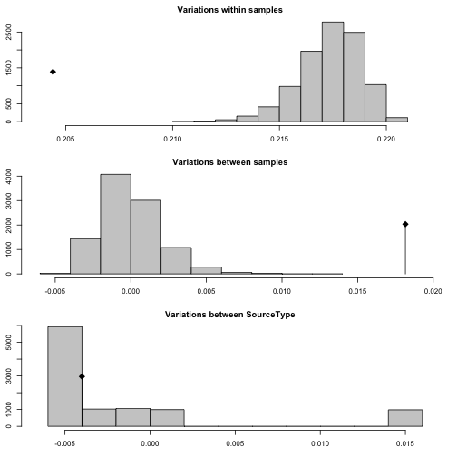

```r
library("tidyverse")
library("poppr")
(load("data/sclerotinia_16_loci.rda"))
```

```
## [1] "dat"            "dat11"          "datdf"          "keeploci"      
## [5] "corrected_loci"
```

# Purpose

The white mold nursery populations are unique because they are not fungicide
treated and have the same cultivars planted in them year after year.

The question becomes, are white mold nurseries differentiated from each other or
are they more or less homogeneous? We could use AMOVA to test for these with
location and binary source (wmn or non-wmn) as the hierarchy.


# Data Setup

First, we want to clone-correct our data down to the field level so that we
don't accidentally include non-independent samples.


```r
dat11
```

```
## 
## This is a genclone object
## -------------------------
## Genotype information:
## 
##    165 original multilocus genotypes 
##    366 haploid individuals
##     11 codominant loci
## 
## Population information:
## 
##      5 strata - MCG, Region, Source, Year, Host
##     14 populations defined - NE, NY, MN, ..., France, Mexico, ND
```

```r
dat11cc <- clonecorrect(dat11, ~Region/Source/Host/Year)
dat11cc
```

```
## 
## This is a genclone object
## -------------------------
## Genotype information:
## 
##    165 original multilocus genotypes 
##    318 haploid individuals
##     11 codominant loci
## 
## Population information:
## 
##      5 strata - MCG, Region, Source, Year, Host
##     14 populations defined - NE, NY, MN, ..., France, Mexico, ND
```

```r
make_amova_table <- function(am, amt, samples = "Region"){
  tot <- nrow(am$results)
  res <- data.frame(list(am$results[-tot, c("Df", "Sum Sq")], 
                         Percent = am$componentsofcovariance[-tot, 2],
                         Pval    = rev(amt$pvalue), 
                         # Sigma   = rev(amt$)
                         Phi     = rev(am$statphi$Phi[-tot])))
  res <- as.matrix(res)
  colnames(res) <- c("d.f.", "Sum of Squares", "Percent variation", "P", 
                     "Phi statistic")
  names(dimnames(res)) <- c("levels", "statistic")
  rownames(res) <- gsub("samples", samples, rownames(res))
  return(res)
}

make_amova_printable <- function(amtab, amtabcc){
  am_array <- array(dim      = c(dim(amtab), 2),
                    dimnames = c(dimnames(amtab), 
                                 list(c("full", "clone-corrected"))))
  am_array[, , 1] <- amtab
  am_array[, , 2] <- amtabcc
  tabfun <- function(x){
    x <- paste0(paste0(signif(x, 3), collapse = " ("), ")")
    return(x)
  }
  res <- apply(am_array, c(1, 2), tabfun)
  return(res)
}
```

Now that we've done that, we should make a new variable in the strata that 
separates the white mold nurseries from the others. We'll call this stratum 
"Source Type".


```r
addStrata(dat11cc) <- strata(dat11cc) %>% 
  mutate(SourceType = forcats::fct_inorder(ifelse(Source == "wmn", "wmn", "other"))) %>%
  select(SourceType)
setPop(dat11cc) <- ~SourceType
dat11cc
```

```
## 
## This is a genclone object
## -------------------------
## Genotype information:
## 
##    165 original multilocus genotypes 
##    318 haploid individuals
##     11 codominant loci
## 
## Population information:
## 
##      6 strata - MCG, Region, Source, Year, Host, SourceType
##      2 populations defined - other, wmn
```

I can perform AMOVA on the newly defined variable using Bruvo's distance.


```r
other(dat11cc)$REPLEN
```

```
##   5-2(F)   5-3(F)   6-2(F)   7-2(F)   8-3(H)   9-2(F)  12-2(H)  17-3(H) 
##  2.00000  4.00000  5.99999  2.00000  2.00000  2.00000  2.00000  3.00000 
##  20-3(F)  36-4(F)  50-4(F)  55-4(F)  92-4(F) 106-4(H) 110-4(H) 114-4(H) 
##  2.00000  4.00000  4.00000  4.00000  2.00000  4.00000  3.99999  4.00000
```

```r
bd <- bruvo.dist(dat11cc, replen = other(dat11cc)$REPLEN)
(ssc_amova <- poppr.amova(dat11cc, ~SourceType, dist = bd, quiet = TRUE))
```

```
## $call
## ade4::amova(samples = xtab, distances = xdist, structures = xstruct)
## 
## $results
##                  Df     Sum Sq   Mean Sq
## Between samples   1  0.8969901 0.8969901
## Within samples  316 68.7005529 0.2174068
## Total           317 69.5975430 0.2195506
## 
## $componentsofcovariance
##                                   Sigma          %
## Variations  Between samples 0.004391536   1.979968
## Variations  Within samples  0.217406813  98.020032
## Total variations            0.221798349 100.000000
## 
## $statphi
##                          Phi
## Phi-samples-total 0.01979968
```

```r
ssc_amova_test <- randtest(ssc_amova, nrepet = 999)
plot(ssc_amova_test)
```


```r
ssc_amova_test
```

```
## Monte-Carlo test
## Call: as.randtest(sim = res, obs = sigma[1])
## 
## Observation: 0.004391536 
## 
## Based on 999 replicates
## Simulated p-value: 0.002 
## Alternative hypothesis: greater 
## 
##       Std.Obs   Expectation      Variance 
##  7.983543e+00 -3.349763e-05  3.072146e-07
```


This result is telling us that there is some subdivision between white mold
nurseries and non-white mold nurseries. Of course, from previous analyses, we
know that Mexico is differentiated from other populations, so what happens if we
account for Region? Here, we are placing region lower in the heirarchy because
we specifically want to test the effect of region on the differentiation between
white mold nurseries within different regions.


```r
ssc_amova_region <- poppr.amova(dat11cc, ~SourceType/Region, dist = bd, quiet = TRUE)
ssc_amova_region_test <- randtest(ssc_amova_region, nrepet = 9999)
plot(ssc_amova_region_test)
```


```r
(ssc_amova_table <- make_amova_table(ssc_amova_region, ssc_amova_region_test))
```

```
##                                   statistic
## levels                             d.f. Sum of Squares Percent variation
##   Between SourceType                  1      0.8969901        -0.1583345
##   Between Region Within SourceType   20     12.0338468        13.7964379
##   Within Region                     296     56.6667061        86.3618966
##                                   statistic
## levels                                  P Phi statistic
##   Between SourceType               0.2885  -0.001583345
##   Between Region Within SourceType 0.0001   0.137746279
##   Within Region                    0.0001   0.136381034
```

Okay! This shows that when we account for Region after accounting for Source
Type, we find that the differentiation is coming mainly from the Regions. What
happens when we remove Mexico?


```r
datnomex <- setPop(dat11cc, ~Region) %>% popsub(blacklist = "Mexico")
bdnm     <- bruvo.dist(datnomex, replen = other(datnomex)$REPLEN)
ssc_amova_nm <- poppr.amova(datnomex, ~SourceType/Region, dist = bdnm, quiet = TRUE)
ssc_amova_nm_test <- randtest(ssc_amova_nm, nrepet = 9999)
plot(ssc_amova_nm_test)
```


```r
(ssc_amova_nm_table <- make_amova_table(ssc_amova_nm, ssc_amova_nm_test))
```

```
##                                   statistic
## levels                             d.f. Sum of Squares Percent variation
##   Between SourceType                  1      0.7527864          0.115560
##   Between Region Within SourceType   19      8.9146924          9.534715
##   Within Region                     282     55.0854125         90.349725
##                                   statistic
## levels                                  P Phi statistic
##   Between SourceType               0.2777    0.00115560
##   Between Region Within SourceType 0.0001    0.09545746
##   Within Region                    0.0001    0.09650275
```

When we remove the Mexican isolates (which only contained white mold nurseries
and shared no genotypes), we see that indeed, the degree of differentiation
went down.  Of course, if we look at the distribution of isolates between white
mold nurseries and regions, we can see things are a bit lopsided:


```r
table(strata(dat11cc, ~SourceType/Region, combine = FALSE))
```

```
##           Region
## SourceType NE NY MN MI OR WA CO WI ID Australia CA France Mexico ND
##      other 13  1  0 18  2 23 33  2  1         2  0      4      0 34
##      wmn   24  0  9 40 15 35  1  0  0         4 18     17     15  7
```

The only regions that have at least ten samples in both white mold nurseries and
production regions are NE, WA, and MI. We can see what happens when we subsample
to these


```r
datnewami <- setPop(dat11cc, ~Region) %>% popsub(sublist = c("NE", "WA", "MI"))
bdnewami     <- bruvo.dist(datnewami, replen = other(datnewami)$REPLEN)
ssc_amova_newami <- poppr.amova(datnewami, ~SourceType/Region, dist = bdnewami, quiet = TRUE)
ssc_amova_newami_test <- randtest(ssc_amova_newami, nrepet = 9999)
plot(ssc_amova_newami_test)
```



```r
(ssc_amova_newami_table <- make_amova_table(ssc_amova_newami, ssc_amova_newami_test))
```

```
##                                   statistic
## levels                             d.f. Sum of Squares Percent variation
##   Between SourceType                  1      0.3672025         -1.831835
##   Between Region Within SourceType    4      2.6285603          8.309128
##   Within Region                     147     30.0470395         93.522707
##                                   statistic
## levels                                  P Phi statistic
##   Between SourceType               0.3960   -0.01831835
##   Between Region Within SourceType 0.0001    0.08159657
##   Within Region                    0.0001    0.06477293
```


```r
make_amova_printable(ssc_amova_table, ssc_amova_newami_table) %>%  
  as_tibble() %>%
  add_column(Hierarchy = c("Between Source", "Between Region within Source", "Within Region"), .before = 1) %>%
  readr::write_csv(path = file.path(PROJHOME, "results", "tables", "AMOVA-region.csv"), col_names = TRUE) %>%
  rename(ps = `Phi statistic`) %>%
  mutate(ps = gsub("0\\.00(\\d{1})(\\d{2})", "\\1.\\2e^-3^", ps)) %>%
  mutate(ps = case_when(Hierarchy == "Between Source" ~ ps, TRUE ~ paste0("**", ps, "**"))) %>%
  rename(`$\\Phi statistic$` = ps) %>%
  rename(`% variation` = `Percent variation`) %>%
  rename(S.S. = `Sum of Squares`) %>%
  select(-P) %>%
  huxtable::as_huxtable(add_colnames = TRUE) %>% 
  huxtable::set_col_width(c(1.1, 0.6, 0.8, 0.8, 1.1)) %>% 
  huxtable::set_align(huxtable::everywhere, 2:5, "center") %>% 
  huxtable::print_md(max_width = 90) 
```

```
-----------------------------------------------------------------------------------
 Hierarchy               d.f.        S.S.       % variation     $\Phi statistic$   
---------------------- --------- ------------- -------------- ---------------------
 Between Source          1 (1)   0.897 (0.367) -0.158 (-1.83) -1.58e^-3^ (-0.0183) 
                                                                                   
 Between Region within  20 (4)     12 (2.63)    13.8 (8.31)    **0.138 (0.0816)**  
 Source                                                                            
                                                                                   
 Within Region         296 (147)   56.7 (30)    86.4 (93.5)    **0.136 (0.0648)**  
-----------------------------------------------------------------------------------
```


## Visualizing the partitions

We can visualize the partitions if we create distributions showing the genetic
distance.


```r
wmn_inds <- (setPop(dat11cc, ~SourceType) %>% pop()) == "wmn"

# Function to set the upper triangle to NA to avoid over-representation.
set_upper_tri_NA <- function(d){d[upper.tri(d)] <- NA; diag(d) <- NA; d}

# dist data converted to matrix fed into here. Removes NAs from previous function
tidy_dist <- . %>%
  as.data.frame() %>% 
  rownames_to_column("from") %>% 
  gather(to, distance, -from) %>% 
  filter(!is.na(distance))
wmn_distance   <- as.matrix(bd)[wmn_inds, wmn_inds] %>% set_upper_tri_NA() %>% tidy_dist
nwmn_distance  <- as.matrix(bd)[!wmn_inds, !wmn_inds] %>% set_upper_tri_NA() %>% tidy_dist
inter_distance <- as.matrix(bd)[wmn_inds, !wmn_inds] %>% tidy_dist

dists <- bind_rows(`White Mold Nurseries` = wmn_distance, 
                   `Between` = inter_distance,
                   `Other Sources` = nwmn_distance, 
                   .id = "Comparison") %>%
  mutate(Comparison = forcats::fct_inorder(Comparison)) %>%
  as_tibble()
dists
```

```
## # A tibble: 50,403 x 4
##              Comparison  from    to   distance
##                  <fctr> <chr> <chr>      <dbl>
##  1 White Mold Nurseries   445   444 0.00000000
##  2 White Mold Nurseries   446   444 0.30681818
##  3 White Mold Nurseries   447   444 0.26136364
##  4 White Mold Nurseries   448   444 0.37500000
##  5 White Mold Nurseries   449   444 0.31818182
##  6 White Mold Nurseries   450   444 0.22727273
##  7 White Mold Nurseries   451   444 0.09090909
##  8 White Mold Nurseries   452   444 0.18181818
##  9 White Mold Nurseries   453   444 0.00000000
## 10 White Mold Nurseries   454   444 0.09090909
## # ... with 50,393 more rows
```

```r
ggplot(dists, aes(y = distance, x = Comparison, fill = Comparison)) +
  geom_violin() +
  geom_boxplot(width = 0.25) +
  scale_fill_manual(values =  c(`Other Sources` = "grey35", `White Mold Nurseries` = "grey95", Between = "grey65")) +
  scale_color_manual(values = c(`Other Sources` = "grey35", `White Mold Nurseries` = "grey95", Between = "grey65")) +
  theme_bw(base_size = 16, base_family = "Helvetica") +
  theme(aspect.ratio = 1/2) +
  theme(legend.position = "none") +
  theme(axis.title.x = element_blank()) +
  theme(axis.text = element_text(color = "black")) +
  theme(panel.grid.major = element_line(colour = "grey20")) +
  theme(panel.grid.minor = element_line(colour = "grey50")) +
  theme(panel.grid.major.x = element_blank()) +
  theme(panel.border = element_blank()) +
  ylab("Bruvo's Distance")
```


```r
summary_dists <- dists %>% 
  group_by(Comparison) %>% 
  summarize(`Average Distance` = mean(distance),
            `Standard Deviation` = sd(distance)) 
knitr::kable(summary_dists, digits = 3)
```


|Comparison           | Average Distance| Standard Deviation|
|:--------------------|----------------:|------------------:|
|White Mold Nurseries |            0.453|              0.139|
|Between              |            0.440|              0.148|
|Other Sources        |            0.410|              0.165|

On first look, it appears that there's not much difference. Looking at the
table, we can see that the average distance within White Mold Nurseries is 
0.453, whereas the average distance within Other
Sources is 0.41. This is well within the standard
deviation for both distributions, but we also recognize that a single step of
Bruvo's distance for 11 loci in a haploid organism is 0.045.


## WMN DAPC

DAPC is a nice way of visualizing these. First, I'm simply going to compare 
between white mold nurseries and others:


```r
filter <- strata(dat11cc) %>%
  group_by(Region) %>%
  mutate(filter = length(unique(SourceType)) > 1) %>%
  pull(filter)
wmn_compare <- dat11cc[filter]
set.seed(2017-07-12)
wmndapc <- xvalDapc(tab(wmn_compare), pop(wmn_compare), n.rep = 200, n.pca = 1:10)
```


```r
wmndapc$DAPC
```

```
## 	#################################################
## 	# Discriminant Analysis of Principal Components #
## 	#################################################
## class: dapc
## $call: dapc.data.frame(x = as.data.frame(x), grp = ..1, n.pca = ..2, 
##     n.da = ..3)
## 
## $n.pca: 3 first PCs of PCA used
## $n.da: 1 discriminant functions saved
## $var (proportion of conserved variance): 0.423
## 
## $eig (eigenvalues): 15.52  vector    length content                   
## 1 $eig      1      eigenvalues               
## 2 $grp      272    prior group assignment    
## 3 $prior    2      prior group probabilities 
## 4 $assign   272    posterior group assignment
## 5 $pca.cent 69     centring vector of PCA    
## 6 $pca.norm 69     scaling vector of PCA     
## 7 $pca.eig  58     eigenvalues of PCA        
## 
##   data.frame    nrow ncol
## 1 $tab          272  3   
## 2 $means        2    3   
## 3 $loadings     3    1   
## 4 $ind.coord    272  1   
## 5 $grp.coord    2    1   
## 6 $posterior    272  2   
## 7 $pca.loadings 69   3   
## 8 $var.contr    69   1   
##   content                                          
## 1 retained PCs of PCA                              
## 2 group means                                      
## 3 loadings of variables                            
## 4 coordinates of individuals (principal components)
## 5 coordinates of groups                            
## 6 posterior membership probabilities               
## 7 PCA loadings of original variables               
## 8 contribution of original variables
```

```r
scatter(wmndapc$DAPC)
```


```r
(wmntab <- table(wmndapc$DAPC$assign, wmndapc$DAPC$grp))
```

```
##        
##         other wmn
##   other    73  40
##   wmn      56 103
```

```r
chisq.test(wmntab, simulate.p.value = TRUE)
```

```
## 
## 	Pearson's Chi-squared test with simulated p-value (based on 2000
## 	replicates)
## 
## data:  wmntab
## X-squared = 22.87, df = NA, p-value = 0.0004998
```

Okay, this shows that there's quite a bit of overlap between these two. What
happens if I look at the DAPC when it includes the pouplation groupings. Mainly,
I want to know if the white mold nurseries can be compared while considering the
pouplations


```r
set.seed(2017-07-12)
wmndapc <- xvalDapc(tab(wmn_compare), strata(wmn_compare, ~SourceType/Region)[[2]], 
                    n.pca = 5:20, n.rep = 100)$DAPC
```

```
## Warning in xvalDapc.matrix(tab(wmn_compare), strata(wmn_compare,
## ~SourceType/Region)[[2]], : 1 group has only 1 member so it cannot be
## represented in both training and validation sets.
```


```r
scatter(wmndapc)
```


```r
LDS <- bind_cols(Population = wmndapc$grp, as.data.frame(wmndapc$ind.coord)) %>%
  as_tibble()
LDS_pop <- LDS %>% 
  group_by(Population) %>% 
  summarize_all(mean) %>%
  rename_all(function(x) gsub("LD", "mean", x))
LDS <- full_join(LDS, LDS_pop) %>%
  separate(Population, c("SourceType", "Pop"), remove = FALSE) 
```

```
## Joining, by = "Population"
```

```r
LDS_PLOT <- ggplot(LDS, aes(x = LD1, y = LD2, color = SourceType)) + 
  geom_point(aes(fill = SourceType), alpha = 0.5, pch = 21, color = "black") +
  geom_segment(aes(x = mean1, y = mean2, xend = LD1, yend = LD2), alpha = 0.5) +
  stat_ellipse(type = "norm", level = 0.66, alpha = 0.75) + 
  # ggrepel::geom_label_repel(aes(x = mean1, y = mean2, label = Population), 
  #                           data = LDS_pop, show.legend = FALSE, color = "black") +
  theme_bw() +  
  theme(aspect.ratio = 1/1.618) +
  theme(legend.position = "bottom") +
  theme(axis.text = element_blank()) + 
  theme(axis.title = element_blank()) + 
  theme(axis.ticks = element_blank()) + 
  viridis::scale_color_viridis(discrete = TRUE, direction = -1) +
  viridis::scale_fill_viridis(discrete = TRUE, direction = -1) +
  scale_y_continuous(breaks = 0) + 
  scale_x_continuous(breaks = 0) + 
  theme(panel.background = element_rect(fill = "grey95")) +
  theme(panel.grid.major = element_line(color = "black"))

LDS_PLOT + facet_wrap(~Pop, ncol = 3)
```

```
## Too few points to calculate an ellipse
```

```
## Too few points to calculate an ellipse
## Too few points to calculate an ellipse
```

```
## Warning: Removed 1 rows containing missing values (geom_path).
```


# Host differentiation

There are three main hosts shared within the white mold nurseries: 

| Cultivar | Susceptibility |
| ----- | ---- |
| Beryl | Susceptible |
| Bunsi | ? |
| G122  | Some Resistance |

These hosts are grown in the nurseries at different times and it is of interest
if cultivar can have an effect on population structure. Given the results of
Aldrich-Wolfe 2015, I would suspect that cultivar has no effect, but it's
important to verify this. We are going to use AMOVA and DAPC for this.


```r
bebug <- dat11cc %>% 
  setPop(~Source) %>% 
  popsub("wmn") %>% 
  setPop(~Host) %>% 
  popsub(c("Beryl", "Bunsi", "G122"))
bebugd <- bruvo.dist(bebug, replen = other(bebug)$REPLEN)
(ssc_host_amova <- poppr.amova(bebug, ~Host, dist = bebugd, quiet = TRUE))
```

```
## $call
## ade4::amova(samples = xtab, distances = xdist, structures = xstruct)
## 
## $results
##                  Df     Sum Sq   Mean Sq
## Between samples   2  0.2965933 0.1482967
## Within samples  154 35.1688676 0.2283693
## Total           156 35.4654609 0.2273427
## 
## $componentsofcovariance
##                                   Sigma           %
## Variations  Between samples -0.00153422  -0.6763594
## Variations  Within samples   0.22836927 100.6763594
## Total variations             0.22683505 100.0000000
## 
## $statphi
##                            Phi
## Phi-samples-total -0.006763594
```

```r
(ssc_host_amova <- poppr.amova(bebug, ~Host/Region, dist = bebugd, quiet = TRUE))
```

```
## $call
## ade4::amova(samples = xtab, distances = xdist, structures = xstruct)
## 
## $results
##                              Df     Sum Sq   Mean Sq
## Between Host                  2  0.2965933 0.1482967
## Between samples Within Host  27 11.2172536 0.4154538
## Within samples              127 23.9516140 0.1885954
## Total                       156 35.4654609 0.2273427
## 
## $componentsofcovariance
##                                               Sigma          %
## Variations  Between Host                -0.00648971  -2.861074
## Variations  Between samples Within Host  0.04472212  19.716331
## Variations  Within samples               0.18859539  83.144743
## Total variations                         0.22682779 100.000000
## 
## $statphi
##                           Phi
## Phi-samples-total  0.16855257
## Phi-samples-Host   0.19167923
## Phi-Host-total    -0.02861074
```

The AMOVA makes it clear that there's no differentiation between hosts. Let's
see what DAPC shows us.


```r
setPop(bebug) <- ~Host
bebug_dapc <- dapc(bebug, n.pca = 20, n.da = 2)
scatter(bebug_dapc, #clabel = 0,
        legend = TRUE,
        scree.pca = TRUE, 
        scree.da = TRUE,
        col = viridis::plasma(3, end = 0.85),
        bg.inset = "grey90",
        bg = "grey90")
```


```r
ggcompoplot::ggcompoplot(bebug_dapc, setPop(bebug, ~Region), cols = 5, pal = viridis::plasma(3, end = 0.85)) +
  theme(legend.position = "top")
```


```r
apply(bebug_dapc$posterior, 2, mean)
```

```
##      G122     Beryl     Bunsi 
## 0.3397300 0.3594735 0.3007965
```


```r
setPop(bebug) <- ~Host/Region
bebug_dapc <- dapc(bebug, n.pca = 20, n.da = 20)
bebug_dapc
```

```
## 	#################################################
## 	# Discriminant Analysis of Principal Components #
## 	#################################################
## class: dapc
## $call: dapc.genind(x = bebug, n.pca = 20, n.da = 20)
## 
## $n.pca: 20 first PCs of PCA used
## $n.da: 20 discriminant functions saved
## $var (proportion of conserved variance): 0.887
## 
## $eig (eigenvalues): 31.72 7.385 5.33 4.425 4.026 ...
## 
##   vector    length content                   
## 1 $eig      20     eigenvalues               
## 2 $grp      157    prior group assignment    
## 3 $prior    30     prior group probabilities 
## 4 $assign   157    posterior group assignment
## 5 $pca.cent 66     centring vector of PCA    
## 6 $pca.norm 66     scaling vector of PCA     
## 7 $pca.eig  54     eigenvalues of PCA        
## 
##   data.frame    nrow ncol
## 1 $tab          157  20  
## 2 $means        30   20  
## 3 $loadings     20   20  
## 4 $ind.coord    157  20  
## 5 $grp.coord    30   20  
## 6 $posterior    157  30  
## 7 $pca.loadings 66   20  
## 8 $var.contr    66   20  
##   content                                          
## 1 retained PCs of PCA                              
## 2 group means                                      
## 3 loadings of variables                            
## 4 coordinates of individuals (principal components)
## 5 coordinates of groups                            
## 6 posterior membership probabilities               
## 7 PCA loadings of original variables               
## 8 contribution of original variables
```


```r
LDS <- bind_cols(Population = bebug_dapc$grp, as.data.frame(bebug_dapc$ind.coord)) %>%
  as_tibble()
LDS_pop <- LDS %>% 
  group_by(Population) %>% 
  summarize_all(mean) %>%
  rename_all(function(x) gsub("LD", "mean", x))
LDS <- full_join(LDS, LDS_pop, by = "Population") %>% separate(Population, c("Cultivar", "Population"))
LDS_PLOT <- ggplot(LDS, aes(x = LD1, y = LD2, color = Cultivar)) + 
  geom_point(aes(fill = Cultivar), alpha = 0.5, pch = 21, color = "black") +
  geom_segment(aes(x = mean1, y = mean2, xend = LD1, yend = LD2), alpha = 0.5) +
  stat_ellipse(type = "norm", level = 0.66, alpha = 0.75) + 
  theme_bw(base_size = 16, base_family = "Helvetica") +  
  theme(aspect.ratio = 1/1.618) +
  theme(legend.position = "bottom") +
  theme(axis.text = element_blank()) + 
  theme(axis.title = element_blank()) + 
  theme(axis.ticks = element_blank()) + 
  viridis::scale_color_viridis(option = "B", discrete = TRUE, direction = -1, end = 0.85) +
  viridis::scale_fill_viridis(option = "B", discrete = TRUE, direction = -1, end = 0.85) +
  scale_y_continuous(breaks = 0) + 
  scale_x_continuous(breaks = 0) + 
  theme(panel.background = element_rect(fill = "grey95")) +
  theme(panel.grid.major = element_line(color = "black")) +
  facet_wrap(~Population, nrow = 2)
LDS_PLOT
```

```
## Too few points to calculate an ellipse
## Too few points to calculate an ellipse
## Too few points to calculate an ellipse
## Too few points to calculate an ellipse
## Too few points to calculate an ellipse
## Too few points to calculate an ellipse
## Too few points to calculate an ellipse
## Too few points to calculate an ellipse
## Too few points to calculate an ellipse
```

```
## Warning: Removed 3 rows containing missing values (geom_path).
```

```
## geom_path: Each group consists of only one observation. Do you need to
## adjust the group aesthetic?
```


<details>
<summary>Session Information</summary>


```
## Session info --------------------------------------------------------------------------------------
```

```
##  setting  value                       
##  version  R version 3.4.2 (2017-09-28)
##  system   x86_64, linux-gnu           
##  ui       X11                         
##  language (EN)                        
##  collate  en_US.UTF-8                 
##  tz       UTC                         
##  date     2017-12-07
```

```
## Packages ------------------------------------------------------------------------------------------
```

```
##  package     * version date       source                              
##  ade4        * 1.7-8   2017-08-09 cran (@1.7-8)                       
##  adegenet    * 2.1.0   2017-10-12 cran (@2.1.0)                       
##  ape           5.0     2017-10-30 cran (@5.0)                         
##  assertr       2.0.2.2 2017-06-06 cran (@2.0.2.2)                     
##  assertthat    0.2.0   2017-04-11 CRAN (R 3.4.2)                      
##  base        * 3.4.2   2017-12-01 local                               
##  bindr         0.1     2016-11-13 CRAN (R 3.4.2)                      
##  bindrcpp    * 0.2     2017-06-17 CRAN (R 3.4.2)                      
##  boot          1.3-20  2017-07-30 cran (@1.3-20)                      
##  broom         0.4.3   2017-11-20 CRAN (R 3.4.2)                      
##  cellranger    1.1.0   2016-07-27 CRAN (R 3.4.2)                      
##  cli           1.0.0   2017-11-05 CRAN (R 3.4.2)                      
##  cluster       2.0.6   2017-03-16 CRAN (R 3.4.2)                      
##  coda          0.19-1  2016-12-08 cran (@0.19-1)                      
##  codetools     0.2-15  2016-10-05 CRAN (R 3.4.2)                      
##  colorspace    1.3-2   2016-12-14 CRAN (R 3.4.2)                      
##  compiler      3.4.2   2017-12-01 local                               
##  cowplot     * 0.9.1   2017-11-16 cran (@0.9.1)                       
##  crayon        1.3.4   2017-09-16 CRAN (R 3.4.2)                      
##  datasets    * 3.4.2   2017-12-01 local                               
##  deldir        0.1-14  2017-04-22 cran (@0.1-14)                      
##  devtools      1.13.4  2017-11-09 CRAN (R 3.4.2)                      
##  digest        0.6.12  2017-01-27 CRAN (R 3.4.2)                      
##  dplyr       * 0.7.4   2017-09-28 CRAN (R 3.4.2)                      
##  evaluate      0.10.1  2017-06-24 CRAN (R 3.4.2)                      
##  expm          0.999-2 2017-03-29 cran (@0.999-2)                     
##  ezknitr       0.6     2016-09-16 cran (@0.6)                         
##  fastmatch     1.1-0   2017-01-28 cran (@1.1-0)                       
##  forcats     * 0.2.0   2017-01-23 CRAN (R 3.4.2)                      
##  foreign       0.8-69  2017-06-21 CRAN (R 3.4.2)                      
##  gdata         2.18.0  2017-06-06 cran (@2.18.0)                      
##  ggcompoplot * 0.1.0   2017-12-07 Github (zkamvar/ggcompoplot@bcf007d)
##  ggforce       0.1.1   2016-11-28 cran (@0.1.1)                       
##  ggplot2     * 2.2.1   2016-12-30 CRAN (R 3.4.2)                      
##  ggraph      * 1.0.0   2017-02-24 cran (@1.0.0)                       
##  ggrepel       0.7.0   2017-09-29 cran (@0.7.0)                       
##  glue          1.2.0   2017-10-29 CRAN (R 3.4.2)                      
##  gmodels       2.16.2  2015-07-22 cran (@2.16.2)                      
##  graphics    * 3.4.2   2017-12-01 local                               
##  grDevices   * 3.4.2   2017-12-01 local                               
##  grid          3.4.2   2017-12-01 local                               
##  gridExtra     2.3     2017-09-09 CRAN (R 3.4.2)                      
##  gtable        0.2.0   2016-02-26 CRAN (R 3.4.2)                      
##  gtools        3.5.0   2015-05-29 cran (@3.5.0)                       
##  haven         1.1.0   2017-07-09 CRAN (R 3.4.2)                      
##  highr         0.6     2016-05-09 CRAN (R 3.4.2)                      
##  hms           0.4.0   2017-11-23 CRAN (R 3.4.2)                      
##  htmltools     0.3.6   2017-04-28 CRAN (R 3.4.2)                      
##  htmlwidgets   0.9     2017-07-10 CRAN (R 3.4.2)                      
##  httpuv        1.3.5   2017-07-04 CRAN (R 3.4.2)                      
##  httr          1.3.1   2017-08-20 CRAN (R 3.4.2)                      
##  huxtable      1.1.0   2017-10-20 cran (@1.1.0)                       
##  igraph      * 1.1.2   2017-07-21 CRAN (R 3.4.2)                      
##  jsonlite      1.5     2017-06-01 CRAN (R 3.4.2)                      
##  KernSmooth    2.23-15 2015-06-29 cran (@2.23-15)                     
##  knitr       * 1.17    2017-08-10 CRAN (R 3.4.2)                      
##  labeling      0.3     2014-08-23 CRAN (R 3.4.2)                      
##  lattice       0.20-35 2017-03-25 CRAN (R 3.4.2)                      
##  lazyeval      0.2.1   2017-10-29 CRAN (R 3.4.2)                      
##  LearnBayes    2.15    2014-05-29 cran (@2.15)                        
##  lubridate     1.7.1   2017-11-03 CRAN (R 3.4.2)                      
##  magrittr      1.5     2014-11-22 CRAN (R 3.4.2)                      
##  MASS          7.3-47  2017-04-21 CRAN (R 3.4.2)                      
##  Matrix        1.2-12  2017-11-16 CRAN (R 3.4.2)                      
##  memoise       1.1.0   2017-04-21 CRAN (R 3.4.2)                      
##  methods     * 3.4.2   2017-12-01 local                               
##  mgcv          1.8-22  2017-09-19 CRAN (R 3.4.2)                      
##  mime          0.5     2016-07-07 CRAN (R 3.4.2)                      
##  mnormt        1.5-5   2016-10-15 CRAN (R 3.4.2)                      
##  modelr        0.1.1   2017-07-24 CRAN (R 3.4.2)                      
##  munsell       0.4.3   2016-02-13 CRAN (R 3.4.2)                      
##  nlme          3.1-131 2017-02-06 CRAN (R 3.4.2)                      
##  parallel      3.4.2   2017-12-01 local                               
##  pegas         0.10    2017-05-03 cran (@0.10)                        
##  permute       0.9-4   2016-09-09 cran (@0.9-4)                       
##  phangorn      2.3.1   2017-11-01 cran (@2.3.1)                       
##  pkgconfig     2.0.1   2017-03-21 CRAN (R 3.4.2)                      
##  plyr          1.8.4   2016-06-08 CRAN (R 3.4.2)                      
##  poppr       * 2.5.0   2017-09-11 cran (@2.5.0)                       
##  psych         1.7.8   2017-09-09 CRAN (R 3.4.2)                      
##  purrr       * 0.2.4   2017-10-18 CRAN (R 3.4.2)                      
##  quadprog      1.5-5   2013-04-17 cran (@1.5-5)                       
##  R.methodsS3   1.7.1   2016-02-16 cran (@1.7.1)                       
##  R.oo          1.21.0  2016-11-01 cran (@1.21.0)                      
##  R.utils       2.6.0   2017-11-05 cran (@2.6.0)                       
##  R6            2.2.2   2017-06-17 CRAN (R 3.4.2)                      
##  Rcpp          0.12.14 2017-11-23 CRAN (R 3.4.2)                      
##  readr       * 1.1.1   2017-05-16 CRAN (R 3.4.2)                      
##  readxl        1.0.0   2017-04-18 CRAN (R 3.4.2)                      
##  reshape2      1.4.2   2016-10-22 CRAN (R 3.4.2)                      
##  rlang         0.1.4   2017-11-05 CRAN (R 3.4.2)                      
##  rstudioapi    0.7     2017-09-07 CRAN (R 3.4.2)                      
##  rvest         0.3.2   2016-06-17 CRAN (R 3.4.2)                      
##  scales        0.5.0   2017-08-24 CRAN (R 3.4.2)                      
##  seqinr        3.4-5   2017-08-01 cran (@3.4-5)                       
##  shiny         1.0.5   2017-08-23 CRAN (R 3.4.2)                      
##  sp            1.2-5   2017-06-29 CRAN (R 3.4.2)                      
##  spData        0.2.6.7 2017-11-28 cran (@0.2.6.7)                     
##  spdep         0.7-4   2017-11-22 cran (@0.7-4)                       
##  splines       3.4.2   2017-12-01 local                               
##  stats       * 3.4.2   2017-12-01 local                               
##  stringi       1.1.6   2017-11-17 CRAN (R 3.4.2)                      
##  stringr     * 1.2.0   2017-02-18 CRAN (R 3.4.2)                      
##  tibble      * 1.3.4   2017-08-22 CRAN (R 3.4.2)                      
##  tidyr       * 0.7.2   2017-10-16 CRAN (R 3.4.2)                      
##  tidyselect    0.2.3   2017-11-06 CRAN (R 3.4.2)                      
##  tidyverse   * 1.2.1   2017-11-14 CRAN (R 3.4.2)                      
##  tools         3.4.2   2017-12-01 local                               
##  tweenr        0.1.5   2016-10-10 cran (@0.1.5)                       
##  udunits2      0.13    2016-11-17 cran (@0.13)                        
##  units         0.4-6   2017-08-27 cran (@0.4-6)                       
##  utils       * 3.4.2   2017-12-01 local                               
##  vegan         2.4-4   2017-08-24 cran (@2.4-4)                       
##  viridis     * 0.4.0   2017-03-27 CRAN (R 3.4.2)                      
##  viridisLite * 0.2.0   2017-03-24 CRAN (R 3.4.2)                      
##  visNetwork  * 2.0.1   2017-07-30 cran (@2.0.1)                       
##  withr         2.1.0   2017-11-01 CRAN (R 3.4.2)                      
##  xml2          1.1.1   2017-01-24 CRAN (R 3.4.2)                      
##  xtable        1.8-2   2016-02-05 CRAN (R 3.4.2)
```

</details>
